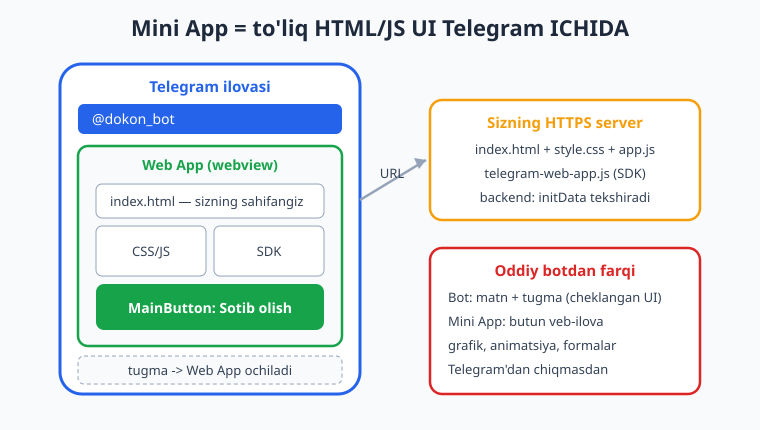
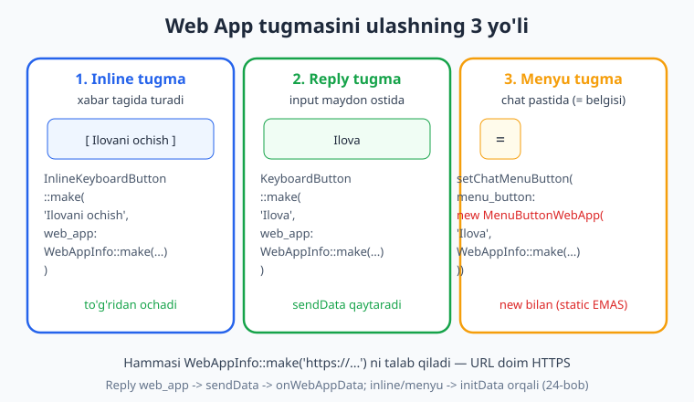
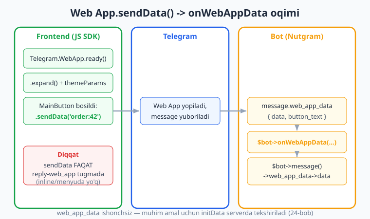

# 23 — Telegram Web App (Mini App) asoslari

[⬅️ Oldingi: 22 — Majburiy obuna](./22-majburiy-obuna.md) · [🏠 README](./README.md) · [Keyingi: 24 — Web App xavfsizligi: initData ➡️](./24-webapp-xavfsizlik.md)

---

> **Bu bobda:** botimizni matn va tugmalardan tashqariga olib chiqamiz — **Telegram Web App** (yoki **Mini App**) bilan tanishamiz. Bu — Telegram ilovasidan chiqmasdan ochiladigan **to'liq HTML/JS veb-ilova**: grafik, formalar, animatsiya, hamma narsa. Avval Mini App nima ekanini va nega kerakligini ko'ramiz, keyin uni ochuvchi tugmani **uch xil yo'l** bilan ulashni o'rganamiz — **inline** tugma (`InlineKeyboardButton::make(..., web_app: WebAppInfo::make(...))`), **reply** tugma (`KeyboardButton::make(..., web_app: ...)`) va **menyu tugma** (`setChatMenuButton(...)` orqali — `MenuButtonWebApp` `new` bilan quriladi, static `make` emas). So'ngra frontend tomonidagi **`telegram-web-app.js` JS SDK** bilan tanishamiz: `ready()`, `expand()`, `themeParams`, `MainButton`, `BackButton`, `HapticFeedback`, `close()`, `initData`. Va nihoyat **reply-web_app** tugmasidan `sendData()` qilinganda bot tomonda `onWebAppData` handleri qanday ushlanishini ko'ramiz. Bobdagi tugma qurish, menyu tugma sozlash va `onWebAppData` routing mantig'i offline `FakeNutgram` bilan **haqiqatan tekshirilgan** (11 ta tasdiq 0 xato bilan o'tdi). Frontend HTML/JS namunasi va Mini App'ning Telegram ichida **real ko'rinishi** — bu jonli qism, faqat illustrativ ko'rsatilgan (uni ko'rish uchun HTTPS hosting va haqiqiy qurilma kerak). Mini App'ning xavfsizligi (`initData` tekshirish) — [24-bob](./24-webapp-xavfsizlik.md), to'liq backend — [25-bob](./25-miniapp-backend.md) mavzusi.

---

## Mini App nima va nega kerak

Shu paytgacha bot bilan ikki narsa orqali muloqot qildik: **xabarlar** (matn, media) va **tugmalar** (reply/inline klaviatura). Bu kuchli, lekin cheklangan. Murakkab forma, jadval, kalendar, savat, real vaqtli o'yin yoki chiroyli dizaynli interfeysni faqat xabar va tugma bilan qurish noqulay — ba'zan deyarli imkonsiz.

**Telegram Web App** (rasman **Mini App** ham deyiladi) shu muammoni hal qiladi: u — sizning serveringizdagi oddiy **HTML/CSS/JS veb-sahifa**, lekin u brauzerda emas, balki **Telegram ilovasining ichida**, maxsus oynada (webview) ochiladi. Foydalanuvchi Telegram'dan chiqmaydi; u uchun bu xuddi botning bir qismidek tuyuladi.



Mini App'ning kuchi:

- **To'liq veb-ilova** — istalgan HTML/CSS/JS, framework (React, Vue, oddiy vanilla — farqi yo'q). Siz frontend dasturchi sifatida nima qila olsangiz, shuni Telegram ichida ko'rsatasiz.
- **Telegram bilan integratsiya** — maxsus JS SDK (`telegram-web-app.js`) orqali ilova foydalanuvchining tilini, mavzu ranglarini (qora/oq rejim), kim ochganini (`initData`) biladi va Telegram tugmalarini (pastdagi katta "MainButton") boshqaradi.
- **Foydalanuvchi tanish muhitda qoladi** — alohida brauzer ochilmaydi, login qilish shart emas (foydalanuvchi allaqachon Telegram'da).

Klassik misollar: do'kon kataloglari va savatlari, bron qilish kalendarlari, so'rovnomalar, "Hamster" uslubidagi clicker o'yinlar (kitobning kapston boyi — [26-bob](./26-kapston-clicker.md)).

**Eng muhim tushuncha:** Mini App ikki qismdan iborat. **Frontend** — bu sizning HTTPS serveringizdagi veb-sahifa (Telegram faqat uning URL'ini biladi). **Backend** — bu Telegram'dan kelgan ma'lumotni ([initData](./24-webapp-xavfsizlik.md)) tekshiruvchi va haqiqiy ishni bajaruvchi server kodi. Bot esa faqat **Mini App'ni ochuvchi tugmani** beradi. Shu bobda biz aynan **botning roli**ga — tugmani ulashga va `sendData` natijasini ushlashga — e'tibor qaratamiz; frontend va backend keyingi boblarda chuqurlashadi.

> **Eslatma:** Mini App URL'i **albatta HTTPS** bo'lishi shart (lokal `localhost` ham qabul qilinmaydi — pastda lokal sinash usulini ko'rsatamiz). Bu Telegram talabi.

---

## Mini App'ni ochuvchi tugmani ulashning 3 yo'li

Foydalanuvchi Mini App'ni ko'rishi uchun uni **biror joydan ochishi** kerak. Telegram uchta variant beradi va ularning hammasi `WebAppInfo` bilan ishlaydi.



`WebAppInfo` — bu shunchaki URL'ni o'rab beruvchi kichik obyekt:

```php
<?php
use SergiX44\Nutgram\Telegram\Types\WebApp\WebAppInfo;

$info = WebAppInfo::make('https://example.com/app'); // URL doim HTTPS
```

Endi uni qaerga ulashni ko'ramiz.

### 1-yo'l: Inline tugma

Eng ko'p ishlatiladigan usul. Xabar tagidagi inline tugma bosilganda Mini App **darhol** ochiladi. (Inline klaviatura — [06-bob](./06-klaviaturalar.md) mavzusi.)

```php
<?php
use SergiX44\Nutgram\Nutgram;
use SergiX44\Nutgram\Telegram\Types\Keyboard\InlineKeyboardMarkup;
use SergiX44\Nutgram\Telegram\Types\Keyboard\InlineKeyboardButton;
use SergiX44\Nutgram\Telegram\Types\WebApp\WebAppInfo;

$bot->onCommand('dokon', function (Nutgram $bot) {
    $keyboard = InlineKeyboardMarkup::make()
        ->addRow(
            InlineKeyboardButton::make(
                'Do\'konni ochish',
                web_app: WebAppInfo::make('https://example.com/shop'),
            ),
        );

    $bot->sendMessage('Bizning do\'konimiz:', reply_markup: $keyboard);
});
```

Inline `web_app` tugmasi **`callback_query` yubormaydi** — u faqat Mini App'ni ochadi. Diqqat: bunday tugmadan `sendData` **ishlamaydi** (sendData faqat reply-tugmada — pastda ko'ramiz). Inline orqali ochilgan Mini App bilan bog'lanish `initData` orqali, serverga to'g'ridan-to'g'ri so'rov bilan amalga oshadi ([24](./24-webapp-xavfsizlik.md)–[25](./25-miniapp-backend.md)-boblar).

### 2-yo'l: Reply tugma

Reply klaviaturadagi tugma ham Mini App'ni ocha oladi. Farqi shundaki, **faqat shu turdagi tugmadan** ilova `sendData()` orqali botga to'g'ridan-to'g'ri ma'lumot qaytara oladi (bu bobning oxirgi qismi).

```php
<?php
use SergiX44\Nutgram\Nutgram;
use SergiX44\Nutgram\Telegram\Types\Keyboard\ReplyKeyboardMarkup;
use SergiX44\Nutgram\Telegram\Types\Keyboard\KeyboardButton;
use SergiX44\Nutgram\Telegram\Types\WebApp\WebAppInfo;

$bot->onCommand('forma', function (Nutgram $bot) {
    $keyboard = ReplyKeyboardMarkup::make(resize_keyboard: true)
        ->addRow(
            KeyboardButton::make(
                'Formani to\'ldirish',
                web_app: WebAppInfo::make('https://example.com/form'),
            ),
        );

    $bot->sendMessage('Pastdagi tugma orqali formani oching:', reply_markup: $keyboard);
});
```

### 3-yo'l: Menyu tugma (`setChatMenuButton`)

Chatning pastki chap burchagidagi `=` (menyu) tugmasini Mini App'ni ochadigan qilib o'zgartirish mumkin. U doimo qo'l ostida turadi — foydalanuvchi xabar yozmasdan ham ilovani ochadi. Bu bot uchun **global** sozlama (yoki muayyan chat uchun `chat_id` bilan).

```php
<?php
use SergiX44\Nutgram\Nutgram;
use SergiX44\Nutgram\Telegram\Types\Command\MenuButtonWebApp;
use SergiX44\Nutgram\Telegram\Types\WebApp\WebAppInfo;

$bot->onCommand('menyu_ornat', function (Nutgram $bot) {
    $bot->setChatMenuButton(
        menu_button: new MenuButtonWebApp(
            'Ilovani ochish',
            WebAppInfo::make('https://example.com/app'),
        ),
    );

    $bot->sendMessage('Menyu tugmasi Mini App ochadigan qilib sozlandi.');
});
```

> **Diqqat — bu yerda tez-tez xato qilinadi:** Nutgram'dagi aksariyat tiplar `Type::make(...)` orqali quriladi (static). Lekin `MenuButtonWebApp` — **istisno**: uning `make()` metodi **static emas**, shuning uchun uni `MenuButtonWebApp::make(...)` deb chaqirib bo'lmaydi. To'g'ri yo'l — **`new MenuButtonWebApp($text, $webAppInfo)`**. Buni biz `ReflectionMethod` bilan tasdiqladik (pastdagi tekshiruv bo'limiga qarang).

`setChatMenuButton` argumentlari:

- `chat_id` — agar berilsa, faqat shu chatda; berilmasa, **barcha** shaxsiy chatlar uchun default menyu tugmasi o'zgaradi.
- `menu_button` — `MenuButtonWebApp` (Mini App), `MenuButtonCommands` (buyruqlar ro'yxati) yoki `MenuButtonDefault` (standart holatga qaytarish).

| Yo'l | Sinf / metod | `sendData` ishlaydimi? | Qachon | Qayerda turadi |
|---|---|---|---|---|
| Inline | `InlineKeyboardButton::make(web_app:)` | yo'q | aniq bir xabarga bog'liq harakat | xabar tagida |
| Reply | `KeyboardButton::make(web_app:)` | **ha** | ilova botga to'g'ridan ma'lumot qaytarsa | input maydon ostida |
| Menyu | `setChatMenuButton(new MenuButtonWebApp(...))` | yo'q | doimiy "bosh ilova" | chat pastida (`=`) |

---

## Frontend: `telegram-web-app.js` JS SDK

Mini App'ni Telegram bilan "gaplashadigan" qiladigan narsa — `telegram-web-app.js` skripti. Uni HTML'ingizning `<head>` qismiga **shu maxsus URL'dan** ulaysiz (o'zingiznikiga nusxalamang — Telegram doim yangilab turadi):

```html
<script src="https://telegram.org/js/telegram-web-app.js"></script>
```

Bu skript global `window.Telegram.WebApp` obyektini beradi. Eng muhim a'zolari:

| A'zo | Vazifasi |
|---|---|
| `ready()` | Ilova yuklandi deb Telegram'ga xabar beradi (yuklanish ekranini olib tashlaydi). **Birinchi navbatda chaqiring.** |
| `expand()` | Oynani to'liq balandlikka kengaytiradi (default — yarim ekran). |
| `themeParams` | Telegram mavzu ranglari (`bg_color`, `text_color`, `button_color` ...) — ilovani qora/oq rejimga moslash uchun. |
| `colorScheme` | `'light'` yoki `'dark'`. |
| `MainButton` | Pastdagi katta tugma: `setText()`, `show()`, `hide()`, `onClick()`, `showProgress()`. |
| `BackButton` | Yuqori chapdagi "orqaga" tugmasi: `show()`, `hide()`, `onClick()`. |
| `HapticFeedback` | Tebranish bilan javob: `impactOccurred('medium')`, `notificationOccurred('success')`. |
| `initData` / `initDataUnsafe` | Telegram bergan kirish ma'lumoti (kim ochgani, hash). **`initData` serverda tekshiriladi** — [24-bob](./24-webapp-xavfsizlik.md). |
| `sendData(str)` | Ma'lumotni botga qaytaradi va ilovani yopadi (faqat **reply**-web_app tugmasidan ochilganda). |
| `close()` | Mini App oynasini yopadi. |

Eng oddiy, ishlaydigan frontend namunasi (illustrativ — uni HTTPS serverga qo'yib, tugma orqali ochish kerak):

```html
<!DOCTYPE html>
<html lang="uz">
<head>
    <meta charset="utf-8">
    <meta name="viewport" content="width=device-width, initial-scale=1">
    <title>Mini App namuna</title>
    <script src="https://telegram.org/js/telegram-web-app.js"></script>
    <style>
        body {
            font-family: sans-serif;
            /* Telegram mavzu ranglarini ishlatamiz — qora/oq rejimga mos */
            background: var(--tg-theme-bg-color, #ffffff);
            color: var(--tg-theme-text-color, #000000);
            padding: 16px;
        }
        input { width: 100%; padding: 10px; font-size: 16px; box-sizing: border-box; }
    </style>
</head>
<body>
    <h2>Buyurtma berish</h2>
    <p>Ismingizni kiriting:</p>
    <input id="ism" placeholder="Ism" />

    <script>
        const tg = window.Telegram.WebApp;

        tg.ready();      // Telegram'ga "tayyorman" deymiz
        tg.expand();     // to'liq balandlikka kengayamiz

        // Pastdagi katta tugmani sozlaymiz
        tg.MainButton.setText('Yuborish');
        tg.MainButton.show();

        tg.MainButton.onClick(function () {
            const ism = document.getElementById('ism').value;
            tg.HapticFeedback.impactOccurred('medium'); // yengil tebranish
            // ma'lumotni botga qaytaramiz (faqat reply-web_app tugmada ishlaydi)
            tg.sendData(JSON.stringify({ ism: ism }));
            // sendData avtomatik ilovani yopadi
        });

        // "Orqaga" tugmasi — ilovani yopadi
        tg.BackButton.onClick(() => tg.close());
    </script>
</body>
</html>
```

Bu sahifa Telegram mavzu ranglariga moslashadi (`var(--tg-theme-bg-color, ...)`), pastda "Yuborish" tugmasini ko'rsatadi va bosilganda kiritilgan ismni botga qaytaradi.

> **Halol eslatma:** bu frontend kodi token yoki HTTPS hostingsiz **jonli ishlamaydi** — `window.Telegram` faqat Telegram ichida ochilganda mavjud bo'ladi. Shuning uchun u **illustrativ**. Frontend mantiqini sinash uchun keyingi boblarda lokal HTTP server (`php -S`) va soxta `initData` bilan ishlaymiz.

---

## Reply-web_app `sendData` -> `onWebAppData`

`sendData()` — Mini App'dan botga ma'lumot qaytarishning **eng oddiy** yo'li. Lekin u faqat **reply** klaviaturadagi `web_app` tugmasidan ochilgan ilovada ishlaydi (inline yoki menyu tugmada emas).

Jarayon quyidagicha:



1. Foydalanuvchi reply-web_app tugmasini bosadi -> Mini App ochiladi.
2. Ilovada JS `tg.sendData('order:42')` chaqiradi.
3. Telegram Mini App'ni yopadi va botga **maxsus xabar** yuboradi — bu xabarda `web_app_data` maydoni bor.
4. Bot tomonda biz uni `onWebAppData` handleri bilan ushlaymiz.

Bot tomonidagi kod:

```php
<?php
use SergiX44\Nutgram\Nutgram;

$bot->onWebAppData(function (Nutgram $bot) {
    // Mini App yuborgan ma'lumot message->web_app_data ichida
    $payload = $bot->message()?->web_app_data;

    $data = $payload->data;             // sendData(...) ichidagi satr, masalan 'order:42'
    $buttonText = $payload->button_text; // qaysi tugmadan ochilgani

    $bot->sendMessage("Mini App'dan keldi: {$data}");
});
```

Ma'lumotga **`$bot->message()->web_app_data`** orqali kiramiz. U `WebAppData` obyekti bo'lib, ikki maydoni bor:

- **`data`** — `sendData()` ichida yuborilgan satr (odatda JSON, biz uni `json_decode` qilamiz).
- **`button_text`** — Mini App ochilgan tugmaning matni.

> **Diqqat (juda muhim):** `web_app_data` — bu **mijozdan kelgan, ishonchsiz** ma'lumot. Yomon niyatli foydalanuvchi `sendData` ichiga istalgan narsani qo'yishi mumkin. Shuning uchun pul, ball yoki muhim holatga ta'sir qiluvchi har qanday amalda `sendData`'ga **ishonmang** — buning o'rniga ilovadan serveringizga to'g'ridan-to'g'ri so'rov yuboring va u yerda `initData` ni tekshiring ([24-bob](./24-webapp-xavfsizlik.md)). `sendData` — faqat oddiy, xavfsiz tanlov (masalan, tanlangan rang) uchun.

JSON yuborgan bo'lsangiz, uni xavfsiz dekod qilamiz:

```php
<?php
use SergiX44\Nutgram\Nutgram;

$bot->onWebAppData(function (Nutgram $bot) {
    $raw = $bot->message()?->web_app_data?->data ?? '';

    $decoded = json_decode($raw, associative: true);
    if (!is_array($decoded) || !isset($decoded['ism'])) {
        $bot->sendMessage('Ma\'lumot noto\'g\'ri formatda.');
        return;
    }

    $ism = (string) $decoded['ism'];
    $bot->sendMessage("Rahmat, {$ism}! Ma'lumotingiz qabul qilindi.");
});
```

---

## Offline tekshiruv: tugma quramiz va `onWebAppData` ni sinaymiz

Bu bobdagi bot mantig'i — `WebAppInfo`, uchta tugma turi, menyu tugma va `onWebAppData` routing — token va tarmoqsiz `FakeNutgram` bilan tekshirildi. Frontend HTML/JS esa jonli qism (uni faqat Telegram ichida ko'rish mumkin).

Avval tugma qurilishini va `MenuButtonWebApp`'ning `new` bilan ishlashini tekshiramiz:

```php
<?php
use SergiX44\Nutgram\Telegram\Types\Keyboard\InlineKeyboardMarkup;
use SergiX44\Nutgram\Telegram\Types\Keyboard\InlineKeyboardButton;
use SergiX44\Nutgram\Telegram\Types\Command\MenuButtonWebApp;
use SergiX44\Nutgram\Telegram\Types\WebApp\WebAppInfo;

// inline web_app tugmasi
$kb = InlineKeyboardMarkup::make()
    ->addRow(InlineKeyboardButton::make('Och', web_app: WebAppInfo::make('https://example.com/app')));

assert($kb->inline_keyboard[0][0]->web_app->url === 'https://example.com/app');
assert($kb->inline_keyboard[0][0]->callback_data === null); // web_app tugma callback yubormaydi

// MenuButtonWebApp::make() STATIC EMAS -> new ishlatish shart
$ref = new ReflectionMethod(MenuButtonWebApp::class, 'make');
assert($ref->isStatic() === false);

$menuBtn = new MenuButtonWebApp('Ilova', WebAppInfo::make('https://example.com/app'));
assert($menuBtn->text === 'Ilova');
assert($menuBtn->web_app->url === 'https://example.com/app');

echo "Tugmalar to'g'ri qurildi\n";
```

Endi `onWebAppData` handleri haqiqatan reply-web_app `sendData` xabariga ishlashini `FakeNutgram` bilan tekshiramiz. `hearMessage([...])` bilan `web_app_data` maydonli xabarni "eshittiramiz":

```php
<?php
use SergiX44\Nutgram\Nutgram;

$bot = Nutgram::fake();

$bot->onWebAppData(function (Nutgram $bot) {
    $payload = $bot->message()?->web_app_data;
    $bot->sendMessage("Qabul qilindi: {$payload->data}");
});

// Mini App sendData('order:42') qilgandek xabarni eshittiramiz
$bot->hearMessage([
    'web_app_data' => ['data' => 'order:42', 'button_text' => 'Buyurtma'],
])->reply();

$bot->assertReplyText('Qabul qilindi: order:42');

echo "onWebAppData ishladi\n";
```

`setChatMenuButton` chaqiruvi haqiqatan Telegram'ga ketishini ham tasdiqlash mumkin:

```php
<?php
use SergiX44\Nutgram\Nutgram;
use SergiX44\Nutgram\Telegram\Types\Command\MenuButtonWebApp;
use SergiX44\Nutgram\Telegram\Types\WebApp\WebAppInfo;

$bot = Nutgram::fake();
$bot->setChatMenuButton(
    menu_button: new MenuButtonWebApp('Ilova', WebAppInfo::make('https://example.com/app')),
);
$bot->assertCalled('setChatMenuButton');

echo "setChatMenuButton chaqirildi\n";
```

Men shu bob uchun yozgan tekshiruv skripti (`WebAppInfo::make`, inline/reply `web_app` tugma, `MenuButtonWebApp` `new` bilan + `make`ning static emasligi, `setChatMenuButton` chaqiruvi, `onWebAppData` routing va oddiy matn uni ishga **tushirmasligi**) — jami **11 ta tasdiq** Nutgram 4.46 + PHP 8.4 da **0 xato bilan** o'tdi. Bu kod naqshlarining haqiqatan ishlashini bildiradi.

Tekshirib **bo'lmaydigan** (halol illustrativ) qismlar: Mini App'ning Telegram ichida **real render bo'lishi**, `telegram-web-app.js` SDK'ning jonli ishlashi (`ready`/`expand`/`MainButton`), va real qurilmadan kelgan jonli `sendData`. Bularning hammasi public HTTPS hosting va haqiqiy Telegram ilovasini talab qiladi.

---

## Mashqlar

### Oson

1. `/ilova` komandasiga bitta inline tugmali xabar yuboring; tugma `https://example.com/app` Mini App'ini ochsin. Qaysi argument orqali (`url:` yoki `web_app:`) berasiz?
2. `WebAppInfo::make(...)` ga `http://` (HTTPS emas) URL bersangiz, Telegram qabul qiladimi? Hujjat talabini ayting.
3. Reply klaviaturada `web_app` tugmasi (`Formani ochish`) yuboring. Bunday tugma inline'dan qaysi muhim xususiyati bilan farq qiladi (`sendData` haqida o'ylang)?
4. Menyu tugmasini Mini App ochadigan qilib sozlang. `MenuButtonWebApp`'ni `MenuButtonWebApp::make(...)` deb yozsangiz nima bo'ladi va to'g'ri yo'l qaysi?
5. `telegram-web-app.js` faylini HTML'ga qaysi URL'dan ulaysiz? Uni o'z serveringizga nusxalab qo'yish tavsiya etiladimi?
6. Frontend JS'da Mini App yuklangach **birinchi** chaqirilishi kerak bo'lgan metod qaysi (`ready` / `expand` / `close`)? U nima qiladi?

### O'rta

7. `onWebAppData` handleri yozing: kelgan `web_app_data->data` ni o'qib, foydalanuvchiga `Mini App'dan keldi: ...` deb javob bersin. Ma'lumotga qaysi yo'l orqali kirasiz (`$bot->...`)?
8. 7-mashqdagi handlerni `FakeNutgram` bilan tekshiring: `hearMessage(['web_app_data' => ['data' => 'salom', 'button_text' => 'Tugma']])->reply()` qiling va `assertReplyText` bilan javobni tasdiqlang.
9. Mini App `sendData(JSON.stringify({rang: 'qizil'}))` yuborgan deylik. `onWebAppData` ichida JSON'ni `json_decode` qilib, `rang` qiymatini xavfsiz (massiv va kalit borligini tekshirib) chiqaring; noto'g'ri bo'lsa `Noto'g'ri format` deb javob bering.
10. Bitta xabarda `url` tugmasi va `web_app` tugmasi birga bo'lgan inline klaviatura quring. Ikkalasidan qaysi biri botga signal yuboradi, qaysi biri shunchaki ochadi?
11. `setMenuForUser(Nutgram $bot, int $chatId, string $url)` funksiyasini yozing: berilgan `chatId` uchun (faqat shu chatda) Mini App ochadigan menyu tugmasini sozlasin. `setChatMenuButton`'ning qaysi argumentini ishlatasiz?
12. JS SDK'da `MainButton` ni `Sotib olish` matni bilan ko'rsatib, bosilganda `HapticFeedback` bilan tebranish berib, `tg.sendData(...)` chaqiradigan frontend qism yozing (illustrativ — render shart emas).

### Qiyin

13. Kichik "ariza" oqimi quring: `/ariza` reply-web_app tugmasi (`Ariza topshirish`) yuborsin; Mini App `sendData(JSON.stringify({ism: 'Ali', tel: '+99890...'}))` qilgan deb faraz qiling; `onWebAppData` JSON'ni dekod qilib, `ism` va `tel` ni alohida tekshirib, ikkalasi ham bo'lsa `Arizangiz qabul qilindi, Ali` desin, aks holda xato xabarini bersin. Butun oqimni `FakeNutgram` (`hearMessage` web_app_data bilan) tekshiring.
14. Bitta botda **uchala** ulanish yo'lini birga sozlang: `/dokon` inline tugma bilan Mini App ochsin; `/forma` reply-web_app tugma bilan; `/menyu_ornat` esa menyu tugmasini sozlasin. Uchala holatda bir xil `WebAppInfo::make($url)` ishlatib, `$url` ni bitta o'zgaruvchidan oling. `MenuButtonWebApp`'ni to'g'ri (`new` bilan) quring.
15. `onWebAppData` ga kelgan ishonchsiz `data` ni qanday "tozalash" (sanitize) kerakligini ko'rsatuvchi handler yozing: maksimal uzunlikni cheklang (masalan 256 belgi), JSON emasligini tekshiring va faqat oldindan ruxsat berilgan `action` qiymatlarini (`['ha', 'yoq']`) qabul qiling. Nega `web_app_data`'ga ishonib bo'lmasligini izohda yozing va [24-bobga](./24-webapp-xavfsizlik.md) ishora qiling.

<details markdown="1">
<summary>Yechimlar</summary>

**1.** `web_app:` argumenti orqali (`url:` shunchaki tashqi havola ochadi, Mini App emas):
```php
use SergiX44\Nutgram\Telegram\Types\Keyboard\InlineKeyboardMarkup;
use SergiX44\Nutgram\Telegram\Types\Keyboard\InlineKeyboardButton;
use SergiX44\Nutgram\Telegram\Types\WebApp\WebAppInfo;

$bot->onCommand('ilova', function (Nutgram $bot) {
    $kb = InlineKeyboardMarkup::make()
        ->addRow(InlineKeyboardButton::make('Ochish', web_app: WebAppInfo::make('https://example.com/app')));
    $bot->sendMessage('Ilova:', reply_markup: $kb);
});
```

**2.** Yo'q. `WebAppInfo` URL'i **albatta HTTPS** bo'lishi shart (`http://` va `localhost` ham qabul qilinmaydi). Bu Telegram talabi — Mini App faqat xavfsiz ulanish orqali ochiladi.

**3.**
```php
use SergiX44\Nutgram\Telegram\Types\Keyboard\ReplyKeyboardMarkup;
use SergiX44\Nutgram\Telegram\Types\Keyboard\KeyboardButton;
use SergiX44\Nutgram\Telegram\Types\WebApp\WebAppInfo;

$bot->onCommand('forma', function (Nutgram $bot) {
    $kb = ReplyKeyboardMarkup::make(resize_keyboard: true)
        ->addRow(KeyboardButton::make('Formani ochish', web_app: WebAppInfo::make('https://example.com/form')));
    $bot->sendMessage('Forma:', reply_markup: $kb);
});
```
Farqi: **faqat reply**-web_app tugmadan ochilgan ilova `sendData()` orqali botga to'g'ridan-to'g'ri ma'lumot qaytara oladi (`onWebAppData` bilan ushlaymiz). Inline web_app tugmada `sendData` ishlamaydi.

**4.**
```php
use SergiX44\Nutgram\Telegram\Types\Command\MenuButtonWebApp;
use SergiX44\Nutgram\Telegram\Types\WebApp\WebAppInfo;

$bot->setChatMenuButton(
    menu_button: new MenuButtonWebApp('Ilova', WebAppInfo::make('https://example.com/app')),
);
```
`MenuButtonWebApp::make(...)` deb yozsangiz **xato** bo'ladi — uning `make()` metodi static emas. To'g'ri yo'l — `new MenuButtonWebApp($text, $webAppInfo)`.

**5.** `https://telegram.org/js/telegram-web-app.js` dan:
```html
<script src="https://telegram.org/js/telegram-web-app.js"></script>
```
O'z serveringizga **nusxalamang** — Telegram bu faylni doim yangilab turadi; nusxa eskirib qoladi.

**6.** `ready()` — birinchi chaqiriladi. U Telegram'ga ilova yuklanib bo'lganini bildiradi va yuklanish ekranini (yopiq holatni) olib tashlaydi.
```js
const tg = window.Telegram.WebApp;
tg.ready();
```

**7.**
```php
$bot->onWebAppData(function (Nutgram $bot) {
    $data = $bot->message()?->web_app_data?->data ?? '';
    $bot->sendMessage("Mini App'dan keldi: {$data}");
});
```
Ma'lumot `$bot->message()->web_app_data->data` orqali olinadi.

**8.**
```php
$bot = Nutgram::fake();
$bot->onWebAppData(function (Nutgram $bot) {
    $data = $bot->message()?->web_app_data?->data ?? '';
    $bot->sendMessage("Mini App'dan keldi: {$data}");
});
$bot->hearMessage(['web_app_data' => ['data' => 'salom', 'button_text' => 'Tugma']])->reply();
$bot->assertReplyText("Mini App'dan keldi: salom");
```

**9.**
```php
$bot->onWebAppData(function (Nutgram $bot) {
    $raw = $bot->message()?->web_app_data?->data ?? '';
    $decoded = json_decode($raw, associative: true);
    if (!is_array($decoded) || !isset($decoded['rang'])) {
        $bot->sendMessage('Noto\'g\'ri format');
        return;
    }
    $bot->sendMessage("Tanlangan rang: {$decoded['rang']}");
});
```

**10.**
```php
use SergiX44\Nutgram\Telegram\Types\Keyboard\InlineKeyboardMarkup;
use SergiX44\Nutgram\Telegram\Types\Keyboard\InlineKeyboardButton;
use SergiX44\Nutgram\Telegram\Types\WebApp\WebAppInfo;

$kb = InlineKeyboardMarkup::make()
    ->addRow(
        InlineKeyboardButton::make('Sayt', url: 'https://ioqil.uz'),
        InlineKeyboardButton::make('Ilova', web_app: WebAppInfo::make('https://example.com/app')),
    );
```
Ikkalasi ham botga to'g'ridan signal **yubormaydi** — `url` tashqi havolani, `web_app` Mini App'ni ochadi (faqat reply-web_app `sendData` qilsa botga keladi).

**11.**
```php
use SergiX44\Nutgram\Telegram\Types\Command\MenuButtonWebApp;
use SergiX44\Nutgram\Telegram\Types\WebApp\WebAppInfo;

function setMenuForUser(Nutgram $bot, int $chatId, string $url): void
{
    $bot->setChatMenuButton(
        chat_id: $chatId,
        menu_button: new MenuButtonWebApp('Ilovani ochish', WebAppInfo::make($url)),
    );
}
```
`chat_id` argumenti berilganda — faqat shu chatda; berilmasa, barcha shaxsiy chatlar uchun default o'zgaradi.

**12.**
```js
const tg = window.Telegram.WebApp;
tg.ready();
tg.MainButton.setText('Sotib olish');
tg.MainButton.show();
tg.MainButton.onClick(function () {
    tg.HapticFeedback.impactOccurred('medium');
    tg.sendData(JSON.stringify({ action: 'buy' }));
});
```

**13.**
```php
$bot->onCommand('ariza', function (Nutgram $bot) {
    $kb = ReplyKeyboardMarkup::make(resize_keyboard: true)
        ->addRow(KeyboardButton::make('Ariza topshirish', web_app: WebAppInfo::make('https://example.com/ariza')));
    $bot->sendMessage('Ariza:', reply_markup: $kb);
});

$bot->onWebAppData(function (Nutgram $bot) {
    $raw = $bot->message()?->web_app_data?->data ?? '';
    $d = json_decode($raw, associative: true);
    if (!is_array($d) || empty($d['ism']) || empty($d['tel'])) {
        $bot->sendMessage('Ma\'lumot to\'liq emas.');
        return;
    }
    $bot->sendMessage("Arizangiz qabul qilindi, {$d['ism']}");
});

// FakeNutgram tekshiruvi:
$fake = Nutgram::fake();
// ... yuqoridagi onWebAppData handlerini $fake ga ulang ...
$fake->hearMessage(['web_app_data' => [
    'data' => json_encode(['ism' => 'Ali', 'tel' => '+99890']),
    'button_text' => 'Ariza topshirish',
]])->reply();
$fake->assertReplyText('Arizangiz qabul qilindi, Ali');
```

**14.**
```php
use SergiX44\Nutgram\Telegram\Types\Keyboard\InlineKeyboardMarkup;
use SergiX44\Nutgram\Telegram\Types\Keyboard\InlineKeyboardButton;
use SergiX44\Nutgram\Telegram\Types\Keyboard\ReplyKeyboardMarkup;
use SergiX44\Nutgram\Telegram\Types\Keyboard\KeyboardButton;
use SergiX44\Nutgram\Telegram\Types\Command\MenuButtonWebApp;
use SergiX44\Nutgram\Telegram\Types\WebApp\WebAppInfo;

$url = 'https://example.com/app';

$bot->onCommand('dokon', function (Nutgram $bot) use ($url) {
    $kb = InlineKeyboardMarkup::make()
        ->addRow(InlineKeyboardButton::make('Do\'kon', web_app: WebAppInfo::make($url)));
    $bot->sendMessage('Do\'kon:', reply_markup: $kb);
});

$bot->onCommand('forma', function (Nutgram $bot) use ($url) {
    $kb = ReplyKeyboardMarkup::make(resize_keyboard: true)
        ->addRow(KeyboardButton::make('Forma', web_app: WebAppInfo::make($url)));
    $bot->sendMessage('Forma:', reply_markup: $kb);
});

$bot->onCommand('menyu_ornat', function (Nutgram $bot) use ($url) {
    $bot->setChatMenuButton(menu_button: new MenuButtonWebApp('Ilova', WebAppInfo::make($url)));
    $bot->sendMessage('Menyu tugmasi sozlandi.');
});
```

**15.**
```php
$bot->onWebAppData(function (Nutgram $bot) {
    // web_app_data MIJOZDAN keladi — ISHONCHSIZ. Yomon niyatli foydalanuvchi
    // bu yerga istalgan narsani qo'yishi mumkin. Shuning uchun har doim tekshiramiz.
    // Muhim amallar uchun esa sendData EMAS, initData serverda tekshiriladi (24-bob).
    $raw = $bot->message()?->web_app_data?->data ?? '';

    if (mb_strlen($raw) > 256) {                 // uzunlikni cheklaymiz
        $bot->sendMessage('Ma\'lumot juda uzun.');
        return;
    }
    $d = json_decode($raw, associative: true);
    if (!is_array($d) || !isset($d['action'])) { // JSON va kalitni tekshiramiz
        $bot->sendMessage('Noto\'g\'ri format.');
        return;
    }
    $ruxsat = ['ha', 'yoq'];
    if (!in_array($d['action'], $ruxsat, strict: true)) { // oq ro'yxat (whitelist)
        $bot->sendMessage('Ruxsat etilmagan amal.');
        return;
    }
    $bot->sendMessage("Tanlov qabul qilindi: {$d['action']}");
});
```

</details>

---

[⬅️ Oldingi: 22 — Majburiy obuna](./22-majburiy-obuna.md) · [🏠 README](./README.md) · [Keyingi: 24 — Web App xavfsizligi: initData ➡️](./24-webapp-xavfsizlik.md)
