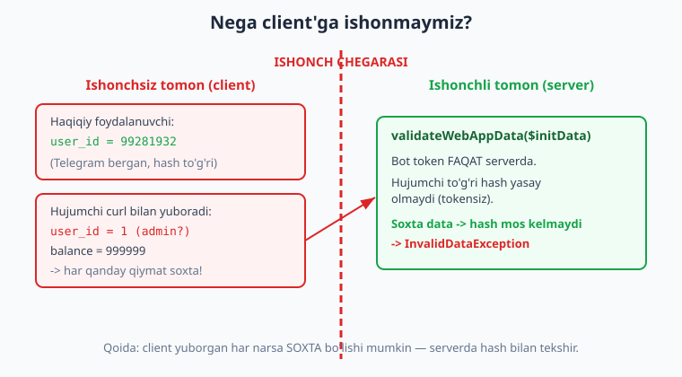
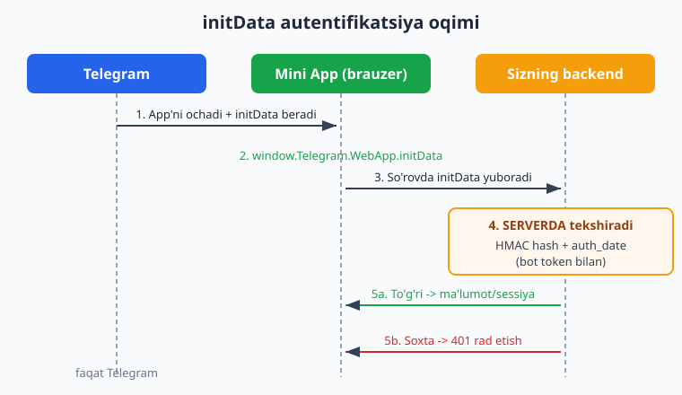
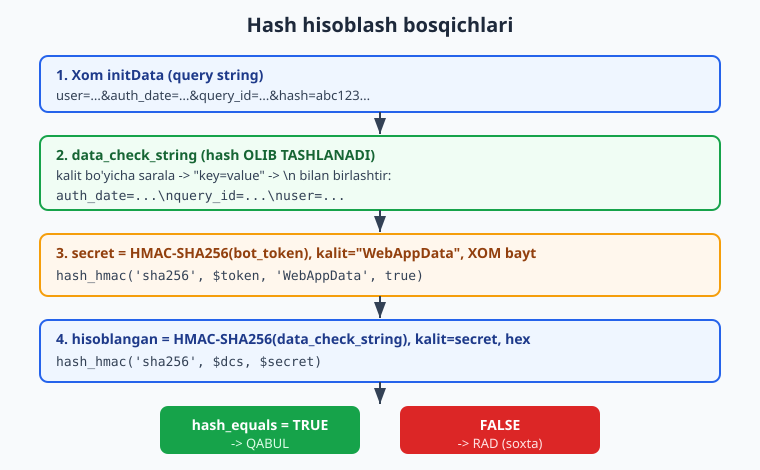

# 24 — Web App xavfsizligi: initData

[⬅️ Oldingi: 23 — Telegram Web App (Mini App) asoslari](./23-webapp-asoslari.md) · [🏠 README](./README.md) · [Keyingi: 25 — Mini App backend ➡️](./25-miniapp-backend.md)

---

> **Bu bobda:** O'tgan bobda Mini App'ni ochishni o'rgandik. Endi eng muhim savol: **backend ushbu so'rovni AYNAN o'sha foydalanuvchi yuborganiga qanday ishonadi?** Javob — `initData`. Avval **nega client'ga umuman ishonib bo'lmasligini** ko'ramiz (har kim `curl` bilan soxta `user_id` yuborishi mumkin — buni amalda ko'rsatamiz). So'ng `initData` nima ekanini (`user`, `auth_date`, `query_id`, `hash`...) ochib beramiz. Asosiy qism — **validatsiya algoritmi**ni bosqichma-bosqich: `data_check_string` (hash'siz, saralangan, `\n` bilan), `secret = hash_hmac('sha256', $token, 'WebAppData', true)`, `hash = hash_hmac('sha256', $dcs, $secret)`, va `hash_equals` bilan vaqt-doimiy solishtirish; hamda `auth_date` eskirishi (replay hujumi). Ikki yo'lni ko'rsatamiz: **qo'lda** (har bir bosqich qo'lda) va **tayyor Nutgram** — `$bot->validateWebAppData($initData)`. **DIQQAT (men tasdiqladim, bu juda muhim):** Nutgram noto'g'ri data'da `false` QAYTARMAYDI — u `InvalidDataException` **TASHLAYDI**, shuning uchun uni `try/catch` bilan ishlatish SHART. Yana bir muhim topilma: **Nutgram `auth_date`'ni tekshirmaydi** — eskirishni siz qo'lda tekshirasiz.
>
> **Halol eslatma:** Bu bobdagi BARCHA validatsiya kodi **to'liq OFFLINE** — token va internet KERAKMAS — **haqiqatan ishga tushirilib tekshirilgan** (Nutgram 4.46, PHP 8.4, PHPUnit 12.5). Soxta token bilan to'g'ri `initData` qurib qabul qilinishini, bitta belgi buzilganda `InvalidDataException` tashlanishini, va eski `auth_date` rad etilishini chinakam RUN qilib ko'rsatamiz (quyida natijalar bilan). Faqat "jonli" qism — Mini App'ning Telegram ilovasi ichida real ochilishi va real qurilmadan kelgan `initData` — illustrativ; algoritm va kod aynan production'da ishlaydigani.

---

## Nega client'ga ishonib bo'lmaydi?

Tasavvur qiling, Mini App'ingiz JavaScript'da foydalanuvchi ID'sini oladi va backend'ga shunday yuboradi:

```js
// MINI APP (client) — XAVFLI yondashuv
fetch('/api/balance', {
  method: 'POST',
  headers: { 'Content-Type': 'application/json' },
  body: JSON.stringify({ user_id: 99281932 }),   // <-- bunga ishonib bo'lmaydi!
});
```

Backend `user_id`'ni o'qib, o'sha foydalanuvchining balansini qaytaradi. Muammo: **client — bu foydalanuvchining qurilmasi, sizniki emas.** Har kim brauzer konsolida yoki oddiy `curl` bilan istalgan qiymatni yuborishi mumkin:

```bash
# Hujumchi — hech qanday Mini App'siz, to'g'ridan-to'g'ri:
curl -X POST https://sizning-backend.uz/api/balance \
  -H 'Content-Type: application/json' \
  -d '{"user_id": 1}'        # boshqaning (yoki admin?) ID'si
```

Hech qanday tekshiruvsiz backend bu so'rovni **haqiqiy deb qabul qiladi** va begona foydalanuvchining ma'lumotini beradi. Bu — eng keng tarqalgan Mini App zaifligi. Client yuborgan **har qanday** qiymat (ID, balans, rol, narx) soxta bo'lishi mumkin.



**Qoida (oltin):** server hech qachon client aytgan "men kimman"ga ishonmaydi. Foydalanuvchi shaxsi **server tomonida**, ishonchli manbadan tasdiqlanishi kerak. Telegram Mini App'lar uchun bu ishonchli manba — `initData`.

> **PHP eslatma:** Bu g'oya web'da hammaga taalluqli — `../php/README.md` da sessiya/parol, `../laravel/README.md` da CSRF/auth haqida o'qigan bo'lsangiz, "client'ga ishonma" tamoyili tanish. Bu yerda Telegram o'ziga xos mexanizm — HMAC imzo — beradi.

## initData nima?

Mini App ochilganda Telegram brauzerga maxsus satr beradi: `window.Telegram.WebApp.initData`. Bu — **URL query string** ko'rinishidagi imzolangan ma'lumot. Masalan (qisqartirilgan):

```
user=%7B%22id%22%3A99281932%2C%22first_name%22%3A%22Oqil%22...%7D&auth_date=1781359633&query_id=AAEt-test&hash=d8f0e2195841c89267eda100219f6e4143f946fadd19e368d8f2117b5f8129f1
```

Asosiy maydonlar:

| Maydon | Ma'no |
|---|---|
| `user` | JSON: foydalanuvchi haqida (`id`, `first_name`, `username`, `language_code`...). URL-kodlangan. |
| `auth_date` | App ochilgan Unix vaqti. **Eskirishni tekshirish uchun muhim.** |
| `query_id` | Sessiya ID'si (`answerWebAppQuery` uchun kerak bo'lishi mumkin). |
| `chat`, `receiver`, `chat_type`, `chat_instance` | Attachment-menu yoki to'g'ridan-to'g'ri havola orqali ochilganda. |
| `start_param` | `startattach`/deep-link parametri. |
| `hash` | **Imzo** — qolgan barcha maydonlarning HMAC-SHA256 hash'i. Aynan shu maydon hammasini "qulflaydi". |

Sehr `hash` maydonida. U **bot token bilan** hisoblangan. Bot token faqat sizda (va Telegram'da) bor — hujumchida yo'q. Demak, hujumchi `user`'ni o'zgartirsa, mos `hash`'ni **hisoblay olmaydi**. Backend hash'ni qayta hisoblab solishtiradi: mos kelsa — data haqiqiy va o'zgartirilmagan; mos kelmasa — soxta.



Telegram bu mexanizmni rasman hujjatlaydi: <https://core.telegram.org/bots/webapps#validating-data-received-via-the-mini-app>.

## Validatsiya algoritmi (bosqichma-bosqich)

Telegram aniq tartibni belgilaydi. Uni avval **qo'lda** yozamiz — shunda har bosqich aniq bo'ladi — keyin Nutgram'ning tayyor metodini ko'rsatamiz.



Bosqichlar:

1. **Query string'ni massivga aylantir.** `parse_str()` avtomatik URL-dekodlaydi.
2. **`hash`'ni ajratib ol va olib tashla.** Qolgan maydonlar imzolanadi.
3. **`data_check_string` qur:** maydonlarni **kalit bo'yicha alifbo tartibida** sarala, har birini `key=value` qil, so'ng `\n` (yangi qator) bilan birlashtir. **Tartib va `\n` aniq shu — aks holda hash mos kelmaydi.**
4. **`secret` kalitini hisobla:** `hash_hmac('sha256', $token, 'WebAppData', true)`. Diqqat: bu yerda **xabar — bu token**, **kalit esa — literal `'WebAppData'` satr**, va `true` (xom bayt) qaytaradi.
5. **Yakuniy hash:** `hash_hmac('sha256', $dataCheckString, $secret)` (hex satr — `true` siz).
6. **Vaqt-doimiy solishtir:** `hash_equals($calculated, $remoteHash)`. (Oddiy `===` o'rniga `hash_equals` — timing attack'dan himoya.)
7. **`auth_date` eskirishini tekshir:** masalan 24 soatdan eski bo'lsa rad et (replay hujumiga qarshi).

### Qo'lda: `InitDataGuard` sinfi

```php
<?php

final class InitDataGuard
{
    public static function validate(string $botToken, string $initData, int $maxAgeSec = 86400): array
    {
        // 1) Query stringni massivga (parse_str avtomatik urldecode qiladi)
        parse_str($initData, $data);

        // 2) hash'ni ajratamiz va olib tashlaymiz
        $remoteHash = (string) ($data['hash'] ?? '');
        unset($data['hash']);

        // 3) data_check_string: kalit bo'yicha sarala -> "key=value" -> \n bilan birlashtir
        ksort($data);
        $lines = [];
        foreach ($data as $key => $value) {
            $lines[] = "$key=$value";
        }
        $dataCheckString = implode("\n", $lines);

        // 4) secret = HMAC-SHA256(token), kalit = "WebAppData", XOM bayt (true)
        $secretKey = hash_hmac('sha256', $botToken, 'WebAppData', true);

        // 5) hisoblangan hash = HMAC-SHA256(data_check_string), kalit = secret, hex
        $calculatedHash = hash_hmac('sha256', $dataCheckString, $secretKey);

        // 6) vaqt-doimiy solishtirish (timing attack'dan himoya)
        if (!hash_equals($calculatedHash, $remoteHash)) {
            throw new RuntimeException('Hash mos kelmadi — soxta yoki buzilgan data');
        }

        // 7) auth_date eskirishini tekshirish (replay hujumiga qarshi)
        $authDate = (int) ($data['auth_date'] ?? 0);
        if ($authDate <= 0 || (time() - $authDate) > $maxAgeSec) {
            throw new RuntimeException('auth_date eskirgan yoki yo\'q — qaytadan oching');
        }

        return $data;
    }
}
```

E'tibor bering — bu sinfga **bot token KERAK** (`$botToken`). Token tufayli imzo ishonchli. Token kodga yozilmaydi — `.env`/`getenv` orqali keladi (11-bobga qarang).

### `auth_date` va replay hujumi

`hash` o'zgarmagan, haqiqiy `initData`'ni hujumchi qayta-qayta yuborishi mumkin — bu **replay** hujumi. To'liq himoya `auth_date`'ni tekshirishdan boshlanadi: agar data juda eski bo'lsa (masalan 24 soatdan) — rad eting. Telegram'ning rasmiy namunasi ham aynan shu yondashuvni tavsiya qiladi. (Yuqori xavfli amallar uchun `query_id`'ni bir martalik token sifatida bazada belgilab, qayta ishlatilishini bloklash mumkin.)

## Tayyor yo'l: Nutgram `validateWebAppData`

Yuqoridagi algoritmni har safar qo'lda yozish shart emas — Nutgram buni bitta metodda beradi:

```php
<?php

use SergiX44\Nutgram\Nutgram;
use SergiX44\Nutgram\Exception\InvalidDataException;

$bot = new Nutgram($_ENV['BOT_TOKEN']);

try {
    // MUVAFFAQIYATda WebAppData obyektini qaytaradi
    $webApp = $bot->validateWebAppData($initData);

    $userId   = $webApp->user->id;        // ishonchli — serverda tasdiqlangan
    $username = $webApp->user->username;
    // ... endi $userId bilan ishonch bilan ishlash mumkin
} catch (InvalidDataException $e) {
    // NOTO'G'RIda — false EMAS, EXCEPTION
    http_response_code(401);
    exit('Yaroqsiz initData');
}
```

> **⚠️ ENG MUHIM nuqta (tasdiqlangan):** `validateWebAppData` **`false` qaytarMAYDI.** Data noto'g'ri bo'lsa, u `SergiX44\Nutgram\Exception\InvalidDataException` **TASHLAYDI**. Shuning uchun uni **`try/catch` bilan o'rash SHART**. Agar siz `if (!$bot->validateWebAppData($initData))` deb yozsangiz — bu xato: noto'g'ri data'da kod `if`gacha ham yetib bormaydi, exception bilan to'xtaydi. To'g'ri data'da esa qaytgan obyekt "truthy", `if` hech narsa qilmaydi. Demak `try/catch` — yagona to'g'ri yo'l.

Nutgram qaytargan `WebAppData` obyektida `->user` (`WebAppUser`: `id`, `first_name`, `username`...), `->auth_date` (`DateTime`), `->query_id`, `->chat`, `->start_param` kabi maydonlar bor.

> **⚠️ Yana bir muhim topilma (men RUN qilib tasdiqladim):** Nutgram `validateWebAppData` faqat **HASH**'ni tekshiradi — u **`auth_date`'ni TEKSHIRMAYDI.** Ya'ni bir yil oldingi haqiqiy `initData`'ni bersangiz ham, hash to'g'ri bo'lsa, Nutgram uni qabul qiladi va exception tashlamaydi. Shuning uchun **eskirish/replay tekshiruvini SIZ qo'lda qo'shasiz:**
>
> ```php
> $webApp = $bot->validateWebAppData($initData);  // hash OK
>
> $ageSec = time() - $webApp->auth_date->getTimestamp();
> if ($ageSec > 86400) {                            // 24 soatdan eski?
>     http_response_code(401);
>     exit('initData eskirgan — qaytadan oching');
> }
> ```

Yana bir nuance: Nutgram'ning ichki implementatsiyasi hash solishtirishda `strcmp` ishlatadi (`hash_equals` o'rniga). Sizning **o'z** kodingizda esa har doim `hash_equals` ishlating — bu vaqt-doimiy va xavfsizroq.

## To'liq OFFLINE tekshiruv (token va tarmoq KERAKMAS)

Endi eng qiziq qism: hamma narsani **haqiqatan ishga tushirib** ko'rsatamiz. Soxta (lekin to'g'ri formatdagi) token bilan to'g'ri `initData` quramiz, uni qabul qildiramiz; bitta belgini buzamiz — `InvalidDataException` olamiz; eski `auth_date` bilan — rad ettiramiz. Hech qanday Telegram, token yoki internet kerak emas.

Quyidagi `verify.php` skripti (qo'lda + Nutgram, ikkalasi ham):

```php
<?php
require 'vendor/autoload.php';

use SergiX44\Nutgram\Nutgram;
use SergiX44\Nutgram\Exception\InvalidDataException;

// Soxta token (HMAC matematikasi uchun). Nutgram::fake() ham aynan shu tokenni ishlatadi.
$token = '123456:ABC-DEF1234ghIkl-zyx57W2v1u123ew11';

// To'g'ri initData qurish (Telegram qiladigan ishni biz qilamiz)
function buildInitData(string $token, array $fields): string
{
    $pairs = $fields;
    ksort($pairs);
    $dcs = [];
    foreach ($pairs as $k => $v) {
        $dcs[] = "$k=$v";
    }
    $secret = hash_hmac('sha256', $token, 'WebAppData', true);
    $fields['hash'] = hash_hmac('sha256', implode("\n", $dcs), $secret);

    $qs = [];
    foreach ($fields as $k => $v) {
        $qs[] = $k . '=' . urlencode($v);
    }
    return implode('&', $qs);
}

$fields = [
    'user'      => json_encode(['id' => 99281932, 'first_name' => 'Oqil', 'username' => 'i_oqil']),
    'auth_date' => (string) time(),
    'query_id'  => 'AAEt-test-query',
];
$initData = buildInitData($token, $fields);

// --- Nutgram bilan ---
$bot = Nutgram::fake();   // fake() ichida yuqoridagi token bor

// 1) To'g'ri -> qabul
$webApp = $bot->validateWebAppData($initData);
echo "TO'G'RI -> QABUL. user id={$webApp->user->id}\n";

// 2) Bitta belgini buzamiz -> InvalidDataException
$bad = substr($initData, 0, -1) . 'x';
try {
    $bot->validateWebAppData($bad);
    echo "XATO: buzilgan qabul qilindi\n";
} catch (InvalidDataException $e) {
    echo "BUZILGAN -> InvalidDataException: {$e->getMessage()}\n";
}

// 3) Eski auth_date -> Nutgram QABUL qiladi (tekshirmaydi), qo'lda rad etamiz
$old = buildInitData($token, ['user' => $fields['user'], 'auth_date' => (string)(time() - 100000)]);
$w = $bot->validateWebAppData($old);   // exception YO'Q
$ageDays = round((time() - $w->auth_date->getTimestamp()) / 86400, 1);
echo "ESKI: Nutgram qabul qildi (yosh={$ageDays} kun) -> qo'lda rad etish KERAK\n";
```

Bu skriptning **haqiqiy** natijasi:

```text
=== 1) Qo'lda validatsiya ===
  TO'G'RI initData -> QABUL. user={"id":99281932,"first_name":"Oqil","username":"i_oqil","language_code":"uz"}
  BUZILGAN data -> RAD: Hash mos kelmadi — soxta yoki buzilgan data
  ESKI auth_date -> RAD: auth_date eskirgan (100000 s)

=== 2) Nutgram validateWebAppData ===
  TO'G'RI -> QABUL. user id=99281932, username=i_oqil, auth_date=2026-06-13T14:07:13+00:00
  BUZILGAN -> InvalidDataException TASHLANDI: Invalid webapp data
  ESKI auth_date: Nutgram QABUL qildi (u auth_date'ni TEKSHIRMAYDI) -> yosh=1.2 kun, qo'lda rad etish KERAK
```

Bu natija uch narsani **chinakam** isbotlaydi: (1) to'g'ri `initData` ikkala usulda ham qabul qilinadi; (2) bitta belgi buzilsa — qo'lda `RuntimeException`, Nutgram'da `InvalidDataException` (`false` emas!); (3) eski `auth_date`'ni qo'lda guard rad etadi, Nutgram esa qabul qiladi — demak eskirishni o'zingiz tekshirasiz.

### PHPUnit bilan mustahkamlash

Aynan shu mantiqni avtomatik testga aylantiramiz (16-bobdagi `Nutgram::fake()` uslubida). Hujumchi **boshqa token** bilan `user_id = 1` yasashga urinsa ham rad etilishini ham sinaymiz:

```php
<?php
use PHPUnit\Framework\TestCase;
use SergiX44\Nutgram\Nutgram;
use SergiX44\Nutgram\Exception\InvalidDataException;

final class InitDataTest extends TestCase
{
    private const TOKEN = '123456:ABC-DEF1234ghIkl-zyx57W2v1u123ew11';

    // ... buildInitData() yordamchisi yuqoridagidek ...

    public function test_nutgram_accepts_valid(): void
    {
        $bot  = Nutgram::fake();
        $init = $this->buildInitData($this->validFields());
        $webApp = $bot->validateWebAppData($init);
        $this->assertSame(99281932, $webApp->user->id);
    }

    public function test_nutgram_throws_on_tampered(): void
    {
        $bot  = Nutgram::fake();
        $bad  = substr($this->buildInitData($this->validFields()), 0, -1) . 'x';
        $this->expectException(InvalidDataException::class);   // false EMAS — exception
        $bot->validateWebAppData($bad);
    }

    public function test_manual_rejects_forged_user_with_wrong_token(): void
    {
        // Hujumchi BOSHQA token bilan user_id=1 yasaydi -> bizning token bilan rad etiladi
        $forged = $this->buildInitDataWithToken('WRONG:token-attacker', ['user' => json_encode(['id' => 1])]);
        $this->expectException(RuntimeException::class);
        InitDataGuard::validate(self::TOKEN, $forged);
    }
}
```

`phpunit` ning **haqiqiy** natijasi (7 ta test — qo'lda guard + Nutgram, soxta token hujumi ham):

```text
PHPUnit 12.5.29 by Sebastian Bergmann and contributors.

Runtime:       PHP 8.4.0

.......                                                             7 / 7 (100%)

Time: 00:00.049, Memory: 8.00 MB

OK (7 tests, 9 assertions)
```

Yashil. Bu — botingiz xavfsizligining mustahkam poydevori: har deploy oldidan tokensiz, tarmoqsiz bir soniyada tekshiriladi.

## Backend'da to'g'ri qo'llash

Production'da qoida sodda: **HAR bir Mini App so'rovida** `initData`'ni serverda tekshiring. `user_id`'ni so'rov tanasidan (`body`) EMAS, faqat tasdiqlangan `initData`'dan oling.

```php
<?php
// Mini App backend (illustrativ — Slim/oddiy PHP)
use SergiX44\Nutgram\Nutgram;
use SergiX44\Nutgram\Exception\InvalidDataException;

function authenticate(Nutgram $bot, string $initData): int
{
    try {
        $webApp = $bot->validateWebAppData($initData);
    } catch (InvalidDataException) {
        http_response_code(401);
        exit('Yaroqsiz initData');
    }

    // Eskirishni QO'LDA tekshiramiz (Nutgram tekshirmaydi)
    if (time() - $webApp->auth_date->getTimestamp() > 86400) {
        http_response_code(401);
        exit('initData eskirgan');
    }

    return $webApp->user->id;   // <-- ISHONCHLI manba, faqat shuni ishlat
}

// initData odatda sarlavha yoki body orqali keladi:
$initData = $_SERVER['HTTP_X_INIT_DATA'] ?? ($_POST['initData'] ?? '');
$userId = authenticate($bot, $initData);
// endi $userId bilan ishonch bilan: balans, profil, xarid...
```

Muhim odatlar:

- `initData`'ni **har so'rovda** qayta tekshiring — bir marta emas. (Yoki tekshirilgandan keyin o'z sessiya tokeningizni/JWT bering — buni 25-bobda ko'ramiz.)
- HTTPS majburiy — `initData` shifrlanmagan kanal orqali ketmasin.
- Bot token faqat serverda, `.env`'da. Hech qachon client'ga yubormang.
- Eskirishni (`auth_date`) doim tekshiring.

Keyingi bobda (**25 — Mini App backend**) shu poydevor ustiga to'liq backend quramiz: marshrutlar, sessiya, ma'lumotlar bazasi bilan birlashtiramiz.

## Mashqlar

### Oson

1. `initData` ichidagi `hash` maydoni nima vazifa bajaradi? Nega uni hisoblashda hujumchi takrorlay olmaydi?
2. `data_check_string` qurishda maydonlar qaysi tartibda joylashadi va nima bilan birlashtiriladi?
3. `validateWebAppData` noto'g'ri data'da nima qaytaradi — `false` mi yoki boshqa narsami? To'g'ri javobni yozing.
4. Nega `===` o'rniga `hash_equals` ishlatiladi?
5. `secret` kalitini hisoblashda HMAC'ning **xabari** nima, **kaliti** nima? (`hash_hmac('sha256', $token, 'WebAppData', true)`)
6. Nega `user_id`'ni so'rov `body`'sidan olish xavfli, `initData`'dan olish xavfsiz?

### O'rta

1. `InitDataGuard::validate()` ni yozing va PHPUnit testi bilan: to'g'ri `initData` -> massiv qaytadi; buzilgan -> `RuntimeException`.
2. Berilgan `initData`'da bitta belgini o'zgartirib (masalan oxirgisini), Nutgram'ning `InvalidDataException` tashlashini test bilan isbotlang (`expectException`).
3. `auth_date`'ni 100000 soniya orqaga surib `initData` quring va `InitDataGuard` uni rad etishini tekshiring.
4. Nutgram `validateWebAppData` **`auth_date`'ni tekshirmasligini** ko'rsatadigan test yozing (eski data -> exception YO'Q, lekin yoshi 24 soatdan katta).
5. `authenticate()` funksiyasini yozing: `try/catch` + eskirish tekshiruvi + `user_id` qaytarish.
6. Hujumchi **boshqa token** bilan `user_id = 1` yasashga urinadigan `initData` quring va sizning token bilan rad etilishini test qiling.

### Qiyin

1. To'liq `verify.php` ni yozing: bitta skriptda qo'lda + Nutgram, uchchala holat (to'g'ri / buzilgan / eski) — RUN qiling va chiqishini tahlil qiling.
2. `query_id`'ni bir martalik token sifatida ishlatib **replay**'ni bloklovchi mexanizm loyihalang (bazada ishlatilgan `query_id`'larni belgilash). Pseudokod yoki ishlaydigan PHP yozing.
3. Middleware (9-bob) sifatida `initData` tekshiruvini o'rang: har Mini App so'rovi avtomatik autentifikatsiyadan o'tsin, `user_id` keyingi qatlamga uzatilsin.

<details markdown="1"><summary>Yechimlar</summary>

**Oson 1.** `hash` — qolgan barcha maydonlarning HMAC-SHA256 imzosi, bot token bilan hisoblangan. Hujumchida token yo'q, shuning uchun u `user`'ni o'zgartirsa, mos `hash`'ni hisoblay olmaydi — server qayta hisoblaganda mos kelmaydi.

**Oson 2.** Maydonlar (hash'siz) kalit bo'yicha **alifbo tartibida** saralanadi, har biri `key=value` ko'rinishida, va `\n` (yangi qator) bilan birlashtiriladi.

**Oson 3.** `false` QAYTARMAYDI — `InvalidDataException` **tashlaydi**. Shuning uchun `try/catch` SHART; `if (!$bot->validateWebAppData(...))` xato yondashuv.

**Oson 4.** `hash_equals` — **vaqt-doimiy** (constant-time) solishtirish. Oddiy `===` solishtirishda mos kelmagan birinchi baytda to'xtaydi, vaqt farqi orqali hash bayt-bayt taxmin qilinishi mumkin (timing attack). `hash_equals` bu farqni yo'qotadi.

**Oson 5.** Xabar — **bot token**; kalit — literal `'WebAppData'` satr; `true` — natija xom bayt (keyingi HMAC'da kalit sifatida ishlatiladi).

**Oson 6.** `body`'dagi har narsa client tomonidan, demak hujumchi tomonidan to'liq nazorat qilinadi (curl bilan istalgan qiymat). `initData`'dagi `user` esa Telegram tomonidan imzolangan — server uni token bilan tasdiqlaydi, soxtalashtirib bo'lmaydi.

**O'rta 1.** Yuqoridagi `InitDataGuard` sinfidan foydalaning. Test:

```php
public function test_valid(): void
{
    $init = $this->buildInitData($this->validFields());
    $data = InitDataGuard::validate(self::TOKEN, $init);
    $this->assertSame(99281932, json_decode($data['user'], true)['id']);
}

public function test_tampered(): void
{
    $bad = substr($this->buildInitData($this->validFields()), 0, -1) . 'x';
    $this->expectException(RuntimeException::class);
    InitDataGuard::validate(self::TOKEN, $bad);
}
```

**O'rta 2.**

```php
public function test_nutgram_throws_on_tampered(): void
{
    $bot = Nutgram::fake();
    $bad = substr($this->buildInitData($this->validFields()), 0, -1) . 'x';
    $this->expectException(InvalidDataException::class);
    $bot->validateWebAppData($bad);
}
```

**O'rta 3.**

```php
public function test_expired(): void
{
    $init = $this->buildInitData($this->validFields(time() - 100000));
    $this->expectException(RuntimeException::class);
    $this->expectExceptionMessage('eskirgan');
    InitDataGuard::validate(self::TOKEN, $init);
}
```

**O'rta 4.** Bu — bobdagi muhim topilma:

```php
public function test_nutgram_does_not_check_auth_date(): void
{
    $bot = Nutgram::fake();
    $init = $this->buildInitData($this->validFields(time() - 100000));
    $webApp = $bot->validateWebAppData($init);   // exception YO'Q
    $this->assertGreaterThan(86400, time() - $webApp->auth_date->getTimestamp());
}
```

**O'rta 5.**

```php
function authenticate(Nutgram $bot, string $initData, int $maxAge = 86400): int
{
    try {
        $webApp = $bot->validateWebAppData($initData);
    } catch (InvalidDataException) {
        http_response_code(401);
        exit('Yaroqsiz initData');
    }
    if (time() - $webApp->auth_date->getTimestamp() > $maxAge) {
        http_response_code(401);
        exit('initData eskirgan');
    }
    return $webApp->user->id;
}
```

**O'rta 6.**

```php
public function test_forged_with_wrong_token_rejected(): void
{
    // hujumchi token'ga ega emas — boshqa token bilan imzolaydi
    $forged = $this->buildInitDataWithToken('WRONG:token-attacker', [
        'user' => json_encode(['id' => 1, 'first_name' => 'Hacker']),
        'auth_date' => (string) time(),
    ]);
    $this->expectException(RuntimeException::class);
    InitDataGuard::validate(self::TOKEN, $forged);  // bizning token bilan tekshiriladi -> rad
}
```

Hujumchining hash'i `WRONG:token-attacker` bilan hisoblangan; biz haqiqiy token bilan qayta hisoblaymiz — mos kelmaydi.

**Qiyin 1.** Bobdagi to'liq `verify.php` ni ishlating (qo'lda `manualValidate` + Nutgram `validateWebAppData`, uchchala holat). Chiqish: to'g'ri -> QABUL; buzilgan -> RAD/`InvalidDataException`; eski -> qo'lda RAD, Nutgram QABUL. Asosiy xulosa: hash — yaxlitlik/autentlik; `auth_date` — eskirish, va uni qo'lda tekshirish kerak.

**Qiyin 2.** `query_id`'ni bir martalik (nonce) sifatida:

```php
function authenticateOnce(Nutgram $bot, PDO $db, string $initData): int
{
    $webApp = $bot->validateWebAppData($initData);   // try/catch real kodda

    if (time() - $webApp->auth_date->getTimestamp() > 86400) {
        throw new RuntimeException('eskirgan');
    }

    $qid = $webApp->query_id ?? throw new RuntimeException('query_id yo\'q');

    // Allaqachon ishlatilganmi?
    $stmt = $db->prepare('SELECT 1 FROM used_queries WHERE query_id = ?');
    $stmt->execute([$qid]);
    if ($stmt->fetchColumn()) {
        throw new RuntimeException('replay — bu query_id allaqachon ishlatilgan');
    }

    // Belgilab qo'yamiz
    $db->prepare('INSERT INTO used_queries (query_id, used_at) VALUES (?, ?)')
       ->execute([$qid, time()]);

    return $webApp->user->id;
}
```

Eslatma: `query_id` faqat ba'zi kontekstlarda bo'ladi; umumiy himoya — `auth_date` + qisqa amal muddati. Eski yozuvlarni vaqti-vaqti bilan tozalang.

**Qiyin 3.** Middleware:

```php
$bot->middleware(function (Nutgram $bot, $next) {
    $initData = $bot->message()?->web_app_data?->data
        ?? /* yoki HTTP sarlavhasidan, backend kontekstida */ '';

    try {
        $webApp = $bot->validateWebAppData($initData);
    } catch (InvalidDataException) {
        return;   // to'xtatamiz — keyingi handler chaqirilmaydi
    }
    if (time() - $webApp->auth_date->getTimestamp() > 86400) {
        return;
    }

    $bot->setUserData('verified_user_id', $webApp->user->id);
    $next($bot);   // faqat tasdiqlangan so'rov o'tadi
});
```

Bu naqsh Mini App backend HTTP qatlamida (Slim middleware) ham, bot ichida `onWebAppData` oldidan ham qo'llanadi. Toza ajratish: tekshiruv bitta joyda, qolgan handlerlar `verified_user_id`'ga ishonadi.

</details>

---

[⬅️ Oldingi: 23 — Telegram Web App (Mini App) asoslari](./23-webapp-asoslari.md) · [🏠 README](./README.md) · [Keyingi: 25 — Mini App backend ➡️](./25-miniapp-backend.md)
