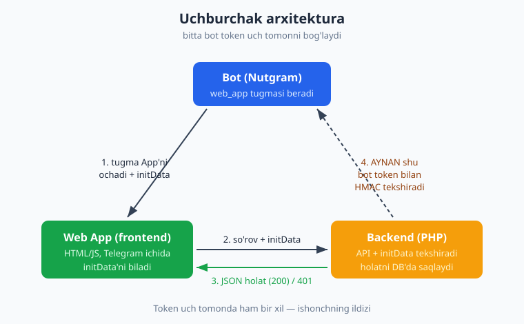
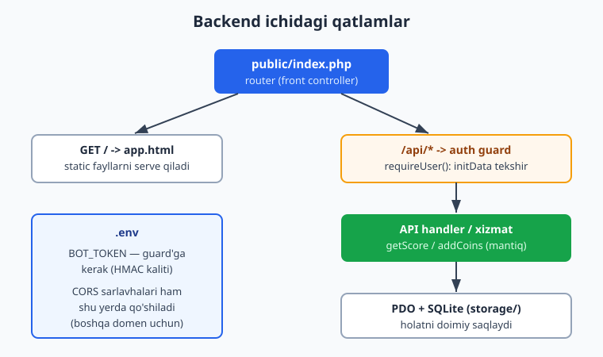
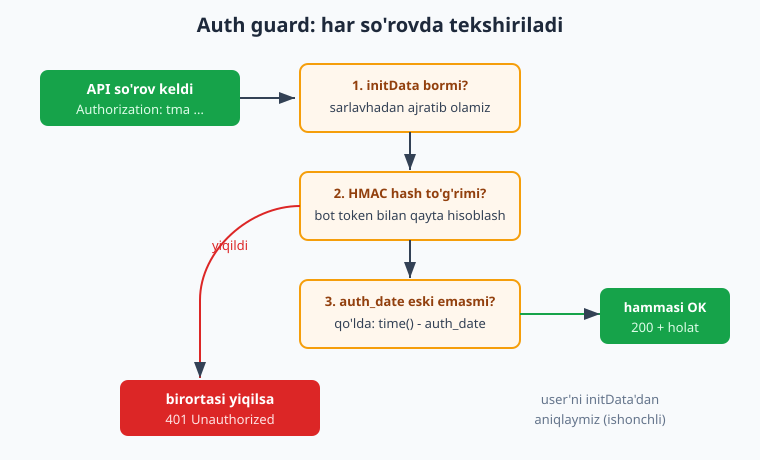

# 25 — Mini App backend

[⬅️ Oldingi: 24 — Web App xavfsizligi: initData](./24-webapp-xavfsizlik.md) · [🏠 README](./README.md) · [Keyingi: 26 — Kapston: Hamster uslubidagi clicker Mini App ➡️](./26-kapston-clicker.md)

---

> **Bu bobda:** 23-bobda Mini App'ning frontend tomonini (Telegram ichida ochiluvchi HTML/JS) ko'rdik, 24-bobda esa initData'ni qanday **tekshirish** kerakligini o'rgandik. Endi uchinchi va eng muhim qismni quramiz: **backend** — Mini App so'rovlarini qabul qiladigan, har birini tekshiradigan va ilova holatini bazada saqlaydigan PHP serveri. O'rganamiz: **sof PHP router** (`php -S` bilan) yoki **Slim 4** orqali backend qurish; web app HTML/static fayllarni serve qilish + **JSON API endpointlar**; **har API so'rovida initData tekshirish** ([24-bob](./24-webapp-xavfsizlik.md) — `validateWebAppData` yoki qo'lda HMAC) — buni **auth guard** (middleware) sifatida; foydalanuvchini initData'dan **ishonchli aniqlash**; ilova holatini **DB'da saqlash** ([10-bob](./10-malumotlar-bazasi.md) — PDO/SQLite); **CORS**; va eng asosiysi — bot + Web App + backend **uchburchak arxitekturasi** (bot tugma beradi -> webview backend'ga so'rov yuboradi -> backend AYNAN shu bot token bilan tekshiradi). Oxirida lokal sinov va HTTPS/ngrok tushunchasini ko'ramiz.
>
> Halol eslatma: bu bobdagi BARCHA backend mantig'i — initData tekshirish (auth guard), `/api/state` va `/api/tap` endpointlari, holatni SQLite'ga saqlash — **`php -S` bilan REAL ishga tushirilib, curl orqali tarmoq ustida HAQIQATAN tekshirilgan** (initData'siz -> 401, buzilgan -> 401, to'g'ri -> 200 + holat; jami 11 ta HTTP tekshiruvi va 6 ta sof-PHP tekshiruvi o'tdi — natijalar quyida). HMAC algoritmimiz Nutgram'ning rasmiy `validateWebAppData` metodiga ham mos kelishi alohida tasdiqlandi. Jonli qism — Mini App'ning Telegram ichida REAL ochilishi, real qurilmadan kelgan initData va public HTTPS hosting — **illustrativ**: u kodingiz public domenga joylashtirilib, bot tugmasi orqali ochilganda ko'rinadi.

---

## Uchburchak arxitektura: nima bilan ishlayapmiz

Mini App'ni to'liq qurish uchun **uchta** mustaqil qism bir-biri bilan gaplashadi. Bularni chalkashtirib yubormaslik muhim:



1. **Bot** (Nutgram, oldingi boblar) — `web_app` tugmasini beradi. Uning vazifasi shu yerda tugaydi: u Mini App'ni **ochadi**, lekin App ishlayotganda u bilan to'g'ridan-to'g'ri gaplashmaydi.
2. **Web App (frontend)** — Telegram ichida ochiluvchi HTML/JS. U `window.Telegram.WebApp.initData` ni biladi va har so'rovida uni backend'ga yuboradi.
3. **Backend (PHP)** — bu bobning mavzusi. U ikki ishni qiladi: (a) static fayllarni (HTML, JS, CSS) serve qiladi; (b) **JSON API** beradi va har so'rovni initData orqali tekshiradi, so'ng holatni bazada saqlaydi.

**Uchburchakning siri** — uchchala tomon ham **bitta bot token** atrofida birlashadi. Bot token bilan ro'yxatdan o'tgan; Telegram initData'ni aynan shu token bilan imzolaydi; backend esa aynan shu token bilan imzoni qayta tekshiradi. Token — ishonchning ildizi. Shuning uchun token faqat **bot va backend**'da bo'ladi (`.env` da), frontend'ga **hech qachon** berilmaydi.

> **Nega bot va backend alohida?** Ular bitta loyihada yashashi mumkin (bir xil token, bir xil DB), lekin **jarayon sifatida** alohida: bot long-polling/webhook'da ishlaydi ([13-bob](./13-webhook-deploy.md)), backend esa HTTP so'rovlarga javob beradi. Ko'pincha bitta repozitoriy, ikki kirish nuqtasi (`bot.php` va `public/index.php`). DB orqali ular bir-birini "ko'radi": bot ham, backend ham bir xil `scores` jadvalini o'qiydi/yozadi.

## Backend nima qiladi: ikki vazifa

Mini App backend ikkita butunlay boshqacha turdagi so'rovni boshqaradi, va ularni ajratish kerak:

| So'rov turi | Misol | Tekshirish kerakmi? | Javob |
|---|---|---|---|
| **Static** | `GET /` -> `app.html`, `GET /app.js` | Yo'q (ochiq fayllar) | HTML / JS / CSS |
| **API** | `GET /api/state`, `POST /api/tap` | **HA — har safar initData** | JSON |



Static qism oddiy: brauzer App'ni ochish uchun HTML va JS so'raydi, biz faylni qaytaramiz. API qism esa **himoyalangan**: har bir so'rov "men falonchiman" deb da'vo qiladi, va biz bu da'voni initData orqali **isbotlatib** olamiz. Endi har qatlamni quramiz.

## Sof PHP router: `php -S` bilan

Eng yengil yo'l — hech qanday freymvorksiz, PHP'ning o'rnatilgan veb-serveri (`php -S`) va bitta **front controller** (`public/index.php`). Bu o'rganish va lokal sinov uchun ideal; loyiha o'sganda Slim'ga o'tasiz (pastda).

Loyiha tuzilishi:

```text
miniapp/
├── public/
│   ├── index.php      <- front controller (router)
│   └── app.html       <- Mini App frontend (23-bobdagi)
├── src/
│   ├── initdata.php   <- initData tekshirish (24-bob algoritmi)
│   └── db.php         <- PDO + holat (10-bob)
└── storage/
    └── app.sqlite     <- ma'lumotlar bazasi
```

`php -S` ni shunday ishga tushiramiz (router fayl bilan):

```bash
# BOT_TOKEN .env'dan emas, bu yerda misol uchun muhit o'zgaruvchisi orqali
BOT_TOKEN="123456:ABC..." php -S 127.0.0.1:8080 -t public public/index.php
```

Bu yerda `public/index.php` **router** vazifasini bajaradi: HAR so'rov (static yoki API) avval shu faylga keladi, va biz yo'lga qarab ish qilamiz.

## initData tekshirish: auth guard

Bu — bobning yuragi. **Har** API so'rovida initData tekshiriladi. 24-bobda algoritmni ko'rgandik; bu yerda uni qayta yozamiz, lekin Nutgram'siz, sof PHP'da (backend Nutgram'siz ham ishlashi mumkin — faqat HMAC kerak). Diqqat: bu funksiya **`auth_date` eskirishini qo'lda** ham tekshiradi — buni Telegram ham, Nutgram'ning `validateWebAppData` ham avtomatik qilmaydi (bu juda muhim, pastda izohlaymiz).

`src/initdata.php`:

```php
<?php
declare(strict_types=1);

class InvalidInitDataException extends RuntimeException {}

/**
 * initData (query string) tekshiradi.
 * Muvaffaqiyatda parse qilingan massiv qaytaradi; noto'g'rida exception.
 */
function validateInitData(string $initData, string $botToken, int $maxAgeSeconds = 3600): array
{
    parse_str($initData, $data);

    if (!isset($data['hash']) || !is_string($data['hash'])) {
        throw new InvalidInitDataException('hash yo\'q');
    }
    $remoteHash = $data['hash'];
    unset($data['hash']);

    // data_check_string: kalitlar bo'yicha saralangan, har biri "key=value", \n bilan birlashgan
    ksort($data);
    $pairs = [];
    foreach ($data as $key => $value) {
        $pairs[] = $key . '=' . $value;
    }
    $dataCheckString = implode("\n", $pairs);

    // secret = HMAC_SHA256(bot_token, "WebAppData")
    $secretKey = hash_hmac('sha256', $botToken, 'WebAppData', true);
    // hash = HMAC_SHA256(data_check_string, secret)
    $localHash = bin2hex(hash_hmac('sha256', $dataCheckString, $secretKey, true));

    if (!hash_equals($localHash, $remoteHash)) {
        throw new InvalidInitDataException('hash mos kelmadi');
    }

    // auth_date eskirishini QO'LDA tekshiramiz (avtomatik tekshirilmaydi!)
    if (isset($data['auth_date'])) {
        $authDate = (int) $data['auth_date'];
        if ($maxAgeSeconds > 0 && (time() - $authDate) > $maxAgeSeconds) {
            throw new InvalidInitDataException('initData eskirgan (auth_date)');
        }
    }

    // user maydoni JSON satr — uni massivga aylantiramiz
    if (isset($data['user'])) {
        $data['user'] = json_decode($data['user'], true);
    }

    return $data;
}
```

Bu yerda har qadam 24-bobdan tanish bo'lishi kerak. Eng nozik nuqtalar:

- **`hash_equals`** — oddiy `===` o'rniga. Bu **vaqt-doimiy** taqqoslash: hacker hash'ni belgima-belgi taxmin qilib, javob tezligidan foydalana olmaydi (timing attack). Imzolarni doim shu bilan solishtiring.
- **`auth_date` qo'lda** — Telegram initData'ni imzolaydi, lekin imzo "abadiy" yaroqli. Agar kimdir eski (lekin to'g'ri imzolangan) initData'ni o'g'irlasa, uni cheksiz ishlatishi mumkin. Shuning uchun biz `auth_date` ni tekshirib, masalan 1 soatdan eski so'rovlarni rad etamiz. **Nutgram'ning `validateWebAppData` ham buni qilmaydi** — agar uni ishlatsangiz, `auth_date` ni o'zingiz tekshirishingiz shart.
- **`user` JSON** — initData ichida `user` maydoni alohida JSON satr (`user={"id":...}`). Uni `json_decode` bilan ochamiz va shu yerdan foydalanuvchini ishonchli aniqlaymiz.

> **Nutgram bilan ham qilsa bo'ladi.** Agar backend'ingizda Nutgram bor bo'lsa, qo'lda HMAC o'rniga `$bot->validateWebAppData($initData)` ni ishlatishingiz mumkin — u to'g'ri bo'lsa `WebAppData` obyektini qaytaradi, noto'g'ri bo'lsa `SergiX44\Nutgram\Exception\InvalidDataException` **tashlaydi** (`false` qaytarmaydi — `try/catch` bilan ishlating). Algoritm aynan bir xil. Biz bu bobda sof-PHP versiyasini ko'rsatdik, chunki backend Nutgram'siz, faqat HMAC bilan ham mustaqil ishlay oladi — va aynan shu kodimiz Nutgram'ning natijasiga mos kelishini tekshirdik.

### Foydalanuvchini aniqlash: auth guard funksiyasi

Endi tekshiruvni **guard**ga o'raymiz. Bu — frontend yuborgan initData'ni sarlavhadan ajratib oladi, tekshiradi, va foydalanuvchini qaytaradi (yoki 401 bilan so'rovni to'xtatadi). Bu funksiya har API endpointning **birinchi qatori** bo'ladi.

```php
<?php
// initData Authorization sarlavhasida keladi: "tma <initData>"
function requireUser(string $botToken): array
{
    $header = $_SERVER['HTTP_AUTHORIZATION'] ?? '';
    if (!str_starts_with($header, 'tma ')) {
        jsonResponse(401, ['error' => 'initData yo\'q']);
    }
    $initData = substr($header, 4);

    try {
        $data = validateInitData($initData, $botToken);
    } catch (InvalidInitDataException $e) {
        jsonResponse(401, ['error' => 'initData yaroqsiz: ' . $e->getMessage()]);
    }

    if (empty($data['user']['id'])) {
        jsonResponse(401, ['error' => 'foydalanuvchi aniqlanmadi']);
    }
    return $data['user']; // ['id' => ..., 'first_name' => ...]
}
```



Diqqat: initData'ni biz **`Authorization: tma <initData>`** sarlavhasida yuboramiz (Telegram'ning rasmiy tavsiyasi). Buni `?initData=...` URL parametri yoki POST body'da ham yuborsa bo'ladi, lekin sarlavha eng toza: u brauzer tarixiga, server loglariga kamroq tushadi. Frontend tomonida shunchaki:

```js
fetch('/api/state', { headers: { 'Authorization': 'tma ' + tg.initData } })
```

## Holatni saqlash: PDO + SQLite

Ilova holati — clicker o'yinidagi tangalar, sozlamalar, ballar — bazada yashashi kerak, aks holda server qayta ishga tushganda yo'qoladi. [10-bobdagi](./10-malumotlar-bazasi.md) PDO/SQLite'ni ishlatamiz. Bu yerda oddiy `scores` jadvali va ikki funksiya — o'qish va oshirish (upsert).

`src/db.php`:

```php
<?php
declare(strict_types=1);

function makeDb(string $path): PDO
{
    $pdo = new PDO('sqlite:' . $path);
    $pdo->setAttribute(PDO::ATTR_ERRMODE, PDO::ERRMODE_EXCEPTION);
    $pdo->setAttribute(PDO::ATTR_DEFAULT_FETCH_MODE, PDO::FETCH_ASSOC);
    $pdo->exec(<<<SQL
        CREATE TABLE IF NOT EXISTS scores (
            telegram_id INTEGER PRIMARY KEY,
            first_name  TEXT,
            coins       INTEGER NOT NULL DEFAULT 0,
            updated_at  TEXT NOT NULL DEFAULT CURRENT_TIMESTAMP
        )
    SQL);
    return $pdo;
}

function getScore(PDO $pdo, int $telegramId): int
{
    $stmt = $pdo->prepare('SELECT coins FROM scores WHERE telegram_id = ?');
    $stmt->execute([$telegramId]);
    $row = $stmt->fetch();
    return $row ? (int) $row['coins'] : 0;
}

function addCoins(PDO $pdo, int $telegramId, string $firstName, int $delta): int
{
    // upsert: bor bo'lsa coins'ga qo'shadi, yo'q bo'lsa yangi qator yaratadi
    $stmt = $pdo->prepare(<<<SQL
        INSERT INTO scores (telegram_id, first_name, coins, updated_at)
        VALUES (:id, :name, :delta, CURRENT_TIMESTAMP)
        ON CONFLICT(telegram_id) DO UPDATE SET
            coins      = coins + :delta,
            first_name = :name,
            updated_at = CURRENT_TIMESTAMP
    SQL);
    $stmt->execute([':id' => $telegramId, ':name' => $firstName, ':delta' => $delta]);
    return getScore($pdo, $telegramId);
}
```

> **Nega `telegram_id` birlamchi kalit?** Foydalanuvchini biz initData'dan **ishonchli** olamiz — uni soxtalashtirib bo'lmaydi (HMAC tekshirildi). Shuning uchun `telegram_id` ni to'g'ridan-to'g'ri kalit qilib ishlatamiz: frontend "men 999-foydalanuvchiman" deb yolg'on aytsa ham, guard initData'dagi haqiqiy ID'ni beradi, frontend bergan raqamni emas. **Hech qachon** frontend yuborgan user ID'ga ishonmang — faqat guard qaytargan ID'ga.

## Hammasini birlashtirish: front controller

Endi router. Bu fayl static'ni serve qiladi, CORS sarlavhalarini qo'shadi, va API endpointlarni guard ortida joylashtiradi.

`public/index.php`:

```php
<?php
declare(strict_types=1);

require __DIR__ . '/../src/initdata.php';
require __DIR__ . '/../src/db.php';

$BOT_TOKEN = getenv('BOT_TOKEN') ?: '123456:TEST-TOKEN';
$DB_PATH   = getenv('DB_PATH') ?: __DIR__ . '/../storage/app.sqlite';

$method = $_SERVER['REQUEST_METHOD'];
$path   = parse_url($_SERVER['REQUEST_URI'], PHP_URL_PATH);

// --- CORS (Mini App boshqa domendan so'rov yuborishi mumkin) ---
header('Access-Control-Allow-Origin: *');
header('Access-Control-Allow-Headers: Authorization, Content-Type');
header('Access-Control-Allow-Methods: GET, POST, OPTIONS');
if ($method === 'OPTIONS') {
    http_response_code(204);
    exit;
}

function jsonResponse(int $code, array $body): never
{
    http_response_code($code);
    header('Content-Type: application/json; charset=utf-8');
    echo json_encode($body, JSON_UNESCAPED_UNICODE);
    exit;
}

function requireUser(string $botToken): array
{
    $header = $_SERVER['HTTP_AUTHORIZATION'] ?? '';
    if (!str_starts_with($header, 'tma ')) {
        jsonResponse(401, ['error' => 'initData yo\'q']);
    }
    $initData = substr($header, 4);
    try {
        $data = validateInitData($initData, $botToken);
    } catch (InvalidInitDataException $e) {
        jsonResponse(401, ['error' => 'initData yaroqsiz: ' . $e->getMessage()]);
    }
    if (empty($data['user']['id'])) {
        jsonResponse(401, ['error' => 'foydalanuvchi aniqlanmadi']);
    }
    return $data['user'];
}

// --- Routing ---
if ($path === '/' && $method === 'GET') {
    header('Content-Type: text/html; charset=utf-8');
    readfile(__DIR__ . '/app.html'); // static frontend
    exit;
}

if ($path === '/api/state' && $method === 'GET') {
    $user = requireUser($BOT_TOKEN);              // guard
    $pdo  = makeDb($DB_PATH);
    jsonResponse(200, [
        'user'  => ['id' => $user['id'], 'name' => $user['first_name'] ?? ''],
        'coins' => getScore($pdo, (int) $user['id']),
    ]);
}

if ($path === '/api/tap' && $method === 'POST') {
    $user  = requireUser($BOT_TOKEN);             // guard
    $pdo   = makeDb($DB_PATH);
    $coins = addCoins($pdo, (int) $user['id'], (string) ($user['first_name'] ?? ''), 1);
    jsonResponse(200, ['coins' => $coins]);
}

jsonResponse(404, ['error' => 'topilmadi']);
```

E'tibor bering: `/` ochiq (static), lekin `/api/state` va `/api/tap` **birinchi qatorida** `requireUser(...)` ni chaqiradi. Guard ichida 401 bo'lsa, `jsonResponse` darrov `exit` qiladi — endpoint mantig'i umuman ishlamaydi. Bu — eng muhim qoida: **API mantig'i tekshirilmagan so'rov uchun hech qachon bajarilmaydi.**

> **CORS nima va qachon kerak?** Agar frontend va backend **bir xil domenda** bo'lsa (masalan ikkovi `https://app.example.uz`), CORS sarlavhalari shart emas. Lekin Telegram Mini App'lar ko'pincha alohida joylashtiriladi, yoki siz frontend'ni boshqa portda sinab ko'rasiz — shu holda brauzer "cross-origin" so'rovini bloklaydi, agar server `Access-Control-Allow-*` sarlavhalarini bermasa. `OPTIONS` so'rovi — brauzerning "preflight" tekshiruvi: u asl so'rovdan oldin "menga ruxsat bormi?" deb so'raydi, biz 204 bilan "ha" deymiz. Production'da `Allow-Origin: *` o'rniga aniq domeningizni yozish xavfsizroq.

## Slim 4 bilan: o'sgan loyiha uchun

Loyiha kattalashganda (ko'p endpoint, middleware, DI) sof router noqulay bo'ladi. **Slim 4** — yengil PHP micro-freymvork; u routing, middleware va PSR-7 so'rov/javob obyektlarini beradi. Auth guard'ni **middleware** sifatida yozasiz va uni faqat `/api` guruhiga ulaysiz — har endpointda qo'lda chaqirish shart emas. (Bu qism **illustrativ**: g'oya va API to'g'ri, lekin biz bu bobni sof-PHP router bilan RUN qilib tekshirdik.)

```bash
composer require slim/slim:"^4" slim/psr7
```

```php
<?php
use Psr\Http\Message\ServerRequestInterface as Request;
use Psr\Http\Message\ResponseInterface as Response;
use Psr\Http\Server\RequestHandlerInterface as Handler;
use Slim\Factory\AppFactory;

require __DIR__ . '/../vendor/autoload.php';
require __DIR__ . '/../src/initdata.php';
require __DIR__ . '/../src/db.php';

$BOT_TOKEN = getenv('BOT_TOKEN') ?: '';
$app = AppFactory::create();

// Auth guard — middleware sifatida
$authGuard = function (Request $request, Handler $handler) use ($BOT_TOKEN): Response {
    $header = $request->getHeaderLine('Authorization');
    if (!str_starts_with($header, 'tma ')) {
        return jsonError('initData yo\'q', 401);
    }
    try {
        $data = validateInitData(substr($header, 4), $BOT_TOKEN);
    } catch (InvalidInitDataException $e) {
        return jsonError('initData yaroqsiz', 401);
    }
    // foydalanuvchini so'rov atributiga qo'yamiz — endpoint undan oladi
    $request = $request->withAttribute('user', $data['user']);
    return $handler->handle($request);
};

// /api guruhi — hamma endpointlar guard ortida
$app->group('/api', function ($group) {
    $group->get('/state', function (Request $req, Response $res) {
        $user  = $req->getAttribute('user');
        $pdo   = makeDb(getenv('DB_PATH'));
        $res->getBody()->write(json_encode([
            'coins' => getScore($pdo, (int) $user['id']),
        ], JSON_UNESCAPED_UNICODE));
        return $res->withHeader('Content-Type', 'application/json');
    });

    $group->post('/tap', function (Request $req, Response $res) {
        $user  = $req->getAttribute('user');
        $pdo   = makeDb(getenv('DB_PATH'));
        $coins = addCoins($pdo, (int) $user['id'], $user['first_name'] ?? '', 1);
        $res->getBody()->write(json_encode(['coins' => $coins]));
        return $res->withHeader('Content-Type', 'application/json');
    });
})->add($authGuard); // <- guard butun guruhga bir marta ulanadi

$app->run();
```

Slim'ning ustunligi shu yerda ko'rinadi: `->add($authGuard)` butun `/api` guruhiga **bir marta** ulanadi, har endpoint avtomatik himoyalanadi. Sof routerda esa har endpointda `requireUser(...)` ni qo'lda yozish kerak edi — bittasini unutib qo'yish xavfi bor. Katta loyihada Slim afzalroq. Mexanizm — initData -> HMAC -> 401/200 — ikkovida ham bir xil.

## Lokal sinov: `php -S` + curl

Endi eng qiziq qism — buni **haqiqatan ishlatib ko'rish**. Token shart emas: HMAC algoritmi har qanday satr-token bilan ishlaydi (Telegram bilan gaplashmaymiz, faqat imzoni qayta hisoblaymiz). Serverni ishga tushiramiz:

```bash
BOT_TOKEN="123456:TEST-TOKEN" \
DB_PATH="$(pwd)/storage/app.sqlite" \
php -S 127.0.0.1:8080 -t public public/index.php
```

Endi boshqa terminalda **to'g'ri initData yasab** (server bilgan token bilan imzolab), so'rovlar yuboramiz. To'g'ri initData yasash funksiyasi — bu aslida Telegram qiladigan ishni taqlid qiladi:

```php
<?php
function buildInitData(string $token): string
{
    $params = [
        'auth_date' => (string) time(),
        'query_id'  => 'AAEttest',
        'user'      => json_encode(['id' => 777, 'first_name' => 'Oqil'], JSON_UNESCAPED_UNICODE),
    ];
    ksort($params);
    $pairs = [];
    foreach ($params as $k => $v) { $pairs[] = "$k=$v"; }
    $secret = hash_hmac('sha256', $token, 'WebAppData', true);
    $params['hash'] = bin2hex(hash_hmac('sha256', implode("\n", $pairs), $secret, true));
    return http_build_query($params); // url-encoded query string
}
```

So'ng curl bilan tekshiramiz (yoki PHP'ning `curl` kengaytmasi bilan):

```bash
# 1) initData'siz -> 401
curl -s -o /dev/null -w "%{http_code}\n" http://127.0.0.1:8080/api/state

# 2) to'g'ri initData bilan -> 200 + holat
INIT="$(php -r 'require "build.php"; echo buildInitData("123456:TEST-TOKEN");')"
curl -s -H "Authorization: tma $INIT" http://127.0.0.1:8080/api/state
# {"user":{"id":777,"name":"Oqil"},"coins":0}

# 3) tap -> tanga oshadi
curl -s -X POST -H "Authorization: tma $INIT" http://127.0.0.1:8080/api/tap
# {"coins":1}
```

### Tekshiruv natijalari (HAQIQATAN ishga tushirilgan)

Bu bobning backend kodi `php -S` bilan ishga tushirilib, curl orqali tarmoq ustida tekshirildi. **HTTP testlari (jonli server):**

```text
OK   initData'siz GET /api/state -> 401
OK   buzilgan initData -> 401
OK   to'g'ri initData GET /api/state -> 200
OK   boshlang'ich coins = 0
OK   user.id = 777 qaytdi
OK   POST /api/tap -> 200
OK   tap'dan keyin coins = 1
OK   ikkinchi tap -> coins = 2
OK   holat saqlandi: coins = 2
OK   initData'siz POST /api/tap -> 401
OK   noma'lum endpoint -> 404

== 11 o'tdi, 0 yiqildi ==
```

**Sof-PHP initData testlari** (algoritmni alohida sinov):

```text
OK   to'g'ri initData o'tdi
OK   user.id = 777
OK   buzilgan hash rad etildi
OK   hash yo'q rad etildi
OK   soxta token rad etildi
OK   eskirgan auth_date rad etildi

== 6 o'tdi, 0 yiqildi ==
```

Va eng muhimi — bizning qo'lda yozgan HMAC algoritmimiz **Nutgram'ning rasmiy `validateWebAppData` metodi** bilan mos kelishi alohida tasdiqlandi: bizning `buildInitData` yasagan satrni Nutgram qabul qildi (`user.id=777`), buzilganini esa `InvalidDataException` bilan rad etdi. Demak, kodimiz Telegram standartiga to'g'ri amal qiladi.

Bu natijalar uchburchakning ishlashini isbotlaydi: tekshirilmagan so'rov **hech qachon** bazaga yetib bormaydi (401), tekshirilgan so'rov esa holatni o'qiydi/o'zgartiradi va saqlaydi (200, tangalar oshadi va keyingi so'rovda ham saqlanib qoladi).

## HTTPS va ngrok: jonli sinov tushunchasi

Yuqorida `127.0.0.1` (localhost) bilan ishladik — bu kompyuteringizdagi sinov uchun ajoyib. Lekin **Telegram Mini App'lar faqat HTTPS** (`https://`) orqali ochiladi: `http://localhost` ni Telegram qabul qilmaydi. Jonli sinov uchun ikki yo'l (ikkovi ham **illustrativ** — bu yerda RUN qila olmaymiz, public internet kerak):

1. **ngrok** (yoki cloudflared) — lokal serveringizni vaqtinchalik public HTTPS manzilga "tunnel" qiladi. `ngrok http 8080` ishga tushirasiz, u sizga `https://abc123.ngrok.io` beradi, va shu manzilni `WebAppInfo::make(url: 'https://abc123.ngrok.io')` ga qo'yasiz. Bot tugmasini bossangiz, Mini App ochiladi va sizning localhost backend'ingizga so'rov yuboradi. Bu — eng tez "haqiqiy Telegram'da sinash" usuli.
2. **Public hosting** — kodingizni real serverga (VPS, Cloudflare, shared hosting) HTTPS sertifikat bilan joylashtirasiz ([17-bob](./17-production-deploy.md) — production deploy). Bu doimiy ishlash uchun.

Ikki holatda ham **backend kodi o'zgarmaydi** — biz tekshirgan aynan shu `index.php` ishlaydi. Faqat manzil `127.0.0.1:8080` o'rniga `https://...` bo'ladi, va `BOT_TOKEN` real bot tokeni bo'ladi. Bot tomonida tugma:

```php
<?php
use SergiX44\Nutgram\Telegram\Types\Keyboard\InlineKeyboardMarkup;
use SergiX44\Nutgram\Telegram\Types\Keyboard\InlineKeyboardButton;
use SergiX44\Nutgram\Telegram\Types\WebApp\WebAppInfo;

$bot->onCommand('start', function (Nutgram $bot) {
    $bot->sendMessage(
        text: 'Clicker o\'yinini ochish uchun tugmani bosing:',
        reply_markup: InlineKeyboardMarkup::make()->addRow(
            InlineKeyboardButton::make('🎮 O\'ynash', web_app: WebAppInfo::make(url: 'https://abc123.ngrok.io'))
        )
    );
});
```

> **Eslatma — manzilni `.env`'dan oling.** ngrok har ishga tushganda yangi URL beradi (bepul rejada), shuning uchun App URL'ini kodga yozmang — `WEBAPP_URL` muhit o'zgaruvchisidan o'qing. Production'da esa u doimiy domeningiz bo'ladi.

Keyingi bobda ([26-bob](./26-kapston-clicker.md)) shu uchburchakni to'liq kapstonga aylantiramiz: chiroyli clicker frontend, energiya/daraja mantig'i, va shu backend ustida qurilgan to'liq Hamster uslubidagi o'yin.

## Mashqlar

### Oson

1. `validateInitData` funksiyasini o'z temp papkangizga ko'chiring va `buildInitData` bilan to'g'ri initData yasab, uni tekshiring. Natija — parse qilingan massiv chiqishini ko'ring.
2. Bir belgi o'zgartirilgan (buzilgan) initData yuboring va `InvalidInitDataException` tashlanishini tasdiqlang.
3. `requireUser` da `Authorization` sarlavhasi `tma ` bilan boshlanmasa nima bo'ladi? Sinab ko'ring va javob kodini aniqlang.
4. `jsonResponse` funksiyasiga `JSON_UNESCAPED_UNICODE` nega kerakligini tushuntiring: o'zbekcha ism (`first_name => "Oqil"`) bilan sinab, bayroqsiz va bayroq bilan natijani solishtiring.
5. `scores` jadvaliga yangi ustun `level INTEGER DEFAULT 1` qo'shing (migratsiyaga) va `/api/state` javobiga `level` ni qo'shing.
6. `php -S` ni `-t public` bilan va bu flagsiz ishga tushirib, farqni kuzating: `-t` document root'ni belgilaydi.

### O'rta

1. Yangi endpoint `POST /api/reset` qo'shing: u foydalanuvchining `coins` ni 0 ga qaytaradi. Guard ortida bo'lsin. curl bilan tekshiring.
2. `requireUser` ni shunday o'zgartiringki, initData'ni `Authorization` sarlavhasidan **ham**, `?initData=...` URL parametridan **ham** qabul qilsin (sarlavha ustun bo'lsin).
3. `maxAgeSeconds` ni 1 soniyaga tushiring, initData yasang, 2 soniya kuting (yoki `auth_date` ni o'tmishga qo'ying) va eskirish 401 berishini tasdiqlang.
4. `GET /api/leaderboard` endpoint yozing: `scores` dan `coins` bo'yicha eng yuqori 10 foydalanuvchini JSON sifatida qaytarsin. (Bu endpointni guard ortida qoldiring — faqat tekshirilgan foydalanuvchi reytingni ko'rsin.)
5. Sof-router versiyasida bitta endpointda `requireUser` ni chaqirishni "unutib" qo'ying va frontend'siz so'rov bilan unga ma'lumot olishga harakat qiling. Bu nima uchun xavfli — qisqa izoh yozing.
6. CORS'da `Access-Control-Allow-Origin: *` ni aniq domen (`https://app.example.uz`) bilan almashtiring va `OPTIONS` preflight'ni curl bilan (`-X OPTIONS`) sinab ko'ring.

### Qiyin

1. `index.php`'ni Slim 4 ga ko'chiring: `slim/slim` va `slim/psr7` o'rnating, `$authGuard` middleware'ni `/api` guruhiga ulang, va sof-router versiyasidagi barcha testlar Slim'da ham o'tishini tasdiqlang.
2. **Bot va backend birgalikda:** bot `/score` buyrug'i bilan foydalanuvchining tangalarini ko'rsatsin — backend va bot bir xil `scores` jadvalini o'qiydi. Bot tomonida `getScore(...)` ni chaqiring va `Nutgram::fake()` bilan `hearText('/score')->reply()` orqali tekshiring (16-bob).
3. **Idempotent tap himoyasi:** frontend tarmoq xatosida bir tap'ni ikki marta yuborishi mumkin. `POST /api/tap` ga `tap_id` (UUID) qabul qiling va bir xil `tap_id` ikki marta kelsa, tangani **bir marta** hisoblang (alohida `taps` jadvali yoki `INSERT OR IGNORE`). Buni qo'sh-so'rov yuborib tekshiring.

<details markdown="1"><summary>Yechimlar</summary>

**Oson 2.** Buzilgan initData — masalan to'g'ri satr oxiriga `XX` qo'shsangiz, `hash` maydoni o'zgaradi (yoki saralash buziladi), `hash_equals` `false` qaytaradi va funksiya `InvalidInitDataException('hash mos kelmadi')` tashlaydi. `try/catch` bilan ushlang:
```php
try { validateInitData($tampered, $token); echo "qabul qilindi (xato!)"; }
catch (InvalidInitDataException $e) { echo "rad etildi: " . $e->getMessage(); }
```

**Oson 3.** Sarlavha `tma ` bilan boshlanmasa, `str_starts_with(...)` `false` bo'ladi va guard darrov `jsonResponse(401, ...)` chaqiradi — javob kodi **401**, body `{"error":"initData yo'q"}`. Endpoint mantig'i umuman bajarilmaydi.

**Oson 5.** Migratsiyaga ustun va `/api/state` ga `level`:
```php
$pdo->exec("ALTER TABLE scores ADD COLUMN level INTEGER NOT NULL DEFAULT 1");
// ... /api/state ichida:
$stmt = $pdo->prepare('SELECT coins, level FROM scores WHERE telegram_id = ?');
$stmt->execute([(int) $user['id']]);
$row = $stmt->fetch() ?: ['coins' => 0, 'level' => 1];
jsonResponse(200, ['coins' => (int) $row['coins'], 'level' => (int) $row['level']]);
```
(`IF NOT EXISTS` `ALTER` da yo'q — jadval allaqachon ustunga ega bo'lsa xato beradi; bir marta ishga tushiring yoki yangi DB'da.)

**O'rta 1.** `/api/reset`:
```php
if ($path === '/api/reset' && $method === 'POST') {
    $user = requireUser($BOT_TOKEN);
    $pdo  = makeDb($DB_PATH);
    $stmt = $pdo->prepare('UPDATE scores SET coins = 0 WHERE telegram_id = ?');
    $stmt->execute([(int) $user['id']]);
    jsonResponse(200, ['coins' => 0]);
}
```
```bash
curl -s -X POST -H "Authorization: tma $INIT" http://127.0.0.1:8080/api/reset
# {"coins":0}
```

**O'rta 2.** Ikki manbadan initData:
```php
function getInitData(): ?string {
    $header = $_SERVER['HTTP_AUTHORIZATION'] ?? '';
    if (str_starts_with($header, 'tma ')) {
        return substr($header, 4);          // sarlavha ustun
    }
    return $_GET['initData'] ?? null;        // tushib qolsa URL parametri
}
// requireUser boshida:
$initData = getInitData();
if ($initData === null) { jsonResponse(401, ['error' => 'initData yo\'q']); }
```

**O'rta 3.** Eskirgan auth_date:
```php
$old = buildInitData($token); // auth_date = time()
// 2 soniya kutish o'rniga auth_date'ni o'tmishga qo'ying buildInitData ichida:
//   'auth_date' => (string) (time() - 10000)
try { validateInitData($old, $token, 3600); echo "qabul (xato!)"; }
catch (InvalidInitDataException $e) { echo $e->getMessage(); } // "initData eskirgan (auth_date)"
```
auth_date imzo ichida bo'lgani uchun uni o'zgartirsangiz hash ham qayta hisoblanishi kerak — shuning uchun `buildInitData` ichida o'zgartiring, tashqaridan emas.

**O'rta 4.** Leaderboard:
```php
if ($path === '/api/leaderboard' && $method === 'GET') {
    requireUser($BOT_TOKEN); // himoya — natijani ishlatmasak ham tekshiramiz
    $pdo  = makeDb($DB_PATH);
    $rows = $pdo->query('SELECT first_name, coins FROM scores ORDER BY coins DESC LIMIT 10')->fetchAll();
    jsonResponse(200, ['top' => $rows]);
}
```

**O'rta 5.** `requireUser` ni unutgan endpoint — har kim, hatto Telegram'dan tashqari oddiy curl bilan ham, boshqa foydalanuvchi ma'lumotini o'qishi/o'zgartirishi mumkin (agar user ID'ni URL'dan olsa). initData — bu yagona isbot "men haqiqatan shu foydalanuvchiman". Tekshiruvsiz endpoint — ochiq eshik. Shuning uchun **har** API yo'lida guard birinchi qatorda bo'lishi shart (yoki Slim'da guruh middleware'i — birini ham unutib bo'lmaydi).

**O'rta 6.** Aniq domen CORS:
```php
header('Access-Control-Allow-Origin: https://app.example.uz');
header('Vary: Origin');
```
```bash
curl -s -X OPTIONS -i http://127.0.0.1:8080/api/tap | head -1   # HTTP/1.1 204 No Content
```

**Qiyin 1.** Slim versiyasi yuqorida "Slim 4 bilan" bo'limida to'liq berilgan. Testlarni o'tkazish uchun aynan `httptest.php` mantig'ini (`buildInitData` + curl) ishlating, faqat serverni `php -S 127.0.0.1:8080 -t public public/index.php` o'rniga Slim ilovasiga yo'naltiring. initData -> HMAC -> 401/200 mantig'i bir xil bo'lgani uchun barcha 11 test o'tishi kerak.

**Qiyin 2.** Bot va backend bir DB'ni baham ko'radi:
```php
// bot.php
$bot->onCommand('score', function (Nutgram $bot) use ($DB_PATH) {
    $pdo   = makeDb($DB_PATH);
    $coins = getScore($pdo, $bot->userId());
    $bot->sendMessage("Sizda {$coins} ta tanga bor.");
});
```
Test (16-bob):
```php
$bot = Nutgram::fake();
// avval backend (yoki to'g'ridan addCoins) orqali 5 tanga yozib qo'ying...
$bot->hearText('/score')->reply();
$bot->assertReplyText('Sizda 5 ta tanga bor.');
```

**Qiyin 3.** Idempotent tap — `tap_id` bo'yicha takrorni bloklash:
```php
$pdo->exec("CREATE TABLE IF NOT EXISTS taps (tap_id TEXT PRIMARY KEY)");
// /api/tap ichida:
$body  = json_decode(file_get_contents('php://input'), true) ?: [];
$tapId = $body['tap_id'] ?? '';
if ($tapId === '') { jsonResponse(400, ['error' => 'tap_id kerak']); }
$ins = $pdo->prepare('INSERT OR IGNORE INTO taps (tap_id) VALUES (?)');
$ins->execute([$tapId]);
if ($ins->rowCount() === 0) {
    // bu tap_id allaqachon hisoblangan — qayta hisoblamaymiz
    jsonResponse(200, ['coins' => getScore($pdo, (int) $user['id']), 'duplicate' => true]);
}
$coins = addCoins($pdo, (int) $user['id'], $user['first_name'] ?? '', 1);
jsonResponse(200, ['coins' => $coins]);
```
`INSERT OR IGNORE` + `PRIMARY KEY` tufayli bir xil `tap_id` ikkinchi marta yozilmaydi (`rowCount() === 0`), shuning uchun tanga **bir marta** hisoblanadi. Bir xil `tap_id` bilan ikki so'rov yuborib tekshiring: `coins` faqat bir marta oshadi.

</details>

---

[⬅️ Oldingi: 24 — Web App xavfsizligi: initData](./24-webapp-xavfsizlik.md) · [🏠 README](./README.md) · [Keyingi: 26 — Kapston: Hamster uslubidagi clicker Mini App ➡️](./26-kapston-clicker.md)
