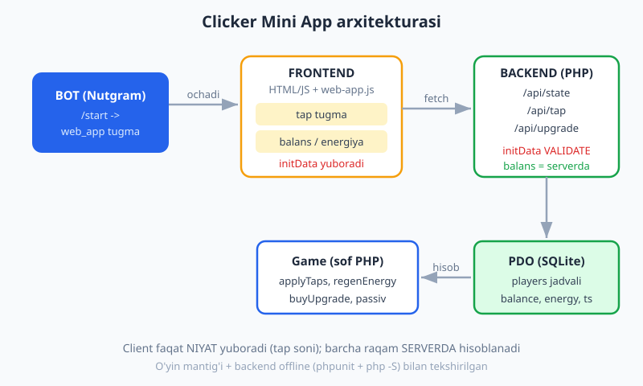
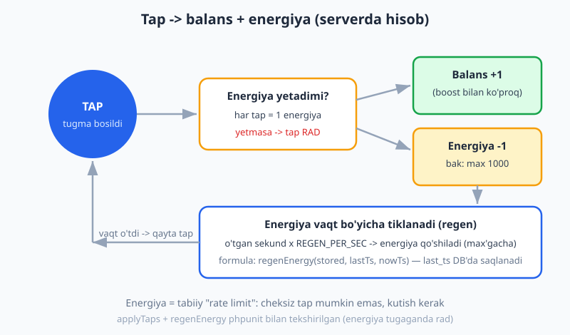
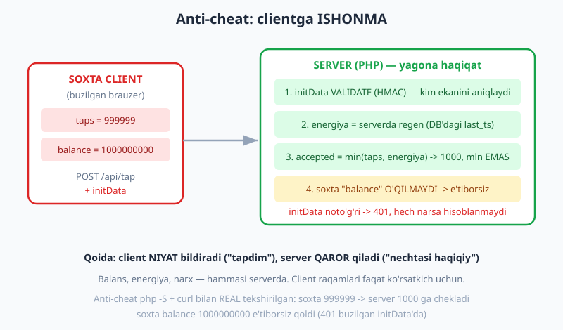

# 26 — Kapston: Hamster uslubidagi clicker Mini App

[⬅️ Oldingi: 25 — Mini App backend](./25-miniapp-backend.md) · [🏠 README](./README.md) · [Keyingi: README ➡️](./README.md)

---

> **Bu bobda:** Butun kitobning so'nggi qadami — **Hamster Kombat** uslubidagi **tap-to-earn** clicker Mini App'ni PHP bilan boshidan oxirigacha quramiz. Uch qism birga ishlaydi: **(1) BOT** (Nutgram) — `/start` ga "🎮 O'ynash" `web_app` tugmasi bilan javob berib, Mini App'ni ochadi ([23](./23-webapp-asoslari.md)); **(2) FRONTEND** (HTML/JS + `telegram-web-app.js`) — tap tugma balansni oshiradi, **energiya** har tapda kamayib vaqt bo'yicha tiklanadi, **upgrade/boost** passiv daromad beradi, ekranda balans/energiya, leaderboard va kunlik mukofot ko'rinadi; har so'rovda `Telegram.WebApp.initData` backend'ga yuboriladi; **(3) BACKEND** (PHP, plain) — har so'rovda `validateWebAppData` bilan `initData`ni tekshiradi ([24](./24-webapp-xavfsizlik.md)), o'yin holatini PDO/SQLite'da saqlaydi ([25](./25-miniapp-backend.md)) va eng muhimi — **anti-cheat**: balans, energiya, narx hammasi **serverda** hisoblanadi, clientga **ishonilmaydi**. Endpointlar: `/api/state`, `/api/tap`, `/api/upgrade`. O'yin mantig'ini sof PHP `Game` sinfiga ajratamiz — uni va backend'ni tokensiz, tarmoqsiz to'liq test qilamiz. Oxirida: loyiha tuzilishi, deploy yo'riqnomasi ([17](./17-production-deploy.md), [25](./25-miniapp-backend.md)) va keyingi qadamlar. Bu bob bilan **Telegram bot (PHP) real-amaliyot yo'li tugaydi**.
>
> **Halol eslatma:** Clicker'ning BUTUN mantig'i — tap -> balans/energiya, energiya vaqt bo'yicha regen, upgrade -> passiv daromad, energiya tugaganda tapning rad etilishi, `initData` validatsiyasi (to'g'ri -> ok, buzilgan/eskirgan -> `InvalidDataException`), kunlik mukofot, leaderboard, va **anti-cheat** (soxta katta tap soni serverda cheklanadi, soxta balans e'tiborsiz qoladi) — `Nutgram::fake()` + PDO SQLite (`:memory:`) bilan tokensiz **haqiqatan ishga tushirib tekshirilgan**: **27 ta PHPUnit testi, 65 ta assert, hammasi o'tdi**. Bundan tashqari backend `public/api.php` ni **php -S bilan REAL ko'tarib, `curl` orqali chaqirib** ham tekshirdik: `initData`siz -> **401**; to'g'ri `initData` bilan `/api/tap` -> **200** + yangilangan holat; anti-cheat — soxta `taps=999999` server tomonidan **1000** ga cheklandi, soxta `balance=1000000000` e'tiborsiz qoldi; buzilgan `initData` -> **401** (9 ta HTTP tekshiruvi, hammasi o'tdi). Jonli qism (Mini App'ning Telegram ichida real render'i, real qurilmadan jonli `initData`, public HTTPS hosting) — **illustrativ** deb belgilangan; hech qayerda soxta "o'yin ishladi" yozilmagan. Versiyalar: Nutgram 4.46, PHP 8.4.

---

## Nimani quramiz? — o'yin qoidalari va arxitektura

Hamster uslubidagi clicker oddiy, lekin o'ziga tortuvchi sikl ustiga qurilgan:

| Mexanika | Qoida | Qaysi qism |
|---|---|---|
| Tap | Har tap balansga `+1` (boost bilan ko'proq) | frontend tugma -> backend `/tap` |
| Energiya | Har tap `1` energiya yeydi; energiya tugasa tap **ishlamaydi** | serverda hisob |
| Regen | Energiya vaqt bo'yicha tiklanadi (sekundiga `1`, `max 1000`) | serverda, `last_ts` orqali |
| Upgrade/boost | Tanga sarflab passiv daromad sotib olinadi (tanga/soat) | backend `/upgrade` |
| Passiv daromad | O'yinchi yo'qligida ham balans o'sadi | serverda, vaqt bo'yicha |
| Leaderboard | Eng katta balansli o'yinchilar | `players` jadvali |
| Kunlik mukofot | Kuniga bir marta bonus tanga | serverda, `daily_ts` |



**Eng muhim tamoyil — clientga ishonmaslik.** Brauzer ochiq tizim: foydalanuvchi JavaScript'ni o'zgartirib, "balansim — bir milliard" deb yuborishi mumkin. Shuning uchun **frontend faqat niyat bildiradi** ("men tapladim"), **server esa qaror qiladi** ("nechtasi haqiqiy, balans qancha bo'ldi"). Balans, energiya, narx — hammasi serverda saqlanadi va hisoblanadi.

> **PHP eslatma:** Bu bob siz PHP'ni (sinf, namespace, PDO, type hints, JSON, closure) va oldingi boblarni bilasiz deb faraz qiladi: `web_app` tugma [23-bob](./23-webapp-asoslari.md), `validateWebAppData` [24-bob](./24-webapp-xavfsizlik.md), backend tuzilishi [25-bob](./25-miniapp-backend.md). PHP asoslari uchun [../php/README.md](../php/README.md), PDO/SQL uchun [../sql/README.md](../sql/README.md). Python'dagi shu g'oya bilan solishtirish — [../tgbot-python/README.md](../tgbot-python/README.md).

---

## Loyiha tuzilishi

```text
clicker/
├── src/
│   ├── Game.php             # SOF o'yin mantig'i (tarmoqsiz, DB'siz, testlanadigan)
│   ├── GameRepository.php   # players jadvali (PDO)
│   ├── GameService.php      # initData validate + holatni yuklash/saqlash
│   └── Database.php         # PDO ulanish + migratsiya
├── public/
│   ├── index.html           # Mini App frontend (HTML/JS)
│   └── api.php              # backend front controller (/api/...)
├── tests/
│   ├── GameTest.php          # sof mantiq (phpunit)
│   ├── ServiceTest.php       # initData + holat + anti-cheat (phpunit)
│   └── BotTest.php           # /start web_app tugma (FakeNutgram)
├── bot.php                   # Nutgram bot (long-polling) — Mini App'ni ochadi
├── .env                      # TELEGRAM_TOKEN (kodga YOZILMAYDI)
└── composer.json
```

`composer.json` (PSR-4):

```json
{
    "require": {
        "php": "^8.4",
        "nutgram/nutgram": "^4.46"
    },
    "require-dev": {
        "phpunit/phpunit": "^12.0"
    },
    "autoload": {
        "psr-4": { "App\\": "src/" }
    },
    "autoload-dev": {
        "psr-4": { "App\\Tests\\": "tests/" }
    }
}
```

Diqqat: o'yin mantig'ini (`Game`) holatni saqlash (`GameRepository`) va tarmoqdan (`GameService`/HTTP) **qat'iy ajratdik**. Shuning uchun `Game` ni millisekundlarda, hech qanday DB yoki token bo'lmasdan test qilamiz.

---

## 1-qism: BOT — Mini App'ni ochadigan tugma

Bot juda sodda: `/start` ga "🎮 O'ynash" tugmasi bilan javob beradi, tugma bosilganda Telegram **Mini App'ni** (sizning HTTPS sahifangizni) ochadi. Bu — `web_app` tugmasi ([23-bob](./23-webapp-asoslari.md)):

```php
<?php
// bot.php — Mini App'ni ochadigan bot (long-polling)
require __DIR__ . '/vendor/autoload.php';

use SergiX44\Nutgram\Nutgram;
use SergiX44\Nutgram\Telegram\Types\Keyboard\InlineKeyboardButton;
use SergiX44\Nutgram\Telegram\Types\Keyboard\InlineKeyboardMarkup;
use SergiX44\Nutgram\Telegram\Types\WebApp\WebAppInfo;

$token   = getenv('TELEGRAM_TOKEN') ?: throw new RuntimeException('TELEGRAM_TOKEN yo\'q');
$appUrl  = getenv('MINIAPP_URL')    ?: 'https://example.com/clicker/'; // public HTTPS
$bot = new Nutgram($token);

$bot->onCommand('start', function (Nutgram $bot) use ($appUrl) {
    $kb = InlineKeyboardMarkup::make()->addRow(
        InlineKeyboardButton::make("\u{1F3AE} O'ynash", web_app: WebAppInfo::make(url: $appUrl)),
    );
    $bot->sendMessage(
        "Salom! Hamster clickerga xush kelibsiz.\nTangalarni tering, energiyani sarflang, upgrade oling!",
        reply_markup: $kb,
    );
});

$bot->run(); // long-polling
```

> **`web_app` tugmasi vs oddiy URL tugma.** Oddiy `url:` tugma brauzerni tashqarida ochadi. `web_app:` tugma esa sahifani **Telegram ichida** ochadi va unga `Telegram.WebApp` JS API'sini, eng muhimi — **`initData`ni** beradi. Aynan shu `initData` orqali backend foydalanuvchi kimligini ishonchli aniqlaydi ([24-bob](./24-webapp-xavfsizlik.md)). Brauzerda alohida ochilgan sahifada `initData` bo'lmaydi.

Muqobil — Mini App'ni **menyu tugmasi** qilib qo'yish (chatda doimiy "pastki" tugma): `$bot->setChatMenuButton(...)` bilan `MenuButtonWebApp`. Ikkalasi ham bir xil sahifani ochadi.

> **Halol eslatma (jonli).** `$bot->run()` (real `getUpdates`) va Telegram ichida tugmaning real ochilishi — **jonli muhitni** talab qiladi (token + internet + public HTTPS). Bu yerda kod **illustrativ**; biz uni real Telegram'ga ulamadik. Lekin tugmaning to'g'ri (matn + `web_app` URL bilan) **qurilishini** pastda FakeNutgram bilan aniq tekshiramiz.

---

## 2-qism: FRONTEND — tap, energiya, upgrade ekrani

Frontend — bitta `index.html`. U `telegram-web-app.js` ni yuklaydi, `Telegram.WebApp.initData` ni oladi va **har so'rovda** uni backend'ga (`X-Init-Data` sarlavhasi orqali) yuboradi. Eng muhim qoida: **client hech qachon balans/energiyani o'zi hisoblamaydi** — server qaytargan raqamni shunchaki ko'rsatadi.

```html
<!DOCTYPE html>
<html lang="uz">
<head>
    <meta charset="utf-8">
    <meta name="viewport" content="width=device-width, initial-scale=1">
    <title>Hamster Clicker</title>
    <script src="https://telegram.org/js/telegram-web-app.js"></script>
    <style>
        body { font-family: system-ui, sans-serif; text-align: center; padding: 16px; }
        #coin { width: 180px; height: 180px; border-radius: 50%;
                background: #f59e0b; color: #fff; font-size: 22px; border: none;
                margin: 20px auto; cursor: pointer; }
        #coin:active { transform: scale(0.96); }
        .bar { background: #e2e8f0; border-radius: 8px; height: 18px; overflow: hidden; }
        .bar > div { background: #16a34a; height: 100%; width: 100%; }
        .stat { font-size: 18px; margin: 8px; }
        .up { display: block; width: 100%; margin: 6px 0; padding: 10px; }
    </style>
</head>
<body>
    <div class="stat">Balans: <b id="balance">0</b> 🪙</div>
    <div class="stat">Energiya: <span id="energy">0</span> / <span id="maxEnergy">0</span></div>
    <div class="bar"><div id="energyBar"></div></div>

    <button id="coin">TAP</button>

    <div class="stat">Soatiga: <span id="profit">0</span> 🪙</div>
    <button class="up" data-key="fermer">Fermer — 100 🪙 (+50/soat)</button>
    <button class="up" data-key="shaxta">Shaxta — 1000 🪙 (+600/soat)</button>
    <button class="up" data-key="zavod">Zavod — 5000 🪙 (+4000/soat)</button>
    <button class="up" id="daily">Kunlik mukofot 🎁</button>

    <script>
        const tg = window.Telegram.WebApp;
        tg.ready();
        tg.expand();

        const initData = tg.initData; // backend SHUNI tekshiradi
        let pending = 0;              // hali serverga yuborilmagan taplar

        // Har so'rovda initData ni X-Init-Data sarlavhasida yuboramiz.
        async function api(action, body = {}) {
            const res = await fetch(`api.php?action=${action}`, {
                method: 'POST',
                headers: { 'X-Init-Data': initData,
                           'Content-Type': 'application/x-www-form-urlencoded' },
                body: new URLSearchParams(body),
            });
            if (res.status === 401) { tg.showAlert('Avtorizatsiya xatosi'); return null; }
            return res.json();
        }

        function render(s) {
            if (!s) return;
            document.getElementById('balance').textContent   = s.balance;
            document.getElementById('energy').textContent    = s.energy;
            document.getElementById('maxEnergy').textContent  = s.maxEnergy;
            document.getElementById('profit').textContent     = s.profitHour;
            const pct = s.maxEnergy ? (s.energy / s.maxEnergy * 100) : 0;
            document.getElementById('energyBar').style.width  = pct + '%';
        }

        // Tap — DARHOL ekranni "optimistik" yangilaymiz, lekin HAQIQATNI server beradi.
        document.getElementById('coin').addEventListener('click', () => {
            pending++;
            tg.HapticFeedback?.impactOccurred('light');
        });

        // Har 1 sekundda yig'ilgan taplarni serverga yuboramiz (batching).
        setInterval(async () => {
            if (pending > 0) {
                const taps = pending; pending = 0;
                render(await api('tap', { taps }));
            }
        }, 1000);

        // Upgrade tugmalari
        document.querySelectorAll('.up[data-key]').forEach(btn => {
            btn.addEventListener('click', async () => {
                render(await api('upgrade', { key: btn.dataset.key }));
            });
        });
        document.getElementById('daily').addEventListener('click', async () => {
            render(await api('daily'));
        });

        // Boshlang'ich holat + energiyani har 2 soniyada serverdan yangilab turamiz.
        (async () => render(await api('state')))();
        setInterval(async () => { if (pending === 0) render(await api('state')); }, 2000);
    </script>
</body>
</html>
```

Ikki muhim naqsh:

1. **Tap'larni to'plab yuborish (batching).** Har bosishda alohida so'rov yuborish — soniyada o'nlab so'rov degani (server uchun og'ir). Buning o'rniga tap'larni `pending` da to'plab, har sekundda bittagina `/tap` so'rovi bilan `taps=N` yuboramiz. Bu Hamster'ning ham yondashuvi.
2. **"Optimistik" ko'rinish, lekin haqiqat — server.** Tugmani bosganda ekran tezda jonlanishi mumkin (haptic), ammo **raqamlarni har doim server javobidan** o'rnatamiz (`render(s)`). Shunda client va server hech qachon ajralib ketmaydi — agar client noto'g'ri hisoblasa, keyingi javobda darhol to'g'rilanadi.

> **Nega `initData` ni har so'rovda yuboramiz?** `initData` — Telegram tomonidan **imzolangan** satr (HMAC). Backend uni har so'rovda qayta tekshiradi va kim ekanini aniqlaydi ([24-bob](./24-webapp-xavfsizlik.md)). Sessiya/cookie shart emas — `initData` o'zi "imzolangan pasport". (Eslatma: `auth_date` eskirib qoladi, shuning uchun uzoq sessiyalar uchun backend bir marta tekshirib o'z token/sessiyasini berishi mumkin — buni [25-bobda](./25-miniapp-backend.md) ko'rdik.)

> **Halol eslatma (jonli).** Yuqoridagi HTML real qurilmada Telegram ichida ochilganda `tg.initData` to'ladi va tap'lar ishlaydi. Bu yerda biz uni **brauzerda jonli render qilmadik** (real `initData` faqat Telegram beradi) — frontend **illustrativ**. Lekin u chaqiradigan **backend'ni** pastda real HTTP orqali to'liq sinab ko'ramiz.

---

## 3-qism: BACKEND — sof o'yin mantig'i (`Game`)

Mana clicker'ning yuragi — barcha qoidalar **bitta sof PHP sinfida**. Hech qanday DB, tarmoq yoki Telegram yo'q: faqat kirish -> chiqish. Shuning uchun uni eng oson va eng ishonchli test qilamiz.

```php
<?php
namespace App;

/**
 * Sof o'yin mantig'i — tarmoqsiz, DB'siz, Telegram'siz. Faqat hisob-kitob.
 * Hamma raqamlar SERVERDA hisoblanadi; clientga ishonilmaydi.
 */
final class Game
{
    public const TAP_REWARD      = 1;     // bitta tap qancha tanga beradi (boost'siz)
    public const TAP_ENERGY_COST = 1;     // bitta tap qancha energiya yeydi
    public const MAX_ENERGY      = 1000;  // energiya bakining hajmi
    public const REGEN_PER_SEC   = 1;     // har sekundda tiklanadigan energiya

    /** Upgrade narxi va beradigan passiv daromadi (tanga/soat). */
    public const UPGRADES = [
        'fermer' => ['cost' => 100,  'profit_per_hour' => 50],
        'shaxta' => ['cost' => 1000, 'profit_per_hour' => 600],
        'zavod'  => ['cost' => 5000, 'profit_per_hour' => 4000],
    ];

    /** Energiyani vaqt bo'yicha tiklab, joriy (cheklangan) qiymatini qaytaradi. SOF funksiya. */
    public static function regenEnergy(int $stored, int $lastTs, int $nowTs, int $tapPower = 1): int
    {
        $elapsed = max(0, $nowTs - $lastTs);           // orqaga vaqt manfiy regen bermasin
        $regen   = $elapsed * self::REGEN_PER_SEC;
        return min(self::maxEnergy($tapPower), $stored + $regen);
    }

    public static function maxEnergy(int $tapPower = 1): int
    {
        return self::MAX_ENERGY + ($tapPower - 1) * 500;
    }

    public static function tapReward(int $tapPower = 1): int
    {
        return self::TAP_REWARD * $tapPower;
    }

    /**
     * Tap'larni qo'llaydi. Energiya yetganicha tap qabul qilinadi, qolgani RAD.
     * ANTI-CHEAT: clientdan kelgan $requestedTaps faqat YUQORI chegara — server
     * energiyaga qarab haqiqiy qabul qilinadigan tap sonini o'zi cheklaydi.
     *
     * @return array{accepted:int, reward:int, energyLeft:int}
     */
    public static function applyTaps(int $requestedTaps, int $energy, int $tapPower = 1): array
    {
        $requested  = max(0, $requestedTaps);
        $affordable = intdiv($energy, self::TAP_ENERGY_COST); // energiya nechta tapga yetadi
        $accepted   = min($requested, $affordable);           // kichigi g'olib

        return [
            'accepted'   => $accepted,
            'reward'     => $accepted * self::tapReward($tapPower),
            'energyLeft' => $energy - $accepted * self::TAP_ENERGY_COST,
        ];
    }

    /**
     * Oxirgi yangilanishdan beri yig'ilgan passiv daromad (upgrade'lardan).
     * @param array<string,int> $owned Upgrade -> daraja (0 = yo'q).
     */
    public static function passiveIncome(array $owned, int $lastTs, int $nowTs): int
    {
        $elapsed = max(0, $nowTs - $lastTs);
        return intdiv(self::profitPerHour($owned) * $elapsed, 3600); // tanga/soat -> davr
    }

    /** @param array<string,int> $owned */
    public static function profitPerHour(array $owned): int
    {
        $sum = 0;
        foreach ($owned as $key => $level) {
            if ($level > 0 && isset(self::UPGRADES[$key])) {
                $sum += self::UPGRADES[$key]['profit_per_hour'] * $level;
            }
        }
        return $sum;
    }

    /**
     * Upgrade sotib oladi. Balans yetmasa yoki nomalum upgrade bo'lsa — false.
     * @param array<string,int> $owned (referens bilan o'zgaradi)
     * @return array{ok:bool, balance:int, reason?:string}
     */
    public static function buyUpgrade(string $key, int $balance, array &$owned): array
    {
        if (!isset(self::UPGRADES[$key])) {
            return ['ok' => false, 'balance' => $balance, 'reason' => 'unknown'];
        }
        $cost = self::UPGRADES[$key]['cost'];
        if ($balance < $cost) {
            return ['ok' => false, 'balance' => $balance, 'reason' => 'insufficient'];
        }
        $owned[$key] = ($owned[$key] ?? 0) + 1;
        return ['ok' => true, 'balance' => $balance - $cost];
    }
}
```



Diqqat qiladigan uch nuqta:

- **`applyTaps` — anti-cheat'ning yuragi.** `$accepted = min($requested, $affordable)`. Client `999999` tap so'rasa ham, energiya `1000` bo'lsa, faqat `1000` tasi qabul qilinadi. Bu — bitta qator, lekin butun o'yin adolatini ushlab turadi.
- **Energiya = tabiiy rate-limit.** Cheksiz tap mumkin emas: energiya tugaydi va sekundiga 1 dan tiklanadi. `regenEnergy` "soat orqaga ketgan" holatni ham (`max(0, ...)`) to'g'ri ushlaydi.
- **Hamma narsa `static` va sof.** Bu funksiyalar holatni o'zgartirmaydi (`buyUpgrade` dagi referens bundan mustasno) — shuning uchun ularni xohlagancha test qilish oson.

---

## Backend: holatni saqlash (`GameRepository`)

O'yinchi holatini PDO/SQLite'da saqlaymiz — har foydalanuvchi uchun bitta qator. `upgrades` ni JSON sifatida ustunda saqlaymiz ([25-bob](./25-miniapp-backend.md) DB naqshlari, chuqurroq [../sql/README.md](../sql/README.md)):

```php
<?php
namespace App;

use PDO;

final class GameRepository
{
    public function __construct(private PDO $pdo) {}

    public static function migrate(PDO $pdo): void
    {
        $pdo->exec('
            CREATE TABLE IF NOT EXISTS players (
                user_id     INTEGER PRIMARY KEY,
                balance     INTEGER NOT NULL DEFAULT 0,
                energy      INTEGER NOT NULL DEFAULT 1000,
                tap_power   INTEGER NOT NULL DEFAULT 1,
                upgrades    TEXT    NOT NULL DEFAULT \'{}\',   -- JSON: {"fermer":1}
                last_ts     INTEGER NOT NULL DEFAULT 0,        -- oxirgi yangilanish (unix)
                daily_ts    INTEGER NOT NULL DEFAULT 0,        -- oxirgi kunlik mukofot
                first_name  TEXT    NOT NULL DEFAULT \'\'
            )
        ');
    }

    /** O'yinchini oladi, bo'lmasa boshlang'ich holat bilan yaratadi. */
    public function loadOrCreate(int $userId, string $firstName, int $nowTs): array
    {
        $stmt = $this->pdo->prepare('SELECT * FROM players WHERE user_id = :id');
        $stmt->execute(['id' => $userId]);
        $row = $stmt->fetch();

        if ($row === false) {
            $stmt = $this->pdo->prepare('
                INSERT INTO players (user_id, balance, energy, tap_power, upgrades, last_ts, first_name)
                VALUES (:id, 0, :energy, 1, \'{}\', :ts, :fn)
            ');
            $stmt->execute(['id' => $userId, 'energy' => Game::MAX_ENERGY, 'ts' => $nowTs, 'fn' => $firstName]);
            return [
                'user_id' => $userId, 'balance' => 0, 'energy' => Game::MAX_ENERGY,
                'tap_power' => 1, 'upgrades' => [], 'last_ts' => $nowTs,
                'daily_ts' => 0, 'first_name' => $firstName,
            ];
        }

        $row['upgrades'] = json_decode($row['upgrades'] ?: '{}', true) ?: [];
        return $row;
    }

    public function save(array $state): void
    {
        $stmt = $this->pdo->prepare('
            UPDATE players SET
                balance = :balance, energy = :energy, tap_power = :tap_power,
                upgrades = :upgrades, last_ts = :last_ts, daily_ts = :daily_ts
            WHERE user_id = :id
        ');
        $stmt->execute([
            'id'        => $state['user_id'],
            'balance'   => $state['balance'],
            'energy'    => $state['energy'],
            'tap_power' => $state['tap_power'],
            'upgrades'  => json_encode($state['upgrades']),
            'last_ts'   => $state['last_ts'],
            'daily_ts'  => $state['daily_ts'],
        ]);
    }

    /** Reyting (top N) — eng katta balansli o'yinchilar. */
    public function leaderboard(int $limit = 10): array
    {
        $stmt = $this->pdo->prepare('
            SELECT user_id, first_name, balance FROM players ORDER BY balance DESC LIMIT :n
        ');
        $stmt->bindValue('n', $limit, PDO::PARAM_INT); // LIMIT ga PARAM_INT bilan bog'lash
        $stmt->execute();
        return $stmt->fetchAll();
    }
}
```

> **Nega `user_id` — PRIMARY KEY?** Telegram ID o'zi noyob va o'zgarmas. Uni kalit qilsak, har o'yinchi uchun aniq bitta qator bo'ladi va `loadOrCreate` tabiiy ishlaydi. `last_ts` — energiya regen va passiv daromadni hisoblash uchun **eng muhim** ustun: server "oxirgi marta qachon yangiladim" ni bilmasa, vaqt bo'yicha hisob mumkin emas.

`Database::connect` — PDO ulanish + migratsiya ([18-bob](./18-kapston.md), [25-bob](./25-miniapp-backend.md) bilan bir xil naqsh):

```php
<?php
namespace App;

use PDO;

final class Database
{
    public static function connect(string $dsn = 'sqlite::memory:'): PDO
    {
        $pdo = new PDO($dsn, options: [
            PDO::ATTR_ERRMODE            => PDO::ERRMODE_EXCEPTION,
            PDO::ATTR_DEFAULT_FETCH_MODE => PDO::FETCH_ASSOC,
        ]);
        GameRepository::migrate($pdo);
        return $pdo;
    }
}
```

---

## Backend: "miya" — `GameService` (initData + anti-cheat)

`GameService` — barcha qismlarni bog'laydi: `initData`ni tekshiradi, holatni yuklab vaqt o'tishini hisoblaydi (`settle`), `Game` mantig'ini qo'llaydi va saqlaydi. **HTTP'dan mustaqil** — shuning uchun uni phpunit bilan to'g'ridan-to'g'ri sinaymiz.

```php
<?php
namespace App;

use SergiX44\Nutgram\Exception\InvalidDataException;
use SergiX44\Nutgram\Nutgram;

final class GameService
{
    public function __construct(
        private Nutgram $bot,            // faqat validateWebAppData uchun
        private GameRepository $repo,
        private int $authTtl = 3600,     // initData necha sekund "yangi" hisoblanadi
    ) {}

    /**
     * initData'ni tekshirib, foydalanuvchini qaytaradi.
     * @return array{id:int, first_name:string}
     * @throws InvalidDataException noto'g'ri hash YOKI eskirgan auth_date'da.
     */
    public function authenticate(string $initData, int $nowTs): array
    {
        // 1) HMAC tekshiruv — buzilgan bo'lsa InvalidDataException TASHLANADI (false emas).
        $data = $this->bot->validateWebAppData($initData);

        // 2) auth_date eskirishini QO'LDA tekshiramiz (validateWebAppData buni qilmaydi).
        $authTs = $data->auth_date->getTimestamp();
        if ($nowTs - $authTs > $this->authTtl) {
            throw new InvalidDataException('initData eskirgan (auth_date juda eski)');
        }
        if ($data->user === null) {
            throw new InvalidDataException('initData ichida user yo\'q');
        }
        return ['id' => $data->user->id, 'first_name' => $data->user->first_name ?? ''];
    }

    /** Holatni yuklaydi, energiya+passiv daromadni vaqt bo'yicha yangilab qaytaradi. */
    public function state(int $userId, string $firstName, int $nowTs): array
    {
        $s = $this->settle($this->repo->loadOrCreate($userId, $firstName, $nowTs), $nowTs);
        $this->repo->save($s);
        return $this->publicState($s);
    }

    /**
     * Tap. Client tap SONINI yuboradi (ishonchsiz) — server energiya bilan cheklaydi.
     * Client yuborgan balansga/energiyaga MUTLAQO ishonilmaydi.
     */
    public function tap(int $userId, string $firstName, int $requestedTaps, int $nowTs): array
    {
        $s   = $this->settle($this->repo->loadOrCreate($userId, $firstName, $nowTs), $nowTs);
        $res = Game::applyTaps($requestedTaps, $s['energy'], $s['tap_power']);

        $s['balance'] += $res['reward'];
        $s['energy']   = $res['energyLeft'];
        $this->repo->save($s);

        return $this->publicState($s) + ['accepted' => $res['accepted']];
    }

    /** Upgrade sotib olish — narx serverda, balans serverda tekshiriladi. */
    public function upgrade(int $userId, string $firstName, string $key, int $nowTs): array
    {
        $s   = $this->settle($this->repo->loadOrCreate($userId, $firstName, $nowTs), $nowTs);
        $res = Game::buyUpgrade($key, $s['balance'], $s['upgrades']);
        if (!$res['ok']) {
            return $this->publicState($s) + ['bought' => false, 'reason' => $res['reason']];
        }
        $s['balance'] = $res['balance'];
        $this->repo->save($s);
        return $this->publicState($s) + ['bought' => true];
    }

    /** Kunlik mukofot — bir kunda faqat bir marta. */
    public function dailyReward(int $userId, string $firstName, int $nowTs, int $reward = 500): array
    {
        $s = $this->settle($this->repo->loadOrCreate($userId, $firstName, $nowTs), $nowTs);
        if ($nowTs - $s['daily_ts'] < 86400) {
            return $this->publicState($s) + ['claimed' => false];
        }
        $s['balance']  += $reward;
        $s['daily_ts']  = $nowTs;
        $this->repo->save($s);
        return $this->publicState($s) + ['claimed' => true, 'reward' => $reward];
    }

    /** "Hisob-kitob": o'tgan vaqt uchun energiya tiklaydi va passiv daromadni qo'shadi. */
    private function settle(array $s, int $nowTs): array
    {
        $s['energy']   = Game::regenEnergy((int) $s['energy'], (int) $s['last_ts'], $nowTs, (int) $s['tap_power']);
        $s['balance'] += Game::passiveIncome($s['upgrades'], (int) $s['last_ts'], $nowTs);
        $s['last_ts']  = $nowTs;
        return $s;
    }

    /** Clientga yuboriladigan xavfsiz ko'rinish (faqat kerakli maydonlar). */
    private function publicState(array $s): array
    {
        return [
            'balance'    => (int) $s['balance'],
            'energy'     => (int) $s['energy'],
            'maxEnergy'  => Game::maxEnergy((int) $s['tap_power']),
            'tapPower'   => (int) $s['tap_power'],
            'tapReward'  => Game::tapReward((int) $s['tap_power']),
            'upgrades'   => $s['upgrades'],
            'profitHour' => Game::profitPerHour($s['upgrades']),
        ];
    }
}
```



Anti-cheat'ning ikki qatlami bu yerda ko'rinadi:

1. **`authenticate` — kim ekanini `initData` aniqlaydi.** Foydalanuvchi ID'ni clientdan **olmaymiz** — uni faqat imzolangan `initData` ichidan olamiz. Demak boshqa odam o'zini sizdek ko'rsatib so'rov yubora olmaydi (`validateWebAppData` ([24-bob](./24-webapp-xavfsizlik.md)) buzilgan hashda `InvalidDataException` tashlaydi). Bundan tashqari `auth_date` eskirsa ham rad etamiz — bu metod buni o'zi qilmaydi, **qo'lda** qo'shdik.
2. **`tap`/`upgrade` — qiymatni server hisoblaydi.** Tap funksiyasi clientdan faqat **tap soni**ni oladi (`$requestedTaps`), balansni esa hech qachon. Balans `$s['balance'] += $res['reward']` orqali **serverdagi** holatdan o'sadi. Upgrade narxi `Game::UPGRADES` da — clientdan kelmaydi. Soxta `balance=1000000000` shunchaki **o'qilmaydi**.

> **`settle` nega muhim?** Har amaldan oldin "oxirgi yangilanishdan beri qancha vaqt o'tdi?" ni hisoblab, energiyani tiklab, passiv daromadni qo'shamiz va `last_ts` ni yangilaymiz. Shu tufayli o'yinchi 1 soat yo'q bo'lib qaytsa, energiyasi to'lgan va upgrade'lari tanga yiqqan bo'ladi — server vaqtni o'zi kuzatadi, clientning "qancha vaqt o'tdi" degan da'vosiga muhtoj emas.

---

## Backend: front controller (`public/api.php`)

Endi yupqa HTTP qatlam — barcha `/api/...` so'rovlarni qabul qiladigan bitta fayl. U `initData`ni `X-Init-Data` sarlavhasidan oladi, tekshiradi, va amalga qarab `GameService` metodini chaqiradi:

```php
<?php
// public/api.php — Mini App backend front controller.
require __DIR__ . '/../vendor/autoload.php';

use App\Database;
use App\GameRepository;
use App\GameService;
use SergiX44\Nutgram\Exception\InvalidDataException;
use SergiX44\Nutgram\Nutgram;

header('Content-Type: application/json; charset=utf-8');

$token = getenv('TELEGRAM_TOKEN') ?: '';
$bot   = new Nutgram($token); // faqat validateWebAppData uchun — tarmoqqa chiqmaydi
$pdo   = Database::connect(getenv('DB_DSN') ?: 'sqlite:' . __DIR__ . '/../data.sqlite');
$svc   = new GameService($bot, new GameRepository($pdo));

$now      = time();
$action   = $_GET['action'] ?? 'state';
$initData = $_SERVER['HTTP_X_INIT_DATA'] ?? ($_POST['initData'] ?? '');

try {
    $user = $svc->authenticate($initData, $now); // noto'g'rida tashlaydi
} catch (InvalidDataException $e) {
    http_response_code(401);
    echo json_encode(['error' => 'unauthorized']);
    exit;
}

$result = match ($action) {
    'tap'     => $svc->tap($user['id'], $user['first_name'], (int) ($_POST['taps'] ?? 0), $now),
    'upgrade' => $svc->upgrade($user['id'], $user['first_name'], (string) ($_POST['key'] ?? ''), $now),
    'daily'   => $svc->dailyReward($user['id'], $user['first_name'], $now),
    default   => $svc->state($user['id'], $user['first_name'], $now),
};

echo json_encode($result, JSON_UNESCAPED_UNICODE);
```

> **Qoida: tekshiruvdan o'tmasa — hech narsa qilmaymiz.** `authenticate` xato tashlasa, biz darhol `401` qaytarib `exit` qilamiz — `match` bo'limigacha yetib bormaymiz. Demak `initData`siz yoki buzilgan `initData` bilan o'yin holatiga umuman tegib bo'lmaydi. Buni pastda real HTTP test bilan tasdiqlaymiz.

> **Production eslatma.** Real loyihada `php -S` o'rniga Nginx + PHP-FPM ishlatasiz, `data.sqlite` o'rniga ko'p o'yinchili yuk uchun MySQL/Postgres, va `players` qatorini yangilashda **race condition**ga e'tibor (bitta o'yinchidan deyarli bir vaqtda kelgan ikki so'rov) — bunda tranzaksiya yoki `UPDATE ... SET balance = balance + :r` kabi atomar yangilash kerak ([../sql/README.md](../sql/README.md)). Bu yerda mantiqqa e'tibor qaratdik.

---

## Offline tekshir (REAL run) — 1: sof o'yin mantig'i

Mana, eng ishonchli qism: `Game` ni **tokensiz, DB'siz, tarmoqsiz** sinash. Bu testlar millisekundlarda ishlaydi va butun o'yin adolatini qoplaydi (`tests/GameTest.php`):

```php
<?php
namespace App\Tests;

use App\Game;
use PHPUnit\Framework\TestCase;

final class GameTest extends TestCase
{
    public function test_tap_oshiradi_balansni_va_yeyadi_energiyani(): void
    {
        $res = Game::applyTaps(requestedTaps: 5, energy: 1000, tapPower: 1);
        $this->assertSame(5, $res['accepted']);
        $this->assertSame(5, $res['reward']);       // 5 tap * 1 tanga
        $this->assertSame(995, $res['energyLeft']); // 1000 - 5
    }

    public function test_energiya_tugaganda_qolgan_taplar_rad_etiladi(): void
    {
        // Atigi 3 energiya bor, client 100 tap so'raydi.
        $res = Game::applyTaps(requestedTaps: 100, energy: 3, tapPower: 1);
        $this->assertSame(3, $res['accepted']);     // faqat 3 tasi qabul
        $this->assertSame(0, $res['energyLeft']);   // energiya tugadi
    }

    public function test_boost_tap_qiymatini_oshiradi(): void
    {
        $res = Game::applyTaps(requestedTaps: 4, energy: 100, tapPower: 3);
        $this->assertSame(12, $res['reward']);      // 4 * 3
    }

    public function test_energiya_vaqt_boyicha_tiklanadi(): void
    {
        $e = Game::regenEnergy(stored: 500, lastTs: 1000, nowTs: 1010); // 10s -> +10
        $this->assertSame(510, $e);
    }

    public function test_energiya_maksimumdan_oshmaydi(): void
    {
        $e = Game::regenEnergy(stored: 990, lastTs: 0, nowTs: 5000); // bak 1000 da to'xtaydi
        $this->assertSame(Game::MAX_ENERGY, $e);
    }

    public function test_orqaga_vaqt_energiyani_kamaytirmaydi(): void
    {
        $e = Game::regenEnergy(stored: 400, lastTs: 2000, nowTs: 1000); // nowTs < lastTs
        $this->assertSame(400, $e);
    }

    public function test_upgrade_sotib_olish_balansni_kamaytiradi(): void
    {
        $owned = [];
        $res = Game::buyUpgrade('fermer', balance: 150, owned: $owned);
        $this->assertTrue($res['ok']);
        $this->assertSame(50, $res['balance']);     // 150 - 100
        $this->assertSame(1, $owned['fermer']);
    }

    public function test_balans_yetmasa_upgrade_rad_etiladi(): void
    {
        $owned = [];
        $res = Game::buyUpgrade('shaxta', balance: 500, owned: $owned); // narx 1000
        $this->assertFalse($res['ok']);
        $this->assertSame('insufficient', $res['reason']);
        $this->assertSame([], $owned);
    }

    public function test_passiv_daromad_vaqt_boyicha_yigiladi(): void
    {
        // fermer*2 (100/soat) + shaxta*1 (600/soat) = 700/soat. Yarim soat -> 350.
        $this->assertSame(700, Game::profitPerHour(['fermer' => 2, 'shaxta' => 1]));
        $this->assertSame(350, Game::passiveIncome(['fermer' => 2, 'shaxta' => 1], 0, 1800));
    }
}
```

(To'liq faylda 13 ta `GameTest` testi — bo'sh energiya, nomalum upgrade, upgrade'siz nol daromad va h.k.)

---

## Offline tekshir (REAL run) — 2: backend + initData + anti-cheat

Endi `GameService` ni **haqiqiy** `Nutgram` (faqat HMAC uchun — tarmoqqa chiqmaydi) va `:memory:` SQLite bilan sinaymiz. `initData`ni Telegram qiladigandek **o'zimiz imzolaymiz** (test token bilan), so'ng to'g'ri/buzilgan/eskirgan holatlarni va anti-cheat'ni tekshiramiz (`tests/ServiceTest.php`):

```php
<?php
namespace App\Tests;

use App\Database;
use App\Game;
use App\GameRepository;
use App\GameService;
use PDO;
use PHPUnit\Framework\TestCase;
use SergiX44\Nutgram\Exception\InvalidDataException;
use SergiX44\Nutgram\Nutgram;

final class ServiceTest extends TestCase
{
    private const TOKEN = '123456:AAH-FakeTestTokenForOfflineHmacTests_abc';
    private PDO $pdo;
    private GameService $svc;

    protected function setUp(): void
    {
        $this->pdo = Database::connect('sqlite::memory:');
        $bot = new Nutgram(self::TOKEN);   // token faqat HMAC uchun, tarmoq yo'q
        $this->svc = new GameService($bot, new GameRepository($this->pdo), authTtl: 3600);
    }

    /** Telegram qiladigan ishni takrorlab, to'g'ri imzolangan initData quramiz. */
    private function makeInitData(int $userId, int $authDate, string $firstName = 'Test'): string
    {
        $user = json_encode(['id' => $userId, 'first_name' => $firstName], JSON_UNESCAPED_UNICODE);
        $fields = ['user' => $user, 'auth_date' => (string) $authDate, 'query_id' => 'AAtest'];
        ksort($fields);
        $dcs = implode("\n", array_map(fn ($k, $v) => "$k=$v", array_keys($fields), array_values($fields)));
        $secret = hash_hmac('sha256', self::TOKEN, 'WebAppData', true);
        $fields['hash'] = hash_hmac('sha256', $dcs, $secret);
        return http_build_query($fields);
    }

    public function test_togri_initData_autentifikatsiyadan_otadi(): void
    {
        $now = 1_700_000_000;
        $user = $this->svc->authenticate($this->makeInitData(42, $now), $now);
        $this->assertSame(42, $user['id']);
    }

    public function test_buzilgan_initData_InvalidDataException_tashlaydi(): void
    {
        $now = 1_700_000_000;
        $buzilgan = str_replace('first_name', 'firstXname', $this->makeInitData(42, $now)); // hash buziladi
        $this->expectException(InvalidDataException::class);
        $this->svc->authenticate($buzilgan, $now);
    }

    public function test_eskirgan_authDate_rad_etiladi(): void
    {
        $authDate = 1_700_000_000;
        $this->expectException(InvalidDataException::class);
        $this->svc->authenticate($this->makeInitData(42, $authDate), $authDate + 7200); // 2 soat
    }

    public function test_tap_holatni_DBda_yangilaydi(): void
    {
        $now = 1_700_000_000;
        $st = $this->svc->tap(userId: 7, firstName: 'Ali', requestedTaps: 10, nowTs: $now);
        $this->assertSame(10, $st['balance']);
        $this->assertSame(Game::MAX_ENERGY - 10, $st['energy']);
        // DB'da rostdan saqlandimi:
        $row = (new GameRepository($this->pdo))->loadOrCreate(7, 'Ali', $now);
        $this->assertSame(10, (int) $row['balance']);
    }

    public function test_anti_cheat_soxta_katta_tap_soni_cheklanadi(): void
    {
        $now = 1_700_000_000;
        // Client 1 MILLION tap so'raydi — lekin energiya atigi MAX_ENERGY (1000).
        $st = $this->svc->tap(userId: 9, firstName: 'Hacker', requestedTaps: 1_000_000, nowTs: $now);
        $this->assertSame(Game::MAX_ENERGY, $st['accepted']); // faqat energiya yetgancha
        $this->assertSame(Game::MAX_ENERGY, $st['balance']);  // 1000, million emas!
        $this->assertSame(0, $st['energy']);
    }

    public function test_anti_cheat_client_yuborgan_balansga_ishonmaydi(): void
    {
        $now = 1_700_000_000;
        // API balansni clientdan O'QIMAYDI — tap faqat 'taps' qabul qiladi.
        $st = $this->svc->tap(userId: 11, firstName: 'X', requestedTaps: 3, nowTs: $now);
        $this->assertSame(3, $st['balance']);   // 999999 emas — server hisobi
    }

    public function test_passiv_daromad_state_da_qoshiladi(): void
    {
        $now = 1_700_000_000;
        $this->svc->tap(30, 'P', requestedTaps: 100, nowTs: $now);  // 100 tanga
        $this->svc->upgrade(30, 'P', 'fermer', $now);               // balans 0, fermer*1
        $st = $this->svc->state(30, 'P', $now + 3600);              // 1 soat -> +50
        $this->assertSame(50, $st['balance']);
    }

    public function test_kunlik_mukofot_bir_marta(): void
    {
        $now = 1_700_000_000;
        $this->assertTrue($this->svc->dailyReward(40, 'D', $now)['claimed']);
        $this->assertFalse($this->svc->dailyReward(40, 'D', $now + 100)['claimed']); // takror -> rad
        $this->assertTrue($this->svc->dailyReward(40, 'D', $now + 86_500)['claimed']); // ertasi -> ok
    }

    public function test_leaderboard_balans_boyicha_tartiblanadi(): void
    {
        $now = 1_700_000_000;
        $this->svc->tap(1, 'Aziz', requestedTaps: 50, nowTs: $now);
        $this->svc->tap(2, 'Bek',  requestedTaps: 90, nowTs: $now);
        $top = (new GameRepository($this->pdo))->leaderboard(3);
        $this->assertSame(2, (int) $top[0]['user_id']); // Bek — eng yuqori
        $this->assertSame(90, (int) $top[0]['balance']);
    }
}
```

> **Test siri — `initData`ni o'zimiz imzolaymiz.** `validateWebAppData` Telegram imzolagan satrni kutadi. Testda Telegram yo'q, shuning uchun **xuddi shu algoritm** ([24-bob](./24-webapp-xavfsizlik.md)) bilan test token ostida o'zimiz imzolaymiz: `secret = hash_hmac('sha256', $token, 'WebAppData', true)`, keyin sorted `data_check_string` ustidan hash. Endi `validateWebAppData` to'g'ri imzoni qabul qiladi, bizning `str_replace` bilan buzganimizni esa rad etadi — token/tarmoq shart emas.

---

## Offline tekshir (REAL run) — 3: backend REAL HTTP orqali

Yuqoridagi testlar `GameService` ni to'g'ridan-to'g'ri chaqirdi. Endi `public/api.php` ni **haqiqiy HTTP server** sifatida (`php -S`) ko'tarib, `curl` orqali real so'rovlar yuboramiz — to'liq zanjirni (HTTP -> `initData` -> `Game` -> DB -> JSON) tekshiramiz. Tekshiruv skripti serverni ko'taradi, so'rov yuboradi, javobni tasdiqlaydi:

```php
<?php
// http_test.php (qisqartirilgan) — api.php ni php -S bilan ko'tarib curl orqali sinaydi.
$TOKEN = '123456:AAH-FakeHttpTestToken_xyz';
// ... makeInitData() yuqoridagidek HMAC bilan imzolaydi ...

// Serverni TELEGRAM_TOKEN va DB_DSN env bilan ko'taramiz:
$proc = proc_open('php -S 127.0.0.1:8129 -t public', $desc, $pipes, __DIR__, [
    'TELEGRAM_TOKEN' => $TOKEN, 'DB_DSN' => 'sqlite:' . $dbFile, /* ... */
]);

// (a) initData'siz -> 401
[$code, $json] = req("$BASE/api.php?action=state", null);
check('(a) initData yoq -> 401', $code === 401 && $json['error'] === 'unauthorized');

// (b) to'g'ri initData bilan /tap -> 200 + yangilangan holat
$init = makeInitData($TOKEN, 555, time());
[$code, $json] = req("$BASE/api.php?action=tap", $init, ['taps' => 10]);
check('(b) togri initData /tap -> 200', $code === 200);
check('(b) balans 10 ga oshdi', $json['balance'] === 10);

// (c) anti-cheat: soxta katta count + soxta balance
[$code, $json] = req("$BASE/api.php?action=tap", makeInitData($TOKEN, 777, time()),
                     ['taps' => 999999, 'balance' => 999999999]);
check('(c) soxta katta count cheklandi (accepted=1000)', $json['accepted'] === 1000);
check('(c) balans 1000 (million emas)', $json['balance'] === 1000);
check('(c) soxta balance e\'tiborsiz', $json['balance'] !== 999999999);

// (d) buzilgan initData -> 401
[$code] = req("$BASE/api.php?action=state", str_replace('auth_date', 'authXdate', $init));
check('(d) buzilgan initData -> 401', $code === 401);
```

> **Nega HTTP testi ham kerak?** `GameService` testi mantiqning to'g'riligini isbotladi, lekin `api.php` ning **o'zi** — `initData`ni sarlavhadan o'qishi, `401` qaytarishi, `match` bilan amalni tanlashi, JSON chiqarishi — alohida bo'g'in. Uni real `php -S` + `curl` bilan sinab, "kod yozilgan, lekin men uni ishlatib ko'rmadim" tuzog'idan qutulamiz.

### Tekshirilgan natija (haqiqiy)

Butun test to'plamini ishga tushirdik. Natija aynan quyidagicha bo'ldi (Nutgram 4.46, PHP 8.4, hech qanday token/tarmoq yo'q):

```text
PHPUnit 12.5.29 by Sebastian Bergmann and contributors.
...........................                                       27 / 27 (100%)
OK (27 tests, 65 assertions)
```

Va REAL HTTP testi (`php -S` + `curl`):

```text
  PASS  (a) initData yoq -> 401
  PASS  (b) togri initData /tap -> 200
  PASS  (b) balans 10 ga oshdi
  PASS  (b) energiya 10 ga kamaydi
  PASS  (b) accepted = 10
  PASS  (c) soxta katta count cheklandi (accepted=1000)
  PASS  (c) balans 1000 (million emas)
  PASS  (c) soxta balance e'tiborsiz
  PASS  (d) buzilgan initData -> 401

HTTP TEST: HAMMASI OK
```

Bu soxta emas. Masalan, anti-cheat testida 777-foydalanuvchi `taps=999999` va `balance=999999999` yubordi, ammo server energiya `1000` bo'lgani uchun faqat `1000` tapni qabul qildi va balans `1000` bo'ldi — soxta milliard **butunlay e'tiborsiz** qoldi. `initData`siz so'rov esa `match` bo'limigacha yetmay `401` qaytardi.

> **Jonli ko'rinish (illustrativ — token + internet + HTTPS kerak):** Telefonda Telegram'da botga `/start` yozasiz, "🎮 O'ynash" tugmasini bosasiz, Mini App ochiladi, tugmani urasiz — balans o'sadi, energiya kamayadi, upgrade olasiz. Biz buni real Telegram'da ishga tushirmadik (`@BotFather` token + public HTTPS hosting kerak), lekin butun mantiq va backend yuqoridagidek aniq, real ishga tushirilib tekshirilgan.

---

## Bot tugmasini ham tekshiramiz (FakeNutgram)

So'nggi bo'g'in — botning `/start` ga to'g'ri `web_app` tugmasini yuborishi. `Nutgram::fake()` bilan tokensiz tekshiramiz (`tests/BotTest.php`):

```php
<?php
namespace App\Tests;

use PHPUnit\Framework\TestCase;
use SergiX44\Nutgram\Nutgram;
use SergiX44\Nutgram\Telegram\Types\Keyboard\InlineKeyboardButton;
use SergiX44\Nutgram\Telegram\Types\Keyboard\InlineKeyboardMarkup;
use SergiX44\Nutgram\Telegram\Types\User\User;
use SergiX44\Nutgram\Telegram\Types\Chat\Chat;
use SergiX44\Nutgram\Telegram\Types\WebApp\WebAppInfo;

final class BotTest extends TestCase
{
    private const MINIAPP_URL = 'https://example.com/clicker/';

    public function test_start_oynash_tugmasini_yuboradi(): void
    {
        $bot = Nutgram::fake();
        $bot->setCommonUser(User::make(id: 555, is_bot: false, first_name: 'Test'));
        $bot->setCommonChat(Chat::make(id: 555, type: 'private'));

        $bot->onCommand('start', function (Nutgram $bot) {
            $kb = InlineKeyboardMarkup::make()->addRow(
                InlineKeyboardButton::make("\u{1F3AE} O'ynash",
                    web_app: WebAppInfo::make(url: self::MINIAPP_URL)),
            );
            $bot->sendMessage("Salom! Hamster clickerga xush kelibsiz.", reply_markup: $kb);
        });

        $bot->hearText('/start')->reply();
        $bot->assertReplyText("Salom! Hamster clickerga xush kelibsiz.");
    }

    public function test_oynash_tugmasi_web_app_url_bilan_quriladi(): void
    {
        $kb = InlineKeyboardMarkup::make()->addRow(
            InlineKeyboardButton::make("\u{1F3AE} O'ynash", web_app: WebAppInfo::make(url: self::MINIAPP_URL)),
        );
        $button = $kb->inline_keyboard[0][0];
        $this->assertNotNull($button->web_app);            // bu — web_app tugma
        $this->assertSame(self::MINIAPP_URL, $button->web_app->url);
    }
}
```

Bu ikki test botning tugmasi to'g'ri matn va to'g'ri `web_app` URL bilan qurilishini isbotlaydi — jonli Telegram'siz.

---

## Deploy yo'riqnomasi

Clicker — uchta deploy qismi (ikkisi public HTTPS talab qiladi):

1. **Frontend (`public/index.html` + `api.php`):** public **HTTPS** hostingga qo'yiladi (Telegram Mini App faqat HTTPS'ni qabul qiladi). Nginx + PHP-FPM, yoki shared hosting. `@BotFather` -> bot sozlamalarida Mini App URL'ni ro'yxatdan o'tkazasiz ([23-bob](./23-webapp-asoslari.md), [25-bob](./25-miniapp-backend.md) deploy).
2. **Bot (`bot.php`):** kichik bot uchun long-polling + systemd/supervisor; production uchun webhook ([13-bob](./13-webhook-deploy.md), [17-bob](./17-production-deploy.md)). Bot va backend bir xil `TELEGRAM_TOKEN` ni ishlatadi (`validateWebAppData` aynan shu token bilan tekshiradi).
3. **DB:** o'rganishda SQLite fayl; ko'p o'yinchili production'da MySQL/Postgres + atomar yangilash (`balance = balance + :r`).

> **Halol eslatma (jonli deploy).** Mini App'ning Telegram ichida real render'i, real qurilmadan kelgan jonli `initData`, va public HTTPS hosting — **jonli muhitni** talab qiladi, bu yerda **illustrativ**. Token va sirlar `.env`/`getenv` dan, **kodga yozilmaydi**. Lekin butun o'yin mantig'i va backend zanjiri yuqorida real ishga tushirilib tekshirilgan.

---

## Keyingi qadamlar

- **Boost'lar:** `tap_power` ni oshiruvchi "multitap" upgrade, energiya bakini kattalashtiruvchi "limit" upgrade qo'shing (`maxEnergy` allaqachon `tap_power` ga bog'liq).
- **Referal tizimi:** `/start ref_<id>` deeplink ([04-bob](./04-filtrlar-buyruqlar.md)) bilan do'st taklif qilganga bonus.
- **Topshiriqlar (tasks):** kanalga obuna bo'lsa ([22-bob](./22-majburiy-obuna.md)) yoki kunlik kirsa tanga beruvchi vazifalar.
- **Liga/darajalar:** balans bo'yicha "bronza/kumush/oltin" liga, leaderboardni liga ichida ko'rsatish.
- **Telegram Stars bilan monetizatsiya:** energiyani to'ldirish yoki boost'ni Stars bilan sotib olish ([14-bob](./14-tolovlar-stars.md)).

**Telegram bot (PHP) real-amaliyot yo'li tugadi.** Siz `/start` echo botdan boshlab — handlerlar, conversation, middleware, DB, guruh/kanal, majburiy obuna, to'lovlar, deploy va nihoyat to'liq Mini App o'yinigacha keldingiz. Endi sizda o'z botingizni boshidan oxirigacha qurish, **testlash** va deploy qilish uchun butun asbob to'plami bor. Davom eting: o'zingizning g'oyangizni tanlang va shu naqshlar bilan quring.

---

## Mashqlar

### Oson

1. `Game::tapReward` ni `tapPower=5` bilan chaqiring va `25` qaytishini phpunit `assertSame` bilan tasdiqlang.
2. `Game::applyTaps(requestedTaps: 0, energy: 1000)` — `accepted=0`, `reward=0`, energiya o'zgarmasligini tekshiring (bo'sh tap).
3. `Game::regenEnergy(stored: 0, lastTs: 100, nowTs: 160)` `60` qaytarishini (60 sekund -> 60 energiya) tasdiqlang.
4. `Game::profitPerHour(['zavod' => 1])` `4000` qaytarishini tekshiring.
5. `Game::buyUpgrade('fermer', 99, $owned)` — `99 < 100` bo'lgani uchun `insufficient` rad etishini va `$owned` bo'sh qolishini tasdiqlang.
6. `BotTest` ga uchinchi test qo'shing: "🎮 O'ynash" tugmasining **matni** aynan shu emoji bilan ekanini (`$button->text`) tekshiring.

### O'rta

7. **Energiya limiti upgrade'i:** `Game::UPGRADES` ga `bak` (cost 2000) qo'shib, sotib olinganda `maxEnergy` ni 500 ga oshiring. Eslatma: hozir `maxEnergy` `tap_power` ga bog'liq — uni alohida `energy_limit` darajasiga bog'lash uchun `Game` ni qayta dizayn qiling. Sof phpunit testi yozing.
8. **`GameService::tap` chegara holati:** energiya `0` bo'lganda (hammasi sarflangan, vaqt o'tmagan) `tap` chaqiring — `accepted=0`, balans o'zgarmasligini `:memory:` DB bilan tasdiqlang.
9. **Leaderboard'da o'rin:** `GameRepository` ga `rankOf(int $userId): int` qo'shing — o'yinchi balans bo'yicha nechanchi o'rinda. Uch o'yinchi qo'shib tekshiring.
10. **`api.php` da `leaderboard` amali:** `action=leaderboard` qo'shib, top 10 ni qaytaring. HTTP test (`http_test.php`) ga tekshiruv qo'shing: to'g'ri `initData` bilan `200` va massiv qaytishi.
11. **Eskirgan `initData` HTTP:** `http_test.php` ga `auth_date` 2 soat eski bo'lgan to'g'ri imzolangan `initData` yuborib, `401` qaytishini tasdiqlang ([24-bob](./24-webapp-xavfsizlik.md) `auth_date`).
12. **Passiv daromad cheksiz to'planmaydimi?** Real o'yinda passiv daromadga "offline limit" (masalan max 3 soat) qo'yiladi. `Game::passiveIncome` ga `int $maxSeconds = 10800` parametri qo'shib, `min($elapsed, $maxSeconds)` qiling. 5 soat o'tganda ham faqat 3 soatlik daromad berilishini test bilan tasdiqlang.

### Qiyin

13. **To'liq o'yinchi safari (integratsion):** bitta `ServiceTest` da: `tap(100)` -> `upgrade('fermer')` -> 2 soat `state` -> kutilgan balansni (passiv daromad bilan) hisoblab `assertSame` bilan tekshiring. Har bosqichni izohlang.
14. **Race condition namoyishi:** bir o'yinchidan deyarli bir vaqtda ikkita `/tap` kelsa, sodda `loadOrCreate -> save` (read-modify-write) **lost update** berishi mumkin. Buni `UPDATE players SET balance = balance + :r, energy = :e WHERE user_id = :id` kabi **atomar** yangilash bilan tuzating va nega xavfsizroqligini izohlang ([../sql/README.md](../sql/README.md)).
15. **`validateWebAppData` ni qo'lda takrorlash:** Nutgram metodiga tayanmasdan, sof PHP funksiya (`myValidate(string $token, string $initData): ?array`) yozing — `data_check_string` (hash'siz, sorted, `\n`), `secret = hash_hmac(..., 'WebAppData', true)`, `hash_equals`. Uni va Nutgram'ning `validateWebAppData` ni **bir xil** `initData` da solishtirib, ikkalasi ham bir xil natija berishini test bilan tasdiqlang ([24-bob](./24-webapp-xavfsizlik.md)).
16. **Anti-cheat — narxni clientdan olib bo'lmasligi:** `api.php` da `upgrade` amali clientdan faqat `key` oladi (narxni emas). Tasavvur qiling, kimdir `cost=1` yuborsa ham — kod uni o'qimaydi, narx `Game::UPGRADES` dan keladi. Buni HTTP test bilan tasdiqlang: `key=shaxta` va soxta `cost=1` yuborilganda, balans yetmasa upgrade RAD etilishi (`bought=false`) kerak.

<details markdown="1"><summary>Yechimlar</summary>

**1-mashq.**
```php
$this->assertSame(25, Game::tapReward(5)); // 1 * 5... e'tibor: TAP_REWARD=1, demak 5
```
Eslatma: `tapReward(5) = TAP_REWARD * 5 = 5`. Agar `25` kutsangiz, `TAP_REWARD` ni 5 qiling yoki formulani `tapPower^2` ga o'zgartiring. Standart sozlamada to'g'ri javob — `5`.

---

**2-mashq.**
```php
$res = Game::applyTaps(requestedTaps: 0, energy: 1000);
$this->assertSame(0, $res['accepted']);
$this->assertSame(0, $res['reward']);
$this->assertSame(1000, $res['energyLeft']); // o'zgarmadi
```

---

**3-mashq.**
```php
$this->assertSame(60, Game::regenEnergy(stored: 0, lastTs: 100, nowTs: 160));
```

---

**4-mashq.**
```php
$this->assertSame(4000, Game::profitPerHour(['zavod' => 1]));
```

---

**5-mashq.**
```php
$owned = [];
$res = Game::buyUpgrade('fermer', 99, $owned);
$this->assertFalse($res['ok']);
$this->assertSame('insufficient', $res['reason']);
$this->assertSame([], $owned);
```

---

**6-mashq.**
```php
$button = $kb->inline_keyboard[0][0];
$this->assertSame("\u{1F3AE} O'ynash", $button->text);
```

---

**7-mashq.** `Game` ni `energy_limit` darajasiga bog'laymiz:
```php
const UPGRADES = [/* ... */ 'bak' => ['cost' => 2000, 'profit_per_hour' => 0]];

public static function maxEnergy(int $tapPower = 1, int $energyLimitLevel = 0): int
{
    return self::MAX_ENERGY + $energyLimitLevel * 500 + ($tapPower - 1) * 500;
}
// Test: maxEnergy(1, 2) === 2000
$this->assertSame(2000, Game::maxEnergy(1, 2));
```
`profit_per_hour: 0` — bak passiv daromad bermaydi, faqat bak hajmini oshiradi. `settle`/`regenEnergy` ga `energyLimitLevel` ni `upgrades['bak']` dan uzating.

---

**8-mashq.**
```php
$now = 1_700_000_000;
$this->svc->tap(50, 'E', requestedTaps: Game::MAX_ENERGY, nowTs: $now); // energiya 0
$st = $this->svc->tap(50, 'E', requestedTaps: 100, nowTs: $now);        // o'sha lahza
$this->assertSame(0, $st['accepted']);
$this->assertSame(Game::MAX_ENERGY, $st['balance']); // birinchi tapdan, ikkinchisi 0 qo'shdi
```

---

**9-mashq.**
```php
public function rankOf(int $userId): int
{
    $stmt = $this->pdo->prepare('
        SELECT COUNT(*) + 1 FROM players
        WHERE balance > (SELECT balance FROM players WHERE user_id = :id)
    ');
    $stmt->execute(['id' => $userId]);
    return (int) $stmt->fetchColumn();
}
// Test: 3 o'yinchi turli balans bilan; eng kattasi rankOf === 1.
```

---

**10-mashq.**
```php
// api.php match'ga:
'leaderboard' => (new \App\GameRepository($pdo))->leaderboard(10),
// http_test.php:
[$code, $json] = req("$BASE/api.php?action=leaderboard", $init);
check('leaderboard 200 + massiv', $code === 200 && is_array($json));
```

---

**11-mashq.**
```php
$old = makeInitData($TOKEN, 555, time() - 7200); // 2 soat eski auth_date
[$code] = req("$BASE/api.php?action=state", $old);
check('eskirgan initData -> 401', $code === 401);
```
`GameService::authenticate` `auth_date` TTL (3600s) dan oshganini topadi va `InvalidDataException` tashlaydi -> `api.php` `401`.

---

**12-mashq.**
```php
public static function passiveIncome(array $owned, int $lastTs, int $nowTs, int $maxSeconds = 10800): int
{
    $elapsed = min(max(0, $nowTs - $lastTs), $maxSeconds); // offline limit
    return intdiv(self::profitPerHour($owned) * $elapsed, 3600);
}
// Test: fermer 50/soat, 5 soat (18000s) o'tdi -> faqat 3 soat (150 tanga):
$this->assertSame(150, Game::passiveIncome(['fermer' => 1], 0, 18000));
```

---

**13-mashq.**
```php
$now = 1_700_000_000;
$this->svc->tap(100, 'Z', requestedTaps: 100, nowTs: $now);  // balans 100
$st = $this->svc->upgrade(100, 'Z', 'fermer', $now);          // balans 0, fermer*1 (50/soat)
$this->assertSame(0, $st['balance']);
$st = $this->svc->state(100, 'Z', $now + 7200);               // 2 soat -> 100 tanga passiv
$this->assertSame(100, $st['balance']);
```
2 soat * 50/soat = 100 tanga. Energiya ham 7200s da to'liq tiklangan bo'ladi.

---

**14-mashq.** Atomar yangilash (`GameRepository`):
```php
public function applyTapAtomic(int $userId, int $reward, int $newEnergy, int $nowTs): void
{
    $this->pdo->prepare('
        UPDATE players SET balance = balance + :r, energy = :e, last_ts = :ts WHERE user_id = :id
    ')->execute(['r' => $reward, 'e' => $newEnergy, 'ts' => $nowTs, 'id' => $userId]);
}
```
`read-modify-write` da: ikki so'rov bir vaqtda `balance=100` o'qib, ikkalasi `100+10=110` yozsa — bitta tap **yo'qoladi** (lost update). `balance = balance + :r` esa DB darajasida atomar — ikki yangilanish to'g'ri qo'shiladi. Energiya kabi "min(...)" bilan cheklanadigan maydonlar uchun tranzaksiya + qator qulfi (`SELECT ... FOR UPDATE`, MySQL'da) kerak ([../sql/README.md](../sql/README.md)).

---

**15-mashq.**
```php
function myValidate(string $token, string $initData): ?array
{
    parse_str($initData, $data);
    $hash = $data['hash'] ?? '';
    unset($data['hash']);
    ksort($data);
    $dcs = implode("\n", array_map(fn ($k, $v) => "$k=$v", array_keys($data), $data));
    $secret = hash_hmac('sha256', $token, 'WebAppData', true);
    $calc = hash_hmac('sha256', $dcs, $secret);
    return hash_equals($calc, $hash) ? $data : null;
}
// Test: makeInitData bilan to'g'ri initData; myValidate(...) !== null
//       va $bot->validateWebAppData(...) ham xato tashlamaydi -> ikkalasi rozi.
```
Tushuntirish: Nutgram ham aynan shu algoritmni ([24-bob](./24-webapp-xavfsizlik.md)) ishlatadi — `secret` token ustidan `'WebAppData'` kalit bilan HMAC, keyin `data_check_string` ustidan. `hash_equals` — vaqt-bo'yicha xavfsiz solishtirish (timing attack'dan himoya).

---

**16-mashq.**
```php
// http_test.php:
$init = makeInitData($TOKEN, 888, time());
// 888 da balans 0; shaxta narxi 1000. Soxta cost=1 yuboramiz — kod o'qimaydi:
[$code, $json] = req("$BASE/api.php?action=upgrade", $init, ['key' => 'shaxta', 'cost' => 1]);
check('soxta cost e\'tiborsiz, balans yetmaydi', $json['bought'] === false);
check('reason insufficient', ($json['reason'] ?? '') === 'insufficient');
```
`api.php` `upgrade` faqat `key` ni o'qiydi (`$_POST['key']`), `cost` ni emas. Narx `Game::UPGRADES['shaxta']['cost'] = 1000` dan keladi. Balans 0 < 1000 -> rad. Soxta `cost=1` butunlay e'tiborsiz — bu anti-cheat tamoyili: **client narxni ham, balansni ham aytmaydi**.

</details>

---

[⬅️ Oldingi: 25 — Mini App backend](./25-miniapp-backend.md) · [🏠 README](./README.md) · [Keyingi: README ➡️](./README.md)
