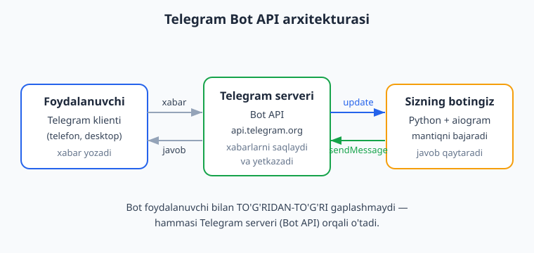
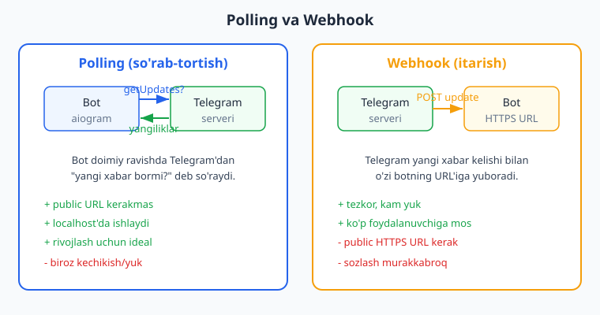
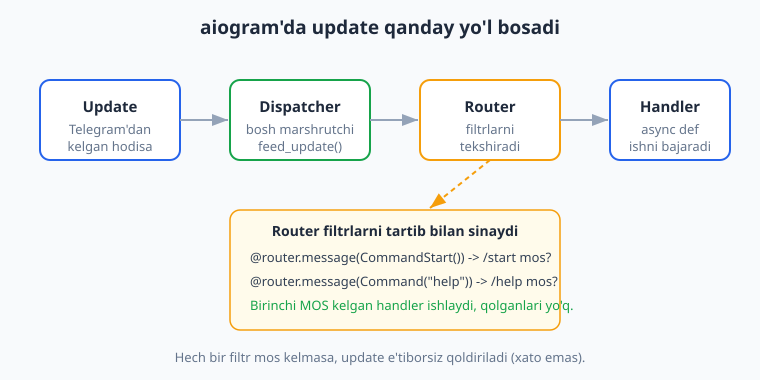

# 01 — Telegram botlar va aiogram bilan tanishuv

[🏠 README](./README.md) · [🏠 README](./README.md) · [Keyingi: 02 — Birinchi bot: echo va /start ➡️](./02-birinchi-bot.md)

---

> **Bu bobda:** Telegram bot aslida nima ekanini, "klient — Telegram serveri — bot" uchligi qanday ishlashini va Bot API'ning roli nimadaligini tushunamiz. @BotFather'dan `/newbot` orqali token olishni, tokenni `.env` faylida xavfsiz saqlashni o'rganamiz. Polling va webhook usullarini umumiy ko'rinishda solishtiramiz: qaysi biri qachon kerak. Nega aynan **aiogram 3.x** (async, modulyar, magic-filter) tanlanishini ko'rib chiqamiz, uni `pip install aiogram` bilan o'rnatamiz va ekotizimini (Bot API, aiohttp, FSM, klaviatura quruvchilar) tanishtiramiz. Oxirida `aiogram 2.x` va `3.x` orasidagi muhim farqlarga kirib, nega bu kitobda faqat 3.x idiomi ishlatilishini ko'rsatamiz.
>
> Bu kitob siz Python asoslarini (async/await, dekorator, klass, `venv`, `pip`, type hints) bilasiz deb faraz qiladi — kerak bo'lsa [../python/README.md](../python/README.md) ga qayting. Bu yerda esa Telegram va aiogram'ga xos HAR narsani noldan tushuntiramiz.
>
> **Halol eslatma (verifikatsiya):** Bu bobdagi handler marshruti (routing) va token formatini tekshirish kodi haqiqatan **offline** (tokensiz, internetsiz) ishga tushirib tekshirildi — `Dispatcher.feed_update()` ga soxta `Update` uzatib, `bot.session` mock qilingan holatda. Ammo jonli botni Telegram'ga ulash (long-polling, real xabar yuborish, `getMe`) BotFather'dan olingan **haqiqiy token + internet** talab qiladi — bunday bloklarni "illustrativ — jonli Telegram kerak" deb halol belgilab qo'yganmiz.

---

## 1. Telegram bot nima?

Telegram bot — bu Telegram ichida ishlaydigan **maxsus dastur**. U xuddi oddiy foydalanuvchi kabi xabar oladi va yuboradi, lekin orqasida jonli odam emas, balki **siz yozgan kod** turadi. Bot tugma bosishlariga javob beradi, ma'lumotlar bazasidan o'qiydi, API'larga so'rov yuboradi, fayl yuboradi — qisqasi, siz dasturlay olgan hamma narsani qila oladi.

Oddiy foydalanuvchi akkauntidan farqi:

- Botda telefon raqami yo'q; u **token** orqali tanilinadi.
- Bot odamga **birinchi** yozolmaydi — foydalanuvchi avval botga yozishi (yoki guruhga qo'shishi) kerak.
- Bot xabarlarni faqat o'ziga yuborilganda yoki guruhda chaqirilganda ko'radi (maxfiylik uchun).
- Bot maxsus imkoniyatlarga ega: inline tugmalar, klaviaturalar, to'lovlar, web app va hokazo.

Bot bilan ishlash uchun Telegram **Bot API** degan rasmiy interfeysni beradi. Sizning kodingiz hech qachon foydalanuvchining telefoni bilan to'g'ridan-to'g'ri gaplashmaydi — hammasi Telegram serveri orqali o'tadi.

## 2. Bot API qanday ishlaydi: klient — server — bot

Eng muhim tushuncha: **bot va foydalanuvchi o'rtasida har doim Telegram serveri turadi.** Hech kim hech kim bilan to'g'ridan-to'g'ri bog'lanmaydi.



Oqimni qadamma-qadam ko'rib chiqaylik:

1. **Foydalanuvchi** Telegram klientida (telefon yoki desktop) botga "Salom" deb yozadi.
2. Bu xabar Telegram serveriga (`api.telegram.org`) boradi va u yerda saqlanadi.
3. Telegram bu xabarni **Update** (yangilik) ko'rinishida sizning botingizga yetkazadi.
4. Sizning kodingiz Update'ni o'qiydi, mantiqni bajaradi va `sendMessage` chaqiruvi bilan javob qaytaradi.
5. Telegram bu javobni foydalanuvchining ekraniga yetkazadi.

**Update** — bu Telegram sizga yuboradigan "nimadir bo'ldi" signali. Update turlari ko'p: yangi xabar (`message`), tugma bosildi (`callback_query`), xabar tahrirlandi (`edited_message`), guruhga a'zo qo'shildi va hokazo. Bu kitob davomida ko'pincha `message` va `callback_query` bilan ishlaymiz.

Bot API REST uslubidagi HTTP API: siz `https://api.telegram.org/bot<TOKEN>/<metod>` manziliga so'rov yuborasiz. Masalan, xabar yuborish metodi `sendMessage`. Yaxshi yangilik — aiogram bu chaqiruvlarni siz uchun bajaradi, siz `message.answer("Salom")` deb yozasiz, xolos. Lekin orqada nima bo'layotganini bilish foydali.

> **Eslatma:** Bot API bilan **Telegram MTProto API** (Telethon, Pyrogram kabi kutubxonalar ishlatadigan) — boshqa-boshqa narsalar. Bot API rasmiy, sodda va botlar uchun mo'ljallangan. Bu kitob faqat Bot API bilan ishlaydi.

## 3. @BotFather'dan token olish

Botingiz mavjud bo'lishi uchun avval uni **ro'yxatdan o'tkazish** kerak. Buni Telegram'ning rasmiy boti — **@BotFather** qiladi. BotFather — botlarni yaratuvchi bot.

Qadamlar:

1. Telegram'da [@BotFather](https://t.me/BotFather) ni oching (rasmiy, ko'k tasdiq belgili).
2. `/newbot` buyrug'ini yuboring.
3. Botingizga **ko'rinadigan nom** bering (masalan, `Mening Birinchi Botim`).
4. So'ng **username** bering — u albatta `bot` bilan tugashi kerak (masalan, `mening_birinchi_bot`) va noyob bo'lishi shart.
5. BotFather sizga **tokenni** beradi. U taxminan shunday ko'rinadi:

```text
123456789:AAH-Abc1234DefGhIjKlMnOpQrStUvWxYz0
```

Bu token — botingizning **paroli**. Token bilan kim botingizni boshqara oladi. Shuning uchun:

- Tokenni **hech kimga** bermang, GitHub'ga, skrinshotga, video'ga qo'ymang.
- Agar token sizib chiqsa, BotFather'da `/revoke` bilan yangisini oling.

BotFather'ning boshqa foydali buyruqlari:

```text
/mybots      - botlaringiz ro'yxati va sozlamalari
/setname     - bot nomini o'zgartirish
/setdescription - bot tavsifi (chat ochilganda ko'rinadi)
/setuserpic  - bot avatari
/setcommands - / bosilganda chiqadigan buyruqlar menyusi
/token       - mavjud bot tokenini qayta ko'rsatish
/revoke      - tokenni bekor qilib, yangisini olish
/deletebot   - botni o'chirish
```

> Token olish jonli Telegram ilovasida amalga oshiriladi — buni kod bilan tekshirib bo'lmaydi (illustrativ qadam). Lekin pastda tokenni **formatini** offline tekshirgan kodimiz bor.

## 4. Tokenni xavfsiz saqlash: `.env`

Tokenni **hech qachon kod ichiga yozmang**. Agar yozsangiz va kodni GitHub'ga qo'ysangiz, token ochiq qoladi. To'g'ri yo'l — uni `.env` faylida saqlash va kodda muhit o'zgaruvchisi (environment variable) sifatida o'qish.

`python-dotenv` paketini o'rnatamiz:

```bash
pip install python-dotenv
```

Loyiha papkasida `.env` faylini yarating:

```text
BOT_TOKEN=123456789:AAH-Abc1234DefGhIjKlMnOpQrStUvWxYz0
```

Va `.gitignore` ga `.env` ni albatta qo'shing, toki u Git'ga tushib qolmasin:

```text
.env
__pycache__/
*.pyc
```

Endi kodda tokenni shunday o'qiymiz:

```python
import os
from dotenv import load_dotenv

load_dotenv()  # .env faylidagi o'zgaruvchilarni yuklaydi

BOT_TOKEN = os.getenv("BOT_TOKEN")
if not BOT_TOKEN:
    raise RuntimeError("BOT_TOKEN topilmadi! .env faylini tekshiring.")
```

Token to'g'ri formatda ekanini aiogram o'zi tekshiradi. Buni offline ko'rsatish mumkin:

```python
from aiogram.utils.token import validate_token, TokenValidationError

# To'g'ri formatdagi (lekin soxta) token tekshiruvdan o'tadi:
print(validate_token("123456:AAH-FakeTest_abc"))  # True

# Buzilgan token xato beradi:
try:
    validate_token("not-a-token")
except TokenValidationError as e:
    print("Token formati noto'g'ri:", e)
```

> **Offline tekshirildi:** yuqoridagi `validate_token` kodi haqiqatan ishga tushirildi — soxta token `True`, buzilgan token `TokenValidationError` qaytardi. Bu format tekshiruvi, Telegram'ga ulanish emas — token haqiqiy ishlashini faqat jonli `getMe` bilan bilish mumkin.

## 5. Polling va webhook: ikki yetkazib berish usuli

Telegram update'larni botingizga ikki xil yo'l bilan yetkazadi. Ikkalasini ham bilish kerak, lekin **rivojlash bosqichida har doim polling** ishlatamiz.



### Polling (so'rab-tortish)

Botning o'zi Telegram'dan muntazam ravishda "menga yangi xabar bormi?" deb so'raydi (`getUpdates` metodi). Telegram bo'lsa, yangiliklarni qaytaradi. aiogram'da bu **long-polling** ko'rinishida amalga oshadi — `await dp.start_polling(bot)` chaqiruvi shu ishni qiladi.

- **Afzalligi:** hech qanday public URL kerak emas, kompyuteringizdagi `localhost`da ham ishlaydi. Rivojlash va o'rganish uchun ideal.
- **Kamchiligi:** bot doimiy so'rab turadi, juda katta yuklamalarda biroz samarasiz.

### Webhook (itarish)

Bu yerda aksincha: siz Telegram'ga "yangi xabar kelganda, mana shu HTTPS manzilga o'zing yubor" deysiz. Telegram update'ni sizning serveringizdagi URL'ga `POST` qiladi.

- **Afzalligi:** tezkor, kam yuk, minglab foydalanuvchili botlar uchun mos.
- **Kamchiligi:** sizda **public HTTPS URL** (domen + SSL sertifikat) bo'lishi shart. Sozlash murakkabroq.

**Qoida:** o'rganayotganda va lokal ishlaganda — **polling**. Productionga chiqarishda, server tayyor bo'lganda — webhook'ni ko'rib chiqamiz (deploy bobida). Bu kitobning katta qismi polling bilan ishlaydi.

> Polling ham, webhook ham jonli Telegram serveri va token talab qiladi — ularni offline ishga tushirib bo'lmaydi (illustrativ). Lekin handler mantig'ini token va internetsiz `feed_update` orqali to'liq tekshirsa bo'ladi — buni keyingi bo'limda ko'rasiz.

## 6. Nega aiogram?

Telegram bot yozish uchun Python'da bir nechta kutubxona bor. Eng mashhurlari: **aiogram**, **python-telegram-bot**, **pyTelegramBotAPI (telebot)**. Bu kitob **aiogram 3.x** ni tanlaydi. Sabablari:

- **Async** — aiogram `asyncio` ustiga qurilgan. Bot ko'p foydalanuvchiga bir vaqtda javob berishi kerak; async buni samarali qiladi. Siz Python'da `async/await` bilan tanish bo'lsangiz, o'zingizni uyda his qilasiz.
- **Modulyar** — `Router`'lar yordamida katta botni mantiqiy bo'laklarga ajratish oson. Bu loyiha o'sganda tartibni saqlaydi.
- **Magic-filter (`F`)** — `F.text == "salom"` kabi qisqa, o'qishga oson filtrlar. Bu aiogram'ning eng yoqimli xususiyatlaridan biri.
- **Type hints** — hamma narsa to'liq tiplangan, IDE avtoto'ldirishi ajoyib ishlaydi.
- **FSM (holatlar mashinasi)** — ko'p qadamli suhbatlar (masalan, anketa to'ldirish) uchun ichki qurilgan tizim.
- **Faol jamiyat va hujjatlar** — [docs.aiogram.dev](https://docs.aiogram.dev) yangilanib turadi.

Solishtirish uchun: Node.js ekotizimida shunga o'xshash vazifani `grammY` yoki `Telegraf` bajaradi — agar JavaScript bilan ishlamoqchi bo'lsangiz, [../nodejs/README.md](../nodejs/README.md) ga qarang. Tushunchalar (update, polling, webhook) bir xil, faqat sintaksis farq qiladi.

## 7. aiogram'ni o'rnatish

aiogram 3.x Python 3.9+ talab qiladi. Bu kitob **Python 3.14** va **aiogram 3.28** bilan tekshirilgan.

Avval loyihaga alohida virtual muhit (`venv`) yarating — bu Python amaliyoti, agar `venv` bilan tanish bo'lmasangiz [../python/README.md](../python/README.md) ga qarang:

```bash
python -m venv .venv
# Windows (PowerShell):
.venv\Scripts\Activate.ps1
# Linux / macOS:
source .venv/bin/activate
```

So'ng aiogram'ni o'rnating:

```bash
pip install aiogram
```

O'rnatilganini tekshiramiz:

```bash
python -c "import aiogram; print(aiogram.__version__)"
```

Natija (illustrativ — sizning versiyangiz yangiroq bo'lishi mumkin):

```text
3.28.2
```

aiogram bilan birga uning asosiy bog'liqliklari ham keladi — eng muhimi **aiohttp** (async HTTP klient/server; Telegram bilan tarmoq aloqasini shu bajaradi):

```bash
python -c "import aiohttp; print(aiohttp.__version__)"
```

```text
3.13.5
```

Keyingi boblarda quyidagilarni ham o'rnatamiz (hozir shart emas, faqat ekotizimni ko'rsatish uchun):

```bash
pip install python-dotenv      # .env fayllari uchun
pip install aiosqlite          # async SQLite (DB bobi)
pip install "sqlalchemy[asyncio]"  # ORM, async rejimda (kengaytirilgan DB)
pip install redis              # FSM uchun RedisStorage (production)
```

## 8. aiogram ekotizimi: nimadan iborat?

aiogram bitta kutubxona, lekin ichida ko'p qism bor. Hozir nomlari bilan tanishib qo'ying — har birini alohida bobda chuqur ko'ramiz:

| Komponent | Nima qiladi | Qaysi bobda |
|---|---|---|
| `Bot` | Telegram Bot API bilan gaplashadi (`send_message`, `send_photo`, ...) | 02 |
| `Dispatcher` | Update'larni qabul qilib, mos handlerga yo'naltiradi | 02 |
| `Router` | Handlerlarni mantiqiy guruhlarga bo'ladi | 03 |
| Filtrlar (`Command`, `F`, ...) | Qaysi update qaysi handlerga borishini hal qiladi | 03 |
| Klaviatura quruvchilar | Tugmalar va inline tugmalar yasaydi | 05 |
| FSM (`StatesGroup`, `FSMContext`) | Ko'p qadamli suhbatlar uchun holat saqlaydi | 06 |
| Middleware | Har update'dan oldin/keyin umumiy mantiq | 07 |

Update bot ichida qanday yo'l bosishini sxemada ko'rib chiqaylik:



Mantiq sodda: **Update** keladi -> **Dispatcher** uni qabul qiladi -> mos **Router**'ga beradi -> Router filtrlarni tartib bilan tekshiradi -> birinchi **mos kelgan handler** ishlaydi. Hech bir filtr mos kelmasa, update e'tiborsiz qoldiriladi (bu xato emas).

## 9. Birinchi "kostyumsiz" misol va uni OFFLINE tekshirish

Keyingi bobda to'liq botni yozamiz, lekin hozir aiogram 3.x idiomi qanday ko'rinishini ko'ring. Bu kod handler'larni ro'yxatdan o'tkazadi va — eng muhimi — biz uni **token va internetsiz** ishlatib, marshrut to'g'ri ishlashini isbotlay olamiz.

Mana to'liq, ishlaydigan tekshiruv skripti (biz uni haqiqatan ishga tushirdik):

```python
import asyncio
from datetime import datetime
from unittest.mock import AsyncMock

from aiogram import Bot, Dispatcher, Router
from aiogram.filters import CommandStart, Command
from aiogram.fsm.storage.memory import MemoryStorage
from aiogram.types import Message, Update, Chat, User
from aiogram.client.default import DefaultBotProperties
from aiogram.enums import ParseMode

FAKE_TOKEN = "123456:AAH-FakeTest_abc"  # soxta, lekin to'g'ri formatda

router = Router()
seen = []  # qaysi handler ishlaganini yozib boramiz

@router.message(CommandStart())          # 3.x idiomi: Router + Command filtri
async def start_handler(message: Message) -> None:
    seen.append("start")
    await message.answer(f"Salom, {message.from_user.first_name}!")

@router.message(Command("help"))
async def help_handler(message: Message) -> None:
    seen.append("help")
    await message.answer("Yordam matni")

def make_update(text: str) -> Update:
    """Telegram'dan kelgandek soxta Update yasaymiz."""
    msg = Message(
        message_id=1,
        date=datetime.now(),
        chat=Chat(id=1, type="private"),
        from_user=User(id=1, is_bot=False, first_name="Test"),
        text=text,
    )
    return Update(update_id=1, message=msg)

async def main():
    bot = Bot(
        token=FAKE_TOKEN,
        default=DefaultBotProperties(parse_mode=ParseMode.HTML),
    )
    bot.session = AsyncMock()  # tarmoqni mock qilamiz: answer() Telegram'ga ketmaydi

    dp = Dispatcher(storage=MemoryStorage())
    dp.include_router(router)               # 3.x idiomi: routerni dispatcherga ulaymiz

    # Telegram o'rniga biz update'ni "qo'lda" beramiz:
    await dp.feed_update(bot, make_update("/start"))
    await dp.feed_update(bot, make_update("/help"))
    await dp.feed_update(bot, make_update("oddiy matn"))  # hech qaysi filtrga mos emas

    await bot.session.close()
    print("Ishlagan handlerlar:", seen)
    assert seen == ["start", "help"]   # uchinchi update hech kimga bormadi
    print("Marshrut to'g'ri ishladi.")

if __name__ == "__main__":
    asyncio.run(main())
```

Natija (haqiqatan ishga tushirildi):

```text
Ishlagan handlerlar: ['start', 'help']
Marshrut to'g'ri ishladi.
```

E'tibor bering:

- `Dispatcher()` va `Router()` — 3.x'ning asosiy quruvchilari. `dp.include_router(router)` orqali ulanadi.
- `@router.message(CommandStart())` va `@router.message(Command("help"))` — **3.x idiomi**. Eski `@dp.message_handler(commands=[...])` ISHLATILMAYDI.
- `dp.feed_update(bot, update)` — Telegram o'rniga update'ni qo'lda berish. Aynan shu bizga **tokensiz, internetsiz** tekshirish imkonini beradi.
- `bot.session = AsyncMock()` — `message.answer()` ichida Telegram'ga so'rov ketmasligi uchun tarmoq qatlamini mock qilamiz. Real bot bo'lsa, bu yerda haqiqiy xabar yuborilardi.
- Uchinchi update ("oddiy matn") hech qaysi filtrga mos kelmagani uchun e'tiborsiz qoldirildi — `seen` ro'yxatida yo'q.

> **Halol farq:** Yuqoridagi kod handler **marshrutini** isbotlaydi — `/start` va `/help` to'g'ri handlerlarga bordi. Lekin foydalanuvchi ekranida "Salom" **ko'rinishi** — bu jonli Telegram + token talab qiladigan qism (illustrativ). Biz `bot.session` ni mock qilganimiz uchun real xabar ketmadi; mantiqning to'g'riligi esa to'liq tekshirildi.

## 10. aiogram 2.x va 3.x: muhim farqlar

Internetda aiogram bo'yicha juda ko'p eski (2.x) misollar bor. **Ular bu kitobda ISHLAMAYDI.** 3.x — to'liq qayta yozilgan, idiomi boshqacha. Quyidagi jadval eng muhim farqlarni ko'rsatadi — eski kodga duch kelsangiz, shu jadval bilan "tarjima" qiling.

| Vazifa | ❌ aiogram 2.x (ESKIRGAN) | ✅ aiogram 3.x (TO'G'RI) |
|---|---|---|
| Handler qo'shish | `@dp.message_handler(...)` | `@router.message(...)` |
| Buyruq filtri | `@dp.message_handler(commands=["start"])` | `@router.message(Command("start"))` |
| Pollingni boshlash | `executor.start_polling(dp)` | `await dp.start_polling(bot)` |
| Botni yaratish | `Bot(token, parse_mode="HTML")` | `Bot(token, default=DefaultBotProperties(parse_mode=ParseMode.HTML))` |
| ParseMode joyi | `types.ParseMode.HTML` | `aiogram.enums.ParseMode.HTML` |
| Routing tuzilmasi | faqat `Dispatcher` | `Router` + `dp.include_router(r)` |
| Klaviatura | `ReplyKeyboardMarkup(row_width=2).add(...)` | `ReplyKeyboardBuilder()` (utils.keyboard) |
| Kontent turi | `content_types=["text"]` | `F.text` magic-filter |

Eng tipik xato — aiogram 2.x'dagi `executor` va `@dp.message_handler` ni ishlatishga urinish:

```python
# ❌ ESKI 2.x — aiogram 3.x da MUTLAQO ISHLAMAYDI:
from aiogram import Bot, Dispatcher, executor, types

bot = Bot(token=TOKEN, parse_mode="HTML")       # ❌ parse_mode bu yerda emas
dp = Dispatcher(bot)                            # ❌ Dispatcher endi botni qabul qilmaydi

@dp.message_handler(commands=["start"])          # ❌ bunday dekorator yo'q
async def start(message: types.Message):
    await message.answer("Salom")

executor.start_polling(dp, skip_updates=True)    # ❌ executor moduli olib tashlangan
```

3.x'da xuddi shu narsa quyidagicha yoziladi:

```python
# ✅ TO'G'RI 3.x:
import asyncio
from aiogram import Bot, Dispatcher, Router
from aiogram.filters import Command
from aiogram.types import Message
from aiogram.client.default import DefaultBotProperties
from aiogram.enums import ParseMode

router = Router()

@router.message(Command("start"))
async def start(message: Message) -> None:
    await message.answer("Salom")

async def main() -> None:
    bot = Bot(token=TOKEN, default=DefaultBotProperties(parse_mode=ParseMode.HTML))
    dp = Dispatcher()
    dp.include_router(router)
    await dp.start_polling(bot)

if __name__ == "__main__":
    asyncio.run(main())
```

> **Oltin qoida:** Agar topgan misolingizda `executor`, `message_handler`, yoki `Dispatcher(bot)` bo'lsa — bu **eski 2.x**. Uni ishlatmang. Shubha tug'ilsa, [docs.aiogram.dev](https://docs.aiogram.dev/en/stable/) (stable = 3.x) ga qarang. Bu kitobdagi har bir kod faqat 3.x idiomida yozilgan va tekshirilgan.

## 11. Yo'l xaritasi: keyin nima bo'ladi

Endi tushunchalar joyida. Keyingi yo'limiz:

- **02-bob** — birinchi to'liq botni yozamiz: `/start`, echo (foydalanuvchi yozganini qaytaruvchi) va `start_polling` bilan jonli ishga tushirish.
- **03-bob** — Router'lar, filtrlar (`Command`, `F` magic-filter) chuqurroq.
- **04-05** — xabar turlari, klaviaturalar va inline tugmalar.
- **06** — FSM bilan ko'p qadamli suhbatlar (anketa).
- **07** — middleware.
- Keyin — ma'lumotlar bazasi ([../sql/README.md](../sql/README.md) bilan bog'liq), to'lovlar va deploy ([../git-github/README.md](../git-github/README.md)).

---

## Mashqlar

### Oson

1. **Uchlikni chizing.** Foydalanuvchi botga "Salom" yozganda xabar qaysi yo'ldan o'tadi? Klient, Telegram serveri va bot orasidagi 4-5 qadamni o'z so'zlaringiz bilan tartibda yozing.

2. **Token formati.** Quyidagilardan qaysi biri Telegram bot tokeniga o'xshaydi, qaysi biri yo'q? Sababini ayting: (a) `123456789:AAH-Abc123DefGhi`, (b) `salom-dunyo`, (c) `abcdef`.

3. **Polling yoki webhook?** Quyidagi vaziyatlar uchun qaysi usul to'g'ri keladi: (a) uyda noutbukda o'rganyapsiz, (b) minglab foydalanuvchili botni public serverda ishlatyapsiz, (c) sizda HTTPS domen yo'q.

4. **BotFather buyruqlari.** Botingiz nomini o'zgartirish, `/` menyusidagi buyruqlarni o'rnatish va tokenni bekor qilish uchun BotFather'ning qaysi buyruqlaridan foydalanasiz?

5. **`.env` xavfsizligi.** Nega tokenni to'g'ridan-to'g'ri `.py` faylga yozish xavfli? `.env` faylini Git'ga tushib qolishidan qanday himoya qilamiz?

6. **Versiyani tekshiring.** Kompyuteringizda aiogram qaysi versiyada o'rnatilganini ko'rsatadigan bitta qatorlik buyruqni yozing (kod ichida ham, terminalda ham).

### O'rta

7. **2.x'ni 3.x'ga tarjima qiling.** Quyidagi eski kodni 3.x idiomiga aylantiring:
   ```python
   @dp.message_handler(commands=["help"])
   async def help_cmd(message: types.Message):
       await message.answer("Yordam")
   ```

8. **Soxta Update yasang.** `id` si `42`, `first_name` si `Ali`, matni `/help` bo'lgan shaxsiy (private) chatdan kelgan soxta `Update` ob'ektini yasaydigan funksiya yozing (9-bo'limdagi `make_update` ga o'xshash).

9. **Marshrutni isbotlang.** 9-bo'limdagi skriptga `/about` buyrug'ini boshqaruvchi uchinchi handler qo'shing. So'ng `feed_update` bilan `/about` yuborib, faqat shu handler ishlaganini `assert` bilan tekshiring.

10. **Mos kelmaslik.** Foydalanuvchi `salom` (buyruq emas, oddiy matn) yozsa, 9-bo'limdagi botda nima bo'ladi? Nega? Buni `seen` ro'yxatini tekshirib isbotlang.

11. **Token tekshiruvchi.** `validate_token` dan foydalanib, berilgan satr to'g'ri formatdagi token ekanini `True`/`False` qaytaradigan `is_valid_token(s)` funksiyasini yozing (xatoni `try/except` bilan tuting).

12. **ParseMode joyi.** aiogram 3.x'da `ParseMode` qaysi moduldan import qilinadi va botda u qanday o'rnatiladi? Bitta `Bot(...)` qatori bilan ko'rsating.

### Qiyin

13. **Ikki routerli marshrut.** Ikkita alohida `Router` yarating: birinchisida `/start`, ikkinchisida `/help` handleri bo'lsin. Ikkalasini bitta `Dispatcher`ga `include_router` bilan ulang va `feed_update` orqali ikkala buyruq ham to'g'ri handlerga borishini offline tekshiring.

14. **pytest bilan handler testi.** 9-bo'limdagi `start_handler` ni `pytest-asyncio` yordamida sinaydigan test yozing: `/start` yuborilganda handler ishlashini tekshiring. (Maslahat: `@pytest.mark.asyncio`, `bot.session = AsyncMock()`.)

15. **Filtr tartibi.** Ikkita handler bir xil update'ga mos kelsa (masalan, ikkalasi ham `F.text`), qaysi biri ishlaydi? Ikki handlerli misol yozib, `feed_update` bilan buni isbotlang va xulosa yozing.

16. **Xavfsizlik tahlili.** Bir do'stingiz tokenini xabarda yuborib yubordi. Qanday xavf bor va u darhol nima qilishi kerak? BotFather'ning qaysi buyrug'i muammoni hal qiladi?

---

<details markdown="1">
<summary>Yechimlar</summary>

### Oson

**1.** Oqim: (1) Foydalanuvchi Telegram klientida "Salom" yozadi. (2) Xabar Telegram serveriga (`api.telegram.org`) boradi. (3) Telegram uni `Update` ko'rinishida botga yetkazadi (polling yoki webhook orqali). (4) Bot kodi update'ni o'qib, mantiqni bajaradi va `sendMessage` chaqiradi. (5) Telegram javobni foydalanuvchi ekraniga yetkazadi. Asosiy g'oya: bot va foydalanuvchi hech qachon to'g'ridan-to'g'ri bog'lanmaydi, har doim Telegram serveri orasida turadi.

**2.** (a) `123456789:AAH-Abc123DefGhi` — tokenga o'xshaydi: `raqamlar:harf-belgilar` ko'rinishida, ikki nuqta bilan ajralgan. (b) `salom-dunyo` va (c) `abcdef` — token EMAS, chunki ikki nuqta (`:`) va boshida raqamli `bot_id` qismi yo'q. Buni offline tekshirish:
```python
from aiogram.utils.token import validate_token, TokenValidationError
for s in ["123456789:AAH-Abc123DefGhi", "salom-dunyo", "abcdef"]:
    try:
        validate_token(s)
        print(s, "-> formati to'g'ri")
    except TokenValidationError:
        print(s, "-> token EMAS")
```

**3.** (a) Uyda o'rganish -> **polling** (public URL kerakmas). (b) Minglab foydalanuvchili public bot -> **webhook** (tezkor, kam yuk). (c) HTTPS domen yo'q -> **polling** (webhook HTTPS URL talab qiladi).

**4.** Nomni o'zgartirish: `/setname`. Buyruqlar menyusi: `/setcommands`. Tokenni bekor qilib yangisini olish: `/revoke`. (Botlar ro'yxati: `/mybots`.)

**5.** `.py` faylga yozish xavfli, chunki kodni GitHub'ga yoki birovga bersangiz, token ham ochiq ketadi — token bilan kim botingizni to'liq boshqaradi. Himoya: tokenni `.env` da saqlash va `.gitignore` ga `.env` ni qo'shish — shunda u Git'ga umuman tushmaydi.

**6.** Kod ichida: `import aiogram; print(aiogram.__version__)`. Terminalda:
```bash
python -c "import aiogram; print(aiogram.__version__)"
```

### O'rta

**7.** 3.x idiomi:
```python
from aiogram import Router
from aiogram.filters import Command
from aiogram.types import Message

router = Router()

@router.message(Command("help"))
async def help_cmd(message: Message) -> None:
    await message.answer("Yordam")
```
O'zgarishlar: `@dp.message_handler(commands=[...])` -> `@router.message(Command(...))`; `types.Message` -> to'g'ridan-to'g'ri `Message` import.

**8.**
```python
from datetime import datetime
from aiogram.types import Message, Update, Chat, User

def make_update(text: str) -> Update:
    msg = Message(
        message_id=1,
        date=datetime.now(),
        chat=Chat(id=42, type="private"),
        from_user=User(id=42, is_bot=False, first_name="Ali"),
        text=text,
    )
    return Update(update_id=1, message=msg)

upd = make_update("/help")
print(upd.message.from_user.first_name, upd.message.text)  # Ali /help
```

**9.** Skriptga qo'shamiz:
```python
@router.message(Command("about"))
async def about_handler(message: Message) -> None:
    seen.append("about")
    await message.answer("Bu test bot")

# main() ichida:
seen.clear()
await dp.feed_update(bot, make_update("/about"))
assert seen == ["about"], seen
print("about marshruti to'g'ri")
```

**10.** Hech narsa bo'lmaydi — `salom` na `CommandStart()` ga, na `Command("help")` ga mos keladi (ikkalasi ham `/` bilan boshlanadigan buyruq filtri). Shuning uchun update e'tiborsiz qoldiriladi va `seen` ga hech narsa qo'shilmaydi. Isbot:
```python
seen.clear()
await dp.feed_update(bot, make_update("salom"))
assert seen == []   # hech qaysi handler ishlamadi
```

**11.**
```python
from aiogram.utils.token import validate_token, TokenValidationError

def is_valid_token(s: str) -> bool:
    try:
        validate_token(s)
        return True
    except TokenValidationError:
        return False

print(is_valid_token("123456:AAH-FakeTest_abc"))  # True
print(is_valid_token("not-a-token"))               # False
```

**12.** `ParseMode` `aiogram.enums` modulidan import qilinadi va `DefaultBotProperties` orqali o'rnatiladi:
```python
from aiogram import Bot
from aiogram.client.default import DefaultBotProperties
from aiogram.enums import ParseMode

bot = Bot(token=TOKEN, default=DefaultBotProperties(parse_mode=ParseMode.HTML))
```
(❌ 2.x'dagi `Bot(token, parse_mode="HTML")` va `types.ParseMode` ishlatilmaydi.)

### Qiyin

**13.** Ikki routerli to'liq, offline tekshiriladigan misol:
```python
import asyncio
from datetime import datetime
from unittest.mock import AsyncMock
from aiogram import Bot, Dispatcher, Router
from aiogram.filters import CommandStart, Command
from aiogram.fsm.storage.memory import MemoryStorage
from aiogram.types import Message, Update, Chat, User

start_router = Router()
help_router = Router()
seen = []

@start_router.message(CommandStart())
async def s(message: Message) -> None:
    seen.append("start")

@help_router.message(Command("help"))
async def h(message: Message) -> None:
    seen.append("help")

def upd(text: str) -> Update:
    msg = Message(message_id=1, date=datetime.now(),
                  chat=Chat(id=1, type="private"),
                  from_user=User(id=1, is_bot=False, first_name="T"),
                  text=text)
    return Update(update_id=1, message=msg)

async def main():
    bot = Bot(token="123456:AAH-FakeTest_abc")
    bot.session = AsyncMock()
    dp = Dispatcher(storage=MemoryStorage())
    dp.include_router(start_router)
    dp.include_router(help_router)
    await dp.feed_update(bot, upd("/start"))
    await dp.feed_update(bot, upd("/help"))
    await bot.session.close()
    assert seen == ["start", "help"], seen
    print("Ikki router to'g'ri ishladi:", seen)

asyncio.run(main())
```

**14.** `pytest-asyncio` testi (faylga `test_start.py` deb saqlang, `python -m pytest test_start.py` bilan ishga tushiring):
```python
import pytest
from datetime import datetime
from unittest.mock import AsyncMock
from aiogram import Bot, Dispatcher, Router
from aiogram.filters import CommandStart
from aiogram.fsm.storage.memory import MemoryStorage
from aiogram.types import Message, Update, Chat, User

router = Router()
log = []

@router.message(CommandStart())
async def start(message: Message):
    log.append(message.text)
    await message.answer("Salom!")

@pytest.mark.asyncio
async def test_start_routes():
    bot = Bot(token="123456:AAH-FakeTest_abc")
    bot.session = AsyncMock()
    dp = Dispatcher(storage=MemoryStorage())
    dp.include_router(router)
    msg = Message(message_id=1, date=datetime.now(),
                  chat=Chat(id=1, type="private"),
                  from_user=User(id=1, is_bot=False, first_name="T"),
                  text="/start")
    await dp.feed_update(bot, Update(update_id=1, message=msg))
    await bot.session.close()
    assert log == ["/start"]
```
(Ishga tushirish uchun `pytest-asyncio` kerak: `pip install pytest-asyncio`. `--asyncio-mode=auto` qulay.)

**15.** Bitta update bir nechta handlerga mos kelsa, **ro'yxatdan o'tish tartibida birinchi mos kelgani** ishlaydi, qolganlari ishlamaydi (handler "update'ni iste'mol qiladi"). Isbot:
```python
import asyncio
from datetime import datetime
from unittest.mock import AsyncMock
from aiogram import Bot, Dispatcher, Router, F
from aiogram.fsm.storage.memory import MemoryStorage
from aiogram.types import Message, Update, Chat, User

router = Router()
seen = []

@router.message(F.text)          # birinchi ro'yxatdan o'tdi
async def first(message: Message):
    seen.append("first")

@router.message(F.text)          # ikkinchisi ham mos, lekin ishlamaydi
async def second(message: Message):
    seen.append("second")

async def main():
    bot = Bot(token="123456:AAH-FakeTest_abc")
    bot.session = AsyncMock()
    dp = Dispatcher(storage=MemoryStorage())
    dp.include_router(router)
    msg = Message(message_id=1, date=datetime.now(),
                  chat=Chat(id=1, type="private"),
                  from_user=User(id=1, is_bot=False, first_name="T"),
                  text="salom")
    await dp.feed_update(bot, Update(update_id=1, message=msg))
    await bot.session.close()
    assert seen == ["first"], seen   # faqat birinchisi
    print("Faqat birinchi handler ishladi:", seen)

asyncio.run(main())
```
Xulosa: handler tartibi muhim — eng aniq (spetsifik) filtrlarni yuqoriroqqa qo'ying, umumiylarni pastga.

**16.** Xavf: token — botning paroli; uni bilgan har kim botingiz nomidan xabar yuboradi, ma'lumotlarni o'qiydi, botni "o'g'irlaydi". Darhol qilinadigan ish: BotFather'da `/revoke` buyrug'i bilan eski tokenni **bekor qilish** va yangi token olish; so'ng kod/`.env` da yangi tokenni qo'yish. Eski token shu zahoti ishlamay qoladi, shuning uchun sizib chiqqani endi zarar bera olmaydi.

</details>

---

[🏠 README](./README.md) · [🏠 README](./README.md) · [Keyingi: 02 — Birinchi bot: echo va /start ➡️](./02-birinchi-bot.md)
