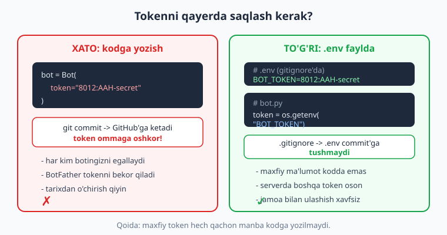
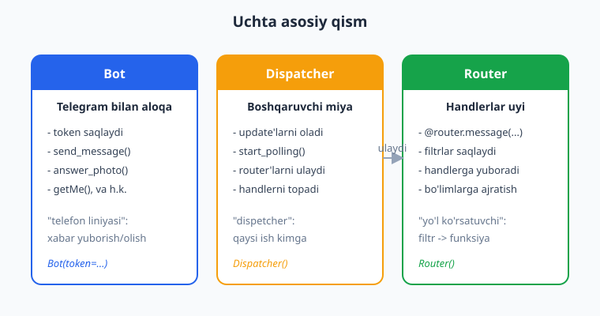
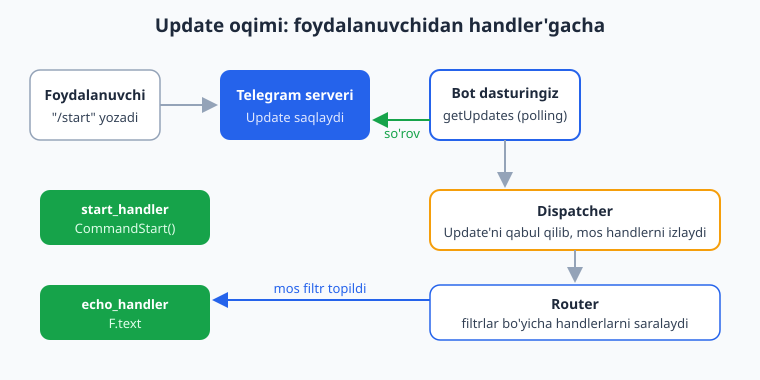

# 02 — Birinchi bot: echo va /start

[⬅️ Oldingi: 01 — Telegram botlar va aiogram bilan tanishuv](./01-telegram-aiogram-tanishuv.md) · [🏠 README](./README.md) · [Keyingi: 03 — Handlerlar va Router ➡️](./03-handlerlar-router.md)

---

> **Bu bobda:** birinchi ishlaydigan botimizni noldan quramiz. BotFather'dan token olamiz va uni `.env` faylda (kodga emas) saqlaymiz. Uchta asosiy qism — `Bot`, `Dispatcher`, `Router` — nima ekanini va qanday bog'lanishini tushunamiz. `/start` buyrug'iga javob beradigan handler va har qanday matnni qaytaradigan **echo** handler yozamiz. Nega deyarli hamma narsa `async/await` ekanini, `asyncio.run(main())` va `dp.start_polling(bot)` nima qilishini ko'ramiz. Yo'l-yo'lakay `Update` qanday qilib Telegram serveridan sizning funksiyangizgacha "sayohat qilishi"ni kuzatamiz.
>
> **Halollik eslatmasi:** bu bobdagi handler mantig'i (`/start` va echo) haqiqatan ham OFFLINE — Telegram tokeni va internetsiz — `dispatcher.feed_update(...)` orqali soxta `Update` uzatib tekshirilgan. Filtrlar (`CommandStart`, `Command`, `F.text`) va buyruq parslash ham shunday tekshirilgan. Lekin botni **jonli** ishga tushirish (`start_polling`, real xabar yuborish/qabul qilish, `getMe`) BotFather tokeni + internet talab qiladi. Shu sababli "botni terminalda ishga tushiring" bo'limlari **illustrativ** deb belgilangan: kod to'g'ri, ammo natijani siz o'z tokeningiz bilan ko'rasiz. Hech qayerda soxta "xabar yetib bordi" degan natija yozilmagan.

---

## Yo'l xaritasi: nima quramiz?

Birinchi botimiz juda kichik bo'ladi, lekin u **to'liq ishlaydigan** bot — kichik o'yinchoq emas:

1. Foydalanuvchi `/start` yozsa, bot uni ism bilan salomlaydi.
2. Foydalanuvchi boshqa har qanday matn yozsa, bot o'sha matnni **qaytaradi** (echo, ya'ni "aks-sado").

Bor-yo'g'i shu. Lekin shu kichik dasturda Telegram botlarining BARCHA asosiy g'oyalari mujassam: token, `Bot`, `Dispatcher`, `Router`, handler, filtr, `async/await` va `polling`. Keyingi boblarda biz shu skeletga qo'shimcha "go'sht" qo'shamiz, lekin suyak shu yerda quriladi.

Bu bob Python'ni bilasiz deb faraz qiladi (`async/await`, dekorator, funksiya, `import`). Agar `async def` va `await` sizga begona bo'lsa, avval [Python qo'llanmasi](../python/README.md)dagi asinxron dasturlash bo'limini ko'rib chiqing. Bu yerda biz Python'ni emas, **aiogram'ga xos** har bir narsani tushuntiramiz.

---

## Token: BotFather'dan olib, .env faylda saqlash

Botingiz Telegram bilan gaplashishi uchun unga **token** kerak. Token — bu botning paroli kabi maxfiy satr. U `@BotFather` botidan olinadi.

### Token olish (jonli — Telegram talab qiladi)

> **Illustrativ:** bu qadamlar real Telegram ilovasi va internet talab qiladi. Token sizniki, shaxsiy — uni hech kimga bermang.

1. Telegram'da `@BotFather`ni oching.
2. `/newbot` buyrug'ini yuboring.
3. Botga **nom** bering (masalan: `Mening Echo Botim`).
4. Botga **username** bering — u `bot` bilan tugashi shart (masalan: `mening_echo_bot`).
5. BotFather sizga token beradi. U taxminan shunday ko'rinadi:

```text
8012345678:AAH-dEfGhIjKlMnOpQrStUvWxYz1234567890
```

Bu satr — sizning tokeningiz. Ikki qismdan iborat: ikki nuqtagacha bo'lgan raqam (bot ID si) va undan keyingi maxfiy qism.

> **Diqqat:** token — parol kabi. Uni GitHub'ga, skrinshotga, hech qaerga oshkor qilmang. Agar oshkor bo'lib qolsa, BotFather'da `/revoke` bilan eski tokenni bekor qiling va yangisini oling.

### Nega token kodga yozilmaydi?

Yangi boshlovchilar ko'pincha tokenni to'g'ridan kodga yozadi:

```python
# ❌ Yomon: token kodning ichida ochiq turibdi
bot = Bot(token="8012345678:AAH-dEfGhIjKlMnOpQrStUvWxYz1234567890")
```

Bu xavfli. Agar siz kodni GitHub'ga `git commit` qilsangiz, token butun dunyoga oshkor bo'ladi. Bir necha daqiqada robotlar uni topib, botingizni egallab olishi mumkin.

To'g'ri yo'l — tokenni **`.env`** faylda saqlash va uni `.gitignore`ga qo'shish. Quyidagi rasm farqni ko'rsatadi:



### .env faylini yaratish

Loyiha papkasida `.env` nomli fayl yarating:

```text
BOT_TOKEN=8012345678:AAH-dEfGhIjKlMnOpQrStUvWxYz1234567890
```

> `.env` — bu oddiy matn fayli, ichida `KALIT=qiymat` ko'rinishidagi qatorlar bo'ladi. Bu yerda haqiqiy tokenni yozasiz (yuqoridagi soxta tokenni emas).

Endi `.gitignore` fayliga `.env`ni qo'shing, shunda u hech qachon `git`ga tushmaydi:

```text
.env
__pycache__/
*.pyc
```

### .env'ni o'qish: python-dotenv

`.env` faylini Python'ga o'qitish uchun `python-dotenv` kutubxonasi ishlatiladi:

```bash
pip install aiogram python-dotenv
```

Kodda esa shunday o'qiymiz:

```python
import os
from dotenv import load_dotenv

load_dotenv()                  # .env faylini o'qib, muhit o'zgaruvchilariga yuklaydi
BOT_TOKEN = os.getenv("BOT_TOKEN")  # endi tokenni shu yerdan olamiz
```

`load_dotenv()` `.env` ichidagi `BOT_TOKEN=...` qatorini o'qib, uni operatsion tizimning **muhit o'zgaruvchisi** (environment variable) sifatida yuklaydi. So'ng `os.getenv("BOT_TOKEN")` o'sha qiymatni qaytaradi. Token endi kodda emas, faylda.

> **Eslatma:** `.env` faylsiz ham token berish mumkin — terminalda muhit o'zgaruvchisini to'g'ridan o'rnatish orqali. Lekin `.env` qulayroq, shuning uchun biz shu usulni ishlatamiz.

---

## Uchta asosiy qism: Bot, Dispatcher, Router

aiogram 3.x da bot uchta asosiy obyekt ustiga quriladi. Ularni tushunsangiz, qolgani oson ketadi.



**`Bot`** — bu Telegram bilan aloqa liniyasi. U tokenni saqlaydi va `send_message`, `answer_photo`, `getMe` kabi Telegram metodlarini chaqiradi. Bot — bu "telefon": xabar yuborish va olish uchun.

```python
from aiogram import Bot
bot = Bot(token=BOT_TOKEN)
```

**`Dispatcher`** — bu boshqaruvchi miya. U Telegram'dan kelgan `Update`larni qabul qiladi va ularni qaysi funksiya qayta ishlashini hal qiladi. `dp.start_polling(bot)` ham Dispatcher'da.

```python
from aiogram import Dispatcher
dp = Dispatcher()
```

**`Router`** — bu handlerlar uyi. Siz handler funksiyalaringizni `@router.message(...)` dekoratori bilan Router'ga "ro'yxatdan o'tkazasiz". Router filtrlarni saqlaydi va kelgan xabar qaysi handlerga mos kelishini tekshiradi. So'ng Router'ni Dispatcher'ga ulaysiz:

```python
from aiogram import Router
router = Router()
# ... handlerlar shu yerda ...
dp.include_router(router)   # router'ni dispatcher'ga ulash
```

> **Tarixiy eslatma (muhim!):** aiogram **2.x** da `Router` yo'q edi va handlerlar to'g'ridan `@dp.message_handler(...)` bilan yozilardi. aiogram **3.x** da bu o'zgardi: handlerlar `Router`ga yoziladi va Router Dispatcher'ga ulanadi. Internetdagi eski misollarda `@dp.message_handler` yoki `executor.start_polling` ko'rsangiz — bu **2.x**, bizga yaramaydi. Biz faqat 3.x idiomini ishlatamiz.

### Soddalashtirilgan variant: Dispatcher'ga to'g'ridan yozish

Kichik botlar uchun alohida `Router` yaratmasdan, handlerlarni to'g'ridan `Dispatcher`ga ham yozish mumkin (`Dispatcher`ning o'zi ham Router'ning bir turi):

```python
dp = Dispatcher()

@dp.message(CommandStart())   # router o'rniga to'g'ridan dp
async def start(message): ...
```

Bu rasmiy aiogram quickstart'da ham shunday. Lekin loyiha kattalashganda handlerlarni `Router`larga bo'lib, modullarga ajratish qulayroq (buni 03-bobda ko'ramiz). Shu sababli biz odat tariqasida boshidanoq `Router` ishlatamiz — bu yaxshi amaliyot.

---

## async/await: nega hammasi "async"?

Telegram boti bir vaqtning o'zida yuzlab, minglab foydalanuvchi bilan gaplashadi. Agar bot bir xabarni qayta ishlayotganda "qotib qolsa" (masalan, Telegram serveridan javob kutib turib), qolgan hamma kutib qolardi.

`async/await` shu muammoni hal qiladi. Telegram'ga so'rov yuborib, javob kutayotgan paytda bot **boshqa** foydalanuvchilarning xabarlarini qayta ishlay oladi. Shuning uchun aiogram'da:

- Har bir handler `async def` bilan yoziladi.
- Telegram'ga so'rov yuboradigan har bir chaqiruv `await` bilan kutiladi: `await message.answer(...)`.
- Hamma narsa `asyncio.run(main())` ichida ishga tushadi.

```python
async def main():
    bot = Bot(token=BOT_TOKEN)
    dp = Dispatcher()
    dp.include_router(router)
    await dp.start_polling(bot)   # await — chunki polling cheksiz "kutadi"

asyncio.run(main())               # asyncio'ning "asosiy" ishga tushirish nuqtasi
```

> **Nega `asyncio.run(main())`?** `async def` funksiyani oddiygina chaqirsangiz, u **ishlamaydi** — faqat "coroutine" obyekti qaytaradi. Uni haqiqatan ishga tushirish uchun asinxron muhit (event loop) kerak. `asyncio.run(main())` shu muhitni yaratadi, `main()`ni ishlatadi va tugaganda muhitni yopadi. Bu — sizning dasturingizning kirish nuqtasi.

> **`await dp.start_polling(bot)` nega "tugamaydi"?** Polling — bu cheksiz tsikl: bot doimo Telegram'dan "yangi xabar bormi?" deb so'rab turadi. Shuning uchun `start_polling` siz `Ctrl+C` bosgunga qadar ishlab turadi. Bu normal holat — bot "tinglab turibdi" degani.

---

## Update qanday "sayohat qiladi"?

Foydalanuvchi xabar yozganidan sizning funksiyangiz ishlaguncha bo'lgan yo'lni tushunish muhim. Quyidagi rasm shu oqimni ko'rsatadi:



Bosqichma-bosqich:

1. **Foydalanuvchi** botga `/start` yozadi.
2. Xabar **Telegram serveriga** boradi. Server uni `Update` ko'rinishida saqlaydi (`Update` — bu "nimadir yangilik bo'ldi" degan paket).
3. Sizning **bot dasturingiz** `getUpdates` so'rovi bilan "yangi update bormi?" deb so'rab turadi. Bu **polling** deyiladi.
4. Update kelganda **Dispatcher** uni qabul qiladi.
5. Dispatcher **Router**'dan o'tkazadi. Router har bir handlerning **filtri**ni tekshiradi.
6. Birinchi mos filtr topilganda, o'sha **handler** ishga tushadi va `message.answer(...)` bilan javob qaytaradi.

`/start` xabari `CommandStart()` filtriga mos keladi, shuning uchun `start_handler` ishlaydi. Oddiy matn esa unga mos kelmaydi, lekin `F.text` filtriga mos keladi, shuning uchun `echo_handler` ishlaydi.

---

## To'liq birinchi bot: bot.py

Endi hammasini birlashtiramiz. Mana to'liq, ishlaydigan bot:

```python
import asyncio
import logging
import os

from dotenv import load_dotenv
from aiogram import Bot, Dispatcher, Router, F
from aiogram.filters import CommandStart
from aiogram.types import Message

# 1) .env'dan tokenni o'qiymiz (kodga yozmaymiz!)
load_dotenv()
BOT_TOKEN = os.getenv("BOT_TOKEN")

# 2) Router yaratamiz va handlerlarni unga yozamiz
router = Router()


@router.message(CommandStart())
async def start_handler(message: Message) -> None:
    """Foydalanuvchi /start yozganda ishlaydi."""
    await message.answer(
        f"Salom, {message.from_user.first_name}! "
        f"Men echo botman. Menga biror narsa yozing — qaytaraman."
    )


@router.message(F.text)
async def echo_handler(message: Message) -> None:
    """Har qanday matnli xabarni qaytaradi (echo)."""
    await message.answer(message.text)


# 3) main: bot va dispatcher'ni quramiz, polling boshlaymiz
async def main() -> None:
    if not BOT_TOKEN:
        raise RuntimeError(".env faylida BOT_TOKEN topilmadi!")

    bot = Bot(token=BOT_TOKEN)
    dp = Dispatcher()
    dp.include_router(router)

    # eski update'larni o'tkazib yuboramiz, faqat yangilarini olamiz
    await bot.delete_webhook(drop_pending_updates=True)
    await dp.start_polling(bot)


if __name__ == "__main__":
    logging.basicConfig(level=logging.INFO)
    asyncio.run(main())
```

Endi har bir qismni tushuntiramiz.

### Importlar

```python
from aiogram import Bot, Dispatcher, Router, F
from aiogram.filters import CommandStart
from aiogram.types import Message
```

- `Bot`, `Dispatcher`, `Router` — uchta asosiy qism (yuqorida ko'rdik).
- `F` — bu **magic filter**. `F.text` "xabarda matn bormi?" degan filtrni bildiradi. `F` orqali xabar maydonlari bo'yicha qulay filtrlar yoziladi.
- `CommandStart` — `/start` buyrug'ini aniqlaydigan tayyor filtr.
- `Message` — kelgan xabarning turi (type hint uchun). Handler argumentini `message: Message` deb belgilaymiz.

> **Anti-eskirish:** aiogram 2.x da `from aiogram import executor` va `types.ParseMode` ishlatilardi. 3.x da `executor` **yo'q** (uning o'rnida `dp.start_polling`), `ParseMode` esa `aiogram.enums` ichida. Eski importlarni ko'rsangiz — 2.x.

### CommandStart() handler

```python
@router.message(CommandStart())
async def start_handler(message: Message) -> None:
    await message.answer(f"Salom, {message.from_user.first_name}! ...")
```

- `@router.message(CommandStart())` — bu dekorator funksiyani `/start` buyrug'iga bog'laydi. Faqat `/start` kelganda shu handler ishlaydi.
- `message.from_user.first_name` — xabarni yozgan foydalanuvchining ismi. `from_user` — `User` obyekti.
- `message.answer(...)` — **o'sha chatga** javob yuboradi. `answer` "qaysi chatga?" degan savolni avtomatik hal qiladi (xabar kelgan chatga javob beradi). `await` shart, chunki bu Telegram'ga so'rov.

### echo handler

```python
@router.message(F.text)
async def echo_handler(message: Message) -> None:
    await message.answer(message.text)
```

- `@router.message(F.text)` — faqat **matnli** xabarlarga mos keladi. Rasm yoki stiker kelsa, bu handler ishlamaydi.
- `message.text` — xabar matni.
- `await message.answer(message.text)` — o'sha matnni qaytaradi. Echo tayyor!

> **Tartib muhim!** Router handlerlarni **yozilish tartibida** tekshiradi. `start_handler` yuqorida bo'lgani uchun `/start` kelganda **u** ishlaydi (`echo_handler`ga yetib bormaydi). Agar `echo_handler`ni yuqoriga qo'ysangiz, u har qanday matnni (`/start` ham matn!) tutib olardi va salomlash ishlamasdi. Buni keyingi bo'limda OFFLINE tekshiramiz.

### message.answer va bot.send_message farqi

Ikki xil javob berish usuli bor:

```python
# 1) message.answer — xabar kelgan chatga avtomatik javob beradi (qulay)
await message.answer("Salom!")

# 2) bot.send_message — chat_id ni o'zingiz ko'rsatasiz (moslashuvchan)
await bot.send_message(chat_id=message.chat.id, text="Salom!")
```

`message.answer(...)` — qisqa yo'l: u `chat_id`ni xabardan o'zi oladi. `bot.send_message(...)` — to'liq yo'l: boshqa chatga yuborish kerak bo'lsa (masalan adminga xabar berish) shuni ishlatasiz. Echo botda `answer` qulayroq.

---

## Botni ishga tushirish (illustrativ — token + internet kerak)

> **Halollik:** quyidagi blok **jonli Telegram** talab qiladi. Men buni soxta ravishda "ishladi" deb ko'rsata olmayman — botni siz o'z tokeningiz bilan ishga tushirasiz. Lekin kod to'g'ri (handler mantig'i pastda OFFLINE tekshirilgan).

Loyiha papkangizda:

```bash
python bot.py
```

Terminalda taxminan shunday log chiqadi (illustrativ):

```text
INFO:aiogram.dispatcher:Start polling
INFO:aiogram.dispatcher:Run polling for bot @mening_echo_bot id=8012345678 - 'Mening Echo Botim'
```

Endi Telegram'da botingizni oching, `/start` yozing — u sizni ism bilan salomlaydi. Boshqa biror matn yozing — u qaytaradi. Botni to'xtatish uchun terminalda `Ctrl+C` bosing.

Agar `aiogram.utils.token.TokenValidationError` xatosini ko'rsangiz — `.env` dagi token noto'g'ri yoki `.env` o'qilmagan. Agar `Unauthorized` ko'rsangiz — token noto'g'ri (BotFather'dan tekshiring).

---

## OFFLINE tekshirish: handler mantig'ini tokensiz sinash

Bu kitobning kuchi shunda: biz handler mantig'ini **token va internetsiz** ham tekshira olamiz. Sirimiz — Dispatcher'ga soxta `Update` uzatish (`feed_update`) va bot tarmoq chaqiruvini "mock" qilish.

> **G'oya:** `message.answer(...)` ichida bot Telegram'ga so'rov yuborishga uringanda, biz uni soxta (mock) obyekt bilan to'samiz. Shunda haqiqiy tarmoq chaqiruvi bo'lmaydi, lekin handler **mantig'i** to'liq ishlaydi va biz qaysi matn yuborilganini tekshiramiz.

Mana to'liq tekshiruv (men buni o'z kompyuterimda ishlatib, natijasini ko'rdim):

```python
import asyncio
from datetime import datetime
from unittest.mock import AsyncMock

from aiogram import Bot, Dispatcher, Router, F
from aiogram.filters import CommandStart
from aiogram.methods import SendMessage
from aiogram.types import Message, Chat, User, Update

router = Router()


@router.message(CommandStart())
async def start_handler(message: Message) -> None:
    await message.answer(f"Salom, {message.from_user.first_name}!")


@router.message(F.text)
async def echo_handler(message: Message) -> None:
    await message.answer(message.text)


def make_update(update_id: int, text: str) -> Update:
    """Soxta Update yasaymiz — xuddi Telegram yuborgandek."""
    msg = Message(
        message_id=update_id,
        date=datetime.now(),
        chat=Chat(id=1, type="private"),
        from_user=User(id=1, is_bot=False, first_name="Oqil"),
        text=text,
    )
    return Update(update_id=update_id, message=msg)


async def main() -> None:
    fake_token = "123456:AAH-FakeTest_abc"      # soxta, lekin format to'g'ri
    bot = Bot(token=fake_token)
    dp = Dispatcher()
    dp.include_router(router)

    # bot.session — tarmoq qatlami. Uni mock qilamiz: hech narsa yubormaydi.
    bot.session = AsyncMock()
    sent = []
    async def record(b, method, *a, **k):       # qaysi metod chaqirildi — yozamiz
        sent.append(method)
    bot.session.side_effect = record

    await dp.feed_update(bot, make_update(1, "/start"))
    await dp.feed_update(bot, make_update(2, "Salom dunyo"))
    await dp.feed_update(bot, make_update(3, "yana matn"))

    texts = [m.text for m in sent if isinstance(m, SendMessage)]
    print("Yuborilgan matnlar:", texts)
    assert texts == ["Salom, Oqil!", "Salom dunyo", "yana matn"]
    print("OK: routing va echo to'g'ri ishladi (offline, tokensiz)")


if __name__ == "__main__":
    asyncio.run(main())
```

Ishga tushirganimda chiqqan natija:

```text
Yuborilgan matnlar: ['Salom, Oqil!', 'Salom dunyo', 'yana matn']
OK: routing va echo to'g'ri ishladi (offline, tokensiz)
```

Bu nimani isbotlaydi?

- `/start` → `start_handler` ishladi va `"Salom, Oqil!"` yubordi (ismni to'g'ri oldi).
- `"Salom dunyo"` va `"yana matn"` → `echo_handler` ishladi va matnni aynan qaytardi.
- Filtrlar to'g'ri saralayapti: `/start` echo'ga tushmadi, oddiy matn salomlash'ga tushmadi.

Hammasi **tokensiz** tekshirildi. Telegram'ga bironta ham real so'rov ketmadi.

### Bu nima uchun ishlaydi? (mexanika)

- `dp.feed_update(bot, update)` — Dispatcher'ga "mana sizga update" deb to'g'ridan beradi. Polling kutmaydi — bizning soxta update darhol ishlanadi.
- `bot.session = AsyncMock()` — `bot.session` aslida Telegram'ga HTTP so'rov yuboradigan qatlam. Uni `AsyncMock` bilan almashtirsak, hech qanday tarmoq chaqiruvi bo'lmaydi.
- `message.answer(...)` ichida `bot.session(bot, SendMessage(...))` chaqiriladi. Biz `side_effect` orqali qaysi `method` obyekti uzatilganini ushlab, uning `.text` va `.chat_id`sini tekshiramiz.

---

## pytest bilan handler testi

Yuqoridagini `pytest`ka aylantirsak, doimiy avtomatik testga ega bo'lamiz. `pytest-asyncio` kerak:

```bash
pip install pytest pytest-asyncio
```

Loyiha papkasida `pytest.ini`:

```text
[pytest]
asyncio_mode = auto
```

`test_bot.py`:

```python
import pytest
from datetime import datetime
from unittest.mock import AsyncMock

from aiogram import Bot, Dispatcher, Router, F
from aiogram.filters import CommandStart
from aiogram.methods import SendMessage
from aiogram.types import Message, Chat, User, Update


def make_router() -> Router:
    router = Router()

    @router.message(CommandStart())
    async def start_handler(message: Message) -> None:
        await message.answer(f"Salom, {message.from_user.first_name}!")

    @router.message(F.text)
    async def echo_handler(message: Message) -> None:
        await message.answer(message.text)

    return router


def make_update(uid: int, text: str) -> Update:
    msg = Message(
        message_id=uid, date=datetime.now(),
        chat=Chat(id=42, type="private"),
        from_user=User(id=7, is_bot=False, first_name="Oqil"),
        text=text,
    )
    return Update(update_id=uid, message=msg)


@pytest.fixture
def bot():
    b = Bot(token="123456:AAH-FakeTest_abc")
    b.session = AsyncMock()
    return b


@pytest.fixture
def dp():
    d = Dispatcher()
    d.include_router(make_router())
    return d


async def test_start(bot, dp):
    await dp.feed_update(bot, make_update(1, "/start"))
    method = bot.session.await_args.args[1]   # chaqirilgan metod obyekti
    assert isinstance(method, SendMessage)
    assert method.text == "Salom, Oqil!"
    assert method.chat_id == 42


async def test_echo(bot, dp):
    await dp.feed_update(bot, make_update(2, "qaytar buni"))
    method = bot.session.await_args.args[1]
    assert isinstance(method, SendMessage)
    assert method.text == "qaytar buni"
```

Ishga tushirish va natija (men ko'rdim):

```bash
pytest -q
```

```text
..                                                                       [100%]
2 passed in 3.76s
```

> **Muhim gotcha (men duch keldim):** agar `router`ni modul darajasida bir marta yaratib, har testda `include_router` qilsangiz — ikkinchi testda `RuntimeError: Router is already attached to ...` xatosi chiqadi. Sababi: bitta Router faqat bitta Dispatcher'ga ulanishi mumkin. Yechim — yuqoridagidek **har test uchun yangi Router** yaratish (`make_router()` funksiyasi). Bu 3.x ning haqiqiy xususiyati.

---

## To'liq loyiha tuzilishi

Yakuniy echo bot loyihasi shunday ko'rinadi:

```text
mening-bot/
├── .env              # BOT_TOKEN=...  (gitignore'da!)
├── .gitignore        # .env, __pycache__/
├── bot.py            # asosiy kod
└── requirements.txt  # aiogram, python-dotenv
```

`requirements.txt`:

```text
aiogram==3.28
python-dotenv
```

Bu — har qanday aiogram loyihasining minimal skeleti. Keyingi boblarda biz `bot.py`ni modullarga (`handlers/`, `keyboards/`, ...) bo'lamiz, lekin g'oya o'zgarmaydi.

> **Cross-link:** loyiha papkasini `git`ga qo'yib, GitHub'ga deploy qilishni [Git/GitHub qo'llanmasi](../git-github/README.md)da ko'ring. `.env` ni `.gitignore`ga qo'shishni unutmang. Agar siz bu botni Node.js'da qanday yozilishi bilan solishtirmoqchi bo'lsangiz — [Node.js qo'llanmasi](../nodejs/README.md)dagi `node-telegram-bot-api` boblariga qarang.

---

## Tez-tez uchraydigan xatolar

| Xato / belgi | Sabab | Yechim |
|---|---|---|
| `TokenValidationError` | token formati noto'g'ri yoki `None` | `.env` da `BOT_TOKEN` borligini, `load_dotenv()` chaqirilganini tekshiring |
| `Unauthorized` (jonli) | token noto'g'ri/bekor qilingan | BotFather'dan yangi token oling |
| `/start` ham echo bo'lib qaytadi | `echo_handler` `start_handler`dan yuqorida | handlerlar tartibini to'g'rilang: maxsus filtr (CommandStart) yuqorida |
| `RuntimeError: Router is already attached` | bitta Router ikki marta ulangan | har Dispatcher uchun yangi Router yarating |
| Bot javob bermaydi (jonli) | boshqa joyda yana bir nusxa polling qilyapti | faqat bitta bot nusxasini ishga tushiring |
| `@dp.message_handler` ishlamaydi | bu 2.x sintaksisi | 3.x: `@router.message(...)` |

---

## Mashqlar

> Mashqlarning aksariyatini OFFLINE tekshirish mumkin: yuqoridagi `make_update` + `feed_update` + `AsyncMock` namunasini ishlating. Token va internet shart emas.

### Oson

1. **Salom matnini o'zgartiring.** `start_handler`da botning salomlash matnini o'zingizniki bilan almashtiring (masalan, foydalanuvchi ismidan tashqari, bot nima qila olishini ham yozing).

2. **`/help` qo'shing.** `Command("help")` filtri bilan yangi handler yozing — u botning buyruqlari ro'yxatini qaytarsin. (`from aiogram.filters import Command`.)

3. **VERSAL echo.** echo handlerni shunday o'zgartiring-ki, u matnni **katta harflarda** qaytarsin (`message.text.upper()`).

4. **`message.answer` vs `bot.send_message`.** Echo handlerni `bot.send_message(chat_id=..., text=...)` ishlatadigan qilib qayta yozing. Handler argumentlariga `bot: Bot` qo'shing (aiogram uni avtomatik beradi).

5. **Token tekshiruvi.** `main()` boshida `BOT_TOKEN` `None` bo'lsa, aniq xato xabari bilan dasturni to'xtatadigan kod yozing.

### O'rta

6. **Handler tartibini buzing.** `echo_handler`ni `start_handler`dan **yuqoriga** ko'chiring va OFFLINE tekshiruvda `/start` endi salomlash o'rniga `/start` matnini qaytarishini ko'rsating. So'ng nega bunday bo'lganini bir jumlada tushuntiring.

7. **Hisoblagich bot.** Bot har bir matnli xabarga "Bu N-xabaringiz" deb javob bersin (N — shu foydalanuvchidan kelgan xabarlar soni). `/start` hisoblagichni nolga tushirsin. (Maslahat: oddiy `dict`/o'zgaruvchida saqlang — hozircha xotirada.)

8. **`/echo matn` buyrug'i.** `Command("echo")` va `CommandObject` ishlatib, `/echo salom` yozilganda `salom` qaytariladigan handler yozing. Agar argument bo'lmasa (`/echo`), foydalanish bo'yicha ko'rsatma bering.

9. **Faqat matn, boshqasi yo'q.** echo'ni `F.text` bilan cheklang va matn bo'lmagan har qanday xabarga (rasm, stiker) "Men faqat matn qaytaraman" deb javob beradigan ikkinchi handler qo'shing.

10. **OFFLINE test yozing.** 7-mashqdagi hisoblagich botni `make_update` + `feed_update` bilan tekshiradigan kod yozing: ketma-ket 3 ta matn yuboring va javoblar "Bu 1-...", "Bu 2-...", "Bu 3-xabaringiz" ekanini `assert` qiling.

### Qiyin

11. **Salomlashni boyiting.** `/start` da inline emas, oddiy javobda foydalanuvchining ismi va `id`sini ko'rsating. So'ng OFFLINE testda `make_update`ga turli `first_name` berib, salomlash to'g'ri shakllanishini tekshiring.

12. **Matn statistikasi.** Foydalanuvchi matn yuborsa, bot javobida: matn uzunligi (belgilar soni), so'zlar soni va matnning teskari ko'rinishini qaytarsin. OFFLINE testda bir necha matn bilan to'g'riligini `assert` qiling.

13. **Ikki Router.** `commands_router` (`/start`, `/help`) va `echo_router` (matn echo) deb ikkita alohida Router yarating, ikkalasini bitta Dispatcher'ga `include_router` bilan ulang. OFFLINE testda har ikkala router handlerlari to'g'ri ishlashini ko'rsating. (Bu 03-bobning modulyar tuzilmasiga ko'prik.)

---

<details markdown="1">
<summary>Yechimlar</summary>

### 1-mashq yechimi

```python
@router.message(CommandStart())
async def start_handler(message: Message) -> None:
    await message.answer(
        f"Assalomu alaykum, {message.from_user.first_name}!\n\n"
        f"Men oddiy echo botman. Menga istalgan matn yozing — "
        f"men uni aynan qaytaraman. Yordam uchun /help yozing."
    )
```

Hech qanday yangi tushuncha yo'q — faqat matn o'zgardi. `\n` qator tashlaydi.

### 2-mashq yechimi

```python
from aiogram.filters import Command

@router.message(Command("help"))
async def help_handler(message: Message) -> None:
    await message.answer(
        "Mavjud buyruqlar:\n"
        "/start — botni boshlash\n"
        "/help — yordam\n\n"
        "Yoki shunchaki matn yozing — men qaytaraman."
    )
```

`Command("help")` — `/help` buyrug'iga mos keladi. Bu handlerni `echo_handler`dan **yuqorida** qo'ying, aks holda `/help` matn sifatida echo'ga tushib ketadi.

### 3-mashq yechimi

```python
@router.message(F.text)
async def echo_handler(message: Message) -> None:
    await message.answer(message.text.upper())
```

`message.text.upper()` matnni katta harflarga aylantiradi. `"salom"` → `"SALOM"`.

### 4-mashq yechimi

```python
from aiogram import Bot

@router.message(F.text)
async def echo_handler(message: Message, bot: Bot) -> None:
    await bot.send_message(chat_id=message.chat.id, text=message.text)
```

aiogram handlerga `bot: Bot` argumentini **avtomatik** uzatadi (dependency injection). `chat_id`ni `message.chat.id`dan olamiz. Natija `message.answer` bilan bir xil, lekin endi chat'ni biz tanladik.

### 5-mashq yechimi

```python
async def main() -> None:
    if not BOT_TOKEN:
        raise RuntimeError(
            ".env faylida BOT_TOKEN topilmadi! "
            "Loyiha papkasida .env yaratib, BOT_TOKEN=... yozing."
        )
    bot = Bot(token=BOT_TOKEN)
    ...
```

`if not BOT_TOKEN` — `None` ham, bo'sh satr `""` ham bu shartga tushadi. Aniq xabar bilan to'xtatamiz — shunda foydalanuvchi muammoni darhol tushunadi.

### 6-mashq yechimi

```python
# echo YUQORIDA (xato tartib):
@router.message(F.text)
async def echo_handler(message: Message) -> None:
    await message.answer(message.text)

@router.message(CommandStart())
async def start_handler(message: Message) -> None:
    await message.answer("Salom!")
```

OFFLINE tekshiruv: `/start` yuborsangiz, javob `"/start"` bo'ladi (`"Salom!"` emas), chunki `echo_handler` birinchi mos kelib, `/start` matnini qaytaradi.

**Tushuntirish:** Router handlerlarni yozilish tartibida tekshiradi va **birinchi mos** kelganida to'xtaydi. `/start` ham matn (`F.text` mos keladi), shuning uchun yuqoridagi echo uni tutib oladi va `start_handler`ga navbat yetib bormaydi. Shu sababli maxsus filtrlar (buyruqlar) doimo umumiy filtrlardan (`F.text`) **yuqorida** turishi kerak.

### 7-mashq yechimi

```python
from collections import defaultdict

counts: dict[int, int] = defaultdict(int)

@router.message(CommandStart())
async def start_handler(message: Message) -> None:
    counts[message.from_user.id] = 0
    await message.answer("Hisoblagich nolga tushdi. Matn yozing.")

@router.message(F.text)
async def echo_handler(message: Message) -> None:
    counts[message.from_user.id] += 1
    await message.answer(f"Bu {counts[message.from_user.id]}-xabaringiz.")
```

Har foydalanuvchi uchun alohida hisob yuritamiz (`message.from_user.id` kalit). `/start` o'sha foydalanuvchining hisobini nolga tushiradi.

> **Eslatma:** bu hisob xotirada — bot qayta ishga tushsa nolga qaytadi. Doimiy saqlash uchun ma'lumotlar bazasi kerak ([SQL qo'llanmasi](../sql/README.md) va 10-bob).

### 8-mashq yechimi

```python
from aiogram.filters import Command, CommandObject

@router.message(Command("echo"))
async def echo_cmd(message: Message, command: CommandObject) -> None:
    if command.args is None:
        await message.answer("Foydalanish: /echo matn")
    else:
        await message.answer(command.args)
```

`CommandObject` — buyruq tahlilini beradi. `command.args` — buyruqdan keyingi matn (`/echo salom dunyo` → `args = "salom dunyo"`). Argument bo'lmasa `args is None`. Men buni OFFLINE tekshirdim: `/echo salom dunyo` → `"salom dunyo"`, `/echo` → `"Foydalanish: /echo matn"`.

### 9-mashq yechimi

```python
@router.message(F.text)
async def echo_handler(message: Message) -> None:
    await message.answer(message.text)

# F.text dan keyin — matn bo'lmagan hammasi shu yerga tushadi
@router.message()
async def not_text_handler(message: Message) -> None:
    await message.answer("Men faqat matn qaytaraman.")
```

`F.text` faqat matnli xabarga mos keladi. Rasm/stiker `F.text`ga tushmaydi, shuning uchun filtri bo'sh `@router.message()` (har narsaga mos) handler ularni tutadi. Tartib muhim: `F.text` yuqorida.

### 10-mashq yechimi

```python
import asyncio
from datetime import datetime
from unittest.mock import AsyncMock

from aiogram import Bot, Dispatcher, Router, F
from aiogram.filters import CommandStart
from aiogram.methods import SendMessage
from aiogram.types import Message, Chat, User, Update


def make_router() -> Router:
    r = Router()
    counts: dict[int, int] = {}

    @r.message(CommandStart())
    async def start(m: Message):
        counts[m.from_user.id] = 0
        await m.answer("Hisoblagich nolga tushdi.")

    @r.message(F.text)
    async def echo(m: Message):
        counts[m.from_user.id] = counts.get(m.from_user.id, 0) + 1
        await m.answer(f"Bu {counts[m.from_user.id]}-xabaringiz.")

    return r


def upd(uid, text):
    return Update(update_id=uid, message=Message(
        message_id=uid, date=datetime.now(),
        chat=Chat(id=1, type="private"),
        from_user=User(id=1, is_bot=False, first_name="T"), text=text))


async def main():
    bot = Bot(token="123456:AAH-FakeTest_abc")
    bot.session = AsyncMock()
    dp = Dispatcher()
    dp.include_router(make_router())
    sent = []
    async def rec(b, method, *a, **k): sent.append(method)
    bot.session.side_effect = rec

    for i, t in enumerate(["bir", "ikki", "uch"], start=1):
        await dp.feed_update(bot, upd(i, t))

    texts = [m.text for m in sent if isinstance(m, SendMessage)]
    assert texts == ["Bu 1-xabaringiz.", "Bu 2-xabaringiz.", "Bu 3-xabaringiz."]
    print("OK:", texts)


asyncio.run(main())
```

Men buni ishlatib ko'rdim — natija: `OK: ['Bu 1-xabaringiz.', 'Bu 2-xabaringiz.', 'Bu 3-xabaringiz.']`.

### 11-mashq yechimi

```python
@router.message(CommandStart())
async def start_handler(message: Message) -> None:
    u = message.from_user
    await message.answer(
        f"Salom, {u.first_name}!\n"
        f"Sizning ID: {u.id}"
    )
```

OFFLINE test (turli ismlar bilan):

```python
def upd(uid, fname):
    return Update(update_id=uid, message=Message(
        message_id=uid, date=datetime.now(),
        chat=Chat(id=1, type="private"),
        from_user=User(id=uid, is_bot=False, first_name=fname), text="/start"))

# ... feed_update bilan upd(1, "Oqil"), upd(2, "Lola") yuborib,
# javoblarda "Salom, Oqil!" / "Sizning ID: 1" borligini tekshiring.
```

### 12-mashq yechimi

```python
@router.message(F.text)
async def stats_handler(message: Message) -> None:
    text = message.text
    belgilar = len(text)
    sozlar = len(text.split())
    teskari = text[::-1]
    await message.answer(
        f"Belgilar: {belgilar}\n"
        f"So'zlar: {sozlar}\n"
        f"Teskari: {teskari}"
    )
```

`len(text)` — belgilar soni, `text.split()` — bo'shliq bo'yicha so'zlarga ajratadi, `text[::-1]` — matnni teskari aylantiradi. Masalan `"salom dunyo"` → `Belgilar: 11`, `So'zlar: 2`, `Teskari: oynud molas`.

### 13-mashq yechimi

```python
import asyncio
from datetime import datetime
from unittest.mock import AsyncMock

from aiogram import Bot, Dispatcher, Router, F
from aiogram.filters import CommandStart, Command
from aiogram.methods import SendMessage
from aiogram.types import Message, Chat, User, Update

# Router 1: buyruqlar
commands_router = Router()

@commands_router.message(CommandStart())
async def start(m: Message):
    await m.answer("Salom! /help yozing.")

@commands_router.message(Command("help"))
async def helpc(m: Message):
    await m.answer("Buyruqlar: /start, /help")

# Router 2: echo
echo_router = Router()

@echo_router.message(F.text)
async def echo(m: Message):
    await m.answer(m.text)


def upd(uid, text):
    return Update(update_id=uid, message=Message(
        message_id=uid, date=datetime.now(),
        chat=Chat(id=1, type="private"),
        from_user=User(id=1, is_bot=False, first_name="T"), text=text))


async def main():
    bot = Bot(token="123456:AAH-FakeTest_abc")
    bot.session = AsyncMock()
    dp = Dispatcher()
    dp.include_router(commands_router)   # buyruqlar oldin
    dp.include_router(echo_router)       # echo keyin
    sent = []
    async def rec(b, method, *a, **k): sent.append(method)
    bot.session.side_effect = rec

    await dp.feed_update(bot, upd(1, "/start"))
    await dp.feed_update(bot, upd(2, "/help"))
    await dp.feed_update(bot, upd(3, "oddiy matn"))

    texts = [m.text for m in sent if isinstance(m, SendMessage)]
    assert texts == ["Salom! /help yozing.", "Buyruqlar: /start, /help", "oddiy matn"]
    print("OK:", texts)


asyncio.run(main())
```

Bir nechta Router'ni `include_router` bilan ketma-ket ulash mumkin. Dispatcher ularni ulanish tartibida tekshiradi. Bu yerda `commands_router` oldin ulangani uchun `/start` va `/help` to'g'ri ishlaydi, qolgani `echo_router`ga tushadi. Bu — 03-bobdagi modulyar tuzilmaning asosi.

</details>

---

[⬅️ Oldingi: 01 — Telegram botlar va aiogram bilan tanishuv](./01-telegram-aiogram-tanishuv.md) · [🏠 README](./README.md) · [Keyingi: 03 — Handlerlar va Router ➡️](./03-handlerlar-router.md)
