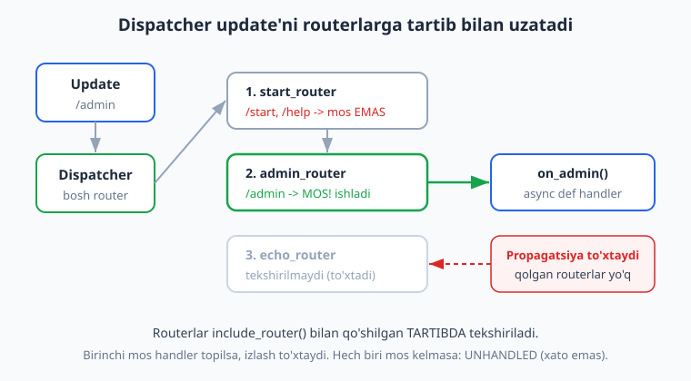
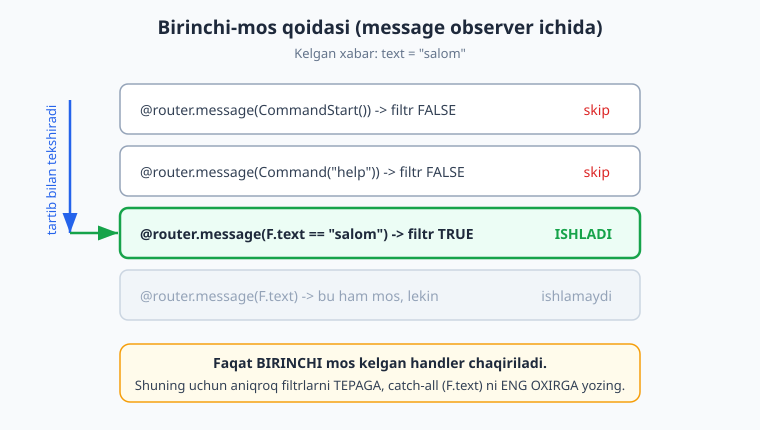
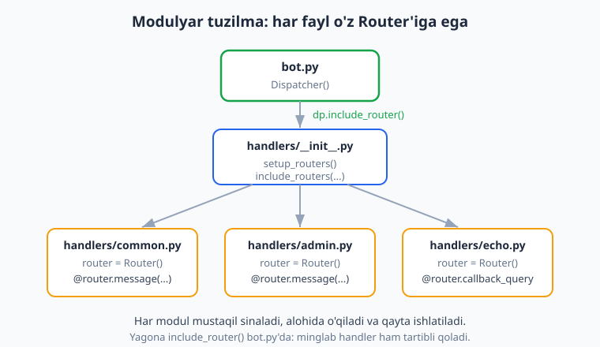

# 03 — Handlerlar va Router

[⬅️ Oldingi: 02 — Birinchi bot: echo va /start](./02-birinchi-bot.md) · [🏠 README](./README.md) · [Keyingi: 04 — Filtrlar va buyruqlar ➡️](./04-filtrlar-buyruqlar.md)

---

> **Bu bobda:** aiogram 3.x'da kelgan har bir hodisani (`Update`) qanday qilib to'g'ri funksiyaga yo'naltirishni o'rganamiz. Asosiy tushunchalar: `Router` nima va u `Dispatcher`'dan qanday farq qiladi; `@router.message(...)`, `@router.callback_query(...)` kabi dekoratorlar bilan **handler** (ishlovchi funksiya) yozish; loyihani modulyar — bir nechta faylga — bo'lish va `dp.include_router()` bilan birlashtirish; turli **update turlari** (`message`, `edited_message`, `callback_query`, `my_chat_member` va boshqalar); handlerlar **qaysi tartibda** sinalishini belgilovchi **birinchi-mos qoidasi**; va bir nechta routerni birga ishlatishda kelib chiqadigan ustuvorlik. aiogram 3.x **dekorator uslubi** asos qilib olinadi.
>
> **Halol eslatma tekshiruv haqida:** bu bobdagi routing, handler chaqirilishi, router tartibi, `include_router`/`include_routers`, nested router va birinchi-mos qoidasi — hammasi **OFFLINE** (tokensiz) `Dispatcher.feed_update()` orqali soxta `Update` yuborib **haqiqatan ishga tushirib tekshirilgan**. Faqat jonli `start_polling` Telegramga ulanish, real xabar yuborish va botni guruhga qo'shish kabi qadamlar BotFather token + internet talab qiladi — bular matnda "illustrativ" deb belgilangan, "ishladi" deb soxta yozilmagan.

---

## Avval: handler, Router, Dispatcher — uchta tushuncha

Ikkinchi bobda biz allaqachon handler yozdik:

```python
@dp.message(CommandStart())
async def start(message: Message):
    await message.answer("Salom!")
```

Bu yerda uchta narsa bor edi, lekin biz ularni atayin sodda qoldirgan edik. Endi har birini ochib beramiz.

- **Handler** — bu shunchaki `async def` funksiya. Telegramdan mos hodisa kelganda u chaqiriladi. Uning vazifasi — javob berish, bazaga yozish, fayl yuborish va h.k.
- **Router** — handlerlar to'plami. U "qaysi hodisada qaysi funksiya ishlaydi" degan jadvalni saqlaydi. Dekorator (`@router.message(...)`) handlerni shu jadvalga qo'shadi.
- **Dispatcher (`dp`)** — eng yuqori router. U Telegramdan kelgan `Update`'ni qabul qiladi va uni o'ziga ulangan routerlarga tarqatadi.

Diqqat qiladigan bir nozik narsa: **`Dispatcher`ning o'zi ham `Router`ning bir turi**. Shuning uchun 02-bobda biz to'g'ridan `@dp.message(...)` yoza oldik — `dp` ham router edi. Lekin kichik loyihalarda bu yetarli bo'lsa-da, loyiha o'sgani sayin hamma handlerni bitta `dp`ga yopishtirish chalkashlikka olib keladi. Yechim — **alohida `Router` obyektlari yaratib, ularni `dp`ga ulash**. Ana shu bu bobning yuragi.



---

## Eng kichik to'liq misol: bitta Router

Keling, `dp` o'rniga alohida `Router` ishlatamiz. Bu — 3.x'da tavsiya etilgan to'g'ri uslub.

```python
import asyncio
from aiogram import Bot, Dispatcher, Router
from aiogram.client.default import DefaultBotProperties
from aiogram.enums import ParseMode
from aiogram.filters import CommandStart, Command
from aiogram.types import Message

router = Router(name="main")  # nom shart emas, lekin log uchun foydali


@router.message(CommandStart())
async def cmd_start(message: Message):
    await message.answer("Salom! Men aiogram 3.x botiman.")


@router.message(Command("help"))
async def cmd_help(message: Message):
    await message.answer("Buyruqlar: /start, /help")


async def main():
    bot = Bot(
        token="BOT_TOKEN",  # amalda .env dan o'qiladi (3-bobda token kodga yozilmaydi)
        default=DefaultBotProperties(parse_mode=ParseMode.HTML),
    )
    dp = Dispatcher()
    dp.include_router(router)        # routerni dispatcherga ulaymiz
    await dp.start_polling(bot)      # jonli: Telegramdan update so'rab turadi


if __name__ == "__main__":
    asyncio.run(main())
```

Bu yerda nima o'zgardi?

- Handlerlar `@dp.message(...)` emas, `@router.message(...)`ga ulangan.
- `Dispatcher()` bo'sh yaratildi, handlerlarni o'zi bilmaydi.
- `dp.include_router(router)` — bog'lovchi qator. Endi `dp` kelgan update'ni `router`ga uzatadi.

> **Halol eslatma:** yuqoridagi `await dp.start_polling(bot)` qatori — bu **jonli** qism. Uni haqiqatan ishlatish uchun BotFatherdan olingan haqiqiy token va internet kerak (illustrativ; tokensiz ishlamaydi). Ammo `dp`/`router`/handler tuzilishi va routing mantig'ini biz tokensiz ham sinashimiz mumkin — keyingi bo'limda aynan shuni qilamiz.

### `parse_mode` ni qayerga yozamiz (3.x nozikligi)

aiogram 2.x'da `Bot(token=..., parse_mode="HTML")` ishlatilardi. **3.x'da bu eskirgan**:

```python
# ❌ ESKI (aiogram 2.x) — 3.x'da xato beradi
bot = Bot(token="...", parse_mode="HTML")

# ✅ TO'G'RI (aiogram 3.x)
from aiogram.client.default import DefaultBotProperties
from aiogram.enums import ParseMode
bot = Bot(token="...", default=DefaultBotProperties(parse_mode=ParseMode.HTML))
```

`ParseMode` `aiogram.enums`'dan keladi (2.x'dagi `types.ParseMode` emas).

---

## Tokensiz tekshirish: `feed_update` bilan soxta Update yuborish

Bizga "bot ishladimi" deyish uchun har safar Telegramga ulanish shart emas. `Dispatcher`da `feed_update(bot, update)` metodi bor — u xuddi Telegramdan kelgandek **bizning qo'limizdagi `Update`ni** dispatcherga uzatadi va mos handlerni chaqiradi. Token soxta bo'lishi mumkin, chunki handler ichida bot API'ga chiqmagunimizcha tarmoq talab qilinmaydi.

Quyidagi to'liq dastur **haqiqatan ishga tushirilib tekshirilgan** (OFFLINE):

```python
import asyncio
from datetime import datetime, timezone

from aiogram import Bot, Dispatcher, Router, F
from aiogram.filters import CommandStart, Command
from aiogram.types import Update, Message, Chat, User

FAKE_TOKEN = "123456:AAH-FakeTest_abc"   # haqiqiy emas, lekin formatga to'g'ri
LOG: list[str] = []                       # handler nimani chaqirganini yozib boramiz

router = Router(name="main")


@router.message(CommandStart())
async def cmd_start(message: Message):
    LOG.append("start")          # message.answer() o'rniga — tarmoq kerakmas


@router.message(Command("help"))
async def cmd_help(message: Message):
    LOG.append("help")


@router.message(F.text)          # qolgan har qanday matn
async def echo(message: Message):
    LOG.append("echo:" + message.text)


def make_message(text: str) -> Message:
    """Telegramdan kelgandek soxta Message yasaymiz."""
    return Message(
        message_id=1,
        date=datetime.now(timezone.utc),
        chat=Chat(id=1, type="private"),
        from_user=User(id=42, is_bot=False, first_name="Test"),
        text=text,
    )


async def main():
    bot = Bot(token=FAKE_TOKEN)
    dp = Dispatcher()
    dp.include_router(router)

    # /start -> start handler
    LOG.clear()
    await dp.feed_update(bot, Update(update_id=1, message=make_message("/start")))
    assert LOG == ["start"], LOG

    # /help -> help handler
    LOG.clear()
    await dp.feed_update(bot, Update(update_id=2, message=make_message("/help")))
    assert LOG == ["help"], LOG

    # oddiy matn -> echo
    LOG.clear()
    await dp.feed_update(bot, Update(update_id=3, message=make_message("salom")))
    assert LOG == ["echo:salom"], LOG

    await bot.session.close()    # bot sessiyasini yopamiz (toza tugatish)
    print("HAMMA ROUTING TEKSHIRUVI O'TDI")


if __name__ == "__main__":
    asyncio.run(main())
```

Ishga tushirilganda chiqaradi:

```text
HAMMA ROUTING TEKSHIRUVI O'TDI
```

Bu naqsh kitobning qolgan qismida ham asosiy tekshirish quroli bo'ladi. Eslab qoling: handler ichida `message.answer(...)` chaqirsangiz, u bot API'ga chiqadi va soxta token bilan xato beradi. Shuning uchun tekshiruvda handler API o'rniga `LOG`ga yozadi.

> Bu yerda `from_user`, `chat`, `message_id`, `date` maydonlari **majburiy** — Telegramning haqiqiy `Message` obyekti shu maydonlarga ega va aiogram ularni tekshiradi. Soxta `Update`da ham ularni to'ldirishimiz kerak.

---

## Update turlari: bot faqat xabar emas, ko'p hodisani eshitadi

Hozirgacha biz faqat `message` (matnli xabar) bilan ishladik. Lekin Telegram botga **juda ko'p turdagi hodisa** yuboradi. Har bir hodisa `Update` ichida bitta maydon sifatida keladi va aiogram'da har biriga alohida **observer** (kuzatuvchi) — ya'ni dekorator — to'g'ri keladi.

Eng ko'p ishlatiladiganlar:

| Update maydoni | Dekorator | Qachon keladi |
| --- | --- | --- |
| `message` | `@router.message(...)` | Foydalanuvchi xabar yubordi (matn, foto, hujjat...) |
| `edited_message` | `@router.edited_message(...)` | Avval yuborilgan xabarni tahrirladi |
| `callback_query` | `@router.callback_query(...)` | Inline tugma bosildi |
| `my_chat_member` | `@router.my_chat_member(...)` | **Botning** a'zoligi o'zgardi (guruhga qo'shildi/chiqarildi, admin bo'ldi) |
| `chat_member` | `@router.chat_member(...)` | Boshqa a'zoning holati o'zgardi (ruxsat sozlanishi kerak) |
| `inline_query` | `@router.inline_query(...)` | Inline rejimda yozildi (`@bot ...`) |
| `chosen_inline_result` | `@router.chosen_inline_result(...)` | Inline natija tanlandi |
| `channel_post` | `@router.channel_post(...)` | Kanalga post chiqdi |
| `poll`, `poll_answer` | `@router.poll(...)` / `@router.poll_answer(...)` | So'rovnoma yangilandi / ovoz berildi |
| `pre_checkout_query`, `shipping_query` | mos dekorator | To'lov jarayoni (07-bob mavzusi) |

> Bu ro'yxat aiogram 3.28'da `Router` obyektida mavjud observerlardan olingan (`message`, `edited_message`, `callback_query`, `my_chat_member`, `chat_member`, `inline_query`, `chosen_inline_result`, `channel_post`, `edited_channel_post`, `poll`, `poll_answer`, `pre_checkout_query`, `shipping_query`, `chat_join_request`, `message_reaction` va boshqalar). Bizga hozir asosiylari kifoya — qolganlarini kerak bo'lganda mos boblarda ishlatamiz.

### Misol: turli update turlarini eshitish

Quyidagi kod uchta turdagi hodisani — `message`, `callback_query`, `my_chat_member` — alohida handlerlar bilan tutadi. **OFFLINE tekshirilgan**:

```python
import asyncio
from datetime import datetime, timezone

from aiogram import Bot, Dispatcher, Router, F
from aiogram.types import (
    Update, Message, CallbackQuery, Chat, User,
    ChatMemberUpdated, ChatMemberMember, ChatMemberLeft,
)

FAKE_TOKEN = "123456:AAH-FakeTest_abc"
LOG: list[str] = []

router = Router(name="multi")


@router.message(F.text)
async def on_message(message: Message):
    LOG.append("message")


@router.callback_query(F.data == "tasdiq")
async def on_callback(callback: CallbackQuery):
    LOG.append("callback")
    # jonli botda: await callback.answer("Qabul qilindi")  (illustrativ)


@router.my_chat_member()
async def on_added_to_chat(event: ChatMemberUpdated):
    # Bot guruhga qo'shildi yoki chiqarildi — shuni bilamiz
    LOG.append("my_chat_member")


async def main():
    bot = Bot(token=FAKE_TOKEN)
    dp = Dispatcher()
    dp.include_router(router)

    # 1) oddiy xabar
    msg = Message(
        message_id=1, date=datetime.now(timezone.utc),
        chat=Chat(id=1, type="private"),
        from_user=User(id=42, is_bot=False, first_name="T"), text="salom")
    LOG.clear()
    await dp.feed_update(bot, Update(update_id=1, message=msg))
    assert LOG == ["message"], LOG

    # 2) inline tugma bosilgani (callback_query)
    cb = CallbackQuery(
        id="cb1",
        from_user=User(id=42, is_bot=False, first_name="T"),
        chat_instance="ci1", data="tasdiq", message=msg)
    LOG.clear()
    await dp.feed_update(bot, Update(update_id=2, callback_query=cb))
    assert LOG == ["callback"], LOG

    # 3) bot guruhga qo'shildi (my_chat_member)
    cmu = ChatMemberUpdated(
        chat=Chat(id=-100, type="supergroup"),
        from_user=User(id=7, is_bot=False, first_name="Admin"),
        date=datetime.now(timezone.utc),
        old_chat_member=ChatMemberLeft(user=User(id=1, is_bot=True, first_name="Bot")),
        new_chat_member=ChatMemberMember(user=User(id=1, is_bot=True, first_name="Bot")),
    )
    LOG.clear()
    await dp.feed_update(bot, Update(update_id=3, my_chat_member=cmu))
    assert LOG == ["my_chat_member"], LOG

    await bot.session.close()
    print("UPDATE TURLARI TEKSHIRUVI O'TDI")


if __name__ == "__main__":
    asyncio.run(main())
```

Ishga tushganda:

```text
UPDATE TURLARI TEKSHIRUVI O'TDI
```

E'tibor bering: `callback_query` handlerining birinchi argumenti `Message` emas, `CallbackQuery`. Har observerning hodisa turi har xil. `my_chat_member` esa `ChatMemberUpdated` oladi — undan botning eski va yangi holatini (`old_chat_member`, `new_chat_member`) bilib olamiz, bu "bot qachon guruhdan chiqarildi" kabi hodisalarni ushlash uchun juda foydali.

> **`my_chat_member` vs `chat_member`:** `my_chat_member` har doim ishlaydi va aynan **bot**ning holatini bildiradi (guruhga qo'shildi, admin qilindi, blok qilindi). `chat_member` esa **boshqa** a'zolar haqida bo'lib, uni olish uchun `start_polling`da `allowed_updates`'ni alohida sozlash kerak — bu jonli sozlama (illustrativ), shuning uchun bu bobda `my_chat_member`ga tayanamiz.

---

## Birinchi-mos qoidasi: handlerlar qaysi tartibda sinaladi

Bu — eng ko'p chalkashlik keltiradigan mavzu, shuning uchun sekin boramiz.

Bitta observer (masalan `message`) ichida bir nechta handler bo'lishi mumkin. aiogram ularni **yozilish tartibida** yuqoridan pastga tekshiradi:

1. Birinchi handlerning filtri tekshiriladi. Mos kelsa — **shu handler ishlaydi va tekshirish to'xtaydi**.
2. Mos kelmasa — keyingi handlerga o'tadi.
3. Va hokazo.

Ya'ni **faqat bitta** handler ishlaydi — birinchi mos kelgani. Bu **birinchi-mos qoidasi** (first-match).



Bu juda muhim amaliy oqibatga ega: **catch-all (`F.text` kabi hamma narsaga mos keluvchi) handlerni eng oxirga yozing**, aks holda u oldidagi aniqroq handlerlarni "yutib yuboradi".

Quyidagi kod xatoni ko'rsatadi va to'g'rilaydi. **OFFLINE tekshirilgan**:

```python
import asyncio
from datetime import datetime, timezone

from aiogram import Bot, Dispatcher, Router, F
from aiogram.filters import Command
from aiogram.types import Update, Message, Chat, User

FAKE_TOKEN = "123456:AAH-FakeTest_abc"


def msg(text):
    return Message(message_id=1, date=datetime.now(timezone.utc),
                   chat=Chat(id=1, type="private"),
                   from_user=User(id=1, is_bot=False, first_name="T"), text=text)


async def run(router, text):
    bot = Bot(token=FAKE_TOKEN)
    dp = Dispatcher()
    dp.include_router(router)
    await dp.feed_update(bot, Update(update_id=1, message=msg(text)))
    await bot.session.close()


# ❌ XATO TARTIB: catch-all tepada
bad = Router()
result_bad = []

@bad.message(F.text)                      # hamma matnga mos -> har doim shu ishlaydi
async def bad_echo(m: Message):
    result_bad.append("echo")

@bad.message(Command("help"))             # bu hech qachon ishlamaydi!
async def bad_help(m: Message):
    result_bad.append("help")


# ✅ TO'G'RI TARTIB: aniq filtrlar tepada, catch-all oxirda
good = Router()
result_good = []

@good.message(Command("help"))
async def good_help(m: Message):
    result_good.append("help")

@good.message(F.text)
async def good_echo(m: Message):
    result_good.append("echo")


async def main():
    await run(bad, "/help")
    assert result_bad == ["echo"], result_bad   # /help bo'lsa ham echo ishladi — XATO!

    await run(good, "/help")
    assert result_good == ["help"], result_good  # to'g'ri: help ishladi

    print("BIRINCHI-MOS QOIDASI TEKSHIRUVI O'TDI")


if __name__ == "__main__":
    asyncio.run(main())
```

Natija:

```text
BIRINCHI-MOS QOIDASI TEKSHIRUVI O'TDI
```

`bad` routerda `/help` yuborilsa ham `echo` ishladi, chunki `F.text` tepada turib hamma matnni ushlab oldi. `good`da esa tartib to'g'ri — avval aniq buyruq, oxirida umumiy matn.

### Hech qaysi handler mos kelmasa nima bo'ladi?

Hech narsa yomon bo'lmaydi. aiogram update'ni `UNHANDLED` deb belgilaydi va **e'tiborsiz qoldiradi** — xato (exception) chiqmaydi, bot ishlashda davom etadi. Buni ham tekshirdik: matnsiz (faqat caption'li) xabar `F.text` filtriga mos kelmadi va `feed_update` `UNHANDLED` qaytardi, hech bir handler chaqirilmadi.

---

## Loyihani fayllarga bo'lish: bir nechta Router

Hozirgacha hamma kod bitta faylda edi. Real botda bu mumkin emas — yuzlab handler bitta faylga sig'maydi. Yechim: **har mavzuni alohida faylga ajratamiz, har faylda o'z `Router`i bo'ladi**, keyin hammasini `dp`ga ulaymiz.



Tipik tuzilma quyidagicha:

```text
loyiha/
├─ bot.py                  # Dispatcher, ulash, start_polling
└─ handlers/
   ├─ __init__.py          # setup_routers() — hammasini birlashtiradi
   ├─ common.py            # /start, /help
   ├─ admin.py             # admin buyruqlari
   └─ echo.py              # qolgan matnlar (catch-all)
```

**`handlers/common.py`:**

```python
from aiogram import Router
from aiogram.filters import CommandStart, Command
from aiogram.types import Message

router = Router(name="common")   # har faylda o'z routeri, har doim "router" deb nomlash odat


@router.message(CommandStart())
async def cmd_start(message: Message):
    await message.answer("Salom!")


@router.message(Command("help"))
async def cmd_help(message: Message):
    await message.answer("Yordam: /start, /help")
```

**`handlers/admin.py`:**

```python
from aiogram import Router
from aiogram.filters import Command
from aiogram.types import Message

router = Router(name="admin")


@router.message(Command("admin"))
async def cmd_admin(message: Message):
    await message.answer("Admin paneli")
```

**`handlers/echo.py`:**

```python
from aiogram import Router, F
from aiogram.types import Message

router = Router(name="echo")


@router.message(F.text)          # catch-all — eng oxirgi router bo'lishi kerak
async def echo(message: Message):
    await message.answer(message.text)
```

**`handlers/__init__.py`** — bu yerda barcha routerlarni bitta "asosiy" routerga yig'amiz. `include_routers` (ko'plik) bir necha routerni bir chaqiruvda ulaydi:

```python
from aiogram import Router
from . import common, admin, echo


def setup_routers() -> Router:
    router = Router(name="main")
    # TARTIB MUHIM: echo (catch-all) eng oxirda turishi kerak,
    # aks holda u common/admin buyruqlarini yutib yuboradi.
    router.include_routers(common.router, admin.router, echo.router)
    return router
```

**`bot.py`** — endi bitta qator bilan hammasi ulanadi:

```python
import asyncio
from aiogram import Bot, Dispatcher
from handlers import setup_routers


async def main():
    bot = Bot(token="BOT_TOKEN")     # amalda .env dan
    dp = Dispatcher()
    dp.include_router(setup_routers())   # bitta chaqiruv — hamma handler ulangan
    await dp.start_polling(bot)          # jonli (illustrativ — token + internet kerak)


if __name__ == "__main__":
    asyncio.run(main())
```

> **Halol eslatma:** `start_polling` jonli qismi tokensiz ishlamaydi (illustrativ). Lekin yuqoridagi `handlers/` paketining routing mantig'i — `common` -> `admin` -> `echo` tartibda to'g'ri yo'naltirishi — aynan shu tuzilma bilan **OFFLINE tekshirildi**: `/start` -> common'dagi handler, oddiy matn -> echo, matnsiz xabar -> `UNHANDLED`. Hammasi kutilgandek ishladi.

### `include_router` vs `include_routers`

- `dp.include_router(r)` — bitta routerni qo'shadi.
- `dp.include_routers(r1, r2, r3)` — bir nechta routerni ketma-ket qo'shadi (ichida har biri uchun `include_router` chaqiradi).

Ikkalasi ham routerlarni **berilgan tartibda** qo'shadi va shu tartib keyinchalik ularning sinash navbatini belgilaydi.

---

## Routerlar tartibi va nested (ichma-ich) routerlar

Endi nozik, lekin chuqur bilim talab qiladigan ikki holatni ochamiz.

### 1) Bir necha router birga: include tartibi g'olibni belgilaydi

Agar ikki router ham bitta update'ga mos handlerga ega bo'lsa, **avval `include` qilingan router g'olib chiqadi**. Buni tekshirdik:

```python
first = Router(name="first")
second = Router(name="second")

@first.message(F.text)
async def h_first(m: Message):
    LOG.append("first")

@second.message(F.text)
async def h_second(m: Message):
    LOG.append("second")

dp.include_router(first)
dp.include_router(second)
# "matn" yuborilganda -> LOG == ["first"]  (second ishlamaydi)
```

`first` birinchi ulangani uchun u yutadi, `second`gacha navbat yetib bormaydi.

### 2) Nested router: parent o'z handlerlarini AVVAL sinaydi

Routerni boshqa routerning ichiga ham ulash mumkin: `parent.include_router(child)`. Lekin bu yerda ko'pchilik xato qiladi. Tekshirib aniqladik (aiogram 3.28 manbasidan): **parent router avval o'zining handlerlarini sinaydi, keyingina sub-routerlarga (child'larga) o'tadi.**

```python
parent = Router(name="parent")
child = Router(name="child")

@child.message(F.text.startswith("/sozlama"))
async def h_child(m: Message):
    LOG.append("child")

@parent.message(F.text.startswith("/sozlama"))   # parentda ham mos handler bor
async def h_parent_settings(m: Message):
    LOG.append("parent-settings")

parent.include_router(child)
dp.include_router(parent)
# "/sozlama" -> LOG == ["parent-settings"]   child EMAS!
```

Demak nested routerda mantiq quyidagicha: avval parentning barcha handlerlari (yozilish tartibida), agar hech biri mos kelmasa — keyin child'lar (include tartibida). Bu tartibni esda tutish kerak, aks holda "nega child handlerim ishlamayapti?" degan savol kelib chiqadi.

Agar parentda mos handler bo'lmasa, child'ning handleri ishlaydi:

```python
parent2 = Router(name="p2")
child2 = Router(name="c2")

@child2.message(F.text.startswith("/sozlama"))
async def hc(m: Message):
    LOG.append("child2")

parent2.include_router(child2)
dp.include_router(parent2)
# "/sozlama" -> LOG == ["child2"]   (parent2'da mos handler yo'q)
```

> Amalda nested routerlardan kamroq foydalaniladi — odatda hamma routerni to'g'ridan `dp`ga ulash yetarli. Nested struktura katta loyihalarda bir guruh routerni "modul" sifatida birlashtirib, modulni bitta `include_router` bilan ulashga yordam beradi (yuqoridagi `setup_routers()` shunga misol).

### Routerni ikki marta ulab bo'lmaydi

aiogram bir routerni ikki joyga ulashga yo'l qo'ymaydi va aniq xato beradi (biz buni tekshirdik):

```python
dp.include_router(r)
dp.include_router(r)   # ❌ RuntimeError: Router is already attached to <Dispatcher ...>

r.include_router(r)    # ❌ RuntimeError: Self-referencing routers is not allowed

r.include_router(Dispatcher())  # ❌ RuntimeError: Dispatcher can not be attached to another Router.
```

Oxirgisi muhim: **`Dispatcher` har doim eng tepada turadi**, uni boshqa routerga child qilib bo'lmaydi.

---

## pytest bilan handler testi (professional uslub)

Routerlaringizni `assert` bilan qo'lda emas, balki `pytest` + `pytest-asyncio` bilan sinash — keyinchalik katta loyihada juda foydali. Naqsh bir xil: soxta `Update` -> `feed_update` -> handler chaqirilganini tekshirish. Quyidagi **haqiqatan `pytest` ostida o'tdi**:

```python
# test_handlers.py
import pytest
from datetime import datetime, timezone

from aiogram import Bot, Dispatcher, Router
from aiogram.filters import CommandStart
from aiogram.types import Update, Message, Chat, User

FAKE_TOKEN = "123456:AAH-FakeTest_abc"


def msg(text):
    return Message(message_id=1, date=datetime.now(timezone.utc),
                   chat=Chat(id=1, type="private"),
                   from_user=User(id=42, is_bot=False, first_name="T"), text=text)


@pytest.mark.asyncio
async def test_start_handler():
    calls = []
    r = Router()

    @r.message(CommandStart())
    async def start(message: Message):
        calls.append(message.from_user.id)

    bot = Bot(token=FAKE_TOKEN)
    dp = Dispatcher()
    dp.include_router(r)
    await dp.feed_update(bot, Update(update_id=1, message=msg("/start")))
    await bot.session.close()

    assert calls == [42]


def test_double_include_raises():
    r = Router()
    dp = Dispatcher()
    dp.include_router(r)
    with pytest.raises(RuntimeError):
        dp.include_router(r)
```

Ishga tushirish:

```bash
pip install pytest pytest-asyncio
pytest test_handlers.py -q
```

Natija (haqiqatan olingan):

```text
...                                                                      [100%]
3 passed in 3.37s
```

> Maslahat: `pytest.ini` yoki `pyproject.toml`da `asyncio_mode = auto` yozsangiz, har testga `@pytest.mark.asyncio` qo'yish shart bo'lmaydi.

---

## Cheat-sheet: 2.x vs 3.x (aralashtirib yubormaslik uchun)

Internetda aiogram bo'yicha eski (2.x) misollar ko'p. Quyidagilarni **ishlatmang**:

| ❌ aiogram 2.x (eskirgan) | ✅ aiogram 3.x (to'g'ri) |
| --- | --- |
| `@dp.message_handler(...)` | `@router.message(...)` |
| `@dp.callback_query_handler(...)` | `@router.callback_query(...)` |
| `from aiogram import executor` | yo'q — `await dp.start_polling(bot)` |
| `executor.start_polling(dp)` | `asyncio.run(main())` ichida `dp.start_polling(bot)` |
| `dp.register_message_handler(fn, ...)` | `router.message.register(fn, ...)` |
| `Bot(token=..., parse_mode="HTML")` | `Bot(token=..., default=DefaultBotProperties(parse_mode=ParseMode.HTML))` |
| `types.ParseMode` | `from aiogram.enums import ParseMode` |
| `@dp.message_handler(commands=["start"])` | `@router.message(Command("start"))` yoki `CommandStart()` |

> aiogram 3.x'da `register` ham bor (dekoratorsiz ulash uchun): `router.message.register(handler, CommandStart())`. Bu dekorator bilan bir xil ishlaydi, faqat handlerni boshqa joyda ham ulash kerak bo'lganda qulay.

Boshqa tillarda bot yozgan bo'lsangiz: Node.js'dagi `Telegraf`/`grammY`'da ham shunga o'xshash "middleware + handler" g'oyasi bor — taqqoslash uchun [Node.js qo'llanmasi](../nodejs/README.md)ga qarang. Python asoslari (async/await, dekorator) bo'yicha esa [Python qo'llanmasi](../python/README.md) yordam beradi.

---

## Mashqlar

> Hammasini OFFLINE bajaring: soxta `Bot(token="123456:AAH-FakeTest_abc")`, `Dispatcher`, `feed_update` va `LOG`/`assert` naqshidan foydalaning. Handler ichida `message.answer` o'rniga ro'yxatga yozing.

### Oson

1. Bitta `Router` yarating, unga `/start` (CommandStart) handlerini ulang. `dp.include_router(router)` qiling va soxta `/start` update'ini `feed_update` bilan yuborib, handler chaqirilganini `assert` bilan tekshiring.
2. Yuqoridagi routerga `@router.message(F.text)` catch-all handler qo'shing. "salom" matnini yuboring va echo handler `"salom"`ni qaytarganini (ro'yxatga yozganini) tasdiqlang.
3. `2.x` uslubidagi `@dp.message_handler(commands=["start"])` qatorini `3.x` ga to'g'ri tarzda qayta yozing. Nima o'zgarganini bir jumlada izohlang.
4. `Bot(token=..., parse_mode="HTML")` ni aiogram 3.x'da to'g'ri yozing. Qaysi importlar kerakligini ko'rsating.
5. `callback_query` uchun handler yozing: `F.data == "ha"` bo'lsa ishlasin. Soxta `CallbackQuery` yasab `feed_update` bilan tekshiring.

### O'rta

6. Uchta alohida `Router` yarating: `start_router` (`/start`), `admin_router` (`/admin`), `echo_router` (`F.text`). To'g'ri tartibda `include_router` qiling. `/admin` yuborilganda faqat admin handleri ishlashini tasdiqlang.
7. Catch-all (`F.text`) handlerini xato tarzda eng tepaga qo'ying va `/help` yuboring. Echo ishlab, help ishlamasligini `assert` bilan ko'rsating. Keyin tartibni to'g'rilab, qayta tekshiring.
8. `my_chat_member` handlerini yozing va soxta `ChatMemberUpdated` (bot guruhga qo'shildi) update'ini yuborib, handler chaqirilganini tasdiqlang.
9. Bir routerni `dp`ga ikki marta ulashga urinib ko'ring. `pytest.raises(RuntimeError)` bilan xato chiqishini tekshiring.
10. Loyihani `handlers/` paketiga bo'ling: `common.py` (`/start`), `echo.py` (`F.text`), `__init__.py` (`setup_routers()` -> `include_routers`). `feed_update` bilan `/start` va oddiy matnni to'g'ri yo'nalishini tekshiring.

### Qiyin

11. `parent` va `child` routerlar yarating. Ikkalasida ham `/sozlama`ga mos handler bo'lsin. `parent.include_router(child)` qiling. `/sozlama` yuborilganda **parent**ning handleri ishlashini (child emas) tasdiqlang va nega bunday bo'lishini izohlang.
12. `message`, `edited_message` va `callback_query` uchun uchta handlerli bitta router yozing. Uch xil soxta update yuborib, har biri faqat o'z handleriga tushishini tasdiqlang.
13. `pytest` + `pytest-asyncio` bilan ikki test yozing: (a) `/start` handler `from_user.id`ni to'g'ri olishi; (b) hech qaysi handler mos kelmaganda `feed_update` `UNHANDLED` qaytarishi. `pytest -q` bilan ikkalasi ham o'tishini ko'rsating.

<details markdown="1"><summary>Yechimlar</summary>

Quyidagi yechimlarning hammasi yuqoridagi OFFLINE naqsh bilan ishlaydi. Qisqalik uchun umumiy yordamchini bir marta beramiz:

```python
import asyncio
from datetime import datetime, timezone
from aiogram import Bot, Dispatcher, Router, F
from aiogram.filters import Command, CommandStart
from aiogram.types import (Update, Message, CallbackQuery, Chat, User,
                           ChatMemberUpdated, ChatMemberMember, ChatMemberLeft)

FAKE = "123456:AAH-FakeTest_abc"

def msg(text):
    return Message(message_id=1, date=datetime.now(timezone.utc),
                   chat=Chat(id=1, type="private"),
                   from_user=User(id=42, is_bot=False, first_name="T"), text=text)
```

**1.**

```python
LOG = []
r = Router()

@r.message(CommandStart())
async def start(m: Message):
    LOG.append("start")

async def main():
    bot = Bot(token=FAKE); dp = Dispatcher(); dp.include_router(r)
    await dp.feed_update(bot, Update(update_id=1, message=msg("/start")))
    await bot.session.close()
    assert LOG == ["start"]; print("OK 1")

asyncio.run(main())
```

**2.**

```python
LOG = []
r = Router()

@r.message(CommandStart())
async def start(m: Message): LOG.append("start")

@r.message(F.text)
async def echo(m: Message): LOG.append("echo:" + m.text)

async def main():
    bot = Bot(token=FAKE); dp = Dispatcher(); dp.include_router(r)
    await dp.feed_update(bot, Update(update_id=1, message=msg("salom")))
    await bot.session.close()
    assert LOG == ["echo:salom"]; print("OK 2")

asyncio.run(main())
```

**3.** Eski (2.x): `@dp.message_handler(commands=["start"])`. To'g'ri (3.x):

```python
@router.message(Command("start"))   # yoki @router.message(CommandStart())
async def start(message: Message): ...
```

O'zgargani: dekorator endi `dp`da emas, alohida `router`da; `commands=` argumenti o'rniga `Command(...)` filtri ishlatiladi; `_handler` qo'shimchasi yo'q.

**4.**

```python
from aiogram import Bot
from aiogram.client.default import DefaultBotProperties
from aiogram.enums import ParseMode

bot = Bot(token="...", default=DefaultBotProperties(parse_mode=ParseMode.HTML))
```

`parse_mode=` to'g'ridan `Bot`ga berilmaydi; `default=DefaultBotProperties(...)` orqali beriladi. `ParseMode` `aiogram.enums`'dan.

**5.**

```python
LOG = []
r = Router()

@r.callback_query(F.data == "ha")
async def on_cb(cb: CallbackQuery):
    LOG.append("ha")

async def main():
    bot = Bot(token=FAKE); dp = Dispatcher(); dp.include_router(r)
    cb = CallbackQuery(id="1", from_user=User(id=42, is_bot=False, first_name="T"),
                       chat_instance="ci", data="ha", message=msg("x"))
    await dp.feed_update(bot, Update(update_id=1, callback_query=cb))
    await bot.session.close()
    assert LOG == ["ha"]; print("OK 5")

asyncio.run(main())
```

**6.**

```python
LOG = []
start_router = Router(name="start")
admin_router = Router(name="admin")
echo_router = Router(name="echo")

@start_router.message(CommandStart())
async def s(m: Message): LOG.append("start")

@admin_router.message(Command("admin"))
async def a(m: Message): LOG.append("admin")

@echo_router.message(F.text)
async def e(m: Message): LOG.append("echo")

async def main():
    bot = Bot(token=FAKE); dp = Dispatcher()
    dp.include_router(start_router)
    dp.include_router(admin_router)
    dp.include_router(echo_router)   # catch-all eng oxirda
    await dp.feed_update(bot, Update(update_id=1, message=msg("/admin")))
    await bot.session.close()
    assert LOG == ["admin"]; print("OK 6")

asyncio.run(main())
```

**7.**

```python
# XATO tartib
bad = Router(); res_bad = []
@bad.message(F.text)
async def be(m: Message): res_bad.append("echo")
@bad.message(Command("help"))
async def bh(m: Message): res_bad.append("help")

# TO'G'RI tartib
good = Router(); res_good = []
@good.message(Command("help"))
async def gh(m: Message): res_good.append("help")
@good.message(F.text)
async def ge(m: Message): res_good.append("echo")

async def run(router, text):
    bot = Bot(token=FAKE); dp = Dispatcher(); dp.include_router(router)
    await dp.feed_update(bot, Update(update_id=1, message=msg(text)))
    await bot.session.close()

async def main():
    await run(bad, "/help");  assert res_bad == ["echo"]    # XATO holat
    await run(good, "/help"); assert res_good == ["help"]   # to'g'rilangan
    print("OK 7")

asyncio.run(main())
```

**8.**

```python
LOG = []
r = Router()

@r.my_chat_member()
async def joined(e: ChatMemberUpdated): LOG.append("joined")

async def main():
    bot = Bot(token=FAKE); dp = Dispatcher(); dp.include_router(r)
    cmu = ChatMemberUpdated(
        chat=Chat(id=-100, type="supergroup"),
        from_user=User(id=7, is_bot=False, first_name="A"),
        date=datetime.now(timezone.utc),
        old_chat_member=ChatMemberLeft(user=User(id=1, is_bot=True, first_name="B")),
        new_chat_member=ChatMemberMember(user=User(id=1, is_bot=True, first_name="B")))
    await dp.feed_update(bot, Update(update_id=1, my_chat_member=cmu))
    await bot.session.close()
    assert LOG == ["joined"]; print("OK 8")

asyncio.run(main())
```

**9.**

```python
import pytest

def test_double_include():
    r = Router(); dp = Dispatcher()
    dp.include_router(r)
    with pytest.raises(RuntimeError):
        dp.include_router(r)
# pytest test_x.py -q  ->  1 passed
```

**10.** `handlers/common.py`:

```python
from aiogram import Router
from aiogram.filters import CommandStart
from aiogram.types import Message
router = Router(name="common")
EVENTS = []
@router.message(CommandStart())
async def start(m: Message): EVENTS.append("start")
```

`handlers/echo.py`:

```python
from aiogram import Router, F
from aiogram.types import Message
from .common import EVENTS
router = Router(name="echo")
@router.message(F.text)
async def echo(m: Message): EVENTS.append("echo:" + m.text)
```

`handlers/__init__.py`:

```python
from aiogram import Router
from . import common, echo
def setup_routers() -> Router:
    r = Router(name="main")
    r.include_routers(common.router, echo.router)   # echo oxirda
    return r
```

Tekshirish (`test.py` loyiha ildizida):

```python
import asyncio
from datetime import datetime, timezone
from aiogram import Bot, Dispatcher
from aiogram.types import Update, Message, Chat, User
from handlers import setup_routers
from handlers.common import EVENTS

def msg(t):
    return Message(message_id=1, date=datetime.now(timezone.utc),
                   chat=Chat(id=1, type="private"),
                   from_user=User(id=1, is_bot=False, first_name="T"), text=t)

async def main():
    bot = Bot(token="123456:AAH-FakeTest_abc"); dp = Dispatcher()
    dp.include_router(setup_routers())
    EVENTS.clear(); await dp.feed_update(bot, Update(update_id=1, message=msg("/start")))
    assert EVENTS == ["start"]
    EVENTS.clear(); await dp.feed_update(bot, Update(update_id=2, message=msg("hi")))
    assert EVENTS == ["echo:hi"]
    await bot.session.close(); print("OK 10")

asyncio.run(main())
```

**11.**

```python
LOG = []
parent = Router(name="parent")
child = Router(name="child")

@child.message(F.text.startswith("/sozlama"))
async def c(m: Message): LOG.append("child")

@parent.message(F.text.startswith("/sozlama"))
async def p(m: Message): LOG.append("parent")

async def main():
    parent.include_router(child)
    bot = Bot(token=FAKE); dp = Dispatcher(); dp.include_router(parent)
    await dp.feed_update(bot, Update(update_id=1, message=msg("/sozlama")))
    await bot.session.close()
    assert LOG == ["parent"]; print("OK 11")

asyncio.run(main())
```

Izoh: nested routerda parent avval **o'z** handlerlarini sinaydi; mos kelsa, child'larga umuman o'tmaydi. Shuning uchun parent g'olib.

**12.**

```python
LOG = []
r = Router()

@r.message(F.text)
async def m_(m: Message): LOG.append("message")

@r.edited_message(F.text)
async def em(m: Message): LOG.append("edited")

@r.callback_query()
async def cb(c: CallbackQuery): LOG.append("callback")

async def main():
    bot = Bot(token=FAKE); dp = Dispatcher(); dp.include_router(r)

    LOG.clear()
    await dp.feed_update(bot, Update(update_id=1, message=msg("a")))
    assert LOG == ["message"]

    LOG.clear()
    await dp.feed_update(bot, Update(update_id=2, edited_message=msg("b")))
    assert LOG == ["edited"]

    LOG.clear()
    c = CallbackQuery(id="1", from_user=User(id=1, is_bot=False, first_name="T"),
                      chat_instance="ci", data="x", message=msg("y"))
    await dp.feed_update(bot, Update(update_id=3, callback_query=c))
    assert LOG == ["callback"]
    await bot.session.close(); print("OK 12")

asyncio.run(main())
```

**13.**

```python
# test_ch03.py
import pytest
from datetime import datetime, timezone
from aiogram import Bot, Dispatcher, Router, F
from aiogram.filters import CommandStart
from aiogram.dispatcher.event.bases import UNHANDLED
from aiogram.types import Update, Message, Chat, User

FAKE = "123456:AAH-FakeTest_abc"
def msg(t, **kw):
    return Message(message_id=1, date=datetime.now(timezone.utc),
                   chat=Chat(id=1, type="private"),
                   from_user=User(id=42, is_bot=False, first_name="T"),
                   text=t, **kw)

@pytest.mark.asyncio
async def test_start_user_id():
    calls = []; r = Router()
    @r.message(CommandStart())
    async def s(m: Message): calls.append(m.from_user.id)
    bot = Bot(token=FAKE); dp = Dispatcher(); dp.include_router(r)
    await dp.feed_update(bot, Update(update_id=1, message=msg("/start")))
    await bot.session.close()
    assert calls == [42]

@pytest.mark.asyncio
async def test_unhandled():
    r = Router()
    @r.message(F.text)
    async def e(m: Message): ...
    bot = Bot(token=FAKE); dp = Dispatcher(); dp.include_router(r)
    # matnsiz xabar -> F.text mos kelmaydi
    res = await dp.feed_update(bot, Update(update_id=1,
        message=msg(None, caption="rasm")))
    await bot.session.close()
    assert res is UNHANDLED
# pytest test_ch03.py -q  ->  2 passed
```

</details>

---

[⬅️ Oldingi: 02 — Birinchi bot: echo va /start](./02-birinchi-bot.md) · [🏠 README](./README.md) · [Keyingi: 04 — Filtrlar va buyruqlar ➡️](./04-filtrlar-buyruqlar.md)
