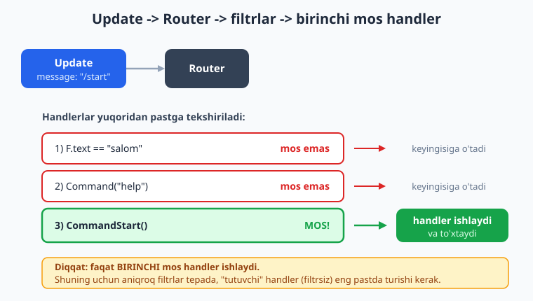
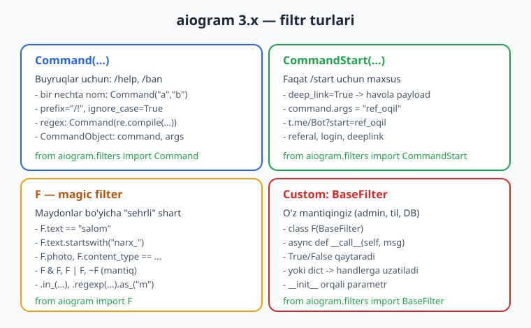
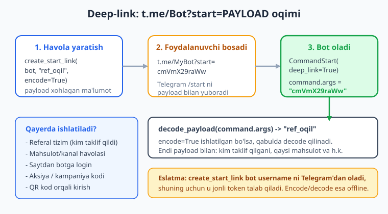

# 04 — Filtrlar va buyruqlar

[⬅️ Oldingi: 03 — Handlerlar va Router](./03-handlerlar-router.md) · [🏠 README](./README.md) · [Keyingi: 05 — Xabar yuborish, formatlash va media ➡️](./05-xabar-formatlash-media.md)

---

> **Bu bobda:** Filtr nima va nega kerakligini, handler qaysi xabarni ushlashini aniqlovchi mexanizmni o'rganamiz. `Command` va `CommandStart` filtrlari bilan buyruqlarni (`/start`, `/help`, `/ban`) qabul qilamiz, `CommandObject` orqali buyruq argumentlarini ajratamiz. `CommandStart(deep_link=True)` va `aiogram.utils.deep_linking` yordamida **deep-link** (referal/havola payload) qurish va o'qishni ko'ramiz. `F` (magic-filter) bilan `F.text`, `F.text.startswith(...)`, `F.content_type`, `.in_()`, `.regexp(...).as_(...)` kabi kuchli, lekin sodda shartlar yozamiz. `BaseFilter` dan meros olib **o'z (custom) filtr klassi** quramiz (masalan admin tekshiruvi) va u handlerga `dict` orqali ma'lumot uzatishini ko'ramiz. Filtrlarni `&`, `|`, `~` hamda `or_f`/`and_f` bilan **birlashtirish** va `content_type` bo'yicha media (rasm, stiker, hujjat) ajratishni o'rganamiz.
>
> **Halol eslatma:** Bu bobdagi handler-routing, filtr mantig'i, `CommandObject` parslash, custom filtr va deep-link `encode`/`decode` kodlari **offline tekshirilgan** (soxta token + `dp.feed_update` bilan mock `Update` uzatilgan; jonli Telegram chaqirilmagan). `create_start_link` bot username'ni Telegram'dan oladi, shu sababli u **jonli token + internet** talab qiladi — bunday bloklar matnda "illustrativ" deb belgilangan. Real xabar yuborish, long-polling va webhook ham BotFather token + internet talab qiladi.

---

## 1. Filtr nima va nega kerak?

3-bobda handler — bu update'ga javob beradigan `async def` funksiya ekanini ko'rdik. Lekin har bir handler **hamma** xabarga emas, **faqat o'ziga tegishli** xabarga ishlashi kerak. `/start` buyrug'ini bitta handler, "salom" so'zini boshqasi, rasmni uchinchisi ushlashi lozim.

Ana shu "kim qaysi xabarni oladi?" degan savolga **filtr** javob beradi. Filtr — bu update kelganda chaqiriladigan, `True` yoki `False` qaytaradigan shart. Agar handlerning hamma filtrlari `True` bo'lsa — handler ishlaydi. Aks holda aiogram keyingi handlerga o'tadi.

Eng muhim qoida: **router ichida handlerlar yuqoridan pastga tartib bilan tekshiriladi va faqat BIRINCHI mos kelgan handler ishlaydi.** Qolganlari umuman chaqirilmaydi. Shuning uchun aniqroq filtrlarni tepada, "hammasini tutuvchi" filtrsiz handlerni esa eng pastda qo'yamiz.



Filtrni handlerga uzatishning ikki usuli bor — dekorator argumenti sifatida, yoki bir nechta filtrni vergul bilan ketma-ket:

```python
from aiogram import Router, F
from aiogram.filters import Command
from aiogram.types import Message

router = Router()

# Bitta filtr — F magic-filter
@router.message(F.text == "salom")
async def salom_handler(message: Message):
    await message.answer("Va alaykum assalom!")

# Bitta filtr — Command
@router.message(Command("help"))
async def help_handler(message: Message):
    await message.answer("Yordam matni...")
```

Filtrsiz `@router.message()` esa **har qanday** xabarni ushlaydi — shuning uchun u odatda eng oxirgi "tutuvchi" (fallback) handler bo'ladi.

aiogram 3.x da 4 turdagi filtrni eng ko'p ishlatamiz: `Command`, `CommandStart`, `F` (magic-filter) va `BaseFilter`'dan meros olgan o'z klassingiz.



> **Eslatma (2.x vs 3.x):** Agar internetda `@dp.message_handler(commands=["start"])` yoki `content_types=...` ko'rsangiz — bu **eski aiogram 2.x**. Biz 3.x ishlatamiz: `@router.message(CommandStart())`, `@router.message(F.content_type == ...)`. Ularni aralashtirmang.

---

## 2. `Command` filtri — buyruqlarni ushlash

Telegram'da buyruq — bu `/` bilan boshlanadigan so'z: `/start`, `/help`, `/ban`. `Command` filtri shu buyruqlarni ushlaydi.

```python
from aiogram.filters import Command
```

Eng oddiy holat — bitta buyruq:

```python
@router.message(Command("help"))
async def help_handler(message: Message):
    await message.answer("Bu yordam bo'limi.")
```

Bu handler `/help` yozilganda ishlaydi. `Command("help")` ichida `/` yozmaymiz — prefiks avtomatik qo'shiladi.

### Bir nechta nom (alias)

Bir buyruqning bir nechta nomi bo'lishi mumkin — masalan o'zbekcha va inglizcha:

```python
@router.message(Command("help", "yordam"))
async def help_handler(message: Message):
    await message.answer("Yordam / Help")
```

Endi `/help` ham, `/yordam` ham shu handlerga tushadi.

### `CommandObject` — buyruq haqida ma'lumot

Handler `command: CommandObject` parametrini qabul qilsa, aiogram unga buyruq tafsilotlarini uzatadi. Eng kerakli maydonlar:

- `command.command` — buyruq nomi (prefikssiz), masalan `"help"`;
- `command.args` — buyruqdan keyingi matn (yo'q bo'lsa `None`);
- `command.prefix` — ishlatilgan prefiks, odatda `"/"`;
- `command.regexp_match` — regex bilan ishlatilganda `re.Match` obyekti.

```python
from aiogram.filters import Command, CommandObject

@router.message(Command("ban"))
async def ban_handler(message: Message, command: CommandObject):
    if command.args is None:
        await message.answer("Foydalanish: /ban @username sabab")
        return
    # "/ban @spammer reklama uchun" -> args = "@spammer reklama uchun"
    await message.answer(f"Bloklash so'rovi: {command.args}")
```

`command.args` — bu buyruqdan keyingi **butun matn** (bo'sh joygacha emas, hammasi). Agar uni qismlarga bo'lish kerak bo'lsa, oddiy Python'da `command.args.split(maxsplit=1)` qilamiz.

### Prefiks va katta-kichik harf

Standart prefiks `/`. Lekin uni o'zgartirish mumkin — masalan admin buyruqlari uchun `!`:

```python
# /buy ham, !buy ham ishlaydi
@router.message(Command("buy", prefix="/!"))
async def buy_handler(message: Message, command: CommandObject):
    await message.answer(f"Prefiks: {command.prefix}")
```

`ignore_case=True` — `/Stop`, `/STOP`, `/stop` ning hammasini ushlaydi:

```python
@router.message(Command("stop", ignore_case=True))
async def stop_handler(message: Message):
    await message.answer("To'xtatildi.")
```

### Regex bilan dinamik buyruqlar

Buyruq ichida raqam yoki ID bo'lsa, `re.compile` ishlatamiz:

```python
import re

@router.message(Command(re.compile(r"item_(\d+)")))
async def item_handler(message: Message, command: CommandObject):
    # /item_55 -> regexp_match.group(1) == "55"
    item_id = command.regexp_match.group(1)
    await message.answer(f"Mahsulot raqami: {item_id}")
```

> **Diqqat — `ignore_mention`:** Guruhda bot mention bilan chaqirilishi mumkin: `/help@MyBot`. Standart holatda bu **o'z botingiz** uchun avtomatik ishlaydi. Agar boshqa botga mo'ljallangan `/help@OtherBot` ni ham ushlamoqchi bo'lsangiz, `ignore_mention=True` qo'yasiz (kamdan-kam kerak bo'ladi).

---

## 3. `CommandStart` va deep-link

`/start` — har bir bot uchun eng birinchi va eng muhim buyruq. Foydalanuvchi botni ochganda Telegram avtomatik shu buyruqni yuboradi. Uni `Command("start")` bilan ham ushlash mumkin, lekin maxsus `CommandStart` filtri qulayroq, chunki u **deep-link** bilan ishlashni ham biladi.

```python
from aiogram.filters import CommandStart

@router.message(CommandStart())
async def start_handler(message: Message):
    await message.answer("Botga xush kelibsiz! /help — yordam.")
```

### Deep-link nima?

Deep-link — bu `t.me/MyBot?start=PAYLOAD` ko'rinishidagi havola. Foydalanuvchi shu havolani bossa, Telegram botga `/start PAYLOAD` ni yuboradi. Ya'ni botga **qo'shimcha ma'lumot bilan** kirish mumkin. Bu juda ko'p joyda ishlatiladi:

- **Referal tizim** — kim kimni taklif qilganini bilish (`?start=ref_12345`);
- **Mahsulot havolasi** — qaysi mahsulotdan kelganini bilish;
- **Saytdan botga login** — bir martalik token uzatish;
- **QR kod** yoki **aksiya kodi**.



Botda payload'ni ushlash uchun `CommandStart(deep_link=True)` ishlatamiz va `command.args` orqali payload'ni olamiz:

```python
from aiogram.filters import CommandStart, CommandObject

# 1) Payload BOR /start (deep-link) — tepada
@router.message(CommandStart(deep_link=True))
async def start_with_payload(message: Message, command: CommandObject):
    payload = command.args  # masalan "ref_oqil123"
    await message.answer(f"Siz havola orqali keldingiz: {payload}")

# 2) Oddiy /start (payload yo'q) — pastda
@router.message(CommandStart())
async def start_plain(message: Message):
    await message.answer("Oddiy start. Xush kelibsiz!")
```

> **Tartib muhim:** `deep_link=True` versiyasini **tepaga** qo'ying. Aks holda oddiy `CommandStart()` payload'li `/start` ni ham ushlab oladi va deep-link handler hech qachon ishlamaydi.

### Deep-link havolasini yaratish va kodlash

Payload'ni shunchaki matn sifatida uzatish mumkin, lekin unda maxsus belgilar bo'lsa (`/`, `=`, bo'sh joy), uni **base64url** bilan kodlash kerak. `aiogram.utils.deep_linking` shu uchun yordamchi funksiyalar beradi:

```python
from aiogram.utils.deep_linking import (
    create_start_link, encode_payload, decode_payload,
)
```

`encode_payload` / `decode_payload` — sof funksiyalar, ular token talab qilmaydi (offline ishlaydi):

```python
enc = encode_payload("user-42")     # "dXNlci00Mg"
original = decode_payload(enc)       # "user-42"
```

Qabul tomonida, agar siz `encode=True` bilan yaratgan bo'lsangiz, payload'ni qaytarib ochasiz:

```python
@router.message(CommandStart(deep_link=True))
async def start_with_payload(message: Message, command: CommandObject):
    # encode bilan yaratilgan bo'lsa, decode qilamiz
    payload = decode_payload(command.args)
    await message.answer(f"Ochilgan payload: {payload}")
```

Havolaning o'zini yaratish esa bot username'ini talab qiladi (uni Telegram'dan oladi), shuning uchun bu blok **jonli token bilan** ishlaydi:

```python
# Illustrativ — jonli token + internet kerak (bot.get_me() chaqiriladi).
# Kod to'g'ri, lekin tokensiz ishga tushmaydi.
link = await create_start_link(bot, payload="ref_oqil123", encode=True)
# Natija (illustrativ): "https://t.me/MyBot?start=cmVmX29raWwxMjM"
```

> **Havola turlari:** guruhga qo'shish uchun `create_startgroup_link(...)`, Mini App uchun `create_startapp_link(...)` ham bor. Asosiy mantiq bir xil — payload uzatiladi, bot uni `command.args` orqali oladi.

Cross-link: deep-link payload'ini bazaga yozish (referal kim ekanini saqlash) uchun [SQL/baza bobini](../sql/README.md) ko'ring; Python tomonidagi `re`, `dict`, `split` asoslari uchun [Python qo'llanmasi](../python/README.md).

---

## 4. `F` — magic-filter (sehrli filtr)

`Command` buyruqlar uchun. Lekin oddiy matn ("salom"), tugma matni, media (rasm) uchun nima qilamiz? Bunda `F` — **magic-filter** ishlatiladi. Bu aiogram'ning eng ko'p ishlatiladigan, lekin eng sodda quroli.

```python
from aiogram import F
```

`F` — bu xabar (yoki callback) maydonlariga "sehrli" murojaat. `F.text` — xabar matni, `F.from_user.id` — yuboruvchi ID'si, `F.photo` — rasm. Siz ular ustida shart yozasiz, aiogram esa har update kelganda shu shartni tekshiradi.

### Tenglik va matn shartlari

```python
# Aniq tenglik
@router.message(F.text == "salom")
async def exact(message: Message):
    await message.answer("Salom shartli javob")

# Katta-kichik harfga e'tibor bermay
@router.message(F.text.lower() == "salom")
async def case_insensitive(message: Message):
    # "Salom", "SALOM", "salom" — hammasi tushadi
    await message.answer("Har qanday registr")

# Boshlanishi bo'yicha
@router.message(F.text.startswith("narx_"))
async def by_prefix(message: Message):
    # "narx_iphone", "narx_telefon" ...
    await message.answer(f"So'rov: {message.text}")
```

Yana foydali metodlar:

- `F.text.endswith("?")` — savol bilan tugaganlar;
- `F.text.contains("reklama")` — ichida shu so'z bo'lganlar;
- `F.text.len() > 100` — uzun matnlar;
- `F.text.in_({"ha", "yo'q"})` — to'plamdagilardan biri.

```python
# To'plamdan biri
@router.message(F.text.in_({"ha", "yo'q", "balki"}))
async def answer_choice(message: Message):
    await message.answer(f"Tanlovingiz: {message.text}")
```

### Regex va natijani olish — `.as_(...)`

`F.text.regexp(...)` regex shartini qo'yadi. `.as_("nom")` esa mos kelgan `re.Match` obyektini handlerga shu nom bilan uzatadi:

```python
import re

@router.message(F.text.regexp(r"^#(\w+)$").as_("tag"))
async def hashtag(message: Message, tag: re.Match):
    # "#aiogram" -> tag.group(1) == "aiogram"
    await message.answer(f"Hashtag: {tag.group(1)}")
```

### Mantiqiy birlashtirish: `&`, `|`, `~`

Bir nechta `F` shartini birlashtirish mumkin. Diqqat: har bir shartni **qavs** ichiga oling:

```python
# VA (&) — ikkala shart ham bajarilsin
@router.message((F.text == "vip") & F.from_user.id.in_({777, 999}))
async def vip(message: Message):
    await message.answer("VIP foydalanuvchi!")

# YOKI (|) — biri yetadi
@router.message(F.text.startswith("/") | F.text.startswith("!"))
async def any_command(message: Message):
    await message.answer("Buyruqqa o'xshaydi")

# INKOR (~) — shart bajarilMAsligi kerak
@router.message(F.text & ~F.text.startswith("/"))
async def not_command_text(message: Message):
    await message.answer("Bu oddiy matn (buyruq emas)")
```

> **Nega `F.text` ni `&` da ishlatamiz?** `~F.text.startswith("/")` matn `None` bo'lsa ham `True` bo'lib qolishi mumkin (rasm kelganda). Shuning uchun avval `F.text` (matn umuman bor) shartini qo'yamiz, keyin "buyruq emas" shartini.

---

## 5. `content_type` bo'yicha media filtrlash

Foydalanuvchi nafaqat matn, balki rasm, stiker, hujjat, ovozli xabar ham yuboradi. Ularni ajratishning ikki yo'li bor.

**1-usul — maydon mavjudligini tekshirish** (eng ravon):

```python
@router.message(F.photo)
async def got_photo(message: Message):
    await message.answer("Chiroyli rasm!")

@router.message(F.document)
async def got_document(message: Message):
    await message.answer("Hujjat qabul qilindi.")

@router.message(F.voice)
async def got_voice(message: Message):
    await message.answer("Ovozli xabar.")
```

`F.photo` — agar xabarda `photo` maydoni bor (ya'ni `None` emas) bo'lsa `True`. Bu eng oddiy va o'qiladigan yo'l.

**2-usul — `content_type` bo'yicha**, ayniqsa bir nechta turni birga ushlash kerak bo'lsa:

```python
from aiogram.enums import ContentType

@router.message(F.content_type == ContentType.STICKER)
async def got_sticker(message: Message):
    await message.answer("Stiker!")

# Bir nechta turdan biri
@router.message(F.content_type.in_({ContentType.PHOTO, ContentType.VIDEO}))
async def media(message: Message):
    await message.answer("Rasm yoki video media")
```

`ContentType` — `aiogram.enums` dagi enum. Eng ko'p kerak bo'ladiganlari: `TEXT`, `PHOTO`, `VIDEO`, `DOCUMENT`, `AUDIO`, `VOICE`, `STICKER`, `ANIMATION`, `CONTACT`, `LOCATION`, `POLL`, `DICE`.

> `F.photo` bilan `F.content_type == ContentType.PHOTO` deyarli bir xil natija beradi. Bitta turni ushlash uchun `F.photo` qulayroq; bir nechta turni `in_` bilan birga ushlash uchun `content_type` qulayroq.

---

## 6. Custom (o'z) filtr — `BaseFilter`

`Command` va `F` ko'p hollarni qoplaydi. Lekin ba'zan murakkabroq mantiq kerak: "faqat adminlar", "faqat ro'yxatdan o'tgan foydalanuvchilar", "faqat ish vaqtida". Bunda `BaseFilter` dan meros olib **o'z filtringizni** yozasiz.

```python
from aiogram.filters import BaseFilter
```

Filtr — bu `async def __call__(...)` metodi bo'lgan klass. U `True` (handler ishlasin) yoki `False` (ishlamasin) qaytaradi. `__init__` orqali parametr berishingiz mumkin:

```python
from aiogram.filters import BaseFilter
from aiogram.types import Message

class AdminFilter(BaseFilter):
    def __init__(self, admins: set[int]) -> None:
        self.admins = admins

    async def __call__(self, message: Message) -> bool:
        return message.from_user is not None and message.from_user.id in self.admins

# Ishlatish — filtrni nusxalab beramiz
ADMINS = {777, 1000}

@router.message(Command("panel"), AdminFilter(admins=ADMINS))
async def admin_panel(message: Message):
    await message.answer("Admin paneli")
```

Bu yerda handlerda **ikki filtr** vergul bilan birga: `Command("panel")` VA `AdminFilter(...)`. Ikkalasi ham `True` bo'lsagina handler ishlaydi (vergul — bu mantiqiy VA).

### Filtr handlerga ma'lumot uzatishi (`dict` qaytarish)

Filtr `True`/`False` o'rniga **`dict`** qaytarsa, shu dict'dagi kalitlar handlerga **parametr** sifatida uzatiladi. Bu juda qulay — masalan filtr foydalanuvchi rolini aniqlab, uni handlerga beradi:

```python
class RoleFilter(BaseFilter):
    def __init__(self, roles: dict[int, str]) -> None:
        self.roles = roles

    async def __call__(self, message: Message) -> bool | dict:
        if message.from_user is None:
            return False
        role = self.roles.get(message.from_user.id)
        if role is None:
            return False
        return {"role": role}   # handlerga "role" uzatiladi

ROLES = {777: "admin", 1000: "moderator"}

@router.message(Command("me"), RoleFilter(roles=ROLES))
async def whoami(message: Message, role: str):
    await message.answer(f"Sizning rolingiz: {role}")
```

Agar foydalanuvchi rolga ega bo'lmasa, filtr `False` qaytaradi va handler ishlamaydi — pastdagi boshqa handler (yoki fallback) ushlaydi.

> **Maslahat:** custom filtr ichida ma'lumotlar bazasiga murojaat qilish mumkin (`async def __call__` — async!). Lekin og'ir tekshiruvlar (DB, tashqi API) ko'pincha **middleware**'da qilingani yaxshiroq — middleware'ni keyingi boblarda ko'ramiz. Filtr — yengil "tushadi/tushmaydi" qaroriga mo'ljallangan.

---

## 7. Filtrlarni birlashtirish — to'liq misol

Endi hammasini bitta mini-bot ko'rinishida yig'amiz. Bu kod **offline tekshirilgan** (soxta token + mock `Update`). Faqat handler ichidagi `message.answer(...)` jonli Telegram'da javob yuboradi — uni real ko'rish uchun token + internet kerak.

```python
import asyncio
import re
from aiogram import Bot, Dispatcher, Router, F
from aiogram.filters import Command, CommandStart, CommandObject, BaseFilter, or_f
from aiogram.fsm.storage.memory import MemoryStorage
from aiogram.enums import ContentType
from aiogram.types import Message

router = Router()
ADMINS = {777}


class AdminFilter(BaseFilter):
    def __init__(self, admins: set[int]) -> None:
        self.admins = admins

    async def __call__(self, message: Message) -> bool:
        return bool(message.from_user) and message.from_user.id in self.admins


# 1) Deep-link start (tepada — payload bor holat)
@router.message(CommandStart(deep_link=True))
async def start_deep(message: Message, command: CommandObject):
    await message.answer(f"Havola payload: {command.args}")

# 2) Oddiy start
@router.message(CommandStart())
async def start_plain(message: Message):
    await message.answer("Xush kelibsiz!")

# 3) Argumentli buyruq
@router.message(Command("echo"))
async def echo_cmd(message: Message, command: CommandObject):
    await message.answer(command.args or "Matn bering: /echo salom")

# 4) Command + custom filtr (VA)
@router.message(Command("panel"), AdminFilter(admins=ADMINS))
async def panel(message: Message):
    await message.answer("Admin paneli")

# 5) F: regex + .as_()
@router.message(F.text.regexp(r"^#(\w+)$").as_("tag"))
async def hashtag(message: Message, tag: re.Match):
    await message.answer(f"Tag: {tag.group(1)}")

# 6) or_f bilan ikki shart
@router.message(or_f(F.text == "ha", F.text == "yo'q"))
async def yesno(message: Message):
    await message.answer(f"Javob: {message.text}")

# 7) content_type bo'yicha media
@router.message(F.content_type.in_({ContentType.PHOTO, ContentType.STICKER}))
async def media(message: Message):
    await message.answer("Rasm yoki stiker qabul qilindi")

# 8) Tutuvchi (fallback) — eng pastda, filtrsiz
@router.message()
async def fallback(message: Message):
    await message.answer("Tushunmadim. /help bosing.")


async def main() -> None:
    # Jonli ishga tushirish (illustrativ — BotFather token + internet kerak):
    bot = Bot(token="ENV_DAN_BOT_TOKEN")
    dp = Dispatcher(storage=MemoryStorage())
    dp.include_router(router)
    await dp.start_polling(bot)   # bu qator jonli Telegram bilan ishlaydi


if __name__ == "__main__":
    asyncio.run(main())
```

`or_f(a, b)` — bu `a | b` ning funksiya ko'rinishi (`aiogram.filters` dan). Murakkab shartlarni o'qiladigan qilib yozishga yordam beradi; juftligi `and_f(...)` va `invert_f(...)` ham bor.

Handlerlar tartibiga e'tibor bering: deep-link tepada, fallback eng pastda. Bu — filtrlar bilan ishlashning oltin qoidasi.

> **Token haqida:** `Bot(token="...")` ga tokenni **kodga yozmang**. U `.env` faylida `BOT_TOKEN` sifatida turadi va `os.getenv("BOT_TOKEN")` orqali o'qiladi (buni 02-bobda ko'rgan edik). Yuqorida soddalik uchun `"ENV_DAN_BOT_TOKEN"` placeholder qo'yilgan.

---

## 8. Buni qanday OFFLINE tekshirdim?

Yuqoridagi handler-routingni token va internetsiz tekshirish uchun **soxta token** va `dp.feed_update` bilan **mock `Update`** uzatildi. Handlerlar `message.answer` o'rniga global ro'yxatga yozadigan qilib o'zgartirilib, qaysi handler ishga tushgani tekshirildi:

```python
# Soxta token — getMe chaqirilmaydi, faqat format to'g'ri bo'lsa kifoya
FAKE = "123456:AAH-FakeTest_abcdefghijklmnopqrstuvwx"

bot = Bot(token=FAKE)
dp = Dispatcher(storage=MemoryStorage())
dp.include_router(router)

from datetime import datetime
from aiogram.types import Update, Message, Chat, User

msg = Message(message_id=1, date=datetime.now(),
              chat=Chat(id=1, type="private"),
              from_user=User(id=1, is_bot=False, first_name="T"),
              text="/start ref_oqil123")
await dp.feed_update(bot, Update(update_id=1, message=msg))
await bot.session.close()
# -> deep-link handler ishladi, command.args == "ref_oqil123"
```

Shu usulda 19 xil update (oddiy start, deep-link start, `/help`/`/yordam`, argumentli `/ban`, admin/oddiy `/panel`, `salom`, `narx_...`, regex `#tag`, `vip`, `ha`/`yo'q`, rasm, stiker va h.k.) uzatib ko'rilib, har biri **kutilgan** handlerga tushgani tasdiqlandi. Deep-link `encode_payload`/`decode_payload` esa to'g'ridan-to'g'ri funksiya sifatida tekshirildi.

---

## Mashqlar

### Oson

1. `/about` buyrug'ini ushlovchi handler yozing — u bot haqida qisqa matn javob qaytarsin. `Command` ishlatib.

2. Bitta handler `/help` va `/yordam` ning **ikkalasini** ham ushlasin. Bir nechta nom (alias) ishlating.

3. `F.text` magic-filter bilan "rahmat" so'ziga (aniq tenglik) "Arzimaydi!" deb javob qaytaruvchi handler yozing.

4. `F.text.lower()` ishlatib, "ok", "OK", "Ok" — uchalasiga ham bir xil javob beruvchi handler yozing.

5. `F.photo` bilan har qanday rasmga "Rasm qabul qilindi" deb javob beruvchi handler yozing.

6. `Command("sum")` va `CommandObject` yordamida handler `command.args` bo'sh bo'lsa "Foydalanish: /sum 2 3" deb yozsin, aks holda argumentni qaytarib bersin.

### O'rta

7. `/start ref_<kod>` deep-link'ini ushlang: `CommandStart(deep_link=True)` bilan `command.args` ni oling va "Referal kod: <kod>" deb javob bering. Oddiy `/start` (payloadsiz) esa boshqa handler bilan ishlansin. Tartibga e'tibor bering.

8. `F.content_type.in_({...})` ishlatib, rasm, video va hujjat — uchchalasini bitta handler bilan ushlang va "Media fayl" deb javob bering.

9. `/dice` buyrug'ini `Command(re.compile(...))` orqali `/dice_6`, `/dice_20` ko'rinishida ushlang va tomonlar sonini (`regexp_match.group(1)`) javobda qaytaring.

10. `encode_payload` va `decode_payload` bilan "product=42&ref=oqil" matnini kodlang, keyin qaytarib oching va ikkisi teng ekanini `assert` bilan tekshiring (offline).

11. `&` va `~` bilan filtr yozing: faqat **buyruq bo'lmagan** matn xabarlariga "Oddiy matn" deb javob bersin (rasm/stikerga emas).

12. `F.text.regexp(r"^@(\w+)$").as_("m")` bilan `@username` ko'rinishidagi matnni ushlang va `m.group(1)` (usernameni @ siz) javobda qaytaring.

### Qiyin

13. `BaseFilter`'dan meros olib `RoleFilter` yozing: u `dict[int, str]` (user_id -> rol) qabul qilsin va mos foydalanuvchi uchun `{"role": ...}` qaytarsin, aks holda `False`. Handler `role: str` ni qabul qilib, "Rol: admin" deb javob bersin. `dp.feed_update` bilan offline tekshiring (admin va oddiy foydalanuvchi).

14. Vaqt bo'yicha filtr yozing: `WorkHoursFilter(BaseFilter)` — `__init__(start, end)` (masalan 9 va 18). `__call__` ichida joriy soatni tekshirib, ish vaqti bo'lsa `True`, aks holda `False`. Test qulayligi uchun soatni `__init__` ga `now` parametri sifatida ham berib, mantiqni offline tekshiring.

15. `or_f` va `and_f` ni birga ishlatib filtr quring: handler faqat (matn "boshla" YOKI "start") VA foydalanuvchi `ADMINS` to'plamida bo'lsagina ishlasin. `dp.feed_update` bilan: admin "boshla" -> ishlasin; oddiy "boshla" -> ishlamasin (fallback).

16. Mini buyruq-parser yozing: `/give @user 100 oltin` buyrug'ini `Command("give")` bilan ushlab, `command.args` ni `split(maxsplit=2)` bilan `(kim, miqdor, nima)` ga ajrating va validatsiya qiling (3 ta qism kerak, miqdor butun son). Noto'g'ri formatda foydalanish ko'rsatmasini bering.

<details markdown="1">
<summary>Yechimlar</summary>

Yechimlarda umumiy import va router shu deb faraz qilinadi:

```python
import re
from aiogram import Router, F
from aiogram.filters import (
    Command, CommandStart, CommandObject, BaseFilter, or_f, and_f,
)
from aiogram.enums import ContentType
from aiogram.types import Message
from aiogram.utils.deep_linking import encode_payload, decode_payload

router = Router()
```

**1.**
```python
@router.message(Command("about"))
async def about(message: Message):
    await message.answer("Bu — aiogram 3.x da yozilgan o'quv bot.")
```

**2.**
```python
@router.message(Command("help", "yordam"))
async def help_cmd(message: Message):
    await message.answer("Yordam bo'limi: /about, /help, /yordam")
```

**3.**
```python
@router.message(F.text == "rahmat")
async def thanks(message: Message):
    await message.answer("Arzimaydi!")
```

**4.**
```python
@router.message(F.text.lower() == "ok")
async def ok_handler(message: Message):
    await message.answer("Qabul qilindi.")
```

**5.**
```python
@router.message(F.photo)
async def photo_handler(message: Message):
    await message.answer("Rasm qabul qilindi")
```

**6.**
```python
@router.message(Command("sum"))
async def sum_cmd(message: Message, command: CommandObject):
    if not command.args:
        await message.answer("Foydalanish: /sum 2 3")
        return
    await message.answer(f"Argument: {command.args}")
```

**7.** Tartib muhim — `deep_link=True` tepada:
```python
@router.message(CommandStart(deep_link=True))
async def start_ref(message: Message, command: CommandObject):
    kod = command.args
    if kod and kod.startswith("ref_"):
        kod = kod[len("ref_"):]
    await message.answer(f"Referal kod: {kod}")

@router.message(CommandStart())
async def start_plain(message: Message):
    await message.answer("Oddiy start. Xush kelibsiz!")
```

**8.**
```python
@router.message(F.content_type.in_({
    ContentType.PHOTO, ContentType.VIDEO, ContentType.DOCUMENT,
}))
async def media(message: Message):
    await message.answer("Media fayl")
```

**9.**
```python
@router.message(Command(re.compile(r"dice_(\d+)")))
async def dice(message: Message, command: CommandObject):
    tomonlar = command.regexp_match.group(1)
    await message.answer(f"Tomonlar soni: {tomonlar}")
```

**10.** (offline, handlersiz)
```python
enc = encode_payload("product=42&ref=oqil")
back = decode_payload(enc)
assert back == "product=42&ref=oqil"
print("OK:", enc, "->", back)
```

**11.** Avval `F.text` (matn bor) keyin "buyruq emas":
```python
@router.message(F.text & ~F.text.startswith("/"))
async def plain_text(message: Message):
    await message.answer("Oddiy matn")
```

**12.**
```python
@router.message(F.text.regexp(r"^@(\w+)$").as_("m"))
async def mention(message: Message, m: re.Match):
    await message.answer(f"Username: {m.group(1)}")
```

**13.**
```python
class RoleFilter(BaseFilter):
    def __init__(self, roles: dict[int, str]) -> None:
        self.roles = roles

    async def __call__(self, message: Message) -> bool | dict:
        if message.from_user is None:
            return False
        role = self.roles.get(message.from_user.id)
        if role is None:
            return False
        return {"role": role}

ROLES = {777: "admin", 1000: "moderator"}

@router.message(Command("me"), RoleFilter(roles=ROLES))
async def whoami(message: Message, role: str):
    await message.answer(f"Rol: {role}")
```

Offline tekshirish (soxta token + feed_update):
```python
import asyncio
from datetime import datetime
from aiogram import Bot, Dispatcher
from aiogram.fsm.storage.memory import MemoryStorage
from aiogram.types import Update, Chat, User

async def test():
    bot = Bot(token="123456:AAH-FakeTest_abcdefghijklmnopqrstuvwx")
    dp = Dispatcher(storage=MemoryStorage())
    dp.include_router(router)

    def msg(uid):
        return Message(message_id=1, date=datetime.now(),
                       chat=Chat(id=uid, type="private"),
                       from_user=User(id=uid, is_bot=False, first_name="T"),
                       text="/me")

    await dp.feed_update(bot, Update(update_id=1, message=msg(777)))   # admin -> ishlaydi
    await dp.feed_update(bot, Update(update_id=2, message=msg(5)))     # rol yo'q -> ishlamaydi
    await bot.session.close()

asyncio.run(test())
```

**14.** Soatni parametr sifatida olib, mantiqni sof qilamiz:
```python
from datetime import datetime

class WorkHoursFilter(BaseFilter):
    def __init__(self, start: int, end: int) -> None:
        self.start = start
        self.end = end

    async def __call__(self, message: Message, now: int | None = None) -> bool:
        hour = now if now is not None else datetime.now().hour
        return self.start <= hour < self.end

# Offline mantiq testi (handlersiz, sof funksiya sifatida):
import asyncio
f = WorkHoursFilter(9, 18)
assert asyncio.run(f(None, now=10)) is True   # ish vaqti
assert asyncio.run(f(None, now=20)) is False  # ish vaqtidan keyin
print("WorkHoursFilter OK")
```
Eslatma: jonli botda `now` berilmaydi, `datetime.now().hour` ishlatiladi; offline testda esa `now` ni qo'lda beramiz.

**15.**
```python
ADMINS = {777}

@router.message(
    and_f(
        or_f(F.text == "boshla", F.text == "start"),
        F.from_user.id.in_(ADMINS),
    )
)
async def admin_start(message: Message):
    await message.answer("Admin boshladi")

@router.message()
async def fallback(message: Message):
    await message.answer("Ruxsat yo'q yoki tushunarsiz")
```
Offline: admin "boshla" -> `admin_start`; oddiy "boshla" -> `fallback`.

**16.**
```python
@router.message(Command("give"))
async def give(message: Message, command: CommandObject):
    if not command.args:
        await message.answer("Foydalanish: /give @user 100 oltin")
        return
    qismlar = command.args.split(maxsplit=2)
    if len(qismlar) != 3:
        await message.answer("Format: /give <kim> <miqdor> <nima>")
        return
    kim, miqdor_str, nima = qismlar
    if not miqdor_str.isdigit():
        await message.answer("Miqdor butun son bo'lishi kerak.")
        return
    miqdor = int(miqdor_str)
    await message.answer(f"{kim} ga {miqdor} {nima} berildi.")
```

</details>

---

[⬅️ Oldingi: 03 — Handlerlar va Router](./03-handlerlar-router.md) · [🏠 README](./README.md) · [Keyingi: 05 — Xabar yuborish, formatlash va media ➡️](./05-xabar-formatlash-media.md)
