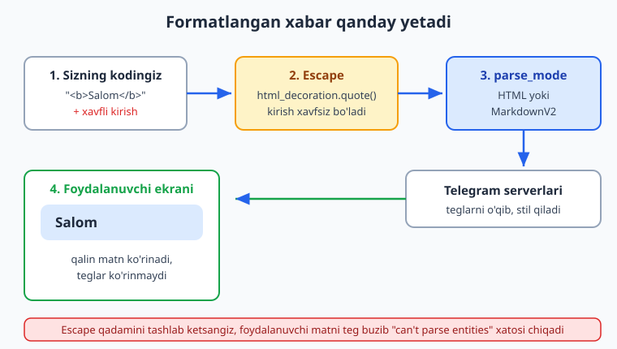
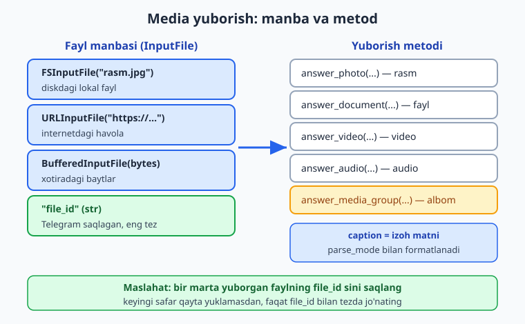
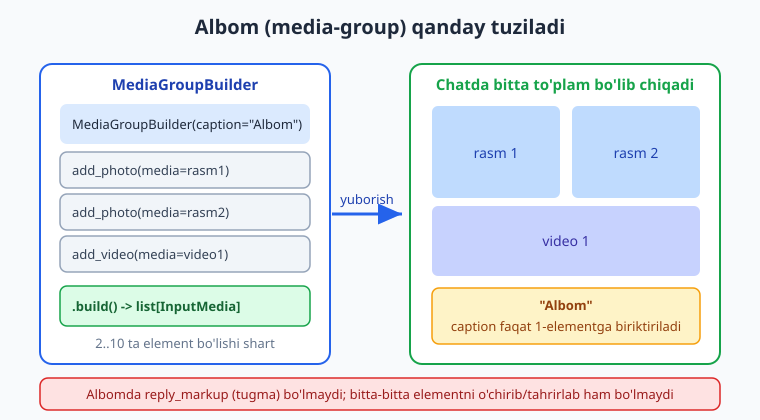

# 05 — Xabar yuborish, formatlash va media

[⬅️ Oldingi: 04 — Filtrlar va buyruqlar](./04-filtrlar-buyruqlar.md) · [🏠 README](./README.md) · [Keyingi: 06 — Klaviaturalar: reply va inline ➡️](./06-klaviaturalar.md)

---

> **Bu bobda:** botning eng asosiy ishi — xabar yuborishni chuqur o'rganamiz. `message.answer()`, `message.reply()` va `bot.send_message()` o'rtasidagi farqni aniq tushunamiz. Keyin matnni chiroyli qilishga o'tamiz: **HTML** va **MarkdownV2** formatlash, `DefaultBotProperties` orqali `parse_mode` ni butun bot uchun bir marta sozlash, va eng muhimi — foydalanuvchidan kelgan matnni **escape** qilib, "can't parse entities" xatosi va xavfsizlik kamchiliklarini oldini olish. So'ng `aiogram.utils.formatting` modulini ko'ramiz — bu teglar bilan ovora bo'lmasdan, Python obyektlari orqali formatlashning toza usuli. Ikkinchi yarmida **media**: rasm, hujjat, audio, video yuborish; `FSInputFile` (diskdan), `URLInputFile` (havoladan), `BufferedInputFile` (xotiradan) va `file_id` (eng tez); `caption` (izoh); va `MediaGroupBuilder` bilan **albom** (media-group) tuzish.
>
> **Halol eslatma:** bu bobdagi handler routing, escape funksiyalari, formatlash obyektlari, `MediaGroupBuilder` va `InputFile` turlari — hammasi token va internetsiz, mock `Update` ni dispatcher'ga `feed_update` bilan uzatib OFFLINE tekshirilgan (`bot.session` mock qilingan, real HTTP ketmaydi). Lekin **xabar yoki fayl haqiqatan foydalanuvchiga yetib borishi** jonli Telegram (BotFather token + internet) talab qiladi. Shunday bloklarni "illustrativ — jonli botda shunday ko'rinadi" deb halol belgilab o'tamiz; soxta "yetib bordi" deyilmaydi.

---

## 5.1. Uch xil yuborish: answer, reply, send_message

04-bobda biz `message.answer("matn")` ni ishlatdik. Endi to'liq oilani ko'rib chiqaylik. Telegram'ga xabar jo'natishning aslida bitta Bot API metodi bor: `sendMessage`. aiogram esa uni uch xil qulay usulda taqdim etadi.

| Usul | Nima qiladi | Qachon ishlatiladi |
|------|-------------|--------------------|
| `message.answer(text)` | O'sha chatga **yangi** xabar yuboradi (javob-bog'lanishsiz) | Eng ko'p ishlatiladigan; oddiy javob |
| `message.reply(text)` | O'sha chatga, lekin **kelgan xabarga "javob" bog'lab** yuboradi (ustida ko'rinadigan tirnoq) | Aniq qaysi xabarga javob berayotganingiz muhim bo'lsa |
| `bot.send_message(chat_id, text)` | Istalgan `chat_id` ga yuboradi | Boshqa chatga, yoki `Message` obyekti yo'q joyda (masalan, FSM, rejalashtirilgan jo'natma) |

`message.answer()` aslida ichida `chat_id` ni o'zi `message.chat.id` dan oladi va `bot.send_message(...)` ga aylanadi. Ya'ni `answer` — bu `send_message` ustidagi qulay qisqartma (shortcut). Shuning uchun ulardagi parametrlar deyarli bir xil: `parse_mode`, `reply_markup`, `disable_notification` va hokazo.

```python
# main.py — uch usulning farqi (handler qismi)
from aiogram import Router
from aiogram.filters import Command
from aiogram.types import Message

router = Router()


@router.message(Command("uchta"))
async def uchta_usul(message: Message):
    # 1) Yangi xabar — eng oddiy
    await message.answer("Bu answer: oddiy yangi xabar.")

    # 2) Javob bog'lab — kelgan xabar ustida tirnoq bilan ko'rinadi
    await message.reply("Bu reply: sizning xabaringizga javob.")

    # 3) Aniq chat_id ga — message.chat.id ni qo'lda beramiz
    await message.bot.send_message(
        chat_id=message.chat.id,
        text="Bu send_message: chat_id ni o'zimiz berdik.",
    )
```

`message.bot` — bu handler ichida joriy `Bot` obyektiga yetib olishning eng oson yo'li (aiogram uni avtomatik biriktiradi). Demak alohida `bot` o'zgaruvchisini handler'ga uzatish shart emas.

> **Eslatma (jonli xulq, illustrativ):** `answer` xabarni chatning oxiriga oddiy qo'shadi; `reply` esa kelgan xabarga "ip" bog'lab ko'rsatadi. Bu farq jonli Telegram'da ko'rinadi — token+internet kerak. Lekin qaysi metod chaqirilgani va parametrlari OFFLINE tekshiriladi (5.9 ga qarang).

### bot.send_message qachon zarur

Tasavvur qiling: foydalanuvchi `/eslat` deb yozdi, siz 10 daqiqadan keyin unga xabar yubormoqchisiz. O'sha paytda asl `Message` obyekti endi qo'lingizda bo'lmaydi — sizda faqat `chat_id` saqlangan bo'ladi. Aynan shunda `bot.send_message(chat_id, text)` kerak bo'ladi. Xuddi shu narsa "admin'ga xabar yuborish" yoki "barcha obunachilarga e'lon tarqatish" kabi vazifalarda ham — chatlarni `Message` orqali emas, saqlangan `chat_id` lar ro'yxati orqali aylanib chiqamiz.

---

## 5.2. parse_mode nima va nega kerak

Standart holatda Telegram matnni **oddiy matn** (plain text) sifatida ko'rsatadi: hech qanday qalin, qiya yoki havola yo'q. Matnni bezash uchun siz Telegram'ga "bu matnni formatlangan deb o'qi" deb aytishingiz kerak — buni `parse_mode` qiladi.

Ikkita asosiy rejim bor:

- **HTML** — `<b>qalin</b>`, `<i>qiya</i>`, `<a href="...">havola</a>` kabi teglar. O'qishga va yozishga oson, eng ko'p tavsiya etiladi.
- **MarkdownV2** — `*qalin*`, `_qiya_`, `[matn](havola)`. Ixcham, lekin escape qoidalari ancha qattiq (5.5 ga qarang).

aiogram'da rejim `ParseMode` enum'i orqali beriladi:

```python
from aiogram.enums import ParseMode

await message.answer("<b>Qalin matn</b>", parse_mode=ParseMode.HTML)
await message.answer("*Qalin matn*", parse_mode=ParseMode.MARKDOWN_V2)
```

> **Diqqat (3.x vs 2.x):** aiogram 2.x da `types.ParseMode` ishlatilardi. **3.x da `ParseMode` `aiogram.enums` modulidan keladi.** Eski `types.ParseMode` ni ishlatmang.



### HTML formatlashning asosiy teglari

```python
@router.message(Command("html_demo"))
async def html_demo(message: Message):
    matn = (
        "<b>Qalin</b>\n"
        "<i>Qiya</i>\n"
        "<u>Tagchiziq</u>\n"
        "<s>O'chirilgan</s>\n"
        "<code>monospace kod</code>\n"
        "<pre>blok\nkod</pre>\n"
        "<a href=\"https://ioqil.uz\">Havola</a>\n"
        "<tg-spoiler>maxfiy</tg-spoiler>"
    )
    await message.answer(matn, parse_mode=ParseMode.HTML)
```

Telegram cheklangan teglar to'plamini qo'llab-quvvatlaydi: `<b> <i> <u> <s> <code> <pre> <a> <tg-spoiler> <tg-emoji> <blockquote>` (va `<blockquote expandable>` — yig'iladigan iqtibos). Umumiy HTML teglar — `<div>`, `<font>`, shuningdek `class` atributsiz `<span>` — ishlamaydi; ularni qo'ysangiz xato qaytadi (yagona istisno: `<span class="tg-spoiler">`, bu `<tg-spoiler>` ning muqobili).

---

## 5.3. parse_mode ni butun bot uchun bir marta sozlash: DefaultBotProperties

Har bir `answer()` ga `parse_mode=ParseMode.HTML` yozaverish zerikarli. Yaxshisi — uni butun bot uchun **standart** qilib qo'yamiz. Buni `DefaultBotProperties` orqali `Bot` ni yaratayotganda beramiz:

```python
# main.py — bot sozlash
from aiogram import Bot
from aiogram.client.default import DefaultBotProperties
from aiogram.enums import ParseMode

bot = Bot(
    token=BOT_TOKEN,
    default=DefaultBotProperties(parse_mode=ParseMode.HTML),
)
```

Endi handler'da `parse_mode` ni yozmasangiz ham, hamma xabar HTML deb o'qiladi:

```python
@router.message(Command("salom"))
async def salom(message: Message):
    # parse_mode yozilmadi, lekin default HTML ishlaydi
    await message.answer("Salom, <b>do'stim</b>!")
```

> **Diqqat (3.x vs 2.x):** aiogram 2.x da `Bot(token=..., parse_mode="HTML")` deb to'g'ridan-to'g'ri berilardi. **3.x da bu olib tashlangan** — `parse_mode` faqat `default=DefaultBotProperties(...)` orqali beriladi. Eski `Bot(parse_mode=...)` 3.x da xato beradi.

`DefaultBotProperties` ichiga boshqa standartlarni ham qo'yish mumkin. Uning haqiqiy maydonlari (aiogram 3.28 da OFFLINE tekshirildi): `parse_mode`, `disable_notification`, `protect_content`, `allow_sending_without_reply`, `link_preview`, `link_preview_is_disabled`, `link_preview_prefer_small_media`, `link_preview_prefer_large_media`, `link_preview_show_above_text`, `show_caption_above_media`. Masalan, havola oldindan ko'rinishini (link preview) butun bot uchun o'chirish:

```python
bot = Bot(
    token=BOT_TOKEN,
    default=DefaultBotProperties(
        parse_mode=ParseMode.HTML,
        link_preview_is_disabled=True,   # havola preview butun botda o'chiq
        protect_content=True,            # xabarni nusxalash/forward'dan himoya
    ),
)
```

> **Diqqat — chalg'imang:** havola preview'ni boshqarish uchun `LinkPreviewOptions` obyektini oluvchi `link_preview_options` degan parametr ham bor, **lekin u `DefaultBotProperties` maydoni EMAS** — u har bir `answer()` / `send_message()` chaqiruvida beriladi (masalan `await message.answer(matn, link_preview_options=LinkPreviewOptions(is_disabled=True))`). `DefaultBotProperties(link_preview_options=...)` deb yozsangiz `TypeError` olasiz. Butun bot uchun standart sozlash kerak bo'lsa — yuqoridagi `link_preview_is_disabled=True` (yoki boshqa `link_preview_*`) maydonlardan foydalaning.

Bir joyda sozlanadi — butun botga tarqaladi. Bitta handler'da boshqacha qilmoqchi bo'lsangiz, o'sha chaqiruvda mos parametrni (`parse_mode`, `link_preview_options` va h.k.) qayta berib, standartni bekor qilasiz.

---

## 5.4. Eng muhim qoida: foydalanuvchi matnini escape qiling

Mana eng ko'p uchraydigan xato. Botingiz foydalanuvchining ismini olib, qalin qilib qaytarmoqchi:

```python
# ❌ XAVFLI — foydalanuvchi kiritmasini to'g'ridan-to'g'ri qo'yish
@router.message(Command("salomla"))
async def salomla_xato(message: Message):
    ism = message.from_user.first_name  # masalan: "Ali < Vali"
    await message.answer(f"Salom, <b>{ism}</b>!", parse_mode=ParseMode.HTML)
```

Agar foydalanuvchi ismi `Ali < Vali` bo'lsa, hosil bo'lgan matn `<b>Ali < Vali</b>` bo'ladi. Telegram `<` belgisini teg boshlanishi deb o'qib, "**Bad Request: can't parse entities**" xatosini qaytaradi — xabar umuman yetib bormaydi. Yana yomoni: agar foydalanuvchi atayin `<a href="...">` yozsa, u sizning botingiz xabarida havola hosil qilib oladi (matn ineksiyasi).

Yechim — kiritmani **escape** qilish: maxsus belgilarni xavfsiz ko'rinishga o'tkazish. aiogram tayyor funksiya beradi:

```python
from aiogram.utils.text_decorations import html_decoration

# ✅ TO'G'RI — foydalanuvchi kiritmasini escape qilamiz
@router.message(Command("salomla"))
async def salomla(message: Message):
    ism = message.from_user.first_name
    xavfsiz = html_decoration.quote(ism)  # "Ali < Vali" -> "Ali &lt; Vali"
    await message.answer(f"Salom, <b>{xavfsiz}</b>!", parse_mode=ParseMode.HTML)
```

`html_decoration.quote(...)` `<` ni `&lt;`, `>` ni `&gt;`, `&` ni `&amp;` ga aylantiradi. Endi foydalanuvchi nima yozsa ham, u oddiy matn bo'lib ko'rinadi, sizning teglaringizni buzmaydi.

**Oltin qoida:** o'zingiz yozgan teglar — escape qilinmaydi; foydalanuvchidan/bazadan kelgan har qanday matn — har doim escape qilinadi.

---

## 5.5. MarkdownV2 va uning qattiq escape qoidalari

MarkdownV2 ixcham, lekin juda ko'p belgi maxsus hisoblanadi va escape qilinishi shart: ``_ * [ ] ( ) ~ ` > # + - = | { } . !`` Hatto oddiy nuqta `.` yoki undov `!` ham escape qilinishi kerak — aks holda xato chiqadi.

Buni qo'lda qilish deyarli imkonsiz. Shu sababli aiogram `markdown_decoration.quote(...)` beradi:

```python
from aiogram.utils.text_decorations import markdown_decoration

@router.message(Command("narx"))
async def narx(message: Message):
    raw = "narx 5.99$ (chegirma!)"
    xavfsiz = markdown_decoration.quote(raw)
    # natija: "narx 5\.99$ \(chegirma\!\)"
    await message.answer(xavfsiz, parse_mode=ParseMode.MARKDOWN_V2)
```

Yuqoridagi `quote` natijasini biz OFFLINE tekshirdik: `narx 5.99$ (chegirma!)` -> `narx 5\.99$ \(chegirma\!\)`. Nuqta, qavslar va undov belgisi `\` bilan himoyalandi.

> **Maslahat:** ikkala formatga ham aralashishni xohlamasangiz — HTML ni tanlang. HTML da faqat `< > &` escape qilinadi, MarkdownV2 da esa 18 ta belgi. HTML xatoga kamroq olib keladi.

---

## 5.6. Toza usul: aiogram.utils.formatting

Teglar bilan stringlarni qo'lda yopishtirish (`f"<b>{x}</b>"`) tez orada chalkash bo'lib ketadi, va escape ni unutib qo'yish oson. aiogram'da chiroyliroq yo'l bor: `aiogram.utils.formatting` moduli. Bu yerda siz matnni **Python obyektlari** sifatida quryapsiz, escape esa avtomatik bajariladi.

```python
from aiogram.utils.formatting import Text, Bold, Italic, Code

@router.message(Command("hisobot"))
async def hisobot(message: Message):
    ism = message.from_user.first_name  # escape kerak bo'lmaydi — modul o'zi qiladi
    content = Text(
        "Salom, ", Bold(ism), "!\n",
        "Holat: ", Italic("faol"), "\n",
        "Buyruq: ", Code("/start"),
    )
    # as_kwargs() text va entities ni tayyorlab beradi
    await message.answer(**content.as_kwargs())
```

Bu yerda nima bo'lyapti:

- `Text(...)` — bo'laklarni ketma-ket biriktiradi.
- `Bold(...)`, `Italic(...)`, `Code(...)` — formatlangan bo'laklar.
- `content.as_kwargs()` — `{"text": ..., "entities": [...], "parse_mode": None}` lug'atini qaytaradi. `**` bilan uni to'g'ridan-to'g'ri `answer()` ga uzatamiz.

Diqqat: `as_kwargs()` `parse_mode=None` qaytaradi va o'rniga **entities** (formatlash diapazonlari) yuboradi. Ya'ni Telegram matnni "parse" qilmaydi — formatlash aniq koordinatalar bilan beriladi. Shuning uchun escape umuman tashvishga aylanmaydi: ism ichida `<` yoki `*` bo'lsa ham, u oddiy belgi sifatida ketadi. Biz buni OFFLINE tekshirdik: `Text("Hisobot: ", Bold("FOYDA"), ...)` aynan 2 ta entity hosil qildi.

Agar HTML/MarkdownV2 string kerak bo'lsa, `.as_html()` yoki `.as_markdown()` ni chaqirasiz:

```python
content = Text("Boshqaruv ", Bold("paneli"))
print(content.as_html())      # "Boshqaruv <b>paneli</b>"
print(content.as_markdown())  # "Boshqaruv *paneli*"
```

Modulda ro'yxatlar uchun yordamchilar ham bor:

```python
from aiogram.utils.formatting import as_marked_list, as_numbered_list

belgili = as_marked_list("Birinchi", "Ikkinchi", "Uchinchi", marker="- ")
# as_html() -> "- Birinchi\n- Ikkinchi\n- Uchinchi"

raqamli = as_numbered_list("Olma", "Anor")
# as_html() -> "1. Olma\n2. Anor"
```

Bu natijalarni ham OFFLINE chiqarib ko'rdik. `formatting` moduli — uzun, dinamik xabarlar (hisobot, ro'yxat, profil kartochkasi) uchun eng xavfsiz va o'qiladigan yo'l.

---

## 5.7. Media yuborish: rasm, hujjat, audio, video

Endi matnni qoldirib, fayllarga o'tamiz. Telegram har turdagi media uchun alohida metod beradi, aiogram'da ular `message.answer_*` qisqartmalari sifatida keladi:

| Metod | Nima yuboradi |
|-------|---------------|
| `message.answer_photo(photo, caption=...)` | Rasm (jpg, png) |
| `message.answer_document(document, caption=...)` | Har qanday fayl (pdf, zip, xlsx...) |
| `message.answer_audio(audio, caption=...)` | Musiqa/audio (mp3) |
| `message.answer_video(video, caption=...)` | Video (mp4) |
| `message.answer_voice(voice)` | Ovozli xabar |
| `message.answer_animation(animation)` | GIF |

Har biriga `reply_*` (javob bog'lab) varianti ham bor: `reply_photo`, `reply_document` va hokazo. Bot orqali ham yuborish mumkin: `bot.send_photo(chat_id, photo, ...)`.

`caption` — bu media ostidagi izoh matni. U ham `parse_mode` bilan formatlanadi (HTML/MarkdownV2), demak unda ham foydalanuvchi matnini escape qilish qoidasi amal qiladi.

---

## 5.8. Faylni qayerdan olamiz: FSInputFile, URLInputFile, BufferedInputFile, file_id

Eng chalkash savol: "rasmni qanday beraman?" Telegram'ga faylni to'rt xil manbadan berish mumkin.



### 1) FSInputFile — diskdagi lokal fayl

Kompyuteringizdagi faylni yuklab yuborasiz:

```python
from aiogram.types import FSInputFile

@router.message(Command("logo"))
async def logo(message: Message):
    rasm = FSInputFile("media/logo.png")
    await message.answer_photo(rasm, caption="Bizning logotip")
```

Fayl nomini o'zgartirib jo'natmoqchi bo'lsangiz, `filename=` bering: `FSInputFile("hisobot_2026.xlsx", filename="hisobot.xlsx")`.

### 2) URLInputFile — internetdagi havola

Telegram serverlari havoladan faylni o'zi yuklab oladi:

```python
from aiogram.types import URLInputFile

@router.message(Command("mushuk"))
async def mushuk(message: Message):
    rasm = URLInputFile("https://picsum.photos/600/400")
    await message.answer_photo(rasm, caption="Tasodifiy rasm")
```

### 3) BufferedInputFile — xotiradagi baytlar

Faylni diskga saqlamasdan, to'g'ridan-to'g'ri `bytes` dan yuborasiz. Bu kodda yaratilgan fayllar uchun ideal — masalan, hosil qilingan QR-kod, chizilgan grafik yoki CSV hisobot:

```python
from aiogram.types import BufferedInputFile

@router.message(Command("hisobot_fayl"))
async def hisobot_fayl(message: Message):
    matn = "ism,ball\nAli,90\nVali,85\n"
    bayt = matn.encode("utf-8")
    fayl = BufferedInputFile(bayt, filename="natijalar.csv")
    await message.answer_document(fayl, caption="Sizning natijalaringiz")
```

### 4) file_id — eng tez (bir marta yuklab, ko'p marta ishlatish)

Siz faylni bir marta yuborganingizda, Telegram uni o'z serverida saqlaydi va `file_id` (oddiy satr) beradi. Keyingi safar **shu satrni** yuborsangiz, fayl qayta yuklanmaydi — Telegram saqlanganidan oladi. Bu eng tez va eng arzon usul.

```python
# Foydalanuvchi yuborgan rasmni qaytaramiz (echo) — file_id orqali
from aiogram import F

@router.message(F.photo)
async def rasm_echo(message: Message):
    # message.photo — bir nechta o'lcham; [-1] eng kattasi
    eng_katta = message.photo[-1]
    file_id = eng_katta.file_id
    await message.reply_photo(file_id, caption="Mana rasmingiz qaytdi")
```

`message.photo` — bu turli o'lchamdagi versiyalar ro'yxati (kichikdan kattagacha). Eng yaxshi sifat uchun `message.photo[-1]` ni olamiz. Bu handler'ni biz OFFLINE tekshirdik: `F.photo` filtri ishladi, va `file_id` to'g'ri uzatildi.

> **Amaliy maslahat:** ko'p ishlatadigan statik rasmlaringiz (logo, banner) uchun: ularni bir marta o'zingizga yuboring, `message.photo[-1].file_id` ni nusxalab kodingizga (yoki bazaga) saqlang. Shundan keyin har safar `FSInputFile` bilan diskdan o'qish o'rniga, faqat `file_id` bilan yuboring — bir necha barobar tez bo'ladi.

> **Halol eslatma:** rasm/fayl haqiqatan chatga yetib borishi jonli Telegram talab qiladi (token + internet). Yuqoridagi misollarda biz **qaysi metod, qaysi `InputFile` turi va qaysi `caption` chaqirilganini** OFFLINE tekshirdik — bu kodlar to'g'ri. "Foydalanuvchi rasmni ko'rdi" degan qism esa illustrativ.

---

## 5.9. Media-group (albom): bir nechta media bir to'plamda

Bir nechta rasm yoki videoni alohida-alohida emas, **bitta to'plam** (albom) qilib yuborish uchun media-group ishlatiladi. aiogram'da buni `MediaGroupBuilder` qulay qiladi.



```python
from aiogram.utils.media_group import MediaGroupBuilder
from aiogram.types import FSInputFile

@router.message(Command("albom"))
async def albom(message: Message):
    builder = MediaGroupBuilder(caption="Bizning galereya")
    builder.add_photo(media=URLInputFile("https://picsum.photos/400"))
    builder.add_photo(media=URLInputFile("https://picsum.photos/401"))
    builder.add_photo(media=FSInputFile("media/uchinchi.jpg"))
    await message.answer_media_group(media=builder.build())
```

Muhim nuqtalar (hammasini OFFLINE tasdiqladik):

- `MediaGroupBuilder(caption="...")` — albomning **umumiy izohi**. U faqat **birinchi** elementga biriktiriladi; qolgan elementlarning `caption` i bo'sh bo'ladi. Biz buni tekshirdik: 2 ta rasmli albomda `media[0].caption == "Bizning galereya"`, `media[1].caption is None`.
- `add_photo(media=...)`, `add_video(media=...)`, `add_document(media=...)`, `add_audio(media=...)` — har biri `media=` argumenti bilan. `media=` ga `FSInputFile`, `URLInputFile`, `BufferedInputFile` yoki `file_id` (satr) berish mumkin.
- `add_*` metodlari `None` qaytaradi (chain qilib bo'lmaydi) — har birini alohida qatorda yozing.
- `.build()` — `list[InputMedia]` qaytaradi. Uni `answer_media_group(media=...)` ga uzatamiz.
- Albomda **2 dan 10 tagacha** element bo'lishi shart.

> **Cheklov:** albomga `reply_markup` (tugma) qo'shib bo'lmaydi, va albom yuborilgandan keyin uning bitta elementini alohida o'chirib/tahrirlab bo'lmaydi. Tugmalar kerak bo'lsa, alohida xabar bilan yuboring.

`MediaGroupBuilder` ni xohlasangiz, ichiga to'g'ridan-to'g'ri `InputMediaPhoto`/`InputMediaDocument` obyektlari bilan ham qurish mumkin (`from aiogram.types import InputMediaPhoto`), lekin builder odatda ancha qisqaroq va aniqroq.

---

## 5.10. Hammasini birlashtirgan to'liq bot

Quyida bobning barcha mavzularini o'z ichiga olgan to'liq, ishlaydigan bot. Biz uning handlerlarini OFFLINE tekshirdik (`feed_update` orqali, `bot.session` mock; real HTTP ketmadi):

```python
# main.py — 05-bob yakuniy bot
import asyncio
import logging
import os

from aiogram import Bot, Dispatcher, Router, F
from aiogram.client.default import DefaultBotProperties
from aiogram.enums import ParseMode
from aiogram.filters import Command, CommandStart
from aiogram.types import Message, FSInputFile, URLInputFile, BufferedInputFile
from aiogram.utils.formatting import Text, Bold, Italic, Code
from aiogram.utils.media_group import MediaGroupBuilder
from aiogram.utils.text_decorations import html_decoration

router = Router()


@router.message(CommandStart())
async def start(message: Message):
    await message.answer("Salom! Men <b>media</b> botman. /yordam ni bosing.")


@router.message(Command("yordam"))
async def yordam(message: Message):
    # formatting moduli bilan — escape avtomatik
    content = Text(
        Bold("Buyruqlar:"), "\n",
        Code("/salomla"), " — ismingizni qalin qaytaraman\n",
        Code("/rasm"), " — havoladan rasm\n",
        Code("/fayl"), " — CSV hisobot\n",
        Code("/albom"), " — uch rasmli to'plam",
    )
    await message.answer(**content.as_kwargs())


@router.message(Command("salomla"))
async def salomla(message: Message):
    ism = html_decoration.quote(message.from_user.first_name)  # escape!
    await message.answer(f"Salom, <b>{ism}</b>!")


@router.message(Command("rasm"))
async def rasm(message: Message):
    photo = URLInputFile("https://picsum.photos/600/400")
    await message.answer_photo(photo, caption="Mana sizga rasm")


@router.message(Command("fayl"))
async def fayl(message: Message):
    bayt = "ism,ball\nAli,90\nVali,85\n".encode("utf-8")
    doc = BufferedInputFile(bayt, filename="natijalar.csv")
    await message.answer_document(doc, caption="Natijalar fayli")


@router.message(Command("albom"))
async def albom(message: Message):
    builder = MediaGroupBuilder(caption="Galereya")
    builder.add_photo(media=URLInputFile("https://picsum.photos/400"))
    builder.add_photo(media=URLInputFile("https://picsum.photos/401"))
    builder.add_photo(media=URLInputFile("https://picsum.photos/402"))
    await message.answer_media_group(media=builder.build())


@router.message(F.photo)
async def rasm_echo(message: Message):
    await message.reply_photo(message.photo[-1].file_id, caption="Qaytdi!")


async def main():
    logging.basicConfig(level=logging.INFO)
    bot = Bot(
        token=os.getenv("BOT_TOKEN"),
        default=DefaultBotProperties(parse_mode=ParseMode.HTML),
    )
    dp = Dispatcher()
    dp.include_router(router)
    # Jonli ishga tushirish — token + internet kerak (illustrativ):
    await dp.start_polling(bot)


if __name__ == "__main__":
    asyncio.run(main())
```

> **Halol eslatma:** `dp.start_polling(bot)` qatori — **jonli** Telegram'ga ulanadi (BotFather token + internet talab qiladi), shuning uchun bu yerda "illustrativ" deb belgilangan; soxta "ishga tushdi" deyilmaydi. Lekin yuqoridagi barcha handlerlar (start, yordam, salomla escape, rasm, fayl, albom, rasm_echo) OFFLINE — mock `Update` ni `feed_update` bilan uzatib va `bot.session` ni mock qilib — tekshirildi va to'g'ri ishladi.

### OFFLINE tekshirish patterni (qanday qildik)

Token yo'q bo'lsa ham, handler routing'ni quyidagi pattern bilan tekshirdik. Bu pattern butun kitob davomida ishlatiladi:

```python
# test_handlers.py — token+internetsiz OFFLINE test
import asyncio, re
from datetime import datetime
from unittest.mock import AsyncMock

from aiogram import Bot, Dispatcher
from aiogram.fsm.storage.memory import MemoryStorage
from aiogram.types import Update, Message, Chat, User
from aiogram.client.default import DefaultBotProperties
from aiogram.enums import ParseMode
# router — yuqoridagi botdan import qilinadi

FAKE = "123456:AAH-FakeTest_abc"  # soxta, lekin formati to'g'ri token


async def main():
    bot = Bot(token=FAKE, default=DefaultBotProperties(parse_mode=ParseMode.HTML))
    dp = Dispatcher(storage=MemoryStorage())
    dp.include_router(router)

    sent = []

    async def fake_session(b, method, timeout=None):
        # SendMessage -> send_message; method obyektidan parametrlarni o'qiymiz
        name = re.sub(r"(?<!^)(?=[A-Z])", "_", type(method).__name__).lower()
        sent.append((name, method))
        return None

    bot.session = AsyncMock()
    bot.session.side_effect = fake_session  # real HTTP o'rniga ushlaymiz

    msg = Message(
        message_id=1, date=datetime.now(),
        chat=Chat(id=1, type="private"),
        from_user=User(id=1, is_bot=False, first_name="Ali < Vali"),
        text="/salomla",
    )
    await dp.feed_update(bot, Update(update_id=1, message=msg))

    assert sent[-1][0] == "send_message"
    assert "&lt;" in sent[-1][1].text  # escape ishladi!
    print("OK:", sent[-1][1].text)
    await bot.session.close()


if __name__ == "__main__":
    asyncio.run(main())
```

`message.answer()` ichida pirovardida `bot.session(bot, SendMessage(...))` chaqiriladi. Biz `bot.session` ni mock qilib, o'sha `SendMessage` obyektini ushlaymiz va uning `text`, `parse_mode`, `caption` maydonlarini tekshiramiz — Telegram'ga hech narsa jo'natmasdan. Aynan shu usulda bu bobdagi 7 ta handler tekshirilib, hammasi o'tdi.

---

## Mashqlar

### Oson

1. **Uch usul.** `/test` buyrug'iga uchta xabar yuboradigan handler yozing: birini `answer`, birini `reply`, birini `bot.send_message` bilan. Har birida qaysi usul ekanini matnda ko'rsating.

2. **HTML profil.** `/men` buyrug'iga foydalanuvchining ismi (`first_name`) va id sini ko'rsatadigan xabar yuboring: ism `<b>` qalin, id `<code>` ichida. Ismni `html_decoration.quote` bilan escape qiling.

3. **Default parse_mode.** `Bot` ni `DefaultBotProperties(parse_mode=ParseMode.HTML)` bilan yarating va handler'da `parse_mode` ni umuman yozmasdan `<i>qiya</i>` matn yuboring.

4. **Havoladan rasm.** `/rasm` buyrug'iga `URLInputFile` orqali `https://picsum.photos/500` rasmini `caption="Tasodifiy rasm"` bilan yuboring.

5. **MarkdownV2 narx.** `narx = "Chegirma -50% (faqat bugun!)"` matnini `markdown_decoration.quote` bilan escape qilib, `ParseMode.MARKDOWN_V2` da yuboring.

6. **Rasm echo.** `F.photo` filtri bilan: foydalanuvchi rasm yuborsa, eng katta o'lchamning `file_id` sini olib, `reply_photo` orqali qaytaring.

### O'rta

7. **formatting bilan ro'yxat.** `aiogram.utils.formatting` dan `as_numbered_list` ishlatib, `/royxat` buyrug'iga raqamlangan uch elementli ro'yxat yuboring (`.as_kwargs()` orqali).

8. **CSV hisobot.** `/hisobot` buyrug'iga `BufferedInputFile` orqali xotirada yaratilgan CSV faylni (`ism,ball` ikki qatorli) hujjat sifatida yuboring.

9. **Albom.** `MediaGroupBuilder` bilan 3 ta rasmli albom yuboring, umumiy `caption` bering. Albom faqat birinchi elementga caption qo'yishini tekshirib ko'ring (`build()` natijasini chop eting).

10. **Xavfsiz aks-sado.** `/aks <matn>` buyrug'i: foydalanuvchi yozgan matnni `<b>` ichida qaytaring, lekin matnni escape qiling (foydalanuvchi `<a href>` yozsa ham havola bo'lmasin).

11. **Formatlash obyekti -> HTML satr.** `Text("Holat: ", Bold("faol"))` quring va uni `.as_html()` orqali satrga aylantirib, oddiy `answer(...)` (string parametri) bilan yuboring. `.as_kwargs()` bilan farqini izohlang.

12. **Rasm + tugma yo'qligi.** Nega media-group (albom) ga `reply_markup` qo'shib bo'lmasligini bir-ikki jumlada tushuntiring va muqobil yechim (alohida xabarda tugma) kodini yozing.

### Qiyin

13. **OFFLINE test yozing.** 5.10 dagi pattern bilan `test_handlers.py` yozing: `/men` (2-mashq) handler'ini `feed_update` orqali ishga tushiring, `bot.session` ni mock qiling va yuborilgan `SendMessage.text` ichida escape qilingan ism (`&lt;` yoki `&amp;`) borligini `assert` bilan tekshiring.

14. **Universal media yuboruvchi.** `send_any(message, source)` funksiyasi yozing: agar `source` `.jpg/.png` bilan tugasa `answer_photo`, `.mp4` bo'lsa `answer_video`, `.mp3` bo'lsa `answer_audio`, aks holda `answer_document` chaqirsin. `source` `http` bilan boshlansa `URLInputFile`, aks holda `FSInputFile` ishlatsin.

15. **Dinamik hisobot kartochkasi.** Foydalanuvchi ma'lumotlarini (ism, daraja, ball — ba'zilarida `<` yoki `*` belgisi bo'lsin) `aiogram.utils.formatting` (`Text`, `Bold`, `as_marked_list`) bilan chiroyli kartochka qilib yig'ing va `as_kwargs()` bilan yuboring. Escape avtomatik ishlashini OFFLINE testda tasdiqlang.

<details markdown="1">
<summary>Yechimlar</summary>

### 1. Uch usul

```python
@router.message(Command("test"))
async def test(message: Message):
    await message.answer("1) answer: yangi xabar.")
    await message.reply("2) reply: javob bog'langan.")
    await message.bot.send_message(message.chat.id, "3) send_message: chat_id bilan.")
```

### 2. HTML profil

```python
from aiogram.utils.text_decorations import html_decoration

@router.message(Command("men"))
async def men(message: Message):
    ism = html_decoration.quote(message.from_user.first_name)
    uid = message.from_user.id
    await message.answer(
        f"Ism: <b>{ism}</b>\nID: <code>{uid}</code>",
        parse_mode=ParseMode.HTML,
    )
```

### 3. Default parse_mode

```python
bot = Bot(
    token=os.getenv("BOT_TOKEN"),
    default=DefaultBotProperties(parse_mode=ParseMode.HTML),
)

@router.message(Command("qiya"))
async def qiya(message: Message):
    await message.answer("<i>Bu qiya — parse_mode yozmadik</i>")
```

### 4. Havoladan rasm

```python
from aiogram.types import URLInputFile

@router.message(Command("rasm"))
async def rasm(message: Message):
    await message.answer_photo(
        URLInputFile("https://picsum.photos/500"),
        caption="Tasodifiy rasm",
    )
```

### 5. MarkdownV2 narx

```python
from aiogram.utils.text_decorations import markdown_decoration

@router.message(Command("narx"))
async def narx(message: Message):
    raw = "Chegirma -50% (faqat bugun!)"
    await message.answer(markdown_decoration.quote(raw), parse_mode=ParseMode.MARKDOWN_V2)
    # natija: "Chegirma \-50% \(faqat bugun\!\)"
```

### 6. Rasm echo

```python
from aiogram import F

@router.message(F.photo)
async def rasm_echo(message: Message):
    await message.reply_photo(message.photo[-1].file_id)
```

### 7. formatting bilan ro'yxat

```python
from aiogram.utils.formatting import as_numbered_list

@router.message(Command("royxat"))
async def royxat(message: Message):
    content = as_numbered_list("Olma", "Anor", "Uzum")
    await message.answer(**content.as_kwargs())
```

### 8. CSV hisobot

```python
from aiogram.types import BufferedInputFile

@router.message(Command("hisobot"))
async def hisobot(message: Message):
    matn = "ism,ball\nAli,90\nVali,85\n"
    doc = BufferedInputFile(matn.encode("utf-8"), filename="hisobot.csv")
    await message.answer_document(doc, caption="Hisobot tayyor")
```

### 9. Albom

```python
from aiogram.utils.media_group import MediaGroupBuilder
from aiogram.types import URLInputFile

@router.message(Command("albom"))
async def albom(message: Message):
    b = MediaGroupBuilder(caption="Mening galereyam")
    b.add_photo(media=URLInputFile("https://picsum.photos/400"))
    b.add_photo(media=URLInputFile("https://picsum.photos/401"))
    b.add_photo(media=URLInputFile("https://picsum.photos/402"))
    qurilgan = b.build()
    # tekshirish: caption faqat 1-elementda
    print(qurilgan[0].caption)  # "Mening galereyam"
    print(qurilgan[1].caption)  # None
    await message.answer_media_group(media=qurilgan)
```

### 10. Xavfsiz aks-sado

```python
from aiogram.filters import Command, CommandObject
from aiogram.utils.text_decorations import html_decoration

@router.message(Command("aks"))
async def aks(message: Message, command: CommandObject):
    matn = command.args or "(bo'sh)"
    xavfsiz = html_decoration.quote(matn)
    await message.answer(f"<b>{xavfsiz}</b>")
```

`command.args` — buyruqdan keyingi matn (04-bobdan). `quote` tufayli foydalanuvchi `<a href="...">` yozsa ham, u oddiy ko'rinadi.

### 11. Formatlash obyekti -> HTML satr

```python
from aiogram.utils.formatting import Text, Bold

@router.message(Command("holat"))
async def holat(message: Message):
    content = Text("Holat: ", Bold("faol"))
    html = content.as_html()       # "Holat: <b>faol</b>"
    await message.answer(html, parse_mode=ParseMode.HTML)
```

Farq: `.as_html()` HTML **satr** qaytaradi va siz `parse_mode=HTML` bilan yuborasiz (Telegram teglarni parse qiladi). `.as_kwargs()` esa **entities** (formatlash koordinatalari) qaytaradi va parse_mode=None bo'ladi — Telegram parse qilmaydi, escape umuman tashvish bo'lmaydi. Dinamik/foydalanuvchi matni uchun `.as_kwargs()` xavfsizroq.

### 12. Albomda tugma yo'qligi

Albom (media-group) Telegram tomonida bitta to'plam sifatida ko'rsatiladi va Bot API media-group'ga `reply_markup` biriktirishni qo'llab-quvvatlamaydi — tugma faqat alohida xabarga bog'lanadi. Muqobil: avval albomni yuboring, keyin ostiga tugmali oddiy xabar qo'shing.

```python
from aiogram.utils.keyboard import InlineKeyboardBuilder

@router.message(Command("galereya"))
async def galereya(message: Message):
    b = MediaGroupBuilder(caption="Mahsulotlar")
    b.add_photo(media=URLInputFile("https://picsum.photos/400"))
    b.add_photo(media=URLInputFile("https://picsum.photos/401"))
    await message.answer_media_group(media=b.build())

    kb = InlineKeyboardBuilder()
    kb.button(text="Buyurtma berish", callback_data="order")
    await message.answer("Tanladingizmi?", reply_markup=kb.as_markup())
```

(Klaviaturalar 06-bobda batafsil — bu yerda faqat g'oya.)

### 13. OFFLINE test

```python
# test_men.py
import asyncio, re
from datetime import datetime
from unittest.mock import AsyncMock
from aiogram import Bot, Dispatcher
from aiogram.fsm.storage.memory import MemoryStorage
from aiogram.types import Update, Message, Chat, User
from aiogram.client.default import DefaultBotProperties
from aiogram.enums import ParseMode
# from main import router  # 2-mashqdagi /men handler shu router'da

FAKE = "123456:AAH-FakeTest_abc"

async def main():
    bot = Bot(token=FAKE, default=DefaultBotProperties(parse_mode=ParseMode.HTML))
    dp = Dispatcher(storage=MemoryStorage())
    dp.include_router(router)

    sent = []
    async def fake_session(b, method, timeout=None):
        name = re.sub(r"(?<!^)(?=[A-Z])", "_", type(method).__name__).lower()
        sent.append((name, method))
        return None
    bot.session = AsyncMock()
    bot.session.side_effect = fake_session

    msg = Message(
        message_id=1, date=datetime.now(),
        chat=Chat(id=1, type="private"),
        from_user=User(id=1, is_bot=False, first_name="Ali & <Vali>"),
        text="/men",
    )
    await dp.feed_update(bot, Update(update_id=1, message=msg))

    assert sent[-1][0] == "send_message"
    text = sent[-1][1].text
    assert "&lt;" in text or "&amp;" in text, text  # escape bo'ldi
    print("OK escape:", text)
    await bot.session.close()

asyncio.run(main())
```

### 14. Universal media yuboruvchi

```python
from aiogram.types import FSInputFile, URLInputFile

async def send_any(message: Message, source: str, caption: str | None = None):
    # Manbani aniqlash
    if source.startswith("http"):
        fayl = URLInputFile(source)
    else:
        fayl = FSInputFile(source)

    low = source.lower()
    if low.endswith((".jpg", ".jpeg", ".png")):
        await message.answer_photo(fayl, caption=caption)
    elif low.endswith(".mp4"):
        await message.answer_video(fayl, caption=caption)
    elif low.endswith(".mp3"):
        await message.answer_audio(fayl, caption=caption)
    else:
        await message.answer_document(fayl, caption=caption)
```

### 15. Dinamik hisobot kartochkasi

```python
from aiogram.utils.formatting import Text, Bold, as_marked_list

def make_card(ism: str, daraja: str, yutuqlar: list[str]) -> Text:
    # ism/daraja ichida < yoki * bo'lsa ham — escape avtomatik
    yutuq_list = as_marked_list(*yutuqlar, marker="- ")
    return Text(
        Bold("Profil"), "\n",
        "Ism: ", Bold(ism), "\n",
        "Daraja: ", daraja, "\n\n",
        Bold("Yutuqlar:"), "\n",
        yutuq_list,
    )

@router.message(Command("profil"))
async def profil(message: Message):
    card = make_card("Ali <Pro>", "5*", ["Birinchi o'rin (90%)", "Tezkor javob"])
    await message.answer(**card.as_kwargs())
```

OFFLINE testda `card.as_kwargs()["text"]` ichida `<` belgisi **xom holda** (escape qilinmagan oddiy belgi) qoladi, chunki formatlash teg orqali emas, entities orqali beriladi — demak `< Pro >` foydalanuvchiga aynan shunday xavfsiz ko'rinadi. `as_html()` chaqirsangiz esa `Ali &lt;Pro&gt;` ga aylanadi. Bu — `formatting` modulining asosiy ustunligi: escape haqida o'ylamaysiz.

</details>

---

Keyingi bobda foydalanuvchiga matn yozdirmasdan tanlash imkonini beradigan **tugmalarni** quramiz: pastdagi reply-klaviatura va xabar ostidagi inline-klaviatura, hamda ularning bosilishini qayta ishlash.

[⬅️ Oldingi: 04 — Filtrlar va buyruqlar](./04-filtrlar-buyruqlar.md) · [🏠 README](./README.md) · [Keyingi: 06 — Klaviaturalar: reply va inline ➡️](./06-klaviaturalar.md)
