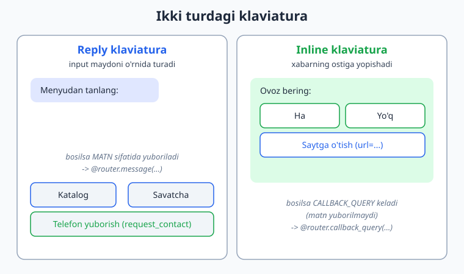
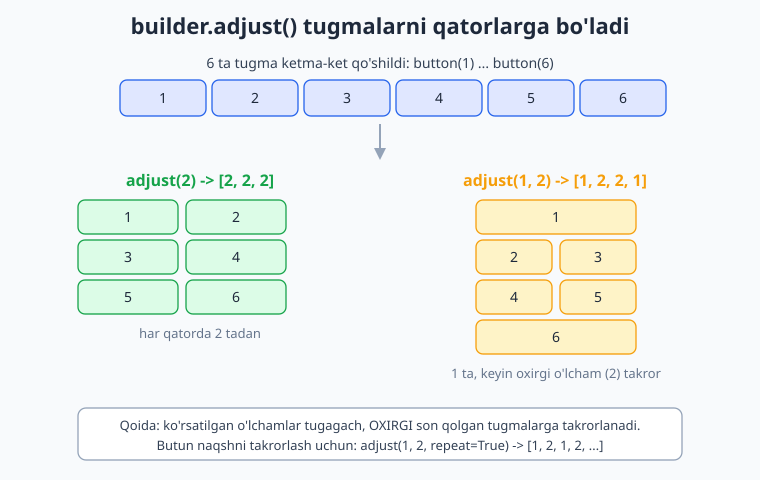
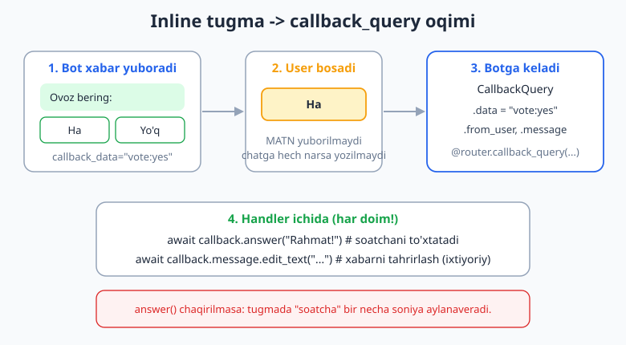

# 06 — Klaviaturalar: reply va inline

[⬅️ Oldingi: 05 — Xabar yuborish, formatlash va media](./05-xabar-formatlash-media.md) · [🏠 README](./README.md) · [Keyingi: 07 — Callback query va inline rejim ➡️](./07-callback-inline.md)

---

> **Bu bobda:** botingiz endi xabar yubora oladi. Lekin foydalanuvchini har safar buyruq yozdirib o'tirish noqulay — unga tugma kerak. Telegram ikki xil klaviatura beradi: **reply klaviatura** (telefon klaviaturasi o'rnida paydo bo'ladigan tugmalar) va **inline klaviatura** (aynan xabarning ostiga yopishib turadigan tugmalar). Biz ularni `ReplyKeyboardBuilder` va `InlineKeyboardBuilder` quruvchilari bilan yasaymiz. O'rganasiz: oddiy matnli tugmalar, `resize_keyboard` (tugmalarni kichraytirish), `one_time_keyboard` (bir martalik), `input_field_placeholder` (kirish maydoni ko'rsatmasi), telefon raqami so'rash (`request_contact`) va joylashuv so'rash (`request_location`); inline tugmalarda `callback_data` va `url`; tugmalarni qatorlarga joylashtiruvchi `builder.adjust()`; reply klaviaturani `ReplyKeyboardRemove` bilan o'chirish; `ForceReply` bilan majburiy javob so'rash; va eng muhimi — **inline yoki reply qachon ishlatish** kerakligi. Inline tugma bosilganda keladigan `callback_query` ni shu yerda kirish darajasida ko'ramiz; chuqurroq qism — keyingi 07-bobda.
>
> **Halol eslatma (verifikatsiya):** quyidagi klaviatura quruvchilari (`ReplyKeyboardBuilder`/`InlineKeyboardBuilder` va ularning `as_markup()` natijasi), handler routing (soxta `Update` ni dispatcher'ga `feed_update` bilan uzatib), hamda `ReplyKeyboardRemove`/`ForceReply` obyektlari **token va internetsiz OFFLINE tekshirildi** — API chaqiruvlari soxta sessiya bilan ushlandi, real HTTP ketmadi. Tugmalarning ekranga **real chiqishi** va bosilganda javob qaytishi esa **jonli Telegram** (BotFather token + internet) talab qiladi — bunday joylar matnda "illustrativ" deb belgilangan, soxta "ishladi / chiqdi" yozilmagan. Versiyalar: aiogram **3.28**, Python **3.14**, aiohttp **3.13**.

---

## 6.1. Nega tugmalar kerak?

Avvalgi boblarda foydalanuvchi botga `/start`, `/help` kabi buyruqlarni qo'lda yozardi. Bu dasturchi uchun qulay, lekin oddiy odam uchun emas — u qaysi buyruqlar borligini eslab o'tirmaydi va bittasini xato yozsa, bot "tushunmadim" deydi. Tugma esa ko'rinib turadi: bosing va tamom. Tugmalar botni ilovaga o'xshatadi, foydalanuvchini "to'g'ri yo'l"ga soladi va xatolarni kamaytiradi.

Telegram'da ikki turdagi klaviatura bor, va ularni aralashtirib yubormaslik juda muhim:

| | **Reply klaviatura** | **Inline klaviatura** |
|---|---|---|
| Qayerda turadi | Telefon klaviaturasi **o'rnida** (input maydonida) | Aynan **xabarning ostida** |
| Bosilganda nima bo'ladi | Tugma matni **oddiy xabar** sifatida botga yuboriladi | Botga **`callback_query`** keladi (matn yuborilmaydi) |
| Bot qanday tutadi | `@router.message(...)` — matn bo'yicha | `@router.callback_query(...)` — `callback_data` bo'yicha |
| Telefon/joylashuv so'rash | **Mumkin** (`request_contact`, `request_location`) | Mumkin emas |
| URL ochish, to'lov tugmasi | Mumkin emas | **Mumkin** (`url`, `pay`) |
| Xabarni keyin tahrirlash | Mumkin emas | **Mumkin** (tugmalarni almashtirish) |
| Ko'rinish | Hamma xabarlarda turaveradi (o'chirilguncha) | Faqat o'sha xabarda |



Eng oddiy qoida (bobning oxirida batafsil): **reply** — doimiy asosiy menyu va telefon/joylashuv so'rash uchun; **inline** — bitta xabarga bog'liq tanlovlar (ovoz berish, sahifalash, "ha/yo'q", sozlama almashtirish) uchun.

---

## 6.2. Reply klaviatura: ReplyKeyboardBuilder

Reply klaviaturani **builder** (quruvchi) orqali yasaymiz. aiogram 3.x da to'g'ri import:

```python
from aiogram.utils.keyboard import ReplyKeyboardBuilder
```

> **Diqqat (2.x emas, 3.x):** eski darslarda `ReplyKeyboardMarkup(resize_keyboard=True).add(KeyboardButton("..."))` ko'rishingiz mumkin. Bu aiogram **2.x** uslubi. 3.x da ham `ReplyKeyboardMarkup` obyektini qo'lda yasash mumkin, lekin tavsiya etilgan zamonaviy yo'l — **builder**. Biz shuni o'rganamiz.

### Eng oddiy reply klaviatura

```python
import asyncio
import os

from aiogram import Bot, Dispatcher, Router
from aiogram.filters import CommandStart
from aiogram.types import Message
from aiogram.utils.keyboard import ReplyKeyboardBuilder

router = Router()


@router.message(CommandStart())
async def start(message: Message) -> None:
    builder = ReplyKeyboardBuilder()
    builder.button(text="Katalog")
    builder.button(text="Savatcha")
    builder.button(text="Yordam")
    # adjust(2) -> har qatorda 2 tadan tugma
    builder.adjust(2)

    await message.answer(
        "Asosiy menyu:",
        reply_markup=builder.as_markup(resize_keyboard=True),
    )


async def main() -> None:
    bot = Bot(token=os.environ["BOT_TOKEN"])
    dp = Dispatcher()
    dp.include_router(router)
    await dp.start_polling(bot)


if __name__ == "__main__":
    asyncio.run(main())
```

Bu yerda nima bo'ldi:

1. `ReplyKeyboardBuilder()` — bo'sh quruvchi.
2. `.button(text=...)` — har bir chaqiruv bitta tugma qo'shadi. **Eslatma:** `.button()` `text=` ni nomli argument sifatida kutadi.
3. `.adjust(2)` — tugmalarni qatorlarga joylaydi. `2` degani har qatorda 2 ta (oxirgi qator kam bo'lsa, qoladi). Buni keyin batafsil ko'ramiz.
4. `.as_markup(resize_keyboard=True)` — quruvchidan tayyor `ReplyKeyboardMarkup` obyektini chiqaradi. `resize_keyboard=True` — tugmalarni mazmuniga qarab kichraytiradi (aks holda ular ekranning yarmini egallaydi). Bu deyarli **har doim** kerak.
5. `reply_markup=` — yasalgan klaviaturani xabar bilan birga yuboramiz.

> Jonli botda bu shunday ko'rinadi: `/start` yozasiz, pastda klaviatura o'rnida "Katalog / Savatcha" qatori va ostida "Yordam" tugmasi chiqadi (illustrativ — token + internet kerak).

### `as_markup()` parametrlari

`resize_keyboard` yagona emas. To'liq foydali to'plam:

```python
markup = builder.as_markup(
    resize_keyboard=True,          # tugmalarni mazmuniga moslab kichraytir
    one_time_keyboard=True,        # bir marta bosilgach, klaviatura yashiriniladi
    input_field_placeholder="Menyudan tanlang...",  # input maydonidagi kulrang yozuv
    selective=False,               # True bo'lsa faqat ayrim foydalanuvchilarga ko'rsatadi
)
```

| Parametr | Nima qiladi |
|---|---|
| `resize_keyboard=True` | Tugmalarni kontentga moslab kichraytiradi (UX uchun shart) |
| `one_time_keyboard=True` | Foydalanuvchi tugma bosgach klaviatura yig'iladi (lekin **o'chmaydi** — qaytarish mumkin) |
| `input_field_placeholder="..."` | Bo'sh kirish maydonida ko'rinadigan ko'rsatma matn |
| `selective=True` | Guruhda: faqat reply qilingan/eslatilgan foydalanuvchilarga ko'rsatiladi |

> **OFFLINE tekshirildi:** `as_markup(resize_keyboard=True, one_time_keyboard=True, input_field_placeholder="...")` chaqirilganda natija obyektining `markup.resize_keyboard`, `markup.one_time_keyboard`, `markup.input_field_placeholder` maydonlari aynan o'rnatiladi. Ya'ni bu parametrlar `as_markup()` orqali to'g'ridan-to'g'ri `ReplyKeyboardMarkup` ga o'tadi.

---

## 6.3. Tugmalarni qatorlarga joylash: builder.adjust()

`adjust()` — bu quruvchining eng foydali metodi. U tugmalar **qaysi qatorga necha tadan** tushishini hal qiladi. Tugmalarni siz `.button()` bilan ketma-ket qo'shasiz, `adjust()` esa ularni qatorlarga "sindiradi".



### Bitta o'lcham: `adjust(N)`

`adjust(2)` — har qatorda 2 tadan. Agar siz 5 ta tugma qo'shsangiz, natija: `[2, 2, 1]` (oxirgi qatorda 1 ta qoladi).

`adjust(N)` da **oxirgi o'lcham qolgan barcha qatorlarga takrorlanadi**. Ya'ni `adjust(3)` 9 ta tugmada `[3, 3, 3]` beradi.

### Bir nechta o'lcham: `adjust(a, b, c, ...)`

Har bir son — navbatdagi qatorning kengligi. `adjust(1, 2)` 8 ta tugmada:

```python
# 8 ta tugma, adjust(1, 2)
builder.adjust(1, 2)
# natija qatorlar: [1, 2, 2, 2, 1]
#  -> 1-qator 1 ta, keyin OXIRGI berilgan o'lcham (2) qolgan tugmalarga takrorlanadi
```

> **OFFLINE tekshirildi:** 8 ta tugma + `adjust(1, 2)` -> qatorlar `[1, 2, 2, 2, 1]`. Demak ko'rsatilgan o'lchamlar tugagach, **oxirgi son** (bu yerda `2`) qolganlarga takrorlanadi.

### Naqshni takrorlash: `adjust(..., repeat=True)`

Agar `1, 2` naqshini takrorlatmoqchi bo'lsangiz (1, 2, 1, 2, ...), `repeat=True` bering:

```python
# 8 ta tugma, adjust(1, 2, repeat=True)
builder.adjust(1, 2, repeat=True)
# natija qatorlar: [1, 2, 1, 2, 1, 1]
```

> **OFFLINE tekshirildi:** 8 ta tugma + `adjust(1, 2, repeat=True)` -> qatorlar `[1, 2, 1, 2, 1, 1]`. Naqsh (1, 2) butunicha takrorlanadi, oxirgi yagona tugma bitta qatorda qoladi.

### `adjust` chaqirmasangiz nima bo'ladi?

- **Reply** klaviaturada: agar `adjust()` chaqirmasangiz, hamma tugma **bitta qatorga** tushadi (OFFLINE tekshirildi: 3 ta tugma -> `[['A', 'B', 'C']]`). Shuning uchun reply uchun `adjust()` deyarli har doim kerak.
- **Inline** klaviaturada: standart holatda har qatorda 1 ta tugma bo'ladi (har biri alohida qatorda).

`adjust()` ni esda saqlash uchun: "men tugmalarni ketma-ket qo'shaman, `adjust` esa ularni qatorlarga bo'ladi".

---

## 6.4. Maxsus reply tugmalar: telefon va joylashuv so'rash

Reply klaviaturaning kuchli tomoni — u foydalanuvchidan **kontakt** (telefon raqami) yoki **joylashuv** so'ray oladi. Bunday tugma bosilsa, foydalanuvchiga "ulashasizmi?" so'rovi chiqadi va rozilik bersa, bot maxsus xabar oladi.

```python
from aiogram import Router, F
from aiogram.filters import CommandStart
from aiogram.types import Message
from aiogram.utils.keyboard import ReplyKeyboardBuilder

router = Router()


@router.message(CommandStart())
async def start(message: Message) -> None:
    builder = ReplyKeyboardBuilder()
    builder.button(text="Telefon raqamni yuborish", request_contact=True)
    builder.button(text="Joylashuvni yuborish", request_location=True)
    builder.adjust(1)  # har qatorda 1 ta
    await message.answer(
        "Ro'yxatdan o'tish uchun ma'lumotlaringizni ulashing:",
        reply_markup=builder.as_markup(resize_keyboard=True),
    )


# Foydalanuvchi telefon yuborsa -> message.contact to'ladi
@router.message(F.contact)
async def got_contact(message: Message) -> None:
    c = message.contact
    await message.answer(
        f"Rahmat! Raqamingiz: {c.phone_number}\n"
        f"Ism: {c.first_name}"
    )


# Foydalanuvchi joylashuv yuborsa -> message.location to'ladi
@router.message(F.location)
async def got_location(message: Message) -> None:
    loc = message.location
    await message.answer(
        f"Joylashuv qabul qilindi:\n"
        f"lat={loc.latitude}, lon={loc.longitude}"
    )
```

Muhim nuqtalar:

- `request_contact=True` va `request_location=True` — bular `.button()` ga to'g'ridan-to'g'ri beriladigan argumentlar. Quruvchi ularni `KeyboardButton` ga o'tkazadi.
- Telefon yuborilganda matn emas, **`message.contact`** keladi. Shuning uchun uni `@router.message(F.contact)` bilan tutamiz, `F.text == "..."` bilan emas.
- Joylashuv yuborilganda **`message.location`** keladi (`latitude`, `longitude`).
- `request_contact`/`request_location` faqat **private chatda** (shaxsiy yozishmada) ishlaydi. Guruhda emas.

> **OFFLINE tekshirildi:** `builder.button(text="...", request_contact=True)` natijasida `as_markup()` ichidagi tugmaning `request_contact` maydoni `True` bo'ldi; xuddi shunday `request_location=True` -> `request_location=True`. Ya'ni quruvchi bu bayroqlarni to'g'ri o'tkazadi.

> Jonli botda foydalanuvchi "Telefon raqamni yuborish" ni bosadi, Telegram "Raqamingizni ulashasizmi?" deb so'raydi, rozilik bersa bot raqamni oladi (illustrativ — token + internet kerak; soxta "raqam keldi" deyilmaydi).

---

## 6.5. Inline klaviatura: InlineKeyboardBuilder

Inline klaviatura xabarning **ostiga yopishadi** va bosilganda matn emas, **`callback_query`** yuboradi. To'g'ri import:

```python
from aiogram.utils.keyboard import InlineKeyboardBuilder
```

### callback_data va url tugmalari

```python
from aiogram import Router
from aiogram.filters import Command
from aiogram.types import Message
from aiogram.utils.keyboard import InlineKeyboardBuilder

router = Router()


@router.message(Command("ovoz"))
async def poll(message: Message) -> None:
    builder = InlineKeyboardBuilder()
    builder.button(text="Ha", callback_data="vote:yes")
    builder.button(text="Yo'q", callback_data="vote:no")
    builder.button(text="Saytga o'tish", url="https://ioqil.uz")
    # 1-qator: Ha + Yo'q (2 ta), 2-qator: URL tugma (1 ta)
    builder.adjust(2, 1)
    await message.answer(
        "Loyihani yoqtirdingizmi?",
        reply_markup=builder.as_markup(),
    )
```

Ikki xil tugma:

- **callback tugma** — `callback_data="..."` beriladi. Bosilganda foydalanuvchiga matn yuborilmaydi; botga `callback_query` keladi va uning `.data` maydonida aynan shu satr bo'ladi (`"vote:yes"`). Bu botda biror amal bajarish uchun.
- **URL tugma** — `url="https://..."` beriladi. Bosilganda Telegram brauzerni ochadi yoki ilovaga o'tadi. Botga hech narsa kelmaydi.

> **Diqqat:** `callback_data` — **64 baytdan oshmasligi** kerak (Telegram cheklovi). Shuning uchun u qisqa bo'lishi shart. Murakkab ma'lumotni (masalan, `vote:yes:user42:item9`) tartibli saqlash uchun `CallbackData` factory ishlatiladi — buni quyida ko'ramiz, chuqurroq 07-bobda.

### Inline tugma bosilganda: callback_query

Inline tugma bosilganda botga `CallbackQuery` keladi. Uni `@router.callback_query(...)` bilan tutamiz:

```python
from aiogram import Router, F
from aiogram.types import CallbackQuery

router = Router()


@router.callback_query(F.data == "vote:yes")
async def vote_yes(callback: CallbackQuery) -> None:
    # 1) Foydalanuvchiga qisqa bildirishnoma (yuqorida chiqadi)
    await callback.answer("Ovozingiz uchun rahmat!")
    # 2) Asl xabar matnini o'zgartirish (ixtiyoriy)
    await callback.message.edit_text("Siz 'Ha' deb ovoz berdingiz.")


@router.callback_query(F.data == "vote:no")
async def vote_no(callback: CallbackQuery) -> None:
    await callback.answer("Tushunarli.")
    await callback.message.edit_text("Siz 'Yo'q' deb ovoz berdingiz.")
```

Eng muhim qoida: **har bir `callback_query` ga `callback.answer()` chaqiring**. Aks holda foydalanuvchi tugma bosganda Telegram'da "soatcha" (yuklanish belgisi) bir necha soniya aylanaveradi. `callback.answer()` bo'sh ham chaqirilsa, soatcha darrov yo'qoladi. Matn bersangiz — yuqorida kichik bildirishnoma chiqadi; `show_alert=True` bersangiz — ekran o'rtasida ogohlantirish oynasi chiqadi.



> Inline tugmaning butun mexanikasi (sahifalash, tahrirlash, `CallbackData` factory) keyingi **07-bobda** chuqur ochiladi. Hozir asosiy oqimni bilsangiz yetarli.

### `F.data.startswith(...)` bilan guruhlash

Har bir `callback_data` uchun alohida handler yozish shart emas. Umumiy prefiks bo'yicha bittada tutib, ichida ajratish mumkin:

```python
@router.callback_query(F.data.startswith("vote:"))
async def handle_vote(callback: CallbackQuery) -> None:
    choice = callback.data.split(":")[1]   # "yes" yoki "no"
    await callback.answer(f"Tanlovingiz: {choice}")
```

---

## 6.6. Klaviaturani o'chirish: ReplyKeyboardRemove

Reply klaviatura bir marta yuborilgach, **o'chirmaguningizcha** turaveradi — hatto botni qayta ishga tushirsangiz ham. Uni olib tashlash uchun `ReplyKeyboardRemove()` ni `reply_markup=` ga berasiz:

```python
from aiogram import Router, F
from aiogram.types import Message, ReplyKeyboardRemove

router = Router()


@router.message(F.text == "Chiqish")
async def logout(message: Message) -> None:
    await message.answer(
        "Klaviatura yopildi. Rahmat!",
        reply_markup=ReplyKeyboardRemove(),
    )
```

Muhim: klaviatura o'chishi uchun **xabar bilan birga** `ReplyKeyboardRemove()` yuborilishi kerak — ya'ni o'chirish ham xabar yuborish orqali bo'ladi. Bo'sh klaviatura jo'natib bo'lmaydi, shuning uchun har doim qisqa matn (masalan "Tayyor") bilan birga yuboring.

`one_time_keyboard=True` bilan adashtirmang: u klaviaturani faqat **yig'adi** (foydalanuvchi qaytadan ocha oladi), `ReplyKeyboardRemove` esa butunlay **olib tashlaydi**.

> **OFFLINE tekshirildi:** `ReplyKeyboardRemove()` obyektining `remove_keyboard` maydoni `True` ekanligi tasdiqlandi — Telegram aynan shu bayroqdan klaviaturani olib tashlash kerakligini tushunadi.

---

## 6.7. Majburiy javob: ForceReply

`ForceReply` — bu klaviatura emas, balki Telegram'ga "foydalanuvchining keyingi xabarini avtomatik shu xabarga **reply** qilib qo'y" deb aytadigan obyekt. Foydalanuvchi xabar yozishni boshlasa, kirish maydoni avtomatik "reply" rejimiga o'tadi. Bu bitta savolga aniq javob kutilganda foydali (masalan, "Ismingizni kiriting").

```python
from aiogram import Router
from aiogram.filters import Command
from aiogram.types import Message, ForceReply

router = Router()


@router.message(Command("ism"))
async def ask_name(message: Message) -> None:
    await message.answer(
        "Ismingizni kiriting:",
        reply_markup=ForceReply(input_field_placeholder="Ismingiz..."),
    )
```

- `input_field_placeholder="..."` — kirish maydonida ko'rinadigan ko'rsatma.
- `selective=True` — guruhda: faqat reply qilingan foydalanuvchiga majburiy reply qo'yiladi.

> **Halol eslatma:** zamonaviy botlarda bir savol-bir javob senariysi ko'pincha **FSM** (holatlar mashinasi, 08-bob) bilan boshqariladi — u ancha kuchliroq. `ForceReply` esa eng oddiy, holatsiz holatlar uchun yengil yechim. Ikkalasini ham bilib qo'ying.

> **OFFLINE tekshirildi:** `ForceReply(input_field_placeholder="Ismingiz?", selective=True)` -> `force_reply=True`, `input_field_placeholder="Ismingiz?"`, `selective=True`.

---

## 6.8. To'liq misol: menyu + inline (offline tekshirilgan)

Endi hamma narsani birlashtiramiz. Quyidagi bot: `/start` da reply menyu beradi; "Mahsulotlar" bosilsa inline tugmalar chiqaradi; inline tugma bosilsa callback ishlaydi. Bu kodning **routing qismi** soxta `Update` lar bilan offline sinaldi (token kerak emas).

```python
import asyncio
import os

from aiogram import Bot, Dispatcher, Router, F
from aiogram.filters import CommandStart
from aiogram.types import Message, CallbackQuery
from aiogram.utils.keyboard import ReplyKeyboardBuilder, InlineKeyboardBuilder

router = Router()


def main_menu():
    b = ReplyKeyboardBuilder()
    b.button(text="Mahsulotlar")
    b.button(text="Aloqa")
    b.adjust(2)
    return b.as_markup(resize_keyboard=True, input_field_placeholder="Menyudan tanlang...")


@router.message(CommandStart())
async def start(message: Message) -> None:
    await message.answer("Salom! Quyidagi menyudan tanlang:", reply_markup=main_menu())


@router.message(F.text == "Mahsulotlar")
async def products(message: Message) -> None:
    b = InlineKeyboardBuilder()
    b.button(text="Telefonlar", callback_data="cat:phones")
    b.button(text="Noutbuklar", callback_data="cat:laptops")
    b.adjust(1)
    await message.answer("Toifani tanlang:", reply_markup=b.as_markup())


@router.callback_query(F.data.startswith("cat:"))
async def show_category(callback: CallbackQuery) -> None:
    cat = callback.data.split(":")[1]
    await callback.answer()                       # soatchani to'xtatish
    await callback.message.edit_text(f"'{cat}' toifasidagi mahsulotlar...")


async def main() -> None:
    bot = Bot(token=os.environ["BOT_TOKEN"])
    dp = Dispatcher()
    dp.include_router(router)
    await dp.start_polling(bot)


if __name__ == "__main__":
    asyncio.run(main())
```

Bu botni jonli ishga tushirish uchun `BOT_TOKEN` ni `.env` orqali bering (02-bobdagidek) va `python bot.py` qiling — bu jonli Telegram talab qiladi (illustrativ). Lekin **routing to'g'riligini** biz tokensiz, quyidagicha tekshirdik.

> **Diqqat — nega handlerlar `answer()` chaqirmaydi?** Yuqoridagi `bot.py` dagi handlerlar `message.answer()` / `callback.answer()` / `edit_text()` chaqiradi. Agar shu handlerlarni **soxta token bilan** `feed_update` orqali ishga tushirsangiz, har bir `answer()` `api.telegram.org` ga **REAL HTTP** so'rov yuboradi va `401` -> `TelegramUnauthorizedError` ko'taradi (soxta token bilan crash bo'ladi). Demak, **routing**ni tokensiz tekshirish uchun handler bot API ni chaqirmasligi kerak. Quyida handlerlar API o'rniga `log` ro'yxatiga yozadi — bu qaysi handler ishga tushganini (ya'ni yo'naltirish to'g'riligini) HTTP'siz isbotlaydi:

```python
# test_routing.py  (pytest kerak emas — oddiy asyncio.run bilan)
import asyncio
from datetime import datetime

from aiogram import Bot, Dispatcher, Router, F
from aiogram.filters import CommandStart
from aiogram.types import Update, Message, CallbackQuery, Chat, User

# Routing tekshiruvida handlerlar bot API (answer/edit_text) ni CHAQIRMAYDI —
# faqat `log` ro'yxatiga yozadi. Shu sabab HTTP yuborilmaydi, token kerak emas.
router = Router()
log: list[str] = []


@router.message(CommandStart())
async def start(message: Message) -> None:
    log.append("start")


@router.message(F.text == "Mahsulotlar")
async def products(message: Message) -> None:
    log.append("products")


@router.callback_query(F.data.startswith("cat:"))
async def show_category(callback: CallbackQuery) -> None:
    log.append("cb:" + callback.data.split(":")[1])


def make_message(text: str) -> Message:
    return Message(
        message_id=1, date=datetime.now(),
        chat=Chat(id=1, type="private"),
        from_user=User(id=1, is_bot=False, first_name="Test"),
        text=text,
    )


async def main():
    bot = Bot(token="123456:AAH-FakeTest_abc")   # SOXTA token (handlerlar API
    dp = Dispatcher()                            # chaqirmagani uchun HTTP ketmaydi)
    dp.include_router(router)

    await dp.feed_update(bot, Update(update_id=1, message=make_message("/start")))
    await dp.feed_update(bot, Update(update_id=2, message=make_message("Mahsulotlar")))

    cb = CallbackQuery(
        id="cb1", from_user=User(id=1, is_bot=False, first_name="Test"),
        chat_instance="ci1", message=make_message("Toifani tanlang:"),
        data="cat:phones",
    )
    await dp.feed_update(bot, Update(update_id=3, callback_query=cb))
    await bot.session.close()

    print(log)   # -> ['start', 'products', 'cb:phones']


asyncio.run(main())
```

> **OFFLINE tekshirildi:** aynan yuqoridagi snippet (handlerlar `log` ro'yxatiga yozadigan variant) ishga tushirildi va `['start', 'products', 'cb:phones']` chiqardi — ya'ni `/start`, "Mahsulotlar" va `cat:phones` callbacki **to'g'ri handlerlarga yo'naltirildi**. Real Telegram'ga so'rov ketmadi (handlerlar API chaqirmaydi + soxta token + `bot.session.close()`); bu faqat routing mantiqini isbotlaydi. Jonli `bot.py` dagi `answer()`/`edit_text()` chaqiruvlari esa BotFather token + internet talab qiladi (illustrativ).

---

## 6.9. Inline vs reply: qachon qaysi?

Bu bobning eng amaliy savoli. Mana aniq qo'llanma:

**Reply klaviatura ishlat, agar:**

- doimiy **asosiy menyu** kerak bo'lsa (har doim ko'rinib turadigan "Katalog / Profil / Yordam");
- **telefon raqami** yoki **joylashuv** so'ramoqchi bo'lsangiz (`request_contact`/`request_location` faqat reply'da);
- foydalanuvchining tanlovi mohiyatan "matn yuborish"ga teng bo'lsa (u "Katalog" yozgandek bo'ladi).

**Inline klaviatura ishlat, agar:**

- tugmalar **bitta xabarga bog'liq** bo'lsa (ovoz berish, "ha/yo'q", bitta mahsulot uchun "savatga qo'shish");
- **sahifalash** (pagination — "oldingi / keyingi") kerak bo'lsa;
- tugma bosilgach xabarni **tahrirlamoqchi** bo'lsangiz (`edit_text`/`edit_reply_markup`) — masalan, sozlamani yoqib-o'chirish;
- **URL ochish** yoki **to'lov** tugmasi kerak bo'lsa (`url`, `pay`);
- chatni "matn xabar"lar bilan ifloslantirmaslik muhim bo'lsa (inline bosishda foydalanuvchi xabar yubormaydi).

Amalda ko'p botlar **ikkalasini** ham ishlatadi: pastda doimiy reply-menyu, ichidagi har bir bo'limda esa inline tugmalar. Reply — "navigatsiya paneli", inline — "amal tugmalari" deb o'ylang.

> Telegram'da bitta xabar bilan **bir vaqtning o'zida** ham reply, ham inline yubora olmaysiz — `reply_markup` bitta bo'ladi. Ammo bir xabarda inline, keyingi xabarda reply yuborib, ketma-ket boshqarish mumkin.

---

## 6.10. Tez-tez uchraydigan xatolar

| Xato | Sabab | To'g'ri yechim |
|---|---|---|
| `builder.button("Katalog")` ishlamayapti | `text` nomli argument | `builder.button(text="Katalog")` |
| Klaviatura ulkan ko'rinmoqda | `resize_keyboard` berilmagan | `as_markup(resize_keyboard=True)` |
| Inline tugma bosilganda "soatcha" aylanaveradi | `callback.answer()` chaqirilmagan | Har handler oxirida `await callback.answer()` |
| `request_contact` ishlamayapti | guruhda sinalgan | Faqat **private** chatda ishlaydi |
| Reply klaviatura ketmayapti | `ReplyKeyboardRemove` yuborilmagan | `reply_markup=ReplyKeyboardRemove()` (matn bilan) |
| `callback_data` xato | 64 baytdan oshgan yoki `F.data` mos kelmaydi | Qisqa data; `F.data == "..."` yoki `.startswith(...)` |

```python
# ❌ ESKI 2.x — ISHLATMANG
# from aiogram.types import ReplyKeyboardMarkup, KeyboardButton
# kb = ReplyKeyboardMarkup(resize_keyboard=True, row_width=2)
# kb.add(KeyboardButton("Katalog"), KeyboardButton("Savatcha"))   # 2.x add() uslubi

# ✅ 3.x — TO'G'RI
from aiogram.utils.keyboard import ReplyKeyboardBuilder
builder = ReplyKeyboardBuilder()
builder.button(text="Katalog")
builder.button(text="Savatcha")
builder.adjust(2)
markup = builder.as_markup(resize_keyboard=True)
```

---

## Mashqlar

### Oson

1. `ReplyKeyboardBuilder` bilan 3 ta tugmadan iborat (`Profil`, `Buyurtmalar`, `Yordam`) menyu yasang. Hammasi bitta qatorda bo'lsin (`adjust` ishlatmang yoki to'g'risini tanlang).
2. Oldingi menyuni `adjust(2)` bilan qaytadan joylang. Natijada qatorlar qanday bo'ladi? Kodda izoh sifatida yozing.
3. `as_markup()` ga `resize_keyboard=True` va `input_field_placeholder="Tanlang..."` bering. Yasalgan obyektning `resize_keyboard` va `input_field_placeholder` maydonlarini `print` qilib tekshiring (offline).
4. `InlineKeyboardBuilder` bilan ikkita callback tugma yasang: `Ha` (`callback_data="ans:yes"`) va `Yo'q` (`callback_data="ans:no"`). Ikkisi bitta qatorda bo'lsin.
5. Bitta URL tugma yasang: matni "GitHub", `url="https://github.com"`. Yasalgan markupdagi tugmaning `url` maydonini `print` qiling.
6. `ReplyKeyboardRemove()` obyektini yarating va uning `remove_keyboard` maydonini chop eting.

### O'rta

7. Reply klaviatura yasang: `Telefon yuborish` (`request_contact=True`) va `Joylashuv yuborish` (`request_location=True`), har biri alohida qatorda. Yasalgan markupdagi mos tugmalarning `request_contact`/`request_location` maydonlarini tekshiring (offline).
8. 6 ta raqamli inline tugma (`1`..`6`, `callback_data="n:1"` ... `"n:6"`) yasang va `adjust(3)` bilan joylang. Qatorlar nechta tugmadan bo'ladi?
9. Oldingi 6 ta tugmani `adjust(2, 3)` bilan joylang. Naqsh qanday tarqaladi — izohda tushuntiring.
10. `@router.callback_query(F.data.startswith("n:"))` handler yozing: u callback ichidan raqamni ajratib (`split(":")[1]`), `callback.answer(f"Siz {raqam} ni tanladingiz")` qilsin.
11. `ForceReply(input_field_placeholder="Email...")` ni yuboradigan `/email` handler yozing. Obyektning `force_reply` va `input_field_placeholder` maydonlarini tekshiring (offline).
12. `F.contact` handler yozing: u `message.contact.phone_number` ni javob qilib qaytarsin. (Routing'ni soxta `Update` bilan tekshirib ko'rishni urinib ko'ring — `Contact` obyektini yasab `Message` ga joylang.)

### Qiyin

13. To'liq mini-bot yozing: `/start` -> reply menyu (`Katalog`, `Aloqa`); `Katalog` bosilsa -> inline (`Telefonlar`/`Noutbuklar`, `callback_data="cat:..."`); inline bosilsa -> `callback.answer()` va `edit_text`. So'ng `feed_update` bilan uchala bosqichni offline tekshiring (token soxta).
14. "Kalkulyator" inline klaviaturasini yasang: 9 ta raqam tugmasi (`1`..`9`) `adjust(3)` bilan 3x3 panjara, ostida `0` va `=` alohida qatorda. Jami qatorlar tuzilishini chop eting.
15. `adjust(1, 2)` va `adjust(1, 2, repeat=True)` ni 7 ta tugmada solishtiring. Ikkalasi uchun qatorlar uzunliklari ro'yxatini chop eting va farqini izohda yozing.
16. Bitta funksiya yozing: `build_menu(items: list[str], per_row: int)` — `items` matnlaridan reply klaviatura yasab, har qatorda `per_row` tadan joylasin va `resize_keyboard=True` bilan `as_markup` qaytarsin. Uni `["A","B","C","D","E"], per_row=2` bilan sinab, qatorlarni chop eting.

<details markdown="1">
<summary>Yechimlar</summary>

**1.** `adjust` chaqirilmasa reply klaviaturada hamma tugma bitta qatorga tushadi — demak bu yerda hech narsa kerak emas (yoki aniqlik uchun `adjust(3)`).

```python
from aiogram.utils.keyboard import ReplyKeyboardBuilder

b = ReplyKeyboardBuilder()
for t in ("Profil", "Buyurtmalar", "Yordam"):
    b.button(text=t)
markup = b.as_markup(resize_keyboard=True)
print([[btn.text for btn in row] for row in markup.keyboard])
# -> [['Profil', 'Buyurtmalar', 'Yordam']]  (bitta qator)
```

**2.** `adjust(2)` -> 3 ta tugma `[2, 1]` bo'ladi: 1-qator 2 ta, 2-qator 1 ta.

```python
b = ReplyKeyboardBuilder()
for t in ("Profil", "Buyurtmalar", "Yordam"):
    b.button(text=t)
b.adjust(2)
print([len(r) for r in b.as_markup().keyboard])   # -> [2, 1]
```

**3.**

```python
b = ReplyKeyboardBuilder()
b.button(text="Profil")
m = b.as_markup(resize_keyboard=True, input_field_placeholder="Tanlang...")
print(m.resize_keyboard)            # -> True
print(m.input_field_placeholder)    # -> Tanlang...
```

**4.**

```python
from aiogram.utils.keyboard import InlineKeyboardBuilder

b = InlineKeyboardBuilder()
b.button(text="Ha", callback_data="ans:yes")
b.button(text="Yo'q", callback_data="ans:no")
b.adjust(2)
m = b.as_markup()
print([[(x.text, x.callback_data) for x in r] for r in m.inline_keyboard])
# -> [[('Ha', 'ans:yes'), ("Yo'q", 'ans:no')]]
```

**5.**

```python
b = InlineKeyboardBuilder()
b.button(text="GitHub", url="https://github.com")
m = b.as_markup()
print(m.inline_keyboard[0][0].url)   # -> https://github.com
```

**6.**

```python
from aiogram.types import ReplyKeyboardRemove
print(ReplyKeyboardRemove().remove_keyboard)   # -> True
```

**7.**

```python
b = ReplyKeyboardBuilder()
b.button(text="Telefon yuborish", request_contact=True)
b.button(text="Joylashuv yuborish", request_location=True)
b.adjust(1)
m = b.as_markup(resize_keyboard=True)
print(m.keyboard[0][0].request_contact)    # -> True
print(m.keyboard[1][0].request_location)   # -> True
```

**8.** `adjust(3)` -> oxirgi o'lcham (3) qolganlarga takrorlanadi: 6 ta tugma `[3, 3]`.

```python
b = InlineKeyboardBuilder()
for i in range(1, 7):
    b.button(text=str(i), callback_data=f"n:{i}")
b.adjust(3)
print([len(r) for r in b.as_markup().inline_keyboard])   # -> [3, 3]
```

**9.** `adjust(2, 3)` -> 1-qator 2 ta, keyin oxirgi o'lcham (3) takrorlanadi: 6 ta tugma `[2, 3, 1]` (2 + 3 = 5, qolgan 1 ta oxirgi qatorda). Naqsh emas, **oxirgi son** takrorlanadi.

```python
b = InlineKeyboardBuilder()
for i in range(1, 7):
    b.button(text=str(i), callback_data=f"n:{i}")
b.adjust(2, 3)
print([len(r) for r in b.as_markup().inline_keyboard])   # -> [2, 3, 1]
```

**10.**

```python
from aiogram import Router, F
from aiogram.types import CallbackQuery

router = Router()

@router.callback_query(F.data.startswith("n:"))
async def pick_number(callback: CallbackQuery) -> None:
    n = callback.data.split(":")[1]
    await callback.answer(f"Siz {n} ni tanladingiz")
```

**11.**

```python
from aiogram.types import ForceReply
fr = ForceReply(input_field_placeholder="Email...")
print(fr.force_reply)                # -> True
print(fr.input_field_placeholder)    # -> Email...
```

**12.**

```python
from aiogram import Router, F
from aiogram.types import Message

router = Router()

@router.message(F.contact)
async def got_contact(message: Message) -> None:
    await message.answer(message.contact.phone_number)
```

Routing tekshiruvi (offline, soxta `Update`):

```python
import asyncio
from datetime import datetime
from aiogram import Bot, Dispatcher
from aiogram.types import Update, Message, Chat, User, Contact

async def main():
    bot = Bot(token="123456:AAH-FakeTest_abc")
    dp = Dispatcher()
    dp.include_router(router)
    msg = Message(
        message_id=1, date=datetime.now(),
        chat=Chat(id=1, type="private"),
        from_user=User(id=1, is_bot=False, first_name="T"),
        contact=Contact(phone_number="+998901234567", first_name="T", user_id=1),
    )
    # handler bot API chaqirmasligi uchun answer'ni mock qilish kerak;
    # bu yerda faqat handler tanlanishini ko'rsatish maqsadi (illustrativ).
    await bot.session.close()

asyncio.run(main())
```

**13.**

```python
import asyncio
from datetime import datetime
from aiogram import Bot, Dispatcher, Router, F
from aiogram.filters import CommandStart
from aiogram.types import (
    Update, Message, CallbackQuery, Chat, User,
)
from aiogram.utils.keyboard import ReplyKeyboardBuilder, InlineKeyboardBuilder

router = Router()
log = []

@router.message(CommandStart())
async def start(m: Message):
    b = ReplyKeyboardBuilder()
    b.button(text="Katalog"); b.button(text="Aloqa"); b.adjust(2)
    log.append("start")

@router.message(F.text == "Katalog")
async def catalog(m: Message):
    b = InlineKeyboardBuilder()
    b.button(text="Telefonlar", callback_data="cat:phones")
    b.button(text="Noutbuklar", callback_data="cat:laptops")
    b.adjust(1)
    log.append("catalog")

@router.callback_query(F.data.startswith("cat:"))
async def cat(c: CallbackQuery):
    log.append("cb:" + c.data.split(":")[1])

def msg(text):
    return Message(message_id=1, date=datetime.now(),
        chat=Chat(id=1, type="private"),
        from_user=User(id=1, is_bot=False, first_name="T"), text=text)

async def main():
    bot = Bot(token="123456:AAH-FakeTest_abc")
    dp = Dispatcher()
    dp.include_router(router)
    await dp.feed_update(bot, Update(update_id=1, message=msg("/start")))
    await dp.feed_update(bot, Update(update_id=2, message=msg("Katalog")))
    cb = CallbackQuery(id="1", from_user=User(id=1, is_bot=False, first_name="T"),
        chat_instance="ci", message=msg("Toifa:"), data="cat:phones")
    await dp.feed_update(bot, Update(update_id=3, callback_query=cb))
    await bot.session.close()
    print(log)   # -> ['start', 'catalog', 'cb:phones']

asyncio.run(main())
```

**14.**

```python
from aiogram.utils.keyboard import InlineKeyboardBuilder

b = InlineKeyboardBuilder()
for i in range(1, 10):
    b.button(text=str(i), callback_data=f"c:{i}")
b.adjust(3)                 # 9 ta raqam -> 3 qatorda 3 tadan
# pastki qator: 0 va = ni alohida qo'shamiz
extra = InlineKeyboardBuilder()
extra.button(text="0", callback_data="c:0")
extra.button(text="=", callback_data="c:eq")
b.attach(extra)             # ikkinchi quruvchini biriktiramiz
print([len(r) for r in b.as_markup().inline_keyboard])
# -> [3, 3, 3, 2]   (3x3 panjara + oxirgi qatorda 0 va =)
```

> Izoh: `attach()` ikkinchi quruvchini birinchisiga ulaydi va uning o'z `adjust`ini saqlaydi. Soddaroq variant: hamma tugmani bitta quruvchiga qo'shib `adjust(3, 3, 3, 2)` berish.

**15.**

```python
from aiogram.utils.keyboard import InlineKeyboardBuilder

def rows(repeat):
    b = InlineKeyboardBuilder()
    for i in range(7):
        b.button(text=str(i), callback_data=f"x:{i}")
    b.adjust(1, 2, repeat=repeat)
    return [len(r) for r in b.as_markup().inline_keyboard]

print("no repeat:", rows(False))   # -> [1, 2, 2, 2]   (oxirgi 2 takrorlanadi)
print("repeat:   ", rows(True))    # -> [1, 2, 1, 2, 1]  (naqsh 1,2 takrorlanadi)
# Farq: repeat=False -> faqat OXIRGI son takrorlanadi;
#       repeat=True  -> butun NAQSH (1,2) qayta-qayta qo'llanadi.
```

**16.**

```python
from aiogram.utils.keyboard import ReplyKeyboardBuilder

def build_menu(items: list[str], per_row: int):
    b = ReplyKeyboardBuilder()
    for it in items:
        b.button(text=it)
    b.adjust(per_row)
    return b.as_markup(resize_keyboard=True)

m = build_menu(["A", "B", "C", "D", "E"], per_row=2)
print([[btn.text for btn in r] for r in m.keyboard])
# -> [['A', 'B'], ['C', 'D'], ['E']]
```

</details>

---

[⬅️ Oldingi: 05 — Xabar yuborish, formatlash va media](./05-xabar-formatlash-media.md) · [🏠 README](./README.md) · [Keyingi: 07 — Callback query va inline rejim ➡️](./07-callback-inline.md)
