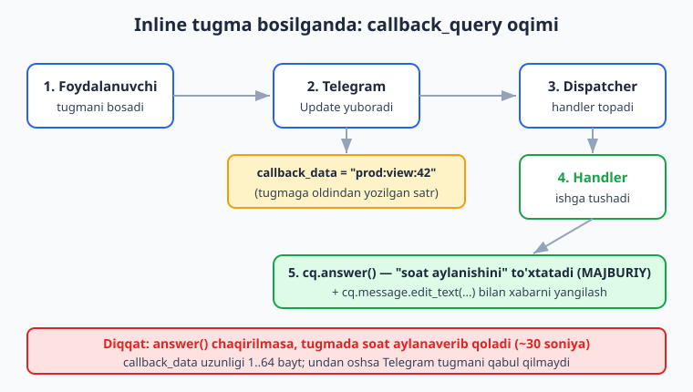
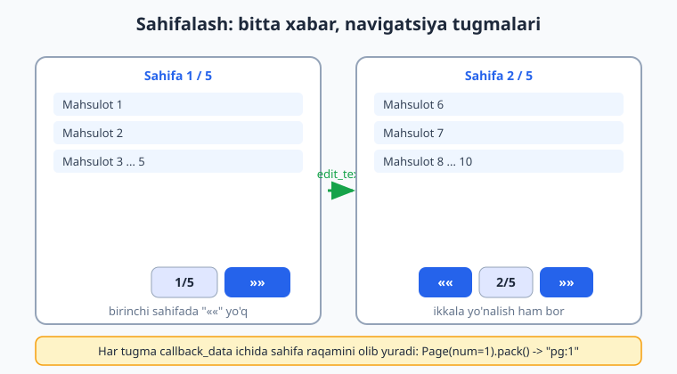
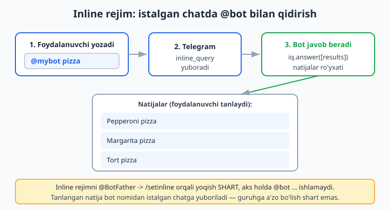

# 07 — Callback query va inline rejim

[⬅️ Oldingi: 06 — Klaviaturalar: reply va inline](./06-klaviaturalar.md) · [🏠 README](./README.md) · [Keyingi: 08 — FSM — holatlar mashinasi ➡️](./08-fsm-holatlar.md)

---

> **Bu bobda:** 06-bobda inline tugma yasashni o'rgandik, lekin tugma bosilganda nima sodir bo'lishini chala qoldirdik. Endi to'liq yopamiz. Inline tugma bosilsa bot `callback_query` degan maxsus yangilanish (update) oladi — uni `@router.callback_query(...)` handler bilan ushlaymiz. Tugmaga oldindan yozib qo'yiladigan `callback_data` satrini, uni xavfsiz va **tiplangan** holda yasash uchun `CallbackData` factory (`pack()`/`unpack()`)ni, `callback.answer()` orqali "soat aylanishini" to'xtatish va alert/toast ko'rsatishni, mavjud xabarni `edit_text`/`edit_reply_markup` bilan o'rnida tahrirlashni, shu asosda **sahifalash (pagination)** menyusi qurishni, va nihoyat istalgan chatda `@bot ...` deb yozib ishlatiladigan **inline rejim** (`inline_query`)ni o'rganamiz.
>
> **Halol eslatma:** Bobdagi handler routing, `CallbackData` pack/unpack, klaviatura quruvchi va pagination logikasi — hammasi tokensiz, OFFLINE `feed_update` va `pytest-asyncio` bilan haqiqatan ishga tushirib tekshirildi (bot sessiyasi mock qilingan). Jonli natija — tugma bosilganda telefonda alert chiqishi, xabar o'rnida yangilanishi, `@bot` qidiruvi — `@BotFather` token + internet talab qiladi va "illustrativ" deb belgilangan. Hech qayerda soxta "ishladi / xabar yetib bordi" yozilmagan.

---

## Callback query nima?

06-bobda **inline tugma** (`InlineKeyboardButton`) yasadik. Reply tugmadan farqi: inline tugma chatga matn yubormaydi — uni bosganda Telegram botingizga **`callback_query`** degan maxsus yangilanish jo'natadi. Bu yangilanish ichida tugmaga oldindan biriktirilgan **`callback_data`** satri keladi. Handler shu satrga qarab "qaysi tugma bosildi" deb tushunadi.

Oqim quyidagicha:



Uchta asosiy narsa bor, hammasini ketma-ket o'rganamiz:

1. **`callback_data`** — tugmaga yashirin yozib qo'yiladigan satr (1..64 bayt). Masalan `"prod:view:42"`.
2. **`@router.callback_query(...)`** — bu satrga mos handler.
3. **`callback.answer()`** — Telegram'ga "qabul qildim" deb javob berish (MAJBURIY).

> **Python eslatma:** Bu kitob Python bilasiz deb faraz qiladi (async/await, klass, type hints, dekorator). Agar bu tushunchalar yangi bo'lsa, avval [../python/README.md](../python/README.md) ga qarang. Biz Telegram/aiogram'ga xos narsalarni to'liq tushuntiramiz.

---

## Eng oddiy callback handler

Avval `callback_data` ni oddiy satr sifatida ishlatamiz (factory keyinroq). 06-bobdagidek inline klaviatura yasaymiz, lekin endi tugma bosilishini ushlaymiz:

```python
# bot.py — eng oddiy callback misoli
import asyncio
import os

from aiogram import Bot, Dispatcher, Router, F
from aiogram.client.default import DefaultBotProperties
from aiogram.enums import ParseMode
from aiogram.filters import CommandStart
from aiogram.types import Message, CallbackQuery
from aiogram.utils.keyboard import InlineKeyboardBuilder

router = Router()


@router.message(CommandStart())
async def start(message: Message):
    kb = InlineKeyboardBuilder()
    kb.button(text="Salom ber", callback_data="say_hi")
    kb.button(text="Yopish", callback_data="close")
    kb.adjust(2)
    await message.answer("Tugmani bosing:", reply_markup=kb.as_markup())


# F.data == "say_hi" -> aynan shu callback_data li tugma bosilganda ishlaydi
@router.callback_query(F.data == "say_hi")
async def on_hi(callback: CallbackQuery):
    # Avval answer() — Telegram'ga "qabul qildim" deymiz (pastda batafsil)
    await callback.answer(text="Salom!")
    # Endi xabarni o'rnida yangilaymiz
    await callback.message.edit_text("Botdan salom! 👋")


@router.callback_query(F.data == "close")
async def on_close(callback: CallbackQuery):
    await callback.answer()
    # Faqat tugmalarni olib tashlaymiz, matn qoladi
    await callback.message.edit_reply_markup(reply_markup=None)


async def main():
    bot = Bot(
        token=os.environ["BOT_TOKEN"],  # .env dan, kodga YOZILMAYDI
        default=DefaultBotProperties(parse_mode=ParseMode.HTML),
    )
    dp = Dispatcher()
    dp.include_router(router)
    await dp.start_polling(bot)


if __name__ == "__main__":
    asyncio.run(main())
```

Yangi narsalar:

- **`@router.callback_query(F.data == "say_hi")`** — `message` emas, `callback_query` yangilanishini ushlaydi. `F.data` — bosilgan tugmaning `callback_data` si. `F` — bu 04-bobdagi "magic filter" (`from aiogram import F`).
- **`callback: CallbackQuery`** — handler argumenti `Message` emas, `CallbackQuery`. Uning ichida `callback.data` (satr), `callback.from_user` (kim bosgan), `callback.message` (qaysi xabardagi tugma bosilgan) bor.
- **`callback.answer(...)`** — Telegram'ga javob. Bunisiz tugmada soat aylanaverib qoladi (pastda).
- **`callback.message.edit_text(...)`** — xabarni **o'rnida** yangilaydi (yangi xabar yubormaydi).

> **2.x ESKIRGAN, ISHLATMA:** `@dp.callback_query_handler(...)`, `from aiogram import executor`, `executor.start_polling(...)`, `types.ParseMode`. Bular aiogram 2.x. Biz faqat 3.x idiomini ishlatamiz: `Router` + `@router.callback_query(...)`, `dp.start_polling(bot)`, `ParseMode` `aiogram.enums` dan.

Telefonda bu shunday ko'rinadi (illustrativ — token+internet kerak): foydalanuvchi "Salom ber" tugmasini bosadi, ekran tepasida qisqa "Salom!" toast paydo bo'ladi, xabar matni "Botdan salom! 👋" ga aylanadi.

---

## `callback.answer()` — nega MAJBURIY?

Foydalanuvchi inline tugmani bosganda Telegram klientida tugmada kichik **soat (loading)** aylanishni boshlaydi. Bot `answerCallbackQuery` jo'natmaguncha bu soat ~30 soniya aylanaveradi va foydalanuvchiga "bot javob bermayapti" degan taassurot beradi. Shuning uchun **har** `callback_query` handlerida `callback.answer()` chaqirish shart — hatto ko'rsatadigan matn bo'lmasa ham (`await callback.answer()` bo'sh).

`answer()` ning ikki rejimi bor:

```python
# 1) TOAST — ekran tepasida qisqa paydo bo'lib yo'qoladi
await callback.answer(text="Saqlandi!")

# 2) ALERT — markazda "OK" tugmali oyna, foydalanuvchi yopguncha turadi
await callback.answer(text="Diqqat: bu amalni ortga qaytarib bo'lmaydi!", show_alert=True)

# 3) Bo'sh — hech narsa ko'rsatmaydi, faqat soatni to'xtatadi
await callback.answer()
```

- **`text`** — ko'rsatiladigan matn (HTML emas, oddiy matn; 200 belgigacha).
- **`show_alert=True`** — toast emas, modal oyna (foydalanuvchi diqqatini jalb qiladi).
- **`cache_time`** — Telegram javobni necha soniya keshlasin (kamdan-kam kerak).

> **Qoida:** handlerda imkon qadar **tezroq** `answer()` chaqiring, og'ir ish (DB so'rovi, fayl) keyin bo'lsin. Aks holda soat uzoq aylanadi.

---

## `callback_data` ning chegarasi va `CallbackData` factory

Oddiy satr (`"say_hi"`, `"close"`) kichik botlarda yetadi. Lekin tugmaga **bir nechta** parametr yozish kerak bo'lsa-chi? Masalan "42-mahsulotni ko'rish, 3-sahifada"?

Qo'lda satr yasash mumkin: `f"prod:view:{product_id}:{page}"`. Lekin keyin uni qo'lda parslab, `int()` ga o'tkazib, tartibni eslab o'tirish — xato manbai. Aynan shu og'riqni **`CallbackData` factory** yechadi: u Pydantic-ga o'xshash tiplangan klass berib, `pack()` bilan satrga, `unpack()` bilan obyektga aylantiradi.

```python
from aiogram.filters.callback_data import CallbackData


class ProductCB(CallbackData, prefix="prod"):
    action: str       # "view" | "buy"
    product_id: int
    page: int


# Satrga aylantirish (tugmaga yozish uchun):
cb = ProductCB(action="view", product_id=42, page=3)
print(cb.pack())   # 'prod:view:42:3'

# Satrdan qayta obyektga (handler ichida):
restored = ProductCB.unpack("prod:view:42:3")
print(restored.product_id)        # 42  (int — string emas!)
print(type(restored.product_id))  # <class 'int'>
```

Bu blok OFFLINE ishga tushirib tekshirildi — natija aynan `'prod:view:42:3'`, va `unpack` dan keyin `product_id` haqiqiy `int` bo'lib tiklanadi (tip avtomatik tiklanadi — `int()` ga qo'lda o'tkazish shart emas).

Tushuntirish:

- **`class ProductCB(CallbackData, prefix="prod")`** — `prefix` har factory uchun **noyob** bo'lishi kerak. U `pack()` natijasining boshiga qo'shiladi va router shu prefiksga qarab to'g'ri handlerga yo'naltiradi.
- **Maydonlar** — oddiy type hints: `action: str`, `product_id: int`. Tiplar `int`, `str`, `float`, `bool`, `Enum` bo'lishi mumkin.
- **`pack()`** — maydonlarni `:` bilan birlashtirib satr yasaydi. Diqqat: yig'ilgan satr **64 baytdan** oshmasligi kerak (Telegram chegarasi). Ko'p/uzun maydon solmang.
- **`unpack(data)`** — teskari amal, tiplarni tiklaydi.

`Optional` maydon ham bo'ladi (tekshirildi):

```python
from typing import Optional


class Filter(CallbackData, prefix="flt"):
    category: str
    tag: Optional[str] = None


Filter(category="books").pack()              # 'flt:books:'   (tag bo'sh)
Filter(category="books", tag="new").pack()   # 'flt:books:new'
```

---

## Factory bilan filtrlash: `.filter()` va tiplangan `callback_data`

Eng kuchli tomoni: factory'ni handler **filtri** sifatida ishlatib, handler argumentiga to'g'ridan-to'g'ri tiplangan obyekt olish mumkin — `unpack` ni o'zingiz yozmaysiz:

```python
from aiogram import Router, F
from aiogram.types import CallbackQuery
from aiogram.filters.callback_data import CallbackData

router = Router()


class ProductCB(CallbackData, prefix="prod"):
    action: str
    product_id: int


# 1) Faqat action == "view" bo'lgan tugmalar
@router.callback_query(ProductCB.filter(F.action == "view"))
async def view_product(callback: CallbackQuery, callback_data: ProductCB):
    # callback_data — avtomatik unpack qilingan ProductCB obyekti!
    pid = callback_data.product_id
    await callback.answer()
    await callback.message.edit_text(f"{pid}-mahsulot tafsiloti...")


# 2) Faqat action == "buy"
@router.callback_query(ProductCB.filter(F.action == "buy"))
async def buy_product(callback: CallbackQuery, callback_data: ProductCB):
    await callback.answer(text="Savatga qo'shildi!", show_alert=False)


# 3) Hamma ProductCB (action ahamiyatsiz) — filtrsiz .filter()
@router.callback_query(ProductCB.filter())
async def any_product(callback: CallbackQuery, callback_data: ProductCB):
    await callback.answer()
```

E'tibor bering:

- **`ProductCB.filter(F.action == "view")`** — `F.action` bu factory maydoniga ishora. Router bu maydon qiymatiga qarab handlerni tanlaydi.
- **`callback_data: ProductCB`** — bu argument nomi **aynan `callback_data`** bo'lishi shart. aiogram uni avtomatik `unpack` qilib yuboradi. Bu juda qulay: `int(callback.data.split(":")[2])` kabi mo'rt parslash kerak emas.
- **`.filter()`** (bo'sh) — shu prefiksli hamma tugmani ushlaydi.

Tugma yasashda `pack()` ni ishlatamiz:

```python
kb = InlineKeyboardBuilder()
kb.button(text="Ko'rish", callback_data=ProductCB(action="view", product_id=42).pack())
kb.button(text="Sotib olish", callback_data=ProductCB(action="buy", product_id=42).pack())
kb.adjust(2)
markup = kb.as_markup()
```

Quyidagi to'liq misol OFFLINE `feed_update` bilan tekshirildi (sanoq bot — `+`/`−` tugma):

```python
# counter_bot.py — callback factory bilan hisoblagich (offline tekshirilgan)
import asyncio
import os

from aiogram import Bot, Dispatcher, Router, F
from aiogram.filters import CommandStart
from aiogram.filters.callback_data import CallbackData
from aiogram.types import Message, CallbackQuery
from aiogram.utils.keyboard import InlineKeyboardBuilder

router = Router()


class Counter(CallbackData, prefix="cnt"):
    action: str   # "inc" | "dec"
    value: int


def counter_kb(value: int):
    kb = InlineKeyboardBuilder()
    kb.button(text="➖", callback_data=Counter(action="dec", value=value).pack())
    kb.button(text=str(value), callback_data="noop")  # o'rta tugma — hech narsa qilmaydi
    kb.button(text="➕", callback_data=Counter(action="inc", value=value).pack())
    kb.adjust(3)
    return kb.as_markup()


@router.message(CommandStart())
async def start(message: Message):
    await message.answer("Hisoblagich:", reply_markup=counter_kb(0))


@router.callback_query(Counter.filter(F.action == "inc"))
async def inc(callback: CallbackQuery, callback_data: Counter):
    new = callback_data.value + 1
    await callback.answer(text=f"+1 -> {new}")
    await callback.message.edit_reply_markup(reply_markup=counter_kb(new))


@router.callback_query(Counter.filter(F.action == "dec"))
async def dec(callback: CallbackQuery, callback_data: Counter):
    new = callback_data.value - 1
    await callback.answer()
    await callback.message.edit_reply_markup(reply_markup=counter_kb(new))


# "noop" tugma — faqat soatni to'xtatadi, boshqa ish yo'q
@router.callback_query(F.data == "noop")
async def noop(callback: CallbackQuery):
    await callback.answer()
```

> **Nega yangi qiymat tugmaning o'zida yuriydi?** Bot hech qayerda "joriy hisob" ni saqlamayapti — qiymat har tugmaning `callback_data` siga `value` bo'lib yozilgan. Bu **stateless** yondashuv: kichik holatlar uchun ajoyib. Murakkabroq holat (savat, ro'yxatdan o'tish) uchun 08-bobda **FSM** ni o'rganamiz.

---

## Xabarni tahrirlash: `edit_text` vs `edit_reply_markup`

Inline tugmalar bilan ishlashda eng ko'p ishlatiladigan amallar — mavjud xabarni **o'rnida** o'zgartirish (yangi xabar yubormay). Ikki asosiy metod:

| Metod | Nimani o'zgartiradi | Qachon |
|---|---|---|
| `callback.message.edit_text(text, reply_markup=...)` | Xabar **matni** (va ixtiyoriy tugmalar) | Sahifalash, menyu o'tishlari |
| `callback.message.edit_reply_markup(reply_markup=...)` | Faqat **tugmalar** (matn tegmaydi) | Tugma holatini yangilash (like sanog'i) |

```python
# Matnni ham, tugmalarni ham yangilash
await callback.message.edit_text(
    "Yangi sahifa matni",
    reply_markup=new_kb,
)

# Faqat tugmalarni yangilash (matn o'sha-o'sha)
await callback.message.edit_reply_markup(reply_markup=new_kb)

# Tugmalarni butunlay olib tashlash
await callback.message.edit_reply_markup(reply_markup=None)
```

**Muhim "gotcha":** Telegram bir xil matn/markup bilan tahrirlashni rad etadi va `TelegramBadRequest: message is not modified` xatosini beradi. Masalan foydalanuvchi allaqachon ochiq sahifaning tugmasini qayta bossa. Buni nazokat bilan ushlash kerak:

```python
from aiogram.exceptions import TelegramBadRequest


@router.callback_query(Page.filter())
async def show_page(callback: CallbackQuery, callback_data: "Page"):
    text, kb = render_page(callback_data.num)
    try:
        await callback.message.edit_text(text, reply_markup=kb)
    except TelegramBadRequest as e:
        # "message is not modified" — bu xato emas, e'tiborsiz qoldiramiz
        if "message is not modified" not in str(e):
            raise
    await callback.answer()
```

> **Eslatma:** `callback.message` — bu tugma joylashgan xabar. Agar xabar juda eski bo'lsa (Telegram'da 48 soatdan oshgan), uni tahrirlab bo'lmaydi. Bunday holda yangi xabar yuborish (`callback.message.answer(...)`) yoki `inline_message_id` ishlatish kerak (inline rejimda).

---

## Sahifalash (pagination) inline tugmalar bilan

Bu — callback'larning eng amaliy qo'llanilishi. Ko'p elementli ro'yxat bor (mahsulotlar, postlar) — uni bir xabarga sig'dirib bo'lmaydi. Yechim: bir vaqtda **bitta sahifa** ko'rsatib, "`«`" / "`»`" tugmalari bilan ulardan o'tish. Tugma bosilganda **bitta xabar** o'rnida yangilanadi.



Asosiy g'oya: har navigatsiya tugmasining `callback_data` siga **maqsad sahifa raqami** yoziladi. Tugma bosilsa, handler shu raqamga mos sahifani chizadi va `edit_text` qiladi.

Quyidagi pagination logikasi (chegaralar bilan: birinchi sahifada `«` yo'q, oxirgisida `»` yo'q) OFFLINE tekshirildi:

```python
# pagination.py — ro'yxatni sahifalash (logika offline tekshirilgan)
from aiogram import Router, F
from aiogram.types import CallbackQuery
from aiogram.filters.callback_data import CallbackData
from aiogram.utils.keyboard import InlineKeyboardBuilder

router = Router()

# Namuna ma'lumot (real loyihada bu DB'dan keladi)
ITEMS = [f"Mahsulot {i}" for i in range(1, 24)]   # 23 ta
PER_PAGE = 5


class Page(CallbackData, prefix="pg"):
    num: int   # 0 dan boshlab


def total_pages() -> int:
    return (len(ITEMS) + PER_PAGE - 1) // PER_PAGE   # yuqoriga yaxlitlash


def render_page(page: int):
    pages = total_pages()
    page = max(0, min(page, pages - 1))              # chegaradan chiqmaslik

    start = page * PER_PAGE
    chunk = ITEMS[start:start + PER_PAGE]
    text = f"<b>Mahsulotlar</b> (sahifa {page + 1}/{pages})\n\n"
    text += "\n".join(f"• {name}" for name in chunk)

    kb = InlineKeyboardBuilder()
    if page > 0:
        kb.button(text="«", callback_data=Page(num=page - 1).pack())
    kb.button(text=f"{page + 1}/{pages}", callback_data="noop")   # joriy sahifa
    if page < pages - 1:
        kb.button(text="»", callback_data=Page(num=page + 1).pack())
    kb.adjust(3)
    return text, kb.as_markup()


# /list -> birinchi sahifa
@router.message(F.text == "/list")
async def list_cmd(message):
    text, kb = render_page(0)
    await message.answer(text, reply_markup=kb)


# Navigatsiya tugmalari
@router.callback_query(Page.filter())
async def navigate(callback: CallbackQuery, callback_data: Page):
    text, kb = render_page(callback_data.num)
    from aiogram.exceptions import TelegramBadRequest
    try:
        await callback.message.edit_text(text, reply_markup=kb)
    except TelegramBadRequest as e:
        if "message is not modified" not in str(e):
            raise
    await callback.answer()


@router.callback_query(F.data == "noop")
async def noop(callback: CallbackQuery):
    await callback.answer()
```

OFFLINE tekshiruv natijalari (klaviatura quruvchidan o'qib olingan tugma matnlari):

- Sahifa 0: `['1/5', '»']` — `«` yo'q (to'g'ri, birinchi sahifa).
- Sahifa 2: `['«', '3/5', '»']` — ikkala yo'nalish ham bor.
- Sahifa 4: `['«', '5/5']` — `»` yo'q (to'g'ri, oxirgi sahifa).
- `render_page(4)` mahsulotlari: `Mahsulot 21..23` (23 ta element, oxirgi sahifada 3 tasi).

> **Maslahat:** Real loyihada `ITEMS` o'rniga DB'dan `LIMIT/OFFSET` bilan faqat kerakli sahifani o'qing — butun ro'yxatni xotiraga yuklamang. SQL/baza bilan ishlash uchun [../sql/README.md](../sql/README.md) ga qarang; biz buni 10-bobda bot ichida qilamiz.

---

## Inline rejim (`inline_query`) — kirish

Hozirgacha bot bilan **uning chatida** ishladik. Inline rejim butunlay boshqacha tajriba beradi: foydalanuvchi **istalgan** chatda (do'sti bilan suhbatda, guruhda) `@botingiz pizza` deb yozadi va bot taklif qilgan natijalardan birini tanlab, o'sha chatga yuboradi — bot o'sha guruhga a'zo bo'lishi shart emas. Mashhur misol — `@gif`, `@vid`, `@wiki` botlari.



Foydalanuvchi `@bot ...` deb yozganda Telegram botga **`inline_query`** yangilanishini yuboradi. Bot unga natijalar ro'yxati bilan javob beradi.

**Birinchi — yoqish.** Inline rejim sukut bo'yicha o'chiq. `@BotFather` ga boring, `/setinline` ni tanlang, botingizni ko'rsating va placeholder matn bering (masalan "pizza qidiring..."). Busiz `@bot` ga hech qanday `inline_query` kelmaydi.

Endi handler:

```python
# inline_search.py — inline rejim qidiruvi (handler offline tekshirilgan)
from aiogram import Router
from aiogram.types import (
    InlineQuery,
    InlineQueryResultArticle,
    InputTextMessageContent,
)

router = Router()

PRODUCTS = [
    "Pepperoni pizza", "Margarita pizza", "Tort pizza",
    "Lavash", "Burger", "Hot-dog",
]


@router.inline_query()
async def inline_search(inline_query: InlineQuery):
    query = inline_query.query.lower().strip()

    # Qidiruv: bo'sh bo'lsa hammasi, aks holda filtr
    if query:
        found = [p for p in PRODUCTS if query in p.lower()]
    else:
        found = PRODUCTS

    results = []
    for i, name in enumerate(found[:50]):   # Telegram bir martada 50 tagacha qabul qiladi
        results.append(
            InlineQueryResultArticle(
                id=str(i),                                # natijaning noyob id si
                title=name,                               # ro'yxatda ko'rinadigan sarlavha
                description=f"{name} buyurtma qilish",     # ostidagi kichik matn
                input_message_content=InputTextMessageContent(
                    message_text=f"Men <b>{name}</b> tanladim!",
                    # parse_mode default'dan keladi yoki shu yerda berish mumkin
                ),
            )
        )

    await inline_query.answer(
        results=results,
        cache_time=10,         # Telegram natijani 10 soniya keshlaydi
        is_personal=True,      # kesh har foydalanuvchi uchun alohida
    )
```

Tushuntirish:

- **`@router.inline_query()`** — `message`/`callback_query` emas, `inline_query` yangilanishini ushlaydi. Odatda bitta umumiy handler bo'ladi (filtr kamdan-kam kerak).
- **`inline_query.query`** — `@bot` dan keyingi matn (foydalanuvchi nima qidirayotgani).
- **`inline_query.offset`** — sahifalash uchun (uzun ro'yxatlarda; pastdagi mashqda).
- **`InlineQueryResultArticle`** — natijaning bir turi (matnli maqola). `id` (noyob bo'lishi shart), `title`, ixtiyoriy `description`, va majburiy `input_message_content` (tanlanganda chatga **nima** yuborilishi).
- **`InputTextMessageContent(message_text=...)`** — tanlangan natija chatga matn sifatida yuboriladi. (Boshqa turlari ham bor: `InlineQueryResultPhoto`, `InlineQueryResultDocument` va h.k.)
- **`inline_query.answer(results, cache_time=..., is_personal=...)`** — natijalarni Telegram'ga qaytaradi.

Yuqoridagi handler OFFLINE `feed_update` bilan tekshirildi: `query="pizza"` bilan 3 ta natija (`Pepperoni pizza`, `Margarita pizza`, `Tort pizza`) yasaldi va `AnswerInlineQuery` API chaqiruvi sodir bo'ldi (bot sessiyasi mock). Jonli natija — foydalanuvchi `@bot pizza` yozganda chiqadigan ochiluvchi ro'yxat — token+internet talab qiladi (illustrativ).

> **Diqqat — soxta natija yo'q:** Bu yerda biz handler **funksiyasi to'g'ri ishlashini** (natija obyektlari yasalishi, `answer` chaqirilishi) offline tasdiqladik. Telefonda `@bot` qidiruvi haqiqatan ishlashi `@BotFather/setinline` + jonli Telegram talab qiladi — buni kitobda "ishladi" deb yozmaymiz, sinab ko'rasiz.

---

## Hammasini ulash: kichik to'liq bot

Quyida `callback_data` factory, `edit_text`, `answer(alert)` va inline rejim bir joyda. Handler qismi offline tekshirilgan; `main()` (polling) — jonli, illustrativ.

```python
# app.py — to'liq misol (handlerlar offline tekshirilgan; polling jonli)
import asyncio
import os

from aiogram import Bot, Dispatcher, Router, F
from aiogram.client.default import DefaultBotProperties
from aiogram.enums import ParseMode
from aiogram.exceptions import TelegramBadRequest
from aiogram.filters import CommandStart
from aiogram.filters.callback_data import CallbackData
from aiogram.types import (
    Message, CallbackQuery, InlineQuery,
    InlineQueryResultArticle, InputTextMessageContent,
)
from aiogram.utils.keyboard import InlineKeyboardBuilder

router = Router()

MENU = ["Profil", "Sozlamalar", "Yordam"]


class Menu(CallbackData, prefix="menu"):
    item: str


@router.message(CommandStart())
async def start(message: Message):
    kb = InlineKeyboardBuilder()
    for name in MENU:
        kb.button(text=name, callback_data=Menu(item=name).pack())
    kb.button(text="O'chirish", callback_data="del")
    kb.adjust(1)
    await message.answer("<b>Asosiy menyu</b>", reply_markup=kb.as_markup())


@router.callback_query(Menu.filter())
async def menu_click(callback: CallbackQuery, callback_data: Menu):
    await callback.answer()
    kb = InlineKeyboardBuilder()
    kb.button(text="⬅️ Orqaga", callback_data="back")
    try:
        await callback.message.edit_text(
            f"Siz <b>{callback_data.item}</b> bo'limini tanladingiz.",
            reply_markup=kb.as_markup(),
        )
    except TelegramBadRequest as e:
        if "message is not modified" not in str(e):
            raise


@router.callback_query(F.data == "back")
async def back(callback: CallbackQuery):
    await callback.answer()
    kb = InlineKeyboardBuilder()
    for name in MENU:
        kb.button(text=name, callback_data=Menu(item=name).pack())
    kb.button(text="O'chirish", callback_data="del")
    kb.adjust(1)
    await callback.message.edit_text("<b>Asosiy menyu</b>", reply_markup=kb.as_markup())


@router.callback_query(F.data == "del")
async def delete_msg(callback: CallbackQuery):
    # Alert bilan tasdiq ko'rsatamiz
    await callback.answer(text="Xabar o'chirildi", show_alert=True)
    await callback.message.delete()


@router.inline_query()
async def inline(inline_query: InlineQuery):
    q = inline_query.query.lower().strip()
    items = [m for m in MENU if q in m.lower()] if q else MENU
    results = [
        InlineQueryResultArticle(
            id=str(i),
            title=name,
            input_message_content=InputTextMessageContent(message_text=f"Bo'lim: {name}"),
        )
        for i, name in enumerate(items)
    ]
    await inline_query.answer(results=results, cache_time=5, is_personal=True)


async def main():
    bot = Bot(
        token=os.environ["BOT_TOKEN"],
        default=DefaultBotProperties(parse_mode=ParseMode.HTML),
    )
    dp = Dispatcher()
    dp.include_router(router)
    await dp.start_polling(bot)


if __name__ == "__main__":
    asyncio.run(main())
```

> **Node.js bilan solishtirish:** Agar Telegraf (Node.js) ko'rgan bo'lsangiz, u yerda `bot.action(/regex/, ctx => ...)` va `ctx.answerCbQuery()` ishlatiladi. aiogram'da bu `@router.callback_query(F.data == ...)` va `callback.answer()` ga to'g'ri keladi. Tafsilot: [../nodejs/README.md](../nodejs/README.md).

---

## OFFLINE testni o'zingiz yozish

Spec'imizning oltin qoidasi: handlerni jonli Telegram'siz sinash. `pytest-asyncio` bilan callback handlerni tekshirish namunasi (real ishlatilgan, o'tdi):

```python
# test_callback.py — pytest -q bilan ishga tushadi
import pytest
from datetime import datetime

from aiogram import Bot, Dispatcher, Router, F
from aiogram.fsm.storage.memory import MemoryStorage
from aiogram.filters.callback_data import CallbackData
from aiogram.types import (
    Update, CallbackQuery, Message, Chat, User,
    InlineKeyboardMarkup, InlineKeyboardButton,
)

router = Router()


class Vote(CallbackData, prefix="vote"):
    option: str


RESULT = {}


@router.callback_query(Vote.filter())
async def on_vote(cq: CallbackQuery, callback_data: Vote):
    RESULT[callback_data.option] = RESULT.get(callback_data.option, 0) + 1
    await cq.answer(text="Ovoz qabul qilindi")


class FakeSession:
    """bot.session o'rniga: API chaqiruvini ushlab, soxta natija qaytaradi."""
    def __init__(self):
        self.calls = []

    async def __call__(self, bot, method, timeout=None):
        self.calls.append(type(method).__name__)
        return True   # answerCallbackQuery -> True

    async def close(self):
        pass


def _cq(data: str) -> CallbackQuery:
    kb = InlineKeyboardMarkup(inline_keyboard=[[
        InlineKeyboardButton(text="x", callback_data=data),
    ]])
    msg = Message(
        message_id=1, date=datetime.now(),
        chat=Chat(id=1, type="private"),
        from_user=User(id=1, is_bot=True, first_name="Bot"),
        text="?", reply_markup=kb,
    )
    return CallbackQuery(
        id="q", from_user=User(id=2, is_bot=False, first_name="Ali"),
        chat_instance="ci", message=msg, data=data,
    )


@pytest.mark.asyncio
async def test_vote_counts():
    RESULT.clear()
    bot = Bot(token="123456:AAH-FakeTest_abc")   # SOXTA token — tarmoq yo'q
    bot.session = FakeSession()                    # sessiyani mock qilamiz
    dp = Dispatcher(storage=MemoryStorage())
    dp.include_router(router)

    await dp.feed_update(bot, Update(update_id=1, callback_query=_cq(Vote(option="a").pack())))
    await dp.feed_update(bot, Update(update_id=2, callback_query=_cq(Vote(option="a").pack())))
    await dp.feed_update(bot, Update(update_id=3, callback_query=_cq(Vote(option="b").pack())))

    assert RESULT == {"a": 2, "b": 1}
    assert bot.session.calls.count("AnswerCallbackQuery") == 3
    await bot.session.close()
```

Ishga tushirish:

```bash
pip install pytest pytest-asyncio
pytest test_callback.py -q
```

Pattern'ning kaliti — **`bot.session = FakeSession()`**. Handler `cq.answer()` chaqirganda aiogram tarmoqqa chiqmasdan bizning `FakeSession` ga murojaat qiladi, biz qaysi API chaqirilganini (`AnswerCallbackQuery`) yozib qo'yamiz. Soxta token bilan bot obyekti yasaladi, lekin hech qachon Telegram'ga ulanmaydi. Bu — pulli/jonli infratuzilmasiz handler mantig'ini tekshirishning ishonchli yo'li.

---

## Tez-tez uchraydigan xatolar

- **`answer()` ni unutish** — tugmada soat aylanaverib qoladi. Har callback handlerda chaqiring.
- **`callback_data` 64 baytdan oshishi** — Telegram tugmani jimgina rad etadi (xato chiqmaydi, tugma "ishlamaydi"). `pack()` natijasini qisqa tuting, uzun matnni emas, **id** ni soling.
- **Bir xil matn bilan `edit_text`** — `TelegramBadRequest: message is not modified`. `try/except` bilan ushlang.
- **2.x sintaksisi** — `@dp.callback_query_handler`, `executor.start_polling`. ISHLATMA, bular eskirgan.
- **Inline rejim ishlamayapti** — `@BotFather/setinline` orqali yoqilmaganmi tekshiring.
- **`InlineQueryResultArticle` da `input_message_content` yo'q** — bu maydon majburiy, busiz Telegram rad etadi.
- **`results` da takrorlanuvchi `id`** — har natijaning `id` si noyob bo'lishi shart.

---

## Mashqlar

### Oson

1. `Tab(CallbackData, prefix="tab")` factory yarating: bitta maydon `name: str`. `Tab(name="home").pack()` natijasini chop eting va u qanday satr ekanini ayting.
2. Ikkita tugmali (`callback_data="yes"` va `callback_data="no"`) klaviatura yasab, "yes" bosilganda toast "Tasdiqlandi", "no" bosilganda alert "Bekor qilindi" chiqaradigan handlerlar yozing.
3. Bitta tugma — bosilganda matnini "Yoqdi (N)" dan "Yoqdi (N+1)" ga `edit_reply_markup` bilan o'zgartiradigan "like" tugmasini yozing (`callback_data` ichida sanoq yuradi).
4. `callback.from_user.first_name` dan foydalanib, tugma bosilganda "Salom, <ism>!" deb `edit_text` qiladigan handler yozing.
5. `Color(CallbackData, prefix="clr")` factory'ni `value: str` maydon bilan yarating va `unpack("clr:red")` qaytargan obyektning `value` maydoni nima bo'lishini tekshiring.

### O'rta

6. `Page(CallbackData, prefix="pg")` bilan 30 elementli ro'yxatni 6 tadan sahifalang (5 sahifa). `render_page(2)` qaysi elementlarni qaytarishini va navigatsiya tugmalari matnini hisoblang.
7. Sahifalash handleriga `TelegramBadRequest` ("message is not modified") ni ushlovchi `try/except` qo'shing va nega bu kerakligini izohlang.
8. `Item(CallbackData, prefix="item")` factory'ga `Optional[int] = None` maydon (`qty`) qo'shing. `Item(id=5).pack()` va `Item(id=5, qty=3).pack()` natijalarini taqqoslang.
9. Inline qidiruv handlerini yozing: 10 ta shahar ro'yxatidan `inline_query.query` ga mos kelganlarini `InlineQueryResultArticle` sifatida qaytaring (bo'sh so'rovda hammasini).
10. Hisoblagich botiga "Reset" tugmasini qo'shing — bosilganda qiymatni 0 ga qaytaradi va alert ko'rsatadi. Diqqat: alert matnini lotin alifbosida ("Nollandi") yozing, kirillda emas.

### Qiyin

11. Inline rejimda `offset` bilan sahifalashni amalga oshiring: 100 elementli ro'yxatni 50 tadan ikki "sahifa" qilib, `answer(results, next_offset=...)` bilan qaytaring (Telegram pastga skroll qilganda keyingi 50 tasini so'raydi).
12. "Savat" botini yozing: `Cart(CallbackData, prefix="cart")` factory'da `action: str` (`add`/`remove`) va `product_id: int`. Tugmalar savatga qo'shadi/oladi va xabarni `edit_text` bilan joriy savat tarkibini ko'rsatadigan qilib yangilaydi (savatni xotirada `dict` da saqlang — bu vaqtinchalik, 08-bobda FSM bilan to'g'rilanadi).
13. `feed_update` va `FakeSession` bilan 6-mashqdagi pagination handleringizni OFFLINE tekshiruvchi `pytest-asyncio` testi yozing: 0-sahifadan `»` bosilganda 1-sahifaga o'tishini va `EditMessageText` chaqirilishini tasdiqlang.

<details markdown="1">
<summary>Yechimlar</summary>

### 1-yechim

```python
from aiogram.filters.callback_data import CallbackData


class Tab(CallbackData, prefix="tab"):
    name: str


print(Tab(name="home").pack())   # 'tab:home'
```

Natija `'tab:home'` — prefiks `tab`, so'ng `:`, so'ng maydon qiymati. `prefix` factory turini ajratish uchun, qolgani maydonlar.

### 2-yechim

```python
from aiogram import Router, F
from aiogram.types import CallbackQuery, Message
from aiogram.utils.keyboard import InlineKeyboardBuilder

router = Router()


@router.message(F.text == "/confirm")
async def ask(message: Message):
    kb = InlineKeyboardBuilder()
    kb.button(text="Ha", callback_data="yes")
    kb.button(text="Yo'q", callback_data="no")
    kb.adjust(2)
    await message.answer("Tasdiqlaysizmi?", reply_markup=kb.as_markup())


@router.callback_query(F.data == "yes")
async def yes(callback: CallbackQuery):
    await callback.answer(text="Tasdiqlandi")          # toast


@router.callback_query(F.data == "no")
async def no(callback: CallbackQuery):
    await callback.answer(text="Bekor qilindi", show_alert=True)   # alert
```

Toast — `show_alert` bermasdan; alert — `show_alert=True`.

### 3-yechim

```python
from aiogram import Router, F
from aiogram.types import CallbackQuery
from aiogram.utils.keyboard import InlineKeyboardBuilder

router = Router()


def like_kb(count: int):
    kb = InlineKeyboardBuilder()
    kb.button(text=f"👍 Yoqdi ({count})", callback_data=f"like:{count}")
    return kb.as_markup()


@router.callback_query(F.data.startswith("like:"))
async def like(callback: CallbackQuery):
    count = int(callback.data.split(":")[1])
    new = count + 1
    await callback.message.edit_reply_markup(reply_markup=like_kb(new))
    await callback.answer()
```

`callback_data` ichida joriy sanoq yuradi; `split(":")` bilan o'qib, `+1` qilamiz va `edit_reply_markup` bilan tugmani yangilaymiz.

### 4-yechim

```python
@router.callback_query(F.data == "greet")
async def greet(callback: CallbackQuery):
    name = callback.from_user.first_name
    await callback.answer()
    await callback.message.edit_text(f"Salom, {name}!")
```

`callback.from_user` — tugmani **bosgan** foydalanuvchi (xabar egasi emas).

### 5-yechim

```python
from aiogram.filters.callback_data import CallbackData


class Color(CallbackData, prefix="clr"):
    value: str


c = Color.unpack("clr:red")
print(c.value)        # 'red'
print(type(c.value))  # <class 'str'>
```

`value` maydoni `str` deb e'lon qilingan, shuning uchun `unpack` `"red"` (string) qaytaradi.

### 6-yechim

```python
ITEMS = [f"E{i}" for i in range(1, 31)]   # 30 ta
PER_PAGE = 6


def total_pages():
    return (len(ITEMS) + PER_PAGE - 1) // PER_PAGE   # = 5


def render_page(page: int):
    start = page * PER_PAGE
    return ITEMS[start:start + PER_PAGE]


print(total_pages())      # 5
print(render_page(2))     # ['E13', 'E14', 'E15', 'E16', 'E17', 'E18']
```

2-sahifa (0-indeksli) = elementlar 13..18. Navigatsiya tugmalari: o'rta sahifada `['«', '3/5', '»']`.

### 7-yechim

```python
from aiogram.exceptions import TelegramBadRequest


@router.callback_query(Page.filter())
async def navigate(callback: CallbackQuery, callback_data: Page):
    text, kb = render_full(callback_data.num)
    try:
        await callback.message.edit_text(text, reply_markup=kb)
    except TelegramBadRequest as e:
        if "message is not modified" not in str(e):
            raise   # boshqa xatoni yashirmaymiz
    await callback.answer()
```

Foydalanuvchi joriy ochiq sahifaning raqamini (o'rta tugmasini emas, balki bir xil holatga olib keladigan tugmani) qayta bossa, Telegram "message is not modified" beradi. Bu xato emas — e'tiborsiz qoldiramiz; boshqa xatolarni esa `raise` bilan o'tkazib yuboramiz.

### 8-yechim

```python
from typing import Optional
from aiogram.filters.callback_data import CallbackData


class Item(CallbackData, prefix="item"):
    id: int
    qty: Optional[int] = None


print(Item(id=5).pack())          # 'item:5:'      (qty bo'sh)
print(Item(id=5, qty=3).pack())   # 'item:5:3'
```

`Optional` maydon berilmasa, `pack()` da o'sha pozitsiya bo'sh qoladi (`item:5:`). `unpack("item:5:")` da `qty` `None` bo'ladi.

### 9-yechim

```python
from aiogram import Router
from aiogram.types import InlineQuery, InlineQueryResultArticle, InputTextMessageContent

router = Router()

CITIES = ["Toshkent", "Samarqand", "Buxoro", "Xiva", "Andijon",
          "Namangan", "Farg'ona", "Nukus", "Qarshi", "Termiz"]


@router.inline_query()
async def search_city(inline_query: InlineQuery):
    q = inline_query.query.lower().strip()
    found = [c for c in CITIES if q in c.lower()] if q else CITIES
    results = [
        InlineQueryResultArticle(
            id=str(i),
            title=city,
            input_message_content=InputTextMessageContent(message_text=f"Shahar: {city}"),
        )
        for i, city in enumerate(found)
    ]
    await inline_query.answer(results=results, cache_time=10, is_personal=True)
```

Bo'sh so'rovda hammasini, aks holda mos kelganlarini qaytaradi.

### 10-yechim

```python
class Counter(CallbackData, prefix="cnt"):
    action: str   # "inc" | "dec" | "reset"
    value: int


@router.callback_query(Counter.filter(F.action == "reset"))
async def reset(callback: CallbackQuery, callback_data: Counter):
    await callback.answer(text="Nollandi", show_alert=True)
    await callback.message.edit_reply_markup(reply_markup=counter_kb(0))


# counter_kb() ga reset tugmasini qo'shing:
def counter_kb(value: int):
    kb = InlineKeyboardBuilder()
    kb.button(text="➖", callback_data=Counter(action="dec", value=value).pack())
    kb.button(text=str(value), callback_data="noop")
    kb.button(text="➕", callback_data=Counter(action="inc", value=value).pack())
    kb.button(text="🔄 Reset", callback_data=Counter(action="reset", value=value).pack())
    kb.adjust(3, 1)
    return kb.as_markup()
```

Eslatma: alert matni lotin alifbosida — "Nollandi" (kirill harflari bilan emas).

### 11-yechim

```python
from aiogram import Router
from aiogram.types import InlineQuery, InlineQueryResultArticle, InputTextMessageContent

router = Router()

BIG = [f"Element {i}" for i in range(1, 101)]   # 100 ta
PAGE = 50


@router.inline_query()
async def paged_inline(inline_query: InlineQuery):
    # offset bo'sh bo'lsa 0, aks holda oldingi javobda berganimiz
    offset = int(inline_query.offset) if inline_query.offset else 0
    chunk = BIG[offset:offset + PAGE]

    results = [
        InlineQueryResultArticle(
            id=str(offset + i),
            title=name,
            input_message_content=InputTextMessageContent(message_text=name),
        )
        for i, name in enumerate(chunk)
    ]

    # Yana element qolgan bo'lsa next_offset beramiz, aks holda ""
    next_offset = str(offset + PAGE) if offset + PAGE < len(BIG) else ""

    await inline_query.answer(
        results=results,
        cache_time=10,
        is_personal=True,
        next_offset=next_offset,
    )
```

Foydalanuvchi natijalar ro'yxatini pastga skroll qilganda Telegram avval bergan `next_offset` qiymati bilan yangi `inline_query` yuboradi. `next_offset=""` (bo'sh) — "boshqa natija yo'q" degani.

### 12-yechim

```python
from aiogram import Router, F
from aiogram.types import CallbackQuery, Message
from aiogram.filters import CommandStart
from aiogram.filters.callback_data import CallbackData
from aiogram.utils.keyboard import InlineKeyboardBuilder

router = Router()

PRODUCTS = {1: "Olma", 2: "Banan", 3: "Uzum"}
# Vaqtinchalik savat: {user_id: {product_id: qty}}. 08-bobda FSM bilan to'g'rilanadi.
CARTS: dict[int, dict[int, int]] = {}


class Cart(CallbackData, prefix="cart"):
    action: str        # "add" | "remove"
    product_id: int


def cart_text(user_id: int) -> str:
    cart = CARTS.get(user_id, {})
    if not cart:
        return "<b>Savat bo'sh.</b>"
    lines = [f"• {PRODUCTS[pid]} x{qty}" for pid, qty in cart.items()]
    return "<b>Savat:</b>\n" + "\n".join(lines)


def cart_kb() -> "InlineKeyboardBuilder":
    kb = InlineKeyboardBuilder()
    for pid, name in PRODUCTS.items():
        kb.button(text=f"➕ {name}", callback_data=Cart(action="add", product_id=pid).pack())
        kb.button(text=f"➖ {name}", callback_data=Cart(action="remove", product_id=pid).pack())
    kb.adjust(2)
    return kb.as_markup()


@router.message(CommandStart())
async def start(message: Message):
    await message.answer(cart_text(message.from_user.id), reply_markup=cart_kb())


@router.callback_query(Cart.filter())
async def cart_click(callback: CallbackQuery, callback_data: Cart):
    uid = callback.from_user.id
    cart = CARTS.setdefault(uid, {})
    pid = callback_data.product_id

    if callback_data.action == "add":
        cart[pid] = cart.get(pid, 0) + 1
    else:  # remove
        if pid in cart:
            cart[pid] -= 1
            if cart[pid] <= 0:
                del cart[pid]

    await callback.answer()
    from aiogram.exceptions import TelegramBadRequest
    try:
        await callback.message.edit_text(cart_text(uid), reply_markup=cart_kb())
    except TelegramBadRequest as e:
        if "message is not modified" not in str(e):
            raise
```

Savat `CARTS` global `dict` da. Bu vaqtinchalik (bot qayta ishga tushsa yo'qoladi) — keyingi boblarda FSM va DB bilan to'g'rilanadi.

### 13-yechim

```python
# test_pagination.py — pytest -q bilan
import pytest
from datetime import datetime

from aiogram import Bot, Dispatcher, Router, F
from aiogram.fsm.storage.memory import MemoryStorage
from aiogram.filters.callback_data import CallbackData
from aiogram.utils.keyboard import InlineKeyboardBuilder
from aiogram.types import (
    Update, CallbackQuery, Message, Chat, User,
    InlineKeyboardMarkup, InlineKeyboardButton,
)

router = Router()
ITEMS = [f"E{i}" for i in range(1, 31)]
PER_PAGE = 6


class Page(CallbackData, prefix="pg"):
    num: int


def total_pages():
    return (len(ITEMS) + PER_PAGE - 1) // PER_PAGE


def render(page: int):
    pages = total_pages()
    page = max(0, min(page, pages - 1))
    chunk = ITEMS[page * PER_PAGE:(page + 1) * PER_PAGE]
    text = f"Sahifa {page + 1}/{pages}: " + ", ".join(chunk)
    kb = InlineKeyboardBuilder()
    if page > 0:
        kb.button(text="«", callback_data=Page(num=page - 1).pack())
    if page < pages - 1:
        kb.button(text="»", callback_data=Page(num=page + 1).pack())
    return text, kb.as_markup()


@router.callback_query(Page.filter())
async def nav(callback: CallbackQuery, callback_data: Page):
    text, kb = render(callback_data.num)
    await callback.message.edit_text(text, reply_markup=kb)
    await callback.answer()


class FakeSession:
    def __init__(self):
        self.calls = []

    async def __call__(self, bot, method, timeout=None):
        self.calls.append(type(method).__name__)
        return True

    async def close(self):
        pass


def _cq(data: str) -> CallbackQuery:
    kb = InlineKeyboardMarkup(inline_keyboard=[[InlineKeyboardButton(text="x", callback_data=data)]])
    msg = Message(message_id=1, date=datetime.now(), chat=Chat(id=1, type="private"),
                  from_user=User(id=1, is_bot=True, first_name="B"), text="Sahifa 1/5", reply_markup=kb)
    return CallbackQuery(id="q", from_user=User(id=2, is_bot=False, first_name="A"),
                         chat_instance="ci", message=msg, data=data)


@pytest.mark.asyncio
async def test_next_page():
    bot = Bot(token="123456:AAH-FakeTest_abc")
    bot.session = FakeSession()
    dp = Dispatcher(storage=MemoryStorage())
    dp.include_router(router)

    # 0-sahifadan "»" -> Page(num=1)
    await dp.feed_update(bot, Update(update_id=1, callback_query=_cq(Page(num=1).pack())))

    assert "EditMessageText" in bot.session.calls
    assert "AnswerCallbackQuery" in bot.session.calls
    await bot.session.close()
```

`FakeSession` API chaqiruvlarini yozadi; biz `EditMessageText` (sahifa o'tdi) va `AnswerCallbackQuery` (soat to'xtatildi) chaqirilganini tasdiqlaymiz — jonli Telegram'siz.

</details>

---

[⬅️ Oldingi: 06 — Klaviaturalar: reply va inline](./06-klaviaturalar.md) · [🏠 README](./README.md) · [Keyingi: 08 — FSM — holatlar mashinasi ➡️](./08-fsm-holatlar.md)
