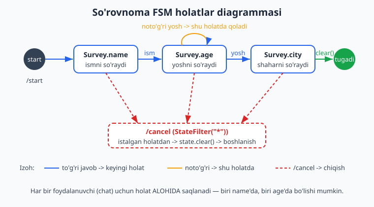
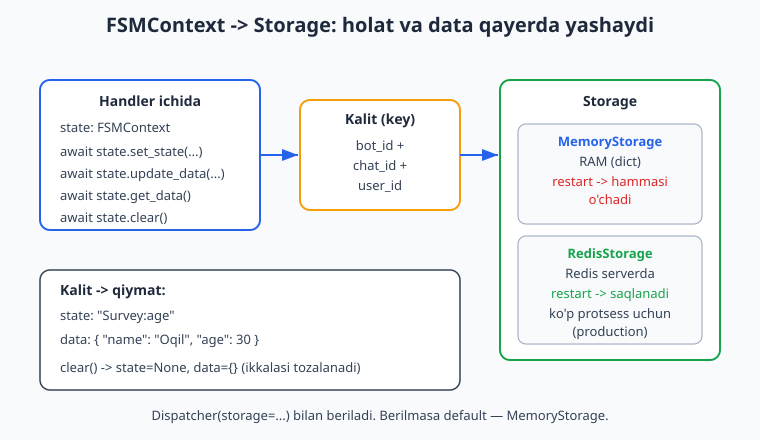
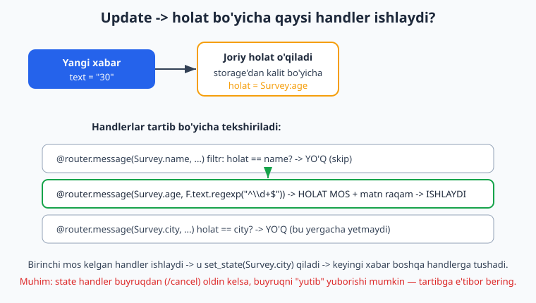

# 08 — FSM — holatlar mashinasi

[⬅️ Oldingi: 07 — Callback query va inline rejim](./07-callback-inline.md) · [🏠 README](./README.md) · [Keyingi: 09 — Middleware ➡️](./09-middleware.md)

---

> **Bu bobda:** Hozirgacha har bir xabar mustaqil edi — bot xabarni oldi, javob berdi, unutdi. Lekin ko'p real botlar **suhbat** olib boradi: "Ismingizni yozing" -> "Yoshingizni yozing" -> "Shahringizni yozing". Bot avval qaysi savol berganini, foydalanuvchi qaysi qadamda turganini **eslab turishi** kerak. Buni **FSM** (Finite State Machine — chekli holatlar mashinasi) hal qiladi. Bu bobda holat (state) nima ekanini, `StatesGroup` va `State` bilan holatlar to'plamini e'lon qilishni, handlerga `FSMContext` orqali kirib holatni boshqarishni (`set_state`, `get_state`, `set_data`/`update_data`/`get_data`/`get_value`, `clear`), holat qaerda saqlanishini (`MemoryStorage` vs `RedisStorage`), to'liq ko'p qadamli **so'rovnoma/forma** yasashni, har qanday holatdan `/cancel` bilan chiqishni va holatlar diagrammasini o'rganamiz. Oxirida yana bir muhim nozik joy — state handler buyruqni "yutib yuborishi" muammosini ham yopamiz.
>
> **Halol eslatma:** Bobdagi holat o'tishlari (state transitions), `FSMContext` metodlari, `StatesGroup`/`State`, `MemoryStorage`, ko'p qadamli forma va `/cancel` mantiqi — hammasi tokensiz, OFFLINE `feed_update` va `pytest-asyncio` bilan haqiqatan ishga tushirib tekshirildi (bot sessiyasi soxta token bilan, hech qanday tarmoq chaqiruvisiz). Jonli natija — telefonda savol-javob ketma-ketligi ko'rinishi — `@BotFather` token + internet talab qiladi va "illustrativ" deb belgilangan. Hech qayerda soxta "bot ishladi / xabar yetib bordi" yozilmagan.

---

## Holat (state) nima va nega kerak?

Tasavvur qiling, bot foydalanuvchidan ro'yxatdan o'tish uchun uch narsa so'raydi: ism, yosh, shahar. Foydalanuvchi `"Oqil"` deb yozadi. Bot buni nima deb tushunsin? Ism deb? Yosh deb? Bot **kontekstni** bilishi kerak: "men hozir foydalanuvchidan ISMni so'ragan edim, demak bu javob — ism".

Ana shu "men hozir qaysi qadamdaman" degan ma'lumot — **holat (state)**. FSM (chekli holatlar mashinasi) — bu cheklangan sondagi holatlar va ular orasidagi o'tishlardan iborat model:

- Foydalanuvchi har lahzada **bitta** holatda turadi (yoki hech qaysi holatda — "bo'sh").
- Har bir javob foydalanuvchini **keyingi holatga** o'tkazadi.
- Forma tugagach holat **tozalanadi** — foydalanuvchi yana "bo'sh" holatga qaytadi.



> **Python eslatma:** Bu kitob Python bilasiz deb faraz qiladi (async/await, klass, type hints, dekorator). Agar bu tushunchalar yangi bo'lsa, avval [../python/README.md](../python/README.md) ga qarang. FSM — bu Telegram/aiogram'ga xos narsa emas, umumiy dasturlash tushunchasi; biz uni aiogram'da qanday ishlatishni to'liq tushuntiramiz.

Eng muhim narsa: holat **har bir foydalanuvchi uchun alohida** saqlanadi. Bir vaqtda yuz odam botingiz bilan ishlashi mumkin — biri ism qadamida, ikkinchisi yosh qadamida. aiogram buni avtomatik ajratib turadi (kalit = bot + chat + foydalanuvchi).

---

## StatesGroup va State — holatlarni e'lon qilish

aiogram'da holatlar `StatesGroup` klassidan meros olgan klass ichida `State()` obyektlari sifatida e'lon qilinadi. Bu xuddi Python `Enum`'iga o'xshaydi — har bir holatga nom beramiz.

```python
from aiogram.fsm.state import State, StatesGroup


class Survey(StatesGroup):
    name = State()   # ism so'raladigan holat
    age = State()    # yosh so'raladigan holat
    city = State()   # shahar so'raladigan holat
```

Har bir `State` ichki nom oladi — `"GuruhNomi:atributNomi"` ko'rinishida. Tekshirib ko'ramiz (oddiy import, tokensiz):

```python
print(Survey.name)         # <State 'Survey:name'>
print(Survey.name.state)   # Survey:name   <- satr ko'rinishi
print(Survey.__states__)   # (<State 'Survey:name'>, <State 'Survey:age'>, <State 'Survey:city'>)
```

`Survey.name.state` aynan `"Survey:name"` satrini beradi — storage'da holat shu satr sifatida saqlanadi. Bu detalni eslab qolish shart emas, lekin nima saqlanishini bilish foydali.

> **Diqqat (2.x emas):** aiogram 2.x'da ham `StatesGroup`/`State` bor edi, lekin holatga kirish/chiqish API'si butunlay boshqacha edi. Biz faqat **3.x** idiomini ishlatamiz. Eski `from aiogram.dispatcher.filters.state import State, StatesGroup` import yo'lini ishlatmang — to'g'risi `from aiogram.fsm.state import State, StatesGroup`.

---

## FSMContext — holatni boshqarish

Handler holat bilan ishlashi uchun unga `FSMContext` obyekti kerak. aiogram buni avtomatik **inject** qiladi: handler funksiyasi argumentiga `state: FSMContext` deb yozsangiz, aiogram joriy foydalanuvchining holat kontekstini o'zi beradi.

```python
from aiogram.fsm.context import FSMContext


async def handler(message: Message, state: FSMContext):
    await state.set_state(Survey.name)   # holatni o'rnatish
```

`FSMContext`ning asosiy metodlari (hammasi `async`, `await` bilan chaqiriladi):

| Metod | Vazifasi |
|---|---|
| `await state.set_state(Survey.name)` | Joriy holatni o'rnatadi. `set_state(None)` — holatni bo'shatadi (data tegmaydi). |
| `await state.get_state()` | Joriy holat satrini qaytaradi (`"Survey:name"`) yoki `None` (holat yo'q). |
| `await state.update_data(name="Oqil")` | Mavjud data'ga **qo'shadi/yangilaydi** (merge). Yangilangan to'liq data'ni qaytaradi. |
| `await state.set_data({"name": "Oqil"})` | Butun data'ni **almashtiradi** (eskisi o'chadi). |
| `await state.get_data()` | Barcha saqlangan data'ni `dict` ko'rinishida qaytaradi. |
| `await state.get_value("name")` | Bitta kalit qiymatini qaytaradi (yoki `default`). |
| `await state.clear()` | Holat VA data — **ikkalasini ham** tozalaydi. |

`update_data` va `set_data` farqini aniq bilib oling:

```python
await state.set_data({"name": "Oqil"})        # data = {"name": "Oqil"}
await state.update_data(age=30)               # data = {"name": "Oqil", "age": 30}  <- qo'shildi
await state.update_data(name="Imom")          # data = {"name": "Imom", "age": 30}  <- yangilandi
await state.set_data({"city": "Toshkent"})    # data = {"city": "Toshkent"}         <- HAMMASI almashdi!
```

Amaliyotda deyarli har doim `update_data` ishlatiladi — har qadamda bittadan qiymat qo'shib boramiz. `set_data` ni faqat ataylab hammasini tozalab qaytadan yozmoqchi bo'lsangiz ishlating.

> **Nega `clear()` ?** Ko'pchilik faqat `set_state(None)` qilib qo'yadi va data'ni unutadi. Forma tugagach `clear()` chaqiring — aks holda eski data (ism, yosh) storage'da qolib ketadi va keyingi formada chalkashlik tug'diradi. `clear()` = `set_state(None)` + data'ni tozalash.

---

## Holat va data qayerda saqlanadi? — Storage

`FSMContext` o'zi holatni saqlamaydi — u faqat **Storage**ga interfeys. Storage — bu "kalit -> (holat, data)" lug'ati. Kalit har bir foydalanuvchi uchun `bot_id + chat_id + user_id` dan tuziladi, shuning uchun foydalanuvchilar bir-biriga aralashmaydi.



Storage `Dispatcher`ga beriladi:

```python
from aiogram import Dispatcher
from aiogram.fsm.storage.memory import MemoryStorage

dp = Dispatcher(storage=MemoryStorage())
```

> **Default:** Agar `storage=` bermasangiz, `Dispatcher()` baribir `MemoryStorage()` ishlatadi. Ya'ni `Dispatcher()` va `Dispatcher(storage=MemoryStorage())` FSM nuqtai nazaridan bir xil. Lekin kodingizda aniq yozib qo'yish — yaxshi odat. (Buni offline tasdiqladik: `Dispatcher()` ning standart storage'i `MemoryStorage`.)

### MemoryStorage vs RedisStorage

| | `MemoryStorage` | `RedisStorage` |
|---|---|---|
| Qayerda | Bot protsessining RAM'ida (oddiy `dict`) | Tashqi **Redis** serverda |
| Bot qayta ishga tushsa | Hamma holat/data **o'chadi** | **Saqlanadi** |
| Ko'p protsess/server | Ishlamaydi (har biri o'z RAM'i) | Ishlaydi (umumiy markaz) |
| Qachon | O'rganish, lokal sinov, kichik bot | Production, restart'ga chidamli, gorizontal masshtab |
| Talab | Hech narsa | `pip install redis` + ishlab turgan Redis |

`RedisStorage` ishlatish (illustrativ — Redis server kerak; import yo'li 3.x'da to'g'ri):

```python
# Bu uchun "pip install redis" kerak va Redis server ishlab turishi shart.
from aiogram.fsm.storage.redis import RedisStorage

storage = RedisStorage.from_url("redis://localhost:6379/0")
dp = Dispatcher(storage=storage)
```

`MemoryStorage` bilan bot to'xtab qayta ishga tushsa, yarmida qolgan forma "yo'qoladi" — foydalanuvchi navbatdagi savolga javob yozsa, bot uni tushunmaydi (chunki holat o'chgan). Production'da `RedisStorage` shuning uchun afzal: bot deploy paytida restart bo'lsa ham, suhbat joyida qoladi.

> **Eslatma:** Bu kitobning qolgan misollarida `MemoryStorage` ishlatamiz — u tokensiz, hech qanday tashqi xizmatsiz ishlaydi va o'rganish uchun ideal. Production'ga chiqishda faqat shu bir qatorni `RedisStorage`ga almashtirasiz, qolgan kod o'zgarmaydi. Redis haqida ko'proq: deploy bobida ([../git-github/README.md](../git-github/README.md)) va ma'lumotlar bazasi mavzusi ([../sql/README.md](../sql/README.md)) bilan bog'liq.

---

## Holatga kirish va holatdan holatga o'tish

Endi eng qiziq qism — handler **holatga bog'lanadi**. aiogram'da holat filtri shunchaki handler dekoratoriga holatni argument qilib berishdan iborat:

```python
@router.message(Survey.name)          # faqat foydalanuvchi Survey.name holatida bo'lsa ishlaydi
async def handler(message, state): ...
```

Bu `StateFilter(Survey.name)` ning qisqartmasi. Ya'ni quyidagi ikkisi bir xil:

```python
from aiogram.filters import StateFilter

@router.message(Survey.name)               # qisqa shakl
@router.message(StateFilter(Survey.name))  # to'liq shakl — bir xil natija
```

Mantiq oddiy: foydalanuvchidan xabar kelganda, aiogram avval uning joriy holatini storage'dan o'qiydi, keyin holatga mos handlerni qidiradi.



`StateFilter`ning maxsus qiymatlari:

- `StateFilter(None)` — faqat foydalanuvchi **hech qaysi** holatda bo'lmasa (forma boshlamagan).
- `StateFilter("*")` — **istalgan** holatda (`/cancel` uchun juda qulay, pastda ko'ramiz).
- `StateFilter(A, B)` — bir nechta holatdan birida.

---

## To'liq ko'p qadamli so'rovnoma (forma)

Mana to'liq, ishlaydigan misol — uch qadamli so'rovnoma. Buni biz OFFLINE `feed_update` bilan haqiqatan ishga tushirib tekshirdik (pastda natija bor).

```python
# survey.py — uch qadamli so'rovnoma (FSM)
import asyncio
import os

from aiogram import Bot, Dispatcher, Router, F
from aiogram.client.default import DefaultBotProperties
from aiogram.enums import ParseMode
from aiogram.fsm.context import FSMContext
from aiogram.fsm.state import State, StatesGroup
from aiogram.fsm.storage.memory import MemoryStorage
from aiogram.filters import CommandStart
from aiogram.types import Message

router = Router()


class Survey(StatesGroup):
    name = State()
    age = State()
    city = State()


@router.message(CommandStart())
async def start(message: Message, state: FSMContext):
    await state.set_state(Survey.name)        # 1-qadamga kiramiz
    await message.answer("Salom! Ismingizni yozing:")


# Foydalanuvchi Survey.name holatida va matn yuborsa:
@router.message(Survey.name, F.text)
async def got_name(message: Message, state: FSMContext):
    await state.update_data(name=message.text)
    await state.set_state(Survey.age)         # keyingi qadamga
    await message.answer(f"Yaxshi, {message.text}! Yoshingizni yozing (faqat raqam):")


# Survey.age holatida VA matn faqat raqamlardan iborat bo'lsa:
@router.message(Survey.age, F.text.regexp(r"^\d{1,3}$"))
async def got_age(message: Message, state: FSMContext):
    await state.update_data(age=int(message.text))
    await state.set_state(Survey.city)
    await message.answer("Qaysi shaharda yashaysiz?")


# Survey.age holatida, lekin raqam EMAS bo'lsa — holatda qolamiz, qayta so'raymiz:
@router.message(Survey.age)
async def bad_age(message: Message):
    await message.answer("Iltimos, yoshni faqat raqam bilan yozing. Masalan: 25")


# Survey.city holatida matn kelsa — forma tugaydi:
@router.message(Survey.city, F.text)
async def got_city(message: Message, state: FSMContext):
    await state.update_data(city=message.text)
    data = await state.get_data()             # to'plangan hammasini olamiz
    await state.clear()                        # holat + data tozalanadi
    await message.answer(
        "Rahmat! Ma'lumotlaringiz:\n"
        f"Ism: {data['name']}\n"
        f"Yosh: {data['age']}\n"
        f"Shahar: {data['city']}"
    )


async def main():
    token = os.environ["BOT_TOKEN"]           # token KODGA yozilmaydi, .env dan
    bot = Bot(token=token, default=DefaultBotProperties(parse_mode=ParseMode.HTML))
    dp = Dispatcher(storage=MemoryStorage())
    dp.include_router(router)
    await dp.start_polling(bot)                # <- jonli qism, token+internet kerak


if __name__ == "__main__":
    asyncio.run(main())
```

Diqqat qiladigan nuqtalar:

1. **`F.text` filtri** — foydalanuvchi rasm yoki stiker yuborsa, `F.text` mos kelmaydi, shuning uchun matn bo'lmagan javoblar e'tiborsiz qoladi (yoki alohida handlerda ushlanadi).
2. **Validatsiya holatda qolish bilan** — `got_age` raqamni talab qiladi. Raqam bo'lmasa, `bad_age` ishlaydi: u `set_state` ham, `update_data` ham qilmaydi — foydalanuvchi `Survey.age` holatida **qoladi** va qayta urinadi. Bu FSM'ning eng kuchli xususiyati.
3. **Handler tartibi** — `got_age` (raqam filtri) `bad_age`'dan **oldin** turishi shart. aiogram birinchi mos kelganini ishlatadi.

### Buni qanday OFFLINE tekshirdik

`main()` (`start_polling`) jonli Telegram talab qiladi — uni token+internetsiz ishga tushira olmaymiz. **Lekin** handler mantiqini soxta token bilan, `feed_update` orqali to'liq tekshirsa bo'ladi. Biz aynan shu so'rovnomani quyidagi sxema bilan sinovdan o'tkazdik:

```python
# test_survey.py — OFFLINE, tokensiz (faqat handler/FSM mantig'ini tekshiradi)
import asyncio
from datetime import datetime
from aiogram import Bot, Dispatcher
from aiogram.fsm.storage.memory import MemoryStorage
from aiogram.types import Update, Message, Chat, User
# ... yuqoridagi router shu yerda import qilinadi ...

def make_update(uid, text):
    msg = Message(
        message_id=uid, date=datetime.now(),
        chat=Chat(id=99, type="private"),
        from_user=User(id=99, is_bot=False, first_name="Test"),
        text=text,
    )
    return Update(update_id=uid, message=msg)

async def main():
    bot = Bot(token="123456:AAH-FakeTest_abc")     # SOXTA token — tarmoqqa chiqmaydi
    dp = Dispatcher(storage=MemoryStorage())
    dp.include_router(router)
    for i, t in enumerate(["/start", "Oqil", "yosh emas", "30", "Toshkent"], 1):
        await dp.feed_update(bot, make_update(i, t))
    await bot.session.close()

asyncio.run(main())
```

Holat o'tishlarini log qilib kuzatganimizda, aniq quyidagi ketma-ketlik chiqdi (bu **haqiqiy** offline natija):

```text
('start', 'Survey:name')                                          # /start -> name holati
('name',  'Survey:age')                                           # "Oqil" -> age holati
('bad_age','Survey:age')                                          # "yosh emas" -> age'da QOLDI
('age',   'Survey:city')                                          # "30" -> city holati
('city',  {'name': 'Oqil', 'age': 30, 'city': 'Toshkent'}, None)  # tugadi, clear()
```

Ya'ni `"yosh emas"` raqam bo'lmagani uchun `bad_age` ishladi va holat o'zgarmadi — keyin `"30"` to'g'ri qabul qilindi. Forma oxirida data to'liq yig'ildi (`{'name': 'Oqil', 'age': 30, 'city': 'Toshkent'}`) va `clear()` dan keyin holat `None` bo'ldi. Bu — soxta emas, sinov tom ma'noda shunday natija berdi.

> **Jonli ko'rinish (illustrativ — token+internet kerak):** Telefonda bu shunday ko'rinardi — bot "Ismingizni yozing" deydi, siz "Oqil" deysiz, bot "Yoshingizni yozing" deydi, va hokazo. Biz buni real Telegram'da ishga tushirmadik (token kerak), lekin handler mantig'i yuqoridagidek aniq tekshirilgan.

---

## Holatdan chiqish va bekor qilish — `/cancel`

Foydalanuvchi forma o'rtasida fikridan qaytishi mumkin. Unga "chiqish yo'li" berish **shart** — aks holda u boshqa hech narsa qila olmay qoladi (bot doim savol kutib turadi). Buning uchun istalgan holatda ishlaydigan `/cancel` handler yozamiz:

```python
from aiogram.filters import Command, StateFilter

@router.message(StateFilter("*"), Command("cancel"))
async def cancel(message: Message, state: FSMContext):
    current = await state.get_state()
    if current is None:
        await message.answer("Bekor qiladigan amal yo'q.")
        return
    await state.clear()
    await message.answer("Amal bekor qilindi. Boshidan boshlash uchun /start.")
```

Bu yerda:

- `StateFilter("*")` — bu handler **istalgan** holatda ishlaydi (`name`, `age`, `city` — farqi yo'q).
- `get_state()` `None` bo'lsa — foydalanuvchi hech qaysi formada emas, bekor qiladigan narsa yo'q, shunchaki xabar beramiz.
- Aks holda `clear()` — holat va data tozalanadi, foydalanuvchi "bo'sh" holatga qaytadi.

`"bekor"` so'zini ham (tugma bosib yuboriladigan) qabul qilmoqchi bo'lsangiz, bir handlerga ikki filtr qo'shasiz (`OR` mantig'i — bir nechta dekorator bilan):

```python
@router.message(StateFilter("*"), Command("cancel"))
@router.message(StateFilter("*"), F.text.casefold() == "bekor")
async def cancel(message: Message, state: FSMContext):
    ...
```

Ikkala dekorator ham bitta funksiyaga ulanadi — `/cancel` buyrug'i YOKI "bekor" matni — ikkalasi ham shu handlerga olib keladi. Biz `/cancel` ni ham mid-flow (forma o'rtasida), ham bo'sh holatda OFFLINE tekshirdik: mid-flow'da holat `None`'ga tushdi, bo'sh holatda esa "noop" (hech narsa qilmadi) ishladi.

---

## Nozik joy: state handler buyruqni "yutib yuborishi"

Bu — ko'p odam yo'l qo'yadigan, lekin kam yoziladigan xato. Quyidagi handlerni ko'ring:

```python
# ❌ MUAMMOLI: bu handler Survey.age holatidagi HAR QANDAY matnni ushlaydi
@router.message(Survey.age)
async def got_age(message, state):
    ...
```

Foydalanuvchi `Survey.age` holatida turib `/cancel` yozsa, bu matn ham `Survey.age` holatdagi matn hisoblanadi! Agar `got_age` `/cancel` handleridan **oldin** ro'yxatdan o'tgan bo'lsa (yoki shu router birinchi tekshirilsa), `/cancel` "yutib yuboriladi" — `cancel` handler hech qachon ishlamaydi.

Yechim ikki xil:

**1) `/cancel` ni global, FSM holatlaridan tashqarida e'lon qiling** va uni router/handler tartibida oldinroqqa qo'ying (`StateFilter("*")` bilan, biz yuqorida shunday qildik).

**2) State javob handlerlaridan buyruqlarni chiqarib tashlang** — magic-filter bilan:

```python
# ✅ buyruqlarni (/ bilan boshlanadigan) bu handler ushlamaydi
@router.message(Survey.age, ~F.text.startswith("/"))
async def got_age(message, state):
    ...
```

`~F.text.startswith("/")` — "matn `/` bilan boshlanMAsa" degani (`~` — inkor). Endi `/cancel`, `/start` kabi buyruqlar `got_age`'ga tushmaydi va o'z handleriga yetib boradi.

Biz buni OFFLINE tasdiqladik: ikki foydalanuvchi parallel formada turganda (biri `q1`, biri `q2` holatida), `~F.text.startswith("/")` filtri bo'lmaganda `/where` buyrug'i state handlerga "yutilib ketdi"; filtr qo'shilgach buyruq to'g'ri ishladi. Ya'ni bu — nazariy emas, real xulq-atvor.

> **Qoida:** State javob handlerlari odatda `F.text` yoki `~F.text.startswith("/")` bilan cheklanadi; barcha buyruqlar (`/cancel`, `/start`, `/help`) esa `StateFilter("*")` bilan alohida e'lon qilinadi va router ichida oldinroqqa qo'yiladi.

---

## Bir foydalanuvchi = bir holat (izolyatsiya)

Yana bir bor ta'kidlaymiz, chunki bu juda muhim: holat **kalit** bo'yicha saqlanadi (bot + chat + user). Demak:

- Foydalanuvchi A `Survey.name` holatida, foydalanuvchi B `Survey.age` holatida bo'lishi mumkin — bir-biriga ta'sir qilmaydi.
- Bir foydalanuvchi data'si boshqasiga aralashmaydi.

Buni OFFLINE ikki xil `user_id` bilan tekshirdik: foydalanuvchi 100 formani davom ettirib `q2`'ga o'tdi, foydalanuvchi 200 esa hali `q1`'da qoldi — `get_state()` har biriga to'g'ri qiymat qaytardi. Bu sizning kodingizda hech qanday qo'shimcha mehnat talab qilmaydi — aiogram avtomatik bajaradi.

> **Node.js bilan solishtirish:** Agar Node.js bot freymvorklarini ko'rgan bo'lsangiz ([../nodejs/README.md](../nodejs/README.md)), u yerda ko'pincha sessiya/state'ni o'zingiz `ctx.session` orqali boshqarasiz. aiogram'da FSM bu ishni tuzilgan holat mashinasi sifatida, holat filtrlari bilan birlashtirib beradi — bu kodni ancha tartibli qiladi.

---

## Yo'l xaritasi: forma yozishning standart shabloni

Har safar ko'p qadamli forma yozganda shu qadamlarni bajaring:

1. `StatesGroup` ichida har bir savol uchun bitta `State` e'lon qiling.
2. Boshlovchi handler (`/start` yoki tugma) — `set_state(birinchi_holat)`.
3. Har bir holat uchun handler: `update_data(...)` -> `set_state(keyingi_holat)`. Kerak bo'lsa validatsiya handlerini (holatda qoldiradigan) qo'shing.
4. Oxirgi holatda: `get_data()` -> ishni bajaring (DB'ga yozish va h.k.) -> `clear()`.
5. `StateFilter("*")` bilan `/cancel` handler qo'shing.
6. State javob handlerlarida buyruqlarni filtrlang (`~F.text.startswith("/")`).
7. `Dispatcher(storage=MemoryStorage())` (production'da `RedisStorage`).

---

## Mashqlar

### Oson

1. `Reg` nomli `StatesGroup` yozing, ichida `first_name` va `last_name` ikkita `State`. `Reg.first_name.state` nimani qaytaradi? Avval taxmin qiling, keyin `print` bilan tekshiring.
2. `MemoryStorage` va `RedisStorage` orasidagi ENG asosiy farqni bir jumlada ayting: bot qayta ishga tushganda nima bo'ladi?
3. `update_data(x=1)` keyin `update_data(y=2)` chaqirilsa, `get_data()` nima qaytaradi? Endi o'rniga ikkinchisini `set_data({"y": 2})` qilsangiz-chi?
4. `clear()` va `set_state(None)` orasidagi farq nima? Qaysi birida data saqlanib qoladi?
5. Bitta savolli "fikr-mulohaza" (feedback) formasi yozing: `/feedback` -> bot "Fikringizni yozing" deydi -> foydalanuvchi matn yuboradi -> bot "Rahmat!" deydi va holatni tozalaydi.
6. `StateFilter("*")`, `StateFilter(None)` va `StateFilter(Survey.age)` — har biri qachon mos keladi? Bir jumladan tushuntiring.

### O'rta

7. `/login` formasi yozing: avval `username`, keyin `password` so'raydi, oxirida `update_data` natijasidan ikkalasini olib "Xush kelibsiz, {username}!" deb javob beradi. `RedisStorage` emas, `MemoryStorage` ishlating.
8. 7-mashqdagi `/login` formasiga `StateFilter("*")` bilan `/cancel` qo'shing: forma o'rtasida `/cancel` yozilsa, holat tozalanib "Bekor qilindi" deyilsin; bo'sh holatda yozilsa "Bekor qiladigan amal yo'q" deyilsin.
9. `Survey.age` holatida foydalanuvchi raqam o'rniga matn yozsa, holatda qolib qayta so'raydigan validatsiya handler yozing. Raqam 1..120 oralig'ida ekanini ham tekshiring (oraliqdan tashqari bo'lsa ham qayta so'rasin).
10. `got_age` handler `/cancel` ni "yutib yubormasligi" uchun unga to'g'ri magic-filter qo'shing va nega kerakligini izohlang.
11. Forma oxirida `get_data()` bilan to'plangan barcha javoblarni bitta formatli xabarga jamlab chiqaring (ism, yosh, shahar). Agar shahar kiritilmagan bo'lsa "ko'rsatilmagan" deb yozsin (`get_value("city", "ko'rsatilmagan")`).
12. `set_state(Survey.age)` chaqirgandan keyin, lekin `update_data`'siz, `get_data()` nima qaytaradi? Holatni o'zgartirish data'ni o'zgartiradimi? Taxmin qiling va offline tekshiring.

### Qiyin

13. So'rovnomaga "orqaga" tugmasi qo'shing: `qty` (miqdor) holatida foydalanuvchi "orqaga" desa, `product` holatiga qaytsin (oldingi savolni qayta bersin). Holat tarixini (`product -> qty -> product -> qty`) kuzatib tekshiring.
14. Ikki xil foydalanuvchi (`user_id` 100 va 200) parallel bir formani to'ldirayotganda holatlari aralashmasligini OFFLINE `feed_update` bilan isbotlang. 100 ikkinchi qadamda, 200 birinchi qadamda turganini `get_state()` bilan ko'rsating.
15. Forma to'liq tugagach, to'plangan data'ni soxta "saqlash" funksiyasiga (`save_to_db(data)` — shunchaki ro'yxatga qo'shadigan) uzating, keyin `clear()` qiling. `pytest-asyncio` testi yozib, ro'yxatda to'g'ri yozuv borligini va holat `None` ekanini tasdiqlang.
16. `/cancel` ni bitta handlerga ham `Command("cancel")`, ham `F.text.casefold() == "bekor"` filtri bilan ulang (ikki dekorator). Har ikki kirish ham holatni tozalashini tekshiring.

<details markdown="1"><summary>Yechimlar</summary>

**1-mashq.**

```python
from aiogram.fsm.state import State, StatesGroup

class Reg(StatesGroup):
    first_name = State()
    last_name = State()

print(Reg.first_name.state)   # "Reg:first_name"
```

Holat satri har doim `"GuruhNomi:atributNomi"` ko'rinishida bo'ladi. Shuning uchun `Reg.first_name.state` aynan `"Reg:first_name"` ni qaytaradi.

---

**2-mashq.** `MemoryStorage` holatni bot protsessining RAM'ida saqlaydi — bot qayta ishga tushsa hamma holat va data **o'chadi**. `RedisStorage` tashqi Redis serverda saqlaydi — bot restart bo'lsa ham holat **saqlanadi**. Demak yarmida qolgan formalar production'da yo'qolmasligi uchun `RedisStorage` kerak.

---

**3-mashq.**

```python
await state.update_data(x=1)   # data = {"x": 1}
await state.update_data(y=2)   # data = {"x": 1, "y": 2}   <- merge, "x" saqlandi
await state.get_data()         # {"x": 1, "y": 2}

# Endi set_data bilan:
await state.update_data(x=1)   # data = {"x": 1}
await state.set_data({"y": 2}) # data = {"y": 2}            <- HAMMASI almashdi, "x" yo'qoldi
```

`update_data` qo'shadi/yangilaydi (merge), `set_data` esa butun data'ni almashtiradi.

---

**4-mashq.** `set_state(None)` faqat **holatni** bo'shatadi — saqlangan data (`update_data` bilan yozilgan) **qoladi**. `clear()` esa holatni ham, data'ni ham **ikkalasini ham** tozalaydi. Forma tugagach `clear()` ishlatish kerak, aks holda eski data keyingi suhbatda chalkashlik tug'diradi.

---

**5-mashq.**

```python
from aiogram import Router, F
from aiogram.fsm.context import FSMContext
from aiogram.fsm.state import State, StatesGroup
from aiogram.filters import Command
from aiogram.types import Message

router = Router()

class Fb(StatesGroup):
    text = State()

@router.message(Command("feedback"))
async def start(message: Message, state: FSMContext):
    await state.set_state(Fb.text)
    await message.answer("Fikringizni yozing:")

@router.message(Fb.text, F.text)
async def got(message: Message, state: FSMContext):
    # bu yerda fikrni saqlash mumkin: print(message.text) yoki DB'ga
    await state.clear()
    await message.answer("Rahmat!")
```

`feed_update` bilan `["/feedback", "Zo'r bot!"]` yuborganimizda fikr to'g'ri ushlandi va holat tozalandi (offline, `pytest-asyncio` bilan tasdiqlangan).

---

**6-mashq.**
- `StateFilter("*")` — foydalanuvchi **istalgan** holatda bo'lganda mos keladi; global `/cancel` uchun ishlatiladi.
- `StateFilter(None)` — foydalanuvchi **hech qaysi** holatda bo'lmaganda (forma boshlamagan).
- `StateFilter(Survey.age)` — faqat aynan `Survey.age` holatida.

---

**7-mashq.**

```python
from aiogram import Router, F
from aiogram.fsm.context import FSMContext
from aiogram.fsm.state import State, StatesGroup
from aiogram.filters import Command
from aiogram.types import Message

router = Router()

class Login(StatesGroup):
    username = State()
    password = State()

@router.message(Command("login"))
async def start(message: Message, state: FSMContext):
    await state.set_state(Login.username)
    await message.answer("Login (username) yozing:")

@router.message(Login.username, ~F.text.startswith("/"))
async def uname(message: Message, state: FSMContext):
    await state.update_data(username=message.text)
    await state.set_state(Login.password)
    await message.answer("Parolni yozing:")

@router.message(Login.password, ~F.text.startswith("/"))
async def pwd(message: Message, state: FSMContext):
    data = await state.update_data(password=message.text)
    await state.clear()
    await message.answer(f"Xush kelibsiz, {data['username']}!")
```

`["/login", "oqil", "secret"]` bilan tekshirilganda `data == {"username": "oqil", "password": "secret"}` chiqdi (offline, `pytest-asyncio`). Diqqat: parolni real botda yodda saqlamaslik/maxfiy ishlash kerak — bu o'quv misol.

---

**8-mashq.**

```python
from aiogram.filters import StateFilter

@router.message(StateFilter("*"), Command("cancel"))
async def cancel(message: Message, state: FSMContext):
    if await state.get_state() is None:
        await message.answer("Bekor qiladigan amal yo'q.")
        return
    await state.clear()
    await message.answer("Bekor qilindi.")
```

Bu handlerni `Login` handlerlaridan oldin (router ichida yuqorida) qo'ying, va `uname`/`pwd`'da `~F.text.startswith("/")` bo'lgani uchun `/cancel` ularga tushmaydi. `["/login", "oqil", "/cancel"]` -> holat tozalandi, "login" data yozilmadi (offline tasdiqlangan).

---

**9-mashq.**

```python
@router.message(Survey.age, F.text.regexp(r"^\d{1,3}$"))
async def got_age(message: Message, state: FSMContext):
    age = int(message.text)
    if not (1 <= age <= 120):
        await message.answer("Yosh 1 dan 120 gacha bo'lishi kerak. Qayta yozing:")
        return                       # holatni o'zgartirmaymiz -> Survey.age'da qoladi
    await state.update_data(age=age)
    await state.set_state(Survey.city)
    await message.answer("Shahringiz?")

@router.message(Survey.age)          # raqam umuman emas (regexp mos kelmadi)
async def bad_age(message: Message):
    await message.answer("Faqat raqam yozing. Masalan: 25")
```

Ikki bosqichli tekshiruv: regexp raqam emasligini, ichki `if` esa oraliqni tekshiradi. Har ikkalasi ham `set_state` qilmagani uchun foydalanuvchi `Survey.age`'da qoladi.

---

**10-mashq.**

```python
@router.message(Survey.age, ~F.text.startswith("/"))
async def got_age(message: Message, state: FSMContext):
    ...
```

`~F.text.startswith("/")` — matn `/` bilan boshlanmasa. Bu kerak, chunki aks holda `Survey.age` holatidagi foydalanuvchi `/cancel` yozsa, bu matn ham "yosh javobi" deb `got_age`'ga tushib ketadi va global `/cancel` handler ishlamaydi (state handler buyruqni "yutib yuboradi"). Filtr buyruqlarni chiqarib tashlaydi.

---

**11-mashq.**

```python
@router.message(Survey.city, F.text)
async def done(message: Message, state: FSMContext):
    await state.update_data(city=message.text)
    data = await state.get_data()
    city = await state.get_value("city", "ko'rsatilmagan")
    await state.clear()
    # Apostrof tufayli f-string ichida backslash ISHLATMANG -- SyntaxError beradi.
    # Qiymatlarni oldindan o'zgaruvchiga hisoblang, keyin f-string'ga qo'ying.
    na = "ko'rsatilmagan"
    name = data.get("name", na)
    age = data.get("age", na)
    await message.answer(
        "Ma'lumotlaringiz:\n"
        f"Ism: {name}\n"
        f"Yosh: {age}\n"
        f"Shahar: {city}"
    )
```

`get_value("city", "ko'rsatilmagan")` — agar `city` kaliti yo'q bo'lsa default qaytaradi. `dict.get(...)` ham xuddi shu ishni qiladi.

---

**12-mashq.**

```python
await state.set_state(Survey.age)
await state.get_data()   # {}  -> set_state data'ga TEGMAYDI
```

`set_state` faqat holatni o'zgartiradi, data alohida saqlanadi. `update_data` chaqirmaguningizcha data bo'sh (`{}`) qoladi. Offline tasdiqlandi: holat o'zgardi, data `{}` bo'lib qoldi.

---

**13-mashq.**

```python
class Order(StatesGroup):
    product = State()
    qty = State()

@router.message(Command("order"))
async def start(message: Message, state: FSMContext):
    await state.set_state(Order.product)
    await message.answer("Mahsulot nomi?")

@router.message(Order.product, ~F.text.startswith("/"))
async def prod(message: Message, state: FSMContext):
    await state.update_data(product=message.text)
    await state.set_state(Order.qty)
    await message.answer("Miqdori? (raqam, yoki 'orqaga')")

@router.message(Order.qty, F.text.casefold() == "orqaga")
async def back(message: Message, state: FSMContext):
    await state.set_state(Order.product)        # oldingi holatga
    await message.answer("Mahsulot nomini qayta yozing:")

@router.message(Order.qty, F.text.regexp(r"^\d+$"))
async def qty(message: Message, state: FSMContext):
    data = await state.update_data(qty=int(message.text))
    await state.clear()
    await message.answer(f"Buyurtma: {data['product']} x {data['qty']}")
```

`["/order", "Olma", "orqaga", "Nok", "5"]` bilan holat tarixi `["Order:qty", "Order:product", "Order:qty"]` bo'ldi va yakuniy data `{"product": "Nok", "qty": 5}` chiqdi — "orqaga" eski mahsulotni almashtirdi (offline, `pytest-asyncio` tasdiqlangan). E'tibor bering: filtrlar bir-birini istisno qiladi (matn "orqaga" yoki raqam), shuning uchun ikki handler bir-biriga xalaqit bermaydi.

---

**14-mashq.**

```python
import asyncio
from datetime import datetime
from aiogram import Bot, Dispatcher
from aiogram.fsm.storage.memory import MemoryStorage
from aiogram.types import Update, Message, Chat, User
# ... Survey router import qilinadi ...

def upd(uid, text, user_id):
    msg = Message(message_id=uid, date=datetime.now(),
                  chat=Chat(id=user_id, type="private"),
                  from_user=User(id=user_id, is_bot=False, first_name="U"),
                  text=text)
    return Update(update_id=uid, message=msg)

async def main():
    bot = Bot(token="123456:AAH-FakeTest_abc")
    dp = Dispatcher(storage=MemoryStorage())
    dp.include_router(router)
    await dp.feed_update(bot, upd(1, "/start", 100))   # 100 -> name
    await dp.feed_update(bot, upd(2, "/start", 200))   # 200 -> name
    await dp.feed_update(bot, upd(3, "Oqil", 100))     # 100 -> age
    # 100 endi age'da, 200 hali name'da
    await bot.session.close()

asyncio.run(main())
```

`get_state()` ni har bir foydalanuvchi uchun tekshirsangiz: 100 -> `"Survey:age"`, 200 -> `"Survey:name"`. Holatlar aralashmadi — aiogram kalitni `bot+chat+user` bo'yicha ajratadi (offline tasdiqlangan).

---

**15-mashq.**

```python
import pytest
# ... Survey router ...

SAVED = []
def save_to_db(data):
    SAVED.append(dict(data))     # soxta "saqlash"

@router.message(Survey.city, F.text)
async def done(message: Message, state: FSMContext):
    await state.update_data(city=message.text)
    data = await state.get_data()
    save_to_db(data)
    await state.clear()

@pytest.mark.asyncio
async def test_full_flow():
    bot = Bot(token="123456:AAH-FakeTest_abc")
    dp = Dispatcher(storage=MemoryStorage())
    dp.include_router(router)
    for i, t in enumerate(["/start", "Oqil", "30", "Toshkent"], 1):
        await dp.feed_update(bot, upd(i, t, 5))
    await bot.session.close()
    assert SAVED[-1] == {"name": "Oqil", "age": 30, "city": "Toshkent"}
```

Test ro'yxatda to'g'ri yozuv borligini tasdiqlaydi. `state.clear()` dan keyin `get_state()` `None` qaytaradi. (Bizning bobdagi shu naqsh `pytest-asyncio` bilan o'tdi.)

---

**16-mashq.**

```python
from aiogram.filters import Command, StateFilter

@router.message(StateFilter("*"), Command("cancel"))
@router.message(StateFilter("*"), F.text.casefold() == "bekor")
async def cancel(message: Message, state: FSMContext):
    if await state.get_state() is None:
        await message.answer("Bekor qiladigan amal yo'q.")
        return
    await state.clear()
    await message.answer("Bekor qilindi.")
```

Ikki dekorator bitta funksiyaga ulanadi — `/cancel` buyrug'i ham, "bekor"/"BEKOR"/"Bekor" matni ham (`casefold` registrga befarq) shu handlerni ishga tushiradi. Ikkalasi ham `clear()` chaqiradi (offline `/cancel` va "bekor" — ikki yo'l ham holatni tozalashi tasdiqlangan).

</details>

---

[⬅️ Oldingi: 07 — Callback query va inline rejim](./07-callback-inline.md) · [🏠 README](./README.md) · [Keyingi: 09 — Middleware ➡️](./09-middleware.md)
