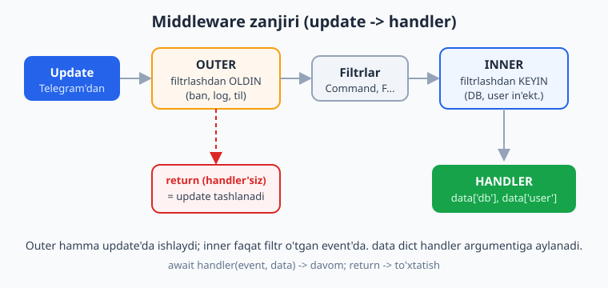
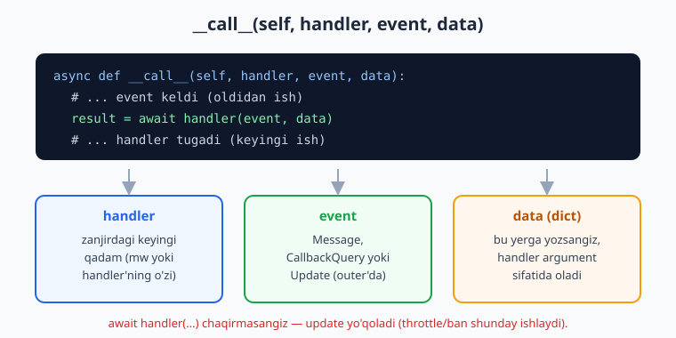
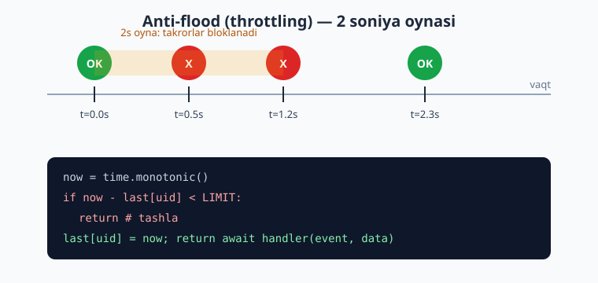

# 09 — Middleware

[⬅️ Oldingi: 08 — FSM — holatlar mashinasi](./08-fsm-holatlar.md) · [🏠 README](./README.md) · [Keyingi: 10 — Ma'lumotlar bazasi bilan ishlash ➡️](./10-malumotlar-bazasi.md)

---

> **Bu bobda:** Middleware — bu har bir kelgan `Update` handler'ga yetib borishidan oldin (va ba'zan keyin) o'tadigan "darvozabon". Biz quyidagilarni o'rganamiz: middleware nima va nega kerak; **outer** (filtrlashdan oldin) va **inner** (filtrlashdan keyin) middleware orasidagi farq; `BaseMiddleware` klassi va uning `__call__(self, handler, event, data)` imzosi; `data` dict orqali handler'ga ma'lumot in'ektsiya qilish (masalan, DB sessiya, "user" obyekti); throttling/anti-flood (spamni cheklash) middleware; logging (jurnalga yozish) middleware; va ro'yxatga olish usullari — `dp.update.outer_middleware(...)`, `dp.message.middleware(...)`, `router.callback_query.middleware(...)`. Shuningdek `flags` (bayroqlar) yordamida alohida handler'larga middleware xatti-harakatini moslash.
>
> **Halol eslatma:** bu bobdagi BARCHA middleware, handler routing, throttling, DB in'ektsiya kodi haqiqatan `feed_update` (mock `Update`) yordamida **offline, tokensiz** ishga tushirib tekshirildi — natijalar matnda ko'rsatilgan. Jonli long-polling, real foydalanuvchining xabar yuborishi yoki Telegram serveriga ulanish esa BotFather tokeni + internet talab qiladi; bunday joylar "illustrativ" deb halol belgilangan.

---

## 1. Middleware nima va nega kerak

Tasavvur qiling: sizning botingizda 30 ta handler bor. Endi har bir handler ishlashidan oldin quyidagilarni qilishingiz kerak:

- har bir so'rovni jurnalga yozish (logging);
- foydalanuvchini bazadan topib, "user" obyektini tayyorlash;
- ban qilingan odamlarni bloklash;
- spamni cheklash (bir soniyada 10 ta xabar yuborayotganni to'xtatish);
- har handler'ga DB ulanishini berish.

Buni har handler ichida qaytarib yozish — 30 marta nusxa-paste. Aql bovar qilmaydigan takror. **Middleware** aynan shu muammoni hal qiladi: u handler'lar atrofiga o'raladigan **umumiy qatlam**. Bitta joyda yozasiz — hamma handler'ga avtomatik qo'llanadi.

Agar siz veb-freymvorkdan tanish bo'lsangiz, bu o'sha "middleware" tushunchasining o'zi: kirim (request) handler'ga yetguncha bir nechta funksiya orqali o'tadi. aiogram'da kirim — bu `Update`.

> Bu Python dekorator/kontekst-menejer tushunchalariga tayanadi. Agar `async def`, dekorator yoki dict bilan ishlash sizga notanish bo'lsa, avval [Python asoslari](../python/README.md) ga qarang.



Diagrammada ko'rinib turibdi: `Update` keladi → **outer middleware** (filtrlashdan oldin) → **filtrlar** (`Command`, `F...`) → **inner middleware** (filtrlashdan keyin) → **handler**. Har bir qatlam keyingisini chaqirishi yoki to'xtatib qo'yishi mumkin.

---

## 2. `BaseMiddleware` va `__call__` imzosi

aiogram 3.x da middleware — bu `BaseMiddleware` dan meros olgan klass. Faqat bitta metodni yozasiz: `__call__`. Uning imzosi **aynan** uchta argument oladi (`self` dan tashqari):

```python
from typing import Any, Awaitable, Callable, Dict
from aiogram import BaseMiddleware
from aiogram.types import TelegramObject


class MeningMiddleware(BaseMiddleware):
    async def __call__(
        self,
        handler: Callable[[TelegramObject, Dict[str, Any]], Awaitable[Any]],
        event: TelegramObject,
        data: Dict[str, Any],
    ) -> Any:
        # 1) event handler'ga yetishidan OLDINGI ish (masalan, log)
        print("event keldi:", type(event).__name__)

        # 2) zanjirni davom ettirish — keyingi qadamni chaqiramiz
        result = await handler(event, data)

        # 3) handler tugagandan KEYINGI ish
        print("event ishlandi")
        return result
```

Uchta argument nima ekanligini tushunish — middleware'ning kaliti:

| Argument | Ma'nosi |
|---|---|
| `handler` | Zanjirdagi **keyingi** qadam: yo navbatdagi middleware, yo handler'ning o'zi. Uni `await handler(event, data)` bilan chaqirasiz. |
| `event` | Kelgan hodisa. Inner middleware'da bu `Message`, `CallbackQuery` va h.k. Outer (update darajasi) middleware'da bu butun `Update`. |
| `data` | **dict** — kontekst ma'lumotlari. Bu yerga nima yozsangiz, handler argument sifatida olishi mumkin (in'ektsiya — 4-bo'lim). |



**Eng muhim qoida:** zanjir davom etishi uchun siz `await handler(event, data)` ni chaqirishingiz **shart**. Agar chaqirmasangiz (`return` bilan chiqib ketsangiz), `Update` **yo'qoladi** — handler umuman ishlamaydi. Aynan shu mexanizm orqali biz ban, throttling va boshqa to'xtatishlarni amalga oshiramiz.

> 2.x da `raise CancelHandler()` / `raise SkipHandler()` ishlatilardi. 3.x da idiomatik usul — oddiygina `return` qilish (handler chaqirmaslik). `CancelHandler`/`SkipHandler` 3.x da hali ham mavjud, lekin yangi kodda `return` ishlatish tavsiya etiladi.

---

## 3. Outer vs Inner middleware

Bu farq aiogram'da juda muhim, chunki noto'g'ri tanlash botni xato qiladi.

### Inner middleware — filtrlashdan KEYIN

Inner middleware **faqat filtr o'tgan, ya'ni handler ishlaydigan event'lar uchun** ishlaydi. Masalan, agar siz DB ulanishini in'ektsiya qilmoqchi bo'lsangiz, har bir bekorga kelgan update uchun emas, faqat haqiqatan handler ishlaydigan paytda kerak. Ro'yxatga olish:

```python
router.message.middleware(DbSessionMiddleware(pool))     # inner (default)
router.callback_query.middleware(DbSessionMiddleware(pool))
```

### Outer middleware — filtrlashdan OLDIN

Outer middleware **har bir kelgan event uchun**, filtrlardan oldin ishlaydi. Hatto hech qaysi handler mos kelmasa ham ishlaydi. Bu ban tekshiruvi, til (locale) aniqlash, global throttling uchun ideal — chunki bularni filtrlashdan ham oldin qilish kerak:

```python
dp.update.outer_middleware(BanMiddleware())     # outer, update darajasi
dp.message.outer_middleware(ThrottleMiddleware())  # outer, message darajasi
```

| | Outer | Inner |
|---|---|---|
| Qachon ishlaydi | Filtrlashdan **oldin** | Filtrlashdan **keyin** |
| Qaysi event'larda | **Hamma** (handler mos kelmasa ham) | Faqat handler ishlaydigan |
| Tipik vazifa | ban, til, global throttle, log | DB sessiya, "user" obyekti |
| Ro'yxat metodi | `.outer_middleware(...)` | `.middleware(...)` |

> **Update darajasi vs event darajasi.** `dp.update.*` — bu eng tashqi qatlam, butun `Update`ni ushlaydi (`event` argumenti `Update` bo'ladi). `dp.message.*` / `router.callback_query.*` esa aniq event turiga bog'lanadi (`event` mos ravishda `Message` / `CallbackQuery`). Ko'pincha global narsalarni `dp.update.outer_middleware`ga, event-ga xoslarni `router.message.middleware`ga qo'yamiz.

---

## 4. Ma'lumot in'ektsiyasi — `data` dict orqali handler'ga uzatish

Bu middleware'ning eng kuchli xususiyati. `data` dict'ga yozgan har bir kalit handler'ga **argument nomi** sifatida ko'rinadi. aiogram type hint emas, **argument nomi** bo'yicha moslaydi.

Quyidagi to'liq misol: outer middleware har update'ni loglaydi, inner middleware "DB user" obyektini yasab handler'ga beradi, yana bir inner middleware throttle qiladi. Hammasi offline ishga tushirilib tekshirildi.

```python
import asyncio
import time
from datetime import datetime
from typing import Any, Dict

from aiogram import Bot, Dispatcher, Router, BaseMiddleware
from aiogram.filters import CommandStart
from aiogram.fsm.storage.memory import MemoryStorage
from aiogram.types import Update, Message, Chat, User

FAKE = "123456:AAH-FakeTest_abc"   # soxta token — offline test uchun


# --- Inner: "user" obyektini data ga in'ektsiya qiladi ---
class UserInjectMiddleware(BaseMiddleware):
    async def __call__(self, handler, event: Message, data: Dict[str, Any]) -> Any:
        tg_user = data["event_from_user"]          # aiogram avtomatik qo'shadi
        # haqiqiy botda bu yerda DB'dan o'qiysiz; bu yerda soxta dict
        data["db_user"] = {"id": tg_user.id, "ism": tg_user.first_name, "premium": True}
        return await handler(event, data)


# --- Outer: har update'ni jurnalga yozadi ---
class LoggingMiddleware(BaseMiddleware):
    async def __call__(self, handler, event: Update, data: Dict[str, Any]) -> Any:
        print(f"[LOG] update {event.update_id} keldi")
        result = await handler(event, data)
        print(f"[LOG] update {event.update_id} tugadi")
        return result


# --- Inner: throttling (vaqt oynasi) ---
class ThrottleMiddleware(BaseMiddleware):
    def __init__(self, limit: float = 1.0):
        self.limit = limit
        self.last: Dict[int, float] = {}

    async def __call__(self, handler, event: Message, data: Dict[str, Any]) -> Any:
        uid = data["event_from_user"].id
        now = time.monotonic()
        if now - self.last.get(uid, 0.0) < self.limit:
            print(f"[THROTTLE] {uid} juda tez yozyapti — tashlandi")
            return                               # handler chaqirilmaydi!
        self.last[uid] = now
        return await handler(event, data)


router = Router()


@router.message(CommandStart())
async def start_handler(message: Message, db_user: dict):
    # db_user middleware in'ektsiya qilgan argument!
    print(f"[HANDLER] salom {db_user['ism']}, premium={db_user['premium']}")
```

Ulashish va ishga tushirish:

```python
async def main():
    bot = Bot(token=FAKE)
    dp = Dispatcher(storage=MemoryStorage())

    dp.update.outer_middleware(LoggingMiddleware())   # outer, hamma update
    router.message.middleware(UserInjectMiddleware())  # inner
    router.message.middleware(ThrottleMiddleware(limit=10.0))

    dp.include_router(router)

    def make(uid, upd):
        msg = Message(message_id=upd, date=datetime.now(),
                      chat=Chat(id=uid, type="private"),
                      from_user=User(id=uid, is_bot=False, first_name="Ali"),
                      text="/start")
        return Update(update_id=upd, message=msg)

    await dp.feed_update(bot, make(1, 1))   # o'tadi
    await dp.feed_update(bot, make(1, 2))   # 10s ichida — throttle
    await dp.feed_update(bot, make(2, 3))   # boshqa user — o'tadi
    await bot.session.close()


asyncio.run(main())
```

Offline ishga tushirganda chiqqan **haqiqiy** natija (tartibga e'tibor bering — outer xabar handler atrofini o'raydi):

```text
[LOG] update 1 keldi
[HANDLER] salom Ali, premium=True
[LOG] update 1 tugadi
[LOG] update 2 keldi
[THROTTLE] 1 juda tez yozyapti — tashlandi
[LOG] update 2 tugadi
[LOG] update 3 keldi
[HANDLER] salom Ali, premium=True
[LOG] update 3 tugadi
```

E'tibor bering: handler `db_user` ni **type hint** bo'yicha emas, **argument nomi** bo'yicha oladi. Agar `data["db_user"]` o'rniga `data["user"]` deb yozsangiz, handler'da ham `user: dict` deb nomlashingiz kerak bo'lardi.

### `data` dict'da nimalar oldindan bor

Siz hech narsa qo'shmasangiz ham, aiogram `data`ga bir nechta foydali kalitni avtomatik soladi. Quyidagi to'rt kalit **outer (update) middleware'da ham** mavjudligini biz `feed_update` bilan offline tekshirib ko'rdik (handler argumenti sifatida muvaffaqiyatli oldik):

| Kalit | Nima | Handler'da argument |
|---|---|---|
| `bot` | Joriy `Bot` obyekti | `bot: Bot` |
| `event_from_user` | Event egasi (`User`) | `event_from_user: User` |
| `event_chat` | Suhbat (`Chat`) | `event_chat: Chat` |
| `state` | FSM konteksti (storage ulangan bo'lsa) | `state: FSMContext` |

Shuning uchun middleware'da `data["event_from_user"]` — bu xabar `Message` bo'lsa ham, `CallbackQuery` bo'lsa ham bir xil ishlaydigan ishonchli usul (event turini bilmasangiz ham foydalanuvchini olasiz).

Yana ikki kalit bor, lekin ular **outer-update darajasida hali yo'q** — buni offline tasdiqladik:

| Kalit | Nima | Qachon paydo bo'ladi |
|---|---|---|
| `event_update` | Joriy `Update` | Faqat **filtrlashdan keyin** (inner darajada) `data`ga qo'shiladi. Handler `event_update: Update` deb so'rashi mumkin, lekin **outer-update** middleware'da `data`da hali yo'q. |
| `dispatcher` | Joriy `Dispatcher` | Faqat `dp.start_polling(...)` ichida `workflow_data` orqali keladi. `feed_update` bilan offline testda yo'q — shuning uchun handler argumenti sifatida `dispatcher: Dispatcher` so'ralsa, offline test `TypeError: missing 1 required positional argument: 'dispatcher'` bilan quladi. Misol va mashqlarda unga **tayanmang**. |

> Xulosa: `feed_update` bilan offline test qilganda handler/middleware'da faqat birinchi jadvaldagi to'rt kalitga (`bot`, `event_from_user`, `event_chat`, `state`) ishonib tayaning. `event_update` ni faqat filtrlashdan keyingi (inner) handler/middleware'da, `dispatcher` ni esa faqat jonli `start_polling` paytida kuting.

---

## 5. Logging (jurnalga yozish) middleware — to'liqroq

Yuqoridagi `print` o'rniga real botda Python'ning `logging` modulidan foydalanamiz. Bu outer middleware bo'lishi mantiqiy, chunki **hamma** kirim-chiqimni ko'rmoqchimiz:

```python
import logging
import time
from typing import Any, Dict

from aiogram import BaseMiddleware
from aiogram.types import Update

logger = logging.getLogger("bot.update")


class UpdateLoggingMiddleware(BaseMiddleware):
    async def __call__(self, handler, event: Update, data: Dict[str, Any]) -> Any:
        user = data.get("event_from_user")
        uid = user.id if user else "?"
        boshlandi = time.monotonic()
        logger.info("update=%s user=%s tur=%s", event.update_id, uid, event.event_type)
        try:
            return await handler(event, data)
        finally:
            ketgan = (time.monotonic() - boshlandi) * 1000
            logger.info("update=%s %.1f ms da bajarildi", event.update_id, ketgan)
```

`try/finally` muhim: handler xato bersa ham, vaqt o'lchovi yoziladi. `event.event_type` — bu `"message"`, `"callback_query"` kabi qatorni qaytaradi, qaysi turdagi update ekanini biladi.

Ro'yxatga olish (eng tashqi qatlam bo'lishi uchun **birinchi** qo'shing):

```python
dp.update.outer_middleware(UpdateLoggingMiddleware())
```

> Middleware **qo'shilgan tartibda** zanjirga teriladi: birinchi qo'shilgani — eng tashqi. Shuning uchun logging odatda birinchi, throttle ikkinchi, DB sessiya keyin qo'yiladi.

---

## 6. Throttling / anti-flood middleware

Spamni cheklash — bot ishonchliligi uchun zarur. Mantiqi sodda: har foydalanuvchi uchun oxirgi ruxsat berilgan vaqtni eslab qolamiz; agar yangi xabar belgilangan oyna ichida kelsa, uni tashlaymiz.



Bu **outer** middleware bo'lgani ma'qul — chunki spamerni filtrlashdan ham oldin to'xtatish kerak (filtrlar ham resurs sarflaydi). Diagrammadagi mantiq:

```python
import time
from typing import Any, Dict

from aiogram import BaseMiddleware
from aiogram.types import Update


class ThrottlingMiddleware(BaseMiddleware):
    def __init__(self, limit: float = 0.7):
        self.limit = limit                 # soniyada bitta xabar oynasi
        self.last: Dict[int, float] = {}

    async def __call__(self, handler, event: Update, data: Dict[str, Any]) -> Any:
        user = data.get("event_from_user")
        if user is None:
            return await handler(event, data)   # user yo'q (masalan, kanal posti)
        now = time.monotonic()
        if now - self.last.get(user.id, 0.0) < self.limit:
            return                              # tashlanadi, handler ishlamaydi
        self.last[user.id] = now
        return await handler(event, data)
```

`time.monotonic()` ni `time.time()` o'rniga ishlatamiz — chunki monotonic soat orqaga qaytmaydi (NTP sinxronizatsiyasi yoki yoz/qish vaqti o'zgarganda `time.time()` "sakraydi"). Vaqt farqini o'lchashda har doim `monotonic` to'g'ri.

> **Eslatma — xotira o'sishi.** Yuqoridagi `self.last` dict cheksiz o'sadi (har yangi user uchun kalit qoladi). Kichik bot uchun bu muammo emas, lekin katta botda Redis yoki `cachetools.TTLCache` ishlatib eski kalitlarni avtomatik o'chirish kerak. Ishlab chiqarish (production) bot uchun [SQL/Redis bobi](../sql/README.md) ham foydali.

Bir foydalanuvchini ogohlantirib qo'yish (faqat birinchi marta javob berib, keyingilarini jim tashlash) variantini ham qilish mumkin:

```python
class WarnThrottle(BaseMiddleware):
    def __init__(self, limit: float = 0.7):
        self.limit = limit
        self.last: Dict[int, float] = {}
        self.warned: set = set()

    async def __call__(self, handler, event, data):
        from aiogram.types import Message
        user = data.get("event_from_user")
        if user is None:
            return await handler(event, data)
        now = time.monotonic()
        if now - self.last.get(user.id, 0.0) < self.limit:
            if user.id not in self.warned and isinstance(event, Message):
                self.warned.add(user.id)
                # bu jonli botda foydalanuvchiga ogohlantirish yuboradi
                # (illustrativ — real yuborish token+internet talab qiladi):
                await event.answer("Iltimos, sekinroq yozing.")
            return
        self.last[user.id] = now
        self.warned.discard(user.id)
        return await handler(event, data)
```

> Yuqoridagi `event.answer(...)` chaqiruvi **jonli botda** foydalanuvchiga xabar yuboradi. Offline (token+internetsiz) testda bu satr Telegram'ga so'rov yuborishga uringani uchun ishlamaydi — shu sababli biz throttle mantiqini (vaqt oynasi, tashlash) `event.answer` siz alohida tekshirdik. Kod 3.x uchun to'g'ri.

---

## 7. Flag'lar (bayroqlar) — alohida handler'ni moslash

Ba'zan throttle'ni **hamma** handler'da emas, faqat ayrimlarida xohlaysiz (masalan, og'ir hisobot buyrug'ini cheklamoqchisiz, lekin `/start`ni emas). Buning uchun aiogram **flags** mexanizmini beradi: handler'ga "bayroq" qo'yasiz, middleware esa `get_flag` bilan tekshiradi.

```python
from aiogram import flags
from aiogram.dispatcher.flags import get_flag


@router.message(Command("hisobot"))
@flags.throttling()        # bu handler'ga "throttling" bayrog'i qo'yildi
async def hisobot(message: Message):
    ...
```

> **Import eslatmasi.** `get_flag` aiogram 3.x da `aiogram.dispatcher.flags` modulidan keladi (yuqorida ko'rsatilgan import to'g'ri va offline ishlaydi). Bayroq qo'yuvchi `flags` esa top-level `from aiogram import flags` bilan olinadi. Ikkalasi 3.x rasmiy API'si.

```python
class FlagThrottle(BaseMiddleware):
    def __init__(self):
        self.seen = set()

    async def __call__(self, handler, event, data):
        if get_flag(data, "throttling") is None:
            return await handler(event, data)   # bayroqsiz handler — cheklov yo'q
        uid = data["event_from_user"].id
        if uid in self.seen:
            return                              # throttle
        self.seen.add(uid)
        return await handler(event, data)
```

Biz `get_flag(data, "throttling")` va `@flags.throttling()` juftligini offline ishga tushirib tekshirdik: bayroqli `/spam` handler birinchi marta ishlab, ikkinchi marta to'xtatildi; bayroqsiz `/hisob` handler esa har doim ishladi. `flags.throttling()` — bu `@flags(throttling=True)` ning qulay shakli; ixtiyoriy qiymat ham berish mumkin: `@flags.throttling("kunlik")`, keyin `get_flag(data, "throttling")` o'sha qiymatni qaytaradi.

> Bu flags mexanizmi faqat throttling uchun emas: o'zingiz xohlagan har qanday bayroqni qo'shib, middleware'da o'qishingiz mumkin (masalan, `@flags(admin_only=True)` va admin tekshiruvi middleware'da).

---

## 8. Amaliy misol: DB sessiya in'ektsiyasi (aiosqlite)

Eng ko'p uchraydigan vazifa — har handler'ga DB ulanishini berish. Quyida `aiosqlite` bilan to'liq, offline ishlaydigan namuna. Middleware ulanishni `data["db"]`ga qo'yadi, handler esa `db: aiosqlite.Connection` argumenti sifatida oladi.

```python
import aiosqlite
from typing import Any, Dict

from aiogram import BaseMiddleware


class DbSessionMiddleware(BaseMiddleware):
    def __init__(self, db: aiosqlite.Connection):
        self.db = db

    async def __call__(self, handler, event, data: Dict[str, Any]) -> Any:
        data["db"] = self.db          # in'ektsiya
        return await handler(event, data)


# handler shunday yozadi:
@router.message(Command("hisob"))
async def hisob(message: Message, db: aiosqlite.Connection):
    async with db.execute("SELECT COUNT(*) FROM users") as cur:
        (soni,) = await cur.fetchone()
    # jonli botda: await message.answer(f"Foydalanuvchilar: {soni}")
    print("Foydalanuvchilar soni:", soni)
```

Ro'yxatga olish — `dp.update.middleware(...)` (inner, update darajasi: hamma event turi uchun bir ulanish):

```python
db = await aiosqlite.connect("bot.db")
dp.update.middleware(DbSessionMiddleware(db))
```

Biz buni `:memory:` SQLite bilan offline ishga tushirib, handler haqiqatan in'ektsiya qilingan `db` orqali jadvalni so'rab, `3` qiymatini qaytarganini tasdiqladik.

> Katta botda har handler uchun **alohida** sessiya/ulanish ochish va yopish kerak bo'lishi mumkin (SQLAlchemy `async_sessionmaker` bilan). Bunda middleware `async with sessionmaker() as session: data["session"] = session; return await handler(...)` ko'rinishida bo'ladi — sessiya handler tugagach avtomatik yopiladi. Bu naqsh keyingi [Ma'lumotlar bazasi bobida](./10-malumotlar-bazasi.md) batafsil ko'riladi.

---

## 9. Outer bilan ban tekshiruvi (short-circuit)

Outer middleware filtrlashdan oldin ishlagani uchun, ban qilingan foydalanuvchini eng boshida to'xtatishga ideal:

```python
class BanMiddleware(BaseMiddleware):
    def __init__(self, banned: set[int]):
        self.banned = banned

    async def __call__(self, handler, event, data):
        user = data.get("event_from_user")
        if user and user.id in self.banned:
            return        # handler umuman chaqirilmaydi — update tashlanadi
        return await handler(event, data)
```

Buni `dp.update.outer_middleware(BanMiddleware({99, 100}))` deb ulaymiz. Offline testda foydalanuvchi `7` ning `/ping` buyrug'i ishladi, foydalanuvchi `99` (ban) ning xuddi shu buyrug'i esa **umuman** handler'ga yetmadi — `return` to'xtatdi. Bu "short-circuit" (zanjirni uzib qo'yish) naqshi.

---

## 10. Ro'yxatga olish usullarining to'liq xaritasi

aiogram har bir event turi uchun ham `middleware` (inner), ham `outer_middleware` ni beradi. Eng ko'p ishlatiladiganlar:

```python
# --- Dispatcher darajasi ---
dp.update.outer_middleware(...)   # eng tashqi: HAMMA update, filtrlashdan oldin
dp.update.middleware(...)         # inner, update darajasi (DB sessiya uchun mashhur)
dp.message.outer_middleware(...)  # faqat message turi, filtrlashdan oldin
dp.message.middleware(...)        # faqat message, filtrlashdan keyin
dp.callback_query.middleware(...) # faqat tugma bosishlari

# --- Router darajasi (faqat shu router handler'lariga) ---
router.message.middleware(...)
router.callback_query.middleware(...)
router.message.outer_middleware(...)
```

**Maslahat — qaysi birini tanlash:**

- **Global log / ban / til** → `dp.update.outer_middleware(...)`
- **DB sessiya (hamma uchun)** → `dp.update.middleware(...)`
- **Throttle** → `dp.update.outer_middleware(...)` yoki `dp.message.outer_middleware(...)`
- **Faqat bitta bo'limga (router) tegishli mantiq** → `router.message.middleware(...)`

Router-darajadagi middleware faqat o'sha router (va uning ichki router'lari) handler'lariga qo'llanadi — bu modulli botda juda qulay (masalan, faqat admin-router'ga admin-tekshiruvi).

> Bu kitobning Node.js varianti bilan solishtirsangiz, Telegraf'dagi `bot.use(...)` ham shunga o'xshash zanjir naqshini beradi — taqqoslash uchun [Node.js bobiga](../nodejs/README.md) qarang.

---

## Mashqlar

### Oson

1. `BaseMiddleware.__call__` metodi `self` dan tashqari nechta argument oladi va ular nima deb nomlanadi? Har birining vazifasini bir jumla bilan yozing.
2. Outer va inner middleware orasidagi asosiy farq nima? Throttle middleware'ni qaysisi sifatida yozish to'g'riroq va nega?
3. Middleware ichida `await handler(event, data)` ni **chaqirmasangiz** nima bo'ladi? Bu xususiyat qaysi vazifalar (kamida ikkita) uchun ishlatiladi?
4. Handler `db_user` argumentini olishi uchun middleware `data` dict'ga qaysi kalit bilan yozishi kerak? Type hint moslashga ta'sir qiladimi?
5. `dp.update.outer_middleware(...)` va `dp.message.middleware(...)` qatorlari nimasi bilan farq qiladi (event turi va filtrlash bosqichi bo'yicha)?
6. `data` dict'da siz hech narsa qo'shmasangiz ham mavjud bo'lgan, foydalanuvchini olish uchun ishonchli kalit qaysi? (Eslatma: bu `Message` va `CallbackQuery` da bir xil ishlaydi.)

### O'rta

7. `LoggingMiddleware` yozing: u har update'da `update=<id> user=<id>` ni chop etsin, handler tugagach `bajarildi` deb yozsin. `try/finally` ishlating, toki handler xato bersa ham oxirgi xabar chiqsin.
8. Throttle middleware yozing: limit `1.0` soniya. Bitta foydalanuvchidan ketma-ket 3 ta xabar `feed_update` bilan yuborilsa, handler nechta marta ishlashini oldindan ayting, keyin offline ishga tushirib tasdiqlang.
9. `AdminMiddleware` yozing: u faqat `data["event_from_user"].id` ma'lum bir to'plamda bo'lsa handler'ni davom ettirsin, aks holda `return` qilsin. Buni `router.message.middleware`ga ulang.
10. Flag yordamida yarating: `@flags.throttling()` qo'yilgan handler throttle qilinsin, qo'yilmagani esa erkin ishlasin. Middleware'da `get_flag(data, "throttling")` dan foydalaning.
11. `data` orqali "til" (locale) in'ektsiya qiling: outer middleware `data["lang"] = "uz"` qo'ysin, handler `lang: str` argument sifatida olib chop etsin. Offline tekshiring.
12. Ikkita middleware'ni shunday tartibda ulangki, biri "tashqi" (avval kiradi, oxirida chiqadi), ikkinchisi "ichki" bo'lsin. Chop etish tartibi bilan qaysi avval qo'shilgani eng tashqi ekanini ko'rsating.

### Qiyin

13. `WarnThrottle` middleware yozing: birinchi marta cheklovga tushgan foydalanuvchiga `event.answer(...)` orqali bir marta ogohlantirish "yuborsin" (jonli qism illustrativ deb belgilang), keyingi cheklovlarda jim tashlasin. Cheklov o'tib ketgach `warned` to'plamidan o'chiring. Throttle mantiqini (ogohlantirishsiz) offline tasdiqlang.
14. DB sessiya middleware'ni `aiosqlite` bilan yozing va `users` jadvalidan yozuv sonini qaytaradigan handler qiling. `:memory:` bazaga 3 ta yozuv qo'shib, handler haqiqatan `3` ni olishini offline tekshiring.
15. Outer ban middleware + inner DB middleware'ni birgalikda ishlating: ban qilingan foydalanuvchi update'i DB middleware'gacha **yetmasligini** isbotlang (DB middleware'da chop etish qo'shib, ban userda u ishlamasligini ko'rsating).
16. `flags` ga **qiymatli** bayroq qo'ying: `@flags.throttling("og'ir")` va middleware'da `get_flag(data, "throttling") == "og'ir"` bo'lsa limitni 5 soniyaga, boshqa qiymatda 1 soniyaga qo'ying. Ikki xil handler bilan offline tekshiring.

<details markdown="1">
<summary>Yechimlar</summary>

**1.** Uchta: `handler` — zanjirdagi keyingi qadam (`await handler(event, data)` bilan chaqiriladi); `event` — kelgan hodisa (`Message`/`CallbackQuery`, outer-update'da `Update`); `data` — kontekst dict, bu yerga yozilgan kalitlar handler'ga argument sifatida uzatiladi.

**2.** Outer filtrlashdan **oldin**, inner filtrlashdan **keyin** ishlaydi; outer hamma update'da, inner faqat handler ishlaydigan event'da. Throttle'ni **outer** sifatida yozish to'g'riroq — spamerni filtrlash resurs sarflashidan ham oldin to'xtatamiz.

**3.** `await handler(...)` chaqirilmasa, zanjir uziladi va `Update` **tashlanadi** — handler ishlamaydi. Bu throttling (spamni cheklash) va ban (foydalanuvchini bloklash) uchun ishlatiladi.

**4.** Middleware `data["db_user"] = ...` deb yozishi kerak — kalit nomi handler argument nomiga **aynan** mos kelishi shart. aiogram type hint emas, **argument nomi** bo'yicha moslaydi. Type hint faqat hujjatlash uchun, moslashga ta'sir qilmaydi.

**5.** `dp.update.outer_middleware(...)` — butun `Update` darajasi, filtrlashdan **oldin**, hamma turdagi update uchun (`event` = `Update`). `dp.message.middleware(...)` — faqat `Message` turi, filtrlashdan **keyin** (`event` = `Message`).

**6.** `data["event_from_user"]` — aiogram avtomatik soladi va `Message`/`CallbackQuery` da bir xil ishlaydi.

**7.** 5-bo'limga mos ravishda `print` o'rniga `logging` modulidan foydalanamiz:
```python
import logging
from aiogram import BaseMiddleware
from aiogram.types import Update

logging.basicConfig(level=logging.INFO)   # log'lar ko'rinishi uchun
logger = logging.getLogger("bot")

class LoggingMiddleware(BaseMiddleware):
    async def __call__(self, handler, event: Update, data):
        u = data.get("event_from_user")
        logger.info("update=%s user=%s", event.update_id, u.id if u else "?")
        try:
            return await handler(event, data)
        finally:
            logger.info("update=%s bajarildi", event.update_id)
```
Ulash: `dp.update.outer_middleware(LoggingMiddleware())`. `try/finally` handler `raise` qilsa ham oxirgi xabarni kafolatlaydi. (`logging.basicConfig(level=logging.INFO)` bo'lmasa, standart sath `WARNING` bo'lgani uchun `info` log'lar ko'rinmaydi.)

**8.** Handler **1 marta** ishlaydi. Birinchi xabar — `last` bo'sh, o'tadi (`last[uid]=now`). Keyingi ikkitasi 1.0 soniya ichida kelgani uchun `return` bilan tashlanadi. Tasdiqlovchi kod:
```python
import asyncio, time
from datetime import datetime
from aiogram import Bot, Dispatcher, Router, BaseMiddleware
from aiogram.filters import Command
from aiogram.fsm.storage.memory import MemoryStorage
from aiogram.types import Update, Message, Chat, User

soni = 0
class Throttle(BaseMiddleware):
    def __init__(self, limit=1.0):
        self.limit = limit; self.last = {}
    async def __call__(self, handler, event, data):
        uid = data["event_from_user"].id
        now = time.monotonic()
        if now - self.last.get(uid, 0.0) < self.limit:
            return
        self.last[uid] = now
        return await handler(event, data)

r = Router()
@r.message(Command("x"))
async def h(m: Message):
    global soni; soni += 1

async def main():
    bot = Bot("123456:AAH-FakeTest_abc")
    dp = Dispatcher(storage=MemoryStorage())
    dp.message.outer_middleware(Throttle(1.0))
    dp.include_router(r)
    for i in range(1, 4):
        msg = Message(message_id=i, date=datetime.now(),
                      chat=Chat(id=1, type="private"),
                      from_user=User(id=1, is_bot=False, first_name="A"), text="/x")
        await dp.feed_update(bot, Update(update_id=i, message=msg))
    await bot.session.close()
    print("soni =", soni)        # -> 1
    assert soni == 1
asyncio.run(main())
```

**9.**
```python
class AdminMiddleware(BaseMiddleware):
    def __init__(self, admins: set[int]):
        self.admins = admins
    async def __call__(self, handler, event, data):
        u = data.get("event_from_user")
        if u is None or u.id not in self.admins:
            return            # admin emas — to'xta
        return await handler(event, data)
```
Ulash: `router.message.middleware(AdminMiddleware({123, 456}))`.

**10.**
```python
from aiogram import flags
from aiogram.dispatcher.flags import get_flag

@router.message(Command("spam"))
@flags.throttling()
async def spam(m: Message): ...

@router.message(Command("erkin"))
async def erkin(m: Message): ...      # bayroqsiz

class FlagThrottle(BaseMiddleware):
    def __init__(self): self.seen = set()
    async def __call__(self, handler, event, data):
        if get_flag(data, "throttling") is None:
            return await handler(event, data)
        uid = data["event_from_user"].id
        if uid in self.seen:
            return
        self.seen.add(uid)
        return await handler(event, data)
```
`erkin` har doim ishlaydi (bayroq yo'q), `spam` esa user uchun bir martagina.

**11.**
```python
class LangMiddleware(BaseMiddleware):
    async def __call__(self, handler, event, data):
        data["lang"] = "uz"
        return await handler(event, data)

@router.message(CommandStart())
async def h(message: Message, lang: str):
    print("til:", lang)           # -> til: uz
```
Ulash: `dp.update.outer_middleware(LangMiddleware())`. Offline `feed_update` bilan `til: uz` chop etiladi.

**12.**
```python
class Tashqi(BaseMiddleware):
    async def __call__(self, handler, event, data):
        print("tashqi: kirdi")
        r = await handler(event, data)
        print("tashqi: chiqdi")
        return r

class Ichki(BaseMiddleware):
    async def __call__(self, handler, event, data):
        print("ichki: kirdi")
        r = await handler(event, data)
        print("ichki: chiqdi")
        return r

dp.message.outer_middleware(Tashqi())   # avval qo'shildi = eng tashqi
dp.message.outer_middleware(Ichki())
```
Chiqish tartibi:
```text
tashqi: kirdi
ichki: kirdi
(handler)
ichki: chiqdi
tashqi: chiqdi
```
Demak birinchi qo'shilgan (`Tashqi`) eng tashqi qatlam bo'ladi.

**13.**
```python
import time
from aiogram import BaseMiddleware
from aiogram.types import Message

class WarnThrottle(BaseMiddleware):
    def __init__(self, limit=1.0):
        self.limit = limit; self.last = {}; self.warned = set()
    async def __call__(self, handler, event, data):
        u = data.get("event_from_user")
        if u is None:
            return await handler(event, data)
        now = time.monotonic()
        if now - self.last.get(u.id, 0.0) < self.limit:
            if u.id not in self.warned and isinstance(event, Message):
                self.warned.add(u.id)
                # JONLI (illustrativ — token+internet kerak):
                await event.answer("Iltimos, sekinroq.")
            return
        self.last[u.id] = now
        self.warned.discard(u.id)
        return await handler(event, data)
```
Throttle mantiqini (cheklovga tushgan xabar tashlanishi, keyin oyna o'tgach yana o'tishi) `event.answer` siz offline tasdiqlaymiz — `event.answer` qatori jonli Telegram talab qiladi, shuning uchun test uchun uni vaqtincha izohga olamiz yoki bayroq qo'yib o'tkazib yuboramiz. Kod 3.x uchun to'g'ri.

**14.**
```python
import asyncio, aiosqlite
from datetime import datetime
from aiogram import Bot, Dispatcher, Router, BaseMiddleware
from aiogram.filters import Command
from aiogram.fsm.storage.memory import MemoryStorage
from aiogram.types import Update, Message, Chat, User

natija = []
class DbMw(BaseMiddleware):
    def __init__(self, db): self.db = db
    async def __call__(self, handler, event, data):
        data["db"] = self.db
        return await handler(event, data)

r = Router()
@r.message(Command("hisob"))
async def hisob(message: Message, db):
    async with db.execute("SELECT COUNT(*) FROM users") as cur:
        (n,) = await cur.fetchone()
    natija.append(n)

async def main():
    db = await aiosqlite.connect(":memory:")
    await db.execute("CREATE TABLE users(id INTEGER)")
    await db.executemany("INSERT INTO users VALUES (?)", [(1,), (2,), (3,)])
    await db.commit()
    bot = Bot("123456:AAH-FakeTest_abc")
    dp = Dispatcher(storage=MemoryStorage())
    dp.update.middleware(DbMw(db))
    dp.include_router(r)
    msg = Message(message_id=1, date=datetime.now(), chat=Chat(id=1, type="private"),
                  from_user=User(id=1, is_bot=False, first_name="A"), text="/hisob")
    await dp.feed_update(bot, Update(update_id=1, message=msg))
    await bot.session.close(); await db.close()
    print(natija)              # -> [3]
    assert natija == [3]
asyncio.run(main())
```

**15.**
```python
class BanMw(BaseMiddleware):
    def __init__(self, banned): self.banned = banned
    async def __call__(self, handler, event, data):
        u = data.get("event_from_user")
        if u and u.id in self.banned:
            return
        return await handler(event, data)

class DbMw(BaseMiddleware):
    def __init__(self, db): self.db = db
    async def __call__(self, handler, event, data):
        print("DB middleware ishladi user:", data["event_from_user"].id)
        data["db"] = self.db
        return await handler(event, data)

dp.update.outer_middleware(BanMw({99}))    # outer — avval
dp.update.middleware(DbMw(db))             # inner — keyin
```
Ban userdan (id=99) update yuborsangiz, `BanMw` `return` qiladi va `DbMw` ning `print` xabari **chiqmaydi** — bu outer'ning inner'dan oldin to'xtatishini isbotlaydi. Oddiy user (id=7) da esa `DB middleware ishladi user: 7` chiqadi.

**16.**
```python
from aiogram import flags
from aiogram.dispatcher.flags import get_flag

@router.message(Command("ogir"))
@flags.throttling("og'ir")
async def ogir(m: Message): ...

@router.message(Command("yengil"))
@flags.throttling("yengil")
async def yengil(m: Message): ...

class FlagThrottle(BaseMiddleware):
    def __init__(self): self.last = {}
    async def __call__(self, handler, event, data):
        tur = get_flag(data, "throttling")
        if tur is None:
            return await handler(event, data)
        limit = 5.0 if tur == "og'ir" else 1.0
        uid = data["event_from_user"].id
        import time
        now = time.monotonic()
        if now - self.last.get((uid, tur), 0.0) < limit:
            return
        self.last[(uid, tur)] = now
        return await handler(event, data)
```
`/ogir` ketma-ket bosilsa 5 soniya kutish kerak; `/yengil` esa 1 soniya. Kalitda `(uid, tur)` ishlatish ikki buyruq cheklovini ajratadi.

</details>

---

[⬅️ Oldingi: 08 — FSM — holatlar mashinasi](./08-fsm-holatlar.md) · [🏠 README](./README.md) · [Keyingi: 10 — Ma'lumotlar bazasi bilan ishlash ➡️](./10-malumotlar-bazasi.md)
