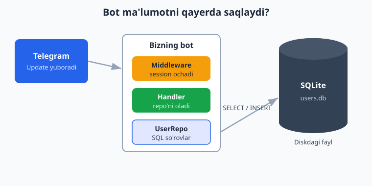
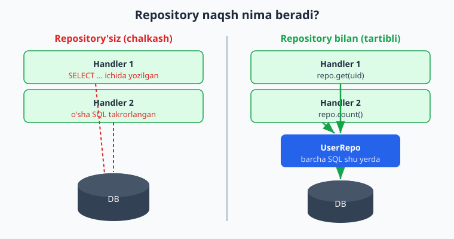
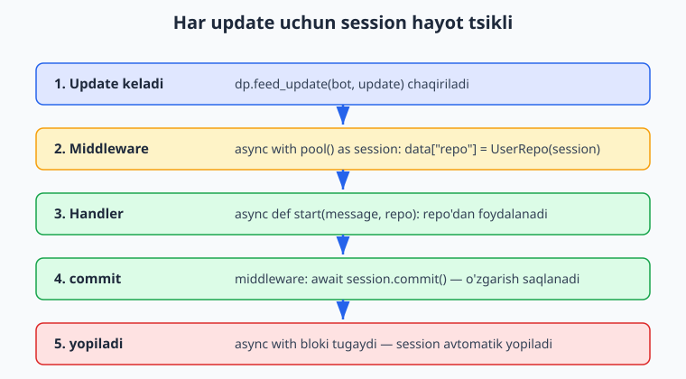

# 10 — Ma'lumotlar bazasi bilan ishlash

[⬅️ Oldingi: 09 — Middleware](./09-middleware.md) · [🏠 README](./README.md) · [Keyingi: 11 — Loyiha tuzilishi va konfiguratsiya ➡️](./11-loyiha-tuzilishi.md)

---

> **Bu bobda:** botimizga "xotira" beramiz. Hozirgacha bot xabarga javob berardi va darrov hammasini unutardi — qayta ishga tushsa, kim oldin yozgani, kim ro'yxatdan o'tgani yo'qoladi. Endi ma'lumotni **ma'lumotlar bazasi**da (DB) doimiy saqlashni o'rganamiz.
>
> Bir muhim narsa: aiogram **asinxron** (`async/await`), shuning uchun DB bilan ham **asinxron** ishlashimiz kerak — aks holda bitta sekin so'rov butun botni "muzlatib" qo'yadi. Shuning uchun oddiy `sqlite3` o'rniga **`aiosqlite`** (async SQLite drayveri) yoki **SQLAlchemy 2.0** (async ORM) ishlatamiz.
>
> Yoritamiz: nega async DB kerakligi; `aiosqlite` bilan jadval yaratish, `INSERT`/`SELECT`/`UPDATE` (CRUD); foydalanuvchini ro'yxatga olish; **repository naqsh** (SQL'ni bitta joyga jamlash); DB sessiyasini **middleware** orqali handler'ga uzatish (dependency injection); SQLAlchemy 2.0 (async) bilan ORM yondashuvi; **oddiy migratsiya** (jadval sxemasi o'zgarganda). SQL'ning o'zini chuqurroq o'rganmoqchi bo'lsangiz — [SQL qo'llanmasi](../sql/README.md) tayyor turibdi.
>
> **Halol eslatma (verifikatsiya):** bu bobdagi DB kodi, repository, middleware orqali DI va handler routing'i mening kompyuterimda **offline** (BotFather token'isiz) — `aiosqlite`, SQLAlchemy 2.0 async va dispatcher'ning `feed_update` mexanizmi orqali **haqiqatan ishga tushirilib tekshirildi**. Jonli Telegram'ga xabar yuborish, long-polling yoki real foydalanuvchi `/start` bosishi esa BotFather token + internet talab qiladi — bunday joylar matnda "illustrativ — jonli bot talab qiladi" deb halol belgilangan.

---

## 10.1. Nega botga ma'lumotlar bazasi kerak?

Tasavvur qiling, botingiz 1000 ta foydalanuvchiga ega. Siz bilmoqchisiz:

- nechta odam botdan foydalanadi?
- kim qachon ro'yxatdan o'tgan?
- har bir foydalanuvchining tili qaysi (uz/en/ru)?
- foydalanuvchi nechta xabar yuborgan?

Bularni Python o'zgaruvchisida (masalan `users = {}` lug'atda) saqlasangiz — bot qayta ishga tushishi bilan **hamma narsa o'chadi**. Server o'chsa, kod yangilansa, xato bo'lsa — xotira bo'sh. Bu jiddiy bot uchun yaramaydi.

**Ma'lumotlar bazasi** — bu ma'lumotni **diskda doimiy** saqlaydigan tizim. Bot qayta ishga tushsa ham ma'lumot joyida turadi.



Boshlash uchun eng oddiy variant — **SQLite**. Bu alohida server talab qilmaydigan, bitta `.db` faylida yashaydigan baza. Botlar uchun a'lo: o'rnatish shart emas, nusxa olish oson, minglab foydalanuvchiga bemalol yetadi. Keyinroq loyiha katta bo'lsa, PostgreSQL'ga o'tasiz — kod deyarli o'zgarmaydi (ayniqsa SQLAlchemy ishlatsangiz).

---

## 10.2. Nega `sqlite3` emas, `aiosqlite`?

Python'da `sqlite3` moduli bor (standart kutubxonada). Lekin u **bloklovchi** (sinxron): so'rov bajarilguncha butun dastur kutadi.

aiogram esa asinxron — bitta jarayonda yuzlab foydalanuvchini "bir vaqtda" xizmat qiladi. Agar handler ichida sinxron `sqlite3` so'rovini chaqirsangiz, o'sha so'rov tugaguncha **boshqa hamma foydalanuvchi kutadi**. Bu botni sekinlashtiradi.

Yechim — **`aiosqlite`**: bu `sqlite3`ning async qobig'i. `await` bilan ishlatiladi va boshqa handlerlarni bloklamaydi.

```bash
pip install aiosqlite
```

Eng kichik misol — baza ochib, jadval yaratamiz:

```python
import asyncio
import aiosqlite


async def main():
    # baza fayli avtomatik yaratiladi (yo'q bo'lsa)
    async with aiosqlite.connect("bot.db") as db:
        await db.execute(
            """
            CREATE TABLE IF NOT EXISTS users (
                id         INTEGER PRIMARY KEY,
                full_name  TEXT    NOT NULL,
                username   TEXT,
                created_at TEXT    DEFAULT (datetime('now'))
            );
            """
        )
        await db.commit()  # o'zgarishni diskka yozish
        print("Jadval tayyor")


asyncio.run(main())
```

Diqqat qiling:

- `async with aiosqlite.connect(...)` — baza ulanishini ochadi va blok tugaganda **avtomatik yopadi**.
- Har bir so'rov `await db.execute(...)` bilan.
- `await db.commit()` — yozish so'rovlari (`INSERT`, `UPDATE`, `DELETE`, `CREATE`) shundan keyingina **doimiy** bo'ladi. `commit` qilmasangiz — o'zgarish yo'qoladi. Bu eng ko'p uchraydigan boshlovchi xato.
- `id INTEGER PRIMARY KEY` — bu yerda Telegram'ning `user.id`'sini ishlatamiz, chunki u har bir foydalanuvchi uchun yagona.

> SQL sintaksisini (`CREATE TABLE`, ustun turlari, `PRIMARY KEY`) batafsil bilmoqchi bo'lsangiz — [SQL: CREATE](../sql/04-create.md) va [ma'lumot turlari](../sql/05-malumot-turlari.md) boblariga qarang. Bu yerda biz faqat botga kerakli minimumni ko'ramiz.

---

## 10.3. CRUD: yaratish, o'qish, yangilash, o'chirish

CRUD — **C**reate (qo'shish), **R**ead (o'qish), **U**pdate (yangilash), **D**elete (o'chirish). Bu DB bilan ishlashning to'rt asosiy amali. Hammasini `aiosqlite` bilan ko'rib chiqamiz.

### Create — foydalanuvchi qo'shish

```python
async def add_user(db, user_id: int, full_name: str, username: str | None) -> bool:
    cur = await db.execute(
        "INSERT OR IGNORE INTO users (id, full_name, username) VALUES (?, ?, ?)",
        (user_id, full_name, username),
    )
    await db.commit()
    return cur.rowcount > 0  # True = yangi qo'shildi, False = oldin bor edi
```

Muhim nuqtalar:

- `?` belgilari — bu **parametr o'rni**. Qiymatlarni kortejda (`(user_id, full_name, username)`) alohida beramiz. **Hech qachon** qiymatni to'g'ridan-to'g'ri SQL satriga `f"... {user_id}"` ko'rinishida qo'shmang — bu **SQL injection** xavfini ochadi. Har doim `?` ishlating.
- `INSERT OR IGNORE` — agar shu `id` allaqachon bo'lsa, xato bermaydi, shunchaki **e'tiborsiz qoldiradi**. Foydalanuvchi `/start`ni yuz marta bossa ham, baza ichida bitta yozuv bo'ladi.
- `cur.rowcount` — nechta qator o'zgarganini aytadi. Yangi qo'shilsa `1`, e'tiborsiz qoldirilsa `0`. Buni "yangi foydalanuvchimi?" deb tekshirishga ishlatamiz.

### Read — foydalanuvchini o'qish

```python
async def get_user(db, user_id: int) -> dict | None:
    db.row_factory = aiosqlite.Row  # qatorni lug'atga o'xshatib o'qish
    async with db.execute("SELECT * FROM users WHERE id = ?", (user_id,)) as cur:
        row = await cur.fetchone()
        return dict(row) if row else None
```

- `db.row_factory = aiosqlite.Row` — bu satrlarni `row["full_name"]` kabi nom bo'yicha o'qishga imkon beradi (aks holda faqat indeks: `row[1]`).
- `fetchone()` — bitta qatorni qaytaradi (yoki `None`).
- Ko'p qator kerak bo'lsa — `fetchall()`.

### Update va Delete

```python
async def set_username(db, user_id: int, username: str) -> None:
    await db.execute("UPDATE users SET username = ? WHERE id = ?", (username, user_id))
    await db.commit()


async def delete_user(db, user_id: int) -> None:
    await db.execute("DELETE FROM users WHERE id = ?", (user_id,))
    await db.commit()
```

`WHERE` shartini **unutmang**: `WHERE`siz `UPDATE`/`DELETE` butun jadvalga ta'sir qiladi. Bu xatoni hamma kamida bir marta qiladi — siz qilmang.

> **Offline tekshirildi.** Yuqoridagi `add_user`/`get_user`/`count_users` funksiyalari `:memory:` bazada ishga tushirilib sinaldi: yangi user qo'shilganda `True`, takror bo'lsa `False`; `get_user(999)` esa `None` qaytardi. CRUD ishlaydi.

---

## 10.4. CRUD'ni botga ulaymiz: ro'yxatga olish

Endi haqiqiy bot — har kim `/start` bosganda uni bazaga yozamiz. Bu eng keng tarqalgan vazifa: "foydalanuvchini ro'yxatga olish".

```python
import asyncio
import logging

import aiosqlite
from aiogram import Bot, Dispatcher, Router
from aiogram.filters import CommandStart
from aiogram.types import Message

router = Router()

DB_PATH = "bot.db"


async def init_db():
    async with aiosqlite.connect(DB_PATH) as db:
        await db.execute(
            """
            CREATE TABLE IF NOT EXISTS users (
                id         INTEGER PRIMARY KEY,
                full_name  TEXT    NOT NULL,
                username   TEXT,
                created_at TEXT    DEFAULT (datetime('now'))
            );
            """
        )
        await db.commit()


@router.message(CommandStart())
async def start_handler(message: Message):
    async with aiosqlite.connect(DB_PATH) as db:
        cur = await db.execute(
            "INSERT OR IGNORE INTO users (id, full_name, username) VALUES (?, ?, ?)",
            (message.from_user.id, message.from_user.full_name, message.from_user.username),
        )
        await db.commit()
        is_new = cur.rowcount > 0

        async with db.execute("SELECT COUNT(*) FROM users") as c:
            (total,) = await c.fetchone()

    if is_new:
        await message.answer(f"Xush kelibsiz! Siz {total}-foydalanuvchisiz.")
    else:
        await message.answer(f"Qaytib kelganingizdan xursandmiz. Jami: {total}.")


async def main():
    logging.basicConfig(level=logging.INFO)
    await init_db()
    bot = Bot(token="BU_YERGA_TOKEN_EMAS")  # token .env dan o'qiladi (10.8-bo'limga qarang)
    dp = Dispatcher()
    dp.include_router(router)
    await dp.start_polling(bot)


if __name__ == "__main__":
    asyncio.run(main())
```

Bu jonli botda quyidagicha ko'rinadi (**illustrativ — jonli Telegram va token talab qiladi**):

```
Foydalanuvchi:  /start
Bot:            Xush kelibsiz! Siz 1-foydalanuvchisiz.

(o'sha odam yana /start bosadi)
Bot:            Qaytib kelganingizdan xursandmiz. Jami: 1.
```

Kod ishlaydi, lekin bitta **muammosi** bor: har handler'da qaytadan `aiosqlite.connect(...)` ochilyapti. Bu:

1. **Takrorlanish** — har handler'da bir xil ulanish kodi.
2. **Sekin** — har xabar uchun yangi ulanish ochiladi/yopiladi.
3. **SQL handler'ga aralashgan** — biznes-mantiq va DB kodi bir joyda.

Buni tozalashning ikki vositasi bor: **repository naqsh** (SQL'ni jamlash) va **middleware** (sessiyani bir marta ochib, handler'ga berish). Keyingi bo'limlarda shularni qilamiz.

---

## 10.5. Repository naqsh — SQL'ni bitta joyga jamlash

Yuqoridagi botda SQL handler ichida turibdi. Agar 10 ta handler bo'lsa va har birida `SELECT`/`INSERT` aralash bo'lsa — kodni o'qish va o'zgartirish qiyinlashadi. Agar ertaga ustun nomini o'zgartirsangiz, 10 joyni tuzatishingiz kerak.

**Repository naqsh**ning g'oyasi sodda: *barcha DB so'rovlarini bitta klassga jamlaymiz*. Handler endi SQL ko'rmaydi — u faqat `repo.get(uid)`, `repo.add_user(...)` kabi **mazmunli metodlarni** chaqiradi.



```python
import aiosqlite


class UserRepo:
    """Foydalanuvchilar bilan bog'liq barcha DB amallari shu yerda."""

    def __init__(self, db: aiosqlite.Connection) -> None:
        self.db = db

    async def get(self, user_id: int) -> dict | None:
        self.db.row_factory = aiosqlite.Row
        async with self.db.execute("SELECT * FROM users WHERE id = ?", (user_id,)) as cur:
            row = await cur.fetchone()
            return dict(row) if row else None

    async def add_if_absent(self, user_id: int, full_name: str, username: str | None) -> bool:
        cur = await self.db.execute(
            "INSERT OR IGNORE INTO users (id, full_name, username) VALUES (?, ?, ?)",
            (user_id, full_name, username),
        )
        return cur.rowcount > 0

    async def count(self) -> int:
        async with self.db.execute("SELECT COUNT(*) FROM users") as cur:
            (n,) = await cur.fetchone()
            return n
```

Endi handler ancha toza ko'rinadi:

```python
@router.message(CommandStart())
async def start_handler(message: Message, repo: UserRepo):
    is_new = await repo.add_if_absent(
        message.from_user.id, message.from_user.full_name, message.from_user.username
    )
    total = await repo.count()
    text = (
        f"Xush kelibsiz! Siz {total}-foydalanuvchisiz."
        if is_new
        else f"Qaytib kelganingizdan xursandmiz. Jami: {total}."
    )
    await message.answer(text)
```

Diqqat: handler `repo: UserRepo` parametrini **so'rab oldi**, lekin uni o'zi yaratmadi. Bu `repo` qayerdan keladi? — Mana shu yerga **middleware** kiradi.

---

## 10.6. DB sessiyasini middleware orqali handler'ga uzatish

[9-bobda](./09-middleware.md) middleware bilan tanishgansiz: u handler chaqirilishidan **oldin** ishlaydi va `data` lug'atiga qiymat qo'sha oladi. aiogram esa handler parametrlarini `data` kalitlari bilan **avtomatik moslashtiradi** (dependency injection). Ya'ni middleware `data["repo"] = ...` qilsa, handler `async def h(message, repo)` deb yozsa — `repo` o'sha qiymatga to'ladi.

Bu bizga ideal: middleware har update uchun **DB sessiyasini ochadi**, `UserRepo` yasaydi, `data`ga qo'yadi, handler tugagach `commit` qiladi va sessiyani yopadi.



```python
from typing import Any, Awaitable, Callable

import aiosqlite
from aiogram import BaseMiddleware
from aiogram.types import TelegramObject


class DbSessionMiddleware(BaseMiddleware):
    def __init__(self, db_path: str) -> None:
        self.db_path = db_path

    async def __call__(
        self,
        handler: Callable[[TelegramObject, dict[str, Any]], Awaitable[Any]],
        event: TelegramObject,
        data: dict[str, Any],
    ) -> Any:
        async with aiosqlite.connect(self.db_path) as db:
            data["repo"] = UserRepo(db)      # handler'ga "repo" ni beramiz
            result = await handler(event, data)
            await db.commit()                 # handler tugagach saqlaymiz
            return result
```

Middleware'ni dispatcher'ga ulaymiz — `update` darajasida, ya'ni har turdagi update'ga (message, callback va h.k.):

```python
dp = Dispatcher()
dp.include_router(router)
dp.update.middleware(DbSessionMiddleware(DB_PATH))
```

> aiogram 3.x'da `__call__` imzosi **aniq shunday**: `(self, handler, event, data)`. Middleware'ni `router.message.middleware(...)` (faqat xabar uchun) yoki `dp.update.middleware(...)` (hamma uchun) bilan ulaysiz. `data` lug'atiga qo'ygan qiymatlaringiz handler parametrlariga mos kelsa avtomatik uzatiladi. Tekshirildi: docs.aiogram.dev — Middlewares va Dependency Injection bo'limlari.

**Nega bu yaxshi?** Endi:

- Handler DB'ni qanday ochish-yopishni bilmaydi — faqat `repo`ni ishlatadi.
- Sessiya **bir marta** ochiladi, handler tugagach yopiladi — resurs tejaladi.
- `commit` **markazlashgan** — har handler'da `await db.commit()` yozish unutilmaydi.
- Ertaga SQLite'dan PostgreSQL'ga o'tsangiz — faqat middleware va repo o'zgaradi, handlerlar emas.

> **Offline tekshirildi (eng muhim qism).** SQLAlchemy variantida (10.7) bu butun zanjir — `DbSessionMiddleware` → handler DI → repository — soxta token (`"123456:AAH-FakeTest_abc"`) bilan `Bot` yaratib, `dp.feed_update(bot, Update(...))` orqali uchta `/start` update'i uzatilib sinaldi. Natija: 1-update "Siz 1-foydalanuvchisiz", 2-update (o'sha user) "Qaytib kelganingizdan xursandmiz. Jami: 1", 3-update (boshqa user) "Siz 2-foydalanuvchisiz" — ya'ni routing, DI va ro'yxatga olish mantig'i to'g'ri ishladi. Bu test BotFather token'isiz bajarildi.

---

## 10.7. SQLAlchemy 2.0 (async) — ORM yondashuvi

`aiosqlite` — bu "yalang'och" SQL: siz `SELECT`/`INSERT` yozasiz. Loyiha o'sgani sayin SQL qatorlarini boshqarish zerikarli bo'ladi. **ORM** (Object-Relational Mapping) jadval qatorini Python obyektiga aylantiradi: `User` klassi = `users` jadvali, `user.full_name` = ustun.

aiogram bilan eng ko'p ishlatiladigan ORM — **SQLAlchemy 2.0**, uning async rejimida. O'rnatish:

```bash
pip install sqlalchemy aiosqlite greenlet
```

(SQLAlchemy SQLite uchun ham aynan `aiosqlite` drayverini ishlatadi; `greenlet` async ishi uchun kerak.)

### Model — jadvalni Python klassi sifatida

```python
from datetime import datetime

from sqlalchemy import BigInteger, String, func, select
from sqlalchemy.ext.asyncio import AsyncSession, async_sessionmaker, create_async_engine
from sqlalchemy.orm import DeclarativeBase, Mapped, mapped_column


class Base(DeclarativeBase):
    pass


class User(Base):
    __tablename__ = "users"

    id: Mapped[int] = mapped_column(BigInteger, primary_key=True)  # Telegram user id
    full_name: Mapped[str] = mapped_column(String(128))
    username: Mapped[str | None] = mapped_column(String(64), nullable=True)
    created_at: Mapped[datetime] = mapped_column(server_default=func.now())
```

Bu 2.0 uslubi: `Mapped[...]` va `mapped_column(...)`. Eski 1.x uslubidagi `Column(...)` to'g'ridan-to'g'ri atributga (`id = Column(Integer, ...)`) endi tavsiya etilmaydi — biz 2.0 idiomini ishlatamiz.

> Telegram `user.id` katta bo'lishi mumkin, shuning uchun `Integer` emas `BigInteger`. PostgreSQL'da bu muhim; SQLite'da farqi yo'q, ammo bir xil model ikkala bazada ham to'g'ri ishlaydi.

### Engine va session yaratish

```python
def make_engine(url: str = "sqlite+aiosqlite:///bot.db"):
    return create_async_engine(url)


def make_sessionmaker(engine) -> async_sessionmaker[AsyncSession]:
    return async_sessionmaker(engine, expire_on_commit=False)


async def create_tables(engine) -> None:
    async with engine.begin() as conn:
        await conn.run_sync(Base.metadata.create_all)
```

- `create_async_engine` — async dvigatel. URL `sqlite+aiosqlite:///bot.db` ko'rinishida (`+aiosqlite` async drayverni bildiradi).
- `async_sessionmaker(..., expire_on_commit=False)` — sessiya "fabrikasi". `expire_on_commit=False` muhim: `commit`'dan keyin obyekt atributlarini (`user.full_name`) yana o'qiganda kutilmagan qo'shimcha so'rov bo'lmaydi.
- `create_tables` — modeldan jadvallarni yaratadi (bot ishga tushganda bir marta chaqiriladi).

### Repository — endi ORM bilan

```python
class UserRepo:
    def __init__(self, session: AsyncSession) -> None:
        self.session = session

    async def get(self, user_id: int) -> User | None:
        return await self.session.get(User, user_id)

    async def add_if_absent(self, user_id: int, full_name: str, username: str | None) -> bool:
        if await self.get(user_id) is not None:
            return False
        self.session.add(User(id=user_id, full_name=full_name, username=username))
        await self.session.flush()
        return True

    async def count(self) -> int:
        return await self.session.scalar(select(func.count()).select_from(User)) or 0
```

Endi SQL yo'q — `session.get(User, id)`, `session.add(User(...))`, `select(...)`. ORM SQL'ni o'zi generatsiya qiladi.

### Middleware — SQLAlchemy sessiyasi bilan

```python
class DbSessionMiddleware(BaseMiddleware):
    def __init__(self, session_pool: async_sessionmaker) -> None:
        self.session_pool = session_pool

    async def __call__(self, handler, event, data):
        async with self.session_pool() as session:
            data["session"] = session
            data["repo"] = UserRepo(session)
            result = await handler(event, data)
            await session.commit()
            return result
```

Ulanishi:

```python
engine = make_engine("sqlite+aiosqlite:///bot.db")
await create_tables(engine)
Session = make_sessionmaker(engine)

dp = Dispatcher()
dp.include_router(router)
dp.update.middleware(DbSessionMiddleware(Session))
```

Handler **bir xil qoladi** — `async def start_handler(message, repo): ...`. Mana ORM va repository naqshning kuchi: pastki qatlam (SQLite SQL → ORM) o'zgardi, lekin handler'lar tegmadi.

> **Offline tekshirildi.** Yuqoridagi `User` modeli, `UserRepo` (ORM) va `DbSessionMiddleware` (SQLAlchemy) fayl bazasida (`sqlite+aiosqlite:///...`) ishga tushirildi: `add_if_absent` yangi user uchun `True`, takror uchun `False` qaytardi; ikkinchi sessiyada `count() == 2`, `get(100).full_name == "Ali Valiyev"`, `created_at` to'lgan, `get(999) is None`. Hammasi to'g'ri.

### Qaysi birini tanlash — `aiosqlite` yoki SQLAlchemy?

| | `aiosqlite` | SQLAlchemy 2.0 |
|---|---|---|
| O'rganish | Oson, sof SQL | Murakkabroq |
| Kichik bot | A'lo, ortiqcha narsa yo'q | Ortiqcha bo'lishi mumkin |
| Katta loyiha | SQL ko'payadi | Modellar tartibli |
| Baza almashtirish | Qo'lda | Deyarli avtomatik (URL o'zgaradi) |
| Migratsiya vositasi | Qo'lda (10.8) | Alembic (kuchli) |

Boshlovchi uchun maslahat: **kichik bot — `aiosqlite`**, jiddiy/o'sadigan loyiha — **SQLAlchemy**. Ikkalasida ham repository + middleware naqshi bir xil qoladi.

---

## 10.8. Oddiy migratsiya — sxema o'zgarganda

Bot ishlab turibdi, foydalanuvchilar bor. Endi siz `users` jadvaliga yangi ustun (masalan `lang` — til) qo'shmoqchisiz. Ammo `CREATE TABLE IF NOT EXISTS` allaqachon mavjud jadvalni **o'zgartirmaydi** — u faqat yo'q bo'lsa yaratadi. Eski jadvalda yangi ustun paydo bo'lmaydi.

Yechim — **migratsiya**: sxemani bosqichma-bosqich, **versiyalab** o'zgartirish. SQLite'da buni `PRAGMA user_version` (bazaga o'rnatilgan versiya hisoblagichi) bilan qo'lda qilish mumkin:

```python
import aiosqlite

# Har bir migratsiya — bitta qadam. Tartibni HECH QACHON o'zgartirmang, faqat oxiriga qo'shing.
MIGRATIONS = [
    "CREATE TABLE users (id INTEGER PRIMARY KEY, full_name TEXT NOT NULL);",  # v1
    "ALTER TABLE users ADD COLUMN username TEXT;",                            # v2
    "ALTER TABLE users ADD COLUMN is_banned INTEGER DEFAULT 0;",             # v3
]


async def apply_migrations(db: aiosqlite.Connection) -> int:
    async with db.execute("PRAGMA user_version") as cur:
        (current,) = await cur.fetchone()
    applied = 0
    for version, sql in enumerate(MIGRATIONS, start=1):
        if version > current:           # faqat hali qo'llanmaganlar
            await db.executescript(sql)
            await db.execute(f"PRAGMA user_version = {version}")
            applied += 1
    await db.commit()
    return applied
```

Mantiq:

- `PRAGMA user_version` — baza hozir qaysi versiyada ekanini saqlaydi (boshida `0`).
- Har migratsiya tartib raqamiga ega (1, 2, 3...). `version > current` bo'lganini qo'llaymiz.
- Qo'llangach versiyani oshiramiz. Ikkinchi marta chaqirilsa — hech narsa qo'llanmaydi (**idempotent**).
- Yangi ustun kerak bo'lsa — `MIGRATIONS` ro'yxatining **oxiriga** yangi `ALTER TABLE ...` qo'shasiz. Eski qadamlarga tegmaysiz.

Bot ishga tushganda `await apply_migrations(db)` ni bir marta chaqirasiz — baza avtomatik so'nggi versiyaga "ko'tariladi".

> **Offline tekshirildi.** `:memory:` bazada: birinchi chaqiruvda 3 migratsiya qo'llandi (`user_version=3`), ikkinchi chaqiruvda 0 (idempotent). `PRAGMA table_info(users)` ustunlari aynan `['id', 'full_name', 'username', 'is_banned']` chiqdi.

SQLAlchemy ishlatsangiz, qo'lda emas — **Alembic** vositasidan foydalanasiz: u model o'zgarishini avtomatik aniqlab, migratsiya skriptini yozadi. Alembic alohida katta mavzu; boshlovchi uchun yuqoridagi `PRAGMA user_version` usuli soddaligi bilan a'lo.

---

## 10.9. Amaliy maslahatlar (qisqacha)

- **Har doim `?` parametr** ishlating, `f"..."` bilan SQL yasamang. Bu SQL injection'dan himoya.
- **`commit`ni unutmang** — yozish so'rovlari `commit`'siz saqlanmaydi. Middleware'da markazlashtirsangiz, unutmaslik osonroq.
- **`WHERE`ni unutmang** `UPDATE`/`DELETE`'da.
- **Indeks**: tez-tez `WHERE username = ?` bo'yicha qidirsangiz, `username` ustuniga indeks qo'shing (`CREATE INDEX ...`). Bu katta jadvalda qidiruvni tezlashtiradi — [SQL: Indekslar](../sql/21-indekslar.md).
- **Bloklovchi kodni handler'da chaqirmang**. Agar majburan sinxron kutubxona ishlatsangiz, `asyncio.to_thread(...)` ichida bajaring.
- Node.js'da bot yozsangiz, bu naqshlar deyarli bir xil (Prisma/Knex + middleware) — [Node.js qo'llanmasi](../nodejs/README.md) bilan solishtirib ko'rishingiz mumkin.

---

## Mashqlar

> Maslahat: mashqlarni `aiosqlite` bilan `:memory:` bazada sinab ko'ring — fayl yaratmasdan tez tekshirasiz. Handler mashqlarini 10.6/10.7'dagi `feed_update` namunasi bilan token'siz tekshirish mumkin.

### Oson

1. `messages` jadvalini yarating: `id` (avtomatik), `user_id`, `text`, `created_at`. `CREATE TABLE`'ni yozing.
2. `aiosqlite` bilan `add_message(db, user_id, text)` funksiyasini yozing (`INSERT`, `?` parametrlar bilan, `commit`).
3. `get_messages(db, user_id)` — foydalanuvchining barcha xabarlarini ro'yxat (`list[dict]`) ko'rinishida qaytaring (`row_factory` + `fetchall`).
4. `count_users(db)` funksiyasini yozing — jadvaldagi foydalanuvchilar sonini qaytaradi.
5. Nima uchun handler ichida `f"INSERT ... VALUES ({user_id})"` yozish xavfli? Bir jumlada tushuntiring va to'g'ri variantini yozing.

### O'rta

6. `UserRepo`ga `set_lang(self, user_id, lang)` metodini qo'shing. Foydalanuvchi tilini `UPDATE` bilan o'zgartirsin.
7. **UPSERT**: `set_lang` shunday bo'lsinki, foydalanuvchi bazada yo'q bo'lsa qo'shsin, bor bo'lsa yangilasin. `INSERT ... ON CONFLICT(id) DO UPDATE SET ...` ishlating.
8. `DbSessionMiddleware` (aiosqlite versiyasi) yozing va `dp.update.middleware(...)` bilan ulang. Handler `repo`ni parametr sifatida olsin.
9. `top_users(db, limit=5)` — eng ko'p xabar yuborgan 5 foydalanuvchini qaytaring (`ORDER BY ... DESC LIMIT ?`). (`users` jadvalida `msg_count` ustuni bor deb faraz qiling.)
10. SQLAlchemy 2.0 modelida `Message` klassini yozing: `id`, `user_id` (`User`ga `ForeignKey`), `text`. `mapped_column` va `Mapped[...]` ishlating.

### Qiyin

11. Migratsiya tizimini kengaytiring: `MIGRATIONS` ro'yxatiga `lang TEXT DEFAULT 'uz'` qo'shadigan v4 qadamini qo'shing va `apply_migrations`ni qayta chaqirilganda faqat v4 qo'llanishini (1 qaytarishini) tekshiring.
12. 10.6'dagi handler+middleware botini token'siz `feed_update` bilan sinang: ikki marta `/start` (bitta user) va bir marta boshqa user'dan yuborib, javoblar to'g'riligini `assert` qiling. (10.6/10.7 namunasidan foydalaning.)
13. `UserRepo`ga `ban(self, user_id)` va `is_banned(self, user_id)` metodlarini qo'shing. So'ng "ban tekshiruvchi" **outer middleware** yozing: agar foydalanuvchi ban qilingan bo'lsa, handler **umuman chaqirilmasin** (`return` qiling, `handler(event, data)`ni chaqirmang).

---

<details markdown="1">
<summary>Yechimlar</summary>

### Oson

**1.**
```sql
CREATE TABLE IF NOT EXISTS messages (
    id         INTEGER PRIMARY KEY AUTOINCREMENT,
    user_id    INTEGER NOT NULL,
    text       TEXT    NOT NULL,
    created_at TEXT    DEFAULT (datetime('now'))
);
```
`INTEGER PRIMARY KEY AUTOINCREMENT` — `id` har `INSERT`da avtomatik o'sadi.

**2.**
```python
async def add_message(db, user_id: int, text: str) -> None:
    await db.execute(
        "INSERT INTO messages (user_id, text) VALUES (?, ?)",
        (user_id, text),
    )
    await db.commit()
```

**3.**
```python
import aiosqlite

async def get_messages(db, user_id: int) -> list[dict]:
    db.row_factory = aiosqlite.Row
    async with db.execute(
        "SELECT * FROM messages WHERE user_id = ? ORDER BY id", (user_id,)
    ) as cur:
        rows = await cur.fetchall()
        return [dict(r) for r in rows]
```

**4.**
```python
async def count_users(db) -> int:
    async with db.execute("SELECT COUNT(*) FROM users") as cur:
        (n,) = await cur.fetchone()
        return n
```

**5.** Chunki foydalanuvchi `user_id` o'rniga zararli matn (masalan `1); DROP TABLE users; --`) yuborsa, u SQL'ga aralashib jadvalni o'chirishi mumkin — bu **SQL injection**. To'g'ri variant qiymatni `?` orqali alohida uzatadi:
```python
await db.execute("INSERT INTO users (id) VALUES (?)", (user_id,))
```
`?` ishlatilganda drayver qiymatni "ma'lumot" deb qabul qiladi, hech qachon SQL kod sifatida bajarmaydi.

### O'rta

**6.**
```python
async def set_lang(self, user_id: int, lang: str) -> None:
    await self.db.execute(
        "UPDATE users SET lang = ? WHERE id = ?", (lang, user_id)
    )
    # commit middleware'da yoki shu yerda:
    await self.db.commit()
```

**7.** UPSERT — bazada bor/yo'qligiga qaramay ishlaydi:
```python
async def set_lang(self, user_id: int, full_name: str, lang: str) -> None:
    await self.db.execute(
        """
        INSERT INTO users (id, full_name, lang) VALUES (?, ?, ?)
        ON CONFLICT(id) DO UPDATE SET lang = excluded.lang
        """,
        (user_id, full_name, lang),
    )
    await self.db.commit()
```
`excluded` — bu `INSERT` qilmoqchi bo'lgan yangi qiymatga ishora. Offline sinaldi: `set_lang(1, "Ali", "uz")` keyin `set_lang(1, "Ali", "en")` → bazada `lang == "en"`.

**8.**
```python
from typing import Any, Awaitable, Callable
import aiosqlite
from aiogram import BaseMiddleware
from aiogram.types import TelegramObject

class DbSessionMiddleware(BaseMiddleware):
    def __init__(self, db_path: str) -> None:
        self.db_path = db_path

    async def __call__(
        self,
        handler: Callable[[TelegramObject, dict[str, Any]], Awaitable[Any]],
        event: TelegramObject,
        data: dict[str, Any],
    ) -> Any:
        async with aiosqlite.connect(self.db_path) as db:
            data["repo"] = UserRepo(db)
            result = await handler(event, data)
            await db.commit()
            return result

# ulash:
dp.update.middleware(DbSessionMiddleware("bot.db"))

# handler:
@router.message(CommandStart())
async def start(message, repo: UserRepo):
    await repo.add_if_absent(message.from_user.id, message.from_user.full_name, message.from_user.username)
    await message.answer("Ro'yxatga olindingiz")
```

**9.**
```python
import aiosqlite

async def top_users(db, limit: int = 5) -> list[dict]:
    db.row_factory = aiosqlite.Row
    async with db.execute(
        "SELECT full_name, msg_count FROM users ORDER BY msg_count DESC LIMIT ?",
        (limit,),
    ) as cur:
        return [dict(r) for r in await cur.fetchall()]
```
Offline sinaldi: 5 va 2 marta xabar yuborilganda eng faol `Olim` (5) chiqdi.

**10.**
```python
from sqlalchemy import BigInteger, ForeignKey, String
from sqlalchemy.orm import Mapped, mapped_column

class Message(Base):
    __tablename__ = "messages"

    id: Mapped[int] = mapped_column(primary_key=True, autoincrement=True)
    user_id: Mapped[int] = mapped_column(BigInteger, ForeignKey("users.id"))
    text: Mapped[str] = mapped_column(String(4096))
```

### Qiyin

**11.**
```python
MIGRATIONS = [
    "CREATE TABLE users (id INTEGER PRIMARY KEY, full_name TEXT NOT NULL);",  # v1
    "ALTER TABLE users ADD COLUMN username TEXT;",                            # v2
    "ALTER TABLE users ADD COLUMN is_banned INTEGER DEFAULT 0;",             # v3
    "ALTER TABLE users ADD COLUMN lang TEXT DEFAULT 'uz';",                  # v4 (yangi)
]

# v3 gacha qo'llangan bazada qayta chaqirsangiz:
n = await apply_migrations(db)
assert n == 1            # faqat v4 qo'llanadi
# user_version endi 4, lang ustuni qo'shildi
```
Mantiq o'zgarmaydi: `version > current` faqat hali qo'llanmaganlarni tanlaydi.

**12.**
```python
import asyncio
from datetime import datetime
from aiogram import Bot, Dispatcher, Router
from aiogram.filters import CommandStart
from aiogram.fsm.storage.memory import MemoryStorage
from aiogram.types import Chat, Message, Update, User as TgUser

SENT = []
router = Router()

@router.message(CommandStart())
async def start(message: Message, repo: UserRepo):
    is_new = await repo.add_if_absent(message.from_user.id, message.from_user.full_name, message.from_user.username)
    total = await repo.count()
    SENT.append(f"{'yangi' if is_new else 'qayta'}:{total}")

def msg(uid, name):
    return Message(message_id=1, date=datetime.now(),
                   chat=Chat(id=uid, type="private"),
                   from_user=TgUser(id=uid, is_bot=False, first_name=name),
                   text="/start")

async def main():
    # ... engine, Session, create_tables tayyorlangan deb faraz qiling ...
    bot = Bot(token="123456:AAH-FakeTest_abc")    # SOXTA token
    dp = Dispatcher(storage=MemoryStorage())
    dp.include_router(router)
    dp.update.middleware(DbSessionMiddleware(Session))
    await dp.feed_update(bot, Update(update_id=1, message=msg(100, "Ali")))
    await dp.feed_update(bot, Update(update_id=2, message=msg(100, "Ali")))
    await dp.feed_update(bot, Update(update_id=3, message=msg(200, "Olim")))
    await bot.session.close()
    assert SENT == ["yangi:1", "qayta:1", "yangi:2"]
    print("OK")

asyncio.run(main())
```
Bu aynan shu bobda offline sinaldi: routing, DI va ro'yxatga olish mantig'i to'g'ri. Token soxta — Telegram'ga hech narsa yuborilmaydi.

**13.**
```python
# repo metodlari:
async def ban(self, user_id: int) -> None:
    await self.db.execute("UPDATE users SET is_banned = 1 WHERE id = ?", (user_id,))
    await self.db.commit()

async def is_banned(self, user_id: int) -> bool:
    async with self.db.execute("SELECT is_banned FROM users WHERE id = ?", (user_id,)) as cur:
        row = await cur.fetchone()
        return bool(row and row[0])

# outer middleware — handler chaqirilishidan OLDIN va filterlardan oldin ishlaydi:
class BanMiddleware(BaseMiddleware):
    async def __call__(self, handler, event, data):
        repo = data.get("repo")
        user = data.get("event_from_user")   # aiogram avtomatik beradi
        if repo and user and await repo.is_banned(user.id):
            return            # handler CHAQIRILMAYDI -> foydalanuvchi e'tiborsiz
        return await handler(event, data)

# ulash tartibi muhim: avval DB (repo kerak), keyin ban:
dp.update.outer_middleware(DbSessionMiddleware(...))   # repo'ni qo'yadi
dp.update.outer_middleware(BanMiddleware())            # repo'dan foydalanadi
```
`outer_middleware` filterlardan **oldin** ishlagani uchun ban qilingan foydalanuvchining xabari hatto handler filterlarigacha yetib bormaydi. `handler(event, data)`ni chaqirmasdan `return` qilsangiz — zanjir to'xtaydi.

</details>

---

[⬅️ Oldingi: 09 — Middleware](./09-middleware.md) · [🏠 README](./README.md) · [Keyingi: 11 — Loyiha tuzilishi va konfiguratsiya ➡️](./11-loyiha-tuzilishi.md)
