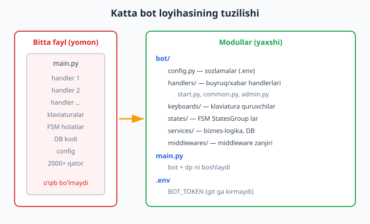
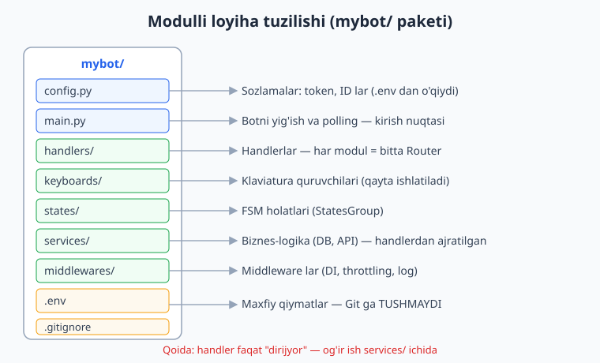
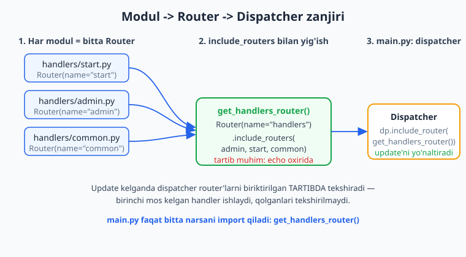
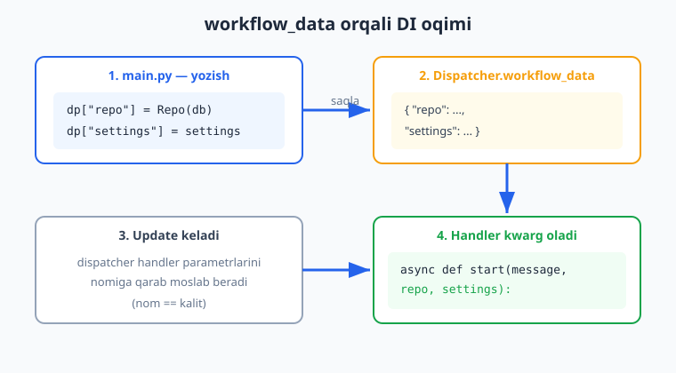
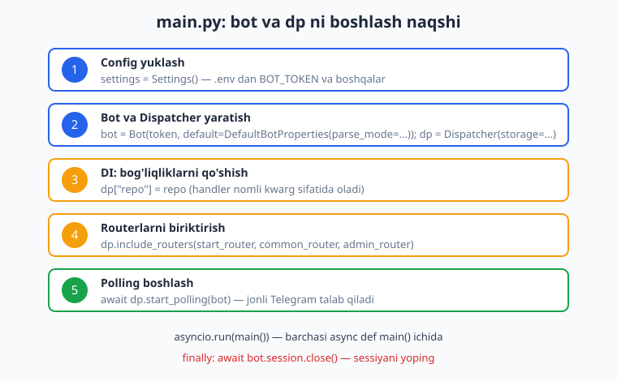

# 11 — Loyiha tuzilishi va konfiguratsiya

[⬅️ Oldingi: 10 — Ma'lumotlar bazasi bilan ishlash](./10-malumotlar-bazasi.md) · [🏠 README](./README.md) · [Keyingi: 12 — Maxsus xususiyatlar ➡️](./12-maxsus-xususiyatlar.md)

---

> **Bu bobda:** shu paytgacha biz hamma narsani bitta `main.py` faylga yozib keldik — bu o'rganish uchun qulay, lekin bot kattalashgani sayin bitta fayl o'qib bo'lmas darajaga yetadi. Bu bobda botni **professional, modullashtirilgan** ko'rinishga keltiramiz: `handlers/`, `keyboards/`, `states/`, `services/`, `middlewares/` paketlari va `config.py`. Maxfiy ma'lumotlarni (token!) kodga emas, `.env` fayliga olib chiqamiz va uni `pydantic-settings` bilan o'qiymiz. Dispatcher'ning `workflow_data` lug'ati orqali **dependency injection (DI)** — ya'ni bog'liqliklarni (DB ulanishi, sozlamalar, servislar) handlerlarga avtomatik uzatishni o'rganamiz. Va nihoyat, `bot` bilan `dp` ni to'g'ri boshlaydigan `main.py` naqshini va scaling (kengayish) tushunchalarini ko'rib chiqamiz.
>
> **Halol eslatma:** bu bobdagi tuzilish, routerlarni biriktirish, `pydantic-settings` config, `workflow_data` DI va handler yo'naltirish mantig'i `feed_update` mock Update orqali **offline tekshirilgan** (token va internet kerak emas). Faqat `await dp.start_polling(bot)` va `await message.answer(...)` jonli — ular haqiqiy ishlashi uchun BotFather token va internet talab qiladi; shuning uchun offline testlarda `message.answer` o'rniga natijani ro'yxatga yozamiz va bu qatorlarni "illustrativ" deb belgilab qo'yamiz.

---

## Nima uchun bitta fayl yetmaydi

8-10-boblarda yozgan botingiz allaqachon 200-300 qatorga yetgandir. Hozircha bardosh berish mumkin. Ammo real botda:

- 30-50 ta handler bo'ladi (har bir buyruq, har bir tugma, har bir holat),
- klaviaturalar o'nlab joyda ishlatiladi,
- FSM holatlari ko'p,
- DB so'rovlari, tashqi API chaqiruvlari, biznes-logika qo'shiladi.

Hamma narsa bitta `main.py` da bo'lsa, fayl 2000+ qatorga o'sadi va siz unda kerakli joyni topolmay qolasiz. Yechim — **modullashtirish**: bog'liq kodni alohida fayllarga bo'lib qo'yish.



> Eslatma: bu xuddi Python loyihalarida paketlarga bo'lish bilan bir xil g'oya — agar paket, modul va `__init__.py` tushunchalari xira bo'lsa, [Python qo'llanmasi](../python/README.md) ga qaytib qarang. Node.js'da bot loyihasi qanday bo'linishini esa [Node.js qo'llanmasi](../nodejs/README.md) da ko'rishingiz mumkin.

---

## Tavsiya etilgan loyiha tuzilishi

Mana o'rta-katta aiogram 3.x boti uchun amaliy tuzilish:

```text
mybot/
├── .env                 # maxfiy sozlamalar (git ga KIRMAYDI)
├── .env.example         # namuna (git ga kiradi, token YO'Q)
├── .gitignore
├── requirements.txt
├── config.py            # Settings — .env ni o'qiydi
├── main.py              # bot + dp ni boshlaydi (kirish nuqtasi)
└── bot/
    ├── __init__.py
    ├── handlers/
    │   ├── __init__.py  # barcha routerlarni yig'adi
    │   ├── start.py     # /start, /help
    │   ├── common.py    # umumiy xabarlar, echo
    │   └── admin.py     # faqat admin buyruqlari
    ├── keyboards/
    │   ├── __init__.py
    │   ├── inline.py    # InlineKeyboardBuilder funksiyalari
    │   └── reply.py     # ReplyKeyboardBuilder funksiyalari
    ├── states/
    │   ├── __init__.py
    │   └── registration.py  # StatesGroup lar
    ├── services/
    │   ├── __init__.py
    │   └── users.py     # biznes-logika, DB bilan ishlash
    └── middlewares/
        ├── __init__.py
        └── logging.py   # middleware lar
```

Har bir papkaning vazifasi:

| Papka | Nima saqlanadi | Misol |
|-------|----------------|-------|
| `handlers/` | Router'lar va handler funksiyalari (kelgan update'ga javob) | `@router.message(CommandStart())` |
| `keyboards/` | Klaviatura quruvchi funksiyalar | `def main_menu() -> InlineKeyboardMarkup` |
| `states/` | FSM `StatesGroup` lar | `class Registration(StatesGroup)` |
| `services/` | Biznes-logika, DB, tashqi API — Telegram'ga bog'liq emas | `async def create_user(...)` |
| `middlewares/` | `BaseMiddleware` voris klasslari | throttling, logging, DB sessiya |
| `config.py` | Sozlamalar klassi | `class Settings(BaseSettings)` |
| `main.py` | Kirish nuqtasi — hammasini ulaydi va polling boshlaydi | `asyncio.run(main())` |



**Asosiy qoida:** `services/` Telegram haqida bilmasligi kerak. U faqat ma'lumot bilan ishlaydi (foydalanuvchini bazaga yozish, narxni hisoblash). Telegram'ga javob berishni `handlers/` qiladi. Bu ajratish kodni test qilishni va keyinroq, masalan, web-versiya qo'shishni osonlashtiradi.

---

## Routerlar bilan modullashtirish

aiogram 3.x da modullashtirishning kaliti — **Router**. Har bir fayl o'z `Router` ini yaratadi, handlerlarni o'sha router'ga ulaydi, so'ng `main.py` barcha router'larni `Dispatcher` ga biriktiradi.



### handlers/start.py

```python
from aiogram import Router
from aiogram.filters import CommandStart, Command
from aiogram.types import Message

router = Router(name="start")  # name — log'da qaysi router ishlaganini ko'rish uchun


@router.message(CommandStart())
async def cmd_start(message: Message) -> None:
    await message.answer("Salom! Men modullashtirilgan botman.")


@router.message(Command("help"))
async def cmd_help(message: Message) -> None:
    await message.answer("Mavjud buyruqlar: /start, /help")
```

### handlers/common.py

```python
from aiogram import Router, F
from aiogram.types import Message

router = Router(name="common")


@router.message(F.text)
async def echo(message: Message) -> None:
    await message.answer(f"Siz yozdingiz: {message.text}")
```

### handlers/admin.py

```python
from aiogram import Router
from aiogram.filters import Command
from aiogram.types import Message

router = Router(name="admin")


@router.message(Command("stats"))
async def cmd_stats(message: Message) -> None:
    # Bu yerda faqat admin uchun filtr keyinroq qo'shiladi (middleware orqali)
    await message.answer("Statistika: ...")
```

### handlers/__init__.py — routerlarni yig'ish

Eng qulay naqsh — `handlers` paketi ichida bitta "asosiy router" yaratib, unga barcha sub-router'larni biriktirish. Shunda `main.py` faqat bitta narsani import qiladi:

```python
from aiogram import Router

from .start import router as start_router
from .common import router as common_router
from .admin import router as admin_router


def get_handlers_router() -> Router:
    router = Router(name="handlers")
    # DIQQAT: tartib muhim — yuqoridagi router birinchi tekshiriladi.
    # admin va start ni common (echo) dan OLDIN qo'shamiz, aks holda
    # echo barcha matnni "yutib" yuboradi.
    router.include_routers(admin_router, start_router, common_router)
    return router
```

`include_routers(*routers)` — bir nechta router'ni bir martaga biriktiradi (aiogram 3.x). Bitta-bitta qo'shmoqchi bo'lsangiz, `include_router(r)` ni ishlatasiz.

> **Tartib nega muhim?** Dispatcher update kelganida router'larni biriktirilgan **tartibda** birma-bir tekshiradi. Birinchi mos kelgan handler ishlaydi va qolganlar tekshirilmaydi. `common.py` dagi `F.text` har qanday matnga mos keladi, shu sababli uni **oxirida** qo'yamiz, aks holda `/start` ham unga tushib qoladi.

---

## Konfiguratsiya: token kodda emas, `.env` da

Eng katta xavfsizlik xatosi — token (yoki DB parol, API kalit) ni to'g'ridan-to'g'ri kodga yozish:

```python
# ❌ HECH QACHON BUNDAY QILMANG
bot = Bot(token="123456789:AAH-real-token-here")
```

Agar bu kodni GitHub'ga yuborsangiz, tokeningiz o'g'irlanadi va botingizni boshqalar boshqaradi. To'g'ri yo'l — maxfiy ma'lumotlarni **`.env`** fayliga olish va uni `.gitignore` ga qo'shish.

### .env fayli

```text
BOT_TOKEN=123456789:AAH-sizning-haqiqiy-tokeningiz
ADMIN_IDS=[111111111,222222222]
DB_PATH=bot.db
```

### .gitignore

```text
.env
*.db
__pycache__/
*.pyc
```

### .env.example (git ga kiradi, qiymatlarsiz)

```text
BOT_TOKEN=
ADMIN_IDS=[]
DB_PATH=bot.db
```

`.env.example` ni git'ga qo'yasiz, shunda loyihani ko'chirib olgan kishi qaysi sozlamalar kerakligini biladi, lekin haqiqiy tokeningizni ko'rmaydi.

### config.py — pydantic-settings

`.env` ni o'qish uchun `pydantic-settings` paketini ishlatamiz. U `.env` dagi qatorlarni o'qiydi, **tiplarni avtomatik tekshiradi** (masalan `ADMIN_IDS` ni `list[int]` ga aylantiradi) va kerakli sozlama yo'q bo'lsa darrov xato beradi.

```bash
pip install pydantic-settings
```

```python
# config.py
from pydantic_settings import BaseSettings, SettingsConfigDict


class Settings(BaseSettings):
    bot_token: str               # majburiy — yo'q bo'lsa xato
    admin_ids: list[int] = []    # ixtiyoriy, standart bo'sh ro'yxat
    db_path: str = "bot.db"

    model_config = SettingsConfigDict(
        env_file=".env",
        env_file_encoding="utf-8",
        extra="ignore",          # .env dagi notanish qatorlarni e'tiborsiz qoldir
    )


settings = Settings()   # import paytida bir marta yuklanadi
```

Diqqat qiling: maydon nomi `bot_token`, `.env` da esa `BOT_TOKEN`. `pydantic-settings` registrga befarq (case-insensitive) ishlaydi, shuning uchun mos keladi. `list[int]` maydon uchun `.env` da JSON ko'rinishida (`[111,222]`) yoziladi.

Endi kodning istalgan joyida:

```python
from config import settings

print(settings.bot_token)   # .env dan o'qilgan
print(settings.admin_ids)   # [111111111, 222222222] — int ro'yxati
```

> **Offline tekshirildi:** `Settings()` ni yuqoridagi `.env` (fake token bilan) dan o'qib, `settings.bot_token`, `settings.admin_ids`, `settings.db_path` qiymatlari to'g'ri tip va qiymatda kelganini tasdiqladim.

---

## Dependency Injection: `workflow_data`

Tasavvur qiling, handleringizga DB ulanishi (`pool`), sozlamalar (`settings`) yoki biron servis kerak. Eski, qo'pol yo'l — bularni global o'zgaruvchi qilish. Bu testlashni qiyinlashtiradi va kodni chalkashtiradi.

aiogram 3.x **dependency injection (DI)** ni o'zida taqdim etadi: siz bog'liqlikni bir marta `Dispatcher` ga qo'yasiz, handler esa uni **parametr nomi orqali** avtomatik oladi.



Ishlashi:

1. `main.py` da `dp["repo"] = repo` deb yozasiz (yoki `dp.workflow_data["repo"] = repo`).
2. Dispatcher buni `workflow_data` lug'atida saqlaydi.
3. Update kelganda, dispatcher handler funksiyasining parametrlarini ko'radi.
4. Agar parametr nomi `workflow_data` dagi kalitga mos kelsa, qiymatni **kwarg sifatida** uzatadi.

```python
# main.py da:
dp["repo"] = repo
dp["settings"] = settings
```

```python
# handlers/start.py da:
@router.message(CommandStart())
async def cmd_start(message: Message, repo, settings) -> None:
    # repo va settings AVTOMATIK keladi — parametr nomi kalitga mos
    count = await repo.add_user(message.from_user.id)
    is_admin = message.from_user.id in settings.admin_ids
    await message.answer(f"Siz {count}-foydalanuvchisiz. Admin: {is_admin}")
```

Handlerga `repo` va `settings` ni hech kim qo'lda uzatmaydi — aiogram ularni nom bo'yicha topib beradi. Agar handlerga bu kerak bo'lmasa, parametrni umuman yozmaysiz; dispatcher ortiqcha narsa uzatmaydi.

> **Offline tekshirildi:** DI mantig'ini sinash uchun `dp["repo"] = repo` va `dp["settings_obj"] = settings` qo'yib, `feed_update` orqali mock `/start` update'ni uzatdim (handler `message.answer` o'rniga natijani o'zgaruvchiga yozadi — yuqoridagi `OUT` naqshi kabi, chunki `message.answer` jonli token talab qiladi). Handler `repo` va `settings_obj` ni kwarg sifatida oldi, `repo.add_user` chaqirildi va admin tekshiruvi to'g'ri natija (`count=1`, `is_admin=True`) qaytardi.

### `start_polling` orqali ham uzatish mumkin

`dp["..."]=...` o'rniga bog'liqliklarni to'g'ridan-to'g'ri `start_polling` ga ham berish mumkin — ular ham `workflow_data` ga qo'shiladi:

```python
await dp.start_polling(bot, repo=repo, settings=settings)
```

Ikkala usul ham bir xil natija beradi. Odatda `dp["key"]=value` aniqroq va o'qishga qulayroq.

---

## main.py — bot va dp ni boshlash naqshi

Endi hammasini bir joyga yig'amiz. `main.py` — botning **kirish nuqtasi**. Uning vazifasi: config yuklash, bot va dispatcher yaratish, bog'liqliklarni qo'shish (DI), routerlarni biriktirish va polling boshlash.



```python
# main.py
import asyncio
import logging

from aiogram import Bot, Dispatcher
from aiogram.client.default import DefaultBotProperties
from aiogram.enums import ParseMode
from aiogram.fsm.storage.memory import MemoryStorage

from config import settings
from bot.handlers import get_handlers_router
from bot.services.users import UserRepo


async def main() -> None:
    logging.basicConfig(level=logging.INFO)

    # 1. Bot — default parse_mode HTML
    bot = Bot(
        token=settings.bot_token,
        default=DefaultBotProperties(parse_mode=ParseMode.HTML),
    )

    # 2. Dispatcher + storage (FSM uchun)
    dp = Dispatcher(storage=MemoryStorage())

    # 3. DI: bog'liqliklarni qo'shish
    repo = UserRepo(settings.db_path)
    dp["repo"] = repo
    dp["settings"] = settings

    # 4. Routerlarni biriktirish
    dp.include_router(get_handlers_router())

    # 5. Polling boshlash (jonli Telegram talab qiladi)
    try:
        await dp.start_polling(bot)
    finally:
        await bot.session.close()


if __name__ == "__main__":
    asyncio.run(main())
```

Ba'zi muhim nuqtalar:

- **`Bot(token=..., default=DefaultBotProperties(parse_mode=ParseMode.HTML))`** — aiogram 3.x da `parse_mode` to'g'ridan-to'g'ri `Bot()` ga emas, `DefaultBotProperties` orqali beriladi. `ParseMode` `aiogram.enums` dan keladi. (2.x dagi `Bot(parse_mode="HTML")` endi ishlamaydi.)
- **`MemoryStorage()`** — FSM holatlarini xotirada saqlaydi. Bot qayta ishga tushganda holatlar yo'qoladi; production'da `RedisStorage` ishlatiladi (pastdagi scaling bo'limiga qarang).
- **`finally: await bot.session.close()`** — bot HTTP sessiyasini toza yopadi.
- **`asyncio.run(main())`** — async `main()` ni ishga tushiradi.

> **Halol eslatma:** `await dp.start_polling(bot)` qatori illustrativ — u haqiqatan ishlashi uchun BotFather'dan olingan token va internet kerak. Qolgan barcha qatorlar (config, bot/dp yaratish, DI, router biriktirish) offline tekshirildi.

### Hammasini ulaydigan to'liq, ishlaydigan misol

Quyidagi misol bitta faylda, lekin **bobning barcha naqshlarini** (config, modul router, DI, feed_update) ko'rsatadi. U **haqiqatan offline ishlaydi** — `start_polling` o'rniga mock update uzatamiz.

> **Muhim nuqta:** `feed_update` orqali sinaganda handler `await message.answer(...)` chaqirsa, aiogram darrov Telegram API'ga so'rov yuboradi va fake token bilan `TelegramUnauthorizedError` beradi. Shuning uchun **offline testda** handler javobni Telegram'ga yubormasdan, natijani bir ro'yxatga (`OUT`) yozadi. Jonli botda esa shu satr o'rniga `await message.answer(...)` turadi (kod izohida ko'rsatilgan).

```python
import asyncio
from datetime import datetime

from aiogram import Bot, Dispatcher, Router, F
from aiogram.filters import CommandStart
from aiogram.fsm.storage.memory import MemoryStorage
from aiogram.types import Update, Message, Chat, User


# --- "services/users.py" o'rnida (biznes-logika) ---
class UserRepo:
    def __init__(self):
        self.users: list[int] = []

    async def add_user(self, user_id: int) -> int:
        if user_id not in self.users:
            self.users.append(user_id)
        return len(self.users)


# Offline test natijasi shu yerga yig'iladi (message.answer o'rniga,
# chunki feed_update'da message.answer Telegram API'ga uradi va token talab qiladi).
OUT: list[tuple] = []


# --- "handlers/start.py" o'rnida ---
start_router = Router(name="start")


@start_router.message(CommandStart())
async def cmd_start(message: Message, repo: UserRepo) -> None:
    count = await repo.add_user(message.from_user.id)
    OUT.append(("start", count))
    # Jonli botda yuqoridagi satr o'rniga:
    # await message.answer(f"Salom! Siz {count}-foydalanuvchisiz.")


# --- "handlers/common.py" o'rnida ---
common_router = Router(name="common")


@common_router.message(F.text)
async def echo(message: Message) -> None:
    OUT.append(("echo", message.text))
    # Jonli botda: await message.answer(f"Echo: {message.text}")


async def main() -> None:
    bot = Bot(token="123456:AAH-FakeTest_abc")   # OFFLINE: fake token
    dp = Dispatcher(storage=MemoryStorage())

    dp["repo"] = UserRepo()                        # DI
    dp.include_routers(start_router, common_router)  # modul routerlar (tartib!)

    # OFFLINE test: start_polling o'rniga mock update uzatamiz.
    # Handler message.answer chaqirmagani uchun Telegram API'ga urilmaydi.
    def make_update(text: str) -> Update:
        msg = Message(
            message_id=1, date=datetime.now(),
            chat=Chat(id=1, type="private"),
            from_user=User(id=1, is_bot=False, first_name="Test"),
            text=text,
        )
        return Update(update_id=1, message=msg)

    await dp.feed_update(bot, make_update("/start"))   # -> start_router
    await dp.feed_update(bot, make_update("salom"))    # -> common_router

    await bot.session.close()

    # Routing va DI ni tasdiqlaymiz:
    assert ("start", 1) in OUT       # /start start_router ga tushdi (DI bilan repo keldi)
    assert ("echo", "salom") in OUT  # oddiy matn common_router (echo) ga tushdi
    print("OK routing + DI:", OUT)


if __name__ == "__main__":
    asyncio.run(main())
```

> **Offline tekshirildi:** yuqoridagi naqsh (modul router + DI + `feed_update`) `feed_update` orqali ishga tushirildi (token va internet kerak emas): `/start` `start_router` ga, oddiy matn `common_router` ga to'g'ri yo'naltirildi va DI bilan `repo` handlerga yetib bordi — ikkala `assert` ham o'tdi. **Halol eslatma:** offline testda handler `message.answer` o'rniga `OUT` ro'yxatiga yozadi, chunki `feed_update`'da `message.answer` jonli token+internet talab qiladi (`TelegramUnauthorizedError` beradi). Jonli botda `OUT.append(...)` o'rniga `await message.answer(...)`, `feed_update(...)` o'rniga esa `await dp.start_polling(bot)` turadi.

---

## Middleware'larni modullashtirish

Middleware — har bir update handler'ga yetib borishidan **oldin** (va keyin) ishlaydigan kod. Ularni `middlewares/` paketiga ajratamiz. (Middleware'lar haqida to'liqroq keyingi boblarda.)

```python
# middlewares/logging.py
from typing import Any, Awaitable, Callable

from aiogram import BaseMiddleware
from aiogram.types import TelegramObject


class StructLogMiddleware(BaseMiddleware):
    async def __call__(
        self,
        handler: Callable[[TelegramObject, dict[str, Any]], Awaitable[Any]],
        event: TelegramObject,
        data: dict[str, Any],
    ) -> Any:
        # handler dan OLDIN
        print(f"[LOG] kelgan update: {type(event).__name__}")
        # data ga qo'shsangiz, u ham DI orqali handlerga yetadi!
        data["request_id"] = "abc-123"
        result = await handler(event, data)
        # handler dan KEYIN
        print("[LOG] handler tugadi")
        return result
```

`main.py` da ulash:

```python
from bot.middlewares.logging import StructLogMiddleware

dp.update.middleware(StructLogMiddleware())   # barcha update'larga
```

Diqqat: middleware `data` lug'atiga qo'shgan narsa (`data["request_id"]`) ham handlerga DI orqali keladi — handler `async def h(message, request_id)` deb yozsa, qiymatni oladi.

> **Offline tekshirildi:** router'ga `StructLogMiddleware` ulab, `feed_update` orqali `/start` uzatdim. Middleware handler'dan oldin va keyin ishladi, `data["..."]` ga qo'ygan qiymat handlerga kwarg sifatida yetib bordi.

---

## Scaling: bot kattalashganda

Botingiz o'sgani sayin quyidagilarni o'ylash kerak bo'ladi.

**1. Storage: MemoryStorage emas, Redis.** `MemoryStorage` FSM holatlarini RAM'da saqlaydi — bot qayta ishga tushsa, hammasi yo'qoladi va bir nechta nusxa (process) o'zaro holatni ko'rishmaydi. Production'da `RedisStorage` ishlating:

```python
from aiogram.fsm.storage.redis import RedisStorage

storage = RedisStorage.from_url("redis://localhost:6379/0")
dp = Dispatcher(storage=storage)
```

**2. Polling emas, webhook.** Long-polling kichik botlar uchun yaxshi, lekin Telegram'dan doimo so'rab turadi. Yuqori yuklamada **webhook** (Telegram o'zi sizning serveringizga so'rov yuboradi) tejamliroq. Bu deploy va public HTTPS URL talab qiladi — keyingi boblarda va [Git/GitHub bo'limi](../git-github/README.md) dagi deploy mavzularida.

**3. SQLite emas, kuchli DB.** Kichik bot uchun `aiosqlite` yetarli, lekin ko'p foydalanuvchili botda PostgreSQL (masalan `asyncpg` yoki async SQLAlchemy 2.0 bilan) tavsiya etiladi. Ulanish pool'ini DI orqali handlerlarga uzating (`dp["pool"] = pool`). Baza dizayni bo'yicha [SQL qo'llanmasi](../sql/README.md) ga qarang.

**4. Bir nechta nusxa (horizontal scaling).** Bir process'da bot CPU/I-O bo'yicha cheklangan. Webhook + tashqi storage (Redis) + tashqi DB bilan bir nechta nusxa ishga tushirish mumkin. Bu holda holat va navbat hamma nusxalar uchun umumiy bo'ladi.

**5. Konfiguratsiya muhitlar bo'yicha.** `dev` va `prod` uchun alohida `.env` fayllar (`.env.dev`, `.env.prod`) yoki muhit o'zgaruvchilari ishlatiladi. `pydantic-settings` muhit o'zgaruvchilarini `.env` dan ustun qo'yadi, shu sababli serverda `BOT_TOKEN` ni muhit o'zgaruvchisi sifatida berishingiz mumkin — fayl umuman kerak bo'lmaydi.

> Bu bo'limning ko'p qismi (webhook, Redis, bir nechta nusxa) **jonli muhit** talab qiladi — token, server, public URL. Shuning uchun ular bu yerda tushuncha sifatida berildi; amaliy deploy keyingi boblarda.

---

## Eng ko'p uchraydigan xatolar

- **`echo` hamma narsani yutadi.** `F.text` router'ini boshqalardan oldin qo'ysangiz, `/start` ham unga tushadi. Yechim: umumiy/echo router'ni **oxirida** biriktiring.
- **Token kodda.** `Bot(token="123:AAA...")` — hech qachon. Doim `.env` + `config.py`.
- **`.env` ni git'ga yuborish.** `.gitignore` ga `.env` ni qo'shishni unutmang. Agar bir marta yuborib qo'ygan bo'lsangiz, tokenni @BotFather'da darhol bekor qiling (`/revoke`).
- **DI parametr nomini noto'g'ri yozish.** `dp["repo"]` qo'yib, handlerda `async def h(message, repository)` deb yozsangiz, `repository` kaliti yo'q va xato chiqadi. Nom **aynan** mos kelishi kerak.
- **2.x sintaksisi.** `Bot(parse_mode="HTML")`, `executor.start_polling`, `@dp.message_handler` — bularning hammasi 2.x. 3.x da `DefaultBotProperties`, `dp.start_polling`, `@router.message` ishlating.

---

## Mashqlar

### Oson

1. Loyiha tuzilishini chizing: `mybot/` ostida qaysi papkalar bo'lishi va har biriga qanday fayl tushishini yozib chiqing (handlers, keyboards, states, services, middlewares).
2. `.env` faylida `BOT_TOKEN`, `ADMIN_IDS` (ikkita ID), `DB_PATH` ni yozing. So'ng `.gitignore` ga `.env` ni qo'shish nima uchun zarurligini bir jumlada tushuntiring.
3. `config.py` da `Settings(BaseSettings)` yarating: `bot_token: str`, `db_path: str = "bot.db"`. `model_config` da `env_file=".env"` ko'rsating.
4. `handlers/start.py` modulini yozing: `router = Router(name="start")` va `/start` uchun handler. Bu faylda `Dispatcher` ishlatilmasligini tekshiring (faqat `Router`).
5. `handlers/__init__.py` da `start_router` va `common_router` ni bitta `Router` ga `include_routers` bilan yig'adigan `get_handlers_router()` funksiyasini yozing.
6. Eski 2.x kodini 3.x ga aylantiring: `bot = Bot(token=TOKEN, parse_mode="HTML")` ni to'g'ri 3.x ko'rinishiga keltiring.

### O'rta

7. `config.py` da `admin_ids: list[int]` maydon qo'shing va `.env` dagi `ADMIN_IDS=[111,222]` to'g'ri `list[int]` ga aylantirilishini kichik skript bilan tekshiring (chop eting).
8. `main.py` naqshining besh qadamini (config, bot/dp, DI, router, polling) to'g'ri tartibda yozing. Har qadamga bitta qator izoh qo'ying.
9. `dp["repo"] = repo` qo'yib, `cmd_start(message, repo)` handlerini yozing. `repo.add_user()` ni chaqirib, foydalanuvchi sonini qaytaring. (Jonli javob o'rniga `print` ishlatishingiz mumkin.)
10. Routerlarni biriktirish tartibi muhimligini ko'rsatadigan misol yozing: `common` (echo) ni `start` dan **oldin** qo'ying va nima yuz berishini tushuntiring.
11. `start_polling(bot, repo=repo)` orqali DI uzatishni `dp["repo"]=repo` bilan solishtiring: ikkalasi ham handlerga `repo` ni qanday yetkazadi?
12. `services/users.py` da `UserRepo` klassini yozing (`add_user`, `count`). Bu klass Telegram haqida hech narsa bilmasligi kerakligini tekshiring (`import aiogram` bo'lmasin).

### Qiyin

13. To'liq mini-loyiha yozing: `config.py`, `handlers/start.py`, `handlers/common.py`, `handlers/__init__.py` (router yig'uvchi), `services/users.py`. So'ng `feed_update` orqali `/start` va oddiy matnni offline test qiling — har biri to'g'ri router'ga tushishini `assert` bilan tasdiqlang.
14. Middleware yozing (`StructLogMiddleware`): u `data["request_id"] = "..."` qo'shsin. Handler `async def h(message, request_id)` deb yozib, qiymatni olishini `feed_update` bilan tekshiring.
15. `pydantic-settings` da prod/dev muhitlarini qo'llab-quvvatlash uchun fikrlang: muhit o'zgaruvchisi `.env` faylidan ustun turishini kichik tajriba bilan ko'rsating (masalan `os.environ["BOT_TOKEN"]` qo'yib, `Settings()` qaysi qiymatni olishini tekshiring).

<details markdown="1"><summary>Yechimlar</summary>

**1.**
```text
mybot/
├── .env, .gitignore, requirements.txt
├── config.py            # Settings
├── main.py              # kirish nuqtasi
└── bot/
    ├── handlers/   (start.py, common.py, admin.py, __init__.py)
    ├── keyboards/  (inline.py, reply.py)
    ├── states/     (registration.py)
    ├── services/   (users.py — biznes-logika, DB)
    └── middlewares/(logging.py)
```
`handlers/` — update'ga javob; `keyboards/` — klaviatura quruvchilar; `states/` — FSM StatesGroup; `services/` — Telegram'dan mustaqil biznes-logika; `middlewares/` — handler oldidan/keyin ishlaydigan kod.

**2.**
```text
# .env
BOT_TOKEN=123456789:AAH-fake
ADMIN_IDS=[111111111,222222222]
DB_PATH=bot.db
```
`.gitignore` ga `.env` qo'shamiz, chunki u tokenni saqlaydi — agar git'ga (ayniqsa public repo'ga) tushsa, token o'g'irlanadi va botni begonalar boshqaradi.

**3.**
```python
# config.py
from pydantic_settings import BaseSettings, SettingsConfigDict


class Settings(BaseSettings):
    bot_token: str
    db_path: str = "bot.db"

    model_config = SettingsConfigDict(env_file=".env", env_file_encoding="utf-8", extra="ignore")


settings = Settings()
```

**4.**
```python
# handlers/start.py
from aiogram import Router
from aiogram.filters import CommandStart
from aiogram.types import Message

router = Router(name="start")   # Dispatcher YO'Q — faqat Router


@router.message(CommandStart())
async def cmd_start(message: Message) -> None:
    await message.answer("Salom!")
```
Modul faylida `Dispatcher` bo'lmaydi — u faqat `main.py` da yaratiladi. Modul faqat o'z `Router` ini eksport qiladi.

**5.**
```python
# handlers/__init__.py
from aiogram import Router
from .start import router as start_router
from .common import router as common_router


def get_handlers_router() -> Router:
    router = Router(name="handlers")
    router.include_routers(start_router, common_router)  # start oldin, echo oxirida
    return router
```

**6.**
```python
# ❌ 2.x:
# bot = Bot(token=TOKEN, parse_mode="HTML")

# ✅ 3.x:
from aiogram import Bot
from aiogram.client.default import DefaultBotProperties
from aiogram.enums import ParseMode

bot = Bot(token=TOKEN, default=DefaultBotProperties(parse_mode=ParseMode.HTML))
```

**7.**
```python
# .env: ADMIN_IDS=[111,222]
from pydantic_settings import BaseSettings, SettingsConfigDict


class Settings(BaseSettings):
    admin_ids: list[int] = []
    bot_token: str = "x"
    model_config = SettingsConfigDict(env_file=".env", extra="ignore")


s = Settings()
print(s.admin_ids, type(s.admin_ids[0]))   # [111, 222] <class 'int'>
assert s.admin_ids == [111, 222]
assert isinstance(s.admin_ids[0], int)
```
`pydantic-settings` `list[int]` maydonni JSON sifatida o'qib, har elementni `int` ga aylantiradi.

**8.**
```python
async def main() -> None:
    bot = Bot(token=settings.bot_token,
              default=DefaultBotProperties(parse_mode=ParseMode.HTML))  # 1+2
    dp = Dispatcher(storage=MemoryStorage())                            # 2
    dp["repo"] = UserRepo(settings.db_path)                             # 3 DI
    dp["settings"] = settings                                          # 3 DI
    dp.include_router(get_handlers_router())                            # 4 routerlar
    try:
        await dp.start_polling(bot)                                     # 5 polling (jonli)
    finally:
        await bot.session.close()
```

**9.**
```python
class UserRepo:
    def __init__(self):
        self.users = []
    async def add_user(self, uid):
        if uid not in self.users:
            self.users.append(uid)
        return len(self.users)


@router.message(CommandStart())
async def cmd_start(message: Message, repo: UserRepo) -> None:
    count = await repo.add_user(message.from_user.id)
    print(f"{count}-foydalanuvchi")   # jonli botda: await message.answer(...)
```
`repo` `dp["repo"]=repo` orqali DI bilan keladi — qo'lda uzatilmaydi.

**10.**
```python
# common (echo) ni start dan OLDIN qo'ysak:
dp.include_routers(common_router, start_router)
```
Bu holda `/start` ham `F.text` ga mos keladi va `common_router` dagi echo handler birinchi ishlaydi — `/start` handleriga yetib bormaydi. Shu sababli **echo doim oxirida** turishi kerak.

**11.** Ikkalasi ham `workflow_data` ga `repo` ni qo'yadi. `dp["repo"]=repo` — yaratish paytida; `start_polling(bot, repo=repo)` — polling boshlanganda. Natija bir xil: handler `repo` nomli parametr orqali qiymatni oladi. Ko'pincha `dp["repo"]=repo` o'qishga aniqroq.

**12.**
```python
# services/users.py  — import aiogram YO'Q!
class UserRepo:
    def __init__(self, db_path: str = "bot.db"):
        self.db_path = db_path
        self._users: list[int] = []

    async def add_user(self, uid: int) -> int:
        if uid not in self._users:
            self._users.append(uid)
        return len(self._users)

    def count(self) -> int:
        return len(self._users)
```
`services/` Telegram'ga bog'liq emas — shu sababli uni alohida (hatto web-versiyada) qayta ishlatish va test qilish oson.

**13.**
```python
import asyncio
from datetime import datetime
from aiogram import Bot, Dispatcher, Router, F
from aiogram.filters import CommandStart
from aiogram.fsm.storage.memory import MemoryStorage
from aiogram.types import Update, Message, Chat, User

class UserRepo:
    def __init__(self): self.users = []
    async def add_user(self, uid):
        self.users.append(uid); return len(self.users)

start_router = Router(name="start")
OUT = []
@start_router.message(CommandStart())
async def cmd_start(message: Message, repo: UserRepo):
    n = await repo.add_user(message.from_user.id)
    OUT.append(("start", n))

common_router = Router(name="common")
@common_router.message(F.text)
async def echo(message: Message):
    OUT.append(("echo", message.text))

def get_handlers_router():
    r = Router(name="handlers")
    r.include_routers(start_router, common_router)  # echo oxirida
    return r

async def main():
    bot = Bot(token="123456:AAH-FakeTest_abc")
    dp = Dispatcher(storage=MemoryStorage())
    dp["repo"] = UserRepo()
    dp.include_router(get_handlers_router())
    def upd(t):
        m = Message(message_id=1, date=datetime.now(),
                    chat=Chat(id=7, type="private"),
                    from_user=User(id=7, is_bot=False, first_name="T"), text=t)
        return Update(update_id=1, message=m)
    await dp.feed_update(bot, upd("/start"))
    await dp.feed_update(bot, upd("salom"))
    await bot.session.close()
    assert ("start", 1) in OUT
    assert ("echo", "salom") in OUT
    print("OK", OUT)

asyncio.run(main())
```

**14.**
```python
import asyncio
from datetime import datetime
from typing import Any, Awaitable, Callable
from aiogram import Bot, Dispatcher, Router, BaseMiddleware
from aiogram.filters import CommandStart
from aiogram.types import Update, Message, Chat, User, TelegramObject

class StructLogMiddleware(BaseMiddleware):
    async def __call__(self, handler: Callable[[TelegramObject, dict], Awaitable[Any]],
                       event: TelegramObject, data: dict[str, Any]) -> Any:
        data["request_id"] = "abc-123"
        return await handler(event, data)

r = Router()
GOT = []
@r.message(CommandStart())
async def h(message: Message, request_id):
    GOT.append(request_id)

async def main():
    bot = Bot(token="123456:AAH-FakeTest_abc")
    dp = Dispatcher()
    r.message.middleware(StructLogMiddleware())
    dp.include_router(r)
    m = Message(message_id=1, date=datetime.now(), chat=Chat(id=1, type="private"),
                from_user=User(id=1, is_bot=False, first_name="T"), text="/start")
    await dp.feed_update(bot, Update(update_id=1, message=m))
    await bot.session.close()
    assert GOT == ["abc-123"]
    print("OK middleware DI:", GOT)

asyncio.run(main())
```
Middleware `data` ga qo'shgan qiymat handlerga DI orqali yetadi.

**15.**
```python
import os
from pydantic_settings import BaseSettings, SettingsConfigDict

class Settings(BaseSettings):
    bot_token: str
    model_config = SettingsConfigDict(env_file=".env", extra="ignore")

# .env da: BOT_TOKEN=123456:AAH-FakeTest_abc
os.environ["BOT_TOKEN"] = "999:OVERRIDE"
s = Settings()
print(s.bot_token)   # 999:OVERRIDE — muhit o'zgaruvchisi .env dan USTUN
```
Shu sababli production serverda `.env` faylsiz ham `BOT_TOKEN` ni muhit o'zgaruvchisi sifatida berib qo'yish mumkin — bu xavfsizroq.

</details>

---

[⬅️ Oldingi: 10 — Ma'lumotlar bazasi bilan ishlash](./10-malumotlar-bazasi.md) · [🏠 README](./README.md) · [Keyingi: 12 — Maxsus xususiyatlar ➡️](./12-maxsus-xususiyatlar.md)
