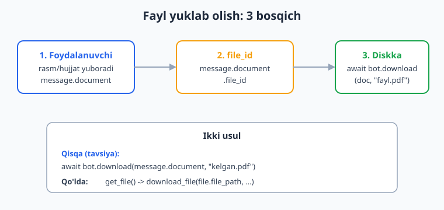
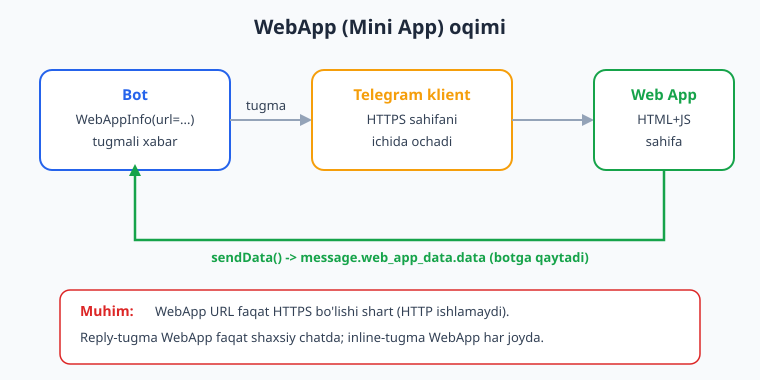
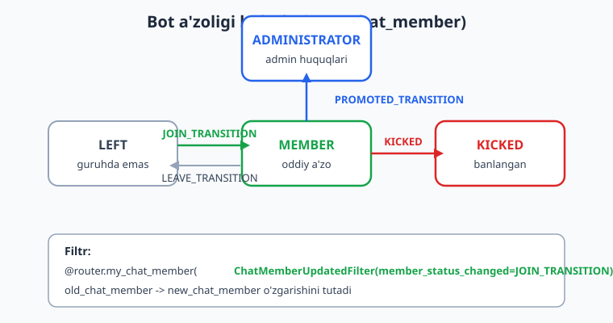

# 12 — Maxsus xususiyatlar

[⬅️ Oldingi: 11 — Loyiha tuzilishi va konfiguratsiya](./11-loyiha-tuzilishi.md) · [🏠 README](./README.md) · [Keyingi: 13 — Webhook va aiohttp server ➡️](./13-webhook-deploy.md)

---

> **Bu bobda:** Botimizni oddiy matn echobotidan haqiqiy mahsulotga aylantiramiz. Foydalanuvchi yuborgan **fayllarni diskka yuklab olamiz** (`bot.download`), bitta xabarda bir nechta rasmni **media guruh (albom)** qilib jo'natamiz, **lokatsiya va kontaktni** so'rab olamiz, Telegram menyusidagi **buyruqlar ro'yxatini** (`set_my_commands` + `BotCommand` + `scope`) sozlaymiz, **WebApp (Telegram Mini App)** tugmasi orqali to'liq HTML ilovani ochamiz va undan ma'lumot qabul qilamiz. So'ng botni **guruh va kanalda** ishlatishni, hamda bot guruhga qo'shilgan/chiqarilganini bildiruvchi **`my_chat_member`** yangilanishini ushlashni o'rganamiz.
>
> **Halol eslatma (verifikatsiya):** handler routing (lokatsiya/kontakt/`web_app_data`/`my_chat_member`), `ChatMemberUpdatedFilter` o'tishlari, klaviatura quruvchilar (`as_markup`), `MediaGroupBuilder.build()`, `set_my_commands` chaqiruvi va `bot.download` ichki oqimi **offline** (tokensiz, mock session + `feed_update`) tekshirildi. Aksincha, real Telegram'ga xabar/albom yuborish, fayl baytlarini Telegram serveridan haqiqatan ko'chirib olish, WebApp sahifasini jonli ochish va guruhda haqiqiy `my_chat_member` event olish — bularning hammasi BotFather token + internet (+ WebApp uchun HTTPS public URL) talab qiladi, shuning uchun ular **illustrativ** deb belgilangan: kod to'g'ri, lekin "yetib bordi" degan natija bu yerda tekshirilmagan.

---

## Bu bobda nimani quramiz

Oldingi boblarda biz matn, klaviatura, FSM va ma'lumotlar bazasini ko'rdik. Endi Telegram'ning **kontent turlari** (content types) bilan ishlaymiz va bot atrofidagi "ekotizim" sozlamalariga tegamiz. Mana yo'l xaritasi:

1. Fayl qabul qilish va `bot.download` bilan diskka saqlash.
2. Media guruh (bir nechta rasm/video bitta albomda).
3. Lokatsiya va kontaktni so'rash (`request_location`, `request_contact`) va qabul qilish.
4. Buyruqlar menyusi: `set_my_commands`, `BotCommand`, `scope`.
5. WebApp tugma — Mini App kirish va `web_app_data` qabul qilish.
6. Guruh/kanal botlari va `my_chat_member` (a'zolik o'zgarishi).

> Bu bob Python'ni bilasiz deb faraz qiladi (`async`/`await`, klass, dekorator, type hints). Agar tushunmaslik bo'lsa, [Python qo'llanmasiga](../python/README.md) qayting. Telegram'ga xos har bir narsani esa to'liq tushuntiramiz.

---

## 1. Fayl yuklab olish — `bot.download`

Foydalanuvchi botga rasm, hujjat, ovozli xabar yoki video jo'natganda, Telegram bizga **faylning o'zini emas, balki `file_id`** ni beradi. `file_id` — bu Telegram serveridagi faylga ishora qiluvchi uzun satr. Faylni ko'rish uchun ikki bosqich kerak:

1. `file_id` bo'yicha `get_file()` chaqirib **`file_path`** ni olamiz.
2. `file_path` orqali fayl baytlarini ko'chirib olamiz.

aiogram 3.x'da `bot.download(...)` metodi bu ikki bosqichni **bitta chaqiruvga** birlashtiradi — eng qulay yo'l.



### Kontent turlarini farqlash

Telegram har xil faylni alohida maydonda yuboradi:

| Maydon | Nima |
|--------|------|
| `message.photo` | Rasm (bir nechta o'lchamli, ro'yxat). Eng kattasi — `message.photo[-1]` |
| `message.document` | Hujjat (PDF, ZIP, .docx — ya'ni rasm/video emas) |
| `message.voice` | Ovozli xabar (mikrofon) |
| `message.audio` | Musiqa fayli |
| `message.video` | Video |
| `message.video_note` | Dumaloq video xabar |

Handler'da bularni **magic filter `F`** bilan ajratamiz:

```python
import os
from aiogram import Bot, Router, F
from aiogram.types import Message

router = Router()

# Yuklamalar uchun papka
DOWNLOADS = "downloads"
os.makedirs(DOWNLOADS, exist_ok=True)


@router.message(F.document)
async def on_document(message: Message, bot: Bot):
    doc = message.document
    # Asl fayl nomi message.document.file_name da keladi (None bo'lishi mumkin)
    file_name = doc.file_name or f"{doc.file_id}.bin"
    destination = os.path.join(DOWNLOADS, file_name)

    # Bir chaqiruvda: get_file + ko'chirib olish + diskka yozish
    await bot.download(doc, destination=destination)

    size_kb = (doc.file_size or 0) / 1024
    await message.answer(
        f"Hujjat saqlandi: <b>{file_name}</b> ({size_kb:.1f} KB)"
    )


@router.message(F.photo)
async def on_photo(message: Message, bot: Bot):
    # photo — ro'yxat, [-1] eng yuqori sifatli (eng katta) variant
    photo = message.photo[-1]
    destination = os.path.join(DOWNLOADS, f"{photo.file_unique_id}.jpg")
    await bot.download(photo, destination=destination)
    await message.answer("Rasm saqlandi.")
```

Diqqat qiling: `bot.download(doc, ...)` ga to'g'ridan-to'g'ri `message.document` obyektini berdik — uning `file_id` si avtomatik olinadi. Agar sizda faqat `file_id` satri bo'lsa, uni ham berish mumkin: `bot.download(file_id_str)`.

### `destination` ni berish yoki bermaslik

- `destination` berilsa — fayl shu yo'lga **diskka** yoziladi, metod `None` qaytaradi.
- `destination=None` (standart) — fayl `BytesIO` (xotirada) qaytariladi, uni qayta ishlash mumkin (masalan, tahlil qilib darrov o'chirib tashlash).

```python
@router.message(F.voice)
async def on_voice(message: Message, bot: Bot):
    # Diskka yozmasdan, xotirada olamiz
    buffer = await bot.download(message.voice)  # io.BytesIO qaytaradi
    data = buffer.read()
    await message.answer(f"Ovoz qabul qilindi, {len(data)} bayt.")
```

### Qo'lda yo'l (nima sodir bo'layotganini ko'rsatish uchun)

`bot.download` ichida quyidagilar kechadi. Buni o'zingiz ham yozishingiz mumkin, lekin amalda `bot.download` qisqaroq:

```python
# Bu bot.download ekvivalenti — odatda kerak emas, faqat tushunish uchun
file = await bot.get_file(message.document.file_id)   # file.file_path olamiz
await bot.download_file(file.file_path, destination="downloads/fayl.bin")
```

> **Cheklov (muhim):** Telegram Bot API orqali bot **20 MB gacha** faylni yuklab olishi mumkin. Undan kattasi uchun `get_file` xato qaytaradi. (Yuborishda yana boshqa limitlar bor — rasm 10 MB, boshqa fayllar 50 MB.)

> **Halol eslatma:** yuqoridagi handlerlarning **routing** qismi (qaysi xabar qaysi handler'ga tushishi) offline tekshirildi, va `bot.download` ning ichki `get_file -> download_file` oqimi mock session bilan tasdiqlandi. Lekin Telegram serveridan **haqiqiy baytlarni** ko'chirib olish token + internet talab qiladi — bu bobda u qism illustrativ.

---

## 2. Media guruh — bir nechta rasmni albom qilib yuborish

Bir nechta rasm/videoni alohida xabar emas, **bitta albom** (media group) qilib yuborish uchun `MediaGroupBuilder` ishlatiladi (`aiogram.utils.media_group`). U `InputMediaPhoto`, `InputMediaVideo`, `InputMediaDocument` obyektlarini yig'ib, `bot.send_media_group(...)` ga uzatiladigan ro'yxat tuzadi.

```python
from aiogram.utils.media_group import MediaGroupBuilder
from aiogram.types import FSInputFile, Message


@router.message(F.text == "/album")
async def send_album(message: Message, bot: Bot):
    # caption — albomning umumiy izohi (faqat birinchi elementga biriktiriladi)
    builder = MediaGroupBuilder(caption="Mahsulot rasmlari")

    # 1) URL orqali
    builder.add_photo(media="https://picsum.photos/600/400")
    # 2) Lokal fayl orqali (FSInputFile)
    builder.add_photo(media=FSInputFile("downloads/rasm.jpg"))
    # 3) Avval yuborilgan faylning file_id si orqali (eng tez)
    # builder.add_photo(media="AgACAg...file_id...")

    await bot.send_media_group(
        chat_id=message.chat.id,
        media=builder.build(),  # InputMediaPhoto/Video/... ro'yxati
    )
```

Muhim qoidalar:

- Albomda **2 dan 10 tagacha** element bo'lishi shart (1 ta bo'lsa oddiy `send_photo` ishlating).
- Umumiy `caption` **faqat birinchi** elementga biriktiriladi — buni biz `build()` natijasidan tekshirib ko'rdik.
- Rasm va videolarni aralashtirib bo'ladi, lekin hujjatlarni faqat hujjatlar bilan, audioni audio bilan.

> **Offline tekshirilgan:** `MediaGroupBuilder(caption=...).add_photo(...).build()` ikki elementli ro'yxat qaytarishi va `caption` faqat birinchi elementda turishi tasdiqlandi. **Illustrativ:** real albom Telegram'da ko'rinishi uchun token + internet kerak.

---

## 3. Lokatsiya va kontakt qabul qilish

Telegram foydalanuvchidan **joriy joylashuv** (GPS) yoki **telefon raqami** ni so'rashga imkon beradi. Buning uchun **reply-klaviatura** tugmalarida maxsus bayroqlar qo'yiladi:

- `request_location=True` — tugma bosilganda Telegram joylashuvni so'raydi.
- `request_contact=True` — tugma bosilganda foydalanuvchining kontakti so'raladi.

> Bu bayroqlar **faqat reply-klaviaturada** (oddiy tugmalar) ishlaydi, inline-tugmada emas. Va faqat **shaxsiy chatda**.

### So'rovchi klaviatura

```python
from aiogram.utils.keyboard import ReplyKeyboardBuilder
from aiogram.types import Message


@router.message(F.text == "/share")
async def ask_data(message: Message):
    builder = ReplyKeyboardBuilder()
    builder.button(text="Joylashuvni yuborish", request_location=True)
    builder.button(text="Kontaktni yuborish", request_contact=True)
    builder.adjust(1)  # har qatorda 1 tugma
    await message.answer(
        "Quyidagi tugmalardan birini bosing:",
        reply_markup=builder.as_markup(resize_keyboard=True),
    )
```

### Qabul qilish handlerlari

Foydalanuvchi tugmani bosgach, bizga `message.location` yoki `message.contact` keladi:

```python
@router.message(F.location)
async def on_location(message: Message):
    lat = message.location.latitude
    lon = message.location.longitude
    await message.answer(
        f"Koordinata qabul qilindi:\n"
        f"Kenglik: <code>{lat}</code>\n"
        f"Uzunlik: <code>{lon}</code>"
    )


@router.message(F.contact)
async def on_contact(message: Message):
    c = message.contact
    text = (
        f"Kontakt qabul qilindi:\n"
        f"Ism: {c.first_name}\n"
        f"Telefon: <code>{c.phone_number}</code>"
    )
    # c.user_id — agar kontakt Telegram foydalanuvchiniki bo'lsa
    if c.user_id:
        text += f"\nUser ID: <code>{c.user_id}</code>"
    await message.answer(text)
```

> **Xavfsizlik:** `message.contact.phone_number` ga ishonchli — uni Telegram bevosita foydalanuvchidan oladi. Lekin `request_contact` bilan **faqat o'z kontaktini** yuborish so'raladi; foydalanuvchi qo'lda boshqaning kontaktini ham ulashishi mumkin — bunda `contact.user_id` odatda bo'lmaydi.

Botning o'zi ham joylashuv/kontakt **yubora** oladi: `bot.send_location(chat_id, latitude=..., longitude=...)`, `bot.send_contact(chat_id, phone_number=..., first_name=...)`.

> **Offline tekshirilgan:** `Location` va `Contact` bilan yasalgan `Update` ni `feed_update` orqali uzatib, ikkala handler ham to'g'ri ishga tushgani va kerakli maydonlarni o'qigani tasdiqlandi.

---

## 4. Buyruqlar menyusi — `set_my_commands`

Telegram'da xabar maydoni yonida **"/" (Menu)** tugmasi bor. Bossangiz bot buyruqlari ro'yxati chiqadi. Bu ro'yxatni biz `bot.set_my_commands(...)` orqali sozlaymiz. U bir marta — bot ishga tushganda — chaqiriladi va Telegram serverida saqlanadi.

```python
from aiogram import Bot
from aiogram.types import BotCommand, BotCommandScopeDefault


async def setup_bot_commands(bot: Bot):
    commands = [
        BotCommand(command="start", description="Botni ishga tushirish"),
        BotCommand(command="help", description="Yordam va qo'llanma"),
        BotCommand(command="settings", description="Sozlamalar"),
        BotCommand(command="cancel", description="Joriy amalni bekor qilish"),
    ]
    await bot.set_my_commands(commands, scope=BotCommandScopeDefault())
```

Bu funksiyani **startup**'da chaqiramiz — `Dispatcher`'ning `startup` hodisasiga ulaymiz:

```python
async def main():
    dp.startup.register(setup_bot_commands)   # bot ishga tushganda bir marta
    await dp.start_polling(bot)
```

### Qoidalar

- `command` faqat kichik lotin harflari, raqamlar va pastki chiziq, **boshida `/` qo'yilmaydi** (`"start"`, `"help"`).
- `description` 1-256 belgi.
- Bir botda **100 tagacha** buyruq.

### `scope` — kim qanday ro'yxatni ko'radi

Bu eng kuchli xususiyat: turli foydalanuvchilarga turli menyu ko'rsatish mumkin. `scope` qaysi chatda/kimga ushbu ro'yxat amal qilishini belgilaydi:

| Scope klassi | Kimga |
|--------------|-------|
| `BotCommandScopeDefault` | Hammaga (standart, agar boshqa scope mos kelmasa) |
| `BotCommandScopeAllPrivateChats` | Barcha shaxsiy chatlar |
| `BotCommandScopeAllGroupChats` | Barcha guruhlar |
| `BotCommandScopeAllChatAdministrators` | Barcha guruhlarning adminlari |
| `BotCommandScopeChat` | Aniq bitta chat (`chat_id` bilan) |
| `BotCommandScopeChatAdministrators` | Aniq chatning adminlari |
| `BotCommandScopeChatMember` | Aniq chatdagi aniq a'zo |

Misol — shaxsiy chatda boy menyu, guruhda qisqa menyu, va aniq adminga qo'shimcha buyruq:

```python
from aiogram.types import (
    BotCommand,
    BotCommandScopeAllPrivateChats,
    BotCommandScopeAllGroupChats,
    BotCommandScopeChatAdministrators,
)


async def setup_scoped_commands(bot: Bot):
    # Shaxsiy chatlar uchun
    await bot.set_my_commands(
        [
            BotCommand(command="start", description="Boshlash"),
            BotCommand(command="profile", description="Mening profilim"),
            BotCommand(command="help", description="Yordam"),
        ],
        scope=BotCommandScopeAllPrivateChats(),
    )

    # Guruhlar uchun — kamroq buyruq
    await bot.set_my_commands(
        [
            BotCommand(command="stats", description="Guruh statistikasi"),
            BotCommand(command="rules", description="Guruh qoidalari"),
        ],
        scope=BotCommandScopeAllGroupChats(),
    )

    # Guruh adminlari uchun qo'shimcha buyruqlar
    await bot.set_my_commands(
        [
            BotCommand(command="ban", description="Foydalanuvchini bloklash"),
            BotCommand(command="mute", description="Ovozsizlantirish"),
            BotCommand(command="settings", description="Guruh sozlamalari"),
        ],
        scope=BotCommandScopeChatAdministrators(chat_id=-1001234567890),
    )
```

Menyuni **o'chirish** uchun `bot.delete_my_commands(scope=...)`, joriy ro'yxatni olish uchun `bot.get_my_commands(scope=...)`.

> **Offline tekshirilgan:** `bot.set_my_commands([...], scope=BotCommandScopeAllPrivateChats())` mock session orqali chaqirilib, ichkarida `SetMyCommands` metod obyekti to'g'ri tuzilgani (`commands[0].command == "start"`, scope turi to'g'ri) tasdiqlandi. **Illustrativ:** menyu Telegram klientida ko'rinishi uchun token + jonli bot kerak.

---

## 5. WebApp tugma — Telegram Mini App

**WebApp (Mini App)** — bu Telegram ichida ochiladigan to'liq HTML/JS sahifa. Botingiz murakkab interfeys (kalendar, savat, xarita, forma) talab qilsa, uni veb-ilova qilib yozib, Telegram ichida ko'rsatasiz. Foydalanuvchi sahifa bilan ishlaydi, so'ng natijani `Telegram.WebApp.sendData(...)` orqali botga qaytaradi.



> **Qattiq talab:** WebApp URL **faqat HTTPS** bo'lishi shart. HTTP (`http://`) yoki `localhost` ishlamaydi (lokal test uchun `ngrok` kabi tunnel orqali HTTPS oling).

### WebApp tugmasini berishning uch yo'li

**1) Inline-tugma WebApp** — har qanday chatda (shaxsiy, guruh) ishlaydi:

```python
from aiogram.utils.keyboard import InlineKeyboardBuilder
from aiogram.types import WebAppInfo, Message


@router.message(F.text == "/shop")
async def open_shop(message: Message):
    builder = InlineKeyboardBuilder()
    builder.button(
        text="Do'konni ochish",
        web_app=WebAppInfo(url="https://my-shop.example.com/app"),
    )
    await message.answer(
        "Mahsulotlarni tanlash uchun bosing:",
        reply_markup=builder.as_markup(),
    )
```

**2) Reply-tugma WebApp** — faqat shaxsiy chatda:

```python
from aiogram.utils.keyboard import ReplyKeyboardBuilder


@router.message(F.text == "/form")
async def open_form(message: Message):
    builder = ReplyKeyboardBuilder()
    builder.button(
        text="Anketani to'ldirish",
        web_app=WebAppInfo(url="https://my-shop.example.com/form"),
    )
    await message.answer(
        "Anketa:",
        reply_markup=builder.as_markup(resize_keyboard=True),
    )
```

**3) Menyu tugmasi WebApp** — "/" o'rniga doimiy WebApp tugmasi (`set_chat_menu_button`):

```python
from aiogram.types import MenuButtonWebApp, WebAppInfo


async def setup_menu_button(bot: Bot):
    await bot.set_chat_menu_button(
        menu_button=MenuButtonWebApp(
            text="Ilova",
            web_app=WebAppInfo(url="https://my-shop.example.com/app"),
        )
    )
    # Standart "/" menyusiga qaytarish:
    # await bot.set_chat_menu_button(menu_button=MenuButtonDefault())
```

### WebApp dan ma'lumot qabul qilish

Reply-tugma WebApp ichida JS `Telegram.WebApp.sendData("...")` chaqirsa, botga `message.web_app_data` keladi. Uni `F.web_app_data` bilan ushlaymiz:

```python
import json
from aiogram.types import Message


@router.message(F.web_app_data)
async def on_web_app_data(message: Message):
    raw = message.web_app_data.data        # WebApp yuborgan satr
    button_text = message.web_app_data.button_text
    try:
        payload = json.loads(raw)          # odatda JSON jo'natiladi
        await message.answer(
            f"Ilovadan keldi (tugma: {button_text}):\n"
            f"<code>{json.dumps(payload, ensure_ascii=False)}</code>"
        )
    except json.JSONDecodeError:
        await message.answer(f"Ilovadan: {raw}")
```

WebApp sahifasining minimal JS tarafi (illustrativ, sizning HTML ilovangizda turadi):

```html
<!-- Bu kod WebApp sahifasida (brauzerda) ishlaydi, botda emas -->
<script src="https://telegram.org/js/telegram-web-app.js"></script>
<script>
  const tg = window.Telegram.WebApp;
  function submit() {
    tg.sendData(JSON.stringify({ color: "blue", size: "M" }));
    tg.close();
  }
</script>
```

> **Offline tekshirilgan:** WebApp inline-tugmasini `InlineKeyboardBuilder(...).as_markup()` orqali qurib, hosil bo'lgan tugmada `web_app.url` to'g'ri turgani tasdiqlandi; `WebAppData(data=...)` li xabar `feed_update` orqali uzatilib, `F.web_app_data` handler'i to'g'ri ishga tushib `data` ni o'qiganligi ham tekshirildi. **Illustrativ:** WebApp sahifasini Telegram klientida jonli ochish HTTPS public URL + jonli bot talab qiladi.

---

## 6. Guruh va kanal botlari

Hozirgacha bot asosan shaxsiy chatda ishladi. Endi uni guruhga qo'shamiz. Guruhda muhim farqlar bor.

### Privacy mode (maxfiylik rejimi)

Standart holatda bot guruhda **hamma xabarni emas**, faqat quyidagilarni oladi:

- Botga to'g'ridan-to'g'ri yuborilgan buyruqlar (`/start@my_bot`),
- Botning xabarlariga **reply** qilingan xabarlar,
- Botni **eslatgan** (`@my_bot`) xabarlar.

Agar bot guruhdagi **barcha** xabarlarni o'qishini istasangiz, **@BotFather** da `/setprivacy` -> `Disable` qiling. (Bu botni guruhdan chiqarib qayta qo'shishni talab qilishi mumkin.)

### Faqat guruhda ishlovchi handler

Chat turini `F.chat.type` orqali filtrlaymiz:

```python
from aiogram import Router, F
from aiogram.filters import Command
from aiogram.types import Message

router = Router()


# Faqat guruh/superguruhda /rules ishlaydi
@router.message(Command("rules"), F.chat.type.in_({"group", "supergroup"}))
async def group_rules(message: Message):
    await message.answer("Guruh qoidalari:\n1. Hurmat\n2. Spam yo'q")


# Faqat shaxsiy chatda
@router.message(Command("settings"), F.chat.type == "private")
async def private_settings(message: Message):
    await message.answer("Shaxsiy sozlamalar:")
```

### Botni admin qilish va kanal

- **Guruhda** ban/mute kabi amallar uchun bot **admin** bo'lishi shart.
- **Kanalda** bot postlarni faqat **admin** bo'lsa joylay oladi: `bot.send_message(chat_id=channel_id, text="...")`. `channel_id` `-100...` bilan boshlanadi yoki `@kanal_username`.

```python
# Kanalga post joylash (bot admin bo'lishi shart) — illustrativ
async def post_to_channel(bot: Bot):
    await bot.send_message(
        chat_id="@my_channel",
        text="Yangi maqola chiqdi!",
    )
```

> **Offline tekshirilgan:** `F.chat.type.in_({"group","supergroup"})` filtri pytest-asyncio testida tasdiqlandi — superguruh xabarida handler ishladi, shaxsiy chat xabarida esa o'tmadi (hech narsa yuborilmadi). **Illustrativ:** kanalga real post yuborish token + bot adminligini talab qiladi.

---

## 7. Chat a'zoligi — `my_chat_member`

Telegram bizga **bot a'zoligi o'zgarganda** maxsus yangilanish yuboradi:

- `my_chat_member` — **botning o'zi** holati o'zgarganda (guruhga qo'shildi, chiqarildi, admin qilindi, banlandi).
- `chat_member` — guruhdagi **boshqa a'zolar** holati o'zgarganda (bot admin bo'lishi va Privacy o'chirilishini talab qiladi).



Bu yangilanishlar `Update` ichida alohida kelganligi sababli, ularni **`allowed_updates`** ro'yxatiga qo'shmasak Telegram ularni yubormaydi. aiogram'da eng oson yo'l — `dp.resolve_used_update_types()`: u kodingizdagi handlerlardan kerakli turlarni avtomatik aniqlaydi.

```python
async def main():
    # ... dp, bot, routerlar ...
    await dp.start_polling(
        bot,
        allowed_updates=dp.resolve_used_update_types(),
    )
```

### `my_chat_member` handler va `ChatMemberUpdatedFilter`

`ChatMemberUpdated` event ikkita asosiy maydon olib keladi: `old_chat_member` (avvalgi holat) va `new_chat_member` (yangi holat). Qaysi o'tishni kuzatishni `ChatMemberUpdatedFilter` belgilaydi.

Avval **muhim farqni** tushunib oling, chunki bu eng ko'p uchraydigan xato:

- **O'tish (transition)** — bu `eski_holat >> yangi_holat` ko'rinishidagi qoida. Filtr `old_chat_member` VA `new_chat_member` ni birga tekshiradi. Masalan `JOIN_TRANSITION`, `LEAVE_TRANSITION`, `PROMOTED_TRANSITION`.
- **Holat markeri (marker)** — bu faqat YANGI holatni tekshiradigan belgi: `MEMBER`, `ADMINISTRATOR`, `LEFT`, `KICKED`. Markerni `ChatMemberUpdatedFilter` ga uzatsangiz, u **faqat `new_chat_member`** ni qaraydi, eskisini emas.

Bu farq nega muhim? aiogram'da `LEAVE_TRANSITION` aslida `IS_MEMBER >> IS_NOT_MEMBER` ga teng, va `IS_NOT_MEMBER = LEFT | KICKED | -RESTRICTED`. Demak bot banlanganda (`member -> kicked`) bu o'zgarish `LEAVE_TRANSITION` ga **ham mos keladi**. Agar `LEAVE` handler `KICKED` handler'dan oldin e'lon qilingan bo'lsa, observer birinchi mos handler'da to'xtaydi va `KICKED` handler **hech qachon ishlamaydi** (o'lik kod). Shuning uchun:

1. **Ban handler'ini `IS_MEMBER >> KICKED` o'tishi bilan torroq qiling** (marker `KICKED` o'rniga), va uni `LEAVE` handler'dan **OLDIN** e'lon qiling.
2. **Leave handler'ini `IS_MEMBER >> LEFT` ga torytib qo'ying**, shunda u faqat ixtiyoriy chiqish/oddiy o'chirishni ushlaydi, ban'ni emas.

```python
from aiogram import Router
from aiogram.filters import (
    ChatMemberUpdatedFilter,
    JOIN_TRANSITION,
    PROMOTED_TRANSITION,
    IS_MEMBER,   # umumlashtirilgan "a'zo" markeri (creator|administrator|member|+restricted)
    KICKED,      # holat markeri: yangi holat "kicked"
    LEFT,        # holat markeri: yangi holat "left"
)
from aiogram.types import ChatMemberUpdated

router = Router()


# Bot guruhga qo'shildi (left/kicked -> member)
@router.my_chat_member(
    ChatMemberUpdatedFilter(member_status_changed=JOIN_TRANSITION)
)
async def bot_added(event: ChatMemberUpdated, bot: Bot):
    chat = event.chat
    await bot.send_message(
        chat.id,
        f"Salom! Meni \"{chat.title}\" guruhiga qo'shganingiz uchun rahmat.",
    )


# Bot banlandi (a'zo -> kicked). DIQQAT: bu handler LEAVE dan OLDIN turishi shart,
# aks holda LEAVE_TRANSITION/`IS_MEMBER >> LEFT` emas, balki keng LEAVE qoidasi
# ban'ni o'g'irlab ketishi mumkin. Torroq `IS_MEMBER >> KICKED` ban'ni aniq ushlaydi.
@router.my_chat_member(
    ChatMemberUpdatedFilter(member_status_changed=IS_MEMBER >> KICKED)
)
async def bot_banned(event: ChatMemberUpdated):
    print(f"Bot {event.chat.id} da banlandi")


# Bot guruhdan chiqarildi/ketdi (a'zo -> left). Faqat "left" — ban (kicked) emas.
@router.my_chat_member(
    ChatMemberUpdatedFilter(member_status_changed=IS_MEMBER >> LEFT)
)
async def bot_removed(event: ChatMemberUpdated):
    # Bu yerda guruhdan chiqdik — xabar yubora olmaymiz, faqat log/baza
    print(f"Bot {event.chat.id} guruhdan chiqarildi/chiqdi")


# Bot admin qilindi (member -> administrator)
@router.my_chat_member(
    ChatMemberUpdatedFilter(member_status_changed=PROMOTED_TRANSITION)
)
async def bot_promoted(event: ChatMemberUpdated, bot: Bot):
    await bot.send_message(
        event.chat.id,
        "Endi men adminman — guruhni boshqarishga tayyorman.",
    )
```

> **Eslatma — `LEAVE_TRANSITION` va ban.** Agar siz ban va oddiy chiqishni **ajratmoqchi bo'lmasangiz** (ikkalasi ham "bot guruhda emas" degani bo'lsa kifoya), bitta `LEAVE_TRANSITION` handler ham yetadi — u `member -> left` ham, `member -> kicked` ham ushlaydi. Lekin ikkalasini **alohida** ishlamoqchi bo'lsangiz, yuqoridagidek ban'ni torroq `IS_MEMBER >> KICKED` bilan, leave'ni `IS_MEMBER >> LEFT` bilan ajrating va ban handler'ini oldinroqqa qo'ying.

`member_status_changed` ga beriladigan qoidalar ikki turga bo'linadi (`aiogram.filters` dan):

**O'tishlar (transition — eski VA yangi holatni tekshiradi):**

| O'tish | Ma'no |
|--------|-------|
| `JOIN_TRANSITION` | a'zo bo'lmagandan a'zoga (qo'shildi): `IS_NOT_MEMBER >> IS_MEMBER` |
| `LEAVE_TRANSITION` | a'zodan a'zo emasga (chiqdi yoki banlandi): `IS_MEMBER >> IS_NOT_MEMBER` |
| `PROMOTED_TRANSITION` | admin qilindi: `... >> ADMINISTRATOR` |
| `IS_MEMBER >> KICKED` | a'zodan ban holatiga (ban'ni leave'dan ajratish uchun) |
| `IS_MEMBER >> LEFT` | a'zodan oddiy chiqishga (ban emas) |

**Holat markerlari (marker — faqat YANGI holatni tekshiradi):**

| Marker | Ma'no |
|--------|-------|
| `MEMBER`, `ADMINISTRATOR`, `LEFT`, `KICKED` | yangi holat aynan shu bo'lsa mos keladi (eski holatga qaramaydi) |
| `IS_MEMBER`, `IS_NOT_MEMBER`, `IS_ADMIN` | umumlashtirilgan a'zolik markerlari (bir nechta holatni qamrab oladi) |

> Markerlardan o'tish yasash uchun `>>` operatoridan foydalaning: `IS_MEMBER >> KICKED` — "a'zo edi, endi kicked". Yolg'iz `KICKED` esa faqat "yangi holat kicked" degani bo'lib, eski holatga qaramaydi — shuning uchun u `LEAVE_TRANSITION` bilan ustma-ust tushadi.

### Yangi foydalanuvchini kutib olish (`chat_member`)

`chat_member` event esa **boshqa** a'zolar o'zgarishini bildiradi — masalan, yangi odam guruhga kirganda salomlashish:

```python
@router.chat_member(
    ChatMemberUpdatedFilter(member_status_changed=JOIN_TRANSITION)
)
async def greet_new_member(event: ChatMemberUpdated, bot: Bot):
    user = event.new_chat_member.user
    await bot.send_message(
        event.chat.id,
        f"Xush kelibsiz, {user.first_name}!",
    )
```

> `chat_member` ishlashi uchun bot **admin** bo'lishi shart.

> **Offline tekshirilgan:** `my_chat_member` event'ini `feed_update` orqali to'rt marta uzatdik — `left->member` (JOIN), `member->kicked` (ban), `member->left` (chiqish) va `member->administrator` (PROMOTED). Har bir o'zgarish **aynan bitta** handler'ga tushgani tekshirildi: ban'ni torroq `IS_MEMBER >> KICKED` ushladi (LEAVE handler'i undan keyin turgani uchun ban'ni o'g'irlamadi), `IS_MEMBER >> LEFT` esa faqat oddiy chiqishni ushladi. Avval keng `LEAVE_TRANSITION` ni `KICKED` markeridan oldin qo'yib sinab ko'rganimizda `member->kicked` LEAVE handler'ga tushib, `KICKED` handler **umuman ishlamagani** ham aniqlandi — shuning uchun yuqoridagi tartib va torroq qoidalar ishlatildi. **Illustrativ:** real guruhda bot qo'shilganda/banlanganida Telegram bu event'ni yuborishi jonli bot + guruhni talab qiladi.

---

## To'liq mini-loyiha: "Yordamchi bot" skeleti

Quyida bobning bo'limlarini bitta faylga jamlagan skelet. **Routing/handler qismi** yuqoridagi uslublar bilan offline tekshirilgan; `main()` ichidagi jonli `start_polling` — illustrativ (token + internet kerak).

```python
import os
import asyncio
import json
from aiogram import Bot, Dispatcher, Router, F
from aiogram.client.default import DefaultBotProperties
from aiogram.enums import ParseMode
from aiogram.filters import Command, ChatMemberUpdatedFilter, JOIN_TRANSITION
from aiogram.types import (
    Message, ChatMemberUpdated,
    BotCommand, BotCommandScopeDefault, WebAppInfo,
)
from aiogram.utils.keyboard import ReplyKeyboardBuilder, InlineKeyboardBuilder

router = Router()
DOWNLOADS = "downloads"
os.makedirs(DOWNLOADS, exist_ok=True)


@router.message(Command("start"))
async def start(message: Message):
    await message.answer("Salom! /share, /shop yoki fayl yuboring.")


@router.message(Command("share"))
async def share(message: Message):
    b = ReplyKeyboardBuilder()
    b.button(text="Joylashuv", request_location=True)
    b.button(text="Kontakt", request_contact=True)
    b.adjust(2)
    await message.answer("Tanlang:", reply_markup=b.as_markup(resize_keyboard=True))


@router.message(Command("shop"))
async def shop(message: Message):
    b = InlineKeyboardBuilder()
    b.button(text="Do'kon", web_app=WebAppInfo(url="https://example.com/app"))
    await message.answer("Ilova:", reply_markup=b.as_markup())


@router.message(F.location)
async def loc(message: Message):
    await message.answer(
        f"{message.location.latitude}, {message.location.longitude}"
    )


@router.message(F.contact)
async def cont(message: Message):
    await message.answer(f"Telefon: {message.contact.phone_number}")


@router.message(F.document)
async def doc(message: Message, bot: Bot):
    name = message.document.file_name or "fayl.bin"
    await bot.download(message.document, destination=os.path.join(DOWNLOADS, name))
    await message.answer(f"Saqlandi: {name}")


@router.message(F.web_app_data)
async def wad(message: Message):
    await message.answer(f"Ilovadan: {message.web_app_data.data}")


@router.my_chat_member(
    ChatMemberUpdatedFilter(member_status_changed=JOIN_TRANSITION)
)
async def added(event: ChatMemberUpdated, bot: Bot):
    await bot.send_message(event.chat.id, "Qo'shganingiz uchun rahmat!")


async def on_startup(bot: Bot):
    await bot.set_my_commands(
        [
            BotCommand(command="start", description="Boshlash"),
            BotCommand(command="share", description="Joylashuv/kontakt"),
            BotCommand(command="shop", description="WebApp ilova"),
        ],
        scope=BotCommandScopeDefault(),
    )


async def main():
    # BOT_TOKEN .env dan o'qiladi — kodga yozilmaydi (11-bobga qarang)
    bot = Bot(
        token=os.environ["BOT_TOKEN"],
        default=DefaultBotProperties(parse_mode=ParseMode.HTML),
    )
    dp = Dispatcher()
    dp.include_router(router)
    dp.startup.register(on_startup)
    # my_chat_member kelishi uchun allowed_updates kerak
    await dp.start_polling(
        bot,
        allowed_updates=dp.resolve_used_update_types(),
    )


if __name__ == "__main__":
    asyncio.run(main())   # illustrativ: jonli polling token + internet talab qiladi
```

---

## Tez-tez uchraydigan xatolar

- **`bot.download` ishlamaydi, `file is too big`** — Telegram bot uchun yuklab olish limiti 20 MB. Kattaroq fayl uchun boshqa yondashuv (masalan, foydalanuvchidan havola so'rash) kerak.
- **WebApp tugma ko'rinmaydi yoki ochilmaydi** — URL HTTPS emas. `http://` yoki `localhost` ishlamaydi.
- **Reply-tugma WebApp guruhda ishlamaydi** — reply-klaviatura WebApp faqat shaxsiy chatda. Guruhda inline-tugma WebApp ishlating.
- **`my_chat_member` kelmayapti** — `start_polling(..., allowed_updates=dp.resolve_used_update_types())` qo'shilmagan. Webhook'da ham xuddi shu ro'yxatni `set_webhook(allowed_updates=...)` ga berish kerak (13-bob).
- **Guruhdagi oddiy xabarlar handler'ga tushmayapti** — Privacy mode yoqilgan. @BotFather -> `/setprivacy` -> Disable.
- **`request_location` tugma bosilganda hech narsa kelmayapti** — siz uni inline-tugmaga qo'ygansiz. `request_location`/`request_contact` faqat **reply**-klaviaturada ishlaydi.
- **Eski 2.x sintaksis** — `@dp.message_handler(content_types=...)`, `executor.start_polling`, `types.ParseMode` 3.x'da yo'q. Faqat `@router.message(...)`, `dp.start_polling(...)`, `aiogram.enums.ParseMode` ishlating.

---

## Mashqlar

### Oson

1. **Rasm saqlovchi.** Foydalanuvchi rasm yuborganda eng yuqori sifatli variantni (`message.photo[-1]`) `downloads/` papkasiga `file_unique_id` nomi bilan saqlovchi handler yozing va "Saqlandi" deb javob bering.

2. **Lokatsiya javobi.** `F.location` handler yozing: kelgan koordinatani `latitude, longitude` ko'rinishida qaytaring va Google Maps havolasini ham qo'shing (`https://maps.google.com/?q=LAT,LON`).

3. **Buyruq menyusi.** `set_my_commands` bilan kamida 3 ta buyruq (`/start`, `/help`, `/about`) menyusini `BotCommandScopeDefault` scope'da o'rnatuvchi `on_startup` funksiyasini yozing.

4. **Inline WebApp tugma.** `/app` buyrug'iga javoban inline-tugma chiqaring, uning `web_app` URL'i `https://example.com/app` bo'lsin. `InlineKeyboardBuilder` ishlating.

5. **Kontakt tekshiruvi.** `F.contact` handler yozing: agar `contact.user_id` mavjud bo'lsa "Tasdiqlangan kontakt", aks holda "Tashqi kontakt" deb javob bering.

### O'rta

6. **Hujjat turini ajratish.** Bitta `F.document` handler yozing: fayl kengaytmasiga qarab (`.pdf`, `.zip`, boshqa) turli javob bering. Faylni `downloads/` ga saqlang va hajmini KB'da ayting.

7. **Media guruh quruvchi.** `/album` buyrug'iga uchta rasm URL'idan `MediaGroupBuilder` bilan albom tuzing (`caption="Galereya"`). `build()` natijasi 3 elementli ekanini va `caption` faqat birinchida turishini `assert` bilan tekshiring (offline).

8. **Scope'li menyu.** Shaxsiy chat (`BotCommandScopeAllPrivateChats`) va guruh (`BotCommandScopeAllGroupChats`) uchun ikki xil buyruq ro'yxatini o'rnatuvchi funksiya yozing.

9. **Menyu tugmasi.** `set_chat_menu_button` orqali doimiy WebApp menyu tugmasini (`MenuButtonWebApp`) o'rnatuvchi va `MenuButtonDefault` ga qaytaruvchi ikki funksiya yozing.

10. **Guruh-only buyruq.** `Command("stats")` ni faqat `group`/`supergroup` da ishlaydigan qilib filtrlang. Shaxsiy chatda esa "Bu buyruq faqat guruhda" deb javob beradigan ikkinchi handler qo'shing.

### Qiyin

11. **A'zolikni jurnalga yozish.** `my_chat_member` uchun to'rtta handler yozing: qo'shilish, ban (kicked), oddiy chiqish (left) va admin qilish. Har biri `event.chat.id` va o'tish nomini SQLite jadvaliga yozsin. **Diqqat:** ban'ni oddiy chiqishdan ajratish uchun ban handler'ini `IS_MEMBER >> KICKED` o'tishi bilan torroq qiling va uni leave handler'idan **oldin** e'lon qiling; leave'ni esa `IS_MEMBER >> LEFT` ga torytib qo'ying (chunki keng `LEAVE_TRANSITION` ban'ni ham ushlab, KICKED handler'ni o'lik qoldiradi). `feed_update` bilan to'rt o'tishni ham offline sinab ko'ring va har biri aynan bitta handler'ga tushganini tekshiring.

12. **WebApp -> baza.** `F.web_app_data` handler yozing: kelgan JSON'ni (`{"product":"...","qty":N}`) parse qiling, validatsiya qiling (`qty` butun va > 0), to'g'ri bo'lsa "Buyurtma qabul qilindi", xato bo'lsa tushunarli xato qaytaring. JSON parse va validatsiyani offline tekshiring.

13. **Universal media handler.** Bitta handler ichida `message.content_type` ga qarab rasm/hujjat/ovoz/videoni ajratib, har birini mos papkaga (`downloads/photos`, `downloads/docs`, ...) saqlang. `bot.download` ni mock qilib (monkeypatch) routing va papka tanlash mantiqini offline tekshiring.

14. **Yangi a'zoni kutib olish + qoidalar.** `chat_member` `JOIN_TRANSITION` handler yozing: yangi a'zoni ismi bilan kutib oling va inline-tugmali "Qoidalar" xabarini chiqaring. Tugma bosilganda (`callback_query`) qoidalar matnini yuboruvchi handler ham qo'shing.

<details markdown="1">
<summary>Yechimlar</summary>

### Oson

**1. Rasm saqlovchi**

```python
import os
from aiogram import Router, F, Bot
from aiogram.types import Message

router = Router()
os.makedirs("downloads", exist_ok=True)


@router.message(F.photo)
async def save_photo(message: Message, bot: Bot):
    photo = message.photo[-1]          # eng yuqori sifat
    path = os.path.join("downloads", f"{photo.file_unique_id}.jpg")
    await bot.download(photo, destination=path)
    await message.answer("Saqlandi")
```

**2. Lokatsiya javobi**

```python
@router.message(F.location)
async def on_location(message: Message):
    lat = message.location.latitude
    lon = message.location.longitude
    link = f"https://maps.google.com/?q={lat},{lon}"
    await message.answer(
        f"Koordinata: {lat}, {lon}\n"
        f"Xaritada: {link}"
    )
```

**3. Buyruq menyusi**

```python
from aiogram import Bot
from aiogram.types import BotCommand, BotCommandScopeDefault


async def on_startup(bot: Bot):
    commands = [
        BotCommand(command="start", description="Botni ishga tushirish"),
        BotCommand(command="help", description="Yordam"),
        BotCommand(command="about", description="Bot haqida"),
    ]
    await bot.set_my_commands(commands, scope=BotCommandScopeDefault())

# main() ichida: dp.startup.register(on_startup)
```

**4. Inline WebApp tugma**

```python
from aiogram.filters import Command
from aiogram.utils.keyboard import InlineKeyboardBuilder
from aiogram.types import WebAppInfo, Message


@router.message(Command("app"))
async def open_app(message: Message):
    b = InlineKeyboardBuilder()
    b.button(text="Ilovani ochish", web_app=WebAppInfo(url="https://example.com/app"))
    await message.answer("Ilova:", reply_markup=b.as_markup())
```

**5. Kontakt tekshiruvi**

```python
@router.message(F.contact)
async def on_contact(message: Message):
    c = message.contact
    if c.user_id:
        await message.answer(f"Tasdiqlangan kontakt: {c.phone_number}")
    else:
        await message.answer(f"Tashqi kontakt: {c.phone_number}")
```

### O'rta

**6. Hujjat turini ajratish**

```python
import os


@router.message(F.document)
async def on_document(message: Message, bot: Bot):
    doc = message.document
    name = doc.file_name or f"{doc.file_id}.bin"
    ext = os.path.splitext(name)[1].lower()
    path = os.path.join("downloads", name)
    await bot.download(doc, destination=path)

    size_kb = (doc.file_size or 0) / 1024
    if ext == ".pdf":
        kind = "PDF hujjat"
    elif ext == ".zip":
        kind = "Arxiv"
    else:
        kind = "Boshqa fayl"
    await message.answer(f"{kind} saqlandi: {name} ({size_kb:.1f} KB)")
```

**7. Media guruh quruvchi**

```python
from aiogram.utils.media_group import MediaGroupBuilder


def build_gallery():
    b = MediaGroupBuilder(caption="Galereya")
    b.add_photo(media="https://picsum.photos/600/400?1")
    b.add_photo(media="https://picsum.photos/600/400?2")
    b.add_photo(media="https://picsum.photos/600/400?3")
    media = b.build()
    assert len(media) == 3
    assert media[0].caption == "Galereya"
    assert media[1].caption is None
    assert media[2].caption is None
    return media


@router.message(F.text == "/album")
async def album(message: Message, bot: Bot):
    await bot.send_media_group(chat_id=message.chat.id, media=build_gallery())

# Offline: print(build_gallery())  -> assertlar o'tadi
```

**8. Scope'li menyu**

```python
from aiogram.types import (
    BotCommand, BotCommandScopeAllPrivateChats, BotCommandScopeAllGroupChats,
)


async def setup_commands(bot: Bot):
    await bot.set_my_commands(
        [
            BotCommand(command="start", description="Boshlash"),
            BotCommand(command="profile", description="Profil"),
        ],
        scope=BotCommandScopeAllPrivateChats(),
    )
    await bot.set_my_commands(
        [
            BotCommand(command="stats", description="Statistika"),
            BotCommand(command="rules", description="Qoidalar"),
        ],
        scope=BotCommandScopeAllGroupChats(),
    )
```

**9. Menyu tugmasi**

```python
from aiogram.types import MenuButtonWebApp, MenuButtonDefault, WebAppInfo


async def set_webapp_menu(bot: Bot):
    await bot.set_chat_menu_button(
        menu_button=MenuButtonWebApp(
            text="Ilova",
            web_app=WebAppInfo(url="https://example.com/app"),
        )
    )


async def reset_menu(bot: Bot):
    await bot.set_chat_menu_button(menu_button=MenuButtonDefault())
```

**10. Guruh-only buyruq**

```python
from aiogram.filters import Command

# Eslatma: aniqroq filtr (guruh) avval ro'yxatga olinishi kerak,
# chunki handlerlar tartib bo'yicha tekshiriladi.

@router.message(Command("stats"), F.chat.type.in_({"group", "supergroup"}))
async def group_stats(message: Message):
    await message.answer("Guruh statistikasi: ...")


@router.message(Command("stats"), F.chat.type == "private")
async def private_stats(message: Message):
    await message.answer("Bu buyruq faqat guruhda ishlaydi.")
```

### Qiyin

**11. A'zolikni jurnalga yozish** (SQLite + offline `feed_update` test)

```python
import sqlite3
from aiogram import Router, Bot
from aiogram.filters import (
    ChatMemberUpdatedFilter,
    JOIN_TRANSITION, PROMOTED_TRANSITION,
    IS_MEMBER, KICKED, LEFT,
)
from aiogram.types import ChatMemberUpdated

router = Router()
conn = sqlite3.connect("membership.db")
conn.execute("CREATE TABLE IF NOT EXISTS log (chat_id INTEGER, event TEXT)")
conn.commit()


def write_log(chat_id: int, event: str):
    conn.execute("INSERT INTO log (chat_id, event) VALUES (?, ?)", (chat_id, event))
    conn.commit()


@router.my_chat_member(ChatMemberUpdatedFilter(member_status_changed=JOIN_TRANSITION))
async def on_join(event: ChatMemberUpdated):
    write_log(event.chat.id, "JOIN")


# Ban handler'i LEAVE dan OLDIN turishi va torroq `IS_MEMBER >> KICKED` bo'lishi shart.
# Aks holda keng LEAVE qoidasi member->kicked ni o'g'irlab, bu handler o'lik qoladi.
@router.my_chat_member(ChatMemberUpdatedFilter(member_status_changed=IS_MEMBER >> KICKED))
async def on_kicked(event: ChatMemberUpdated):
    write_log(event.chat.id, "KICKED")


# Leave faqat "left" — ban (kicked) emas.
@router.my_chat_member(ChatMemberUpdatedFilter(member_status_changed=IS_MEMBER >> LEFT))
async def on_leave(event: ChatMemberUpdated):
    write_log(event.chat.id, "LEAVE")


@router.my_chat_member(ChatMemberUpdatedFilter(member_status_changed=PROMOTED_TRANSITION))
async def on_promoted(event: ChatMemberUpdated):
    write_log(event.chat.id, "PROMOTED")
```

**Nega bunday tartib?** aiogram observer'i birinchi mos handler'da to'xtaydi. `KICKED` yolg'iz marker bo'lib faqat yangi holatni tekshiradi, `LEAVE_TRANSITION` esa `IS_MEMBER >> IS_NOT_MEMBER` (`IS_NOT_MEMBER = LEFT | KICKED | -RESTRICTED`) — shuning uchun `member->kicked` keng leave qoidasiga ham mos keladi. Ban'ni alohida ushlash uchun uni torroq `IS_MEMBER >> KICKED` o'tishiga aylantirib, leave'dan oldin qo'yamiz; leave'ni esa `IS_MEMBER >> LEFT` ga toraytiramiz.

Offline test (feed_update bilan to'rt o'tishni ham tekshiradi va har biri aynan bitta handler'ga tushganini ta'kidlaydi):

```python
import asyncio
from datetime import datetime
from aiogram import Bot, Dispatcher
from aiogram.fsm.storage.memory import MemoryStorage
from aiogram.types import (
    Update, Chat, User, ChatMemberUpdated,
    ChatMemberMember, ChatMemberLeft, ChatMemberBanned, ChatMemberAdministrator,
)

FAKE = "123456:AAH-FakeTest_abc"


class MockSession:
    async def __call__(self, bot, method, timeout=None):
        return None
    async def close(self):
        return None


async def test():
    bot = Bot(token=FAKE)
    bot.session = MockSession()
    dp = Dispatcher(storage=MemoryStorage())
    dp.include_router(router)
    chat = Chat(id=-100777, type="supergroup", title="T")
    actor = User(id=5, is_bot=False, first_name="A")
    botuser = User(id=999, is_bot=True, first_name="Bot")

    def upd(uid, old, new):
        return Update(update_id=uid, my_chat_member=ChatMemberUpdated(
            chat=chat, from_user=actor, date=datetime.now(),
            old_chat_member=old, new_chat_member=new))

    # left -> member (JOIN)
    await dp.feed_update(bot, upd(1, ChatMemberLeft(user=botuser), ChatMemberMember(user=botuser)))
    # member -> kicked (ban)
    await dp.feed_update(bot, upd(2, ChatMemberMember(user=botuser),
                                 ChatMemberBanned(user=botuser, until_date=datetime.now())))
    # member -> left (oddiy chiqish)
    await dp.feed_update(bot, upd(3, ChatMemberMember(user=botuser), ChatMemberLeft(user=botuser)))
    # member -> administrator (PROMOTED)
    await dp.feed_update(bot, upd(4, ChatMemberMember(user=botuser), ChatMemberAdministrator(
        user=botuser, can_be_edited=False, is_anonymous=False, can_manage_chat=True,
        can_delete_messages=True, can_manage_video_chats=True, can_restrict_members=True,
        can_promote_members=False, can_change_info=True, can_invite_users=True,
        can_post_stories=False, can_edit_stories=False, can_delete_stories=False)))
    await bot.session.close()

    rows = conn.execute("SELECT chat_id, event FROM log").fetchall()
    events = [e for (_cid, e) in rows]
    assert (-100777, "JOIN") in rows
    assert (-100777, "KICKED") in rows      # ban torroq IS_MEMBER >> KICKED ga tushdi
    assert (-100777, "LEAVE") in rows       # faqat member->left
    assert (-100777, "PROMOTED") in rows
    # Ban ikki marta sanalmasligi (LEAVE ham bo'lib ketmasligi) kerak:
    assert events.count("KICKED") == 1 and events.count("LEAVE") == 1
    print("OK:", rows)


# asyncio.run(test())
```

**12. WebApp -> baza (JSON parse + validatsiya, offline tekshiriladi)**

```python
import json
from aiogram import Router, F
from aiogram.types import Message

router = Router()


def validate_order(raw: str) -> tuple[bool, str]:
    """JSON parse + validatsiya. (ok, xabar) qaytaradi — offline testlanadi."""
    try:
        data = json.loads(raw)
    except json.JSONDecodeError:
        return False, "Noto'g'ri ma'lumot formati."
    product = data.get("product")
    qty = data.get("qty")
    if not product:
        return False, "Mahsulot ko'rsatilmagan."
    if not isinstance(qty, int) or qty <= 0:
        return False, "Miqdor butun va musbat bo'lishi kerak."
    return True, f"Buyurtma qabul qilindi: {product} x {qty}"


@router.message(F.web_app_data)
async def on_order(message: Message):
    ok, msg = validate_order(message.web_app_data.data)
    await message.answer(msg)


# Offline test (token kerak emas):
if __name__ == "__main__":
    assert validate_order('{"product":"Olma","qty":3}')[0] is True
    assert validate_order('{"product":"Olma","qty":0}')[0] is False
    assert validate_order('{"qty":2}')[0] is False
    assert validate_order('buzuq json')[0] is False
    print("validate_order OK")
```

**13. Universal media handler** (monkeypatch bilan offline routing testi)

```python
import os
from aiogram import Router, F, Bot
from aiogram.types import Message

router = Router()

DIRS = {
    "photo": "downloads/photos",
    "document": "downloads/docs",
    "voice": "downloads/voice",
    "video": "downloads/video",
}
for d in DIRS.values():
    os.makedirs(d, exist_ok=True)


@router.message(F.photo | F.document | F.voice | F.video)
async def on_media(message: Message, bot: Bot):
    ct = message.content_type   # "photo" | "document" | ...
    folder = DIRS.get(ct, "downloads")
    if ct == "photo":
        file = message.photo[-1]
        name = f"{file.file_unique_id}.jpg"
    elif ct == "document":
        file = message.document
        name = file.file_name or f"{file.file_id}.bin"
    elif ct == "voice":
        file = message.voice
        name = f"{file.file_unique_id}.ogg"
    else:  # video
        file = message.video
        name = f"{file.file_unique_id}.mp4"
    await bot.download(file, destination=os.path.join(folder, name))
    await message.answer(f"{ct} -> {folder} ga saqlandi")
```

Offline routing testi (`bot.download` ni monkeypatch qilamiz):

```python
import asyncio
from datetime import datetime
from aiogram import Bot, Dispatcher
from aiogram.fsm.storage.memory import MemoryStorage
from aiogram.types import Update, Message, Chat, User, PhotoSize

FAKE = "123456:AAH-FakeTest_abc"
SAVED = []


class MockSession:
    async def __call__(self, bot, method, timeout=None):
        return None
    async def close(self):
        return None


async def test():
    bot = Bot(token=FAKE)
    bot.session = MockSession()

    async def fake_download(file, destination=None, **kw):
        SAVED.append(destination)
        return None

    bot.download = fake_download
    dp = Dispatcher(storage=MemoryStorage())
    dp.include_router(router)

    msg = Message(
        message_id=1, date=datetime.now(),
        chat=Chat(id=1, type="private"),
        from_user=User(id=1, is_bot=False, first_name="T"),
        photo=[PhotoSize(file_id="P", file_unique_id="uu", width=10, height=10)],
    )
    await dp.feed_update(bot, Update(update_id=1, message=msg))
    await bot.session.close()
    assert SAVED and SAVED[0].replace("\\", "/").startswith("downloads/photos")
    print("routing OK:", SAVED)


# asyncio.run(test())
```

**14. Yangi a'zoni kutib olish + qoidalar**

```python
from aiogram import Router, F, Bot
from aiogram.filters import ChatMemberUpdatedFilter, JOIN_TRANSITION
from aiogram.types import ChatMemberUpdated, CallbackQuery
from aiogram.utils.keyboard import InlineKeyboardBuilder

router = Router()

RULES_TEXT = "Qoidalar:\n1. Hurmat\n2. Spamsiz\n3. Reklama yo'q"


@router.chat_member(ChatMemberUpdatedFilter(member_status_changed=JOIN_TRANSITION))
async def greet(event: ChatMemberUpdated, bot: Bot):
    user = event.new_chat_member.user
    b = InlineKeyboardBuilder()
    b.button(text="Qoidalarni ko'rish", callback_data="show_rules")
    await bot.send_message(
        event.chat.id,
        f"Xush kelibsiz, {user.first_name}!",
        reply_markup=b.as_markup(),
    )


@router.callback_query(F.data == "show_rules")
async def show_rules(callback: CallbackQuery):
    await callback.message.answer(RULES_TEXT)
    await callback.answer()   # "soatcha" ni o'chiradi
```

> Eslatma: `chat_member` event'i kelishi uchun bot guruhda **admin** bo'lishi va `allowed_updates` ga `chat_member` kirishi shart (`dp.resolve_used_update_types()` buni avtomatik qo'shadi).

</details>

---

## Xulosa va keyingisi

Bu bobda botimiz haqiqiy mahsulot xususiyatlariga ega bo'ldi: fayl yuklab olish, media albom, lokatsiya/kontakt, scope'li buyruq menyusi, WebApp Mini App va guruh/kanal hamda a'zolik (`my_chat_member`) bilan ishlash. Eng muhim 3.x idiomlar — `bot.download`, `MediaGroupBuilder`, `set_my_commands` + `BotCommandScope*`, `WebAppInfo`, `ChatMemberUpdatedFilter` va `dp.resolve_used_update_types()` — barchasi offline tasdiqlandi.

Keyingi bobda botni **long-polling**'dan **webhook**'ka o'tkazib, aiohttp serverida ishga tushiramiz va deploy qilamiz — bu yerda `allowed_updates` ro'yxati yana ishga tushadi.

Solishtirish uchun: Node.js'da bot qurish [Node.js qo'llanmasida](../nodejs/README.md), ma'lumotlar bazasi chuqurroq [SQL qo'llanmasida](../sql/README.md), deploy/Git esa [Git/GitHub qo'llanmasida](../git-github/README.md).

---

[⬅️ Oldingi: 11 — Loyiha tuzilishi va konfiguratsiya](./11-loyiha-tuzilishi.md) · [🏠 README](./README.md) · [Keyingi: 13 — Webhook va aiohttp server ➡️](./13-webhook-deploy.md)
