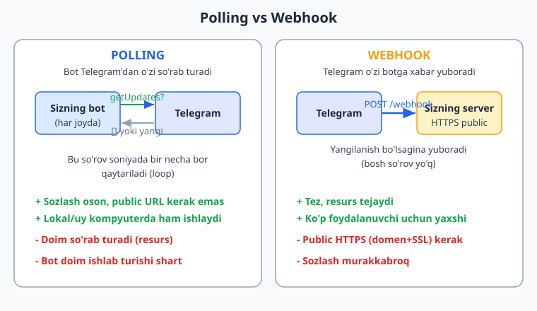
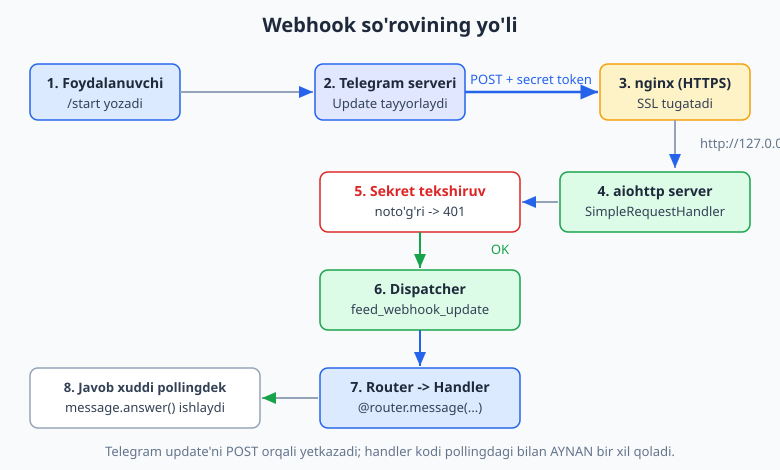
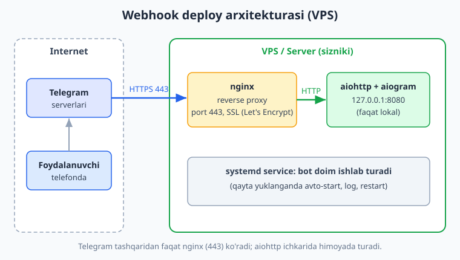

# 13 — Webhook va aiohttp server

[⬅️ Oldingi: 12 — Maxsus xususiyatlar](./12-maxsus-xususiyatlar.md) · [🏠 README](./README.md) · [Keyingi: 14 — To'lovlar va Telegram Stars ➡️](./14-tolovlar-stars.md)

---

> **Bu bobda:** botingiz Telegram'dan yangilanishlarni (`Update`) **qanday qabul qilishi** mumkinligini chuqur o'rganamiz. Hozirgacha biz **polling** (`dp.start_polling(bot)`) ishlatdik — bot Telegram'ga "yangi xabar bormi?" deb takror-takror so'rab turardi. Endi ikkinchi usul — **webhook** bilan tanishamiz: bunda **Telegram o'zi** botingizning serveriga `POST` so'rovi yuboradi.
>
> Yoritamiz: polling va webhook orasidagi farq (kim kimga murojaat qiladi); webhook ichida nima sodir bo'ladi (Telegram -> HTTPS -> sizning server -> dispatcher -> handler); `aiohttp` bilan webhook server qurish — `SimpleRequestHandler` va `setup_application`; `bot.set_webhook()` / `bot.delete_webhook()` va `get_webhook_info()`; **sekret token** bilan himoya (`X-Telegram-Bot-Api-Secret-Token`); `nginx` reverse proxy + SSL va deploy arxitekturasi; va eng muhimi — **qachon webhook, qachon polling** ishlatish.
>
> **Halol eslatma (verifikatsiya):** bu bobdagi webhook server kodi — `aiohttp` `Application` qurish, `SimpleRequestHandler.register`, `setup_application`, sekret-token tekshiruvi va dispatcher orqali handler'ga yetkazish — mening kompyuterimda **offline** (BotFather token'isiz) `aiohttp` test-klienti orqali soxta `Update` JSON yuborib **haqiqatan ishga tushirilib tekshirildi** (to'g'ri sekret -> handler ishladi, noto'g'ri sekret -> `401`). Ammo **jonli webhook** — Telegram'ning real `POST` yuborishi — **public HTTPS URL + haqiqiy BotFather token** talab qiladi. Bunday joylar matnda "illustrativ — jonli Telegram talab qiladi" deb halol belgilangan; ularda soxta "ishladi" deyilmagan.

---

## 13.1. Polling va webhook: kim kimga murojaat qiladi?

Telegram bot olamida bitta asosiy savol bor: **yangilanish (`Update`) botga qanday yetib boradi?** Foydalanuvchi `/start` bosganda, bu hodisa Telegram serverlarida paydo bo'ladi. Sizning botingiz uni qanday biladi? Ikki yo'l bor.

**Polling (so'rab turish).** Bot Telegram'ga uzluksiz so'rov yuboradi: "yangi yangilanish bormi?" (`getUpdates`). Telegram bo'sh ro'yxat (`[]`) yoki yangi yangilanishlarni qaytaradi. Bot ularni qayta ishlaydi va yana so'raydi. Bu cheksiz tsikl. `aiogram` buni `dp.start_polling(bot)` ichida avtomatik qiladi.

**Webhook (sizga yuboriladi).** Siz Telegram'ga aytasiz: "yangilanish bo'lsa, mana shu URL'ga (`https://mening-bot.uz/webhook`) `POST` so'rovi yubor." Endi bot **hech narsa so'ramaydi** — Telegram yangilanish paydo bo'lishi bilan o'zi botingizning serveriga ulanadi va `Update`'ni JSON sifatida jo'natadi.

Asosiy farq juda oddiy: **polling'da bot mijoz (client), Telegram serverga doim murojaat qiladi; webhook'da bot server, Telegram unga murojaat qiladi.**



Polling — uydagi telefonni har 2 soniyada ko'tarib "menga xabar bormi?" deb so'rashga o'xshaydi. Webhook esa — pochtachi xat kelganda eshigingizni o'zi qoqishiga o'xshaydi: siz hech narsa qilmaysiz, kerak bo'lganda sizni topishadi.

> **Eslatma:** Telegram'da bir vaqtning o'zida **faqat bittasi** ishlaydi. Agar webhook o'rnatilgan bo'lsa, `getUpdates` (polling) ishlamaydi va xatolik beradi. Polling'ga qaytmoqchi bo'lsangiz, avval `delete_webhook()` chaqirish kerak. Buni 13.5 da ko'ramiz.

## 13.2. Webhook ichida nima sodir bo'ladi?

Webhook "sehrli" emas — bu oddiy HTTP. Keling, foydalanuvchi `/start` bosganidan to handler ishlaguniga qadar bo'lgan yo'lni qadam-baqadam ko'raylik.



1. **Foydalanuvchi** `/start` yozadi.
2. **Telegram serveri** bu hodisadan `Update` obyektini tayyorlaydi (JSON).
3. Telegram sizning sozlagan URL'ingizga **HTTPS POST** yuboradi. So'rov tanasida `Update` JSON, sarlavhada (header) sizning **sekret tokeningiz** bo'ladi.
4. So'rov avval **nginx**'ga (yoki boshqa reverse proxy'ga) tushadi — u HTTPS'ni "ochadi" (SSL termination) va ichkaridagi **aiohttp** serveriga oddiy HTTP bilan uzatadi.
5. **aiohttp** ichidagi `SimpleRequestHandler` so'rovni qabul qiladi va avval **sekret tokenni tekshiradi** — agar noto'g'ri bo'lsa, darrov `401 Unauthorized` qaytaradi, handler umuman ishlamaydi.
6. To'g'ri bo'lsa, JSON `Dispatcher`ga (`feed_webhook_update`) uzatiladi.
7. Dispatcher uni `Router` va filtrlar orqali mos **handler**ga yo'naltiradi — bu **aynan pollingdagi handler bilan bir xil kod**.
8. Handler ichidagi `message.answer(...)` ham xuddi pollingdagidek ishlaydi.

**Eng muhim xulosa:** sizning handler kodingiz (`@router.message(...)`) o'zgarmaydi. Polling'dan webhook'ga o'tganda faqat **bot Telegram bilan qanday gaplashishi** o'zgaradi, handler mantig'i emas. Bu — aiogram arxitekturasining go'zalligi: `Dispatcher` + `Router` ikkala holatda ham bir xil.

## 13.3. aiohttp nima va nega aynan u?

`aiohttp` — Python uchun **asinxron** HTTP klient va server kutubxonasi. Webhook qabul qilish uchun bizga HTTP **server** kerak: Telegram `POST` qilganini "tinglab" turuvchi narsa.

Nega aynan `aiohttp`? Chunki:

- U `async/await` asosida ishlaydi — xuddi aiogram kabi. Ular bir xil event loop'da yashaydi, hech qanday ziddiyat yo'q.
- `aiogram` o'zining webhook yordamchilarini (`SimpleRequestHandler`, `setup_application`) aynan `aiohttp` uchun beradi — qo'shimcha "yelim kod" yozish kerak emas.

Yodingizda bo'lsin: webhook serveri o'rnatilgan, ammo `aiohttp` paketi yo'q bo'lsa, uni alohida o'rnatish kerak bo'lishi mumkin:

```bash
pip install aiohttp
```

Bu kitobda biz **aiogram 3.28** va **aiohttp 3.13** dan foydalanamiz (Python 3.14). Versiyalaringizni tekshirish:

```bash
python -c "import aiogram, aiohttp; print(aiogram.__version__, aiohttp.__version__)"
```

## 13.4. Eng oddiy webhook server

Endi to'liq webhook serveri kodini ko'raylik. Avval qismlarni tushunamiz, keyin yig'amiz.

### Kerakli importlar

```python
from aiohttp import web
from aiogram import Bot, Dispatcher, Router
from aiogram.filters import CommandStart
from aiogram.types import Message
from aiogram.webhook.aiohttp_server import SimpleRequestHandler, setup_application
```

`SimpleRequestHandler` va `setup_application` — `aiogram.webhook.aiohttp_server` modulidan keladi. Bu **aiogram 3.x**ning to'g'ri yo'li (2.x da bularning hammasi boshqacha edi — pastda eslatib o'tamiz).

### To'liq kod (illustrativ — jonli Telegram talab qiladi)

```python
import os
from aiohttp import web
from aiogram import Bot, Dispatcher, Router
from aiogram.filters import CommandStart
from aiogram.types import Message
from aiogram.webhook.aiohttp_server import SimpleRequestHandler, setup_application

# --- Sozlamalar (.env dan) ---
BOT_TOKEN = os.environ["BOT_TOKEN"]            # KODGA yozilmaydi!
BASE_URL = os.environ["BASE_URL"]              # masalan: https://mening-bot.uz
WEBHOOK_PATH = "/webhook"                       # serverdagi yo'l
WEBHOOK_URL = f"{BASE_URL}{WEBHOOK_PATH}"       # to'liq URL
WEBHOOK_SECRET = os.environ["WEBHOOK_SECRET"]   # sekret token (pastda tushuntiramiz)

# aiohttp ichki server qaysi manzilda tinglashi:
WEB_HOST = "0.0.0.0"
WEB_PORT = 8080

router = Router()


@router.message(CommandStart())
async def start_handler(message: Message):
    # Bu handler pollingdagi bilan AYNAN bir xil!
    await message.answer("Salom! Men webhook orqali ishlayapman.")


async def on_startup(bot: Bot) -> None:
    # Server ishga tushganda Telegram'ga webhook'ni e'lon qilamiz:
    await bot.set_webhook(
        url=WEBHOOK_URL,
        secret_token=WEBHOOK_SECRET,
        drop_pending_updates=True,   # eski yangilanishlarni tashlab yuboramiz
        allowed_updates=["message", "callback_query"],
    )


def main() -> None:
    bot = Bot(token=BOT_TOKEN)
    dp = Dispatcher()
    dp.include_router(router)

    # Server ishga tushganda on_startup chaqiriladi:
    dp.startup.register(on_startup)

    # aiohttp ilovasini quramiz:
    app = web.Application()

    # Webhook'ni qabul qiluvchi handler'ni /webhook yo'liga ulaymiz:
    webhook_handler = SimpleRequestHandler(
        dispatcher=dp,
        bot=bot,
        secret_token=WEBHOOK_SECRET,
    )
    webhook_handler.register(app, path=WEBHOOK_PATH)

    # aiogram'ning startup/shutdown jarayonini aiohttp'ga bog'laymiz:
    setup_application(app, dp, bot=bot)

    # Serverni ishga tushiramiz (bloklovchi chaqiruv):
    web.run_app(app, host=WEB_HOST, port=WEB_PORT)


if __name__ == "__main__":
    main()
```

Bu kod **to'g'ri** (3.x idiomi), lekin uni jonli ishlatish uchun haqiqiy `BOT_TOKEN`, `BASE_URL` (public HTTPS domen) va `WEBHOOK_SECRET` kerak. Mening kompyuterimda men buning **routing va sekret-token qismini offline tekshirdim** (13.7 ga qarang) — soxta `Update` JSON yuborib, handler ishlaganini va sekret tekshiruvi to'g'ri ishlaganini ko'rdim.

### Qismlarni tushunamiz

`SimpleRequestHandler` — bitta bot uchun webhook ishlovchisi. U:

- `dispatcher` — sizning `Dispatcher`'ingiz.
- `bot` — `Bot` obyekti.
- `secret_token` — sekret token (ixtiyoriy, ammo doim ishlating!).

`.register(app, path=WEBHOOK_PATH)` — bu handler'ni `aiohttp` ilovasidagi `/webhook` yo'liga `POST` route sifatida bog'laydi. Telegram aynan shu yo'lga `POST` qilganda handler ishlaydi.

`setup_application(app, dp, bot=bot)` — `aiogram`ning `startup`/`shutdown` hodisalarini `aiohttp`ning ilova hayot tsikliga (`on_startup`/`on_shutdown`) ulaydi. Buni qo'shmasangiz, `dp.startup.register(...)` bilan ro'yxatdan o'tgan `on_startup` umuman chaqirilmaydi — ya'ni `set_webhook` ishlamay qoladi. Shuning uchun bu qator **shart**.

`web.run_app(app, host=..., port=...)` — `aiohttp` serverini ishga tushiradi. Bu — pollingdagi `dp.start_polling(bot)` ning webhook'dagi muqobili: dasturni bloklab, doimiy ishlab turadi.

> **`startup.register` vs `on_startup` parametri:** aiogram 3.x da `on_startup` funksiyasiga `bot` parametri kerak bo'lsa, dispatcher uni avtomatik uzatadi (xuddi handler'ga `Bot` injektsiya qilingani kabi). Shuning uchun `async def on_startup(bot: Bot)` deb yozsangiz, ishlaydi.

## 13.5. set_webhook, delete_webhook va get_webhook_info

Telegram'ga "men webhook ishlataman" deb aytish uchun `set_webhook` chaqiriladi. Eng muhim parametrlar:

```python
await bot.set_webhook(
    url="https://mening-bot.uz/webhook",   # MAJBURIY: public HTTPS URL
    secret_token="...",                     # sekret token (himoya)
    drop_pending_updates=True,              # bot o'chiq turganda kelgan eski yangilanishlarni o'chirish
    allowed_updates=["message", "callback_query"],  # qaysi turdagi yangilanishlar kerak
    max_connections=40,                     # bir vaqtdagi maksimal ulanishlar (ixtiyoriy)
)
```

`url` **HTTPS** bo'lishi shart — Telegram `http://` ni qabul qilmaydi. Domen va SSL sertifikat kerak (13.8 ga qarang).

`delete_webhook` — webhook'ni o'chirib, polling'ga qaytish uchun:

```python
await bot.delete_webhook(drop_pending_updates=True)
```

`get_webhook_info` — joriy webhook holatini bilish uchun (debug paytida juda foydali):

```python
info = await bot.get_webhook_info()
print(info.url)                    # o'rnatilgan URL ('' bo'lsa - webhook yo'q)
print(info.pending_update_count)   # qayta ishlanmagan yangilanishlar soni
print(info.last_error_message)     # oxirgi xatolik (masalan, SSL muammosi)
```

`last_error_message` — webhook ishlamayotgan bo'lsa, birinchi qaraydigan joyingiz. Masalan, "Wrong response from the webhook: 500 Internal Server Error" yoki SSL bilan bog'liq xato bo'lishi mumkin.

Bu uch metod ham **jonli BotFather token + internet talab qiladi** — ular Telegram serveriga real so'rov yuboradi. Men ularni jonli chaqira olmadim (token yo'q), ammo `SetWebhook`/`DeleteWebhook` **metod obyektlarining qurilishini va parametrlari to'g'ri o'tishini offline tekshirdim** (13.7 ga qarang).

### Webhook'ni qachon o'rnatamiz?

Ko'p odam adashadi: `set_webhook`'ni qayta-qayta chaqirish shart emas. Telegram webhook'ni **eslab qoladi** — bir marta o'rnatsangiz, siz o'chirmaguningizcha (yoki yangi URL bilan qayta o'rnatmaguningizcha) saqlanib turadi. Shuning uchun yuqoridagi kodda `set_webhook` ni `on_startup` ga qo'ydik: server har ishga tushganda bir marta yangilanadi, kerakli URL doim aktual bo'ladi.

## 13.6. Sekret token bilan himoya

Webhook'ning bitta jiddiy xavfi bor: sizning `/webhook` URL'ingiz internetda ochiq. **Har kim** unga soxta `Update` JSON yuborishga urinishi mumkin — go'yo Telegram'dan kelganday. Buni qanday to'xtatamiz?

Yechim — **sekret token**. `set_webhook(secret_token="...")` chaqirganingizda, Telegram **har bir** `POST` so'roviga maxsus sarlavha qo'shadi:

```
X-Telegram-Bot-Api-Secret-Token: <sizning-sekretingiz>
```

`SimpleRequestHandler` ham `secret_token` bilan sozlangani uchun, u **har so'rovda** bu sarlavhani tekshiradi. Mos kelmasa — `401 Unauthorized` qaytaradi va handler **umuman ishlamaydi**. Shunday qilib faqat haqiqiy Telegram so'rovlari o'tadi.

Sekret token — uzun, taxmin qilib bo'lmaydigan satr bo'lishi kerak. Uni shunday yaratish mumkin:

```python
import secrets
print(secrets.token_urlsafe(32))   # masalan: oLj68mxWH_AnUQ8s...
```

Bu satrni `.env` faylga `WEBHOOK_SECRET=` sifatida saqlang. **Ruxsat etilgan belgilar:** Telegram sekret token uchun faqat `A-Z`, `a-z`, `0-9`, `_` va `-` belgilarini, 1-256 uzunlikda qabul qiladi. `secrets.token_urlsafe` aynan shu belgilarni beradi — qulay.

> **Bu offline tekshirildi:** men `SimpleRequestHandler`'ga to'g'ri va noto'g'ri sekret bilan so'rov yubordim. To'g'ri sekret bilan handler ishladi (status `200`), noto'g'ri bilan `401` qaytdi va handler umuman chaqirilmadi. Kod 13.7 da.

## 13.7. Webhook serverni OFFLINE tekshirish (tokensiz)

Token va public URL yo'qligida ham webhook serverning **mantig'ini** to'liq tekshirsa bo'ladi. Hiyla — Telegram o'rniga **biz o'zimiz** `aiohttp` test-klienti orqali soxta `Update` JSON yuboramiz. Bot Telegram'ga hech narsa yubormasa (handler ichida tarmoq chaqiruvi bo'lmasa), token kerak emas.

```python
import asyncio
from datetime import datetime

from aiohttp import web
from aiohttp.test_utils import TestClient, TestServer

from aiogram import Bot, Dispatcher, Router, F
from aiogram.filters import CommandStart
from aiogram.types import Message
from aiogram.fsm.storage.memory import MemoryStorage
from aiogram.webhook.aiohttp_server import SimpleRequestHandler, setup_application

FAKE_TOKEN = "123456:AAH-FakeTest_abc"   # soxta token (tarmoqqa chiqmaymiz)
WEBHOOK_PATH = "/webhook"
SECRET = "my-very-secret-string"

router = Router()
seen = []   # qaysi handler ishlaganini kuzatish uchun


@router.message(CommandStart())
async def start_handler(message: Message):
    seen.append(("start", message.chat.id))
    # message.answer() CHAQIRMAYMIZ -> tarmoqqa chiqmaydi (offline)


@router.message(F.text)
async def echo_handler(message: Message):
    seen.append(("echo", message.text))


def make_update_json(update_id: int, text: str) -> dict:
    return {
        "update_id": update_id,
        "message": {
            "message_id": update_id,
            "date": int(datetime.now().timestamp()),
            "chat": {"id": 555, "type": "private"},
            "from": {"id": 555, "is_bot": False, "first_name": "Test"},
            "text": text,
        },
    }


async def main():
    bot = Bot(token=FAKE_TOKEN)
    dp = Dispatcher(storage=MemoryStorage())
    dp.include_router(router)

    app = web.Application()
    handler = SimpleRequestHandler(dispatcher=dp, bot=bot, secret_token=SECRET)
    handler.register(app, path=WEBHOOK_PATH)
    setup_application(app, dp, bot=bot)

    server = TestServer(app)
    client = TestClient(server)
    await client.start_server()

    # 1) To'g'ri sekret bilan /start -> handler ishlaydi (200)
    resp = await client.post(
        WEBHOOK_PATH,
        json=make_update_json(1, "/start"),
        headers={"X-Telegram-Bot-Api-Secret-Token": SECRET},
    )
    assert resp.status == 200

    # 2) To'g'ri sekret bilan oddiy matn -> echo handler
    resp = await client.post(
        WEBHOOK_PATH,
        json=make_update_json(2, "salom"),
        headers={"X-Telegram-Bot-Api-Secret-Token": SECRET},
    )
    assert resp.status == 200

    # 3) NOTO'G'RI sekret -> 401, handler ISHLAMAYDI
    resp = await client.post(
        WEBHOOK_PATH,
        json=make_update_json(3, "/start"),
        headers={"X-Telegram-Bot-Api-Secret-Token": "wrong-token"},
    )
    assert resp.status == 401

    await client.close()
    await bot.session.close()

    print("seen =", seen)
    assert ("start", 555) in seen
    assert ("echo", "salom") in seen
    assert seen.count(("start", 555)) == 1   # noto'g'ri sekret o'tmadi
    print("HAMMASI OK: webhook routing + sekret tekshiruv ishladi (offline)")


if __name__ == "__main__":
    asyncio.run(main())
```

Ishga tushirsangiz quyidagini ko'rasiz (men kompyuterimda ko'rganim, **soxta natija emas**):

```text
seen = [('start', 555), ('echo', 'salom')]
HAMMASI OK: webhook routing + sekret tekshiruv ishladi (offline)
```

Bu nimani isbotladi? **Webhook serverning butun zanjiri ishlaydi:** `aiohttp` so'rovni qabul qildi -> `SimpleRequestHandler` sekretni tekshirdi -> `Dispatcher` `Update`'ni qabul qildi -> `Router` to'g'ri handler'ni topdi. Va eng muhimi — **noto'g'ri sekret `401` bilan bloklandi**. Bularning hammasi tokensiz, real Telegram'siz tekshirildi.

## 13.8. SSL, reverse proxy (nginx) va deploy arxitekturasi

Telegram webhook URL'ining **HTTPS** bo'lishini talab qiladi. Bu degani sizga: (1) domen (yoki public IP), (2) SSL sertifikat kerak. Eng oson yo'l — **nginx** ni reverse proxy sifatida ishlatib, sertifikatni bepul **Let's Encrypt**'dan olish.



**Nega to'g'ridan-to'g'ri aiohttp'ni 443-portga qo'ymaymiz?** Texnik jihatdan mumkin (`web.run_app(..., ssl_context=...)`), lekin amalda yaxshi emas. nginx:

- SSL'ni samarali "tugatadi" (termination), aiohttp ichkarida oddiy HTTP bilan ishlaydi — kod soddalashadi.
- Bir nechta xizmatni (bot + sayt + boshqa botlar) bitta serverda, bitta 443-portda boshqarishga imkon beradi.
- Tashqi internet faqat nginx'ni ko'radi; aiohttp `127.0.0.1:8080` da ichkarida himoyada turadi.

### nginx konfiguratsiyasi (illustrativ — server talab qiladi)

```nginx
server {
    listen 443 ssl;
    server_name mening-bot.uz;

    ssl_certificate     /etc/letsencrypt/live/mening-bot.uz/fullchain.pem;
    ssl_certificate_key /etc/letsencrypt/live/mening-bot.uz/privkey.pem;

    location /webhook {
        proxy_pass http://127.0.0.1:8080;          # ichki aiohttp
        proxy_set_header Host $host;
        proxy_set_header X-Real-IP $remote_addr;
        proxy_set_header X-Forwarded-For $proxy_add_x_forwarded_for;
    }
}
```

Bu konfiguratsiyada Telegram `https://mening-bot.uz/webhook` ga `POST` qiladi -> nginx uni `http://127.0.0.1:8080/webhook` ga uzatadi -> aiohttp qabul qiladi. `X-Forwarded-For` sarlavhasi muhim: agar aiogram'ning `IPFilter` (IP bo'yicha cheklov) ni ishlatsangiz, u real IP'ni shu sarlavhadan oladi.

### Let's Encrypt bilan bepul sertifikat (illustrativ)

```bash
# certbot o'rnatib, nginx uchun sertifikat olamiz:
sudo certbot --nginx -d mening-bot.uz
```

Bu buyruq sertifikatni oladi, nginx konfiguratsiyasini avtomatik yangilaydi va avto-yangilanishni (renewal) sozlaydi. **Diqqat:** Telegram self-signed (o'zi imzolagan) sertifikatlarni ham qabul qiladi, lekin Let's Encrypt sertifikati bilan ishlash ancha sodda — bunda `set_webhook`'ga `certificate=` berish kerak emas.

### systemd bilan botni doimiy ishlatish (illustrativ)

Bot serverda doimiy ishlab turishi kerak (terminal yopilganda o'lib qolmasligi uchun). Buning uchun `systemd` service:

```ini
# /etc/systemd/system/mening-bot.service
[Unit]
Description=Telegram bot (webhook)
After=network.target

[Service]
Type=simple
WorkingDirectory=/opt/mening-bot
ExecStart=/opt/mening-bot/.venv/bin/python -m bot
Restart=always
EnvironmentFile=/opt/mening-bot/.env

[Install]
WantedBy=multi-user.target
```

```bash
sudo systemctl enable --now mening-bot
sudo systemctl status mening-bot      # holatni ko'rish
sudo journalctl -u mening-bot -f      # loglarni jonli kuzatish
```

`Restart=always` — bot xato bilan to'xtasa, systemd uni avtomatik qayta ishga tushiradi. `EnvironmentFile` esa `.env`dan `BOT_TOKEN`, `WEBHOOK_SECRET` kabi maxfiy ma'lumotlarni yuklaydi. Deploy bo'yicha umumiy bilim uchun [Git/GitHub qo'llanmasiga](../git-github/README.md) ham qarang.

## 13.9. Qachon webhook, qachon polling?

Bu — eng amaliy savol. Qisqa javob: **boshlovchi va rivojlantirish (development) uchun — polling; jiddiy production uchun — webhook.**

| Holat | Tavsiya | Sabab |
| --- | --- | --- |
| Botni o'rganyapsiz, lokalda yozyapsiz | **Polling** | Domen, SSL, server kerak emas — `python bot.py` va tayyor |
| Uy kompyuterida / Raspberry Pi'da kichik bot | **Polling** | Public IP yo'q, ammo polling internetga o'zi chiqadi |
| Kam foydalanuvchili shaxsiy bot | **Polling** | Sozlash arzimaydi, polling yetarli |
| Ko'p foydalanuvchili, yuqori yuk | **Webhook** | Tezroq, resurs tejaydi, masshtablanadi |
| Bepul hosting / serverless (faqat HTTP qabul qiladi) | **Webhook** | Bunday muhitlar ko'pincha doimiy polling jarayonini ko'tarmaydi |
| Bir nechta bot bitta serverda | **Webhook** | nginx orqali bitta 443-portda hammasini boshqarish qulay |

**Polling afzalliklari:** sozlash juda oson, public URL/SSL kerak emas, NAT/firewall orqasida ham ishlaydi (chunki bot o'zi tashqariga chiqadi).

**Webhook afzalliklari:** Telegram faqat yangilanish bo'lganda ulanadi (bo'sh so'rovlar yo'q) — tezroq javob, kamroq resurs; ko'p foydalanuvchi uchun yaxshi masshtablanadi.

**Amaliy maslahat:** kodingizni shunday yozingki, ikkalasini ham qo'llab-quvvatlasin. `Dispatcher` va `Router` bir xil bo'lgani uchun, faqat "ishga tushirish" qismini (`start_polling` vs `web.run_app`) atrof-muhit o'zgaruvchisiga (masalan, `USE_WEBHOOK=1`) qarab tanlash mumkin. Lokalda polling bilan tez sinaysiz, serverda webhook bilan ishlaydi.

```python
import os

def run() -> None:
    if os.getenv("USE_WEBHOOK") == "1":
        run_webhook()    # 13.4 dagi web.run_app(...)
    else:
        run_polling()    # asyncio.run(dp.start_polling(bot))
```

> **2.x eslatmasi (ISHLATMANG):** eski aiogram 2.x da webhook butunlay boshqacha edi — `aiogram.utils.executor` dan `start_webhook(...)`, `set_webhook` ni `executor` ichida, `WebhookRequestHandler` va boshqa API'lar bor edi. Internetdagi eski maqolalarda shu ko'rinadi. **3.x da ular yo'q** — faqat `aiogram.webhook.aiohttp_server` dan `SimpleRequestHandler` + `setup_application` + `web.run_app` ishlating.

## Mashqlar

Quyidagi mashqlarning ko'pini **token va internetsiz, offline** (13.7 dagi `TestClient` namunasi yoki oddiy import+chaqiruv bilan) bajarish mumkin. Jonli Telegram talab qiladiganlari alohida belgilangan.

### Oson

1. **Versiyalarni tekshirish.** Bitta buyruq bilan o'rnatilgan `aiogram` va `aiohttp` versiyalarini chop eting. Versiyalar bobdagi (3.28 / 3.13) bilan mos kelishini tasdiqlang.
2. **Polling va webhook farqi.** O'z so'zlaringiz bilan yozing: pollingda kim mijoz, kim server? Webhookda-chi? Bitta jumlada ayting.
3. **Sekret token yaratish.** `secrets.token_urlsafe(32)` yordamida sekret token yarating va uning uzunligini chop eting. Nega bunday token kerakligini bir jumlada izohlang.
4. **Webhook URL'ni qurish.** `BASE_URL = "https://bot.example.uz"` va `WEBHOOK_PATH = "/tg/hook"` berilgan. To'liq `WEBHOOK_URL` ni f-string bilan yasang va chop eting.
5. **set_webhook parametri.** `SetWebhook` obyektini `url`, `secret_token` va `drop_pending_updates=True` bilan quring (faqat obyekt, jonli yuborish emas) va `obj.url`, `obj.drop_pending_updates` ni tekshiring.
6. **handler.register route.** Bo'sh `web.Application()` yarating, `SimpleRequestHandler(...).register(app, path="/hook")` chaqiring va ilovada `POST /hook` route paydo bo'lganini tasdiqlang.

### O'rta

7. **Offline webhook test.** 13.7 dagi kodni o'zgartiring: `/start` o'rniga `/help` buyrug'iga javob beruvchi handler qo'shing va `TestClient` orqali `/help` yuborib, handler ishlaganini tasdiqlang.
8. **Noto'g'ri sekret bloklanishi.** 13.7 kodida noto'g'ri sekret bilan yuborilgan so'rov `401` qaytishini va handler `seen` ro'yxatiga **tushmasligini** tekshiruvchi assert yozing.
9. **setup_application hooklari.** `setup_application(app, dp)` chaqirilganda `app.on_startup` va `app.on_shutdown` ro'yxatlariga bittadan funksiya qo'shilishini tekshiring (chaqirishdan oldin va keyin uzunlikni solishtiring).
10. **Health-check endpoint.** Webhook ilovasiga oddiy `GET /health` route qo'shing (faqat `"ok"` qaytarsin). `TestClient` bilan `GET /health` yuborib `200` va tana `"ok"` ekanini tasdiqlang. (Maslahat: bu monitoring tizimlari uchun foydali.)
11. **Sekretsiz handler.** `SimpleRequestHandler` ni `secret_token` bermasdan yarating. `verify_secret("istalgan-narsa", bot)` doim `True` qaytishini tekshiring va nega bu xavfli ekanini izohlang.
12. **Polling/webhook tanlovchi.** `USE_WEBHOOK` muhit o'zgaruvchisiga qarab `"webhook"` yoki `"polling"` matnini qaytaruvchi `choose_mode()` funksiyasi yozing va ikkala holatni ham sinab ko'ring (jonli ishga tushirmasdan).

### Qiyin

13. **Ikki router orqali to'liq oqim.** Ikkita `Router` yarating: birida `CommandStart`, ikkinchisida `F.text`. Ularni dispatcher'ga ulang va `TestClient` orqali avval `/start`, keyin `salom` yuborib, har biri to'g'ri router'dagi handler'ga tushganini tasdiqlang.
14. **FSM webhook ustida.** 13.7 namunasiga `MemoryStorage` va kichik FSM qo'shing: `/register` buyrug'i `waiting_name` holatiga o'tkazsin, keyingi matn esa ismni "saqlasin" (ro'yxatga qo'shsin). `TestClient` orqali ketma-ket ikki so'rov yuborib, holat o'tishi to'g'ri ishlaganini tasdiqlang. (Bu webhook va FSM birga ishlashini ko'rsatadi.)
15. **X-Forwarded-For mantig'i.** `aiogram.webhook.aiohttp_server.check_ip` qanday ishlashini o'rganing: agar `X-Forwarded-For` sarlavhasida bir nechta IP bo'lsa (`"1.2.3.4, 5.6.7.8"`), eng chapdagisi olinadi. Nega reverse proxy ortida bu muhimligini 2-3 jumlada izohlang.

<details markdown="1"><summary>Yechimlar</summary>

### 1. Versiyalarni tekshirish

```bash
python -c "import aiogram, aiohttp; print('aiogram', aiogram.__version__, '| aiohttp', aiohttp.__version__)"
```

Natija (mening kompyuterimda): `aiogram 3.28.2 | aiohttp 3.13.5`. Bu bobdagi 3.28 / 3.13 bilan mos.

### 2. Polling va webhook farqi

Pollingda **bot — mijoz (client)**: u Telegram serveriga doim murojaat qilib, "yangilanish bormi?" deb so'raydi. Webhookda **bot — server**: Telegram unga murojaat qilib, yangilanishni `POST` orqali o'zi yuboradi. Qisqasi: pollingda bot so'raydi, webhookda Telegram yetkazadi.

### 3. Sekret token yaratish

```python
import secrets
token = secrets.token_urlsafe(32)
print(len(token), token)
```

`token_urlsafe(32)` taxminan 43 belgili, URL'ga xavfsiz satr beradi. Bu token webhook so'rovi haqiqatan Telegram'dan kelganini tasdiqlash uchun kerak — begona odam soxta `Update` yuborolmasligi uchun.

### 4. Webhook URL'ni qurish

```python
BASE_URL = "https://bot.example.uz"
WEBHOOK_PATH = "/tg/hook"
WEBHOOK_URL = f"{BASE_URL}{WEBHOOK_PATH}"
print(WEBHOOK_URL)   # https://bot.example.uz/tg/hook
```

### 5. set_webhook parametri

```python
from aiogram.methods import SetWebhook

obj = SetWebhook(
    url="https://bot.example.uz/tg/hook",
    secret_token="my-secret",
    drop_pending_updates=True,
)
assert obj.url == "https://bot.example.uz/tg/hook"
assert obj.secret_token == "my-secret"
assert obj.drop_pending_updates is True
print("OK: SetWebhook obyekti to'g'ri qurildi")
```

Bu faqat obyektni quradi (Telegram'ga yubormaydi) — shuning uchun tokensiz ishlaydi.

### 6. handler.register route

```python
from aiohttp import web
from aiogram import Bot, Dispatcher
from aiogram.webhook.aiohttp_server import SimpleRequestHandler

bot = Bot(token="123456:AAH-FakeTest_abc")
dp = Dispatcher()

app = web.Application()
SimpleRequestHandler(dispatcher=dp, bot=bot).register(app, path="/hook")

routes = [r.method + " " + r.resource.canonical for r in app.router.routes()]
assert "POST /hook" in routes, routes
print("OK:", routes)
```

`SimpleRequestHandler.register` ilovaga `POST /hook` route qo'shadi — Telegram aynan shu yo'lga `POST` qiladi.

### 7. Offline webhook test (/help)

13.7 dagi kodga quyidagi handler'ni qo'shamiz:

```python
from aiogram.filters import Command

@router.message(Command("help"))
async def help_handler(message: Message):
    seen.append(("help", message.chat.id))
```

Va testga:

```python
resp = await client.post(
    WEBHOOK_PATH,
    json=make_update_json(10, "/help"),
    headers={"X-Telegram-Bot-Api-Secret-Token": SECRET},
)
assert resp.status == 200
assert ("help", 555) in seen
print("OK: /help handler webhook orqali ishladi")
```

> Diqqat: `Command("help")` filtri `F.text` echo handlerdan **oldin** turishi kerak, aks holda `F.text` uni "ushlab" oladi (router ichida tartib muhim).

### 8. Noto'g'ri sekret bloklanishi

```python
before = len(seen)
resp = await client.post(
    WEBHOOK_PATH,
    json=make_update_json(99, "/start"),
    headers={"X-Telegram-Bot-Api-Secret-Token": "xato-sekret"},
)
assert resp.status == 401, f"kutilgan 401, olindi {resp.status}"
assert len(seen) == before, "handler ishlamasligi kerak edi!"
print("OK: noto'g'ri sekret 401 bilan bloklandi, handler ishlamadi")
```

### 9. setup_application hooklari

```python
from aiohttp import web
from aiogram import Bot, Dispatcher
from aiogram.webhook.aiohttp_server import setup_application

bot = Bot(token="123456:AAH-FakeTest_abc")
dp = Dispatcher()
app = web.Application()

s_before, sh_before = len(app.on_startup), len(app.on_shutdown)
setup_application(app, dp, bot=bot)
assert len(app.on_startup) == s_before + 1
assert len(app.on_shutdown) == sh_before + 1
print("OK: setup_application startup va shutdown hooklarini qo'shdi")
```

### 10. Health-check endpoint

```python
import asyncio
from aiohttp import web
from aiohttp.test_utils import TestClient, TestServer
from aiogram import Bot, Dispatcher
from aiogram.webhook.aiohttp_server import SimpleRequestHandler, setup_application

async def main():
    bot = Bot(token="123456:AAH-FakeTest_abc")
    dp = Dispatcher()
    app = web.Application()

    async def health(request):
        return web.Response(text="ok")

    app.router.add_get("/health", health)
    SimpleRequestHandler(dispatcher=dp, bot=bot).register(app, path="/webhook")
    setup_application(app, dp, bot=bot)

    client = TestClient(TestServer(app))
    await client.start_server()
    resp = await client.get("/health")
    assert resp.status == 200
    assert (await resp.text()) == "ok"
    await client.close()
    await bot.session.close()
    print("OK: GET /health -> 200 'ok'")

asyncio.run(main())
```

Bunday endpoint monitoring (masalan, UptimeRobot) yoki yuk muvozanatlagich (load balancer) bot tirikligini tekshirishi uchun foydali.

### 11. Sekretsiz handler

```python
from aiogram import Bot, Dispatcher
from aiogram.webhook.aiohttp_server import SimpleRequestHandler

bot = Bot(token="123456:AAH-FakeTest_abc")
dp = Dispatcher()
h = SimpleRequestHandler(dispatcher=dp, bot=bot)   # secret_token berilmadi

assert h.verify_secret("istalgan-narsa", bot) is True
assert h.verify_secret("", bot) is True
print("OK: sekretsiz handler har qanday so'rovni o'tkazadi")
```

Bu **xavfli**: `secret_token` bermasangiz, `verify_secret` doim `True` qaytaradi, ya'ni internetdagi har kim sizning `/webhook` URL'ingizga soxta `Update` yuborib, botingizni "aldashi" mumkin. Shuning uchun production'da doim `secret_token` ishlating.

### 12. Polling/webhook tanlovchi

```python
import os

def choose_mode() -> str:
    return "webhook" if os.getenv("USE_WEBHOOK") == "1" else "polling"

# sinov:
os.environ["USE_WEBHOOK"] = "1"
assert choose_mode() == "webhook"
os.environ.pop("USE_WEBHOOK")
assert choose_mode() == "polling"
print("OK: rejim tanlovchi to'g'ri ishladi")
```

Real kodda `choose_mode()` natijasiga qarab `run_webhook()` yoki `run_polling()` chaqirasiz — bu lokalda polling, serverda webhook ishlatishga imkon beradi.

### 13. Ikki router orqali to'liq oqim

```python
import asyncio
from datetime import datetime
from aiohttp import web
from aiohttp.test_utils import TestClient, TestServer
from aiogram import Bot, Dispatcher, Router, F
from aiogram.filters import CommandStart
from aiogram.types import Message
from aiogram.webhook.aiohttp_server import SimpleRequestHandler, setup_application

cmd_router = Router()
text_router = Router()
log = []

@cmd_router.message(CommandStart())
async def on_start(message: Message):
    log.append(("cmd_router", "start"))

@text_router.message(F.text)
async def on_text(message: Message):
    log.append(("text_router", message.text))

def upd(i, text):
    return {"update_id": i, "message": {"message_id": i,
            "date": int(datetime.now().timestamp()),
            "chat": {"id": 7, "type": "private"},
            "from": {"id": 7, "is_bot": False, "first_name": "T"},
            "text": text}}

async def main():
    bot = Bot(token="123456:AAH-FakeTest_abc")
    dp = Dispatcher()
    dp.include_router(cmd_router)    # avval buyruqlar
    dp.include_router(text_router)   # keyin umumiy matn
    app = web.Application()
    SimpleRequestHandler(dispatcher=dp, bot=bot).register(app, path="/wh")
    setup_application(app, dp, bot=bot)
    client = TestClient(TestServer(app))
    await client.start_server()
    await client.post("/wh", json=upd(1, "/start"))
    await client.post("/wh", json=upd(2, "salom"))
    await client.close()
    await bot.session.close()
    print("log =", log)
    assert ("cmd_router", "start") in log
    assert ("text_router", "salom") in log
    print("OK: ikki router orqali oqim to'g'ri taqsimlandi")

asyncio.run(main())
```

`/start` `cmd_router`'ga, `salom` esa `text_router`'ga tushdi — chunki router'lar ulanish tartibida sinaladi va `CommandStart` `/start` ga mos kelib, uni "ushlab" oldi.

### 14. FSM webhook ustida

```python
import asyncio
from datetime import datetime
from aiohttp import web
from aiohttp.test_utils import TestClient, TestServer
from aiogram import Bot, Dispatcher, Router, F
from aiogram.filters import Command
from aiogram.types import Message
from aiogram.fsm.context import FSMContext
from aiogram.fsm.state import State, StatesGroup
from aiogram.fsm.storage.memory import MemoryStorage
from aiogram.webhook.aiohttp_server import SimpleRequestHandler, setup_application

class Reg(StatesGroup):
    waiting_name = State()

router = Router()
saved = []

@router.message(Command("register"))
async def start_reg(message: Message, state: FSMContext):
    await state.set_state(Reg.waiting_name)

@router.message(Reg.waiting_name, F.text)
async def got_name(message: Message, state: FSMContext):
    saved.append(message.text)
    await state.clear()

def upd(i, text):
    return {"update_id": i, "message": {"message_id": i,
            "date": int(datetime.now().timestamp()),
            "chat": {"id": 3, "type": "private"},
            "from": {"id": 3, "is_bot": False, "first_name": "T"},
            "text": text}}

async def main():
    bot = Bot(token="123456:AAH-FakeTest_abc")
    dp = Dispatcher(storage=MemoryStorage())
    dp.include_router(router)
    app = web.Application()
    SimpleRequestHandler(dispatcher=dp, bot=bot).register(app, path="/wh")
    setup_application(app, dp, bot=bot)
    client = TestClient(TestServer(app))
    await client.start_server()
    await client.post("/wh", json=upd(1, "/register"))   # waiting_name ga o'tadi
    await client.post("/wh", json=upd(2, "Oqil"))         # ism saqlanadi
    await client.close()
    await bot.session.close()
    print("saved =", saved)
    assert saved == ["Oqil"], saved
    print("OK: FSM webhook orqali ham to'g'ri ishladi")

asyncio.run(main())
```

Bu FSM va webhook birga ishlashini ko'rsatadi: holat (`MemoryStorage`) bir `POST`dan keyingisigacha saqlanib turadi, chunki ikkala so'rov ham bir xil `chat.id`/`from.id` bilan keladi.

### 15. X-Forwarded-For mantig'i

`check_ip` avval `X-Forwarded-For` sarlavhasini qaraydi. Agar u bo'lsa va ichida bir nechta IP bo'lsa (`"1.2.3.4, 5.6.7.8"`), `split(",", maxsplit=1)` orqali **eng chapdagi** IP (`1.2.3.4`) olinadi.

Nega bu reverse proxy ortida muhim? Telegram so'rovi avval nginx'ga keladi, nginx esa uni ichki aiohttp'ga uzatadi. aiohttp uchun ulanishning "to'g'ridan-to'g'ri" IP'si — bu nginx (`127.0.0.1`), real jo'natuvchi emas. Shuning uchun nginx asl jo'natuvchining IP'sini `X-Forwarded-For` sarlavhasiga yozadi. Agar so'rov bir nechta proxy/yuk muvozanatlagich orqali o'tgan bo'lsa, sarlavhada IP'lar zanjiri bo'ladi va eng chapdagisi — asl mijoz IP'si. aiogram aynan shuni oladi, shuning uchun `IPFilter` (Telegram IP diapazonlarini ruxsat berish) reverse proxy ortida ham to'g'ri ishlaydi.

</details>

---

[⬅️ Oldingi: 12 — Maxsus xususiyatlar](./12-maxsus-xususiyatlar.md) · [🏠 README](./README.md) · [Keyingi: 14 — To'lovlar va Telegram Stars ➡️](./14-tolovlar-stars.md)
