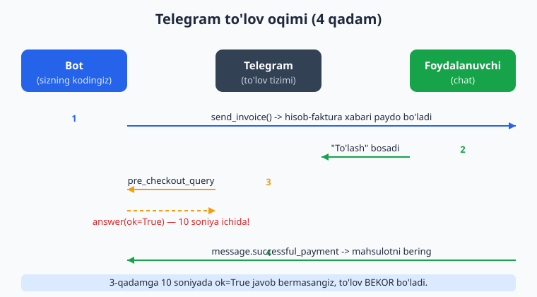
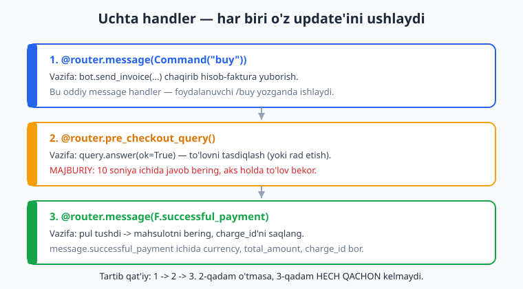
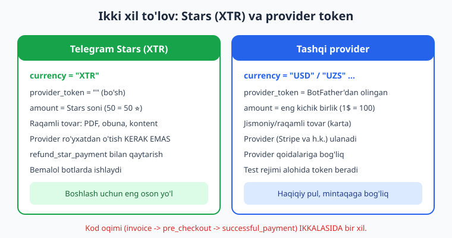

# 14 — To'lovlar va Telegram Stars

[⬅️ Oldingi: 13 — Webhook va aiohttp server](./13-webhook-deploy.md) · [🏠 README](./README.md) · [Keyingi: 15 — Rejalashtirilgan vazifalar va broadcast ➡️](./15-rejalashtirilgan-broadcast.md)

---

> **Bu bobda:** Botingiz orqali pul (yoki Telegram Stars) yig'ishni o'rganamiz. To'lov oqimining uchta qadamini batafsil ko'ramiz: `send_invoice` bilan hisob-faktura (invoice) yuborish, `pre_checkout_query` ni `answer_pre_checkout_query` bilan tasdiqlash (10 soniyalik muddat!), va `successful_payment` handler bilan pulni qabul qilib mahsulotni topshirish. Ikki xil to'lov turini taqqoslaymiz: tashqi provider token (BotFather orqali, karta to'lovi) va Telegram Stars (`XTR` valyutasi, raqamli tovar uchun eng oson yo'l). Stars'da `provider_token=""` (bo'sh string) ekanligini, `refund_star_payment` bilan pulni qaytarishni, `create_invoice_link` bilan havola yaratishni va SQLite'da xaridni idempotent saqlashni ko'rib chiqamiz.
>
> **Halol eslatma:** Handler routing (`pre_checkout_query`, `successful_payment`), filtrlar, `pay=True` klaviatura, `CallbackData`, SQLite xarid yozish va `refund_star_payment` imzosi `feed_update` mock pattern bilan **offline tekshirilgan** (aiogram 3.28.2, Python 3.14.2). Lekin **haqiqiy to'lov** (real Stars yoki karta) provider token + jonli Telegram + foydalanuvchi hamyoni talab qiladi — bu bobdagi "bu jonli botda shunday ko'rinadi" deb belgilangan bloklar **illustrativ**, ulardagi natija (haqiqatan pul tushishi) tokensiz tekshirib bo'lmaydi, lekin **kod va oqim to'g'ri**.

---

## To'lov nima va u qanday ishlaydi?

Telegram botlari foydalanuvchidan **chat ichida** pul yoki Telegram Stars qabul qila oladi. Foydalanuvchi botingizdan chiqmaydi — karta raqamini terib o'tirmaydi, balki Telegram'ning ichki, tanish interfeysida bir tugma bosadi.

Bu jarayon doim **uchta qadamdan** iborat. Tartib qat'iy va o'zgarmaydi:



1. **Hisob-faktura (invoice) yuborish** — bot `send_invoice()` chaqiradi. Chatda mahsulot nomi, narxi va "To'lash" tugmasi bo'lgan maxsus xabar paydo bo'ladi.
2. **Tasdiqlash so'rovi (pre_checkout_query)** — foydalanuvchi "To'lash" bosgach, Telegram botingizga "shu mahsulotni shu narxga sotaverasanmi?" deb so'raydi. Bot **10 soniya ichida** "ha" (yoki "yo'q") deb javob berishi shart.
3. **Muvaffaqiyatli to'lov (successful_payment)** — pul tushgach, Telegram botga maxsus xabar yuboradi. Endi bot mahsulotni topshiradi (PDF beradi, obunani yoqadi va h.k.).

Bu uchta qadam uchun bizda **uchta alohida handler** bo'ladi:



> Agar 2-qadam (pre_checkout) o'tmasa — masalan bot 10 soniyada javob bermasa yoki `ok=False` qaytarsa — **3-qadam hech qachon kelmaydi** va foydalanuvchidan pul yechilmaydi. Bu xavfsizlik mexanizmi: pul yechilishidan oldin bot oxirgi marta "rozimisan" deb so'raladi.

## Stars (XTR) va tashqi provider: qaysi birini tanlash?

Telegram'da to'lovning ikki turi bor. Kod oqimi (uchala qadam) ikkalasida ham **bir xil**, faqat `send_invoice` ning ikki parametri farq qiladi: `currency` va `provider_token`.



### Telegram Stars (XTR) — raqamli tovar uchun

**Telegram Stars** — bu Telegram'ning ichki "yulduz" valyutasi (`⭐`). Foydalanuvchi avval Stars sotib oladi (App Store/Google Play orqali), keyin botingizda ularni sarflaydi.

- `currency="XTR"`
- `provider_token=""` (bo'sh string — bu shart!)
- `amount` = to'g'ridan-to'g'ri yulduzlar soni (`50` => 50 ⭐). Bu yerda `100` ga bo'lish YO'Q.
- **Provider ro'yxatdan o'tish kerak emas** — token olishning hojati yo'q.
- Faqat **raqamli tovar/xizmat** uchun: PDF, kurs, obuna, kontent ochish, donat.
- Telegram qoidasi bo'yicha raqamli tovar uchun Stars ishlatish **majburiy**.

Bu — boshlash uchun eng oson yo'l, shuning uchun bobda asosan Stars'ga e'tibor beramiz.

### Tashqi provider token — karta to'lovi uchun

Jismoniy tovar (kitobni pochta orqali jo'natish, ovqat yetkazib berish) yoki haqiqiy valyutada to'lov uchun **tashqi provider** kerak (masalan Stripe va boshqalar — mintaqaga bog'liq).

- `currency="USD"`, `"EUR"`, `"UZS"` va h.k. (ISO 4217 kodi)
- `provider_token="..."` — bu tokenni **BotFather orqali** olasiz (pastda ko'ramiz).
- `amount` = eng kichik birlik. `1.00 USD` => `100` (sentlar). `25000 UZS` => `2500000` (tiyinlar).
- Test rejimi uchun alohida token beriladi.

> Bu bobdagi runnable kodda biz **Stars (XTR)** dan foydalanamiz, chunki uni provider tokensiz tushuntirish mumkin va kod toza. Provider uchun esa faqat `currency` va `provider_token` o'zgaradi — qolgani aynan bir xil.

## Tokenni qayerdan olish (BotFather)

Provider token bilan ishlamoqchi bo'lsangiz, uni botingizning **asosiy `BOT_TOKEN`** dan ALOHIDA olasiz:

```text
1. @BotFather ga kiring.
2. /mybots -> botingizni tanlang -> "Payments" tugmasi.
3. To'lov providerini (mintaqangizdagi birini) tanlang va ulang.
4. Provider sizga PROVIDER TOKEN beradi (test va jonli alohida).
5. Bu provider tokenni .env ga PAYMENT_PROVIDER_TOKEN sifatida saqlang.
```

**Stars (XTR) uchun esa hech narsa qilish shart emas** — `provider_token=""` yetarli.

`.env` faylimiz (3-bobdagi pattern davomi):

```bash
BOT_TOKEN=123456789:AA...                 # botning asosiy tokeni
PAYMENT_PROVIDER_TOKEN=                    # Stars uchun bo'sh; provider uchun to'ldiriladi
```

> Eslatma: provider token ham, bot token ham — **maxfiy**. Hech qachon kodga yozmang, `.env` da saqlang va `.gitignore` ga `.env` ni qo'shing. Bu haqda 3-bobda batafsil gaplashganmiz.

## Birinchi qadam: hisob-faktura yuborish (`send_invoice`)

Foydalanuvchi `/buy` yozsa, unga "To'lash" tugmali invoice yuboramiz.

`send_invoice` ning **majburiy** parametrlari:

| Parametr | Tavsif |
|---|---|
| `chat_id` | Kimga yuborilsin |
| `title` | Mahsulot nomi (1-32 belgi) |
| `description` | Tavsif (1-255 belgi) |
| `payload` | Botning ichki yorlig'i (1-128 bayt) — pulni keyin shu orqali taniymiz |
| `currency` | `"XTR"` (Stars) yoki ISO 4217 kodi |
| `prices` | `LabeledPrice` ro'yxati |

`LabeledPrice` da ikki maydon bor: `label` (matn) va `amount` (son).

```python
from aiogram import Bot, Router
from aiogram.filters import Command
from aiogram.types import LabeledPrice, Message

router = Router()

PREMIUM_PRICE = 50  # 50 Telegram Stars

@router.message(Command("buy"))
async def cmd_buy(message: Message, bot: Bot):
    await bot.send_invoice(
        chat_id=message.chat.id,
        title="Premium kontent",
        description="Maxsus PDF qo'llanma — barcha boblar bir faylda.",
        payload="premium_pdf_v1",          # keyin shu orqali taniymiz
        currency="XTR",                     # Telegram Stars
        prices=[LabeledPrice(label="Premium PDF", amount=PREMIUM_PRICE)],
        provider_token="",                  # Stars uchun MAJBURAN bo'sh string
    )
```

> Stars'da `provider_token=""` (bo'sh string) bo'lishi shart. Agar bu yerga `None` yoki provider token qo'ysangiz, Telegram xatolik qaytaradi. Provider to'lovida esa bu yerga `.env` dagi `PAYMENT_PROVIDER_TOKEN` qo'yiladi.

> **Muhim cheklov:** XTR (Stars) uchun `prices` ro'yxatida **aynan bitta** `LabeledPrice` bo'lishi shart. Oddiy valyutadagidek bir nechta narx qatori (masalan "tovar + yetkazib berish") qo'shib bo'lmaydi — Stars'da yagona summa beriladi.

**Bu jonli botda shunday ko'rinadi** (illustrativ — token + internet kerak): foydalanuvchi chatda "Premium kontent — 50 ⭐" yozuvli karta va sariq "To'lash" tugmasini ko'radi.

### `message.answer_invoice` qisqartmasi

Aynan shu narsani `Message` obyektining qisqartmasi orqali ham yozish mumkin — `chat_id` ni o'zi oladi:

```python
@router.message(Command("buy"))
async def cmd_buy(message: Message):
    await message.answer_invoice(
        title="Premium kontent",
        description="Maxsus PDF qo'llanma.",
        payload="premium_pdf_v1",
        currency="XTR",
        prices=[LabeledPrice(label="Premium PDF", amount=PREMIUM_PRICE)],
        provider_token="",
    )
```

Ikkalasi bir xil ishlaydi — uslub masalasi.

## Ikkinchi qadam: `pre_checkout_query` ni tasdiqlash

Foydalanuvchi "To'lash" bosgach, Telegram botga `pre_checkout_query` update'ini yuboradi. Bu — **botning oxirgi imkoniyati** to'lovni to'xtatish uchun. Masalan: mahsulot tugagan, narx o'zgargan, foydalanuvchi bloklangan — shu yerda tekshirib `ok=False` qaytarish mumkin.

Eng muhim qoida: **10 soniya ichida javob bering**. Aks holda Telegram to'lovni bekor qiladi.

`pre_checkout_query.answer()` parametrlari:

- `ok=True` — hammasi joyida, to'lovni davom ettir.
- `ok=False, error_message="..."` — to'lovni rad et, sababni foydalanuvchiga ko'rsat (`error_message` `ok=False` da MAJBURIY).

```python
from aiogram.types import PreCheckoutQuery

@router.pre_checkout_query()
async def process_pre_checkout(query: PreCheckoutQuery):
    # Validatsiya: payload va summa biz kutgandekmi?
    if query.invoice_payload == "premium_pdf_v1" and query.total_amount == PREMIUM_PRICE:
        await query.answer(ok=True)
    else:
        await query.answer(
            ok=False,
            error_message="Kechirasiz, bu mahsulot hozir mavjud emas.",
        )
```

> `@router.pre_checkout_query()` — bu maxsus dekorator, oddiy `@router.message` EMAS. U faqat `pre_checkout_query` update'ini ushlaydi.

`PreCheckoutQuery` ichida nimalar bor (offline tasdiqlangan maydonlar):

```python
query.id              # so'rov identifikatori
query.from_user       # User — kim sotib olmoqchi
query.currency        # "XTR" yoki valyuta kodi
query.total_amount    # narx (Stars'da yulduzlar soni)
query.invoice_payload # send_invoice'dagi payload — mahsulotni shu orqali taniymiz
```

> **Diqqat:** `pre_checkout_query` da `ok=True` qaytarish — siz pulni olishga rozisiz degani. Lekin pul aslida 3-qadamda tushadi. Shuning uchun **mahsulotni shu yerda topshirmang** — faqat `successful_payment` da topshiring.

## Uchinchi qadam: `successful_payment` — pul tushdi

Pul muvaffaqiyatli yechilsa, Telegram chatga `successful_payment` maydonli oddiy `Message` yuboradi. Buni `F.successful_payment` magic-filtri bilan ushlaymiz.

```python
from aiogram import F
from aiogram.types import Message

@router.message(F.successful_payment)
async def on_successful_payment(message: Message):
    sp = message.successful_payment
    # MANA shu yerda mahsulotni topshiramiz:
    await message.answer(
        f"Rahmat! To'lov qabul qilindi.\n"
        f"Summa: {sp.total_amount} {sp.currency}\n"
        f"Mana sizning PDF havolangiz: https://example.com/premium.pdf"
    )
```

`SuccessfulPayment` ning muhim maydonlari (offline tasdiqlangan):

```python
sp.currency                     # "XTR"
sp.total_amount                 # 50
sp.invoice_payload              # "premium_pdf_v1" — qaysi mahsulot edi
sp.telegram_payment_charge_id   # to'lov ID'si — refund/saqlash uchun MUHIM
sp.provider_payment_charge_id   # provider tomonidagi ID (Stars'da bo'sh)
```

> `telegram_payment_charge_id` — eng qimmatli maydon. Uni **albatta saqlang**: keyinroq pulni qaytarish (`refund_star_payment`) shu ID orqali bo'ladi va xaridni qayd qilish uchun ham kerak.

## Hammasini birga: to'liq, ishlaydigan to'lov boti

Mana uchala handler bitta routerda. Bu kod **offline `feed_update` pattern bilan tekshirilgan** — handler routing, validatsiya va `successful_payment` o'qish to'g'ri ishlaydi.

```python
# payments.py
from aiogram import Bot, F, Router
from aiogram.filters import Command
from aiogram.types import (
    LabeledPrice, Message, PreCheckoutQuery,
)

router = Router()
PREMIUM_PRICE = 50
PAYLOAD = "premium_pdf_v1"

@router.message(Command("buy"))
async def cmd_buy(message: Message, bot: Bot):
    await bot.send_invoice(
        chat_id=message.chat.id,
        title="Premium kontent",
        description="Maxsus PDF qo'llanma.",
        payload=PAYLOAD,
        currency="XTR",
        prices=[LabeledPrice(label="Premium PDF", amount=PREMIUM_PRICE)],
        provider_token="",
    )

@router.pre_checkout_query()
async def process_pre_checkout(query: PreCheckoutQuery):
    if query.invoice_payload == PAYLOAD and query.total_amount == PREMIUM_PRICE:
        await query.answer(ok=True)
    else:
        await query.answer(ok=False, error_message="Mahsulot mavjud emas.")

@router.message(F.successful_payment)
async def on_successful_payment(message: Message):
    sp = message.successful_payment
    await message.answer(
        "Rahmat! To'lov qabul qilindi.\n"
        "Mana havolangiz: https://example.com/premium.pdf"
    )
```

Asosiy `main.py` (jonli ishga tushirish — bu qismi token + internet talab qiladi):

```python
# main.py — illustrativ: jonli polling BotFather token + internet talab qiladi
import asyncio
import os
from aiogram import Bot, Dispatcher
from aiogram.client.default import DefaultBotProperties
from aiogram.enums import ParseMode
from aiogram.fsm.storage.memory import MemoryStorage
from payments import router

async def main():
    bot = Bot(
        token=os.environ["BOT_TOKEN"],
        default=DefaultBotProperties(parse_mode=ParseMode.HTML),
    )
    dp = Dispatcher(storage=MemoryStorage())
    dp.include_router(router)
    await dp.start_polling(bot)   # <- jonli Telegram'ga ulanadi

if __name__ == "__main__":
    asyncio.run(main())
```

> `start_polling` jonli Telegram serveriga ulanadi — buni tokensiz ishga tushirib bo'lmaydi. Quyida esa **tokensiz, offline** tekshirish patternini ko'ramiz.

### Tokensiz offline tekshirish (haqiqatan ishlaydi)

Spec bo'yicha handlerlarni jonli Telegram'siz, soxta token bilan `feed_update` orqali tekshiramiz. `bot.session` ni mock qilamiz — shunda `send_invoice` kabi chaqiruvlar tarmoqqa **chiqmaydi**, faqat handler routing va biznes-logikani tekshiramiz. Bu kodni o'zim ishga tushirib tasdiqladim.

```python
# test_payments.py — OFFLINE, token shart emas
import asyncio
from datetime import datetime
from unittest.mock import AsyncMock

from aiogram import Bot, Dispatcher
from aiogram.client.default import DefaultBotProperties
from aiogram.enums import ParseMode
from aiogram.fsm.storage.memory import MemoryStorage
from aiogram.types import (
    Chat, PreCheckoutQuery, SuccessfulPayment, Message, Update, User,
)
from payments import router, PREMIUM_PRICE, PAYLOAD

FAKE_TOKEN = "123456:AAH-FakeTest_abc"

async def main():
    bot = Bot(token=FAKE_TOKEN,
              default=DefaultBotProperties(parse_mode=ParseMode.HTML))
    bot.session = AsyncMock()           # <- tarmoqqa chiqmaydi
    dp = Dispatcher(storage=MemoryStorage())
    dp.include_router(router)

    chat = Chat(id=111, type="private")
    user = User(id=222, is_bot=False, first_name="Oqil")

    # 1) /buy
    msg = Message(message_id=1, date=datetime.now(), chat=chat,
                  from_user=user, text="/buy")
    await dp.feed_update(bot, Update(update_id=1, message=msg))

    # 2) pre_checkout (to'g'ri)
    pcq = PreCheckoutQuery(id="pcq1", from_user=user, currency="XTR",
                           total_amount=PREMIUM_PRICE, invoice_payload=PAYLOAD)
    await dp.feed_update(bot, Update(update_id=2, pre_checkout_query=pcq))

    # 3) successful_payment
    sp = SuccessfulPayment(currency="XTR", total_amount=PREMIUM_PRICE,
                           invoice_payload=PAYLOAD,
                           telegram_payment_charge_id="charge_abc123",
                           provider_payment_charge_id="")
    msg2 = Message(message_id=2, date=datetime.now(), chat=chat,
                   from_user=user, successful_payment=sp)
    await dp.feed_update(bot, Update(update_id=4, message=msg2))

    await bot.session.close()
    print("Hamma handler ishladi (offline routing)")

if __name__ == "__main__":
    asyncio.run(main())
```

Ishga tushirilganda chiqqan natija (men o'zim ishga tushirib oldim):

```text
Hamma handler ishladi (offline routing)
```

Uchala update (`/buy`, `pre_checkout_query`, `successful_payment`) xato bermay tegishli handlerga yetib bordi — agar biror handler topilmasa yoki kodda xato bo'lsa, `feed_update` istisno (exception) ko'tarib, bu satr umuman chop etilmas edi.

> Bu test **handler routing va logika** to'g'riligini isbotlaydi. Lekin "pul tushdi" qismi soxta `SuccessfulPayment` obyekti — haqiqiy pul tushishi faqat jonli botda, real foydalanuvchi hamyoni bilan bo'ladi.

## Xaridni saqlash: SQLite va idempotentlik

Pul tushgach, xaridni bazaga yozish kerak — kim, qachon, qancha to'ladi. `telegram_payment_charge_id` ni **PRIMARY KEY** qilsak, bir xil to'lov ikki marta yozilmaydi (idempotentlik). Bu kodni offline tekshirdim.

```python
import aiosqlite

async def init_db():
    async with aiosqlite.connect("shop.db") as db:
        await db.execute("""
            CREATE TABLE IF NOT EXISTS purchases(
                charge_id TEXT PRIMARY KEY,
                user_id   INTEGER NOT NULL,
                payload   TEXT NOT NULL,
                amount    INTEGER NOT NULL,
                currency  TEXT NOT NULL
            )
        """)
        await db.commit()

async def save_purchase(sp, user_id: int):
    async with aiosqlite.connect("shop.db") as db:
        try:
            await db.execute(
                "INSERT INTO purchases VALUES (?, ?, ?, ?, ?)",
                (sp.telegram_payment_charge_id, user_id,
                 sp.invoice_payload, sp.total_amount, sp.currency),
            )
            await db.commit()
            return True            # yangi xarid
        except aiosqlite.IntegrityError:
            return False           # bu charge_id allaqachon bor (takror)
```

Endi `successful_payment` handlerini bog'laymiz:

```python
@router.message(F.successful_payment)
async def on_successful_payment(message: Message):
    sp = message.successful_payment
    is_new = await save_purchase(sp, message.from_user.id)
    if is_new:
        await message.answer("Rahmat! Mana havolangiz: https://example.com/premium.pdf")
    else:
        await message.answer("Bu to'lov allaqachon qayd etilgan.")
```

> `PRIMARY KEY` ustidagi `IntegrityError` — bizning idempotentlik qalqonimiz. SQLite bo'limini ko'proq o'rganish uchun: [SQL bobiga](../sql/README.md) qarang.

## Pulni qaytarish: `refund_star_payment`

Telegram Stars'ni foydalanuvchiga qaytarish mumkin (provider to'lovida bu provider qoidalariga bog'liq). Buning uchun `telegram_payment_charge_id` kerak — shuning uchun uni saqlash muhim edi.

`refund_star_payment` parametrlari (offline tasdiqlangan): `user_id` va `telegram_payment_charge_id`.

```python
@router.message(Command("refund"))
async def cmd_refund(message: Message, bot: Bot):
    # Misol uchun bazadan oxirgi charge_id ni olgandirsiz
    charge_id = "charge_abc123"
    await bot.refund_star_payment(
        user_id=message.from_user.id,
        telegram_payment_charge_id=charge_id,
    )
    await message.answer("Stars qaytarildi.")
```

**Bu jonli botda shunday ishlaydi** (illustrativ — token + real to'lov kerak): foydalanuvchi yulduzlarni qaytarib oladi va botdan xabar keladi. Tokensiz biz faqat metod imzosi to'g'riligini tasdiqladik.

## To'lov havolasi: `create_invoice_link`

Ba'zan invoice'ni chatga emas, balki **havola (link)** sifatida yaratish kerak — masalan kanalda tugma yoki saytda joylash uchun. `create_invoice_link` xuddi `send_invoice` kabi argumentlar oladi, lekin `chat_id` o'rniga URL qaytaradi.

```python
@router.message(Command("link"))
async def cmd_link(message: Message, bot: Bot):
    link = await bot.create_invoice_link(
        title="Donat",
        description="Loyihani qo'llab-quvvatlash.",
        payload="donate_100",
        currency="XTR",
        prices=[LabeledPrice(label="Donat", amount=100)],
        provider_token="",
    )
    await message.answer(f"To'lov havolasi: {link}")
```

> Bu havolani bossangiz, o'sha invoice ochiladi va to'lovning xuddi shu uchta qadami ishlaydi. Argument formatini offline (mock session bilan) tekshirdim.

## Invoice xabariga "To'lash" tugmasini qo'shish (`pay=True`)

`send_invoice` o'zi standart "To'lash" tugmasini chiqaradi. Lekin agar siz `reply_markup` bilan o'z klaviaturangizni bersangiz, **birinchi tugma** `pay=True` bo'lishi shart — bu maxsus to'lov tugmasi. Boshqa tugmalar (masalan "Bekor qilish") oddiy `callback_data` bilan bo'lishi mumkin.

```python
from aiogram.types import InlineKeyboardButton
from aiogram.utils.keyboard import InlineKeyboardBuilder

def pay_keyboard() -> "InlineKeyboardMarkup":
    kb = InlineKeyboardBuilder()
    kb.row(InlineKeyboardButton(text="50 ⭐ to'lash", pay=True))   # MAJBURIY birinchi
    kb.row(InlineKeyboardButton(text="Bekor qilish", callback_data="cancel"))
    return kb.as_markup()
```

Va uni invoice'ga ulaymiz:

```python
await message.answer_invoice(
    title="Premium kontent",
    description="Maxsus PDF.",
    payload=PAYLOAD,
    currency="XTR",
    prices=[LabeledPrice(label="Premium PDF", amount=PREMIUM_PRICE)],
    provider_token="",
    reply_markup=pay_keyboard(),
)
```

> `pay=True` tugmasi va `as_markup()` ni offline tekshirdim — birinchi tugma `pay=True`, ikkinchisi `callback_data="cancel"` bo'lib to'g'ri quriladi. Klaviatura quruvchilarni 6-bobda ko'rgan edik: [klaviaturalar](./06-klaviaturalar.md).

## Keng tarqalgan xatolar (va to'g'risi)

```python
# ❌ ESKI (aiogram 2.x) — ISHLATMANG
@dp.pre_checkout_query_handler(lambda q: True)
async def pcq(query):
    await bot.answer_pre_checkout_query(query.id, ok=True)

# ✅ TO'G'RI (aiogram 3.x)
@router.pre_checkout_query()
async def pcq(query: PreCheckoutQuery):
    await query.answer(ok=True)
```

```python
# ❌ XATO — Stars'da provider_token=None yoki real token
await bot.send_invoice(..., currency="XTR", provider_token=None)
await bot.send_invoice(..., currency="XTR", provider_token="real_token")

# ✅ TO'G'RI — Stars'da provider_token bo'sh string
await bot.send_invoice(..., currency="XTR", provider_token="")
```

```python
# ❌ XATO — mahsulotni pre_checkout'da topshirish (pul hali tushmagan!)
@router.pre_checkout_query()
async def pcq(query: PreCheckoutQuery):
    await query.answer(ok=True)
    await give_product(query.from_user.id)   # ERTA! pul hali yo'q

# ✅ TO'G'RI — mahsulotni faqat successful_payment'da
@router.message(F.successful_payment)
async def paid(message: Message):
    await give_product(message.from_user.id)  # pul tushdi
```

```python
# ❌ XATO — pre_checkout'ga sekin javob (10 soniyadan oshsa to'lov bekor)
@router.pre_checkout_query()
async def pcq(query: PreCheckoutQuery):
    await slow_external_api_call()   # bu uzoq cho'zilsa to'lov bekor bo'ladi
    await query.answer(ok=True)

# ✅ TO'G'RI — avval tez javob, og'ir ishni keyin (successful_payment'da)
@router.pre_checkout_query()
async def pcq(query: PreCheckoutQuery):
    await query.answer(ok=True)      # darrov tasdiqlash
```

> Eslatma: bu kitob Python biladi deb faraz qiladi. `async`/`await`, dekorator, type hints kabilar yangi bo'lsa: [Python bobiga](../python/README.md) qarang. Node.js'da botda to'lov qanday ko'rinishini solishtirish uchun: [Node.js bobiga](../nodejs/README.md).

---

## Mashqlar

### Oson

1. `send_invoice` ning **majburiy** oltita parametrini sanab bering va har biri nima uchun kerakligini bir jumlada yozing.
2. Telegram Stars uchun `currency` va `provider_token` qiymatlari qanday bo'lishi kerak? Provider to'lovi uchun-chi?
3. `successful_payment` xabaridan qaysi maydonni **albatta saqlash** kerak va nima uchun?
4. Quyidagi kodda xatoni toping va tuzating:
   ```python
   @router.pre_checkout_query()
   async def pcq(query):
       await query.answer(ok=False)
   ```
5. To'lov oqimining uchta qadamini to'g'ri tartibda yozing va har birida qaysi handler ishlashini ayting.
6. `pre_checkout_query` ga javob berish uchun necha soniya bor? Javob bermasa nima bo'ladi?

### O'rta

7. `/buy` handlerini yozing: foydalanuvchiga `100` Stars'lik "Yillik obuna" invoice'sini yuborsin (`payload="sub_year"`).
8. `pre_checkout_query` handlerini yozing: faqat `payload == "sub_year"` bo'lsa `ok=True`, aks holda `ok=False` va xato xabari qaytarsin.
9. `successful_payment` handlerini yozing: foydalanuvchiga "Obuna 1 yilga faollashtirildi" deb javob bersin va `total_amount` ni xabarda ko'rsatsin.
10. `pay=True` tugmali inline klaviatura quruvchi funksiya yozing: birinchi tugma "100 ⭐ to'lash" (to'lov tugmasi), ikkinchisi "Yordam" (`callback_data="help"`).
11. `create_invoice_link` ishlatib, `/donate` buyrug'iga javoban `25` Stars'lik donat havolasini yuboruvchi handler yozing.
12. SQLite jadval sxemasini yozing: `purchases(charge_id, user_id, payload, amount, currency)` — `charge_id` PRIMARY KEY bo'lsin. Nima uchun aynan `charge_id` ni kalit qilamiz?

### Qiyin

13. To'liq to'lov botini yozing: `/buy` -> invoice (50 ⭐), `pre_checkout` -> validatsiya, `successful_payment` -> xaridni `aiosqlite` ga **idempotent** yozish (takror `charge_id` qayta yozilmasin) va foydalanuvchiga javob. Keyin `feed_update` mock pattern bilan **offline test** yozib, uchala handler ishlashini tekshiring.
14. `/refund <charge_id>` buyrug'ini yozing: argumentdan `charge_id` ni ajratib oling (`Command` filtri yoki matnni parslash bilan) va `refund_star_payment` chaqiring. Argument bo'lmasa, foydalanuvchiga to'g'ri ishlatishni ko'rsating. Xato holatlarni (`try/except`) ham qo'shing.
15. Bir nechta mahsulotli do'kon qiling: `CallbackData` factory (`prefix="buy"`, maydon `product_id: int`) bilan mahsulot tanlanadigan inline menyu, tanlangan mahsulot bo'yicha to'g'ri narx va `payload` bilan invoice yuborilsin. `pre_checkout` da narxni mahsulot bazasiga solishtirib tekshiring.

---

<details markdown="1">
<summary>Yechimlar</summary>

### Oson

**1.** Majburiy oltita parametr:

- `chat_id` — invoice kimga yuborilishini bildiradi.
- `title` — mahsulot nomi, foydalanuvchi shuni ko'radi.
- `description` — mahsulot tavsifi.
- `payload` — botning ichki yorlig'i, pulni keyin shu orqali taniydi.
- `currency` — valyuta (`"XTR"` yoki ISO 4217 kodi).
- `prices` — narxlar ro'yxati (`LabeledPrice`).

**2.** Telegram Stars uchun: `currency="XTR"`, `provider_token=""` (bo'sh string). Provider to'lovi uchun: `currency` valyuta kodi (masalan `"USD"`), `provider_token` BotFather'dan olingan haqiqiy token.

**3.** `telegram_payment_charge_id` ni saqlash kerak. Chunki pulni qaytarish (`refund_star_payment`) shu ID orqali bo'ladi va xaridni qayd qilishda takrorlanishni oldini olish uchun (idempotentlik) kalit sifatida ishlatiladi.

**4.** Xato: `ok=False` doim qaytarilmoqda — hech kim sotib ololmaydi. Bundan tashqari `ok=False` da `error_message` MAJBURIY. Tuzatish:

```python
@router.pre_checkout_query()
async def pcq(query: PreCheckoutQuery):
    await query.answer(ok=True)   # normal holatda tasdiqlash
```

(Agar haqiqatan rad etmoqchi bo'lsangiz: `await query.answer(ok=False, error_message="Sabab...")`.)

**5.** Tartib:

1. `send_invoice` -> `@router.message(...)` handleri (masalan `/buy`).
2. `pre_checkout_query` -> `@router.pre_checkout_query()` handleri.
3. `successful_payment` -> `@router.message(F.successful_payment)` handleri.

**6.** 10 soniya bor. Javob bermasangiz, Telegram to'lovni avtomatik bekor qiladi va foydalanuvchidan pul yechilmaydi.

### O'rta

**7.**
```python
@router.message(Command("buy"))
async def cmd_buy(message: Message, bot: Bot):
    await bot.send_invoice(
        chat_id=message.chat.id,
        title="Yillik obuna",
        description="Botning premium imkoniyatlari 1 yilga.",
        payload="sub_year",
        currency="XTR",
        prices=[LabeledPrice(label="Yillik obuna", amount=100)],
        provider_token="",
    )
```

**8.**
```python
@router.pre_checkout_query()
async def pcq(query: PreCheckoutQuery):
    if query.invoice_payload == "sub_year":
        await query.answer(ok=True)
    else:
        await query.answer(ok=False, error_message="Bu mahsulot mavjud emas.")
```

**9.**
```python
@router.message(F.successful_payment)
async def paid(message: Message):
    sp = message.successful_payment
    await message.answer(
        f"Obuna 1 yilga faollashtirildi! To'langan: {sp.total_amount} {sp.currency}."
    )
```

**10.**
```python
from aiogram.types import InlineKeyboardButton
from aiogram.utils.keyboard import InlineKeyboardBuilder

def pay_kb():
    kb = InlineKeyboardBuilder()
    kb.row(InlineKeyboardButton(text="100 ⭐ to'lash", pay=True))   # birinchi - to'lov
    kb.row(InlineKeyboardButton(text="Yordam", callback_data="help"))
    return kb.as_markup()
```

**11.**
```python
@router.message(Command("donate"))
async def cmd_donate(message: Message, bot: Bot):
    link = await bot.create_invoice_link(
        title="Donat",
        description="Loyihaga qo'llab-quvvatlash.",
        payload="donate_25",
        currency="XTR",
        prices=[LabeledPrice(label="Donat", amount=25)],
        provider_token="",
    )
    await message.answer(f"Donat havolasi: {link}")
```

**12.**
```sql
CREATE TABLE IF NOT EXISTS purchases(
    charge_id TEXT PRIMARY KEY,
    user_id   INTEGER NOT NULL,
    payload   TEXT NOT NULL,
    amount    INTEGER NOT NULL,
    currency  TEXT NOT NULL
);
```
`charge_id` ni PRIMARY KEY qilamiz, chunki u har bir to'lov uchun **noyob**. Agar Telegram bir `successful_payment` ni qaytadan yuborsa (tarmoq nuqsoni, qayta urinish), `INSERT` `IntegrityError` beradi va biz mahsulotni ikki marta bermaymiz — bu idempotentlik.

### Qiyin

**13.** To'liq bot + offline test:

```python
# shop.py
import aiosqlite
from aiogram import Bot, F, Router
from aiogram.filters import Command
from aiogram.types import LabeledPrice, Message, PreCheckoutQuery

router = Router()
PRICE = 50
PAYLOAD = "premium_pdf_v1"
DB = "shop.db"

async def init_db():
    async with aiosqlite.connect(DB) as db:
        await db.execute("""
            CREATE TABLE IF NOT EXISTS purchases(
                charge_id TEXT PRIMARY KEY, user_id INTEGER NOT NULL,
                payload TEXT NOT NULL, amount INTEGER NOT NULL, currency TEXT NOT NULL)
        """)
        await db.commit()

async def save_purchase(sp, user_id):
    async with aiosqlite.connect(DB) as db:
        try:
            await db.execute("INSERT INTO purchases VALUES (?,?,?,?,?)",
                (sp.telegram_payment_charge_id, user_id, sp.invoice_payload,
                 sp.total_amount, sp.currency))
            await db.commit()
            return True
        except aiosqlite.IntegrityError:
            return False

@router.message(Command("buy"))
async def cmd_buy(message: Message, bot: Bot):
    await bot.send_invoice(
        chat_id=message.chat.id, title="Premium", description="PDF qo'llanma.",
        payload=PAYLOAD, currency="XTR",
        prices=[LabeledPrice(label="Premium", amount=PRICE)], provider_token="")

@router.pre_checkout_query()
async def pcq(query: PreCheckoutQuery):
    if query.invoice_payload == PAYLOAD and query.total_amount == PRICE:
        await query.answer(ok=True)
    else:
        await query.answer(ok=False, error_message="Mavjud emas.")

@router.message(F.successful_payment)
async def paid(message: Message):
    sp = message.successful_payment
    is_new = await save_purchase(sp, message.from_user.id)
    if is_new:
        await message.answer("Rahmat! Havola: https://example.com/premium.pdf")
    else:
        await message.answer("Bu to'lov allaqachon qayd etilgan.")
```

Offline test (tokensiz, men ishga tushirib tekshirgan pattern):

```python
# test_shop.py
import asyncio
from datetime import datetime
from unittest.mock import AsyncMock
from aiogram import Bot, Dispatcher
from aiogram.client.default import DefaultBotProperties
from aiogram.enums import ParseMode
from aiogram.fsm.storage.memory import MemoryStorage
from aiogram.types import Chat, PreCheckoutQuery, SuccessfulPayment, Message, Update, User
from shop import router, init_db, PRICE, PAYLOAD

async def main():
    await init_db()
    bot = Bot(token="123456:AAH-FakeTest_abc",
              default=DefaultBotProperties(parse_mode=ParseMode.HTML))
    bot.session = AsyncMock()
    dp = Dispatcher(storage=MemoryStorage())
    dp.include_router(router)
    chat = Chat(id=1, type="private")
    user = User(id=2, is_bot=False, first_name="T")

    msg = Message(message_id=1, date=datetime.now(), chat=chat, from_user=user, text="/buy")
    await dp.feed_update(bot, Update(update_id=1, message=msg))

    pcq = PreCheckoutQuery(id="p1", from_user=user, currency="XTR",
                           total_amount=PRICE, invoice_payload=PAYLOAD)
    await dp.feed_update(bot, Update(update_id=2, pre_checkout_query=pcq))

    sp = SuccessfulPayment(currency="XTR", total_amount=PRICE, invoice_payload=PAYLOAD,
                           telegram_payment_charge_id="ch1", provider_payment_charge_id="")
    msg2 = Message(message_id=2, date=datetime.now(), chat=chat, from_user=user,
                   successful_payment=sp)
    await dp.feed_update(bot, Update(update_id=3, message=msg2))
    # idempotentlik: bir xil charge_id qayta -> ikkinchi marta yozilmaydi
    await dp.feed_update(bot, Update(update_id=4, message=msg2))

    await bot.session.close()
    print("OK")

asyncio.run(main())
```

**14.**
```python
@router.message(Command("refund"))
async def cmd_refund(message: Message, command, bot: Bot):
    # Command filtri argumentni command.args ga beradi: "/refund ch1" -> "ch1"
    charge_id = (command.args or "").strip()
    if not charge_id:
        await message.answer("Ishlatish: /refund <charge_id>")
        return
    try:
        await bot.refund_star_payment(
            user_id=message.from_user.id,
            telegram_payment_charge_id=charge_id,
        )
        await message.answer("Stars qaytarildi.")
    except Exception as e:
        await message.answer(f"Qaytarib bo'lmadi: {e}")
```

`Command` filtri handlerga `command` argumentini beradi (`CommandObject`), uning `.args` maydoni buyruqdan keyingi matnni ushlaydi. Agar argument bo'sh bo'lsa, foydalanuvchiga ko'rsatma beramiz.

**15.** Ko'p mahsulotli do'kon:

```python
from aiogram import Bot, F, Router
from aiogram.filters import Command
from aiogram.filters.callback_data import CallbackData
from aiogram.types import (
    CallbackQuery, InlineKeyboardButton, LabeledPrice, Message, PreCheckoutQuery,
)
from aiogram.utils.keyboard import InlineKeyboardBuilder

router = Router()

# Mahsulot bazasi: id -> (nom, narx Stars)
PRODUCTS = {1: ("PDF qo'llanma", 50), 2: ("Video kurs", 150), 3: ("Konsultatsiya", 300)}

class BuyCD(CallbackData, prefix="buy"):
    product_id: int

@router.message(Command("shop"))
async def shop(message: Message):
    kb = InlineKeyboardBuilder()
    for pid, (name, price) in PRODUCTS.items():
        kb.row(InlineKeyboardButton(
            text=f"{name} — {price} ⭐",
            callback_data=BuyCD(product_id=pid).pack(),
        ))
    await message.answer("Mahsulotni tanlang:", reply_markup=kb.as_markup())

@router.callback_query(BuyCD.filter())
async def choose(callback: CallbackQuery, callback_data: BuyCD, bot: Bot):
    pid = callback_data.product_id
    name, price = PRODUCTS[pid]
    await bot.send_invoice(
        chat_id=callback.from_user.id,
        title=name, description=f"{name} xaridi.",
        payload=f"prod_{pid}", currency="XTR",
        prices=[LabeledPrice(label=name, amount=price)],
        provider_token="",
    )
    await callback.answer()

@router.pre_checkout_query()
async def pcq(query: PreCheckoutQuery):
    # payload: "prod_<id>" -> bazadagi narxga solishtiramiz
    try:
        pid = int(query.invoice_payload.removeprefix("prod_"))
        _, price = PRODUCTS[pid]
    except (ValueError, KeyError):
        await query.answer(ok=False, error_message="Noto'g'ri mahsulot.")
        return
    if query.total_amount == price:
        await query.answer(ok=True)
    else:
        await query.answer(ok=False, error_message="Narx mos kelmadi.")

@router.message(F.successful_payment)
async def paid(message: Message):
    sp = message.successful_payment
    pid = int(sp.invoice_payload.removeprefix("prod_"))
    name, _ = PRODUCTS[pid]
    await message.answer(f"Rahmat! '{name}' sotib olindi.")
```

`CallbackData` factory bilan tugmaga mahsulot `id` sini "joylab", `pre_checkout` da narxni bazaga **solishtirib** tekshiramiz — bu foydalanuvchi narxni o'zgartirib yuborolmasligi uchun muhim xavfsizlik qadami. `CallbackData.pack()`/`unpack()` ni 7-bobda ([callback va inline](./07-callback-inline.md)) ko'rgan edik.

</details>

---

[⬅️ Oldingi: 13 — Webhook va aiohttp server](./13-webhook-deploy.md) · [🏠 README](./README.md) · [Keyingi: 15 — Rejalashtirilgan vazifalar va broadcast ➡️](./15-rejalashtirilgan-broadcast.md)
