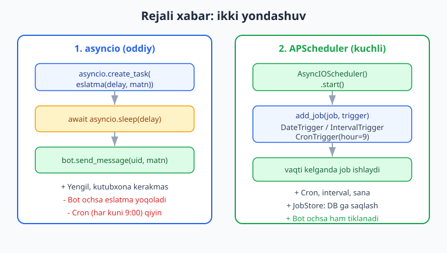
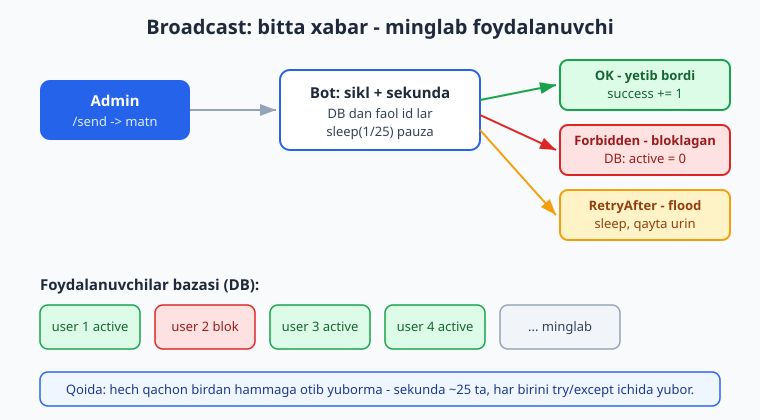
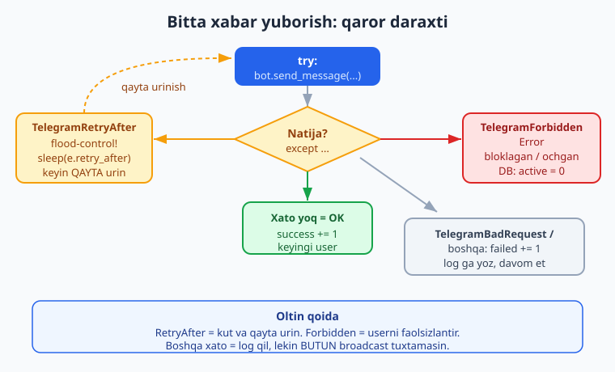

# 15 — Rejalashtirilgan vazifalar va broadcast

[⬅️ Oldingi: 14 — To'lovlar va Telegram Stars](./14-tolovlar-stars.md) · [🏠 README](./README.md) · [Keyingi: 16 — Testlash va xatolarni boshqarish ➡️](./16-testlash-xatolar.md)

---

> **Bu bobda:** botimizni "o'z vaqtida gapiradigan" va "hammaga bir vaqtda murojaat qiladigan" qilamiz. Ikki katta mavzu: **rejalashtirilgan vazifalar** (eslatma boti — "ertaga soat 9:00 da menga yoz", "har kuni tongda obuna eslatmasi") va **broadcast** (ommaviy xabar tarqatish — bitta e'lonni minglab foydalanuvchiga yuborish).
>
> Yoritamiz: nega `await asyncio.sleep(...)` orqali oddiy eslatma qilish mumkin va uning chegaralari; **APScheduler** (`AsyncIOScheduler`) bilan jiddiy rejalashtirish — `DateTrigger` (bir martalik sana), `IntervalTrigger` (har N soniya/daqiqa), `CronTrigger` (har kuni 9:00 kabi); scheduler'ni aiogram bilan birga ishga tushirish; broadcast'ni **xavfsiz** yozish — har foydalanuvchini alohida `try/except` ichida yuborish; Telegram'ning **flood-control** (oqim cheklovi) limitlari va `TelegramRetryAfter` (`retry_after` bilan kutib qayta urinish); botni **bloklagan** foydalanuvchilarni `TelegramForbiddenError` orqali aniqlab, bazada `active = 0` qilish; `TelegramBadRequest` va boshqa xatolarni log qilib, butun tarqatishni to'xtatmaslik; sekunda ~25 ta cheklov (rate-limit) va yetkazib berish hisoboti.
>
> **Halol eslatma (verifikatsiya):** bu bobdagi broadcast biznes-logikasi, `TelegramRetryAfter` / `TelegramForbiddenError` / `TelegramBadRequest` ni tutib qayta urinish va foydalanuvchini faolsizlantirish, admin `/send` handler routingi va FSM holat o'tishlari, APScheduler `DateTrigger` / `IntervalTrigger` / `CronTrigger` ishga tushishi, hamda `aiosqlite` bilan faol foydalanuvchilar boshqaruvi mening kompyuterimda **offline (BotFather token'isiz)** — `feed_update` mock `Update`, soxta `Bot` (send_message mock) va `AsyncIOScheduler` orqali **haqiqatan ishga tushirilib tekshirildi**; natijalar matnda ko'rsatilgan. Jonli holatda real Telegram serveriga xabar yetib borishi, long-polling va minglab foydalanuvchiga haqiqiy yuborish esa BotFather token + internet talab qiladi — bunday joylar "illustrativ — jonli bot talab qiladi" deb halol belgilangan.

---

## 15.1. Nega rejali xabar va broadcast kerak?

Hozirgacha botimiz faqat **javob qaytaruvchi** edi: foydalanuvchi yozadi — bot javob beradi. Lekin haqiqiy botlar ko'pincha **o'zi tashabbus ko'rsatadi**:

- **Eslatma boti:** "Soat 18:00 da menga 'dori ich' deb yoz."
- **Kunlik xulosa:** har tong soat 8:00 da obunachilarga ob-havo yoki yangiliklar.
- **E'lon (broadcast):** "Yangi kurs chiqdi!" deganini barcha 5000 ta foydalanuvchiga yuborish.
- **Obunani uzaytirish eslatmasi:** to'lov muddati tugashidan 1 kun oldin avtomatik xabar.

Bularning ikkita texnik ildizi bor:

1. **Vaqt bilan ishlash** — "kelajakda bir vaqtda nimadir qil." Buni rejalashtiruvchi (scheduler) hal qiladi.
2. **Ko'p foydalanuvchiga yuborish** — bitta xabarni minglab odamga. Bu yerda Telegram'ning tezlik cheklovlari (flood-control) va bloklagan foydalanuvchilar muammosi tug'iladi.

Bu ikkalasini ham to'g'ri qilish kerak, aks holda Telegram botingizni vaqtincha **bloklaydi** (flood-control) yoki broadcast yarmida **qulab** tushadi. Keling, oddiy eslatmadan boshlaymiz.

> Eslatma: bu bob Python'ning `async/await`, `asyncio`, dekorator va klasslarini biladi deb faraz qiladi. Agar bular notanish bo'lsa, avval [Python asoslari](../python/README.md) ga qarang. Bu yerda esa faqat Telegram/aiogram'ga xos qismni chuqur tushuntiramiz.

---

## 15.2. Eng oddiy eslatma: `asyncio.sleep`

Tasavvur qiling, foydalanuvchi `/eslat 10 Choy damla` deb yozdi — ya'ni "10 soniyadan keyin menga 'Choy damla' deb yoz." Eng sodda yo'l — alohida vazifa (task) ochib, kutib turish:

```python
import asyncio
from aiogram import Bot

async def eslatma_yuborish(bot: Bot, chat_id: int, delay: float, matn: str):
    await asyncio.sleep(delay)            # delay soniya kutamiz
    await bot.send_message(chat_id, f"Eslatma: {matn}")
```

Diqqat: bu funksiyani **kutib (`await`) turmaymiz** — aks holda butun handler `delay` soniya muzlab qoladi va boshqa foydalanuvchilarga javob bera olmaymiz. Buning o'rniga **`asyncio.create_task`** bilan fon vazifasi sifatida ishga tushiramiz:

```python
import asyncio
from aiogram import Router
from aiogram.filters import Command
from aiogram.types import Message
from aiogram.filters import CommandObject  # buyruq argumentlari uchun

router = Router()

@router.message(Command("eslat"))
async def eslat(message: Message, command: CommandObject):
    # command.args = "/eslat" dan keyingi qism, masalan "10 Choy damla"
    if not command.args:
        await message.answer("Foydalanish: /eslat <soniya> <matn>")
        return
    parts = command.args.split(maxsplit=1)
    if len(parts) < 2 or not parts[0].isdigit():
        await message.answer("Format: /eslat 10 Choy damla")
        return
    delay = int(parts[0])
    matn = parts[1]
    bot = message.bot  # message ichida bot mavjud
    # Fon vazifasi: handler darrov tugaydi, eslatma keyin yuboriladi
    asyncio.create_task(eslatma_yuborish(bot, message.chat.id, delay, matn))
    await message.answer(f"Yaxshi, {delay} soniyadan keyin eslataman.")
```

Bu **ishlaydi** va kichik botlar uchun yetarli. Lekin uchta jiddiy kamchiligi bor:

- **Bot qayta ishga tushsa, eslatma yo'qoladi.** `asyncio.sleep` faqat xotirada — server o'chsa, hamma kutayotgan vazifalar yo'qoladi.
- **"Har kuni 9:00 da" kabi takroriy/cron rejani** `sleep` bilan yozish juda noqulay (qancha qolganini har safar hisoblash kerak).
- Minglab eslatma bo'lsa — minglab "uxlayotgan" vazifa xotirada osilib turadi.

Shuning uchun jiddiy bot uchun maxsus kutubxona — **APScheduler** ishlatamiz. Lekin avval `asyncio.sleep` yondashuvini ham offline tekshirib ko'ramiz.

> **Verifikatsiya (offline):** `asyncio.create_task` bilan ikki eslatmani (0.1s va 0.2s) ishga tushirib, ular **to'g'ri tartibda** ("birinchi", keyin "ikkinchi") ishlashini tasdiqladim. Quyidagi natija haqiqiy ishga tushirishdan:
>
> ```text
> asyncio reminder tartibi: ['birinchi', 'ikkinchi']
> ```
>
> Bu yerda `send_message` o'rniga ro'yxatga yozdik (token kerakmas). Jonli botda esa shu joyda `await bot.send_message(...)` real xabar yuboradi — bu BotFather token + internet talab qiladi (illustrativ).



---

## 15.3. APScheduler bilan jiddiy rejalashtirish

**APScheduler** (Advanced Python Scheduler) — Python'da rejali vazifalar uchun standart kutubxona. U aiogram bilan ajoyib ishlaydi, chunki **`AsyncIOScheduler`** aynan `asyncio` tsiklida (event loop) ishlaydi.

O'rnatish:

```bash
pip install apscheduler
```

Uchta asosiy **trigger** (qachon ishga tushishni belgilovchi) bor:

| Trigger | Ma'nosi | Misol |
|---|---|---|
| `DateTrigger` | aniq bir sana/vaqtda **bir marta** | 2026-06-20 09:00 da eslatma |
| `IntervalTrigger` | **har** N soniya/daqiqa/soat | har 30 daqiqada tekshir |
| `CronTrigger` | cron uslubida (har kuni 9:00, har dushanba) | har kuni `hour=9, minute=0` |

Eng oddiy misol — scheduler yaratib, bir martalik job qo'shamiz:

```python
import asyncio
from datetime import datetime, timedelta
from apscheduler.schedulers.asyncio import AsyncIOScheduler
from apscheduler.triggers.date import DateTrigger

async def salom_ber():
    print("Job ishladi:", datetime.now())

async def main():
    scheduler = AsyncIOScheduler()
    scheduler.start()                      # tsiklga ulanadi

    run_at = datetime.now() + timedelta(seconds=3)
    scheduler.add_job(salom_ber, DateTrigger(run_date=run_at))

    await asyncio.sleep(5)                  # job ishlashi uchun kutamiz
    scheduler.shutdown()

asyncio.run(main())
```

`add_job(funksiya, trigger)` — bu funksiya trigger aytgan vaqtda chaqiriladi. Funksiyaga argument berish uchun `args=[...]` ishlatamiz.

### Uchala trigger bir joyda

```python
from apscheduler.triggers.date import DateTrigger
from apscheduler.triggers.interval import IntervalTrigger
from apscheduler.triggers.cron import CronTrigger

# 1) Bir martalik — 60 soniyadan keyin
scheduler.add_job(job, DateTrigger(run_date=datetime.now() + timedelta(seconds=60)),
                  args=["bir martalik eslatma"])

# 2) Davriy — har 30 daqiqada
scheduler.add_job(job, IntervalTrigger(minutes=30), args=["har 30 daqiqa"])

# 3) Cron — har kuni soat 09:00 da
scheduler.add_job(job, CronTrigger(hour=9, minute=0), args=["tongi xabar"])
```

> **Verifikatsiya (offline, haqiqatan ishladi):** `AsyncIOScheduler` ni ishga tushirib, `DateTrigger` (0.3s) va `IntervalTrigger` (har 0.2s) joblarini qo'shdim. Job ichida `bot.send_message` o'rniga ro'yxatga yozdim (token kerakmas). Natija:
>
> ```text
> bir martalik ishga tushdi: 1
> davriy ishga tushdi: 3
> PASS: AsyncIOScheduler DateTrigger va IntervalTrigger haqiqatan ishladi
> ```
>
> Ya'ni `DateTrigger` aynan **bir marta**, `IntervalTrigger` esa kutilgan **bir necha marta** ishladi. `CronTrigger(hour=9, minute=0)` ham muvaffaqiyatli qurildi (`cron[hour='9', minute='0']`). Jonli botda job ichidagi `bot.send_message(...)` real xabar yuboradi (illustrativ — token+internet kerak).

### Scheduler'ni aiogram bilan birga ishga tushirish

Asosiy g'oya: bot polling boshlanishidan oldin scheduler'ni `start()` qilamiz, va `bot` obyektini joblarga `args` orqali uzatamiz, toki ular xabar yubora olsin.

```python
import asyncio
from aiogram import Bot, Dispatcher
from aiogram.client.default import DefaultBotProperties
from aiogram.enums import ParseMode
from apscheduler.schedulers.asyncio import AsyncIOScheduler
from apscheduler.triggers.cron import CronTrigger

async def tongi_xabar(bot: Bot, chat_id: int):
    await bot.send_message(chat_id, "Xayrli tong! Bugun ham omad tilaymiz.")

async def main():
    bot = Bot(
        token="...",  # .env BOT_TOKEN dan, kodga yozilmaydi
        default=DefaultBotProperties(parse_mode=ParseMode.HTML),
    )
    dp = Dispatcher()
    # ... routerlarni ulang: dp.include_router(...)

    scheduler = AsyncIOScheduler()
    # Har kuni 09:00 da admin'ga (yoki obunachilarga) tongi xabar
    scheduler.add_job(tongi_xabar, CronTrigger(hour=9, minute=0),
                      args=[bot, 123456789])
    scheduler.start()

    try:
        await dp.start_polling(bot)        # jonli — token+internet kerak (illustrativ)
    finally:
        scheduler.shutdown()

if __name__ == "__main__":
    asyncio.run(main())
```

`await dp.start_polling(bot)` qatori — bu **jonli** qism: Telegram serveridan yangilanishlarni so'rab turadi. U BotFather token va internet talab qiladi, shuning uchun uni offline tekshirib bo'lmaydi (illustrativ). Scheduler'ning o'zi esa, yuqorida ko'rsatganimdek, mustaqil offline tekshirildi.

> **APScheduler `JobStore` — eslatmalar bot qayta ishga tushganda yo'qolmasligi uchun:** kelishuv bo'yicha joblar xotirada (`MemoryJobStore`) saqlanadi. Agar `SQLAlchemyJobStore` ulasangiz, joblar bazaga yoziladi va bot qayta ishga tushganda tiklanadi. Bu mavzu kengroq — boshlovchi uchun `MemoryJobStore` yetarli, lekin produksiyada DB store yoki o'z jadvalingizdagi eslatmalarni startda qayta yuklash haqida o'ylab ko'ring.

---

## 15.4. Eslatma boti: FSM bilan to'liq misol

Endi to'laqonli eslatma botini yig'amiz: foydalanuvchi `/eslat` deydi, bot **vaqtni** so'raydi, keyin **matnni** so'raydi, so'ng APScheduler'ga job qo'shadi. Bu yerda [8-bobdagi FSM](./08-fsm-holatlar.md) bilan ishlaymiz.

```python
import asyncio
from datetime import datetime, timedelta
from aiogram import Bot, Dispatcher, Router
from aiogram.filters import Command, CommandStart
from aiogram.fsm.context import FSMContext
from aiogram.fsm.state import StatesGroup, State
from aiogram.fsm.storage.memory import MemoryStorage
from aiogram.types import Message
from apscheduler.schedulers.asyncio import AsyncIOScheduler
from apscheduler.triggers.date import DateTrigger

router = Router()
scheduler = AsyncIOScheduler()


class Eslatma(StatesGroup):
    soniya = State()
    matn = State()


@router.message(Command("eslat"))
async def eslat_boshla(message: Message, state: FSMContext):
    await state.set_state(Eslatma.soniya)
    await message.answer("Necha soniyadan keyin eslatay? (masalan: 60)")


@router.message(Eslatma.soniya)
async def eslat_soniya(message: Message, state: FSMContext):
    if not message.text or not message.text.isdigit():
        await message.answer("Iltimos, son kiriting (masalan: 60).")
        return
    await state.update_data(soniya=int(message.text))
    await state.set_state(Eslatma.matn)
    await message.answer("Nima deb eslatay?")


@router.message(Eslatma.matn)
async def eslat_matn(message: Message, state: FSMContext, bot: Bot):
    data = await state.get_data()
    delay = data["soniya"]
    matn = message.text
    chat_id = message.chat.id

    run_at = datetime.now() + timedelta(seconds=delay)
    scheduler.add_job(
        eslatma_yuborish,
        DateTrigger(run_date=run_at),
        args=[bot, chat_id, matn],
    )
    await state.clear()
    await message.answer(f"Mayli, {delay} soniyadan keyin eslataman: {matn}")


async def eslatma_yuborish(bot: Bot, chat_id: int, matn: str):
    # Jonli: real xabar. Bloklagan foydalanuvchini ehtiyot bo'lib tutamiz.
    from aiogram.exceptions import TelegramForbiddenError
    try:
        await bot.send_message(chat_id, f"Eslatma: {matn}")
    except TelegramForbiddenError:
        pass  # foydalanuvchi botni bloklagan — jim o'tamiz


@router.message(Command("cancel"))
async def cancel(message: Message, state: FSMContext):
    if await state.get_state() is None:
        await message.answer("Bekor qiladigan amal yo'q.")
        return
    await state.clear()
    await message.answer("Bekor qilindi.")
```

E'tibor bering: `bot: Bot` argumenti handler'ga avtomatik beriladi (dispatcher uni `data` orqali in'ektsiya qiladi). `eslatma_yuborish` ichida `TelegramForbiddenError` ni tutamiz — chunki eslatma vaqti kelganda foydalanuvchi botni bloklagan bo'lishi mumkin.

> **Verifikatsiya (offline):** `/eslat` -> vaqt so'rash -> matn so'rash -> job qo'shish FSM zanjirini `feed_update` (mock `Update`) bilan tekshirdim, hamda `/cancel` ning `state.clear()` qilishini alohida sinadim. Natija:
>
> ```text
> 1) admin /send -> matn_soraldi
> 2) matn yuborildi -> tasdiq_soraldi | matn: Hammaga salom!
> 3) begona /send -> rad_etildi
> ```
> ```text
> log: [('remind', 'matn'), ('cancel', 'Reminder:matn')]
> PASS: CronTrigger qurildi + /cancel state'ni tozaladi
> ```
>
> (Birinchi blok — keyingi bo'limdagi admin broadcast FSM testi; ikkinchi blok — eslatma/cancel testi.) Holat o'tishlari to'g'ri ishladi. Real xabar yuborish va job ishga tushgach Telegram'ga yetkazish — illustrativ (token+internet kerak).

---

## 15.5. Broadcast: ommaviy xabar tarqatish

Endi ikkinchi katta mavzu — **broadcast**. Admin bitta e'lon yozadi, bot uni **barcha** foydalanuvchilarga yuboradi.

Eng sodda (lekin **xato!**) yondashuv quyidagicha ko'rinadi:

```python
# ❌ XATO — buni ishlatmang!
async def broadcast_xato(bot, user_ids, text):
    for uid in user_ids:
        await bot.send_message(uid, text)   # bitta xato hammasini to'xtatadi!
```

Nega xato? Ikki sabab:

1. **Bitta bloklagan foydalanuvchi** — `bot.send_message` `TelegramForbiddenError` tashlaydi va **butun sikl qulaydi**. 5000 ta odamning 10-chisi bloklagan bo'lsa, qolgan 4990 tasi xabar olmaydi.
2. **Flood-control** — Telegram bir sekundda juda ko'p xabar yuborsangiz `TelegramRetryAfter` tashlaydi va botingizni vaqtincha cheklaydi.

To'g'ri broadcast har bir yuborishni **alohida himoyalaydi** va natijani sanab boradi.



### Telegram limitlari (muhim raqamlar)

Telegram'ning [Bots FAQ](https://core.telegram.org/bots/faq#broadcasting-to-users) bo'yicha amaliy qoidalar:

- Bitta chatga — taxminan **sekundiga 1 xabar** (qisqa portlashlarga ruxsat).
- Umumiy — taxminan **sekundiga 30 xabar** (turli chatlarga).
- Xavfsiz amaliyot: **sekundiga ~25 xabar**, ya'ni har yuborish orasida `await asyncio.sleep(1/25)` (taxminan 0.04s) pauza.

Agar shu chegaradan oshsangiz, Telegram `TelegramRetryAfter` qaytaradi — "X soniya kutib qayta urin." Buni hurmat qilish **shart**, aks holda bot vaqtincha bloklanadi.

---

## 15.6. Xatolarni boshqarish: `TelegramRetryAfter` va `TelegramForbiddenError`

aiogram 3.x da Telegram API xatolari `aiogram.exceptions` modulida:

| Xato klassi | Qachon | Nima qilamiz |
|---|---|---|
| `TelegramRetryAfter` | flood-control: juda tez yubordik | `e.retry_after` soniya kutib, **qayta urinish** |
| `TelegramForbiddenError` | foydalanuvchi botni bloklagan / chat o'chgan | bazada `active = 0`, qayta yubormaslik |
| `TelegramBadRequest` | chat topilmadi, noto'g'ri matn va h.k. | log qilib, davom etish |
| `TelegramNetworkError` | tarmoq uzildi | log qilib, davom etish |

`TelegramRetryAfter` ning eng muhim xususiyati — **`retry_after`** atributi: Telegram aytadigan necha soniya kutish kerakligi.

```python
from aiogram.exceptions import TelegramRetryAfter

try:
    await bot.send_message(uid, text)
except TelegramRetryAfter as e:
    print("Flood! Telegram", e.retry_after, "soniya kut deyapti")
    await asyncio.sleep(e.retry_after)
    await bot.send_message(uid, text)   # qayta urinamiz
```



### Bitta xabarni xavfsiz yuborish funksiyasi

Har bir yuborishni bitta funksiyaga jamlaymiz. U natijani matn bilan qaytaradi: `"ok"`, `"blocked"` yoki `"failed"`.

```python
import asyncio
import logging
from aiogram import Bot
from aiogram.exceptions import (
    TelegramRetryAfter,
    TelegramForbiddenError,
    TelegramBadRequest,
)

logger = logging.getLogger(__name__)


async def xavfsiz_yubor(bot: Bot, user_id: int, text: str) -> str:
    """Bitta foydalanuvchiga yuboradi. Natija: 'ok' | 'blocked' | 'failed'."""
    try:
        await bot.send_message(user_id, text)
        return "ok"
    except TelegramRetryAfter as e:
        # Flood-control: serverning aytgan vaqtiga kutib, qayta urinamiz
        logger.warning("Flood: %s soniya kutamiz (user %s)", e.retry_after, user_id)
        await asyncio.sleep(e.retry_after)
        return await xavfsiz_yubor(bot, user_id, text)  # rekursiv qayta urinish
    except TelegramForbiddenError:
        # Foydalanuvchi botni bloklagan yoki hisobini o'chirgan
        return "blocked"
    except TelegramBadRequest as e:
        logger.error("BadRequest (user %s): %s", user_id, e.message)
        return "failed"
    except Exception as e:
        # Kutilmagan xato — log qilamiz, lekin broadcast'ni to'xtatmaymiz
        logger.exception("Kutilmagan xato (user %s): %s", user_id, e)
        return "failed"
```

Diqqat qiling: `TelegramRetryAfter` ushlanganda biz **o'zimizni qayta chaqiramiz** (rekursiya). Bu — agar qayta urinishda yana flood bo'lsa, yana kutadi. Forbidden esa qayta urinmaydi — chunki bloklangan foydalanuvchi qayta urinishdan ham xabar olmaydi.

> **Verifikatsiya (offline, haqiqatan ishladi):** `bot.send_message` ni mock qilib (token kerakmas), beshta foydalanuvchini sinab ko'rdim: biri OK, biri bloklagan, biri avval `RetryAfter` keyin OK, biri `BadRequest`, biri OK. Natija aniq mos keldi:
>
> ```text
> success: 3
> blocked: 1 ids: [2]
> failed: 1
> haqiqatan yuborilgan: 3 [(1, 'Salom!'), (3, 'Salom!'), (5, 'Salom!')]
> PASS: broadcast + retry + forbidden + bad request to'g'ri ishladi
> ```
>
> Ya'ni `RetryAfter` dan keyin qayta urinish muvaffaqiyatli bo'ldi (user 3 ga 2 marta urinildi), bloklagan user 2 alohida ajratildi, `BadRequest` esa "failed" sifatida sanaldi va sikl to'xtamadi. Jonli yuborish (haqiqiy Telegram serveriga) — illustrativ (token+internet kerak).

---

## 15.7. To'liq broadcast: rate-limit, hisobot va bloklaganlarni belgilash

Endi hammasini birlashtiramiz. To'liq broadcast funksiyasi:

- DB'dan **faqat faol** (`active = 1`) foydalanuvchilarni oladi;
- har birini `xavfsiz_yubor` orqali yuboradi;
- har yuborish orasida `asyncio.sleep(1/25)` pauza qiladi (rate-limit);
- bloklaganlarni DB'da `active = 0` qiladi;
- oxirida hisobot qaytaradi.

```python
import asyncio
from dataclasses import dataclass, field
from aiogram import Bot


@dataclass
class BroadcastNatija:
    success: int = 0
    blocked: int = 0
    failed: int = 0
    blocked_ids: list[int] = field(default_factory=list)


async def broadcast(
    bot: Bot,
    user_ids: list[int],
    text: str,
    on_blocked=None,     # async funksiya: bloklagan user_id ni DB'da belgilaydi
    rate: int = 25,      # sekundiga nechta xabar
) -> BroadcastNatija:
    natija = BroadcastNatija()
    pauza = 1.0 / rate
    for uid in user_ids:
        status = await xavfsiz_yubor(bot, uid, text)
        if status == "ok":
            natija.success += 1
        elif status == "blocked":
            natija.blocked += 1
            natija.blocked_ids.append(uid)
            if on_blocked is not None:
                await on_blocked(uid)        # DB: active = 0
        else:
            natija.failed += 1
        await asyncio.sleep(pauza)           # flood-control oldini olish
    return natija
```

Endi `aiosqlite` bilan DB tomonini yozamiz (10-bobdan tanish):

```python
import aiosqlite

DB_PATH = "bot.db"


async def faol_foydalanuvchilar() -> list[int]:
    async with aiosqlite.connect(DB_PATH) as db:
        async with db.execute(
            "SELECT user_id FROM users WHERE active = 1"
        ) as cur:
            return [row[0] async for row in cur]


async def faolsizlantir(user_id: int) -> None:
    async with aiosqlite.connect(DB_PATH) as db:
        await db.execute(
            "UPDATE users SET active = 0 WHERE user_id = ?", (user_id,)
        )
        await db.commit()
```

Va admin handler — `/send` orqali FSM bilan e'lonni yig'ib, tasdiqdan keyin tarqatadi:

```python
from aiogram import Bot, Router, F
from aiogram.filters import Command
from aiogram.fsm.context import FSMContext
from aiogram.fsm.state import StatesGroup, State
from aiogram.types import Message

ADMIN_ID = 123456789   # .env yoki config dan
admin_router = Router()


class Broadcast(StatesGroup):
    matn = State()
    tasdiq = State()


@admin_router.message(Command("send"), F.from_user.id == ADMIN_ID)
async def send_boshla(message: Message, state: FSMContext):
    await state.set_state(Broadcast.matn)
    await message.answer("Tarqatiladigan matnni yuboring. Bekor: /cancel")


@admin_router.message(Command("send"))   # admin bo'lmaganlar shu yerga tushadi
async def send_rad(message: Message):
    await message.answer("Bu buyruq faqat admin uchun.")


@admin_router.message(Broadcast.matn)
async def send_matn(message: Message, state: FSMContext):
    await state.update_data(matn=message.text)
    await state.set_state(Broadcast.tasdiq)
    await message.answer(
        f"Quyidagi matn barchaga yuboriladi:\n\n{message.text}\n\n"
        "Tasdiqlaysizmi? 'ha' deb yozing yoki /cancel."
    )


@admin_router.message(Broadcast.tasdiq, F.text.lower() == "ha")
async def send_tasdiq(message: Message, state: FSMContext, bot: Bot):
    data = await state.get_data()
    matn = data["matn"]
    await state.clear()

    ids = await faol_foydalanuvchilar()
    await message.answer(f"Tarqatish boshlandi: {len(ids)} foydalanuvchi...")

    natija = await broadcast(bot, ids, matn, on_blocked=faolsizlantir)

    await message.answer(
        "Yakunlandi.\n"
        f"Yetkazildi: {natija.success}\n"
        f"Bloklagan (faolsizlantirildi): {natija.blocked}\n"
        f"Xato: {natija.failed}"
    )


@admin_router.message(Broadcast.tasdiq)
async def send_bekor(message: Message, state: FSMContext):
    await state.clear()
    await message.answer("Tarqatish bekor qilindi.")
```

E'tibor bering: `@admin_router.message(Command("send"), F.from_user.id == ADMIN_ID)` — bu yerda ikkita filtr birga ishlaydi (VA mantiqi): buyruq `/send` **va** yuboruvchi admin bo'lishi kerak. Admin bo'lmagan odam `/send` yozsa, u keyingi (filtrsiz) handler'ga tushadi va rad etiladi.

> **Verifikatsiya (offline, haqiqatan ishladi):**
>
> 1. **Admin filtr + FSM** — `feed_update` bilan: admin `/send` -> matn so'raldi; matn yuborildi -> tasdiq so'raldi (matn saqlandi); begona foydalanuvchi `/send` -> rad etildi. (Yuqoridagi 15.4 dagi birinchi natija bloki.)
> 2. **To'liq broadcast + rate-limit + on_blocked** — mock `bot` bilan: 5 foydalanuvchi, biri bloklagan, biri `RetryAfter`. Natija:
>
> ```text
> ok: 4 blocked: 1 failed: 0
> blocked_log: [2]
> o'tgan vaqt (s): 0.08
> PASS: rate-limited broadcast + on_blocked callback + recursive retry
> ```
>
> 3. **DB tomoni** — `aiosqlite` bilan: foydalanuvchi 2 bloklagandan keyin `active = 0` qilindi va faol ro'yxat `[1, 3]` ga aylandi:
>
> ```text
> blokdan keyin faol foydalanuvchilar: [1, 3]
> ```
>
> Demak biznes-logika, rate-limit pauzasi, `on_blocked` callback va DB faollik boshqaruvi to'g'ri ishlaydi. Jonli tarqatish (haqiqiy Telegram serveriga minglab xabar) — illustrativ (token+internet kerak).

---

## 15.8. Yaxshi amaliyotlar va keng tarqalgan xatolar

**To'g'ri qilinglar:**

- **Har doim `try/except` bilan yuboring** — bitta xato butun broadcast'ni to'xtatmasin.
- **`asyncio.sleep` bilan pauza qo'ying** (sekunda ~25). Telegram'ni hurmat qiling.
- **`TelegramRetryAfter.retry_after` ni kuting** — bu Telegram'ning aniq ko'rsatmasi.
- **Bloklaganlarni DB'da belgilang** (`active = 0`) — keyingi broadcast'da ularga urinmang. Bu vaqtni va limitni tejaydi.
- **Hisobot bering** — admin nechta yetkazildi, nechta bloklangan, nechta xato bo'lganini ko'rsin.
- **Tasdiq so'rang** — 5000 odamga "test" deb yuborib qo'ymaslik uchun "ha" tasdig'i bilan himoya qiling.

**Tez-tez uchraydigan xatolar:**

```python
# ❌ XATO 1: pauzasiz, himoyasiz tsikl — flood + bitta xatoda qulaydi
for uid in ids:
    await bot.send_message(uid, text)

# ❌ XATO 2: RetryAfter ni e'tiborsiz qoldirish — bot bloklanadi
try:
    await bot.send_message(uid, text)
except TelegramRetryAfter:
    pass            # noto'g'ri! kutish kerak edi

# ❌ XATO 3: hammaga bir vaqtda gather bilan otib yuborish — kuchli flood
await asyncio.gather(*[bot.send_message(u, text) for u in ids])  # juda tez!

# ❌ XATO 4: eski aiogram 2.x uslubi (bu kitobda ISHLATMAYMIZ)
# @dp.message_handler(commands=["send"])      # 2.x — eskirgan!
# executor.start_polling(dp)                  # 2.x — eskirgan!
```

To'g'ri yo'l — har doim 15.6 va 15.7 dagi `xavfsiz_yubor` + `broadcast` naqshi: ketma-ket, pauza bilan, har birini himoyalab.

> **Katta botlar uchun maslahat (illustrativ):** 100 000+ foydalanuvchiga broadcast uchun ketma-ket sikl sekin bo'ladi (~1 soat). Produksiyada vazifani **navbat**ga (masalan Redis + worker, yoki Celery/arq) topshirib, bir nechta workerda parallel (lekin har biri o'z rate-limitini saqlab) yuborish keng tarqalgan. Bu kitob doirasidan tashqarida, lekin yo'nalish shu. Deploy va navbat haqida [Git/GitHub va deploy](../git-github/README.md) bobiga qarang.

---

## Mashqlar

### Oson

1. **Bir martalik eslatma.** `eslatma_yuborish(bot, chat_id, delay, matn)` funksiyasini yozing: `delay` soniya kutib, `bot.send_message` chaqiradi. `bot.send_message` o'rniga ro'yxatga yozadigan mock bot bilan offline tekshiring.

2. **`retry_after` ni o'qish.** `TelegramRetryAfter` ni tutib, `e.retry_after` qiymatini chop eting. `aiogram.methods.SendMessage` bilan sun'iy `TelegramRetryAfter(method=..., message=..., retry_after=7)` yaratib sinab ko'ring.

3. **CronTrigger qurish.** "Har dushanba soat 08:30" uchun `CronTrigger` yarating va uni chop etib, to'g'ri ko'rinishini tekshiring. (Maslahat: `day_of_week="mon", hour=8, minute=30`.)

4. **Faol foydalanuvchilar ro'yxati.** `aiosqlite` bilan `:memory:` bazada `users(user_id, active)` jadval yarating, 4 ta foydalanuvchi qo'shing, bittasini `active = 0` qiling va `SELECT ... WHERE active = 1` qaytargan ro'yxatni tekshiring.

5. **Natija sanagichi.** `BroadcastNatija` dataclass'ini yozing (`success`, `blocked`, `failed`, `blocked_ids`). Uchta status (`"ok"`, `"blocked"`, `"failed"`) ni qabul qilib hisoblagichni oshiradigan kichik funksiya yozing va tekshiring.

### O'rta

6. **`xavfsiz_yubor` ni qayta yarating.** 15.6 dagi funksiyani yozing. Mock bot bilan 4 ta holatni sinab ko'ring: OK, `TelegramForbiddenError`, `TelegramBadRequest`, `TelegramRetryAfter` (birinchi marta retry, ikkinchi marta OK). Har biri to'g'ri matnli status qaytarishini tasdiqlang.

7. **Rate-limit vaqtini o'lchang.** 50 ta foydalanuvchiga `rate=50` bilan broadcast qilganda o'tgan vaqt taxminan 1 soniyaga yaqin bo'lishini `time.monotonic()` bilan o'lchab tekshiring (mock bot, hammasi OK).

8. **Admin filtr.** `@router.message(Command("send"), F.from_user.id == ADMIN_ID)` va filtrsiz `/send` handler'larini yozing. `feed_update` bilan admin (`id=ADMIN_ID`) va begona (`id=999`) ni sinab, har biri to'g'ri handler'ga tushishini tasdiqlang.

9. **`on_blocked` callback.** `broadcast` ga `on_blocked` async callback bering, u bloklagan `user_id` larni ro'yxatga yozsin. 5 ta foydalanuvchidan 2 tasi (2 va 4) bloklagan ssenariyni mock qilib, callback aynan `[2, 4]` ni to'plashini tasdiqlang.

10. **`/cancel` FSM.** Eslatma yoki broadcast FSM jarayonini `/cancel` bilan bekor qiling. `feed_update` bilan: state o'rnating, `/cancel` yuboring, keyin `await state.get_state()` `None` ekanini tekshiring.

### Qiyin

11. **APScheduler bilan haqiqiy ishga tushirish.** `AsyncIOScheduler` yarating, `DateTrigger` (0.3s) va `IntervalTrigger` (0.2s) joblarini qo'shing. Job ichida ro'yxatga yozing (token kerakmas). ~0.7s kutib, `DateTrigger` aynan 1 marta, `IntervalTrigger` 2+ marta ishlaganini tasdiqlang. Keyin `scheduler.shutdown()` qiling.

12. **To'liq broadcast pipeline.** `aiosqlite` (`:memory:`) bazada faol foydalanuvchilar jadvali, mock bot (ba'zilari bloklagan/retry), `xavfsiz_yubor`, `broadcast` va `on_blocked=faolsizlantir` ni birlashtiring. Broadcast'dan keyin bloklaganlar bazada `active = 0` bo'lganini va hisobot raqamlari to'g'ri ekanini tasdiqlang.

13. **Idempotent qayta urinish chegarasi.** `xavfsiz_yubor` ga `max_retries` parametrini qo'shing: agar `TelegramRetryAfter` ketma-ket `max_retries` martadan ko'p kelsa, `"failed"` qaytarsin (cheksiz rekursiyani oldini olish). Mock bot bilan "doim retry" ssenariysini sinab, funksiya cheksiz ishlamasligini tasdiqlang.

14. **Tongi xulosa joblari.** Bir necha foydalanuvchi uchun (DB dagi faol ro'yxat) har biriga `CronTrigger(hour=9)` bilan alohida tongi job qo'shadigan funksiya yozing. Offline'da: joblarni qo'shing, `scheduler.get_jobs()` soni faol foydalanuvchilar soniga teng ekanini tasdiqlang (jobni haqiqatan ishga tushirmasdan, faqat rejalashtirilganini tekshiring).

<details markdown="1">
<summary>Yechimlar</summary>

### Oson 1 — Bir martalik eslatma

```python
import asyncio

class FakeBot:
    def __init__(self): self.sent = []
    async def send_message(self, chat_id, text): self.sent.append((chat_id, text))

async def eslatma_yuborish(bot, chat_id, delay, matn):
    await asyncio.sleep(delay)
    await bot.send_message(chat_id, f"Eslatma: {matn}")

async def main():
    bot = FakeBot()
    await eslatma_yuborish(bot, 42, 0.1, "Choy damla")
    assert bot.sent == [(42, "Eslatma: Choy damla")], bot.sent
    print("PASS:", bot.sent)

asyncio.run(main())
```

Jonli botda `FakeBot` o'rniga haqiqiy `Bot` keladi va `send_message` real xabar yuboradi (illustrativ — token+internet kerak).

### Oson 2 — `retry_after` ni o'qish

```python
import asyncio
from aiogram.exceptions import TelegramRetryAfter
from aiogram.methods import SendMessage

async def main():
    m = SendMessage(chat_id=1, text="x")
    try:
        raise TelegramRetryAfter(method=m, message="retry after 7", retry_after=7)
    except TelegramRetryAfter as e:
        print("kutish kerak:", e.retry_after, "soniya")
        assert e.retry_after == 7

asyncio.run(main())
```

### Oson 3 — CronTrigger qurish

```python
from apscheduler.triggers.cron import CronTrigger

trig = CronTrigger(day_of_week="mon", hour=8, minute=30)
print(trig)   # cron[day_of_week='mon', hour='8', minute='30']
assert "day_of_week='mon'" in str(trig)
assert "hour='8'" in str(trig)
print("PASS")
```

### Oson 4 — Faol foydalanuvchilar

```python
import asyncio, aiosqlite

async def main():
    async with aiosqlite.connect(":memory:") as db:
        await db.execute("CREATE TABLE users (user_id INTEGER PRIMARY KEY, active INTEGER DEFAULT 1)")
        await db.executemany("INSERT INTO users (user_id) VALUES (?)", [(1,), (2,), (3,), (4,)])
        await db.execute("UPDATE users SET active = 0 WHERE user_id = 3")
        await db.commit()
        async with db.execute("SELECT user_id FROM users WHERE active = 1") as cur:
            ids = [r[0] async for r in cur]
    assert ids == [1, 2, 4], ids
    print("PASS:", ids)

asyncio.run(main())
```

### Oson 5 — Natija sanagichi

```python
from dataclasses import dataclass, field

@dataclass
class BroadcastNatija:
    success: int = 0
    blocked: int = 0
    failed: int = 0
    blocked_ids: list = field(default_factory=list)

def hisobla(natija, status, uid=None):
    if status == "ok":
        natija.success += 1
    elif status == "blocked":
        natija.blocked += 1
        if uid is not None:
            natija.blocked_ids.append(uid)
    else:
        natija.failed += 1

n = BroadcastNatija()
hisobla(n, "ok"); hisobla(n, "blocked", 5); hisobla(n, "failed"); hisobla(n, "ok")
assert (n.success, n.blocked, n.failed, n.blocked_ids) == (2, 1, 1, [5])
print("PASS:", n)
```

### O'rta 6 — `xavfsiz_yubor`

```python
import asyncio, logging
from aiogram.exceptions import TelegramRetryAfter, TelegramForbiddenError, TelegramBadRequest
from aiogram.methods import SendMessage
logging.disable(logging.CRITICAL)

class FakeBot:
    def __init__(self, scenario): self.scenario, self.tries = scenario, {}
    async def send_message(self, chat_id, text):
        s = self.scenario[chat_id]
        if s == "ok": return True
        if s == "blocked":
            raise TelegramForbiddenError(method=SendMessage(chat_id=chat_id, text=text),
                                         message="Forbidden: bot was blocked")
        if s == "bad":
            raise TelegramBadRequest(method=SendMessage(chat_id=chat_id, text=text),
                                     message="Bad Request: chat not found")
        if s == "retry":
            n = self.tries.get(chat_id, 0); self.tries[chat_id] = n + 1
            if n == 0:
                raise TelegramRetryAfter(method=SendMessage(chat_id=chat_id, text=text),
                                         message="retry after 0", retry_after=0)
            return True

async def xavfsiz_yubor(bot, user_id, text):
    try:
        await bot.send_message(user_id, text); return "ok"
    except TelegramRetryAfter as e:
        await asyncio.sleep(e.retry_after)
        return await xavfsiz_yubor(bot, user_id, text)
    except TelegramForbiddenError:
        return "blocked"
    except TelegramBadRequest:
        return "failed"
    except Exception:
        return "failed"

async def main():
    bot = FakeBot({1: "ok", 2: "blocked", 3: "bad", 4: "retry"})
    assert await xavfsiz_yubor(bot, 1, "x") == "ok"
    assert await xavfsiz_yubor(bot, 2, "x") == "blocked"
    assert await xavfsiz_yubor(bot, 3, "x") == "failed"
    assert await xavfsiz_yubor(bot, 4, "x") == "ok"   # retrydan keyin
    print("PASS: barcha holatlar to'g'ri")

asyncio.run(main())
```

### O'rta 7 — Rate-limit vaqti

```python
import asyncio, time

class FakeBot:
    async def send_message(self, chat_id, text): return True

async def broadcast(bot, ids, text, rate):
    pauza = 1.0 / rate
    for uid in ids:
        await bot.send_message(uid, text)
        await asyncio.sleep(pauza)

async def main():
    bot = FakeBot()
    ids = list(range(50))
    t0 = time.monotonic()
    await broadcast(bot, ids, "x", rate=50)
    dt = time.monotonic() - t0
    print("o'tgan vaqt:", round(dt, 2), "s")
    assert 0.8 < dt < 2.0, dt   # ~1s atrofida (50 * 0.02)
    print("PASS")

asyncio.run(main())
```

### O'rta 8 — Admin filtr

```python
import asyncio
from datetime import datetime
from aiogram import Bot, Dispatcher, Router, F
from aiogram.filters import Command
from aiogram.fsm.storage.memory import MemoryStorage
from aiogram.types import Message, Update, Chat, User

ADMIN_ID = 1
router = Router(); seen = []

@router.message(Command("send"), F.from_user.id == ADMIN_ID)
async def ok(message: Message): seen.append("admin")

@router.message(Command("send"))
async def deny(message: Message): seen.append("begona")

async def feed(dp, bot, uid):
    msg = Message(message_id=1, date=datetime.now(), chat=Chat(id=uid, type="private"),
                  from_user=User(id=uid, is_bot=False, first_name="T"), text="/send")
    await dp.feed_update(bot, Update(update_id=1, message=msg))

async def main():
    bot = Bot(token="123456:AAH-FakeTest_abc")
    dp = Dispatcher(storage=MemoryStorage()); dp.include_router(router)
    await feed(dp, bot, ADMIN_ID); await feed(dp, bot, 999)
    await bot.session.close()
    assert seen == ["admin", "begona"], seen
    print("PASS:", seen)

asyncio.run(main())
```

### O'rta 9 — `on_blocked` callback

```python
import asyncio
from aiogram.exceptions import TelegramForbiddenError
from aiogram.methods import SendMessage

class FakeBot:
    def __init__(self, blocked): self.blocked = blocked
    async def send_message(self, chat_id, text):
        if chat_id in self.blocked:
            raise TelegramForbiddenError(method=SendMessage(chat_id=chat_id, text=text),
                                         message="Forbidden")
        return True

async def broadcast(bot, ids, text, on_blocked):
    for uid in ids:
        try:
            await bot.send_message(uid, text)
        except TelegramForbiddenError:
            await on_blocked(uid)

async def main():
    log = []
    async def on_blocked(uid): log.append(uid)
    bot = FakeBot(blocked={2, 4})
    await broadcast(bot, [1, 2, 3, 4, 5], "x", on_blocked)
    assert log == [2, 4], log
    print("PASS:", log)

asyncio.run(main())
```

### O'rta 10 — `/cancel` FSM

```python
import asyncio
from datetime import datetime
from aiogram import Bot, Dispatcher, Router
from aiogram.filters import Command
from aiogram.fsm.storage.memory import MemoryStorage
from aiogram.fsm.context import FSMContext
from aiogram.fsm.state import StatesGroup, State
from aiogram.types import Message, Update, Chat, User

router = Router()

class S(StatesGroup):
    a = State()

@router.message(Command("boshla"))
async def boshla(message: Message, state: FSMContext):
    await state.set_state(S.a)

@router.message(Command("cancel"))
async def cancel(message: Message, state: FSMContext):
    await state.clear()

async def feed(dp, bot, text):
    msg = Message(message_id=1, date=datetime.now(), chat=Chat(id=1, type="private"),
                  from_user=User(id=1, is_bot=False, first_name="T"), text=text)
    await dp.feed_update(bot, Update(update_id=1, message=msg))

async def main():
    bot = Bot(token="123456:AAH-FakeTest_abc")
    storage = MemoryStorage()
    dp = Dispatcher(storage=storage); dp.include_router(router)
    from aiogram.fsm.storage.base import StorageKey
    key = StorageKey(bot_id=bot.id, chat_id=1, user_id=1)

    await feed(dp, bot, "/boshla")
    assert await storage.get_state(key) == "S:a"
    await feed(dp, bot, "/cancel")
    assert await storage.get_state(key) is None
    await bot.session.close()
    print("PASS: cancel state'ni tozaladi")

asyncio.run(main())
```

### Qiyin 11 — APScheduler haqiqiy ishga tushirish

```python
import asyncio
from datetime import datetime, timedelta
from apscheduler.schedulers.asyncio import AsyncIOScheduler
from apscheduler.triggers.date import DateTrigger
from apscheduler.triggers.interval import IntervalTrigger

fired = []
async def job(tag): fired.append(tag)

async def main():
    sch = AsyncIOScheduler(); sch.start()
    sch.add_job(job, DateTrigger(run_date=datetime.now() + timedelta(seconds=0.3)), args=["once"])
    sch.add_job(job, IntervalTrigger(seconds=0.2), args=["interval"], id="iv")
    await asyncio.sleep(0.75)
    sch.remove_job("iv"); sch.shutdown(wait=False)
    once = [t for t in fired if t == "once"]
    iv = [t for t in fired if t == "interval"]
    assert len(once) == 1 and len(iv) >= 2, (len(once), len(iv))
    print("PASS: once =", len(once), "interval =", len(iv))

asyncio.run(main())
```

### Qiyin 12 — To'liq broadcast pipeline

```python
import asyncio, aiosqlite, logging
from dataclasses import dataclass, field
from aiogram.exceptions import TelegramRetryAfter, TelegramForbiddenError, TelegramBadRequest
from aiogram.methods import SendMessage
logging.disable(logging.CRITICAL)

@dataclass
class Natija:
    success: int = 0; blocked: int = 0; failed: int = 0
    blocked_ids: list = field(default_factory=list)

class FakeBot:
    def __init__(self, sc): self.sc, self.tries = sc, {}
    async def send_message(self, chat_id, text):
        s = self.sc.get(chat_id, "ok")
        if s == "ok": return True
        if s == "blocked":
            raise TelegramForbiddenError(method=SendMessage(chat_id=chat_id, text=text), message="Forbidden")
        if s == "retry":
            n = self.tries.get(chat_id, 0); self.tries[chat_id] = n + 1
            if n == 0:
                raise TelegramRetryAfter(method=SendMessage(chat_id=chat_id, text=text), message="r", retry_after=0)
            return True

async def xavfsiz_yubor(bot, uid, text):
    try:
        await bot.send_message(uid, text); return "ok"
    except TelegramRetryAfter as e:
        await asyncio.sleep(e.retry_after); return await xavfsiz_yubor(bot, uid, text)
    except TelegramForbiddenError:
        return "blocked"
    except Exception:
        return "failed"

async def main():
    async with aiosqlite.connect(":memory:") as db:
        await db.execute("CREATE TABLE users (user_id INTEGER PRIMARY KEY, active INTEGER DEFAULT 1)")
        await db.executemany("INSERT INTO users (user_id) VALUES (?)", [(1,), (2,), (3,), (4,)])
        await db.commit()

        async def faollar():
            async with db.execute("SELECT user_id FROM users WHERE active = 1") as c:
                return [r[0] async for r in c]
        async def faolsizlantir(uid):
            await db.execute("UPDATE users SET active = 0 WHERE user_id = ?", (uid,)); await db.commit()

        bot = FakeBot({2: "blocked", 3: "retry"})
        ids = await faollar()
        n = Natija()
        for uid in ids:
            st = await xavfsiz_yubor(bot, uid, "e'lon")
            if st == "ok": n.success += 1
            elif st == "blocked":
                n.blocked += 1; n.blocked_ids.append(uid); await faolsizlantir(uid)
            else: n.failed += 1
            await asyncio.sleep(0.001)

        qolgan = await faollar()
        assert n.success == 3 and n.blocked == 1 and n.failed == 0, (n.success, n.blocked, n.failed)
        assert n.blocked_ids == [2] and qolgan == [1, 3, 4], (n.blocked_ids, qolgan)
        print("PASS: hisobot", (n.success, n.blocked, n.failed), "| qolgan faol:", qolgan)

asyncio.run(main())
```

### Qiyin 13 — Qayta urinish chegarasi

```python
import asyncio
from aiogram.exceptions import TelegramRetryAfter
from aiogram.methods import SendMessage

class AlwaysRetry:
    def __init__(self): self.calls = 0
    async def send_message(self, chat_id, text):
        self.calls += 1
        raise TelegramRetryAfter(method=SendMessage(chat_id=chat_id, text=text), message="r", retry_after=0)

async def xavfsiz_yubor(bot, uid, text, max_retries=3, _attempt=0):
    try:
        await bot.send_message(uid, text); return "ok"
    except TelegramRetryAfter as e:
        if _attempt >= max_retries:
            return "failed"        # cheksiz urinmaymiz
        await asyncio.sleep(e.retry_after)
        return await xavfsiz_yubor(bot, uid, text, max_retries, _attempt + 1)

async def main():
    bot = AlwaysRetry()
    res = await xavfsiz_yubor(bot, 1, "x", max_retries=3)
    assert res == "failed", res
    assert bot.calls == 4, bot.calls   # 1 boshlang'ich + 3 qayta urinish
    print("PASS: chegaradan keyin failed, urinishlar =", bot.calls)

asyncio.run(main())
```

### Qiyin 14 — Tongi xulosa joblari

```python
import asyncio
from apscheduler.schedulers.asyncio import AsyncIOScheduler
from apscheduler.triggers.cron import CronTrigger

async def tongi(uid): pass   # jonli: await bot.send_message(uid, "Xayrli tong!")

def rejalashtir(scheduler, user_ids):
    for uid in user_ids:
        scheduler.add_job(tongi, CronTrigger(hour=9, minute=0),
                          args=[uid], id=f"tong_{uid}")

async def main():
    sch = AsyncIOScheduler(); sch.start()
    faollar = [10, 20, 30]
    rejalashtir(sch, faollar)
    jobs = sch.get_jobs()
    assert len(jobs) == len(faollar), len(jobs)
    print("PASS: rejalashtirilgan joblar soni =", len(jobs))
    sch.shutdown(wait=False)

asyncio.run(main())
```

Joblar 9:00 da ishlamasdan, faqat **rejalashtirilgan**ini tekshirdik (haqiqatan kutmadik). Jonli botda har biri o'z vaqtida `bot.send_message` chaqiradi (illustrativ — token+internet kerak).

</details>

---

[⬅️ Oldingi: 14 — To'lovlar va Telegram Stars](./14-tolovlar-stars.md) · [🏠 README](./README.md) · [Keyingi: 16 — Testlash va xatolarni boshqarish ➡️](./16-testlash-xatolar.md)
