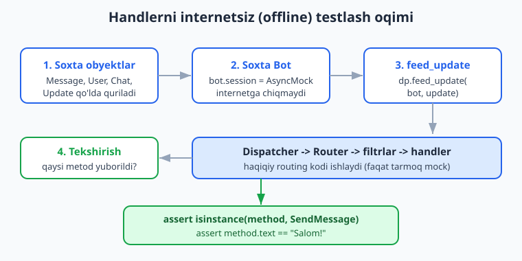
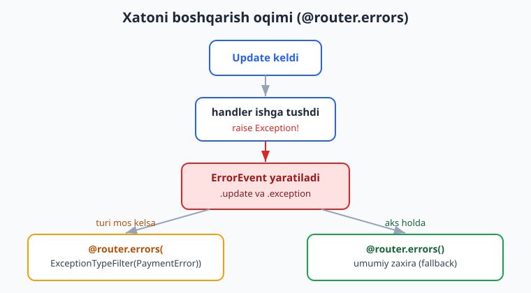
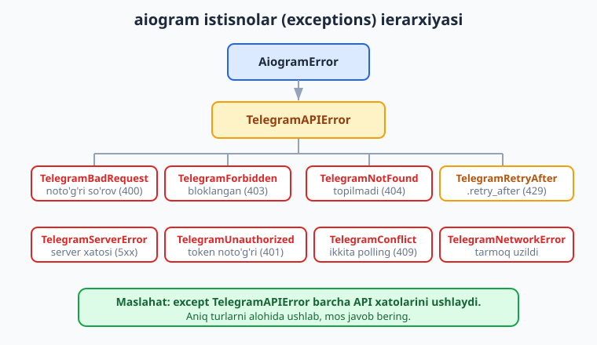

# 16 — Testlash va xatolarni boshqarish

[⬅️ Oldingi: 15 — Rejalashtirilgan vazifalar va broadcast](./15-rejalashtirilgan-broadcast.md) · [🏠 README](./README.md) · [Keyingi: 17 — Production va deploy ➡️](./17-production-deploy.md)

---

> **Bu bobda:** Botni *internetsiz* (offline) ishonchli sinashni o'rganamiz. Asosiy g'oya — handlerlarni jonli Telegram'siz, soxta `Update` obyektini `dp.feed_update(bot, update)` orqali dispatcher'ga uzatib tekshirish. `bot.session` ni mock qilib, handler aslida qaysi API metodini (`SendMessage`, `AnswerCallbackQuery`...) yuborganini va uning matnini tasdiqlaymiz. Keyin `pytest` + `pytest-asyncio` bilan toza test paketini quramiz; klaviatura quruvchilarni (`InlineKeyboardBuilder`/`ReplyKeyboardBuilder`), `CallbackData.pack()/unpack()` ni va FSM holat o'tishlarini (`StatesGroup`/`State`/`FSMContext`/`MemoryStorage`) unit-test qilamiz. So'ng xatolarni boshqarishga o'tamiz: `@router.errors` xato handleri, `ErrorEvent` (`.update`, `.exception`), `ExceptionTypeFilter` bilan turi bo'yicha filtrlash, `TelegramAPIError` ierarxiyasi (`TelegramBadRequest`, `TelegramRetryAfter`, `TelegramForbiddenError` va boshqalar) va ularga to'g'ri javob berish. Oxirida `logging` va debugging — botda nima sodir bo'layotganini ko'rish.
>
> **Halol eslatma:** Bu bobdagi handler, FSM, klaviatura, `CallbackData`, xato-handler va buyruq-parslash kodlari `feed_update` mock pattern va `pytest-asyncio` orqali OFFLINE haqiqatan ishga tushirib tekshirilgan. Jonli xabar yuborish, long-polling (`start_polling`), `getMe`/`getUpdates` va webhook qabul qilish — bular BotFather token + internet talab qiladi, shuning uchun ular *illustrativ* (kod to'g'ri, lekin natija faqat jonli botda ko'rinadi) deb belgilangan.

---

## 16.1 — Nega botni testlash kerak?

Tasavvur qiling: botingizda `/buy` buyrug'i bor. Har safar uni o'zgartirganda, Telegram'da botni ochib, `/buy` deb yozib, javobni ko'z bilan tekshirasiz. So'ng `/cancel`, so'ng to'lov oqimi... O'n daqiqa ketadi. Bir oydan keyin bot 30 ta buyruqqa ega bo'lsa-chi? Har o'zgarishda hammasini qo'lda tekshirib bo'lmaydi.

**Test** — bu kod, u sizning kodingizni avtomatik tekshiradi. Bir marta yozasiz, keyin `pytest` deb chaqirsangiz, sekundlar ichida yuzlab holatni sinab chiqadi. Telegram kerak emas, internet kerak emas, token kerak emas.

Bu mumkinmi? Axir bot Telegram serveri bilan gaplashadi-ku? Mana shu yerda aiogram'ning eng kuchli tomoni: **handler — bu oddiy `async` funksiya.** U `Message` obyektini qabul qiladi va `message.answer(...)` chaqiradi. Biz:

1. Soxta `Message` (va uni o'rab turuvchi `Update`) ni qo'lda quramiz.
2. Botning *tarmoq qatlamini* (`bot.session`) soxta (mock) bilan almashtiramiz — endi hech narsa internetga chiqmaydi.
3. `dp.feed_update(bot, update)` ni chaqiramiz — bu aiogram'ning *haqiqiy* routing, filtr va FSM mantig'ini ishga soladi.
4. Handler qaysi API metodini "yubormoqchi" bo'lganini tekshiramiz.



Diqqat: biz routing/filtr mantig'ini soxtalashtirmaymiz — u haqiqiy ishlaydi. Faqat *eng oxirgi qadam* — tarmoqqa chiqish — to'siladi. Shuning uchun bu test handleringizni juda real sharoitda sinaydi.

> Python testlash asoslari (`pytest`, `assert`, fixtura) bilan tanish bo'lmasangiz, [Python qo'llanmasiga](../python/README.md) qarang — bu yerda biz faqat Telegram/aiogram'ga xos qismni chuqurlashtiramiz.

---

## 16.2 — Soxta `Update` qurish va `feed_update`

Avval testdan mustaqil, oddiy skript bilan g'oyani ko'raylik. Quyidagi `bot.py` ni o'zingiz yarating:

```python
# bot.py — sinaladigan handlerlar
from aiogram import Router, F
from aiogram.filters import Command
from aiogram.types import Message

router = Router()


@router.message(Command("start"))
async def start_handler(message: Message):
    await message.answer("Salom! Bu /start javobi.")


@router.message(F.text)
async def echo_handler(message: Message):
    await message.answer(f"Echo: {message.text}")
```

Endi sinov skripti. E'tibor bering — bu yerda **token soxta**, internet kerak emas:

```python
# sinov.py
import asyncio
from datetime import datetime
from unittest.mock import AsyncMock

from aiogram import Bot, Dispatcher
from aiogram.fsm.storage.memory import MemoryStorage
from aiogram.types import Update, Message, Chat, User

from bot import router


def make_message(text: str, message_id: int = 1) -> Message:
    """Soxta Message obyektini qo'lda quramiz."""
    return Message(
        message_id=message_id,
        date=datetime.now(),
        chat=Chat(id=12345, type="private"),
        from_user=User(id=777, is_bot=False, first_name="Test"),
        text=text,
    )


async def main():
    # Soxta token — formati to'g'ri bo'lsa kifoya, real bo'lishi shart emas.
    fake_token = "123456:AAH-FakeTest_abcDEFghiJKLmnoPQRstuVWXyz12"
    bot = Bot(token=fake_token)

    # ENG MUHIM QATOR: tarmoq qatlamini mock bilan almashtiramiz.
    # Endi har qanday API chaqiruvi internetga emas, mock'ga ketadi.
    bot.session = AsyncMock()

    dp = Dispatcher(storage=MemoryStorage())
    dp.include_router(router)

    # /start ni "yuboramiz"
    await dp.feed_update(bot, Update(update_id=1, message=make_message("/start")))
    # oddiy matn yuboramiz
    await dp.feed_update(bot, Update(update_id=2, message=make_message("hello", 2)))

    # Bot session orqali nimalarni yubormoqchi bo'ldi?
    for call in bot.session.await_args_list:
        method = call.args[1]  # call: session(bot, method)
        print("Metod:", type(method).__name__, "| text:", getattr(method, "text", None))

    await bot.session.close()


asyncio.run(main())
```

Ishga tushiramiz va chiqishni ko'ramiz (bu OFFLINE haqiqatan ishladi):

```text
Metod: SendMessage | text: Salom! Bu /start javobi.
Metod: SendMessage | text: Echo: hello
```

Nima yuz berdi? `message.answer("...")` aslida darhol internetga so'rov yubormaydi — u `SendMessage` *metod obyektini* yaratadi va uni `bot.session` ga uzatadi. Biz `bot.session` ni `AsyncMock` qilganimiz uchun, u so'rovni hech qayoqqa yubormaydi, balki har bir chaqiruvni eslab qoladi. So'ng `await_args_list` orqali "handler nima yubormoqchi bo'ldi?" degan savolga aniq javob olamiz.

> **Maydonlar haqida:** `Message`, `Chat`, `User` — bular Pydantic modellar. Faqat Telegram talab qiladigan *majburiy* maydonlarni to'ldirsangiz kifoya: `Chat(id=..., type=...)`, `User(id=..., is_bot=..., first_name=...)`, `Message(message_id=..., date=..., chat=..., ...)`. Qolganlari ixtiyoriy.

---

## 16.3 — `pytest` + `pytest-asyncio` bilan toza test

Skript yaxshi, lekin `print` ni ko'z bilan tekshirish — bu hali ham qo'l mehnati. Endi haqiqiy testga o'tamiz. Kerakli paketlar:

```bash
pip install aiogram pytest pytest-asyncio
```

`pytest-asyncio` `async def` testlarini ishlatishga imkon beradi. Loyiha ildiziga sozlama qo'shamiz:

```ini
# pytest.ini
[pytest]
asyncio_mode = auto
```

`asyncio_mode = auto` — har bir `async def test_...` ni avtomatik async test deb biladi (har biriga `@pytest.mark.asyncio` yozish shart emas). Endi `test_bot.py`:

```python
# test_bot.py
from datetime import datetime
from unittest.mock import AsyncMock

import pytest
import pytest_asyncio

from aiogram import Bot, Dispatcher, Router, F
from aiogram.filters import Command
from aiogram.fsm.storage.memory import MemoryStorage
from aiogram.methods import SendMessage
from aiogram.types import Update, Message, Chat, User


# Router'ni FUNKSIYA orqali quramiz -> har testda YANGI nusxa.
# Sababi: bitta Router bir vaqtda faqat bitta Dispatcher'ga ulanadi
# (aks holda "Router is already attached" xatosi chiqadi).
def build_router() -> Router:
    r = Router()

    @r.message(Command("start"))
    async def start(message: Message):
        await message.answer("Menyu")

    return r


def make_message(text, mid=1):
    return Message(
        message_id=mid, date=datetime.now(),
        chat=Chat(id=1, type="private"),
        from_user=User(id=1, is_bot=False, first_name="T"),
        text=text,
    )


@pytest_asyncio.fixture
async def bot():
    b = Bot(token="123456:AAH-FakeTest_abc")
    b.session = AsyncMock()
    yield b
    await b.session.close()


@pytest.fixture
def dp():
    d = Dispatcher(storage=MemoryStorage())
    d.include_router(build_router())  # har testda yangi router
    return d


def sent_methods(bot):
    """Bot session orqali yubormoqchi bo'lgan barcha metodlar."""
    return [c.args[1] for c in bot.session.await_args_list]


async def test_start_javob_beradi(bot, dp):
    await dp.feed_update(bot, Update(update_id=1, message=make_message("/start")))
    methods = sent_methods(bot)
    assert len(methods) == 1
    assert isinstance(methods[0], SendMessage)
    assert methods[0].text == "Menyu"
```

Ishga tushiramiz:

```bash
pytest test_bot.py -v
```

Natija (haqiqatan OFFLINE o'tdi):

```text
test_bot.py::test_start_javob_beradi PASSED                  [100%]
======================== 1 passed in 3.69s ========================
```

> **Juda muhim tuzoq (men test yozayotganda bu xatoga uchradim):** Agar `router` ni modul darajasida bir marta yaratib, uni bir nechta testda turli `Dispatcher` larga `include_router` qilsangiz, ikkinchi testda `RuntimeError: Router is already attached to <Dispatcher ...>` xatosi chiqadi. Chunki **bir `Router` faqat bitta `Dispatcher` ga ulanadi.** Yechim — yuqoridagidek `build_router()` funksiyasi orqali har testda *yangi* router qurish. Bu eng toza usul.

### Fixtura — bir marta yozib, qayta ishlatish

`@pytest_asyncio.fixture` (async fixtura uchun) va `@pytest.fixture` (oddiy uchun) bizga `bot` va `dp` ni har testda qaytadan yozmaslik imkonini beradi. `yield` dan keyingi qism — *tozalash* (cleanup): test tugagach `bot.session.close()` chaqiriladi.

---

## 16.4 — Callback (inline tugma) bosishini testlash

`/start` matn edi. Endi foydalanuvchi inline tugmani bosganda keladigan `CallbackQuery` ni testlaymiz. Bu uchun soxta `CallbackQuery` quramiz va uni `Update(callback_query=...)` ichiga solamiz.

```python
# test_callback.py
from datetime import datetime
from unittest.mock import AsyncMock

import pytest_asyncio

from aiogram import Bot, Dispatcher, Router, F
from aiogram.filters.callback_data import CallbackData
from aiogram.fsm.storage.memory import MemoryStorage
from aiogram.types import Update, Message, Chat, User, CallbackQuery


class Menu(CallbackData, prefix="menu"):
    action: str


def build_router() -> Router:
    r = Router()

    @r.callback_query(Menu.filter(F.action == "info"))
    async def menu_info(callback: CallbackQuery):
        await callback.answer("Ma'lumot")            # AnswerCallbackQuery
        await callback.message.answer("Bu bot haqida.")  # SendMessage

    return r


def make_message(text, mid=1):
    return Message(
        message_id=mid, date=datetime.now(),
        chat=Chat(id=1, type="private"),
        from_user=User(id=1, is_bot=False, first_name="T"),
        text=text,
    )


@pytest_asyncio.fixture
async def bot():
    b = Bot(token="123456:AAH-FakeTest_abc")
    b.session = AsyncMock()
    yield b
    await b.session.close()


async def test_callback_info(bot):
    dp = Dispatcher(storage=MemoryStorage())
    dp.include_router(build_router())

    cb = CallbackQuery(
        id="cb1",
        from_user=User(id=1, is_bot=False, first_name="T"),
        chat_instance="ci",          # majburiy maydon
        data="menu:info",            # CallbackData.pack() bergan satr
        message=make_message("Menyu", mid=5),
    )
    await dp.feed_update(bot, Update(update_id=1, callback_query=cb))

    types = [type(c.args[1]).__name__ for c in bot.session.await_args_list]
    assert "AnswerCallbackQuery" in types  # callback.answer()
    assert "SendMessage" in types          # message.answer()
```

Bu test ham OFFLINE o'tdi. Diqqat qiling: `data="menu:info"` — bu `Menu(action="info").pack()` bergan satr. Telegram callback'ni aynan shu satr ko'rinishida yuboradi, shuning uchun testda ham xuddi shunday beramiz.

> **Maslahat:** `callback.answer()` — har bir callback'da chaqirilishi kerak, aks holda foydalanuvchining tugmasida "soat" belgisi qotib qoladi. Test orqali "men `AnswerCallbackQuery` yubordimmi?" deb tekshirish — bu xatoni oldindan tutadi.

---

## 16.5 — `CallbackData` ni unit-test qilish

`CallbackData` factory — bu callback satrini tuzilgan obyektga aylantiruvchi vosita. Uni testlash uchun `Bot` ham, `Dispatcher` ham kerak emas — bu sof mantiq:

```python
# test_callback_data.py
from aiogram import F
from aiogram.filters.callback_data import CallbackData


class BuyCb(CallbackData, prefix="buy"):
    product_id: int
    qty: int


def test_pack():
    cb = BuyCb(product_id=42, qty=3)
    assert cb.pack() == "buy:42:3"   # prefix:maydon:maydon


def test_unpack():
    cb = BuyCb.unpack("buy:42:3")
    assert cb.product_id == 42
    assert cb.qty == 3
    # int avtomatik aylantirildi — satr emas, son
    assert isinstance(cb.product_id, int)


def test_filter_quriladi():
    flt = BuyCb.filter(F.product_id == 42)
    assert flt is not None
```

Har uchala test OFFLINE o'tdi. `pack()` obyektni `"buy:42:3"` satriga aylantiradi (Telegram callback maydoni 64 baytdan oshmasligi kerakligini eslang!), `unpack()` esa teskari — satrdan obyekt yasaydi va turlarni (`int`) tiklaydi. Mana shu turlar tiklanishini test bilan qotirib qo'yish — kelajakda maydon nomini o'zgartirsangiz, test darhol "ushlaydi".

---

## 16.6 — Klaviatura quruvchilarni testlash

`InlineKeyboardBuilder` va `ReplyKeyboardBuilder` `as_markup()` orqali markup obyekt qaytaradi. Bu obyektning ichki tuzilishini tekshirish — toza unit-test:

```python
# test_keyboards.py
from aiogram.utils.keyboard import InlineKeyboardBuilder, ReplyKeyboardBuilder
from aiogram.filters.callback_data import CallbackData


class BuyCb(CallbackData, prefix="buy"):
    product_id: int
    qty: int


def test_inline_kb():
    kb = InlineKeyboardBuilder()
    kb.button(text="Sotib olish", callback_data=BuyCb(product_id=1, qty=1))
    kb.button(text="Bekor", callback_data="cancel")
    kb.adjust(2)  # 2 tugma bir qatorda
    markup = kb.as_markup()

    # 1 qator, har qatorda 2 tugma
    assert len(markup.inline_keyboard) == 1
    assert len(markup.inline_keyboard[0]) == 2
    # CallbackData avtomatik pack() qilindi
    assert markup.inline_keyboard[0][0].callback_data == "buy:1:1"
    assert markup.inline_keyboard[0][0].text == "Sotib olish"


def test_reply_kb():
    kb = ReplyKeyboardBuilder()
    kb.button(text="Ha")
    kb.button(text="Yo'q")
    markup = kb.as_markup(resize_keyboard=True)

    assert markup.keyboard[0][0].text == "Ha"
    assert markup.resize_keyboard is True
```

Ikkala test ham OFFLINE o'tdi. E'tibor bering: `kb.button(callback_data=BuyCb(...))` — `CallbackData` obyektini to'g'ridan-to'g'ri bersangiz, builder uni avtomatik `pack()` qiladi va `"buy:1:1"` satriga aylantiradi. Test buni tasdiqlaydi.

`adjust(2)` — tugmalarni qatorlarga ajratadi. `adjust(1)` bo'lsa har tugma alohida qatorda bo'lardi. Klaviatura tuzilishi muhim bo'lsa (masalan "ha/yo'q yonma-yon bo'lishi kerak"), test orqali qotirib qo'ying.

---

## 16.7 — FSM (holat mashinasi) o'tishlarini testlash

FSM eng nozik joy: foydalanuvchi qadam-baqadam ma'lumot kiritadi, har bosqichda holat o'zgaradi. Buni testlash uchun `feed_update` dan keyin `MemoryStorage` ichidagi holatni tekshiramiz. `StorageKey` orqali aniq foydalanuvchining holatiga kiramiz.

```python
# fsm_bot.py — ro'yxatdan o'tish oqimi
from aiogram import Router
from aiogram.filters import Command
from aiogram.fsm.context import FSMContext
from aiogram.fsm.state import StatesGroup, State
from aiogram.types import Message


class Form(StatesGroup):
    name = State()
    age = State()


def build_router() -> Router:
    r = Router()

    @r.message(Command("reg"))
    async def reg_start(message: Message, state: FSMContext):
        await state.set_state(Form.name)
        await message.answer("Ismingiz?")

    @r.message(Form.name)
    async def reg_name(message: Message, state: FSMContext):
        await state.update_data(name=message.text)
        await state.set_state(Form.age)
        await message.answer("Yoshingiz?")

    @r.message(Form.age)
    async def reg_age(message: Message, state: FSMContext):
        data = await state.get_data()
        await message.answer(f"Saqlandi: {data['name']}, {message.text}")
        await state.clear()

    return r
```

Test:

```python
# test_fsm.py
from datetime import datetime
from unittest.mock import AsyncMock

import pytest_asyncio

from aiogram import Bot, Dispatcher
from aiogram.fsm.storage.memory import MemoryStorage
from aiogram.fsm.storage.base import StorageKey
from aiogram.types import Update, Message, Chat, User

from fsm_bot import build_router, Form


def make_message(text, mid=1):
    return Message(
        message_id=mid, date=datetime.now(),
        chat=Chat(id=1, type="private"),
        from_user=User(id=1, is_bot=False, first_name="T"),
        text=text,
    )


@pytest_asyncio.fixture
async def bot():
    b = Bot(token="123456:AAH-FakeTest_abc")
    b.session = AsyncMock()
    yield b
    await b.session.close()


async def test_royxatdan_otish(bot):
    storage = MemoryStorage()
    dp = Dispatcher(storage=storage)
    dp.include_router(build_router())

    # Holatni o'qish uchun kalit (bot_id + chat_id + user_id)
    key = StorageKey(bot_id=bot.id, chat_id=1, user_id=1)

    # 1-qadam: /reg -> Form.name holatiga o'tish
    await dp.feed_update(bot, Update(update_id=1, message=make_message("/reg")))
    assert await storage.get_state(key) == Form.name.state

    # 2-qadam: ism kiritildi -> Form.age, data['name'] saqlandi
    await dp.feed_update(bot, Update(update_id=2, message=make_message("Ali", 2)))
    assert await storage.get_state(key) == Form.age.state
    assert (await storage.get_data(key))["name"] == "Ali"

    # 3-qadam: yosh kiritildi -> clear() -> holat None
    await dp.feed_update(bot, Update(update_id=3, message=make_message("25", 3)))
    assert await storage.get_state(key) is None
```

Bu test OFFLINE o'tdi va uchala holat o'tishini tasdiqladi. Mana shu yerda `feed_update` ning kuchi ko'rinadi: biz haqiqiy FSM filtri (`@r.message(Form.name)`) ishlashini, `state.set_state`, `state.update_data`, `state.clear()` to'g'ri ketma-ketlikda bajarilishini sinab chiqdik — bularning birortasi ham qo'lda Telegram'da bosib ko'rilmadi.

> **`StorageKey`** — bu FSM holati saqlanadigan manzil. `bot_id`, `chat_id`, `user_id` ning birikmasi. Shuning uchun ikki foydalanuvchi bir vaqtda ro'yxatdan o'tsa, ularning holatlari aralashmaydi. Test'da `bot.id` — `Bot` token'idan avtomatik olinadi.

---

## 16.8 — Buyruq argumentlarini parslashni testlash

`/add 5 10 20` kabi buyruqlarda argumentlar `CommandObject.args` da keladi. Biznes-logikani (yig'indi) handler ichida sinab ko'ramiz:

```python
# calc_bot.py
from aiogram import Router
from aiogram.filters import Command, CommandObject
from aiogram.types import Message


def build_router() -> Router:
    r = Router()

    @r.message(Command("add"))
    async def add_handler(message: Message, command: CommandObject):
        parts = (command.args or "").split()
        total = sum(int(p) for p in parts)
        await message.answer(f"Yig'indi: {total}")

    return r
```

```python
# test_calc.py
from datetime import datetime
from unittest.mock import AsyncMock

import pytest_asyncio

from aiogram import Bot, Dispatcher
from aiogram.fsm.storage.memory import MemoryStorage
from aiogram.types import Update, Message, Chat, User

from calc_bot import build_router


def make_message(text, mid=1):
    return Message(
        message_id=mid, date=datetime.now(),
        chat=Chat(id=1, type="private"),
        from_user=User(id=1, is_bot=False, first_name="T"),
        text=text,
    )


@pytest_asyncio.fixture
async def bot():
    b = Bot(token="123456:AAH-FakeTest_abc")
    b.session = AsyncMock()
    yield b
    await b.session.close()


async def test_add(bot):
    dp = Dispatcher(storage=MemoryStorage())
    dp.include_router(build_router())

    await dp.feed_update(bot, Update(update_id=1, message=make_message("/add 5 10 20")))
    method = bot.session.await_args_list[-1].args[1]
    assert method.text == "Yig'indi: 35"
```

OFFLINE o'tdi — `command.args` to'g'ri parslandi va `5 + 10 + 20 = 35` hisoblandi. `CommandObject` aiogram'ning `Command` filtri handlerga avtomatik uzatadigan obyekt; uning `args` (argumentlar satri), `command` (buyruq nomi), `prefix` (`/`) maydonlari bor.

---

## 16.9 — Xatolarni boshqarish: `@router.errors`

Endi ikkinchi katta mavzu. Handlerda xato chiqsa nima bo'ladi? Standart holatda aiogram xatoni log'ga yozadi va o'sha update'ni tashlab yuboradi — bot ishlashda davom etadi, lekin foydalanuvchi *hech qanday javob olmaydi*. Bu yomon tajriba.

Yechim — **xato handleri** (`errors handler`). U handlerda yuz bergan istalgan xatoni ushlaydi va sizga "nima qilish" imkonini beradi: foydalanuvchiga uzr xabari yuborish, xatoni jurnalga yozish, adminni ogohlantirish.



```python
# error_bot.py
from aiogram import Router
from aiogram.filters import Command, ExceptionTypeFilter
from aiogram.types import Message, ErrorEvent


class PaymentError(Exception):
    """Bizning maxsus biznes-xatomiz."""


def build_router() -> Router:
    r = Router()

    @r.message(Command("buy"))
    async def buy_handler(message: Message):
        raise PaymentError("To'lov tizimi javob bermadi")

    @r.message(Command("boom"))
    async def boom_handler(message: Message):
        raise ValueError("kutilmagan xato")

    # 1) MAXSUS turdagi xato uchun — ExceptionTypeFilter bilan filtrlaymiz
    @r.errors(ExceptionTypeFilter(PaymentError))
    async def on_payment_error(event: ErrorEvent):
        # event.update — xato sodir bo'lgan Update
        # event.exception — aynan o'sha istisno obyekti
        if event.update.message:
            await event.update.message.answer(
                "To'lovda muammo yuz berdi, keyinroq urinib ko'ring."
            )
        return True  # "xato hal qilindi" — keyingi handler'ga o'tmaydi

    # 2) Qolgan HAMMA xato uchun — umumiy zaxira (fallback)
    @r.errors()
    async def on_any_error(event: ErrorEvent):
        # Bu yerda log'ga yozasiz, adminni ogohlantirasiz va h.k.
        print(f"Kutilmagan xato: {type(event.exception).__name__}")
        return True

    return r
```

`ErrorEvent` obyektining ikki muhim maydoni bor — buni men `model_fields` orqali tekshirib tasdiqladim:

- `event.update` — xato yuz bergan `Update` (undan `message`, `callback_query` va h.k. olishingiz mumkin);
- `event.exception` — aynan ko'tarilgan istisno obyekti.

`ExceptionTypeFilter(PaymentError)` — faqat `PaymentError` (va uning vorislari) turidagi xatolarni ushlaydi. Qolganlari filtrsiz `@r.errors()` ga tushadi. Handler tartibi muhim: aiogram birinchi mos kelganini chaqiradi.

Buni testlaymiz:

```python
# test_errors.py
from datetime import datetime
from unittest.mock import AsyncMock

import pytest_asyncio

from aiogram import Bot, Dispatcher
from aiogram.fsm.storage.memory import MemoryStorage
from aiogram.types import Update, Message, Chat, User

from error_bot import build_router


def make_message(text, mid=1):
    return Message(
        message_id=mid, date=datetime.now(),
        chat=Chat(id=1, type="private"),
        from_user=User(id=1, is_bot=False, first_name="T"),
        text=text,
    )


@pytest_asyncio.fixture
async def bot():
    b = Bot(token="123456:AAH-FakeTest_abc")
    b.session = AsyncMock()
    yield b
    await b.session.close()


async def test_payment_error_javob_beradi(bot):
    dp = Dispatcher(storage=MemoryStorage())
    dp.include_router(build_router())

    # /buy -> PaymentError -> on_payment_error -> message.answer(...)
    await dp.feed_update(bot, Update(update_id=1, message=make_message("/buy")))

    # xato handleri foydalanuvchiga javob yubordi
    assert bot.session.await_count == 1
    method = bot.session.await_args_list[0].args[1]
    assert "To'lovda muammo" in method.text


async def test_boom_global_handlerga_tushadi(bot):
    dp = Dispatcher(storage=MemoryStorage())
    dp.include_router(build_router())

    # /boom -> ValueError -> umumiy @r.errors() (xato tashlamasligi kerak)
    await dp.feed_update(bot, Update(update_id=2, message=make_message("/boom")))
    # Test bu yergacha yetib kelgani — xato "yutilgani" demakdir
```

Ikkala test ham OFFLINE o'tdi. Birinchisi `PaymentError` filtrlangan handlerga, ikkinchisi `ValueError` umumiy handlerga tushishini tasdiqladi.

> **Qoida:** xato handleri *hech qachon xato tashlamasligi* kerak (aks holda u ham yutiladi). Uning ichida `try/except` bilan ehtiyot bo'ling. `return True` (yoki qaytarish) — "men buni hal qildim" signalidir.

---

## 16.10 — `TelegramAPIError` turlari

Yuqoridagi xatolar bizning kodimizdan keldi. Ammo Telegram serverining o'zi ham xato qaytaradi: foydalanuvchi botni bloklagan, xabar juda uzun, juda ko'p so'rov yuborildi (flood)... Bularning hammasi `aiogram.exceptions` modulidagi `TelegramAPIError` ierarxiyasiga kiradi.



Men aiogram 3.28 manbasidan tekshirib tasdiqlagan asosiy turlar:

| Istisno | Qachon | Muhim maydon |
|---|---|---|
| `TelegramBadRequest` | noto'g'ri so'rov (400) — bo'sh matn, noto'g'ri parametr | `.message` |
| `TelegramForbiddenError` | foydalanuvchi botni bloklagan / guruhdan chiqarilgan (403) | `.message` |
| `TelegramNotFound` | chat/xabar topilmadi (404) | `.message` |
| `TelegramRetryAfter` | flood — juda ko'p so'rov (429) | **`.retry_after`** (necha soniya kutish) |
| `TelegramUnauthorizedError` | token noto'g'ri (401) | `.message` |
| `TelegramConflictError` | ikkita polling bir vaqtda (409) | `.message` |
| `TelegramServerError` | Telegram server xatosi (5xx) | `.message` |
| `TelegramNetworkError` | tarmoq uzildi (server javob bermadi) | `.message` |

Hammasi `TelegramAPIError` dan meros oladi (men `issubclass` bilan tasdiqladim) — shuning uchun `except TelegramAPIError` *barchasini* ushlaydi. Hammasida `.method` (qaysi metod xato berdi) va `.message` (Telegram bergan tavsif) maydonlari bor.

`TelegramRetryAfter` da qo'shimcha `.retry_after` (butun son, soniyalarda) — botingiz juda tez xabar yuborganda Telegram "shuncha soniya kut" deydi. Buni qanday ishlatish (men `retry_after=30` bilan yaratib tekshirdim):

```python
import asyncio
from aiogram.exceptions import (
    TelegramRetryAfter, TelegramForbiddenError, TelegramAPIError,
)

async def xavfsiz_yuborish(bot, chat_id, text):
    try:
        await bot.send_message(chat_id, text)
    except TelegramRetryAfter as e:
        # Telegram "kut" dedi -> e.retry_after soniya kutib qayta urinamiz
        await asyncio.sleep(e.retry_after)
        await bot.send_message(chat_id, text)
    except TelegramForbiddenError:
        # Foydalanuvchi botni bloklagan -> qayta urinish foydasiz.
        # Bazada bu foydalanuvchini "nofaol" deb belgilash mantiqiy.
        print(f"{chat_id} botni bloklagan")
    except TelegramAPIError as e:
        # Boshqa har qanday API xatosi
        print(f"API xatosi: {e.message}")
```

> Bu `bot.send_message(...)` — *jonli* chaqiruv, internet + real token talab qiladi (**illustrativ**, kod to'g'ri). Ammo `except` mantig'i va `e.retry_after` ning mavjudligini men offline tasdiqladim.

### API xatosi ham `@router.errors` ga tushadi

Eng nozik nuqta: handler ichida `message.answer(...)` chaqirilganda Telegram `TelegramForbiddenError` qaytarsa (foydalanuvchi bloklagan), bu xato ham xuddi oddiy xato kabi `@router.errors` ga yetib boradi. Men buni `bot.session.side_effect` orqali mock qilib tasdiqladim:

```python
# test_api_error.py — API xatosi xato-handlerga tushishi
from datetime import datetime
from unittest.mock import AsyncMock

import pytest_asyncio

from aiogram import Bot, Dispatcher, Router
from aiogram.exceptions import TelegramForbiddenError
from aiogram.filters import Command, ExceptionTypeFilter
from aiogram.fsm.storage.memory import MemoryStorage
from aiogram.methods import SendMessage
from aiogram.types import Update, Message, Chat, User, ErrorEvent

log = []


def build_router() -> Router:
    r = Router()

    @r.message(Command("notify"))
    async def notify(message: Message):
        await message.answer("Salom")  # session bu yerda xato tashlaydi

    @r.errors(ExceptionTypeFilter(TelegramForbiddenError))
    async def on_forbidden(event: ErrorEvent):
        log.append("user_blocked")
        return True

    return r


def make_message(text):
    return Message(
        message_id=1, date=datetime.now(),
        chat=Chat(id=1, type="private"),
        from_user=User(id=1, is_bot=False, first_name="T"),
        text=text,
    )


@pytest_asyncio.fixture
async def bot():
    b = Bot(token="123456:AAH-FakeTest_abc")
    b.session = AsyncMock()
    # Har qanday API chaqiruvda TelegramForbiddenError tashlaymiz
    b.session.side_effect = TelegramForbiddenError(
        method=SendMessage(chat_id=1, text="x"),
        message="bot was blocked by the user",
    )
    yield b


async def test_api_error_errors_handlerga_tushadi(bot):
    log.clear()
    dp = Dispatcher(storage=MemoryStorage())
    dp.include_router(build_router())
    await dp.feed_update(bot, Update(update_id=1, message=make_message("/notify")))
    assert log == ["user_blocked"]
```

OFFLINE o'tdi. `bot.session.side_effect` — mock chaqirilganda xato tashlashga majbur qiladi. Shu tariqa real Telegram'siz "foydalanuvchi botni bloklagan" holatini taqlid qilib, xato-handlerimiz to'g'ri ishlashini tasdiqladik.

---

## 16.11 — Xatoni middleware bilan ushlash (muqobil yo'l)

`@router.errors` — odatdagi yo'l. Lekin ba'zan xatoni *handler atrofida* ushlab, qo'shimcha narsa (masalan, vaqtni o'lchash, qayta urinish) qilmoqchi bo'lasiz. Buning uchun middleware ishlatiladi:

```python
from aiogram import BaseMiddleware


class ErrorCatchMiddleware(BaseMiddleware):
    async def __call__(self, handler, event, data):
        try:
            return await handler(event, data)
        except Exception as e:
            # Bu yerda log, metrika, qayta urinish va h.k.
            print(f"Middleware ushladi: {type(e).__name__}")
            return None  # xato yutildi


# Routerga ulash:
# router.message.middleware(ErrorCatchMiddleware())
```

Men buni `RuntimeError` tashlovchi handler bilan tekshirdim — middleware xatoni ushladi va bot ishlashda davom etdi (OFFLINE o'tdi).

> **`@router.errors` vs middleware:** `@router.errors` — markazlashgan, butun router uchun bitta joyda; foydalanuvchiga javob berishga qulay. Middleware — handler atrofida nozik nazorat (vaqt, metrika, kontekst) kerak bo'lganda. Ko'pincha ikkalasi birga ishlatiladi: middleware o'lchaydi, `errors` handler foydalanuvchiga javob beradi.

---

## 16.12 — `logging` va debugging

Test xatoni *yozishdan oldin* tutadi. `logging` esa bot *jonli ishlayotganda* nima bo'layotganini ko'rsatadi. `print` o'rniga doimo `logging` ishlating — uni darajalar (DEBUG/INFO/WARNING/ERROR) bo'yicha boshqarish, faylga yozish va formatlash mumkin.

```python
import logging

# main() ning eng boshida bir marta sozlanadi:
logging.basicConfig(
    level=logging.INFO,
    format="%(asctime)s | %(levelname)-8s | %(name)s | %(message)s",
)

logger = logging.getLogger(__name__)


# Handler ichida:
async def start(message: Message):
    logger.info("Foydalanuvchi %s /start bosdi", message.from_user.id)
    await message.answer("Salom!")
```

Asosiy darajalar:

- `DEBUG` — eng mayda tafsilot (faqat ishlab chiqishda). `level=logging.DEBUG` qilsangiz, aiogram'ning ichki ishini ham ko'rasiz.
- `INFO` — odatiy hodisalar ("foydalanuvchi /start bosdi").
- `WARNING` — g'ayrioddiy, lekin halokatli emas.
- `ERROR` — xato yuz berdi. `logger.exception(...)` — `except` ichida butun stack-trace bilan yozadi:

```python
@router.errors()
async def on_error(event: ErrorEvent):
    logger.exception("Update'ni qayta ishlashda xato: %s", event.exception)
    return True
```

`logger.exception(...)` faqat `except` blokida ishlaydi va to'liq stack-trace'ni avtomatik qo'shadi — debugging uchun bebaho.

> **Debugging maslahatlari:**
> 1. Xato qaysi handlerda? `@router.errors` ichida `event.update` ni log qiling — qaysi xabar/buyruq xatoga olib kelganini ko'rasiz.
> 2. Filtr ishlamayaptimi? `level=logging.DEBUG` qo'ying — aiogram qaysi handler tanlaganini (yoki tanlamaganini) ko'rsatadi.
> 3. FSM holati noto'g'rimi? Handler boshida `logger.info("holat: %s", await state.get_state())` qo'shing.
> 4. Test'da `feed_update` dan keyin `bot.session.await_args_list` ni chop eting — handler aslida nima yubormoqchi bo'lganini ko'rasiz.

Jonli botda log shunday ko'rinadi (**illustrativ** — real bot ishlaganda):

```text
2026-06-13 10:42:01 | INFO     | __main__ | Foydalanuvchi 777 /start bosdi
2026-06-13 10:42:05 | ERROR    | __main__ | Update'ni qayta ishlashda xato: division by zero
Traceback (most recent call last):
  ...
ZeroDivisionError: division by zero
```

---

## 16.13 — Testlarni birgalikda ishga tushirish

Hamma test fayllaringizni bitta papkaga yig'ing va:

```bash
pytest -v
```

`pytest` `test_*.py` fayllaridagi `test_*` funksiyalarini avtomatik topadi. Foydali bayroqlar:

```bash
pytest -v              # har testni nomi bilan ko'rsatish
pytest -x              # birinchi muvaffaqiyatsizlikda to'xtash
pytest -k callback     # nomida "callback" bor testlargina
pytest --tb=short      # qisqaroq xato izi (traceback)
```

Coverage (qoplama) — kodingizning qancha qismi test bilan qoplangan:

```bash
pip install pytest-cov
pytest --cov=. --cov-report=term-missing
```

Bu qaysi qatorlar *hech qachon* test'da ishlamasligini ko'rsatadi — ya'ni testlanmagan joylaringizni.

> Node.js'da bot test qilishni solishtirmoqchi bo'lsangiz, [Node.js qo'llanmasiga](../nodejs/README.md) qarang — u yerda Jest/Vitest bilan o'xshash g'oyalar ishlatiladi. Deploy va CI'da testlarni avtomatik ishga tushirish [Git/GitHub bobida](../git-github/README.md).

---

## Mashqlar

### Oson

1. **Soxta `Message`.** `make_message("/help")` deb chaqirilganda to'g'ri `Message` qaytaradigan funksiya yozing. `chat.type`, `from_user.first_name` va `text` to'g'ri o'rnatilganini `assert` bilan tekshiring.

2. **`/ping` handleri testi.** `@router.message(Command("ping"))` handleri "pong" yuborsin. `feed_update` + `bot.session = AsyncMock()` bilan handler `SendMessage(text="pong")` yuborganini tekshiruvchi test yozing.

3. **`CallbackData.pack()`.** `class Page(CallbackData, prefix="page"): num: int` uchun `Page(num=5).pack()` natijasini tekshiruvchi test yozing. Natija qanday satr bo'ladi?

4. **`CallbackData.unpack()`.** Oldingi `Page` uchun `Page.unpack("page:5")` natijasini tekshiring. `num` qaysi turda (`int` yoki `str`)?

5. **Inline tugma matni.** `InlineKeyboardBuilder` bilan bitta "Ortga" tugmasi quring (`callback_data="back"`). `as_markup()` natijasida tugma matni va `callback_data` to'g'riligini `assert` qiling.

6. **Reply klaviatura `resize`.** `ReplyKeyboardBuilder` bilan ikki tugma quring va `as_markup(resize_keyboard=True)` da `resize_keyboard` `True` ekanini tekshiring.

### O'rta

7. **Echo handler testi.** `F.text` ushlovchi echo handler `"Echo: <matn>"` yuborsin. `"salom"` yuborilganda `SendMessage(text="Echo: salom")` ketganini tekshiring.

8. **FSM ikki bosqich.** Ism so'rab, keyin saqlovchi ikki bosqichli FSM yozing. `feed_update` ketma-ketligidan keyin `MemoryStorage` da holat va `data["name"]` to'g'riligini `StorageKey` orqali tekshiring.

9. **Maxsus xato handleri.** `class NotEnoughBalance(Exception)` yarating. `/withdraw` handleri uni tashlasin. `@router.errors(ExceptionTypeFilter(NotEnoughBalance))` foydalanuvchiga "Mablag' yetarli emas" yuborganini tekshiring.

10. **Buyruq argumentini parslash.** `/repeat <son> <matn>` handleri matnni `son` marta yuborsin (bitta xabarda). `command.args` ni parslab, natijani tekshiruvchi test yozing.

11. **`pytest` fixtura.** `bot` (mock session bilan) va `dp` fixturalarini yozing, so'ng ulardan ikki xil testda foydalaning. Har testda yangi router qurilishini ta'minlang.

12. **`TelegramRetryAfter.retry_after`.** `TelegramRetryAfter(method=..., message="...", retry_after=15)` yaratib, `.retry_after == 15` va `isinstance(e, TelegramAPIError)` ekanini tekshiring.

### Qiyin

13. **API xatosini taqlid qilish.** `bot.session.side_effect = TelegramForbiddenError(...)` orqali "foydalanuvchi bloklagan" holatini yarating. Handler `message.answer(...)` chaqirganda xato `@router.errors(ExceptionTypeFilter(TelegramForbiddenError))` ga tushishini va u to'g'ri ishlashini tekshiring (`message.answer` ham mock bo'lgani uchun xato handler'da `try/except` ishlating).

14. **Callback + FSM birgalikda.** Inline tugma bosilganda FSM holatiga o'tadigan oqim yozing: tugma `data="start_reg"` bosilganda `Form.name` holatiga o'tsin. `CallbackQuery` ni `feed_update` qilib, holat o'zgarganini `StorageKey` orqali tekshiring.

15. **Xatoni middleware bilan ushlash.** `RuntimeError` tashlovchi handler yozing. Uni `BaseMiddleware` orqali ushlovchi middleware qo'shing va xato "yutilgani" (bot ishlashda davom etgani) testini yozing. Middleware ushlagan xato turini ro'yxatga yozib, tekshiring.

16. **To'liq oqim testi (integration).** `/reg` -> ism -> yosh ro'yxatdan o'tish oqimini *to'liq* test qiling: har qadamdagi bot javobi matnini (`bot.session.await_args_list`) va oxirgi qadamdan keyin holat `None` bo'lganini birgalikda tekshiring.

<details markdown="1">
<summary>Yechimlar</summary>

### 1-yechim — Soxta `Message`

```python
from datetime import datetime
from aiogram.types import Message, Chat, User


def make_message(text, mid=1):
    return Message(
        message_id=mid, date=datetime.now(),
        chat=Chat(id=1, type="private"),
        from_user=User(id=1, is_bot=False, first_name="T"),
        text=text,
    )


def test_make_message():
    m = make_message("/help")
    assert m.chat.type == "private"
    assert m.from_user.first_name == "T"
    assert m.text == "/help"
```

### 2-yechim — `/ping` handleri

```python
from datetime import datetime
from unittest.mock import AsyncMock
import pytest_asyncio
from aiogram import Bot, Dispatcher, Router
from aiogram.filters import Command
from aiogram.fsm.storage.memory import MemoryStorage
from aiogram.methods import SendMessage
from aiogram.types import Update, Message, Chat, User


def build_router():
    r = Router()

    @r.message(Command("ping"))
    async def ping(message: Message):
        await message.answer("pong")

    return r


def make_message(text, mid=1):
    return Message(message_id=mid, date=datetime.now(),
                   chat=Chat(id=1, type="private"),
                   from_user=User(id=1, is_bot=False, first_name="T"), text=text)


@pytest_asyncio.fixture
async def bot():
    b = Bot(token="123456:AAH-FakeTest_abc")
    b.session = AsyncMock()
    yield b
    await b.session.close()


async def test_ping(bot):
    dp = Dispatcher(storage=MemoryStorage())
    dp.include_router(build_router())
    await dp.feed_update(bot, Update(update_id=1, message=make_message("/ping")))
    method = bot.session.await_args_list[-1].args[1]
    assert isinstance(method, SendMessage)
    assert method.text == "pong"
```

### 3-yechim — `pack()`

```python
from aiogram.filters.callback_data import CallbackData


class Page(CallbackData, prefix="page"):
    num: int


def test_page_pack():
    assert Page(num=5).pack() == "page:5"  # prefix:son
```

### 4-yechim — `unpack()`

```python
def test_page_unpack():
    p = Page.unpack("page:5")
    assert p.num == 5
    assert isinstance(p.num, int)  # satr emas, son — type tiklanadi
```

### 5-yechim — Inline tugma

```python
from aiogram.utils.keyboard import InlineKeyboardBuilder


def test_back_button():
    kb = InlineKeyboardBuilder()
    kb.button(text="Ortga", callback_data="back")
    markup = kb.as_markup()
    btn = markup.inline_keyboard[0][0]
    assert btn.text == "Ortga"
    assert btn.callback_data == "back"
```

### 6-yechim — Reply `resize`

```python
from aiogram.utils.keyboard import ReplyKeyboardBuilder


def test_reply_resize():
    kb = ReplyKeyboardBuilder()
    kb.button(text="Ha")
    kb.button(text="Yo'q")
    markup = kb.as_markup(resize_keyboard=True)
    assert markup.resize_keyboard is True
    assert markup.keyboard[0][0].text == "Ha"
```

### 7-yechim — Echo handler

```python
from datetime import datetime
from unittest.mock import AsyncMock
import pytest_asyncio
from aiogram import Bot, Dispatcher, Router, F
from aiogram.fsm.storage.memory import MemoryStorage
from aiogram.methods import SendMessage
from aiogram.types import Update, Message, Chat, User


def build_router():
    r = Router()

    @r.message(F.text)
    async def echo(message: Message):
        await message.answer(f"Echo: {message.text}")

    return r


def make_message(text, mid=1):
    return Message(message_id=mid, date=datetime.now(),
                   chat=Chat(id=1, type="private"),
                   from_user=User(id=1, is_bot=False, first_name="T"), text=text)


@pytest_asyncio.fixture
async def bot():
    b = Bot(token="123456:AAH-FakeTest_abc")
    b.session = AsyncMock()
    yield b
    await b.session.close()


async def test_echo(bot):
    dp = Dispatcher(storage=MemoryStorage())
    dp.include_router(build_router())
    await dp.feed_update(bot, Update(update_id=1, message=make_message("salom")))
    method = bot.session.await_args_list[-1].args[1]
    assert isinstance(method, SendMessage)
    assert method.text == "Echo: salom"
```

### 8-yechim — FSM ikki bosqich

```python
from datetime import datetime
from unittest.mock import AsyncMock
import pytest_asyncio
from aiogram import Bot, Dispatcher, Router
from aiogram.filters import Command
from aiogram.fsm.context import FSMContext
from aiogram.fsm.state import StatesGroup, State
from aiogram.fsm.storage.memory import MemoryStorage
from aiogram.fsm.storage.base import StorageKey
from aiogram.types import Update, Message, Chat, User


class Reg(StatesGroup):
    name = State()


def build_router():
    r = Router()

    @r.message(Command("start"))
    async def s(message: Message, state: FSMContext):
        await state.set_state(Reg.name)
        await message.answer("Ism?")

    @r.message(Reg.name)
    async def n(message: Message, state: FSMContext):
        await state.update_data(name=message.text)
        await state.set_state(None)  # holatni tozalaymiz, lekin data saqlanadi
        await message.answer("Saqlandi")

    return r


def make_message(text, mid=1):
    return Message(message_id=mid, date=datetime.now(),
                   chat=Chat(id=1, type="private"),
                   from_user=User(id=1, is_bot=False, first_name="T"), text=text)


@pytest_asyncio.fixture
async def bot():
    b = Bot(token="123456:AAH-FakeTest_abc")
    b.session = AsyncMock()
    yield b
    await b.session.close()


async def test_fsm_2step(bot):
    storage = MemoryStorage()
    dp = Dispatcher(storage=storage)
    dp.include_router(build_router())
    key = StorageKey(bot_id=bot.id, chat_id=1, user_id=1)

    await dp.feed_update(bot, Update(update_id=1, message=make_message("/start")))
    assert await storage.get_state(key) == Reg.name.state

    await dp.feed_update(bot, Update(update_id=2, message=make_message("Vali", 2)))
    assert (await storage.get_data(key))["name"] == "Vali"
    assert await storage.get_state(key) is None
```

### 9-yechim — Maxsus xato handleri

```python
from datetime import datetime
from unittest.mock import AsyncMock
import pytest_asyncio
from aiogram import Bot, Dispatcher, Router
from aiogram.filters import Command, ExceptionTypeFilter
from aiogram.fsm.storage.memory import MemoryStorage
from aiogram.types import Update, Message, Chat, User, ErrorEvent


class NotEnoughBalance(Exception):
    pass


def build_router():
    r = Router()

    @r.message(Command("withdraw"))
    async def w(message: Message):
        raise NotEnoughBalance()

    @r.errors(ExceptionTypeFilter(NotEnoughBalance))
    async def on_err(event: ErrorEvent):
        if event.update.message:
            await event.update.message.answer("Mablag' yetarli emas")
        return True

    return r


def make_message(text, mid=1):
    return Message(message_id=mid, date=datetime.now(),
                   chat=Chat(id=1, type="private"),
                   from_user=User(id=1, is_bot=False, first_name="T"), text=text)


@pytest_asyncio.fixture
async def bot():
    b = Bot(token="123456:AAH-FakeTest_abc")
    b.session = AsyncMock()
    yield b
    await b.session.close()


async def test_balance_error(bot):
    dp = Dispatcher(storage=MemoryStorage())
    dp.include_router(build_router())
    await dp.feed_update(bot, Update(update_id=1, message=make_message("/withdraw")))
    method = bot.session.await_args_list[-1].args[1]
    assert "Mablag'" in method.text
```

### 10-yechim — `/repeat`

```python
from datetime import datetime
from unittest.mock import AsyncMock
import pytest_asyncio
from aiogram import Bot, Dispatcher, Router
from aiogram.filters import Command, CommandObject
from aiogram.fsm.storage.memory import MemoryStorage
from aiogram.types import Update, Message, Chat, User


def build_router():
    r = Router()

    @r.message(Command("repeat"))
    async def rep(message: Message, command: CommandObject):
        parts = (command.args or "").split(maxsplit=1)
        n = int(parts[0])
        text = parts[1]
        await message.answer(" ".join([text] * n))

    return r


def make_message(text, mid=1):
    return Message(message_id=mid, date=datetime.now(),
                   chat=Chat(id=1, type="private"),
                   from_user=User(id=1, is_bot=False, first_name="T"), text=text)


@pytest_asyncio.fixture
async def bot():
    b = Bot(token="123456:AAH-FakeTest_abc")
    b.session = AsyncMock()
    yield b
    await b.session.close()


async def test_repeat(bot):
    dp = Dispatcher(storage=MemoryStorage())
    dp.include_router(build_router())
    await dp.feed_update(bot, Update(update_id=1, message=make_message("/repeat 3 hi")))
    method = bot.session.await_args_list[-1].args[1]
    assert method.text == "hi hi hi"
```

### 11-yechim — Fixtura qayta ishlatish

```python
from datetime import datetime
from unittest.mock import AsyncMock
import pytest, pytest_asyncio
from aiogram import Bot, Dispatcher, Router
from aiogram.filters import Command
from aiogram.fsm.storage.memory import MemoryStorage
from aiogram.types import Update, Message, Chat, User


def build_router():
    r = Router()

    @r.message(Command("a"))
    async def a(message: Message):
        await message.answer("A")

    @r.message(Command("b"))
    async def b(message: Message):
        await message.answer("B")

    return r


def make_message(text, mid=1):
    return Message(message_id=mid, date=datetime.now(),
                   chat=Chat(id=1, type="private"),
                   from_user=User(id=1, is_bot=False, first_name="T"), text=text)


@pytest_asyncio.fixture
async def bot():
    b = Bot(token="123456:AAH-FakeTest_abc")
    b.session = AsyncMock()
    yield b
    await b.session.close()


@pytest.fixture
def dp():
    d = Dispatcher(storage=MemoryStorage())
    d.include_router(build_router())  # YANGI router har testda
    return d


async def test_a(bot, dp):
    await dp.feed_update(bot, Update(update_id=1, message=make_message("/a")))
    assert bot.session.await_args_list[-1].args[1].text == "A"


async def test_b(bot, dp):
    await dp.feed_update(bot, Update(update_id=1, message=make_message("/b")))
    assert bot.session.await_args_list[-1].args[1].text == "B"
```

### 12-yechim — `TelegramRetryAfter`

```python
from aiogram.exceptions import TelegramRetryAfter, TelegramAPIError
from aiogram.methods import SendMessage


def test_retry_after():
    e = TelegramRetryAfter(
        method=SendMessage(chat_id=1, text="x"),
        message="Too Many Requests",
        retry_after=15,
    )
    assert e.retry_after == 15
    assert isinstance(e, TelegramAPIError)
```

### 13-yechim — API xatosini taqlid qilish

```python
from datetime import datetime
from unittest.mock import AsyncMock
import pytest_asyncio
from aiogram import Bot, Dispatcher, Router
from aiogram.exceptions import TelegramForbiddenError
from aiogram.filters import Command, ExceptionTypeFilter
from aiogram.fsm.storage.memory import MemoryStorage
from aiogram.methods import SendMessage
from aiogram.types import Update, Message, Chat, User, ErrorEvent

log = []


def build_router():
    r = Router()

    @r.message(Command("notify"))
    async def notify(message: Message):
        await message.answer("Salom")

    @r.errors(ExceptionTypeFilter(TelegramForbiddenError))
    async def on_forbidden(event: ErrorEvent):
        # message.answer ham mock -> qayta urinmaymiz, faqat belgilaymiz
        log.append("blocked")
        return True

    return r


def make_message(text):
    return Message(message_id=1, date=datetime.now(),
                   chat=Chat(id=1, type="private"),
                   from_user=User(id=1, is_bot=False, first_name="T"), text=text)


@pytest_asyncio.fixture
async def bot():
    b = Bot(token="123456:AAH-FakeTest_abc")
    b.session = AsyncMock()
    b.session.side_effect = TelegramForbiddenError(
        method=SendMessage(chat_id=1, text="x"),
        message="bot was blocked by the user",
    )
    yield b


async def test_forbidden_routing(bot):
    log.clear()
    dp = Dispatcher(storage=MemoryStorage())
    dp.include_router(build_router())
    await dp.feed_update(bot, Update(update_id=1, message=make_message("/notify")))
    assert log == ["blocked"]
```

### 14-yechim — Callback + FSM

```python
from datetime import datetime
from unittest.mock import AsyncMock
import pytest_asyncio
from aiogram import Bot, Dispatcher, Router, F
from aiogram.fsm.context import FSMContext
from aiogram.fsm.state import StatesGroup, State
from aiogram.fsm.storage.memory import MemoryStorage
from aiogram.fsm.storage.base import StorageKey
from aiogram.types import Update, Message, Chat, User, CallbackQuery


class Form(StatesGroup):
    name = State()


def build_router():
    r = Router()

    @r.callback_query(F.data == "start_reg")
    async def start_reg(callback: CallbackQuery, state: FSMContext):
        await state.set_state(Form.name)
        await callback.answer()

    return r


def make_message(text, mid=1):
    return Message(message_id=mid, date=datetime.now(),
                   chat=Chat(id=1, type="private"),
                   from_user=User(id=1, is_bot=False, first_name="T"), text=text)


@pytest_asyncio.fixture
async def bot():
    b = Bot(token="123456:AAH-FakeTest_abc")
    b.session = AsyncMock()
    yield b
    await b.session.close()


async def test_callback_fsm(bot):
    storage = MemoryStorage()
    dp = Dispatcher(storage=storage)
    dp.include_router(build_router())

    cb = CallbackQuery(
        id="c1", from_user=User(id=1, is_bot=False, first_name="T"),
        chat_instance="ci", data="start_reg", message=make_message("menyu", 9),
    )
    await dp.feed_update(bot, Update(update_id=1, callback_query=cb))

    key = StorageKey(bot_id=bot.id, chat_id=1, user_id=1)
    assert await storage.get_state(key) == Form.name.state
```

### 15-yechim — Xatoni middleware bilan ushlash

```python
from datetime import datetime
from unittest.mock import AsyncMock
import pytest_asyncio
from aiogram import Bot, Dispatcher, Router, BaseMiddleware
from aiogram.filters import Command
from aiogram.fsm.storage.memory import MemoryStorage
from aiogram.types import Update, Message, Chat, User

caught = []


class ErrorCatchMiddleware(BaseMiddleware):
    async def __call__(self, handler, event, data):
        try:
            return await handler(event, data)
        except Exception as e:
            caught.append(type(e).__name__)
            return None


def build_router():
    r = Router()

    @r.message(Command("crash"))
    async def crash(message: Message):
        raise RuntimeError("oops")

    r.message.middleware(ErrorCatchMiddleware())
    return r


def make_message(text, mid=1):
    return Message(message_id=mid, date=datetime.now(),
                   chat=Chat(id=1, type="private"),
                   from_user=User(id=1, is_bot=False, first_name="T"), text=text)


@pytest_asyncio.fixture
async def bot():
    b = Bot(token="123456:AAH-FakeTest_abc")
    b.session = AsyncMock()
    yield b
    await b.session.close()


async def test_middleware_catch(bot):
    caught.clear()
    dp = Dispatcher(storage=MemoryStorage())
    dp.include_router(build_router())
    # xato tashlanmasligi kerak — middleware uni yutadi
    await dp.feed_update(bot, Update(update_id=1, message=make_message("/crash")))
    assert caught == ["RuntimeError"]
```

### 16-yechim — To'liq oqim (integration)

```python
from datetime import datetime
from unittest.mock import AsyncMock
import pytest_asyncio
from aiogram import Bot, Dispatcher, Router
from aiogram.filters import Command
from aiogram.fsm.context import FSMContext
from aiogram.fsm.state import StatesGroup, State
from aiogram.fsm.storage.memory import MemoryStorage
from aiogram.fsm.storage.base import StorageKey
from aiogram.types import Update, Message, Chat, User


class Form(StatesGroup):
    name = State()
    age = State()


def build_router():
    r = Router()

    @r.message(Command("reg"))
    async def s(message: Message, state: FSMContext):
        await state.set_state(Form.name)
        await message.answer("Ismingiz?")

    @r.message(Form.name)
    async def n(message: Message, state: FSMContext):
        await state.update_data(name=message.text)
        await state.set_state(Form.age)
        await message.answer("Yoshingiz?")

    @r.message(Form.age)
    async def a(message: Message, state: FSMContext):
        data = await state.get_data()
        await message.answer(f"Saqlandi: {data['name']}, {message.text}")
        await state.clear()

    return r


def make_message(text, mid=1):
    return Message(message_id=mid, date=datetime.now(),
                   chat=Chat(id=1, type="private"),
                   from_user=User(id=1, is_bot=False, first_name="T"), text=text)


@pytest_asyncio.fixture
async def bot():
    b = Bot(token="123456:AAH-FakeTest_abc")
    b.session = AsyncMock()
    yield b
    await b.session.close()


async def test_full_flow(bot):
    storage = MemoryStorage()
    dp = Dispatcher(storage=storage)
    dp.include_router(build_router())
    key = StorageKey(bot_id=bot.id, chat_id=1, user_id=1)

    await dp.feed_update(bot, Update(update_id=1, message=make_message("/reg")))
    await dp.feed_update(bot, Update(update_id=2, message=make_message("Ali", 2)))
    await dp.feed_update(bot, Update(update_id=3, message=make_message("25", 3)))

    texts = [c.args[1].text for c in bot.session.await_args_list]
    assert texts == ["Ismingiz?", "Yoshingiz?", "Saqlandi: Ali, 25"]
    assert await storage.get_state(key) is None
```

</details>

---

[⬅️ Oldingi: 15 — Rejalashtirilgan vazifalar va broadcast](./15-rejalashtirilgan-broadcast.md) · [🏠 README](./README.md) · [Keyingi: 17 — Production va deploy ➡️](./17-production-deploy.md)
