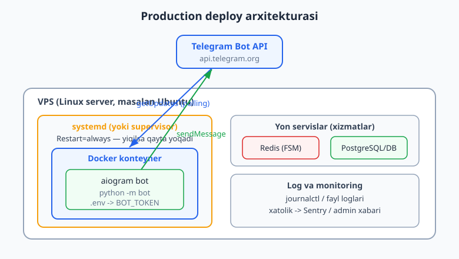
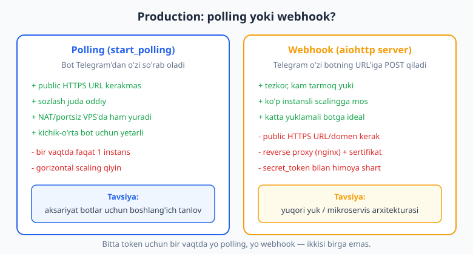
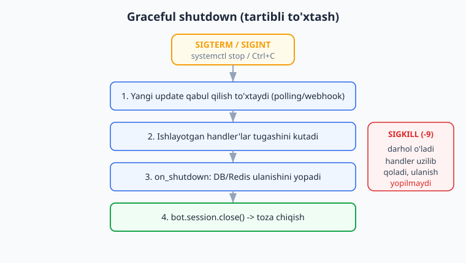

# 17 — Production va deploy

[⬅️ Oldingi: 16 — Testlash va xatolarni boshqarish](./16-testlash-xatolar.md) · [🏠 README](./README.md) · [Keyingi: 18 — Yakuniy kapston: to'liq bot ➡️](./18-kapston.md)

---

> **Bu bobda:** botingizni o'z kompyuteringizdan chiqarib, **doimiy ishlaydigan** holatga keltirasiz. O'rganamiz: nega `python bot.py` ni terminalda qoldirib bo'lmaydi; **VPS** (virtual server) nima va kod u yerga qanday yetadi; **`.env`** va sirlarni xavfsiz saqlash (`BOT_TOKEN` hech qachon kodga yoki Git'ga tushmaydi); production'da **polling va webhook** orasidagi tanlov va to'g'ri sozlash; **graceful shutdown** (tartibli to'xtash) — handler yarmida uzilib qolmaslik uchun `startup`/`shutdown` hook'lar; botni doimiy ushlab turuvchi **systemd** va **supervisor** xizmatlari; **Docker** va `Dockerfile` (konteynerda paketlash); **log** va **monitoring** (xatolikni admin'ga yetkazish); avtomatik **qayta ishga tushirish** (`Restart=always`); va aiogram'ning production best-practice'lari (default `parse_mode`, `allowed_updates`, retry, bitta instans qoidasi). CI/CD (avtomatik deploy) uchun [GitHub Actions bobi](../git-github/20-github-actions.md) ga bog'lanamiz.
>
> **Halol eslatma:** bu bobdagi aiogram **kod** qismlari — `startup`/`shutdown` lifecycle hook'lar, webhook aiohttp ilovasini qurish va route ro'yxatga olish, `.env` token o'qish, `resolve_used_update_types()` bilan `allowed_updates`, default `parse_mode`, handler routing — **offline, tokensiz** ishga tushirib tekshirildi (natijalar matnda). Lekin **VPS, Docker, systemd, nginx** buyruqlari **illustrativ**: ular real Linux server, internet va BotFather tokeni talab qiladi — bu yerda Windows muhitida ishga tushirilmaydi. Konfiguratsiya fayllari (Dockerfile, unit fayl, .env) sintaksis jihatdan to'g'ri va ko'chirib ishlatishga tayyor, lekin "deploy bo'ldi / xabar yetib bordi" degan soxta natija **yozilmagan**.

---

## 1. Nega "terminalda qoldirish" deploy emas

15-bobgacha botingizni shunday ishga tushirib keldingiz:

```bash
python bot.py
```

Terminal ochiq turganda bot ishlaydi. Lekin:

- terminalni yopsangiz — bot **o'ladi**;
- kompyuteringizni o'chirsangiz yoki uxlatib qo'ysangiz — bot o'ladi;
- internet uzilsa, bot to'xtaydi va o'zi qayta yoqilmaydi;
- xato (exception) bo'lib jarayon yiqilsa — boshqa hech kim uni qayta ishga tushirmaydi.

**Production** (ishlab chiqarish) deganda biz quyidagini nazarda tutamiz: bot **doimiy**, **internetga ulangan** serverda turadi, o'zi **avtomatik** ishga tushadi, yiqilsa **o'zini qayta yoqadi**, va siz uxlab yotganingizda ham foydalanuvchilarga xizmat qiladi.



Diagrammada production botning to'liq manzarasi: **VPS** (doim yoqilgan Linux server) ichida **systemd** botni doimiy ushlab turadi; bot **Docker** konteynerida ishlaydi; yon servislar (Redis, DB) va loglar ham shu yerda. Telegram bilan aloqa esa o'sha tanish `getUpdates`/`sendMessage`.

> Bu bob Python'ni va aiogram asoslarini biladi deb faraz qiladi. Agar `async/await`, `venv`, `pip` notanish bo'lsa, avval [Python asoslari](../python/README.md) ga qarang. VPS/Linux buyruqlari bu kitobning mavzusi emas, shu sababli ular **illustrativ** — siz ularni o'z server provayderingiz hujjatiga qarab moslaysiz.

---

## 2. VPS nima va kod u yerga qanday yetadi

**VPS** (Virtual Private Server) — bu internetda doim yoqilgan, sizga ijaraga berilgan kichik Linux kompyuter. Oddiy provayderlar: Hetzner, DigitalOcean, Vultr, Contabo, Timeweb va h.k. Eng arzon tarif (1 yadro, 1-2 GB RAM) ko'p botlar uchun yetarli.

Kod serverga ikki asosiy yo'l bilan yetadi:

1. **Git orqali (tavsiya etiladi).** Loyihangiz GitHub'da, serverda `git clone` qilasiz, yangilanish kelganda `git pull`. Bu eng toza yo'l — versiya nazorati, tarix, qaytarish hammasi bor. Git asoslari uchun [Git/GitHub kitobi](../git-github/README.md).
2. **Fayl ko'chirish (`scp`/`rsync`).** Kichik narsalar uchun, lekin tarixsiz va xatoga moyil.

Serverga kirish odatda **SSH** orqali (illustrativ):

```bash
# bu buyruqlar SERVERDA (Linux) bajariladi — illustrativ, real VPS talab qiladi
ssh root@123.45.67.89

# Python va git o'rnatish (Ubuntu/Debian misoli)
apt update && apt install -y python3 python3-venv python3-pip git

# loyihani klonlash
git clone https://github.com/sizning-username/mening-botim.git
cd mening-botim

# virtual muhit va paketlar
python3 -m venv .venv
source .venv/bin/activate
pip install -r requirements.txt
```

`requirements.txt` — loyihangiz bog'liqliklari. Versiyalarni **qotirib** yozing (reproducible bo'lsin):

```text
aiogram==3.28.2
aiohttp==3.13.5
python-dotenv==1.0.1
# FSM uchun Redis kerak bo'lsa:
# aiogram[redis]==3.28.2
# DB uchun:
# aiosqlite==0.20.0
# SQLAlchemy==2.0.36
```

> **Eslatma — `aiogram[redis]`.** Production'da FSM holatini Redis'da saqlamoqchi bo'lsangiz, `redis` paketi alohida o'rnatiladi: `pip install "aiogram[redis]"`. Biz buni offline tekshirdik — `aiogram.fsm.storage.redis` moduli aiogram bilan keladi, lekin `redis` kutubxonasi qo'shimcha ekstra sifatida o'rnatiladi (5-bo'limda batafsil).

---

## 3. Sirlar: `.env` va `BOT_TOKEN` (kodga yozilmaydi!)

**Eng muhim xavfsizlik qoidasi:** bot tokeni — bu sizning botingizning paroli. Uni qo'lga kiritgan har kim sizning bot nomingizdan xabar yuborishi, foydalanuvchilarni aldashi mumkin. Shuning uchun token **hech qachon**:

- kodga to'g'ridan yozilmaydi (`Bot("123456:AAH...")` — ❌ yomon);
- Git'ga commit qilinmaydi;
- log'ga yoki xato xabariga chiqarilmaydi.

To'g'ri yo'l — **muhit o'zgaruvchisi** (environment variable). Lokal va serverda `.env` faylida saqlanadi:

```text
# .env  (bu fayl .gitignore ichida bo'lishi SHART)
BOT_TOKEN=123456789:AAExampleTokenFromBotFather
ADMIN_ID=987654321
REDIS_URL=redis://localhost:6379/0
```

`.gitignore` ga albatta qo'shing:

```text
.env
.venv/
__pycache__/
*.pyc
```

Endi kodda tokenni `.env` dan o'qiymiz. `python-dotenv` faylni o'qib `os.environ` ga yuklaydi:

```python
import os
from dotenv import load_dotenv

load_dotenv()  # .env faylni o'qib muhitga yuklaydi

def get_token() -> str:
    token = os.environ.get("BOT_TOKEN")
    if not token:
        # token yo'q bo'lsa — darhol va aniq xato (jim ishlamaslik kerak)
        raise RuntimeError("BOT_TOKEN topilmadi! .env faylini tekshiring.")
    return token
```

Biz bu naqshni offline ishga tushirib tekshirdik: token bo'lganda `get_token()` uni qaytaradi, bo'lmaganda esa aniq `RuntimeError` ko'taradi (jim `None` bilan davom etmaydi). Mana tasdiqlangan natija:

```text
allowed_updates = ['callback_query', 'message']
OK t3: token .env-dan o'qildi, allowed_updates avtomatik aniqlandi
```

> **Toza tuzilma — pydantic-settings.** Katta loyihada `os.environ.get(...)` larni hamma joyga tarqatish o'rniga, sozlamalarni bitta tipli klassda yig'ish qulay. Bu naqsh modullar bobida (DI/konfiguratsiya) ko'rsatiladi; bu yerda asosiy g'oya muhim: **sir = muhit o'zgaruvchisi, hech qachon kod emas.**

```python
# pydantic-settings bilan (illustrativ struktura — fikr bir xil)
from pydantic_settings import BaseSettings, SettingsConfigDict

class Settings(BaseSettings):
    bot_token: str
    admin_id: int
    redis_url: str = "redis://localhost:6379/0"
    model_config = SettingsConfigDict(env_file=".env")

settings = Settings()  # .env dan avtomatik o'qiydi, tip va majburiylikni tekshiradi
```

---

## 4. Production'da polling va webhook

5-bo'limgacha siz **polling** ishlatib keldingiz: `dp.start_polling(bot)`. U Telegram'dan "yangi xabar bormi?" deb doim so'rab turadi. Bu rivojlash uchun zo'r. Production'da esa ikki yo'l bor.



### Polling — oddiy va ko'p hollarda yetarli

```python
import asyncio
from aiogram import Bot, Dispatcher
from aiogram.client.default import DefaultBotProperties
from aiogram.enums import ParseMode
from aiogram.fsm.storage.memory import MemoryStorage

async def main():
    bot = Bot(
        token=get_token(),
        default=DefaultBotProperties(parse_mode=ParseMode.HTML),
    )
    dp = Dispatcher(storage=MemoryStorage())
    # ... dp.include_router(...) ...

    # eski getUpdates'larni tashlab, faqat yangi kelganlarini olamiz:
    await bot.delete_webhook(drop_pending_updates=True)
    await dp.start_polling(bot)

if __name__ == "__main__":
    asyncio.run(main())
```

`drop_pending_updates=True` — bot uzoq o'chiq turgan bo'lsa, to'planib qolgan eski xabarlarni qayta ishlamaslik uchun ularni tashlab yuboradi. `delete_webhook` esa avval webhook qo'yilgan bo'lsa, uni olib tashlaydi (aks holda polling ishlamaydi).

> **Bitta token = bitta polling instans.** Telegram bir token uchun bir vaqtning o'zida faqat **bitta** `getUpdates` jarayoniga ruxsat beradi. Agar siz xato bilan ikkita instans ishga tushirsangiz, ular bir-birining update'ini "o'g'irlaydi" va `TelegramConflictError` chiqadi. Deploy paytida **eski instansni to'xtatib**, keyin yangisini yoqing (8-bo'lim, systemd buni avtomatik qiladi).

`run_polling` ham bor — u `start_polling` ustiga signal'larni (`SIGTERM`/`SIGINT`) ham boshqaradi:

```python
# qulay yuqori darajali variant — signal va shutdown'ni o'zi ushlaydi
dp.run_polling(bot, allowed_updates=dp.resolve_used_update_types())
```

`run_polling` — `asyncio.run(...)` ni o'zi chaqiradi, shuning uchun uni `async def` ichidan **emas**, balki to'g'ridan top-level'dan chaqiriladi.

### `allowed_updates` — keraksiz trafikni kesish

Telegram standart holatda barcha update turlarini yubormaydi (masalan, `chat_member`). Botingiz aniq qaysi turlarni ishlatishini aytib, keraksizlarini kessangiz, trafik va yuk kamayadi. aiogram buni handler'laringizdan **avtomatik** aniqlaydi:

```python
used = dp.resolve_used_update_types()
# masalan: ['callback_query', 'message']
await dp.start_polling(bot, allowed_updates=used)
```

Biz buni offline tasdiqladik: `@router.message(...)` va `@router.callback_query()` handler'lari bo'lgan dispatcher uchun `resolve_used_update_types()` aynan `['callback_query', 'message']` ni qaytardi.

### Webhook — yuqori yuk uchun

Webhook'da Telegram **o'zi** botning HTTPS URL'iga update'ni POST qiladi. Bu tezroq va ko'p instansga oson scaling beradi, lekin **public HTTPS URL** (domen + sertifikat) talab qiladi. aiogram aiohttp serveri bilan keladi:

```python
from aiohttp import web
from aiogram import Bot, Dispatcher
from aiogram.fsm.storage.memory import MemoryStorage
from aiogram.webhook.aiohttp_server import SimpleRequestHandler, setup_application

BASE_URL = "https://bot.misol.uz"          # sizning public domeningiz
WEBHOOK_PATH = "/webhook/abc-secret-path"   # tasodifiy, taxmin qilib bo'lmas yo'l
WEBHOOK_SECRET = os.environ["WEBHOOK_SECRET"]  # .env dan

async def on_startup(bot: Bot) -> None:
    # JONLI: Telegram'ga "shu URL'ga update yubor" deb aytamiz (illustrativ — public URL kerak)
    await bot.set_webhook(
        f"{BASE_URL}{WEBHOOK_PATH}",
        secret_token=WEBHOOK_SECRET,
        allowed_updates=dp.resolve_used_update_types(),
        drop_pending_updates=True,
    )

def main():
    bot = Bot(get_token(), default=DefaultBotProperties(parse_mode=ParseMode.HTML))
    dp = Dispatcher(storage=MemoryStorage())
    # ... dp.include_router(...) ...
    dp.startup.register(on_startup)

    app = web.Application()
    handler = SimpleRequestHandler(dispatcher=dp, bot=bot, secret_token=WEBHOOK_SECRET)
    handler.register(app, path=WEBHOOK_PATH)
    setup_application(app, dp, bot=bot)

    # JONLI: real port ochadi va Telegram so'rovlarini kutadi (illustrativ — server + domen kerak)
    web.run_app(app, host="0.0.0.0", port=8080)

if __name__ == "__main__":
    main()
```

`secret_token` — **majburiy** xavfsizlik chorasi. Telegram har bir so'rovda uni `X-Telegram-Bot-Api-Secret-Token` sarlavhasida yuboradi; `SimpleRequestHandler` uni tekshiradi va mos kelmasa so'rovni rad etadi. Bu sizning URL'ingizni topib olgan begona odam soxta update yuborolmasligini ta'minlaydi.

Biz webhook qismini offline tekshirdik (real `run_app` chaqirmasdan — u port ochib, public URL kutadi): `SimpleRequestHandler` va `setup_application` to'g'ri import bo'ldi, aiohttp ilovasiga route haqiqatan qo'shildi. Tasdiqlangan natija:

```text
routes: ['/webhook/abc-secret-path']
OK t2: SimpleRequestHandler/setup_application import va register ishladi
```

> **Webhook'ni nginx orqasiga qo'ying.** Production'da aiohttp serverini to'g'ridan internetga ochmang. Oldida **nginx** (reverse proxy) turadi: u HTTPS sertifikatini (Let's Encrypt) ushlaydi va so'rovni ichki `127.0.0.1:8080` ga uzatadi. Bu illustrativ nginx bloki:

```nginx
# illustrativ — real domen va sertifikat talab qiladi
server {
    listen 443 ssl;
    server_name bot.misol.uz;
    ssl_certificate     /etc/letsencrypt/live/bot.misol.uz/fullchain.pem;
    ssl_certificate_key /etc/letsencrypt/live/bot.misol.uz/privkey.pem;

    location /webhook/ {
        proxy_pass http://127.0.0.1:8080;
        proxy_set_header Host $host;
        proxy_set_header X-Forwarded-For $remote_addr;
    }
}
```

**Qaysi birini tanlash?** Boshlovchi va o'rta botlar uchun **polling** — oddiy, ishonchli, URL/domen kerakmas. Webhook'ga faqat juda yuqori yuk yoki ko'p-instansli scaling kerak bo'lganda o'ting.

---

## 5. FSM holatini production'da saqlash: Redis

8-bobda FSM (holatlar mashinasi) `MemoryStorage` bilan ishladi. Production'da bu xavfli: bot qayta yoqilsa, **xotira tozalanadi** — foydalanuvchilar to'ldirayotgan formalar, holatlar yo'qoladi. Yechim — holatni tashqi omborga (Redis) saqlash:

```python
# pip install "aiogram[redis]"  (redis paketi alohida ekstra)
from aiogram import Dispatcher
from aiogram.fsm.storage.redis import RedisStorage

storage = RedisStorage.from_url(os.environ["REDIS_URL"])  # masalan redis://localhost:6379/0
dp = Dispatcher(storage=storage)
```

Endi bot yiqilib qayta yonsa ham, foydalanuvchi qaysi holatda turgani Redis'da saqlanib qoladi. `MemoryStorage` faqat rivojlash va testlar uchun.

> **Halol eslatma.** Biz offline test muhitida `redis` serveriga ulanmadik (u alohida xizmat talab qiladi). Lekin tekshirdik: `aiogram.fsm.storage.redis` moduli aiogram'ning o'zida mavjud (`importlib.util.find_spec` bilan), va u `redis` paketini talab qiladi (`pip install "aiogram[redis]"`). `RedisStorage.from_url(...)` — aiogram hujjatida ko'rsatilgan idiomatik konstruktor. Real ulanish Redis serveri ishlab turishini talab qiladi, shuning uchun bu qismni "illustrativ — Redis xizmati kerak" deb belgilaymiz.

---

## 6. Graceful shutdown — tartibli to'xtash

Deploy paytida yoki server qayta yuklanganda bot **to'xtatiladi**. Agar uni shartta o'ldirsangiz, o'sha onda ishlayotgan handler yarmida uzilib qoladi, DB ulanishlari toza yopilmaydi. **Graceful shutdown** — botni tartibli to'xtatish: yangi update qabul qilishni to'xtatib, ishlayotganlarini tugatib, ulanishlarni yopib, keyin chiqish.



aiogram buning uchun **lifecycle hook'lar** beradi: `startup` (bot yonganda) va `shutdown` (to'xtaganda). Bu yerda biz DB/Redis ochib-yopamiz, webhook qo'yamiz/olamiz, admin'ga "bot yondi/to'xtadi" deb xabar beramiz:

```python
from aiogram import Bot, Dispatcher

async def on_startup(bot: Bot) -> None:
    # bot ishga tushganda bir marta: DB ulanishini ochish, admin'ga xabar
    print("Bot ishga tushdi")

async def on_shutdown(bot: Bot) -> None:
    # bot to'xtaganda bir marta: ulanishlarni yopish, oxirgi log
    print("Bot to'xtadi, ulanishlar yopildi")

dp.startup.register(on_startup)
dp.shutdown.register(on_shutdown)
```

Dekorator shakli ham bor — bir xil ishlaydi:

```python
@dp.startup()
async def boshlanish(bot: Bot):
    ...

@dp.shutdown()
async def tugash(bot: Bot):
    ...
```

Biz bu lifecycle tartibini offline tekshirdik. `emit_startup`/`feed_update`/`emit_shutdown` ketma-ketligida hook'lar va handler **aynan to'g'ri tartibda** ishladi:

```text
[('startup', None), ('handler', 42), ('shutdown', None)]
OK t1: startup -> handler -> shutdown tartibi to'g'ri
```

`dp.start_polling(bot)` va `web.run_app(...)` ikkalasi ham bu hook'larni avtomatik chaqiradi: `start_polling` `SIGTERM`/`SIGINT` (Ctrl+C, `systemctl stop`) ni ushlaydi, polling'ni to'xtatadi, `shutdown` hook'larni ishga soladi va `bot.session.close()` ni o'zi qiladi. **Sizning vazifangiz** — ulanishlaringizni `shutdown` hook'da yopish.

> **`SIGKILL` (-9) — graceful emas.** Agar jarayonni `kill -9` bilan o'ldirsangiz, OS uni darhol uradi va hech qanday hook ishlamaydi (diagrammadagi qizil quti). Shuning uchun `systemctl stop` (u `SIGTERM` yuboradi) ishlatiladi, `kill -9` emas.

To'liq graceful polling skeleti (DB bilan):

```python
import asyncio
import aiosqlite
from aiogram import Bot, Dispatcher
from aiogram.client.default import DefaultBotProperties
from aiogram.enums import ParseMode
from aiogram.fsm.storage.memory import MemoryStorage

async def main():
    bot = Bot(get_token(), default=DefaultBotProperties(parse_mode=ParseMode.HTML))
    dp = Dispatcher(storage=MemoryStorage())
    # dp.include_router(...)

    db = await aiosqlite.connect("bot.db")

    async def on_startup(bot: Bot):
        print("ulanishlar tayyor")

    async def on_shutdown(bot: Bot):
        await db.close()        # DB'ni toza yopamiz
        print("DB yopildi")

    dp.startup.register(on_startup)
    dp.shutdown.register(on_shutdown)

    await bot.delete_webhook(drop_pending_updates=True)
    try:
        await dp.start_polling(bot, allowed_updates=dp.resolve_used_update_types())
    finally:
        await bot.session.close()   # har holatda sessiyani yopamiz

if __name__ == "__main__":
    asyncio.run(main())
```

---

## 7. Log va monitoring

Production'da `print` yetarli emas. Sizga **strukturali log** kerak: vaqt, daraja (INFO/WARNING/ERROR), qaysi modul. Python'ning standart `logging` moduli buni beradi:

```python
import logging

logging.basicConfig(
    level=logging.INFO,
    format="%(asctime)s | %(levelname)-8s | %(name)s | %(message)s",
)
# aiogram ham shu logger orqali yozadi
log = logging.getLogger("bot")

log.info("Bot ishga tushdi")
log.warning("Foydalanuvchi %s cheklovga tushdi", user_id)
```

Biz handler ichida `log.info(...)` ishlatib, routing va loglashni offline pytest bilan tekshirdik — 2 ta test o'tdi:

```text
.. [100%]
2 passed in 3.88s
```

### Kutilmagan xatoni admin'ga yetkazish

Eng muhim monitoring: bot ichida **kutilmagan xato** bo'lganda jim yiqilib qolmasin, balki sizga (admin'ga) xabar bersin. aiogram'da buni **xatolik handler'i** (`@dp.errors`) bilan qilamiz:

```python
from aiogram import Dispatcher
from aiogram.types import ErrorEvent

ADMIN_ID = int(os.environ["ADMIN_ID"])

@dp.errors()
async def xatoni_ushla(event: ErrorEvent, bot: Bot):
    # log'ga to'liq stek-iz yozamiz
    logging.exception("Handler'da xato: %s", event.exception)
    # JONLI: admin'ga qisqacha xabar (illustrativ — token+internet kerak)
    await bot.send_message(ADMIN_ID, f"Botda xato: {type(event.exception).__name__}")
    return True   # xato "ushlandi" deb belgilanadi, bot yiqilmaydi
```

> Yuqoridagi `bot.send_message(...)` **jonli botda** admin'ga xato xabarini yuboradi. Offline (tokensiz) testda bu satr Telegram'ga so'rov yuborishga uringani uchun ishlamaydi — biz `@dp.errors` handler'ining ro'yxatga olinishini va `logging.exception` qismini tekshirdik; xabar yuborish esa "illustrativ — token+internet kerak".

Katta loyihalarda log'larni **Sentry** kabi xizmatga jo'natish ham keng tarqalgan (xatolarni guruhlash, stek-iz, ogohlantirish). Bu illustrativ — tashqi xizmat va kalit talab qiladi:

```python
# illustrativ — sentry hisobi va DSN kaliti kerak
import sentry_sdk
sentry_sdk.init(dsn=os.environ["SENTRY_DSN"], traces_sample_rate=0.0)
```

---

## 8. Botni doimiy ushlash: systemd

VPS'da botni doim ishlatib turish va yiqilsa avtomatik qayta yoqishning standart yo'li — **systemd** (Linux'ning xizmat menejeri). Siz bitta "unit fayl" yozasiz, systemd qolganini qiladi.

`/etc/systemd/system/mening-botim.service` (illustrativ — Linux server talab qiladi):

```ini
[Unit]
Description=Mening Telegram botim
After=network-online.target
Wants=network-online.target

[Service]
Type=simple
User=botuser
WorkingDirectory=/home/botuser/mening-botim
EnvironmentFile=/home/botuser/mening-botim/.env
ExecStart=/home/botuser/mening-botim/.venv/bin/python -m bot
Restart=always
RestartSec=5

[Install]
WantedBy=multi-user.target
```

Eng muhim qatorlar:

- **`Restart=always`** — bot qanday sababdan yiqilsa ham, systemd uni qayta yoqadi.
- **`RestartSec=5`** — qayta yoqishdan oldin 5 soniya kutadi (cheksiz tez sikldan saqlaydi).
- **`EnvironmentFile=...`** — `.env` ni avtomatik muhitga yuklaydi (bu yerda `load_dotenv()` ham kerak emas, lekin zarar qilmaydi).
- **`After=network-online.target`** — internet ulangach yoqiladi.

Boshqarish buyruqlari (illustrativ — Linux server talab qiladi):

```bash
sudo systemctl daemon-reload          # unit faylni qayta o'qish
sudo systemctl enable mening-botim    # server qayta yuklanganda avtoyoqish
sudo systemctl start mening-botim     # hozir yoqish
sudo systemctl status mening-botim    # holatni ko'rish
sudo systemctl restart mening-botim   # deploy'dan keyin qayta yoqish
sudo systemctl stop mening-botim      # SIGTERM yuboradi -> graceful shutdown
sudo journalctl -u mening-botim -f    # loglarni jonli kuzatish
```

`systemctl stop` aynan `SIGTERM` yuboradi — shuning uchun 6-bo'limdagi graceful shutdown ishlaydi. Deploy oqimi odatda shunday (illustrativ):

```bash
cd /home/botuser/mening-botim
git pull
.venv/bin/pip install -r requirements.txt
sudo systemctl restart mening-botim   # eski instans graceful to'xtaydi, yangisi yonadi
```

> **supervisor — muqobil.** Ba'zi serverlarda systemd o'rniga **supervisor** ishlatiladi (ayniqsa Docker'siz, eski tizimlarda). Konsepsiya bir xil: konfiguratsiya faylida buyruq, `autorestart=true`, log yo'li ko'rsatiladi. Illustrativ `supervisor` konfiguratsiyasi:

```ini
; /etc/supervisor/conf.d/mening-botim.conf  (illustrativ)
[program:mening-botim]
command=/home/botuser/mening-botim/.venv/bin/python -m bot
directory=/home/botuser/mening-botim
autostart=true
autorestart=true
stopsignal=TERM
stdout_logfile=/var/log/mening-botim.log
```

`stopsignal=TERM` — supervisor ham graceful uchun `SIGTERM` yuboradi.

---

## 9. Docker — konteynerda paketlash

**Docker** kodingizni, Python versiyasini, barcha paketlarni va sozlamalarni bitta **konteyner** ichiga joylaydi. "Mening kompyuterimda ishlayapti, serverda esa yo'q" muammosi yo'qoladi — konteyner hamma joyda bir xil ishlaydi.

`Dockerfile` (illustrativ — Docker o'rnatilgan server talab qiladi):

```dockerfile
# Yengil rasmiy Python image (versiya qotirilgan)
FROM python:3.14-slim

# logni darhol chiqarish uchun (buffer'siz) + .pyc yozmaslik
ENV PYTHONUNBUFFERED=1 \
    PYTHONDONTWRITEBYTECODE=1

WORKDIR /app

# Avval faqat requirements'ni nusxalaymiz — Docker cache'dan foydalanish uchun
COPY requirements.txt .
RUN pip install --no-cache-dir -r requirements.txt

# Endi qolgan kodni nusxalaymiz
COPY . .

# Botni modul sifatida ishga tushiramiz (signal'lar to'g'ri yetib borishi uchun exec-shakl)
CMD ["python", "-m", "bot"]
```

Muhim nuqtalar:

- **`python:3.14-slim`** — kichik, lekin to'liq Python image. Versiyani qotiramiz (`latest` emas).
- **requirements'ni alohida nusxalash** — kod o'zgarganda paketlar qayta o'rnatilmaydi (Docker layer cache). Bu build'ni tezlashtiradi.
- **`CMD ["python", "-m", "bot"]`** (JSON/exec shakl) — bu shaklda `SIGTERM` to'g'ridan Python'ga yetadi, ya'ni graceful shutdown ishlaydi. Shell shakli (`CMD python -m bot`) signal'ni yutib qo'yishi mumkin.

`.dockerignore` (keraksiz fayllarni image'ga kiritmaslik):

```text
.venv/
__pycache__/
*.pyc
.git/
.env
```

> **`.env` ni image'ga QO'SHMANG.** Tokenni image ichiga "pishirib" qo'ymang (image boshqalarga tarqalishi mumkin). O'rniga konteyner ishga tushganda muhit o'zgaruvchisi sifatida bering (`docker run --env-file .env ...` yoki `docker compose` da `env_file`).

Build va run (illustrativ — Docker talab qiladi):

```bash
docker build -t mening-botim .
docker run -d --name botim --restart=always --env-file .env mening-botim
docker logs -f botim          # loglarni kuzatish
docker stop botim             # SIGTERM -> graceful shutdown (10s kutadi, keyin SIGKILL)
```

`--restart=always` — Docker darajasidagi avto-qayta-yoqish (systemd'ning `Restart=always` ekvivalenti). `docker stop` 10 soniya graceful kutadi, shuning uchun shutdown hook'laringiz ishlaydi.

### docker-compose — bot + Redis + DB birga

Bir nechta xizmatni (bot, Redis, DB) birga boshqarish uchun `docker-compose.yml` qulay (illustrativ):

```yaml
# docker-compose.yml (illustrativ — Docker talab qiladi)
services:
  bot:
    build: .
    restart: always
    env_file: .env
    depends_on:
      - redis
  redis:
    image: redis:7-alpine
    restart: always
    volumes:
      - redis-data:/data

volumes:
  redis-data:
```

`docker compose up -d` — hammasini bir buyruq bilan yoqadi; `depends_on` bot Redis'dan keyin yonishini ta'minlaydi.

---

## 10. Avtomatik deploy (CI/CD) va best-practice'lar

Har safar qo'lda SSH bilan kirib `git pull` qilish o'rniga, **CI/CD** (Continuous Deployment) ni sozlash mumkin: GitHub'ga `git push` qilasiz — testlar ishlaydi, keyin avtomatik serverga deploy bo'ladi. Bu **GitHub Actions** bilan qilinadi.

CI/CD'ni to'liq o'rganish uchun [GitHub Actions bobi](../git-github/20-github-actions.md) ga qarang. Bot uchun oddiy workflow g'oyasi (illustrativ — GitHub repo va server kerak):

```yaml
# .github/workflows/deploy.yml (illustrativ)
name: deploy
on:
  push:
    branches: [main]
jobs:
  deploy:
    runs-on: ubuntu-latest
    steps:
      - uses: actions/checkout@v4
      # 1) testlarni ishga tushirish (16-bob)
      # 2) SSH orqali serverga ulanib: git pull + systemctl restart
```

Sirlar (token, server kaliti) GitHub'ning **Secrets** bo'limida saqlanadi — hech qachon workflow fayliga yozilmaydi.

### Production best-practice'lar yig'masi

aiogram botni production'ga chiqarishda eslab qoling:

1. **Token = `.env`/sir.** Hech qachon kodga, Git'ga, log'ga. `.env` — `.gitignore` da.
2. **Default `parse_mode`ni bir marta o'rnating** — `Bot(default=DefaultBotProperties(parse_mode=ParseMode.HTML))`. Biz buni tekshirdik: `bot.default.parse_mode == ParseMode.HTML`.
3. **`allowed_updates=dp.resolve_used_update_types()`** — keraksiz update'larni kesing.
4. **Bitta token = bitta polling instans.** Deploy'da eski instansni avval to'xtating (systemd `restart` buni o'zi qiladi).
5. **Polling boshida `delete_webhook(drop_pending_updates=True)`** — eski webhook va to'planib qolgan xabarlarni tozalang.
6. **Graceful shutdown** — `shutdown` hook'da DB/Redis yoping; `SIGTERM` ishlating (`kill -9` emas).
7. **`Restart=always`** (systemd yoki Docker) — bot yiqilsa o'zi qaytadi.
8. **FSM holatini Redis'da** saqlang (production), `MemoryStorage` faqat rivojlash uchun.
9. **`@dp.errors()` bilan** kutilmagan xatoni ushlang va admin'ga/log'ga yetkazing.
10. **Versiyalarni qotiring** (`requirements.txt` da `==`), Docker image versiyasini ham.
11. **Network xatosida aiogram o'zi qayta urinadi** — `start_polling` ulanish uzilsa qayta ulanadi; siz qo'lda `while True` loop yozishingiz shart emas.

> aiogram'ni Node.js (grammY/Telegraf) bilan solishtirmoqchi bo'lsangiz, [Node.js bobi](../nodejs/README.md) dagi deploy yondashuvi shunga o'xshash: konteyner + process menejer (PM2) + sirlar muhit o'zgaruvchisida. Asosiy konsepsiyalar til-agnostik.

---

## Mashqlar

> Eslatma: quyidagi mashqlarning **kod** qismlari offline (tokensiz) ishlaydi — `feed_update`, lifecycle hook, `.env` o'qish, konfiguratsiya. VPS/Docker/systemd qismlari **illustrativ** — ularni faqat tahlil qiling yoki sintaksisini tekshiring, real ishga tushirish server talab qiladi.

### Oson

1. `.env` faylidan `BOT_TOKEN` ni o'qiydigan `get_token()` funksiyasini yozing: token bo'lsa qaytarsin, bo'lmasa aniq `RuntimeError` ko'tarsin. `os.environ` bilan ikkala holatni tekshiring (tokensiz).
2. `requirements.txt` faylini yozing: aiogram 3.28.2, aiohttp 3.13.5, python-dotenv ni versiyalari **qotirilgan** holda. Nega `==` ishlatamiz, bir-ikki gap bilan tushuntiring.
3. `.gitignore` ga production bot uchun qaysi fayllar/papkalar tushishi kerakligini ro'yxat qiling va har birining sababini yozing.
4. Dispatcher'ga `startup` va `shutdown` hook ulang (`register` bilan). Offline `emit_startup`/`emit_shutdown` chaqirib, ikkalasi ham ishlaganini tekshiring (ro'yxatga voqea qo'shib).
5. Bir handler bo'lgan dispatcher uchun `dp.resolve_used_update_types()` nimani qaytarishini bashorat qiling, keyin offline tekshirib o'zingizni sinang.
6. Quyidagi `Dockerfile` qatorida xato bor: `CMD python -m bot`. Nega bu graceful shutdown uchun yomon va to'g'ri shakli qanday?

### O'rta

7. Polling botning to'liq `main()` skeletini yozing: `Bot(default=DefaultBotProperties(parse_mode=ParseMode.HTML))`, `delete_webhook(drop_pending_updates=True)`, `start_polling(allowed_updates=...)`, va `finally` da `bot.session.close()`. Offline default `parse_mode` o'rnatilganini `assert` bilan tekshiring.
8. `@dp.errors()` xatolik handler'ini yozing: u `logging.exception(...)` bilan log yozsin va `True` qaytarsin. Handler ro'yxatga olinganini offline tekshiring (real `send_message` siz).
9. systemd unit fayl yozing va quyidagi talablarni bajaring: yiqilsa qayta yonadi, 10 soniya kutib qayta yonadi, `.env` ni avtomatik yuklaydi, internet ulangach yonadi. Har qatorni izohlang.
10. Webhook uchun aiohttp ilovasini quring: `SimpleRequestHandler` ni `secret_token` bilan ro'yxatga oling, `setup_application` chaqiring. Offline route haqiqatan qo'shilganini tekshiring (`web.run_app` chaqirmasdan).
11. `MemoryStorage` va `RedisStorage` orasidagi farqni production nuqtai nazaridan tushuntiring: bot qayta yonganda nima bo'ladi? Qaysi birini qachon tanlaysiz?
12. `docker-compose.yml` yozing: `bot` va `redis` xizmatlari, ikkalasi ham `restart: always`, bot Redis'dan keyin yonsin, Redis ma'lumoti `volume` da saqlansin.

### Qiyin

13. To'liq graceful polling botini quring: `aiosqlite` ulanishini `startup` da ochib, `shutdown` da yoping. Offline: `emit_startup` -> mock `/start` update'ni `feed_update` -> `emit_shutdown` ketma-ketligini ishga tushirib, ulanish ochildi va **yopildi** ekanini `assert` bilan isbotlang (DB yopilgach so'rov xato berishi orqali).
14. "Bitta token = bitta polling instans" qoidasini hujjat bilan tushuntiring: ikkita instans yonsa qanday xato (`TelegramConflictError`) chiqadi, deploy paytida buni qanday oldini olasiz (eski instansni avval to'xtatish)? systemd `restart` buni qanday hal qiladi? (Tahliliy mashq — kod ishga tushirish shart emas, lekin aiogram istisno klassini import qilib mavjudligini tekshiring.)

<details markdown="1"><summary>Yechimlar</summary>

**1.** Token o'qish — bor va yo'q holatlari (offline tekshirilgan):

```python
import os

def get_token() -> str:
    token = os.environ.get("BOT_TOKEN")
    if not token:
        raise RuntimeError("BOT_TOKEN topilmadi! .env faylini tekshiring.")
    return token

# tekshiruv
os.environ["BOT_TOKEN"] = "123456:AAH-FakeTest_abc"
assert get_token() == "123456:AAH-FakeTest_abc"

del os.environ["BOT_TOKEN"]
try:
    get_token()
    assert False, "xato kutilgandi"
except RuntimeError as e:
    print("to'g'ri xato:", e)   # -> BOT_TOKEN topilmadi! ...
```

`os.environ.get(...)` `None` qaytarsa, jim davom etmaymiz — aniq xato ko'taramiz. Bu "konfiguratsiya yo'q" muammosini ishga tushishda darhol ushlaydi.

**2.** Versiyalar qotirilgan `requirements.txt`:

```text
aiogram==3.28.2
aiohttp==3.13.5
python-dotenv==1.0.1
```

`==` ishlatamiz, chunki **reproducible** (qayta-tiklanuvchan) build kerak: bugun lokal kompyuterda ishlagan kod ertaga serverda **aynan o'sha** paket versiyalari bilan ishlasin. `>=` ishlatsangiz, kelajakda chiqqan yangi (mos kelmaydigan) versiya o'rnatilib, bot kutilmaganda buzilishi mumkin — ayniqsa aiogram 2.x -> 3.x kabi katta o'zgarishlarda halokatli.

**3.** Production `.gitignore`:

```text
.env            # sirlar (token, parollar) — hech qachon Git'ga emas
.venv/          # virtual muhit — har serverda qaytadan quriladi, og'ir va platformaga bog'liq
__pycache__/    # Python kesh fayllari — kerakmas, avtomatik qayta yaratiladi
*.pyc           # kompilyatsiya qilingan bayt-kod — kerakmas
*.db            # lokal SQLite baza — ma'lumot, kodga aralashmasligi kerak
*.log           # log fayllari — server tomonda yig'iladi, repo'ni shishiradi
```

Eng muhimi `.env` — token tasodifan ham GitHub'ga tushmasligi uchun.

**4.** Lifecycle hook (offline tekshirilgan):

```python
import asyncio
from aiogram import Bot, Dispatcher
from aiogram.fsm.storage.memory import MemoryStorage

audit = []

async def on_startup(bot: Bot):
    audit.append("startup")

async def on_shutdown(bot: Bot):
    audit.append("shutdown")

async def main():
    bot = Bot("123456:AAH-FakeTest_abc")
    dp = Dispatcher(storage=MemoryStorage())
    dp.startup.register(on_startup)
    dp.shutdown.register(on_shutdown)
    await dp.emit_startup(bot=bot)
    await dp.emit_shutdown(bot=bot)
    await bot.session.close()
    print(audit)                          # -> ['startup', 'shutdown']
    assert audit == ["startup", "shutdown"]

asyncio.run(main())
```

**5.** Bashorat: faqat `@router.message(...)` bo'lsa `['message']`; agar `callback_query` handler ham bo'lsa `['callback_query', 'message']`. Tekshirish:

```python
from aiogram import Dispatcher, Router
from aiogram.filters import Command
from aiogram.types import Message

r = Router()
@r.message(Command("ping"))
async def ping(m: Message): ...

dp = Dispatcher()
dp.include_router(r)
print(dp.resolve_used_update_types())     # -> ['message']
assert dp.resolve_used_update_types() == ["message"]
```

Handler turini qo'shgan sayin ro'yxat o'sadi — bu aynan `allowed_updates` ga beriladigan qiymat.

**6.** `CMD python -m bot` — **shell shakli**. Bu Docker'da `/bin/sh -c "python -m bot"` ga aylanadi, ya'ni PID 1 — `sh`, Python esa uning bolasi. `docker stop` `SIGTERM` ni PID 1 (`sh`) ga yuboradi, lekin `sh` uni Python'ga uzatmasligi mumkin — natijada graceful shutdown ishlamaydi va 10 soniyadan keyin `SIGKILL` bilan shartta o'ladi. To'g'ri shakli — **exec (JSON) shakli**:

```dockerfile
CMD ["python", "-m", "bot"]
```

Bu shaklda Python to'g'ridan PID 1 bo'ladi, `SIGTERM` unga yetadi, `start_polling` uni ushlab graceful to'xtaydi.

**7.** Polling `main()` skeleti (offline `parse_mode` tekshirildi):

```python
import asyncio
from aiogram import Bot, Dispatcher
from aiogram.client.default import DefaultBotProperties
from aiogram.enums import ParseMode
from aiogram.fsm.storage.memory import MemoryStorage

async def build():
    bot = Bot("123456:AAH-FakeTest_abc",
              default=DefaultBotProperties(parse_mode=ParseMode.HTML))
    assert bot.default.parse_mode == ParseMode.HTML
    dp = Dispatcher(storage=MemoryStorage())
    await bot.session.close()
    print("OK: default parse_mode =", bot.default.parse_mode)
    return bot, dp

asyncio.run(build())

# To'liq skelet (jonli — token+internet kerak, illustrativ):
async def main():
    bot = Bot(get_token(), default=DefaultBotProperties(parse_mode=ParseMode.HTML))
    dp = Dispatcher(storage=MemoryStorage())
    # dp.include_router(...)
    await bot.delete_webhook(drop_pending_updates=True)
    try:
        await dp.start_polling(bot, allowed_updates=dp.resolve_used_update_types())
    finally:
        await bot.session.close()
```

`build()` qismi offline o'tdi: `bot.default.parse_mode` haqiqatan `ParseMode.HTML`. `main()` ning `start_polling` qismi jonli Telegram talab qiladi (illustrativ).

**8.** Xatolik handler (ro'yxatga olinishi offline tekshirildi):

```python
import logging
from aiogram import Bot, Dispatcher
from aiogram.types import ErrorEvent

dp = Dispatcher()

@dp.errors()
async def xatoni_ushla(event: ErrorEvent, bot: Bot):
    logging.exception("Handler'da xato: %s", event.exception)
    # JONLI (illustrativ): await bot.send_message(ADMIN_ID, "...")
    return True

# handler ro'yxatga olinganini tekshiramiz (real xato yuborishsiz):
assert len(dp.errors.handlers) == 1
print("OK: xatolik handler ro'yxatga olindi")
```

`return True` — xato "ushlandi" deb belgilanadi va bot ishlashda davom etadi (yiqilmaydi). `send_message` jonli yuborish — illustrativ.

**9.** systemd unit fayl (illustrativ):

```ini
[Unit]
Description=Mening Telegram botim
After=network-online.target          # internet tayyor bo'lgach yoqiladi
Wants=network-online.target

[Service]
Type=simple
User=botuser                         # root'da emas, alohida foydalanuvchida (xavfsizroq)
WorkingDirectory=/home/botuser/mening-botim
EnvironmentFile=/home/botuser/mening-botim/.env   # .env ni avtomatik yuklaydi
ExecStart=/home/botuser/mening-botim/.venv/bin/python -m bot
Restart=always                       # yiqilsa har doim qayta yonadi
RestartSec=10                        # qayta yonishdan oldin 10 soniya kutadi

[Install]
WantedBy=multi-user.target
```

`Restart=always` + `RestartSec=10` — talab qilingan "yiqilsa 10 soniyada qayta yonish". `EnvironmentFile` — `.env` ni yuklash. `After/Wants=network-online.target` — internet ulangach yonish.

**10.** Webhook aiohttp ilovasi (route qo'shilishi offline tekshirildi):

```python
from aiohttp import web
from aiogram import Bot, Dispatcher
from aiogram.fsm.storage.memory import MemoryStorage
from aiogram.webhook.aiohttp_server import SimpleRequestHandler, setup_application

WEBHOOK_PATH = "/webhook/abc-secret-path"
WEBHOOK_SECRET = "my-super-secret-token"

bot = Bot("123456:AAH-FakeTest_abc")
dp = Dispatcher(storage=MemoryStorage())

app = web.Application()
SimpleRequestHandler(dispatcher=dp, bot=bot, secret_token=WEBHOOK_SECRET).register(app, path=WEBHOOK_PATH)
setup_application(app, dp, bot=bot)

paths = [getattr(r.resource, "canonical", None) for r in app.router.routes()]
assert WEBHOOK_PATH in paths
print("OK: route qo'shildi ->", paths)
# web.run_app(...) CHAQIRMAYMIZ — u real port va public URL talab qiladi (illustrativ)
```

`secret_token` Telegram'dan kelgan `X-Telegram-Bot-Api-Secret-Token` sarlavhasini tekshirib, soxta so'rovlarni rad etadi.

**11.** `MemoryStorage` holatni jarayon **xotirasida** saqlaydi — bot qayta yonganda (deploy, yiqilish, server restart) hammasi **yo'qoladi**: foydalanuvchilar to'ldirayotgan formalar, FSM holatlari nolga tushadi. `RedisStorage` esa holatni tashqi Redis serverida saqlaydi — bot qayta yonsa ham foydalanuvchi qaysi qadamda turgani **saqlanib qoladi**. Tanlov: rivojlash/test va holat yo'qolishi muhim bo'lmagan oddiy botlar uchun `MemoryStorage`; foydalanuvchi uzun forma/dialog to'ldiradigan, yoki bir nechta instansli production bot uchun `RedisStorage`. `pip install "aiogram[redis]"` kerak; `RedisStorage.from_url(REDIS_URL)` bilan ulanasiz.

**12.** docker-compose (illustrativ):

```yaml
services:
  bot:
    build: .
    restart: always
    env_file: .env
    depends_on:
      - redis           # bot Redis'dan keyin yonadi
  redis:
    image: redis:7-alpine
    restart: always
    volumes:
      - redis-data:/data   # ma'lumot konteyner o'chsa ham saqlanadi

volumes:
  redis-data:
```

`depends_on` ishga tushish tartibini beradi; `volume` Redis ma'lumotini konteyner qayta yaratilsa ham saqlaydi.

**13.** Graceful DB ochish/yopish, yopilganini isbotlash (offline tekshirilgan):

```python
import asyncio
from datetime import datetime
import aiosqlite
from aiogram import Bot, Dispatcher, Router
from aiogram.filters import CommandStart
from aiogram.fsm.storage.memory import MemoryStorage
from aiogram.types import Message, Update, Chat, User

router = Router()
holat = {}

@router.message(CommandStart())
async def start(message: Message):
    holat["handler_ishladi"] = True

async def main():
    bot = Bot("123456:AAH-FakeTest_abc")
    dp = Dispatcher(storage=MemoryStorage())
    dp.include_router(router)

    db = await aiosqlite.connect(":memory:")
    await db.execute("CREATE TABLE t(x INTEGER)")
    await db.commit()
    holat["db"] = db

    async def on_startup(bot: Bot):
        holat["startup"] = True

    async def on_shutdown(bot: Bot):
        await db.close()
        holat["shutdown"] = True

    dp.startup.register(on_startup)
    dp.shutdown.register(on_shutdown)

    await dp.emit_startup(bot=bot)
    msg = Message(message_id=1, date=datetime.now(),
                  chat=Chat(id=1, type="private"),
                  from_user=User(id=1, is_bot=False, first_name="T"), text="/start")
    await dp.feed_update(bot, Update(update_id=1, message=msg))
    await dp.emit_shutdown(bot=bot)
    await bot.session.close()

    assert holat.get("startup") and holat.get("handler_ishladi") and holat.get("shutdown")
    # DB yopilganini isbotlaymiz: yopilgan ulanishda so'rov xato beradi
    try:
        await db.execute("SELECT 1")
        assert False, "DB ochiq qolgan!"
    except Exception as e:
        print("DB yopilgan (kutilgan xato):", type(e).__name__)

    print("OK: startup -> handler -> shutdown, DB yopildi")

asyncio.run(main())
```

Bu yerda `shutdown` hook `db.close()` ni chaqiradi; keyin yopilgan ulanishda `SELECT 1` xato berishi DB **haqiqatan** yopilganini isbotlaydi.

**14.** "Bitta token = bitta polling instans": Telegram bir token uchun bir vaqtda faqat bitta `getUpdates` so'rov-oqimiga ruxsat beradi. Ikkita instans yonsa, ular bir-birining update'ini tortib oladi va Telegram `409 Conflict` qaytaradi — aiogram buni `TelegramConflictError` istisno sifatida ko'taradi:

```python
from aiogram.exceptions import TelegramConflictError
assert issubclass(TelegramConflictError, Exception)
print("TelegramConflictError mavjud:", TelegramConflictError.__name__)
```

(Bu import offline o'tadi — istisno klassi aiogram'da bor.) Deploy paytida oldini olish: yangi instansni yoqishdan **oldin** eskisini to'xtating. systemd `systemctl restart` buni avtomatik qiladi — u avval eski jarayonga `SIGTERM` yuborib, u graceful to'xtaguncha (yoki `TimeoutStopSec` tugaguncha) kutadi, **keyin** yangisini yoqadi. Shu sababli ikkita instans hech qachon bir vaqtda polling qilmaydi. Docker'da ham `docker stop` (eski) -> `docker run` (yangi) yoki `docker compose up -d` (recreate) shu tartibni saqlaydi. Webhook'da bu muammo yo'q (Telegram bitta URL'ga yuboradi), lekin u yerda ham eski webhook'ni yangisiga almashtirish atomik bo'ladi.

</details>

---

[⬅️ Oldingi: 16 — Testlash va xatolarni boshqarish](./16-testlash-xatolar.md) · [🏠 README](./README.md) · [Keyingi: 18 — Yakuniy kapston: to'liq bot ➡️](./18-kapston.md)
