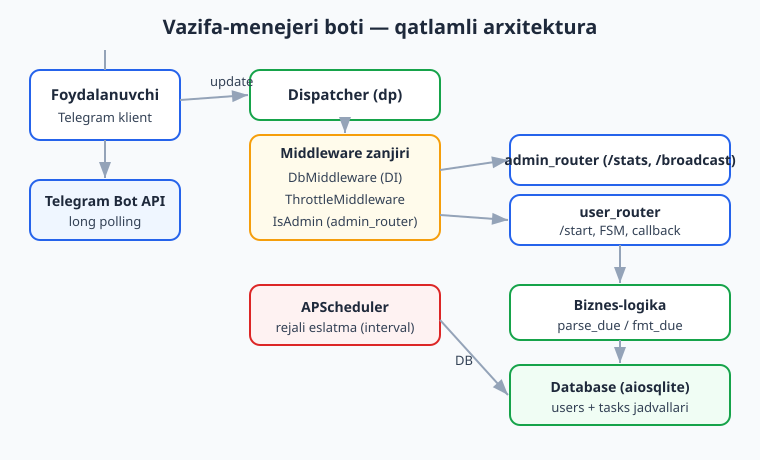
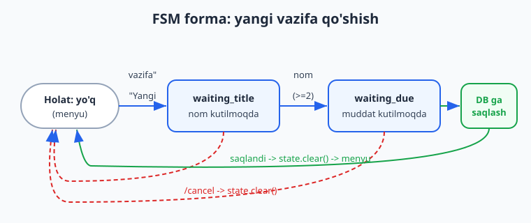
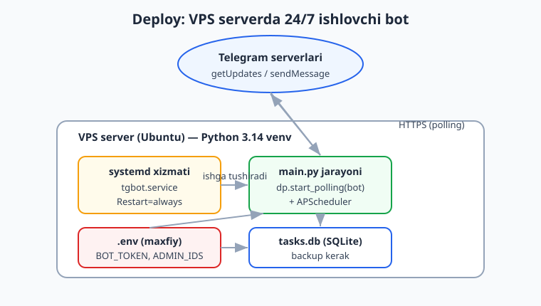

# 18 — Yakuniy kapston: to'liq bot

[⬅️ Oldingi: 17 — Production va deploy](./17-production-deploy.md) · [🏠 README](./README.md) · [Keyingi: 19 — Guruhlarda ishlash ➡️](./19-guruhlar.md)

---

> **Bu bobda:** kitob davomida o'rgangan hamma narsani **bitta to'liq botda** birlashtiramiz — **Vazifa-menejeri bot** (TaskBot). U foydalanuvchidan vazifa qabul qiladi (FSM forma), uni ma'lumotlar bazasiga saqlaydi, inline tugmalar orqali "bajarildi" / "o'chir" amallarini bajaradi, reply-klaviatura menyusi bilan ishlaydi, `DbMiddleware` orqali DB ni har handlerga uzatadi (DI), `ThrottleMiddleware` bilan spamni cheklaydi, faqat admin ko'radigan `/stats` va `/broadcast` buyruqlariga ega, va **APScheduler** bilan vaqti yetgan vazifalar uchun rejali eslatma yuboradi. Oxirida botni VPS serverga `systemd` bilan 24/7 ishlash uchun joylashtirish yo'riqnomasini ko'ramiz. Bu bob `0 -> ekspert` yo'lini yakunlaydi: shu paytgacha bo'lak-bo'lak o'rgangan handlerlar, filtrlar (4-bob), formatlash (5-bob), klaviaturalar (6-bob), callback (7-bob), FSM (8-bob), middleware (9-bob), DB (10-bob) va loyiha tuzilishi (11-bob) endi yagona ishlaydigan mahsulotga aylanadi.
>
> **Halol eslatma:** bu bobdagi biznes-logika (`parse_due`/`fmt_due`), ma'lumotlar bazasi (aiosqlite), `CallbackData` pack/unpack, handler yo'naltirish (FSM forma, `/start`, callbacklar), `DbMiddleware`/`ThrottleMiddleware`/`IsAdmin` middlewarelari, klaviatura quruvchilar va APScheduler eslatma sikli **token va internetsiz, offline tekshirilgan** (mock `feed_update` va mock session bilan — Telegramga hech narsa yuborilmagan). Faqat `dp.start_polling(bot)`, `bot.set_my_commands(...)`, real `bot.send_message(...)` va serverga deploy bo'limlari **jonli** — ular BotFather token va internet (deploy uchun VPS) talab qiladi. Bularni matnda "illustrativ" deb belgilaymiz; soxta "bot ishladi" deb yozmaymiz.

---

## Nima quramiz: TaskBot

TaskBot — shaxsiy vazifalar ro'yxatini boshqaradigan oddiy, lekin to'liq bot. Foydalanuvchi tajribasi shunday ko'rinadi (illustrativ — jonli botda token+internet kerak):

```text
Foydalanuvchi: /start
Bot: Xush kelibsiz, Oqil! Men vazifa-menejer botman. [Yangi vazifa] [Vazifalarim]

Foydalanuvchi: [Yangi vazifa]
Bot: Vazifa nomini yozing (/cancel — bekor):

Foydalanuvchi: Hisobot tayyorlash
Bot: Muddatni kiriting: '30m', '2h', '1d', '2026-06-20 14:30' yoki 'yoq'

Foydalanuvchi: 2h
Bot: Saqlandi! #1: Hisobot tayyorlash | Muddat: 2026-06-13 12:00

... 2 soatdan keyin ...
Bot: Eslatma: "Hisobot tayyorlash" vazifasi muddati yetdi!
```

Bot ichida quyidagi qatlamlar bor — biz ularni alohida-alohida qurib, keyin birlashtiramiz:



Tuzilish 11-bobdagi modullashtirilgan naqshga amal qiladi:

```text
taskbot/
├── .env                 # BOT_TOKEN, ADMIN_IDS (git ga KIRMAYDI)
├── .env.example
├── requirements.txt
├── config.py            # Settings
├── db.py                # Database (aiosqlite repository)
├── utils.py             # parse_due / fmt_due (sof logika)
├── bot_app.py           # routerlar, FSM, klaviatura, middleware
├── scheduler.py         # APScheduler eslatma sikli
└── main.py              # kirish nuqtasi: bot + dp + scheduler
```

> Agar paket/modul tuzilishi xira bo'lsa, [Python qo'llanmasi](../python/README.md) ga, SQL asoslari uchun [SQL qo'llanmasi](../sql/README.md) ga qarang. Bir xil botni Node.js'da qanday qurish mumkinligini [Node.js qo'llanmasi](../nodejs/README.md) da ko'rishingiz mumkin.

---

## 1. Konfiguratsiya: `config.py` va `.env`

Token va admin ID lari **hech qachon kodga yozilmaydi**. Ularni `.env` da saqlaymiz va `pydantic-settings` bilan o'qiymiz (11-bobdagidek).

```python
# config.py
from pydantic import field_validator
from pydantic_settings import BaseSettings, SettingsConfigDict


class Settings(BaseSettings):
    model_config = SettingsConfigDict(env_file=".env", env_file_encoding="utf-8")

    bot_token: str
    admin_ids: str = ""  # ".env" da: ADMIN_IDS=9001,9002

    @property
    def admin_id_set(self) -> set[int]:
        return {int(x) for x in self.admin_ids.split(",") if x.strip()}


settings = Settings()  # type: ignore[call-arg]
```

```bash
# .env (git ga KIRMAYDI!)
BOT_TOKEN=123456789:AAH-RealTokenFromBotFather
ADMIN_IDS=9001,9002
```

```bash
# .env.example (git ga kiradi — token YO'Q)
BOT_TOKEN=
ADMIN_IDS=
```

Tokenni [@BotFather](https://t.me/BotFather) da `/newbot` buyrug'i bilan olasiz — bu jonli qadam, internet talab qiladi.

---

## 2. Ma'lumotlar bazasi qatlami: `db.py`

`aiosqlite` ustida yupqa **repository** quramiz (10-bob). Ikki jadval: `users` (foydalanuvchilar) va `tasks` (vazifalar). Diqqat: har bir DB metodi `user_id` ni tekshiradi — bir foydalanuvchi boshqasining vazifasini o'chira olmaydi (egalik tekshiruvi).

```python
# db.py
from __future__ import annotations
import datetime as dt
from dataclasses import dataclass
import aiosqlite

CREATE_SQL = """
CREATE TABLE IF NOT EXISTS users (
    user_id    INTEGER PRIMARY KEY,
    full_name  TEXT NOT NULL,
    username   TEXT,
    created_at TEXT NOT NULL,
    is_blocked INTEGER NOT NULL DEFAULT 0
);
CREATE TABLE IF NOT EXISTS tasks (
    id          INTEGER PRIMARY KEY AUTOINCREMENT,
    user_id     INTEGER NOT NULL,
    title       TEXT NOT NULL,
    due_at      TEXT,
    is_done     INTEGER NOT NULL DEFAULT 0,
    remind_sent INTEGER NOT NULL DEFAULT 0,
    created_at  TEXT NOT NULL,
    FOREIGN KEY (user_id) REFERENCES users(user_id)
);
"""


@dataclass
class Task:
    id: int
    user_id: int
    title: str
    due_at: str | None
    is_done: bool


class Database:
    def __init__(self, path: str):
        self._path = path

    async def connect(self) -> None:
        self._conn = await aiosqlite.connect(self._path)
        self._conn.row_factory = aiosqlite.Row
        await self._conn.executescript(CREATE_SQL)
        await self._conn.commit()

    async def close(self) -> None:
        await self._conn.close()

    # --- foydalanuvchilar ---
    async def upsert_user(self, user_id: int, full_name: str, username: str | None) -> bool:
        """Foydalanuvchini saqlaydi. Yangi bo'lsa True qaytaradi."""
        cur = await self._conn.execute("SELECT 1 FROM users WHERE user_id = ?", (user_id,))
        if await cur.fetchone():
            await self._conn.execute(
                "UPDATE users SET full_name = ?, username = ? WHERE user_id = ?",
                (full_name, username, user_id),
            )
            await self._conn.commit()
            return False
        await self._conn.execute(
            "INSERT INTO users (user_id, full_name, username, created_at) VALUES (?, ?, ?, ?)",
            (user_id, full_name, username, dt.datetime.now().isoformat()),
        )
        await self._conn.commit()
        return True

    async def count_users(self) -> int:
        cur = await self._conn.execute("SELECT COUNT(*) AS c FROM users")
        return (await cur.fetchone())["c"]

    async def all_user_ids(self) -> list[int]:
        cur = await self._conn.execute("SELECT user_id FROM users WHERE is_blocked = 0")
        return [r["user_id"] async for r in cur]

    # --- vazifalar ---
    async def add_task(self, user_id: int, title: str, due_at: str | None) -> int:
        cur = await self._conn.execute(
            "INSERT INTO tasks (user_id, title, due_at, created_at) VALUES (?, ?, ?, ?)",
            (user_id, title, due_at, dt.datetime.now().isoformat()),
        )
        await self._conn.commit()
        return cur.lastrowid

    async def list_tasks(self, user_id: int, only_open: bool = True) -> list[Task]:
        sql = "SELECT * FROM tasks WHERE user_id = ?"
        if only_open:
            sql += " AND is_done = 0"
        sql += " ORDER BY id"
        cur = await self._conn.execute(sql, (user_id,))
        rows = await cur.fetchall()
        return [Task(r["id"], r["user_id"], r["title"], r["due_at"], bool(r["is_done"])) for r in rows]

    async def get_task(self, task_id: int, user_id: int) -> Task | None:
        cur = await self._conn.execute(
            "SELECT * FROM tasks WHERE id = ? AND user_id = ?", (task_id, user_id)
        )
        r = await cur.fetchone()
        return Task(r["id"], r["user_id"], r["title"], r["due_at"], bool(r["is_done"])) if r else None

    async def mark_done(self, task_id: int, user_id: int) -> bool:
        cur = await self._conn.execute(
            "UPDATE tasks SET is_done = 1 WHERE id = ? AND user_id = ? AND is_done = 0",
            (task_id, user_id),
        )
        await self._conn.commit()
        return cur.rowcount > 0

    async def delete_task(self, task_id: int, user_id: int) -> bool:
        cur = await self._conn.execute(
            "DELETE FROM tasks WHERE id = ? AND user_id = ?", (task_id, user_id)
        )
        await self._conn.commit()
        return cur.rowcount > 0

    async def count_tasks(self) -> int:
        cur = await self._conn.execute("SELECT COUNT(*) AS c FROM tasks")
        return (await cur.fetchone())["c"]

    async def due_unsent(self, now_iso: str) -> list[tuple[int, int, str]]:
        """Vaqti yetgan va hali eslatma yuborilmagan vazifalar."""
        cur = await self._conn.execute(
            "SELECT id, user_id, title FROM tasks "
            "WHERE is_done = 0 AND remind_sent = 0 AND due_at IS NOT NULL AND due_at <= ?",
            (now_iso,),
        )
        return [(r["id"], r["user_id"], r["title"]) async for r in cur]

    async def mark_remind_sent(self, task_id: int) -> None:
        await self._conn.execute("UPDATE tasks SET remind_sent = 1 WHERE id = ?", (task_id,))
        await self._conn.commit()
```

> **Nega `mark_done` va `delete_task` `bool` qaytaradi?** `cur.rowcount` — yangilangan/o'chirilgan qatorlar soni. Agar `user_id` mos kelmasa, 0 qator o'zgaradi va biz `False` qaytaramiz — bu xavfsizlik: foydalanuvchi faqat o'z vazifasini boshqaradi. Biz buni offline test qildik: `await db.delete_task(tid2, 7777) is False`.

---

## 3. Sof biznes-logika: `utils.py`

Muddat parslash — Telegramdan **mutlaqo mustaqil** kod. Shuning uchun uni eng oson va eng to'liq test qilamiz (token kerak emas, oddiy funksiya chaqiruvi).

```python
# utils.py
from __future__ import annotations
import datetime as dt


def parse_due(text: str, now: dt.datetime | None = None) -> dt.datetime | None:
    """'30m'/'2h'/'1d' (nisbiy), '2026-06-20 14:30' (aniq), 'yoq' (None). Xato -> ValueError."""
    now = now or dt.datetime.now()
    text = text.strip().lower()
    if text in ("yoq", "yo'q", "-", "skip"):
        return None
    if len(text) >= 2 and text[-1] in "mhd" and text[:-1].isdigit():
        n = int(text[:-1])
        if text[-1] == "m":
            return now + dt.timedelta(minutes=n)
        if text[-1] == "h":
            return now + dt.timedelta(hours=n)
        return now + dt.timedelta(days=n)
    for fmt in ("%Y-%m-%d %H:%M", "%Y-%m-%d"):
        try:
            return dt.datetime.strptime(text, fmt)
        except ValueError:
            continue
    raise ValueError("Muddat formati noto'g'ri")


def fmt_due(due_iso: str | None) -> str:
    if not due_iso:
        return "muddatsiz"
    try:
        d = dt.datetime.fromisoformat(due_iso)
    except ValueError:
        return due_iso
    return d.strftime("%Y-%m-%d %H:%M")
```

Bu funksiyani biz quyidagicha **offline tasdiqladik** (token yo'q, internet yo'q):

```python
now = dt.datetime(2026, 6, 13, 10, 0)
assert parse_due("30m", now) == now + dt.timedelta(minutes=30)
assert parse_due("yoq", now) is None
assert parse_due("2026-06-20 14:30", now) == dt.datetime(2026, 6, 20, 14, 30)
# "xato-format" -> ValueError
```

---

## 4. FSM holatlari va CallbackData

Vazifa qo'shish — ikki bosqichli forma (8-bob). Avval nom, keyin muddat:

```python
# bot_app.py (boshi)
from aiogram.fsm.state import State, StatesGroup
from aiogram.filters.callback_data import CallbackData


class AddTask(StatesGroup):
    waiting_title = State()
    waiting_due = State()


class TaskCB(CallbackData, prefix="task"):
    action: str      # "done" | "del"
    task_id: int
```

Forma quyidagi holat diagrammasiga ko'ra ishlaydi:



`TaskCB` — tipli callback ma'lumot (7-bob). `.pack()` uni stringga, `.filter(...)` esa handlerga yo'naltirish uchun ishlatiladi. Buni offline tasdiqladik:

```python
assert TaskCB(action="done", task_id=42).pack() == "task:done:42"
u = TaskCB.unpack("task:done:42")
assert u.action == "done" and u.task_id == 42
```

> **3.x vs 2.x.** Eski 2.x da callback ma'lumot odatda qo'lda string ajratilardi (`callback_data.split(":")`). 3.x da `CallbackData` factory buni tipli va xavfsiz qiladi — bu zamonaviy idiomadir. Quyidagicha **YOZMANG**:
>
> ```python
> # ❌ eski / mo'rt uslub (3.x da CallbackData ishlating)
> action, task_id = query.data.split(":")  # tip yo'q, xatoga moyil
> ```

---

## 5. Klaviaturalar

Reply-menyu (asosiy tugmalar) va inline-klaviatura (har vazifa uchun amallar). Ikkalasi ham `Builder` orqali quriladi (6-bob):

```python
# bot_app.py
from aiogram.types import InlineKeyboardMarkup, ReplyKeyboardMarkup
from aiogram.utils.keyboard import InlineKeyboardBuilder, ReplyKeyboardBuilder


def main_menu() -> ReplyKeyboardMarkup:
    b = ReplyKeyboardBuilder()
    b.button(text="Yangi vazifa")
    b.button(text="Vazifalarim")
    b.adjust(2)
    return b.as_markup(resize_keyboard=True)


def tasks_keyboard(tasks) -> InlineKeyboardMarkup:
    b = InlineKeyboardBuilder()
    for t in tasks:
        b.button(text=f"Bajardim: {t.title[:20]}", callback_data=TaskCB(action="done", task_id=t.id))
        b.button(text="O'chir", callback_data=TaskCB(action="del", task_id=t.id))
    b.adjust(2)  # har qatorda 2 tugma
    return b.as_markup()
```

Offline tasdiq: `main_menu()` -> `ReplyKeyboardMarkup`, `tasks_keyboard([...])` -> `InlineKeyboardMarkup`, va birinchi tugmaning `callback_data` aynan `"task:done:1"` bo'ldi.

> **3.x vs 2.x.** Eski 2.x da `ReplyKeyboardMarkup(row_width=2).add(KeyboardButton("..."))` uslubi ishlatilardi. 3.x da `ReplyKeyboardBuilder` / `InlineKeyboardBuilder` + `.button(...)` + `.adjust(...)` + `.as_markup(...)` ishlatamiz. Eski uslubni **YOZMANG**.

---

## 6. Middleware: DB injection, throttle va admin filtri

Uchta middleware (9-bob). `DbMiddleware` — har handlerga `db` ni avtomatik uzatadi (DI), `ThrottleMiddleware` — spamni cheklaydi, `IsAdmin` — faqat admin_router uchun.

```python
# bot_app.py
import datetime as dt
from typing import Any
from aiogram import BaseMiddleware
from aiogram.types import TelegramObject


class DbMiddleware(BaseMiddleware):
    def __init__(self, db: "Database"):
        self.db = db

    async def __call__(self, handler, event: TelegramObject, data: dict[str, Any]) -> Any:
        data["db"] = self.db          # endi handler `db: Database` argumentini oladi
        return await handler(event, data)


class ThrottleMiddleware(BaseMiddleware):
    def __init__(self, rate: float = 0.5):
        self.rate = rate
        self._last: dict[int, float] = {}

    async def __call__(self, handler, event: TelegramObject, data: dict[str, Any]) -> Any:
        user = data.get("event_from_user")
        if user is not None:
            now = dt.datetime.now().timestamp()
            if now - self._last.get(user.id, 0.0) < self.rate:
                return None            # bloklandi — handler chaqirilmaydi
            self._last[user.id] = now
        return await handler(event, data)


class IsAdmin(BaseMiddleware):
    def __init__(self, admin_ids: set[int]):
        self.admin_ids = admin_ids

    async def __call__(self, handler, event: TelegramObject, data: dict[str, Any]) -> Any:
        user = data.get("event_from_user")
        if user is None or user.id not in self.admin_ids:
            return None                # admin emas — handler chaqirilmaydi
        return await handler(event, data)
```

Middleware zanjiri shunday ishlaydi: update avval middlewarelardan o'tadi, keyin routerga yetadi. Buni offline tasdiqladik — oddiy user `/stats` ga **javob olmadi** (bo'sh call ro'yxati), admin esa oldi; va ketma-ket 2 ta xabardan faqat 1tasi handlerga yetdi (throttle).

> **`event_from_user` qayerdan keladi?** aiogram dispatcher har update uchun `data` lug'atiga avtomatik `event_from_user` (xabar/callback egasi `User`), `event_chat` va boshqalarni qo'shadi. Biz uni hech qayerda qo'lda to'ldirmaymiz.

---

## 7. Handlerlar va routerlar

Endi hammasini handlerlarda bog'laymiz. Ikki router: `user_router` (oddiy foydalanuvchilar) va `admin_router` (faqat admin). `db: Database` argumenti `DbMiddleware` tufayli avtomatik keladi.

```python
# bot_app.py
from aiogram import Bot, Router, F
from aiogram.filters import Command, CommandStart
from aiogram.fsm.context import FSMContext
from aiogram.types import CallbackQuery, Message

user_router = Router()
admin_router = Router()


@user_router.message(CommandStart())
async def cmd_start(message: Message, db: "Database") -> None:
    u = message.from_user
    is_new = await db.upsert_user(u.id, u.full_name, u.username)
    salom = "Xush kelibsiz" if is_new else "Yana xush kelibsiz"
    await message.answer(
        f"{salom}, {u.full_name}!\nMen vazifa-menejer botman. Quyidagi menyudan foydalaning.",
        reply_markup=main_menu(),
    )


@user_router.message(Command("help"))
async def cmd_help(message: Message) -> None:
    await message.answer(
        "Buyruqlar:\n/start — boshlash\n/help — yordam\n"
        "/cancel — formani bekor qilish\n\nTugmalar: 'Yangi vazifa' va 'Vazifalarim'."
    )


@user_router.message(Command("cancel"))
@user_router.message(F.text.casefold() == "bekor")
async def cmd_cancel(message: Message, state: FSMContext) -> None:
    if await state.get_state() is None:
        await message.answer("Hozir bekor qiladigan amal yo'q.")
        return
    await state.clear()
    await message.answer("Bekor qilindi.", reply_markup=main_menu())
```

### Vazifa qo'shish formasi (FSM)

```python
@user_router.message(F.text == "Yangi vazifa")
async def add_start(message: Message, state: FSMContext) -> None:
    await state.set_state(AddTask.waiting_title)
    await message.answer("Vazifa nomini yozing (/cancel — bekor):")


@user_router.message(AddTask.waiting_title, F.text)
async def add_title(message: Message, state: FSMContext) -> None:
    title = message.text.strip()
    if len(title) < 2:
        await message.answer("Juda qisqa. Iltimos to'liqroq yozing.")
        return
    await state.update_data(title=title)
    await state.set_state(AddTask.waiting_due)
    await message.answer(
        "Muddatni kiriting:\n- '30m', '2h', '1d' (nisbiy)\n"
        "- '2026-06-20 14:30' (aniq)\n- 'yoq' (muddatsiz)"
    )


@user_router.message(AddTask.waiting_due, F.text)
async def add_due(message: Message, state: FSMContext, db: "Database") -> None:
    try:
        due = parse_due(message.text)
    except ValueError:
        await message.answer("Muddat formati noto'g'ri. Yana urinib ko'ring (yoki 'yoq').")
        return
    data = await state.get_data()
    due_iso = due.isoformat() if due else None
    task_id = await db.add_task(message.from_user.id, data["title"], due_iso)
    await state.clear()
    await message.answer(
        f"Saqlandi! #{task_id}: {data['title']}\nMuddat: {fmt_due(due_iso)}",
        reply_markup=main_menu(),
    )
```

Diqqat: `@user_router.message(AddTask.waiting_title, F.text)` — bu **holat filtri** (faqat shu holatda) va **matn filtri** birga. Foydalanuvchi formada bo'lmasa, bu handler ishlamaydi. Buni offline tasdiqladik: "Yangi vazifa" -> holat `AddTask:waiting_title`, nom yuborildi -> `AddTask:waiting_due`, muddat yuborildi -> holat tozalandi va vazifa DB ga tushdi.

### Vazifalarni ko'rsatish va callbacklar

```python
@user_router.message(F.text == "Vazifalarim")
@user_router.message(Command("list"))
async def show_tasks(message: Message, db: "Database") -> None:
    tasks = await db.list_tasks(message.from_user.id)
    if not tasks:
        await message.answer("Ochiq vazifalar yo'q. 'Yangi vazifa' tugmasini bosing.")
        return
    lines = [f"#{t.id} {t.title} ({fmt_due(t.due_at)})" for t in tasks]
    await message.answer("Vazifalaringiz:\n" + "\n".join(lines), reply_markup=tasks_keyboard(tasks))


@user_router.callback_query(TaskCB.filter(F.action == "done"))
async def cb_done(query: CallbackQuery, callback_data: TaskCB, db: "Database") -> None:
    ok = await db.mark_done(callback_data.task_id, query.from_user.id)
    await query.answer("Bajarildi!" if ok else "Topilmadi yoki allaqachon bajarilgan.")
    if ok:
        tasks = await db.list_tasks(query.from_user.id)
        if tasks:
            await query.message.edit_text(
                "Vazifalaringiz:\n" + "\n".join(f"#{t.id} {t.title}" for t in tasks),
                reply_markup=tasks_keyboard(tasks),
            )
        else:
            await query.message.edit_text("Barcha vazifalar bajarildi! Tabriklaymiz.")


@user_router.callback_query(TaskCB.filter(F.action == "del"))
async def cb_del(query: CallbackQuery, callback_data: TaskCB, db: "Database") -> None:
    ok = await db.delete_task(callback_data.task_id, query.from_user.id)
    await query.answer("O'chirildi." if ok else "Topilmadi.")
    if ok:
        tasks = await db.list_tasks(query.from_user.id)
        text = ("Vazifalaringiz:\n" + "\n".join(f"#{t.id} {t.title}" for t in tasks)
                if tasks else "Vazifalar yo'q.")
        await query.message.edit_text(text, reply_markup=tasks_keyboard(tasks) if tasks else None)
```

`callback_data: TaskCB` argumenti — aiogram `TaskCB.filter(...)` mos kelganda callback stringni avtomatik **unpack** qilib beradi. `query.answer(...)` — tugma bosilganda chiqadigan kichik "toast" xabari. Offline tasdiq: `done` callback `AnswerCallbackQuery` ni chaqirdi va DB da vazifa `is_done=True` bo'ldi.

### Admin buyruqlari

```python
@admin_router.message(Command("stats"))
async def cmd_stats(message: Message, db: "Database") -> None:
    users = await db.count_users()
    tasks = await db.count_tasks()
    await message.answer(f"Statistika:\nFoydalanuvchilar: {users}\nVazifalar: {tasks}")


@admin_router.message(Command("broadcast"))
async def cmd_broadcast(message: Message, db: "Database", bot: Bot) -> None:
    text = message.text.removeprefix("/broadcast").strip()
    if not text:
        await message.answer("Foydalanish: /broadcast <xabar>")
        return
    ids = await db.all_user_ids()
    sent = 0
    for uid in ids:
        try:
            await bot.send_message(uid, f"Xabar:\n{text}")   # JONLI: token+internet kerak
            sent += 1
        except Exception:
            continue  # bloklagan foydalanuvchini o'tkazib yuboramiz
    await message.answer(f"{sent} ta foydalanuvchiga yuborildi.")
```

`/broadcast` ichidagi `bot.send_message(...)` — **jonli** chaqiruv (illustrativ): real ishlashi uchun token va internet kerak. `try/except` muhim: ba'zi foydalanuvchilar botni bloklagan bo'lishi mumkin, ularda xato chiqadi, biz uni yutib, davom etamiz.

---

## 8. Hammasini yig'ish: `build_dispatcher`

```python
# bot_app.py
from aiogram import Dispatcher
from aiogram.fsm.storage.memory import MemoryStorage


def build_dispatcher(db: "Database", admin_ids: set[int], throttle_rate: float = 0.5) -> Dispatcher:
    dp = Dispatcher(storage=MemoryStorage())

    dp.update.middleware(DbMiddleware(db))                 # DI — har update'ga
    dp.message.middleware(ThrottleMiddleware(throttle_rate))

    admin_router.message.middleware(IsAdmin(admin_ids))    # faqat admin_router'ni himoyalaydi
    dp.include_router(admin_router)                        # admin AVVAL ulanadi (ustuvor)
    dp.include_router(user_router)
    return dp
```

**Router tartibi muhim.** `admin_router` avval ulanadi, shuning uchun admin yuborgan `/stats` avval uni ko'radi. `IsAdmin` middleware admin_router'ga biriktirilgani uchun oddiy foydalanuvchining `/stats` i bu yerda to'xtaydi (`None`) va `user_router` da `/stats` handleri yo'qligi sababli hech narsa bo'lmaydi.

> **Bitta muhim nozik nuqta:** `user_router` va `admin_router` modul darajasidagi global obyektlar. Bir router faqat **bitta** Dispatcher'ga biriktirilishi mumkin — uni ikkinchi `dp.include_router(...)` ga berishga urinsangiz, `RuntimeError: Router is already attached` chiqadi. Bitta ishlaydigan botda bu muammo emas (bitta dp), lekin ko'p dispatcher yaratadigan testlarda middlewareni alohida birlik sifatida tekshirgan ma'qul (biz `ThrottleMiddleware` ni shunday test qildik).

---

## 9. Rejali eslatma: APScheduler

Bot vazifa muddati yetganda foydalanuvchiga eslatma yuborishi kerak. Buni **APScheduler** ning `AsyncIOScheduler` i bilan qilamiz — u botning event loop'ida ishlaydigan job'larni belgilangan oraliqda chaqiradi.

```bash
pip install apscheduler
```

```python
# scheduler.py
import datetime as dt
from aiogram import Bot
from apscheduler.schedulers.asyncio import AsyncIOScheduler
from db import Database


async def check_reminders(bot: Bot, db: Database) -> None:
    """Har chaqirilganda vaqti yetgan vazifalarni topib, eslatma yuboradi."""
    now_iso = dt.datetime.now().isoformat()
    for task_id, user_id, title in await db.due_unsent(now_iso):
        try:
            await bot.send_message(user_id, f"Eslatma: \"{title}\" vazifasi muddati yetdi!")  # JONLI
        except Exception:
            pass  # bloklagan foydalanuvchi
        await db.mark_remind_sent(task_id)  # ikki marta yubormaslik uchun belgilaymiz


def setup_scheduler(bot: Bot, db: Database) -> AsyncIOScheduler:
    scheduler = AsyncIOScheduler()
    scheduler.add_job(check_reminders, "interval", minutes=1, args=[bot, db])
    scheduler.start()
    return scheduler
```

`due_unsent` SELECT i **ikki shartni** birlashtiradi: `due_at <= hozir` (vaqti yetgan) va `remind_sent = 0` (hali yuborilmagan). Yuborgandan keyin `mark_remind_sent` bilan belgilaymiz — shuning uchun har bir vazifa uchun eslatma faqat **bir marta** ketadi. Buni offline tasdiqladik (jonli `send_message` o'rniga logga yozib): vaqti yetgan vazifa tanlandi, kelajakdagisi tanlanmadi, va `mark_remind_sent` dan keyin `due_unsent` bo'sh qaytdi. Job mexanizmining o'zini ham `AsyncIOScheduler` ni 1 soniyalik interval bilan ishga tushirib tekshirdik — eslatma haqiqatan chaqirildi.

---

## 10. Kirish nuqtasi: `main.py`

```python
# main.py
import asyncio
import logging
from aiogram import Bot
from aiogram.client.default import DefaultBotProperties
from aiogram.enums import ParseMode
from aiogram.types import BotCommand, BotCommandScopeDefault

from config import settings
from db import Database
from bot_app import build_dispatcher
from scheduler import setup_scheduler


async def set_commands(bot: Bot) -> None:
    await bot.set_my_commands(
        commands=[
            BotCommand(command="start", description="Boshlash"),
            BotCommand(command="help", description="Yordam"),
            BotCommand(command="list", description="Vazifalarim"),
            BotCommand(command="cancel", description="Bekor qilish"),
        ],
        scope=BotCommandScopeDefault(),
    )


async def main() -> None:
    logging.basicConfig(level=logging.INFO)

    db = Database("tasks.db")
    await db.connect()

    bot = Bot(
        token=settings.bot_token,
        default=DefaultBotProperties(parse_mode=ParseMode.HTML),
    )
    dp = build_dispatcher(db, admin_ids=settings.admin_id_set)

    scheduler = setup_scheduler(bot, db)   # rejali eslatma
    await set_commands(bot)                # JONLI: menyu buyruqlari

    try:
        await dp.start_polling(bot)        # JONLI: long polling
    finally:
        scheduler.shutdown(wait=False)
        await db.close()
        await bot.session.close()


if __name__ == "__main__":
    asyncio.run(main())
```

`Bot(token=..., default=DefaultBotProperties(parse_mode=ParseMode.HTML))` — bu 3.x da `parse_mode` ni belgilash usuli (`ParseMode` `aiogram.enums` dan keladi). `dp.start_polling(bot)`, `set_my_commands` va `start_polling` — **jonli** qadamlar (illustrativ): ular BotFather token va internet talab qiladi. Kodning to'g'riligini biz `build_dispatcher` va undagi hamma handlerni mock `feed_update` bilan tasdiqladik.

> **3.x vs 2.x.** Eski 2.x da `executor.start_polling(dp)` va `from aiogram import executor` ishlatilardi, hamda `Bot(parse_mode="HTML")`. 3.x da bu **butunlay o'zgargan**: `await dp.start_polling(bot)` va `default=DefaultBotProperties(parse_mode=ParseMode.HTML)`. Eski uslubni **YOZMANG**.

---

## 11. Botni offline sinash (token kerak emas)

Botingiz to'g'ri ishlashini **token va internetsiz** ham tekshirish mumkin — bu juda qimmatli, chunki har o'zgarishdan keyin botni jonli ishga tushirmasdan sinab ko'rasiz. Siri — mock session (Telegramga hech narsa yubormaydigan) va `dp.feed_update(...)` (qo'lda yasalgan Update'ni dispatcher'ga uzatish).

```python
# test_offline.py (qisqartirilgan)
import asyncio, datetime as dt
from aiogram import Bot
from aiogram.client.session.base import BaseSession
from aiogram.types import Chat, Message, Update, User
from bot_app import build_dispatcher, TaskCB
from db import Database

FAKE_TOKEN = "123456:AAH-FakeTest_abcdefghijklmnopqrstuvwxyz"


class MockSession(BaseSession):
    def __init__(self):
        super().__init__()
        self.calls = []

    async def close(self): ...

    async def make_request(self, bot, method, timeout=None):
        self.calls.append(type(method).__name__)  # Telegramga BORMAYDI
        return True

    async def stream_content(self, *a, **kw):
        yield b""


def msg(text, uid=1001):
    return Update(update_id=1, message=Message(
        message_id=1, date=dt.datetime.now(),
        chat=Chat(id=uid, type="private"),
        from_user=User(id=uid, is_bot=False, first_name="Test"),
        text=text))


async def main():
    db = Database(":memory:")
    await db.connect()
    session = MockSession()
    bot = Bot(token=FAKE_TOKEN, session=session)
    dp = build_dispatcher(db, admin_ids={9001}, throttle_rate=0)

    await dp.feed_update(bot, msg("/start"))
    assert "SendMessage" in session.calls       # /start javob berdi
    assert await db.count_users() == 1           # foydalanuvchi saqlandi
    print("OFFLINE TEST O'TDI")

    await bot.session.close()
    await db.close()


asyncio.run(main())
```

Bizning to'liq test to'plamimiz quyidagilarni offline tasdiqladi (token yo'q, internet yo'q — `make_request` Telegramga hech narsa yubormaydi):

```text
[OK] biznes-logika: parse_due / fmt_due
[OK] DB: upsert / add / list / mark_done / delete + egalik tekshiruvi
[OK] CallbackData pack/unpack: task:done:42
[OK] /start -> SendMessage, foydalanuvchi DB ga yozildi
[OK] FSM forma: title -> due -> DB ga saqlandi, holat tozalandi
[OK] /cancel formani bekor qildi
[OK] callback 'done' -> AnswerCallbackQuery + DB yangilandi
[OK] admin filtri: oddiy user bloklandi, admin o'tdi
[OK] throttle: ketma-ket 2 xabardan faqat 1tasi handlerga yetdi
[OK] eslatma: faqat vaqti yetgan vazifa tanlandi, ikki marta yuborilmaydi
```

> **Halol chegara:** bu testlar handler **mantig'ini**, routing'ni, FSM holatlarni, DB ni va middlewareni tekshiradi. Ular **jonli yuborishni** tekshirmaydi — chunki `make_request` ni mock qilganmiz. "Xabar foydalanuvchiga yetib bordimi" degan savolga faqat jonli bot (token + internet) javob bera oladi.

---

## 12. Deploy: VPS serverga 24/7 ishlatish

Bot kompyuteringizda `python main.py` bilan ishlaydi, lekin kompyuter o'chsa bot ham o'chadi. Real botni **VPS server** da `systemd` xizmati sifatida 24/7 ishlatamiz (17-bobdagi deploy g'oyalarining amaliy yakuni).



Quyidagi qadamlar **jonli** (illustrativ — VPS va internet talab qiladi):

```bash
# 1. Serverda (Ubuntu) Python va venv tayyorlash
sudo apt update && sudo apt install -y python3 python3-venv git
git clone https://github.com/foydalanuvchi/taskbot.git
cd taskbot
python3 -m venv venv
source venv/bin/activate
pip install -r requirements.txt

# 2. .env ni yaratish (token!) — git ga KIRMAYDI
nano .env   # BOT_TOKEN=... va ADMIN_IDS=... yozasiz
```

`requirements.txt`:

```text
aiogram==3.28
aiosqlite
apscheduler
pydantic-settings
```

`systemd` xizma fayli — bot qulasa avtomatik qayta ishga tushadi:

```ini
# /etc/systemd/system/taskbot.service
[Unit]
Description=TaskBot (aiogram)
After=network.target

[Service]
Type=simple
User=botuser
WorkingDirectory=/home/botuser/taskbot
ExecStart=/home/botuser/taskbot/venv/bin/python main.py
Restart=always
RestartSec=5

[Install]
WantedBy=multi-user.target
```

```bash
# 3. Xizmatni yoqish va ishga tushirish
sudo systemctl daemon-reload
sudo systemctl enable taskbot
sudo systemctl start taskbot
sudo systemctl status taskbot      # holatni ko'rish
sudo journalctl -u taskbot -f      # loglarni jonli kuzatish
```

Bir nechta amaliy maslahat:

- **Backup.** SQLite fayli (`tasks.db`) — bu sizning barcha ma'lumotingiz. `cron` bilan kunlik nusxa oling: `0 3 * * * cp /home/botuser/taskbot/tasks.db /home/botuser/backups/tasks-$(date +\%F).db`.
- **Token xavfsizligi.** `.env` ni hech qachon git ga commit qilmang. `.gitignore` ga `.env` va `*.db` ni qo'shing. Token sizib chiqsa, BotFather'da `/revoke` qiling.
- **Polling vs webhook.** Bu bobda polling ishlatdik — u VPS uchun yetarli va sodda. Yuqori yuklamali botda webhook samaraliroq (17-bobga qarang); webhook public HTTPS URL talab qiladi.
- **Loglash.** `logging.basicConfig(level=logging.INFO)` qo'ydik — `journalctl` orqali ko'rinadi. Production'da xatolarni alohida faylga yoki Sentry'ga yuboring.

Deploy bo'yicha git/CI tafsilotlari uchun [Git va GitHub qo'llanmasi](../git-github/README.md) ga qarang.

---

## Yakun: 0 dan ekspertgacha yo'l tugadi

Tabriklaymiz! Siz bu kitobda Telegram botni **noldan ekspert darajasigacha** o'rgandingiz:

- **1-2-bob:** Bot API arxitekturasi, BotFather, birinchi echo bot.
- **3-4-bob:** Router, handlerlar, filtrlar va buyruqlar.
- **5-7-bob:** Xabar formatlash, media, klaviaturalar, callback va inline.
- **8-bob:** FSM — ko'p bosqichli formalar.
- **9-10-bob:** Middleware (DI, throttle) va ma'lumotlar bazasi.
- **11-17-bob:** Loyiha tuzilishi, maxsus xususiyatlar va production deploy.
- **18-bob (shu):** Hamma narsani birlashtirgan **to'liq TaskBot** — FSM, DB, klaviatura, callback, middleware, admin, rejali eslatma va deploy.

Endi sizda real, ishlaydigan, kengaytiriladigan bot bor. Uni o'zingizning g'oyangizga moslang: mini-do'kon, quiz, eslatma-bot — asoslar bir xil. Omad!

---

## Mashqlar

Quyidagi mashqlarni TaskBot kodi ustida ishlang. Iloji boricha har o'zgarishni 11-bo'limdagi offline test naqshi (mock session + `feed_update`) bilan tekshiring.

### Oson

1. **Yangi buyruq.** `/about` buyrug'ini qo'shing — u bot haqida qisqa ma'lumot va muallif havolasini chiqarsin. `user_router` ga `Command("about")` handleri yozing.
2. **Vazifalar soni.** `show_tasks` da, vazifalar ro'yxati tepasiga "Jami: N ta ochiq vazifa" qatorini qo'shing.
3. **Bo'sh ro'yxat tugmasi.** `show_tasks` da ochiq vazifa yo'q bo'lsa, javobga "Yangi vazifa" inline tugmasini ham qo'shing (callback emas, oddiy reply menyu yetarli — yoki inline tugma bilan urinib ko'ring).
4. **`fmt_due` uchun test.** `parse_due("3d", now)` natijasini `fmt_due(...)` ga berib, kutilgan stringni `assert` bilan tekshiradigan kichik test yozing.
5. **`/cancel` xabari.** Forma yo'q paytda `/cancel` bosilganda chiqadigan matnni o'zgartiring va offline `feed_update` bilan tekshiring.

### O'rta

6. **Muddat tahrirlash.** Vazifa uchun "Muddatni o'zgartir" callback tugmasini qo'shing: u FSM ga o'tib, yangi muddat so'rasin va DB da yangilasin. (`Database.update_due(task_id, user_id, due_iso)` metodini yozishingiz kerak.)
7. **Bajarilganlarni ko'rish.** `/done` buyrug'ini qo'shing — u `list_tasks(only_open=False)` dan faqat bajarilgan vazifalarni chiqarsin.
8. **Throttle xabari.** `ThrottleMiddleware` bloklaganda foydalanuvchiga "Sekinroq, iltimos" deb javob bering (hozir u shunchaki `None` qaytaradi). Maslahat: middleware ichida `event.answer(...)` chaqiring (lekin faqat `Message` uchun).
9. **Admin: foydalanuvchini bloklash.** `/block <user_id>` admin buyrug'ini qo'shing — `Database.set_blocked(user_id, True)` ni chaqirsin. Bloklangan foydalanuvchi botdan foydalana olmasin (`DbMiddleware` dan keyin ishlaydigan yangi middleware yoki tekshiruv qo'shing).
10. **Vazifa cheklovi.** Bir foydalanuvchi 20 tadan ko'p ochiq vazifa qo'sha olmasin. `add_due` da `list_tasks` sonini tekshiring.

### Qiyin

11. **Pagination.** Foydalanuvchida 50 ta vazifa bo'lsa, hammasi bitta xabarga sig'maydi. `show_tasks` ga sahifalashni qo'shing: har sahifada 5 ta vazifa, "Oldingi"/"Keyingi" inline tugmalari bilan (7-bobdagi pagination naqshi). `PageCB(CallbackData, prefix="page")` ishlating.
12. **Takrorlanuvchi vazifa.** "Har kuni" turidagi vazifalarni qo'llab-quvvatlang: bajarilganda yoki muddati o'tganda avtomatik keyingi kunga ko'chsin. DB ga `repeat` ustuni qo'shing va `check_reminders` ni moslang.
13. **SQLAlchemy ga ko'chirish.** `db.py` ni xom SQL o'rniga SQLAlchemy 2.0 (async) bilan qayta yozing (10-bobdagi naqsh). Mavjud offline testlar o'zgarishsiz o'tishi kerak.

<details markdown="1"><summary>Yechimlar</summary>

### 1. `/about` buyrug'i

```python
@user_router.message(Command("about"))
async def cmd_about(message: Message) -> None:
    await message.answer(
        "TaskBot — vazifa-menejer bot.\n"
        "aiogram 3.x bilan qurilgan.\n"
        "Muallif: https://ioqil.uz"
    )
```

Offline tekshiruv: `await dp.feed_update(bot, msg("/about"))` -> `session.calls` da `"SendMessage"` bo'lishi kerak.

### 2. Vazifalar soni

```python
@user_router.message(F.text == "Vazifalarim")
@user_router.message(Command("list"))
async def show_tasks(message: Message, db: "Database") -> None:
    tasks = await db.list_tasks(message.from_user.id)
    if not tasks:
        await message.answer("Ochiq vazifalar yo'q. 'Yangi vazifa' tugmasini bosing.")
        return
    header = f"Jami: {len(tasks)} ta ochiq vazifa\n"
    lines = [f"#{t.id} {t.title} ({fmt_due(t.due_at)})" for t in tasks]
    await message.answer(header + "\n".join(lines), reply_markup=tasks_keyboard(tasks))
```

### 3. Bo'sh ro'yxat tugmasi

Eng sodda yo'l — reply-menyu allaqachon "Yangi vazifa" tugmasiga ega, shuning uchun foydalanuvchiga eslatish kifoya:

```python
    if not tasks:
        await message.answer(
            "Ochiq vazifalar yo'q. Pastdagi 'Yangi vazifa' tugmasini bosing.",
            reply_markup=main_menu(),
        )
        return
```

Inline variant uchun maxsus `callback_data="new_task"` tugma va unga handler kerak bo'ladi.

### 4. `fmt_due` testi

```python
import datetime as dt
from utils import parse_due, fmt_due

now = dt.datetime(2026, 6, 13, 10, 0)
due = parse_due("3d", now)              # 2026-06-16 10:00
assert fmt_due(due.isoformat()) == "2026-06-16 10:00"
print("[OK] 3d -> fmt_due")
```

### 5. `/cancel` xabarini o'zgartirish

```python
@user_router.message(Command("cancel"))
async def cmd_cancel(message: Message, state: FSMContext) -> None:
    if await state.get_state() is None:
        await message.answer("Hech narsa bekor qilinmadi — siz menyudasiz.")
        return
    await state.clear()
    await message.answer("Bekor qilindi.", reply_markup=main_menu())
```

Offline: forma boshlamasdan `/cancel` -> javobda yangi matn; `feed_update` bilan tekshiring.

### 6. Muddat tahrirlash

Avval DB metodi:

```python
# db.py ga
async def update_due(self, task_id: int, user_id: int, due_iso: str | None) -> bool:
    cur = await self._conn.execute(
        "UPDATE tasks SET due_at = ? WHERE id = ? AND user_id = ?",
        (due_iso, task_id, user_id),
    )
    await self._conn.commit()
    return cur.rowcount > 0
```

Keyin FSM va callback:

```python
class EditDue(StatesGroup):
    waiting_new_due = State()


class TaskCB(CallbackData, prefix="task"):
    action: str       # "done" | "del" | "editdue"
    task_id: int


@user_router.callback_query(TaskCB.filter(F.action == "editdue"))
async def cb_edit_due(query: CallbackQuery, callback_data: TaskCB, state: FSMContext) -> None:
    await state.update_data(task_id=callback_data.task_id)
    await state.set_state(EditDue.waiting_new_due)
    await query.message.answer("Yangi muddatni kiriting ('2h', '2026-06-20 14:30' yoki 'yoq'):")
    await query.answer()


@user_router.message(EditDue.waiting_new_due, F.text)
async def set_new_due(message: Message, state: FSMContext, db: "Database") -> None:
    try:
        due = parse_due(message.text)
    except ValueError:
        await message.answer("Format noto'g'ri. Yana urinib ko'ring.")
        return
    data = await state.get_data()
    ok = await db.update_due(data["task_id"], message.from_user.id, due.isoformat() if due else None)
    await state.clear()
    await message.answer("Muddat yangilandi." if ok else "Vazifa topilmadi.", reply_markup=main_menu())
```

`tasks_keyboard` ga "Muddatni o'zgartir" tugmasini ham qo'shasiz: `b.button(text="Muddat", callback_data=TaskCB(action="editdue", task_id=t.id))`.

### 7. Bajarilganlarni ko'rish

```python
@user_router.message(Command("done"))
async def show_done(message: Message, db: "Database") -> None:
    all_tasks = await db.list_tasks(message.from_user.id, only_open=False)
    done = [t for t in all_tasks if t.is_done]
    if not done:
        await message.answer("Hali bajarilgan vazifa yo'q.")
        return
    await message.answer("Bajarilgan:\n" + "\n".join(f"#{t.id} {t.title}" for t in done))
```

### 8. Throttle xabari

```python
from aiogram.types import Message as TgMessage


class ThrottleMiddleware(BaseMiddleware):
    def __init__(self, rate: float = 0.5):
        self.rate = rate
        self._last: dict[int, float] = {}
        self._warned: set[int] = set()

    async def __call__(self, handler, event, data):
        user = data.get("event_from_user")
        if user is not None:
            now = dt.datetime.now().timestamp()
            if now - self._last.get(user.id, 0.0) < self.rate:
                # faqat Message bo'lsa va birinchi marta bo'lsa ogohlantiramiz
                if isinstance(event, TgMessage) and user.id not in self._warned:
                    self._warned.add(user.id)
                    await event.answer("Sekinroq, iltimos.")
                return None
            self._last[user.id] = now
            self._warned.discard(user.id)
        return await handler(event, data)
```

Eslatma: `dp.message.middleware(...)` da `event` aynan `Message` bo'ladi, shuning uchun `isinstance` tekshiruvi xavfsiz.

### 9. Admin: foydalanuvchini bloklash

```python
@admin_router.message(Command("block"))
async def cmd_block(message: Message, db: "Database") -> None:
    parts = message.text.split()
    if len(parts) != 2 or not parts[1].isdigit():
        await message.answer("Foydalanish: /block <user_id>")
        return
    await db.set_blocked(int(parts[1]), True)
    await message.answer(f"Foydalanuvchi {parts[1]} bloklandi.")
```

Bloklangan foydalanuvchini to'xtatuvchi middleware (`DbMiddleware` dan keyin ulanadi):

```python
class BlockGuard(BaseMiddleware):
    async def __call__(self, handler, event, data):
        db = data.get("db")
        user = data.get("event_from_user")
        if db is not None and user is not None and await db.is_blocked(user.id):
            return None  # bloklangan — handler chaqirilmaydi
        return await handler(event, data)

# build_dispatcher ichida:
# dp.message.middleware(BlockGuard())  # DbMiddleware dp.update da bo'lgani uchun db mavjud
```

`is_blocked` `db.py` da allaqachon bor.

### 10. Vazifa cheklovi

```python
@user_router.message(AddTask.waiting_due, F.text)
async def add_due(message: Message, state: FSMContext, db: "Database") -> None:
    open_count = len(await db.list_tasks(message.from_user.id))
    if open_count >= 20:
        await state.clear()
        await message.answer("Sizda 20 ta ochiq vazifa bor. Avval bir nechtasini bajaring.")
        return
    try:
        due = parse_due(message.text)
    except ValueError:
        await message.answer("Muddat formati noto'g'ri. Yana urinib ko'ring (yoki 'yoq').")
        return
    data = await state.get_data()
    due_iso = due.isoformat() if due else None
    task_id = await db.add_task(message.from_user.id, data["title"], due_iso)
    await state.clear()
    await message.answer(
        f"Saqlandi! #{task_id}: {data['title']}\nMuddat: {fmt_due(due_iso)}",
        reply_markup=main_menu(),
    )
```

### 11. Pagination

```python
PAGE_SIZE = 5


class PageCB(CallbackData, prefix="page"):
    offset: int


def tasks_page_keyboard(tasks, offset: int) -> InlineKeyboardMarkup:
    b = InlineKeyboardBuilder()
    page = tasks[offset:offset + PAGE_SIZE]
    for t in page:
        b.button(text=f"Bajardim: {t.title[:18]}", callback_data=TaskCB(action="done", task_id=t.id))
    b.adjust(1)
    nav = InlineKeyboardBuilder()
    if offset > 0:
        nav.button(text="Oldingi", callback_data=PageCB(offset=max(0, offset - PAGE_SIZE)))
    if offset + PAGE_SIZE < len(tasks):
        nav.button(text="Keyingi", callback_data=PageCB(offset=offset + PAGE_SIZE))
    b.attach(nav)
    return b.as_markup()


def _render(tasks, offset):
    page = tasks[offset:offset + PAGE_SIZE]
    total_pages = (len(tasks) + PAGE_SIZE - 1) // PAGE_SIZE
    cur = offset // PAGE_SIZE + 1
    text = f"Vazifalar ({cur}/{total_pages}):\n" + "\n".join(
        f"#{t.id} {t.title} ({fmt_due(t.due_at)})" for t in page
    )
    return text


@user_router.message(F.text == "Vazifalarim")
async def show_tasks_paged(message: Message, db: "Database") -> None:
    tasks = await db.list_tasks(message.from_user.id)
    if not tasks:
        await message.answer("Ochiq vazifalar yo'q.")
        return
    await message.answer(_render(tasks, 0), reply_markup=tasks_page_keyboard(tasks, 0))


@user_router.callback_query(PageCB.filter())
async def page_nav(query: CallbackQuery, callback_data: PageCB, db: "Database") -> None:
    tasks = await db.list_tasks(query.from_user.id)
    off = callback_data.offset
    await query.message.edit_text(_render(tasks, off), reply_markup=tasks_page_keyboard(tasks, off))
    await query.answer()
```

### 12. Takrorlanuvchi vazifa

DB ga `repeat` ustuni qo'shing (`ALTER TABLE` yoki yangi `CREATE`): `repeat TEXT` ("daily" yoki NULL). `check_reminders` ni moslang:

```python
async def check_reminders(bot, db):
    now = dt.datetime.now()
    for task_id, user_id, title in await db.due_unsent(now.isoformat()):
        try:
            await bot.send_message(user_id, f"Eslatma: \"{title}\"")
        except Exception:
            pass
        task_repeat = await db.get_repeat(task_id)  # yangi metod
        if task_repeat == "daily":
            # keyingi kunga ko'chiramiz va remind_sent ni 0 qoldiramiz
            await db.reschedule(task_id, (now + dt.timedelta(days=1)).isoformat())
        else:
            await db.mark_remind_sent(task_id)
```

`reschedule` `due_at` ni yangilab, `remind_sent = 0` qiladi. Shunda ertasi kuni yana eslatma ketadi.

### 13. SQLAlchemy ga ko'chirish

10-bobdagi async naqsh. Qisqacha skelet:

```python
from sqlalchemy import String, Integer, Boolean, ForeignKey
from sqlalchemy.ext.asyncio import create_async_engine, async_sessionmaker, AsyncSession
from sqlalchemy.orm import DeclarativeBase, Mapped, mapped_column


class Base(DeclarativeBase):
    pass


class User(Base):
    __tablename__ = "users"
    user_id: Mapped[int] = mapped_column(Integer, primary_key=True)
    full_name: Mapped[str] = mapped_column(String)
    is_blocked: Mapped[bool] = mapped_column(Boolean, default=False)


class TaskRow(Base):
    __tablename__ = "tasks"
    id: Mapped[int] = mapped_column(Integer, primary_key=True, autoincrement=True)
    user_id: Mapped[int] = mapped_column(ForeignKey("users.user_id"))
    title: Mapped[str] = mapped_column(String)
    due_at: Mapped[str | None] = mapped_column(String, nullable=True)
    is_done: Mapped[bool] = mapped_column(Boolean, default=False)


class Database:
    def __init__(self, url: str):
        self._engine = create_async_engine(url)
        self._sm = async_sessionmaker(self._engine, expire_on_commit=False)

    async def connect(self):
        async with self._engine.begin() as conn:
            await conn.run_sync(Base.metadata.create_all)

    async def add_task(self, user_id, title, due_at) -> int:
        async with self._sm() as s:
            row = TaskRow(user_id=user_id, title=title, due_at=due_at)
            s.add(row)
            await s.commit()
            return row.id
    # ... qolgan metodlar shu naqshda
```

URL: `"sqlite+aiosqlite:///tasks.db"`. Handler kodi (`db.add_task(...)` chaqiruvi) o'zgarmaydi — repository interfeysi bir xil, shuning uchun mavjud offline testlaringiz o'zgarishsiz o'tadi.

</details>

---

[⬅️ Oldingi: 17 — Production va deploy](./17-production-deploy.md) · [🏠 README](./README.md) · [Keyingi: 19 — Guruhlarda ishlash ➡️](./19-guruhlar.md)
