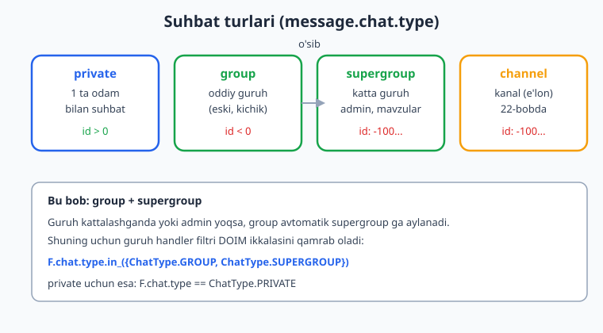
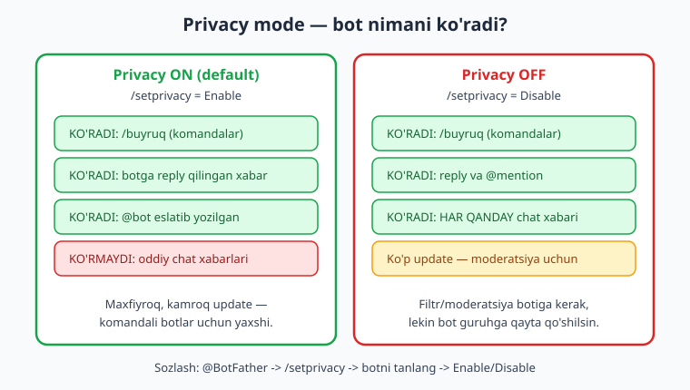
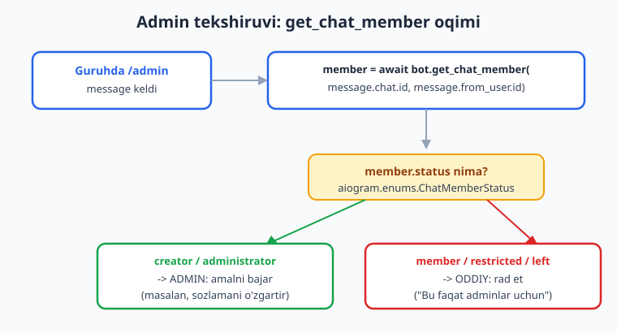

# 19 — Guruhlar bilan ishlash

[⬅️ Oldingi: 18 — Yakuniy kapston: to'liq bot](./18-kapston.md) · [🏠 README](./README.md) · [Keyingi: 20 — Guruh moderatsiyasi ➡️](./20-guruh-moderatsiya.md)

---

> **Bu bobda:** shu paytgacha botimiz asosan **shaxsiy** suhbatda (`private`) ishladi. Endi uni **guruhga** qo'shamiz. O'rganamiz: suhbat turlari — `group` va `supergroup` orasidagi farq va nega filtr doim ikkalasini qamrashi kerak; **privacy mode** (maxfiylik rejimi) — bot guruhda qaysi xabarlarni umuman ko'radi va uni `@BotFather` `/setprivacy` orqali sozlash; guruh ichida buyruqni `Command` + `ChatType` filtri bilan ushlash; `bot.get_chat_member(chat_id, user_id)` orqali a'zo/admin ekanini `ChatMemberStatus` bo'yicha tekshirish; bot guruhga qo'shilganda/chiqarilganda `@router.my_chat_member` bilan reaksiya qilish va bot admin huquqlarini o'qish; va guruh ichida aynan kim yozganini aniqlash (`from_user` vs `chat`). Moderatsiyaning o'zi (ban, mute) keyingi 20-bobda.
>
> **Halol eslatma:** bu bobdagi handler routing (`ChatType` filtri), `my_chat_member` o'tishlari va a'zolik tekshiruvi mantig'i haqiqatan **offline, tokensiz** ishga tushirib tasdiqlandi — `feed_update` ga mock `Update` uzatib va `bot.get_chat_member` ni `AsyncMock` bilan almashtirib. Natijalar matnda ko'rsatilgan. Jonli qism — botni real guruhga qo'shish, real a'zo statusini Telegram serveridan olish, real `my_chat_member` event'lari — `@BotFather` tokeni va internet talab qiladi; bunday joylar "illustrativ" deb halol belgilangan. Kod 3.x uchun to'g'ri.

---

## 1. Guruh turlari: `group` vs `supergroup`

01-18 boblarda har bir `Message` ning `message.chat` maydoni bor edi, lekin biz asosan `private` suhbat bilan ishladik. Guruhda esa `message.chat.type` boshqa qiymat oladi. Telegram'da to'rt asosiy tur bor:

| `chat.type` | Nima | `chat.id` |
|---|---|---|
| `private` | Bir foydalanuvchi bilan shaxsiy suhbat | musbat (`> 0`) |
| `group` | Oddiy (eski, kichik) guruh | manfiy (`< 0`) |
| `supergroup` | Katta guruh — admin huquqlari, mavzular, ko'p a'zo | manfiy, odatda `-100...` bilan boshlanadi |
| `channel` | Kanal (bir tomonlama e'lon) — 22-bobda | manfiy, `-100...` |



**Eng muhim amaliy nuqta:** `group` va `supergroup` — bu, mohiyatan, bir narsaning ikki bosqichi. Guruh kattalashganda yoki unda admin yoqilganda, Telegram uni **avtomatik** `group` dan `supergroup` ga aylantiradi (va `chat.id` ham o'zgaradi). Demak siz "guruh" deganda doim **ikkalasini** nazarda tutishingiz kerak. Faqat bittasini filtrlasangiz, bot ba'zi guruhlarda jim qoladi.

Shuning uchun butun bu bobda guruh handlerlari uchun shu filtrni ishlatamiz:

```python
from aiogram import F
from aiogram.enums import ChatType

# guruh (har ikkala tur):
F.chat.type.in_({ChatType.GROUP, ChatType.SUPERGROUP})

# shaxsiy:
F.chat.type == ChatType.PRIVATE
```

`ChatType` — bu `aiogram.enums` dagi enum; uning qiymatlari aynan `sender`, `private`, `group`, `supergroup`, `channel`. `F.chat.type` esa magic-filtr (04-bobdan tanish) — kelgan `Message` ning `chat.type` maydonini tekshiradi.

> `F.chat.type.in_({...})` da `F.chat.type` magic-filtr qiymatini `ChatType` enum bilan solishtiradi. aiogram bu yerda enum qiymatini (`"group"`, `"supergroup"`) to'g'ri taqqoslaydi — biz buni quyida `feed_update` bilan tasdiqladik.

---

## 2. Privacy mode (maxfiylik rejimi) — bot nimani ko'radi

Bu — guruh botlarining **eng ko'p chalkashtiradigan** mavzusi. Botingizni guruhga qo'shasiz, oddiy xabar yozasiz — lekin botga **hech qanday update kelmaydi**. Xato emas — bu **privacy mode** ishlayapti.

Telegram, maxfiylik uchun, guruhdagi botlarga **standart holda** hamma xabarni ko'rsatmaydi. Bu xavfsizlik chorasi: aks holda har bir guruh boti hamma odamning har bir xabarini o'qiy olardi.



**Privacy ON (standart)** holatda bot faqat quyidagilarni ko'radi:

- `/buyruq` ko'rinishidagi xabarlar (komandalar) — masalan `/start`, `/help`, `/admin@mening_botim`;
- botning xabariga **reply** qilingan xabarlar;
- bot **@eslatilgan** (mention) xabarlar.

Oddiy gap-so'zlarni esa **ko'rmaydi** — ularga update kelmaydi.

**Privacy OFF** holatida bot guruhdagi **hamma** xabarni ko'radi. Bu moderatsiya/filtr boti uchun zarur (masalan, so'kinishni o'chiradigan bot har bir xabarni ko'rishi kerak).

### Privacy mode'ni sozlash

Bu sozlama **kodda emas**, `@BotFather` da o'rnatiladi:

```text
@BotFather ga yozing:
  /setprivacy
  -> botingizni tanlang
  -> Enable  (privacy ON — faqat komanda/reply/mention)
     yoki
  -> Disable (privacy OFF — hamma xabar)
```

> **Ikkita muhim ogohlantirish.**
>
> 1. Privacy'ni o'zgartirgandan keyin, bot guruhga **qayta qo'shilishi** kerak (yoki avval chiqarib, keyin qo'shing). Aks holda eski sozlama amalda qolaveradi.
> 2. Bot guruhda **admin** qilib tayinlansa, u **privacy'dan qat'i nazar hamma xabarni ko'radi**. Shuning uchun moderatsiya botlari ko'pincha admin qilinadi — bu privacy OFF ga muqobil yo'l.

Qaysi rejimni tanlash:

- **Komandali bot** (faqat `/buyruq` ga javob beradi) → privacy **ON** qoldiring. Kamroq update, maxfiyroq, tezroq.
- **Filtr/moderatsiya boti** (har xabarni tekshiradi) → privacy **OFF** yoki botni admin qiling.

---

## 3. Guruh ichida buyruq: `Command` + `ChatType` filtri

Bir buyruq (`/info`) shaxsiy suhbatda boshqacha, guruhda boshqacha ishlasin desangiz, ikkita handler yozasiz va ularni `ChatType` filtri bilan ajratasiz. aiogram handlerlarni **yuqoridan pastga** sinab ko'radi (03-bobdan: birinchi mos kelgani ishlaydi), shuning uchun filtrlar bir-birini istisno qilsa, faqat bittasi ishlaydi.

```python
from aiogram import Router, F
from aiogram.enums import ChatType
from aiogram.filters import Command
from aiogram.types import Message

router = Router()


@router.message(Command("info"), F.chat.type.in_({ChatType.GROUP, ChatType.SUPERGROUP}))
async def info_group(message: Message):
    # guruhdagi /info
    nom = message.chat.title or "guruh"
    # jonli botda: await message.answer(f"Bu guruh: {nom}")
    print(f"GROUP info chat={message.chat.id}")


@router.message(Command("info"), F.chat.type == ChatType.PRIVATE)
async def info_private(message: Message):
    # shaxsiy /info
    # jonli botda: await message.answer("Bu shaxsiy suhbat.")
    print(f"PRIVATE info chat={message.chat.id}")
```

Biz buni offline `feed_update` bilan ishga tushirdik: bitta `/info` ni `supergroup` chatdan, ikkinchisini `private` chatdan yubordik. **Haqiqiy** natija:

```text
GROUP info chat=-100123
PRIVATE info chat=7
```

Ko'rib turibsiz: bir xil buyruq, lekin `ChatType` filtri tufayli har biri o'z handler'iga yo'naldi.

> **Guruhda buyruq nomidagi `@bot` qo'shimchasi.** Guruhda bir nechta bot bo'lishi mumkin, shuning uchun foydalanuvchi `/info@mening_botim` deb yozadi. aiogram'ning `Command(...)` filtri buni **avtomatik** hal qiladi — `/info` ham, `/info@mening_botim` ham bir xil ushlanadi (bot o'zining username'iga mos kelishini tekshiradi). Siz qo'shimcha hech narsa qilmaysiz. Buyruqlar haqida [04-bob](./04-filtrlar-buyruqlar.md) ga qarang.

---

## 4. A'zo va admin tekshiruvi: `bot.get_chat_member`

Guruh botida tez-tez kerak bo'ladigan savol: "Bu buyruqni yozayotgan odam **admin**mi?" yoki "U umuman shu guruh **a'zosi**mi?". Buni Telegram serveridan so'raymiz:

```python
member = await bot.get_chat_member(chat_id, user_id)
```

Bu `ChatMember` obyektini qaytaradi; uning eng muhim maydoni — `member.status`. `status` qiymatlari `aiogram.enums.ChatMemberStatus` enumida (biz uning qiymatlarini muhitda tekshirdik):

| `ChatMemberStatus` | Ma'nosi | A'zomi? |
|---|---|---|
| `CREATOR` (`creator`) | Guruh egasi | Ha |
| `ADMINISTRATOR` (`administrator`) | Admin | Ha |
| `MEMBER` (`member`) | Oddiy a'zo | Ha |
| `RESTRICTED` (`restricted`) | Cheklangan (mute h.k.) | `is_member` ga bog'liq |
| `LEFT` (`left`) | Chiqib ketgan / hech qachon qo'shilmagan | Yo'q |
| `KICKED` (`kicked`) | Ban qilingan | Yo'q |



### Admin tekshiruvi

"Admin" — bu `status` aniqlik bilan `creator` yoki `administrator` bo'lgan holat:

```python
from aiogram import Bot
from aiogram.enums import ChatMemberStatus

ADMIN_STATUSES = {ChatMemberStatus.CREATOR, ChatMemberStatus.ADMINISTRATOR}


async def is_admin(bot: Bot, chat_id: int, user_id: int) -> bool:
    member = await bot.get_chat_member(chat_id, user_id)
    return member.status in ADMIN_STATUSES
```

Buni handler ichida ishlatamiz:

```python
@router.message(Command("admin"), F.chat.type.in_({ChatType.GROUP, ChatType.SUPERGROUP}))
async def admin_only(message: Message, bot: Bot):
    if not await is_admin(bot, message.chat.id, message.from_user.id):
        # jonli botda: await message.answer("Bu buyruq faqat adminlar uchun.")
        print(f"DENY user={message.from_user.id}")
        return
    # jonli botda: await message.answer("Salom, admin!")
    print(f"ALLOW user={message.from_user.id}")
```

`bot` argumenti — bu aiogram middleware (09-bob) avtomatik in'ektsiya qilgan `Bot` obyekti; handler argumenti sifatida shunchaki `bot: Bot` deb so'rasangiz, kelaveradi.

**Offline tasdiqlash.** Jonli `get_chat_member` token + internet talab qiladi, shuning uchun uni `unittest.mock.AsyncMock` bilan almashtirib, status'ni o'zimiz qaytardik. Birinchi `/admin` da `bot.get_chat_member` administrator qaytardi, ikkinchisida oddiy member:

```python
from unittest.mock import AsyncMock
from aiogram.types import ChatMemberAdministrator, ChatMemberMember

# admin javobini soxtalashtiramiz:
bot.get_chat_member = AsyncMock(return_value=ChatMemberAdministrator(
    status=ChatMemberStatus.ADMINISTRATOR,
    user=User(id=7, is_bot=False, first_name="U"),
    can_be_edited=False, is_anonymous=False, can_manage_chat=True,
    can_delete_messages=True, can_manage_video_chats=True,
    can_restrict_members=True, can_promote_members=False,
    can_change_info=True, can_invite_users=True, can_post_stories=False,
    can_edit_stories=False, can_delete_stories=False))
```

`feed_update` natijasi (`ALLOW` admin uchun, `DENY` oddiy a'zo uchun):

```text
ALLOW user=7
DENY user=8
```

> **Bu naqsh nega muhim.** Real Telegram'ga ulanmasdan ham admin-mantiqni to'liq tekshira oldik — chunki `get_chat_member` ni mock qilib, "agar server administrator desa, nima bo'ladi?" degan tarmoqni sinab ko'rdik. Bu — guruh botini test qilishning asosiy usuli (testlash haqida [16-bob](./16-testlash-xatolar.md)).

### "A'zomi?" — to'liqroq tekshiruv (restricted holati)

Ba'zan "admin emas, lekin guruh **ichida**mi?" degan savol kerak. Bu yerda `restricted` (cheklangan) holatga e'tibor bering: cheklangan odam guruh ichida ham bo'lishi (`is_member=True`), chiqib ham ketgan bo'lishi mumkin. Shuning uchun:

```python
JOINED = {ChatMemberStatus.CREATOR, ChatMemberStatus.ADMINISTRATOR, ChatMemberStatus.MEMBER}


def is_member(member) -> bool:
    if member.status in JOINED:
        return True
    if member.status == ChatMemberStatus.RESTRICTED:
        return member.is_member   # cheklangan, lekin hali ichida bo'lishi mumkin
    return False                  # left / kicked
```

Buni uch xil status bilan offline tekshirdik (restricted+is_member, left, member). **Haqiqiy** natija:

```text
user=1 status=restricted member=True
user=2 status=left member=False
user=3 status=member member=True
```

> **Diqqat — soxta `is_member`.** `ChatMemberStatus.RESTRICTED` da `member.status` ning o'zi `restricted` bo'ladi, lekin odam haqiqatan guruhda yoki yo'qligini faqat `member.is_member` aytadi. Buni e'tiborsiz qoldirib `restricted` ni "a'zo emas" deb hisoblasangiz, mute qilingan, lekin guruhdagi odamni adashtirasiz.

---

## 5. Bot guruhga qo'shilganda: `@router.my_chat_member`

Bot guruhga qo'shilsa, undan chiqarilsa yoki admin qilinsa, Telegram bizga maxsus update yuboradi: **`my_chat_member`**. "My" — chunki bu aynan **bizning botimizning** a'zolik holati o'zgargani haqida. (Boshqa odamlarning a'zoligi o'zgarsa — bu `chat_member`, uni 20-bobda ko'ramiz.)

Bu update `ChatMemberUpdated` obyekti bo'ladi; uning ikki muhim maydoni: `old_chat_member` (oldingi holat) va `new_chat_member` (yangi holat). aiogram bu o'tishlarni qulay tekshirish uchun `ChatMemberUpdatedFilter` ni beradi:

```python
from aiogram.filters import ChatMemberUpdatedFilter, JOIN_TRANSITION, LEAVE_TRANSITION
from aiogram.types import ChatMemberUpdated


@router.my_chat_member(ChatMemberUpdatedFilter(member_status_changed=JOIN_TRANSITION))
async def bot_added(event: ChatMemberUpdated):
    # bot guruhga qo'shildi
    # event.chat — qaysi guruh; event.from_user — kim qo'shdi
    # jonli botda: await event.answer("Salom! Meni qo'shganingiz uchun rahmat.")
    print(f"BOT_ADDED chat={event.chat.id} by={event.from_user.id}")


@router.my_chat_member(ChatMemberUpdatedFilter(member_status_changed=LEAVE_TRANSITION))
async def bot_removed(event: ChatMemberUpdated):
    # bot guruhdan chiqarildi yoki ban qilindi
    print(f"BOT_REMOVED chat={event.chat.id}")
```

`JOIN_TRANSITION` / `LEAVE_TRANSITION` — bu `aiogram.filters` dagi tayyor "marker"lar. `member_status_changed=JOIN_TRANSITION` degani: "old holat — guruhda emas, new holat — guruhda" (ya'ni qo'shildi). aiogram bu o'tishni `old_chat_member`/`new_chat_member` status'laridan o'zi hisoblaydi.

**Offline tasdiqlash.** Bot uchun `ChatMemberUpdated` ni qo'lda yasab (`old` = `ChatMemberLeft`, `new` = `ChatMemberMember`), `feed_update` ga `my_chat_member` sifatida uzatdik. Keyin teskarisi (member → left). **Haqiqiy** natija:

```text
BOT_ADDED chat=-100123 by=7
BOT_REMOVED chat=-100123
```

> **Halol eslatma.** Jonli botda bu event Telegram serveridan keladi (odam botni guruhga qo'shganda). Offline'da biz event'ni o'zimiz qurib, **routing va filtr mantig'ini** tekshirdik — bu, jonli ulanmasdan, "qo'shilish event'i kelsa qaysi handler ishlaydi?" degan savolga to'liq javob beradi.

### Bot admin qilinganda — qaysi huquqlar berildi?

Bot guruhda admin qilinganda, bizga huquqlar qaysi ekanini bilish kerak bo'lishi mumkin (masalan, moderatsiya boti "xabar o'chirish huquqi yo'q" deb ogohlantirsin). Buni `PROMOTED_TRANSITION` bilan ushlaymiz va `new_chat_member` dagi `can_*` maydonlarini o'qiymiz:

```python
from aiogram.filters import ChatMemberUpdatedFilter, PROMOTED_TRANSITION


@router.my_chat_member(ChatMemberUpdatedFilter(member_status_changed=PROMOTED_TRANSITION))
async def bot_promoted(event: ChatMemberUpdated):
    new = event.new_chat_member   # ChatMemberAdministrator
    can_delete = getattr(new, "can_delete_messages", False)
    can_restrict = getattr(new, "can_restrict_members", False)
    print(f"PROMOTED delete={can_delete} restrict={can_restrict}")
    # jonli botda: bu huquqlarga qarab foydalanuvchini ogohlantirasiz
```

Buni admin huquqli `ChatMemberAdministrator` bilan offline tekshirdik (`can_delete_messages=True`, `can_restrict_members=False`). **Haqiqiy** natija:

```text
PROMOTED delete=True restrict=False
```

`getattr(new, "...", False)` ishlatamiz — chunki `new_chat_member` ba'zan admin bo'lmasligi mumkin, va xavfsiz default beramiz. Bu huquqlar moderatsiya uchun 20-bobda kerak bo'ladi.

> **`get_chat_member` signature (muhitda tekshirildi):** `bot.get_chat_member(chat_id, user_id, request_timeout=None)`. Ya'ni `chat_id` va `user_id` **pozitsion** argumentlar. Xayoliy parametr qo'shmang.

---

## 6. Guruhda kim yozdi? `from_user` vs `chat`

Shaxsiy suhbatda `message.from_user` va `message.chat` deyarli bir xil odamni bildiradi. **Guruhda esa ular butunlay boshqa:**

| Maydon | Guruhda nima |
|---|---|
| `message.chat` | **Guruhning o'zi** — `chat.id` (manfiy), `chat.title` (guruh nomi), `chat.type` |
| `message.from_user` | **Xabarni yozgan aniq odam** — `from_user.id`, `from_user.first_name`, `from_user.username` |

Demak guruhda "kim yozdi?" — bu **doim** `message.from_user`, "qayerda yozdi?" — `message.chat`. Bu farqni adashtirsangiz, `chat.id` ni `user_id` o'rniga ishlatib `get_chat_member` ni noto'g'ri chaqirasiz.

```python
@router.message(Command("kim"), F.chat.type.in_({ChatType.GROUP, ChatType.SUPERGROUP}))
async def kim(message: Message):
    user = message.from_user           # yozgan odam
    chat = message.chat                # guruh
    matn = (
        f"Siz: {user.full_name} (id={user.id})\n"
        f"Guruh: {chat.title} (id={chat.id})"
    )
    # jonli botda: await message.answer(matn)
    print(matn)
```

> **Anonim adminlar va kanal nomidan yozish.** Ba'zan guruhda admin "anonim" rejimda yozadi yoki xabar kanal nomidan yuboriladi — bunda `message.from_user` bo'sh (`None`) bo'lishi mumkin va `message.sender_chat` to'ladi. Real botda `from_user` ni ishlatishdan oldin `if message.from_user is None:` ni tekshirib qo'ying, aks holda `AttributeError` olasiz. Bu chekka holat, lekin guruh botida uchraydi.

---

## 7. Guruh sozlamalari va bot admin huquqlari

Bot guruhda **ko'p amallarni faqat admin bo'lgandagina** bajara oladi: xabar o'chirish, odamni mute/ban qilish, sarlavhani o'zgartirish va h.k. Botni admin qilish — bu inson tomonidan, guruh sozlamalarida (Telegram ilovasida) qilinadi; kod orqali o'zingizni admin qila olmaysiz.

Botning **o'z** huquqlarini bilish uchun `get_chat_member` ni botning o'z id'si bilan chaqirasiz:

```python
me = await bot.get_me()                                  # botning User obyekti
my_status = await bot.get_chat_member(chat_id, me.id)    # botning a'zoligi

if my_status.status != ChatMemberStatus.ADMINISTRATOR:
    # jonli botda: await bot.send_message(chat_id, "Iltimos, meni admin qiling.")
    print("Bot admin emas — moderatsiya ishlamaydi")
elif not my_status.can_delete_messages:
    print("Bot admin, lekin xabar o'chira olmaydi")
```

Bu naqsh — moderatsiya boti uchun zarur "sog'liq tekshiruvi": amal qilishdan oldin bot o'z huquqlari yetarli ekanini bilib oladi, aks holda xato (`TelegramBadRequest`) o'rniga foydalanuvchiga tushunarli ogohlantirish beradi.

> **Jonli amallar — illustrativ.** `ban_chat_member`, `restrict_chat_member`, `set_chat_title` kabi haqiqiy guruh amallari bot **admin** bo'lishini va Telegram serveriga ulanishni talab qiladi. Shuning uchun bu bobda biz ularning **mantig'ini** (kimni, qachon, qaysi huquq bilan) ko'rsatamiz, jonli chaqiruvni esa keyingi [20-bob — Guruh moderatsiyasi](./20-guruh-moderatsiya.md) da to'liq, real huquqlar bilan ko'ramiz. U yerda `ban_chat_member`, `restrict_chat_member` (`ChatPermissions` bilan), `chat_member` event'lari batafsil.

---

## 8. To'liq guruh boti: yig'ib ko'ramiz

Quyida bu bobdagi hamma g'oyani bitta ishlaydigan faylda jamlaymiz. Bu — guruhga qo'shsa bo'ladigan, oddiy "yordamchi" bot skeleti.

```python
import asyncio
import logging
import os
from unittest.mock import AsyncMock  # faqat offline test uchun

from aiogram import Bot, Dispatcher, Router, F
from aiogram.enums import ChatMemberStatus, ChatType
from aiogram.filters import (
    Command, ChatMemberUpdatedFilter, JOIN_TRANSITION, LEAVE_TRANSITION,
)
from aiogram.types import Message, ChatMemberUpdated

logging.basicConfig(level=logging.INFO)
router = Router()

ADMIN_STATUSES = {ChatMemberStatus.CREATOR, ChatMemberStatus.ADMINISTRATOR}
GROUP_TYPES = {ChatType.GROUP, ChatType.SUPERGROUP}


async def is_admin(bot: Bot, chat_id: int, user_id: int) -> bool:
    member = await bot.get_chat_member(chat_id, user_id)
    return member.status in ADMIN_STATUSES


@router.my_chat_member(ChatMemberUpdatedFilter(member_status_changed=JOIN_TRANSITION))
async def on_added(event: ChatMemberUpdated):
    # jonli: await event.answer("Salom! /help bilan boshlang.")
    logging.info("Bot %s guruhga qo'shildi", event.chat.id)


@router.my_chat_member(ChatMemberUpdatedFilter(member_status_changed=LEAVE_TRANSITION))
async def on_removed(event: ChatMemberUpdated):
    logging.info("Bot %s guruhdan chiqarildi", event.chat.id)


@router.message(Command("kim"), F.chat.type.in_(GROUP_TYPES))
async def who(message: Message):
    u = message.from_user
    # jonli: await message.answer(f"{u.full_name}, bu {message.chat.title}")
    logging.info("kim: user=%s chat=%s", u.id, message.chat.id)


@router.message(Command("sozla"), F.chat.type.in_(GROUP_TYPES))
async def settings(message: Message, bot: Bot):
    if not await is_admin(bot, message.chat.id, message.from_user.id):
        # jonli: await message.answer("Faqat adminlar sozlay oladi.")
        logging.info("sozla: rad, user=%s", message.from_user.id)
        return
    # jonli: await message.answer("Sozlamalar paneli...")
    logging.info("sozla: ruxsat, admin=%s", message.from_user.id)


async def main():
    token = os.getenv("BOT_TOKEN", "123456:AAH-FakeTest_abc")  # jonlida real token
    bot = Bot(token=token)
    dp = Dispatcher()
    dp.include_router(router)
    # jonlida: await dp.start_polling(bot)   # token + internet kerak (illustrativ)
    await bot.session.close()


if __name__ == "__main__":
    asyncio.run(main())
```

> **Jonli ishga tushirish.** Yuqoridagi `dp.start_polling(bot)` chaqiruvi botni Telegram'ga ulaydi va guruh update'larini oqim qilib oladi — bu uchun `.env` da real `BOT_TOKEN`, internet va botni guruhga qo'shish kerak (shuningdek 3-bo'limdagi privacy/admin sozlamasi). Polling vs webhook tafsilotlari [13-bob](./13-webhook-deploy.md) da. Mantiq esa, yuqorida ko'rganimizdek, offline to'liq tekshirilgan.

---

## Mashqlar

### Oson

1. `group` va `supergroup` orasidagi farqni va guruh handler filtri nega doim ikkalasini qamrashi kerakligini bir-ikki jumla bilan tushuntiring. Filtr satrini yozing.
2. Privacy mode ON holatida bot guruhda qaysi **uch** xil xabarni ko'radi? Oddiy gap-so'zlarni ko'rmasligini qanday "tuzatish" mumkin (ikkita yo'l)?
3. Privacy mode'ni qaysi joyda (kod yoki BotFather?) va qaysi buyruq bilan o'zgartirasiz? O'zgartirgandan keyin yana nima qilish shart?
4. `bot.get_chat_member(...)` qanday ikki pozitsion argument oladi (tartibi bilan) va u nima qaytaradi? Qaysi maydonni admin tekshiruvi uchun o'qiysiz?
5. `ChatMemberStatus` ning qaysi qiymatlari "admin" deb hisoblanadi? Qaysilari "guruhda" (a'zo) deb hisoblanadi?
6. Guruhdagi `message` da: "kim yozdi?" va "qaysi guruhda yozildi?" savollariga qaysi maydonlar javob beradi?

### O'rta

7. `/info` buyrug'ini guruh va shaxsiy suhbat uchun ikki alohida handler bilan yozing (`ChatType` filtri bilan ajrating). Guruhda chat sarlavhasini, shaxsiyda "Bu shaxsiy suhbat" matnini chiqarsin. Offline `feed_update` bilan ikkala yo'lni tekshiring.
8. `is_admin(bot, chat_id, user_id)` funksiyasini yozing va uni `/ban` handler'ida ishlating (faqat admin bo'lsa davom etsin, aks holda `return`). `bot.get_chat_member` ni `AsyncMock` bilan administrator va member holatlari uchun ikki marta tekshiring.
9. `is_member(member)` funksiyasini yozing: `creator/administrator/member` → `True`; `restricted` → `member.is_member`; `left/kicked` → `False`. Uchta status bilan offline tekshiring.
10. `@router.my_chat_member` bilan ikki handler yozing: bot qo'shilganda (`JOIN_TRANSITION`) va chiqarilganda (`LEAVE_TRANSITION`) `logging` ga yozsin. `ChatMemberUpdated` ni o'zingiz yasab `feed_update` bilan ikkala o'tishni sinab ko'ring.
11. Guruhdagi `/kim` buyrug'ini yozing: `message.from_user.full_name` va `message.chat.title` ni chiqarsin. `from_user` `None` bo'lishi mumkin bo'lgan holatni (anonim admin) ham xavfsiz qiling.
12. Bot o'zining huquqlarini tekshiradigan funksiya yozing: `bot.get_me()` + `bot.get_chat_member(chat_id, me.id)`; agar bot admin bo'lmasa yoki `can_delete_messages` bo'lmasa, mos ogohlantirish matnini qaytarsin (jonli yuborishni illustrativ belgilang).

### Qiyin

13. Bitta `Router` da uchta `/info` handler yozing: guruh, shaxsiy va kanal (`ChatType.CHANNEL`) uchun. Handler tartibi muhimligini ko'rsating: agar filtrlar bir-birini istisno qilsa, tartib ahamiyatsiz, ammo bir handler filtrsiz bo'lsa nima bo'ladi? Offline tekshirib, izohlang.
14. `PROMOTED_TRANSITION` bilan handler yozing: bot admin qilinganda `new_chat_member` dagi `can_delete_messages` va `can_restrict_members` huquqlarini o'qib chiqarsin. `ChatMemberAdministrator` ni turli huquqlar bilan ikki marta yasab, offline tekshiring.
15. "Sog'liq tekshiruvi" middleware (yoki dekorator) yozing: guruh moderatsiya buyrug'idan oldin botning o'zi admin va kerakli huquqqa egaligini tekshirsin; bo'lmasa handler'ni `return` bilan to'xtatib, ogohlantirish loglasin. `bot.get_chat_member` ni botning id'si uchun mock qilib, "bot admin emas" tarmog'ini offline tasdiqlang.
16. `feed_update` bilan to'liq stsenariy quring: (a) oddiy a'zo `/sozla` yozadi → rad; (b) admin `/sozla` yozadi → ruxsat; (c) bot guruhga qo'shiladi → `JOIN_TRANSITION` handler ishlaydi. Uchchala bosqichni bitta skriptda ketma-ket ishga tushirib, kutilgan natijani oldindan ayting va tasdiqlang.

<details markdown="1">
<summary>Yechimlar</summary>

**1.** Guruh kattalashganda yoki admin yoqilganda Telegram `group` ni avtomatik `supergroup` ga aylantiradi (`chat.id` ham o'zgaradi). Agar filtrda faqat bittasini ko'rsatsangiz, bot ba'zi guruhlarda jim qoladi. Shuning uchun: `F.chat.type.in_({ChatType.GROUP, ChatType.SUPERGROUP})`.

**2.** Privacy ON da bot ko'radi: (1) `/buyruq` ko'rinishidagi komandalar; (2) botning xabariga reply qilingan xabarlar; (3) bot @eslatilgan (mention) xabarlar. Oddiy xabarlarni ham ko'rishi uchun: privacy'ni OFF qilish (`@BotFather /setprivacy → Disable`) **yoki** botni guruhda admin qilish.

**3.** Kodda emas, **`@BotFather`** da: `/setprivacy` → botni tanlash → Enable/Disable. O'zgartirgandan keyin bot guruhga **qayta qo'shilishi** kerak (eski sozlama amalda qolmasligi uchun).

**4.** `bot.get_chat_member(chat_id, user_id)` — birinchi `chat_id`, keyin `user_id` (pozitsion). U `ChatMember` obyektini qaytaradi; admin uchun `member.status` ni o'qiymiz va `{CREATOR, ADMINISTRATOR}` to'plamida ekanini tekshiramiz.

**5.** Admin: `CREATOR`, `ADMINISTRATOR`. "Guruhda" (a'zo): `CREATOR`, `ADMINISTRATOR`, `MEMBER`, va `RESTRICTED` (faqat `is_member=True` bo'lsa). `LEFT` va `KICKED` — a'zo emas.

**6.** "Kim yozdi?" → `message.from_user` (aniq odam); "qaysi guruhda?" → `message.chat` (guruhning o'zi: `chat.id`, `chat.title`).

**7.**
```python
from aiogram import Router, F
from aiogram.enums import ChatType
from aiogram.filters import Command
from aiogram.types import Message

router = Router()

@router.message(Command("info"), F.chat.type.in_({ChatType.GROUP, ChatType.SUPERGROUP}))
async def info_group(message: Message):
    nom = message.chat.title or "guruh"
    print(f"GROUP: {nom} ({message.chat.id})")

@router.message(Command("info"), F.chat.type == ChatType.PRIVATE)
async def info_private(message: Message):
    print("PRIVATE: Bu shaxsiy suhbat.")
```
`feed_update` ga `supergroup` chatdan `/info` → birinchi handler; `private` chatdan `/info` → ikkinchi handler. Bir xil buyruq, `ChatType` filtri ularni ajratadi.

**8.**
```python
from aiogram import Bot
from aiogram.enums import ChatMemberStatus

ADMINS = {ChatMemberStatus.CREATOR, ChatMemberStatus.ADMINISTRATOR}

async def is_admin(bot: Bot, chat_id: int, user_id: int) -> bool:
    m = await bot.get_chat_member(chat_id, user_id)
    return m.status in ADMINS

@router.message(Command("ban"), F.chat.type.in_({ChatType.GROUP, ChatType.SUPERGROUP}))
async def ban(message: Message, bot: Bot):
    if not await is_admin(bot, message.chat.id, message.from_user.id):
        print("rad: admin emas")
        return
    print("ruxsat: ban mantig'i bu yerda (jonli amal 20-bobda)")
```
Test: `bot.get_chat_member = AsyncMock(return_value=ChatMemberAdministrator(...))` → ruxsat; `AsyncMock(return_value=ChatMemberMember(status=ChatMemberStatus.MEMBER, user=...))` → rad. (`ChatMemberAdministrator` qurganda `can_be_edited`, `is_anonymous`, `can_manage_chat`, `can_delete_messages`, `can_manage_video_chats`, `can_restrict_members`, `can_promote_members`, `can_change_info`, `can_invite_users`, `can_post_stories`, `can_edit_stories`, `can_delete_stories` maydonlarini bering — 3.28 da shular shart.)

**9.**
```python
from aiogram.enums import ChatMemberStatus

JOINED = {ChatMemberStatus.CREATOR, ChatMemberStatus.ADMINISTRATOR, ChatMemberStatus.MEMBER}

def is_member(member) -> bool:
    if member.status in JOINED:
        return True
    if member.status == ChatMemberStatus.RESTRICTED:
        return member.is_member
    return False
```
Tekshiruv natijasi (offline): `restricted+is_member=True` → `True`; `left` → `False`; `member` → `True`.

**10.**
```python
import logging
from aiogram.filters import ChatMemberUpdatedFilter, JOIN_TRANSITION, LEAVE_TRANSITION
from aiogram.types import ChatMemberUpdated

@router.my_chat_member(ChatMemberUpdatedFilter(member_status_changed=JOIN_TRANSITION))
async def added(event: ChatMemberUpdated):
    logging.info("qo'shildi: chat=%s", event.chat.id)

@router.my_chat_member(ChatMemberUpdatedFilter(member_status_changed=LEAVE_TRANSITION))
async def removed(event: ChatMemberUpdated):
    logging.info("chiqarildi: chat=%s", event.chat.id)
```
Test uchun `ChatMemberUpdated` ni qo'lda yasaysiz: qo'shilish — `old=ChatMemberLeft(...)`, `new=ChatMemberMember(...)`; chiqish — teskarisi. Keyin `dp.feed_update(bot, Update(update_id=N, my_chat_member=event))`.

**11.**
```python
@router.message(Command("kim"), F.chat.type.in_({ChatType.GROUP, ChatType.SUPERGROUP}))
async def kim(message: Message):
    u = message.from_user
    if u is None:                       # anonim admin / kanal nomidan
        print("Anonim yoki kanal nomidan yozilgan.")
        return
    print(f"{u.full_name} (id={u.id}) — guruh: {message.chat.title}")
```
`from_user is None` tekshiruvisiz anonim admin xabarida `AttributeError` olinadi.

**12.**
```python
async def bot_huquqi(bot: Bot, chat_id: int) -> str:
    me = await bot.get_me()
    st = await bot.get_chat_member(chat_id, me.id)
    if st.status != ChatMemberStatus.ADMINISTRATOR:
        return "Bot admin emas — meni admin qiling."
    if not getattr(st, "can_delete_messages", False):
        return "Bot admin, lekin xabar o'chira olmaydi."
    return "Bot tayyor."
```
Test: `bot.get_me = AsyncMock(return_value=User(id=999, is_bot=True, first_name="Bot"))` va `bot.get_chat_member = AsyncMock(return_value=ChatMemberMember(status=ChatMemberStatus.MEMBER, user=...))` → "Bot admin emas...". Jonli yuborish (`send_message`) illustrativ.

**13.**
```python
@router.message(Command("info"), F.chat.type.in_({ChatType.GROUP, ChatType.SUPERGROUP}))
async def g(message: Message): print("GROUP")

@router.message(Command("info"), F.chat.type == ChatType.PRIVATE)
async def p(message: Message): print("PRIVATE")

@router.message(Command("info"), F.chat.type == ChatType.CHANNEL)
async def c(message: Message): print("CHANNEL")
```
Filtrlar bir-birini istisno qilgani uchun (har chat aniq bitta turga ega) tartib ahamiyatsiz — har doim faqat bittasi mos keladi. **Ammo** agar filtrsiz, "barchani tutadigan" handler (`@router.message(Command("info"))`) ro'yxatda **birinchi** tursa, u hammasini ushlab oladi va `ChatType` li handlerlarga navbat yetmaydi (03-bob: birinchi mos kelgan g'olib). Shuning uchun umumiy handlerni doim **oxiriga** qo'ying yoki aniq filtr bering.

**14.**
```python
from aiogram.filters import ChatMemberUpdatedFilter, PROMOTED_TRANSITION

@router.my_chat_member(ChatMemberUpdatedFilter(member_status_changed=PROMOTED_TRANSITION))
async def promoted(event: ChatMemberUpdated):
    n = event.new_chat_member
    print(f"delete={getattr(n,'can_delete_messages',False)} "
          f"restrict={getattr(n,'can_restrict_members',False)}")
```
Test uchun `new_chat_member=ChatMemberAdministrator(...)` ni bir marta `can_delete_messages=True, can_restrict_members=False`, ikkinchi marta ikkalasini `True` qilib bering. `old_chat_member` esa `ChatMemberMember(...)` bo'lsin (member → administrator = PROMOTED). Offline natija birinchi holatda `delete=True restrict=False`.

**15.**
```python
async def bot_admin_huquqli(bot: Bot, chat_id: int) -> bool:
    me = await bot.get_me()
    st = await bot.get_chat_member(chat_id, me.id)
    return (st.status == ChatMemberStatus.ADMINISTRATOR
            and getattr(st, "can_restrict_members", False))

@router.message(Command("mute"), F.chat.type.in_({ChatType.GROUP, ChatType.SUPERGROUP}))
async def mute(message: Message, bot: Bot):
    if not await bot_admin_huquqli(bot, message.chat.id):
        logging.warning("Bot mute uchun yetarli huquqqa ega emas")
        return
    # jonli: restrict_chat_member(...) — 20-bobda
    logging.info("mute mantig'i ishga tushdi")
```
Test: `bot.get_me` → bot `User`; `bot.get_chat_member` → `ChatMemberMember` (admin emas) → funksiya `False` qaytaradi, handler ogohlantirib `return` qiladi. Bu "bot admin emas" tarmog'i — offline tasdiqlanadi.

**16.** To'liq skript:
```python
import asyncio
from datetime import datetime
from unittest.mock import AsyncMock
from aiogram import Bot, Dispatcher, Router, F
from aiogram.enums import ChatMemberStatus, ChatType
from aiogram.filters import Command, ChatMemberUpdatedFilter, JOIN_TRANSITION
from aiogram.fsm.storage.memory import MemoryStorage
from aiogram.types import (Update, Message, Chat, User, ChatMemberUpdated,
                           ChatMemberMember, ChatMemberLeft, ChatMemberAdministrator)

log = []
router = Router()
ADMINS = {ChatMemberStatus.CREATOR, ChatMemberStatus.ADMINISTRATOR}

@router.message(Command("sozla"), F.chat.type.in_({ChatType.GROUP, ChatType.SUPERGROUP}))
async def sozla(message: Message, bot: Bot):
    m = await bot.get_chat_member(message.chat.id, message.from_user.id)
    if m.status not in ADMINS:
        log.append(f"RAD user={message.from_user.id}")
        return
    log.append(f"RUXSAT user={message.from_user.id}")

@router.my_chat_member(ChatMemberUpdatedFilter(member_status_changed=JOIN_TRANSITION))
async def added(event: ChatMemberUpdated):
    log.append(f"QO'SHILDI chat={event.chat.id}")

def gmsg(uid, mid):
    return Message(message_id=mid, date=datetime.now(),
                   chat=Chat(id=-100123, type="supergroup"),
                   from_user=User(id=uid, is_bot=False, first_name="U"), text="/sozla")

async def main():
    bot = Bot("123456:AAH-FakeTest_abc")
    dp = Dispatcher(storage=MemoryStorage())
    dp.include_router(router)

    # (a) oddiy a'zo -> rad
    bot.get_chat_member = AsyncMock(return_value=ChatMemberMember(
        status=ChatMemberStatus.MEMBER, user=User(id=8, is_bot=False, first_name="V")))
    await dp.feed_update(bot, Update(update_id=1, message=gmsg(8, 1)))

    # (b) admin -> ruxsat
    bot.get_chat_member = AsyncMock(return_value=ChatMemberAdministrator(
        status=ChatMemberStatus.ADMINISTRATOR, user=User(id=7, is_bot=False, first_name="A"),
        can_be_edited=False, is_anonymous=False, can_manage_chat=True,
        can_delete_messages=True, can_manage_video_chats=True, can_restrict_members=True,
        can_promote_members=False, can_change_info=True, can_invite_users=True,
        can_post_stories=False, can_edit_stories=False, can_delete_stories=False))
    await dp.feed_update(bot, Update(update_id=2, message=gmsg(7, 2)))

    # (c) bot qo'shildi
    bot_user = User(id=999, is_bot=True, first_name="Bot")
    ev = ChatMemberUpdated(chat=Chat(id=-100123, type="supergroup"),
        from_user=User(id=7, is_bot=False, first_name="A"), date=datetime.now(),
        old_chat_member=ChatMemberLeft(status=ChatMemberStatus.LEFT, user=bot_user),
        new_chat_member=ChatMemberMember(status=ChatMemberStatus.MEMBER, user=bot_user))
    await dp.feed_update(bot, Update(update_id=3, my_chat_member=ev))

    await bot.session.close()
    print(log)

asyncio.run(main())
```
Kutilgan natija: `["RAD user=8", "RUXSAT user=7", "QO'SHILDI chat=-100123"]` — oddiy a'zo rad etiladi, admin ruxsat oladi, bot qo'shilganda `JOIN_TRANSITION` handler ishlaydi.

</details>

---

[⬅️ Oldingi: 18 — Yakuniy kapston: to'liq bot](./18-kapston.md) · [🏠 README](./README.md) · [Keyingi: 20 — Guruh moderatsiyasi ➡️](./20-guruh-moderatsiya.md)
