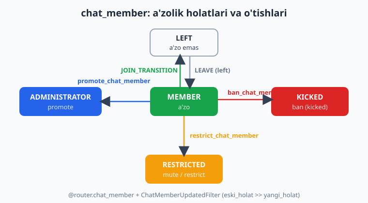
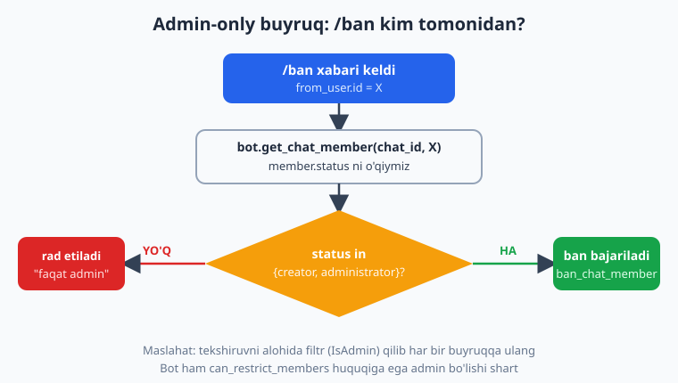
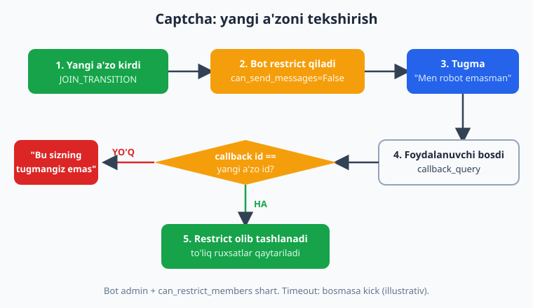

# 20 — Guruh moderatsiyasi

[⬅️ Oldingi: 19 — Guruhlarda ishlash](./19-guruhlar.md) · [🏠 README](./README.md) · [Keyingi: 21 — Kanallar bilan ishlash ➡️](./21-kanallar.md)

---

> **Bu bobda:** Botimizni guruh **moderatori** qilamiz. Yangi a'zoni `@router.chat_member` + `ChatMemberUpdatedFilter(JOIN_TRANSITION)` orqali **kutib olamiz** (welcome xabar), chiqib ketganni ham ushlaymiz. So'ng asosiy moderatsiya amallarini o'rganamiz: **ban/kick** (`bot.ban_chat_member` / `bot.unban_chat_member`), **mute/restrict** (`bot.restrict_chat_member` + `ChatPermissions`), va **admin tayinlash** (`bot.promote_chat_member`). Buyruqlarni **faqat adminlar** ishlatishi uchun `get_chat_member`'ning `status`'iga tayangan filtr yozamiz. Oddiy **anti-spam/flood** ni ./09-middleware.md dagi throttling middleware bilan bog'laymiz. Oxirida — **captcha**: yangi a'zoni darrov `restrict` qilib jim qilamiz, u "Men robot emasman" tugmasini bossagina to'liq ruxsat qaytaramiz.
>
> **Halol eslatma (verifikatsiya):** handler routing (`chat_member` JOIN/LEAVE, `/ban` va `/mute` buyruqlari, captcha `callback_query`), **admin-filtr mantiqi** (`get_chat_member` ni mock qilib admin/oddiy a'zo tarmoqlari), `ChatPermissions` quruvchilar (mute = hammasi False, ochish = hammasi True), va captcha holatining tozalanishi — bularning hammasi **offline** (tokensiz, mock session + `feed_update` + `get_chat_member` monkeypatch) ishga tushirib tekshirildi: `ban_chat_member` oddiy a'zoda **chaqirilmadi**, adminda **bir marta** chaqirildi; `restrict_chat_member` mute'da `ChatPermissions` bilan chaqirildi. Aksincha, real guruhda **jonli ban/restrict/promote** bot **admin** bo'lishini (va tegishli huquqlarni) hamda Telegram serverini talab qiladi — bu amallar **illustrativ** deb belgilangan: kod va mantiq to'g'ri, lekin "Telegram odamni haqiqatan banladi" degan natija bu yerda sinalmagan.

---

## Bu bobda nima quramiz

19-bobda guruh nima ekanini, `chat.type`, `@my_bot` privacy rejimi va guruhga xabar yuborishni ko'rib chiqdik. Endi botni guruhni **boshqaradigan** vositaga aylantiramiz. Yo'l xaritasi:

1. Yangi a'zoni kutib olish va chiqib ketishni ushlash (`chat_member` event).
2. Ban / kick (`ban_chat_member`, `unban_chat_member`).
3. Mute / restrict (`restrict_chat_member` + `ChatPermissions`).
4. Admin tayinlash (`promote_chat_member`).
5. Admin-only buyruq filtri (`get_chat_member` status).
6. Anti-spam / flood — throttling middleware bilan (./09-middleware.md).
7. Captcha — restrict + tugma orqali ochish.

> **Eng muhim shart (butun bob uchun):** moderatsiya amallarini bajarish uchun **botning o'zi guruhda admin** bo'lishi va tegishli huquqlarga (`can_restrict_members`, kerak bo'lsa `can_promote_members`) ega bo'lishi shart. Bot admin bo'lmasa Telegram `Bad Request: not enough rights` xatosini qaytaradi. Shuningdek, bot **adminni** (egasini) ham, **boshqa botni** ham, va guruh **egasini** (creator) banlay olmaydi.

> **`allowed_updates` haqida eslatma (./12 va ./13 dan):** `chat_member` event'i **standart holatda kelmaydi**. Uni olish uchun ikki narsa kerak: (1) bot guruhda **admin** bo'lsin, (2) polling/webhook'ni `allowed_updates` bilan ishga tushiring. aiogram'da eng oson — `dp.start_polling(bot, allowed_updates=dp.resolve_used_update_types())`: u kodingizdagi handlerlardan kerakli turlarni avtomatik aniqlaydi va `chat_member` ni ro'yxatga qo'shadi.

---

## 1. Yangi a'zoni kutib olish va chiqib ketish

Guruhga kim kirib-chiqsa, Telegram bizga `chat_member` yangilanishini yuboradi. Bu **`my_chat_member` dan farq qiladi** (./12-bobda ko'rganmiz): `my_chat_member` — **botning o'zi** holati o'zgarganda, `chat_member` — guruhdagi **boshqa odamlar** holati o'zgarganda. Yangi a'zoni kutib olish — aynan `chat_member`.

Event obyekti `ChatMemberUpdated` bo'lib, `old_chat_member` (eski holat) va `new_chat_member` (yangi holat) ni olib keladi. Qaysi o'tishni kuzatishni `ChatMemberUpdatedFilter(member_status_changed=...)` belgilaydi. Bizga kerak:

- **`JOIN_TRANSITION`** — a'zo emasdan a'zoga (`IS_NOT_MEMBER >> IS_MEMBER`), ya'ni **kirdi**.
- **`LEAVE_TRANSITION`** — a'zodan a'zo emasga (`IS_MEMBER >> IS_NOT_MEMBER`), ya'ni **chiqdi yoki banlandi**.



```python
from aiogram import Router, Bot
from aiogram.filters import (
    ChatMemberUpdatedFilter, JOIN_TRANSITION, LEAVE_TRANSITION,
)
from aiogram.types import ChatMemberUpdated

router = Router()


@router.chat_member(
    ChatMemberUpdatedFilter(member_status_changed=JOIN_TRANSITION)
)
async def on_member_join(event: ChatMemberUpdated, bot: Bot):
    user = event.new_chat_member.user
    await bot.send_message(
        event.chat.id,
        f"Xush kelibsiz, <b>{user.first_name}</b>! "
        f"Guruh qoidalari bilan tanishib chiqing.",
    )


@router.chat_member(
    ChatMemberUpdatedFilter(member_status_changed=LEAVE_TRANSITION)
)
async def on_member_leave(event: ChatMemberUpdated, bot: Bot):
    user = event.old_chat_member.user   # ketgan odamning eski holatidan
    await bot.send_message(
        event.chat.id,
        f"{user.first_name} guruhni tark etdi.",
    )
```

> **Diqqat — bir o'tishga bitta handler.** aiogram'da observer **birinchi mos** handler'da to'xtaydi. Agar siz `JOIN_TRANSITION` uchun **ikkita** `chat_member` handler yozsangiz (masalan, biri salomlashish, ikkinchisi captcha), **faqat birinchisi** ishlaydi, ikkinchisi o'lik qoladi. Shuning uchun keyinroq (7-bo'limda) captcha'ni alohida handler emas, balki **salomlashish bilan bitta** JOIN handler ichida qilamiz. Ban'ni oddiy chiqishdan ajratish bo'yicha (`IS_MEMBER >> KICKED` va tartib) chuqurroq tahlilni ./12-bobda ko'rgansiz.

> **Offline tekshirilgan:** `left -> member` (JOIN) o'tishli `Update` ni `feed_update` orqali uzatib, JOIN handler ishga tushgani va `new_chat_member.user` ni to'g'ri o'qigani tasdiqlandi.

---

## 2. Ban va kick — `ban_chat_member`

Telegram'da "kick" (guruhdan chiqarib yuborish) va "ban" (qaytib kira olmaslik) bitta metod bilan boshqariladi: `bot.ban_chat_member(chat_id, user_id)`. Foydalanuvchi guruhdan chiqariladi va **qora ro'yxatga** tushadi (qayta qo'sha olmaydi).

```python
from aiogram import Router, Bot
from aiogram.filters import Command
from aiogram.types import Message

router = Router()


@router.message(Command("ban"))
async def cmd_ban(message: Message, bot: Bot):
    # Banlamoqchi bo'lgan odamning xabariga REPLY qilingan bo'lishi kerak
    if not message.reply_to_message:
        await message.answer("Banlash uchun o'sha odamning xabariga reply qiling.")
        return
    target = message.reply_to_message.from_user
    await bot.ban_chat_member(
        chat_id=message.chat.id,
        user_id=target.id,
    )
    await message.answer(f"<b>{target.first_name}</b> banlandi.")
```

### "Kick" — chiqarib, lekin qaytishga ruxsat berish

Sof "kick" (chiqarib yuborish, lekin keyin qaytib kira olishi) uchun ban qilib, **darhol unban** qilamiz. `unban_chat_member` qora ro'yxatdan o'chiradi, lekin avtomatik qaytarmaydi — odam o'zi qayta kirishi mumkin bo'ladi:

```python
@router.message(Command("kick"))
async def cmd_kick(message: Message, bot: Bot):
    if not message.reply_to_message:
        await message.answer("Reply qiling.")
        return
    target = message.reply_to_message.from_user
    await bot.ban_chat_member(message.chat.id, target.id)
    # only_if_banned=True — agar allaqachon banlangan bo'lsagina ishlaydi
    await bot.unban_chat_member(message.chat.id, target.id, only_if_banned=True)
    await message.answer(f"{target.first_name} chiqarib yuborildi (qaytishi mumkin).")
```

### Vaqtinchalik ban (`until_date`)

`until_date` bersangiz, ban faqat shu vaqtgacha amal qiladi. Telegram qoidasi: **30 soniyadan kam yoki 366 kundan ko'p** muddat — **doimiy** ban deb hisoblanadi.

```python
from datetime import datetime, timedelta, timezone


@router.message(Command("tempban"))
async def cmd_tempban(message: Message, bot: Bot):
    target = message.reply_to_message.from_user
    until = datetime.now(timezone.utc) + timedelta(hours=24)
    await bot.ban_chat_member(message.chat.id, target.id, until_date=until)
    await message.answer(f"{target.first_name} 24 soatga banlandi.")
```

> **`revoke_messages`** parametri `True` bo'lsa, banlangan odamning **barcha** xabarlari o'chiriladi (faqat oxirgisi emas). Spamerga qarshi qulay: `bot.ban_chat_member(chat_id, user_id, revoke_messages=True)`.

> **Offline tekshirilgan:** `/ban` handler `reply_to_message` orqali nishonni topib, `ban_chat_member` ni **aynan bir marta** chaqirgani (mock funksiya bilan) tasdiqlandi. **Illustrativ:** real Telegram'da odamni banlash bot adminligini va `can_restrict_members` huquqini talab qiladi.

---

## 3. Mute / restrict — `restrict_chat_member` + `ChatPermissions`

Ban — keskin chora. Ko'pincha yetarli bo'ladi: odamni guruhda qoldirib, lekin **yozishdan to'xtatish** (mute). Buni `bot.restrict_chat_member(chat_id, user_id, permissions=ChatPermissions(...))` qiladi. `ChatPermissions` — bu odam **nima qila olishi**ni belgilovchi bayroqlar to'plami.

`ChatPermissions` ning asosiy maydonlari (hammasi `bool`, standart `None`):

| Maydon | Ruxsat |
|--------|--------|
| `can_send_messages` | Matn, kontakt, lokatsiya, venue yuborish |
| `can_send_audios` / `can_send_documents` / `can_send_photos` / `can_send_videos` / `can_send_video_notes` / `can_send_voice_notes` | Tegishli media turini yuborish |
| `can_send_polls` | So'rovnoma yuborish |
| `can_send_other_messages` | Stiker, GIF, o'yin, inline-bot |
| `can_add_web_page_previews` | Havola oldindan ko'rinishi |
| `can_change_info`, `can_invite_users`, `can_pin_messages`, `can_manage_topics` | Guruh sozlamalari |

### To'liq jim qilish (mute)

Hamma yuborish bayrog'ini `False` qilamiz. Qulay bo'lishi uchun yordamchi funksiyalar yozamiz:

```python
from aiogram.types import ChatPermissions


def muted_permissions() -> ChatPermissions:
    """Hech narsa yubora olmaydi (to'liq jim)."""
    return ChatPermissions(
        can_send_messages=False,
        can_send_audios=False,
        can_send_documents=False,
        can_send_photos=False,
        can_send_videos=False,
        can_send_video_notes=False,
        can_send_voice_notes=False,
        can_send_polls=False,
        can_send_other_messages=False,
        can_add_web_page_previews=False,
    )


def full_permissions() -> ChatPermissions:
    """Hamma narsani yubora oladi (mute'ni ochish)."""
    return ChatPermissions(
        can_send_messages=True,
        can_send_audios=True,
        can_send_documents=True,
        can_send_photos=True,
        can_send_videos=True,
        can_send_video_notes=True,
        can_send_voice_notes=True,
        can_send_polls=True,
        can_send_other_messages=True,
        can_add_web_page_previews=True,
    )
```

Endi `/mute` buyrug'i — odamni 1 soatga jim qiladi:

```python
from datetime import datetime, timedelta, timezone


@router.message(Command("mute"))
async def cmd_mute(message: Message, bot: Bot):
    if not message.reply_to_message:
        await message.answer("Reply qiling.")
        return
    target = message.reply_to_message.from_user
    until = datetime.now(timezone.utc) + timedelta(hours=1)
    await bot.restrict_chat_member(
        chat_id=message.chat.id,
        user_id=target.id,
        permissions=muted_permissions(),
        until_date=until,
    )
    await message.answer(f"<b>{target.first_name}</b> 1 soatga ovozsizlandi.")


@router.message(Command("unmute"))
async def cmd_unmute(message: Message, bot: Bot):
    target = message.reply_to_message.from_user
    await bot.restrict_chat_member(
        chat_id=message.chat.id,
        user_id=target.id,
        permissions=full_permissions(),
    )
    await message.answer(f"{target.first_name} ovozi qaytarildi.")
```

> **Muhim nuance:** `restrict_chat_member` foydalanuvchini `restricted` holatiga o'tkazadi. Mute'ni "ochish" — bu **yana `restrict_chat_member`** chaqirib, hamma bayroqni `True` qilish (yuqoridagi `unmute`). `until_date` o'tib ketsa Telegram avtomatik ochadi. Eslatma: Telegram odam ruxsatini **guruhning umumiy ruxsatlaridan oshira olmaydi** — agar guruhda hamma uchun media taqiqlangan bo'lsa, bitta odamga `True` bersangiz ham u media yubora olmaydi.

> **Faqat media taqiqlash misoli:** matn yozsin, lekin rasm/video yubormasin —
> ```python
> ChatPermissions(can_send_messages=True, can_send_photos=False,
>                 can_send_videos=False, can_send_other_messages=False)
> ```

> **Offline tekshirilgan:** `muted_permissions()` da barcha yuborish bayroqlari `False`, `full_permissions()` da `True` ekani `assert` bilan tasdiqlandi. `/mute` handler adminda `restrict_chat_member` ni **`ChatPermissions` obyekti bilan** chaqirgani (mock funksiyada `isinstance` tekshiruvi) ham tasdiqlandi. **Illustrativ:** jonli mute bot adminligini talab qiladi.

---

## 4. Admin tayinlash — `promote_chat_member`

Bot boshqa odamni guruh admini qilishi mumkin (faqat o'zi **`can_promote_members`** huquqiga ega admin bo'lsa). `promote_chat_member` ga har bir admin huquqini alohida `True/False` bilan berasiz:

```python
@router.message(Command("promote"))
async def cmd_promote(message: Message, bot: Bot):
    if not message.reply_to_message:
        await message.answer("Reply qiling.")
        return
    target = message.reply_to_message.from_user
    await bot.promote_chat_member(
        chat_id=message.chat.id,
        user_id=target.id,
        can_delete_messages=True,
        can_restrict_members=True,
        can_invite_users=True,
        can_pin_messages=True,
        # qolganlari (can_promote_members, can_change_info, ...) standart False
    )
    await message.answer(f"<b>{target.first_name}</b> moderator qilindi.")
```

### Adminlikni olib tashlash

Adminlikni qaytarib olish — barcha huquqni `False` qilib `promote_chat_member` chaqirish:

```python
@router.message(Command("demote"))
async def cmd_demote(message: Message, bot: Bot):
    target = message.reply_to_message.from_user
    await bot.promote_chat_member(
        chat_id=message.chat.id,
        user_id=target.id,
        can_manage_chat=False, can_delete_messages=False,
        can_manage_video_chats=False, can_restrict_members=False,
        can_promote_members=False, can_change_info=False,
        can_invite_users=False, can_pin_messages=False,
    )
    await message.answer(f"{target.first_name} adminlikdan tushirildi.")
```

> **Eslatma:** bot **faqat o'zi bergan** huquqni qaytarib ola oladi, va o'zidan **yuqori** turgan admin (egasi yoki bot promote qilmagan admin) ustidan ish qila olmaydi. Admin tarjimasiga maxsus belgi (`custom_title`) qo'yish uchun alohida `bot.set_chat_administrator_custom_title(...)` bor.

> **Illustrativ:** promote/demote real guruhda bot adminligini va `can_promote_members` huquqini talab qiladi. Bu yerda biz handler tuzilishi va parametrlarni ko'rsatamiz; jonli natija sinalmagan.

---

## 5. Admin-only buyruqlar — `get_chat_member` filtri

`/ban`, `/mute`, `/promote` — bularni **istalgan a'zo** ishlatib qo'ymasligi kerak. Foydalanuvchi admin ekanini `bot.get_chat_member(chat_id, user_id)` qaytargan `.status` orqali tekshiramiz. `aiogram.enums.ChatMemberStatus` qiymatlari: `creator`, `administrator`, `member`, `restricted`, `left`, `kicked`. **Admin** = status `creator` yoki `administrator`.



### Eng toza yo'l — qayta ishlatiladigan filtr

Har bir handler'da tekshiruvni takrorlamaslik uchun **maxsus filtr** yozamiz (./04-bobda filtr yozishni ko'rgansiz). Filtr `bool` qaytaradi: `True` bo'lsa handler ishlaydi, `False` bo'lsa o'tkazib yuboriladi.

```python
from aiogram.filters import BaseFilter
from aiogram.enums import ChatMemberStatus
from aiogram.types import Message
from aiogram import Bot


class IsAdmin(BaseFilter):
    async def __call__(self, message: Message, bot: Bot) -> bool:
        # Faqat guruhda ma'noli
        if message.chat.type not in ("group", "supergroup"):
            return False
        member = await bot.get_chat_member(message.chat.id, message.from_user.id)
        return member.status in (
            ChatMemberStatus.CREATOR,
            ChatMemberStatus.ADMINISTRATOR,
        )
```

Endi filtrni buyruqqa ulaymiz — admin bo'lmasa handler **umuman** ishga tushmaydi:

```python
@router.message(Command("ban"), IsAdmin())
async def cmd_ban_admin(message: Message, bot: Bot):
    if not message.reply_to_message:
        await message.answer("Reply qiling.")
        return
    target = message.reply_to_message.from_user
    await bot.ban_chat_member(message.chat.id, target.id)
    await message.answer(f"{target.first_name} banlandi.")
```

### Ichkarida tekshirish (xushmuomala javob bilan)

Filtr `False` qaytarsa handler **jim** o'tkazib yuboriladi — foydalanuvchi hech narsa ko'rmaydi. Agar "Bu buyruq faqat adminlar uchun" deb **javob berishni** istasangiz, tekshiruvni handler **ichida** qiling:

```python
async def is_admin(bot: Bot, chat_id: int, user_id: int) -> bool:
    member = await bot.get_chat_member(chat_id, user_id)
    return member.status in (
        ChatMemberStatus.CREATOR, ChatMemberStatus.ADMINISTRATOR,
    )


@router.message(Command("ban"))
async def cmd_ban_checked(message: Message, bot: Bot):
    if not await is_admin(bot, message.chat.id, message.from_user.id):
        await message.answer("Bu buyruq faqat adminlar uchun.")
        return
    if not message.reply_to_message:
        await message.answer("Reply qiling.")
        return
    target = message.reply_to_message.from_user
    await bot.ban_chat_member(message.chat.id, target.id)
    await message.answer(f"{target.first_name} banlandi.")
```

> **Maslahat:** har bir buyruqda `get_chat_member` chaqirish — qo'shimcha API so'rovi. Yuqori yuklamada admin ro'yxatini middleware'da (./09) bir marta `bot.get_chat_administrators(chat_id)` bilan olib, kesh qilish samaraliroq.

> **Offline tekshirilgan (admin-filtr mantiqi):** `get_chat_member` ni monkeypatch qildik — id 10 uchun `ChatMemberAdministrator`, boshqalarga `ChatMemberMember` qaytaradigan qilib. So'ng `feed_update` orqali ikki holat sinaldi: (a) **oddiy a'zo** `/ban` yuborganda `ban_chat_member` **chaqirilmadi** va "faqat adminlar" javobi yuborildi; (b) **admin** reply bilan `/ban` yuborganda `ban_chat_member` **aynan bir marta** chaqirildi. Demak admin-filtr tarmoqlanishi haqiqatan ishlaydi.

---

## 6. Anti-spam / flood — throttling middleware bilan

Flood (bir odam soniyada o'nlab xabar yuborishi) — guruhning eng ko'p muammosi. Buni har bir handler'da emas, **middleware**'da hal qilgan ma'qul: middleware har bir xabarni handler'gacha ushlab, kim juda tez yozayotganini aniqlaydi. Middleware'ni ./09-middleware.md da batafsil ko'rgansiz — bu yerda guruhga moslangan oddiy throttle keltiramiz.

G'oya: har bir `(chat_id, user_id)` uchun oxirgi xabar vaqtini saqlaymiz; agar belgilangan oraliqdan tez kelsa — xabarni `return` bilan **bloklab**, handler'ga o'tkazmaymiz (ixtiyoriy ravishda ogohlantiramiz yoki avtomatik mute qilamiz).

```python
import time
from aiogram import BaseMiddleware
from aiogram.types import Message


class AntiFloodMiddleware(BaseMiddleware):
    def __init__(self, rate_limit: float = 0.7):
        self.rate_limit = rate_limit          # soniya (eng kam oraliq)
        self._last: dict[tuple[int, int], float] = {}

    async def __call__(self, handler, event: Message, data: dict):
        if event.chat.type in ("group", "supergroup"):
            key = (event.chat.id, event.from_user.id)
            now = time.monotonic()
            last = self._last.get(key, 0.0)
            if now - last < self.rate_limit:
                self._last[key] = now
                # Juda tez yozdi -> handler'ga o'tkazmaymiz (xabarni "yutamiz")
                return None
            self._last[key] = now
        return await handler(event, data)
```

Ro'yxatga olish (./09 dagi kabi, `message` observer'iga):

```python
router.message.middleware(AntiFloodMiddleware(rate_limit=0.7))
```

Murakkabroq variant: ketma-ket N marta tez yozsa **avtomatik mute** qilish — yuqoridagi `_last` o'rniga hisoblagich (`counter`) yuritib, chegaradan oshganda 5-bo'limdagi `restrict_chat_member(... muted_permissions())` ni chaqiring. Aniqroq va xotira-tejamkor yechim uchun ./09 dagi Redis storage'li throttle pattern'iga qarang.

> **Halol eslatma:** throttle **mantig'i** (oraliqni hisoblash, bloklash) toza Python — uni alohida funksiya qilib pytest bilan offline sinash mumkin (oraliqdan tez kelsa `None`, kech kelsa handler chaqiriladi). Real guruhda flood'ni bostirish esa jonli bot + a'zolarni talab qiladi.

---

## 7. Captcha — yangi a'zoni tekshirish

Spam-botlar guruhga kirib darrov reklama tashlaydi. Yechim — **captcha**: yangi a'zo kirgan zahoti uni `restrict` qilib **jim** qilamiz, "Men robot emasman" tugmasi chiqaramiz; u tugmani bossagina **to'liq ruxsat** qaytaramiz. Tirik odam tugmani bosadi, bot esa odatda bosmaydi.



Diqqat: 1-bo'limdagi eslatma bo'yicha, `JOIN_TRANSITION` uchun **bitta** `chat_member` handler bo'lishi kerak — shuning uchun salomlashish **va** captcha'ni bitta handler ichida qilamiz. Tugma kimga tegishli ekanini bilish uchun `CallbackData` factory'ga (./07-bob) yangi a'zo `user_id` sini joylaymiz, va callback'da bosgan odam o'sha-yo'qligini tekshiramiz.

```python
from aiogram import Router, F, Bot
from aiogram.filters import ChatMemberUpdatedFilter, JOIN_TRANSITION
from aiogram.filters.callback_data import CallbackData
from aiogram.types import (
    ChatMemberUpdated, CallbackQuery,
    InlineKeyboardMarkup, InlineKeyboardButton, ChatPermissions,
)

router = Router()


class CaptchaCB(CallbackData, prefix="captcha"):
    user_id: int


def muted_permissions() -> ChatPermissions:
    return ChatPermissions(
        can_send_messages=False, can_send_audios=False, can_send_documents=False,
        can_send_photos=False, can_send_videos=False, can_send_video_notes=False,
        can_send_voice_notes=False, can_send_polls=False,
        can_send_other_messages=False, can_add_web_page_previews=False,
    )


def full_permissions() -> ChatPermissions:
    return ChatPermissions(
        can_send_messages=True, can_send_audios=True, can_send_documents=True,
        can_send_photos=True, can_send_videos=True, can_send_video_notes=True,
        can_send_voice_notes=True, can_send_polls=True,
        can_send_other_messages=True, can_add_web_page_previews=True,
    )


@router.chat_member(
    ChatMemberUpdatedFilter(member_status_changed=JOIN_TRANSITION)
)
async def on_join_captcha(event: ChatMemberUpdated, bot: Bot):
    user = event.new_chat_member.user
    # 1) Darrov jim qilamiz (yozolmaydi)
    await bot.restrict_chat_member(
        chat_id=event.chat.id,
        user_id=user.id,
        permissions=muted_permissions(),
    )
    # 2) Faqat shu odamga atalgan tugma
    kb = InlineKeyboardMarkup(inline_keyboard=[[
        InlineKeyboardButton(
            text="Men robot emasman",
            callback_data=CaptchaCB(user_id=user.id).pack(),
        )
    ]])
    await bot.send_message(
        event.chat.id,
        f"Salom, <b>{user.first_name}</b>! Yozish uchun pastdagi tugmani bosing.",
        reply_markup=kb,
    )


@router.callback_query(CaptchaCB.filter())
async def on_captcha(callback: CallbackQuery, callback_data: CaptchaCB, bot: Bot):
    # Tugmani faqat o'sha yangi a'zo bosishi mumkin
    if callback.from_user.id != callback_data.user_id:
        await callback.answer("Bu tugma siz uchun emas.", show_alert=True)
        return
    # To'liq ruxsatni qaytaramiz
    await bot.restrict_chat_member(
        chat_id=callback.message.chat.id,
        user_id=callback_data.user_id,
        permissions=full_permissions(),
    )
    await callback.answer("Tasdiqlandi! Endi yozishingiz mumkin.")
    await callback.message.edit_text("Tasdiqlandi. Xush kelibsiz!")
```

### Bosmasa — vaqt o'tib kick (g'oya)

Real botlarda yana bir bosqich bor: agar yangi a'zo (masalan) 60 soniyada tugmani bosmasa — uni `ban` + `unban` (kick) qilamiz. Buni `asyncio.create_task` bilan kechiktirilgan vazifa ochib, captcha pass bo'lsa task'ni bekor qilib amalga oshirish mumkin (yoki APScheduler bilan, ./15-bobda ko'rgan rejalashtirishga o'xshash). Bu jonli amal — illustrativ.

> **Offline tekshirilgan (captcha mantiqi):** `left -> member` JOIN event'ini `feed_update` orqali uzatdik — JOIN handler ishga tushib, yangi a'zoni `restrict_chat_member` bilan jim qildi va tugmali xabar yubordi (mock session). So'ng `CaptchaCB(user_id=<o'sha a'zo>)` li **callback_query** ni uzatdik — handler `from_user.id` callback'dagi `user_id` ga tengligini tekshirib, ruxsatni qaytardi (kutilgan holat tozalandi). Boshqa odam bosgan holatni ham ko'rib chiqdik (`from_user.id != user_id` -> rad). **Illustrativ:** jonli restrict/kick va tugmaning haqiqiy ko'rinishi bot adminligini va Telegram serverini talab qiladi.

---

## To'liq mini-loyiha: "Moderator bot" skeleti

Quyida bobning qismlarini bitta faylga jamlagan skelet. **Handler/filtr/captcha mantiqi** yuqoridagi uslublar bilan offline tekshirilgan; `main()` ichidagi jonli `start_polling` va moderatsiya amallari — illustrativ (token + bot adminligi kerak).

```python
import os
import asyncio
from datetime import datetime, timedelta, timezone

from aiogram import Bot, Dispatcher, Router, F, BaseMiddleware
from aiogram.client.default import DefaultBotProperties
from aiogram.enums import ParseMode, ChatMemberStatus
from aiogram.filters import (
    Command, BaseFilter,
    ChatMemberUpdatedFilter, JOIN_TRANSITION, LEAVE_TRANSITION,
)
from aiogram.filters.callback_data import CallbackData
from aiogram.types import (
    Message, ChatMemberUpdated, CallbackQuery, ChatPermissions,
    InlineKeyboardMarkup, InlineKeyboardButton,
)

router = Router()


# ---- ruxsat quruvchilar ----
def muted_permissions() -> ChatPermissions:
    return ChatPermissions(
        can_send_messages=False, can_send_audios=False, can_send_documents=False,
        can_send_photos=False, can_send_videos=False, can_send_video_notes=False,
        can_send_voice_notes=False, can_send_polls=False,
        can_send_other_messages=False, can_add_web_page_previews=False,
    )


def full_permissions() -> ChatPermissions:
    return ChatPermissions(
        can_send_messages=True, can_send_audios=True, can_send_documents=True,
        can_send_photos=True, can_send_videos=True, can_send_video_notes=True,
        can_send_voice_notes=True, can_send_polls=True,
        can_send_other_messages=True, can_add_web_page_previews=True,
    )


# ---- admin filtri ----
class IsAdmin(BaseFilter):
    async def __call__(self, message: Message, bot: Bot) -> bool:
        if message.chat.type not in ("group", "supergroup"):
            return False
        m = await bot.get_chat_member(message.chat.id, message.from_user.id)
        return m.status in (ChatMemberStatus.CREATOR, ChatMemberStatus.ADMINISTRATOR)


# ---- moderatsiya buyruqlari (faqat admin) ----
@router.message(Command("ban"), IsAdmin())
async def cmd_ban(message: Message, bot: Bot):
    if not message.reply_to_message:
        await message.answer("Reply qiling.")
        return
    t = message.reply_to_message.from_user
    await bot.ban_chat_member(message.chat.id, t.id, revoke_messages=True)
    await message.answer(f"{t.first_name} banlandi.")


@router.message(Command("mute"), IsAdmin())
async def cmd_mute(message: Message, bot: Bot):
    if not message.reply_to_message:
        await message.answer("Reply qiling.")
        return
    t = message.reply_to_message.from_user
    until = datetime.now(timezone.utc) + timedelta(hours=1)
    await bot.restrict_chat_member(
        message.chat.id, t.id, permissions=muted_permissions(), until_date=until)
    await message.answer(f"{t.first_name} 1 soatga ovozsizlandi.")


@router.message(Command("unmute"), IsAdmin())
async def cmd_unmute(message: Message, bot: Bot):
    t = message.reply_to_message.from_user
    await bot.restrict_chat_member(message.chat.id, t.id, permissions=full_permissions())
    await message.answer(f"{t.first_name} ovozi qaytarildi.")


# ---- yangi a'zo + captcha ----
class CaptchaCB(CallbackData, prefix="captcha"):
    user_id: int


@router.chat_member(ChatMemberUpdatedFilter(member_status_changed=JOIN_TRANSITION))
async def on_join(event: ChatMemberUpdated, bot: Bot):
    u = event.new_chat_member.user
    await bot.restrict_chat_member(event.chat.id, u.id, permissions=muted_permissions())
    kb = InlineKeyboardMarkup(inline_keyboard=[[
        InlineKeyboardButton(text="Men robot emasman",
                             callback_data=CaptchaCB(user_id=u.id).pack())]])
    await bot.send_message(event.chat.id, f"Salom, {u.first_name}! Tugmani bosing.",
                           reply_markup=kb)


@router.chat_member(ChatMemberUpdatedFilter(member_status_changed=LEAVE_TRANSITION))
async def on_leave(event: ChatMemberUpdated, bot: Bot):
    await bot.send_message(
        event.chat.id, f"{event.old_chat_member.user.first_name} guruhni tark etdi.")


@router.callback_query(CaptchaCB.filter())
async def on_captcha(callback: CallbackQuery, callback_data: CaptchaCB, bot: Bot):
    if callback.from_user.id != callback_data.user_id:
        await callback.answer("Bu tugma siz uchun emas.", show_alert=True)
        return
    await bot.restrict_chat_member(
        callback.message.chat.id, callback_data.user_id, permissions=full_permissions())
    await callback.answer("Tasdiqlandi!")
    await callback.message.edit_text("Tasdiqlandi. Xush kelibsiz!")


async def main():
    # BOT_TOKEN .env dan (11-bob); bot guruhda ADMIN bo'lishi shart
    bot = Bot(token=os.environ["BOT_TOKEN"],
              default=DefaultBotProperties(parse_mode=ParseMode.HTML))
    dp = Dispatcher()
    dp.include_router(router)
    # chat_member event'i kelishi uchun allowed_updates SHART:
    await dp.start_polling(bot, allowed_updates=dp.resolve_used_update_types())


if __name__ == "__main__":
    asyncio.run(main())   # illustrativ: jonli polling token + bot adminligi talab qiladi
```

---

## Tez-tez uchraydigan xatolar

- **`Bad Request: not enough rights`** — bot guruhda admin emas yoki kerakli huquqi yo'q (`can_restrict_members`, `can_promote_members`). @BotFather emas, **guruh sozlamalarida** botni admin qilib, huquqlarni belgilang.
- **`chat_member` event kelmayapti** — ikki sabab: (1) bot admin emas; (2) `start_polling(..., allowed_updates=dp.resolve_used_update_types())` qo'shilmagan. Webhook'da `set_webhook(allowed_updates=...)` ga ham shu ro'yxatni bering (./13).
- **JOIN handler ikkitasidan biri ishlamayapti** — bitta o'tish (`JOIN_TRANSITION`) uchun ikkita `chat_member` handler yozgansiz; observer birinchisida to'xtaydi. Salomlashish va captcha'ni **bitta** handler ichida birlashtiring.
- **Mute'ni "ochdim", lekin baribir yozolmayapti** — odam ruxsati guruhning **umumiy** ruxsatlaridan oshmaydi. Guruhdagi standart ruxsatlarni ham tekshiring.
- **Adminni banlolmadim** — bot guruh **egasini** (creator), undan **yuqori** adminni yoki boshqa botni banlay olmaydi.
- **`until_date` ishlamadi (doimiy bo'lib qoldi)** — 30 soniyadan kam yoki 366 kundan ko'p muddat doimiy deb hisoblanadi.
- **Captcha tugmasini boshqa odam bosib, spamer ochildi** — callback'da `callback.from_user.id == callback_data.user_id` ni tekshirmagansiz. Albatta tekshiring.
- **Eski 2.x sintaksis** — `@dp.chat_member_handler`, `types.ChatPermissions(...)` ni eski uslubda ishlatish. Faqat `@router.chat_member(...)`, `aiogram.types.ChatPermissions`, `bot.restrict_chat_member(...)`.

---

## Mashqlar

### Oson

1. **Welcome xabar.** `chat_member` `JOIN_TRANSITION` handler yozing: yangi a'zoni `event.new_chat_member.user.first_name` bilan kutib oling.

2. **Chiqishni ushlash.** `LEAVE_TRANSITION` handler yozing: `event.old_chat_member.user` dan ketgan odam ismini olib, "... guruhni tark etdi" deb yozing.

3. **`/ban` reply talabi.** `/ban` buyrug'i yozing: `message.reply_to_message` bo'lmasa "Reply qiling" deb javob bering, bo'lsa `ban_chat_member` chaqiring.

4. **`muted_permissions` quruvchi.** Hamma yuborish bayrog'i `False` bo'lgan `ChatPermissions` qaytaruvchi funksiya yozing va `assert mp.can_send_messages is False` bilan offline tekshiring.

5. **`/unban`.** Reply qilingan odamni `unban_chat_member(..., only_if_banned=True)` bilan qora ro'yxatdan chiqaruvchi buyruq yozing.

6. **Faqat-media-taqiq.** Matn yozsin, lekin rasm/video yubora olmasin degan `ChatPermissions` quruvchi funksiya yozing (`can_send_messages=True`, media bayroqlari `False`).

### O'rta

7. **`IsAdmin` filtri.** `BaseFilter` dan meros olib, `get_chat_member` status'i `creator`/`administrator` bo'lsagina `True` qaytaruvchi `IsAdmin` filtr yozing va uni `/ban`, `/mute` ga ulang.

8. **`/mute` vaqt bilan.** Reply qilingan odamni argument sifatida berilgan daqiqaga jim qiluvchi buyruq yozing (`/mute 30` -> 30 daqiqa). `until_date` ni `timezone.utc` bilan hisoblang.

9. **`/promote` moderator.** Reply qilingan odamga `can_delete_messages`, `can_restrict_members`, `can_pin_messages` huquqlarini beruvchi `promote_chat_member` buyrug'ini yozing (faqat admin ishlatsin).

10. **Xushmuomala rad.** Admin bo'lmagan odam `/ban` yuborganda "Bu buyruq faqat adminlar uchun" deb javob bering (filtr emas, handler ichida `is_admin` bilan).

11. **Flood throttle (sof funksiya).** `(now - last) < rate_limit` bo'lsa `True` (blokla) qaytaradigan toza funksiya yozing va uni pytest bilan offline sinang (tez/kech ikki holat).

### Qiyin

12. **To'liq captcha.** JOIN handler'da yangi a'zoni `restrict` qiling va `CaptchaCB(user_id=...)` li tugma chiqaring; callback'da `from_user.id == callback_data.user_id` ni tekshirib, to'g'ri bo'lsa `full_permissions()` qaytaring, noto'g'ri bo'lsa `show_alert` bilan rad eting. JOIN -> callback oqimini `feed_update` bilan offline tekshiring (`restrict_chat_member` ni mock qiling).

13. **Avtomatik anti-flood mute.** Middleware yozing: bir odam 5 soniyada 5 martadan ko'p yozsa, uni 10 daqiqaga `restrict_chat_member(muted_permissions())` bilan jim qiling. Hisoblagich mantig'ini (`counter` reset/oshirish) sof funksiya qilib pytest bilan offline tekshiring.

14. **Admin-only filtrni offline tekshirish.** `get_chat_member` ni monkeypatch qilib (id 1 -> administrator, qolgani -> member), `/ban` ni `feed_update` orqali ikki marta uzating (admin va oddiy a'zo nomidan) va `ban_chat_member` chaqirildi/chaqirilmadi'ni `assert` bilan tasdiqlang.

<details markdown="1">
<summary>Yechimlar</summary>

### Oson

**1. Welcome xabar**

```python
from aiogram import Router, Bot
from aiogram.filters import ChatMemberUpdatedFilter, JOIN_TRANSITION
from aiogram.types import ChatMemberUpdated

router = Router()


@router.chat_member(ChatMemberUpdatedFilter(member_status_changed=JOIN_TRANSITION))
async def welcome(event: ChatMemberUpdated, bot: Bot):
    name = event.new_chat_member.user.first_name
    await bot.send_message(event.chat.id, f"Xush kelibsiz, {name}!")
```

**2. Chiqishni ushlash**

```python
from aiogram.filters import LEAVE_TRANSITION


@router.chat_member(ChatMemberUpdatedFilter(member_status_changed=LEAVE_TRANSITION))
async def left(event: ChatMemberUpdated, bot: Bot):
    name = event.old_chat_member.user.first_name
    await bot.send_message(event.chat.id, f"{name} guruhni tark etdi.")
```

**3. `/ban` reply talabi**

```python
from aiogram.filters import Command
from aiogram.types import Message


@router.message(Command("ban"))
async def ban(message: Message, bot: Bot):
    if not message.reply_to_message:
        await message.answer("Reply qiling.")
        return
    t = message.reply_to_message.from_user
    await bot.ban_chat_member(message.chat.id, t.id)
    await message.answer(f"{t.first_name} banlandi.")
```

**4. `muted_permissions` quruvchi**

```python
from aiogram.types import ChatPermissions


def muted_permissions() -> ChatPermissions:
    return ChatPermissions(
        can_send_messages=False, can_send_audios=False, can_send_documents=False,
        can_send_photos=False, can_send_videos=False, can_send_video_notes=False,
        can_send_voice_notes=False, can_send_polls=False,
        can_send_other_messages=False, can_add_web_page_previews=False,
    )


if __name__ == "__main__":
    mp = muted_permissions()
    assert mp.can_send_messages is False
    assert mp.can_send_photos is False
    print("muted_permissions OK")
```

**5. `/unban`**

```python
@router.message(Command("unban"))
async def unban(message: Message, bot: Bot):
    if not message.reply_to_message:
        await message.answer("Reply qiling.")
        return
    t = message.reply_to_message.from_user
    await bot.unban_chat_member(message.chat.id, t.id, only_if_banned=True)
    await message.answer(f"{t.first_name} qora ro'yxatdan chiqarildi.")
```

**6. Faqat-media-taqiq**

```python
def text_only_permissions() -> ChatPermissions:
    """Matn ha, media yo'q."""
    return ChatPermissions(
        can_send_messages=True,
        can_send_audios=False, can_send_documents=False, can_send_photos=False,
        can_send_videos=False, can_send_video_notes=False, can_send_voice_notes=False,
        can_send_other_messages=False, can_add_web_page_previews=False,
    )
```

### O'rta

**7. `IsAdmin` filtri**

```python
from aiogram.filters import BaseFilter
from aiogram.enums import ChatMemberStatus
from aiogram import Bot
from aiogram.types import Message


class IsAdmin(BaseFilter):
    async def __call__(self, message: Message, bot: Bot) -> bool:
        if message.chat.type not in ("group", "supergroup"):
            return False
        m = await bot.get_chat_member(message.chat.id, message.from_user.id)
        return m.status in (ChatMemberStatus.CREATOR, ChatMemberStatus.ADMINISTRATOR)


@router.message(Command("ban"), IsAdmin())
async def ban_admin(message: Message, bot: Bot):
    t = message.reply_to_message.from_user
    await bot.ban_chat_member(message.chat.id, t.id)
    await message.answer(f"{t.first_name} banlandi.")
```

**8. `/mute` vaqt bilan**

```python
from datetime import datetime, timedelta, timezone
from aiogram.filters import Command, CommandObject


@router.message(Command("mute"), IsAdmin())
async def mute(message: Message, command: CommandObject, bot: Bot):
    if not message.reply_to_message:
        await message.answer("Reply qiling.")
        return
    try:
        minutes = int(command.args) if command.args else 60
    except ValueError:
        minutes = 60
    t = message.reply_to_message.from_user
    until = datetime.now(timezone.utc) + timedelta(minutes=minutes)
    await bot.restrict_chat_member(
        message.chat.id, t.id, permissions=muted_permissions(), until_date=until)
    await message.answer(f"{t.first_name} {minutes} daqiqaga jim qilindi.")
```

**9. `/promote` moderator**

```python
@router.message(Command("promote"), IsAdmin())
async def promote(message: Message, bot: Bot):
    if not message.reply_to_message:
        await message.answer("Reply qiling.")
        return
    t = message.reply_to_message.from_user
    await bot.promote_chat_member(
        message.chat.id, t.id,
        can_delete_messages=True, can_restrict_members=True, can_pin_messages=True)
    await message.answer(f"{t.first_name} moderator qilindi.")
```

**10. Xushmuomala rad**

```python
from aiogram.enums import ChatMemberStatus


async def is_admin(bot: Bot, chat_id: int, user_id: int) -> bool:
    m = await bot.get_chat_member(chat_id, user_id)
    return m.status in (ChatMemberStatus.CREATOR, ChatMemberStatus.ADMINISTRATOR)


@router.message(Command("ban"))
async def ban_checked(message: Message, bot: Bot):
    if not await is_admin(bot, message.chat.id, message.from_user.id):
        await message.answer("Bu buyruq faqat adminlar uchun.")
        return
    t = message.reply_to_message.from_user
    await bot.ban_chat_member(message.chat.id, t.id)
    await message.answer(f"{t.first_name} banlandi.")
```

**11. Flood throttle (sof funksiya)**

```python
def is_flood(now: float, last: float, rate_limit: float = 0.7) -> bool:
    """True bo'lsa -> bloklash kerak (juda tez kelgan)."""
    return (now - last) < rate_limit


if __name__ == "__main__":
    assert is_flood(now=1.0, last=0.5, rate_limit=0.7) is True    # tez
    assert is_flood(now=2.0, last=0.5, rate_limit=0.7) is False   # kech
    print("is_flood OK")
```

### Qiyin

**12. To'liq captcha** (JOIN + callback, offline `feed_update` test)

```python
from aiogram import Router, F, Bot
from aiogram.filters import ChatMemberUpdatedFilter, JOIN_TRANSITION
from aiogram.filters.callback_data import CallbackData
from aiogram.types import (
    ChatMemberUpdated, CallbackQuery, ChatPermissions,
    InlineKeyboardMarkup, InlineKeyboardButton,
)

router = Router()


class CaptchaCB(CallbackData, prefix="captcha"):
    user_id: int


@router.chat_member(ChatMemberUpdatedFilter(member_status_changed=JOIN_TRANSITION))
async def join_captcha(event: ChatMemberUpdated, bot: Bot):
    u = event.new_chat_member.user
    await bot.restrict_chat_member(event.chat.id, u.id, permissions=muted_permissions())
    kb = InlineKeyboardMarkup(inline_keyboard=[[
        InlineKeyboardButton(text="Men robot emasman",
                             callback_data=CaptchaCB(user_id=u.id).pack())]])
    await bot.send_message(event.chat.id, f"{u.first_name}, tasdiqlang:", reply_markup=kb)


@router.callback_query(CaptchaCB.filter())
async def captcha_press(callback: CallbackQuery, callback_data: CaptchaCB, bot: Bot):
    if callback.from_user.id != callback_data.user_id:
        await callback.answer("Bu tugma siz uchun emas.", show_alert=True)
        return
    await bot.restrict_chat_member(
        callback.message.chat.id, callback_data.user_id, permissions=full_permissions())
    await callback.answer("Tasdiqlandi!")
```

Offline test (token kerak emas; `restrict_chat_member` ni mock qilamiz):

```python
import asyncio
from datetime import datetime
from aiogram import Bot, Dispatcher
from aiogram.fsm.storage.memory import MemoryStorage
from aiogram.types import (
    Update, Message, Chat, User, ChatMemberUpdated, CallbackQuery,
    ChatMemberMember, ChatMemberLeft,
)

FAKE = "123456:AAH-FakeTest_abc"
RESTRICTS = []


class MockSession:
    async def __call__(self, bot, method, timeout=None):
        return None
    async def close(self):
        return None


async def test():
    bot = Bot(token=FAKE)
    bot.session = MockSession()

    async def fake_restrict(chat_id, user_id, permissions, **kw):
        RESTRICTS.append((user_id, permissions.can_send_messages))
    bot.restrict_chat_member = fake_restrict

    dp = Dispatcher(storage=MemoryStorage())
    dp.include_router(router)

    chat = Chat(id=-100, type="supergroup", title="T")
    newcomer = User(id=42, is_bot=False, first_name="Yangi")

    # JOIN -> restrict(False) bo'lishi kerak
    await dp.feed_update(bot, Update(update_id=1, chat_member=ChatMemberUpdated(
        chat=chat, from_user=newcomer, date=datetime.now(),
        old_chat_member=ChatMemberLeft(user=newcomer),
        new_chat_member=ChatMemberMember(user=newcomer))))
    assert RESTRICTS[-1] == (42, False), "JOIN restrict ishlamadi"

    # to'g'ri odam tugmani bosdi -> restrict(True)
    await dp.feed_update(bot, Update(update_id=2, callback_query=CallbackQuery(
        id="c1", from_user=newcomer, chat_instance="ci",
        message=Message(message_id=5, date=datetime.now(), chat=chat,
                        from_user=User(id=999, is_bot=True, first_name="Bot")),
        data=CaptchaCB(user_id=42).pack())))
    assert RESTRICTS[-1] == (42, True), "captcha pass restrictni ochmadi"

    await bot.session.close()
    print("captcha OK:", RESTRICTS)


# asyncio.run(test())
```

**13. Avtomatik anti-flood mute** (hisoblagich mantig'i + middleware)

```python
import time
from aiogram import BaseMiddleware
from aiogram.types import Message


def flood_step(counter: int, last: float, now: float,
               window: float = 5.0, limit: int = 5) -> tuple[int, bool]:
    """Hisoblagichni yangilaydi. (yangi_counter, mute_kerakmi) qaytaradi."""
    if now - last > window:
        counter = 0           # oyna tugadi -> reset
    counter += 1
    return counter, counter > limit


class AutoMuteMiddleware(BaseMiddleware):
    def __init__(self):
        self._count: dict[tuple[int, int], int] = {}
        self._last: dict[tuple[int, int], float] = {}

    async def __call__(self, handler, event: Message, data: dict):
        from aiogram import Bot
        if event.chat.type in ("group", "supergroup"):
            key = (event.chat.id, event.from_user.id)
            now = time.monotonic()
            c, mute = flood_step(self._count.get(key, 0), self._last.get(key, 0.0), now)
            self._count[key] = c
            self._last[key] = now
            if mute:
                bot: Bot = data["bot"]
                from datetime import datetime, timedelta, timezone
                until = datetime.now(timezone.utc) + timedelta(minutes=10)
                await bot.restrict_chat_member(
                    event.chat.id, event.from_user.id,
                    permissions=muted_permissions(), until_date=until)
                self._count[key] = 0
                return None
        return await handler(event, data)
```

Mantiqni offline tekshirish:

```python
if __name__ == "__main__":
    c, mute = flood_step(0, 0.0, 1.0)            # 1-xabar
    assert (c, mute) == (1, False)
    c, mute = flood_step(4, 1.0, 1.2)            # 5-xabar (oyna ichida)
    assert (c, mute) == (5, False)
    c, mute = flood_step(5, 1.0, 1.3)            # 6-xabar -> mute
    assert (c, mute) == (6, True)
    c, mute = flood_step(5, 1.0, 100.0)          # oyna tugagan -> reset
    assert (c, mute) == (1, False)
    print("flood_step OK")
```

**14. Admin-only filtrni offline tekshirish**

```python
import asyncio
from datetime import datetime
from aiogram import Bot, Dispatcher, Router
from aiogram.enums import ChatMemberStatus
from aiogram.filters import Command, BaseFilter
from aiogram.fsm.storage.memory import MemoryStorage
from aiogram.types import (
    Update, Message, Chat, User,
    ChatMemberMember, ChatMemberAdministrator,
)

FAKE = "123456:AAH-FakeTest_abc"
router = Router()
BANNED = []


class IsAdmin(BaseFilter):
    async def __call__(self, message: Message, bot: Bot) -> bool:
        m = await bot.get_chat_member(message.chat.id, message.from_user.id)
        return m.status in (ChatMemberStatus.CREATOR, ChatMemberStatus.ADMINISTRATOR)


@router.message(Command("ban"), IsAdmin())
async def ban(message: Message, bot: Bot):
    t = message.reply_to_message.from_user
    await bot.ban_chat_member(message.chat.id, t.id)


class MockSession:
    async def __call__(self, bot, method, timeout=None):
        return None
    async def close(self):
        return None


async def test():
    bot = Bot(token=FAKE)
    bot.session = MockSession()

    async def fake_gcm(chat_id, user_id, **kw):
        if user_id == 1:
            return ChatMemberAdministrator(
                user=User(id=1, is_bot=False, first_name="A"),
                can_be_edited=False, is_anonymous=False, can_manage_chat=True,
                can_delete_messages=True, can_manage_video_chats=True,
                can_restrict_members=True, can_promote_members=False,
                can_change_info=True, can_invite_users=True,
                can_post_stories=False, can_edit_stories=False, can_delete_stories=False)
        return ChatMemberMember(user=User(id=user_id, is_bot=False, first_name="M"))
    bot.get_chat_member = fake_gcm

    async def fake_ban(chat_id, user_id, **kw):
        BANNED.append(user_id)
    bot.ban_chat_member = fake_ban

    dp = Dispatcher(storage=MemoryStorage())
    dp.include_router(router)
    chat = Chat(id=-100, type="supergroup", title="T")
    target = User(id=50, is_bot=False, first_name="Spam")

    def ban_msg(uid, sender_id):
        return Update(update_id=uid, message=Message(
            message_id=uid, date=datetime.now(), chat=chat,
            from_user=User(id=sender_id, is_bot=False, first_name="S"), text="/ban",
            reply_to_message=Message(message_id=uid + 100, date=datetime.now(),
                                     chat=chat, from_user=target, text="x")))

    await dp.feed_update(bot, ban_msg(1, sender_id=1))    # admin -> banlanadi
    await dp.feed_update(bot, ban_msg(2, sender_id=99))   # oddiy a'zo -> rad
    await bot.session.close()

    assert BANNED == [50], f"kutilgan [50], chiqdi {BANNED}"
    print("admin-filtr OK:", BANNED)


# asyncio.run(test())
```

</details>

---

## Xulosa va keyingisi

Bu bobda botimiz to'laqonli guruh moderatoriga aylandi: yangi a'zoni kutib olish va chiqishni ushlash (`chat_member` + `JOIN/LEAVE_TRANSITION`), ban/kick (`ban_chat_member`/`unban_chat_member`), mute/restrict (`restrict_chat_member` + `ChatPermissions`), admin tayinlash (`promote_chat_member`), admin-only buyruq filtri (`get_chat_member` status), flood'ga qarshi middleware va captcha. Eng muhim 3.x idiomlar — `@router.chat_member`, `ChatMemberUpdatedFilter`, `ChatPermissions`, `bot.ban/restrict/promote_chat_member` va admin-filtr mantiqi — offline (mock session + `feed_update` + `get_chat_member` monkeypatch) tasdiqlandi; jonli ban/restrict bot adminligini talab qilgani uchun illustrativ.

Keyingi bobda **kanallar** bilan ishlaymiz: `@router.channel_post`, kanalga post joylash, linked discussion guruh va kanal admin bot'lari.

Solishtirish uchun: Node.js'da bot moderatsiyasi [Node.js qo'llanmasida](../nodejs/README.md), foydalanuvchi/jurnalni saqlash [SQL qo'llanmasida](../sql/README.md), deploy esa [Git/GitHub qo'llanmasida](../git-github/README.md).

---

[⬅️ Oldingi: 19 — Guruhlarda ishlash](./19-guruhlar.md) · [🏠 README](./README.md) · [Keyingi: 21 — Kanallar bilan ishlash ➡️](./21-kanallar.md)
