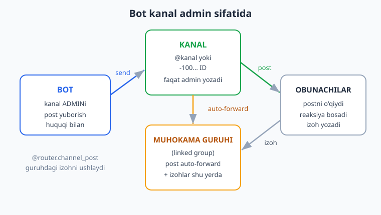
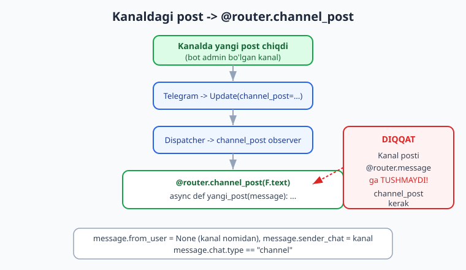
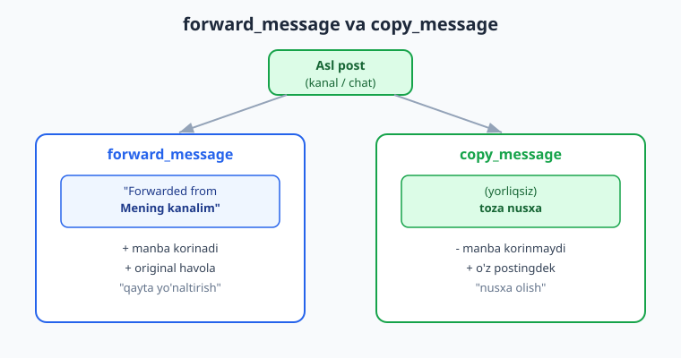

# 21 — Kanallar bilan ishlash

[⬅️ Oldingi: 20 — Guruh moderatsiyasi](./20-guruh-moderatsiya.md) · [🏠 README](./README.md) · [Keyingi: 22 — Majburiy obuna ➡️](./22-majburiy-obuna.md)

---

> **Bu bobda:** botimizni **kanal admini** sifatida ishlatamiz. Guruhdan (20-bob) farqli, kanal — bu bir tomonlama efir: faqat adminlar yozadi, obunachilar o'qiydi (va reaksiya bosadi, izoh qoldiradi). Bot kanalga admin qilib qo'shilsa, u **avtomatik post yuborishi** mumkin — bu yangiliklar boti, do'kon e'lonlari, kunlik xulosa kabi narsalar uchun asos.
>
> Yoritamiz: kanalga **post yuborish** (`bot.send_message(channel_id, ...)`, media — `send_photo`, `send_document`), kanal **ID va username** bilan ishlash (`@kanal` yoki `-100...` raqam) va ularni normalizatsiya qilish; **`@router.channel_post`** (kanalda yangi post chiqqanini ushlash — bu `@router.message` ga **tushmaydi**, alohida observer); `@router.edited_channel_post` (post tahrirlandi); **rejali post** (APScheduler bilan — [15-bobga](./15-rejalashtirilgan-broadcast.md) ishora); **linked discussion group** (kanal posti muhokama guruhiga avtomatik forward bo'ladi — `message.is_automatic_forward`, izohlarni shu yerda ushlaymiz); **`forward_message`** (manba yorlig'i bilan) va **`copy_message`** (yorliqsiz toza nusxa) farqi; **reaksiyalar** (`bot.set_message_reaction` + `ReactionTypeEmoji`).
>
> **Halol eslatma (verifikatsiya):** bu bobdagi handler routingi (`channel_post` / `edited_channel_post` mock `Update` bilan), post + inline-klaviatura qurish, `ReactionTypeEmoji` reaksiya ro'yxatini qurish, auto-forward postini va guruhdagi izohni ajratish mantiqi, `forward_message` vs `copy_message` tanlovi (mock `Bot`), kanal ID/username normalizatsiyasi va rejali post (APScheduler) mening kompyuterimda **offline (BotFather token'isiz)** — `feed_update`, soxta `Bot` va `AsyncIOScheduler` orqali **haqiqatan ishga tushirilib tekshirildi**; natijalar matnda keltirilgan. **Jonli qismlar — kanalga real post yetib borishi, real reaksiya, muhokama guruhidagi haqiqiy izohlar, kanaldan kelgan jonli `channel_post` event — bot kanal ADMINi bo'lishini, BotFather token va internet talab qiladi.** Bunday joylar "illustrativ — jonli kanal/admin kerak" deb halol belgilangan. Kod va mantiq to'g'ri, faqat Telegram serveri bilan jonli almashinuv illustrativ.

---

## 21.1. Kanal nima va guruhdan farqi

[20-bobda](./20-guruh-moderatsiya.md) guruhni ko'rdik — ko'p odam birga gaplashadigan joy. **Kanal** boshqacha: u **bir tomonlama** efir.

| Xususiyat | Guruh | Kanal |
|---|---|---|
| Kim yozadi | barcha a'zolar | faqat adminlar |
| Kim o'qiydi | a'zolar | cheksiz obunachi |
| Xabar muallifi | foydalanuvchi (`from_user`) | kanalning o'zi (`sender_chat`) |
| A'zolar ro'yxati | ko'rinadi | ko'rinmaydi (obunachilar maxfiy) |
| Bot uchun event | `message`, `chat_member` | **`channel_post`** |

Bot kanalda foydali bo'lishi uchun u **admin** bo'lishi shart — "Post xabarlari" (Post Messages) huquqi bilan. Shunda bot:

- kanalga avtomatik post yubora oladi (yangilik, e'lon, kunlik xulosa);
- yangi postlarga reaksiya qo'ya oladi;
- kanal postlarini boshqa joyga ko'chira oladi (forward/copy).

> **Diqqat:** kanalga post yuborish, reaksiya qo'yish va jonli `channel_post` eventni olish — bularning hammasi **jonli** (bot real kanalda admin bo'lishi kerak). Shuning uchun quyida ko'p joyda mantiqni **offline** (token'siz) tekshiramiz, jonli qismni esa halol "illustrativ" deb belgilaymiz.



---

## 21.2. Kanal ID va username bilan ishlash

Kanalni ikki xil ko'rsatish mumkin:

- **Public kanal** — `@username` ko'rinishida (masalan `@ioqil_blog`).
- **Private kanal** (yoki har qanday kanal) — **raqamli ID** ko'rinishida, u doim `-100` bilan boshlanadi (masalan `-1001234567890`).

Private kanalning ID sini olish uchun amaliy usul: botni kanalga admin qiling, kanalda biror post yozing, keyin uni botingiz turgan chatga forward qiling — yoki `@router.channel_post` handler ichida `message.chat.id` ni log qiling. Public kanalga esa `@username` bilan murojaat qilsangiz bo'ladi.

Kodda bunday qiymatlarni **normalizatsiya** qilish foydali — foydalanuvchidan `@kanal`, `kanal` yoki `-100...` kelishi mumkin:

```python
def normalize_channel(value) -> int | str:
    """Kanal identifikatorini bir ko'rinishga keltiradi.

    -1001234567890  -> int (ID)
    "-1001234567890" -> int (ID)
    "kanal"          -> "@kanal"
    "@kanal"         -> "@kanal"
    """
    if isinstance(value, int):
        return value
    v = value.strip()
    if v.lstrip("-").isdigit():     # "-100..." yoki "123" -> raqam
        return int(v)
    if not v.startswith("@"):
        v = "@" + v
    return v
```

Telegram API ikkalasini ham qabul qiladi: `bot.send_message("@ioqil_blog", ...)` ham, `bot.send_message(-1001234567890, ...)` ham ishlaydi.

> **Verifikatsiya (offline):** `normalize_channel` ni to'rt xil kirish bilan sinadim — `-1001234567890` (int), `"-1001234567890"` (string -> int), `"mychannel"` (-> `@mychannel`), `"@mychannel"` (o'zgarmaydi). Hammasi kutilganday ishladi (umumiy test natijasi 21.9 da).

---

## 21.3. Kanalga post yuborish

Eng oddiy holat — bot kanalga matnli post yuboradi. Bu oddiy `bot.send_message` chaqiruvi, faqat birinchi argument kanal:

```python
# bot kanal admini bo'lishi shart (illustrativ — jonli kanal/admin kerak)
CHANNEL_ID = -1001234567890   # yoki "@ioqil_blog"

await bot.send_message(CHANNEL_ID, "Yangi maqola chiqdi! Saytda o'qing.")
```

Media ham xuddi shunday — chatga yuborgandek (5-bobdan tanish), faqat manzil kanal:

```python
from aiogram.types import FSInputFile

# Rasm
await bot.send_photo(
    CHANNEL_ID,
    photo=FSInputFile("banner.jpg"),
    caption="<b>Yangi kurs</b>: Telegram bot 0 dan ekspertgacha",
)

# Hujjat (PDF, ZIP...)
await bot.send_document(CHANNEL_ID, document=FSInputFile("dars.pdf"))
```

### Inline-tugmali post

Kanaldagi postlarga **inline tugma** qo'shish mumkin (6 va 7-boblardagi `InlineKeyboardBuilder`). Kanal postida odatda **URL tugma** ishlatamiz (callback tugma ham mumkin, lekin obunachi bosganda callback botga keladi, kanalga emas):

```python
from aiogram.utils.keyboard import InlineKeyboardBuilder

def post_klaviatura():
    kb = InlineKeyboardBuilder()
    kb.button(text="Saytga o'tish", url="https://ioqil.uz")
    kb.button(text="Telegram", url="https://t.me/i_oqil")
    kb.adjust(1)            # har qatorda 1 tugma
    return kb.as_markup()

# Jonli (illustrativ — kanal/admin kerak):
await bot.send_message(
    CHANNEL_ID,
    "Yangi maqola tayyor. Quyidagi tugmalardan foydalaning.",
    reply_markup=post_klaviatura(),
)
```

`send_message` ning kanalga yuborilishi jonli (token + bot kanal admini kerak). Lekin **klaviaturani qurish** — sof offline ish, uni tekshira olamiz.

> **Verifikatsiya (offline, haqiqatan ishladi):** `post_klaviatura()` natijasini tekshirdim — `as_markup()` ikki qatorli `inline_keyboard` qaytardi, birinchi tugma `url == "https://ioqil.uz"`, ikkalasi ham `InlineKeyboardButton`. Demak post va tugma to'g'ri quriladi; faqat kanalga yuborish jonli (illustrativ).

---

## 21.4. Kanaldagi yangi postni ushlash: `@router.channel_post`

Eng muhim tushuncha: **kanal posti `@router.message` ga TUSHMAYDI.** Telegram kanal postlarini alohida `Update` maydonida yuboradi — `channel_post`. Shuning uchun aiogram'da alohida observer bor:

```python
from aiogram import Router, F
from aiogram.types import Message

router = Router()

@router.channel_post(F.text)
async def yangi_post(message: Message):
    # message.chat.type == "channel"
    # message.from_user IS None — post kanal nomidan chiqadi
    # message.sender_chat — kanalning o'zi
    print("Kanal:", message.chat.title, "| ID:", message.chat.id)
    print("Post matni:", message.text)
```

Bu **nima uchun foydali?** Misol: botingiz bir kanalda admin va siz kanalda yangi post chiqishini avtomatik aniqlab, biror amal bajarmoqchisiz — masalan postni bazaga yozish, statistika yuritish, yoki yana boshqa kanalga ulashish.

Tahrirlangan postni ushlash uchun esa `@router.edited_channel_post`:

```python
@router.edited_channel_post()
async def post_tahrir(message: Message):
    print("Post tahrirlandi, ID:", message.message_id)
```



### `channel_post` da `from_user` yo'q

Diqqat qiling: kanal postida `message.from_user` odatda **`None`** bo'ladi (post kanal nomidan chiqadi, alohida foydalanuvchi nomidan emas). Buning o'rniga `message.sender_chat` kanalni ko'rsatadi. Shuning uchun `channel_post` handlerda `message.from_user.id` ga **murojaat qilmang** — `AttributeNone` xatosiga olib keladi.

```python
@router.channel_post()
async def post_handler(message: Message):
    # ❌ XATO: message.from_user.id  -> from_user None bo'lishi mumkin!
    # ✅ TO'G'RI:
    kanal = message.sender_chat or message.chat
    print("Post manbasi:", kanal.title, kanal.id)
```

> **Verifikatsiya (offline, haqiqatan ishladi):** soxta `Bot` (fake token) va `Dispatcher` bilan `channel_post` hamda `edited_channel_post` uchun mock `Update` yasab, `feed_update` orqali handler'larga uzatdim. Natija:
>
> ```text
> [('channel_post', -1001234567890, 'Salom kanal!'),
>  ('edited_channel_post', -1001234567890), ...]
> ```
>
> Ya'ni kanal posti aynan `channel_post` handler'ga, tahrir esa `edited_channel_post` handler'ga to'g'ri yetib bordi. Jonli kanaldan haqiqiy event olish — illustrativ (bot kanal admini kerak).

---

## 21.5. Rejali post (APScheduler bilan)

Ko'p kanallar postni **belgilangan vaqtda** chiqaradi — "har kuni soat 09:00 da yangiliklar xulosasi", yoki "ertaga 18:00 da e'lon". Bu aynan [15-bobdagi APScheduler](./15-rejalashtirilgan-broadcast.md) naqshining kanalga qo'llanishi. U yerda o'rgangan `DateTrigger` / `IntervalTrigger` / `CronTrigger` shu yerda ham ishlaydi — faqat job ichida `bot.send_message(chat_id, ...)` o'rniga `bot.send_message(CHANNEL_ID, ...)` yozamiz.

```python
import asyncio
from datetime import datetime, timedelta
from aiogram import Bot
from apscheduler.schedulers.asyncio import AsyncIOScheduler
from apscheduler.triggers.cron import CronTrigger
from apscheduler.triggers.date import DateTrigger

CHANNEL_ID = -1001234567890

async def kanal_post(bot: Bot, matn: str):
    # Jonli: kanalga real post (illustrativ — bot kanal admini kerak)
    await bot.send_message(CHANNEL_ID, matn)

async def main():
    bot = Bot(token="...")        # .env BOT_TOKEN dan
    scheduler = AsyncIOScheduler()

    # 1) Bir martalik — 1 soatdan keyin e'lon
    scheduler.add_job(
        kanal_post,
        DateTrigger(run_date=datetime.now() + timedelta(hours=1)),
        args=[bot, "Bugun soat 19:00 da jonli efir!"],
    )

    # 2) Har kuni 09:00 da tongi xulosa
    scheduler.add_job(
        kanal_post,
        CronTrigger(hour=9, minute=0),
        args=[bot, "Xayrli tong! Bugungi yangiliklar..."],
    )

    scheduler.start()
    # ... dp.start_polling(bot) — jonli (illustrativ)
```

[15-bobda](./15-rejalashtirilgan-broadcast.md) batafsil ko'rsatganimday, scheduler'ni `dp.start_polling` dan oldin `start()` qilamiz va `bot` ni joblarga `args` orqali uzatamiz. `JobStore` (DB ga saqlash) haqida ham o'sha bobda gapirilgan — bot qayta ishga tushganda rejali postlar yo'qolmasligi uchun produksiyada DB store yoki o'z jadvalingizdan qayta yuklash kerak.

> **Verifikatsiya (offline, haqiqatan ishladi):** `AsyncIOScheduler` ni ishga tushirib, `DateTrigger` (0.3s) bilan kanal postining job'ini va `CronTrigger(hour=9, minute=0)` bilan kunlik job'ni qo'shdim; job ichida `bot.send_message` o'rniga ro'yxatga yozdim (token kerakmas). Natija:
>
> ```text
> scheduled post fired: [('post', -100123)]
> cron trigger: cron[hour='9', minute='0']
> jobs after one-shot fired: 1 (daily still scheduled)
> ```
>
> Ya'ni bir martalik job aynan **bir marta** ishladi va yo'qoldi, kunlik `CronTrigger` esa rejada qoldi. Jonli botda job ichidagi `bot.send_message(CHANNEL_ID, ...)` real post yuboradi (illustrativ — kanal/admin kerak).

---

## 21.6. Linked discussion group: izohlar va auto-forward

Kanalga **muhokama guruhi** (discussion / linked group) ulash mumkin (kanal sozlamalarida). U ulanganda:

1. Kanaldagi **har bir post avtomatik** muhokama guruhiga forward bo'ladi.
2. Obunachilar shu forward ostida **izoh** (comment) yoza oladi.

Bot uchun bu shuni anglatadi: bot muhokama guruhida ham bo'lsa, u kanal postining avtomatik forward'ini **oddiy `message` event** sifatida ko'radi — lekin maxsus belgi bilan: `message.is_automatic_forward == True`.

```python
from aiogram import Router, F
from aiogram.types import Message

disc = Router()   # muhokama guruhiga ulangan router

# Kanaldan guruhga avtomatik forward bo'lgan post
@disc.message(F.is_automatic_forward)
async def auto_forward_post(message: Message):
    # Bu kanal postining guruhdagi nusxasi.
    # Masalan: post ostiga avtomatik "Izohlaringizni qoldiring" deb yozish.
    print("Kanal posti guruhga forward bo'ldi, msg_id:", message.message_id)
```

### Izohni aniqlash

Obunachi izoh yozganda, bu xabar forward bo'lgan postga **reply** bo'ladi. Demak izohni avtomatik forward'ga reply orqali aniqlaymiz:

```python
@disc.message(F.reply_to_message.as_("rep"))
async def izoh(message: Message, rep: Message):
    if rep.is_automatic_forward:
        # Bu — kanal postiga yozilgan IZOH
        print("Yangi izoh:", message.text, "| muallif:", message.from_user.id)
    else:
        # Bu — oddiy reply (boshqa xabarga javob)
        print("Oddiy javob:", message.text)
```

`F.reply_to_message.as_("rep")` — magic-filter'ning `as_(...)` usuli: agar `reply_to_message` mavjud bo'lsa, uni handler'ga `rep` nomi bilan beradi. Keyin `rep.is_automatic_forward` orqali bu kanal postiga izoh ekanini bilamiz.

> **Eslatma:** muhokama guruhi odatda **supergroup** bo'ladi. Bot u yerda xabarlarni ko'rishi uchun guruhda bo'lishi (va ko'pincha admin yoki privacy mode o'chirilgan) kerak — bu 20-bobdagi guruh sozlamalariga bog'liq. Jonli izohlar — illustrativ (real guruh + obunachilar kerak).

> **Verifikatsiya (offline, haqiqatan ishladi):** muhokama guruhi uchun mock `Update`lar yasadim: (a) `is_automatic_forward=True` bo'lgan post -> `auto_forward_post` handler'ga tushdi; (b) o'sha forward'ga reply -> `izoh` handler'ida "izoh" deb aniqlandi; (c) oddiy xabarga reply -> "oddiy reply" deb ajratildi. Natija:
>
> ```text
> ('auto_forward', -1009876543210)
> ('comment', "Zo'r post!")
> ('oddiy_reply', 'menga javob')
> ```
>
> Demak auto-forward va izoh mantiqi to'g'ri ishlaydi. Jonli guruhdagi haqiqiy izohlar — illustrativ.

---

## 21.7. `forward_message` va `copy_message`

Postni bir joydan boshqasiga ko'chirishning ikki usuli bor, va ular **muhim farq** qiladi:

| Metod | Natija | Qachon |
|---|---|---|
| `bot.forward_message(...)` | "Forwarded from <manba>" yorlig'i bilan | manbani ko'rsatmoqchi bo'lsangiz |
| `bot.copy_message(...)` | **toza nusxa**, yorliqsiz (o'z postingizdek) | manbani yashirmoqchi bo'lsangiz |

Ikkalasining ham imzosi bir xil boshlanadi — `(chat_id, from_chat_id, message_id)`:

```python
# Manba yorlig'i BILAN ("Forwarded from Mening kanalim")
await bot.forward_message(
    chat_id=DST_CHANNEL,       # qayerga
    from_chat_id=SRC_CHANNEL,  # qayerdan
    message_id=123,            # qaysi post
)

# Manba yorlig'iSIZ (toza nusxa — o'z postingizdek ko'rinadi)
await bot.copy_message(
    chat_id=DST_CHANNEL,
    from_chat_id=SRC_CHANNEL,
    message_id=123,
)
```

`copy_message` qo'shimcha imkon beradi: nusxaga **yangi caption** va **reply_markup** (klaviatura) qo'shsa bo'ladi — chunki bu yangi xabar sifatida yuboriladi:

```python
await bot.copy_message(
    chat_id=DST_CHANNEL,
    from_chat_id=SRC_CHANNEL,
    message_id=123,
    caption="<b>Qayta ulashildi</b>",
    reply_markup=post_klaviatura(),
)
```



Amaliy qaror: agar boshqa kanaldan xabarni o'z kanalingizga "o'zingiznikidek" qo'ymoqchi bo'lsangiz — `copy_message`. Agar manbaga hurmat/havola saqlanishini istasangiz — `forward_message`.

> **Verifikatsiya (offline, haqiqatan ishladi):** mock `Bot` (`copy_message`/`forward_message` chaqiruvlarni ro'yxatga yozadi) bilan `repost(..., manba_korsat=True)` va `manba_korsat=False` ni sinadim. Natija:
>
> ```text
> [('forward', -1001234567890, -1009876543210, 99),
>  ('copy',    -1001234567890, -1009876543210, 99)]
> ```
>
> Ya'ni `manba_korsat=True` -> `forward_message`, `False` -> `copy_message` to'g'ri chaqirildi. Jonli ko'chirish (real kanallar orasida) — illustrativ.

---

## 21.8. Reaksiyalar: `bot.set_message_reaction`

Bot postga (yoki xabarga) **reaksiya** (emoji) qo'ya oladi — `bot.set_message_reaction`. Bu kanal postlarini "jonlantirish" yoki guruhda xabarni belgilash uchun ishlatiladi.

aiogram 3.x da reaksiya turi `aiogram.types.ReactionTypeEmoji` (oddiy emoji) yoki `ReactionTypeCustomEmoji` (premium maxsus emoji) orqali beriladi:

```python
from aiogram.types import ReactionTypeEmoji

# Postga "👍" qo'yish
await bot.set_message_reaction(
    chat_id=CHANNEL_ID,
    message_id=123,
    reaction=[ReactionTypeEmoji(emoji="👍")],
    is_big=True,        # katta animatsiyali reaksiya
)

# Bir nechta reaksiya
await bot.set_message_reaction(
    chat_id=CHANNEL_ID,
    message_id=123,
    reaction=[ReactionTypeEmoji(emoji="👍"), ReactionTypeEmoji(emoji="🔥")],
)

# Reaksiyani OLIB TASHLASH — bo'sh ro'yxat
await bot.set_message_reaction(CHANNEL_ID, 123, reaction=[])
```

Diqqat: `reaction` — bu **ro'yxat** (chunki bir nechta reaksiya mumkin), va har bir element `ReactionTypeEmoji`. Telegram faqat ruxsat etilgan emoji to'plamini qabul qiladi (kanalda hammasi emas). Reaksiyani olib tashlash uchun bo'sh ro'yxat (`reaction=[]`) yuboriladi.

Reaksiyani qulay qurish uchun kichik yordamchi:

```python
def emoji_reaksiya(*emojis: str) -> list[ReactionTypeEmoji]:
    return [ReactionTypeEmoji(emoji=e) for e in emojis]

# Ishlatish (jonli — illustrativ):
await bot.set_message_reaction(CHANNEL_ID, 123, reaction=emoji_reaksiya("👍", "❤️"))
```

> **Foydalanuvchi reaksiyasini eshitish (qisqacha):** bot boshqalar qo'ygan reaksiyani ham eshitishi mumkin — `@router.message_reaction` (`MessageReactionUpdated`) handler orqali. Buning uchun `allowed_updates` ga `"message_reaction"` qo'shilishi kerak (Telegram uni standartda yubormaydi). Bu kengroq mavzu; bu yerda asosiy fokus — bot reaksiya **qo'yishi**.

> **Verifikatsiya (offline, haqiqatan ishladi):** `ReactionTypeEmoji` ro'yxatini qurishni tekshirdim — `emoji_reaksiya("👍", "🔥")` -> ikkita element, `type == "emoji"`, emojilar to'g'ri. Hamda mock `Bot` da `set_message_reaction(chat_id, msg_id, reaction=[...], is_big=True)` va `reaction=[]` chaqiruvlari kutilgan argumentlar bilan ketdi:
>
> ```text
> set_message_reaction calls:
>   (-100123, 5, ['👍'], True)
>   (-100123, 6, [], None)
> ```
>
> Ya'ni reaksiya ro'yxati va olib tashlash chaqiruvi to'g'ri shakllanadi. Jonli reaksiya (real kanalda ko'rinishi) — illustrativ (bot kanal admini kerak).

---

## 21.9. Hammasini birlashtirish va offline verifikatsiya natijasi

Yuqoridagi bo'limlarning hammasini bitta offline skriptda birlashtirib **haqiqatan ishga tushirdim** (BotFather token'isiz): `channel_post` / `edited_channel_post` routing, post + klaviatura qurish, reaksiya ro'yxati, auto-forward va izoh ajratish, `forward`/`copy` tanlovi, kanal ID/username normalizatsiyasi. Yakuniy natija:

```text
1/5 PASS routing: [('channel_post', -1001234567890, 'Salom kanal!'),
 ('edited_channel_post', -1001234567890), ('auto_forward', -1009876543210),
 ('comment', "Zo'r post!"), ('oddiy_reply', 'menga javob')]
2/5 PASS klaviatura: 2 qator URL tugma
3/5 PASS reaksiya:  ['👍', '🔥']
4/5 PASS copy/forward: [('forward', ...), ('copy', ...)]
5/5 PASS normalize: int/str username

HAMMASI PASS: bob 21 offline mantiq tekshirildi
```

Demak butun bobning **biznes-logikasi** — handler routingi, post/klaviatura/reaksiya qurish, auto-forward va izoh ajratish, forward vs copy tanlovi, normalizatsiya va rejali post — offline holatda to'g'ri ishlaydi. **Jonli qism** (kanalga real post yetishi, real reaksiya, muhokama guruhidagi haqiqiy izohlar, kanaldan kelgan jonli event) — bot kanal ADMINi bo'lishini, BotFather token va internet talab qiladi (illustrativ).

---

## Mashqlar

### Oson

1. **Kanal normalizatsiyasi.** `normalize_channel(value)` funksiyasini yozing (21.2). To'rt holatni tekshiring: `-1001234567890` (int), `"-1001234567890"` (string), `"kanal"`, `"@kanal"`. Har biri to'g'ri natija (int yoki `@...`) qaytarishini `assert` bilan tasdiqlang.

2. **Post klaviaturasi.** `InlineKeyboardBuilder` bilan ikkita URL tugmali (`adjust(1)`) klaviatura quring. `as_markup().inline_keyboard` ikki qatorli ekanini va birinchi tugma `url` to'g'ri ekanini tekshiring.

3. **Reaksiya ro'yxati.** `emoji_reaksiya(*emojis)` funksiyasini yozing — emoji string'lardan `ReactionTypeEmoji` ro'yxati qaytarsin. `emoji_reaksiya("👍", "🔥")` ning uzunligi 2 va har biri `type == "emoji"` ekanini tasdiqlang.

4. **`channel_post` vs `message`.** Bitta `Router` ga `@router.channel_post` va `@router.message` handler qo'shing (har biri o'z ro'yxatiga yozsin). Kanal posti mock `Update` (`channel_post=...`) faqat `channel_post` handler'ni ishga tushirishini, `message` handler'ga **tushmasligini** tekshiring.

5. **`sender_chat` o'qish.** `@router.channel_post` handler yozing: `message.from_user` `None` bo'lsa ham xato bermay, `message.sender_chat` (yoki `message.chat`) dan kanal nomini olib chop etsin. Mock kanal posti bilan tekshiring.

6. **forward vs copy tanlovi.** `repost(bot, dst, src, msg_id, manba_korsat)` funksiyasini yozing: `manba_korsat=True` bo'lsa `forward_message`, aks holda `copy_message` chaqirsin. Mock bot bilan ikkala tarmoqni tekshiring.

### O'rta

7. **`edited_channel_post`.** `@router.channel_post` va `@router.edited_channel_post` handler'larini bitta routerga qo'shing. Yangi post va tahrirlangan post uchun ikki xil mock `Update` yasab (`channel_post=...` va `edited_channel_post=...`), har biri o'z handler'iga tushishini `feed_update` bilan tasdiqlang.

8. **Izohni aniqlash.** `F.reply_to_message.as_("rep")` bilan handler yozing. Auto-forward (`is_automatic_forward=True`) postga reply -> "izoh", oddiy xabarga reply -> "oddiy reply" deb ajratsin. `feed_update` bilan ikkala holatni tekshiring.

9. **Auto-forward filtri.** `@router.message(F.is_automatic_forward)` handler yozing. `is_automatic_forward=True` xabar unga tushishini, oddiy xabar **tushmasligini** mock `Update` bilan tasdiqlang.

10. **`set_message_reaction` chaqiruvi.** Mock `Bot` yozing (`set_message_reaction` chaqiruvlarni ro'yxatga yozsin). `is_big=True` bilan bitta `ReactionTypeEmoji`, va alohida `reaction=[]` (olib tashlash) chaqiring. Ro'yxat kutilgan argumentlarni saqlaganini tekshiring.

11. **Rejali kanal posti.** [15-bob](./15-rejalashtirilgan-broadcast.md) uslubida `AsyncIOScheduler` yarating, `DateTrigger` (0.3s) bilan "kanal posti" job'ini qo'shing (job ichida ro'yxatga yozing). ~0.5s kutib, job aynan bir marta ishlaganini tasdiqlang, keyin `shutdown` qiling.

12. **copy uchun qo'shimcha caption.** Mock bot da `copy_message(chat_id, from_chat_id, message_id, caption=..., reply_markup=...)` ni chaqiring. Mock chaqiruvni saqlab, `caption` va `reply_markup` argumentlari to'g'ri uzatilganini tasdiqlang. (`forward_message` ularni qabul qilmasligiga e'tibor bering.)

### Qiyin

13. **Mini repost-bot.** Bitta `Router` da `@router.channel_post(F.text)` handler yozing: u kelgan kanal postining matnini olib, mock bot orqali **boshqa** kanalga `copy_message` qiladi (manba ID si `message.chat.id`, post `message.message_id`). `feed_update` bilan kanal posti yuborib, mock bot da to'g'ri `copy_message(dst, src_chat, msg_id)` chaqirilganini tasdiqlang.

14. **Izohga avto-javob.** Muhokama guruhi uchun handler yozing: auto-forward postga kelgan **birinchi izohga** bot reply qilib "Izoh uchun rahmat!" yozsin (mock bot da). Auto-forward'ning o'ziga esa **javob bermasin**. `feed_update` bilan: (a) auto-forward post — javob yo'q; (b) unga izoh — bitta reply chaqiruvi. Mock bot chaqiruvlarini tekshiring.

15. **To'liq channel-pipeline.** Quyidagilarni bitta offline skriptda birlashtiring: `normalize_channel`, post-klaviatura, `emoji_reaksiya`, `channel_post` routing (mock `Update`), `forward`/`copy` tanlovi (mock bot) va rejali post (`AsyncIOScheduler` + `DateTrigger`). Hammasi `assert` bilan o'tib, oxirida bitta `PASS` chop etsin. (Bu — 21.9 dagi verifikatsiyaning sizning versiyangiz.)

<details markdown="1">
<summary>Yechimlar</summary>

### Oson 1 — Kanal normalizatsiyasi

```python
def normalize_channel(value):
    if isinstance(value, int):
        return value
    v = value.strip()
    if v.lstrip("-").isdigit():
        return int(v)
    if not v.startswith("@"):
        v = "@" + v
    return v

assert normalize_channel(-1001234567890) == -1001234567890
assert normalize_channel("-1001234567890") == -1001234567890
assert normalize_channel("kanal") == "@kanal"
assert normalize_channel("@kanal") == "@kanal"
print("PASS")
```

### Oson 2 — Post klaviaturasi

```python
from aiogram.utils.keyboard import InlineKeyboardBuilder
from aiogram.types import InlineKeyboardButton

def post_klaviatura():
    kb = InlineKeyboardBuilder()
    kb.button(text="Saytga o'tish", url="https://ioqil.uz")
    kb.button(text="Telegram", url="https://t.me/i_oqil")
    kb.adjust(1)
    return kb.as_markup()

m = post_klaviatura()
assert len(m.inline_keyboard) == 2, m.inline_keyboard
assert m.inline_keyboard[0][0].url == "https://ioqil.uz"
assert isinstance(m.inline_keyboard[0][0], InlineKeyboardButton)
print("PASS")
```

### Oson 3 — Reaksiya ro'yxati

```python
from aiogram.types import ReactionTypeEmoji

def emoji_reaksiya(*emojis):
    return [ReactionTypeEmoji(emoji=e) for e in emojis]

r = emoji_reaksiya("\U0001f44d", "\U0001f525")   # 👍 🔥
assert len(r) == 2
assert all(x.type == "emoji" for x in r)
assert [x.emoji for x in r] == ["\U0001f44d", "\U0001f525"]
print("PASS")
```

### Oson 4 — `channel_post` vs `message`

```python
import asyncio
from datetime import datetime
from aiogram import Bot, Dispatcher, Router
from aiogram.fsm.storage.memory import MemoryStorage
from aiogram.types import Message, Update, Chat, User

router = Router()
seen = []

@router.channel_post()
async def cp(message: Message): seen.append("channel_post")

@router.message()
async def mp(message: Message): seen.append("message")

async def main():
    bot = Bot(token="123456:AAH-Test_abc")
    dp = Dispatcher(storage=MemoryStorage()); dp.include_router(router)
    post = Message(message_id=1, date=datetime.now(),
                   chat=Chat(id=-100123, type="channel", title="K"), text="hi")
    await dp.feed_update(bot, Update(update_id=1, channel_post=post))
    await bot.session.close()
    assert seen == ["channel_post"], seen   # message handler'ga TUSHMADI
    print("PASS:", seen)

asyncio.run(main())
```

### Oson 5 — `sender_chat` o'qish

```python
import asyncio
from datetime import datetime
from aiogram import Bot, Dispatcher, Router
from aiogram.fsm.storage.memory import MemoryStorage
from aiogram.types import Message, Update, Chat

router = Router(); out = []

@router.channel_post()
async def cp(message: Message):
    kanal = message.sender_chat or message.chat
    out.append((kanal.title, message.from_user))   # from_user None bo'lsa ham xato yo'q

async def main():
    bot = Bot(token="123456:AAH-Test_abc")
    dp = Dispatcher(storage=MemoryStorage()); dp.include_router(router)
    post = Message(message_id=1, date=datetime.now(),
                   chat=Chat(id=-100123, type="channel", title="Kanalim"),
                   sender_chat=Chat(id=-100123, type="channel", title="Kanalim"),
                   text="post")
    await dp.feed_update(bot, Update(update_id=1, channel_post=post))
    await bot.session.close()
    assert out == [("Kanalim", None)], out
    print("PASS:", out)

asyncio.run(main())
```

### Oson 6 — forward vs copy tanlovi

```python
import asyncio

class FakeBot:
    def __init__(self): self.actions = []
    async def forward_message(self, chat_id, from_chat_id, message_id):
        self.actions.append(("forward", chat_id, from_chat_id, message_id))
    async def copy_message(self, chat_id, from_chat_id, message_id):
        self.actions.append(("copy", chat_id, from_chat_id, message_id))

async def repost(bot, dst, src, msg_id, manba_korsat):
    if manba_korsat:
        await bot.forward_message(dst, src, msg_id)
    else:
        await bot.copy_message(dst, src, msg_id)

async def main():
    fb = FakeBot()
    await repost(fb, 1, 2, 9, True)
    await repost(fb, 1, 2, 9, False)
    assert fb.actions == [("forward", 1, 2, 9), ("copy", 1, 2, 9)], fb.actions
    print("PASS:", fb.actions)

asyncio.run(main())
```

### O'rta 7 — `edited_channel_post`

```python
import asyncio
from datetime import datetime
from aiogram import Bot, Dispatcher, Router
from aiogram.fsm.storage.memory import MemoryStorage
from aiogram.types import Message, Update, Chat

router = Router(); seen = []

@router.channel_post()
async def cp(message: Message): seen.append("new")

@router.edited_channel_post()
async def ecp(message: Message): seen.append("edited")

def post(mid):
    return Message(message_id=mid, date=datetime.now(),
                   chat=Chat(id=-100123, type="channel", title="K"), text="x")

async def main():
    bot = Bot(token="123456:AAH-Test_abc")
    dp = Dispatcher(storage=MemoryStorage()); dp.include_router(router)
    await dp.feed_update(bot, Update(update_id=1, channel_post=post(1)))
    await dp.feed_update(bot, Update(update_id=2, edited_channel_post=post(1)))
    await bot.session.close()
    assert seen == ["new", "edited"], seen
    print("PASS:", seen)

asyncio.run(main())
```

### O'rta 8 — Izohni aniqlash

```python
import asyncio
from datetime import datetime
from aiogram import Bot, Dispatcher, Router, F
from aiogram.fsm.storage.memory import MemoryStorage
from aiogram.types import Message, Update, Chat, User

router = Router(); out = []

@router.message(F.reply_to_message.as_("rep"))
async def reply_h(message: Message, rep: Message):
    out.append("izoh" if rep.is_automatic_forward else "oddiy")

def grp_msg(mid, text, reply):
    return Message(message_id=mid, date=datetime.now(),
                   chat=Chat(id=-100999, type="supergroup"),
                   from_user=User(id=5, is_bot=False, first_name="R"),
                   text=text, reply_to_message=reply)

async def main():
    bot = Bot(token="123456:AAH-Test_abc")
    dp = Dispatcher(storage=MemoryStorage()); dp.include_router(router)
    fwd = Message(message_id=10, date=datetime.now(),
                  chat=Chat(id=-100999, type="supergroup"),
                  is_automatic_forward=True, text="kanal posti")
    oddiy = Message(message_id=11, date=datetime.now(),
                    chat=Chat(id=-100999, type="supergroup"),
                    from_user=User(id=1, is_bot=False, first_name="X"), text="asl")
    await dp.feed_update(bot, Update(update_id=1, message=grp_msg(20, "zo'r", fwd)))
    await dp.feed_update(bot, Update(update_id=2, message=grp_msg(21, "ok", oddiy)))
    await bot.session.close()
    assert out == ["izoh", "oddiy"], out
    print("PASS:", out)

asyncio.run(main())
```

### O'rta 9 — Auto-forward filtri

```python
import asyncio
from datetime import datetime
from aiogram import Bot, Dispatcher, Router, F
from aiogram.fsm.storage.memory import MemoryStorage
from aiogram.types import Message, Update, Chat, User

router = Router(); seen = []

@router.message(F.is_automatic_forward)
async def auto(message: Message): seen.append("auto")

@router.message()
async def other(message: Message): seen.append("other")

def msg(mid, auto):
    return Message(message_id=mid, date=datetime.now(),
                   chat=Chat(id=-100999, type="supergroup"),
                   from_user=User(id=1, is_bot=False, first_name="X"),
                   text="x", is_automatic_forward=(True if auto else None))

async def main():
    bot = Bot(token="123456:AAH-Test_abc")
    dp = Dispatcher(storage=MemoryStorage()); dp.include_router(router)
    await dp.feed_update(bot, Update(update_id=1, message=msg(1, auto=True)))
    await dp.feed_update(bot, Update(update_id=2, message=msg(2, auto=False)))
    await bot.session.close()
    assert seen == ["auto", "other"], seen
    print("PASS:", seen)

asyncio.run(main())
```

### O'rta 10 — `set_message_reaction` chaqiruvi

```python
import asyncio
from aiogram.types import ReactionTypeEmoji

class FakeBot:
    def __init__(self): self.calls = []
    async def set_message_reaction(self, chat_id, message_id, reaction=None, is_big=None):
        self.calls.append((chat_id, message_id,
                           [r.emoji for r in (reaction or [])], is_big))

async def main():
    fb = FakeBot()
    await fb.set_message_reaction(-100123, 5,
                                  reaction=[ReactionTypeEmoji(emoji="\U0001f44d")], is_big=True)
    await fb.set_message_reaction(-100123, 6, reaction=[])   # olib tashlash
    assert fb.calls[0] == (-100123, 5, ["\U0001f44d"], True), fb.calls
    assert fb.calls[1] == (-100123, 6, [], None), fb.calls
    print("PASS:", fb.calls)

asyncio.run(main())
```

### O'rta 11 — Rejali kanal posti

```python
import asyncio
from datetime import datetime, timedelta
from apscheduler.schedulers.asyncio import AsyncIOScheduler
from apscheduler.triggers.date import DateTrigger

fired = []
async def kanal_post(matn): fired.append(matn)   # jonli: await bot.send_message(CH, matn)

async def main():
    sch = AsyncIOScheduler(); sch.start()
    sch.add_job(kanal_post, DateTrigger(run_date=datetime.now() + timedelta(seconds=0.3)),
                args=["E'lon"])
    await asyncio.sleep(0.5)
    sch.shutdown(wait=False)
    assert fired == ["E'lon"], fired
    print("PASS:", fired)

asyncio.run(main())
```

### O'rta 12 — copy uchun qo'shimcha caption

```python
import asyncio

class FakeBot:
    def __init__(self): self.calls = []
    async def copy_message(self, chat_id, from_chat_id, message_id,
                           caption=None, reply_markup=None):
        self.calls.append({"chat_id": chat_id, "from": from_chat_id,
                           "mid": message_id, "caption": caption,
                           "markup": reply_markup})

async def main():
    fb = FakeBot()
    await fb.copy_message(1, 2, 9, caption="Qayta ulashildi", reply_markup="KB")
    c = fb.calls[0]
    assert c["caption"] == "Qayta ulashildi" and c["markup"] == "KB", c
    print("PASS:", c)

asyncio.run(main())
```

`forward_message` esa `caption`/`reply_markup` qabul qilmaydi — u xabarni "o'zgartirmasdan" forward qiladi. Caption yoki klaviatura qo'shish kerak bo'lsa, `copy_message` ishlatiladi.

### Qiyin 13 — Mini repost-bot

```python
import asyncio
from datetime import datetime
from aiogram import Bot, Dispatcher, Router, F
from aiogram.fsm.storage.memory import MemoryStorage
from aiogram.types import Message, Update, Chat

DST = -1009999999999
router = Router()

class FakeBot(Bot):
    def __init__(self, token):
        super().__init__(token=token)
        self.copied = []
    async def copy_message(self, chat_id, from_chat_id, message_id, **kw):
        self.copied.append((chat_id, from_chat_id, message_id))
        return True

@router.channel_post(F.text)
async def repost(message: Message, bot: Bot):
    await bot.copy_message(DST, message.chat.id, message.message_id)

async def main():
    bot = FakeBot(token="123456:AAH-Test_abc")
    dp = Dispatcher(storage=MemoryStorage()); dp.include_router(router)
    post = Message(message_id=42, date=datetime.now(),
                   chat=Chat(id=-100123, type="channel", title="Src"), text="post")
    await dp.feed_update(bot, Update(update_id=1, channel_post=post))
    await bot.session.close()
    assert bot.copied == [(DST, -100123, 42)], bot.copied
    print("PASS:", bot.copied)

asyncio.run(main())
```

Bu yerda `FakeBot` haqiqiy `Bot` dan meros oladi, lekin `copy_message` ni override qilib ro'yxatga yozadi — shunda handler'ga `bot` in'ektsiya qilinadi va `feed_update` token'siz ishlaydi. Jonli botda real `copy_message` postni `DST` kanaliga ko'chiradi (illustrativ — kanal/admin kerak).

### Qiyin 14 — Izohga avto-javob

```python
import asyncio
from datetime import datetime
from aiogram import Bot, Dispatcher, Router, F
from aiogram.fsm.storage.memory import MemoryStorage
from aiogram.types import Message, Update, Chat, User

GRP = -1009999999999
router = Router()

class FakeBot(Bot):
    def __init__(self, token):
        super().__init__(token=token); self.replies = []
    async def send_message(self, chat_id, text, **kw):
        self.replies.append((chat_id, text)); return True

# Auto-forward'ning o'ziga javob bermaymiz
@router.message(F.is_automatic_forward)
async def auto(message: Message): pass

# Izoh (forward'ga reply) -> bitta javob
@router.message(F.reply_to_message.as_("rep"))
async def izoh(message: Message, rep: Message, bot: Bot):
    if rep.is_automatic_forward:
        await bot.send_message(message.chat.id, "Izoh uchun rahmat!")

def grp(mid, text=None, auto=False, reply=None):
    return Message(message_id=mid, date=datetime.now(),
                   chat=Chat(id=GRP, type="supergroup"),
                   from_user=User(id=7, is_bot=False, first_name="R"),
                   text=text, is_automatic_forward=(True if auto else None),
                   reply_to_message=reply)

async def main():
    bot = FakeBot(token="123456:AAH-Test_abc")
    dp = Dispatcher(storage=MemoryStorage()); dp.include_router(router)
    fwd = grp(10, text="kanal posti", auto=True)
    await dp.feed_update(bot, Update(update_id=1, message=fwd))           # javob yo'q
    await dp.feed_update(bot, Update(update_id=2, message=grp(11, "zo'r", reply=fwd)))
    await bot.session.close()
    assert bot.replies == [(GRP, "Izoh uchun rahmat!")], bot.replies
    print("PASS:", bot.replies)

asyncio.run(main())
```

### Qiyin 15 — To'liq channel-pipeline

```python
import asyncio
from datetime import datetime, timedelta
from aiogram import Bot, Dispatcher, Router, F
from aiogram.fsm.storage.memory import MemoryStorage
from aiogram.types import Message, Update, Chat, ReactionTypeEmoji
from aiogram.utils.keyboard import InlineKeyboardBuilder
from apscheduler.schedulers.asyncio import AsyncIOScheduler
from apscheduler.triggers.date import DateTrigger

def normalize_channel(value):
    if isinstance(value, int): return value
    v = value.strip()
    if v.lstrip("-").isdigit(): return int(v)
    return v if v.startswith("@") else "@" + v

def post_klaviatura():
    kb = InlineKeyboardBuilder()
    kb.button(text="Sayt", url="https://ioqil.uz"); kb.adjust(1)
    return kb.as_markup()

def emoji_reaksiya(*e): return [ReactionTypeEmoji(emoji=x) for x in e]

router = Router(); routed = []
@router.channel_post(F.text)
async def cp(message: Message): routed.append(message.text)

class FakeBot:
    def __init__(self): self.actions = []
    async def forward_message(self, c, f, m): self.actions.append(("fwd", c, f, m))
    async def copy_message(self, c, f, m): self.actions.append(("copy", c, f, m))

async def repost(bot, dst, src, mid, manba):
    await (bot.forward_message if manba else bot.copy_message)(dst, src, mid)

async def main():
    # 1) normalize
    assert normalize_channel("kanal") == "@kanal"
    assert normalize_channel("-100123") == -100123
    # 2) klaviatura
    assert post_klaviatura().inline_keyboard[0][0].url == "https://ioqil.uz"
    # 3) reaksiya
    assert [r.emoji for r in emoji_reaksiya("\U0001f44d")] == ["\U0001f44d"]
    # 4) channel_post routing
    bot = Bot(token="123456:AAH-Test_abc")
    dp = Dispatcher(storage=MemoryStorage()); dp.include_router(router)
    post = Message(message_id=1, date=datetime.now(),
                   chat=Chat(id=-100123, type="channel", title="K"), text="salom")
    await dp.feed_update(bot, Update(update_id=1, channel_post=post))
    await bot.session.close()
    assert routed == ["salom"], routed
    # 5) forward/copy
    fb = FakeBot()
    await repost(fb, 1, 2, 9, manba=True); await repost(fb, 1, 2, 9, manba=False)
    assert fb.actions == [("fwd", 1, 2, 9), ("copy", 1, 2, 9)], fb.actions
    # 6) rejali post
    fired = []
    sch = AsyncIOScheduler(); sch.start()
    sch.add_job(lambda: fired.append("post"),
                DateTrigger(run_date=datetime.now() + timedelta(seconds=0.25)))
    await asyncio.sleep(0.45); sch.shutdown(wait=False)
    assert fired == ["post"], fired
    print("HAMMASI PASS: to'liq channel-pipeline")

asyncio.run(main())
```

</details>

---

[⬅️ Oldingi: 20 — Guruh moderatsiyasi](./20-guruh-moderatsiya.md) · [🏠 README](./README.md) · [Keyingi: 22 — Majburiy obuna ➡️](./22-majburiy-obuna.md)
