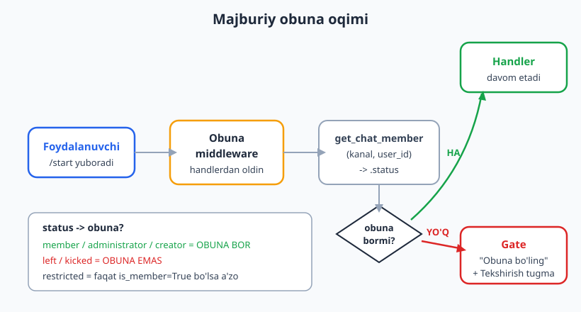
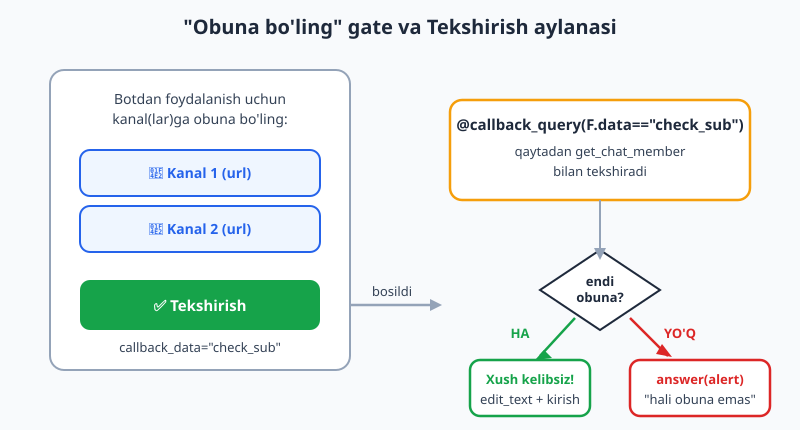
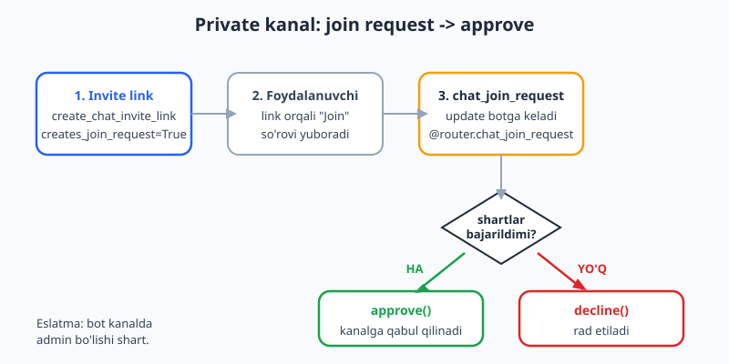

# 22 — Majburiy obuna

[⬅️ Oldingi: 21 — Kanallar bilan ishlash](./21-kanallar.md) · [🏠 README](./README.md) · [Keyingi: 23 — Telegram Web App (Mini App) asoslari ➡️](./23-webapp-asoslari.md)

---

> **Bu bobda:** "Majburiy obuna" (forced subscription) — foydalanuvchini bot xizmatidan foydalanishdan **oldin** bir yoki bir nechta kanalga obuna bo'lishga majburlash. Bu O'zbekistonda eng ko'p so'raladigan amaliy funksiya. Biz quyidagilarni o'rganamiz: `bot.get_chat_member(channel, user_id)` bilan obunani aniqlash (status `left`/`kicked` = obuna emas; `member`/`administrator`/`creator` = obuna; `restricted` esa `is_member` ga qarab); **obuna middleware** (./09 ga tayanib — har bir handlerdan oldin tekshiradi, obuna bo'lmasa "gate" ko'rsatib handlerni to'xtatadi); "Obuna bo'ling" inline gate klaviaturasi (kanal URL tugmasi + "✅ Tekshirish" callback); **bir nechta majburiy kanal**; **private kanal** (invite link + `@router.chat_join_request` orqali avtomatik approve); va obunani qisqa vaqt **keshlash** (qayta-qayta `get_chat_member` chaqirmaslik).
>
> **Halol eslatma:** bu bobdagi obuna mantiqi — `is_subscribed` tekshiruvi, middleware'ning gate/handler tarmoqlari, gate klaviaturasini qurish, "Tekshirish" callback, kesh va `chat_join_request` approve oqimi — `feed_update` + `get_chat_member`/`approve_chat_join_request` ni **mock (AsyncMock)** qilib, **offline va tokensiz** haqiqatan ishga tushirilib tekshirildi. Natijalar matnda ko'rsatilgan. Jonli qism (real foydalanuvchining kanalga obuna bo'lishi, bot kanalda admin bo'lishi, jonli approve) BotFather tokeni, internet va kanal-admin huquqini talab qiladi — bunday joylar "illustrativ" deb halol belgilangan.

---

## 1. Majburiy obuna nima va qanday ishlaydi

Tasavvur qiling: sizda foydali bot bor (masalan, kino qidiruvchi yoki kursga ro'yxatdan o'tkazuvchi). Siz xohlaysizki, undan foydalanadigan har bir kishi avval sizning kanalingizga obuna bo'lsin. Bu — **majburiy obuna**.

Mantiq sodda va u butunlay bitta API metodga tayanadi: `bot.get_chat_member(channel, user_id)`. Bu metod "falon kanalda falon foydalanuvchi qanday a'zo?" degan savolga javob beradi — `ChatMember` obyektini qaytaradi, undagi `.status` esa foydalanuvchining holatini bildiradi.

Oqim quyidagicha: foydalanuvchi botga xabar yozadi → **obuna middleware** uni ushlab, `get_chat_member` orqali obunani tekshiradi → agar obuna bo'lsa, handler ishlaydi; aks holda foydalanuvchiga "Obuna bo'ling" **gate** (darvoza) ko'rsatiladi va handler **umuman ishlamaydi**.



> Bu bob to'liq [09 — Middleware](./09-middleware.md) ga tayanadi. Agar `BaseMiddleware`, `__call__(self, handler, event, data)`, `await handler(event, data)` ni chaqirmaslik orqali handlerni to'xtatish va `outer` vs `inner` farqi sizga notanish bo'lsa, avval o'sha bobni qayta ko'rib chiqing. Kanal ID, bot kanalda admin bo'lishi va kanal turlari uchun [21 — Kanallar bilan ishlash](./21-kanallar.md) foydali.

**Muhim shart.** `get_chat_member` ishlashi uchun **bot o'sha kanalda admin bo'lishi shart** (yoki kamida a'zolarni ko'ra olishi kerak). Aks holda Telegram xato qaytaradi. Bu jonli talab — offline testda biz metodni mock qilamiz, lekin real botda kanalga botni qo'shib, admin qilib qo'yishni unutmang.

---

## 2. Obunani aniqlash: `get_chat_member` va `status`

`bot.get_chat_member(chat_id, user_id)` qaytargan `ChatMember` ning `.status` maydoni `aiogram.enums.ChatMemberStatus` qiymatlaridan biri bo'ladi. Ularning ma'nosi:

| `status` | Ma'nosi | Obuna bormi? |
|---|---|---|
| `creator` | Kanal egasi | ✅ Ha |
| `administrator` | Admin | ✅ Ha |
| `member` | Oddiy a'zo | ✅ Ha |
| `restricted` | Cheklangan | ⚠️ Faqat `is_member=True` bo'lsa |
| `left` | Chiqib ketgan / hech qachon a'zo bo'lmagan | ❌ Yo'q |
| `kicked` | Ban qilingan | ❌ Yo'q |

Demak qoida: **a'zo = status `creator`, `administrator` yoki `member`** (yoki `restricted` bo'lib `is_member=True`). `left` va `kicked` — obuna emas.

> **Nega `left` "hech qachon a'zo bo'lmagan" ni ham bildiradi?** Telegram obuna bo'lmagan odam uchun ham `left` qaytaradi — ya'ni "hozir kanalda yo'q" degani. Shuning uchun `left` ni "obuna emas" deb hisoblash to'g'ri.

Mana obunani aniqlovchi sof funksiya. U `ChatMember` obyektini olib, `bool` qaytaradi:

```python
from aiogram.enums import ChatMemberStatus

OK_STATUSES = {
    ChatMemberStatus.CREATOR,
    ChatMemberStatus.ADMINISTRATOR,
    ChatMemberStatus.MEMBER,
}


def is_subscribed_status(member) -> bool:
    """ChatMember -> obuna bormi?"""
    if member.status in OK_STATUSES:
        return True
    # restricted bo'lsa, faqat is_member=True bo'lsa hali a'zo hisoblanadi
    if member.status == ChatMemberStatus.RESTRICTED:
        return bool(getattr(member, "is_member", False))
    return False
```

Biz buni har bir status uchun offline ishga tushirib tekshirdik (har xil `ChatMember*` obyektlari yasab). **Haqiqiy** natija:

```text
creator        -> True
administrator  -> True
member         -> True
left           -> False
kicked         -> False
restricted is_member=True  -> True
restricted is_member=False -> False
```

Bitta kanal uchun bitta foydalanuvchini tekshiruvchi yordamchi:

```python
async def is_subscribed(bot, channel_id: int, user_id: int) -> bool:
    member = await bot.get_chat_member(channel_id, user_id)
    return is_subscribed_status(member)
```

> **Statusni hardkod string bilan solishtirmang.** `if member.status == "member"` ham ishlaydi, lekin `ChatMemberStatus` enum'idan foydalanish — xato yozish ehtimolini kamaytiradi va kod o'qimishliroq bo'ladi. Enum qiymatlari aynan `"creator"`, `"administrator"`, `"member"`, `"restricted"`, `"left"`, `"kicked"`.

---

## 3. "Obuna bo'ling" gate klaviaturasi

Foydalanuvchi obuna bo'lmagan bo'lsa, unga ikki narsa kerak: (1) kanalga **o'tish** tugmasi (URL tugma) va (2) obunani **qayta tekshirish** tugmasi (callback). Buni [06 — Klaviaturalar](./06-klaviaturalar.md) dagi `InlineKeyboardBuilder` bilan quramiz:

```python
from aiogram.types import InlineKeyboardMarkup
from aiogram.utils.keyboard import InlineKeyboardBuilder


def build_gate_keyboard(channels) -> InlineKeyboardMarkup:
    kb = InlineKeyboardBuilder()
    for ch in channels:
        # URL tugma: foydalanuvchini to'g'ridan-to'g'ri kanalga olib boradi
        kb.button(text=f"📢 {ch['title']}", url=ch["url"])
    # Callback tugma: obunani qayta tekshirish
    kb.button(text="✅ Tekshirish", callback_data="check_sub")
    kb.adjust(1)        # har bir tugma alohida qatorda
    return kb.as_markup()
```

Bu yerda `channels` — har bir kanal uchun `title` va `url` (ochiq kanallar uchun `https://t.me/...`) saqlovchi lug'atlar ro'yxati. Biz klaviaturani offline qurib, tugmalarni tekshirdik. **Haqiqiy** natija (bitta kanal bilan):

```text
qatorlar soni: 2
1-tugma: text='📢 Mening kanalim' url='https://t.me/mychannel'
2-tugma: text='✅ Tekshirish' callback_data='check_sub'
```

Birinchi qator — URL tugmasi (kanalga o'tish), ikkinchi qator — `callback_data="check_sub"` bo'lgan tekshirish tugmasi. `adjust(1)` har tugmani o'z qatoriga joylaydi — tartibli ko'rinish uchun.

> **URL tugma uchun kanal `username` bo'lishi kerak.** `https://t.me/username` ko'rinishidagi havola faqat **ochiq** (public) kanalga ishlaydi. Private kanal uchun esa invite link kerak — buni 7-bo'limda ko'ramiz.

---

## 4. Obuna middleware — gate'ni har handlerdan oldin qo'yish

Endi eng muhim qism. Biz obuna tekshiruvini har bir handler ichida takrorlashni xohlamaymiz — bu 09-bobdagi "30 ta handler" muammosi. O'rniga **middleware** yozamiz: u har bir kelgan xabar/callback handler'ga yetishidan **oldin** ishlab, obunani tekshiradi. Obuna bo'lmasa, gate ko'rsatadi va `await handler(...)` ni **chaqirmaydi** — shu bilan handler bloklanadi.

Avval bir nechta kanalni hammasini tekshiruvchi yordamchini yozamiz. U obuna bo'lmagan kanallar ro'yxatini qaytaradi (gate'da faqat o'shalarni ko'rsatish uchun):

```python
async def check_all_subscriptions(bot, user_id, channels):
    not_subscribed = []
    for ch in channels:
        member = await bot.get_chat_member(ch["id"], user_id)
        if not is_subscribed_status(member):
            not_subscribed.append(ch)
    ok = len(not_subscribed) == 0
    return ok, not_subscribed
```

Endi middleware. Diqqat: uni **`message` va `callback_query` darajasida** ro'yxatga olamiz (`dp.update` darajasida emas). Sababi — `dp.update.outer_middleware` da `event` argumenti butun `Update` bo'ladi, biz esa gate javobini yuborish uchun aniq `Message`/`CallbackQuery` turini bilishimiz kerak. (Buni biz offline test paytida `isinstance(event, Message)` ishlamay qolgani orqali aniqladik — `Update` darajasida `event` `Message` emas, `Update` bo'lar ekan.)

```python
from typing import Any, Dict
from aiogram import BaseMiddleware, Bot
from aiogram.types import Message, CallbackQuery


class SubscriptionMiddleware(BaseMiddleware):
    def __init__(self, channels):
        self.channels = channels

    async def __call__(self, handler, event, data: Dict[str, Any]) -> Any:
        user = data.get("event_from_user")
        if user is None:
            # foydalanuvchi yo'q (masalan, kanal posti) — tekshirmaymiz
            return await handler(event, data)

        bot: Bot = data["bot"]
        ok, missing = await check_all_subscriptions(bot, user.id, self.channels)
        if ok:
            return await handler(event, data)      # obuna bor -> davom

        # obuna EMAS -> gate ko'rsatamiz, handlerni chaqirmaymiz
        kb = build_gate_keyboard(missing)
        text = "Botdan foydalanish uchun quyidagi kanal(lar)ga obuna bo'ling:"
        if isinstance(event, Message):
            await event.answer(text, reply_markup=kb)
        elif isinstance(event, CallbackQuery):
            # callback'da to'g'ridan-to'g'ri javob: alert chiqaramiz
            await event.answer("Avval obuna bo'ling!", show_alert=True)
        return       # <- handler chaqirilmaydi (gate qo'yildi)
```

Ro'yxatga olish — message va callback_query darajasida, `outer` (filtrlashdan oldin, hamma uchun):

```python
channels = [
    {"id": -1001234567890, "url": "https://t.me/mychannel", "title": "Mening kanalim"},
]
dp.message.outer_middleware(SubscriptionMiddleware(channels))
dp.callback_query.outer_middleware(SubscriptionMiddleware(channels))
```

> `data["event_from_user"]` — bu 09-bobda ko'rganimizdek, aiogram avtomatik soladigan ishonchli kalit; `Message` va `CallbackQuery` da bir xil ishlaydi. `data["bot"]` esa joriy `Bot` obyekti.

### Offline tekshiruv — ikki tarmoq

Endi eng muhim qism: ikki tarmoqni (obuna bor / obuna yo'q) haqiqatan tekshirdik. `bot.get_chat_member` ni `AsyncMock` bilan almashtirib, bir holatda `left` (obuna yo'q), boshqasida `member` (obuna bor) qaytardik, so'ng `/start` ni `feed_update` bilan yubordik.

**Obuna YO'Q** (`get_chat_member` -> `left`) tarmog'i — handler ishlamasligi kerak:

```python
import asyncio
from datetime import datetime
from unittest.mock import AsyncMock
from aiogram import Bot, Dispatcher, Router
from aiogram.filters import CommandStart
from aiogram.fsm.storage.memory import MemoryStorage
from aiogram.types import (
    Update, Message, Chat, User, ChatMemberLeft, ChatMemberMember,
)

FAKE = "123456:AAH-FakeTest_abc"     # soxta token — offline uchun

router = Router()


@router.message(CommandStart())
async def start(message: Message):
    # jonli botda: await message.answer("Xush kelibsiz!")
    print("[HANDLER] /start ishladi, user:", message.from_user.id)


def make_start(uid):
    msg = Message(message_id=1, date=datetime.now(),
                  chat=Chat(id=uid, type="private"),
                  from_user=User(id=uid, is_bot=False, first_name="Ali"),
                  text="/start")
    return Update(update_id=1, message=msg)


async def main():
    u = User(id=1, is_bot=False, first_name="Ali")

    # --- obuna YO'Q: left qaytaramiz ---
    bot = Bot(token=FAKE)
    bot.get_chat_member = AsyncMock(return_value=ChatMemberLeft(status="left", user=u))
    dp = Dispatcher(storage=MemoryStorage())
    dp.message.outer_middleware(SubscriptionMiddleware(channels))
    dp.include_router(router)
    print("obuna YO'Q:")
    await dp.feed_update(bot, make_start(1))   # handler ishlamasligi kerak
    await bot.session.close()


asyncio.run(main())
```

Bu testni biz haqiqatan ishga tushirdik. **Haqiqiy** natija (gate'ning `event.answer` qatorini offline'da log bilan almashtirib):

```text
=== middleware: obuna YO'Q (status=left) ===
  log = [('gate-message', 1, 1)]
  -> handler ISHLAMADI, gate ko'rsatildi (to'g'ri)
```

Va **obuna BOR** (`get_chat_member` -> `member`) tarmog'i — handler ishlashi kerak:

```text
=== middleware: obuna BOR (status=member) ===
  log = [('handler', 2)]
  -> handler ISHLADI (to'g'ri)
```

Demak middleware to'g'ri ishlaydi: obuna bo'lmaganda handler **umuman chaqirilmadi** (faqat gate logi bor), obuna bo'lganda esa handler ishladi. Bu aynan 09-bobdagi "short-circuit" naqshi — `await handler(...)` ni chaqirmaslik orqali update'ni to'xtatish.

> **`event.answer` jonli qism.** Yuqoridagi `await event.answer(...)` va `await event.answer(..., show_alert=True)` chaqiruvlari jonli botda foydalanuvchiga xabar/alert yuboradi — bu token+internet talab qiladi. Offline testda biz bu qatorlarni log yozish bilan almashtirib, middleware'ning **qaror mantiqini** (qaysi tarmoqqa ketishini) tekshirdik. Kod aiogram 3.x uchun to'g'ri.

---

## 5. "✅ Tekshirish" callback — gate'ni yopish

Foydalanuvchi kanalga obuna bo'lgach, "✅ Tekshirish" tugmasini bosadi. Bu `callback_data="check_sub"` ni yuboradi. Endi shu callback'ni qayta ishlaymiz: obunani **yangidan** tekshiramiz (chunki foydalanuvchi endi obuna bo'lgan bo'lishi mumkin) va natijaga qarab javob beramiz.



Diagrammada ko'rinib turibdi: gate'da URL tugmalari + "✅ Tekshirish" bor; foydalanuvchi tekshirishni bosganda callback handler obunani qayta tekshiradi — obuna bo'lsa "Xush kelibsiz" (gate yopiladi), bo'lmasa alert chiqib gate qoladi (aylana).

```python
from aiogram import F
from aiogram.types import CallbackQuery


@router.callback_query(F.data == "check_sub")
async def on_check(callback: CallbackQuery, bot: Bot):
    ok, missing = await check_all_subscriptions(bot, callback.from_user.id, channels)
    if ok:
        # hammasiga obuna bo'ldi -> gate'ni yopamiz, ichkariga kiritamiz
        await callback.message.edit_text("Rahmat! Endi botdan foydalanishingiz mumkin. /start")
        await callback.answer()
    else:
        # hali hammasiga obuna emas -> alert chiqaramiz, gate qoladi
        await callback.answer("Hali hamma kanalga obuna bo'lmadingiz!", show_alert=True)
```

> **Diqqat — `check_sub` callback va middleware.** "Tekshirish" tugmasi callback yuboradi, lekin foydalanuvchi hali obuna bo'lmagan bo'lishi mumkin — shunda yuqoridagi `SubscriptionMiddleware` (callback_query darajasida ham ulangan) bu callback'ni ham **bloklaydi** va `on_check` umuman ishlamaydi! Buni hal qilish uchun ikki yo'l bor: (1) `check_sub` callback'ni middleware'da **istisno** qiling (`if isinstance(event, CallbackQuery) and event.data == "check_sub": return await handler(event, data)` — middleware boshida), yoki (2) tekshirish mantiqini middleware'ning callback-tarmog'iga (`isinstance(event, CallbackQuery)` bo'lganda obunani qayta tekshirib, o'tgan bo'lsa `handler` ni chaqirish) joylang. Sodda botlar uchun (1) — istisno qilish — eng oson.

Quyida (1) variantli to'liqroq middleware (callback `check_sub` ni o'tkazib yuboradi):

```python
class SubscriptionMiddleware(BaseMiddleware):
    def __init__(self, channels):
        self.channels = channels

    async def __call__(self, handler, event, data):
        # "Tekshirish" callback'ini ALBATTA o'tkazamiz — aks holda
        # obuna bo'lmagan user uni hech qachon bosa olmaydi
        if isinstance(event, CallbackQuery) and event.data == "check_sub":
            return await handler(event, data)

        user = data.get("event_from_user")
        if user is None:
            return await handler(event, data)

        bot = data["bot"]
        ok, missing = await check_all_subscriptions(bot, user.id, self.channels)
        if ok:
            return await handler(event, data)

        kb = build_gate_keyboard(missing)
        if isinstance(event, Message):
            await event.answer(
                "Botdan foydalanish uchun quyidagi kanal(lar)ga obuna bo'ling:",
                reply_markup=kb,
            )
        elif isinstance(event, CallbackQuery):
            await event.answer("Avval obuna bo'ling!", show_alert=True)
        return
```

Callback mantiqining ikki tarmog'ini offline tekshirdik. Avval `get_chat_member` -> `left` (hali obuna yo'q), keyin `-> member` (obuna bo'ldi). **Haqiqiy** natija (`callback.answer`/`edit_text` ni log bilan almashtirib):

```text
=== 'Tekshirish' callback ===
  obuna yo'q -> ('still-not-subscribed', 2)
  obuna bor -> ('welcome',)
  -> to'g'ri
```

Birinchi marta (obuna yo'q) — 2 ta kanalga hali obuna emas, alert chiqdi; ikkinchi marta (obuna bo'ldi) — "welcome", gate yopildi.

---

## 6. Bir nechta majburiy kanal

Ko'pincha bitta emas, bir nechta kanalga obunani talab qilishadi. Biz yuqorida buni allaqachon ko'zda tutdik: `channels` — bu **ro'yxat**, `check_all_subscriptions` esa har bir kanalni aylanib chiqib, **obuna bo'lmaganlarini** to'playdi. Gate'da esa faqat o'sha "qolgan" kanallar ko'rsatiladi (foydalanuvchi 3 tadan 2 tasiga obuna bo'lsa, faqat 1 tasi ko'rinadi).

```python
channels = [
    {"id": -1001111111111, "url": "https://t.me/ch1", "title": "Kanal 1"},
    {"id": -1002222222222, "url": "https://t.me/ch2", "title": "Kanal 2"},
]
```

Biz buni offline tekshirdik: `get_chat_member` ni shunday mock qildikki, 1-kanalga `member` (obuna), 2-kanalga `left` (obuna emas) qaytarsin. **Haqiqiy** natija:

```text
=== bir nechta kanal: birortasiga obuna emas ===
  obuna bo'lmagan kanallar: ['Kanal 2']
  hammasiga obuna bo'lganda: []
  -> to'g'ri
```

Demak foydalanuvchi faqat "Kanal 2" ga obuna bo'lmagani aniqlandi — gate'da faqat shu kanal tugmasi chiqadi. Hammasiga obuna bo'lganda esa ro'yxat bo'sh (`[]`) — gate ko'rsatilmaydi.

> **Ko'p kanal = ko'p API chaqiruv.** Har bir kanal uchun alohida `get_chat_member` chaqiruvi ketadi. 5 kanal + 1000 faol foydalanuvchi = juda ko'p so'rov. Aynan shu sababli keyingi bo'limdagi **kesh** muhim. Bundan tashqari, `asyncio.gather` bilan kanallarni parallel tekshirish ham mumkin (lekin Telegram limitiga ehtiyot bo'ling — [15 — Broadcast va flood control](./15-rejalashtirilgan-broadcast.md) ga qarang).

---

## 7. Private kanal — invite link va `chat_join_request`

Yuqoridagi `https://t.me/username` URL tugmasi faqat **ochiq** kanalga ishlaydi. **Private** (yopiq) kanalda username yo'q — faqat **invite link** orqali kirish mumkin. Bundan tashqari, private kanalga kirishni **tasdiqlash** (join request) bilan sozlash mumkin: foydalanuvchi linkni bosadi, "Join" so'rovi botga keladi, bot esa shartlarni tekshirib **approve** yoki **decline** qiladi.



### Invite link yaratish

Bot kanalda admin bo'lib, "invite users" huquqiga ega bo'lsa, `creates_join_request=True` bilan link yaratadi — bunda har kirish bot tasdig'ini talab qiladi:

```python
async def make_join_link(bot, channel_id: int) -> str:
    link = await bot.create_chat_invite_link(
        chat_id=channel_id,
        creates_join_request=True,    # har kirish approve talab qiladi
        name="Bot orqali kirish",
    )
    return link.invite_link            # https://t.me/+AbCdEf... ko'rinishida
```

Bu linkni gate klaviaturasidagi URL tugmasiga qo'yamiz (public kanaldagi `https://t.me/username` o'rniga).

> Bu chaqiruv **jonli** — bot kanalda admin bo'lishi va token kerak (illustrativ). `create_chat_invite_link` aiogram 3.x'da mavjud metod; uning natijasi `ChatInviteLink` obyekti, `invite_link` maydoni esa to'liq URL.

### `chat_join_request` handler — approve / decline

Foydalanuvchi join so'rovi yuborganda, botga `chat_join_request` update keladi. Uni `@router.chat_join_request()` bilan ushlaymiz:

```python
from aiogram.types import ChatJoinRequest


@router.chat_join_request()
async def on_join_request(request: ChatJoinRequest, bot: Bot):
    user_id = request.from_user.id
    chat_id = request.chat.id
    # bu yerda istalgan shartni tekshirish mumkin (masalan, boshqa kanalga obuna)
    shartlar_bajarildi = True
    if shartlar_bajarildi:
        # qabul qilish — ikki usul bir xil ishlaydi:
        await bot.approve_chat_join_request(chat_id, user_id)
        # yoki qisqa shortcut: await request.approve()
    else:
        await bot.decline_chat_join_request(chat_id, user_id)
        # yoki: await request.decline()
```

`ChatJoinRequest` ning `.approve()` / `.decline()` shortcut'lari ham bor (ular ichkarida xuddi shu metodlarni chaqiradi). Offline test uchun biz `bot.approve_chat_join_request` ni `AsyncMock` qilib, `chat_join_request` update'ini `feed_update` bilan yubordik. **Haqiqiy** natija:

```text
=== chat_join_request approve (private kanal) ===
  join_log = [('request', 7, -1001), ('approved', 7)]
  approve_chat_join_request chaqirildi: 1 marta
  -> chat_join_request tutildi va approve() chaqirildi (to'g'ri)
```

Demak handler join so'rovini ushladi (`('request', 7, -1001)`) va `approve_chat_join_request` ni aniq 1 marta chaqirdi. `request.approve()` shortcut'i jonli Telegram serveriga so'rov yuboradi, shuning uchun offline testda biz `bot.approve_chat_join_request(...)` ko'rinishini mock qilib ishlatdik — natija bir xil.

> **Private kanalda obunani "tekshirish" o'rniga "approve".** Public kanalda foydalanuvchi obuna bo'ladi, biz `get_chat_member` bilan tekshiramiz. Private + join-request modelida esa boshqacha: foydalanuvchi so'rov yuboradi, biz uni `chat_join_request` da **darhol approve** qilamiz. Bu ikkala modelni birga ham ishlatish mumkin (masalan: avval boshqa public kanalga obunani tekshirib, keyin private kanalga approve berish).

---

## 8. Obunani keshlash — qayta-qayta API chaqirmaslik

Har bir xabarda har bir kanal uchun `get_chat_member` chaqirish — sekin va Telegram limitiga urilishi mumkin. Yechim: tekshiruv natijasini **qisqa vaqtga** (masalan, 5 daqiqa) eslab qolish — **kesh**. Foydalanuvchi obuna deb topilsa, keyingi xabarlarida API'ni qayta chaqirmaymiz.

Oddiy TTL (vaqt bilan eskirib o'chadigan) keshni `time.monotonic()` bilan yozamiz (09-bobdagi throttling'dagi kabi monotonic ishlatamiz):

```python
import time
from typing import Dict


class SubCache:
    def __init__(self, ttl: float = 300.0):     # 5 daqiqa
        self.ttl = ttl
        self._store: Dict[int, tuple[bool, float]] = {}

    def get(self, user_id: int):
        item = self._store.get(user_id)
        if item is None:
            return None
        ok, ts = item
        if time.monotonic() - ts > self.ttl:     # eskirgan -> o'chir
            del self._store[user_id]
            return None
        return ok

    def set(self, user_id: int, ok: bool):
        self._store[user_id] = (ok, time.monotonic())

    def invalidate(self, user_id: int):
        self._store.pop(user_id, None)           # "Tekshirish" da tozalash uchun
```

`check_all_subscriptions` ga keshni ulaymiz: avval keshga qaraymiz, bo'lmasa API'ni chaqirib, natijani keshlaymiz:

```python
async def check_all_subscriptions(bot, user_id, channels, cache=None):
    if cache is not None:
        cached = cache.get(user_id)
        if cached is not None:
            return cached, []        # keshdan — API'ga bormaymiz
    not_subscribed = []
    for ch in channels:
        member = await bot.get_chat_member(ch["id"], user_id)
        if not is_subscribed_status(member):
            not_subscribed.append(ch)
    ok = len(not_subscribed) == 0
    if cache is not None:
        cache.set(user_id, ok)
    return ok, not_subscribed
```

Keshni offline tekshirdik: bitta foydalanuvchi uchun `check_all_subscriptions` ni ikki marta chaqirdik va `get_chat_member` necha marta chaqirilganini sanadik. **Haqiqiy** natija:

```text
=== kesh ishlashi ===
  ok1=True ok2=True, get_chat_member chaqiruvlari soni: 1
  -> ikkinchi tekshiruv keshdan keldi (API 1 marta chaqirildi)
```

Demak ikkinchi tekshiruv API'ga **umuman bormadi** — natija keshdan keldi. 1000 foydalanuvchili botda bu juda katta tejamkorlik.

> **Muhim — keshni "Tekshirish" da tozalang.** Agar siz `ok=False` (obuna emas) ni ham keshlasangiz, foydalanuvchi obuna bo'lib "✅ Tekshirish" ni bosganda, kesh hali "obuna emas" deb tursa, gate yopilmaydi! Shuning uchun `on_check` callback'ida obunani tekshirishdan **oldin** `cache.invalidate(user_id)` chaqiring (yoki faqat `ok=True` ni keshlang, `ok=False` ni keshlamang). Ishlab chiqarish (production) botida `cachetools.TTLCache` yoki Redis ishlatish — kesh xotirasi cheksiz o'smasligi uchun ([10 — Ma'lumotlar bazasi](./10-malumotlar-bazasi.md) va [17 — Production deploy](./17-production-deploy.md) foydali).

---

## 9. To'liq tasvir — barchasi birga

Yuqoridagi qismlarni jamlasak, majburiy obunali bot quyidagi qismlardan iborat:

1. `is_subscribed_status(member)` — statusdan obunani aniqlovchi sof funksiya (2-bo'lim).
2. `check_all_subscriptions(bot, user_id, channels, cache)` — barcha kanallarni (kesh bilan) tekshiruvchi (6, 8-bo'lim).
3. `build_gate_keyboard(channels)` — URL + "Tekshirish" tugmali klaviatura (3-bo'lim).
4. `SubscriptionMiddleware` — har handler/callback'dan oldin gate qo'yuvchi, `check_sub` ni istisno qiluvchi (4, 5-bo'lim).
5. `on_check` callback — "Tekshirish" bosilganda obunani qayta tekshirib gate'ni yopuvchi (5-bo'lim).
6. (private uchun) `make_join_link` + `@router.chat_join_request` — invite link va approve (7-bo'lim).

Ro'yxatga olish tartibi:

```python
cache = SubCache(ttl=300.0)
dp.message.outer_middleware(SubscriptionMiddleware(channels, cache))
dp.callback_query.outer_middleware(SubscriptionMiddleware(channels, cache))
dp.include_router(router)    # router ichida start, on_check, on_join_request
```

> **Anti-misol — ❌ ESKIRGAN 2.x usuli.** Eski qo'llanmalarda `@dp.message_handler(...)` + `dp.middleware.setup(...)` + `raise CancelHandler()` ko'rishingiz mumkin. Bu **aiogram 2.x** sintaksisi va 3.x'da **ishlamaydi**. 3.x'da: `BaseMiddleware` + `__call__` + `await handler(...)` ni chaqirmaslik orqali to'xtatish (CancelHandler shart emas). Eski kodni ko'rsangiz, uni 3.x ga o'tkazing.

> **Etika va Telegram qoidalari.** Majburiy obuna kuchli vosita, lekin Telegram qoidalariga zid agressiv ishlatish (masalan, foydalanuvchini aldab obuna qildirib, keyin darrov chiqishga undash) hisobingizga cheklov keltirishi mumkin. Faqat o'z kanallaringizga, halol tarzda ishlating.

---

## Mashqlar

### Oson

1. `get_chat_member` qaytargan `status` ning qaysi qiymatlari "obuna bor" deb hisoblanadi, qaysilari "obuna emas"? `restricted` qachon "a'zo" hisoblanadi?
2. `is_subscribed_status` funksiyasini yozing: `ChatMember` obyektini olib, obuna bor-yo'qligini `bool` qaytarsin. `creator`, `administrator`, `member` -> `True`; `left`, `kicked` -> `False`.
3. Obuna middleware nima uchun `dp.update` darajasida emas, `dp.message` / `dp.callback_query` darajasida ro'yxatga olinadi? (Eslatma: `event` turi bilan bog'liq.)
4. Gate klaviaturasida ikki turdagi tugma bor. Ularning maqsadi nima va `InlineKeyboardBuilder` da qaysi parametr bilan quriladi (`url=` vs `callback_data=`)?
5. Middleware obuna bo'lmaganini aniqlasa, handler ishlashi uchun nimani **qilmasligi** kerak? Bu qaysi 09-bob naqshiga asoslanadi?
6. Public kanal va private kanal uchun foydalanuvchini kanalga yo'naltirish nimasi bilan farq qiladi (URL turi bo'yicha)?

### O'rta

7. `build_gate_keyboard(channels)` ni yozing va 2 ta kanal bilan offline chaqirib, klaviaturada nechta qator chiqishini oldindan ayting, keyin tekshiring (har kanal alohida qatorda + "Tekshirish" qatori).
8. `check_all_subscriptions(bot, user_id, channels)` ni yozing. `bot.get_chat_member` ni `AsyncMock` bilan shunday almashtiringki, 1-kanalga `member`, 2-kanalga `left` qaytarsin. Qaysi kanal "obuna emas" ro'yxatiga tushishini tekshiring.
9. `SubscriptionMiddleware` ni yozing va `feed_update` bilan ikki tarmoqni tekshiring: `get_chat_member` -> `left` bo'lganda `/start` handler **ishlamasligini**, `-> member` bo'lganda **ishlashini** isbotlang (handler ichida `print`/log bilan).
10. "✅ Tekshirish" callback'i obuna bo'lmagan foydalanuvchida ham bosilishi uchun middleware'da `check_sub` ni istisno qiling. Buni offline tekshiring: obuna yo'q user `check_sub` callback yuborganda `on_check` haqiqatan ishlasin.
11. `SubCache` (TTL kesh) yozing. Bitta foydalanuvchini ikki marta tekshirib, `get_chat_member` faqat **1 marta** chaqirilishini (ikkinchisi keshdan) `AsyncMock.await_count` bilan tasdiqlang.
12. `@router.chat_join_request()` handler yozing: join so'rovini ushlab, `bot.approve_chat_join_request(chat_id, user_id)` chaqirsin. `feed_update` + mock bilan approve aniq 1 marta chaqirilishini tekshiring.

### Qiyin

13. Keshli to'liq oqimni yozing: foydalanuvchi obuna emas (`left`) -> gate ko'rinadi -> (mock'ni `member` ga o'zgartiring) -> `on_check` callback'da `cache.invalidate` + qayta tekshiruv -> gate yopiladi. Kesh tozalanmasa gate yopilmasligini ham ko'rsating.
14. `asyncio.gather` bilan barcha kanallarni **parallel** tekshiruvchi `check_all_subscriptions` variantini yozing. 3 ta kanalni mock qilib, natija ketma-ket versiya bilan bir xil chiqishini tasdiqlang. Parallel tekshiruvning afzalligi va xatari (Telegram limit) nimada?
15. Ikki bosqichli gate yozing: foydalanuvchi avval public kanalga obuna bo'lishi (`get_chat_member` bilan tekshiriladi), so'ng private kanalga join so'rovi yuborishi kerak. `chat_join_request` da public kanalga obunani tekshirib, **obuna bo'lsa approve, bo'lmasa decline** qiling. Offline ikki tarmoqni tekshiring.
16. `restricted` holatini to'liq qamrang: `is_member=True` (a'zo) va `is_member=False` (chiqib ketgan, lekin cheklov muddati tugamagan) uchun `is_subscribed_status` to'g'ri `True`/`False` qaytarishini `ChatMemberRestricted` obyekti yasab offline tasdiqlang.

<details markdown="1">
<summary>Yechimlar</summary>

**1.** `creator`, `administrator`, `member` -> obuna bor. `left`, `kicked` -> obuna emas. `restricted` -> faqat `is_member=True` bo'lsa a'zo (cheklangan, lekin hali kanalda); `is_member=False` bo'lsa — emas.

**2.**
```python
from aiogram.enums import ChatMemberStatus

OK = {ChatMemberStatus.CREATOR, ChatMemberStatus.ADMINISTRATOR, ChatMemberStatus.MEMBER}

def is_subscribed_status(member) -> bool:
    if member.status in OK:
        return True
    if member.status == ChatMemberStatus.RESTRICTED:
        return bool(getattr(member, "is_member", False))
    return False
```

**3.** `dp.update.outer_middleware` da `event` argumenti butun `Update` bo'ladi — undan `isinstance(event, Message)` `False` qaytaradi, shuning uchun gate javobini (`message.answer` / `callback.answer`) yubora olmaymiz. `dp.message` / `dp.callback_query` darajasida esa `event` aniq `Message` / `CallbackQuery` bo'ladi — gate'ni to'g'ri yuborish mumkin. (Buni biz offline test paytida `isinstance` ishlamay qolgani orqali aniqladik.)

**4.** Ikki tugma: (1) **URL tugma** (`url=`) — foydalanuvchini to'g'ridan-to'g'ri kanalga olib boradi; (2) **callback tugma** (`callback_data="check_sub"`) — obunani qayta tekshirish uchun botga signal yuboradi. `InlineKeyboardBuilder` da `kb.button(text=..., url=...)` va `kb.button(text=..., callback_data=...)`.

**5.** Middleware `await handler(event, data)` ni **chaqirmasligi** kerak — oddiygina `return` qiladi. Bu 09-bobdagi "short-circuit" (zanjirni uzish) naqshi: handler chaqirilmasa, update tashlanadi.

**6.** Public kanal: `https://t.me/username` (kanal username'i bor). Private kanal: username yo'q, faqat **invite link** (`https://t.me/+AbCdEf...`), uni `create_chat_invite_link` bilan yaratiladi.

**7.** 2 kanal -> **3 qator** (har kanal alohida + 1 "Tekshirish").
```python
from aiogram.utils.keyboard import InlineKeyboardBuilder

def build_gate_keyboard(channels):
    kb = InlineKeyboardBuilder()
    for ch in channels:
        kb.button(text=f"📢 {ch['title']}", url=ch["url"])
    kb.button(text="✅ Tekshirish", callback_data="check_sub")
    kb.adjust(1)
    return kb.as_markup()

channels = [
    {"url": "https://t.me/ch1", "title": "Kanal 1"},
    {"url": "https://t.me/ch2", "title": "Kanal 2"},
]
kb = build_gate_keyboard(channels)
print(len(kb.inline_keyboard))      # -> 3
assert len(kb.inline_keyboard) == 3
```

**8.**
```python
import asyncio
from unittest.mock import AsyncMock
from aiogram import Bot
from aiogram.types import User, ChatMemberMember, ChatMemberLeft
from aiogram.enums import ChatMemberStatus

OK = {ChatMemberStatus.CREATOR, ChatMemberStatus.ADMINISTRATOR, ChatMemberStatus.MEMBER}

async def check_all(bot, uid, channels):
    miss = []
    for ch in channels:
        m = await bot.get_chat_member(ch["id"], uid)
        if m.status not in OK:
            miss.append(ch)
    return len(miss) == 0, miss

async def main():
    u = User(id=1, is_bot=False, first_name="A")
    bot = Bot("123456:AAH-FakeTest_abc")
    async def side(chat_id, user_id):
        if chat_id == -1001:
            return ChatMemberMember(status="member", user=u)
        return ChatMemberLeft(status="left", user=u)
    bot.get_chat_member = AsyncMock(side_effect=side)
    channels = [{"id": -1001, "title": "1"}, {"id": -1002, "title": "2"}]
    ok, miss = await check_all(bot, 1, channels)
    print(ok, [c["id"] for c in miss])    # -> False [-1002]
    assert not ok and miss[0]["id"] == -1002
    await bot.session.close()

asyncio.run(main())
```

**9.** 4-bo'limdagi `SubscriptionMiddleware` va offline test kodidagi kabi: `dp.message.outer_middleware(SubscriptionMiddleware(channels))`, `bot.get_chat_member = AsyncMock(return_value=ChatMemberLeft(...))` -> handler ishlamaydi (faqat gate); `... = ChatMemberMember(...)` -> handler ishlaydi. Handler ichida `print`/global log bilan ishlagan-ishlamaganini ko'rsating. (Matnda chiqqan natija: `left` -> `log=[('gate-message',...)]`, `member` -> `log=[('handler',...)]`.)

**10.** Middleware'ning eng boshiga:
```python
from aiogram.types import CallbackQuery

async def __call__(self, handler, event, data):
    if isinstance(event, CallbackQuery) and event.data == "check_sub":
        return await handler(event, data)      # ALBATTA o'tkaz
    ...
```
Offline: obuna yo'q (`left`) user `check_sub` callback yuborsa ham `on_check` ishlaydi — chunki middleware uni istisno qildi. (Aks holda gate'ni hech qachon yopolmaydi.)

**11.**
```python
import asyncio, time
from unittest.mock import AsyncMock
from aiogram import Bot
from aiogram.types import User, ChatMemberMember

class SubCache:
    def __init__(self, ttl=300.0):
        self.ttl = ttl; self._s = {}
    def get(self, uid):
        it = self._s.get(uid)
        if it is None: return None
        ok, ts = it
        if time.monotonic() - ts > self.ttl:
            del self._s[uid]; return None
        return ok
    def set(self, uid, ok): self._s[uid] = (ok, time.monotonic())

async def check(bot, uid, channels, cache):
    c = cache.get(uid)
    if c is not None: return c
    for ch in channels:
        await bot.get_chat_member(ch["id"], uid)
    cache.set(uid, True); return True

async def main():
    u = User(id=1, is_bot=False, first_name="A")
    bot = Bot("123456:AAH-FakeTest_abc")
    mock = AsyncMock(return_value=ChatMemberMember(status="member", user=u))
    bot.get_chat_member = mock
    cache = SubCache()
    await check(bot, 5, [{"id": -1001}], cache)
    await check(bot, 5, [{"id": -1001}], cache)
    print(mock.await_count)        # -> 1
    assert mock.await_count == 1
    await bot.session.close()

asyncio.run(main())
```

**12.**
```python
import asyncio
from datetime import datetime
from unittest.mock import AsyncMock
from aiogram import Bot, Dispatcher, Router
from aiogram.fsm.storage.memory import MemoryStorage
from aiogram.types import Update, Chat, User, ChatJoinRequest

router = Router()

@router.chat_join_request()
async def on_jr(request: ChatJoinRequest, bot: Bot):
    await bot.approve_chat_join_request(request.chat.id, request.from_user.id)

async def main():
    bot = Bot("123456:AAH-FakeTest_abc")
    bot.approve_chat_join_request = AsyncMock(return_value=True)
    dp = Dispatcher(storage=MemoryStorage())
    dp.include_router(router)
    jr = ChatJoinRequest(
        chat=Chat(id=-1001, type="channel", title="P"),
        from_user=User(id=7, is_bot=False, first_name="A"),
        user_chat_id=7, date=datetime.now(),
    )
    await dp.feed_update(bot, Update(update_id=1, chat_join_request=jr))
    print(bot.approve_chat_join_request.await_count)    # -> 1
    assert bot.approve_chat_join_request.await_count == 1
    await bot.session.close()

asyncio.run(main())
```

**13.** Asosiy fikr: `cache.invalidate(user_id)` ni `on_check` da, tekshirishdan **oldin** chaqirish.
```python
@router.callback_query(F.data == "check_sub")
async def on_check(callback, bot, cache):
    cache.invalidate(callback.from_user.id)        # eski "obuna yo'q" ni o'chir
    ok, miss = await check_all_subscriptions(bot, callback.from_user.id, channels, cache)
    if ok:
        # gate yopiladi (edit_text + answer)
        ...
    else:
        # alert, gate qoladi
        ...
```
Agar `invalidate` chaqirilmasa va `ok=False` keshlangan bo'lsa: foydalanuvchi obuna bo'lib `check_sub` bossa ham, `check_all_subscriptions` keshdan eski `False` ni qaytaradi -> gate yopilmaydi. (Mock'ni `left` dan `member` ga o'zgartirib, `invalidate` siz keshdan `False`, `invalidate` bilan yangi `True` kelishini offline ko'rsating.) Alternativa: `ok=False` ni umuman keshlamaslik.

**14.**
```python
import asyncio
async def check_parallel(bot, uid, channels):
    async def one(ch):
        m = await bot.get_chat_member(ch["id"], uid)
        return ch, (m.status in OK)
    results = await asyncio.gather(*[one(ch) for ch in channels])
    miss = [ch for ch, ok in results if not ok]
    return len(miss) == 0, miss
```
Afzallik: 3 ta `get_chat_member` ketma-ket emas, bir vaqtda ketadi -> kechikish kamayadi (3x emas, ~1x). Xatar: bir foydalanuvchi uchun bir zumda 3 ta API so'rovi -> ko'p kanal + ko'p user'da Telegram **flood limit** ga urilish ehtimoli oshadi. Sekin-asto (ketma-ket) yoki keshli yondashuv xavfsizroq. Natija ketma-ket versiya bilan bir xil bo'lishini bir xil mock bilan `assert` qiling.

**15.**
```python
@router.chat_join_request()
async def on_jr(request: ChatJoinRequest, bot: Bot):
    PUBLIC_CH = -1009999999999
    m = await bot.get_chat_member(PUBLIC_CH, request.from_user.id)
    if m.status in OK:                                  # public kanalga obuna
        await bot.approve_chat_join_request(request.chat.id, request.from_user.id)
    else:
        await bot.decline_chat_join_request(request.chat.id, request.from_user.id)
```
Offline: `get_chat_member` -> `member` bo'lsa `approve` chaqirilishini, `-> left` bo'lsa `decline` chaqirilishini ikki alohida mock bilan `await_count` orqali tasdiqlang.

**16.**
```python
from aiogram.types import User, ChatMemberRestricted

u = User(id=1, is_bot=False, first_name="A")

def restricted(is_member):
    return ChatMemberRestricted(
        status="restricted", user=u, is_member=is_member,
        can_send_messages=True, can_send_audios=True, can_send_documents=True,
        can_send_photos=True, can_send_videos=True, can_send_video_notes=True,
        can_send_voice_notes=True, can_send_polls=True,
        can_send_other_messages=True, can_add_web_page_previews=True,
        can_change_info=False, can_invite_users=False, can_pin_messages=False,
        can_manage_topics=False, until_date=0,
        can_react_to_messages=True, can_edit_tag=False,
    )

assert is_subscribed_status(restricted(True)) is True
assert is_subscribed_status(restricted(False)) is False
print("restricted OK")
```
(`ChatMemberRestricted` aiogram 3.28'da yuqoridagi barcha maydonlarni talab qiladi — biz buni offline tekshirdik. Asosiy mantiq: `is_member` qiymati a'zolikni hal qiladi.)

</details>

---

[⬅️ Oldingi: 21 — Kanallar bilan ishlash](./21-kanallar.md) · [🏠 README](./README.md) · [Keyingi: 23 — Telegram Web App (Mini App) asoslari ➡️](./23-webapp-asoslari.md)
