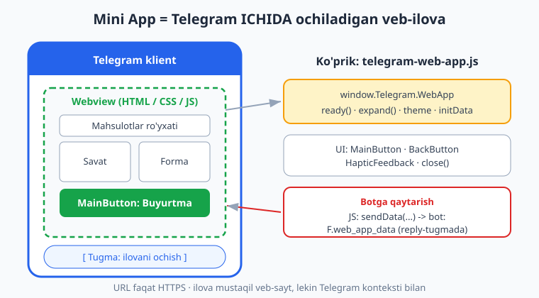
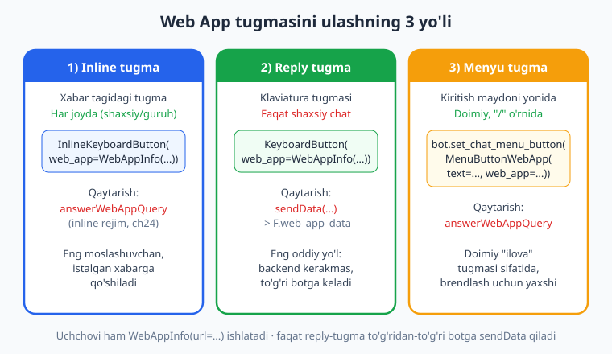
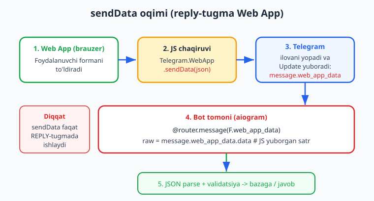

# 23 — Telegram Web App (Mini App) asoslari

[⬅️ Oldingi: 22 — Majburiy obuna](./22-majburiy-obuna.md) · [🏠 README](./README.md) · [Keyingi: 24 — Web App xavfsizligi: initData ➡️](./24-webapp-xavfsizlik.md)

---

> **Bu bobda:** Botni oddiy "tugma-xabar" interfeysidan **to'liq grafik ilovaga** ko'taramiz. **Telegram Web App (Mini App, TWA)** — bu Telegram klienti ICHIDA ochiladigan haqiqiy HTML/CSS/JS sahifa: kalendar, savat, xarita, clicker o'yin — istalgan veb-interfeysni Telegram'ni tark etmasdan ko'rsatasiz. Avval Mini App nima va nega kerakligini ko'ramiz, so'ng `WebAppInfo(url=...)` ni tugmaga ulashning **uch yo'lini** o'rganamiz: inline tugma (`InlineKeyboardButton(web_app=...)`), reply tugma (`KeyboardButton(web_app=...)`) va **menyu tugma** (`bot.set_chat_menu_button(MenuButtonWebApp(...))`). Keyin sahifa tomonida ishlaydigan **`telegram-web-app.js` SDK** bilan tanishamiz (`ready()`, `expand()`, `themeParams`/`colorScheme`, `MainButton`, `BackButton`, `HapticFeedback`, `close()`, `initData`), va eng muhimi — reply-tugmali ilovadan `Telegram.WebApp.sendData(...)` orqali botga ma'lumot **qaytarib**, uni `@router.message(F.web_app_data)` da ushlaymiz. Oxirida minimal frontend HTML/JS namunasini quramiz.
>
> **Halol eslatma (verifikatsiya):** `WebAppInfo` bilan uch xil tugma qurish (`InlineKeyboardBuilder`/`ReplyKeyboardBuilder`/`MenuButtonWebApp`) va hosil bo'lgan tugmada `web_app.url` to'g'ri turgani, `set_chat_menu_button` ning `SetChatMenuButton` metodini yuborgani, hamda `WebAppData(data=...)` li `Update` ni `feed_update` orqali uzatib `F.web_app_data` handler'i ishga tushib `data` ni o'qigani — bularning hammasi **offline** (tokensiz, mock session) tekshirildi (12/12 PASS). Aksincha, Mini App sahifasining Telegram ichida **jonli ochilishi va render bo'lishi**, `themeParams` ning real qurilmadan kelishi, `sendData` ning jonli Telegram orqali botga yetib borishi — bular **illustrativ** (kod to'g'ri, lekin BotFather token + public **HTTPS** hosting + jonli klient talab qiladi). Backend tomonidagi `initData` ni serverda tekshirish (xavfsizlik) keyingi **24-bobda**, to'liq Mini App backend esa **25-bobda**.

---

## 1. Mini App nima va nega kerak

Oldingi boblarda biz xabar, klaviatura, inline-tugma, callback va FSM bilan ishladik (08–09-boblar). Bu vositalar ko'pchilik bot uchun yetarli. Ammo ba'zi interfeyslarni "tugma bosib o'tish" bilan qurib bo'lmaydi:

- mahsulotlar **savati** (qo'shish/o'chirish, son tanlash, jami narx jonli yangilanadi);
- **kalendar** yoki vaqt tanlash;
- **xarita** ustida nuqta belgilash;
- ko'p maydonli **forma**, slayder, rang tanlovchi;
- jonli **clicker / tap-o'yin** (har bosishda balans o'zgaradi).

Bularning hammasi — **veb-sahifa** ishi. Telegram Web App (rasmiy nomi **Mini App**, eski qisqartmasi **TWA**) aynan shuni beradi: siz oddiy veb-ilova yozasiz (HTML + CSS + JS — istalgan freymvork: React, Vue yoki toza JS), uni **HTTPS** manzilga joylashtirasiz, va Telegram uni o'z klienti ichida — alohida brauzer ochmasdan — to'liq ekran webview'da ko'rsatadi.



Mini App'ning bot bilan ikki tomoni bor:

1. **Bot tomoni (Python, aiogram):** ilovani ochadigan **tugmani** yuboradi (`WebAppInfo`), va kerak bo'lsa undan qaytgan ma'lumotni qabul qiladi.
2. **Sahifa tomoni (HTML/JS, brauzerda):** Telegram bergan maxsus `telegram-web-app.js` skripti orqali Telegram bilan "gaplashadi" — mavzu ranglarini oladi, asosiy tugmani boshqaradi, ma'lumot qaytaradi.

> **Mini App ≠ oddiy veb-sayt havolasi.** Agar siz shunchaki `InlineKeyboardButton(url="https://...")` bersangiz, u **tashqi brauzerda** ochiladi va Telegram bilan hech qanday bog'lanishi yo'q. `web_app=WebAppInfo(...)` esa sahifani **Telegram ichida** ochadi va `window.Telegram.WebApp` ko'prigini beradi. Farqi shu yerda.

> **HTTPS — qattiq talab.** Web App URL faqat `https://` bo'lishi shart. `http://` yoki `localhost` ishlamaydi. Lokal ishlab chiqishda `ngrok` yoki `cloudflared` kabi tunnel orqali vaqtinchalik HTTPS manzil oling. Joriy bobda biz `https://my-shop.example.com/app` kabi namuna manzillarni ishlatamiz — siz uni o'z hosting manzilingizga almashtirasiz (deploy bo'yicha [13-bob](./13-webhook-deploy.md) ga qarang).

> Bu bob 01–18 boblardagi poydevorni (handler, Router, `F` magic-filter, `InlineKeyboardBuilder`/`ReplyKeyboardBuilder`, callback) bilasiz deb faraz qiladi. Python asoslarini takrorlash kerak bo'lsa, [Python qo'llanmasiga](../python/README.md) qayting. Web texnologiyalar (HTML/JS) bo'yicha esa minimal namuna beramiz — chuqurroq frontend bilim shart emas.

---

## 2. `WebAppInfo` — ilova manzilini ifodalovchi obyekt

Hamma yo'lning markazida bitta sodda obyekt turadi:

```python
from aiogram.types import WebAppInfo

info = WebAppInfo(url="https://my-shop.example.com/app")
print(info.url)   # https://my-shop.example.com/app
```

`WebAppInfo` ning bor-yo'g'i bitta majburiy maydoni bor — `url`. Bu obyektni keyin tugmaga uch xil joyga "biriktiramiz". Eslab qoling: `WebAppInfo` o'zi hech narsa qilmaydi — u faqat "qaysi sahifa ochilsin" degan ma'lumotni saqlaydi. Ochish mantiqini Telegram klienti tugma bosilganda bajaradi.

---

## 3. Tugmaga ulashning uch yo'li

`WebAppInfo` ni foydalanuvchiga uchta turli joyda ko'rsatish mumkin. Har birining o'z qoidalari va o'z "ma'lumot qaytarish" usuli bor.



| Yo'l | Qayerda | Cheklov | Ma'lumot qaytarish |
|------|---------|---------|--------------------|
| **Inline tugma** | Xabar tagidagi tugma | Har joyda (shaxsiy, guruh, kanal) | `answerWebAppQuery` (inline rejim — 24-bob) |
| **Reply tugma** | Klaviatura tugmasi | **Faqat shaxsiy chat** | `sendData(...)` -> `F.web_app_data` |
| **Menyu tugma** | Kiritish maydoni yonidagi doimiy tugma | Shaxsiy chat | `answerWebAppQuery` |

Eng oddiy "ilova -> bot" aloqasi **reply tugma + `sendData`** orqali bo'ladi (backend kerakmas, ma'lumot to'g'ridan-to'g'ri botingizga keladi). Shuning uchun aynan shu yo'lni quyida to'liq tekshiramiz.

### 3.1. Inline tugma Web App

Har qanday chatda (shaxsiy, guruh) ishlaydi. Xabarga biriktiriladi:

```python
from aiogram import Router
from aiogram.filters import Command
from aiogram.types import Message, WebAppInfo
from aiogram.utils.keyboard import InlineKeyboardBuilder

router = Router()


@router.message(Command("shop"))
async def open_shop(message: Message):
    builder = InlineKeyboardBuilder()
    builder.button(
        text="🛒 Do'konni ochish",
        web_app=WebAppInfo(url="https://my-shop.example.com/app"),
    )
    await message.answer(
        "Mahsulotlarni tanlash uchun ilovani oching:",
        reply_markup=builder.as_markup(),
    )
```

Foydalanuvchi tugmani bosganda ilova Telegram ichida ochiladi. Inline-tugmadan ma'lumotni `sendData` bilan **qaytarib bo'lmaydi** — buning uchun inline rejim (`answerWebAppQuery`) yoki to'g'ridan-to'g'ri backend kerak (24–25-boblar).

### 3.2. Reply tugma Web App

Klaviatura (pastdagi tugmalar) ga biriktiriladi va **faqat shaxsiy chatda** ishlaydi. Bu yagona yo'l bo'lib, undan `sendData` orqali to'g'ridan-to'g'ri botga ma'lumot keladi:

```python
from aiogram.types import Message, WebAppInfo, ReplyKeyboardMarkup
from aiogram.utils.keyboard import ReplyKeyboardBuilder


@router.message(Command("order"))
async def open_order_form(message: Message):
    builder = ReplyKeyboardBuilder()
    builder.button(
        text="📝 Buyurtma formasi",
        web_app=WebAppInfo(url="https://my-shop.example.com/form"),
    )
    await message.answer(
        "Pastdagi tugma orqali formani to'ldiring:",
        reply_markup=builder.as_markup(resize_keyboard=True),
    )
```

### 3.3. Menyu tugma Web App

Kiritish maydoni yonidagi doimiy tugmani ("/" yoki menyu o'rnida) Web App'ga aylantiramiz. Bu — *xabar* emas, balki *bot sozlamasi*, shuning uchun `bot.set_chat_menu_button(...)` orqali o'rnatiladi:

```python
from aiogram import Bot
from aiogram.types import MenuButtonWebApp, MenuButtonDefault, WebAppInfo


async def set_app_menu(bot: Bot, chat_id: int):
    """Berilgan chat uchun doimiy 'ilova' menyu tugmasini o'rnatadi."""
    await bot.set_chat_menu_button(
        chat_id=chat_id,
        menu_button=MenuButtonWebApp(
            text="Do'kon",
            web_app=WebAppInfo(url="https://my-shop.example.com/app"),
        ),
    )


async def reset_menu(bot: Bot, chat_id: int):
    """Menyu tugmasini standart holatga (buyruqlar ro'yxati) qaytaradi."""
    await bot.set_chat_menu_button(
        chat_id=chat_id,
        menu_button=MenuButtonDefault(),
    )
```

> **Maslahat:** `chat_id` ni bermasangiz, menyu tugmasi **barcha** shaxsiy chatlar uchun globally o'rnatiladi. Bitta foydalanuvchiga moslab o'rnatmoqchi bo'lsangiz, `chat_id` ni bering.

> **Offline tekshirilgan:** uchchala usul ham `WebAppInfo` bilan to'g'ri tugma qurdi — inline va reply tugmalarda `btn.web_app.url` aynan berilgan manzilga teng chiqdi; `set_chat_menu_button` esa mock session orqali aynan `SetChatMenuButton` metodini yubordi. **Illustrativ:** tugma bosilganda ilovaning jonli ochilishi Telegram klienti + HTTPS hosting talab qiladi.

---

## 4. Sahifa tomoni: `telegram-web-app.js` SDK

Ilova ochilganda, Telegram sahifaga maxsus ko'prik beradi — `window.Telegram.WebApp` obyekti. Unga kirish uchun HTML'da **rasmiy skript**ni ulaysiz:

```html
<script src="https://telegram.org/js/telegram-web-app.js"></script>
```

> Bu skriptni o'z serveringizda **host qilmang** — har doim `telegram.org` dan ulang, chunki uning ichidagi mantiq Telegram versiyalari bilan sinxron yangilanadi.

Skript ulangandan keyin `const tg = window.Telegram.WebApp;` orqali asosiy interfeysga ega bo'lasiz.



### 4.1. Eng muhim metod va xossalar

| Chaqiruv | Vazifa |
|----------|--------|
| `tg.ready()` | Ilova yuklanib bo'lganini Telegram'ga bildiradi (eng birinchi chaqiriladi) |
| `tg.expand()` | Ilovani to'liq balandlikka yoyadi (default — yarim ekran) |
| `tg.close()` | Ilovani yopadi |
| `tg.themeParams` | Joriy mavzu ranglari (`bg_color`, `text_color`, `button_color`, ...) |
| `tg.colorScheme` | `"light"` yoki `"dark"` |
| `tg.MainButton` | Pastdagi katta tugma (matn, rang, `show()`, `onClick`) |
| `tg.BackButton` | Yuqoridagi "orqaga" tugmasi |
| `tg.HapticFeedback` | Telefon tebranishi (`impactOccurred`, `notificationOccurred`) |
| `tg.initData` | Imzolangan foydalanuvchi ma'lumoti (xom satr — 24-bobda) |
| `tg.initDataUnsafe` | O'sha ma'lumotning parse qilingan, **tekshirilmagan** ko'rinishi |
| `tg.sendData(str)` | Botga satr yuboradi (faqat reply-tugmada) va ilovani yopadi |

> **`initData` — diqqat!** `tg.initDataUnsafe` qulay (tayyor obyekt: `tg.initDataUnsafe.user.id`), lekin nomidagi **"unsafe"** bejiz emas: u tekshirilmagan, foydalanuvchi (yoki hujumchi) uni o'zgartirib yuborishi mumkin. Hech qachon unga *ishonib* foydalanuvchini autentifikatsiya qilmang. Serverda esa **doimo** xom `tg.initData` ni HMAC-imzo bilan tekshirasiz — bu 24-bobning asosiy mavzusi.

### 4.2. Mavzuga moslashish (`themeParams`)

Yaxshi Mini App foydalanuvchining mavzusiga (kunduzgi/tungi) **avtomatik moslashadi**. Telegram CSS o'zgaruvchilarini ham yuboradi, shuning uchun ko'pincha JS'siz, faqat CSS bilan moslash mumkin:

```css
body {
  background: var(--tg-theme-bg-color, #ffffff);
  color: var(--tg-theme-text-color, #000000);
}
.main-btn {
  background: var(--tg-theme-button-color, #2563eb);
  color: var(--tg-theme-button-text-color, #ffffff);
}
```

JS orqali ham o'qish mumkin:

```js
const tg = window.Telegram.WebApp;
console.log(tg.colorScheme);           // "light" yoki "dark"
console.log(tg.themeParams.bg_color);  // masalan "#ffffff"
```

### 4.3. `MainButton` — pastdagi asosiy tugma

Mini App'larda "Tasdiqlash / Buyurtma berish" kabi yakuniy amal odatda alohida HTML tugma emas, balki Telegram bergan **`MainButton`** orqali bo'ladi — u ekran tagiga yopishib turadi va mavzuga mos keladi:

```js
const tg = window.Telegram.WebApp;

tg.MainButton.setText("Buyurtma berish");
tg.MainButton.show();

tg.MainButton.onClick(() => {
  tg.HapticFeedback.impactOccurred("medium");   // yengil tebranish
  const payload = JSON.stringify({ product: "Olma", qty: 3 });
  tg.sendData(payload);   // botga yuboradi va ilovani yopadi
});
```

---

## 5. Ilovadan botga ma'lumot qaytarish: `sendData` -> `F.web_app_data`

Eng oddiy "ilova -> bot" kanali shunday ishlaydi (rasmda 1–5 qadam):

1. Foydalanuvchi **reply-tugma** orqali ochilgan ilovada formani to'ldiradi.
2. JS `tg.sendData(jsonSatr)` ni chaqiradi.
3. Telegram ilovani yopadi va botga maxsus `Update` yuboradi: `message.web_app_data`.
4. Botda `@router.message(F.web_app_data)` handler ishga tushadi.
5. Siz `message.web_app_data.data` (xom satr) ni parse qilib, validatsiya qilib, javob qaytarasiz yoki bazaga yozasiz.

Bot tomoni:

```python
import json
from aiogram import Router, F
from aiogram.types import Message

router = Router()


@router.message(F.web_app_data)
async def on_web_app_data(message: Message):
    raw = message.web_app_data.data              # JS yuborgan satr
    button_text = message.web_app_data.button_text  # qaysi tugmadan kelgani

    try:
        payload = json.loads(raw)
        product = str(payload["product"])
        qty = int(payload["qty"])
        if qty <= 0:
            raise ValueError("qty musbat bo'lishi kerak")
    except (json.JSONDecodeError, KeyError, ValueError, TypeError):
        await message.answer("❌ Ma'lumot noto'g'ri formatda keldi.")
        return

    await message.answer(
        f"✅ Buyurtma qabul qilindi:\n"
        f"Mahsulot: {product}\n"
        f"Soni: {qty}"
    )
```

> **Nega `F.web_app_data`?** `web_app_data` — bu `Message` obyektining maydoni. `F.web_app_data` magic-filter shu maydon **bo'sh emasligini** tekshiradi, ya'ni handler faqat ilovadan kelgan xabarlarda ishga tushadi va oddiy matn xabarlarga **tegmaydi**. Bu xulq offline tekshirildi (pastga qarang).

> **`data` har doim satr.** Telegram bu maydonni *string* sifatida uzatadi — JSON jo'natmoqchi bo'lsangiz, JS'da `JSON.stringify(...)` qiling, Python'da `json.loads(...)` bilan oching. Maksimal uzunlik ~4096 bayt; katta yuk uchun backend'ga to'g'ridan-to'g'ri so'rov yuboring (25-bob).

### Offline tekshiruv — handler routing

`feed_update` bilan haqiqiy `Update` ni Dispatcher'ga uzatib, handler aynan kerakli holatda ishga tushganini tekshiramiz (token shart emas):

```python
import asyncio
from unittest.mock import AsyncMock
from aiogram import Bot, Dispatcher, Router, F
from aiogram.client.default import DefaultBotProperties
from aiogram.enums import ParseMode
from aiogram.types import Update, Message, Chat, User, WebAppData

router = Router()
captured = {}


@router.message(F.web_app_data)
async def on_web_app_data(message: Message):
    captured["data"] = message.web_app_data.data


@router.message()
async def fallback(message: Message):
    captured["fell_through"] = True


def make_webapp_update(payload: str):
    user = User(id=42, is_bot=False, first_name="Olim")
    chat = Chat(id=42, type="private")
    msg = Message(
        message_id=10, date=1_700_000_000, chat=chat, from_user=user,
        web_app_data=WebAppData(data=payload, button_text="Yuborish"),
    )
    return Update(update_id=1, message=msg)


async def main():
    # Fake token + mock session => hech qanday tarmoq chaqiruvi bo'lmaydi
    bot = Bot(token="123456:AAH-Test_abc",
              default=DefaultBotProperties(parse_mode=ParseMode.HTML))
    bot.session = AsyncMock()

    dp = Dispatcher()
    dp.include_router(router)

    await dp.feed_update(bot, make_webapp_update('{"product":"Olma","qty":3}'))
    assert captured.get("data") == '{"product":"Olma","qty":3}'
    assert "fell_through" not in captured          # oddiy matn handler'ga tushmadi
    print("OK — F.web_app_data handler to'g'ri ishladi")


asyncio.run(main())
```

> **Offline tekshirilgan:** `WebAppData(data=...)` li `Update` ni `feed_update` orqali uzatganda `F.web_app_data` handler'i ishga tushib `data` ni o'qidi; oddiy matn xabari esa bu handler'ga **tushmadi**, balki fallback handler'ga bordi. Tugma qurish va menyu-tugma chaqiruvi ham (yuqorida) shu usulda tasdiqlangan. **Illustrativ:** real qurilmadagi ilovadan `sendData` ning jonli Telegram orqali botga yetib borishi va render — bular HTTPS hosting + jonli klient talab qiladi.

---

## 6. Minimal frontend HTML/JS namuna

Quyida to'liq, ishlaydigan minimal Mini App sahifasi. Buni HTTPS manzilga (`index.html` sifatida) joylab, yuqoridagi **reply-tugma** URL'iga ko'rsating. Foydalanuvchi mahsulot va sonni tanlaydi, `MainButton` ni bosadi — ma'lumot botga `sendData` bilan qaytadi.

```html
<!DOCTYPE html>
<html lang="uz">
<head>
  <meta charset="UTF-8">
  <meta name="viewport" content="width=device-width, initial-scale=1.0">
  <title>Buyurtma formasi</title>
  <!-- Rasmiy Telegram SDK: doimo telegram.org dan ulanadi -->
  <script src="https://telegram.org/js/telegram-web-app.js"></script>
  <style>
    body {
      font-family: -apple-system, "Segoe UI", sans-serif;
      margin: 0; padding: 20px;
      background: var(--tg-theme-bg-color, #f8fafc);
      color: var(--tg-theme-text-color, #1e293b);
    }
    h1 { font-size: 20px; }
    label { display: block; margin: 14px 0 6px; }
    select, input {
      width: 100%; padding: 10px; font-size: 16px;
      border: 1px solid #94a3b8; border-radius: 8px;
      box-sizing: border-box;
    }
  </style>
</head>
<body>
  <h1>Buyurtma berish</h1>

  <label for="product">Mahsulot</label>
  <select id="product">
    <option value="Olma">Olma</option>
    <option value="Anor">Anor</option>
    <option value="Uzum">Uzum</option>
  </select>

  <label for="qty">Soni</label>
  <input type="number" id="qty" value="1" min="1">

  <script>
    const tg = window.Telegram.WebApp;

    tg.ready();        // Telegram'ga "tayyorman" deb bildiramiz
    tg.expand();       // to'liq balandlik

    // Asosiy tugmani sozlaymiz
    tg.MainButton.setText("Buyurtma berish");
    tg.MainButton.show();

    tg.MainButton.onClick(() => {
      const product = document.getElementById("product").value;
      const qty = parseInt(document.getElementById("qty").value, 10);

      if (!Number.isInteger(qty) || qty <= 0) {
        tg.HapticFeedback.notificationOccurred("error");
        tg.showAlert("Soni musbat butun son bo'lishi kerak.");
        return;
      }

      tg.HapticFeedback.impactOccurred("medium");
      // JSON satr sifatida botga yuboramiz; sendData ilovani avtomatik yopadi
      tg.sendData(JSON.stringify({ product: product, qty: qty }));
    });
  </script>
</body>
</html>
```

Bu sahifa:

- Telegram mavzusiga moslashadi (`--tg-theme-*` CSS o'zgaruvchilari);
- `tg.ready()` va `tg.expand()` bilan to'g'ri ishga tushadi;
- `MainButton` ni Telegram interfeysida ko'rsatadi;
- noto'g'ri kiritishda `HapticFeedback` + `showAlert` bilan ogohlantiradi;
- to'g'ri bo'lsa JSON ni `sendData` bilan botga jo'natadi.

Bot tomonida esa 5-bo'limdagi `F.web_app_data` handler bu JSON ni qabul qilib, parse va validatsiya qiladi.

> **Eslatma:** bu HTML sahifa **brauzerda** (Telegram webview'da) ishlaydi, botda emas. Uni ishlaydigan ko'rish uchun HTTPS manzilga joylab, reply-tugma orqali ochish kerak — bu qadam **illustrativ** (token + HTTPS hosting + jonli klient talab qiladi).

---

## 7. Keyin nima? (24–25-boblar)

Reply-tugma + `sendData` — eng oson yo'l, lekin uning chegaralari bor: faqat shaxsiy chat, faqat satr, faqat ilova yopilganda. Jiddiyroq ilovalar (savat real vaqtda serverga yozilsin, narx serverda hisoblansin, to'lov bo'lsin) uchun ilova **o'z backend'ingiz** bilan to'g'ridan-to'g'ri (HTTPS) gaplashadi. Va aynan shu yerda eng muhim savol tug'iladi:

> Server ilova yuborgan so'rovning **haqiqatan o'sha foydalanuvchidan** kelganini qanday biladi? Axir clientga ishonib bo'lmaydi-ku?

Javob — **`initData`** va uning HMAC-SHA256 imzosi. Buni **24-bobda** to'liq ochamiz: `aiogram.utils.web_app` dagi `check_webapp_signature(token, init_data)` va `safe_parse_webapp_init_data(token, init_data)`, imzo algoritmi (`data_check_string`, `secret_key = HMAC(b"WebAppData", token)`, `hmac.compare_digest`), va nega serverda doim tekshirish shart. So'ng **25-bobda** to'liq Mini App backend'ini (aiohttp/FastAPI) quramiz — endpoint, `initData` tekshiruvi va clicker o'yin mantig'i bilan.

---

## Mashqlar

### Oson

1. **Inline ilova tugmasi.** `/app` buyrug'iga javoban inline-tugma chiqaring; tugma matni "🚀 Ilovani ochish", `web_app` URL'i `https://example.com/app` bo'lsin. `InlineKeyboardBuilder` ishlating va hosil bo'lgan markup'da `web_app.url` to'g'ri ekanini `assert` bilan tekshiring (offline).

2. **Reply ilova tugmasi.** `/form` buyrug'iga reply-klaviatura chiqaring; bitta `KeyboardButton` ning `web_app` URL'i `https://example.com/form` bo'lsin, `resize_keyboard=True`. `as_markup()` natijasidagi tugmada `web_app.url` ni `assert` qiling.

3. **`F.web_app_data` salomlash.** Ilovadan kelgan har qanday `sendData` ga "Ilovadan keldi: {data}" deb javob beruvchi handler yozing.

4. **`url=` vs `web_app=` farqi.** Bir xil matnli ikki inline-tugma quring: biri `url=` (tashqi brauzer), ikkinchisi `web_app=WebAppInfo(...)` (Telegram ichida). Izohda farqini yozing.

5. **`WebAppInfo` qurish.** Funksiya yozing: u manzil satrini qabul qilib `WebAppInfo` qaytarsin, lekin manzil `https://` bilan boshlanmasa `ValueError` ko'tarsin.

6. **Menyu tugma o'rnatish.** `set_chat_menu_button` orqali `MenuButtonWebApp(text="Do'kon", web_app=...)` ni o'rnatuvchi `async` funksiya yozing.

### O'rta

7. **Menyu tugma yoqish/o'chirish.** Ikki funksiya yozing: `set_app_menu(bot, chat_id)` — `MenuButtonWebApp` o'rnatadi; `reset_menu(bot, chat_id)` — `MenuButtonDefault()` ga qaytaradi. Mock session bilan ikkalasi ham `SetChatMenuButton` metodini yuborganini offline tekshiring.

8. **JSON buyurtma qabul qiluvchi.** `F.web_app_data` handler yozing: kelgan satrni `{"product": "...", "qty": N}` deb parse qilib, `qty` butun va `> 0` ekanini validatsiya qiling; to'g'ri bo'lsa tasdiq, xato bo'lsa tushunarli xabar qaytaring. Parse + validatsiyani offline tekshiring (to'g'ri JSON, buzilgan JSON, `qty=0`, `qty=-1`).

9. **`feed_update` routing testi.** Bitta `WebAppData` li `Update` va bitta oddiy matnli `Update` ni `feed_update` orqali yuboring; birinchisi `F.web_app_data` handlerga, ikkinchisi fallback'ga tushganini `assert` qiling (token mock).

10. **Frontend: MainButton mantig'i.** HTML sahifaga `tg.MainButton` ni shunday sozlang: matn maydoni bo'sh bo'lsa tugma `hide()`, to'lsa `show()` bo'lsin (`input` hodisasiga ulang).

11. **Mavzuga moslash.** Faqat CSS bilan (`--tg-theme-bg-color`, `--tg-theme-text-color`, `--tg-theme-button-color`) kunduzgi/tungi mavzuga moslashadigan sahifa qiling; har bir o'zgaruvchiga zaxira (fallback) qiymat bering.

### Qiyin

12. **To'liq sendData aylanasi (offline).** Bir loyihada: (a) reply-tugma yuboruvchi `/order` handler; (b) `F.web_app_data` handler — JSON parse, validatsiya, "savat" lug'atiga qo'shish; (c) `feed_update` bilan ketma-ket ikkita buyurtma yuborib, savatda ikkala mahsulot to'plangani va noto'g'ri JSON rad etilganini offline tekshirish. `sendData` ning jonli qismini illustrativ deb belgilang.

13. **Uch yo'lni bitta modulda.** Bitta `webapp.py` Router yozing: `/shop` (inline), `/order` (reply), va `on_startup` da menyu tugma. Hamma `WebAppInfo` larni bitta `APP_URL` konstantadan oling. Uch xil markup hosil bo'lib, har birida `web_app.url == APP_URL` ekanini offline tasdiqlang.

14. **Validatsiya qatlamini ajratish.** `parse_order(raw: str) -> dict` sof funksiyasini yozing (`json.loads` + maydon/tip/qiymat tekshiruvi, xato bo'lsa `ValueError`). Uni `F.web_app_data` handler'dan alohida `pytest` bilan to'liq qoplang (to'g'ri, bo'sh, buzilgan JSON, yetishmayotgan maydon, manfiy `qty`). Handler faqat shu funksiyani chaqirsin.

<details markdown="1">
<summary>Yechimlar</summary>

### Oson

**1. Inline ilova tugmasi**

```python
from aiogram import Router
from aiogram.filters import Command
from aiogram.types import Message, WebAppInfo
from aiogram.utils.keyboard import InlineKeyboardBuilder

router = Router()


@router.message(Command("app"))
async def open_app(message: Message):
    builder = InlineKeyboardBuilder()
    builder.button(
        text="🚀 Ilovani ochish",
        web_app=WebAppInfo(url="https://example.com/app"),
    )
    await message.answer("Ilova:", reply_markup=builder.as_markup())


# Offline tekshiruv:
def test_inline():
    builder = InlineKeyboardBuilder()
    builder.button(text="🚀 Ilovani ochish",
                   web_app=WebAppInfo(url="https://example.com/app"))
    markup = builder.as_markup()
    btn = markup.inline_keyboard[0][0]
    assert btn.web_app.url == "https://example.com/app"
```

**2. Reply ilova tugmasi**

```python
from aiogram.types import WebAppInfo
from aiogram.utils.keyboard import ReplyKeyboardBuilder


def build_form_kb():
    builder = ReplyKeyboardBuilder()
    builder.button(text="📝 Forma",
                   web_app=WebAppInfo(url="https://example.com/form"))
    return builder.as_markup(resize_keyboard=True)


markup = build_form_kb()
assert markup.keyboard[0][0].web_app.url == "https://example.com/form"
assert markup.resize_keyboard is True
```

**3. `F.web_app_data` salomlash**

```python
from aiogram import Router, F
from aiogram.types import Message

router = Router()


@router.message(F.web_app_data)
async def echo_web_app(message: Message):
    await message.answer(f"Ilovadan keldi: {message.web_app_data.data}")
```

**4. `url=` vs `web_app=` farqi**

```python
from aiogram.types import WebAppInfo
from aiogram.utils.keyboard import InlineKeyboardBuilder


def two_buttons():
    b = InlineKeyboardBuilder()
    # url= -> TASHQI brauzerda ochiladi, Telegram bilan bog'lanmagan
    b.button(text="Saytni ochish", url="https://example.com/app")
    # web_app= -> TELEGRAM ICHIDA ochiladi, window.Telegram.WebApp ko'prigi bor
    b.button(text="Ilovani ochish",
             web_app=WebAppInfo(url="https://example.com/app"))
    b.adjust(1)
    return b.as_markup()
```

**5. `WebAppInfo` qurish**

```python
from aiogram.types import WebAppInfo


def make_web_app(url: str) -> WebAppInfo:
    if not url.startswith("https://"):
        raise ValueError("Web App URL faqat https:// bo'lishi kerak")
    return WebAppInfo(url=url)


assert make_web_app("https://example.com/app").url == "https://example.com/app"
try:
    make_web_app("http://example.com")
    assert False, "ValueError kutilgan edi"
except ValueError:
    pass
```

**6. Menyu tugma o'rnatish**

```python
from aiogram import Bot
from aiogram.types import MenuButtonWebApp, WebAppInfo


async def set_shop_menu(bot: Bot, chat_id: int):
    await bot.set_chat_menu_button(
        chat_id=chat_id,
        menu_button=MenuButtonWebApp(
            text="Do'kon",
            web_app=WebAppInfo(url="https://example.com/app"),
        ),
    )
```

### O'rta

**7. Menyu tugma yoqish/o'chirish**

```python
import asyncio
from unittest.mock import AsyncMock
from aiogram import Bot
from aiogram.client.default import DefaultBotProperties
from aiogram.enums import ParseMode
from aiogram.types import MenuButtonWebApp, MenuButtonDefault, WebAppInfo

APP_URL = "https://example.com/app"


async def set_app_menu(bot: Bot, chat_id: int):
    await bot.set_chat_menu_button(
        chat_id=chat_id,
        menu_button=MenuButtonWebApp(text="Do'kon",
                                     web_app=WebAppInfo(url=APP_URL)),
    )


async def reset_menu(bot: Bot, chat_id: int):
    await bot.set_chat_menu_button(chat_id=chat_id,
                                   menu_button=MenuButtonDefault())


async def test():
    bot = Bot(token="123456:AAH-Test_abc",
              default=DefaultBotProperties(parse_mode=ParseMode.HTML))
    bot.session = AsyncMock()
    bot.session.return_value = True

    await set_app_menu(bot, 777)
    await reset_menu(bot, 777)

    methods = [c.args[1].__class__.__name__ for c in bot.session.await_args_list]
    assert methods == ["SetChatMenuButton", "SetChatMenuButton"]
    print("OK")


asyncio.run(test())
```

**8. JSON buyurtma qabul qiluvchi**

```python
import json
from aiogram import Router, F
from aiogram.types import Message

router = Router()


def parse_order(raw: str) -> dict:
    data = json.loads(raw)                 # JSONDecodeError mumkin
    product = str(data["product"])         # KeyError mumkin
    qty = int(data["qty"])                 # KeyError / ValueError / TypeError
    if qty <= 0:
        raise ValueError("qty musbat bo'lishi kerak")
    return {"product": product, "qty": qty}


@router.message(F.web_app_data)
async def on_order(message: Message):
    try:
        order = parse_order(message.web_app_data.data)
    except (json.JSONDecodeError, KeyError, ValueError, TypeError):
        await message.answer("❌ Buyurtma noto'g'ri formatda.")
        return
    await message.answer(
        f"✅ {order['product']} x {order['qty']} qabul qilindi"
    )


# Offline tekshiruv:
assert parse_order('{"product":"Olma","qty":3}') == {"product": "Olma", "qty": 3}
for bad in ['buzilgan', '{"product":"Olma"}', '{"product":"Olma","qty":0}',
            '{"product":"Olma","qty":-1}']:
    try:
        parse_order(bad)
        assert False, f"xato kutilgan: {bad}"
    except (json.JSONDecodeError, KeyError, ValueError, TypeError):
        pass
print("parse_order OK")
```

**9. `feed_update` routing testi**

```python
import asyncio
from unittest.mock import AsyncMock
from aiogram import Bot, Dispatcher, Router, F
from aiogram.client.default import DefaultBotProperties
from aiogram.enums import ParseMode
from aiogram.types import Update, Message, Chat, User, WebAppData

router = Router()
seen = {}


@router.message(F.web_app_data)
async def h_webapp(message: Message):
    seen["webapp"] = message.web_app_data.data


@router.message()
async def h_fallback(message: Message):
    seen["fallback"] = message.text


def upd_webapp():
    user = User(id=1, is_bot=False, first_name="A")
    chat = Chat(id=1, type="private")
    msg = Message(message_id=1, date=1_700_000_000, chat=chat, from_user=user,
                  web_app_data=WebAppData(data="payload", button_text="B"))
    return Update(update_id=1, message=msg)


def upd_text():
    user = User(id=1, is_bot=False, first_name="A")
    chat = Chat(id=1, type="private")
    msg = Message(message_id=2, date=1_700_000_000, chat=chat,
                  from_user=user, text="salom")
    return Update(update_id=2, message=msg)


async def test():
    bot = Bot(token="123456:AAH-Test_abc",
              default=DefaultBotProperties(parse_mode=ParseMode.HTML))
    bot.session = AsyncMock()
    dp = Dispatcher()
    dp.include_router(router)

    await dp.feed_update(bot, upd_webapp())
    await dp.feed_update(bot, upd_text())

    assert seen["webapp"] == "payload"
    assert seen["fallback"] == "salom"
    print("routing OK")


asyncio.run(test())
```

**10. Frontend: MainButton mantig'i**

```html
<input type="text" id="name" placeholder="Ismingiz">
<script>
  const tg = window.Telegram.WebApp;
  tg.ready();
  const input = document.getElementById("name");

  function refresh() {
    if (input.value.trim().length > 0) {
      tg.MainButton.setText("Yuborish");
      tg.MainButton.show();
    } else {
      tg.MainButton.hide();
    }
  }
  input.addEventListener("input", refresh);
  refresh();   // boshlang'ich holat

  tg.MainButton.onClick(() => tg.sendData(input.value.trim()));
</script>
```

**11. Mavzuga moslash**

```html
<style>
  body {
    background: var(--tg-theme-bg-color, #f8fafc);
    color: var(--tg-theme-text-color, #1e293b);
    font-family: "Segoe UI", sans-serif;
  }
  .card {
    background: var(--tg-theme-secondary-bg-color, #ffffff);
    border-radius: 12px; padding: 16px;
  }
  .btn {
    background: var(--tg-theme-button-color, #2563eb);
    color: var(--tg-theme-button-text-color, #ffffff);
    border: none; border-radius: 8px; padding: 12px;
  }
</style>
```

### Qiyin

**12. To'liq sendData aylanasi (offline)**

```python
import asyncio
import json
from unittest.mock import AsyncMock
from aiogram import Bot, Dispatcher, Router, F
from aiogram.client.default import DefaultBotProperties
from aiogram.enums import ParseMode
from aiogram.filters import Command
from aiogram.types import (
    Update, Message, Chat, User, WebAppData, WebAppInfo,
)
from aiogram.utils.keyboard import ReplyKeyboardBuilder

router = Router()
cart: list[dict] = []
APP_URL = "https://example.com/form"


@router.message(Command("order"))
async def open_order(message: Message):
    b = ReplyKeyboardBuilder()
    b.button(text="📝 Buyurtma", web_app=WebAppInfo(url=APP_URL))
    await message.answer("Formani oching:",
                         reply_markup=b.as_markup(resize_keyboard=True))


@router.message(F.web_app_data)
async def on_data(message: Message):
    try:
        data = json.loads(message.web_app_data.data)
        item = {"product": str(data["product"]), "qty": int(data["qty"])}
        if item["qty"] <= 0:
            raise ValueError
    except (json.JSONDecodeError, KeyError, ValueError, TypeError):
        await message.answer("❌ Noto'g'ri")
        return
    cart.append(item)
    await message.answer(f"✅ Qo'shildi: {item['product']}")


def webapp_update(uid: int, payload: str):
    user = User(id=uid, is_bot=False, first_name="A")
    chat = Chat(id=uid, type="private")
    msg = Message(message_id=uid, date=1_700_000_000, chat=chat,
                  from_user=user,
                  web_app_data=WebAppData(data=payload, button_text="B"))
    return Update(update_id=uid, message=msg)


async def test():
    bot = Bot(token="123456:AAH-Test_abc",
              default=DefaultBotProperties(parse_mode=ParseMode.HTML))
    bot.session = AsyncMock()
    dp = Dispatcher()
    dp.include_router(router)

    await dp.feed_update(bot, webapp_update(1, '{"product":"Olma","qty":2}'))
    await dp.feed_update(bot, webapp_update(2, '{"product":"Anor","qty":1}'))
    await dp.feed_update(bot, webapp_update(3, 'buzilgan'))   # rad etiladi

    assert [c["product"] for c in cart] == ["Olma", "Anor"]
    assert len(cart) == 2
    print("savat aylanasi OK")


asyncio.run(test())
# Eslatma: sendData ning JONLI qismi (ilova -> Telegram -> bot) illustrativ;
# bu yerda faqat bot tomonidagi mantiq offline tekshirildi.
```

**13. Uch yo'lni bitta modulda**

```python
from aiogram import Bot, Router
from aiogram.filters import Command
from aiogram.types import (
    Message, WebAppInfo, MenuButtonWebApp,
)
from aiogram.utils.keyboard import InlineKeyboardBuilder, ReplyKeyboardBuilder

router = Router()
APP_URL = "https://example.com/app"


@router.message(Command("shop"))
async def shop_inline(message: Message):
    b = InlineKeyboardBuilder()
    b.button(text="🛒 Do'kon", web_app=WebAppInfo(url=APP_URL))
    await message.answer("Inline:", reply_markup=b.as_markup())


@router.message(Command("order"))
async def order_reply(message: Message):
    b = ReplyKeyboardBuilder()
    b.button(text="📝 Buyurtma", web_app=WebAppInfo(url=APP_URL))
    await message.answer("Reply:",
                         reply_markup=b.as_markup(resize_keyboard=True))


async def on_startup(bot: Bot):
    await bot.set_chat_menu_button(
        menu_button=MenuButtonWebApp(text="Do'kon",
                                     web_app=WebAppInfo(url=APP_URL)),
    )


# Offline tasdiq: uch markupda ham web_app.url == APP_URL
def test_all_urls():
    ib = InlineKeyboardBuilder()
    ib.button(text="x", web_app=WebAppInfo(url=APP_URL))
    assert ib.as_markup().inline_keyboard[0][0].web_app.url == APP_URL

    rb = ReplyKeyboardBuilder()
    rb.button(text="x", web_app=WebAppInfo(url=APP_URL))
    assert rb.as_markup().keyboard[0][0].web_app.url == APP_URL

    mb = MenuButtonWebApp(text="x", web_app=WebAppInfo(url=APP_URL))
    assert mb.web_app.url == APP_URL
    print("uch yo'l URL OK")
```

**14. Validatsiya qatlamini ajratish**

```python
# orders.py
import json


def parse_order(raw: str) -> dict:
    """Web App'dan kelgan xom satrni tekshirilgan buyurtmaga aylantiradi.
    Xato bo'lsa ValueError ko'taradi (barcha xatolarni bittaga normalizatsiya)."""
    try:
        data = json.loads(raw)
    except json.JSONDecodeError as e:
        raise ValueError(f"JSON emas: {e}") from e
    if not isinstance(data, dict):
        raise ValueError("obyekt kutilgan")
    if "product" not in data or "qty" not in data:
        raise ValueError("product yoki qty yo'q")
    product = str(data["product"]).strip()
    if not product:
        raise ValueError("product bo'sh")
    try:
        qty = int(data["qty"])
    except (ValueError, TypeError) as e:
        raise ValueError("qty butun son emas") from e
    if qty <= 0:
        raise ValueError("qty musbat bo'lishi kerak")
    return {"product": product, "qty": qty}
```

```python
# test_orders.py  (pytest)
import pytest
from orders import parse_order


def test_valid():
    assert parse_order('{"product":"Olma","qty":3}') == {"product": "Olma", "qty": 3}


@pytest.mark.parametrize("raw", [
    "",                               # bo'sh
    "buzilgan",                       # JSON emas
    "[1,2,3]",                        # obyekt emas
    '{"product":"Olma"}',             # qty yo'q
    '{"qty":2}',                      # product yo'q
    '{"product":"","qty":2}',         # bo'sh product
    '{"product":"Olma","qty":"abc"}', # qty son emas
    '{"product":"Olma","qty":0}',     # qty = 0
    '{"product":"Olma","qty":-5}',    # manfiy
])
def test_invalid(raw):
    with pytest.raises(ValueError):
        parse_order(raw)
```

```python
# handler faqat shu funksiyani chaqiradi:
from aiogram import Router, F
from aiogram.types import Message
from orders import parse_order

router = Router()


@router.message(F.web_app_data)
async def on_web_app_data(message: Message):
    try:
        order = parse_order(message.web_app_data.data)
    except ValueError as e:
        await message.answer(f"❌ {e}")
        return
    await message.answer(f"✅ {order['product']} x {order['qty']}")
```

</details>

---

[⬅️ Oldingi: 22 — Majburiy obuna](./22-majburiy-obuna.md) · [🏠 README](./README.md) · [Keyingi: 24 — Web App xavfsizligi: initData ➡️](./24-webapp-xavfsizlik.md)
