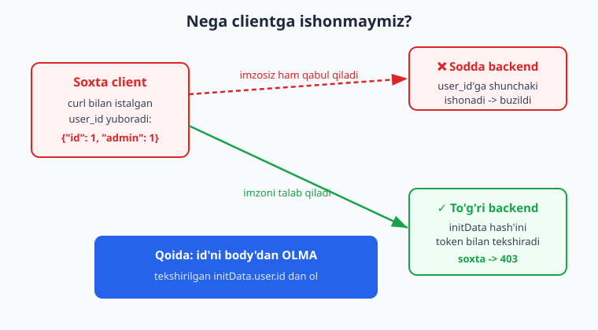
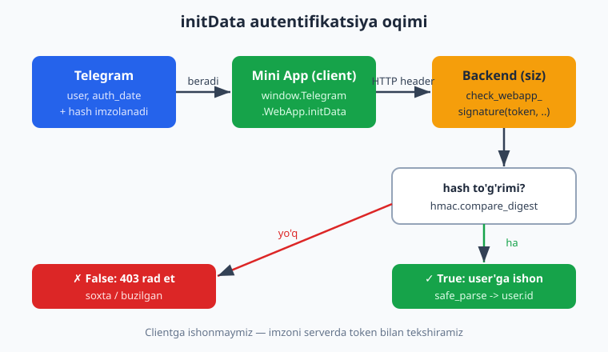
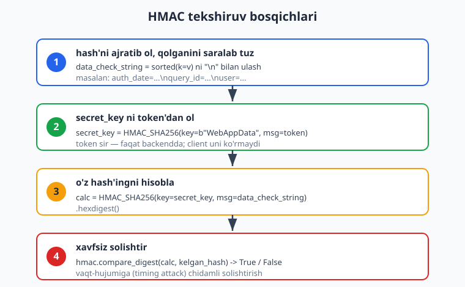

# 24 — Web App xavfsizligi: initData

[⬅️ Oldingi: 23 — Telegram Web App (Mini App) asoslari](./23-webapp-asoslari.md) · [🏠 README](./README.md) · [Keyingi: 25 — Mini App backend ➡️](./25-miniapp-backend.md)

---

> **Bu bobda:** Mini App'ning eng muhim, lekin ko'pincha e'tibordan chetda qoladigan tomoni — **xavfsizlik**ni o'rganamiz. Avval nega **clientga umuman ishonmaslik** kerakligini ko'ramiz: brauzerdan kelgan har qanday "men user 42man" degan da'voni har kim `curl` bilan soxtalashtira oladi. Keyin Telegram bizga shu muammoni yechib beradigan vositani — **`initData`**ni (imzolangan, ishonchli ma'lumot: `user`, `auth_date`, `query_id` va `hash`) tahlil qilamiz. So'ng validatsiya algoritmini bosqichma-bosqich quramiz: `hash`siz maydonlarni saralab `\n` bilan ulab **`data_check_string`**, `secret_key = HMAC_SHA256(b"WebAppData", token)`, `calculated_hash = HMAC_SHA256(secret_key, data_check_string)` va **`hmac.compare_digest`** bilan xavfsiz solishtirish. Replay-hujumga qarshi `auth_date` eskirishini ham tekshiramiz. Bularning hammasini aiogram tayyor beradi — `from aiogram.utils.web_app import check_webapp_signature, safe_parse_webapp_init_data` — lekin biz **avval qo'lda** yozamiz (algoritmni tushunish uchun), keyin tayyor util'ga o'tamiz. Oxirida FastAPI `Depends` orqali real autentifikatsiya qatlami quramiz.
>
> **Halol eslatma:** Bu bobdagi BUTUN validatsiya mantig'i — qo'lda HMAC algoritmi, aiogram'ning `check_webapp_signature`/`safe_parse_webapp_init_data` util'lari, `pytest` testlari va FastAPI `TestClient` auth-endpointi — **soxta token (`123456:AAH-Test_abc`) bilan, internetsiz, HAQIQATAN ishga tushirib tekshirilgan**: to'g'ri imzo qabul qilinadi, bitta belgi buzilsa rad etiladi, noto'g'ri token rad etiladi, eskirgan `auth_date` rad etiladi. RUN qilib bo'lmaydigan yagona qism — *jonli `initData`ni real qurilmadan olish* (Telegram client + HTTPS hosting kerak); u *illustrativ* deb belgilangan, lekin uni tekshiradigan kod aynan shu — to'liq ishlaydi.

---

## 24.1 — Nega clientga ishonmaslik kerak?

01–18 boblarda bot mantig'i serverda ishladi — foydalanuvchi faqat tugma bosdi yoki xabar yubordi. Mini App boshqacha: u **brauzerda** (Telegram ichidagi WebView'da) ishlaydigan oddiy veb-sahifa. Brauzerda ishlaydigan har qanday narsa esa — foydalanuvchining (yoki hujumchining) **to'liq nazoratida**.

Tasavvur qiling, Mini App'ingizda balans bor va frontend backend'ga shunday so'rov yuboradi:

```http
POST /api/balans
Content-Type: application/json

{"user_id": 42, "amal": "ol"}
```

Backend `user_id`ga ishonib, 42-foydalanuvchining balansini qaytaradi. Muammo: bu so'rovni Telegram **shart emas**. Istalgan odam terminaldan yuboradi:

```bash
# Hujumchi o'zini istalgan kim deb tanishtiradi
curl -X POST https://sizning-backend.uz/api/balans \
  -H "Content-Type: application/json" \
  -d '{"user_id": 1, "amal": "ol"}'
```

`user_id: 1` — admin bo'lishi mumkin. Hujumchi hech qanday parol bilmasa ham, boshqa odamning ma'lumotini o'qib/o'zgartirib oladi. **JavaScript'dagi `if (user.is_admin)` tekshiruvi ham himoya emas** — uni brauzer konsolida bir soniyada chetlab o'tish mumkin.



Xulosa — **oltin qoida**:

> Frontend qulaylik uchun. **Har qanday muhim qaror serverda, ishonchli ma'lumot asosida qabul qilinadi.** "Men user 42man" degan da'voni isbotsiz qabul qilmang.

Savol tug'iladi: agar clientga ishonmasak, foydalanuvchi kimligini qayerdan bilamiz? Mana shu yerda Telegram yordamga keladi.

---

## 24.2 — `initData` nima?

Mini App ochilganda Telegram unga maxsus ma'lumotni — **`initData`**ni beradi. Bu URL-kodlangan (query-string ko'rinishidagi) satr, ichida:

| Maydon | Mazmuni |
|---|---|
| `user` | JSON: `{"id": ..., "first_name": ..., "username": ...}` |
| `auth_date` | Mini App ochilgan Unix-vaqt (replay tekshiruvi uchun) |
| `query_id` | Sessiya identifikatori (`answerWebAppQuery` uchun) |
| `chat`, `start_param`, ... | Qo'shimcha kontekst (ixtiyoriy) |
| **`hash`** | **Yuqoridagilarning hammasidan, bot token'i bilan hisoblangan imzo** |

Frontend'da unga shunday murojaat qilinadi (23-bobdagi `window.Telegram.WebApp`):

```js
// Mini App (frontend) — initData'ni backend'ga yuborish
const initData = window.Telegram.WebApp.initData;  // imzolangan satr

fetch("/api/me", {
  headers: { "Authorization": "tma " + initData },  // header orqali yuboramiz
});
```

Eng muhim qism — **`hash`**. Uni faqat Telegram (bot token'ini bilgan holda) hisoblay oladi. Bot token'i esa **faqat sizda va Telegram'da** bor (13-bobda token'ni hech kimga bermaslikni aytgandik). Demak:

- Hujumchi `user`ni o'zgartirsa (masalan `id: 1` qilib), `hash` endi mos kelmaydi — token'siz to'g'ri `hash` hisoblay olmaydi.
- Backend `initData`ni o'z token'i bilan qayta hisoblab, kelgan `hash` bilan solishtiradi. Mos kelsa — bu ma'lumot HAQIQATAN Telegram'dan, buzilmagan.



Bu **simmetrik imzo** (HMAC): bir xil kalit bilan imzolanadi va tekshiriladi. Kalit — bot token'idan keltirib chiqariladi.

---

## 24.3 — Validatsiya algoritmi (qo'lda)

Telegram'ning rasmiy algoritmi ([core.telegram.org/bots/webapps#validating-data](https://core.telegram.org/bots/webapps#validating-data-received-via-the-web-app)) to'rt bosqichdan iborat. Avval uni **qo'lda** yozamiz — faqat standart `hmac` va `hashlib` kerak, hech qanday tashqi kutubxonasiz.



**1-bosqich. `data_check_string`.** `initData`ni lug'atga aylantiramiz, `hash`ni ajratib olamiz, qolgan maydonlarni **kalit bo'yicha saralab**, har birini `key=value` ko'rinishida `\n` bilan ulaymiz:

```python
from urllib.parse import parse_qsl

parsed = dict(parse_qsl(init_data, strict_parsing=True))
received_hash = parsed.pop("hash")  # hash'ni ajratamiz — u tekshiruvga kirmaydi

data_check_string = "\n".join(f"{k}={parsed[k]}" for k in sorted(parsed))
```

Saralash MUHIM — Telegram aynan saralangan tartibda imzolaydi. Tartib buzilsa, `hash` mos kelmaydi.

**2-bosqich. `secret_key`.** Bot token'idan sirli kalit chiqaramiz. Diqqat: bu yerda **kalit** `b"WebAppData"`, **xabar** esa token (boshqa Telegram imzolarida teskari bo'ladi — adashtirmang):

```python
import hmac, hashlib

secret_key = hmac.new(key=b"WebAppData", msg=token.encode(), digestmod=hashlib.sha256).digest()
```

**3-bosqich. `calculated_hash`.** Endi `secret_key`ni kalit qilib, `data_check_string`ni imzolaymiz:

```python
calculated_hash = hmac.new(
    key=secret_key,
    msg=data_check_string.encode(),
    digestmod=hashlib.sha256,
).hexdigest()
```

**4-bosqich. Xavfsiz solishtirish.** Hisoblangan `hash`ni kelgan `hash` bilan solishtiramiz — lekin oddiy `==` bilan emas, **`hmac.compare_digest`** bilan. Bu funksiya **vaqt-hujumiga (timing attack) chidamli**: solishtirish vaqti satrlar qanchalik mos kelishidan qat'i nazar bir xil bo'ladi, shu sababli hujumchi javob tezligidan `hash`ni "taxminlay" olmaydi:

```python
if not hmac.compare_digest(calculated_hash, received_hash):
    raise ValueError("hash mos kelmadi — imzo soxta")
```

**5-bosqich (qo'shimcha, lekin SHART). `auth_date` eskirishini tekshir.** Imzo to'g'ri bo'lsa ham, eski `initData`ni hujumchi qayta yuborishi mumkin (**replay-hujum**). Buning oldini olish uchun `auth_date` juda eski bo'lsa rad etamiz:

```python
import time

auth_date = int(parsed["auth_date"])
if time.time() - auth_date > 86400:  # 24 soatdan eski -> rad et
    raise ValueError("initData eskirgan (replay?)")
```

> **Diqqat:** aiogram'ning `check_webapp_signature` faqat **imzoni** tekshiradi, `auth_date` eskirishini tekshirmaydi. Replay himoyasi — sizning zimmangizda. Buni har doim qo'shing.

To'liq funksiya:

```python
# auth_manual.py — qo'lda validatsiya
import hmac, hashlib, json, time
from urllib.parse import parse_qsl


def validate_init_data(token: str, init_data: str, max_age: int = 86400) -> dict:
    parsed = dict(parse_qsl(init_data, strict_parsing=True))
    received_hash = parsed.pop("hash", None)
    if received_hash is None:
        raise ValueError("hash maydoni yo'q")

    data_check_string = "\n".join(f"{k}={parsed[k]}" for k in sorted(parsed))
    secret_key = hmac.new(b"WebAppData", token.encode(), hashlib.sha256).digest()
    calc = hmac.new(secret_key, data_check_string.encode(), hashlib.sha256).hexdigest()

    if not hmac.compare_digest(calc, received_hash):
        raise ValueError("hash mos kelmadi — imzo soxta")

    auth_date = int(parsed.get("auth_date", "0"))
    if max_age and (time.time() - auth_date) > max_age:
        raise ValueError("initData eskirgan (replay?)")

    user = json.loads(parsed["user"]) if "user" in parsed else None
    return {"user": user, "auth_date": auth_date}
```

---

## 24.4 — TO'LIQ OFFLINE tekshiruv (token+tarmoq KERAKMAS)

Endi eng qiziq qism. Bizda real Telegram qurilmasi yo'q, lekin imzo algoritmini **to'liq** sinashimiz mumkin: o'zimiz soxta token bilan to'g'ri `initData` quramiz, keyin uni tekshiramiz. Bu — *aynan* Telegram qiladigan ishni taqlid qilish.

> Diqqat: quyidagi `build_init_data` funksiyasi FAQAT test uchun — u Telegram'ning imzolovchi tarafini taqlid qiladi. Real backend'ingiz HECH QACHON `initData` qurmaydi; u faqat *keladigan* `initData`ni tekshiradi.

```python
# verify_initdata.py — TO'LIQ OFFLINE, internetsiz
import hmac, hashlib, json, time
from urllib.parse import urlencode, parse_qsl
from auth_manual import validate_init_data

FAKE_TOKEN = "123456:AAH-Test_abc"  # soxta token


def build_init_data(token, user, auth_date, query_id="AAEtest"):
    """Telegram qiladigan IMZOLASH ishini taqlid qilamiz (faqat test uchun)."""
    fields = {
        "query_id": query_id,
        "user": json.dumps(user, separators=(",", ":")),
        "auth_date": str(auth_date),
    }
    dcs = "\n".join(f"{k}={fields[k]}" for k in sorted(fields))
    secret = hmac.new(b"WebAppData", token.encode(), hashlib.sha256).digest()
    fields["hash"] = hmac.new(secret, dcs.encode(), hashlib.sha256).hexdigest()
    return urlencode(fields)


user = {"id": 42, "first_name": "Oqil", "username": "i_oqil"}
now = int(time.time())
init_data = build_init_data(FAKE_TOKEN, user, now)

# 1) to'g'ri initData -> qabul, user'ni qaytaradi
res = validate_init_data(FAKE_TOKEN, init_data)
assert res["user"]["id"] == 42
print("1) to'g'ri initData -> OK, user.id =", res["user"]["id"])

# 2) bitta belgini buzamiz -> rad
bad = init_data[:-1] + ("0" if init_data[-1] != "0" else "1")
try:
    validate_init_data(FAKE_TOKEN, bad)
    raise SystemExit("XATO: buzilgan o'tib ketdi!")
except ValueError as e:
    print("2) buzilgan initData -> rad:", e)

# 3) noto'g'ri token -> rad
try:
    validate_init_data("999999:WRONG_token_xyz", init_data)
    raise SystemExit("XATO: noto'g'ri token o'tdi!")
except ValueError as e:
    print("3) noto'g'ri token -> rad:", e)

# 4) eskirgan auth_date -> rad
old = build_init_data(FAKE_TOKEN, user, now - 90000)  # ~25 soat oldin
try:
    validate_init_data(FAKE_TOKEN, old, max_age=86400)
    raise SystemExit("XATO: eskirgan o'tdi!")
except ValueError as e:
    print("4) eskirgan auth_date -> rad:", e)

print("HAMMA TEST O'TDI (token+internet ishlatilmadi)")
```

Ishga tushiramiz:

```bash
python verify_initdata.py
```

Haqiqiy natija (RUN qilingan):

```text
1) to'g'ri initData -> OK, user.id = 42
2) buzilgan initData -> rad: hash mos kelmadi — imzo soxta
3) noto'g'ri token -> rad: hash mos kelmadi — imzo soxta
4) eskirgan auth_date -> rad: initData eskirgan (replay?)
HAMMA TEST O'TDI (token+internet ishlatilmadi)
```

To'rt holatning to'rttasi ham kutilganidek ishladi: to'g'ri imzo qabul, har qanday o'zgartirish (bir belgi ham!) yoki noto'g'ri token rad, eskirgan `initData` rad. Hujumchi `user`ni o'zgartira olmaydi — chunki token'ni bilmaydi, to'g'ri `hash` hisoblay olmaydi.

---

## 24.5 — aiogram tayyor vositasi

Endi qo'lda yozish shart emas — aiogram'da bu logika tayyor. `aiogram.utils.web_app` ikkita asosiy funksiya beradi:

- **`check_webapp_signature(token, init_data) -> bool`** — imzoni tekshiradi, `True`/`False` qaytaradi.
- **`safe_parse_webapp_init_data(token, init_data) -> WebAppInitData`** — imzoni tekshiradi VA ma'lumotni qulay obyektga aylantiradi; imzo noto'g'ri bo'lsa `ValueError` ko'taradi.

```python
# aiogram util bilan
from aiogram.utils.web_app import check_webapp_signature, safe_parse_webapp_init_data

# faqat bool kerak bo'lsa:
if check_webapp_signature(TOKEN, init_data):
    print("imzo to'g'ri")

# user'ni ham olish kerak bo'lsa (tavsiya etiladi):
data = safe_parse_webapp_init_data(TOKEN, init_data)  # ValueError -> soxta
print(data.user.id, data.user.username, data.auth_date)
```

`safe_parse_webapp_init_data` ichida aynan `check_webapp_signature`ni chaqiradi, keyin ma'lumotni `WebAppInitData` (Pydantic model)ga o'giradi — `data.user` `WebAppUser`, `data.auth_date` esa `datetime` bo'ladi. Bu — productionda ishlatadigan yo'l.

Buni ham OFFLINE tekshiramiz (yuqoridagi `init_data` va `bad` shu yerda ham ishlatiladi):

```python
# verify_aiogram_util.py — OFFLINE
from aiogram.utils.web_app import check_webapp_signature, safe_parse_webapp_init_data
# (init_data, bad, FAKE_TOKEN avvalgidek qurilgan)

assert check_webapp_signature(FAKE_TOKEN, init_data) is True              # to'g'ri
assert check_webapp_signature(FAKE_TOKEN, bad) is False                   # buzilgan
assert check_webapp_signature("999999:WRONG_token_xyz", init_data) is False  # noto'g'ri token

data = safe_parse_webapp_init_data(FAKE_TOKEN, init_data)
assert data.user.id == 42
print("safe_parse user:", data.user.id, data.user.username)

try:
    safe_parse_webapp_init_data(FAKE_TOKEN, bad)
except ValueError as e:
    print("buzilgan -> ValueError:", e)
```

Haqiqiy natija (RUN qilingan):

```text
B1 check_webapp_signature(to'g'ri) -> True
B2 check_webapp_signature(buzilgan) -> False
B3 check_webapp_signature(noto'g'ri token) -> False
B4 safe_parse user.id = 42 username = i_oqil
B5 safe_parse(buzilgan) -> ValueError: Invalid init data signature
```

aiogram'ning natijasi qo'lda yozgan kodimiz bilan **aynan bir xil** — chunki algoritm bitta. Endi qo'lda yozish o'rniga shu util'ni ishlatamiz, lekin ostida nima sodir bo'layotganini bilamiz.

---

## 24.6 — `pytest` bilan avtomatlashtirish

16-bobda o'rgangan `pytest` bilan validatsiyani test paketiga aylantiramiz. Bu — har deploydan oldin avtomatik ishga tushadigan xavfsizlik kafolati.

```python
# test_auth.py
import hmac, hashlib, json, time
from urllib.parse import urlencode
import pytest
from aiogram.utils.web_app import check_webapp_signature, safe_parse_webapp_init_data

TOKEN = "123456:AAH-Test_abc"


def build(token, user, auth_date):
    fields = {"user": json.dumps(user, separators=(",", ":")), "auth_date": str(auth_date)}
    dcs = "\n".join(f"{k}={fields[k]}" for k in sorted(fields))
    secret = hmac.new(b"WebAppData", token.encode(), hashlib.sha256).digest()
    fields["hash"] = hmac.new(secret, dcs.encode(), hashlib.sha256).hexdigest()
    return urlencode(fields)


@pytest.fixture
def valid_init_data():
    return build(TOKEN, {"id": 7, "first_name": "Test"}, int(time.time()))


def test_valid_signature(valid_init_data):
    assert check_webapp_signature(TOKEN, valid_init_data) is True


def test_tampered_rejected(valid_init_data):
    bad = valid_init_data[:-1] + ("0" if valid_init_data[-1] != "0" else "1")
    assert check_webapp_signature(TOKEN, bad) is False


def test_wrong_token_rejected(valid_init_data):
    assert check_webapp_signature("000:WRONG", valid_init_data) is False


def test_safe_parse_user(valid_init_data):
    data = safe_parse_webapp_init_data(TOKEN, valid_init_data)
    assert data.user.id == 7


def test_safe_parse_tampered_raises(valid_init_data):
    bad = valid_init_data.replace("Test", "Hacker")  # user'ni buzamiz -> imzo mos kelmaydi
    with pytest.raises(ValueError):
        safe_parse_webapp_init_data(TOKEN, bad)
```

```bash
python -m pytest test_auth.py -q
```

Haqiqiy natija (RUN qilingan):

```text
.....                                                                    [100%]
5 passed in 3.06s
```

Beshta test ham o'tdi. Diqqat: `test_safe_parse_tampered_raises`da biz `user`dagi ismni o'zgartirdik — imzo darhol "yiqildi". Bu — `initData`ning butunligini (integrity) ta'minlovchi mexanizm.

---

## 24.7 — FastAPI'da autentifikatsiya qatlami

Endi hammasini birlashtiramiz: backend'da har bir himoyalangan endpoint avtomatik `initData`ni tekshiradigan **`Depends`** qatlami quramiz. Bu pattern 25-bobdagi to'liq Mini App backend'ining poydevori bo'ladi.

Frontend `initData`ni `Authorization: tma <initData>` header'ida yuboradi (Telegram tomonidan tavsiya etilgan sxema). Backend'da dependency uni ajratib, tekshiradi:

```python
# app.py — FastAPI auth dependency
from fastapi import FastAPI, Depends, Header, HTTPException
from aiogram.utils.web_app import safe_parse_webapp_init_data, WebAppInitData

TOKEN = "123456:AAH-Test_abc"  # productionda env'dan oling, kodga yozmang!
app = FastAPI()


def auth(authorization: str = Header(default="")) -> WebAppInitData:
    if not authorization.startswith("tma "):
        raise HTTPException(status_code=401, detail="Authorization header yo'q")
    init_data = authorization[4:]
    try:
        return safe_parse_webapp_init_data(TOKEN, init_data)
    except ValueError:
        raise HTTPException(status_code=403, detail="initData soxta")


@app.get("/me")
def me(data: WebAppInitData = Depends(auth)):
    # MUHIM: user.id'ni body'dan EMAS, tekshirilgan initData'dan olamiz
    return {"id": data.user.id, "name": data.user.first_name}
```

`/me` endpointi `user_id`ni so'rovning body'sidan **olmaydi** — uni faqat tekshirilgan `initData`dan oladi. Shuning uchun hujumchi `id`ni o'zgartira olmaydi: `id` imzo ichida, imzoni esa token'siz qayta hisoblab bo'lmaydi.

Buni `TestClient` bilan OFFLINE tekshiramiz — server ishga tushirmaymiz, internetga chiqmaymiz:

```python
# verify_fastapi.py — TestClient bilan OFFLINE
from fastapi.testclient import TestClient
from app import app, TOKEN
# build(...) — yuqoridagidek imzolovchi yordamchi

client = TestClient(app)
init_data = build(TOKEN, {"id": 99, "first_name": "Oqil"}, int(time.time()))

# 1) to'g'ri initData -> 200
r = client.get("/me", headers={"Authorization": f"tma {init_data}"})
assert r.status_code == 200 and r.json()["id"] == 99

# 2) header yo'q -> 401
assert client.get("/me").status_code == 401

# 3) buzilgan initData -> 403
bad = init_data[:-1] + ("0" if init_data[-1] != "0" else "1")
r = client.get("/me", headers={"Authorization": f"tma {bad}"})
assert r.status_code == 403
```

Haqiqiy natija (RUN qilingan):

```text
1) to'g'ri -> 200 {'id': 99, 'name': 'Oqil'}
2) headersiz -> 401
3) buzilgan -> 403
FastAPI auth dependency OFFLINE tekshiruvi O'TDI
```

Uchala holat ham to'g'ri ishladi: to'g'ri imzo bilan `200`, header'siz `401`, buzilgan `initData` bilan `403`. Bu — Mini App backend'ingizning xavfsizlik darvozasi.

> **Jonli qism (illustrativ):** Yuqoridagi kodning hammasi tekshirildi, lekin REAL `initData` faqat Telegram client Mini App'ni ochganda (HTTPS hosting orqali) hosil bo'ladi. Uni real qurilmadan olib, jonli backend'ga yuborib ko'rish — token + public HTTPS hosting talab qiladi. Tekshiradigan kod aynan shu (yuqorida ko'rganimiz) — faqat jonli `initData` manbai farq qiladi.

---

## 24.8 — Amaliy maslahatlar va keng tarqalgan xatolar

- **Token'ni env'dan oling.** Token kodga yozilsa, repo'ga tushadi — bu token'ni oshkor qiladi. `os.environ["BOT_TOKEN"]` ishlating (13-bob).
- **`auth_date`ni tekshiring.** aiogram util buni qilmaydi — replay himoyasi sizdan. 24 soat (yoki sizning ehtiyojingizga ko'ra qisqaroq) muddat qo'ying.
- **`==` emas, `compare_digest`.** Imzolarni solishtirishda doim `hmac.compare_digest` — timing-hujumdan himoya.
- **`user.id`ni faqat tekshirilgan `initData`dan oling.** So'rov body'sidagi `user_id`ga hech qachon ishonmang.
- **HTTPS shart.** `initData` header'da ochiq uzatiladi; HTTP bo'lsa, uni MITM ushlab, `max_age` ichida replay qilishi mumkin. Mini App umuman faqat HTTPS'da ochiladi.
- **Saralashni o'zgartirmang.** `data_check_string` aniq saralangan tartibda bo'lishi shart. Qo'lda yozsangiz `sorted(...)`ni unutmang (yoki shunchaki aiogram util'ini ishlating).
- **`hash`ni log'ga yozmang.** Imzoni log'da saqlash — kerakmas oshkoralik. User `id`/`username`ni log qilish kifoya.

---

## Mashqlar

### Oson

1. `data_check_string` nima va u nima uchun kalit bo'yicha **saralanadi**? Saralash buzilsa nima bo'ladi?
2. Bot token'i nima uchun `initData` xavfsizligining markazida turadi? Agar hujumchi token'ni bilsa, u soxta `initData` qura oladimi?
3. `hmac.compare_digest` oddiy `==` dan nimasi bilan farq qiladi va nega bu farq xavfsizlik uchun muhim?
4. `check_webapp_signature` va `safe_parse_webapp_init_data` orasidagi farqni ayting: qaysi biri qachon ishlatiladi?
5. Frontend'dagi `if (user.is_admin)` tekshiruvi nima uchun **himoya emas**? Hujumchi uni qanday chetlab o'tadi?
6. `secret_key`ni hisoblashda HMAC'ning **kaliti** nima, **xabari** nima? (`b"WebAppData"` va token).

### O'rta

7. `validate_init_data` funksiyasini yozing (24.3'dagidek), so'ng to'g'ri `initData` qurib uni `assert` bilan tasdiqlang. Internetsiz ishga tushiring.
8. `auth_date`ni 25 soat oldingi qilib `initData` quring va `max_age=86400` bilan rad etilishini tekshiring.
9. `initData`ning `user` maydonidagi `id`ni o'zgartiring (imzoni qaytadan hisoblamasdan) va `check_webapp_signature` `False` qaytarishini ko'rsating.
10. `pytest` bilan kamida 3 ta test yozing: to'g'ri imzo (`True`), buzilgan (`False`), noto'g'ri token (`False`).
11. FastAPI `Depends(auth)` endpointini quring, `TestClient` bilan `200`/`401`/`403` holatlarini sinang.
12. `safe_parse_webapp_init_data` qaytargan obyektdan `user.id`, `user.username` va `auth_date` ni chiqaring. `auth_date`ning turi nima?

### Qiyin

13. Replay-hujumni `max_age`dan ham qattiqroq to'sing: tekshirilgan har bir `(user_id, auth_date)` juftligini qisqa muddatga (masalan `set` yoki Redis'da) saqlab, takroran kelgan bir xil `initData`ni rad eting. Buni OFFLINE simulyatsiya qiling.
14. `aiogram.utils.web_app` manbasini o'qing va `check_webapp_signature` ICHKI ishini o'zingiz yozgan `validate_init_data` bilan solishtiring: ikkalasi bir xil natijani berishini bir xil `initData`da `assert` bilan isbotlang.
15. FastAPI o'rniga **aiohttp** (13-bobdagi webhook serveringizga mos) bilan auth-middleware yozing: `initData`ni header'dan oling, tekshiring, `request["user"]`ga qo'ying. `aiohttp.test_utils` bilan OFFLINE sinang.

<details markdown="1"><summary>Yechimlar</summary>

**1.** `data_check_string` — `hash`dan tashqari barcha maydonlarning `key=value` ko'rinishida, **kalit bo'yicha saralangan** holda `\n` bilan ulangan satri. Telegram aynan saralangan tartibda imzolaydi; agar siz boshqa tartibda tuzsangiz, hosil bo'lgan `hash` Telegram'nikiga mos kelmaydi va to'g'ri `initData` ham rad etiladi. Demak saralash — algoritmning majburiy qismi.

**2.** Token — HMAC kalitining manbai (`secret_key = HMAC(b"WebAppData", token)`). Faqat token egasi (siz va Telegram) to'g'ri `hash` hisoblay oladi. **Ha** — agar hujumchi token'ni bilsa, u istalgan `initData`ni o'zi imzolab, soxta `user` yubora oladi. Shuning uchun token'ni sir saqlash — butun tizimning poydevori.

**3.** Oddiy `==` satrlarni belgi-belgi solishtiradi va birinchi farqda darhol to'xtaydi — solishtirish vaqti mosligiga bog'liq bo'ladi. Hujumchi javob vaqtini o'lchab, `hash`ni belgi-belgi "taxminlab" topishi mumkin (timing attack). `hmac.compare_digest` esa doim bir xil vaqtda ishlaydi, shuning uchun vaqtdan ma'lumot "oqib chiqmaydi".

**4.** `check_webapp_signature` faqat `bool` qaytaradi — imzo to'g'ri/noto'g'riligini bilish kifoya bo'lganda. `safe_parse_webapp_init_data` imzoni tekshiradi VA `WebAppInitData` obyektini qaytaradi (soxta bo'lsa `ValueError`) — `user`ni ham ishlatish kerak bo'lganda (deyarli har doim). Productionda odatda `safe_parse_...` ishlatamiz.

**5.** Frontend brauzerda ishlaydi — foydalanuvchi (yoki hujumchi) uning to'liq nazoratchisi. `if (user.is_admin)`ni brauzer konsolida `user.is_admin = true` deb o'zgartirish yoki backend so'rovini `curl` bilan to'g'ridan-to'g'ri yuborish bir soniyalik ish. Himoya faqat serverda, tekshirilgan `initData` asosida bo'lishi mumkin.

**6.** `secret_key = hmac.new(key=b"WebAppData", msg=token, ...)` — bu yerda **kalit** `b"WebAppData"` (doimiy literal), **xabar** esa bot token'i. (Keyingi bosqichda esa kalit `secret_key`, xabar `data_check_string` bo'ladi — joylar almashadi.)

**7.**
```python
import hmac, hashlib, json, time
from urllib.parse import urlencode, parse_qsl

TOKEN = "123456:AAH-Test_abc"

def validate(token, init_data, max_age=86400):
    p = dict(parse_qsl(init_data, strict_parsing=True))
    h = p.pop("hash")
    dcs = "\n".join(f"{k}={p[k]}" for k in sorted(p))
    sk = hmac.new(b"WebAppData", token.encode(), hashlib.sha256).digest()
    calc = hmac.new(sk, dcs.encode(), hashlib.sha256).hexdigest()
    if not hmac.compare_digest(calc, h):
        raise ValueError("soxta")
    if time.time() - int(p["auth_date"]) > max_age:
        raise ValueError("eskirgan")
    return json.loads(p["user"])

def build(token, user, ad):
    f = {"user": json.dumps(user, separators=(",", ":")), "auth_date": str(ad)}
    dcs = "\n".join(f"{k}={f[k]}" for k in sorted(f))
    sk = hmac.new(b"WebAppData", token.encode(), hashlib.sha256).digest()
    f["hash"] = hmac.new(sk, dcs.encode(), hashlib.sha256).hexdigest()
    return urlencode(f)

idata = build(TOKEN, {"id": 5, "first_name": "A"}, int(time.time()))
assert validate(TOKEN, idata)["id"] == 5
print("7-mashq: OK")
```

**8.**
```python
old = build(TOKEN, {"id": 5, "first_name": "A"}, int(time.time()) - 90000)
try:
    validate(TOKEN, old, max_age=86400)
    print("XATO: o'tib ketdi")
except ValueError as e:
    print("8-mashq: rad etildi ->", e)  # -> eskirgan
```

**9.**
```python
from aiogram.utils.web_app import check_webapp_signature
# user ichidagi "id":5 ni "id":1 ga o'zgartiramiz (imzoni qayta hisoblamasdan)
tampered = idata.replace("%22id%22%3A5", "%22id%22%3A1")
assert check_webapp_signature(TOKEN, tampered) is False
print("9-mashq: user buzildi -> False")
```

**10.**
```python
import pytest
from aiogram.utils.web_app import check_webapp_signature

def test_ok():
    assert check_webapp_signature(TOKEN, build(TOKEN, {"id": 1, "first_name": "X"}, int(time.time())))

def test_tampered():
    d = build(TOKEN, {"id": 1, "first_name": "X"}, int(time.time()))
    assert check_webapp_signature(TOKEN, d[:-1] + ("0" if d[-1] != "0" else "1")) is False

def test_wrong_token():
    d = build(TOKEN, {"id": 1, "first_name": "X"}, int(time.time()))
    assert check_webapp_signature("000:WRONG", d) is False
```

**11.**
```python
from fastapi import FastAPI, Depends, Header, HTTPException
from fastapi.testclient import TestClient
from aiogram.utils.web_app import safe_parse_webapp_init_data, WebAppInitData

app = FastAPI()

def auth(authorization: str = Header(default="")) -> WebAppInitData:
    if not authorization.startswith("tma "):
        raise HTTPException(401)
    try:
        return safe_parse_webapp_init_data(TOKEN, authorization[4:])
    except ValueError:
        raise HTTPException(403)

@app.get("/me")
def me(d: WebAppInitData = Depends(auth)):
    return {"id": d.user.id}

c = TestClient(app)
d = build(TOKEN, {"id": 9, "first_name": "X"}, int(time.time()))
assert c.get("/me", headers={"Authorization": f"tma {d}"}).status_code == 200
assert c.get("/me").status_code == 401
assert c.get("/me", headers={"Authorization": f"tma {d[:-1] + '0'}"}).status_code in (403,)
print("11-mashq: 200/401/403 OK")
```

**12.**
```python
from aiogram.utils.web_app import safe_parse_webapp_init_data
data = safe_parse_webapp_init_data(TOKEN, idata)
print(data.user.id, data.user.username, data.auth_date)
print(type(data.auth_date))  # -> <class 'datetime.datetime'>
```
`auth_date` — `datetime` obyekti (aiogram uni Unix-vaqtdan avtomatik o'giradi), `user` esa `WebAppUser`.

**13.** Imzo to'g'ri bo'lsa ham, ko'rilgan `hash`larni vaqtinchalik saqlaymiz; takror kelganini rad etamiz:
```python
seen = {}  # hash -> birinchi ko'rilgan vaqt (Redis ham bo'lishi mumkin, TTL bilan)

def validate_once(token, init_data, max_age=3600):
    p = dict(parse_qsl(init_data, strict_parsing=True))
    h = p["hash"]
    user = validate(token, init_data, max_age)  # 7-mashqdagi imzo+yosh tekshiruvi
    now = time.time()
    # eski yozuvlarni tozalash
    for k in [k for k, t in seen.items() if now - t > max_age]:
        del seen[k]
    if h in seen:
        raise ValueError("replay: bu initData allaqachon ishlatilgan")
    seen[h] = now
    return user

d = build(TOKEN, {"id": 5, "first_name": "A"}, int(time.time()))
validate_once(TOKEN, d)                 # 1-marta: OK
try:
    validate_once(TOKEN, d)             # 2-marta: replay
except ValueError as e:
    print("13-mashq: replay rad etildi ->", e)
```
Eslatma: bu in-memory `dict` faqat bitta process uchun; ko'p-instansli productionda Redis (TTL bilan) ishlating.

**14.**
```python
from aiogram.utils.web_app import check_webapp_signature

def my_check(token, init_data):
    p = dict(parse_qsl(init_data, strict_parsing=True))
    h = p.pop("hash")
    dcs = "\n".join(f"{k}={p[k]}" for k in sorted(p))
    sk = hmac.new(b"WebAppData", token.encode(), hashlib.sha256).digest()
    calc = hmac.new(sk, dcs.encode(), hashlib.sha256).hexdigest()
    return hmac.compare_digest(calc, h)

d = build(TOKEN, {"id": 3, "first_name": "Z"}, int(time.time()))
assert my_check(TOKEN, d) == check_webapp_signature(TOKEN, d) == True
bad = d[:-1] + ("0" if d[-1] != "0" else "1")
assert my_check(TOKEN, bad) == check_webapp_signature(TOKEN, bad) == False
print("14-mashq: qo'lda va aiogram bir xil natija")
```

**15.**
```python
from aiohttp import web
from aiogram.utils.web_app import safe_parse_webapp_init_data

@web.middleware
async def auth_mw(request, handler):
    authz = request.headers.get("Authorization", "")
    if not authz.startswith("tma "):
        return web.json_response({"error": "no auth"}, status=401)
    try:
        request["user"] = safe_parse_webapp_init_data(TOKEN, authz[4:]).user
    except ValueError:
        return web.json_response({"error": "soxta"}, status=403)
    return await handler(request)

async def me(request):
    return web.json_response({"id": request["user"].id})

def make_app():
    app = web.Application(middlewares=[auth_mw])
    app.router.add_get("/me", me)
    return app

# OFFLINE test:
import asyncio
from aiohttp.test_utils import TestClient, TestServer

async def run():
    d = build(TOKEN, {"id": 8, "first_name": "Q"}, int(time.time()))
    async with TestClient(TestServer(make_app())) as client:
        r = await client.get("/me", headers={"Authorization": f"tma {d}"})
        assert r.status == 200 and (await r.json())["id"] == 8
        assert (await client.get("/me")).status == 401
        bad = d[:-1] + ("0" if d[-1] != "0" else "1")
        assert (await client.get("/me", headers={"Authorization": f"tma {bad}"})).status == 403
    print("15-mashq: aiohttp auth-middleware OK")

asyncio.run(run())
```

</details>

---

[⬅️ Oldingi: 23 — Telegram Web App (Mini App) asoslari](./23-webapp-asoslari.md) · [🏠 README](./README.md) · [Keyingi: 25 — Mini App backend ➡️](./25-miniapp-backend.md)
