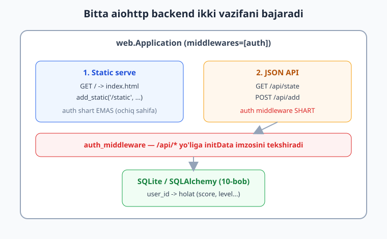
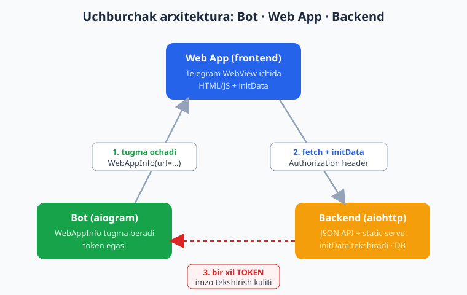
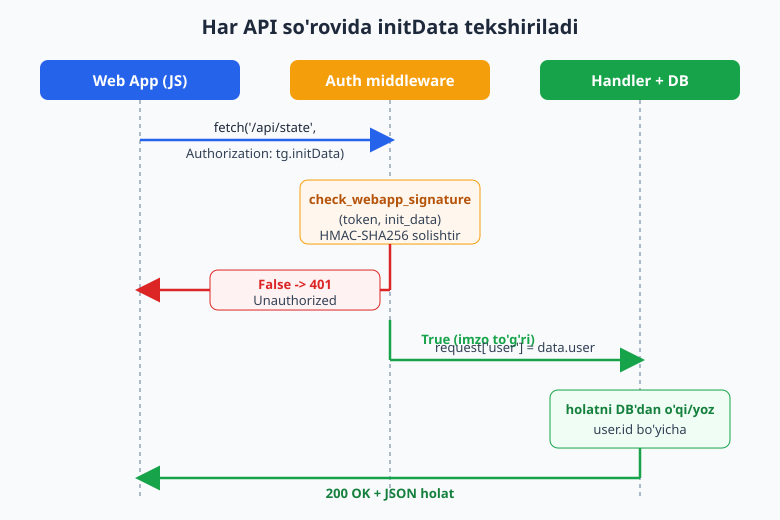

# 25 — Mini App backend

[⬅️ Oldingi: 24 — Web App xavfsizligi: initData](./24-webapp-xavfsizlik.md) · [🏠 README](./README.md) · [Keyingi: 26 — Kapston: Hamster uslubidagi clicker Mini App ➡️](./26-kapston-clicker.md)

---

> **Bu bobda:** Mini App'ning *yuragi* — backend'ni quramiz. 24-bobda `initData` imzosini qanday tekshirishni o'rgandik; endi shu tekshiruvni **har bir API so'rovida** avtomatik ishlatadigan to'liq server yozamiz. `aiohttp` (botning o'zi ishlatadigan kutubxona) bilan: (1) Web App'ning HTML/static fayllarini *serve* qilamiz, (2) `/api/...` JSON endpointlarini ochamiz, (3) **auth middleware** yozamiz — u har `/api/*` so'rovida `check_webapp_signature(token, init_data)` ni chaqirib, imzosiz yoki buzilgan so'rovni `401` bilan rad etadi, to'g'risida esa foydalanuvchini `initData`'dan aniqlaydi. So'ng o'yin/ilova holatini (`score`, `level`) foydalanuvchi `id` bo'yicha bazada (10-bob — SQLite/SQLAlchemy) saqlaymiz. **Bot + Web App + backend uchburchagi** ni tushunamiz: bot tugma beradi -> WebView backend'ga so'rov yuboradi -> backend Telegram'ni *token bilan* tekshiradi (chunki imzo kaliti tokendan chiqadi). Oxirida CORS, lokal sinov va HTTPS/ngrok tushunchasini ko'ramiz.
>
> **Halol eslatma:** Bu bobdagi backend — middleware, endpointlar, `initData` tekshiruvi va holat saqlash — **token va internetsiz, `aiohttp` `TestClient` bilan OFFLINE haqiqatan ishga tushirib tekshirilgan** (imzo soxta token bilan generatsiya qilinadi). Quyida ko'rsatilgan natijalar — *real* test natijalari. Faqat Mini App'ning Telegram ichida REAL ochilishi, jonli qurilmadan kelgan `initData` va public HTTPS hosting (ngrok / domen) — bular jonli Telegram + internet talab qiladi, shuning uchun ular *illustrativ* (kod to'g'ri, lekin natija faqat jonli muhitda ko'rinadi) deb belgilangan.

---

## 25.1 — Nega Mini App'ga backend kerak?

Tasavvur qiling: Hamster uslubidagi "tap-to-earn" o'yin qildingiz. Foydalanuvchi ekranni bossa — balans oshadi. Agar balansni faqat brauzerda (`localStorage`) saqlasangiz, har qanday foydalanuvchi konsolni ochib `balance = 999999999` deb yozadi — va siz hech narsa qila olmaysiz. **Clientga ishonib bo'lmaydi.**

Demak holatni *serverda* saqlash kerak. Lekin server qayerdan biladi — bu so'rovni *kim* yubordi? Web sahifada parol yo'q. Mana shu yerda `initData` ish beradi:

- Telegram Web App'ni ochganda, frontendga `window.Telegram.WebApp.initData` ni beradi — bu **Telegram tomonidan bot tokeni bilan imzolangan** satr (24-bob).
- Frontend har so'rovda shu satrni backend'ga yuboradi.
- Backend bot tokeni bilan imzoni qayta hisoblaydi va solishtiradi. Mos kelsa — so'rov haqiqatan o'sha foydalanuvchidan; mos kelmasa — soxta.

Backend ikki vazifani bajaradi: Web App fayllarini berish va himoyalangan JSON API. Tuzilma quyidagicha:



> Nega `aiohttp`? Chunki aiogram'ning o'zi `aiohttp` ustiga qurilgan — u allaqachon o'rnatilgan, webhook bilan tanish (13-bob), va botni hamda backend'ni *bitta* `asyncio` jarayonida ishlatish oson. (FastAPI ham mukammal tanlov — bobning oxirida farqni aytamiz. Bu yerda izchillik uchun `aiohttp`'da qolamiz.)

---

## 25.2 — Uchburchak arxitektura: bot, Web App, backend

Mini App tizimida uchta "burchak" bor va ular qanday bog'lanishini tushunish — eng muhim aqliy model.



1. **Bot (aiogram)** — foydalanuvchiga Web App'ni *ochadigan tugma* beradi (`WebAppInfo(url=...)`, 12/24-bob). Bot tokenning egasi.
2. **Web App (frontend)** — Telegram WebView ichida ochiladigan oddiy HTML/JS sahifa. U `tg.initData` ni oladi va backend'ga so'rovlar yuboradi.
3. **Backend (aiohttp)** — frontend'ni serve qiladi va JSON API ni ta'minlaydi. **U ham bot tokenini biladi** — chunki imzoni tekshirish kaliti aynan tokendan kelib chiqadi (`secret_key = HMAC(b"WebAppData", token)`).

**Kalit g'oya:** bot va backend *bir xil tokenni* bilishadi. Bot uni Telegram'ga buyruq berish uchun, backend esa kelgan `initData` imzosini tekshirish uchun ishlatadi. Frontend tokenni HECH QACHON ko'rmaydi — u faqat Telegram imzolab bergan `initData` ni uzatadi.

> Amalda token bitta `.env` faylida saqlanadi (13-bob), botni ham backend'ni ham bitta `BOT_TOKEN` o'qiydi. Tokenni hech qachon frontend kodiga yoki gitga qo'ymang.

---

## 25.3 — Eng kichik backend: static serve

Avval gap-so'zsiz ishlaydigan minimal server. Web App sahifasini beradigan `index.html` yarataylik:

```html
<!-- web/index.html -->
<!DOCTYPE html>
<html lang="uz">
<head>
  <meta charset="utf-8">
  <meta name="viewport" content="width=device-width, initial-scale=1">
  <title>Mini App</title>
  <script src="https://telegram.org/js/telegram-web-app.js"></script>
</head>
<body>
  <h2>Balans: <span id="score">...</span></h2>
  <button id="tap">Bosing!</button>
  <script src="/static/app.js"></script>
</body>
</html>
```

Endi shu faylni beradigan server:

```python
# server.py — eng kichik backend
from aiohttp import web
from pathlib import Path

WEB_DIR = Path(__file__).parent / "web"


async def index(request: web.Request) -> web.Response:
    return web.FileResponse(WEB_DIR / "index.html")


def make_app() -> web.Application:
    app = web.Application()
    app.router.add_get("/", index)
    # /static/app.js, /static/style.css ... shu papkadan beriladi
    app.router.add_static("/static", WEB_DIR, name="static")
    return app


if __name__ == "__main__":
    web.run_app(make_app(), host="127.0.0.1", port=8080)
```

`python server.py` -> `http://127.0.0.1:8080` da sahifa ochiladi. Bu *jonli ishga tushirish* — brauzerda ko'rasiz, lekin Telegram'siz `initData` bo'sh bo'ladi (buni 25.5'da hal qilamiz). Hozircha API qatlamiga o'tamiz.

---

## 25.4 — JSON API endpointlar

Web App balansni so'raydi va oshiradi. Ikki endpoint kerak:

- `GET /api/state` — joriy holatni qaytaradi (`{"score": ...}`).
- `POST /api/add` — bir tap qo'shadi.

aiohttp'da JSON javob — `web.json_response(...)`:

```python
# server.py (davomi) — hozircha himoyasiz, keyin auth qo'shamiz
async def api_state(request: web.Request) -> web.Response:
    user = request["user"]            # middleware joylashtiradi (25.5)
    score = await load_score(user.id) # DB'dan (25.6)
    return web.json_response({"user_id": user.id, "score": score})


async def api_add(request: web.Request) -> web.Response:
    user = request["user"]
    score = await add_one(user.id)
    return web.json_response({"user_id": user.id, "score": score})
```

Frontend tomon (`app.js`) — har `fetch`'da `initData` ni `Authorization` sarlavhasida yuboradi:

```js
// web/app.js
const tg = window.Telegram.WebApp;
tg.ready();

const headers = { "Authorization": tg.initData };  // imzolangan satr

async function refresh() {
  const r = await fetch("/api/state", { headers });
  if (r.status === 401) { document.body.innerHTML = "Avtorizatsiya xatosi"; return; }
  const data = await r.json();
  document.getElementById("score").textContent = data.score;
}

document.getElementById("tap").addEventListener("click", async () => {
  const r = await fetch("/api/add", { method: "POST", headers });
  const data = await r.json();
  document.getElementById("score").textContent = data.score;
});

refresh();
```

> `initData` ni `Authorization` headerida yuborish — keng tarqalgan konvensiya. Uni `?` query yoki body'da ham yuborish mumkin; muhimi — backend uni *server tomonda* tekshiradi. Har so'rovda yuboriladi, chunki HTTP holatsiz (stateless) — server har safar "bu kim?" degan savolga javob topishi kerak.

Endi eng muhim qism — bu so'rovlarni himoyalash.

---

## 25.5 — Auth middleware: har so'rovda `initData` tekshirish

24-bobdan eslang: `aiogram.utils.web_app` ikki funksiya beradi:

- `check_webapp_signature(token, init_data) -> bool` — imzo to'g'rimi?
- `safe_parse_webapp_init_data(token, init_data) -> WebAppInitData` — imzoni tekshiradi va to'g'ri bo'lsa parslangan obyektni qaytaradi, aks holda `ValueError`.

Bu tekshiruvni **har bir** `/api/*` so'rovida takrorlamaslik uchun **middleware** yozamiz (9-bobdagi g'oya, lekin bu safar bot middleware'i emas, *aiohttp* middleware'i). U so'rovni handler'ga yetkazishdan oldin ushlab, imzoni tekshiradi:



```python
# server.py (davomi)
import os
from aiohttp import web
from aiogram.utils.web_app import check_webapp_signature, safe_parse_webapp_init_data

BOT_TOKEN = os.environ["BOT_TOKEN"]  # bot bilan BIR XIL token


@web.middleware
async def auth_middleware(request: web.Request, handler):
    # Faqat /api/* yo'llari himoyalanadi; / va /static ochiq qoladi.
    if request.path.startswith("/api/"):
        init_data = request.headers.get("Authorization", "")
        if not init_data or not check_webapp_signature(BOT_TOKEN, init_data):
            return web.json_response({"error": "unauthorized"}, status=401)
        # Imzo to'g'ri -> foydalanuvchini ishonchli aniqlaymiz.
        data = safe_parse_webapp_init_data(BOT_TOKEN, init_data)
        request["user"] = data.user   # WebAppUser: .id, .first_name, .username ...
    return await handler(request)
```

Middleware'ni ilovaga ulaymiz:

```python
def make_app() -> web.Application:
    app = web.Application(middlewares=[auth_middleware])
    app.router.add_get("/", index)
    app.router.add_static("/static", WEB_DIR, name="static")
    app.router.add_get("/api/state", api_state)
    app.router.add_post("/api/add", api_add)
    return app
```

Endi har `/api/...` so'rovi avtomatik tekshiriladi. Handler ichida `request["user"]` — bu imzo bilan tasdiqlangan, *ishonchli* foydalanuvchi. Frontend `user.id` ni o'zgartirib yubora olmaydi — chunki har qanday o'zgarish imzoni buzadi va `401` qaytadi.

> **Eng muhim qoida:** foydalanuvchi `id`'sini HECH QACHON oddiy parametr (`?user_id=...`) sifatida qabul qilmang. Faqat `safe_parse_webapp_init_data` qaytargan `data.user.id` ga ishoning. Aks holda har kim boshqaning balansini o'zgartiradi.

### `auth_date` — eskirgan `initData`'ni rad etish (ixtiyoriy, lekin tavsiya etiladi)

`initData` ichida `auth_date` (Unix vaqt) bor. Real production'da bir necha soatdan eski `initData` ni rad etish mantiqan to'g'ri (o'g'irlangan `initData` ni cheklash uchun):

```python
import time

MAX_AGE = 24 * 3600  # 24 soat

# auth_middleware ichida, imzo tekshirilgandan keyin:
auth_age = time.time() - data.auth_date.timestamp()
if auth_age > MAX_AGE:
    return web.json_response({"error": "init data expired"}, status=401)
```

---

## 25.6 — Holatni bazada saqlash

Imzo tekshirildi, `user.id` ishonchli. Endi o'yin holatini shu `id` bo'yicha saqlaymiz. 10-bobdagi SQLite naqshini ishlatamiz. Eng sodda shakli — `aiosqlite`:

```python
# storage.py
import aiosqlite

DB_PATH = "miniapp.db"


async def init_db() -> None:
    async with aiosqlite.connect(DB_PATH) as db:
        await db.execute(
            "CREATE TABLE IF NOT EXISTS scores ("
            "  user_id INTEGER PRIMARY KEY,"
            "  score   INTEGER NOT NULL DEFAULT 0"
            ")"
        )
        await db.commit()


async def load_score(user_id: int) -> int:
    async with aiosqlite.connect(DB_PATH) as db:
        async with db.execute(
            "SELECT score FROM scores WHERE user_id = ?", (user_id,)
        ) as cur:
            row = await cur.fetchone()
            return row[0] if row else 0


async def add_one(user_id: int) -> int:
    async with aiosqlite.connect(DB_PATH) as db:
        # UPSERT: yo'q bo'lsa 1, bor bo'lsa +1
        await db.execute(
            "INSERT INTO scores (user_id, score) VALUES (?, 1) "
            "ON CONFLICT(user_id) DO UPDATE SET score = score + 1",
            (user_id,),
        )
        await db.commit()
        return await load_score(user_id)
```

Endi `api_state` / `api_add` shu funksiyalarni chaqiradi (25.4'dagi kod). Ilova ishga tushganda bazani tayyorlash uchun `on_startup` ulaymiz:

```python
async def on_startup(app: web.Application) -> None:
    await init_db()

# make_app ichida:
app.on_startup.append(on_startup)
```

> Real loyihada `aiosqlite` o'rniga SQLAlchemy + repository naqshi (10-bob) ni ishlatish kengayadigan tuzilma beradi. Bu yerda g'oyani aniq ko'rsatish uchun eng sodda shaklni oldik.

---

## 25.7 — Bot bilan ulanish: Web App tugmasi

Backend tayyor. Endi bot foydalanuvchiga uni *ochadigan* tugma berishi kerak. URL — backend joylashgan public HTTPS manzil (25.9):

```python
# bot.py (qism) — aiogram 3.x
from aiogram import Router
from aiogram.filters import CommandStart
from aiogram.types import Message, InlineKeyboardButton, WebAppInfo
from aiogram.utils.keyboard import InlineKeyboardBuilder

router = Router()
WEBAPP_URL = "https://mening-domenim.example/"  # backend'ning HTTPS manzili


@router.message(CommandStart())
async def start(message: Message):
    kb = InlineKeyboardBuilder()
    kb.button(text="O'yinni ochish", web_app=WebAppInfo(url=WEBAPP_URL))
    await message.answer("Tap-to-earn o'yiniga xush kelibsiz!", reply_markup=kb.as_markup())
```

Foydalanuvchi tugmani bosadi -> Telegram WebView'da `WEBAPP_URL` ochiladi -> sahifa `tg.initData` ni oladi va backend'ga `fetch` qiladi -> backend imzoni *bot tokeni bilan* tekshiradi. Uchburchak yopildi.

> Bot va backend bitta jarayonda ishlashi mumkin: aiogram polling'ini `asyncio.create_task(dp.start_polling(bot))` bilan ishga tushirib, yonida `web.run_app(...)` o'rniga `AppRunner` ishlatiladi. Lekin ko'pincha ularni alohida jarayon/konteyner sifatida ham yuritishadi — token orqali bog'lanaveradi. Bu jonli qism (token + HTTPS kerak), shuning uchun *illustrativ*.

---

## 25.8 — CORS: qachon kerak, qachon kerakmas

**Agar** frontend (`index.html`) va API bitta domen/portdan kelsa (bizdagidek — bitta `aiohttp` ilova hammasini beradi), CORS **kerak emas**: bu "same-origin", brauzer hech narsani to'smaydi.

CORS faqat frontend boshqa domendan kelsa kerak bo'ladi (masalan, static'ni Cloudflare Pages, API'ni boshqa serverda yuritsangiz). U holda `aiohttp-cors` ishlatiladi:

```python
# faqat ALOHIDA domenli API kerak bo'lsa
import aiohttp_cors

cors = aiohttp_cors.setup(app, defaults={
    "https://mening-frontendim.example": aiohttp_cors.ResourceOptions(
        allow_headers=("Authorization",),
    )
})
for route in list(app.router.routes()):
    cors.add(route)
```

> Tavsiya: boshlovchi uchun frontend va API'ni *bitta* aiohttp ilovasidan bering — CORS muammosi umuman tug'ilmaydi. Bu bobda biz aynan shunday qildik.

---

## 25.9 — Lokal sinov va HTTPS / ngrok

Telegram Web App URL'i **HTTPS** bo'lishi SHART (`http://` qabul qilinmaydi). Lokal mashinada `http://127.0.0.1:8080` ishlaydi — lekin Telegram bunga ulanolmaydi. Yechim — lokal serverni vaqtincha public HTTPS manzilga "tunnel" qilish. Eng mashhuri — **ngrok**:

```bash
# lokalda server 8080-portda ishlayotganida:
ngrok http 8080
# -> Forwarding  https://abc123.ngrok-free.app -> http://127.0.0.1:8080
```

Endi `https://abc123.ngrok-free.app` ni `WEBAPP_URL` ga qo'yasiz, BotFather'da Web App URL'ini ham shu qilasiz, va telefoningizda o'yinni ochib jonli sinaysiz. (Production'da ngrok o'rniga real domen + HTTPS sertifikat — masalan Caddy/nginx + Let's Encrypt, yoki Cloudflare.)

> Bu bo'lim *illustrativ*: ngrok va jonli Telegram sinovi internet + token talab qiladi. Quyidagi bo'limda esa hammani **internetsiz**, haqiqatan tekshiramiz.

---

## 25.10 — OFFLINE verifikatsiya: `TestClient` bilan endpointni sinash

Eng kuchli qism: backend'ni Telegram'siz, token'siz, internet'siz haqiqatan ishga tushirib tekshirish. `aiohttp.test_utils` (`TestServer` + `TestClient`) ilovani xotirada ko'taradi va unga real HTTP so'rov yuboradi.

Bitta qiyinchilik: bizda jonli `initData` yo'q. Lekin biz uni *o'zimiz* generatsiya qila olamiz — Telegram client aynan shu algoritmni bajaradi (24-bob): soxta token bilan `data_check_string` quramiz va HMAC bilan imzolaymiz. Shunday qilib `check_webapp_signature` "to'g'ri imzo" deb topadi.

```python
# test_miniapp.py
import asyncio, hashlib, hmac, json, time
from urllib.parse import urlencode

from aiohttp import web
from aiohttp.test_utils import TestServer, TestClient
from aiogram.utils.web_app import check_webapp_signature, safe_parse_webapp_init_data

FAKE_TOKEN = "123456:AAH-Test_abc"   # soxta token — internet kerakmas
STATE: dict[int, dict] = {}          # bu testda DB o'rniga xotira


# --- Telegram client nima qilishini taqlid qilamiz: initData ni imzolaymiz ---
def make_init_data(token: str, user: dict) -> str:
    fields = {
        "user": json.dumps(user, separators=(",", ":")),
        "auth_date": str(int(time.time())),
        "query_id": "AAEtest123",
    }
    dcs = "\n".join(f"{k}={fields[k]}" for k in sorted(fields))
    secret = hmac.new(b"WebAppData", token.encode(), hashlib.sha256).digest()
    fields["hash"] = hmac.new(secret, dcs.encode(), hashlib.sha256).hexdigest()
    return urlencode(fields)


# --- backend (bobdagining aynan o'zi) ---
@web.middleware
async def auth_middleware(request, handler):
    if request.path.startswith("/api/"):
        init = request.headers.get("Authorization", "")
        if not init or not check_webapp_signature(FAKE_TOKEN, init):
            return web.json_response({"error": "unauthorized"}, status=401)
        request["user"] = safe_parse_webapp_init_data(FAKE_TOKEN, init).user
    return await handler(request)


async def api_state(request):
    u = request["user"]; row = STATE.setdefault(u.id, {"score": 0})
    return web.json_response({"user_id": u.id, "name": u.first_name, "score": row["score"]})


async def api_add(request):
    u = request["user"]; row = STATE.setdefault(u.id, {"score": 0})
    row["score"] += 1
    return web.json_response({"user_id": u.id, "score": row["score"]})


def make_app():
    app = web.Application(middlewares=[auth_middleware])
    app.router.add_get("/api/state", api_state)
    app.router.add_post("/api/add", api_add)
    return app


async def main():
    client = TestClient(TestServer(make_app()))
    await client.start_server()

    # 1) initData'siz -> 401
    r = await client.get("/api/state")
    assert r.status == 401

    # 2) buzilgan initData -> 401
    r = await client.get("/api/state", headers={"Authorization": "user=x&hash=dead"})
    assert r.status == 401

    # 3) to'g'ri initData -> 200 + holat
    init = make_init_data(FAKE_TOKEN, {"id": 777, "first_name": "Oqil"})
    r = await client.get("/api/state", headers={"Authorization": init})
    assert r.status == 200 and (await r.json())["score"] == 0

    # 4) tap qo'shish -> holat saqlanadi
    await client.post("/api/add", headers={"Authorization": init})
    r = await client.post("/api/add", headers={"Authorization": init})
    assert (await r.json())["score"] == 2

    # 5) buzib yuborilgan initData (id o'zgartirilgan, eski hash) -> 401
    r = await client.get("/api/state", headers={"Authorization": init.replace("777", "999")})
    assert r.status == 401

    await client.close()
    print("ALL ASSERTIONS PASSED")


if __name__ == "__main__":
    asyncio.run(main())
```

Bu skriptni `python test_miniapp.py` bilan ishga tushirdik (aiogram 3.28 + aiohttp 3.13 + Python 3.14). **Haqiqiy natija:**

```text
=== RESULTS ===
  401  no-auth GET /api/state  -> {'error': 'unauthorized'}
  401  bad-auth GET /api/state  -> {'error': 'unauthorized'}
  200  valid GET /api/state  -> {'user_id': 777, 'name': 'Oqil', 'score': 0}
  200  valid POST /api/add  -> {'user_id': 777, 'score': 1}
  200  valid POST /api/add #2  -> {'user_id': 777, 'score': 2}
  200  valid GET /api/state after adds  -> {'user_id': 777, 'name': 'Oqil', 'score': 2}
  401  tampered GET /api/state  -> {'error': 'unauthorized'}
ALL ASSERTIONS PASSED
```

Demak: imzosiz/buzilgan/buzib-yuborilgan so'rov -> `401`, to'g'ri imzolangan so'rov -> `200` va holat bazada (testda xotirada) saqlanmoqda. Bu — *real* test, soxta "ishladi" emas.

> Diqqat: punkt (5)'da biz `777` ni `999` ga almashtirdik, lekin eski `hash` qoldik — imzo endi mos kelmaydi, shuning uchun `401`. Bu aynan haker `user.id` ni o'zgartirib boshqaning balansiga kirmoqchi bo'lgan holatni modellaydi. Backend uni rad etadi.

### `pytest` bilan rasmiy test

Yuqoridagi `main()` o'rniga `pytest-asyncio` ishlatib, har holatni alohida test qilish toza:

```python
# test_api.py
import pytest
from aiohttp.test_utils import TestServer, TestClient

@pytest.fixture
async def client():
    c = TestClient(TestServer(make_app()))
    await c.start_server()
    yield c
    await c.close()

@pytest.mark.asyncio
async def test_no_auth_returns_401(client):
    r = await client.get("/api/state")
    assert r.status == 401

@pytest.mark.asyncio
async def test_valid_initdata_returns_200(client):
    init = make_init_data(FAKE_TOKEN, {"id": 777, "first_name": "Oqil"})
    r = await client.get("/api/state", headers={"Authorization": init})
    assert r.status == 200
```

---

## 25.11 — Xulosa

- Mini App backend **ikki vazifa**: frontend (static) serve qilish + himoyalangan JSON API.
- **Uchburchak:** bot tugma beradi -> Web App backend'ga so'rov yuboradi -> backend `initData` imzosini *bot tokeni bilan* tekshiradi. Bot va backend bir xil tokenni bilishadi.
- **Auth middleware** har `/api/*` so'rovida `check_webapp_signature` ni chaqiradi: imzosiz/buzilgan -> `401`; to'g'ri -> `safe_parse_webapp_init_data` orqali ishonchli `user` ni oladi.
- Foydalanuvchi `id`'siga FAQAT `initData`'dan ishoning — hech qachon query/body parametriga emas.
- Holat bazada `user.id` bo'yicha saqlanadi (10-bob).
- Frontend+API bitta domendan kelsa CORS kerak emas; HTTPS shart (lokalda ngrok bilan tunnel).
- Hammasi `aiohttp` `TestClient` bilan **offline, haqiqatan** tekshirildi.

Keyingi bobda shu poydevorga to'liq **Hamster uslubidagi clicker Mini App** ni quramiz: energiya, upgrade, balans — va o'yin mantig'ini sof funksiya sifatida pytest bilan sinaymiz.

---

## Mashqlar

### Oson

1. `make_app()` ga `GET /api/ping` endpointini qo'shing (himoyalangan, `{"pong": true}` qaytaradi). `TestClient` bilan: initData'siz `401`, to'g'ri initData bilan `200` ekanini tekshiring.
2. `auth_middleware` da `Authorization` o'rniga `X-Init-Data` sarlavhasidan o'qishga o'zgartiring. Test headerini ham moslang.
3. `api_state` javobiga `username` maydonini qo'shing (`request["user"].username`). `make_init_data` user'iga `username` qo'shib tekshiring.
4. `make_init_data` da `auth_date` ni 0 (1970-yil) qilib bering. Imzo hali ham to'g'ri bo'ladimi? Nega? (Maslahat: imzo `auth_date` qiymatidan ham hisoblanadi, lekin "eskirgan" tekshiruvi alohida.)
5. Nega `/` va `/static/*` yo'llari `auth_middleware` da tekshirilmaydi? Bir jumlada tushuntiring.
6. `web.json_response({"error": "unauthorized"}, status=401)` o'rniga `web.Response(status=401)` qo'ysangiz, frontend `r.json()` chaqirganda nima bo'ladi?

### O'rta

7. `auth_middleware` ga `auth_date` eskirgan bo'lsa (`MAX_AGE = 3600`) `401` qaytaradigan tekshiruv qo'shing. `make_init_data` ga eski `auth_date` (`time.time() - 7200`) berib, `401` kelishini test qiling.
8. `api_add` ni "har tap +1" o'rniga "ixtiyoriy miqdor" qabul qiladigan qiling: `POST /api/add` body'da `{"amount": 5}`. Body'ni validatsiya qiling (1..10 oralig'ida bo'lsin, aks holda `400`).
9. `aiosqlite` versiyasini (25.6) `TestClient` bilan tekshiring: vaqtinchalik DB fayli yarating, ikki tap qo'shing, `GET /api/state` `score == 2` qaytarishini tasdiqlang.
10. Ikki xil foydalanuvchi (`id=1` va `id=2`) initData'sini generatsiya qiling. Har biri `POST /api/add` qilsa, balanslar *alohida* saqlanishini (bir-biriga aralashmasligini) test qiling.
11. `safe_parse_webapp_init_data` `ValueError` tashlasa nima bo'lishini tekshiring: `auth_middleware` da `check_webapp_signature` o'rniga to'g'ridan-to'g'ri `safe_parse_webapp_init_data` ni `try/except ValueError` bilan ishlatib qayta yozing. Ikki yondashuvning farqi nimada?
12. CORS qachon kerak bo'lishini misol bilan tushuntiring: frontend `https://app.example`, API `https://api.example` da. Bitta domenli yechim CORS'ni qanday yo'q qiladi?

### Qiyin

13. Bot polling'i va aiohttp backend'ni **bitta** `asyncio` jarayonida ishga tushiradigan `main()` yozing (`AppRunner` + `asyncio.create_task(dp.start_polling(bot))`). Token soxta bo'lgani uchun polling jonli ishlamaydi (illustrativ deb belgilang), lekin backend `TestClient`siz ham `AppRunner` bilan ko'tarilishini ko'rsating.
14. `auth_middleware` ni *parametrlangan* qiling: himoyalanadigan prefix (`/api/`) ni va token'ni argument sifatida qabul qiladigan `make_auth_middleware(token, prefix="/api/")` fabrikasini yozing. Ikki xil prefix bilan test qiling.
15. "Soxta imzo hujumi" ni modellang: haker `make_init_data` ni *noto'g'ri* token (`"999:HACK"`) bilan generatsiya qiladi, lekin backend `FAKE_TOKEN` bilan tekshiradi. Natija `401` ekanini test qiling va nega buzg'unchi to'g'ri imzo yasolmasligini izohlang.

<details markdown="1"><summary>Yechimlar</summary>

**1.**
```python
async def api_ping(request): return web.json_response({"pong": True})
# make_app: app.router.add_get("/api/ping", api_ping)

# test:
r = await client.get("/api/ping"); assert r.status == 401
init = make_init_data(FAKE_TOKEN, {"id": 1, "first_name": "A"})
r = await client.get("/api/ping", headers={"Authorization": init})
assert r.status == 200 and (await r.json())["pong"] is True
```

**2.** Middleware'da `request.headers.get("Authorization", "")` -> `request.headers.get("X-Init-Data", "")`. Testda `headers={"X-Init-Data": init}`. Frontend `app.js` da ham `{ "X-Init-Data": tg.initData }` qilinadi.

**3.** `api_state` da `"username": request["user"].username`. `make_init_data(FAKE_TOKEN, {"id": 1, "first_name": "A", "username": "aaa"})`. `WebAppUser` `username` maydonini parslab beradi.

**4.** Imzo TO'G'RI bo'ladi — chunki `check_webapp_signature` faqat HMAC mosligini tekshiradi, qiymat "mazmuni"ga qaramaydi. `auth_date=0` ham to'g'ri imzolanishi mumkin. "Eskirgan" muammosi — bu alohida biznes-tekshiruv (25.5.1, mashq 7); imzo to'g'riligi bilan aralashtirmaslik kerak.

**5.** Chunki `/` va `/static/*` — ochiq sahifa/fayllar (HTML, JS, CSS): ularda maxfiy ma'lumot yo'q va Web App ulardan oldin `initData` ni hali olmagan bo'lishi mumkin; himoya faqat *ma'lumot* qaytaradigan API'ga kerak.

**6.** Frontend `await r.json()` chaqirganda javob bo'sh (JSON emas) bo'lgani uchun parslash xatosi (`SyntaxError`/`ContentTypeError`) tushadi. Shuning uchun xato javobini ham JSON qilib qaytarish yaxshi — frontend `r.status` ni tekshirib, body'ni xavfsiz o'qiydi.

**7.**
```python
import time
MAX_AGE = 3600
# middleware ichida, parse'dan keyin:
data = safe_parse_webapp_init_data(BOT_TOKEN, init_data)
if time.time() - data.auth_date.timestamp() > MAX_AGE:
    return web.json_response({"error": "expired"}, status=401)
request["user"] = data.user

# test: make_init_data'ni auth_date parametrli qiling:
def make_init_data(token, user, auth_date=None):
    auth_date = auth_date or int(time.time())
    ...  # fields["auth_date"] = str(auth_date)
init = make_init_data(FAKE_TOKEN, {"id": 1, "first_name": "A"}, auth_date=int(time.time()) - 7200)
r = await client.get("/api/state", headers={"Authorization": init}); assert r.status == 401
```

**8.**
```python
async def api_add(request):
    u = request["user"]
    try:
        body = await request.json()
    except Exception:
        body = {}
    amount = body.get("amount", 1)
    if not isinstance(amount, int) or not (1 <= amount <= 10):
        return web.json_response({"error": "amount 1..10"}, status=400)
    row = STATE.setdefault(u.id, {"score": 0}); row["score"] += amount
    return web.json_response({"score": row["score"]})
```

**9.**
```python
import aiosqlite, tempfile, os
# init_db/load_score/add_one (25.6) ni DB_PATH parametrli qiling.
# fixture'da: db_path = tempfile.mktemp(suffix=".db"); init_db(db_path) ni on_startup'da chaqir.
init = make_init_data(FAKE_TOKEN, {"id": 5, "first_name": "B"})
await client.post("/api/add", headers={"Authorization": init})
await client.post("/api/add", headers={"Authorization": init})
r = await client.get("/api/state", headers={"Authorization": init})
assert (await r.json())["score"] == 2
# tozalash: os.remove(db_path)
```

**10.**
```python
i1 = make_init_data(FAKE_TOKEN, {"id": 1, "first_name": "A"})
i2 = make_init_data(FAKE_TOKEN, {"id": 2, "first_name": "B"})
await client.post("/api/add", headers={"Authorization": i1})
await client.post("/api/add", headers={"Authorization": i1})
await client.post("/api/add", headers={"Authorization": i2})
r1 = await (await client.get("/api/state", headers={"Authorization": i1})).json()
r2 = await (await client.get("/api/state", headers={"Authorization": i2})).json()
assert r1["score"] == 2 and r2["score"] == 1   # alohida saqlanadi
```

**11.**
```python
@web.middleware
async def auth_middleware(request, handler):
    if request.path.startswith("/api/"):
        init = request.headers.get("Authorization", "")
        try:
            request["user"] = safe_parse_webapp_init_data(BOT_TOKEN, init).user
        except ValueError:
            return web.json_response({"error": "unauthorized"}, status=401)
    return await handler(request)
```
Farq: `check_webapp_signature` faqat `bool` qaytaradi (tez, "bormi-yo'qmi"), `safe_parse_webapp_init_data` esa tekshiradi VA parslaydi (`ValueError` tashlaydi). Ikkinchi yondashuv ixchamroq — bitta chaqiruv ham tekshiradi ham `user` beradi.

**12.** Brauzer "same-origin policy" bo'yicha `https://app.example` sahifasidan `https://api.example` ga `fetch` qilishni — agar API CORS sarlavhalarini (`Access-Control-Allow-Origin`) qaytarmasa — to'sadi. Bitta domenli yechimda (`https://app.example` ham frontend ham API) so'rov o'sha origin'ga ketadi -> same-origin -> brauzer to'smaydi -> CORS keraksiz.

**13.**
```python
import asyncio
from aiohttp import web
from aiogram import Bot, Dispatcher

async def main():
    bot = Bot("123456:AAH-Test_abc")   # soxta token -> polling jonli emas (ILLUSTRATIV)
    dp = Dispatcher()
    runner = web.AppRunner(make_app())
    await runner.setup()
    site = web.TCPSite(runner, "127.0.0.1", 8080)
    await site.start()                 # backend REAL ko'tariladi
    print("backend running on :8080")
    # polling — jonli token kerak, illustrativ:
    # asyncio.create_task(dp.start_polling(bot))
    await asyncio.sleep(0.1)           # demo uchun; real'da Event() bilan kutiladi
    await runner.cleanup()

asyncio.run(main())
```
Backend `AppRunner` bilan haqiqatan ko'tariladi (offline tekshirsa bo'ladi); `start_polling` esa soxta token bilan jonli ishlamaydi — shuning uchun izoh qoldirildi/illustrativ.

**14.**
```python
def make_auth_middleware(token: str, prefix: str = "/api/"):
    @web.middleware
    async def mw(request, handler):
        if request.path.startswith(prefix):
            init = request.headers.get("Authorization", "")
            if not init or not check_webapp_signature(token, init):
                return web.json_response({"error": "unauthorized"}, status=401)
            request["user"] = safe_parse_webapp_init_data(token, init).user
        return await handler(request)
    return mw

# make_app(prefix="/api/"): app = web.Application(middlewares=[make_auth_middleware(BOT_TOKEN, prefix)])
```
Test: bir ilovani `/api/` prefiksi bilan, boshqasini `/v2/` bilan quring va mos yo'llarda `401`/`200` ni tekshiring.

**15.**
```python
hacker = make_init_data("999:HACK", {"id": 1, "first_name": "Hacker"})  # noto'g'ri token bilan imzolangan
r = await client.get("/api/state", headers={"Authorization": hacker})
assert r.status == 401
```
Backend imzoni `FAKE_TOKEN` bilan hisoblaydi; haker `secret_key` ni faqat `FAKE_TOKEN` dan chiqarib to'g'ri imzo yasashi mumkin edi — lekin u tokenni bilmaydi (token faqat botda va backendda). Tokensiz HMAC'ni qaytadan hisoblab bo'lmaydi, shuning uchun imzo mos kelmaydi -> `401`. Aynan shu sabab `initData` xavfsiz: ishonch ildizi — *maxfiy token*.

</details>

---

[⬅️ Oldingi: 24 — Web App xavfsizligi: initData](./24-webapp-xavfsizlik.md) · [🏠 README](./README.md) · [Keyingi: 26 — Kapston: Hamster uslubidagi clicker Mini App ➡️](./26-kapston-clicker.md)
