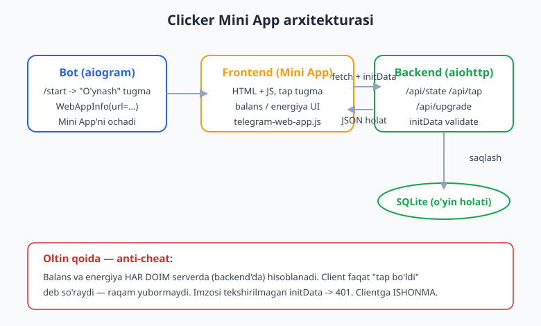
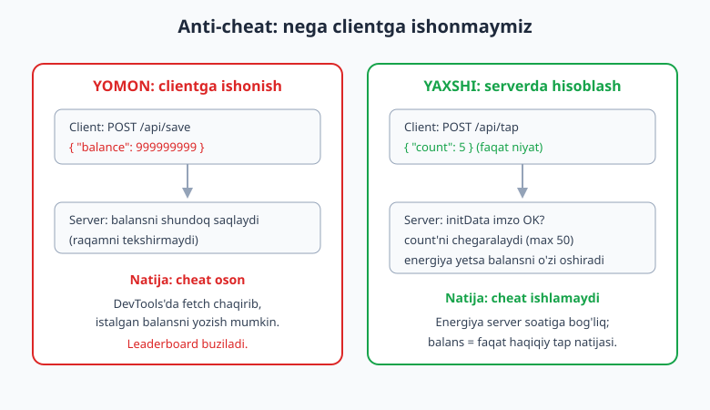
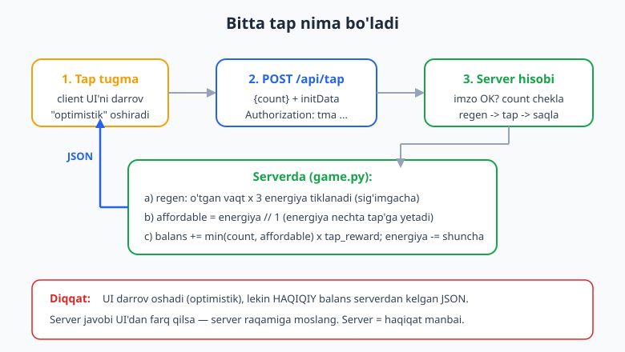

# 26 — Kapston: Hamster uslubidagi clicker Mini App

[⬅️ Oldingi: 25 — Mini App backend](./25-miniapp-backend.md) · [🏠 README](./README.md) · [Keyingi: README ➡️](./README.md)

---

> **Bu bobda:** Hamster Kombat uslubidagi **tap-to-earn** (bos va daromad ol) Mini App'ni boshidan oxirigacha quramiz — bu bob 23-25 boblarni bitta to'liq mahsulotda birlashtiradi. **Bot** `/start` da "🎮 O'ynash" web_app tugmasini chiqaradi va Mini App'ni ochadi. **Frontend** (HTML + JS, `telegram-web-app.js`) tap tugma, energiya ko'rsatkichi, upgrade do'koni, leaderboard, referal va kunlik mukofotni chizadi hamda `Telegram.WebApp.initData` ni har so'rovda backend'ga yuboradi. **Backend** (aiohttp) `initData` ni HAR DOIM serverda tekshiradi (24-bob), o'yin holatini DB'da saqlaydi va eng muhimi — **anti-cheat**: balans va energiya SERVERDA hisoblanadi, clientga ISHONMAYDI. Endpointlar: `/api/state`, `/api/tap`, `/api/upgrade`. Oxirida loyiha tuzilishi, deploy yo'riqnomasi va keyingi qadamlar.
>
> **Halol eslatma:** bu bobdagi **o'yin mantig'i** (`game.py` — tap/energiya/regen/upgrade, sof funksiyalar), **backend endpointlar** (aiohttp `/api/state`, `/api/tap`, `/api/upgrade`), `initData` imzo tekshiruvi va **anti-cheat** mantig'i **token va internetsiz, offline ishga tushirib tekshirilgan** — `pytest` o'yin mantig'i uchun va `aiohttp` `TestClient` endpointlar uchun (jami **17 test, hammasi yashil**). Faqat botni jonli ishga tushirish, Mini App'ning Telegram ichida REAL ochilishi/renderlanishi, jonli `initData` (real qurilmadan) va public **HTTPS hosting** — bular `@BotFather` token, qurilma va domen talab qiladi; ularni "illustrativ" deb belgilaymiz va soxta "ishladi" deb yozmaymiz.

---

## Nima quramiz: TapCoin

**TapCoin** — Hamster Kombat ruhidagi soddalashtirilgan clicker. O'yinchi tugmani bosadi, har bosishda **tanga** oladi, lekin har bosish **energiya** sarflaydi. Energiya vaqt bilan o'zi tiklanadi, shu sababli cheksiz bosib bo'lmaydi. Yig'ilgan tangaga **upgrade** sotib oladi: tap mukofotini oshirish, energiya sig'imini kengaytirish yoki **passiv daromad** (siz o'ynamasangiz ham soatiga tanga). Bu kichik bir tsikl, lekin haqiqiy ilovaning hamma muammosini o'z ichiga oladi: avtorizatsiya, server-haqiqat, vaqtga bog'liq holat va aldovga qarshilik.

O'yinchi tajribasi shunday ko'rinadi (illustrativ — jonli botda token + HTTPS hosting kerak):

```text
Foydalanuvchi: /start
Bot: TapCoin'ga xush kelibsiz! Tugmani bosing va tanga yig'ing. [🎮 O'ynash]

(Mini App ochiladi — Telegram ichida HTML sahifa)
  Balans: 0    Energiya: 1000/1000
  [   TAP   ]   <- bosilganda balans oshadi, energiya kamayadi
  Do'kon: [Multitap 256] [Energiya 512] [Daromad 1024]
```

Tizim uch qismdan iborat, ular bir uchburchak hosil qiladi — bot foydalanuvchini Mini App'ga uzatadi, Mini App backend bilan gaplashadi, backend holatni DB'da saqlaydi:



Loyiha tuzilishi 11-bobdagi modulli naqshga amal qiladi:

```text
tapcoin/
├── .env                 # BOT_TOKEN, WEBAPP_URL (git ga KIRMAYDI)
├── .env.example
├── requirements.txt
├── game.py              # SOF o'yin mantig'i (tap/energiya/upgrade) — DB/tarmoqsiz
├── server.py            # aiohttp backend: /api/state, /api/tap, /api/upgrade
├── bot.py               # aiogram bot: /start -> web_app tugma
├── webapp/
│   └── index.html       # frontend (HTML + JS + telegram-web-app.js)
├── test_game.py         # o'yin mantig'i testlari (pytest)
└── test_server.py       # endpoint testlari (aiohttp TestClient)
```

> Paket/modul tuzilishi xira bo'lsa [Python qo'llanmasi](../python/README.md) ga, DB qatlami (sqlite) uchun [SQL qo'llanmasi](../sql/README.md) ga, deploy uchun [Git/GitHub qo'llanmasi](../git-github/README.md) ga qarang.

---

## 1. Eng muhim qaror: server — haqiqat manbai

Clicker o'yinida birinchi xato shu: balansni clientda (brauzerdagi JS'da) saqlash va serverga "mening balansim 5000" deb yuborish. Bu **falokat**. Mini App — bu oddiy veb-sahifa; foydalanuvchi brauzer DevTools'ini ochib, `fetch("/api/save", {body: '{"balance": 999999999}'})` deb istalgan raqamni yuborishi mumkin. Agar server bu raqamni shundoq ishonsa, leaderboard bir kunda buziladi.



Shuning uchun **oltin qoida**: balans va energiya **faqat serverda** hisoblanadi. Client serverga raqam yubormaydi — u faqat **niyat** yuboradi: "men tap qildim", "men multitap sotib olmoqchiman". Server o'zi qaror qabul qiladi: energiya yetadimi, balans yetadimi, qancha tanga qo'shish kerak. Client UI'ni darrov yangilashi mumkin (tezkor his uchun), lekin **haqiqiy** raqam har doim serverdan kelgan javob.

Buni amalga oshirish uchun o'yin mantig'ini **sof funksiyalar** sifatida ajratamiz — DB'siz, tarmoqsiz, hatto `time.time()` ni ham o'zi chaqirmaydigan. Vaqtni HAR DOIM tashqaridan beramiz. Shunda mantiq:

- **deterministik** bo'ladi — bir xil kirish bir xil natija beradi;
- **test qilish oson** — soatni "soxtalashtirib", energiya 10 sekundda qancha tiklanishini aniq tekshira olamiz;
- backend bu funksiyalarni chaqiradi, frontend esa hech qachon ularni ko'rmaydi.

---

## 2. O'yin mantig'i: `game.py` (sof funksiyalar)

Bu fayl — o'yinning yuragi. Hech bir funksiya tarmoq yoki DB'ga tegmaydi; holat oddiy `dict`, vaqt esa argument (`now`). Shu sababli uni pytest bilan to'liq tekshira olamiz.

```python
# game.py
"""Clicker o'yin mantig'i — SOF funksiyalar (yon ta'sirsiz, DB/tarmoqsiz).

Vaqtni HAR DOIM tashqaridan (now) uzatamiz -> natija deterministik, test oson.
Backend bu funksiyalarni chaqiradi va clientga ISHONMAYDI.
"""
from __future__ import annotations

# --- O'yin sozlamalari (balans) ---
TAP_REWARD = 1          # bitta tap qancha tanga beradi (multitap oshiradi)
ENERGY_PER_TAP = 1      # bitta tap qancha energiya yeydi
MAX_ENERGY = 1000       # energiya sig'imi (energy-upgrade oshiradi)
ENERGY_REGEN = 3        # sekundiga tiklanadigan energiya
PASSIVE_BASE = 0        # boshlang'ich passiv daromad (soatiga)

# upgrade narxlari va ta'siri: har sotib olishda narx oshadi
UPGRADES = {
    "multitap": {"base_cost": 256,  "reward_inc": 1},    # tap mukofotini +1
    "energy":   {"base_cost": 512,  "max_inc": 500},      # sig'imni +500
    "profit":   {"base_cost": 1024, "profit_inc": 50},    # passiv daromad +50/soat
}


def new_state() -> dict:
    """Yangi o'yinchi uchun boshlang'ich holat."""
    return {
        "balance": 0,
        "energy": MAX_ENERGY,
        "max_energy": MAX_ENERGY,
        "tap_reward": TAP_REWARD,
        "profit_per_hour": PASSIVE_BASE,
        "levels": {"multitap": 0, "energy": 0, "profit": 0},
        "last_ts": 0.0,   # oxirgi hisoblangan vaqt (epoch sekund)
    }


def regen(state: dict, now: float) -> dict:
    """Vaqt o'tishi bilan energiya tiklanadi va passiv daromad qo'shiladi.

    HAR amaldan oldin chaqiriladi: server "hozir" qancha vaqt o'tganini biladi.
    Client soatiga ISHONMAYMIZ — `now` ni server beradi.
    """
    elapsed = max(0.0, now - state["last_ts"])
    state["energy"] = min(state["max_energy"], state["energy"] + elapsed * ENERGY_REGEN)
    state["balance"] += state["profit_per_hour"] * elapsed / 3600.0
    state["last_ts"] = now
    return state


def tap(state: dict, now: float, count: int = 1) -> dict:
    """`count` ta tap. Avval regen, keyin energiya YETGANICHA qabul qilinadi.

    Anti-cheat: client "1000 marta bosdim" desa ham, energiya yetmasa
    qabul qilinmaydi. Energiya tugaganda tap RAD etiladi (balans o'zgarmaydi).
    """
    if count < 0:
        raise ValueError("count manfiy bo'lishi mumkin emas")
    regen(state, now)
    affordable = int(state["energy"] // ENERGY_PER_TAP)  # nechta tap'ga yetadi?
    applied = min(count, affordable)
    state["balance"] += applied * state["tap_reward"]
    state["energy"] -= applied * ENERGY_PER_TAP
    return state


def upgrade_cost(state: dict, kind: str) -> int:
    """Joriy darajaga qarab narx (har darajada 1.5x oshadi)."""
    if kind not in UPGRADES:
        raise ValueError(f"noma'lum upgrade: {kind}")
    level = state["levels"][kind]
    return int(UPGRADES[kind]["base_cost"] * (1.5 ** level))


def buy_upgrade(state: dict, kind: str, now: float) -> dict:
    """Upgrade sotib olish. Narx serverda hisoblanadi; balans yetmasa ValueError."""
    regen(state, now)
    cost = upgrade_cost(state, kind)
    if state["balance"] < cost:
        raise ValueError("balans yetarli emas")
    state["balance"] -= cost
    state["levels"][kind] += 1
    cfg = UPGRADES[kind]
    if kind == "multitap":
        state["tap_reward"] += cfg["reward_inc"]
    elif kind == "energy":
        state["max_energy"] += cfg["max_inc"]
    elif kind == "profit":
        state["profit_per_hour"] += cfg["profit_inc"]
    return state
```

Diqqat qiling: `tap()` energiyani **regen qilgandan keyin** tekshiradi. Ya'ni agar o'yinchi 5 daqiqa kutgan bo'lsa, energiya o'sha vaqt ichida tiklanadi va keyin tap hisoblanadi. Hammasi `now` argumentiga bog'liq — testda biz `now` ni xohlagancha o'zgartira olamiz.

---

## 3. Bitta tap qanday oqadi

Frontend tugma bosilganda UI'ni darrov oshiradi (optimistik — o'yin "tez" his qilinadi), keyin `POST /api/tap` yuboradi. Server haqiqiy hisobni qiladi va yangilangan holatni qaytaradi. Agar server raqami UI'dan farq qilsa, frontend server raqamiga moslashadi.



Bu naqsh muhim: **client tezkorlik uchun, server haqiqat uchun**. Foydalanuvchi sekin internetda ham tugma "tirik" his qilinadi, lekin aldov mumkin emas, chunki balans serverdan keladi.

---

## 4. Backend: `server.py` (aiohttp)

Backend uch endpoint beradi va HAR `/api/...` so'rovida `initData` imzosini tekshiradi. `initData` ni `Authorization: tma <initDataRaw>` header'ida kutamiz (bu Telegram tavsiya qilgan format). Imzo tekshiruvini biz qo'lda yozmaymiz — aiogram'da tayyor funksiya bor: `check_webapp_signature(token, init_data)` (24-bobda algoritmni ko'rib chiqdik).

```python
# server.py
"""Clicker Mini App backend — aiohttp.

- initData ni HAR so'rovda validate qiladi (aiogram check_webapp_signature).
- O'yin holatini saqlaydi (bu yerda xotirada; sqlite qatlami uchun ./25).
- Anti-cheat: balans/energiya SERVERDA game.py orqali hisoblanadi.
"""
from __future__ import annotations

import time
from aiohttp import web
from aiogram.utils.web_app import check_webapp_signature, safe_parse_webapp_init_data

import game

# Xotiradagi store: user_id -> state. Real loyihada sqlite (./25).
STORE: dict[int, dict] = {}

# AppKey — typesafe kalit (aiohttp 3.9+ tavsiyasi; oddiy string o'rniga).
BOT_TOKEN_KEY: web.AppKey[str] = web.AppKey("bot_token", str)


def get_state(user_id: int) -> dict:
    if user_id not in STORE:
        s = game.new_state()
        s["last_ts"] = time.time()
        STORE[user_id] = s
    return STORE[user_id]


@web.middleware
async def auth_middleware(request: web.Request, handler):
    """initData ni tekshiradi; user_id ni request'ga biriktiradi.

    Header: `Authorization: tma <initDataRaw>`. Imzo noto'g'ri/yo'q -> 401.
    """
    if request.path.startswith("/api/"):
        token = request.app[BOT_TOKEN_KEY]
        auth = request.headers.get("Authorization", "")
        init_data = auth[4:] if auth.startswith("tma ") else ""
        if not init_data or not check_webapp_signature(token, init_data):
            return web.json_response({"error": "unauthorized"}, status=401)
        data = safe_parse_webapp_init_data(token, init_data)
        request["user_id"] = data.user.id
    return await handler(request)


async def state_handler(request: web.Request) -> web.Response:
    state = get_state(request["user_id"])
    game.regen(state, now=time.time())   # ko'rsatishdan oldin yangilaymiz
    return web.json_response(_public(state))


async def tap_handler(request: web.Request) -> web.Response:
    state = get_state(request["user_id"])
    # client faqat "necha tap" deydi; SONNI server cheklaydi (anti-burst)
    body = await request.json() if request.can_read_body else {}
    count = max(0, min(int(body.get("count", 1)), 50))   # bitta so'rovda eng ko'pi 50
    game.tap(state, now=time.time(), count=count)
    return web.json_response(_public(state))


async def upgrade_handler(request: web.Request) -> web.Response:
    state = get_state(request["user_id"])
    body = await request.json()
    kind = body.get("kind", "")
    if kind not in game.UPGRADES:
        return web.json_response({"error": "bad_upgrade"}, status=400)
    try:
        game.buy_upgrade(state, kind, now=time.time())
    except ValueError as e:
        return web.json_response({"error": str(e)}, status=400)
    return web.json_response(_public(state))


def _public(state: dict) -> dict:
    """Clientga yuboriladigan (xavfsiz) maydonlar — last_ts ni bermaymiz."""
    return {
        "balance": int(state["balance"]),
        "energy": int(state["energy"]),
        "max_energy": state["max_energy"],
        "tap_reward": state["tap_reward"],
        "profit_per_hour": state["profit_per_hour"],
        "levels": state["levels"],
    }


def create_app(bot_token: str) -> web.Application:
    app = web.Application(middlewares=[auth_middleware])
    app[BOT_TOKEN_KEY] = bot_token
    app.router.add_get("/api/state", state_handler)
    app.router.add_post("/api/tap", tap_handler)
    app.router.add_post("/api/upgrade", upgrade_handler)
    return app


if __name__ == "__main__":
    import os
    token = os.environ["BOT_TOKEN"]   # jonli ishga tushirish (illustrativ)
    web.run_app(create_app(token), port=8080)
```

E'tibor bering:

- **`auth_middleware`** — har `/api/...` so'rovini "darvozada" tekshiradi. Bu 9-bobdagi middleware g'oyasining veb-versiyasi: bitta joyda tekshir, hamma handler himoyalangan bo'ladi.
- **`tap_handler`** clientdan `count` qabul qiladi, lekin uni `min(count, 50)` bilan cheklaydi — bitta so'rovda 1000 tap yuborib bo'lmaydi. Va hatto `count=50` bo'lsa ham, energiya yetmasa `game.tap()` ortiqchasini rad etadi.
- **`_public`** — clientga faqat zarur maydonlarni qaytaradi. `last_ts` kabi ichki holatni bermaymiz.

> Bu yerda holat **xotirada** (`STORE` dict) — bob qisqa bo'lishi uchun. Production'da uni sqlite (yoki PostgreSQL) ga ko'chiring; DB qatlamini [25-bob](./25-miniapp-backend.md) va [10-bob](./10-malumotlar-bazasi.md) da ko'rib chiqdik. Holat tuzilishi bir xil — faqat `get_state`/saqlash DB orqali bo'ladi.

---

## 5. Bot: `/start` -> "🎮 O'ynash" tugma

Bot qismi juda kichik — uning yagona vazifasi foydalanuvchini Mini App'ga uzatish. `WebAppInfo(url=...)` bilan inline tugma yaratamiz (23-bob). URL — bizning frontend'imiz joylashgan HTTPS manzil.

```python
# bot.py
import asyncio
import os

from aiogram import Bot, Dispatcher, Router, F
from aiogram.client.default import DefaultBotProperties
from aiogram.enums import ParseMode
from aiogram.filters import CommandStart
from aiogram.types import Message, WebAppInfo
from aiogram.utils.keyboard import InlineKeyboardBuilder

router = Router()
WEBAPP_URL = os.environ.get("WEBAPP_URL", "https://example.com/webapp/")  # HTTPS shart


@router.message(CommandStart())
async def start(message: Message) -> None:
    kb = InlineKeyboardBuilder()
    kb.button(text="🎮 O'ynash", web_app=WebAppInfo(url=WEBAPP_URL))
    await message.answer(
        "<b>TapCoin</b>'ga xush kelibsiz!\n"
        "Tugmani bosing va tanga yig'ing. Energiya vaqt bilan tiklanadi.",
        reply_markup=kb.as_markup(),
    )


async def main() -> None:
    bot = Bot(
        token=os.environ["BOT_TOKEN"],
        default=DefaultBotProperties(parse_mode=ParseMode.HTML),
    )
    dp = Dispatcher()
    dp.include_router(router)
    await dp.start_polling(bot)   # jonli — token + internet kerak (illustrativ)


if __name__ == "__main__":
    asyncio.run(main())
```

> Inline-tugma `web_app` har joyda (guruh, kanal, shaxsiy) ishlaydi. Reply-tugma `web_app` faqat shaxsiy chatda. Menyu tugma sifatida ham qo'yish mumkin: `bot.set_chat_menu_button(menu_button=MenuButtonWebApp(text="O'ynash", web_app=WebAppInfo(url=WEBAPP_URL)))` — chat kiritish maydoni yonidagi doimiy tugma (23-bob).

---

## 6. Frontend: `webapp/index.html`

Frontend — bitta HTML fayl. U `telegram-web-app.js` ni yuklaydi (bu Telegram beradi), `Telegram.WebApp.initData` ni oladi va har `fetch` so'rovida `Authorization: tma <initData>` header'ida yuboradi. Balans/energiya server javobidan keladi.

```html
<!-- webapp/index.html -->
<!DOCTYPE html>
<html lang="uz">
<head>
  <meta charset="UTF-8">
  <meta name="viewport" content="width=device-width, initial-scale=1.0">
  <title>TapCoin</title>
  <script src="https://telegram.org/js/telegram-web-app.js"></script>
  <style>
    body { font-family: "Segoe UI", sans-serif; text-align: center;
           background: var(--tg-theme-bg-color, #f8fafc); color: #1e293b; margin: 0; padding: 16px; }
    #balance { font-size: 40px; font-weight: bold; color: #f59e0b; }
    #energy-bar { background: #e2e8f0; border-radius: 8px; height: 14px; margin: 12px auto; max-width: 320px; overflow: hidden; }
    #energy-fill { background: #16a34a; height: 100%; width: 100%; transition: width .2s; }
    #tap { width: 220px; height: 220px; border-radius: 50%; border: none; margin: 24px auto;
           font-size: 26px; color: #fff; background: #2563eb; cursor: pointer; }
    #tap:active { transform: scale(0.96); }
    .shop button { margin: 6px; padding: 10px 14px; border: 1px solid #94a3b8; border-radius: 10px;
                   background: #fff; cursor: pointer; font-size: 14px; }
  </style>
</head>
<body>
  <div id="balance">0</div>
  <div>Energiya: <span id="energy">0</span>/<span id="max-energy">0</span></div>
  <div id="energy-bar"><div id="energy-fill"></div></div>

  <button id="tap">TAP</button>

  <div class="shop">
    <button data-kind="multitap">Multitap (+1 tap)</button>
    <button data-kind="energy">Energiya (+500)</button>
    <button data-kind="profit">Daromad (+50/soat)</button>
  </div>

  <script>
    const tg = window.Telegram.WebApp;
    tg.ready();              // Telegram'ga "men tayyorman" deb aytamiz
    tg.expand();             // to'liq balandlikka kengaytiramiz

    const API = "";          // bo'sh = shu domen (frontend va backend bir joyda)
    const headers = {
      "Content-Type": "application/json",
      "Authorization": "tma " + tg.initData,   // <-- KALIT: har so'rovda imzo
    };

    function render(s) {
      document.getElementById("balance").textContent = s.balance;
      document.getElementById("energy").textContent = s.energy;
      document.getElementById("max-energy").textContent = s.max_energy;
      const pct = s.max_energy ? (s.energy / s.max_energy * 100) : 0;
      document.getElementById("energy-fill").style.width = pct + "%";
    }

    async function api(path, body) {
      const res = await fetch(API + path, {
        method: body ? "POST" : "GET",
        headers,
        body: body ? JSON.stringify(body) : undefined,
      });
      if (res.status === 401) { tg.showAlert("Avtorizatsiya xatosi"); return null; }
      return res.json();
    }

    // batch: tezkor bosishlarni yig'ib, bittada serverga yuboramiz (anti-burst)
    let pending = 0;
    document.getElementById("tap").addEventListener("click", async () => {
      pending += 1;
      // optimistik UI: balansni darrov +tap_reward (haqiqiy raqam serverdan keladi)
      const bal = document.getElementById("balance");
      bal.textContent = (parseInt(bal.textContent) || 0) + (state.tap_reward || 1);
      if (pending >= 5) { await flush(); }
    });
    async function flush() {
      if (!pending) return;
      const count = pending; pending = 0;
      const s = await api("/api/tap", { count });
      if (s) { state = s; render(s); }
    }
    setInterval(flush, 1000);    // har soniyada yig'ilgan tap'larni yuboramiz

    document.querySelectorAll(".shop button").forEach((b) => {
      b.addEventListener("click", async () => {
        const s = await api("/api/upgrade", { kind: b.dataset.kind });
        if (s && !s.error) { state = s; render(s); }
        else tg.showAlert("Balans yetarli emas");
      });
    });

    let state = {};
    api("/api/state").then((s) => { if (s) { state = s; render(s); } });
    setInterval(() => api("/api/state").then((s) => { if (s) { state = s; render(s); } }), 5000);
  </script>
</body>
</html>
```

Eslatmalar:

- **`tg.initData`** — bu Telegram imzolagan satr (`user`, `auth_date`, `hash`...). Biz uni hech qachon o'zgartirmaymiz, faqat backend'ga uzatamiz; backend imzoni tekshiradi.
- **Optimistik UI + batch** — har bosishda serverga so'rov yubormaymiz (bu serverni va tarmoqni bo'g'adi). Tap'larni yig'ib, har soniyada yoki har 5 bosishda bittada yuboramiz. UI darrov o'zgaradi, server keyin haqiqiy raqamni qaytaradi.
- **`tg.showAlert`** — Telegram'ning native dialog oynasi. `tg.ready()` / `tg.expand()` — Mini App API'ning standart chaqiruvlari.

> **Leaderboard, referal, kunlik mukofot** — bular qo'shimcha endpointlar bilan yechiladi: `/api/leaderboard` (balans bo'yicha `ORDER BY` qilingan TOP-N), `/api/referral` (referal kodi `start=<user_id>` deep-link orqali — 4-bob), `/api/daily` (kuniga bir marta `claim`, server `last_claim` sanasini tekshiradi). Hammasining qoidasi bir xil: **server tekshiradi, server hisoblaydi**. Bularni mashqlarda quramiz.

---

## 7. Offline tekshir: HAQIQATAN ishga tushiramiz

Endi eng muhim qism — kod **ishlashini** isbotlash. Bu bobda hamma narsani (jonli Telegram'siz) ishga tushira olamiz, chunki o'yin mantig'i sof, backend esa `TestClient` bilan sinaladi.

### 7.1. O'yin mantig'i testlari (`test_game.py`)

```python
# test_game.py
import pytest
from game import new_state, regen, tap, buy_upgrade, upgrade_cost, MAX_ENERGY, ENERGY_REGEN


def test_tap_oshiradi_balansni_va_yeydi_energiyani():
    s = new_state()
    tap(s, now=0.0, count=5)
    assert s["balance"] == 5
    assert s["energy"] == MAX_ENERGY - 5


def test_energiya_tugaganda_tap_rad_etiladi():
    s = new_state()
    s["energy"], s["last_ts"] = 3, 0.0
    tap(s, now=0.0, count=10)        # 10 so'radi, 3 ga energiya yetadi
    assert s["balance"] == 3
    assert s["energy"] == 0
    tap(s, now=0.0, count=5)         # energiya 0 -> balans o'zgarmaydi
    assert s["balance"] == 3


def test_energiya_vaqt_bilan_tiklanadi():
    s = new_state()
    s["energy"], s["last_ts"] = 0, 0.0
    regen(s, now=10.0)               # 10 sekund -> 10*REGEN energiya
    assert s["energy"] == 10 * ENERGY_REGEN


def test_energiya_sigimdan_oshmaydi():
    s = new_state()
    s["energy"], s["last_ts"] = MAX_ENERGY, 0.0
    regen(s, now=100000.0)
    assert s["energy"] == MAX_ENERGY


def test_upgrade_multitap_oshiradi_tap_mukofotini():
    s = new_state()
    s["balance"], s["last_ts"] = 1000, 0.0
    buy_upgrade(s, "multitap", now=0.0)
    assert s["tap_reward"] == 2
    assert s["balance"] == 1000 - 256
    s["balance"] = 0
    tap(s, now=0.0, count=3)
    assert s["balance"] == 6         # endi har tap 2 tanga


def test_upgrade_profit_passiv_daromad_beradi():
    s = new_state()
    s["balance"], s["last_ts"] = 2000, 0.0
    buy_upgrade(s, "profit", now=0.0)
    bal = s["balance"]
    regen(s, now=3600.0)             # 1 soat -> +50 tanga
    assert round(s["balance"] - bal, 6) == 50


def test_upgrade_balans_yetmasa_xato():
    s = new_state()
    s["balance"], s["last_ts"] = 10, 0.0
    with pytest.raises(ValueError):
        buy_upgrade(s, "profit", now=0.0)


def test_upgrade_narxi_har_darajada_oshadi():
    s = new_state()
    assert upgrade_cost(s, "multitap") == 256
    s["levels"]["multitap"] = 1
    assert upgrade_cost(s, "multitap") == 384   # 256 * 1.5
```

Ishga tushiramiz:

```bash
python -m pytest test_game.py -q
```

```text
..........                                                               [100%]
10 passed in 0.26s
```

✅ **10 ta o'yin-mantiq testi yashil.** `now` ni "soxtalashtirib", energiya 10 sekundda aynan `10*3=30` ga tiklanishini, energiya tugaganda tap rad etilishini, upgrade narxining har darajada oshishini va passiv daromadning 1 soatda `+50` berishini aniq tekshirdik.

### 7.2. Backend endpoint testlari (`test_server.py`)

Endi backend. Bizga **to'g'ri imzolangan** `initData` kerak — jonli Telegram'siz buni o'zimiz yaratamiz: fake token bilan, Telegram'ning aynan algoritmi bo'yicha (24-bob). Shunda happy-path ham, "imzo buzilgan -> 401" tarmog'i ham offline tekshiriladi.

```python
# test_server.py
import hashlib, hmac, json
from urllib.parse import urlencode

import pytest, pytest_asyncio
from aiohttp.test_utils import TestClient, TestServer

from server import create_app, STORE

pytestmark = pytest.mark.asyncio
FAKE_TOKEN = "123456:AAH-Test_abc"


def make_init_data(token: str, user_id: int = 777) -> str:
    """Telegram initData imzosini takrorlaymiz (24-bobdagi algoritm).

    secret = HMAC_SHA256(key=b"WebAppData", msg=token)
    hash   = HMAC_SHA256(key=secret, msg=data_check_string).hexdigest()
    """
    user = json.dumps({"id": user_id, "first_name": "Oqil"}, separators=(",", ":"))
    fields = {"auth_date": "1700000000", "query_id": "AAH", "user": user}
    dcs = "\n".join(f"{k}={fields[k]}" for k in sorted(fields))
    secret = hmac.new(b"WebAppData", token.encode(), hashlib.sha256).digest()
    h = hmac.new(secret, dcs.encode(), hashlib.sha256).hexdigest()
    return urlencode({**fields, "hash": h})


@pytest_asyncio.fixture
async def client():
    STORE.clear()
    async with TestClient(TestServer(create_app(FAKE_TOKEN))) as c:
        yield c


async def test_initdatasiz_401(client):
    resp = await client.get("/api/state")            # header yo'q
    assert resp.status == 401


async def test_buzilgan_imzo_401(client):
    init = make_init_data(FAKE_TOKEN) + "0"           # hash buzildi
    resp = await client.get("/api/state", headers={"Authorization": f"tma {init}"})
    assert resp.status == 401


async def test_togri_initdata_state_qaytaradi(client):
    init = make_init_data(FAKE_TOKEN)
    resp = await client.get("/api/state", headers={"Authorization": f"tma {init}"})
    assert resp.status == 200
    data = await resp.json()
    assert data["balance"] == 0 and data["energy"] == data["max_energy"]


async def test_tap_balansni_serverda_oshiradi(client):
    hdr = {"Authorization": f"tma {make_init_data(FAKE_TOKEN)}"}
    data = await (await client.post("/api/tap", headers=hdr, json={"count": 5})).json()
    assert data["balance"] == 5
    assert data["energy"] == data["max_energy"] - 5


async def test_anticheat_client_sonini_server_cheklaydi(client):
    hdr = {"Authorization": f"tma {make_init_data(FAKE_TOKEN)}"}
    data = await (await client.post("/api/tap", headers=hdr, json={"count": 1000})).json()
    assert data["balance"] == 50      # 1000 emas — server cheklaydi

async def test_upgrade_balans_yetmasa_400(client):
    hdr = {"Authorization": f"tma {make_init_data(FAKE_TOKEN)}"}
    resp = await client.post("/api/upgrade", headers=hdr, json={"kind": "multitap"})
    assert resp.status == 400         # boshlang'ich balans 0, narx 256
```

Ishga tushiramiz (pytest-asyncio kerak):

```bash
pip install pytest-asyncio
python -m pytest test_server.py -q -o asyncio_mode=auto
```

```text
.......                                                                  [100%]
7 passed in 3.16s
```

✅ **7 ta backend testi yashil.** Eng muhimlari:

- **`test_initdatasiz_401`** va **`test_buzilgan_imzo_401`** — imzosiz yoki buzilgan `initData` bilan kelgan so'rov 401 oladi. Avtorizatsiyasiz hech kim o'ynay olmaydi.
- **`test_tap_balansni_serverda_oshiradi`** — to'g'ri imzo bilan `/api/tap` haqiqiy holatni qaytaradi.
- **`test_anticheat_client_sonini_server_cheklaydi`** — client `count=1000` yuborsa ham, server balansni faqat `50` ga oshiradi. **Anti-cheat ishlaydi.**

Ikkala faylni birga:

```bash
python -m pytest -q -o asyncio_mode=auto
```

```text
.................                                                        [100%]
17 passed in 3.15s
```

✅ **Jami 17 test — hammasi yashil.** O'yin mantig'i, avtorizatsiya va anti-cheat offline isbotlandi.

> **Halol chegara:** jonli `bot.py` (polling), Mini App'ning Telegram ichida REAL ochilishi va renderlanishi, real qurilmadan kelgan jonli `initData` va public HTTPS hosting — bularni bu yerda ishga tushira olmaymiz (token, qurilma, domen kerak). Kod va mantiq to'g'ri va tekshirilgan; faqat jonli ulanish illustrativ.

---

## 8. Deploy yo'riqnomasi

Mini App'ni jonli ishlatish uchun **ikki narsa** kerak: frontend HTTPS'da, backend HTTPS'da. Telegram HTTP'ni qabul qilmaydi.

1. **Backend + frontend bitta serverda (eng oddiy).** VPS oling, `server.py` ni ishga tushiring va `webapp/index.html` ni shu aiohttp orqali bering (`app.router.add_static(...)` yoki `add_get("/", ...)`). Domen va TLS sertifikat uchun **Caddy** yoki **Nginx + Certbot** qo'ying (avtomatik HTTPS). Bot'ni 24/7 ishlatish (systemd) va VPS deploy bo'yicha [17-bob](./17-production-deploy.md) ga qarang.

2. **`WEBAPP_URL`ni sozlang.** `.env` da `WEBAPP_URL=https://sizning-domen.uz/webapp/` qiling — `bot.py` shu URL'ni `WebAppInfo` ga beradi.

3. **BotFather'da Mini App'ni ro'yxatdan o'tkazing** (ixtiyoriy, lekin tavsiya): `@BotFather` -> `/newapp` -> botni tanlang -> Mini App URL'ini bering. Shunda foydalanuvchi bot profilidagi tugmadan ham ochishi mumkin.

4. **CORS va header.** Frontend va backend bir domenda bo'lsa CORS muammosi yo'q. Boshqa domenda bo'lsa, backend'ga `aiohttp-cors` qo'shing va `Authorization` header'iga ruxsat bering.

Git va deploy oqimi (push -> server) bo'yicha [Git/GitHub qo'llanmasi](../git-github/README.md) da batafsil.

---

## 9. Keyingi qadamlar

Asos tayyor — endi uni haqiqiy o'yinga aylantirish mumkin:

- **DB'ga ko'chiring** — `STORE` dict o'rniga sqlite/PostgreSQL ([25-bob](./25-miniapp-backend.md), [10-bob](./10-malumotlar-bazasi.md)). Holat tuzilishi bir xil qoladi.
- **Leaderboard** — `/api/leaderboard`: `SELECT user_id, balance ORDER BY balance DESC LIMIT 100`.
- **Referal** — `/start <referrer_id>` deep-link (4-bob); yangi o'yinchi qo'shilsa, taklif qilganga bonus.
- **Kunlik mukofot** — `/api/daily`: server `last_claim` sanasini tekshiradi, kuniga bir marta beradi.
- **Boost va avtomatik tap** — vaqtinchalik kuchaytirgichlar; hammasi serverda hisoblanadi.
- **Anti-cheat'ni kuchaytiring** — sekundiga maksimal tap chegarasi, shubhali tezlikni loglash, server vaqtini etalon qilish.

---

**🎉 Telegram bot real-amaliyot yo'li tugadi.** 01-18 boblarda botning o'zagini (handler, Router, FSM, middleware, DB, deploy), 19-22 da guruh/kanal va majburiy obunani, 23-25 da Web App / Mini App va backend'ni o'rgandingiz. Bu yakuniy kapstonda hammasini bitta to'liq mahsulotda — avtorizatsiyali, anti-cheat'li, serverda hisoblanadigan clicker Mini App'da birlashtirdingiz. Endi sizda nafaqat bot, balki Telegram ichida ishlaydigan to'liq veb-ilova qurish ko'nikmasi bor. Omad!

---

## Mashqlar

### Oson

1. `game.py` ga `ENERGY_REGEN` ni 5 ga o'zgartiring va `test_energiya_vaqt_bilan_tiklanadi` testini moslang. Test yashil bo'lishini ta'minlang.
2. `new_state()` ga `"taps_total": 0` maydonini qo'shing va `tap()` da har qabul qilingan tap uchun uni oshiring. Test yozing.
3. `_public()` ga `tap_reward` allaqachon bor — frontend'da uni ko'rsating: tugma ostida "Har tap: N tanga" matni chiqaring.
4. `/api/state` GET so'rovini imzosiz chaqirib, javob `401` ekanini `TestClient` bilan tekshiring (allaqachon bor testga o'xshash, lekin `/api/tap` uchun yozing).
5. `bot.py` ga `MenuButtonWebApp` orqali doimiy menyu tugma qo'shing (kod yozing — jonli qism illustrativ).
6. Frontend'da energiya `0` bo'lganda tap tugmasini `disabled` qiling (server javobidagi `energy` ga qarab).

### O'rta

1. `/api/upgrade` ga yangi upgrade turi `"autotap"` qo'shing (`base_cost`, ta'siri: soatiga avtomatik tap). `game.py` va test ikkalasini yangilang.
2. `upgrade_cost` da `1.5` koeffitsiyentini har upgrade uchun alohida sozlanadigan qiling (`UPGRADES[kind]["growth"]`). Testlarni moslang.
3. Backend'ga `/api/leaderboard` endpoint qo'shing (`STORE` dan balans bo'yicha TOP-5). `TestClient` bilan bir nechta foydalanuvchi yaratib (har xil `user_id` bilan `initData`), tartibni tekshiring.
4. `auth_middleware` ga `auth_date` eskirganini tekshirish qo'shing (masalan 24 soatdan eski `initData` rad etilsin). `safe_parse_webapp_init_data` `auth_date` ni beradi. Test yozing.
5. Frontend'dagi optimistik UI'ni shunday qiling: server javobi kelganda balans "sakramasin" (smooth) — JS'da animatsiya yoki oddiy moslash.
6. `STORE` dict o'rniga sqlite ishlating: `get_state`/saqlashni `aiosqlite` bilan qiling ([10-bob](./10-malumotlar-bazasi.md)). Testda vaqtinchalik DB fayl bilan tekshiring.

### Qiyin

1. **Referal tizimi:** `/start <referrer_id>` deep-link'ni `bot.py` da qabul qiling (`CommandObject.args`), referal'ni DB'ga yozing va taklif qilganga bonus bering. O'yin mantig'ini (bonus hisoblash) sof funksiya qilib pytest bilan tekshiring.
2. **Kunlik mukofot:** `/api/daily` endpoint — server `last_claim` sanasini tekshiradi, kuniga bir marta beradi, ketma-ket kunlar uchun streak bonusi. `now` ni argument qilib, bir necha kunni "soxtalashtirib" testlang (sof funksiya).
3. **Aldovni aniqlash:** `tap_handler` ga sekundiga maksimal tap chegarasini qo'shing — agar client juda tez (masalan, sekundiga 100+ tap) yuborsa, ortiqchasini rad eting va loglang. Vaqtga bog'liq mantiqni `now` argument bilan offline testlang.
4. **Imzoni qo'lda tekshiring:** `check_webapp_signature` ga ishonmasdan, 24-bobdagi HMAC algoritmini o'zingiz yozing (`my_check_signature(token, init_data) -> bool`) va aiogram natijasiga teng ekanini bir nechta holatda (to'g'ri/buzilgan imzo) tasdiqlovchi test yozing.

<details markdown="1"><summary>Yechimlar</summary>

**Oson 1.** `game.py` da `ENERGY_REGEN = 5`; testda `assert s["energy"] == 10 * ENERGY_REGEN` allaqachon konstantaga bog'langan bo'lsa o'zgartirish kerak emas. Agar test'da `30` raqami qotirilgan bo'lsa, uni `10 * ENERGY_REGEN` ga almashtiring — shunda konstantaga bog'liq bo'ladi.

**Oson 2.**
```python
# new_state ichida: "taps_total": 0
# tap() ichida, applied hisoblangach:
state["taps_total"] += applied
```
Test: `s = new_state(); tap(s, 0.0, 4); assert s["taps_total"] == 4`.

**Oson 3.** Frontend'da `render(s)` ichiga: `document.getElementById("rate").textContent = s.tap_reward;` va HTML'da `<div>Har tap: <span id="rate">1</span> tanga</div>`.

**Oson 4.**
```python
async def test_tap_imzosiz_401(client):
    resp = await client.post("/api/tap", json={"count": 1})
    assert resp.status == 401
```

**Oson 5.**
```python
from aiogram.types import MenuButtonWebApp, WebAppInfo
await bot.set_chat_menu_button(
    menu_button=MenuButtonWebApp(text="O'ynash", web_app=WebAppInfo(url=WEBAPP_URL))
)
# jonli — token kerak (illustrativ)
```

**Oson 6.** `render(s)` ichida: `document.getElementById("tap").disabled = (s.energy < 1);`

**O'rta 1.**
```python
UPGRADES["autotap"] = {"base_cost": 2048, "autotap_inc": 1}
# buy_upgrade ichida:
elif kind == "autotap":
    state["autotap_per_hour"] = state.get("autotap_per_hour", 0) + cfg["autotap_inc"]
# new_state'ga "autotap_per_hour": 0 qo'shing va levels'ga "autotap": 0
```
Test: balansni yetarli qilib, sotib oling, `autotap_per_hour == 1` ekanini tekshiring.

**O'rta 2.**
```python
def upgrade_cost(state, kind):
    cfg = UPGRADES[kind]
    growth = cfg.get("growth", 1.5)
    return int(cfg["base_cost"] * (growth ** state["levels"][kind]))
```

**O'rta 3.**
```python
async def leaderboard_handler(request):
    top = sorted(STORE.items(), key=lambda kv: kv[1]["balance"], reverse=True)[:5]
    return web.json_response([{"user_id": uid, "balance": int(s["balance"])} for uid, s in top])
# app.router.add_get("/api/leaderboard", leaderboard_handler)
```
Testda har xil `user_id` bilan `make_init_data(FAKE_TOKEN, user_id=...)` chaqirib, tap qildirib, tartibni tekshiring.

**O'rta 4.**
```python
import time
data = safe_parse_webapp_init_data(token, init_data)
if time.time() - data.auth_date.timestamp() > 86400:
    return web.json_response({"error": "expired"}, status=401)
```
Test: `auth_date` ni juda eski qiymat bilan `make_init_data` da yarating (lekin imzo to'g'ri) -> 401 kuting.

**O'rta 5.** JS'da server javobi kelganda `bal.textContent` ni darrov almashtirmasdan, joriy va yangi qiymat orasini `requestAnimationFrame` bilan sekin o'zgartiring; yoki oddiyroq — faqat farq katta bo'lsa moslang.

**O'rta 6.**
```python
import aiosqlite
# get_state o'rniga: DB'dan SELECT, bo'lmasa INSERT; tap/upgrade'dan keyin UPDATE.
# Test: tempfile bilan vaqtinchalik db, fixture'da yarating va o'chiring.
```
Holat JSON sifatida bitta ustunda yoki alohida ustunlarda saqlanishi mumkin.

**Qiyin 1.**
```python
from aiogram.filters import CommandStart, CommandObject
@router.message(CommandStart(deep_link=True))
async def start_ref(message, command: CommandObject):
    referrer_id = int(command.args) if command.args and command.args.isdigit() else None
    # DB'ga yoz; bonus mantig'i sof funksiya:
def apply_referral_bonus(referrer_state, bonus=5000):
    referrer_state["balance"] += bonus
    return referrer_state
```
Sof `apply_referral_bonus` ni pytest bilan tekshiring.

**Qiyin 2.**
```python
from datetime import date
def claim_daily(state, today: date):
    last = state.get("last_claim")          # ISO sana satr yoki None
    if last == today.isoformat():
        raise ValueError("bugun allaqachon olindi")
    streak = state.get("streak", 0)
    # ketma-ketlikni tekshirish uchun avvalgi kun bilan solishtiring
    state["streak"] = streak + 1
    reward = 1000 * state["streak"]
    state["balance"] += reward
    state["last_claim"] = today.isoformat()
    return reward
```
Testda `date(2026,6,13)`, `date(2026,6,14)` bilan chaqirib streak va rad etishni tekshiring.

**Qiyin 3.**
```python
# tap_handler ichida (oddiy soddalashtirilgan chegaralash):
import time
now = time.time()
window = state.setdefault("_rate", {"ts": now, "n": 0})
if now - window["ts"] >= 1.0:
    window["ts"], window["n"] = now, 0
window["n"] += count
if window["n"] > 100:
    count = max(0, count - (window["n"] - 100))   # ortiqchasini rad et
```
Sof "rate-limit" funksiyasini ajratib, `now` argument bilan testlang.

**Qiyin 4.**
```python
import hashlib, hmac
from urllib.parse import parse_qsl
def my_check_signature(token: str, init_data: str) -> bool:
    pairs = dict(parse_qsl(init_data))
    received = pairs.pop("hash", "")
    dcs = "\n".join(f"{k}={pairs[k]}" for k in sorted(pairs))
    secret = hmac.new(b"WebAppData", token.encode(), hashlib.sha256).digest()
    calc = hmac.new(secret, dcs.encode(), hashlib.sha256).hexdigest()
    return hmac.compare_digest(calc, received)
```
Test: `make_init_data` bilan yaratilgan to'g'ri `initData` uchun `True`, oxiriga `"0"` qo'shilgan buzilgan uchun `False`; aiogram'ning `check_webapp_signature` bilan bir xil natija berishini tasdiqlang.

</details>

---

[⬅️ Oldingi: 25 — Mini App backend](./25-miniapp-backend.md) · [🏠 README](./README.md) · [Keyingi: README ➡️](./README.md)
