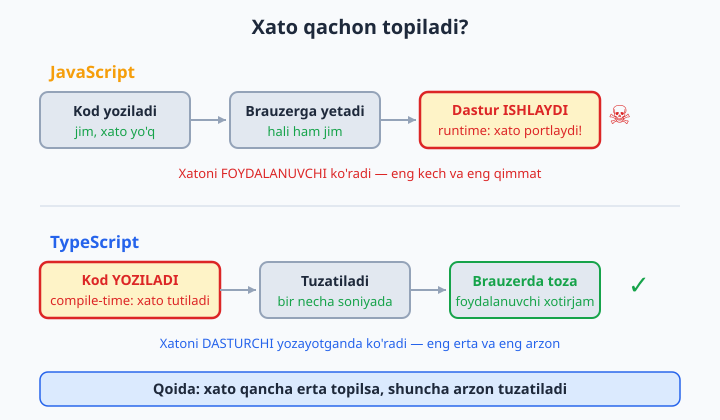
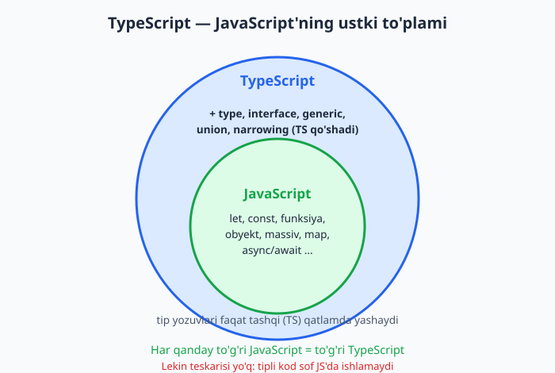
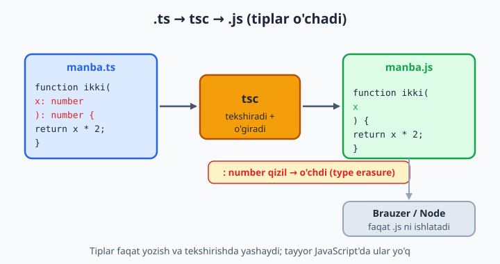

# 1 — TypeScript nima va nega kerak?

[🏠 README](./README.md) · [Keyingi: 02 — O'rnatish va birinchi qadamlar ➡️](./02-ornatish-birinchi-qadam.md)

> **Bu bobda:** sof JavaScript'da xato nega faqat dastur ishlaganda (runtime) bilinishini va bu katta loyihalarda nega qimmatga tushishini ko'ramiz. Keyin TypeScript bilan tanishamiz: u JavaScript'ning ustki to'plami (superset), xatoni kod yozilayotgan paytda (compile-time) tutadi, brauzerga yetib borishidan oldin. TypeScript brauzerda ishlamasligini, JavaScript'ga kompilyatsiya qilinishini va tiplar nega "o'chib ketishini" (type erasure) tushunamiz. Nega TS jamoa va katta kod uchun deyarli standartga aylangani — IntelliSense, refactoring xavfsizligi, hujjat sifatidagi tiplar — bilan yakunlaymiz.

---

## Muammo

Quyidagi JavaScript funksiyani tasavvur qiling. U foydalanuvchi obyektini olib, salomlashish matnini qaytaradi:

```js
function salomla(user) {
  return "Salom, " + user.name.toUpperCase();
}

const oqil = { name: "Oqil", yosh: 25 };
console.log(salomla(oqil)); // "Salom, OQIL"  — ishladi
```

Yaxshi ishladi. Endi tasavvur qiling, oradan bir hafta o'tdi, siz boshqa joyda shu funksiyaga obyektni biroz boshqacha uzatdingiz — `name` o'rniga `nomi` deb yozdingiz (yoki API'dan kelgan javobda maydon nomi boshqacha edi):

```js
const ali = { nomi: "Ali", yosh: 30 };
console.log(salomla(ali)); // ❌ TypeError: Cannot read properties of undefined (reading 'toUpperCase')
```

JavaScript bu satrni xatosiz **qabul qildi**. Hech narsa ogohlantirmadi. Xato faqat funksiya **ishlaganda** — `ali.name` `undefined` bo'lib, `undefined.toUpperCase()` chaqirilganda — yuzaga keldi. Yomoni shundaki, bu xato sizning kompyuteringizda emas, **foydalanuvchining brauzerida**, ishlab chiqarishda (production) chiqishi mumkin edi.

JavaScript'da xuddi shunday "jim turadigan" xatolarning bir qancha klassik turi bor:

```js
const user = { name: "Oqil" };
console.log(user.nmae);        // undefined — typo, lekin xato chiqmaydi (jim)
console.log(null.length);      // ❌ TypeError: faqat runtime'da
console.log("5" - 1);          // 4   — string ayrildi (JS o'zi o'giradi, kutilmagan)
console.log("5" + 1);          // "51" — bu safar qo'shilmadi, ulandi!
salomla(42);                   // 42 — son uzatdik, ❌ user.name.toUpperCase chaqirilganda yiqiladi
```

Bularning hammasida **mantiqiy xato kod yozilgan paytda mavjud**, lekin JavaScript uni faqat o'sha satr bajarilganda aytadi. Kichik skriptda buni darrov sezasiz. Lekin 200 ta fayl, 5 kishilik jamoa va minglab foydalanuvchi bo'lganda — bunday xato oylab yashirinib yotishi, keyin eng noqulay paytda "portlashi" mumkin. Mana shu muammoni **TypeScript** hal qiladi.



## TypeScript nima?

Ta'rif sodda: **TypeScript = JavaScript + statik tiplar.**

Bu yerda ikkita yangi atama bor. *Tip* (type) — bu qiymatning "turi": son (number), matn (string), rost/yolg'on (boolean), obyekt va hokazo. *Statik* (static) degani — tiplar **kod ishlamasdan oldin**, yozilayotgan paytda tekshiriladi (ziddi — *dinamik*, ya'ni JavaScript kabi ishlash paytida tekshirish).

TypeScript bilan yuqoridagi funksiyani shunday yozamiz — `user` parametriga uning shaklini (qanday maydonlari bor) aytib qo'yamiz:

```ts
function salomla(user: { name: string }): string {
  return "Salom, " + user.name.toUpperCase();
}

const ali = { nomi: "Ali", yosh: 30 };
salomla(ali);
// ❌ Xato: Argument of type '{ nomi: string; yosh: number; }' is not
//    assignable to parameter of type '{ name: string; }'.
//    Property 'name' is missing in type '{ nomi: string; yosh: number; }'
//    but required in type '{ name: string; }'.
```

E'tibor bering: bu xato endi **kodingizni hatto ishga tushirmasingizdan oldin** chiqdi. Muharrirning (VS Code) o'zida o'sha satr ostiga qizil to'lqinli chiziq tortiladi, kompilyatsiya esa o'tmaydi. Foydalanuvchi bu xatoni hech qachon ko'rmaydi, chunki u brauzergacha yetib bormaydi — siz uni hali kod yozayotganingizdayoq tutib oldingiz.

📌 Bu farqning nomi bor: JavaScript xatoni **runtime'da** (dastur ishlaganda) topadi, TypeScript esa **compile-time'da** (kod kompilyatsiya/tekshirilayotganda) topadi. Qoida juda sodda: xato qancha erta topilsa, shuncha arzon. Yozayotganda topilgan xato — bir necha soniyada tuzatiladi; foydalanuvchida portlagan xato — log o'qish, qayta tiklash, yangi versiya chiqarish degani.

💡 "Statik tiplar" qo'shimcha intizom kabi tuyulishi mumkin — ortiqcha yozuv-ku. Lekin amalda bu **o'zingizga yozayotgan hujjat**: parametr `{ name: string }` ekanini bir marta aytib qo'ysangiz, undan keyin TypeScript sizni butun loyiha bo'ylab shu shartga rioya qilishga "majbur" qiladi va adashganingizda darrov ogohlantiradi.

## TypeScript — JavaScript'ning ustki to'plami (superset)

TypeScript'ning eng muhim xususiyatlaridan biri: u JavaScript'ni **noldan o'rganishni talab qilmaydi**. Aksincha, u JavaScript'ning ustiga qurilgan. Buni "superset" (ustki to'plam) deyiladi:

> **Har qanday to'g'ri JavaScript kodi — bir vaqtning o'zida to'g'ri TypeScript kodidir.**

Ya'ni siz bilgan hamma narsa — `let`, `const`, funksiyalar, obyektlar, massivlar, `if`, `for`, `map`, `async/await` — TypeScript'da ham aynan ishlaydi. TypeScript faqat **ustiga** yangi imkoniyatlar qo'shadi: tiplar, interface'lar, generic'lar va hokazo.

```ts
// Bu — 100% oddiy JavaScript. TypeScript faylida ham bemalol ishlaydi:
const sonlar = [1, 2, 3, 4, 5];
const juftlar = sonlar.filter((n) => n % 2 === 0);
console.log(juftlar); // [2, 4]
```

Yuqoridagi kodda birorta ham "TypeScript belgisi" yo'q — sof JS. Lekin u `.ts` faylida xatosiz kompilyatsiya bo'ladi. Bu juda muhim: TypeScript'ni o'rganish — yangi tildan boshlash emas, balki **bilganingiz ustiga qatlam qo'shish**. Va eng yaxshisi — bu qatlamni asta-sekin, kerakli joyga qo'shib borasiz.



📌 Teskarisi to'g'ri emas: har qanday TypeScript — to'g'ri JavaScript emas. Masalan `user: { name: string }` kabi tip yozuvlari sof JavaScript'da xato beradi. Aynan shuning uchun TypeScript brauzerda to'g'ridan-to'g'ri ishlamaydi — uni avval JavaScript'ga aylantirish kerak. Bu keyingi bo'limning mavzusi.

## TS brauzerda ishlamaydi: kompilyatsiya va type erasure

Brauzer va Node.js TypeScript'ni **tushunmaydi** — ular faqat JavaScript biladi. Demak, TypeScript kodingiz ishlashidan oldin **JavaScript'ga o'girilishi** kerak. Bu jarayon **kompilyatsiya** (compilation) deyiladi, uni `tsc` (TypeScript Compiler) bajaradi.

Mana TypeScript kodi:

```ts
function qoshish(a: number, b: number): number {
  return a + b;
}

const natija: number = qoshish(2, 3);
```

`tsc` uni qayta ishlaganidan keyin natijada quyidagi **JavaScript** chiqadi:

```js
function qoshish(a, b) {
  return a + b;
}

const natija = qoshish(2, 3);
```

Diqqat qiling: chiqqan JavaScript'da **tiplar umuman yo'q**. `: number`, `: string` — hammasi yo'qoldi. Bu hodisa **type erasure** (tiplarning o'chishi) deyiladi. Tiplar faqat kod yozilayotganda va tekshirilayotganda yashaydi; tayyor JavaScript'ga ular o'tmaydi.



Bundan juda muhim bir xulosa kelib chiqadi:

📌 **Tiplar runtime'da hech narsani kafolatlamaydi.** Tiplar dastur ishlayotganda umuman mavjud emas — ular kompilyatsiyada o'chib ketadi. Demak, agar ma'lumot tashqaridan kelsa (masalan API javobi, foydalanuvchi kiritgan matn, fayl), TypeScript "bu albatta `number`" deb yozganingizga **ishonadi**, lekin haqiqatda u boshqa narsa bo'lsa, runtime'da baribir xato bo'lishi mumkin. Tip — bu *va'da*, *kafolat* emas. Tashqi ma'lumotni tekshirish (validation) alohida ish va biz bu mavzuga keyingi boblarda (ayniqsa `unknown` va tiplangan API boblarida) qaytamiz.

💡 Buni shunday tasavvur qiling: tiplar — bino qurilayotganda muhandis ishlatadigan chizmalar va o'lchov asboblari kabi. Ular qurilishni to'g'ri qilishga yordam beradi, lekin tayyor binoda chizmalar osilib turmaydi. TypeScript ham xuddi shunday: kod yozilayotganda yordam beradi, tayyor JavaScript'da esa "ko'rinmaydi".

## Nega TypeScript kerak? Amaliy foydalar

Tiplar shunchaki "xatoni erta topish" emas. Ular kundalik ishni sezilarli darajada osonlashtiradigan bir necha amaliy foyda beradi.

**1. Avtomatik tugatish (IntelliSense / autocomplete).** Tip ma'lum bo'lganda, muharrir sizga obyektning qanday maydonlari borligini darrov ko'rsatadi. `user.` deb yozishingiz bilanoq ro'yxat chiqadi: `name`, `yosh` va hokazo. Maydon nomini eslab o'tirish yoki hujjatni qidirish shart emas:

```ts
const user = { name: "Oqil", yosh: 25, faol: true };

user.    // muharrir taklif qiladi: name, yosh, faol
user.nam // muharrir avtomatik "name" ga to'ldiradi
```

**2. Refactoring xavfsizligi.** Katta loyihada bitta maydon nomini o'zgartirmoqchi bo'lsangiz (masalan `name` -> `fullName`), TypeScript butun loyihada qaerda eskicha ishlatilganini qizil bilan ko'rsatadi. Sof JavaScript'da esa siz qidirib-topib chiqishingiz, bittasini o'tkazib yuborsangiz — runtime'da yana o'sha xato.

**3. Hujjat sifatidagi tiplar.** Tip yozuvi — eng ishonchli hujjat, chunki u kod bilan birga turadi va eskirib qolmaydi. Funksiya nimani kutishi va nimani qaytarishi imzosidan ko'rinib turadi:

```ts
// Imzoning o'zi hamma narsani aytadi: ikki son kiradi, son chiqadi.
function ortacha(a: number, b: number): number {
  return (a + b) / 2;
}
```

Sof JavaScript'da `function ortacha(a, b)` deb yozilsa — `a` va `b` son ekanini qaerdan bilasiz? Kommentariyadan yoki funksiya ichini o'qibmi. Tip esa buni majburiy va aniq qiladi.

**4. Jamoada ishonch.** Hammasi birlashganda eng katta foyda shu: katta jamoada hech kim "bu funksiyaga nima uzatish kerak edi?" deb boshqotirmaydi. Tiplar "shartnoma" vazifasini bajaradi — bir dasturchi yozgan kodni ikkinchisi xato ishlatsa, TypeScript darrov ogohlantiradi.

💡 Aynan shu foydalar tufayli TypeScript zamonaviy frontend va backend dunyosida deyarli standartga aylangan. **Angular** to'liq TypeScript'da yozilgan. **React** va **Vue** uchun TypeScript ko'pchilik yangi loyihalarda tanlanadi. **Node.js** backend'larida ham TS keng tarqalgan. Ya'ni TypeScript bilishingiz — bugungi bozorda katta afzallik.

📌 Lekin TypeScript hamma joyda ham shart emas. Bir martalik kichik skript, 20 satrlik tajriba kodi yoki tezda biror narsani sinab ko'rmoqchi bo'lsangiz — sof JavaScript ko'pincha yetarli, hatto qulayroq. TypeScript o'zini kod o'sib, uzoq yashaydigan va bir necha kishi tegadigan loyihalarda eng yaxshi ko'rsatadi. Qoidasi sodda: **kod qancha katta va uzoq yashasa, TypeScript shuncha ko'proq arziydi.**

## Birinchi tip xatosini o'z ko'zingiz bilan ko'rish

TypeScript'ni o'rnatishni keyingi bobda batafsil ko'rib chiqamiz. Lekin **hozir, hech narsa o'rnatmasdan** birinchi tip xatosini ko'rishingiz mumkin — TypeScript Playground orqali. Bu brauzerda ochiladigan rasmiy onlayn muharrir:

```text
https://www.typescriptlang.org/play
```

U yerga quyidagini ko'chiring:

```ts
let yosh: number = 25;
yosh = "yigirma besh";
// ❌ Xato: Type 'string' is not assignable to type 'number'.
```

`yosh` ni `number` deb e'lon qildik, keyin unga matn berishga urindik. Playground o'sha satr ostiga qizil chiziq tortadi va xato xabarini ko'rsatadi — kodni umuman ishga tushirmasdan. Mana bu — TypeScript'ning butun mohiyati bitta misolda: **xato siz uni qilgan zahoti, joyida ko'rsatiladi.**

💡 Playground'ning yana bir foydali tomoni — o'ng tomonda u sizning TypeScript'ingizdan chiqadigan **JavaScript'ni** ko'rsatib turadi. O'sha kichik kodni qarang: chiqqan JS'da `: number` yo'qolgan bo'ladi. Bu — yuqorida gaplashgan type erasure'ni o'z ko'zingiz bilan ko'rish imkoni.

---

## 1-bob mashqlari

Bu mashqlar asosan **fikrlash** va **tushunish** uchun — kod yozishdan ko'ra ko'proq mulohaza qilasiz. Ba'zilari uchun TypeScript Playground (`typescriptlang.org/play`) ochib, tajriba qilib ko'rish foydali. Yechimlarni o'zingiz toping.

1. JavaScript'da `runtime` va TypeScript'da `compile-time` xato nima farqi borligini o'z so'zlaringiz bilan bir abzasda yozing.
2. Bobdagi `console.log("5" - 1)` `4`, `console.log("5" + 1)` esa `"51"` berdi. Nega bir xil `"5"` ikki xil natija berdi — sababini tushuntiring.
3. Quyidagi JS kodning runtime'da qanday xato berishini va sababini ayting: `const u = { ism: "Ali" }; console.log(u.name.length);`
4. Sof JavaScript'da "jim turadigan" (xato chiqarmasdan noto'g'ri natija beradigan) kamida 3 ta holatni sanab, har biri uchun bir misol yozing.
5. "TypeScript — JavaScript'ning superseti" jumlasini bir do'stingizga tushuntirayotgandek soddalashtirib yozing.
6. Quyidagi kod sof JavaScript'mi yoki TypeScript'mi: `const a = [1, 2, 3].map((x) => x * 2);` — javobingizni asoslang.
7. "Har qanday to'g'ri JavaScript — to'g'ri TypeScript, lekin teskarisi emas" — teskarisi nega to'g'ri emasligiga bitta misol keltiring.
8. `type erasure` (tiplarning o'chishi) nima ekanini va u qachon sodir bo'lishini tushuntiring.
9. Quyidagi TypeScript kod kompilyatsiya qilingach, chiqadigan JavaScript'ni yozing: `function ikki(x: number): number { return x * 2; }`
10. Nega brauzer TypeScript faylini to'g'ridan-to'g'ri ocha olmaydi — sababini ayting va yechimini (`tsc`) tushuntiring.
11. "Tiplar runtime'da hech narsani kafolatlamaydi" jumlasi nimani anglatadi? API'dan kelgan ma'lumot misolida tushuntiring.
12. TypeScript beradigan 4 ta amaliy foyda (autocomplete, refactoring, hujjat, jamoada ishonch) ichidan sizga eng muhimi qaysi va nega — bir abzasda yozing.
13. Bir loyiha tasvirlangan: "5 kishilik jamoa, 2 yil davom etadigan, 300 ta faylli e-commerce sayt." Bunga TypeScript arziydimi? Javobingizni asoslang.
14. Yana bir loyiha: "Bir martalik, 30 satrli skript — CSV faylni o'qib, jami summani chiqaradi." Bunga TypeScript arziydimi? Asoslang.
15. Qaysi mashhur frontend frameworki to'liq TypeScript'da yozilganini ayting va yana 2 ta TS keng ishlatiladigan texnologiyani sanang.
16. TypeScript Playground (`typescriptlang.org/play`) ni oching, `let x: string = 5;` deb yozing va chiqqan xato xabarini ko'chirib oling. Xato nima deyapti?
17. O'sha Playground'da `let ism: string = "Oqil"; ism = "Ali";` yozing. Xato chiqadimi? Nega? (Avvalgi mashq bilan farqini tushuntiring.)
18. Playground'da o'ng tarafdagi JavaScript chiqishiga qarang: `const yil: number = 2026;` yozsangiz, o'ng tomonda nima ko'rinadi va `: number` qayerga ketdi?
19. Quyidagi TS kod nega xato berishini (kompilyatsiya o'tmasligini) tushuntiring: `function salom(ism: string) { return "Salom " + ism; } salom(42);`
20. Tasavvur qiling, bir dasturchi "TypeScript kodni sekinlashtiradi, chunki u qo'shimcha tekshirish qiladi" dedi. Bu fikr to'g'rimi? `type erasure` tushunchasidan foydalanib, javob bering.
