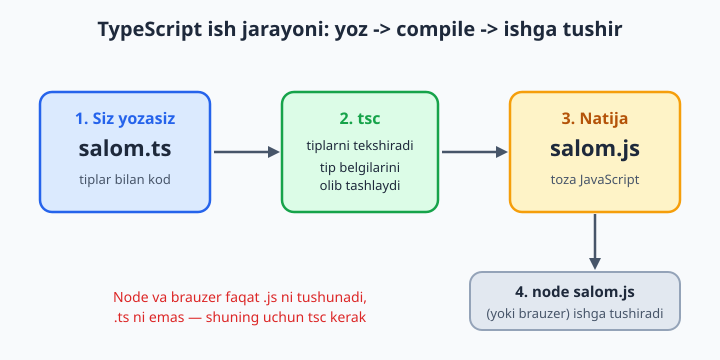
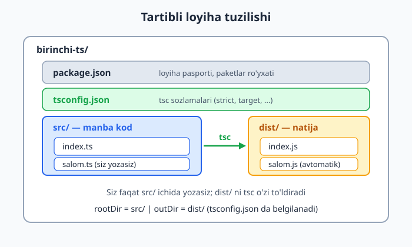
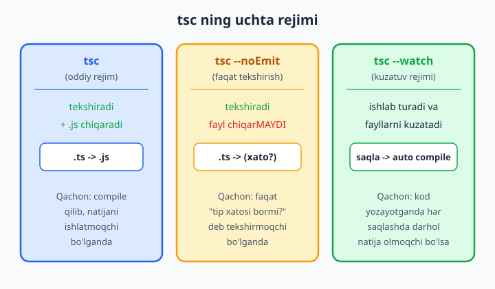

# 2 — O'rnatish va birinchi qadamlar

[⬅️ Oldingi: 01 — TypeScript nima va nega kerak?](./01-typescript-nima.md) · [🏠 README](./README.md) · [Keyingi: 03 — Asosiy tiplar va type inference ➡️](./03-asosiy-tiplar.md)

> **Bu bobda:** TypeScript'ni kompyuteringizga o'rnatamiz, birinchi `.ts` faylni yozib uni JavaScript'ga **compile** (o'zgartirib chiqarish) qilamiz, hosil bo'lgan `.js` ni `node` bilan ishga tushiramiz, `tsconfig.json` loyiha sozlamalar faylini yaratamiz, `--watch` bilan kodni avtomatik kuzatishni va `--noEmit` bilan "faqat tekshirish" rejimini o'rganamiz. Hech narsa o'rnatmasdan brauzerda sinash uchun TypeScript Playground bilan ham tanishamiz.

---

## Muammo

1-bobda TypeScript kod yozdik — `let yosh: number = 30;` kabi. Lekin uni qanday **ishga tushiramiz**? Brauzer ham, Node.js ham TypeScript'ni tushunmaydi: ular faqat **JavaScript**ni o'qiy oladi. `.ts` faylni to'g'ridan-to'g'ri `node` ga bersangiz, xato chiqadi.

Demak, oramizda bir bosqich kerak: TypeScript kodini oddiy JavaScript'ga **o'girib beradigan asbob**. Bu asbob — `tsc`, ya'ni *TypeScript Compiler*. U `.ts` faylni o'qiydi, tiplarni tekshiradi va tip belgilarini olib tashlab, toza `.js` fayl chiqaradi. Keyin o'sha `.js` ni brauzer yoki Node.js ishlata oladi.

Bu bobning maqsadi — shu jarayonni o'z qo'lingiz bilan boshdan-oxir bajarish: asbobni o'rnatish, kod yozish, compile qilish va natijani ko'rish. Bir marta qilib ko'rsangiz, qolgan hamma boblar ana shu zaminda quriladi.



## Node.js bormi? — avval shuni tekshiramiz

`tsc` asbobi `npm` (Node Package Manager) orqali o'rnatiladi, `npm` esa **Node.js** bilan birga keladi. Shuning uchun avval Node.js o'rnatilganini tekshiramiz. Terminal (Windows'da PowerShell yoki CMD, macOS/Linux'da Terminal) oching va yozing:

```bash
node --version
npm --version
```

Agar ikkala buyruq ham raqamli versiya chiqarsa (masalan `v24.12.0` va `11.6.2`) — Node.js bor, keyingi bosqichga o'tasiz. Agar "command not found" yoki "buyruq topilmadi" desa, Node.js o'rnatilmagan.

💡 O'rnatish kerak bo'lsa, [nodejs.org](https://nodejs.org) ga kiring va **LTS** (Long Term Support — uzoq muddat qo'llab-quvvatlanadigan, barqaror) versiyani yuklab oling. O'rnatgandan keyin terminalni yopib qaytadan oching va yuqoridagi tekshiruvni takrorlang.

📌 Node.js — bu JavaScript'ni brauzerdan tashqarida, to'g'ridan-to'g'ri kompyuterda ishlatadigan dastur. Bizga u ikki sabab uchun kerak: birinchidan, `tsc` ni o'rnatadigan `npm` u bilan keladi; ikkinchidan, compile qilingan `.js` fayllarni `node fayl.js` deb sinab ko'ramiz.

## TypeScript'ni o'rnatish

Ikki yo'l bor: **loyihaviy** (tavsiya etiladi) yoki **global**. Avval tavsiya etilganini ko'ramiz.

### Yo'l 1: loyihaviy o'rnatish (tavsiya)

Avval loyiha papkasi yaratamiz va uni `npm` loyihasiga aylantiramiz:

```bash
mkdir birinchi-ts
cd birinchi-ts
npm init -y
```

`npm init -y` buyrug'i `package.json` faylini yaratadi — loyihaning "pasporti". Endi TypeScript'ni shu loyihaga o'rnatamiz:

```bash
npm i -D typescript
```

Buyruqni qismlarga ajratamiz: `npm i` — `npm install` ning qisqartmasi (o'rnatish); `-D` — `--save-dev` ning qisqartmasi, ya'ni "bu paket faqat **dasturlash vaqtida** kerak, tayyor mahsulotga kirmaydi"; `typescript` — paket nomi.

📌 Nega aynan `-D` (dev dependency)? Chunki TypeScript faqat siz kod yozayotganingizda va compile qilayotganingizda ishlaydi. Foydalanuvchining brauzeri yoki serveri tayyor `.js` fayllarni ishlatadi — ularga TypeScript kerak emas. Shu sababli u "dasturchi asbobi" toifasiga kiradi.

Versiyani tekshiramiz:

```bash
npx tsc --version
```

Chiqishi taxminan: `Version 6.0.3` (siz o'rnatgan vaqtga qarab raqam boshqacharoq bo'lishi mumkin).

💡 `npx` nima? Loyihaviy o'rnatilgan `tsc` — `birinchi-ts/node_modules` papkasi ichida turadi, to'g'ridan `tsc` deb chaqirib bo'lmaydi. `npx` aynan shu lokal o'rnatilgan asbobni topib ishga tushiradi. Demak loyiha ichida doim `npx tsc ...` deb yozasiz.

### Yo'l 2: global o'rnatish

Agar har bir loyihada qayta-qayta o'rnatishni istamasangiz, TypeScript'ni butun tizimga bir marta o'rnatsa ham bo'ladi:

```bash
npm i -g typescript
```

Bunda `-g` — global. Endi istalgan papkada `npx`siz, to'g'ridan-to'g'ri `tsc --version` ishlaydi.

📌 Qaysi birini tanlash kerak? Jiddiy loyihada **loyihaviy** afzal: jamoadagi hamma bir xil TypeScript versiyasini ishlatadi (versiya `package.json`da yozib qo'yiladi), shuning uchun "menda ishlaydi, sizda ishlamaydi" muammosi kelib chiqmaydi. Global esa tez sinash uchun qulay. Bu kitobda biz `npx tsc` shaklini ishlatamiz; global o'rnatgan bo'lsangiz, shunchaki `npx` so'zini tushirib qoldiravering.

## Birinchi `.ts` fayl va uni compile qilish

`birinchi-ts` papkasi ichida `salom.ts` nomli fayl yarating va ichiga yozing:

```ts
// salom.ts — birinchi TypeScript faylimiz
let xabar: string = "Salom, TypeScript!";
console.log(xabar);

function qoshish(a: number, b: number): number {
  return a + b;
}
console.log(qoshish(2, 3));
```

E'tibor bering: `: string`, `: number` — bular tip belgilari, JavaScript'da yo'q edi. Endi shu faylni compile qilamiz:

```bash
npx tsc salom.ts
```

Buyruq hech narsa chiqarmasa — bu **yaxshi belgi**: demak hech qanday tip xatosi topilmadi. Endi papkaga qarasangiz, yonida yangi fayl paydo bo'lgan: `salom.js`. Ana shu — `tsc` ning ishi. Uni oching:

```js
// salom.js — tsc avtomatik hosil qildi
"use strict";
let xabar = "Salom, TypeScript!";
console.log(xabar);
function qoshish(a, b) {
    return a + b;
}
console.log(qoshish(2, 3));
```

Diqqat qiling: tip belgilari (`: string`, `: number`) **g'oyib bo'ldi**! `tsc` ularni tekshirdi va keyin olib tashladi, chunki JavaScript ularni tushunmaydi. Tiplar faqat compile vaqtida yashaydi, tayyor kodda emas. Bu — TypeScript'ning eng muhim haqiqatlaridan biri.

✅ Endi hosil bo'lgan JavaScript'ni Node.js bilan ishga tushiramiz:

```bash
node salom.js
```

Natija:

```text
Salom, TypeScript!
5
```

Tabriklaymiz — siz birinchi TypeScript dasturingizni yozdingiz, compile qildingiz va ishga tushirdingiz! Mana shu uchburchak — **yoz → compile → ishga tushir** — TypeScript bilan ishlashning asosidir.

📌 Nega to'g'ridan-to'g'ri `node salom.ts` qila olmaymiz? Chunki Node.js `.ts` faylni tushunmaydi: undagi `: string` kabi belgilar Node uchun begona. Avval `tsc` `.ts` ni `.js` ga aylantirishi, keyingina `node` uni ishlatishi mumkin. (Bu bosqichni o'tkazib yuborib, to'g'ridan ishlatish yo'li ham bor — pastda `tsx` haqida ko'ramiz.)

## Tip xatosini ushlab qolish — `tsc` ning asosiy foydasi

`tsc` shunchaki tarjimon emas — u **tekshiruvchi** ham. Faylga atayin xato kiritamiz:

```ts
let yosh: number = 25;
yosh = "yigirma besh";   // ❌ Xato: stringni number'ga berib bo'lmaydi
```

`npx tsc salom.ts` qilsangiz, compiler xato matnini ko'rsatadi:

```text
error TS2322: Type 'string' is not assignable to type 'number'.
```

Tarjimasi: "`string` tipini `number` tipiga **berib bo'lmaydi**". Ya'ni `number` deb e'lon qilingan `yosh`ga matn (string) berish — qoidaga zid. JavaScript'da bu xato dastur ishga tushgandan keyin, allaqachon kech bo'lganda chiqar edi. TypeScript esa uni **kodni ishga tushirmasdan oldin**, hali yozayotgan vaqtingizda topadi.

⚠️ Muhim nozik nuqta: `tsc` standart holda xato bo'lsa **ham `.js` faylni baribir chiqaradi** (xato matnini ko'rsatadi, lekin `salom.js` ni yaratadi — tugash kodi esa 0 emas, balki muvaffaqiyatsizlikni bildiradi). Ya'ni xatoni e'tiborsiz qoldirib `node salom.js` qilsangiz, kod baribir ishlab ketishi mumkin. Buni to'xtatish uchun `--noEmitOnError` bayrog'i bor: `npx tsc salom.ts --noEmitOnError` qilsangiz, xato bo'lganda `.js` umuman chiqarilmaydi. Bu sozlamani biz keyinroq `tsconfig.json`ga `"noEmitOnError": true` deb qo'shamiz — shunda xato bo'lsa, hech qachon noto'g'ri `.js` paydo bo'lmaydi.

Yana bir misol — funksiyaga noto'g'ri tipdagi argument:

```ts
function salomla(ism: string): string {
  return "Salom, " + ism;
}
salomla(42);   // ❌ Xato: 42 — number, lekin string kutilgan
```

```text
error TS2345: Argument of type 'number' is not assignable to parameter of type 'string'.
```

Va yo'q metodni chaqirish:

```ts
const narx: number = 100;
console.log(narx.toUpperCase());   // ❌ Xato: number'da toUpperCase yo'q
```

```text
error TS2339: Property 'toUpperCase' does not exist on type 'number'.
```

`toUpperCase` — bu matnlarning (string) metodi, sonlarda (number) u yo'q. TypeScript buni darrov aytadi. JavaScript'da esa bu `undefined is not a function` xatosiga olib kelar va faqat dastur o'sha qatorga yetganda yuzaga chiqar edi.

💡 Mana shu uchun TypeScript yoziladi: u xatolarni **erta** — foydalanuvchigacha emas, siz hali kod yozayotganingizda — ushlab beradi.

## `tsconfig.json` — loyiha sozlamalar fayli

Har safar `npx tsc fayl.ts` deb fayl nomini qo'lda yozish noqulay. Bundan tashqari, compiler qanday qoidalar bilan ishlashini (qaysi JavaScript versiyasiga compile qilish, qattiq tekshiruv yoqilganmi va h.k.) bir joyda belgilash kerak. Buning uchun **`tsconfig.json`** fayli xizmat qiladi. Uni avtomatik yaratish uchun:

```bash
npx tsc --init
```

Bu buyruq loyihada `tsconfig.json` faylini hosil qiladi. Ichida ko'p sozlama (ko'pchiligi sharh ostida) bor, lekin hozir bizga muhimi shu soddalashtirilgan ko'rinish:

```json
{
  "compilerOptions": {
    "target": "es2020",
    "module": "commonjs",
    "strict": true,
    "outDir": "./dist",
    "rootDir": "./src",
    "noEmitOnError": true
  }
}
```

Asosiy sozlamalarni qisqa tushunamiz (chuquri 18-bobda):

- `target` — `.ts` qaysi JavaScript versiyasiga compile qilinadi. `es2020` — zamonaviy, keng qo'llab-quvvatlanadi.
- `module` — modullar tizimi (qanday `import`/`export` ishlatish; 17-bobda).
- `strict` — **qattiq rejim**: TypeScript'ning eng kuchli tekshiruvlarini yoqadi. Zamonaviy loyihalarda doim `true` qiling, bu — eng katta foyda.
- `outDir` — compile qilingan `.js` fayllar qaysi papkaga tushadi (bu yerda `dist` — "distribution", tarqatish papkasi).
- `rootDir` — manba `.ts` fayllar qaysi papkada turadi (`src` — "source", manba).
- `noEmitOnError` — agar xato bo'lsa, `.js` umuman chiqarilmasin.

📌 **Sehrli o'zgarish:** `tsconfig.json` mavjud bo'lsa, endi `npx tsc` ni **fayl nomisiz** ishlatasiz! Compiler `tsconfig.json`ni topadi, undagi sozlamalarni o'qiydi va `rootDir`dagi barcha `.ts` fayllarni compile qilib, natijani `outDir`ga chiqaradi. Loyihada bir nechta fayl bo'lsa ham, bitta buyruq yetadi.

⚠️ Diqqat: `tsconfig.json` paydo bo'lgandan keyin endi `npx tsc salom.ts` deb **fayl nomini ko'rsatib bo'lmaydi** — yangi TypeScript versiyalarida bu `error TS5112: tsconfig.json is present but will not be loaded if files are specified on commandline` xatosini beradi. Sababi: fayl nomini ko'rsatsangiz, `tsconfig.json`dagi sozlamalar (jumladan `strict`, `outDir`) o'qilmaydi. Shuning uchun tsconfig bor loyihada doim shunchaki `npx tsc` deng.

💡 Tartibli loyiha quyidagicha ko'rinadi: manba kodingiz `src/` papkasida, compile natijasi `dist/` papkasida, sozlamalar esa `tsconfig.json`da. Bu — sanoat standarti.



Demak ish tartibi shunday bo'ladi:

```bash
mkdir -p src
# src/index.ts ni yozasiz, keyin:
npx tsc
# dist/index.js hosil bo'ladi, uni ishlatasiz:
node dist/index.js
```

## `--watch` — kodni avtomatik kuzatish

Har o'zgarishdan keyin qo'lda `npx tsc` yozish charchatadi. `--watch` (kuzatuv) rejimi bu ishni avtomatlashtiradi:

```bash
npx tsc --watch
```

Endi `tsc` terminalda **ishlab turadi** va manba fayllaringizni kuzatadi. Faylni saqlaganingiz zahoti u o'zi qayta compile qiladi va xato bo'lsa darrov ko'rsatadi. Terminalda taxminan shunday xabar turadi:

```text
[12:00:00] Starting compilation in watch mode...
[12:00:01] Found 0 errors. Watching for file changes.
```

Faylda xato qilsangiz, bir lahzada `Found 1 error` ga o'zgaradi. Kuzatuvni to'xtatish uchun terminalda `Ctrl + C` bosing.

💡 `--watch` ni qisqartirib `-w` deb ham yozsa bo'ladi: `npx tsc -w`. Kod yozayotganingizda uni bir terminalda ishlatib qo'ying — har saqlaganingizda darhol fikr-mulohaza (feedback) olasiz.

📌 Bu yerda muhim farqni ajratib oling: `tsc` ikki turdagi ishni qiladi — **tekshirish** (tiplar to'g'rimi?) va **chiqarish/emit** (`.js` fayl yaratish). Quyidagi rasmda uchta rejim solishtirilgan.



## `--noEmit` — faqat tekshir, fayl chiqarma

Ba'zan sizga `.js` fayl umuman kerak emas — siz faqat "kodimda tip xatosi bormi?" degan savolga javob olmoqchisiz. Buning uchun `--noEmit` (chiqarma):

```bash
npx tsc --noEmit
```

Bu buyruq butun loyihani tekshiradi, lekin **hech qanday `.js` fayl yaratmaydi**. Xato yo'q bo'lsa — jimgina tugaydi; xato bo'lsa — ro'yxatini chiqaradi.

📌 `--noEmit` qachon kerak? Ko'pchilik zamonaviy loyihalarda `.ts` ni `.js` ga aylantirishni boshqa, tezroq asbob (masalan Vite, esbuild yoki Babel) bajaradi. Bunday holda `tsc` ning vazifasi faqat **tip tekshiruvchi** bo'lib qoladi — aynan shu yerda `--noEmit` ishlatiladi. Buni odatda "type-check" buyrug'i deyishadi va `package.json` ichidagi skript sifatida saqlashadi:

```json
{
  "scripts": {
    "type-check": "tsc --noEmit"
  }
}
```

Endi `npm run type-check` desangiz, loyiha tiplari tekshiriladi.

💡 Bu kitobdagi misollar ham aynan `tsc --noEmit --strict` bilan tekshirilgan: "kod toza compile bo'ladimi yoki xato beradimi" deganda biz xuddi shu ma'noni nazarda tutamiz.

## To'g'ridan-to'g'ri ishga tushirish: `tsx`

"Compile → keyin node" ikki bosqichi tez sinash uchun zerikarli. `tsx` asbobi `.ts` faylni **bir buyruq bilan** ishga tushiradi (ichida compile qilib, darrov ishlatib beradi, oraliq fayl qoldirmasdan):

```bash
npx tsx salom.ts
```

Natija to'g'ridan-to'g'ri chiqadi:

```text
Salom, TypeScript!
5
```

📌 `tsx` — bu o'rganish va tajriba uchun ajoyib: har gal `tsc` keyin `node` yozmaysiz. Ammo bir narsani esda tuting: `tsx` **tip xatolarini to'xtatmaydi** — u tezlik uchun tiplarni o'tkazib yuborib, faqat kodni ishlatadi. Shuning uchun jiddiy loyihada ham `tsx` (tez ishlatish), ham `tsc --noEmit` (tip tekshiruvi) birga ishlatiladi: biri ishga tushiradi, ikkinchisi xatolarni ushlab beradi.

💡 `ts-node` degan o'xshash, eskiroq asbob ham bor — uni eski qo'llanmalarda uchratasiz. Yangi loyihalarda odatda `tsx` afzal: u tezroq va sozlamasi sodda.

## O'rnatishsiz sinash: TypeScript Playground

Hech narsa o'rnatishni istamasangiz yoki tez bir kod parchasini sinab ko'rmoqchi bo'lsangiz — brauzerda ochiladigan **TypeScript Playground** bor:

[typescriptlang.org/play](https://www.typescriptlang.org/play)

Chap tomonga TypeScript yozasiz, o'ng tomonda darhol compile qilingan JavaScript'ni ko'rasiz. Tip xatolari joyida (kod ostida qizil chiziq bilan) ko'rinadi, "Run" tugmasi kodni o'sha yerda ishga tushiradi. Bu — yangi narsani tez tekshirish uchun eng qulay joy.

💡 Bu kitobni o'qiyotganda Playground'ni ochiq qo'ying: har bir misolni ko'chirib, tiplar bilan o'ynab ko'ring — xatoni atayin keltirib chiqaring, tip belgisini o'zgartiring, natija qanday o'zgarishini kuzating. Bilim aynan shunday "o'ynab" mustahkamlanadi.

## VS Code — TypeScript'ni "tug'ma" biladi

Agar **VS Code** muharririda yozsangiz, bonus bor: VS Code ichida TypeScript allaqachon o'rnatilgan (uning o'zi TypeScript'da yozilgan). Demak `.ts` fayl ochishingiz bilan:

- xatolar **siz yozayotganda** to'lqinli qizil chiziq bilan ko'rinadi (terminalda `tsc` ishlatishni kutmaysiz);
- avtomatik to'ldirish (autocomplete) tiplar asosida aniq takliflar beradi;
- o'zgaruvchi ustiga sichqoncha olib borsangiz, uning tipini ko'rsatadi.

📌 VS Code'dagi qizil chiziqlar bilan terminaldagi `tsc` natijasi bir xil tekshiruvga asoslanadi. Lekin ular birini ikkinchisi o'rnini bosmaydi: muharrir — yozayotgan vaqtdagi tezkor yordamchi, `tsc --noEmit` esa loyihani bir butun holda, masalan compile yoki yuklashdan oldin tekshiruvchi. Ikkalasi birgalikda ishlaydi.

💡 VS Code Microsoft'niki, TypeScript ham Microsoft'niki — shuning uchun ular juda yaxshi "til topishadi". Boshqa muharrirlar (WebStorm, Neovim va h.k.) ham TypeScript'ni qo'llab-quvvatlaydi, lekin yangi boshlovchiga VS Code eng qulay yo'l.

---

Endi sizda to'liq ish muhiti bor: TypeScript o'rnatilgan, birinchi fayl yozildi va ishga tushdi, sozlamalar fayli tayyor. Keyingi bobda eng asosiy narsaga — **tiplar**ga va TypeScript ularni qanday o'zi "topib oladigan"iga (type inference) o'tamiz. Avval esa quyidagi mashqlarni bajaring: ularning ko'pchiligi shu bobda yozganlaringizni o'z qo'lingiz bilan takrorlash haqida — bilim shunday mustahkamlanadi.

## 2-bob mashqlari

1. Terminalda `node --version` va `npm --version` buyruqlarini ishlatib, kompyuteringizda Node.js o'rnatilganini tekshiring. Versiyalarni yozib qo'ying.
2. `birinchi-ts` nomli yangi papka yarating, ichiga kiring va `npm init -y` bilan `package.json` yarating. Hosil bo'lgan faylni oching va ichida nimalar borligini ko'ring.
3. Shu papkaga `npm i -D typescript` bilan TypeScript'ni loyihaviy o'rnating, so'ng `npx tsc --version` bilan versiyasini tekshiring.
4. `salom.ts` fayl yarating, ichiga bitta `console.log("Salom, dunyo!");` yozing va `npx tsc salom.ts` bilan compile qiling.
5. Hosil bo'lgan `salom.js` faylni oching va `.ts` bilan solishtiring: nima o'zgardi, nima o'chib ketdi?
6. `node salom.js` bilan natijani ishga tushiring va konsolda chiqqan matnni ko'ring.
7. `salom.ts`ga `let yosh: number = 30;` qatorini qo'shib, `console.log(yosh)` qiling, qayta compile qilib ishga tushiring.
8. Endi atayin xato kiriting: `yosh = "o'ttiz";` deb yozing va `npx tsc salom.ts` qiling. Compiler qanday xato xabarini berdi? Xato kodini (`TS....`) yozib oling.
9. Bir tipli o'zgaruvchiga `: string` belgilab, unga son bering (`let ism: string = 42;`). Qanday xato chiqdi? Xabarni o'qib, ma'nosini o'z so'zingiz bilan tushuntiring.
10. Ikkita son qabul qilib, ularning yig'indisini qaytaradigan `qoshish(a: number, b: number): number` funksiyasini yozing va natijasini chop eting.
11. Shu funksiyaga atayin matn bering: `qoshish("salom", 5)`. Compiler nima deydi? Bu xato JavaScript'da qachon ko'rinardi, TypeScript'da qachon?
12. `npx tsc --init` bilan `tsconfig.json` yarating. Faylni oching va `strict`, `target`, `outDir` sozlamalarini toping (ko'pchiligi sharh ostida bo'lishi mumkin).
13. `tsconfig.json`da `"strict": true`, `"rootDir": "./src"` va `"outDir": "./dist"` ni belgilang. `src` papkasini yarating va `salom.ts`ni uning ichiga ko'chiring.
14. Endi fayl nomisiz, shunchaki `npx tsc` ishlating. `.js` fayl qaysi papkada paydo bo'ldi? `node dist/salom.js` bilan ishlating.
15. `--watch` rejimini sinang: `npx tsc --watch` ishlatib, terminalni ochiq qoldiring. Endi `salom.ts`ni o'zgartirib saqlang va terminaldagi xabar qanday o'zgarishini kuzating.
16. `--watch` ishlab turganda faylda atayin xato qiling (masalan, tip mos kelmasligi) va saqlang. `Found 0 errors` qanday o'zgardi? Keyin xatoni tuzatib, holatni qaytaring. To'xtatish uchun `Ctrl + C` bosing.
17. `npx tsc --noEmit` ishlating. Bu safar `.js` fayl yaratildimi? `--noEmit`ning oddiy `tsc`dan farqini o'z so'zingiz bilan ayting.
18. `package.json`ning `scripts` qismiga `"type-check": "tsc --noEmit"` qatorini qo'shing va `npm run type-check` bilan ishlating.
19. `npx tsx salom.ts` bilan faylni to'g'ridan-to'g'ri (compile bosqichisiz) ishga tushiring. Natija oldingidek chiqdimi? Yangi `.js` fayl qoldimi?
20. [typescriptlang.org/play](https://www.typescriptlang.org/play) ni brauzerda oching. Chap tomonga quyidagi kodni yozing:

    ```ts
    const ism: string = "Dunyo";
    console.log(`Salom, ${ism}!`);
    ```

    O'ng tomonda hosil bo'lgan JavaScript'ni ko'ring. Endi `: string` o'rniga `: number` qo'yib, qanday xato paydo bo'lishini kuzating.
