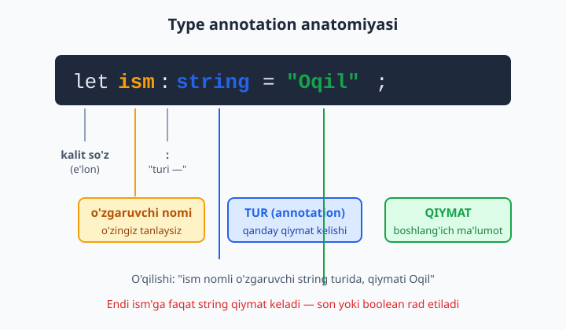
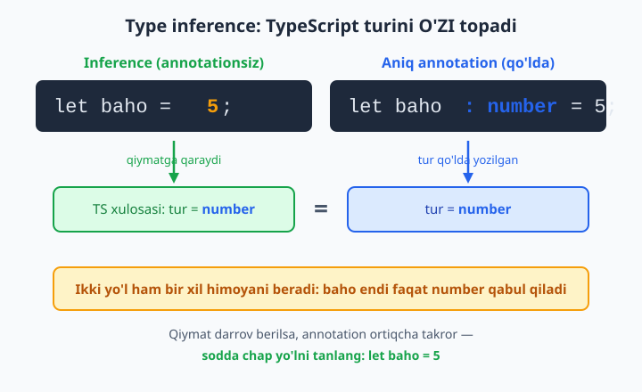
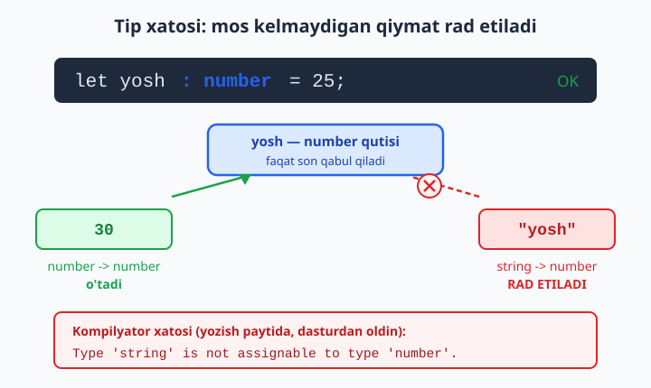

# 3 — Asosiy tiplar va type inference

[⬅️ Oldingi: 02 — O'rnatish va birinchi qadamlar](./02-ornatish-birinchi-qadam.md) · [🏠 README](./README.md) · [Keyingi: 04 — Massivlar, tuple va enum ➡️](./04-massiv-tuple-enum.md)

> **Bu bobda:** o'zgaruvchiga qanday qiymat kelishini cheklashni — TypeScript'ning eng asosiy qurolini o'rganamiz: type annotation (`let ism: string`), asosiy tiplar (`string`, `number`, `boolean`, `null`, `undefined`, `symbol`, `bigint`), TypeScript tipni ko'pincha O'ZI topib beradigan type inference ("tip xulosasi") sehrini, tip xatosi qanday ko'rinishini, hamda `const` bilan `let` o'rtasidagi nozik farqni — qaysi biri qiymatni "tor" tipga, qaysi biri "keng" tipga aylantirishini ko'rib chiqamiz.

---

## Muammo

JavaScript'da quyidagi kod hech qanday ogohlantirishsiz ishlayveradi:

```js
let yosh = 25;
yosh = "yigirma besh"; // JS: e'tiroz yo'q
yosh = yosh + 5;       // natija: "yigirma besh5" — kutilmagan satr!
```

`yosh` avval son edi, keyin satrga aylanib qoldi, oxirida esa qo'shish o'rniga satr yelimlanib ketdi. JavaScript bunga **umuman e'tibor bermaydi** — xato faqat foydalanuvchi sahifani ochganda, allaqachon kech bo'lganda chiqadi. Mana shu "o'zgaruvchi xohlagan turdagi qiymatni qabul qiladi" erkinligi katta loyihada eng ko'p og'riq keltiradigan narsa.

TypeScript'ning asosiy g'oyasi sodda: **har bir o'zgaruvchining bitta turi (type) bo'ladi va u faqat o'sha turdagi qiymatni qabul qiladi**. `yosh` son bo'lsa, unga satr berib bo'lmaydi — kompilyator (kodni tekshiruvchi dastur) buni siz dasturni ishga tushirmasdan oldin, yozayotgan paytingizdayoq aytadi:

```ts
let yosh: number = 25;
yosh = "yigirma besh"; // ❌ Xato: Type 'string' is not assignable to type 'number'.
```

Bu bobda o'zgaruvchilarga ana shunday "tur cheklovi" qanday o'rnatilishini va TypeScript ko'p hollarda buni qanday qilib o'zi avtomatik bajarishini o'rganamiz.

## Type annotation — turni qo'lda aytish

Type annotation ("tip izohi") — o'zgaruvchi nomidan keyin ikki nuqta `:` qo'yib, turini yozish:

```ts
let ism: string = "Oqil";
let yosh: number = 25;
let faol: boolean = true;
```

O'qilishi: "`ism` nomli o'zgaruvchi — `string` (satr) turida, boshlang'ich qiymati `"Oqil"`". Bu yerda uchta qism bor: o'zgaruvchi nomi, ikki nuqtadan keyingi **tur**, va tenglik belgisidan keyingi **qiymat**.



Endi bu o'zgaruvchilarga faqat o'z turidagi qiymat keladi:

```ts
ism = "Sevara"; // ✅ string -> string, OK
yosh = 30;      // ✅ number -> number, OK
faol = false;   // ✅ boolean -> boolean, OK
```

Boshqa turdagi qiymat berishga urinsangiz — kompilyator darrov to'xtatadi:

```ts
yosh = "yigirma besh"; // ❌ Xato: Type 'string' is not assignable to type 'number'.
faol = "ha";           // ❌ Xato: Type 'string' is not assignable to type 'boolean'.
```

📌 "is not assignable to type" — TypeScript'da eng ko'p uchraydigan xato xabari. So'zma-so'z: "bu turdagi qiymatni anavi turdagi o'zgaruvchiga **berib bo'lmaydi**". Uni ko'rsangiz, demak qiymatning turi o'zgaruvchining turiga mos kelmayapti.

💡 Ikki nuqtadan keyin bo'sh joy qo'yish odat: `yosh: number`, `yosh :number` emas. TypeScript ikkalasini ham tushunadi, lekin birinchisi standart uslub.

## Asosiy tiplar — sanab o'tamiz

TypeScript JavaScript ustiga qurilgani uchun uning asosiy tiplari aynan JavaScript'ning qiymat turlaridan kelib chiqadi. Mana eng ko'p ishlatiladigani:

### string — satr (matn)

```ts
let salom: string = "Assalomu alaykum";
let bitta: string = 'A';
let shablon: string = `Bugun ${2026}-yil`; // shablon literali ham string
```

### number — son (butun, kasr, hammasi bitta tur!)

Bu JavaScript'dan kelgan eng muhim ajablanish: TypeScript'da butun son uchun alohida, kasr son uchun alohida tur YO'Q. Hammasi — bitta `number`:

```ts
let butun: number = 42;
let kasr: number = 3.14;
let manfiy: number = -7;
let katta: number = 1_000_000; // pastki chiziq o'qish uchun, qiymatga ta'sir qilmaydi
let notogri: number = NaN;     // "Not a Number" ham number turida!
```

📌 `NaN` ("Not a Number" — "son emas") — nomi "son emas" deb tursa-da, uning turi baribir `number`. U noto'g'ri matematik amal natijasida paydo bo'ladi (masalan `0 / 0` yoki `Number("salom")`). TypeScript uni alohida tur deb ajratmaydi — siz uchun bu degani: `let x: number = NaN` mutlaqo to'g'ri kod, kompilyator e'tiroz qilmaydi. Demak `NaN` ehtimoli bo'lgan joyni dastur mantiqida o'zingiz tekshirishingiz kerak.

### boolean — mantiqiy (rost/yolg'on)

```ts
let royxatdan_otgan: boolean = true;
let arxivlangan: boolean = false;
```

`boolean` faqat ikki qiymatni qabul qiladi: `true` yoki `false`. `1` yoki `"true"` emas.

### null va undefined

Bu ikkisi "qiymat yo'qligi"ni bildiradi, lekin biroz farqli ma'noda: `undefined` — "hali qiymat berilmagan", `null` — "ataylab bo'sh qo'yilgan".

```ts
let bosh: null = null;
let aniqlanmagan: undefined = undefined;
```

📌 Amalda `null` va `undefined`ni odatda yolg'iz emas, balki boshqa tur bilan **birga** ishlatamiz (masalan "string yoki undefined"). Bu — union tip ("birlashma tip"), uni 7-bobda chuqur o'rganamiz. Hozircha shuni bilib qo'ying: `strict` rejimida `null` va `undefined`ni har joyga bemalol joylab bo'lmaydi — bu TypeScript'ning eng qadrli himoyalaridan biri.

### bigint — juda katta butun sonlar

`number` taxminan 9 kvadrillion (9_007_199_254_740_991) gacha aniq ishlaydi. Undan kattaroq butun sonlar uchun `bigint` bor — oxiriga `n` qo'yiladi:

```ts
let juda_katta: bigint = 9007199254740993n;
let yana_bigint: bigint = BigInt(100);
```

📌 `bigint` va `number`ni bevosita aralashtirib bo'lmaydi — bu ataylab qilingan, chunki ular xotirada turlicha saqlanadi:

```ts
let a: bigint = 10n;
let b: number = 5;
let c = a + b; // ❌ Xato: Operator '+' cannot be applied to types 'bigint' and 'number'.
```

### symbol — noyob kalitlar

`symbol` — har safar noyob (boshqasiga teng kelmaydigan) qiymat yaratadi. Boshlovchilar uni kam ishlatadi, lekin tur sifatida mavjud:

```ts
let kalit: symbol = Symbol("id");
let yana_kalit: symbol = Symbol(); // bu ikkisi teng emas, hatto bir xil nom bilan ham
```

💡 `symbol` va `bigint` boshlang'ich loyihalarda kamdan-kam kerak bo'ladi. Ularni eslab qolish shart emas — "bunday tiplar bor ekan" deb bilib qo'ysangiz yetarli, kerak bo'lganda qaytib kelasiz.

## Type inference — TypeScript tipni o'zi topadi

Endi eng yoqimli qism. Yuqorida har bir o'zgaruvchiga qo'lda `: number`, `: string` yozdik. Lekin ko'pincha **buning hojati yo'q** — agar boshlang'ich qiymat berilsa, TypeScript turini o'zi aniqlaydi. Bu — type inference ("tip xulosasi"):

```ts
let baho = 5;          // annotation yo'q, lekin TS turini number deb biladi
let salom = "Assalom"; // TS: string
let tayyor = true;     // TS: boolean
```

`let baho = 5` yozsangiz, TypeScript "o'ng tomonda `5` turibdi, demak bu `number`" deb xulosa qiladi. Endi `baho` xuddi `let baho: number = 5` deb yozgandek himoyalangan:

```ts
baho = 10;      // ✅ number, OK
baho = "katta"; // ❌ Xato: Type 'string' is not assignable to type 'number'.
```

E'tibor bering: ikkinchi qatorda biz `number` deb hech qayerda yozmaganmiz — TypeScript turini qiymatdan O'ZI topdi va keyin uni qo'riqlayapti.



Inference funksiya qaytaradigan qiymatda ham ishlaydi:

```ts
function qoshish(a: number, b: number) {
  return a + b; // TS qaytuvchi turni number deb o'zi topadi
}

let yigindi = qoshish(2, 3); // yigindi turi: number
```

💡 **Eng muhim amaliy qoida:** o'zgaruvchiga darrov qiymat berayotgan bo'lsangiz, annotation yozmang — inference'ga ishoning. `let baho: number = 5` ortiqcha takror: TypeScript `5`dan `number`ni allaqachon biladi. Tajribali dasturchilar kodni `let baho = 5` deb sodda yozadi.

## Qachon annotation YOZISH kerak?

Agar inference shunchalik aqlli bo'lsa, annotation umuman keraksizmi? Yo'q — uch holatda u zarur.

### 1. Bo'sh e'lon (qiymatsiz)

Agar o'zgaruvchini qiymat bermasdan e'lon qilsangiz, TypeScript turini topishga hech narsasi yo'q. Bunday paytda annotation **shart**:

```ts
let xabar: string; // qiymat keyin keladi
xabar = "keyinroq qiymat berildi";
```

Annotationsiz `let xabar` yozsangiz, TypeScript uni `any` ("istalgan tur" — barcha himoyani o'chiradigan zaxira tur, 9-bobda ko'ramiz) deb hisoblaydi, ya'ni himoya yo'qoladi. Va agar o'zgaruvchini qiymat berishdan **oldin** ishlatmoqchi bo'lsangiz, kompilyator ushlaydi:

```ts
let xabar: string;
console.log(xabar.length); // ❌ Xato: Variable 'xabar' is used before being assigned.
```

### 2. Funksiya parametrlari

Funksiya parametriga TypeScript boshlang'ich qiymatni ko'rmaydi (qiymat funksiya chaqirilganda keladi), shuning uchun parametr turini O'ZINGIZ yozasiz:

```ts
function salom(ism: string) {
  return "Salom, " + ism;
}
```

Annotationsiz qoldirsangiz, `strict` rejimida xato:

```ts
function salom(ism) { // ❌ Xato: Parameter 'ism' implicitly has an 'any' type.
  return "Salom, " + ism;
}
```

📌 "implicitly has an 'any' type" — "yashirincha `any` turini oldi". `strict` rejimi bunday "jimgina any"ga yo'l qo'ymaydi: agar tur ma'lum bo'lmasa, sizdan uni aniq yozishni talab qiladi. Funksiya parametrlarini batafsil 6-bobda ko'ramiz.

### 3. Inference noto'g'ri yoki juda keng topganda

Ba'zan TypeScript topgan tur sizning niyatingizdan kengroq bo'ladi (masalan, `string` topadi, sizga esa aniq `"shimol" | "janub"` kerak). Bunday hollarda annotation bilan turni "toraytirib" yozasiz — buni union tiplarda (7-bob) ko'p ishlatamiz.



## const vs let — narrowing farqi

Bu — nozik, lekin juda muhim mavzu. `let` va `const` bilan e'lon qilingan o'zgaruvchilar uchun TypeScript turni **boshqacha** topadi.

`let` bilan e'lon qilsangiz, o'zgaruvchini keyin qayta o'zgartirishingiz mumkin, shuning uchun TypeScript turini **keng** (umumiy) qilib oladi:

```ts
let ochiq = "shimol"; // tur: string (umumiy)
ochiq = "janub";      // ✅ OK, chunki tur string — har qanday satr keladi
```

`const` bilan e'lon qilingan o'zgaruvchini esa **hech qachon** qayta o'zgartirib bo'lmaydi. Shuning uchun TypeScript turini iloji boricha **tor** — aynan o'sha qiymatning o'ziga teng qilib oladi. Bu — literal narrowing ("literalga toraytirish"):

```ts
const yonalish = "shimol"; // tur: "shimol" (string EMAS, aynan "shimol" literali!)
const pi = 3.14159;        // tur: 3.14159
```

`yonalish`ning turi shunchaki `string` emas, balki aniq `"shimol"`. Ya'ni bu o'zgaruvchi faqat va faqat `"shimol"` qiymatini ushlab turadi.

📌 Bu nima uchun foydali? Faraz qiling, funksiya faqat ikki satrdan birini qabul qiladi — `"shimol"` yoki `"janub"`:

```ts
function yur(yon: "shimol" | "janub") {
  return yon;
}

const yonalish = "shimol"; // tur: "shimol"
yur(yonalish);             // ✅ OK — turi aniq "shimol", to'liq mos keladi
```

Lekin xuddi shu qiymatni `let` bilan e'lon qilsangiz, turi `string`ga kengayadi va endi mos kelmaydi:

```ts
let ochiq = "shimol";  // tur: string (kengaytirildi)
yur(ochiq);            // ❌ Xato: Argument of type 'string' is not assignable
                       //    to parameter of type '"shimol" | "janub"'.
```

Mantiq: `ochiq` `let` bo'lgani uchun TypeScript "uni keyin istalgan satrga o'zgartirishi mumkin" deb o'ylaydi, shuning uchun turini `string` qiladi. `string` esa `"shimol" | "janub"`dan kengroq — har qanday satr unga sig'magani uchun kompilyator rad etadi.

💡 Amaliy xulosa: qiymat o'zgarmaydigan bo'lsa, **doim `const` ishlating**. Bu nafaqat xavfsizroq, balki TypeScript'ga aniqroq tur berib, kodingizni "aqlliroq" qiladi. Faqat haqiqatan qayta tayinlash kerak bo'lganda `let`ga o'ting.

## Annotation yoki inference — qaysi birini tanlash

Hammasini jamlaymiz. Sodda qoida:

| Holat | Nima qilish | Misol |
|---|---|---|
| O'zgaruvchiga darrov qiymat berilyapti | Annotation yozMANG, inference yetarli | `let baho = 5;` |
| O'zgaruvchi bo'sh e'lon qilinyapti | Annotation YOZING | `let xabar: string;` |
| Funksiya parametri | Annotation YOZING | `function f(x: number)` |
| Tur juda keng topildi, torroq kerak | Annotation bilan toraytiring | `let h: "ha" \| "yoq"` |
| Qiymat umuman o'zgarmaydi | `const` ishlating (tur o'zi torayadi) | `const pi = 3.14;` |

📌 Ortiqcha annotation kodni shovqinli qiladi. `let ism: string = "Ali"` o'rniga `let ism = "Ali"` deb yozing — TypeScript bir xil himoyani beradi, lekin kod tozaroq. Annotationni faqat **kerak bo'lganda** yoki **niyatni aniqroq ko'rsatmoqchi** bo'lganda yozing.

## Xulosa

- Type annotation o'zgaruvchining turini qo'lda aytadi: `let ism: string`.
- Asosiy tiplar: `string`, `number` (butun/kasr/`NaN` — hammasi bitta), `boolean`, `null`, `undefined`, `bigint`, `symbol`.
- Type inference — TypeScript turini qiymatdan o'zi topadi: `let x = 5` avtomatik `number`. Shuning uchun annotation hamma joyda shart emas.
- Annotation uch holatda zarur: bo'sh e'lon, funksiya parametri, turni toraytirish.
- Eng ko'p xato xabari: `Type X is not assignable to type Y` — qiymat turi o'zgaruvchi turiga mos kelmaydi.
- `const` qiymatni tor literal turga toraytiradi (`"shimol"`), `let` esa keng turga kengaytiradi (`string`). O'zgarmas qiymatlar uchun `const` afzal.

Keyingi bobda bir nechta qiymatni saqlaydigan tuzilmalar — massivlar, tuple va enum tiplarini ko'ramiz.

## 3-bob mashqlari

Quyidagi mashqlarni o'zingiz yozib sinab ko'ring. Har birini alohida `.ts` faylga yozib, terminalda `tsc --noEmit --strict --target es2020 fayl.ts` bilan tekshiring. Yechimlar berilmagan — o'zingiz qilib o'rganasiz.

1. `string`, `number` va `boolean` turidagi uchta o'zgaruvchini annotation bilan e'lon qilib, har biriga mos qiymat bering.
2. Yuqoridagi uchta o'zgaruvchidan annotationlarni olib tashlang. Kod hali ham ishlayaptimi? Nega? (Type inference haqida o'ylang.)
3. `let yosh = 25;` deb yozing (annotationsiz), keyin `yosh = "yigirma"` deb tayinlashga urinib ko'ring. Kompilyator qanday xato chiqaradi? Xato xabarini to'liq o'qing.
4. Bitta `number` o'zgaruvchiga ketma-ket butun son, kasr son va manfiy son bering. Uchalasi ham bitta `number` turiga sig'ishini tasdiqlang.
5. `let natija: number = NaN;` deb yozing. Kompilyator e'tiroz qiladimi? Nega `NaN` ham `number` turida ekanini izohlab bering.
6. `boolean` o'zgaruvchiga `1` yoki `"true"` qiymatini berishga urinib ko'ring. Qanday xato chiqadi?
7. `let xabar: string;` deb qiymatsiz e'lon qiling, keyin pastda unga satr qiymat bering. Kod ishlaydi. Endi qiymat berishdan **oldin** `console.log(xabar)` qo'shib ko'ring — qanday xato chiqadi?
8. `let bayroq;` deb annotationsiz va qiymatsiz e'lon qiling. TypeScript bu o'zgaruvchining turini nima deb hisoblaydi? (Maslahat: tahririda o'zgaruvchi ustiga sichqonchani olib boring yoki keyingi qatorda har xil qiymat bering.)
9. Bitta funksiya yozing: `function kvadrat(x)` — parametr annotationisiz. `strict` rejimida qanday xato chiqadi? Keyin `x: number` qo'shib tuzating.
10. `const pi = 3.14;` yozib, keyin `pi = 3.15;` deb o'zgartirishga urinib ko'ring. Qanday xato chiqadi va nega?
11. `const shahar = "Toshkent";` o'zgaruvchining turi nima — `string`mi yoki `"Toshkent"`mi? Tahririda tekshiring va literal narrowing'ni o'z ko'zingiz bilan ko'ring.
12. Bir xil qiymatni avval `let`, keyin `const` bilan e'lon qiling: `let a = "ha"` va `const b = "ha"`. Ikkalasining turi farq qiladimi? Nega?
13. `function holat(s: "faol" | "nofaol")` funksiyasini yozing. Unga avval `const x = "faol"` ni, keyin `let y = "faol"` ni bering. Qaysi biri o'tadi, qaysi biri xato beradi va nega?
14. `bigint` turidagi o'zgaruvchi e'lon qiling (`n` qo'shimchasi bilan). Keyin unga oddiy `number` qo'shishga urinib ko'ring (`+`). Qanday xato chiqadi?
15. `BigInt(50)` va `50n` ikkalasi ham `bigint` ekanini tekshiring. Bittasini ikkinchisiga `+` bilan qo'shib ko'ring — ishlaydimi?
16. Ikkita `symbol` yarating: `Symbol("id")` va yana bitta `Symbol("id")`. Ularni `===` bilan solishtiring. Natija `true`mi yoki `false`mi — nega?
17. `let narx: number = 1_000_000;` deb pastki chiziqli son yozing. Kompilyator e'tiroz qiladimi? Pastki chiziq qiymatga ta'sir qiladimi?
18. `let id: string | undefined;` deb e'lon qiling (bu union tip). Unga avval `"abc"`, keyin `undefined` bering — ikkalasi ham o'tadimi? (7-bobni oldindan ko'rish.)
19. Bitta faylda quyidagilarni yozing: ortiqcha annotationli `let n: number = 5` va sodda `let m = 5`. Ikkalasi ham bir xil himoya berishini tasdiqlang — har ikkisiga satr berib, ikkalasi ham xato berishini ko'ring.
20. Quyidagi o'zgaruvchilarning HAR biri uchun annotation kerakmi yoki inference yetarlimi, qaror qiling va sababini yozing: (a) `let sana = "2026-06-11"`, (b) `let umumiy;` keyin tsiklda yig'iladi, (c) `function kobaytir(a, b)` parametrlari, (d) `const stavka = 0.2`.
