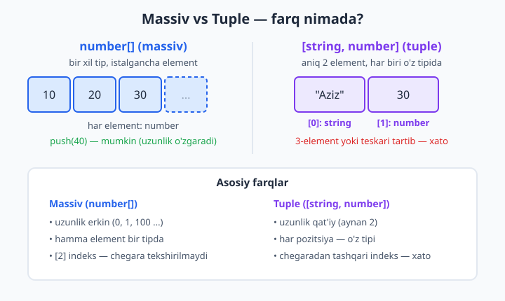
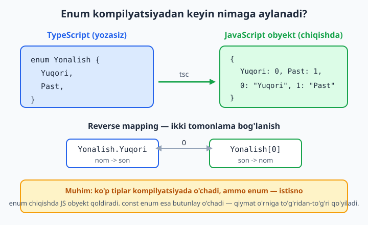
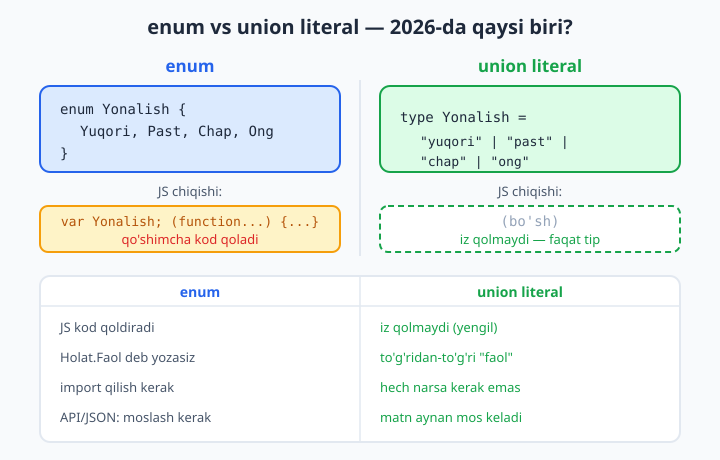

# 4 — Massivlar, tuple va enum

[⬅️ Oldingi: 03 — Asosiy tiplar va type inference](./03-asosiy-tiplar.md) · [🏠 README](./README.md) · [Keyingi: 05 — Object tiplari va interface ➡️](./05-object-interface.md)

> **Bu bobda:** bir turdagi qiymatlar ro'yxatini (massiv) va aniq tartibdagi qiymatlar to'plamini (tuple — uzunligi va har pozitsiya tipi qat'iy belgilangan ro'yxat) tiplashni o'rganamiz: `number[]` va `Array<number>`, aralash `(string | number)[]`, `readonly`, ko'p o'lchovli massivlar, tuple'ning optional/rest/named elementlari, destructuring; so'ng nomli konstantalar uchun enum (numeric, string, `const enum`) va nega 2026-da ko'p hollarda enum o'rniga union literal afzal ekanini ko'rib chiqamiz.

---

## Muammo

JavaScript'da massiv — eng ko'p ishlatadigan narsangiz. U yerda massivga istalgan narsani solishtiravering, hech kim to'xtatmaydi:

```js
// oddiy JavaScript — hamma narsa joyida ko'rinadi
let baholar = [5, 4, 3];
baholar.push("a'lo");      // hech kim e'tiroz bildirmadi...
let ortacha = baholar.reduce((a, b) => a + b, 0) / baholar.length;
console.log(ortacha);      // NaN — chunki ichida "a'lo" bor!
```

Bu xato **ishga tushganda** (runtime'da), ko'pincha foydalanuvchi ekranida `NaN` ko'rinib qolganda bilinadi. Massiv "ichida nima bor"ligini JavaScript eslab turmaydi.

Yana bir muammo — **tartib**. RGB rang uchta sondan iborat: `[255, 128, 0]`. Lekin oddiy massivda nima uchun aynan uchta? Nega sonlar? Kim adashib `[255, 128]` yoki `["255", 128, 0]` yozsa, JavaScript baribir indamaydi:

```js
function rangKodi([r, g, b]) {
  return `rgb(${r}, ${g}, ${b})`;
}
rangKodi([255, 128]);      // "rgb(255, 128, undefined)" — buzilgan, lekin xato yo'q
```

TypeScript ikkala muammoni ham **yozish paytida** hal qiladi: massiv tipi orqali "bu yerda faqat sonlar" deb belgilaysiz, tuple orqali esa "aniq 3 ta son, mana shu tartibda" deysiz. Keling, boshlaymiz.

> JavaScript massivlari va metodlari (map, filter, reduce, destructuring) yodingizdan ko'tarilgan bo'lsa, [JavaScript kitobi](../js/README.md)ga qaytib o'ting — bu bobda ularning ustiga faqat **tip** qatlamini qo'shamiz.

---

## Massiv tiplari: ikki yozuv, bitta ma'no

Bir turdagi qiymatlar ro'yxatini tiplashning ikki yo'li bor — ikkalasi **bir xil** narsani anglatadi:

```ts
let sonlar: number[] = [1, 2, 3];          // 1-uslub: qisqa
let ismlar: Array<string> = ["Aziz", "Malika"]; // 2-uslub: generic
```

`number[]` — "sonlar massivi", `Array<string>` — "stringlar massivi". `number[]` qisqaroq va keng tarqalgan, shuning uchun amalda ko'pincha o'shani yozasiz. `Array<string>` esa generic (umumlashgan tip — keyinroq 11-bobda chuqur ko'ramiz) yozuvi; ba'zan murakkab tiplarda qulayroq.

Endi `push` ham himoyalangan:

```ts
let sonlar: number[] = [1, 2, 3];
sonlar.push(4);            // ✅ son — joyida
sonlar.push("salom");     // ❌ Xato:
// Argument of type 'string' is not assignable to parameter of type 'number'.
```

📌 E'tibor bering: bu xato **terminalga `tsc` ishlatganda yoki muharrirda qizil chiziq** ko'rinishida chiqadi, dasturni ishga tushirishdan oldin. Muammodagi `NaN` endi paydo bo'lmaydi, chunki noto'g'ri qiymat massivga umuman kira olmaydi.

💡 3-bobdan eslang — type inference (tipni o'zi aniqlash) massivlarda ham ishlaydi. `: number[]` yozmasangiz ham TypeScript o'zi topadi:

```ts
let baholar = [5, 4, 3, 5];   // TypeScript buni number[] deb biladi
baholar.push(2);              // ✅
baholar.push("a'lo");         // ❌ Xato: string -> number emas
```

Shuning uchun ko'pincha tipni yozmasa ham bo'ladi — boshlang'ich qiymat tipni aytib turadi.

### Aralash massiv — union bilan

Massivda ikki xil tipni saqlash kerak bo'lsa, union (bir nechta tipdan biri — 7-bobda batafsil) ishlatiladi. Lekin qavslarga e'tibor bering:

```ts
let aralash: (string | number)[] = ["Aziz", 30, "Malika", 25]; // ✅
```

📌 Qavs muhim: `(string | number)[]` — "har elementi string yoki number bo'lgan massiv". Qavssiz `string | number[]` esa butunlay boshqa narsa: "yo bitta string, yo number massivi". Bittagina qavs ma'noni butunlay o'zgartiradi.

### readonly massiv — o'zgarmas ro'yxat

Massivni "muzlatib", o'zgartirishni taqiqlamoqchi bo'lsangiz `readonly` qo'ying:

```ts
let ranglar: readonly string[] = ["qizil", "yashil"];
let koords: ReadonlyArray<number> = [10, 20]; // bir xil ma'no, generic yozuv

console.log(ranglar[0]);   // ✅ o'qish — mumkin
ranglar.push("kok");       // ❌ Xato:
// Property 'push' does not exist on type 'readonly string[]'.
ranglar[0] = "qora";       // ❌ Xato:
// Index signature in type 'readonly string[]' only permits reading.
```

💡 `readonly` massivda `push`, `pop`, `splice` kabi **o'zgartiruvchi** metodlar yo'qoladi — faqat o'qish qoladi. Bu konstantalar, sozlamalar yoki funksiyaga "men buni o'zgartirmayman" deb va'da bermoqchi bo'lganingizda juda foydali.

### Ko'p o'lchovli massiv

`number[][]` — "sonlar massivi massivi", ya'ni jadval (matritsa):

```ts
let matritsa: number[][] = [
  [1, 2, 3],
  [4, 5, 6],
];
let katak: number = matritsa[0][1];   // 2
```

`[]` har qancha qo'shsangiz, shuncha o'lcham: `number[][][]` — uch o'lchovli kub.

### Massiv metodlari to'liq tiplangan

JavaScript metodlari (`map`, `filter`, `reduce`) TypeScript'da tiplarni avtomatik kuzatib boradi. Callback ichidagi parametr tipini yozmasangiz ham TypeScript biladi:

```ts
let narxlar = [100, 250, 75];                  // number[]

let chegirma = narxlar.map((n) => n * 0.9);    // n: number, natija: number[]
let qimmat = narxlar.filter((n) => n > 80);    // number[]
let jami = narxlar.reduce((a, b) => a + b, 0); // number

let ismlar = ["aziz", "malika"];
let katta = ismlar.map((s) => s.toUpperCase()); // s: number emas — string!
```

📌 `map` natijasining tipi callback nima qaytarishiga qarab o'zgaradi: `narxlar.map((n) => n > 80)` natijasi `number[]` emas, `boolean[]` bo'ladi. Bularning hammasini TypeScript siz yozmasangiz ham o'zi hisoblaydi.

## Tuple — uzunligi va tartibi qat'iy ro'yxat

Massiv "qancha bo'lsa shuncha bir xil element" deydi. **Tuple** (aniq uzunlik va har pozitsiyada aniq tip) esa boshqacha: "aynan shuncha element, har biri o'z tipida, mana shu tartibda".

```ts
let nuqta: [number, number] = [10, 20];          // x va y
let foydalanuvchi: [string, number] = ["Aziz", 30]; // ism, yosh
```

Tuple massivga o'xshab ko'rinadi (kvadrat qavs), lekin tip e'lonida elementlar **sanab** beriladi. Endi har pozitsiyaning tipi aniq:

```ts
let nuqta: [number, number] = [10, 20];
let x = nuqta[0];   // x: number
let y = nuqta[1];   // y: number
```



Massivda yo'q bo'lgan cheklovlar tuple'da bor — adashishlar darrov ushlanadi:

```ts
let nuqta: [number, number] = [10, 20];

let uch: [number, number] = [10, 20, 30];      // ❌ Xato:
// Source has 3 element(s) but target allows only 2.
let bir: [number, number] = [10];              // ❌ Xato:
// Source has 1 element(s) but target requires 2.
let teskari: [string, number] = [30, "Aziz"];  // ❌ Xato:
// Type 'number' is not assignable to type 'string'.
```

📌 **Tuple vs massiv — eng muhim farq.** `[number, number]` va `number[]` bir xil emas. Funksiya tuple kutsa, oddiy massiv bermaysiz:

```ts
function masofa(a: [number, number], b: [number, number]): number {
  return Math.hypot(b[0] - a[0], b[1] - a[1]);
}

let p: number[] = [1, 2];
masofa(p, [3, 4]);   // ❌ Xato:
// Argument of type 'number[]' is not assignable to parameter of type '[number, number]'.
// Target requires 2 element(s) but source may have fewer.
```

Mantiq: `number[]` ichida 0, 1 yoki 100 ta element bo'lishi mumkin — TypeScript "aynan 2 ta" deb kafolat bera olmaydi. Tuple esa kafolat beradi.

📌 Tuple chegarasidan tashqari indeks ham xato beradi (massivda bunday cheklov yo'q):

```ts
let nuqta: [number, number] = [10, 20];
console.log(nuqta[2]);   // ❌ Xato:
// Tuple type '[number, number]' of length '2' has no element at index '2'.

let massiv: number[] = [10, 20];
console.log(massiv[2]);  // ✅ kompilyatsiya o'tadi (natija: undefined)
```

### Tuple destructuring

JavaScript destructuring'i tuple bilan ayniqsa chiroyli ishlaydi — har o'zgaruvchi to'g'ri tipni oladi:

```ts
let nuqta: [number, number] = [10, 20];
let [enlik, kenglik] = nuqta;    // enlik: number, kenglik: number

let foydalanuvchi: [string, number] = ["Aziz", 30];
let [ism, yosh] = foydalanuvchi;
console.log(ism.toUpperCase()); // ✅ ism — string, .toUpperCase() bor
console.log(yosh + 1);          // ✅ yosh — number
```

💡 React'dagi `useState` shuning uchun aynan tuple qaytaradi: `const [son, setSon] = useState(0)`. Birinchi element — qiymat (`number`), ikkinchisi — uni o'zgartiruvchi funksiya. Tuple ularni bitta qaytaruv qiymatida, har biri o'z tipida saqlaydi. Buni o'zingiz ham yozishingiz mumkin:

```ts
function juftlik(): [number, () => void] {
  let qiymat = 0;
  return [qiymat, () => console.log("bosildi")];
}
let [son, funk] = juftlik();   // son: number, funk: () => void
funk();                         // "bosildi"
```

### Named, optional va rest tuple elementlari

**Named tuple** — pozitsiyalarga nom berib, kodni o'qiluvchanroq qiladi (faqat hujjat uchun, natijaga ta'sir qilmaydi):

```ts
let masofa: [boshi: number, oxiri: number] = [0, 100];
// muharrirda nuqtani ko'rsatganda "boshi" va "oxiri" deb ko'rsatadi
```

**Optional element** (`?`) — bo'lishi shart bo'lmagan oxirgi elementlar:

```ts
let sozlama: [string, number?] = ["dark"];        // ✅ ikkinchisi yo'q
let sozlama2: [string, number?] = ["light", 80];  // ✅ ikkinchisi bor
```

**Rest element** (`...`) — qolgan istalgancha bir xil tipli elementlar:

```ts
let yozuv: [string, ...number[]] = ["natijalar", 10, 20, 30]; // ✅
// birinchisi — sarlavha (string), qolgani — istalgancha son
```

**readonly tuple** — massivdagi kabi, muzlatish:

```ts
let muzlatilgan: readonly [number, number] = [3, 4];
muzlatilgan[0] = 5;   // ❌ Xato: faqat o'qish mumkin
```

## Enum — nomli konstantalar to'plami

Ba'zan qiymat aniq ro'yxatdan biri bo'lishi kerak: yo'nalish faqat "yuqori/past/chap/ong", holat faqat "faol/tugagan/...". JavaScript'da buni odatda "sehrli string"lar yoki sonlar bilan qilardingiz:

```js
let yonalish = "yuqori";   // adashib "yuqary" yozsangiz — hech kim aytmaydi
let holat = 1;             // 1 nimani anglatadi? kim biladi...
```

**enum** (sanab o'tiluvchi tip — nomli konstantalar to'plami) shu muammoni hal qiladi. Eng oddiy turi — **numeric enum**:

```ts
enum Yonalish {
  Yuqori,   // 0
  Past,     // 1
  Chap,     // 2
  Ong,      // 3
}

let q: Yonalish = Yonalish.Yuqori;
console.log(q);            // 0
console.log(Yonalish.Ong); // 3
```

TypeScript a'zolarga 0 dan boshlab avtomatik son beradi. Endi `Yonalish.Yuqori` deb yozasiz — adashib bo'lmaydi, muharrir ham to'rttala variantni taklif qiladi.

📌 Numeric enum ikki tomonlama ishlaydi (**reverse mapping**): nomdan songa ham, sondan nomga ham:

```ts
console.log(Yonalish.Chap);  // 2
console.log(Yonalish[2]);    // "Chap"
```

### String enum — o'qiladigan qiymatlar

Numeric enum'dagi `0`, `1` qiymatlari log'da yoki ma'lumotlar bazasida tushunarsiz ko'rinadi. **String enum** har a'zoga aniq matn beradi:

```ts
enum Holat {
  Faol = "FAOL",
  Tugagan = "TUGAGAN",
  Kutilmoqda = "KUTILMOQDA",
}

let h: Holat = Holat.Faol;
console.log(h);   // "FAOL" — log'da ham tushunarli
```

💡 String enum'da reverse mapping yo'q (`Holat["FAOL"]` ishlamaydi), lekin amalda string enum ko'pincha afzal: qiymatlar API javobida, log'da, bazada o'qiladigan ko'rinishda saqlanadi.

### enum kompilyatsiyadan keyin nimaga aylanadi?

TypeScript tiplari odatda kompilyatsiyada **o'chib ketadi** — JavaScript'ga aylanganda iz qolmaydi. Lekin enum **istisno**: u haqiqiy JavaScript obyektiga aylanadi. Shuning uchun enum nafaqat tip, balki kodda yashaydigan **qiymat** hamdir.



```ts
// TypeScript:
enum Yonalish { Yuqori, Past }
```

```js
// Kompilyatsiyadan keyin (taxminan):
var Yonalish;
(function (Yonalish) {
  Yonalish[Yonalish["Yuqori"] = 0] = "Yuqori";
  Yonalish[Yonalish["Past"] = 1] = "Past";
})(Yonalish || (Yonalish = {}));
// natijada: { 0: "Yuqori", 1: "Past", Yuqori: 0, Past: 1 }
```

### const enum — kompilyatsiyada butunlay o'chadi

Agar enum'ni faqat qiymatlarni nomlash uchun ishlatsangiz va yuqoridagi qo'shimcha obyekt kerak bo'lmasa, **`const enum`** ishlating. U JavaScript'ga aylanganda **butunlay yo'qoladi** — har bir ishlatilgan joyiga to'g'ridan-to'g'ri qiymat qo'yiladi:

```ts
const enum Olcham {
  Kichik,
  Orta,
  Katta,
}
let o = Olcham.Katta;
```

```js
// Kompilyatsiyadan keyin — hech qanday obyekt yo'q, faqat qiymat:
let o = 2 /* Olcham.Katta */;
```

📌 `const enum` kichikroq va tezroq JavaScript beradi, lekin ba'zi build sozlamalari (masalan `isolatedModules`) bilan muammo chiqarishi mumkin. Shubha bo'lsa — oddiy enum yoki keyingi bo'limdagi union literal'ni tanlang.

## enum vs union literal — 2026-da qaysi biri?

Mana eng muhim tavsiya. Ko'p hollarda enum'ga **umuman ehtiyoj yo'q** — uning o'rniga **union literal** (aniq qiymatlar to'plamidan iborat tip) ishlatish zamonaviyroq va yengilroq:

```ts
// enum o'rniga:
type Yonalish = "yuqori" | "past" | "chap" | "ong";

let yu: Yonalish = "chap";   // ✅
let xato: Yonalish = "tepa"; // ❌ Xato:
// Type '"tepa"' is not assignable to type 'Yonalish'.
```

`Yonalish` endi shunchaki bir tip — to'rtta matndan biri. Funksiyaga ham to'g'ridan-to'g'ri beraverasiz:

```ts
function harakat(yon: Yonalish): void {
  console.log("Harakat:", yon);
}
harakat("ong");   // ✅
harakat("tepa");  // ❌ Xato: ruxsat etilgan qiymat emas
```



**Nega union literal ko'pincha afzal:**

| Jihati | `enum` | union literal (`"a" \| "b"`) |
|---|---|---|
| Kompilyatsiyada JS kod | qoldiradi (qo'shimcha obyekt) | iz qolmaydi (faqat tip) |
| Qiymatlar | `Holat.Faol` deb yozasiz | to'g'ridan-to'g'ri `"faol"` |
| Import qilish | enum'ni import qilish kerak | hech narsa kerak emas |
| API/JSON bilan | qiymatni moslashtirish kerak | matn aynan mos keladi |
| Soddalik | ko'proq sintaksis | minimal |

💡 Union literal bilan ham **to'liqlik tekshiruvi** (exhaustiveness check) qilish mumkin. `never` tipidan (hech qachon bo'lmaydigan qiymat — 9-bobda batafsil) foydalanib, switch'da biror variantni unutib qoldirsangiz, TypeScript ogohlantiradi:

```ts
type Yonalish = "yuqori" | "past" | "chap" | "ong";

function burchak(y: Yonalish): number {
  switch (y) {
    case "yuqori": return 0;
    case "past":   return 180;
    case "chap":   return 270;
    case "ong":    return 90;
    default:
      const tekshir: never = y; // bu yerga hech qachon yetib kelmaydi
      return tekshir;
  }
}
```

Endi `Yonalish`ga yangi qiymat (masalan `"ortada"`) qo'shsangiz, lekin `switch`ni yangilashni unutsangiz:

```ts
type Yonalish = "yuqori" | "past" | "chap" | "ong" | "ortada"; // yangi qiymat
// ... switch o'sha-o'sha ...
    default:
      const tekshir: never = y; // ❌ Xato:
      // Type '"ortada"' is not assignable to type 'never'.
```

Bu — bepul "esdan chiqarmaslik" mexanizmi: yangi holatni qayerda qo'shish kerakligini TypeScript o'zi ko'rsatib beradi.

📌 **Qachon enum hali ham mantiqiy?** Numeric qiymatlar muhim bo'lganda (masalan bit bayroqlari), yoki katta jamoa enum'larga o'rganib qolgan eski kodda. Yangi kod yozayotganda esa — avval union literal'ni o'ylab ko'ring.

💡 Union literal'ni `as const` bilan birga ishlatish ham keng tarqalgan. Massivni `as const` qilsangiz, u o'zgarmas tuple'ga aylanadi va qiymatlar aniq literal bo'lib qoladi:

```ts
const olchamlar = ["S", "M", "L"] as const;
// tip: readonly ["S", "M", "L"]
type Olcham = (typeof olchamlar)[number]; // "S" | "M" | "L"
```

Bu — "yagona haqiqat manbai": ro'yxatni bir joyda yozasiz, tip esa undan avtomatik kelib chiqadi. (`typeof` va `keyof` kabi imkoniyatlarni 12-bobda chuqur ko'ramiz.)

---

## Xulosa

- Massiv: `number[]` yoki `Array<number>` — bir turdagi istalgancha element. Aralash uchun `(string | number)[]`, muzlatish uchun `readonly number[]`.
- Tuple: `[string, number]` — aniq uzunlik, har pozitsiyada aniq tip. Optional (`?`), rest (`...`), named va `readonly` variantlari bor. Destructuring bilan ayniqsa qulay.
- Enum: nomli konstantalar. Numeric (0, 1, ...), string (`"FAOL"`), `const enum` (kompilyatsiyada o'chadi). Enum tip emas — kompilyatsiyada JS obyekti qoldiradi.
- **2026 tavsiyasi:** ko'p hollarda enum o'rniga union literal (`"a" | "b"`) ishlating — yengilroq, JS izi qolmaydi, `never` bilan to'liqlik tekshiruvi mumkin.

Keyingi bobda obyektlarni tiplashga — `interface`ga o'tamiz.

## 4-bob mashqlari

> Yechimlarni yozmadim — har birini o'zingiz `tsc --noEmit --strict` bilan tekshiring. Ataylab xatoli deb belgilangan joylarda haqiqatan xato chiqishini ko'ring.

1. `number[]` tipida `bahollar` massivini e'lon qiling va 5, 4, 3 qiymat bering. Unga `push` bilan yana bitta son qo'shing.
2. Bir xil massivni `Array<string>` yozuvi bilan e'lon qiling (`tillar` — dasturlash tillari ro'yxati). Ikkala yozuv bir xil natija berishiga ishonch hosil qiling.
3. Type inference'ga tayanib (tipni o'zingiz yozmasdan) `narxlar = [100, 250, 75]` deb e'lon qiling, so'ng unga `string` qo'shib ko'ring — qanday xato chiqadi?
4. `(string | number)[]` tipida aralash massiv yarating. So'ng qavsni olib tashlab `string | number[]` qilib ko'ring va ma'no qanday o'zgarishini kuzating.
5. `readonly string[]` tipida `haftaKunlari` massivini yarating va unga `push` qilishga uringa — chiqqan xato matnini o'qing.
6. `number[][]` tipida 3x3 matritsa yarating va uning markaziy katagini (`[1][1]`) o'qing.
7. `narxlar` massiviga `map` qo'llab har bir narxni 20% kamaytiring, natija tipi nima bo'lishini tekshiring (muharrirda kursorni qo'yib ko'ring).
8. Xuddi shu massivga `filter` qo'llab faqat 100 dan katta narxlarni qoldiring, so'ng `reduce` bilan ularning yig'indisini hisoblang.
9. `[number, number]` tuple tipida `koordinata` e'lon qiling (x, y). Unga uchta element berib ko'ring — xato matnini o'qing.
10. `[number, number, number]` tuple tipida RGB rang e'lon qiling. So'ng uni `[r, g, b]` destructuring bilan uchta o'zgaruvchiga ajrating.
11. `[string, number]` tuple tipida `foydalanuvchi` (ism, yosh) e'lon qiling. Qiymatlarni teskari (`[30, "Aziz"]`) berib ko'ring va xatoni ko'ring.
12. `[boshi: number, oxiri: number]` named tuple e'lon qiling. Muharrirda `[0]` indeksiga kursor qo'yib, nom ko'rinishini tekshiring.
13. `[string, number?]` optional tuple yarating. Avval ikkinchi elementsiz, so'ng u bilan qiymat bering.
14. `[string, ...number[]]` rest tuple yarating: birinchisi — sarlavha, qolgani — istalgancha son. Kamida 4 element bering.
15. `readonly [number, number]` tuple yarating va birinchi elementini o'zgartirishga uringa — qanday xato chiqadi?
16. `function masofa(a: [number, number], b: [number, number]): number` yozing (Math.hypot bilan). Unga `number[]` tipidagi o'zgaruvchi berib ko'ring — nega xato chiqadi?
17. `numeric enum` `Kun` yarating (Dushanba, Seshanba, ...). `Kun.Seshanba` qiymatini va `Kun[1]` (reverse mapping) ni log qiling.
18. `string enum` `Holat` yarating (`Faol = "FAOL"`, `Tugagan = "TUGAGAN"`). `Holat.Faol` ni log qilib, qiymat aynan `"FAOL"` ekanini ko'ring.
19. `const enum` `Olcham` yarating. Uni qiymatga bering. (Imkoni bo'lsa) `tsc` bilan JS'ga kompilyatsiya qilib, enum kodning chiqishda yo'qolganini ko'ring.
20. 17-mashqdagi `Kun` enum'ini **union literal** (`"dushanba" | "seshanba" | ...`) bilan almashtiring. So'ng `never` ishlatib, switch ichida bitta kunni unutib qoldiring va to'liqlik tekshiruvi xatosini ko'ring.
