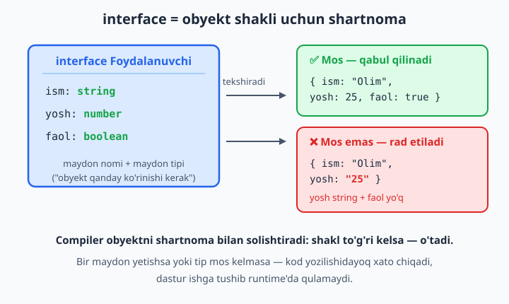
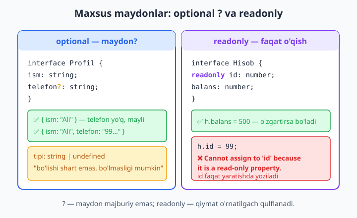
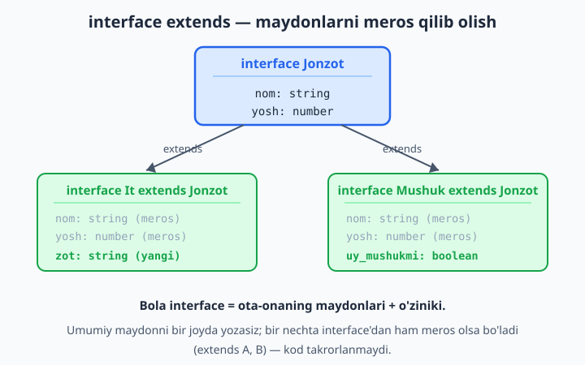

# 5 — Object tiplari va interface

[⬅️ Oldingi: 04 — Massivlar, tuple va enum](./04-massiv-tuple-enum.md) · [🏠 README](./README.md) · [Keyingi: 06 — Funksiya tiplari ➡️](./06-funksiya-tiplari.md)

> **Bu bobda:** real dasturlarda ma'lumot ko'pincha obyekt shaklida yuradi — foydalanuvchi, mahsulot, API javobi. Shu obyektning "shaklini" (qaysi maydon bor, qaysi tipda) TypeScript'ga qanday tushuntirishni o'rganamiz: inline object type, `interface`, optional `?` va `readonly` maydonlar, index signature `[key: string]`, `extends` bilan kengaytirish, method maydonlari, `interface` va `type` farqi hamda TypeScript'ning yuragidagi g'oya — strukturaviy tiplilik (shakl mos kelsa — mos).

---

## Muammo

JavaScript'da bu kod ko'p marta yozilgan:

```js
function salomBer(odam) {
  return "Salom, " + odam.ism + "! Yoshingiz " + odam.yosh;
}

salomBer({ ism: "Olim", yosh: 25 });   // "Salom, Olim! Yoshingiz 25"
salomBer({ isim: "Olim", yosh: 25 });  // "Salom, undefined! Yoshingiz 25"  ❌
salomBer("Olim");                      // "Salom, undefined! Yoshingiz undefined"  ❌
```

Ikkinchi chaqiruvda `ism` o'rniga `isim` deb xato yozdik — JavaScript indamaydi, oddiygina `undefined` qaytaradi. Uchinchisida butunlay string berdik — yana xato yo'q, lekin natija buzuq. Bu xatolar **runtime'da**, ya'ni dastur foydalanuvchi qo'lida ishlayotganda chiqadi va ko'pincha allaqachon kech bo'ladi.

Muammoning ildizi shu: JavaScript funksiyaga **qanday shakldagi** obyekt kelishini bilmaydi. Biz `odam`da `ism` va `yosh` bo'lishini *kutamiz*, lekin bu kutish hech qayerda yozilmagan.

TypeScript aynan shu kutishni **yozib qo'yish** imkonini beradi. Obyektning shaklini bir marta belgilaysiz — compiler keyin har bir chaqiruvni tekshiradi:

```ts
function salomBer(odam: { ism: string; yosh: number }): string {
  return `Salom, ${odam.ism}! Yoshingiz ${odam.yosh}.`;
}

salomBer({ ism: "Olim", yosh: 25 });   // ✅ OK
```

Bu `{ ism: string; yosh: number }` — **inline object type** (joyida yozilgan obyekt tipi). U funksiyaga: "menga faqat `ism` (string) va `yosh` (number) bor obyekt ber" deydi. Endi xato yozsangiz, kod **yozilishidayoq** belgilanadi — keling, shuni qadam-baqadam ochamiz.

## Inline object type — joyidagi shakl

Eng oddiy yo'l — tipni o'sha yerning o'zida, jingalak qavs ichida sanab yozish:

```ts
let mashina: { rusum: string; yili: number } = {
  rusum: "Cobalt",
  yili: 2022,
};

mashina.yili = 2023; // ✅ number kutiladi
```

Maydonlar orasini nuqtali-vergul (`;`) bilan ajratamiz (vergul ham ishlaydi, lekin tip ichida `;` odat). Endi ataylab xato qilamiz:

```ts
interface Foydalanuvchi {
  ism: string;
  yosh: number;
  faol: boolean;
}

// ❌ Xato: yosh string berildi
const u: Foydalanuvchi = { ism: "Olim", yosh: "25", faol: true };
// error TS2322: Type 'string' is not assignable to type 'number'.
```

```ts
// ❌ Xato: faol maydoni umuman yo'q
const u: Foydalanuvchi = { ism: "Olim", yosh: 25 };
// error TS2741: Property 'faol' is missing in type
//   '{ ism: string; yosh: number; }' but required in type 'Foydalanuvchi'.
```

📌 Inline tip bitta joyda yaxshi, lekin bir xil shaklni 3-4 joyda takrorlasangiz — `{ ism: string; yosh: number; faol: boolean }` ni har safar qayta yozish charchatadi va xatoga olib keladi. Aynan shu yerda **interface** kerak bo'ladi.

## interface — nomli obyekt shakli

`interface` — obyekt shakliga **nom berish** usuli. Bir marta yozasiz, keyin shu nomni hamma joyda ishlatasiz. Buni obyekt bilan dastur o'rtasidagi **shartnoma** deb tushuning: "menga shu interface'ga mos obyekt bermasangiz, kelishmaganmiz".

```ts
interface Foydalanuvchi {
  ism: string;
  yosh: number;
  faol: boolean;
}

function malumotKorsat(u: Foydalanuvchi): void {
  console.log(`${u.ism}, ${u.yosh} yosh, faol: ${u.faol}`);
}

const u1: Foydalanuvchi = { ism: "Olim", yosh: 25, faol: true };
malumotKorsat(u1); // ✅
```



E'tibor bering: `interface` nomi odatda **katta harf** bilan boshlanadi (`Foydalanuvchi`, `Mahsulot`) — bu tip ekanini ko'rsatadi.

💡 `interface` — faqat **compile** (kod mashina o'qiydigan JavaScript'ga aylantirilishi) bosqichidagi narsa. Yaratilgan JavaScript faylida `interface`dan asar ham qolmaydi — u runtime'da hech qanday kod chiqarmaydi, faqat compiler'ga yo'l-yo'riq beradi. Demak, interface tezlikni sekinlashtirmaydi: u shunchaki yozuv paytidagi "tekshiruvchi".

📌 `interface` so'ngida nuqtali-vergul (`;`) yoki vergul kerak emas — ko'pchilik uni `;` bilan tugatmaydi:

```ts
interface Mahsulot {
  nom: string;
  narx: number; // oxirgi maydondan keyin ; ixtiyoriy
}
```

## Optional maydon — `?`

Har doim ham hamma maydon majburiy emas. Masalan, profilga telefon kiritish ixtiyoriy bo'lishi mumkin. Maydon nomidan keyin `?` qo'ysangiz — u **optional** (bo'lishi shart emas) bo'ladi:

```ts
interface Profil {
  ism: string;
  telefon?: string; // bo'lishi ham, bo'lmasligi ham mumkin
}

const p1: Profil = { ism: "Ali" };                       // ✅ telefon yo'q
const p2: Profil = { ism: "Vali", telefon: "+99890..." }; // ✅ telefon bor
```

`telefon?` ning haqiqiy tipi — `string | undefined`. Ya'ni u yo string, yo umuman yo'q (undefined). Shuning uchun unga to'g'ridan-to'g'ri murojaat qilolmaysiz:

```ts
function uzunlik(p: Profil): number {
  // ❌ Xato: telefon undefined bo'lishi mumkin
  return p.telefon.length;
  // error TS18048: 'p.telefon' is possibly 'undefined'.
}
```

Compiler haq: agar `p1` kabi telefoni yo'q obyekt kelsa, `undefined.length` runtime'da dasturni qulatardi. To'g'ri yo'l — avval tekshirish (bu **narrowing**, 8-bobda chuqur o'rganamiz):

```ts
function profilChop(p: Profil): void {
  console.log(p.ism);
  if (p.telefon !== undefined) {
    console.log("Telefon: " + p.telefon.trim()); // ✅ bu yerda telefon — string
  } else {
    console.log("Telefon kiritilmagan");
  }
}
```

📌 `telefon?: string` va `telefon: string | undefined` deyarli bir xil ko'rinadi, lekin farqi bor: birinchisida maydonni **umuman yozmasangiz** ham bo'ladi (`{ ism: "Ali" }`); ikkinchisida maydon majburiy — uni hech bo'lmasa `telefon: undefined` deb yozishingiz shart.

## readonly — faqat o'qiladigan maydon

Ba'zi maydonlar bir marta o'rnatiladi va keyin **o'zgarmaydi** — masalan, yozuvning `id`si. Maydon oldiga `readonly` qo'ysangiz, uni yaratishdan keyin o'zgartirib bo'lmaydi:

```ts
interface Hisob {
  readonly id: number;
  balans: number;
}

const h: Hisob = { id: 1, balans: 1000 };
h.balans = 500; // ✅ balans o'zgaruvchan
```

```ts
// ❌ Xato: id ni o'zgartirib bo'lmaydi
h.id = 99;
// error TS2540: Cannot assign to 'id' because it is a read-only property.
```



📌 `readonly` ham faqat compile bosqichidagi himoya. JavaScript'da `Object.freeze` kabi runtime qulflash emas — yaratilgan JS faylda maydon oddiy o'zgaruvchan bo'lib qoladi. Maqsadi: **siz** xato bilan o'zgartirib qo'ymasligingiz. Bu ko'pincha kifoya.

💡 Massiv yoki obyektni butunlay "muzlatish" uchun `readonly Foydalanuvchi[]` yoki `ReadonlyArray<...>` ham bor — bularni 14-bobdagi utility types bilan kengroq ko'ramiz.

## Index signature — noma'lum nomli maydonlar

Hozirgacha maydon nomlarini oldindan bilardik (`ism`, `yosh`). Lekin ba'zan **maydon nomlari oldindan noma'lum** bo'ladi — masalan, lug'at: kalit har qanday so'z, qiymat esa tarjima. Mana shu yerda **index signature** (indeks imzosi) yordamga keladi:

```ts
interface Lugat {
  [soz: string]: string; // "kaliti string bo'lgan har qanday maydon — qiymati string"
}

const tarjima: Lugat = {
  kitob: "book",
  qalam: "pen",
};
tarjima["daftar"] = "notebook"; // ✅ yangi kalit qo'shsak ham bo'ladi
console.log(tarjima.kitob);     // "book"
```

`[soz: string]` ichidagi `soz` — shunchaki nom, istalgan so'z yozsa bo'ladi (`[kalit: string]`). Muhimi — kalit tipi (`string`) va qiymat tipi (oxirgi `string`).

Endi qiymat tipiga mos kelmasa, xato chiqadi:

```ts
// ❌ Xato: index signature qiymati string bo'lishi kerak edi
const t: Lugat = { kitob: "book", soni: 5 };
// error TS2322: Type 'number' is not assignable to type 'string'.
```

Index signature'ni **aniq maydonlar bilan aralashtirsa** ham bo'ladi. Faqat aniq maydon tipi index signature qiymat tipiga sig'ishi shart:

```ts
interface Ball {
  ism: string;                  // aniq maydon
  [fan: string]: string | number; // qolgan barcha maydonlar
}

const talaba: Ball = { ism: "Sardor", matematika: 90, fizika: 85 }; // ✅
```

📌 Bu yerda `ism` tipi (`string`) index signature tipiga (`string | number`) sig'gani uchun ishladi. Agar `ism: boolean` desangiz, xato chiqardi — chunki har bir aniq maydon ham "qolgan hamma maydon" qoidasiga bo'ysunishi kerak.

💡 Amalda noma'lum shakldagi ma'lumot uchun ko'pincha `Record<string, string>` (utility type, 14-bob) yozish qulayroq va o'qilishi oson. Lekin index signature ostida aynan shu mexanizm ishlaydi.

## Method va funksiya maydonlari

Obyekt ichida funksiya bo'lishi mumkin. interface'da uni ikki xil yozish mumkin — ikkalasi ham to'g'ri:

```ts
interface Kalkulyator {
  natija: number;
  qoshish(son: number): void;        // method sintaksisi
  ayirish: (son: number) => void;    // funksiya-maydon sintaksisi
}

const k: Kalkulyator = {
  natija: 0,
  qoshish(son: number): void {
    this.natija += son;
  },
  ayirish(son: number): void {
    this.natija -= son;
  },
};

k.qoshish(5);
k.ayirish(2);
console.log(k.natija); // 3
```

`qoshish(son: number): void` — bu obyektga **method** sifatida funksiya borligini bildiradi. `ayirish: (son: number) => void` — interface'da maydonga funksiya tipi bergan; obyektda esa uni shu method sintaksisi bilan amalga oshirdik. Farqi nozik, lekin amalda muhim: method sintaksisida `this` obyektga (`k`ga) bog'lanadi, shuning uchun `this.natija` ishlaydi. Agar `ayirish`ni arrow funksiya (`(son) => { this.natija -= son }`) bilan yozsangiz, `this` obyektga emas, tashqi (global) qiymatga bog'lanadi va compiler xato beradi — shu sababli obyekt method'larida arrow emas, method sintaksisini ishlating. Funksiya tiplari va `this` haqida 6-bobda batafsil to'xtalamiz.

## interface'ni kengaytirish — `extends`

Tasavvur qiling: `It` ham, `Mushuk` ham jonzot — ikkalasida `nom` va `yosh` bor. Bu umumiy maydonlarni har safar qayta yozmaslik uchun `extends` (kengaytirish) ishlatamiz. Bola interface ota-interface'ning **hamma maydonini meros qilib oladi** va ustiga o'zinikini qo'shadi:

```ts
interface Jonzot {
  nom: string;
  yosh: number;
}

interface It extends Jonzot {
  zot: string; // It'da qo'shimcha maydon
}

const bobik: It = { nom: "Bobik", yosh: 3, zot: "alabay" }; // ✅ uchchala maydon ham kerak
```



Bitta interface bir nechta interface'dan ham meros olishi mumkin — ularni vergul bilan sanaysiz:

```ts
interface Vaqt {
  yaratilgan: Date;
}
interface IdLi {
  id: number;
}

interface Maqola extends Vaqt, IdLi {
  sarlavha: string;
}

const m: Maqola = { id: 1, yaratilgan: new Date(), sarlavha: "TS bilan ishlash" };
// ✅ Maqola = Vaqt + IdLi + o'ziniki
```

💡 `extends` bilan kichik, qayta ishlatiladigan interface'lardan kattalarini "yig'asiz". Bu — DRY (Don't Repeat Yourself — o'zingni takrorlama) tamoyilining tip darajasidagi ko'rinishi.

## Declaration merging — interface'ning maxsus xususiyati

interface'da g'alati, lekin foydali bir narsa bor: **bir nomli interface'ni ikki marta** e'lon qilsangiz, TypeScript ularni xato deb hisoblamaydi — aksincha, **birlashtiradi** (declaration merging):

```ts
interface Sozlama {
  til: string;
}
interface Sozlama {
  qorongi: boolean;
}

// Endi Sozlama'da ikkala maydon ham bor:
const s: Sozlama = { til: "uz", qorongi: true }; // ✅
```

📌 Bu kundalik kodda kamdan-kam kerak bo'ladi va ataylab ishlatish odatda chalkashlik tug'diradi. Lekin u **mavjud tiplarni kengaytirish** uchun juda qulay — masalan, kutubxona bergan tipga o'z maydoningizni qo'shish (17- va 21-boblarda `.d.ts` fayllar bilan ko'ramiz). Hozircha shuni bilib qo'ying: bu — `interface`da bor, `type`da yo'q xususiyat.

## interface vs type alias — qaysi birini tanlash?

4-bobda `type` (type alias — tipga taxallus) bilan tanishgansiz. Obyekt shakli uchun `type` ham ishlaydi:

```ts
type Manzil = {
  shahar: string;
  kocha: string;
};

const adr: Manzil = { shahar: "Toshkent", kocha: "Amir Temur" }; // ✅
```

Ko'p hollarda `interface` va `type` **bir-birini almashtira oladi**. Ikkalasi ham obyekt shaklini bera oladi, `extends`/`&` bilan kengaytiriladi. Unda farqi nimada?

| | interface | type alias |
|---|---|---|
| Obyekt shakli | ✅ | ✅ |
| Kengaytirish | `extends` | `&` (intersection) |
| Union (`A \| B`) | ❌ | ✅ |
| Primitive/tuple'ga nom | ❌ | ✅ (`type Id = number`) |
| Declaration merging | ✅ | ❌ |

`type` qila oladigan, `interface` qila olmaydigan asosiy narsa — **union** va boshqa murakkab tiplar:

```ts
// ✅ Bu faqat type bilan mumkin:
type Holat = "kutilmoqda" | "tasdiqlandi" | "bekor";
type Id = number | string;

const holat: Holat = "tasdiqlandi";
```

`interface` da esa `extends` va declaration merging bor.

💡 **Amaliy qoida (2026):**
> - Obyekt yoki klass shakli, ayniqsa kengaytiriladigan / kutubxona uchun ochiq tip — **`interface`**.
> - Union, literal, tuple, yoki murakkab tip kompozitsiyasi — **`type`**.
> - Ikkalasi ham yarasa — bitta loyihada bittasini tanlab, izchil ishlating.

Bularning ortidagi `type` imkoniyatlari (intersection `&`, union) bilan 7-, 9- va 10-boblarda chuqurroq ishlaymiz. Hozircha: obyekt shakli uchun ikkalasi ham yaraydi.

## Strukturaviy tiplilik — TypeScript'ning yuragi

Endi eng muhim g'oya. Ba'zi tillar (masalan, Java) tiplarni **nomi** bo'yicha solishtiradi: tip `Nuqta` deb atalmasa, u `Nuqta` emas. TypeScript esa boshqacha — u **shaklni** solishtiradi. Buni **strukturaviy tiplilik** (structural typing) deyiladi: agar obyektning shakli kerakli shaklga mos kelsa, nomi nima bo'lishidan qat'i nazar, u **mos** hisoblanadi.

```ts
interface Nuqta {
  x: number;
  y: number;
}

function masofa(n: Nuqta): number {
  return Math.sqrt(n.x * n.x + n.y * n.y);
}

// koordinata Nuqta deb e'lon qilinmagan, lekin x va y bor — va qo'shimcha nom:
const koordinata = { x: 3, y: 4, nom: "A" };

console.log(masofa(koordinata)); // ✅ 5 — shakl mos kelgani uchun ishlaydi
```

`koordinata` hech qaerda `Nuqta` deb belgilanmagan, hatto qo'shimcha `nom` maydoni ham bor. Lekin unda `x: number` va `y: number` borligi uchun u `Nuqta` "shartnomasini" qondiradi — demak `masofa`ga mos keladi. "`x` va `y` bor — boshqasi muhim emas."

📌 Lekin bitta tuzoq bor. Obyektni **to'g'ridan-to'g'ri literal** (joyida yozilgan `{ ... }`) sifatida bersangiz, TypeScript qo'shimcha maydonlarga qattiqroq qaraydi — buni **excess property check** (ortiqcha maydon tekshiruvi) deyiladi:

```ts
// ❌ Xato: literal'da ortiqcha maydon
const n: Nuqta = { x: 3, y: 4, nom: "A" };
// error TS2353: Object literal may only specify known properties,
//   and 'nom' does not exist in type 'Nuqta'.
```

Nega yuqorida `koordinata` o'tdi-yu, bu o'tmadi? Chunki `koordinata` avval o'zgaruvchiga yozilgan, keyin uzatilgan — TypeScript faqat shaklni solishtirdi. Bu yerda esa `{ ... }` **bevosita** `Nuqta`ga berildi — compiler bunday holatda "ehtimol `nom`ni xato yozgandirsiz yoki interface'ga maydon qo'shishni unutgandirsiz" deb ogohlantiradi. Bu — foydali himoya, terish xatolarini ushlaydi.

💡 Strukturaviy tiplilikning ulkan foydasi: tiplar bir-biriga "yopishib" qolmaydi. Bir funksiyaga turli joydan kelgan, har xil nomdagi, lekin shakli mos obyektlarni berolasiz — bu kodingizni moslashuvchan qiladi.

## Hammasini birlashtirib — kichik misol

Mana o'rganganlarimizning birgalikdagi ko'rinishi — kichik do'kon mahsuloti:

```ts
interface Olchov {
  birlik: "dona" | "kg" | "litr";
  miqdor: number;
}

interface Mahsulot extends Olchov {
  readonly id: number;
  nom: string;
  narx: number;
  chegirma?: number; // ixtiyoriy
}

function yakuniyNarx(m: Mahsulot): number {
  const chegirma = m.chegirma ?? 0; // chegirma bo'lmasa 0 (?? — JS'dan tanish)
  return m.narx * m.miqdor * (1 - chegirma / 100);
}

const olma: Mahsulot = {
  id: 1,
  nom: "Olma",
  narx: 12000,
  birlik: "kg",
  miqdor: 3,
  chegirma: 10,
};

console.log(yakuniyNarx(olma)); // 32400
```

`Mahsulot` — `Olchov`ni kengaytiradi (`birlik`, `miqdor` meros), `readonly id` o'zgarmaydi, `chegirma?` ixtiyoriy, `birlik` esa literal union (faqat shu uch qiymatdan biri). Bularning hammasi bitta tabiiy modelda birlashdi.

> JavaScript'da obyektlar bilan ishlash asoslarini takrorlamoqchi bo'lsangiz — [JavaScript kitobi](../js/README.md)dagi obyektlar bo'limiga qayting. Bu yerda biz faqat ularga **tip** qo'shishni ko'rdik.

---

## 5-bob mashqlari

Quyidagi mashqlarni o'zingiz yozib bajaring. Har birini `tsc --noEmit --strict` bilan tekshirib ko'ring — toza misollar xatosiz o'tsin, "xato chiqishi kerak" deganlarida compiler aynan kutilgan xabarni bersin.

1. `Kitob` nomli interface yozing: `sarlavha` (string), `betlar` (number), `sotuvda` (boolean) maydonlari bilan. Unga mos bitta obyekt yarating.

2. Yuqoridagi `Kitob` tipidagi obyektni qabul qilib, "`<sarlavha>` — `<betlar>` bet" qaytaradigan `tavsif` funksiyasini yozing.

3. Inline object type ishlating: `markaz` funksiyasi `{ x: number; y: number }` qabul qilib, ikkalasining o'rtacha qiymatini chop etsin (interface yaratmang).

4. `Foydalanuvchi` interface'iga `email?` optional maydon qo'shing. Email bor bo'lsa uni chop etadigan, bo'lmasa "email yo'q" deydigan funksiya yozing (narrowing bilan).

5. `Sozlama` interface'ida `readonly versiya: number` maydoni bo'lsin. Obyekt yarating va `versiya`ni o'zgartirishga urinib ko'ring — qanday xato chiqishini yozib oling (`TS2540`).

6. `readonly` va `?` ni bitta interface'da birlashtiring: `Buyurtma`da `readonly id` (number), `izoh?` (string) va `summa` (number) bo'lsin.

7. Telefon kitobi uchun index signature yozing: `Telefonlar` interface'ida kalit — ism (string), qiymat — raqam (string). Uchta yozuv qo'shing.

8. `Ballar` interface'ida `[fan: string]: number` index signature bo'lsin. Bitta talabaning ballarini yozib, `matematika` balini chop eting.

9. 8-mashqdagi `Ballar`ga aniq `ism: string` maydon qo'shishga urinib ko'ring. Nega xato chiqadi? `[fan: string]: number | string` qilib tuzating.

10. `Mahsulot` interface'iga `narxniHisobla(soni: number): number` method e'lon qiling. Obyekt yarating va methodni chaqiring.

11. `Hayvon` interface'i (`nom: string`) ni yozib, undan `extends` bilan `Qush` (qo'shimcha `ucha_oladi: boolean`) interface'ini hosil qiling.

12. `extends` bilan ikki interface'dan meros oling: `Vaqt` (`yaratilgan: Date`) va `Muallifli` (`muallif: string`) dan `Maqola`ni (`sarlavha: string`) hosil qiling.

13. Bir nomli `Konfig` interface'ini ikki marta e'lon qiling (declaration merging): birinchisida `til: string`, ikkinchisida `tema: string`. Ikkala maydonli obyekt yarating.

14. Bir xil `Nuqta` shaklini avval `interface`, keyin `type` bilan yozing. Ikkalasi ham bir xil obyektga mos kelishini tekshiring.

15. `interface` qila olmaydigan, `type` qila oladigan misol yozing: `Yonalish` deb `"shimol" | "janub" | "sharq" | "garb"` literal union yarating.

16. `JavobHolati` ni `type` bilan `"yuklanmoqda" | "muvaffaqiyat" | "xato"` qilib yozing. Shu tipdagi o'zgaruvchini har uch qiymatga navbatma-navbat o'rnating.

17. Strukturaviy tiplilikni ko'rsating: `Ism` interface'i (`ism: string`) ni qabul qiladigan funksiya yozing. Unga `ism` va qo'shimcha `yosh` maydoni bor, oldindan o'zgaruvchiga yozilgan obyekt bering — o'tishini ko'ring.

18. Excess property check'ni "ushlang": 17-mashqdagi funksiyaga obyektni endi **to'g'ridan-to'g'ri literal** sifatida (qo'shimcha maydon bilan) bering. Qanday xato chiqadi (`TS2353`)?

19. Kichik loyiha: `Foydalanuvchi` (`readonly id`, `ism`, `email?`) va undan `extends` qiluvchi `Admin` (`huquqlar: string[]`) interface'larini yozing. Bitta admin obyekti yarating.

20. Yakuniy: 19-mashqdagi `Foydalanuvchi`lardan iborat massiv (`Foydalanuvchi[]`) tuzing, ulardan emaili bor bo'lganlarini `filter` bilan ajratib, ismlarini chop eting. Optional maydonni xavfsiz tekshirishni unutmang.
