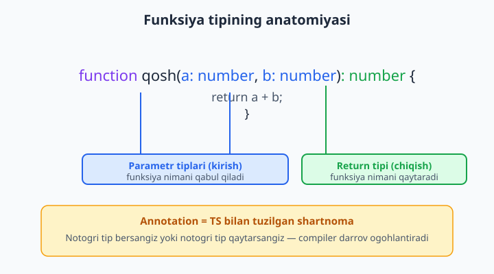
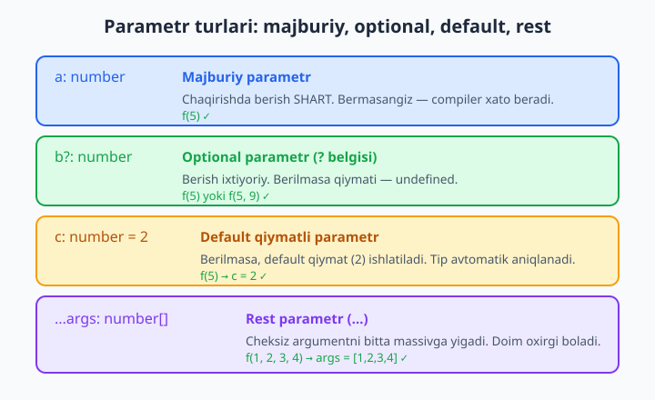
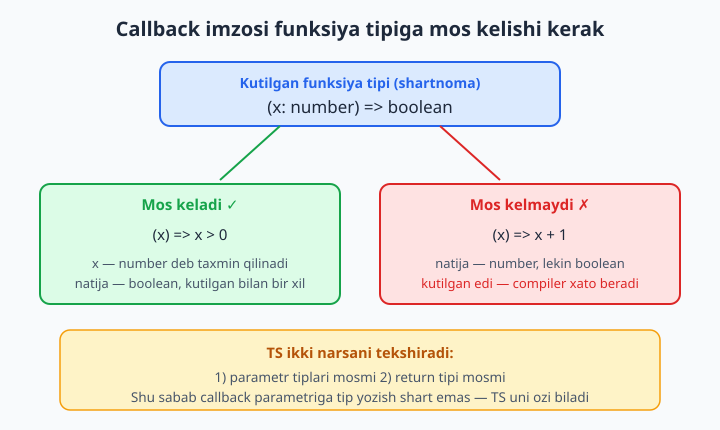

# 6 — Funksiya tiplari

[⬅️ Oldingi: 05 — Object tiplari va interface](./05-object-interface.md) · [🏠 README](./README.md) · [Keyingi: 07 — Union va literal tiplar ➡️](./07-union-literal.md)

> **Bu bobda:** funksiyalarni tiplashni o'rganamiz — parametr va return annotation, return tipini TS o'zi qanday topishi (inference), `void` va undefined farqi, optional `?`, default qiymat va rest `...args`, funksiyaning o'zini bitta tip sifatida yozish (`(a: number) => string`), callback va yuqori tartibli funksiyalarni (HOF) tiplash, bitta nomga bir nechta imzo beruvchi overload'lar va `this` parametri. Funksiya — har bir dasturning yuragi; uni to'g'ri tiplasangiz, butun loyiha mustahkam bo'ladi.

---

## Muammo

JavaScript'da quyidagi funksiyani yozdingiz va hammasi joyida ko'rinadi:

```js
function chegirma(narx, foiz) {
  return narx - (narx * foiz) / 100;
}
```

Ertasiga hamkasbingiz uni shunday chaqiradi:

```js
chegirma("50000", 10);     // natija: "50000" - 5000 = ?
chegirma(50000);           // foiz = undefined
chegirma(50000, 10, true); // ortiqcha argument — JS uni shunchaki tashlab yuboradi
```

Birinchi qatorda `"50000"` — matn (string), son emas. JavaScript hech narsa demaydi, ammo `"50000" - 5000` hisoblanganda allaqachon kech: kassada noto'g'ri summa chiqadi. Ikkinchi qatorda `foiz` umuman berilmagan — `undefined`, va `narx * undefined` natijasi `NaN` ("Not a Number"). Uchinchi qatorda ortiqcha argument bor, lekin JS uni jimgina yutib yuboradi.

Muammoning ildizi bitta: **funksiya nimani qabul qilishi va nimani qaytarishi hech qayerda yozilmagan.** Funksiya — bu kirish (parametrlar) va chiqish (return qiymati) o'rtasidagi shartnoma. JS'da bu shartnoma faqat sizning kallangizda yoki sharhlarda yashaydi. TypeScript esa uni kodning o'ziga yozib qo'yadi va har chaqirishda tekshiradi:

```ts
function chegirma(narx: number, foiz: number): number {
  return narx - (narx * foiz) / 100;
}

chegirma("50000", 10); // ❌ Xato: Argument of type 'string' is not assignable to parameter of type 'number'.
chegirma(50000);       // ❌ Xato: Expected 2 arguments, but got 1.
```

Endi xatolar **kodni yozish vaqtida** — kassaga yetib bormasdan oldin — ko'rinadi. Bu bobda funksiyalarni shunday tiplashni boshdan oxir o'rganamiz.

> JavaScript funksiyalari (parametr, return, callback, arrow funksiya, rest) bo'yicha asoslarni unutgan bo'lsangiz, [JavaScript kitobi](../js/README.md)ga qaytib o'ting. Bu yerda biz faqat **tip** qatlamiga e'tibor beramiz.

## Parametr va return annotation

Funksiyani tiplashning ikki joyi bor: har bir **parametr**dan keyin va qavslardan **keyin** (return tipi).

```ts
function qosh(a: number, b: number): number {
  return a + b;
}
```

O'qilishi: "`qosh` funksiyasi ikki `number` qabul qiladi va bitta `number` qaytaradi". Bu — yuqorida aytgan shartnomamiz, endi kodga yozilgan.



Annotation (tip belgilash) funksiyani ikki tomondan himoyalaydi:

- **Chaqiruvchini** himoyalaydi: noto'g'ri argument bersa, xato chiqadi.
- **Funksiya ichini** himoyalaydi: agar `return` qatorida `number` o'rniga boshqa narsa qaytarmoqchi bo'lsangiz, compiler ushlaydi.

```ts
function qosh(a: number, b: number): number {
  return a + b;
}

qosh(2, "3"); // ❌ Xato: Argument of type 'string' is not assignable to parameter of type 'number'.
```

📌 Return tipini yozib qo'yish — funksiya **niyatini** muhrlaydi. Quyidagi funksiya `number` qaytarishga va'da bergan, lekin tanasida hech narsa qaytarmaydi:

```ts
function qosh(a: number, b: number): number {
  console.log(a + b);
  // ❌ Xato: A function whose declared type is neither 'undefined', 'void', nor 'any' must return a value.
}
```

Bu juda foydali: return tipini yozish "men albatta qiymat qaytaraman" degan va'da, va compiler shu va'dani tekshiradi.

## Return inference — TS o'zi topadi

Parametrlarga tip yozish deyarli har doim **shart**. Ammo return tipini ko'pincha **yozmaslik** mumkin — TypeScript uni `return` qatoriga qarab o'zi aniqlaydi. Buni inference ("xulosa chiqarish") deyiladi:

```ts
function kvadrat(n: number) {
  return n * n; // number * number → TS return tipini number deb biladi
}

const natija = kvadrat(4); // natija avtomatik number
```

`kvadrat` ustiga sichqonchani olib borsangiz, muharrir `function kvadrat(n: number): number` deb ko'rsatadi — garchi siz `: number` yozmagan bo'lsangiz ham.

💡 **Qoida:** parametrlarga tip yozing, return tipini esa odatda TS'ga qoldiring. Lekin **eksport qilinadigan** (boshqa fayllar ishlatadigan) funksiyalarda return tipini **yozish** afzal — bu funksiya niyatini hujjatlashtiradi va keyinchalik tanani o'zgartirib qaytim tipini bilmasdan buzib qo'yishdan saqlaydi.

## `void` — qaytarmaydigan funksiya

Ba'zi funksiyalar qiymat qaytarmaydi — ular faqat **ish bajaradi** (konsolga yozadi, fayl saqlaydi, ekranni yangilaydi). Ularning return tipi — `void` ("hech narsa"):

```ts
function salom(ism: string): void {
  console.log("Salom, " + ism);
}

salom("Olim");
```

`void` aytadi: "bu funksiya foydali qiymat qaytarmaydi, uning natijasini o'zgaruvchiga olmang". Agar olsangiz:

```ts
const x: string = salom("Olim"); // ❌ Xato: Type 'void' is not assignable to type 'string'.
```

📌 **`void` va `undefined` — bir xil emas.** Texnik jihatdan `void` funksiya ish vaqtida `undefined` qaytaradi (JS'dagi har bir `return`siz funksiya kabi). Ammo `void` — bu "qaytimni e'tiborga olma" degan **niyat**, `undefined` esa konkret qiymat. Amalda: "hech narsa qaytarmaydi" demoqchi bo'lsangiz `void` ishlating, `undefined`ni emas.

💡 **`void`ning nozik, lekin muhim xususiyati:** `void` tipidagi callback aslida biror qiymat qaytarsa ham, TS uni **e'tiborga olmaydi**. Bu ataylab shunday qilingan — quyidagi keng tarqalgan kod ishlashi uchun:

```ts
const sonlar = [1, 2, 3];
const yangi: number[] = [];

// forEach callback'i void kutadi, push() esa number qaytaradi —
// lekin TS bunga xato bermaydi, chunki void qaytim e'tiborga olinmaydi:
sonlar.forEach((x) => yangi.push(x)); // ✅ toza o'tadi
```

Agar `void` qat'iy "faqat undefined" deganda edi, bu juda foydali qolip har safar xato berardi. Esda tuting: **`void` return tipi — "men qaytimingni o'qimayman" degani**, "sen hech narsa qaytarma" degani emas.

## Optional `?`, default qiymat va rest

Parametrlar har doim ham majburiy emas. TypeScript ularni moslashuvchan qilishning uch yo'lini beradi.



### Optional parametr — `?`

Parametr nomidan keyin `?` qo'ysangiz, u **ixtiyoriy** bo'ladi. Berilmasa, qiymati `undefined`:

```ts
function tabrikla(ism: string, unvon?: string): string {
  if (unvon) {
    return unvon + " " + ism;
  }
  return ism;
}

tabrikla("Lola");          // "Lola"
tabrikla("Lola", "ustoz"); // "ustoz Lola"
```

`unvon`ning tipi aslida `string | undefined` — shuning uchun uni ishlatishdan oldin `if (unvon)` bilan tekshirish kerak (buni narrowing deyiladi, 8-bobda chuqur ko'ramiz). Tekshirmasangiz, `unvon` `undefined` bo'lishi mumkinligini compiler eslatadi.

📌 **Optional parametrlar oxirda turishi shart.** Majburiy parametr optional'dan keyin kela olmaydi — bu mantiqsiz bo'lardi:

```ts
function f(a?: string, b: number): void {} // ❌ Xato: A required parameter cannot follow an optional parameter.
```

### Default qiymat

`?` o'rniga parametrga **default qiymat** berishingiz mumkin. Argument berilmasa, shu qiymat ishlatiladi:

```ts
function kuchaytir(asos: number, daraja: number = 2): number {
  return asos ** daraja;
}

kuchaytir(5);    // 25  (daraja default 2 boldi)
kuchaytir(5, 3); // 125
```

💡 Default qiymatda tip annotation yozish shart emas: `daraja = 2`dan TS uning `number` ekanini o'zi biladi. Default qiymatli parametr ham avtomatik ixtiyoriy bo'ladi — `?` qo'shish kerak emas (ikkalasini birga ishlatish ham mumkin emas).

### Rest parametr — `...`

Nechta argument kelishini oldindan bilmasangiz, **rest** parametr ishlating. U barcha qolgan argumentlarni bitta massivga yig'adi:

```ts
function yigindi(...sonlar: number[]): number {
  return sonlar.reduce((jami, x) => jami + x, 0);
}

yigindi(1, 2, 3);       // 6
yigindi(10, 20, 30, 40); // 100
```

`...sonlar: number[]` — "qancha kelsa ham, hammasini `number`lar massivi sifatida qabul qil". Tipni `number[]` deb yozganimiz uchun, matn qo'shib bo'lmaydi:

```ts
yigindi(1, 2, "uch"); // ❌ Xato: Argument of type 'string' is not assignable to parameter of type 'number'.
```

📌 Rest parametr doim **eng oxirgi** bo'lishi kerak — undan keyin boshqa parametr bo'la olmaydi, chunki u qolgan hamma argumentni o'ziga oladi.

## Funksiya tipi — `(a: number) => string`

Hozirgacha funksiyalarni **e'lon qildik**. Endi esa funksiyaning o'zini **tip** sifatida yozishni o'rganamiz — bu callback'lar va funksiyani o'zgaruvchida saqlash uchun zarur.

Funksiya tipining sintaksisi: `(parametrlar) => qaytim_tipi`. E'tibor bering — bu yerda `=>` arrow funksiya emas, **tip belgisi**:

```ts
let amal: (a: number, b: number) => number;

amal = (a, b) => a * b; // mos: ikki number olib, number qaytaradi
amal(3, 4); // 12
```

`amal` o'zgaruvchisining tipi — "ikki `number` qabul qilib `number` qaytaradigan funksiya". Diqqat qiling: `(a, b) => a * b` ichida `a` va `b`ga tip **yozmadik**. TS ularni `amal`ning e'lon qilingan tipidan oladi — buni contextual typing ("kontekstdan tip olish") deyiladi. Funksiya tipini bir marta belgilasangiz, ichkaridagi parametrlarni qayta tiplash shart emas.

### `type` bilan nom berish

Bir xil funksiya tipini ko'p joyda ishlatsangiz, unga `type` orqali nom bering — bu kodni toza qiladi:

```ts
type Op = (a: number, b: number) => number;

const qoshish: Op = (a, b) => a + b;
const ayirish: Op = (a, b) => a - b;
const kopaytirish: Op = (a, b) => a * b;
```

`Op` endi qayta ishlatiladigan "shakl". Funksiya bu shaklga mos kelmasa, compiler darrov ushlaydi:

```ts
type Op = (a: number, b: number) => number;

const ayir: Op = (a, b) => a > b; // ❌ Xato: Type 'boolean' is not assignable to type 'number'.
```

Bu yerda funksiya `boolean` (`a > b`) qaytaryapti, `Op` esa `number` kutadi — tip mos kelmadi.

💡 Funksiya tipini interface ichida ham yozish mumkin (5-bobdagi object tiplarini eslang):

```ts
interface Kalkulyator {
  nom: string;
  bajar: (a: number, b: number) => number;
}

const oddiy: Kalkulyator = {
  nom: "qoshuvchi",
  bajar: (a, b) => a + b,
};
```

## Callback'larni tiplash

Callback — bu boshqa funksiyaga **argument sifatida** uzatiladigan funksiya. `map`, `filter`, `forEach`, `addEventListener` — hammasi callback qabul qiladi. TypeScript callback'ning imzosini ham tekshiradi.

Eng yaxshi yangilik: callback'lardagi parametrlarga ko'pincha tip yozish **shart emas**, TS uni o'zi biladi:

```ts
const sonlar = [1, 2, 3, 4];

const juftlar = sonlar.filter((x) => x % 2 === 0); // x avtomatik number
const matnlar = sonlar.map((x) => "№" + x);        // x avtomatik number, natija string[]
```

`sonlar` — `number[]` bo'lgani uchun, TS `filter` va `map` callback'idagi `x`ni `number` deb biladi. Bu — yuqorida ko'rgan contextual typing'ning aynan o'zi.



Endi **o'z** funksiyangizga callback qabul qilaylik. Callback parametrini funksiya tipi bilan tiplaymiz:

```ts
type Op = (a: number, b: number) => number;

function ishlat(a: number, b: number, op: Op): number {
  return op(a, b);
}

ishlat(6, 7, (x, y) => x + y);  // 13
ishlat(6, 7, (x, y) => x * y);  // 42
```

`op: Op` — uchinchi argument funksiya bo'lishi va `Op` shakliga mos kelishi shart. Callback ichidagi `x` va `y`ni tiplamadik — TS ularni `Op`dan oldi.

📌 Compiler callback imzosini ham tekshiradi. Quyida `Filtr` `boolean` qaytaruvchi callback kutadi, biz esa `number` qaytaryapmiz:

```ts
type Filtr = (x: number) => boolean;

const musbat: Filtr = (x) => x; // ❌ Xato: Type 'number' is not assignable to type 'boolean'.
```

## Yuqori tartibli funksiyalar (HOF)

Yuqori tartibli funksiya (higher-order function, HOF) — bu funksiyani **qabul qiladigan** yoki funksiyani **qaytaradigan** funksiya. Yuqoridagi `ishlat` — funksiya qabul qildi. Endi funksiya **qaytaruvchi**sini ko'raylik:

```ts
function kopaytuvchi(koeff: number): (x: number) => number {
  return (x) => x * koeff;
}

const ikkilantir = kopaytuvchi(2);
const uchlantir = kopaytuvchi(3);

ikkilantir(21); // 42
uchlantir(10);  // 30
```

Diqqat — return tipiga qarang: `: (x: number) => number`. Bu "men `number` olib `number` qaytaradigan **funksiya** qaytaraman" degani. `kopaytuvchi(2)` chaqirilganda, ichki funksiya tashqi `koeff`ni "eslab qoladi" (JS'dagi closure) va `ikkilantir`ga aylanadi.

💡 HOF qaytim tipini yozish murakkab ko'rinadi, shuning uchun ko'pincha uni `type` bilan soddalashtirgan ma'qul:

```ts
type SonAmali = (x: number) => number;

function kopaytuvchi(koeff: number): SonAmali {
  return (x) => x * koeff;
}
```

Massiv ustida ishlovchi tipik HOF — bu callback'ni har bir elementga qo'llaydigan funksiya:

```ts
function qoshHar(arr: number[], op: (x: number) => number): number[] {
  return arr.map(op);
}

qoshHar([1, 2, 3], (x) => x * 10); // [10, 20, 30]
```

## Overload — bitta nom, bir nechta imzo

Ba'zan bitta funksiya **turli xil** kirishlarni qabul qilib, kirishga qarab **turli xil** qaytim beradi. Masalan, `string` bersangiz `string`, `number` bersangiz `number` qaytarsin. Buni **overload** (imzo qatlamlash) orqali aniq ifodalash mumkin.

Overload uch qismdan iborat: bir nechta **imzo qatorlari** (tana yo'q) va ulardan keyin **bitta amaliy tana**:

```ts
// Overload imzolari (tanasiz):
function aralashtir(a: string, b: string): string;
function aralashtir(a: number, b: number): number;
// Amaliy tana (bu imzo tashqaridan ko'rinmaydi):
function aralashtir(a: any, b: any): any {
  return a + b;
}

const matn = aralashtir("Salom, ", "dunyo"); // tipi: string
const son = aralashtir(2, 3);                // tipi: number
```

Endi `matn` aniq `string`, `son` aniq `number` — `any` emas. Chaqiruvchi to'g'ri qaytim tipini oladi. Agar overload'siz, oddiy `(a: number | string, b: number | string)` deb yozsak, qaytim har doim `number | string` bo'lib qolardi va har safar tekshirishga to'g'ri kelardi.

📌 Amaliy tanadagi `any` va keng imzo **faqat funksiya ichida** ko'rinadi — tashqaridan u umuman chaqirib bo'lmaydi. Tashqi dunyo faqat tepadagi ikki "toza" imzoni ko'radi. Shuning uchun ichki tana barcha imzolarni qoplaydigan darajada keng bo'lishi kerak.

Ko'proq foydali misol — kirish tipiga qarab boshqacha amal:

```ts
function teskari(x: string): string;
function teskari(x: number[]): number[];
function teskari(x: string | number[]): string | number[] {
  if (typeof x === "string") {
    return x.split("").reverse().join("");
  }
  return x.slice().reverse();
}

teskari("abc");       // "cba"  (tipi: string)
teskari([1, 2, 3]);   // [3, 2, 1]  (tipi: number[])
```

💡 **Overload'ni kamroq ishlating.** Zamonaviy TypeScript'da ko'p hollarda overload o'rniga generic (11-bob) yoki union tip ishlatish soddaroq va kuchliroq bo'ladi. Overload'ni faqat "kirishga qarab qaytim tubdan o'zgaradi" degan haqiqiy ehtiyoj bo'lganda tanlang.

## `this` parametri

Method (object ichidagi funksiya) ichida `this` — o'sha object'ga ishora qiladi. Lekin `this` funksiya **qanday chaqirilishiga** qarab o'zgaradi, va bu JS'dagi klassik tuzoq. TypeScript buni maxsus **`this` parametri** orqali nazorat qiladi.

`this` parametri — parametrlar ro'yxatidagi **birinchi** "soxta" parametr. U faqat tip uchun; haqiqiy argument emas va chaqirishda berilmaydi:

```ts
interface Tugma {
  matn: string;
  bos(this: Tugma): void;
}

const tugma: Tugma = {
  matn: "Saqlash",
  bos(this: Tugma) {
    console.log(this.matn + " bosildi");
  },
};

tugma.bos(); // "Saqlash bosildi"
```

`bos(this: Tugma)` aytadi: "bu method faqat `Tugma` kontekstida chaqirilishi mumkin". Endi method'ni object'dan **ajratib** olib chaqirsangiz, `this` yo'qoladi va compiler ushlaydi:

```ts
const ajratilgan = tugma.bos; // method object'dan ajratildi
ajratilgan(); // ❌ Xato: The 'this' context of type 'void' is not assignable to method's 'this' of type 'Tugma'.
```

📌 Bu xato JS'dagi eng mashhur runtime tuzoqlardan birini (`Cannot read properties of undefined`) **compile vaqtida** ushlaydi. JS'da bu kod jimgina ishlab, keyin `this.matn`da yiqilardi. TS esa oldindan ogohlantiradi.

💡 `this` parametrini faqat oddiy funksiya/method'da ishlatish mumkin. **Arrow funksiyada `this` yo'q** — arrow funksiya `this`ni o'rab turgan kontekstdan oladi va uni o'zgartirib bo'lmaydi. Shuning uchun arrow funksiyaga `this` parametri yoza olmaysiz (va odatda kerak ham emas).

## Xulosa

Funksiyalarni tiplash — TypeScript'ning amaliy yuragi:

- **Parametrlarga tip yozing**, return tipini ko'pincha TS'ga qoldiring (inference). Eksport funksiyalarda return tipini yozish afzal.
- **`void`** — qaytarmaydigan funksiya; "qaytimingni o'qimayman" degani, shuning uchun `void` callback baribir qiymat qaytarishi mumkin.
- **`?`** — optional parametr (`undefined` bo'lishi mumkin), **`= qiymat`** — default, **`...args: T[]`** — rest. Optional va rest doim oxirda.
- **`(a: T) => R`** — funksiya tipi; `type Op = ...` bilan nom bering. Callback parametrlari kontekstdan tip oladi — qayta tiplash shart emas.
- **HOF** — funksiya qabul qiluvchi yoki qaytaruvchi funksiya; qaytim funksiya tipini `type` bilan soddalashtiring.
- **Overload** — bitta nom, bir nechta imzo; kamroq ishlating, ko'pincha generic afzal.
- **`this` parametri** — method'ni noto'g'ri kontekstda chaqirishni compile vaqtida ushlaydi.

Keyingi bobda **union va literal** tiplarni o'rganamiz — `"yangi" | "jarayonda" | "tugadi"` kabi cheklangan qiymatlar to'plamini va ularni funksiya parametrlarida qanday ishlatishni ko'ramiz.

## 6-bob mashqlari

Quyidagi mashqlarni o'zingiz yozib bajaring. Har birini `tsc --noEmit --strict` bilan tekshiring: toza bo'lishi kerak bo'lganlar xatosiz o'tsin, ataylab xato so'ralganlarda esa compiler aynan kutilgan xabarni bersin.

1. `kvadrat(n: number): number` funksiyasini yozing — sonning kvadratini qaytarsin. Keyin `kvadrat("4")` deb chaqirib, compiler qanday xato berishini ko'ring.
2. `katta(a: number, b: number): number` funksiyasini yozing — ikki sondan kattasini qaytarsin. Return tipini **yozmasdan** ham sinab ko'ring va muharrirda TS uni qanday aniqlaganini tekshiring.
3. `chiqar(xabar: string): void` funksiyasini yozing — xabarni konsolga chiqarsin. Keyin uning natijasini `const x: string = chiqar("salom")` deb olishga urinib, xatoni ko'ring.
4. `void` qaytaradigan callback aslida qiymat qaytarsa ham xato bermasligini isbotlang: `[1,2,3].forEach((x) => yangiMassiv.push(x))` qolipini yozib, toza o'tishini tekshiring.
5. `salomla(ism: string, unvon?: string): string` funksiyasini yozing — `unvon` bo'lsa "unvon ism", bo'lmasa faqat "ism" qaytarsin. Ikki xil chaqirib sinang.
6. Optional parametrni majburiy parametrdan **oldin** qo'yib (`function f(a?: number, b: number)`), compiler bergan xatoni o'qing va nima uchun shunday ekanini izohlang.
7. `salyut(daraja: number = 1): string` funksiyasini yozing — `daraja` marta "!" qaytarsin (`"!".repeat(daraja)`). Argumentsiz chaqirib, default ishlaganini tekshiring.
8. `kopaytir(...sonlar: number[]): number` funksiyasini yozing — barcha argumentlar ko'paytmasini qaytarsin (bo'sh kelsa 1). `reduce` ishlating.
9. Rest parametrga matn uzatib (`kopaytir(2, 3, "x")`) compiler xatosini ko'ring.
10. Rest parametrdan **keyin** yana bir parametr qo'yishga urinib (`function f(...a: number[], b: number)`), compiler nima deyishini tekshiring.
11. `type Amal = (a: number, b: number) => number` tip aliasini e'lon qiling. Unga mos `qosh` va `ayir` funksiyalarini yarating.
12. 11-mashqdagi `Amal`ga mos kelmaydigan funksiya bering (masalan `(a, b) => a > b`) va return tipi mos kelmagani haqidagi xatoni ko'ring.
13. `qoLla(a: number, b: number, op: (x: number, y: number) => number): number` funksiyasini yozing — `op`ni `a` va `b`ga qo'llab natijani qaytarsin. Uni har xil callback bilan chaqiring.
14. `[5, 2, 8, 1]` massivini `filter` bilan faqat 3 dan kattalarni qoldiring. Callback parametri `x`ga tip **yozmang** va TS uni `number` deb bilganini muharrirda tekshiring.
15. `string` va `number[]`ni uzunligiga qarab `number` qaytaruvchi `uzunlik` funksiyasini **overload** bilan yozing: `uzunlik(x: string): number` va `uzunlik(x: number[]): number`. Ichida `typeof`/`Array.isArray` bilan ajrating.
16. `format` funksiyasini overload bilan yozing: `number` bersangiz `string` (`"$" + son`), `boolean` bersangiz `string` (`"ha"`/`"yoq"`) qaytarsin. Qaytim tiplari to'g'ri ekanini tekshiring.
17. `kopaytuvchiYasa(koeff: number): (x: number) => number` HOF'ini yozing — `koeff`ga ko'paytiradigan funksiya qaytarsin. `const besh = kopaytuvchiYasa(5); besh(4)` → 20 ekanini tekshiring.
18. `qayta(arr: number[], n: number, op: (x: number) => number): number[]` funksiyasini yozing — `op`ni har elementga `n` marta ketma-ket qo'llasin. Bir necha callback bilan sinang.
19. `interface Hisoblagich { soni: number; oshir(this: Hisoblagich): void }` e'lon qiling va `oshir` `this.soni`ni bittaga oshirsin. To'g'ri chaqirib, ishlaganini tekshiring.
20. 19-mashqdagi `oshir` method'ini object'dan **ajratib** (`const f = obj.oshir; f()`) chaqiring va `this` konteksti haqidagi compiler xatosini o'qing. Nega arrow funksiyada `this` parametri yoza olmasligimizni bir jumlada izohlang.
