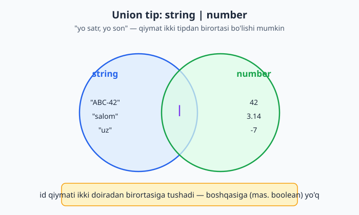
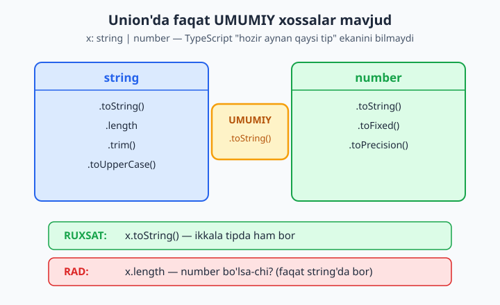
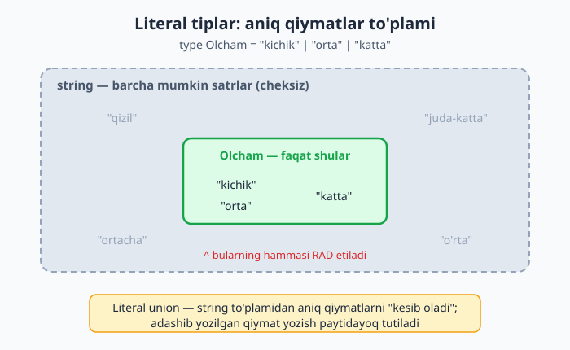
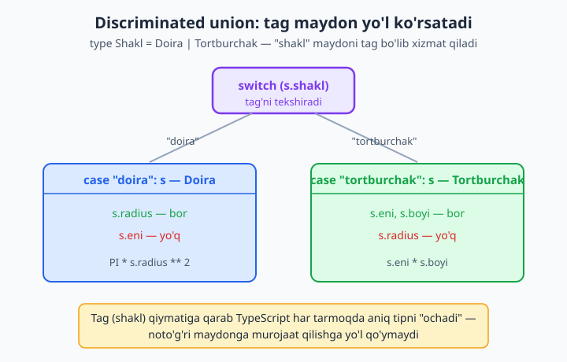

# 7 — Union va literal tiplar

[⬅️ Oldingi: 06 — Funksiya tiplari](./06-funksiya-tiplari.md) · [🏠 README](./README.md) · [Keyingi: 08 — Type narrowing va type guard'lar ➡️](./08-narrowing-guard.md)

> **Bu bobda:** ko'pincha bitta qiymat "bir nechta tipdan biri" yoki "aniq qiymatlardan biri" bo'ladi — kirish maydoni `string` yo `number`, o'lcham faqat `kichik`, `orta` yoki `katta`, API javobi esa `yuklanmoqda`/`muvaffaqiyat`/`xato`. Mana shu "yo... yo..." ni TypeScript'da **union** (`|` — birlashma tipi) va **literal** (aniq qiymat) tiplari ifodalaydi. Bu bobda union'da nima uchun faqat *umumiy* xossalar mavjudligini, literal union qanday qilib `enum`'ning o'rnini bosishini, `null | T` qolipini va eng kuchli qurol — **discriminated union** (tag maydonli union)ni real kod bilan ko'rib chiqamiz.

---

## Muammo

JavaScript'da bunday funksiya yozasiz:

```js
function chegirma(narx, foiz) {
  return narx - (narx * foiz) / 100;
}
chegirma(50000, "10"); // ❌ "10" — satr! Natija: 45000, lekin xato yo'q
```

Bu yerda `"10"` satri `narx * foiz` ko'paytmasida jimgina `10` soniga o'tib ketadi, shuning uchun natija aldamchi — toza `45000` chiqadi, hech qanday ogohlantirishsiz. Bug aynan shu: kod "ishlayotgandek" tuyuladi. Endi kimdir `"o'n"` yoki `"abc"` bersa, ko'paytma `NaN` ga aylanadi va dastur allaqachon boshqa joyga ketib qolgan paytda buziladi. JavaScript indamaydi: `foiz` ga satr ham, son ham, hatto `null` ham bering — hammasini "yutadi". 6-bobda buni hal qildik: `foiz: number` deb yozsangiz, satr berishga yo'l qo'ymaydi.

Lekin haqiqiy hayotda tip ko'pincha **bitta** emas. Ikkita real holatni olaylik:

1. **Kirish maydoni.** Foydalanuvchi ID'si — ba'zan son (`42`), ba'zan satr (`"ABC-42"`). Ikkalasiga ham ruxsat berish kerak, lekin `boolean`'ga emas.
2. **Cheklangan tanlov.** Mahsulot o'lchami faqat `"kichik"`, `"orta"` yoki `"katta"` bo'lishi mumkin. `number` juda keng — `"o'rtachaa"` (xato yozilgan) ni ham, `"qizil"` ni ham qabul qilmasligi kerak.

`string` yoki `number` bu cheklovlarni ifodalay olmaydi. Bizga kerak: "**yo bu, yo u**". Mana shu uchun union va literal tiplar bor.



## Union tip — `|` belgisi

Union (birlashma) tipi ikki yoki undan ortiq tipni `|` (vertikal chiziq) bilan ulaydi. O'qilishi: "yo chapdagi, yo o'ngdagi tip".

```ts
let id: string | number;

id = 42;       // ✅ number — mayli
id = "ABC-42"; // ✅ string — bu ham mayli
```

📌 `|` belgisini "yoki" deb o'qing. `string | number` — "satr **yoki** son". Belgisi mantiqiy "yoki" (`||`) ga o'xshaydi, lekin bu tip darajasida, qiymat darajasida emas.

Funksiya argumentida ham xuddi shunday:

```ts
function chop(qiymat: string | number): void {
  console.log(qiymat);
}

chop(10);       // ✅
chop("salom");  // ✅
chop(true);     // ❌ boolean union'da yo'q
```

Oxirgi qator kompilyatsiyadan o'tmaydi:

```text
error TS2345: Argument of type 'boolean' is not assignable to parameter of type 'string | number'.
```

💡 Union'ga nechta a'zo qo'shsangiz bo'ladi: `string | number | boolean | null`. Lekin amalda 2-4 a'zo eng tushunarli — ko'paysa, ehtimol tipni qaytadan o'ylash kerak.

## Union'da faqat UMUMIY a'zolar mavjud

Eng muhim qoida shu yerda. `x: string | number` bo'lsa, TypeScript aniq bilmaydi — bu hozir satrmi yo son. Shuning uchun u faqat **ikkala tipda ham bor** xossalar va metodlarga ruxsat beradi.

```ts
function uzunlik(x: string | number): number {
  // .toString() — string'da ham, number'da ham bor (umumiy)
  return x.toString().length; // ✅
}
```

`.toString()` ishlaydi, chunki u har ikkala tipda mavjud. Endi faqat bitta tipga xos narsani ishlatib ko'ring:

```ts
function xato(x: string | number): number {
  return x.length; // ❌ length faqat string'da bor, number'da yo'q
}
```

Kompilyator to'xtatadi:

```text
error TS2339: Property 'length' does not exist on type 'string | number'.
  Property 'length' does not exist on type 'number'.
```

Mantiq oddiy: `x` son bo'lib qolsa-chi? Sonning `.length`'i yo'q. TypeScript "ehtimol son" bo'lgan holatni hisobga olib, oldindan ogohlantiradi.



📌 Bu xatolik emas, balki **himoya**. JavaScript'da `(42).length` jimgina `undefined` qaytaradi va xato keyinroq, butunlay boshqa joyda yuzaga keladi. TypeScript esa muammoni aynan manbada ko'rsatadi.

💡 "Unda `.length`'ni qachon ishlataman?" — qiymat aniq satr ekanini TypeScript'ga **isbotlab** bergandan keyin. Buni *narrowing* (tipni toraytirish) deyiladi — keyingi bobning butun mavzusi. Hozircha bir ko'rinishini ko'rsatamiz:

```ts
function format(x: string | number): string {
  if (typeof x === "number") {
    return x.toFixed(2); // bu yerda TypeScript biladi: x — number
  }
  return x.trim();       // bu yerda esa x — string
}
```

`typeof` tekshiruvidan keyin TypeScript har bir tarmoqda aniq tipni "ochib beradi". Bu sehrning to'liq tafsilotlari — 08-bobda.

## Literal tiplar — aniq qiymatning o'zi tip bo'ladi

Endi eng qiziq qismi. Odatda `string` "har qanday satr" degani. Lekin TypeScript'da **aniq bitta satrning o'zini** tip qilib belgilash mumkin:

```ts
let yon: "chap";
yon = "chap"; // ✅ — yagona ruxsat etilgan qiymat
yon = "ong";  // ❌ — "ong" bu tipga to'g'ri kelmaydi
```

`"chap"` tipi faqat va faqat `"chap"` qiymatini qabul qiladi. Yolg'iz holda bu unchalik foydali emas. Lekin uni union bilan birlashtirsangiz — kuchli vosita paydo bo'ladi:

```ts
let yon: "chap" | "ong" | "yuqori" | "past";

yon = "chap";   // ✅
yon = "ong";    // ✅
yon = "yuqori"; // ✅
```

Endi `yon`'ga faqat shu to'rt qiymatdan birini berasiz, boshqasini emas:

```ts
let yon: "chap" | "ong";
yon = "yuqori"; // ❌
```

```text
error TS2322: Type '"yuqori"' is not assignable to type '"chap" | "ong"'.
```



📌 Bu shunchaki "go'zal cheklov" emas — bu **xatolarni yozish paytida tutadigan** mexanizm. Klaviaturadan `"ortacha"` deb adashib yozsangiz, dasturni ishga tushirishdan oldin xato chiqadi.

### Literal union'ni `type` bilan nomlash

Har safar uzun ro'yxatni qayta yozmaslik uchun unga nom bering (`type` haqida 10-bobda batafsil, hozircha "tipga taxallus" deb tushuning):

```ts
type Olcham = "kichik" | "orta" | "katta";

function buyurtma(olcham: Olcham): string {
  return `Tanlandi: ${olcham}`;
}

buyurtma("orta");    // ✅
buyurtma("ortacha"); // ❌
```

So'nggi qator xato:

```text
error TS2345: Argument of type '"ortacha"' is not assignable to parameter of type 'Olcham'.
```

💡 IDE'ning yana bir sovg'asi: `buyurtma(` deb yozganingizda muharrir o'zi `kichik`, `orta`, `katta` ni ro'yxat qilib taklif qiladi. Eslab o'tirmaysiz — tanlaysiz.

### Numeric va boolean literal

Literal faqat satrlarga xos emas. Sonlar va `boolean` ham bo'ladi:

```ts
type Yonalish = -1 | 0 | 1; // faqat shu uchta son
let qadam: Yonalish = 1;
qadam = -1; // ✅
qadam = 2;  // ❌ 2 ro'yxatda yo'q

type Rost = true; // faqat true
let har_doim: Rost = true;
```

Numeric literal union ko'pincha "darajalar" yoki "bosqichlar" uchun ishlatiladi: `type Yulduz = 1 | 2 | 3 | 4 | 5`.

## Literal union — `enum`'ning o'rnini bosadi

Boshqa tillardan kelganlar "cheklangan tanlov" uchun `enum` izlaydi. TypeScript'da `enum` bor, lekin **zamonaviy uslubda ko'pincha literal union afzal ko'riladi**:

```ts
// enum o'rniga — toza literal union:
type Status = "active" | "inactive" | "banned";

const foydalanuvchi: { ism: string; status: Status } = {
  ism: "Lola",
  status: "active",
};
```

Nega union afzal? Chunki:

- **Qo'shimcha kod yo'q.** `enum` JavaScript'ga aylanganda haqiqiy obyekt yaratadi; union esa kompilyatsiyadan keyin butunlay yo'qoladi (faqat tekshiruv uchun mavjud).
- **Qiymatlar oddiy satr.** `status` aynan `"active"` satrining o'zi — JSON'ga yozish, API'ga yuborish oson. `enum` bilan `Status.Active` deb yozish kerak bo'lardi.
- **Solishtirruv tabiiy.** `if (status === "active")` — qo'shimcha import'siz ishlaydi.

📌 `enum` butunlay yomon degani emas — ba'zan o'rinli. Lekin 2026-yilda boshlovchiga maslahat: **avval literal union'ni o'ylang**, `enum`'ni faqat alohida ehtiyoj bo'lganda ishlating. Buni 04-bobda ham eslatgan edik.

💡 `as const` bilan obyektdan ham union "tortib olish" mumkin (10-bob), lekin bevosita literal union — eng sodda boshlanish nuqtasi.

## `null | T` — "qiymat bor yoki yo'q" qolipi

Funksiya ba'zan natija topadi, ba'zan topmaydi. JavaScript'da "topilmadi" ni `null` bilan bildirasiz. TypeScript'da buni tipda **ochiq aytasiz**: `string | null`.

```ts
function qidir(id: number): string | null {
  return id === 1 ? "Oqil" : null;
}
```

Bu tip o'qiyotgan har bir dasturchiga aytadi: "natija satr **yoki** `null` — `null` holatini ko'rib chiqishni unutma". Va TypeScript buni majburlaydi:

```ts
const natija = qidir(2);
console.log(natija.toUpperCase()); // ❌
```

```text
error TS18047: 'natija' is possibly 'null'.
```

Kompilyator haq: `natija` `null` bo'lsa, `null.toUpperCase()` JavaScript'da dasturni qulatadi (`TypeError`). TypeScript bu falokatni *yozish paytida* to'xtatadi. To'g'ri yo'l — avval tekshirish:

```ts
const natija = qidir(2);
if (natija !== null) {
  console.log(natija.toUpperCase()); // ✅ bu yerda natija — string
}
```

📌 Bu `strictNullChecks` (strict rejimning bir qismi) tufayli ishlaydi. Strict yoqilmagan bo'lsa, `null` har qanday tipga "sirg'alib kiradi" va aynan shu — JavaScript'dagi mashhur "`undefined` is not a function" xatolarining ildizi. Strict rejimni doim yoqib turing.

💡 `T | undefined` ham xuddi shu g'oya. Masalan, obyektdan kalit izlaganda:

```ts
function topNarx(mahsulot: string): number | undefined {
  const narxlar: Record<string, number> = { non: 5000, sut: 12000 };
  return narxlar[mahsulot]; // topilmasa — undefined
}

const n = topNarx("non");
console.log(n ?? "topilmadi"); // ?? — null/undefined uchun zaxira qiymat
```

`??` (nullish coalescing) operatorini JavaScript kitobida ko'rgansiz; bu yerda u `number | undefined` ni xavfsiz ishlatishga yordam beradi.

## Union'da MAXSUS xossa — to'g'ridan-to'g'ri bo'lmaydi

Endi obyektlardan tashkil topgan union'ga o'tamiz. "Mehmon" va "A'zo" foydalanuvchilarni tasavvur qiling:

```ts
type Mehmon = { ism: string };
type Azo = { ism: string; balli: number };
type Foydalanuvchi = Mehmon | Azo;
```

`ism` — ikkalasida ham bor (umumiy), shuning uchun unga bemalol murojaat qilasiz. Lekin `balli` faqat `Azo`'da bor:

```ts
function ball(f: Foydalanuvchi): number {
  return f.balli; // ❌ f mehmon bo'lsa-chi? Unda balli yo'q
}
```

```text
error TS2339: Property 'balli' does not exist on type 'Foydalanuvchi'.
  Property 'balli' does not exist on type 'Mehmon'.
```

Yana o'sha qoida: union faqat umumiy xossalarga ruxsat beradi. Maxsus xossaga yetish uchun avval qaysi a'zo ekanini aniqlashtirish kerak. Buning bir usuli — `in` operatori bilan tekshirish:

```ts
function ball(f: Mehmon | Azo): number {
  if ("balli" in f) {
    return f.balli; // ✅ bu yerda f — Azo
  }
  return 0;          // mehmon: balli yo'q, 0 qaytaramiz
}
```

📌 `"balli" in f` — JavaScript'ning `in` operatori: obyektda shu kalit bormi. TypeScript buni "isbot" deb qabul qiladi va `if` ichida `f` ni `Azo` ga toraytiradi. Bu ham narrowing — 08-bobda chuqurroq.

## Discriminated union — union'ning eng kuchli ko'rinishi

Mana bu naqsh sizning kundalik quroliingizga aylanadi. G'oya: har bir union a'zosiga **bir xil nomli, har birida boshqacha literal qiymatli "tag" (yorliq) maydon** qo'yamiz. Bu maydonni *discriminant* (ajratuvchi) deyiladi.

Shakllarni hisoblaylik:

```ts
type Doira = { shakl: "doira"; radius: number };
type Tortburchak = { shakl: "tortburchak"; eni: number; boyi: number };
type Shakl = Doira | Tortburchak;
```

`shakl` maydoni — tag: `Doira`'da u `"doira"`, `Tortburchak`'da `"tortburchak"`. Endi `switch` bilan tagni tekshirsangiz, TypeScript har tarmoqda aniq tipni biladi:

```ts
function yuza(s: Shakl): number {
  switch (s.shakl) {
    case "doira":
      return Math.PI * s.radius ** 2; // s — Doira, radius bor
    case "tortburchak":
      return s.eni * s.boyi;          // s — Tortburchak, eni/boyi bor
  }
}
```

`case "doira"` ichida `s.radius` ga ruxsat bor, lekin `s.eni` ga yo'q — TypeScript tagga qarab to'g'ri a'zoni "ochadi". Bu eng tabiiy va xavfsiz union ishlatish usuli.



### Real misol: API javobi

Discriminated union API holatlarini ifodalashda mukammal. Frontend'da so'rov uch holatdan birida bo'ladi:

```ts
type Javob =
  | { holat: "yuklanmoqda" }
  | { holat: "muvaffaqiyat"; malumot: string[] }
  | { holat: "xato"; xabar: string };

function korsat(j: Javob): string {
  switch (j.holat) {
    case "yuklanmoqda":
      return "Kuting...";
    case "muvaffaqiyat":
      return `${j.malumot.length} ta natija`; // malumot faqat shu yerda bor
    case "xato":
      return `Xato: ${j.xabar}`;               // xabar faqat shu yerda bor
  }
}
```

📌 E'tibor bering: `j.malumot` ga faqat `"muvaffaqiyat"` tarmog'ida, `j.xabar` ga faqat `"xato"` tarmog'ida murojaat qila olasiz. "Yuklanmoqda" holatida ma'lumotni o'qishga urinib bo'lmaydi — bu mantiqan to'g'ri, chunki hali ma'lumot kelmagan. Tip tizimi noto'g'ri kodni *yozdirmaydi*.

### `never` bilan "hammasini qopladimmi?" kafolati

Discriminated union'ning yana bir zo'r xususiyati: yangi a'zo qo'shganda **biror holatni unutsangiz, TypeScript eslatadi**. Buni `never` (hech qachon ro'y bermaydigan tip — 09-bobda) yordamida amalga oshiriladi:

```ts
type Hodisa =
  | { tur: "bosish"; x: number; y: number }
  | { tur: "yozish"; matn: string };

function ishlov(h: Hodisa): string {
  switch (h.tur) {
    case "bosish":
      return `(${h.x}, ${h.y})`;
    case "yozish":
      return h.matn;
    default:
      const _hech: never = h; // hamma holat qoplanganini kafolatlaydi
      return _hech;
  }
}
```

Bu hozir toza kompilyatsiyadan o'tadi. Endi `Hodisa`'ga yangi a'zo qo'shsangiz, lekin `switch`'ga mos `case` qo'shishni unutsangiz:

```ts
type Hodisa =
  | { tur: "bosish"; x: number; y: number }
  | { tur: "yozish"; matn: string }
  | { tur: "siljish"; delta: number }; // yangi a'zo, lekin case yo'q!
```

`default` tarmog'i xato beradi:

```text
error TS2322: Type '{ tur: "siljish"; delta: number; }' is not assignable to type 'never'.
```

Mantiq nozik, lekin chiroyli: agar hamma `case` qoplangan bo'lsa, `default` ga hech qachon yetib bo'lmaydi — `h`'ning tipi `never` (bo'sh) bo'lib qoladi va `never`'ni `never`'ga berish mayli. Lekin biror holat qoplanmagan bo'lsa, `h`'da o'sha qoplanmagan a'zo qoladi — uni `never`'ga berib bo'lmaydi, xato chiqadi. Shunday qilib TypeScript "esingdan chiqdi!" deb baqiradi.

💡 Bu naqshni *exhaustiveness check* (to'liq qoplash tekshiruvi) deyiladi. Katta loyihalarda bebaho: yangi holat qo'shganingizda, uni qayerda ishlash kerakligini kompilyatorning o'zi ko'rsatib beradi.

## Literal vs umumiy tip — `const` va `let` farqi

Oxirgi muhim nuqta — boshlovchilarni ko'p chalkashtiradi. TypeScript o'zgaruvchi tipini `const` va `let` uchun **boshqacha** taxmin qiladi:

```ts
const aniq = "katta";  // tip: "katta" (literal!)
let umumiy = "katta";  // tip: string (kengaytirilgan)
```

Nega farq? `const` o'zgarmaydi — qiymat har doim aynan `"katta"`, shuning uchun tip ham aniq `"katta"`. `let` esa keyin o'zgarishi mumkin (`umumiy = "boshqa"` ham mumkin), shuning uchun TypeScript tipni ehtiyot yuzasidan `string` gacha **kengaytiradi** (*widening*).

Bu literal union'ga uzatishda bilinadi:

```ts
type Olcham = "kichik" | "katta";
function f(o: Olcham): void {
  console.log(o);
}

f(aniq);   // ✅ aniq tipi "katta" — Olcham'ga to'g'ri keladi
f(umumiy); // ❌ umumiy tipi string — juda keng!
```

```text
error TS2345: Argument of type 'string' is not assignable to parameter of type 'Olcham'.
```

📌 Bu eng ko'p uchraydigan "nega ishlamayapti?!" holatlaridan biri. Sabab: `let` bilan e'lon qilingan o'zgaruvchi `string` ga kengayadi va endi `"kichik" | "katta"` ga sig'maydi. Yechimlar: o'zgaruvchini `const` qiling, yoki tipini ochiq belgilang (`let umumiy: Olcham = "katta"`), yoki `as const` bilan literalligini "qotiring".

💡 Qoida: **o'zgartirmasangiz — `const`**. Bu nafaqat xavfsizroq, balki TypeScript'ga aniqroq, "literal" tip beradi va kodingiz aqlliroq bo'ladi.

---

Union va literal tiplar bilan "yo bu, yo u" holatlarini aniq ifodalashni o'rgandingiz: `string | number`, `"kichik" | "orta" | "katta"`, `T | null`, va eng kuchlisi — tag maydonli discriminated union. Bir narsa qayta-qayta takrorlandi: union'da **maxsus** xossaga yetish uchun avval qaysi a'zo ekanini *aniqlashtirish* kerak. Aynan shu — tipni toraytirish (narrowing) — keyingi bobning to'liq mavzusi: `typeof`, `in`, `instanceof` va o'zingizning type guard'laringiz.

## 7-bob mashqlari

> Yechimlarni yozmaymiz — har birini o'zingiz `.ts` faylga yozib, `tsc --noEmit --strict` bilan tekshiring. "Xato chiqsin" deyilgan joylarda xato aynan qayerni ko'rsatayotganini o'qing.

1. `qiymat` nomli o'zgaruvchi e'lon qiling, tipi `string | number` bo'lsin. Unga avval son, keyin satr bering — ikkalasi ham o'tishini tasdiqlang.
2. 1-mashqdagi o'zgaruvchiga `true` berib ko'ring. Qanday xato chiqadi? Xato matnini yozib qo'ying.
3. `Olcham` nomli literal union yarating: `"kichik" | "orta" | "katta"`. Unga `"orta"` ni, keyin `"juda-katta"` ni bering. Ikkinchisi qanday xato beradi?
4. `bahola(ball: number): "yiqildi" | "otdi" | "ajoyib"` funksiyasini yozing: `ball < 60` bo'lsa `"yiqildi"`, `60-85` oralig'ida `"otdi"`, aks holda `"ajoyib"` qaytarsin.
5. `chiziq(yon: "chap" | "ong" | "yuqori" | "past"): void` funksiyasini yozing. To'rttala to'g'ri qiymat bilan chaqiring, keyin xato qiymat bilan chaqirib, kompilyator taklif ro'yxatini ko'ring.
6. `chop(x: string | number): number` funksiyasi `x` uzunligini qaytarsin (`.toString().length`). Nega `x.length` to'g'ridan-to'g'ri ishlamasligini izohlovchi sharh yozing.
7. `Yulduz` nomli numeric literal union yarating: `1 | 2 | 3 | 4 | 5`. `baho: Yulduz` o'zgaruvchisiga `3` bering, keyin `6` berib xatoni ko'ring.
8. `topUser(id: number): string | null` funksiyasi `id === 1` bo'lganda ism, aks holda `null` qaytarsin. Natijani `null` tekshiruvisiz `.toUpperCase()` qilib, xatoni ko'ring; keyin `if` bilan to'g'irlang.
9. `narx(mahsulot: string): number | undefined` funksiyasi obyektdan narx izlasin (`{ non: 5000 }`). Natijani `??` bilan `"yo'q"` ga zaxiralab chop eting.
10. `type Til = "uz" | "en" | "ru"` yarating va `salom(til: Til): string` funksiyasi har til uchun mos salomlashuvni qaytarsin.
11. `const aniq = "ha"` va `let umumiy = "ha"` deb yozing. Ikkalasining tipini muharrirda ko'ring (sichqonchani ustiga olib boring). Farqini sharhda yozing.
12. 11-mashqdagi `umumiy` ni `type Javob = "ha" | "yoq"` tipidagi funksiyaga uzating. Xato chiqsa — uni 3 xil usulda to'g'irlang (`const`, ochiq tip, `as const`).
13. `Mehmon = { ism: string }` va `Azo = { ism: string; obuna: boolean }` tiplaridan `Foydalanuvchi` union yarating. `obuna` ga to'g'ridan-to'g'ri murojaat qilib xatoni ko'ring.
14. 13-mashqni `"obuna" in f` tekshiruvi bilan to'g'irlang: a'zo bo'lsa `obuna` ni, mehmon bo'lsa `false` ni qaytaring.
15. Discriminated union yarating: `type Tolov = { usul: "naqd"; summa: number } | { usul: "karta"; raqam: string }`. `switch (t.usul)` bilan har usulni alohida ishlovchi funksiya yozing.
16. 15-mashqqa `default` tarmog'ida `const _x: never = t` qo'shing. Toza o'tishini tasdiqlang.
17. 15-mashqdagi `Tolov`'ga uchinchi a'zo qo'shing: `{ usul: "uzatma"; iban: string }`, lekin `switch`'ga mos `case` qo'shmang. `never` tarmog'i qanday xato berishini yozib oling.
18. `type Javob = { holat: "yuklanmoqda" } | { holat: "tayyor"; data: number[] }` yarating. `tayyor` holatida `data.length` ni chop etuvchi funksiya yozing. `yuklanmoqda` tarmog'ida `data` ga murojaat qilib ko'ring — nima bo'ladi?
19. `format(x: string | number): string` funksiyasini yozing: `typeof x === "number"` bo'lsa `x.toFixed(1)`, aks holda `x.trim()` qaytarsin. Har tarmoqda TypeScript `x` ni qaysi tip deb bilishini sharhda ko'rsating.
20. (Birlashtiruvchi mashq) Mini kalkulyator: `type Amal = "+" | "-" | "*" | "/"`. `hisobla(a: number, b: number, amal: Amal): number | null` funksiyasi mos amalni bajarsin; `"/"` da `b === 0` bo'lsa `null` qaytarsin. So'ng natijani `null` tekshiruvi bilan xavfsiz chop eting.
