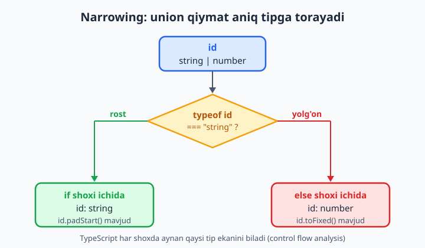
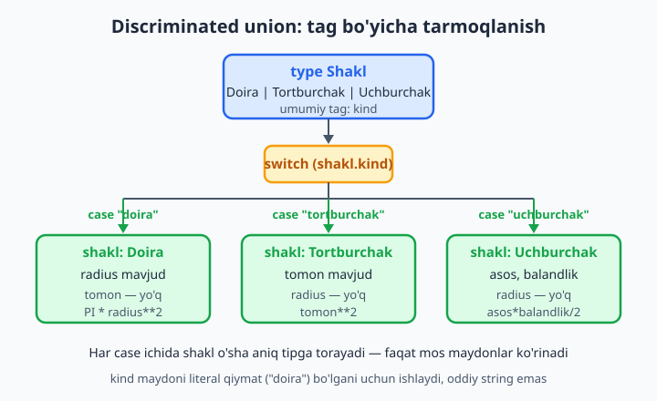
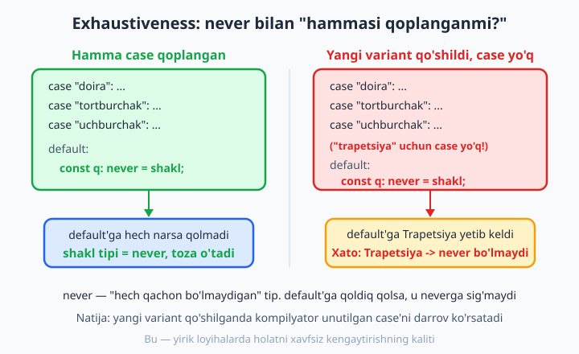

# 8 — Type narrowing va type guard'lar

[⬅️ Oldingi: 07 — Union va literal tiplar](./07-union-literal.md) · [🏠 README](./README.md) · [Keyingi: 09 — any, unknown, never va void ➡️](./09-any-unknown-never.md)

> **Bu bobda:** o'tgan bobda `string | number` kabi union (bir nechta tipdan biri) tiplarni yasashni o'rgandik. Endi ulardan **foydalanishni** o'rganamiz. Union qiymat bilan ishlash uchun TypeScript'ga "hozir aynan qaysi tip ekanini" isbotlash kerak — bu jarayon **narrowing** (torayish) deyiladi. `typeof`, `instanceof`, `in`, truthiness va tenglik orqali toraytirishni; **discriminated union** (umumiy tag maydon bo'yicha tarmoqlanish) qolipini; `never` bilan **exhaustiveness** (hamma holat qoplanganmi) tekshiruvini; o'zingizning **custom type guard**laringizni (`v is X`) va **assertion function** (`asserts`)larni ko'rib chiqamiz.

---

## Muammo

Tasavvur qiling, sizda foydalanuvchining ID'sini qabul qiladigan funksiya bor. Ba'zan ID raqam (`42`) bo'lib keladi, ba'zan satr (`"42"`) — masalan, URL'dan o'qilganda. JavaScript'da bunday kod yozardingiz:

```js
function idniKorsat(id) {
  return "ID: " + id.padStart(5, "0");
}
```

Bu kod `idniKorsat("42")` da ishlaydi, lekin `idniKorsat(42)` da **runtime'da qulaydi**:

```text
TypeError: id.padStart is not a function
```

Chunki `padStart` — faqat satrlarda bor, raqamda yo'q. JavaScript bu xatoni faqat dastur ishga tushganda, foydalanuvchi oldida ushlaydi. TypeScript esa buni **kompilyatsiya vaqtida** ushlamoqchi. ID'ni union tip qilib belgilaylik:

```ts
function idniKorsat(id: string | number) {
  return "ID: " + id.padStart(5, "0");
  //                  ^^^^^^^^
  // ❌ Xato: Property 'padStart' does not exist on type 'string | number'.
  //          Property 'padStart' does not exist on type 'number'.
}
```

TypeScript haq: `id` raqam ham bo'lishi mumkin, raqamda `padStart` yo'q. U bizdan **avval qaysi tip ekanini aniqlashtirishni** talab qilyapti. Aynan shu — narrowing. Quyida uning barcha usullarini ko'rib chiqamiz.



---

## `typeof` bilan narrowing

`typeof` — JavaScript operatori bo'lib, qiymatning tipini satr ko'rinishida qaytaradi: `"string"`, `"number"`, `"boolean"`, `"object"`, `"function"`, `"undefined"`, `"bigint"`, `"symbol"`. TypeScript `typeof` tekshiruvini **tushunadi** va shu shox ichida tipni toraytiradi:

```ts
function idniKorsat(id: string | number): string {
  if (typeof id === "string") {
    // Bu shox ichida TS biladi: id — string
    return "ID: " + id.padStart(5, "0"); // ✅ string'da padStart bor
  }
  // Bu yerga faqat number bo'lganda yetib keladi
  return "ID: " + id.toFixed(0); // ✅ id endi number
}
```

`if` ichida `id` — `string`, `if`dan keyin esa `id` — `number`. TypeScript bu mantiqni avtomatik kuzatadi. Buni **control flow analysis** (oqim bo'yicha tahlil) deyiladi: TS sizning `if`/`return`/`throw`laringizni o'qib, har bir nuqtada tip qanaqaligini "biladi".

📌 Tuzoq: `typeof null === "object"`. Bu JavaScript'ning eski xatosi (afsuski, hech qachon tuzatilmaydi). Shuning uchun `null`ni `typeof` bilan ajratib bo'lmaydi — uni alohida `=== null` yoki truthiness bilan tekshiring (pastda ko'ramiz).

💡 `typeof` faqat **primitiv** tiplar uchun ishonchli: `string`, `number`, `boolean`, `bigint`, `symbol`, `undefined`, `function`. Massiv, sana yoki o'zingizning klassingiz uchun `typeof` `"object"` qaytaradi — ularni ajratish uchun boshqa usul kerak.

## `instanceof` bilan narrowing (klasslar)

Obyekt qaysi klassdan (yoki konstruktordan) yaratilganini tekshirish uchun `instanceof` ishlatiladi. Bu klasslar va o'rnatilgan obyektlar (`Date`, `Error`, `Array`...) bilan narrowing'ning asosiy quroli:

```ts
function sanani(x: Date | string): string {
  if (x instanceof Date) {
    // x — Date
    return x.toISOString();
  }
  // x — string
  return x.trim();
}
```

Tez-tez uchraydigan amaliy holat — `catch` blokidagi xato. Zamonaviy TypeScript'da `catch (e)` dagi `e` tipi `unknown` (noma'lum) bo'ladi, shuning uchun undan to'g'ridan-to'g'ri `e.message` o'qib bo'lmaydi — avval toraytirish kerak:

```ts
function xatoMatni(e: unknown): string {
  if (e instanceof Error) {
    return e.message; // ✅ e endi Error, message bor
  }
  return "Noma'lum xato";
}
```

📌 `instanceof` faqat **prototip zanjiri** orqali ishlaydi — ya'ni `new` bilan yaratilgan obyektlar va klasslar uchun. Oddiy `{ }` literal obyekt yoki `interface` uchun `instanceof` ishlatib bo'lmaydi (interface'ning runtime'da mavjudligi yo'q). Bunday hollarda `in` operatori yoki custom type guard kerak bo'ladi.

## `in` operatori bilan narrowing (maydon bormi?)

Ikki obyekt tipi farqli maydonlarga ega bo'lsa, qaysi maydon borligiga qarab ajratish mumkin. `in` operatori "bu obyektda shu nomli maydon bormi?" degan savolga javob beradi:

```ts
interface Baliq {
  suzadi: () => void;
}
interface Qush {
  uchadi: () => void;
}

function harakatlan(jonzot: Baliq | Qush): void {
  if ("suzadi" in jonzot) {
    jonzot.suzadi(); // ✅ jonzot — Baliq
  } else {
    jonzot.uchadi(); // ✅ jonzot — Qush
  }
}
```

`"suzadi" in jonzot` rost bo'lsa, TS `jonzot`ni `Baliq`ga toraytiradi; aks holda `Qush`ga. `in` aynan `interface` va literal obyekt tiplari uchun qulay — chunki ularda `instanceof` ishlamaydi.

💡 `in` qoladigan maydonni emas, **farqlovchi** maydonni tekshiring. Agar ikkala tipda ham `nom` maydoni bo'lsa, `"nom" in jonzot` hech narsani ajratmaydi. Pastdagi "discriminated union" — bu g'oyani eng toza ko'rinishga keltiradi.

## Truthiness va tenglik bilan narrowing

`if (x)` shaklidagi oddiy tekshiruv ham narrowing qiladi. JavaScript'da `0`, `""`, `null`, `undefined`, `NaN`, `false` — "yolg'on" (falsy), qolgani "rost" (truthy). TypeScript buni biladi va `null | undefined`ni shu yo'l bilan olib tashlaydi:

```ts
function uzunlik(matn: string | null | undefined): number {
  if (matn) {
    // matn endi shunchaki string (null/undefined chiqib ketdi)
    return matn.length;
  }
  return 0;
}
```

📌 Tuzoq: bo'sh satr `""` ham falsy. Agar `""` to'g'ri qiymat bo'lsa (masalan, foydalanuvchi atayin bo'sh kiritgan), `if (matn)` uni xato bilan rad etadi. Bunda aniqroq yozing: `if (matn !== null && matn !== undefined)` yoki qisqasi `if (matn != null)` — `!= null` ikkala `null` va `undefined`ni birato'la ushlaydi.

Tenglik orqali ham narrowing bo'ladi. Ikki union'ni solishtirganda TS ularning **umumiy** tipini chiqaradi:

```ts
function bir(a: string | number, b: string | boolean) {
  if (a === b) {
    // a === b bo'lsa, ikkalasi ham faqat string bo'la oladi
    a.toUpperCase(); // ✅ a — string
    b.toUpperCase(); // ✅ b — string
  }
}
```

## Discriminated union — eng kuchli qolip

Union tiplarni ajratishning eng toza, eng kengaytiriladigan usuli — har bir variantga **umumiy nomli, lekin literal qiymatli "tag" (yorliq) maydon** qo'shish. Bu maydon odatda `kind`, `type` yoki `tag` deb nomlanadi. Quyida geometrik shakllar misoli:

```ts
interface Doira {
  kind: "doira";
  radius: number;
}
interface Tortburchak {
  kind: "tortburchak";
  tomon: number;
}
interface Uchburchak {
  kind: "uchburchak";
  asos: number;
  balandlik: number;
}

type Shakl = Doira | Tortburchak | Uchburchak;

function yuza(shakl: Shakl): number {
  switch (shakl.kind) {
    case "doira":
      return Math.PI * shakl.radius ** 2; // shakl — Doira
    case "tortburchak":
      return shakl.tomon ** 2; // shakl — Tortburchak
    case "uchburchak":
      return (shakl.asos * shakl.balandlik) / 2; // shakl — Uchburchak
  }
}
```

`switch (shakl.kind)` ichida har bir `case` o'sha tipga toraytiriladi: `case "doira"` ichida TS `shakl`ni `Doira` deb biladi, demak `shakl.radius` mavjud, lekin `shakl.tomon` yo'q. Bu shunchaki ishlaydi, chunki `kind` har variantda **literal** tip (`"doira"` — bu o'zining tipi, oddiy `string` emas).



💡 Discriminated union — TypeScript'da holatni modellashtirishning eng yaxshi usuli: API javoblari (`{ status: "ok", data } | { status: "error", xabar }`), Redux/reducer action'lari, formaning holatlari — hammasi shu qolip bilan ifodalanadi. `kind` maydonini doim **literal** qiymat qiling, oddiy `string` emas.

## Exhaustiveness — `never` bilan "hamma holat qoplanganmi?"

Yuqoridagi `yuza` funksiyasi yaxshi, lekin xavf bor: kelajakda `Shakl`ga to'rtinchi shakl — masalan `Trapetsiya` — qo'shsangiz-u, `yuza` ichidagi `switch`ga `case` qo'shishni unutsangiz? Kod jimgina noto'g'ri ishlaydi. TypeScript bizga buni **kompilyatsiya vaqtida** ushlashga yordam beradi — `never` tipi orqali.

`never` — hech qachon yuz bermaydigan qiymat tipi (9-bobda chuqurroq). G'oya: hamma `case`ni qoplab bo'lgach, `default`ga **hech narsa qolmasligi** kerak. Agar qolsa, demak biz biror variantni unutganmiz:

```ts
function yuza(shakl: Shakl): number {
  switch (shakl.kind) {
    case "doira":
      return Math.PI * shakl.radius ** 2;
    case "tortburchak":
      return shakl.tomon ** 2;
    case "uchburchak":
      return (shakl.asos * shakl.balandlik) / 2;
    default:
      // Bu yerga hech qachon yetib kelmasligi kerak.
      // Hamma case qoplangan bo'lsa, shakl tipi — never:
      const qoldiq: never = shakl;
      return qoldiq;
  }
}
```

Hamma variant qoplangan bo'lsa, bu kod **toza kompilyatsiya bo'ladi**. Endi `Shakl`ga yangi variant qo'shamiz, lekin `case` qo'shmaymiz:

```ts
interface Trapetsiya {
  kind: "trapetsiya";
  a: number;
  b: number;
  balandlik: number;
}

type Shakl = Doira | Tortburchak | Uchburchak | Trapetsiya;

function yuza(shakl: Shakl): number {
  switch (shakl.kind) {
    case "doira":
      return Math.PI * shakl.radius ** 2;
    case "tortburchak":
      return shakl.tomon ** 2;
    case "uchburchak":
      return (shakl.asos * shakl.balandlik) / 2;
    default:
      const qoldiq: never = shakl;
      //    ^^^^^^
      // ❌ Xato: Type 'Trapetsiya' is not assignable to type 'never'.
      return qoldiq;
  }
}
```

TypeScript shovqin qiladi: `default`ga `Trapetsiya` yetib kelmoqda, lekin biz "hech narsa qolmaydi" deb va'da qilgan edik (`never`). Bu — **ogohlantiruvchi signal**: "Trapetsiya uchun `case` qo'shishni unutding!". Mana shu `never` hiylasi yirik loyihalarda yangi holat qo'shilganda hech narsani e'tibordan chetda qoldirmaslikni kafolatlaydi.



💡 Buni yanada toza qilish uchun ko'pincha alohida yordamchi funksiya yoziladi:

```ts
function tekshirHammasi(x: never): never {
  throw new Error("Qoplanmagan holat: " + JSON.stringify(x));
}
// ... default: return tekshirHammasi(shakl);
```

Bu ham kompilyatsiyada xato beradi (yangi variant qo'shilsa), ham runtime'da xavfsizlik to'ri vazifasini bajaradi.

## Custom type guard — `function isX(v): v is X`

Ba'zan tekshiruv mantig'i murakkab yoki bir necha joyda qayta ishlatiladi. Buni alohida funksiyaga ajratsangiz, TypeScript oddiy `boolean` qaytaruvchi funksiyadan keyin narrowing qila olmaydi:

```ts
function stringmi(x: unknown): boolean {
  return typeof x === "string";
}

function ishlat(qiymat: unknown) {
  if (stringmi(qiymat)) {
    qiymat.toUpperCase();
    // ❌ Xato: 'qiymat' is of type 'unknown'.
  }
}
```

TS `stringmi` rost qaytarsa nima anglatishini bilmaydi — uning uchun bu shunchaki `boolean`. Hal — qaytuvchi tipni **type predicate** (`x is string`) qilib yozish. Bu TypeScript'ga "agar bu funksiya `true` qaytarsa, argument `string` deb hisobla" deydi:

```ts
function stringmi(x: unknown): x is string {
  return typeof x === "string";
}

function ishlat(qiymat: unknown) {
  if (stringmi(qiymat)) {
    qiymat.toUpperCase(); // ✅ qiymat endi string
  }
}
```

Endi `stringmi(qiymat)` rost bo'lgan shoxda `qiymat` — `string`. Bu murakkab obyektlar uchun ayniqsa qulay — masalan, API'dan kelgan `unknown` ma'lumotning kerakli shaklini tekshirish:

```ts
interface Foydalanuvchi {
  id: number;
  ism: string;
}

function foydalanuvchimi(x: unknown): x is Foydalanuvchi {
  return (
    typeof x === "object" &&
    x !== null &&
    "id" in x &&
    typeof (x as Record<string, unknown>).id === "number" &&
    "ism" in x &&
    typeof (x as Record<string, unknown>).ism === "string"
  );
}

function salomla(data: unknown): string {
  if (foydalanuvchimi(data)) {
    return "Salom, " + data.ism; // ✅ data — Foydalanuvchi
  }
  return "Noma'lum foydalanuvchi";
}
```

📌 Type predicate — bu **va'da**, TypeScript uni tekshirmaydi. Agar `x is string` deb yozib, ichida noto'g'ri mantiq qo'ysangiz (masalan `return typeof x === "number"`), TS sizga ishonadi va narrowing'ni noto'g'ri qiladi — runtime'da xato chiqadi. Shuning uchun guard ichidagi mantiq haqiqatan to'g'ri ekaniga o'zingiz javobgarsiz.

💡 Massivning `.filter()` metodi bilan birga ishlatganda type guard ayniqsa kuchli: `arr.filter((x): x is string => typeof x === "string")` natija tipini avtomatik `string[]` qiladi — oddiy `boolean` guard bunday qila olmaydi.

## Assertion function — `asserts`

Ba'zan tekshiruvni `if` shoxida emas, balki "shart bajarilmasa, dasturni to'xtat" tarzida yozish qulayroq. Bu uchun **assertion function** — qaytuv tipi `asserts ...` bilan boshlanadi. Funksiya xato tashlamasa, undan **keyin** narrowing kuchga kiradi:

```ts
function nullEmasligini(x: unknown, xabar: string): asserts x is NonNullable<typeof x> {
  if (x === null || x === undefined) {
    throw new Error(xabar);
  }
}

function ishlat(matn: string | null) {
  nullEmasligini(matn, "matn bo'sh bo'lmasligi kerak");
  // Shu qatordan keyin matn — string (null chiqib ketdi)
  return matn.toUpperCase(); // ✅
}
```

Oddiy `asserts shart` shakli ham bor — u boolean shartni tekshiradi:

```ts
function tasdiqla(shart: unknown, xabar: string): asserts shart {
  if (!shart) {
    throw new Error(xabar);
  }
}

function bol(son: number) {
  tasdiqla(son !== 0, "Nolga bo'lib bo'lmaydi");
  return 100 / son; // bu yerga faqat son !== 0 bo'lsa yetib keladi
}
```

📌 Type guard (`v is X`) "rost/yolg'on qaytaruvchi savol", assertion (`asserts`) esa "shart buzilsa, otib tashla". Birinchisi `if` bilan, ikkinchisi to'g'ridan-to'g'ri chaqiriladi. Ikkalasi ham — sizning **va'dangiz**: TS ichidagi mantiqning to'g'riligini tekshirmaydi.

## Control flow analysis — TS narrowing'ni oqim bo'yicha kuzatadi

Eng muhim umumiy g'oya: TypeScript kodingizni **yuqoridan pastga, oqim bo'yicha** o'qiydi va har bir nuqtada tip nimaga torayganini "eslab qoladi". `return`, `throw`, `continue` orqali shox uzilsa, undan keyingi kod uchun tip avtomatik torayadi:

```ts
function birinchiHarf(matn: string | null): string {
  if (matn === null) {
    return "?";
  }
  // null shoxi return bilan uzildi -> bu yerda matn faqat string
  return matn[0].toUpperCase(); // ✅
}
```

Bu **early return** (erta qaytish) qolipi ham tozaroq kod beradi, ham TS uchun narrowing'ni soddalashtiradi. Aksincha, qiymatga qayta yozish narrowing'ni "buzadi" — TS yangi qiymat tipini qaytadan hisoblaydi:

```ts
function aralash(x: string | number) {
  if (typeof x === "string") {
    x.toUpperCase(); // ✅ x — string
    x = x.length;    // endi x ga number yozdik
    x.toFixed(2);    // ✅ x — number (TS yangidan hisobladi)
  }
}
```

💡 Narrowing — sehrli emas, sodda mantiq: TS ko'rgan har bir tekshiruv va o'zlashtirishni hisobga oladi. Kodni qancha tiniq yozsangiz (early return, aniq `if`lar, discriminated union), narrowing shuncha aniq va xatosiz ishlaydi.

---

## 8-bob mashqlari

Quyidagi mashqlarni o'zingiz yozib bajaring. Har birini alohida `.ts` faylda yozib, `tsc --noEmit --strict` bilan tekshiring. Mashqlar asta-sekin qiyinlashadi.

1. `string | number` qabul qiladigan `formatla` funksiyasini yozing: string bo'lsa katta harfga, number bo'lsa ikki kasrli matnga aylantirsin. `typeof` ishlatishni mashq qiling.
2. `boolean | number` qabul qiladigan funksiya yozing: boolean bo'lsa `"ha"/"yo'q"`, number bo'lsa o'sha sonni qaytarsin. `typeof x === "boolean"` ni sinab ko'ring.
3. `typeof null === "object"` ekanini ko'rsatadigan kod yozing va `string | null` uchun `typeof` faqat string'ni ajrata olishini, `null`ni alohida tekshirish kerakligini izohlang.
4. `Date | string` qabul qiladigan funksiya: `Date` bo'lsa `toISOString()`, string bo'lsa o'zini qaytarsin. `instanceof` ishlatishni mashq qiling.
5. `catch (e: unknown)` blokida `e`ni `instanceof Error` bilan toraytirib, `e.message`ni xavfsiz o'qiydigan funksiya yozing.
6. Ikkita interface (`Mashina { gildirak: number }` va `Qayiq { eshkak: number }`) yarating va `in` operatori bilan ularni ajratuvchi funksiya yozing.
7. `string | string[]` qabul qiladigan funksiya: massiv bo'lsa `join`, satr bo'lsa o'zini qaytarsin. `Array.isArray()` narrowing'ini sinang.
8. `string | null | undefined` uchun truthiness (`if (x)`) bilan narrowing qiling. Keyin bo'sh satr `""` muammosini ko'rsatib, `!= null` bilan to'g'rilang.
9. Uchta variantli discriminated union yarating: `{ kind: "matn", qiymat: string } | { kind: "raqam", qiymat: number } | { kind: "bayroq", qiymat: boolean }`. `switch` bilan har birini chiqaradigan funksiya yozing.
10. 9-mashqdagi union uchun `switch`ga `default` qo'shing va `const _: never = x` bilan exhaustiveness tekshiruvini qo'shing. Toza kompilyatsiya bo'lishini tasdiqlang.
11. 9-mashqdagi union'ga to'rtinchi variant (`{ kind: "sana", qiymat: Date }`) qo'shing, lekin `case` qo'shmang. `never` tekshiruvi qanday xato berishini ko'ring va xato matnini yozib oling.
12. `tekshirHammasi(x: never): never` yordamchi funksiyasini yozing (xato tashlasin) va uni discriminated union'ning `default` shoxida ishlatib ko'ring.
13. `raqammi(x: unknown): x is number` custom type guard yozing va uni `if` ichida ishlatib, `x`ning `number`ga torayishini tekshiring.
14. `unknown` qiymatni `{ id: number; nom: string }` shaklidagi obyektga tekshiradigan `mahsulotmi` type guard yozing (har maydonni alohida tekshiring).
15. `Array<string | number>` massivini `.filter((x): x is string => ...)` bilan filtrlab, natija tipi `string[]` bo'lishini tasdiqlang (natijaga `.map(s => s.toUpperCase())` qo'llab ko'ring).
16. `tasdiqla(shart: unknown, xabar: string): asserts shart` assertion funksiyasini yozing va uni nolga bo'lishni taqiqlash uchun ishlating.
17. `nullEmasligini(x): asserts x is NonNullable<typeof x>` assertion funksiyasini yozing va `string | null | undefined` argument uchun ishlating; chaqiruvdan keyin tip `string`ga torayishini tekshiring.
18. Early return qolipi bilan `string | null` argumentni qayta ishlovchi funksiya yozing: `null` bo'lsa darrov qaytsin, keyin qolgan kod `string` deb ishlasin.
19. Bir funksiyada bir nechta narrowing usulini birlashtiring: `string | number | boolean | null` argumentni `null` tekshiruvi, keyin `typeof` bilan har bir holatga ajrating va exhaustiveness qo'shing.
20. Real holat: `{ status: "yuklanmoqda" } | { status: "tayyor"; data: string } | { status: "xato"; xabar: string }` discriminated union'ini yarating. `switch` bilan har bir holatda mos UI matn qaytaring va `never` bilan exhaustiveness'ni kafolatlang. Keyin yangi holat (`{ status: "bekor" }`) qo'shib, kompilyator sizni qanday ogohlantirishini kuzating.
