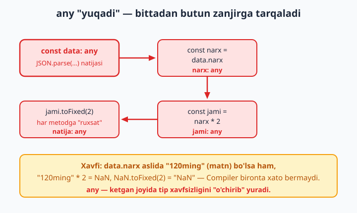
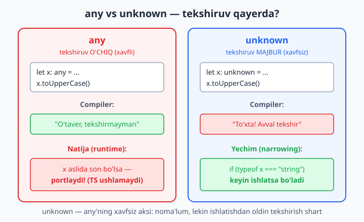
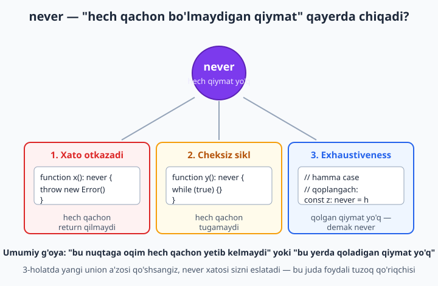

# 9 — any, unknown, never va void

[⬅️ Oldingi: 08 — Type narrowing va type guard'lar](./08-narrowing-guard.md) · [🏠 README](./README.md) · [Keyingi: 10 — Type alias, intersection va kompozitsiya ➡️](./10-type-intersection.md)

> **Bu bobda:** TypeScript'ning to'rtta o'ziga xos "chekka" tipini o'rganamiz. `any` — tip tekshiruvini butunlay o'chiradigan xavfli "qochish yo'li"; `unknown` — uning xavfsiz aksi: qiymat noma'lum, lekin ishlatishdan oldin tekshirish (narrowing) majbur; `never` — hech qachon yuz bermaydigan, qiymati bo'lmagan tip (xato otkazuvchi va tugamaydigan funksiyalar, exhaustiveness qo'riqchisi); `void` — hech narsa qaytarmaydigan funksiya tipi. Eng muhimi — `any` bilan `unknown` orasidagi farqni, `noImplicitAny`ni va `as` assertion'ning xavfini ko'rib chiqamiz.

---

## Muammo

Tasavvur qiling, serverdan JSON javob keldi va siz uni o'qiysiz. JavaScript'da bu odatiy ish edi:

```js
const javob = await fetch("/api/mahsulot/1");
const data = await javob.json();
console.log(data.narx.toFixed(2));   // narxni 2 xonali ko'rsat
```

JavaScript'da bu kod runtime'gacha hech qanday ogohlantirmaydi. Agar API `narx`ni `"120ming"` (matn) sifatida qaytarsa yoki `narx` umuman bo'lmasa, dastur foydalanuvchi oldida portlaydi: `Cannot read properties of undefined` yoki `narx.toFixed is not a function`.

TypeScript'ga o'tdik degani — bunday xatolar avtomatik yo'qoladi degani emas. `javob.json()` qanday tip qaytaradi, deb o'ylaysiz? Eng muhim savol shu. Agar u **noma'lum** tip qaytarsa, biz uni tekshirishga majbur bo'lamiz — bu yaxshi. Agar u **har narsani ruxsat etadigan** tip qaytarsa, biz xuddi JavaScript'dagidek xatoga yo'l qo'yamiz — bu yomon.

Aynan shu yerda `any` va `unknown` farqi hal qiluvchi bo'ladi. Bu bobda biz noma'lum yoki imkonsiz qiymatlarni TypeScript'da **to'g'ri** ifodalashni o'rganamiz. Boshqacha aytganda — kompilyatorni o'zimizga qarshi emas, o'zimiz tomonda ishlashga majbur qilamiz.

---

## `any` — tip tekshiruvini o'chiradigan tugma

`any` (inglizcha "har qanday") — bu maxsus tip bo'lib, unga belgilangan qiymat ustida TypeScript **hech qanday tekshiruv qilmaydi**. `any` qiymat bilan istalgan narsani qilsangiz bo'ladi: istalgan metodni chaqirasiz, istalgan ustunga murojaat qilasiz, istalgan tipga uzatasiz — kompilyator jim turadi.

```ts
let x: any = "salom";

x.toUpperCase();        // OK
x.foo.bar.baz;          // OK (kompilyator tekshirmaydi!)
x();                    // OK (x ni funksiya deb chaqirdik)
const son: number = x;  // OK (any hammaga "beriladi")
```

Yuqoridagi kodning birorta qatori kompilyatsiyada xato bermaydi — lekin deyarli har biri runtime'da portlashi mumkin. `any` aslida "TypeScript, bu qiymatga aralashma" degani.

📌 `any` — tip tizimidagi "qora teshik". U bilan ishlasangiz, TypeScript'ning butun foydasi — avtomatik tekshiruv — shu nuqtada yo'qoladi. Shuning uchun `any`ni "men nima qilayotganimni bilaman, javobgarlikni o'z bo'ynimga olaman" degan imzo deb tushuning.

### `any` qachon kerak bo'ladi?

`any`ni butunlay yomon deb bo'lmaydi — ba'zan u **vaqtinchalik** kerak:

- **Migratsiyada:** katta JavaScript loyihasini TypeScript'ga ko'chirayotganda, hamma narsani birdan tiplab bo'lmaydi. `any` — vaqtincha "keyin qaytaman" belgisi. (Bu mavzu 23-bobda batafsil.)
- **Juda murakkab uchinchi tomon kutubxonasi** to'g'ri tip bermaganda, oxirgi chora sifatida.

Lekin yangi yozayotgan kodda `any` deyarli har doim xato tanlovdir. Ko'pincha uning o'rniga `unknown` yoki aniq tip yozish kerak.

💡 Maslahat: `any`ni "to'g'rilash kerak" degan TODO deb belgilang. Ko'p jamoalar ESLint qoidasi (`no-explicit-any`) bilan kodda `any`ni umuman taqiqlaydi.

## `any` "yuqadi" — eng yashirin xavf

`any`ning eng xavfli tomoni — u **tarqaladi**. `any` qiymatdan kelib chiqqan har qanday natija ham avtomatik `any` bo'ladi. Boshlang'ich muammomizga qaytaylik:

```ts
const data: any = JSON.parse('{"narx": "120ming"}');

const narx = data.narx;     // narx: any
const jami = narx * 2;      // jami: any  ("120ming" * 2 = NaN, lekin TS jim)
const yana = jami.toFixed(2); // yana: any
```

`data` `any` bo'lgani uchun `data.narx` ham `any`, `narx * 2` ham `any`, va hokazo. Tip xavfsizligi butun zanjir bo'ylab "o'chib" boradi. `narx` aslida matn bo'lsa, `narx * 2` — `NaN`, lekin kompilyator bironta ham xato bermaydi.



📌 Mana shuning uchun bitta e'tiborsiz `any` butun fayl bo'ylab "infektsiya" tarqatishi mumkin. Bitta funksiya `any` qaytarsa, uni chaqirgan har bir joy ham tekshiruvni yo'qotadi.

## `unknown` — noma'lum, lekin XAVFSIZ

Endi eng muhim qahramon. `unknown` (inglizcha "noma'lum") — bu ham "tipi noma'lum" degan ma'noni beradi, **lekin** `any`dan farqli ravishda TypeScript uni tekshirishni **majbur qiladi**. `unknown` qiymat bilan to'g'ridan-to'g'ri hech narsa qila olmaysiz — avval uning aslida nima ekanini isbotlashingiz kerak.

```ts
let x: unknown = "salom";

// ❌ Xato: 'x' is of type 'unknown'.
x.toUpperCase();
```

Kompilyator: `'x' is of type 'unknown'.` — ya'ni "x noma'lum tipga ega, men senga `toUpperCase` chaqirishga ruxsat bera olmayman, chunki x matn ekaniga ishonchim yo'q".

Yechim — **narrowing** (tipni toraytirish, 8-bobda o'rgangan edik). `unknown`ni ishlatishdan oldin uni `typeof`, `in`, `instanceof` yoki type guard bilan tekshirib, aniq tipga "toraytirishingiz" shart:

```ts
function ishlat(qiymat: unknown): string {
  if (typeof qiymat === "string") {
    return qiymat.toUpperCase();   // bu yerda qiymat: string — OK
  }
  if (typeof qiymat === "number") {
    return qiymat.toFixed(2);      // bu yerda qiymat: number — OK
  }
  return "noma'lum tur";
}

ishlat("salom");   // "SALOM"
ishlat(3.14159);   // "3.14"
ishlat(true);      // "noma'lum tur"
```

Ko'rdingizmi? `if (typeof qiymat === "string")` bloki ichida TypeScript endi `qiymat`ni `string` deb biladi va `toUpperCase()`ga ruxsat beradi. Tekshiruvsiz — yo'q. Aynan shu narsa `unknown`ni `any`ning **xavfsiz aksi** qiladi.



## `any` vs `unknown` — eng muhim farq

Bu bobning eng muhim jadvali. Ikkalasi ham "tipi noma'lum" degani, lekin yondashuvlari teskari:

| | `any` | `unknown` |
|---|---|---|
| Metod chaqirish (`x.foo()`) | ✅ ruxsat (tekshirilmaydi) | ❌ avval narrowing kerak |
| Boshqa tipga berish (`const s: string = x`) | ✅ ruxsat (xavfli) | ❌ avval narrowing kerak |
| Xato tutiladimi? | ❌ yo'q | ✅ ha |
| Xavfsizmi? | ❌ yo'q | ✅ ha |
| Qachon? | migratsiya, oxirgi chora | noma'lum tashqi ma'lumot |

Oddiy qoida: **noma'lum qiymat kirsa, `any` emas, `unknown` yozing.** Shunda TypeScript sizni uni tekshirishga majbur qiladi va xatolarni ushlaydi.

```ts
// JSON.parse standart holatda 'any' qaytaradi — buni unknown'ga "ushlab" oling:
function xavfsizParse(matn: string): unknown {
  return JSON.parse(matn);
}

const natija = xavfsizParse('{"ism": "Ali"}');

// ❌ Xato: 'natija' is of type 'unknown'.
// console.log(natija.ism);

// ✅ Avval tekshirib, keyin ishlatamiz:
if (
  typeof natija === "object" &&
  natija !== null &&
  "ism" in natija &&
  typeof (natija as { ism: unknown }).ism === "string"
) {
  const obj = natija as { ism: string };
  console.log(obj.ism.toUpperCase());   // xavfsiz
}
```

💡 `unknown`ni shunchaki boshqa `unknown`ga yoki `any`ga berish mumkin — chunki bu yangi xavf tug'dirmaydi. Lekin aniq tipga (`string`, `number`...) berish uchun har doim narrowing yoki assertion kerak.

## Type guard funksiyalari `unknown` bilan

Tashqi ma'lumotni har safar qo'lda tekshirish zerikarli. Yaxshi yechim — bir marta **type guard** (8-bobdagi `qiymat is Tur` funksiyasi) yozib, uni qayta ishlatish:

```ts
interface Foydalanuvchi {
  ism: string;
  yosh: number;
}

function foydalanuvchimi(qiymat: unknown): qiymat is Foydalanuvchi {
  return (
    typeof qiymat === "object" &&
    qiymat !== null &&
    "ism" in qiymat &&
    "yosh" in qiymat &&
    typeof (qiymat as Record<string, unknown>).ism === "string" &&
    typeof (qiymat as Record<string, unknown>).yosh === "number"
  );
}

function ishlat(data: unknown): void {
  if (foydalanuvchimi(data)) {
    console.log(data.ism, data.yosh);   // data: Foydalanuvchi
  } else {
    console.log("Noto'g'ri format");
  }
}

ishlat({ ism: "Lola", yosh: 25 });   // Lola 25
ishlat("xato");                      // Noto'g'ri format
```

Bu — real loyihalarda API javoblarini, `localStorage`dan kelgan ma'lumotni va `JSON.parse` natijasini xavfsiz ishlash uchun **eng to'g'ri** qolip: tashqaridan kelganni `unknown` deb qabul qilib, type guard orqali ishonchli tipga aylantirish.

📌 Eslatma: `Record<string, unknown>` — bu "kalitlari string, qiymatlari noma'lum bo'lgan obyekt" degani. Type guard ichida vaqtincha `as Record<string, unknown>` qilish — obyekt ekani allaqachon tekshirilgandan keyin uning ustunlariga murojaat qilishning xavfsiz usuli.

## `never` — hech qachon bo'lmaydigan qiymat

`never` — TypeScript'dagi eng g'alati, lekin eng aqlli tip. U "qiymati **bo'lishi mumkin emas** bo'lgan tip" degani. `string`da matnlar, `number`da sonlar bor; `never`da esa **hech qanday qiymat yo'q**.

Bu birinchi qarashda foydasizdek tuyuladi, lekin u uchta muhim joyda paydo bo'ladi.



### 1. Xato otkazadigan funksiya

Hech qachon normal `return` qilmaydigan, doim xato otkazadigan funksiyaning qaytish tipi `never` bo'ladi:

```ts
function xatoOtkaz(xabar: string): never {
  throw new Error(xabar);
}
```

Bu funksiya hech qachon qiymat **qaytarib bera olmaydi** — chunki `throw`gacha yetib boradi-yu, undan keyin kod yo'q. Shuning uchun `never`. Bunday yordamchi funksiya juda foydali:

```ts
function olish(qiymat: number | undefined): number {
  if (qiymat === undefined) {
    xatoOtkaz("Qiymat yo'q");   // bu yo'ldan keyin oqim tugaydi
  }
  return qiymat;   // bu yerda qiymat: number (undefined imkoni yo'q)
}
```

TypeScript `xatoOtkaz` `never` qaytarishini biladi, shuning uchun `if`dan keyin `qiymat` faqat `number` bo'lishi mumkinligini tushunadi. `return undefined` xavfi yo'qoladi.

### 2. Hech qachon tugamaydigan funksiya

Cheksiz sikl ham hech qachon qiymat qaytarmaydi:

```ts
function abadiyKut(): never {
  while (true) {
    // hech qachon return qilmaydi
  }
}
```

📌 `never` va `void` farqini chalkashtirmang: `void` qaytaruvchi funksiya **tugaydi**, lekin qiymat qaytarmaydi (`return;`gacha yetadi). `never` qaytaruvchi funksiya esa umuman **tugamaydi** yoki **xato otkazadi** — oxirigacha yetib bormaydi.

### 3. Exhaustiveness — union'ni "to'liq qoplaganini" tekshirish

Bu `never`ning eng kuchli amaliy qo'llanilishi. Union tip (7-bob) bilan ishlaganda, har bir holatni qoplaganingizni TypeScript bilan **kafolatlash** mumkin:

```ts
type Holat = "kutilmoqda" | "bajarildi" | "bekor";

function holatMatni(h: Holat): string {
  switch (h) {
    case "kutilmoqda":
      return "Kutilmoqda...";
    case "bajarildi":
      return "Bajarildi";
    case "bekor":
      return "Bekor qilindi";
    default: {
      const tekshir: never = h;   // hamma case qoplangach, h — never
      return tekshir;
    }
  }
}
```

Mantiq: barcha mumkin bo'lgan holatlarni `case`lar bilan "yeb" bo'lgach, `default`ga faqat **mumkin bo'lmagan** qiymat kelishi mumkin. Bunday qiymat yo'q, shuning uchun `h`ning tipi `never`ga "toraygan" bo'ladi va `const tekshir: never = h` toza o'tadi.

Endi sehrli qism. Faraz qilaylik, kelajakda `Holat`ga yangi a'zo qo'shasiz:

```ts
type Holat = "kutilmoqda" | "bajarildi" | "bekor" | "kutilyapti";
```

Lekin `holatMatni`ga yangi `case` qo'shishni unutdingiz. Endi `default` blokida `h` `"kutilyapti"` bo'lishi mumkin — u `never` emas:

```ts
    default: {
      // ❌ Xato: Type '"kutilyapti"' is not assignable to type 'never'.
      const tekshir: never = h;
      return tekshir;
    }
```

TypeScript sizni **kompilyatsiya vaqtida** ogohlantiradi: "yangi holatni unutding!". Bu — runtime'da yashirin bug o'rniga, hali kod yozayotganda ushlanadigan xato. Mana shuning uchun `never` — eng yaxshi tuzoq qo'riqchisi.

💡 Ko'pincha bu qolipni alohida yordamchi funksiyaga ajratadilar — kodingiz toza va qayta ishlatiladigan bo'ladi:

```ts
function imkonsizHolat(qiymat: never): never {
  throw new Error("Kutilmagan holat: " + JSON.stringify(qiymat));
}

type Shakl =
  | { tur: "doira"; radius: number }
  | { tur: "kvadrat"; tomon: number };

function yuza(s: Shakl): number {
  switch (s.tur) {
    case "doira":
      return Math.PI * s.radius ** 2;
    case "kvadrat":
      return s.tomon ** 2;
    default:
      return imkonsizHolat(s);   // yangi shakl qo'shilsa, shu yerda xato chiqadi
  }
}
```

📌 Yana bir xususiyat: `never` har qanday tipga "beriladi" (chunki u hech qachon yuz bermaydi, qarama-qarshilik yo'q), lekin hech narsa (faqat `never`ning o'zidan boshqa) `never`ga berilmaydi. Shuning uchun `imkonsizHolat(s)` natijasini `number` qaytaradigan funksiyada `return` qilsa bo'laveradi.

## `void` — hech narsa qaytarmaydigan funksiya

`void` — eng oddiy maxsus tip. U funksiya **qiymat qaytarmasligini** bildiradi:

```ts
function logla(xabar: string): void {
  console.log("[LOG]", xabar);
  // return yo'q (yoki bo'sh "return;")
}
```

JavaScript'da `return`siz funksiya aslida `undefined` qaytaradi, lekin `void` "bu qaytgan qiymatdan **foydalanmang**, u ahamiyatsiz" degan niyatni bildiradi. Farqi nozik, lekin muhim.

📌 `void` bilan `undefined` bir xil emas. `void` — "qiymat qaytarmaydi, qaytsa ham e'tiborga olinmaydi"; `undefined` — aniq bitta qiymat (`undefined`ning o'zi). Odatda funksiya qaytish tipi sifatida `void` ishlatiladi.

`void`ning eng foydali joyi — **callback** tiplarida. `void` qaytaradigan callback'da TypeScript "qiymat qaytsa ham, men uni e'tiborga olmayman" deydi:

```ts
const sonlar: number[] = [];
[1, 2, 3].forEach((n) => sonlar.push(n));
```

Bu yerda `sonlar.push(n)` aslida `number` (massiv yangi uzunligi) qaytaradi, lekin `forEach`ning callback'i `void` kutadi — shuning uchun TypeScript qaytgan sonni e'tiborga olmaydi va xato bermaydi. Bu "qulay yengillik" `void`ning maxsus qoidasi:

```ts
type Tugma = {
  bosilganda: () => void;
};

const tugma: Tugma = {
  bosilganda: () => 42,   // OK: void kutilgani uchun, 42 e'tiborga olinmaydi
};
```

💡 Agar callback haqiqatan ham qiymat qaytarsin desangiz, `() => void` o'rniga aniq tip yozing, masalan `() => number`. `void` — "natijasi keraksiz" degani.

## Type assertion (`as`) va uning xavfi

Ba'zan siz qiymatning tipini kompilyatordan **yaxshiroq bilasiz**. `as` operatori — "ishon menga, bu qiymat aslida shu tipda" deyishning usuli (buni **type assertion** — tip da'vosi deymiz):

```ts
const element = document.getElementById("input") as HTMLInputElement;
console.log(element.value);   // .value faqat input'da bor
```

Bu yerda `getElementById` `HTMLElement | null` qaytaradi, lekin biz bu aniq `<input>` ekanini bilamiz, shuning uchun `as` bilan toraytiramiz. (DOM mavzusi 19-bobda batafsil.)

Lekin `as` — **xavfli quroldir**. U hech qanday tekshiruv qilmaydi, shunchaki kompilyatorga "ishonadi". Agar yolg'on da'vo qilsangiz, runtime'da portlaysiz:

```ts
const malumot: unknown = "men matnman";

// ❌ Mantiqiy xato: aslida string, lekin number deb da'vo qilyapmiz
const son = malumot as number;
console.log(son.toFixed(2));   // runtime: son.toFixed is not a function
```

Bu kod **kompilyatsiyadan o'tadi** — TypeScript `as`ga ishondi. Lekin runtime'da `"men matnman".toFixed` mavjud emas, dastur portlaydi. `as` — TypeScript'ga "ko'zingni yum" deyishning usuli; mas'uliyat to'liq sizda.

### `as unknown as` — ikki bosqichli "majburlash"

TypeScript bir-biriga umuman o'xshamagan tiplarni to'g'ridan-to'g'ri `as` qilishga ham yo'l qo'ymaydi:

```ts
const matn = "salom";

// ❌ Xato: Conversion of type 'string' to type 'number' may be a mistake
//    because neither type sufficiently overlaps with the other.
const son = matn as number;
```

Kompilyator: "string'ni number'ga aylantirish xato bo'lishi mumkin, ular yetarlicha o'xshamaydi". Lekin xato xabarining o'zi yo'lni ko'rsatadi: agar **chindan ham** shuni xohlasangiz, avval `unknown`ga o'tkazing. Mana shu `as unknown as` qolipi:

```ts
const yana = "matn" as unknown as number;   // kompilyator endi qarshilik qilmaydi
```

📌 `as unknown as X` — TypeScript'da eng xavfli ifoda. U "men kompilyatorni ikki marta aldayapman" degani. Agar shuni yozayotgan bo'lsangiz, deyarli har doim **dizayningizda xato bor**. Real loyihada bu juda kam, faqat juda nozik holatlarda (masalan, eski kutubxona tiplari noto'g'ri bo'lganda) qo'llaniladi.

💡 Qoida: assertion (`as`) — narrowing'ning o'rnini bosa olmaydi. Iloji bo'lsa, `as` o'rniga `if (typeof ...)` yoki type guard bilan **haqiqiy** tekshirish yozing. `as` faqat siz haqiqatan ham kompilyatordan ko'proq bilganda (masalan DOM elementi tipi) ishlatiladi.

## `noImplicitAny` — yashirin `any`ga qarshi

`strict` rejimda (`tsconfig.json`da `"strict": true`) `noImplicitAny` opsiyasi yoqilgan bo'ladi. U **yashirin** `any`ni — ya'ni siz yozmagan, lekin TypeScript "topa olmagani uchun" qo'ygan `any`ni — taqiqlaydi:

```ts
function salomla(ism) {
  // ❌ Xato: Parameter 'ism' implicitly has an 'any' type.
  return "Salom, " + ism;
}
```

`ism`ga tip yozmaganingiz uchun TypeScript uni `any` deb belgilamoqchi bo'ldi, lekin `noImplicitAny` bunga yo'l qo'ymaydi. Yechim — tipni aniq yozish:

```ts
function salomla(ism: string): string {
  return "Salom, " + ism;
}
```

📌 `noImplicitAny` — `strict`ning eng foydali qismlaridan biri. U sizni har bir parametr va o'zgaruvchiga tip berishga "majburlaydi" — natijada TypeScript butun kuchini ko'rsatadi. Agar **aniq** `any` xohlasangiz (`ism: any`), TypeScript qarshilik qilmaydi — chunki bu sizning ongli tanlovingiz. Taqiqlanadigani — **yashirin**, e'tiborsizlikdan kelib chiqqan `any`.

💡 Yangi loyihada doim `"strict": true` bilan boshlang. `noImplicitAny`ni o'chirish — TypeScript'ning yarmidan voz kechish bilan teng. (tsconfig'ning barcha opsiyalari 18-bobda.)

## Hammasini bir joyda — qaysi birini qachon?

| Tip | Ma'nosi | Qachon ishlatiladi |
|---|---|---|
| `any` | tekshiruv o'chiq, har narsa ruxsat | deyarli hech qachon (migratsiya, oxirgi chora) |
| `unknown` | noma'lum, lekin tekshirish majbur | tashqaridan kelgan ma'lumot (API, JSON, localStorage) |
| `never` | qiymat bo'lishi mumkin emas | xato otkazuvchi funksiya, exhaustiveness qo'riqchisi |
| `void` | qiymat qaytarmaydi | hech narsa qaytarmaydigan funksiya/callback |

Asosiy xulosalar:

- **`any`dan qoching.** U tip xavfsizligini o'chiradi va "yuqadi". Yangi kodda `any` ko'rsangiz, "bu yerda nimadir noto'g'ri" deb o'ylang.
- **`unknown` — to'g'ri tanlov** noma'lum ma'lumot uchun. U sizni narrowing bilan tekshirishga majbur qiladi — bu aynan kerakli xavfsizlik.
- **`never` — bug oldini oluvchi qurol.** Uni exhaustiveness uchun ishlatib, kelajakdagi union o'zgarishlaridan himoyalaning.
- **`void`** — oddiygina "qaytgan qiymat keraksiz" degani.
- **`as`ni** ehtiyot bo'lib ishlating: u tekshirmaydi, faqat ishonadi. `as unknown as` esa "qizil bayroq" — deyarli har doim dizaynni qayta ko'rib chiqish kerakligini bildiradi.

---

## 9-bob mashqlari

> 💡 Mashqlarni alohida `.ts` faylda yozib, `tsc --noEmit --strict` bilan tekshiring. "❌ xato chiqishi kerak" deganlarda — xato **chindan** chiqishini ko'ring; "✅ toza o'tsin" deganlarda — kompilyatsiya **xatosiz** o'tishini kuzating.

1. `let x: any = 5;` deb e'lon qiling, so'ng `x.toFixed()`, `x.foo.bar` va `x()` yozing — uchalasi ham kompilyatsiyadan o'tishini va birortasi xato bermasligini ko'ring (any tekshiruvni o'chiradi).

2. Yuqoridagi `x`ni `unknown`ga o'zgartiring. Endi qaysi qatorlar ❌ xato berishini va xato matni nima ekanini yozib qo'ying.

3. `unknown` tipdagi parametr qabul qiluvchi `chiqar(qiymat: unknown)` funksiyasi yozing. `typeof` bilan narrowing qilib: string bo'lsa katta harfda, number bo'lsa 2 xonali kasrda, boshqa holatda `"noma'lum"` qaytaring. ✅ Toza o'tsin.

4. `JSON.parse('{"a": 1}')` natijasini `unknown` tipga ushlab oling. To'g'ridan-to'g'ri `.a`ga murojaat qilib ❌ xatoni ko'ring, so'ng narrowing bilan tekshirib xavfsiz murojaat qiling.

5. Bir xil mantiqni avval `any` bilan, keyin `unknown` bilan yozing: `data.narx * 2`. `any` versiyada xato chiqmasligini, `unknown` versiyada chiqishini taqqoslang.

6. `xatoOtkaz(xabar: string): never` funksiyasi yozing — `throw new Error(xabar)`. Qaytish tipini `never` qilib belgilang va ✅ toza o'tishini ko'ring.

7. 6-mashqdagi funksiyadan foydalanib, `topshiriqOl(id: number | null): number` yozing: `id` `null` bo'lsa `xatoOtkaz` chaqiring, aks holda `id`ni qaytaring. `return` qatorida `id`ning `number`ga "toraygani"ni kuzating.

8. `never` qaytaruvchi cheksiz sikl funksiyasi (`while (true) {}`) yozing va uning qaytish tipi `never` bo'lishini tekshiring.

9. `type Yonalish = "shimol" | "janub" | "sharq" | "garb"` union'ini yozing. `switch` bilan har biriga matn qaytaring va `default`da `const tekshir: never = y` qo'yib exhaustiveness tekshiruvini qo'shing. ✅ Toza o'tsin.

10. 9-mashqdagi `Yonalish`ga `"shimoli-sharq"` a'zosini qo'shing, lekin `switch`ga yangi `case` qo'shmang. `default`da ❌ xato chiqishini va xato matnini yozib qo'ying.

11. `imkonsizHolat(qiymat: never): never` yordamchi funksiyasini yozing (`throw` bilan). Uni 9-mashqdagi `switch`ning `default`ida `return imkonsizHolat(y)` ko'rinishida ishlating.

12. `void` qaytaruvchi `xabarChiqar(matn: string): void` funksiyasi yozing. Funksiya ichida `return;` yozib ko'ring (qiymatsiz) — toza o'tishini, `return matn;` yozsangiz ❌ xato berishini taqqoslang.

13. `type Hodisa = { bosilganda: () => void }` tipini yozing va `bosilganda`ga `() => 42` beradigan obyekt yarating. ✅ Toza o'tishini (void callback qaytgan qiymatni e'tiborga olmasligini) ko'ring.

14. `const x: unknown = "salom"; const s: string = x;` yozing va ❌ xatoni ko'ring. So'ng narrowing yoki `as` bilan to'g'rilang.

15. `as` assertion bilan: `const son = ("matn" as unknown) as number;` yozing. Kompilyatsiyadan o'tishini, lekin `son.toFixed(2)` runtime'da xato berishini izohda yozib qo'ying (haqiqatan ishga tushiring).

16. To'g'ridan-to'g'ri `"matn" as number` yozib ❌ kompilyatsiya xatosini ko'ring. Xato matni qaysi yo'lni (`as unknown as`) taklif qilishini yozib qo'ying.

17. `noImplicitAny`ni sinash: tipsiz parametrli `function qosh(a, b) { return a + b; }` yozing va `--strict` bilan ❌ xato chiqishini ko'ring. So'ng tiplarni qo'shib to'g'rilang.

18. Type guard funksiyasi yozing: `mahsulotmi(x: unknown): x is { nomi: string; narx: number }`. Ichida `typeof`, `in` va `!== null` tekshiruvlarini birlashtiring. ✅ Toza o'tsin.

19. 18-mashqdagi guard'dan foydalanib, `unknown` qabul qiluvchi funksiyada `if (mahsulotmi(x))` ichida `x.nomi` va `x.narx`ga xavfsiz murojaat qiling. Guard'siz murojaat ❌ xato berishini ham ko'ring.

20. Yaxlit mashq: `unknown` qabul qiluvchi `xavfsizSonOl(x: unknown): number` funksiyasi yozing. `x` number bo'lsa o'zini qaytaring; string bo'lib `Number(x)` `NaN` bo'lmasa, sonni qaytaring; boshqa hamma holatda `imkonsizHolat` o'rniga `throw` bilan xato bering. `any` ishlatmang, faqat `unknown` + narrowing. ✅ Toza o'tsin.
