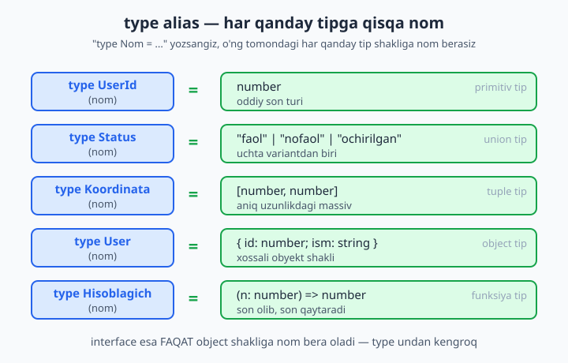
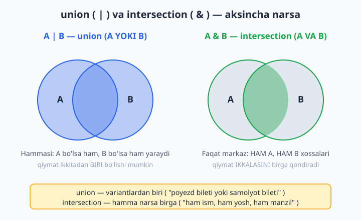
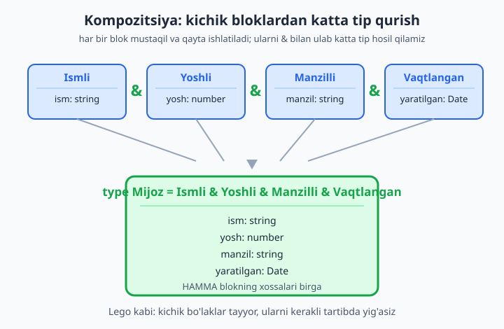

# 10 — Type alias, intersection va kompozitsiya

[⬅️ Oldingi: 09 — any, unknown, never va void](./09-any-unknown-never.md) · [🏠 README](./README.md) · [Keyingi: 11 — Generics — asoslar ➡️](./11-generics-asos.md)

> **Bu bobda:** tiplarga nom berishni va kichik tiplardan kattasini "yig'ishni" o'rganamiz. `type` alias (har qanday tipga — primitiv, union, tuple, object, funksiyaga — qisqa nom) qanday ishlashini, `intersection` (`A & B` — IKKALA tipning ham hamma xossasi, union'ning aksi) bilan object tiplarni birlashtirishni, `interface extends` va `type &` farqini, generic type aliaslarni, `type` va `interface` orasida qanday tanlash kerakligini va kichik bloklardan katta tip qurish (kompozitsiya) san'atini ko'rib chiqamiz.

---

## Muammo

Tasavvur qiling: jamoa bilan katta loyiha yozayapsiz. Kodingizning o'nlab joyida bir xil obyekt shakli takrorlanadi:

```ts
function foydalanuvchiKorsat(u: { id: number; ism: string; email: string }) { /* ... */ }
function foydalanuvchiSaqla(u: { id: number; ism: string; email: string }) { /* ... */ }
function foydalanuvchiYangila(u: { id: number; ism: string; email: string }) { /* ... */ }
```

Bu yerda kamida uchta muammo bor:

1. **Takror.** Bir xil shakl uch marta yozildi. Ertaga `email`ga `telefon` qo'shsangiz — uch joyni qo'lda tahrirlaysiz, bittasini unutsangiz — xato.
2. **O'qilmaydi.** Funksiya imzosi uzun va shovqinli. "Bu nima obyekt?" degan savol darrov tug'ilmaydi.
3. **Birlashtirib bo'lmaydi.** Endi shu foydalanuvchiga "manzil ma'lumotlari" ham qo'shilsin desangiz, qanday qilasiz? Yana har joyda qo'lda yozasizmi?

JavaScript'da bunday vaziyatda biror "qolip" yo'q edi — obyekt shaklini faqat boshda ko'rib bilardingiz. TypeScript bu muammoni ikkita qurol bilan hal qiladi:

- **`type` alias** — tipga **nom** berib, uni bir marta yozib, hamma joyda qayta ishlatish.
- **`intersection` (`&`)** — bir nechta tipni **birlashtirib**, yangi katta tip qurish.

Boshlaymiz.

## type alias — tipga nom berish

`type` kalit so'zi bilan istalgan tipga **nom** (alias — taxallus) berasiz. Sintaksis sodda: `type Nom = tip;`

```ts
type Foydalanuvchi = {
  id: number;
  ism: string;
  email: string;
};
```

Endi yuqoridagi takror yo'qoladi:

```ts
function foydalanuvchiKorsat(u: Foydalanuvchi) { /* ... */ }
function foydalanuvchiSaqla(u: Foydalanuvchi) { /* ... */ }
function foydalanuvchiYangila(u: Foydalanuvchi) { /* ... */ }
```

Shaklni o'zgartirish kerak bo'lsa — faqat bitta joyni, `type Foydalanuvchi`ni tahrirlaysiz, qolgan hamma joy avtomatik yangilanadi.

📌 `type` faqat **nom** — u yangi qiymat yoki klass yaratmaydi. Kompilyatsiyadan keyin (TypeScript JavaScript'ga aylanganda) `type`larning hammasi yo'qoladi. Ya'ni `type` faqat kod yozish va tekshirish paytida yashaydi, ishlab turgan dasturda undan asar ham qolmaydi.

### type — faqat object emas, HAR QANDAY tip uchun

Eng muhim tushuncha: `type` faqat obyekt shakliga emas, **istalgan** tipga nom bera oladi:

```ts
type ID = number;                      // primitiv tipga nom
type Ism = string;                     // primitiv tipga nom
type StatusKodi = 200 | 404 | 500;     // union tipga nom
type Koordinata = [number, number];    // tuple tipga nom
type Hisoblagich = (avval: number) => number;  // funksiya tipiga nom

let foydalanuvchiId: ID = 42;
let kod: StatusKodi = 404;
let nuqta: Koordinata = [41.3, 69.2];
let oshir: Hisoblagich = (n) => n + 1;
```

✅ Bu hammasi toza kompilyatsiya o'tadi. `ID` aslida `number`ning o'zi — lekin nom kodga **ma'no** beradi: `id: ID` deganda "bu shunchaki son emas, bu identifikator" degan niyat ko'rinadi.



💡 Nomlash usuli: tip nomlarini odatda **katta harf** bilan boshlaydilar (`Foydalanuvchi`, `StatusKodi`), o'zgaruvchilar kichik harf bilan (`foydalanuvchi`). Bu kodda "bu tip-mi yoki qiymat-mi?" degan savolni darrov hal qiladi.

📌 `type X = Y` da `X` — `Y` uchun **boshqa nom**, alohida yangi tip emas. `type ID = number` yozsangiz, `ID` va `number` bir-biriga to'liq almashinadi (interchangeable). TypeScript ularni ajratmaydi: `let a: ID = 5` ga oddiy `number` ham bemalol o'tadi. Agar haqiqatan ajratilgan "branded" tip kerak bo'lsa, bu ilg'or mavzu — hozir kerak emas.

## Muammo: ikki tipni birlashtirish kerak

Endi asosiy muammoga qaytamiz. Ikkita mustaqil tip bor:

```ts
type Manzil = {
  shahar: string;
  kocha: string;
};

type Aloqa = {
  email: string;
  telefon: string;
};
```

Sizga shunday obyekt kerak: **ham** manzil ma'lumotlari, **ham** aloqa ma'lumotlari bitta joyda bo'lsin. Qanday qilasiz? Ikkalasini qo'lda ko'chirib yangi `type` yozish mumkin, lekin bu yana takror. TypeScript'da maxsus operator bor — **intersection** (kesishma), `&` belgisi.

## intersection (&) — ikkala tipning HAMMA xossasi

`A & B` o'qilishi: "ham A, ham B". Natija — IKKALA tipning hamma xossasini birga talab qiladigan yangi tip:

```ts
type ToliqManzil = Manzil & Aloqa;

const m: ToliqManzil = {
  shahar: "Toshkent",
  kocha: "Amir Temur 1",
  email: "info@mail.uz",
  telefon: "+998901234567",
};
```

✅ Toza o'tadi. `ToliqManzil` endi to'rttala xossani — `shahar`, `kocha`, `email`, `telefon` — birga talab qiladi.

Birortasini tushirib qoldirsangiz, kompilyator darrov ushlaydi:

```ts
const m: ToliqManzil = {
  shahar: "Toshkent",
  kocha: "Amir Temur 1",
  email: "info@mail.uz",
  // ❌ Xato: Property 'telefon' is missing in type
  //    '{ shahar: string; kocha: string; email: string; }'
  //    but required in type 'Aloqa'.
};
```

`telefon` `Aloqa`dan keladigan majburiy xossa edi — `&` uni ham talab qiladi.

### intersection — union'ning AKSI

Bu eng ko'p chalkashtiriladigan joy, shuning uchun yaxshilab ajratib olaylik. 7-bobda `union` (`|`) ni ko'rgansiz:

- **`A | B` (union)** — qiymat A **YOKI** B bo'lishi mumkin. "Bittasini tanla".
- **`A & B` (intersection)** — qiymat **HAM** A, **HAM** B bo'lishi shart. "Hammasini birga qondir".

Misol bilan:

```ts
type Kichik = { a: string };
type Katta = { b: number };

type Yoki = Kichik | Katta;   // a BO'LSA ham, b bo'lsa ham, ikkalasi ham bo'lsa ham
type Vaa = Kichik & Katta;    // ham a, HAM b bo'lishi SHART

const x: Yoki = { a: "salom" };          // ✅ faqat a — yetadi
const y: Vaa = { a: "salom", b: 5 };     // ✅ ikkalasi ham bor — shart
```

📌 Diqqat — bu ko'pchilik uchun teskari tuyuladi: `&` ("va") tipni **kengaytiradi** (ko'proq xossa talab qiladi, shuning uchun mos keladigan obyektlar **kamayadi**), `|` ("yoki") esa imkoniyatlarni **ko'paytiradi**. "VA" — ko'proq talab, "YOKI" — ko'proq erkinlik.



💡 Eslab qolish hiylasi: maktab matematikasidagi to'plamlar. Union `∪` — "birlashma" (hamma element), intersection `∩` — "kesishma" (umumiy elementlar). TypeScript belgilarni mantiqdan oladi: `|` = OR (yoki), `&` = AND (va).

### Tuzoq: bir-biriga zid primitiv tiplarni & qilish

Object tiplar bilan `&` mantiqli. Ammo primitiv tiplarni kesishtirsangiz qiziq narsa bo'ladi:

```ts
type Imkonsiz = string & number;  // "ham string, ham number" bo'lgan qiymat?

const x: Imkonsiz = "salom";
// ❌ Xato: Type '"salom"' is not assignable to type 'never'.
```

Hech qaysi qiymat bir vaqtning o'zida ham `string`, ham `number` bo'lolmaydi — shuning uchun TypeScript bu tipni `never` (hech qachon bo'lmaydigan tip, 9-bob) deb hisoblaydi. `Imkonsiz`ga hech narsa o'tmaydi.

📌 Xuddi shu narsa object tiplarda bitta xossa **turi** to'qnashganda ham bo'ladi:

```ts
type X = { id: string };
type Y = { id: number };
type XY = X & Y;          // id: string & number  =  never

const z: XY = { id: 5 };
// ❌ Xato: Type 'number' is not assignable to type 'never'.
```

`id` xossasi `string & number = never` bo'lib qoldi — endi `XY`ga to'g'ri keladigan obyekt yo'q. Shuning uchun `&` bilan tiplarni birlashtirayotganda **bir xil nomli xossalar turi mos kelishiga** e'tibor bering.

## interface extends vs type & — solishtirish

5-bobda `interface`ni ko'rgan edingiz. `interface` ham `extends` bilan kengaytiriladi. Demak bizda obyekt tiplarni birlashtirishning IKKI yo'li bor — qaysi birini ishlatish kerak?

**1-yo'l: `interface` + `extends`:**

```ts
interface Hayvon {
  nomi: string;
}

interface It extends Hayvon {
  zot: string;
}

const rex: It = { nomi: "Rex", zot: "Labrador" };  // ✅
```

**2-yo'l: `type` + `&`:**

```ts
type Hayvon2 = {
  nomi: string;
};

type It2 = Hayvon2 & {
  zot: string;
};

const rex2: It2 = { nomi: "Rex", zot: "Husky" };  // ✅
```

Ikkala usul amalda deyarli bir xil natija beradi: `It` ham, `It2` ham `nomi` va `zot`ni talab qiladi.

📌 `interface` bir nechta interfeysdan birato'la `extends` qila oladi (vergul bilan):

```ts
interface Suzuvchi { suz(): void; }
interface Uchuvchi { uch(): void; }

interface Ordak extends Hayvon, Suzuvchi, Uchuvchi {}

const d: Ordak = {
  nomi: "Donald",
  suz() {},
  uch() {},
};  // ✅ uchala manbadan ham hamma narsa kerak
```

### Asosiy farqlar

| Xususiyat | `interface extends` | `type &` |
|---|---|---|
| Nimaga ishlaydi | faqat object/klass shakliga | har qanday tipga (union, primitiv ham) |
| Zid xossa bo'lsa | darrov **xato** beradi (aniq) | jimgina `never` qiladi (ko'rinmas) |
| Qayta ochib qo'shish | mumkin (declaration merging) | mumkin emas |
| Kengaytirish ohangi | "meros oladi" (OOP) | "birlashtiradi" (kompozitsiya) |

**Zid xossada farq juda muhim.** `interface extends` to'qnashuvni darrov, aniq xato bilan ko'rsatadi:

```ts
interface A {
  qiymat: string;
}

interface B extends A {
  qiymat: number;
}
// ❌ Xato: Interface 'B' incorrectly extends interface 'A'.
//    Types of property 'qiymat' are incompatible.
//    Type 'number' is not assignable to type 'string'.
```

Yuqorida ko'rganimizdek, `type &` esa bu holatda xato bermaydi — `qiymat`ni jimgina `never` qilib qo'yadi va muammo keyinroq, obyekt yozganda chiqadi. Shu sababli **aniq ierarxiya** kerak bo'lsa `interface extends` ko'proq himoyalangan.

### Declaration merging — faqat interface'da

`interface`ning `type`da yo'q bir xususiyati: bir xil nomli `interface`ni ikki marta yozsangiz, ular **birlashadi** (merge bo'ladi):

```ts
interface Oyna {
  kengligi: number;
}
interface Oyna {
  balandligi: number;
}

const o: Oyna = { kengligi: 100, balandligi: 50 };  // ✅ ikkalasi ham kerak
```

`type` bilan bu mumkin emas — bir xil nomni ikki marta e'lon qilsangiz, xato:

```ts
type Status = "faol";
type Status = "nofaol";
// ❌ Xato: Duplicate identifier 'Status'.
```

📌 Declaration merging ko'pincha **tashqi kutubxonalar tipini kengaytirish** uchun ishlatiladi (masalan, `window` obyektiga yangi xossa qo'shish). Kundalik kodda u kamroq kerak bo'ladi va ba'zan tasodifan ikki marta yozib qo'ygan tipni xato deb ushlamasligi — kamchilik bo'lib chiqishi mumkin.

## Generic type alias — parametrli tip

Ba'zan tip "deyarli bir xil", faqat ichidagi tip o'zgaradi. Masalan "qiymatni o'rab turuvchi quti" — ichida son ham, matn ham bo'lishi mumkin. Har biriga alohida `type` yozmaslik uchun **generic** (umumiy, parametrli) type alias yoziladi. Burchakli qavs ichida tip-parametr beriladi:

```ts
type Quti<T> = {
  qiymat: T;
};

const sonQuti: Quti<number> = { qiymat: 5 };
const matnQuti: Quti<string> = { qiymat: "salom" };
```

`T` — bu "joy ushlovchi" (placeholder): `Quti<number>` yozganingizda `T` o'rniga `number` qo'yiladi. Bir tarif — cheksiz variant.

📌 Generics — keyingi (11-) bobning asosiy mavzusi. Hozir faqat shuni biling: `type` ham generic bo'la oladi, xuddi funksiya parametr olgani kabi tip ham parametr oladi.

Bir nechta parametr ham mumkin:

```ts
type Juft<A, B> = {
  birinchi: A;
  ikkinchi: B;
};

const juft: Juft<string, number> = { birinchi: "yosh", ikkinchi: 25 };  // ✅
```

Generic type alias ayniqsa **API javoblari** uchun foydali. Quyida `Natija<T>` — har qanday ma'lumot turi uchun "muvaffaqiyat yoki xato" qolipini bir marta tasvirlaydi:

```ts
type Natija<T> =
  | { holat: "ok"; malumot: T }
  | { holat: "xato"; xabar: string };

const yaxshi: Natija<number> = { holat: "ok", malumot: 100 };       // ✅
const yomon: Natija<number> = { holat: "xato", xabar: "topilmadi" }; // ✅
```

Bu yerda generic, union va literal tiplar birga ishlamoqda — `type` ularning hammasiga nom bera oladi. `interface` esa bunga qodir emas: u union'ni ifodalay olmaydi.

💡 Generic'ni intersection bilan ham qo'shish mumkin — "har qanday tipga `id` qo'shish":

```ts
type Identifikatorli<T> = T & { id: number };

type Mahsulot = { nomi: string };
type IdliMahsulot = Identifikatorli<Mahsulot>;

const p: IdliMahsulot = { id: 1, nomi: "Telefon" };  // ✅ nomi + id
```

## type vs interface — yakuniy qaror

Endi eng amaliy savol: yangi tip yozayotganda `type` yoki `interface` — qaysi birini tanlash? Ikkalasi ham ko'p hollarda ishlaydi, lekin har birining kuchli tomoni bor.

| Vaziyat | Tavsiya |
|---|---|
| Oddiy object shakli (model, props) | `interface` yoki `type` — ikkalasi ham yaxshi |
| union tip (`A \| B \| C`) | **`type`** (interface union qila olmaydi) |
| primitiv/tuple/funksiyaga nom | **`type`** (interface faqat object) |
| Kutubxona tipini kengaytirish kerak | **`interface`** (declaration merging) |
| Aniq class-ga o'xshash ierarxiya | **`interface` + extends** |
| Murakkab kompozitsiya (`&`, mapped) | **`type`** |
| Mapped/conditional tip (15-bob) | **`type`** (interface qila olmaydi) |

📌 **Amaliy qoida (2026):** ko'p jamoalar shunday yo'l tutadi — *"oddiy obyekt shakli uchun `interface`, qolgan hamma narsa uchun `type`"*. Sababi: `interface` xato xabarlari biroz tozaroq va declaration merging imkoni bor; lekin union, intersection, mapped kabi kuchli imkoniyatlar faqat `type`da. Aslida ikkalasini aralashtirib ishlatish mutlaqo normal — ular bir-biriga qarshi emas.

💡 Eng muhimi: bittasini tanlab, loyiha bo'ylab **izchil** bo'ling. Birortasi "noto'g'ri" emas — chalkashlik faqat har safar tasodifan tanlaganda paydo bo'ladi.

## Kompozitsiya — kichik tiplardan katta tip qurish

Endi hamma narsani birga qo'yamiz. Eng yaxshi amaliyot — bitta ulkan tip yozish emas, balki **kichik, mustaqil, qayta ishlatiladigan bloklar** yozib, ularni `&` bilan yig'ish. Bu **kompozitsiya** deb ataladi (Lego konstruktoridek).

```ts
type Ismli = { ism: string };
type Yoshli = { yosh: number };
type Manzilli = { manzil: string };

type Mijoz = Ismli & Yoshli & Manzilli & { aktiv: boolean };

const mijoz: Mijoz = {
  ism: "Laylo",
  yosh: 30,
  manzil: "Samarqand",
  aktiv: true,
};  // ✅
```



Bu yondashuvning ustunligi: `Ismli`, `Yoshli` kabi bloklar boshqa tiplarda ham qayta ishlatiladi. Masalan, ko'p modelda "yaratilgan/yangilangan vaqt" kerak bo'ladi — buni bir marta yozib, hamma joyga ulaysiz:

```ts
type Vaqtlangan = {
  yaratilgan: Date;
  yangilangan: Date;
};

type Tovar = { nomi: string; narx: number };

type BazaTovar = Tovar & Vaqtlangan;

const t: BazaTovar = {
  nomi: "Kitob",
  narx: 50000,
  yaratilgan: new Date(),
  yangilangan: new Date(),
};  // ✅
```

Endi `Vaqtlangan`ni har qanday tipga ulay olasiz — `Foydalanuvchi & Vaqtlangan`, `Buyurtma & Vaqtlangan` va hokazo. Bitta tushuncha — bitta tip.

💡 Real misol: API javobini kompozitsiya bilan qurish. "Sahifalangan ro'yxat" qolipini generic + intersection bilan bir marta tasvirlaymiz:

```ts
type Sahifalovchi = {
  sahifa: number;
  jami: number;
};

type Royxat<T> = {
  malumotlar: T[];
} & Sahifalovchi;

const javob: Royxat<string> = {
  malumotlar: ["a", "b"],
  sahifa: 1,
  jami: 2,
};  // ✅
```

📌 Kompozitsiya uslubining mohiyati: **"katta tipni boshdan yozma — kichik bo'laklardan yig'"**. Bu kod o'qilishini, qayta ishlatishni va kelajakda o'zgartirishni keskin osonlashtiradi. Bitta blokni tuzatsangiz, undan foydalangan hamma tip avtomatik yangilanadi.

## Qisqa xulosa

- **`type Nom = ...`** har qanday tipga (primitiv, union, tuple, object, funksiya) qisqa nom beradi; kompilyatsiyadan keyin yo'qoladi.
- **`interface`** faqat object/klass shakliga nom beradi, lekin declaration merging va tozaroq ierarxiya imkonini beradi.
- **`A & B` (intersection)** — IKKALA tipning hamma xossasini birga talab qiladi (`A | B` union'ning aksi). "VA" ko'proq talab, "YOKI" ko'proq erkinlik.
- Zid xossalarni `&` qilsa — `never` chiqadi (jimgina); `interface extends` esa darrov aniq xato beradi.
- **Generic type alias** (`type Quti<T> = ...`) bitta qolipdan cheksiz variant hosil qiladi — API javoblari uchun ideal.
- **Kompozitsiya**: kichik, qayta ishlatiladigan bloklar yozib, `&` bilan katta tip yig'ing — Lego kabi.

Keyingi bobda generics'ni — TypeScript'ning eng kuchli quroli — chuqurroq o'rganamiz.

## 10-bob mashqlari

Quyidagi mashqlarni o'zingiz yozib, har birini `tsc --noEmit --strict` bilan tekshirib ko'ring. Yechimlarni o'zingiz qiling.

1. `type Yosh = number` va `type Narx = number` aliaslarini yozing. Ikkalasiga ham qiymat bering va konsolda chiqaring. (`type` faqat nom ekanini his qiling.)

2. `type Rang = "qizil" | "yashil" | "kok"` union type alias yozing. Shu tipdagi o'zgaruvchiga ruxsat etilmagan qiymat ("sariq") bering va kompilyator xatosini ko'ring.

3. `type Koordinata = [number, number]` tuple aliasini yozing va Toshkent koordinatasini saqlang. Uchinchi element qo'shib ko'ring — qanday xato chiqadi?

4. `type Qoshuvchi = (a: number, b: number) => number` funksiya type aliasini yozing va shu tipga mos funksiya yarating.

5. `Talaba` object type aliasini yozing (`ism`, `kurs`, `bahosi`). Uni uchta turli funksiya parametri sifatida ishlatib, takror yo'qolganini ko'ring.

6. `Manzil` (`shahar`, `kocha`) va `Aloqa` (`telefon`, `email`) tiplarini yozing. `&` bilan `ToliqProfil` qiling va to'rttala xossani to'ldiring.

7. 6-mashqdagi `ToliqProfil`ga obyekt yozayotganda bitta xossani ataylab tushirib qoldiring. Kompilyator qaysi xossa yetishmasligini aytadimi — ko'ring.

8. `type Yoki = { a: string } | { b: number }` va `type Va = { a: string } & { b: number }` yozing. Har biriga mos obyekt yarating va farqni tushuntiring (izoh sifatida yozing).

9. `type Imkonsiz = string & number` yozing. Unga qiymat berishga urinib, `never` xatosini o'z ko'zingiz bilan ko'ring.

10. `type X = { id: string }` va `type Y = { id: number }` ni `&` qiling. Natijadagi `id` nima tip bo'ladi? Obyekt yozib, xatoni ko'ring va sababini izohlang.

11. `interface Hayvon { nomi: string }` va `interface Mushuk extends Hayvon { rangi: string }` yozing. `Mushuk` tipidagi obyekt yarating.

12. 11-mashqni endi `type` va `&` bilan qayta yozing (`type Hayvon2 = ...`, `type Mushuk2 = Hayvon2 & ...`). Natija bir xil ekanini ko'ring.

13. `interface A { x: string }` va `interface B extends A { x: number }` yozing. `interface extends` zid xossada qanday aniq xato berishini ko'ring.

14. Bir xil nomli ikkita `interface Sozlama` yozing (biri `til: string`, ikkinchisi `tema: string`). Declaration merging tufayli obyektda ikkala xossa ham kerak bo'lishini ko'ring.

15. Bir xil nomli ikkita `type Sozlama` yozib ko'ring. Qanday xato chiqadi? `interface`dan farqini izohlang.

16. `type Quti<T> = { qiymat: T }` generic type alias yozing. `Quti<number>`, `Quti<string>` va `Quti<boolean>` uchun uchta obyekt yarating.

17. `type Juft<A, B> = { chap: A; ong: B }` ikki parametrli generic alias yozing. `Juft<string, number>` tipidagi obyekt yarating.

18. `type Natija<T> = { holat: "ok"; malumot: T } | { holat: "xato"; xabar: string }` yozing. `Natija<string>` uchun ham "ok", ham "xato" variantiga misol yarating.

19. `Ismli`, `Yoshli`, `Emailli` kabi uchta kichik blok tip yozing. Ularni `&` bilan birlashtirib `Foydalanuvchi` tipini quring (kompozitsiya). To'liq obyekt yarating.

20. `type vs interface` qaror jadvalini esga olib, quyidagi besh holatning har biriga qaysi birini tanlashingizni yozing va sababini bir jumlada izohlang: (a) union tip kerak; (b) oddiy model obyekti; (c) primitiv tipga nom; (d) kutubxona tipini kengaytirish; (e) mapped tip (15-bobni oldindan ko'rib). Generic `Identifikatorli<T> = T & { id: number }` ni ham yozib, biror modelga `id` qo'shib sinab ko'ring.
