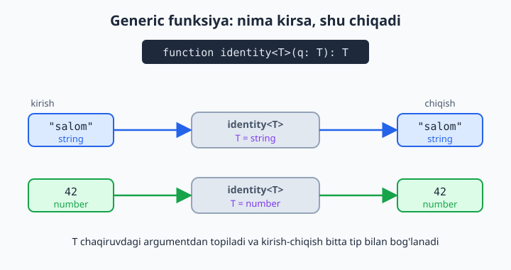
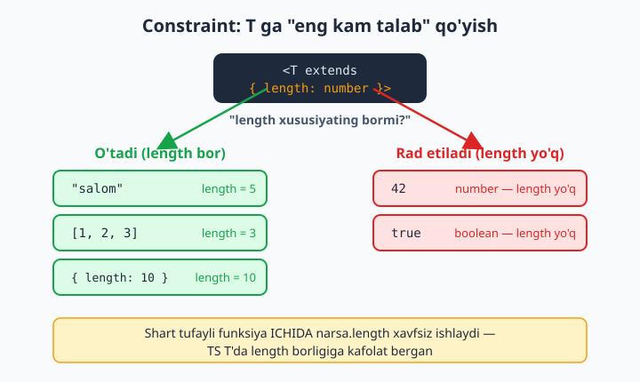
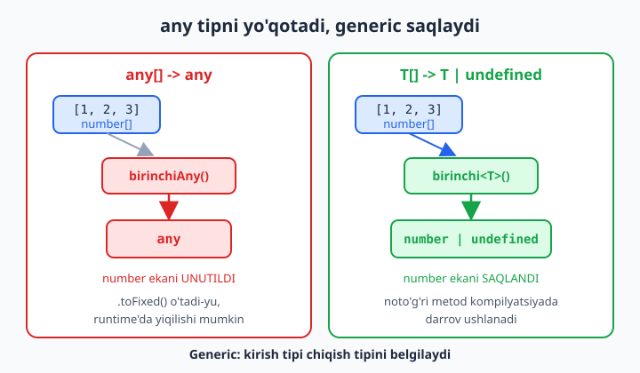

# 11 — Generics — asoslar

[⬅️ Oldingi: 10 — Type alias, intersection va kompozitsiya](./10-type-intersection.md) · [🏠 README](./README.md) · [Keyingi: 12 — Generics — ilg'or (keyof, indexed access) ➡️](./12-generics-ilgor.md)

> **Bu bobda:** bir xil mantiqni turli tiplar uchun qayta-qayta yozmaslikni o'rganamiz. `any` bu muammoni "yechadi", lekin tip xavfsizligini yo'q qiladi. Yechim — **generic** (umumlashgan), ya'ni tip parametri `<T>`: funksiya, interface, type va klasslarni tipni keyin "to'ldiriladigan bo'sh joy" bilan yozish. TS bu tipni chaqiruvdan o'zi topishini (inference), kerak bo'lsa aniq berishni, bir nechta tip parametrini (`<T, U>`) va `<T extends ...>` orqali tipni cheklashni (constraint) ko'rib chiqamiz. Oxirida `identity`, `map` va `Ombor` misollari bilan generic'ning `any`'dan nega kuchli ekanini his qilamiz.

---

## Muammo

Massivning birinchi elementini qaytaradigan funksiya kerak bo'ldi. JavaScript'da bu bir qatorlik ish edi. TypeScript'da yozib ko'ramiz:

```ts
function birinchi(arr: number[]): number {
  return arr[0];
}

birinchi([10, 20, 30]); // 10 — joyida
```

Ertasiga sizga **string** massivining birinchi elementi kerak bo'ldi. Funksiya esa faqat `number[]` qabul qiladi:

```ts
birinchi(["Ali", "Vali"]); // ❌ Xato: string[] number[] ga mos kelmaydi
```

Endi nima qilasiz? Ko'pchilik bu yerda ikkita yo'ldan birini tanlaydi — va ikkalasi ham yomon.

**1-yo'l: har tip uchun nusxa ko'paytirish.** `birinchiSon`, `birinchiMatn`, `birinchiBoolean`... Funksiyaning ichi bir xil (`return arr[0]`), faqat tip har xil. Bir kun keyin xato topsangiz, uni o'nta joyda tuzatasiz. Bu — takrorlanish, dasturchining eng katta dushmani.

**2-yo'l: `any` ishlatish.** Bu eng vasvasaga soluvchi yo'l:

```ts
function birinchi(arr: any[]): any {
  return arr[0];
}

const ism = birinchi(["Ali", "Vali"]); // ism: any
ism.toFixed(2);                        // tekshiruv yo'q — runtime'da yiqiladi!
```

Funksiya endi har tipni qabul qiladi, lekin **chiqishi ham `any`** bo'lib qoldi. `ism` aslida `string`, lekin TS buni unutdi: `ism.toFixed(2)` (son metodi) kompilyatsiyadan bemalol o'tadi va dastur ishlaganda `TypeError` bilan yiqiladi. 9-bobda ko'rganimizdek, `any` — tip tizimidan voz kechish. **Kirgan tip bilan chiqqan tip orasidagi bog'lanish uzilib qoldi.**

Aynan shu bog'lanishni saqlash uchun generic'lar ixtiro qilingan: "men hozir tipni bilmayman, lekin **kirgan tip bilan chiqqan tip bir xil**" deyishning usuli.

## Generic funksiya: tip parametri `<T>`

Funksiya argument qabul qilgani kabi, **tipni** ham qabul qilishi mumkin. Tip uchun "parametr" `<>` ichida e'lon qilinadi va odatda `T` (Type so'zidan) deb nomlanadi:

```ts
function identity<T>(qiymat: T): T {
  return qiymat;
}
```

O'qilishi: "`identity` — `T` nomli bitta tip parametri bor funksiya; u `T` tipidagi qiymat oladi va **xuddi shu** `T` tipini qaytaradi". `T` — aniq tip emas, **bo'sh joy**: u chaqiruv paytida haqiqiy tip bilan to'ldiriladi.

📌 `<T>` funksiya nomidan keyin, qavslardan oldin keladi: `identity<T>(...)`. `T` shu yerda "e'lon qilinadi" va keyin parametr tipida ham, return tipida ham ishlatiladi. Bu — funksiyaning butun tanasi davomida "yashaydigan" tip o'zgaruvchisi.



Endi `birinchi`'ni generic qilib yozamiz. Element tipi `T` bo'lsa, massiv `T[]`, qaytadigani esa `T` (yoki massiv bo'sh bo'lsa `undefined`):

```ts
function birinchi<T>(arr: T[]): T | undefined {
  return arr[0];
}
```

Bitta funksiya — barcha tiplar uchun, va tip xavfsizligi **to'liq saqlanadi**:

```ts
const son = birinchi([10, 20, 30]);    // son: number | undefined
const ism = birinchi(["Ali", "Vali"]); // ism: string | undefined
```

TS `son`'ni avtomat `number | undefined`, `ism`'ni esa `string | undefined` deb biladi. `any`dagidek "hammasini unutish" yo'q — har chaqiruvda tip aniq.

💡 Nega `T | undefined`? Chunki bo'sh massiv (`[]`) berilsa, `arr[0]` aslida `undefined` bo'ladi. `strict` rejimda TS bizni shu haqiqatga majbur qiladi — bu yaxshi, chunki shu tufayli quyidagi xatoni oldindan ushlaymiz:

```ts
const son = birinchi([1, 2, 3]); // number | undefined
son.toFixed(2);                  // ❌ Xato: 'son' is possibly 'undefined'.
```

Foydalanishdan oldin tekshirish kifoya: `if (son !== undefined) { son.toFixed(2); }` (8-bobdagi narrowing).

## Inference vs aniq tip berish

Yuqoridagi chaqiruvlarda biz `T` ni hech qayerda yozmadik. TS uni **argumentdan o'zi topdi** — bunga **inference** (xulosa, tipni o'zi aniqlash) deyiladi. Bu generic'larni kundalik ishda ko'rinmas qiladi: siz oddiy funksiya chaqirgandek yozasiz, TS esa orqada tiplarni to'g'ri tutadi.

Lekin tipni **aniq** ham berish mumkin — uni chaqiruvda `<>` ichida yozasiz:

```ts
const a = identity<string>("salom"); // T = string (aniq)
const b = identity<number>(42);      // T = number (aniq)
const c = identity(true);            // T = boolean (inference)
```

Aniq tip berganingizda TS uni **tekshiradi** ham:

```ts
identity<string>(42); // ❌ Xato: Argument of type 'number'
                      //         is not assignable to parameter of type 'string'.
```

📌 Qachon aniq yozish kerak? Ko'pincha — **kerak emas**, inference yetarli va kodingiz toza bo'ladi. Aniq tip quyidagi hollarda asqotadi: (1) TS argumentdan tipni topa olmaganda (masalan bo'sh massiv `[]` bersangiz, element tipi noma'lum qoladi); (2) inference juda keng tip chiqarayotganda, siz esa torroq tip xohlaganingizda. Shubha bo'lsa, avval inference'ga ishoning.

💡 Funksiya ustiga sichqonchani olib borib (IDE'da), TS qaysi `T` ni tanlaganini ko'rishingiz mumkin — bu generic'larni o'rganishning eng tez yo'li.

## Generic interface va type

Tip parametri faqat funksiyalarga emas — **interface** va **type**'ga ham beriladi. Bu "ichida nimadir saqlaydigan, lekin nima saqlashi muhim emas" tuzilmalar uchun ideal. Klassik misol — `Box<T>` ("quti"):

```ts
interface Box<T> {
  qiymat: T;
}

const sonQutisi: Box<number> = { qiymat: 100 };
const matnQutisi: Box<string> = { qiymat: "kitob" };
```

`Box<number>` — "ichida `number` bor quti", `Box<string>` — "ichida `string` bor quti". Bitta interface, cheksiz ko'p aniq tip. Va xavfsizlik joyida:

```ts
const sonQutisi: Box<number> = { qiymat: "salom" };
// ❌ Xato: Type 'string' is not assignable to type 'number'.
```

`type` bilan ham xuddi shunday, va bu yerda bir nechta tip parametri ham qulay ko'rinadi — masalan `Pair<K, V>` (juftlik):

```ts
type Pair<K, V> = {
  kalit: K;
  qiymat: V;
};

const yosh: Pair<string, number> = { kalit: "Ali", qiymat: 25 };
```

📌 `Box<T>` va `Box` farqiga e'tibor bering: `Box` — bu "tip yasovchi shablon", o'zi to'liq tip emas. Uni ishlatganda **doim** burchak qavs ichida tip berishingiz kerak: `Box<number>`. `let x: Box` deb yozsangiz, TS "tip argumenti yetishmayapti" deydi. (4-bobdan tanish `Array<T>` ham aynan shunday generic — `Array<string>` yoki qisqacha `string[]`.)

💡 Standart kutubxonadagi ko'p narsa generic: `Array<T>`, `Promise<T>`, `Map<K, V>`, `Set<T>`. `Promise<User>` — "kelajakda `User` qaytaradigan va'da" degani. Demak siz generic'larni allaqachon ishlatib kelgansiz, faqat ulardan o'zingiznikini yasashni hali bilmagansiz.

## Generic klass

Klass ham tip parametri qabul qiladi. Bu "har xil tipdagi elementlarni saqlaydigan idish" yozish uchun aynan kerak. Universal **Ombor** (container) yozamiz:

```ts
class Ombor<T> {
  private elementlar: T[] = [];

  qosh(element: T): void {
    this.elementlar.push(element);
  }

  ol(indeks: number): T | undefined {
    return this.elementlar[indeks];
  }

  hammasi(): T[] {
    return this.elementlar;
  }
}
```

`T` butun klass davomida "yashaydi": maydon `T[]`, `qosh` parametri `T`, `ol` esa `T | undefined` qaytaradi. Ombor yaratganda tipni beramiz, va undan keyin hamma narsa shu tipga moslanadi:

```ts
const sonOmbor = new Ombor<number>();
sonOmbor.qosh(1);
sonOmbor.qosh(2);
const olingan = sonOmbor.ol(0); // olingan: number | undefined
```

`sonOmbor` — faqat sonlar omborig'i. Unga `sonOmbor.qosh("matn")` deb yozsangiz, TS rad etadi. Boshqa joyda `new Ombor<string>()` yaratsangiz — u faqat matnlar bilan ishlaydi. Bitta klass, har qanday tip uchun — va har biri o'z tipida qat'iy.

📌 `new Ombor<number>()`da tip aniq berildi. Agar konstruktorga argument o'tsa, TS uni inference qilishi mumkin edi; lekin bizning konstruktor bo'sh, shuning uchun `<number>` ni o'zimiz yozdik. Aks holda TS `T` ni `unknown` deb qoldiradi.

## Constraint: `<T extends ...>` bilan cheklash

Hozircha `T` — "har qanday tip". Ba'zan bu juda erkin. Massiv yoki matnning **uzunligini** qaytaradigan funksiya yozmoqchimiz, deylik:

```ts
function uzunlik<T>(narsa: T): number {
  return narsa.length; // ❌ Xato: Property 'length' does not exist on type 'T'.
}
```

TS haq: `T` — **har qanday** tip, shu jumladan `number` yoki `boolean` ham; ularda esa `.length` yo'q. TS bizni "balki sizga `length`'siz tip kelar" deb to'xtatadi.

Yechim — `T` ga **shart** qo'yish: "`T` har qanday bo'lishi mumkin, lekin **eng kamida** `length` xususiyatiga ega bo'lsin". Bu — **constraint** (cheklov), `extends` kalit so'zi bilan yoziladi:

```ts
interface Uzunlikka {
  length: number;
}

function uzunlik<T extends Uzunlikka>(narsa: T): number {
  return narsa.length; // ✅ endi TS T'da length borligini biladi
}
```

`<T extends Uzunlikka>` — "T `Uzunlikka` ni qoniqtirsin (kamida `length: number` bo'lsin)". Endi funksiya ichida `narsa.length` xavfsiz, chunki TS T'da `length` borligiga kafolat bergan:

```ts
uzunlik("salom");        // ✅ string'da length bor (5)
uzunlik([1, 2, 3]);      // ✅ massivda length bor (3)
uzunlik({ length: 10 }); // ✅ to'g'ridan-to'g'ri mos obyekt
```

Va shartga mos kelmaydigan argument **chaqiruv paytida** rad etiladi:

```ts
uzunlik(42); // ❌ Xato: Argument of type 'number'
             //         is not assignable to parameter of type 'Uzunlikka'.
```



📌 `extends` bu yerda klass merosini anglatmaydi! Generic'da `T extends X` — "T tipi X ga **mos** (assignable) bo'lsin" degani, ya'ni X talab qilgan hamma narsa T'da bo'lsin. Bu "T eng kamida X" deb o'qiladi.

💡 Juda foydali constraint — `T extends keyof U` (obyektning kalitlari bilan ishlash). Buni keyingi bobda chuqur ko'ramiz, lekin kichik ta'mini hozir tatib ko'ring: obyektdan **mavjud** kalit bo'yicha qiymat olamiz, va TS qaytadigan tipni aniq biladi:

```ts
function olField<T, K extends keyof T>(obyekt: T, kalit: K): T[K] {
  return obyekt[kalit];
}

const foydalanuvchi = { ism: "Ali", yosh: 25 };
const u1 = olField(foydalanuvchi, "ism");  // u1: string
const u2 = olField(foydalanuvchi, "yosh"); // u2: number
```

Mavjud bo'lmagan kalit so'rasangiz, TS darrov to'xtatadi:

```ts
olField(foydalanuvchi, "telefon");
// ❌ Xato: Argument of type '"telefon"'
//         is not assignable to parameter of type '"ism" | "yosh"'.
```

## Bir nechta tip parametri: `<T, U>`

Funksiya bir nechta mustaqil tip bilan ishlasa, bir nechta tip parametri beriladi — vergul bilan ajratiladi. Klassik misol — `map`: massivdagi `T` elementlarini boshqa `U` tipiga aylantiradi:

```ts
function map<T, U>(arr: T[], fn: (element: T) => U): U[] {
  const natija: U[] = [];
  for (const element of arr) {
    natija.push(fn(element));
  }
  return natija;
}
```

Bu yerda generic'ning butun kuchi ko'rinadi — **uchta tip bir-biriga bog'langan**: kirish massivi `T[]`, o'zgartiruvchi funksiya `T` oladi va `U` qaytaradi, yakuniy massiv esa `U[]`. TS bularning hammasini chaqiruvdan o'zi topadi:

```ts
const uzunliklar = map(["bir", "ikki", "uch"], (s) => s.length); // T=string, U=number → number[]
const kattalar = map([1, 2, 3], (n) => n * 10);                  // T=number, U=number → number[]
```

Birinchi chaqiruvda TS shunday "o'ylaydi": massiv `string[]`, demak `T = string`; callback ichida `s` — `string`, `s.length` — `number`, demak `U = number`; natija `number[]`. Hech qaysi tipni qo'lda yozmadik — bog'lanish o'z-o'zidan ishladi. **`any`da bu mumkin emas edi**: `any[]` bersak, `s` ham `any` bo'lar, `s.length` tekshirilmas va natija `any[]` bo'lib chiqardi.

💡 Tip parametrlarini odatda `T, U, V` deb nomlashadi, lekin majburiy emas. Ma'noli nom ko'pincha aniqroq: `<Kirish, Chiqish>`, `<Key, Value>`. Kalit/qiymat juftliklarida `K` va `V` keng tarqalgan — `Map<K, V>` aynan shunday.

## Nega generic `any`'dan yaxshi — qisqa xulosa

Ikkala yondashuv ham "har tip bilan ishlaydigan" funksiya beradi. Farq — **tiplar orasidagi bog'lanishda**:

```ts
// any — bog'lanishni yo'qotadi:
function birinchiAny(arr: any[]): any { return arr[0]; }
const x = birinchiAny([1, 2, 3]); // x: any — TS tipni unutdi

// generic — bog'lanishni saqlaydi:
function birinchi<T>(arr: T[]): T | undefined { return arr[0]; }
const y = birinchi([1, 2, 3]);    // y: number | undefined — aniq tip
```

`any`da kirish va chiqish bir-biridan uzilgan: nima kirsa kirsin, chiqishi har doim `any` — IDE yordami yo'q, xatolar runtime'gacha yashirin. Generic'da esa kirish tipi chiqish tipini **belgilaydi**: "nima kirsa, shu chiqadi". Natijada to'liq avtomatlashtirish, to'liq tip tekshiruvi va to'liq IDE yordami — kodni qayta yozmasdan.



📌 Qoida: "har tip bilan ishlasin, lekin **kirish tipi chiqish tipiga ta'sir qilsin**" — generic. "Tip umuman muhim emas, men o'zim tekshiraman" (juda kam holat) — `unknown` (any emas!). `any` esa deyarli hech qachon to'g'ri tanlov emas.

💡 Default tip parametri ham mumkin — `<T = unknown>`. Bu API javoblari kabi joylarda qulay: tip berilmasa, `unknown` ishlatiladi, lekin xohlasangiz aniq berasiz:

```ts
interface Javob<T = unknown> {
  status: number;
  data: T;
}

const j1: Javob = { status: 200, data: "har narsa" };       // data: unknown
const j2: Javob<string[]> = { status: 200, data: ["a", "b"] }; // data: string[]
```

---

Generics — TypeScript'ning eng kuchli quroli, lekin uni bir o'qishda to'liq "his qilish" qiyin. Yaxshi xabar: kundalik ishda ko'pincha generic'larni **ishlatasiz** (masalan `Array.map`, `Promise`), o'zingiz **yozishingiz** esa kamroq kerak bo'ladi. Quyidagi mashqlar aynan shu "yozish" malakasini mustahkamlaydi. Keyingi bobda `keyof` va indexed access bilan generic'larning ilg'or darajasiga o'tamiz.

## 11-bob mashqlari

> Maslahat: har bir mashqni avval IDE'da yozib, funksiya yoki o'zgaruvchi ustiga sichqonchani olib borib, TS qaysi tipni topganini kuzating — generic'lar shunday tezroq tushuniladi. Yechimlarni o'zingiz yozing.

1. `identity<T>(qiymat: T): T` funksiyasini yozing. Uni `string`, `number` va `boolean` bilan chaqirib, har birida natija tipini IDE'da tekshiring.
2. `birinchi<T>(arr: T[]): T | undefined` funksiyasini yozing va `[10, 20, 30]` hamda `["a", "b"]` bilan sinab ko'ring. Nega `| undefined` kerakligini izohlang.
3. `oxirgi<T>(arr: T[]): T | undefined` funksiyasini yozing (massivning oxirgi elementi). Bo'sh massiv `[]` berib, qanday natija chiqishini tekshiring.
4. 2-mashqdagi `birinchi`'ni `birinchi<number>([1, 2, 3])` kabi **aniq** tip bilan chaqiring. Keyin `birinchi<number>(["a"])` deb yozib, qanday xato chiqishini ko'ring.
5. `oxirgi([])` chaqiruvida TS `T` ni nima deb topishini IDE'da kuzating, so'ng `oxirgi<string>([])` bilan aniq tip berib farqni ko'ring.
6. `Box<T>` generic interface yozing (`qiymat: T` maydoni bilan). `Box<number>` va `Box<string>` qiymatlar yarating. Keyin `Box<number>` ichiga matn solib, xatoni ko'ring.
7. `Box<T>` ga `ochish(): T` metodi qo'shadigan generic `class Quti<T>` yozing: konstruktorda qiymat oladi, `ochish()` esa uni qaytaradi.
8. `Pair<K, V>` generic type yozing (`kalit: K`, `qiymat: V`). `Pair<string, number>` va `Pair<number, boolean>` misollar yarating.
9. `juftla<K, V>(kalit: K, qiymat: V): [K, V]` funksiyasini yozing (tuple qaytaradi). `juftla("yosh", 25)` natijasi tipini tekshiring.
10. `Ombor<T>` generic klassini yozing: `qosh(element: T)`, `ol(indeks: number): T | undefined`, `hammasi(): T[]`. `Ombor<number>` yaratib, ikki son qo'shing va birinchisini oling.
11. 10-mashqdagi `Ombor`ga `oxirgisi(): T | undefined` metodini qo'shing (oxirgi qo'shilgan element).
12. `uzunlik<T extends { length: number }>(narsa: T): number` funksiyasini yozing. Uni matn, massiv va `{ length: 10 }` obyekti bilan chaqiring; `42` bilan chaqirib xatoni ko'ring.
13. `constraint`siz `uzunlik<T>(narsa: T)` yozib, `narsa.length`da qanday xato chiqishini ko'ring, so'ng `extends` qo'shib tuzating.
14. `eng_uzun<T extends { length: number }>(a: T, b: T): T` funksiyasini yozing — `length`i kattaroq bo'lganini qaytaradi. Ikki matn va ikki massiv bilan sinang.
15. `map<T, U>(arr: T[], fn: (x: T) => U): U[]` funksiyasini yozing. `["bir", "ikki"]` ni uzunliklariga (`number[]`), `[1, 2, 3]` ni `boolean[]` ga (`n => n > 1`) aylantiring.
16. `filtrla<T>(arr: T[], shart: (x: T) => boolean): T[]` funksiyasini yozing va sonlar massividan juftlarini ajratib oling.
17. `Idli` interfeysini (`id: number`) yozing, so'ng `topId<T extends Idli>(royxat: T[], id: number): T | undefined` funksiyasini yozing. `{ id, nom }` obyektlari massivida sinang.
18. `birlashtir<T, U>(a: T, b: U): T & U` funksiyasini yozing (intersection — 10-bob). `{ ism: "Ali" }` va `{ yosh: 25 }` ni birlashtiring va natija tipini tekshiring.
19. `olField<T, K extends keyof T>(obyekt: T, kalit: K): T[K]` funksiyasini yozing. `{ ism, yosh }` obyektidan `"ism"` va `"yosh"`ni oling; mavjud bo'lmagan kalit so'rab xatoni ko'ring.
20. `Royxat<T extends { id: number }>` generic klassini yozing: `qosh(element: T)` va `topId(id: number): T | undefined`. Faqat `id`si bor obyektlar qabul qilishini va `id`siz obyekt qo'shganda xato chiqishini tekshiring.
