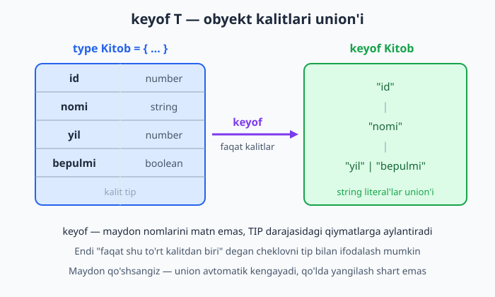

# 12 — Generics — ilg'or (keyof, indexed access)

[⬅️ Oldingi: 11 — Generics — asoslar](./11-generics-asos.md) · [🏠 README](./README.md) · [Keyingi: 13 — Klasslar TypeScript'da ➡️](./13-klasslar.md)

> **Bu bobda:** generic'larni obyektning ichiga olib kiramiz. `keyof T` (obyekt kalitlari union'i), indexed access `T[K]` (kalitning qiymat tipi) va bularni birlashtirgan `K extends keyof T` constraint'i (cheklovi) bilan TypeScript tarixidagi eng mashhur yordamchi — xavfsiz `get` — ni yozamiz. Yo'lda default tip parametri `<T = string>`, qiymatdan tip oladigan `typeof` operatori, `const` tip parametri va real loyihada ishlatiladigan tiplangan `pluck`/`pick` yordamchilarini ko'rib chiqamiz. Bularning hammasi `Pick`, `Record`, `ReturnType` kabi utility type'lar (keyingi bob) tagida turgan poydevor.

---

## Muammo

11-bobda generic funksiya bitta narsani — turli tiplar bilan ishlay oladigan **bir** funksiya yozishni — o'rgatdi. Lekin u yerda biz odatda butun qiymatni olib, butunligicha qaytarardik: `identity<T>(x: T): T`. Endi esa boshqacha vaziyat: obyektni emas, uning **bitta maydonini** olishimiz kerak. JavaScript'da bu ish bir qatorda bitadi:

```js
function get(obyekt, kalit) {
  return obyekt[kalit];
}

const kitob = { id: 1, nomi: "Otkan kunlar", yil: 1925 };
get(kitob, "nomi"); // "Otkan kunlar"
get(kitob, "narxi"); // undefined — xato emas, jim qoladi!
```

Ikki muammo bor. Birinchisi: `get(kitob, "narxi")` — bunday maydon yo'q, lekin JavaScript hech narsa demaydi, `undefined` qaytaradi va xato keyinroq, mutlaqo boshqa joyda "portlaydi". Ikkinchisi: TypeScript'da bu funksiyaga eng sodda tip yozsak, qaytadigan qiymat tipi yo'qoladi:

```ts
function get(obyekt: object, kalit: string): unknown {
  return (obyekt as Record<string, unknown>)[kalit];
}

const nomi = get(kitob, "nomi");
// nomi: unknown — string ekanini TypeScript bilmaydi!
```

`get(kitob, "nomi")` aniq `string` qaytarishini biz bilamiz, lekin TypeScript bilmaydi — natija `unknown` (9-bob). Demak `nomi.toUpperCase()` deb yozolmaymiz. Funksiya "ishlaydi", lekin tip jihatidan ko'r. Bizga shunday `get` kerakki, u:

1. faqat **mavjud** kalitni qabul qilsin ("narxi" — kompilyatsiyada xato);
2. qaytadigan tip **aynan o'sha maydonniki** bo'lsin (`"nomi"` -> `string`, `"yil"` -> `number`).

Bu ikki talabni bajarish uchun TypeScript'ning ikki tip-operatori kerak: `keyof` va indexed access. Avval ularni alohida o'rganamiz, keyin birlashtiramiz.

## keyof T — obyekt kalitlari union'i

`keyof` — bu **tip operatori**: obyekt tipini olib, uning hamma kalit nomlaridan iborat literal union (16-bobdagi string literal tiplar union'i) qaytaradi.

```ts
type Kitob = {
  id: number;
  nomi: string;
  yil: number;
  bepulmi: boolean;
};

type KitobKalit = keyof Kitob;
// "id" | "nomi" | "yil" | "bepulmi"
```

Endi `KitobKalit` tipidagi o'zgaruvchiga faqat shu to'rt qatordan birini berish mumkin:

```ts
const k1: KitobKalit = "nomi"; // ✅
const k2: KitobKalit = "yil";  // ✅
```

```ts
const k3: KitobKalit = "narx";
// ❌ Xato: Type '"narx"' is not assignable to type 'keyof Kitob'.
```



📌 `keyof` — bu maydon **nomlarini** beradi, **qiymatlarini** emas. `keyof Kitob` natijasi `"id" | "nomi" | ...` (matnlar), `1925` yoki `"Otkan kunlar"` emas. Bu juda muhim farq: `keyof` tip darajasida ishlaydi, sizning haqiqiy `kitob` obyektingizga umuman tegmaydi.

💡 `keyof`ning eng kuchli tarafi — **avtomatik yangilanishi**. `Kitob` tipiga yangi maydon (masalan `muallif: string`) qo'shsangiz, `keyof Kitob` darrov `... | "muallif"` ga kengayadi. Hech bir joyda union'ni qo'lda yangilash kerak emas — bu DRY (Don't Repeat Yourself) tamoyilining tip darajasidagi ko'rinishi.

## Indexed access T[K] — kalitdan qiymat tipini olish

`keyof` bizga kalitlarni berdi. Endi teskari savol: "shu kalitning **qiymati** qanaqa tipda?". Bunga indexed access (indeksli kirish) javob beradi — sintaksisi massivdan element olishga juda o'xshaydi, lekin u tip ustida ishlaydi:

```ts
type NomiTipi = Kitob["nomi"]; // string
type YilTipi = Kitob["yil"];   // number
```

E'tibor bering: kvadrat qavs ichida **tip darajasidagi** kalit turibdi (`"nomi"` — string literal tip), oddiy o'zgaruvchi emas. Bir nechta kalit (union) bersangiz, natija ham qiymat tiplarining union'i bo'ladi:

```ts
type IdYoNomi = Kitob["id" | "nomi"]; // number | string
```

Va eng nafis qolip — `keyof` bilan birlashtirib, obyektning **barcha** qiymat tiplarini olish:

```ts
type HammaQiymat = Kitob[keyof Kitob];
// number | string | boolean
```

![Indexed access T[K] obyekt tipidan kalitning qiymat tipini ajratib oladi](rasmlar/12-indexed-access.svg)

📌 **Eng ko'p uchraydigan tuzoq:** tip yozuvida nuqta ishlamaydi. `Kitob.nomi` deb yozsangiz, TypeScript "bu tipda `nomi` nomli **alohida tip** yo'q" deb xato beradi. Tipni faqat kvadrat qavs bilan olamiz: `Kitob["nomi"]`. Buni shunday eslang: **nuqta — qiymat dunyosi** (`kitob.nomi` haqiqiy obyektdan), **kvadrat qavs — tip dunyosi** (`Kitob["nomi"]` tipdan).

```ts
// ❌ Xato (TS2713): Cannot access 'Kitob.nomi' because 'Kitob' is a type, but not a namespace.
// type NomiTipi = Kitob.nomi;
```

✅ Tipni ham, kalitni ham qo'lda yozmaslik mumkin: `Kitob[keyof Kitob]` butun obyekt o'zgarsa ham o'zicha to'g'ri qoladi.

## Xavfsiz get — keyof + indexed access + constraint

Endi ikki qismni bitta funksiyaga yig'amiz. Eslang, generic constraint (cheklov) — `K extends keyof T` — 11-bobda ko'rgan `extends` kalit so'zining aynan o'zi: "K — bu T ning kalitlaridan biri bo'lishi shart".

```ts
function get<T, K extends keyof T>(obyekt: T, kalit: K): T[K] {
  return obyekt[kalit];
}
```

Bu bitta qatorni diqqat bilan o'qib chiqaylik — TypeScript'da eng ko'p uchraydigan generic naqshi shu:

- `T` — obyektning tipi (uni TypeScript chaqiruvdan o'zi topadi);
- `K extends keyof T` — `K` faqat `T` ning kalitlaridan biri bo'la oladi;
- `: T[K]` — qaytadigan tip aynan o'sha kalitning qiymat tipi.

Natijada funksiya har bir chaqiruvda **aniq** tipni qaytaradi:

```ts
const kitob: Kitob = { id: 1, nomi: "Otkan kunlar", yil: 1925, bepulmi: false };

const nomi = get(kitob, "nomi");     // nomi: string
const yil = get(kitob, "yil");       // yil: number
const bepul = get(kitob, "bepulmi"); // bepul: boolean

const katta = nomi.toUpperCase(); // ✅ nomi string — to'g'ri
const keyingiYil = yil + 1;       // ✅ yil number — to'g'ri
```

![Xavfsiz get funksiyasida K extends keyof T va T[K] qanday bog'lanishi](rasmlar/12-xavfsiz-get.svg)

Endi muammomizning birinchi yarmi — noto'g'ri kalit. `get` yo'q kalitni **qabul qilmaydi**, xato ishga tushishdan oldin chiqadi:

```ts
const x = get(kitob, "narx");
// ❌ Xato: Argument of type '"narx"' is not assignable
//          to parameter of type 'keyof Kitob'.
```

Ikkinchi yarmi — yo'qolgan tip — ham hal bo'ldi: `nomi` endi `unknown` emas, aniq `string`:

```ts
const teskari = get(kitob, "nomi");
const xato = teskari * 2;
// ❌ Xato: The left-hand side of an arithmetic operation must be
//          of type 'any', 'number', 'bigint' or an enum type.
```

📌 `get<T, K extends keyof T>`da `extends` "meros" (klass merosi) ma'nosida emas. Generic'da `extends` "...ga bo'ysunadi / ...ning qism to'plami" degani. `K extends keyof T` — "K, keyof T union'idagi qiymatlardan biri" demak. Buni 8-bobdagi narrowing bilan ham adashtirmang — bu yerda gap kalit qiymatlari haqida.

💡 Nega `K` umuman kerak, nega shunchaki `kalit: keyof T` yozmaymiz? Sinab ko'ring: agar `get(obyekt: T, kalit: keyof T): T[keyof T]` yozsangiz, funksiya yana ishlaydi, lekin natija `number | string | boolean` (barcha qiymatlar union'i) bo'lib qoladi — qaysi kalit so'ralganini "unutadi". Alohida `K` parametri har bir chaqiruvni alohida eslab qoladi: `"nomi"` -> `string`, `"yil"` -> `number`. Aynan shu narsa `get`ni "aqlli" qiladi.

## Teskari yo'nalish: set (T[K] qiymat tomonida)

`get` qiymatni **oladi**, `set` esa qiymatni **o'rnatadi**. Bu yerda `T[K]` argument tipi sifatida ishlatiladi — ya'ni TypeScript siz beradigan qiymat o'sha maydonga **mos** kelishini tekshiradi:

```ts
function set<T, K extends keyof T>(obyekt: T, kalit: K, qiymat: T[K]): void {
  obyekt[kalit] = qiymat;
}

set(kitob, "yil", 1926);     // ✅ yil number, 1926 number — mos
set(kitob, "bepulmi", true); // ✅ bepulmi boolean, true boolean — mos
```

Endi noto'g'ri tipdagi qiymat berib ko'ring — kompilyator ushlaydi:

```ts
set(kitob, "yil", "1926");
// ❌ Xato: Argument of type 'string' is not assignable
//          to parameter of type 'number'.
```

📌 `set` ham, `get` ham bir xil `<T, K extends keyof T>` skeletidan foydalanadi — farqi faqat `T[K]` qayerda turishida: `get`da u **chiqish** (return) tipi, `set`da esa **kirish** (argument) tipi. Bitta tip-formula ikki tomonga ham ishlaydi — bu generic'larning go'zalligi.

## Default tip parametri: `<T = string>`

Funksiya argumentiga standart qiymat berish mumkin bo'lgani kabi (`function f(x = 10)`), generic tip parametriga ham **standart tip** berish mumkin. Agar chaqiruvchi tipni ko'rsatmasa, o'sha default ishlatiladi:

```ts
type Javob<T = string> = {
  ok: boolean;
  data: T;
};

const j1: Javob = { ok: true, data: "salom" };     // T berilmadi -> string
const j2: Javob<number> = { ok: true, data: 42 };   // T = number
const j3: Javob<Kitob> = { ok: true, data: kitob }; // T = Kitob
```

`Javob` (default bilan) — `Javob<string>`ning qisqartmasi. Bu, ayniqsa, API javoblari uchun qulay: ko'p hollarda matn qaytadi, ba'zan boshqa tip.

📌 Default tip parametri faqat tip **berilmasa** ishlaydi. `Javob<number>` yozsangiz, default `string` butunlay e'tiborga olinmaydi. Bu funksiya argumentidagi default bilan bir xil mantiq.

💡 Default va constraint birga ham kelishi mumkin: `<T extends object = {}>` — "T obyekt bo'lsin, berilmasa bo'sh obyekt". Tartib doim shunday: avval `extends` (cheklov), keyin `=` (default).

## typeof — qiymatdan tip olish

Ko'pincha sizda allaqachon bir obyekt (qiymat) bor va aynan o'shanga mos **tip** kerak bo'ladi. Tipni qo'lda qaytadan yozish — zerikarli va xatoga moyil (qiymat o'zgarsa, tip eskirib qoladi). `typeof` operatori qiymatdan to'g'ridan-to'g'ri tip chiqaradi:

```ts
const sozlama = {
  til: "uz",
  qorongu: false,
  shrift: 14,
};

type Sozlama = typeof sozlama;
// { til: string; qorongu: boolean; shrift: number }

function ishlat(s: Sozlama): void {
  console.log(s.til, s.qorongu, s.shrift);
}
ishlat(sozlama);
```

Bu yerda ikki xil `typeof` borligini ajrating. JavaScript'dagi `typeof x` — bu **ishga tushganda** ishlaydigan, `"string"` kabi matn qaytaradigan operator. TypeScript'dagi `typeof` esa faqat **tip yozuvida** (tip kontekstida) yashaydi va qiymatdan tip chiqaradi. Bir xil so'z, ikki dunyo — `typeof` tip yozuvida (masalan `type X = typeof ...` yoki annotatsiyada) turganini bilib qoling.

`typeof`ni `keyof` bilan birlashtirsa, qiymatdan to'g'ridan-to'g'ri uning kalitlari union'i chiqadi — bu juda ko'p ishlatiladigan qolip:

```ts
type SozlamaKalit = keyof typeof sozlama;
// "til" | "qorongu" | "shrift"

const sk: SozlamaKalit = "shrift"; // ✅
```

O'qilishi (ichdan tashqariga): `typeof sozlama` -> `sozlama`ning tipi; `keyof (...)` -> o'sha tipning kalitlari.

`typeof` funksiya ustida ham ishlaydi — funksiyaning to'liq imzosini (signature) tip sifatida oladi:

```ts
function kitobYarat(nomi: string, yil: number) {
  return { id: Date.now(), nomi, yil, faolmi: true };
}

type KitobYaratTipi = typeof kitobYarat;
// (nomi: string, yil: number) => { id: number; nomi: string; yil: number; faolmi: boolean }
```

💡 Bu yerda kelajakka bir ko'prik: `typeof kitobYarat` funksiyaning butun imzosini berdi. Ko'pincha bizga faqat uning **qaytaradigan** qismi kerak bo'ladi. Buni `ReturnType<typeof kitobYarat>` beradi:

```ts
type YaratilganKitob = ReturnType<typeof kitobYarat>;
// { id: number; nomi: string; yil: number; faolmi: boolean }
```

`ReturnType` — bu utility type, va u aynan shu bobdagi `keyof`, `T[K]` va `extends` mexanikasi ustiga qurilgan. Keyingi bobdan keyingi 14-bobda utility type'larni to'liq ochamiz; hozir shuni bilib qo'ying — ularning "sehri" siz hozir o'rgangan g'ishtlardan iborat.

## Tiplangan yordamchilar: pluck va pick

Endi nazariyani real loyihada uchraydigan ikki funksiyaga aylantiramiz.

**pluck** — massiv ichidagi har bir obyektdan bitta maydonni sug'urib oladi (Lodash kutubxonasidagi `_.map(arr, "key")` ning tiplangan ko'rinishi):

```ts
function pluck<T, K extends keyof T>(massiv: T[], kalit: K): T[K][] {
  return massiv.map((element) => element[kalit]);
}

const kitoblar: Kitob[] = [
  { id: 1, nomi: "Otkan kunlar", yil: 1925, bepulmi: false },
  { id: 2, nomi: "Mehrobdan chayon", yil: 1929, bepulmi: true },
];

const nomlar = pluck(kitoblar, "nomi"); // string[]
const yillar = pluck(kitoblar, "yil");  // number[]
```

E'tibor bering: qaytadigan tip `T[K][]` — ya'ni "kalit qiymatining massivi". `"nomi"` bersangiz `string[]`, `"yil"` bersangiz `number[]`. Shuning uchun keyingi qadamda to'g'ri metodlardan foydalanish mumkin:

```ts
const birlashgan = nomlar.join(", "); // ✅ string[] da .join bor
const summa = yillar.reduce((a, b) => a + b, 0); // ✅ number[] qo'shiladi
```

**pick** — obyektdan tanlangan bir nechta maydonni olib, kichikroq obyekt yasaydi. Bu yerda kalit massiv bo'lgani uchun `K[]`, natija esa `Pick<T, K>` (standart utility type — "T dan faqat K kalitlarini ol"):

```ts
function pick<T, K extends keyof T>(obyekt: T, kalitlar: K[]): Pick<T, K> {
  const natija = {} as Pick<T, K>;
  for (const kalit of kalitlar) {
    natija[kalit] = obyekt[kalit];
  }
  return natija;
}

const qisqa = pick(kitob, ["id", "nomi"]);
// qisqa: { id: number; nomi: string }

const qisqaNomi = qisqa.nomi; // ✅ string
const qisqaId = qisqa.id;     // ✅ number
```

📌 `pick`da `{} as Pick<T, K>` — bu type assertion (3- va 9-boblardagi `as`). Tsiklning boshida obyekt bo'sh, lekin biz unga `Pick<T, K>` tipini "va'da" qilamiz va tsikl ichida hamma maydonni to'ldiramiz. Bu — TypeScript'ning oddiy oqim tahlili "ko'rolmaydigan" kam sonli o'rinlardan biri, shuning uchun `as` bilan yo'naltiramiz. (`Pick` — keyingi 14-bobning asosiy mavzularidan.)

💡 Faqat string emas, raqamli kalit ham `keyof` orqali yaxshi ifodalanadi. Masalan, `pluck`ni `Foydalanuvchi[]` ustida ishlatib, faqat `email` larni yig'ish — bir qator: `pluck(users, "email")` -> `string[]`. Generic kod bir marta yoziladi, hamma joyda tipli qoladi.

## const tip parametri (zamonaviy imkoniyat)

Odatda TypeScript literal qiymatlarni "kengaytiradi": `["a", "b"]` ni `string[]` deb biladi (`"a"` emas). Lekin ba'zan bizga aynan literal tip kerak. TypeScript 5.0 dan beri `const` tip parametri shuni hal qiladi — chaqiruvda `as const` yozmasdan:

```ts
function birinchi<const T>(massiv: readonly T[]): T {
  return massiv[0];
}

const x = birinchi(["a", "b", "c"]);
// x: "a" | "b" | "c"  (oddiy string emas!)
```

`<const T>` bo'lmaganida `x` shunchaki `string` bo'lardi. `const` modifikatori TypeScript'ga "argumentni iloji boricha tor (literal) tipda ushla" deydi.

📌 `const` tip parametri — yangi (TS 5.0+) va o'rinli ishlatilganda foydali, lekin har joyda kerak emas. Faqat literal tiplarni saqlash muhim bo'lganda (masalan, konfiguratsiya kalitlari, marshrut nomlari) qo'llang. Aks holda oddiy generic yetarli.

## Hammasini bir joyda: nega bu muhim?

Bu bobdagi to'rt g'isht — `keyof`, `T[K]`, `K extends keyof T` va `typeof` — alohida-alohida kichik tuyuladi. Lekin ular birga TypeScript'ning eng kuchli xususiyatining poydevori: **bir tipdan ikkinchi tipni hisoblab chiqarish**. Siz endi `get`, `set`, `pluck`, `pick` kabi to'liq tiplangan, xato kalit yozsangiz darrov ogohlantiradigan yordamchilarni yoza olasiz. Va eng muhimi — keyingi boblarda uchraydigan `Pick`, `Omit`, `Record`, `ReturnType` kabi utility type'lar aslida shu mexanikadan tug'iladi. Ularni ishlatganda endi "sehr" emas, mantiq ko'rasiz.

## 12-bob mashqlari

Quyidagi mashqlarni o'zingiz bajaring. Har birini alohida `.ts` faylga yozib, `tsc --noEmit --strict` bilan tekshiring: toza misollar xatosiz o'tsin, ataylab xatolilar haqiqatan xato bersin.

1. `Mahsulot = { id: number; nomi: string; narx: number }` tipini yarating va `keyof Mahsulot` natijasini izoh sifatida yozing.
2. `type MahsulotKalit = keyof Mahsulot` deb alias yarating, unga to'g'ri qiymat (`"nomi"`) va noto'g'ri qiymat (`"rang"`) bering — ikkinchisi xato berishini tasdiqlang.
3. Indexed access bilan `Mahsulot["narx"]` tipini oling va o'sha tipdagi o'zgaruvchi e'lon qiling.
4. `Mahsulot["id" | "nomi"]` union tipini oling; natijasi nima bo'lishini izohda yozing.
5. `Mahsulot[keyof Mahsulot]` yordamida barcha qiymat tiplari union'ini oling.
6. `Mahsulot.narx` (nuqta bilan) deb tip yozishga urinib ko'ring va chiqqan xatoni izohga ko'chiring; keyin `Mahsulot["narx"]` ga tuzating.
7. `get<T, K extends keyof T>(o: T, k: K): T[K]` funksiyasini yozing va `Mahsulot` obyektidan `narx` ni oling — natija `number` ekanini tekshiring.
8. Shu `get` bilan mavjud bo'lmagan kalit (`"rang"`) so'rang; chiqqan xato xabarini izohga yozing.
9. `get` qaytargan `nomi` (string) ustida `.toUpperCase()` chaqiring — o'tishini tasdiqlang; keyin uni `* 2` qilib xato chiqaring.
10. `set<T, K extends keyof T>(o: T, k: K, q: T[K]): void` funksiyasini yozing; `narx` ga to'g'ri (`number`) va noto'g'ri (`string`) qiymat berib, ikkinchisi xato berishini ko'ring.
11. `type Javob<T = string>` ni yarating; `Javob`, `Javob<number>` va `Javob<Mahsulot>` uchun uchta to'g'ri obyekt yozing.
12. `<T extends object = {}>` ko'rinishidagi default + constraint birga turgan generic funksiya yozing va izohlang.
13. `const sozlama = { til: "uz", soni: 3 }` qiymatidan `typeof sozlama` bilan tip oling va o'sha tipdagi yangi obyekt yarating.
14. `keyof typeof sozlama` bilan kalitlar union'ini oling va unga faqat to'g'ri kalit beriladigan o'zgaruvchi e'lon qiling.
15. Bir funksiya yozing (`kitobYarat` kabi) va `typeof funksiya` bilan uning to'liq imzo tipini oling.
16. 15-mashqdagi funksiya uchun `ReturnType<typeof funksiya>` tipini oling va izohda nima chiqishini yozing.
17. `pluck<T, K extends keyof T>(massiv: T[], kalit: K): T[K][]` ni yozing; `Mahsulot[]` dan `narx` larni yig'ib `number[]` olganingizni `.reduce` bilan tasdiqlang.
18. Shu `pluck` bilan `nomi` larni yig'ib `string[]` oling va `.join(", ")` qiling.
19. `pick<T, K extends keyof T>(o: T, k: K[]): Pick<T, K>` ni yozing; `Mahsulot` dan `["id", "nomi"]` ni ajratib oling va natija obyektining `narx` maydoniga murojaat qilib (yo'q bo'lgani uchun) xato chiqishini ko'ring.
20. `const` tip parametri bilan `birinchi<const T>(m: readonly T[]): T` yozing; `["o'qildi", "o'qilmadi"]` bering va natija `string` emas, literal union ("o'qildi" | "o'qilmadi") ekanini hover bilan tekshiring.
