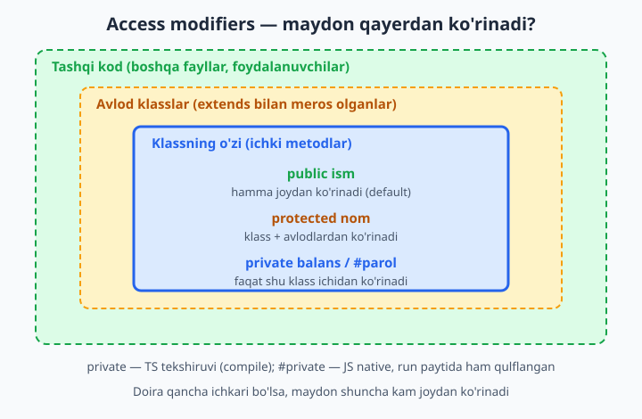
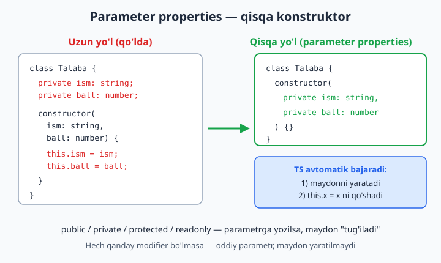
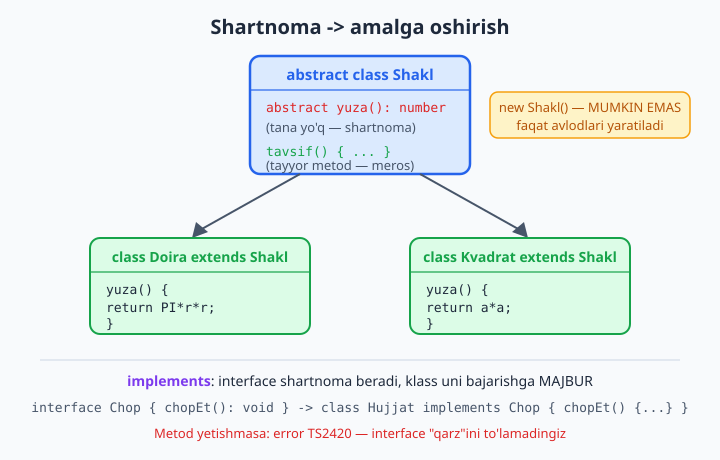

# 13 — Klasslar TypeScript'da

[⬅️ Oldingi: 12 — Generics — ilg'or (keyof, indexed access)](./12-generics-ilgor.md) · [🏠 README](./README.md) · [Keyingi: 14 — Utility types ➡️](./14-utility-types.md)

> **Bu bobda:** JavaScript'dan tanish bo'lgan `class`ga TypeScript qanday tip xavfsizligi va haqiqiy inkapsulyatsiya (ma'lumotni yashirish) qo'shishini o'rganamiz: maydon tiplari va konstruktor, access modifier'lar (`public`, `private`, `protected`, JS'ning `#private`'i), `readonly` maydon, konstruktorni qisqartiradigan parameter properties, `get`/`set`, `static` maydon va metodlar, `abstract` klass va metod (shartnoma), `implements interface`, meros (`extends` + `super`) hamda generic klasslar. Oxirida — qaysi vositani qachon tanlash bo'yicha amaliy qoidalar.

---

## Muammo

JavaScript'da klass yozasiz va hammasi joyida ko'rinadi:

```js
class BankHisob {
  constructor(boshlangich) {
    this.balans = boshlangich;
  }
}

const hisob = new BankHisob(1000);
hisob.balans = -5000;        // hech kim to'smaydi
hisob.blans = 999;           // xato yozildi — yangi maydon paydo bo'ldi, JS indamaydi
console.log(hisob.balans);   // 1000 — yangilanmadi, chunki "blans" boshqa narsa
```

Bu yerda ikkita muammo bor. Birinchi: `balans` ochiq turibdi — istalgan joydan to'g'ridan-to'g'ri `-5000` qilib qo'yish mumkin, hech qanday tekshiruvsiz. Bank hisobi uchun bu falokat. Ikkinchi: `blans` deb xato yozdik — JavaScript yangi maydon yaratdi-qo'ydi, dastur esa "ishlayverdi", lekin natija buzuq. Bu xato **runtime'da** (dastur foydalanuvchi qo'lida ishlayotganda), ko'pincha juda kech chiqadi.

TypeScript bu ikkala muammoni ham yopadi. Maydonlarning **tipi** belgilanadi (xato nom darrov ushlganadi), va maydonlarni **yashirish** (`private`) mumkin bo'ladi — tashqaridan o'zgartirib bo'lmaydi, faqat siz ruxsat bergan metod orqali:

```ts
class BankHisob {
  private balans: number;

  constructor(boshlangich: number) {
    this.balans = boshlangich;
  }

  pulQoshish(summa: number): void {
    if (summa > 0) {        // nazorat — sizning qoidangiz
      this.balans += summa;
    }
  }

  balansniKorish(): number {
    return this.balans;
  }
}

const hisob = new BankHisob(1000);
hisob.pulQoshish(500);
console.log(hisob.balansniKorish()); // 1500
```

Endi `balans`ga tashqaridan tegib bo'lmaydi — faqat `pulQoshish` orqali, u ham musbat summani tekshiradi. Keling, klassning har bir qismini qadam-baqadam ochamiz.

> JavaScript'da `class`, `constructor`, `this`, `extends` asoslarini takrorlamoqchi bo'lsangiz — [JavaScript kitobi](../js/README.md)dagi klasslar bo'limiga qayting. Bu yerda biz asosan ularga **tip** va **himoya** qo'shishni ko'ramiz.

## Maydon tiplari va konstruktor

TypeScript'da klass maydonlari **klass tanasining ichida**, oldindan e'lon qilinadi — har birining tipi bilan. Bu JavaScript'dan asosiy farq: JS'da maydon faqat `this.x = ...` qilganingizda paydo bo'ladi, TS'da esa uni avval "ro'yxatga olasiz":

```ts
class Mahsulot {
  nom: string;
  narx: number;
  sotuvda: boolean = true; // boshlang'ich qiymat berish mumkin

  constructor(nom: string, narx: number) {
    this.nom = nom;
    this.narx = narx;
  }
}

const olma = new Mahsulot("Olma", 12000);
console.log(olma.sotuvda); // true
```

`nom: string` va `narx: number` — maydon e'lonlari. `sotuvda` esa darrov `true` qiymat oldi, shuning uchun konstruktorda unga tegmasak ham bo'ladi.

📌 `strict` rejimda muhim qoida bor: har bir maydon yo boshlang'ich qiymatga ega bo'lishi, yo konstruktorda o'zlashtirilishi **shart**. Bo'sh qoldirsangiz:

```ts
class Foydalanuvchi {
  ism: string; // ❌ konstruktorda qiymat berilmadi
  constructor() {}
}
// error TS2564: Property 'ism' has no initializer and is not definitely
//   assigned in the constructor.
```

Compiler haq: agar `ism`ga hech qachon qiymat berilmasa, u `undefined` bo'ladi-yu, lekin tip `string` deyilgan — bu yolg'on. TypeScript bunga yo'l qo'ymaydi. Tuzatish: konstruktorda qiymat bering yoki tipni `ism?: string` (optional) qiling.

## public — standart ko'rinish

Hech narsa yozmasangiz, maydon va metod `public` bo'ladi — ya'ni **hamma joydan ko'rinadi**. Yuqoridagi `Mahsulot`dagi `nom` aslida `public nom` bilan bir xil. `public` so'zini yozish ixtiyoriy, lekin ba'zida aniqlik uchun yoziladi:

```ts
class Nuqta {
  public x: number;
  public y: number;

  constructor(x: number, y: number) {
    this.x = x;
    this.y = y;
  }
}

const n = new Nuqta(3, 4);
console.log(n.x, n.y); // 3 4 — tashqaridan bemalol o'qiladi
```

`public` — "ochiq eshik". Endi eshikni qulflashni o'rganamiz.

## private — faqat klass ichida

`private` maydon yoki metodga **faqat klassning o'z ichidan** murojaat qilish mumkin. Tashqaridan — yo'q:

```ts
class BankHisob {
  private balans: number;

  constructor(boshlangich: number) {
    this.balans = boshlangich;
  }

  balansniKorish(): number {
    return this.balans; // ✅ klass ichida — bemalol
  }
}

const bh = new BankHisob(1000);
console.log(bh.balansniKorish()); // ✅ 1000 — metod orqali

console.log(bh.balans); // ❌ to'g'ridan-to'g'ri murojaat
// error TS2341: Property 'balans' is private and only accessible
//   within class 'BankHisob'.
```

Bu — inkapsulyatsiya: ma'lumotni klass "ichiga yashirib", unga faqat nazorat ostidagi metodlar orqali yo'l ochasiz.

📌 TypeScript'ning `private`'i — **faqat compile bosqichidagi** tekshiruv. Yaratilgan JavaScript faylida maydon oddiy, ochiq maydon bo'lib qoladi. Ya'ni `private` sizni xato bilan tegib qo'yishdan saqlaydi, lekin yomon niyatli kishidan emas: JS'da `(bh as any).balans` kabi "yon eshik" orqali baribir kirsa bo'ladi. Haqiqiy, run paytida ham qulflangan yashirish kerak bo'lsa — keyingi `#private` ishlatiladi.

## protected — klass va avlodlar

`protected` — `private` va `public` o'rtasidagi o'rta yo'l. Maydon klassning o'zidan **va undan meros olgan avlod klasslardan** ko'rinadi, lekin tashqaridan — yo'q:

```ts
class Hayvon {
  protected nom: string;

  constructor(nom: string) {
    this.nom = nom;
  }
}

class It extends Hayvon {
  vovillash(): string {
    return `${this.nom}: Vov-vov!`; // ✅ protected — avlodda ko'rinadi
  }
}

const bobik = new It("Bobik");
console.log(bobik.vovillash()); // Bobik: Vov-vov!
```

Lekin tashqaridan baribir yopiq:

```ts
const hayvon = new Hayvon("X");
console.log(hayvon.nom); // ❌
// error TS2445: Property 'nom' is protected and only accessible
//   within class 'Hayvon' and its subclasses.
```

💡 Qoida oddiy: maydonni faqat shu klass ishlatadimi — `private`. Avlodlar ham ishlatishi kerakmi (masalan, umumiy `nom`ni har bir avlod o'zicha ko'rsatadi) — `protected`. Hamma joydan ochiq bo'lishi kerakmi — `public`.



## #private — JavaScript'ning haqiqiy yashirini

Zamonaviy JavaScript'da maydon nomini `#` bilan boshlasangiz, u **haqiqiy private** bo'ladi — bu TS emas, tilning o'z imkoniyati. Farqi: `#private`ga run paytida ham, hech qanday "yon eshik" bilan ham (hatto `as any` bilan ham) tashqaridan murojaat qilib bo'lmaydi:

```ts
class Seyf {
  #parol: string;

  constructor(parol: string) {
    this.#parol = parol;
  }

  tekshir(kirim: string): boolean {
    return this.#parol === kirim; // ✅ klass ichida
  }
}

const s = new Seyf("1234");
console.log(s.tekshir("1234")); // ✅ true
```

Tashqaridan urinsangiz, bu xato hatto JavaScript darajasida ham:

```ts
console.log(s.#parol); // ❌
// error TS18013: Property '#parol' is not accessible outside class
//   'Seyf' because it has a private identifier.
```

📌 `private` (TS so'zi) va `#parol` (JS sintaksisi) — ikkalasi ham yashirish uchun, lekin:
> - `private balans` — compile'da tekshiriladi, run paytida ochiq qoladi. Eski sintaksis, ko'p kodda uchraydi, IDE qulay.
> - `#parol` — run paytida ham qulflangan, haqiqiy himoya. Yangi va kuchliroq.

Yangi kodda haqiqiy yashirinlik muhim bo'lsa `#` ni tanlang; oddiy "men xato bilan tegmay" maqsadida `private` ham yetarli.

## readonly — bir marta yoziladigan maydon

Ba'zi maydonlar bir marta — yaratishda — o'rnatiladi va keyin **o'zgarmasligi** kerak. Masalan, yozuvning `id`'si. `readonly` aynan shuni ta'minlaydi: maydonni konstruktorda yozish mumkin, undan keyin — yo'q:

```ts
class Foydalanuvchi {
  readonly id: number;
  ism: string;

  constructor(id: number, ism: string) {
    this.id = id;     // ✅ konstruktorda yozish mumkin
    this.ism = ism;
  }
}

const u = new Foydalanuvchi(1, "Olim");
u.ism = "Vali"; // ✅ ism o'zgaruvchan
console.log(u.id); // 1
```

Lekin `id`ni keyin o'zgartirishga urinsangiz:

```ts
u.id = 99; // ❌
// error TS2540: Cannot assign to 'id' because it is a read-only property.
```

📌 `readonly` ni access modifier bilan birlashtirsa bo'ladi: `private readonly`, `public readonly`. Birinchisi — "ichkarida ko'rinadi, lekin o'zgarmaydi", ikkinchisi — "tashqaridan o'qiladi, lekin o'zgartirilmaydi". `readonly` ham faqat compile bosqichidagi himoya (5-bobdagi interface'dagi `readonly` kabi).

## Parameter properties — konstruktorni qisqartirish

Hozirgacha bir naqshni takror-takror yozdik: maydonni e'lon qil, keyin konstruktorda `this.x = x` qil. TypeScript bunga qisqa yo'l beradi — **parameter properties**: konstruktor parametriga `public`, `private`, `protected` yoki `readonly` yozsangiz, TypeScript maydonni **avtomatik yaratadi va o'zlashtiradi**.

Mana uzun yo'l:

```ts
class Talaba {
  private ism: string;
  private ball: number;
  readonly id: number;

  constructor(ism: string, ball: number, id: number) {
    this.ism = ism;
    this.ball = ball;
    this.id = id;
  }
}
```

Va xuddi shu narsa parameter properties bilan — uch barobar qisqa:

```ts
class Talaba {
  constructor(
    public ism: string,
    private ball: number,
    readonly id: number,
  ) {}

  ballniKorish(): number {
    return this.ball; // maydon yaratilgan — ishlatsa bo'ladi
  }
}

const t = new Talaba("Sardor", 90, 100);
console.log(t.ism, t.id, t.ballniKorish()); // Sardor 100 90
```

`public ism: string` parametri uchun TypeScript: (1) `ism` nomli maydon yaratadi, (2) `this.ism = ism`ni o'zi qo'shadi. Bizga konstruktor tanasini bo'sh (`{}`) qoldirish kifoya.



📌 **Diqqat**: modifier (`public`/`private`/`protected`/`readonly`) bo'lsagina maydon yaratiladi. Modifiersiz oddiy parametr — faqat konstruktor ichida yashaydigan oddiy o'zgaruvchi, maydon **emas**:

```ts
class Aylana {
  constructor(radius: number) { // modifiersiz — maydon EMAS
    console.log(radius); // bu yerda ishlaydi
  }
}
// this.radius mavjud emas — chunki "radius" maydon sifatida saqlanmadi
```

💡 Parameter properties — zamonaviy TypeScript kodida juda keng tarqalgan. Klassni qisqartiradi va o'qishni osonlashtiradi. Faqat me'yorni saqlang: 5-6 ta paramli konstruktor baribir o'qishga og'ir bo'ladi — bunday holatda obyektni tipga ajratib, bitta parametr qilib uzatish ko'rib chiqing.

## getter va setter — maydondek ko'rinadigan metodlar

Ba'zan maydonni o'qish yoki yozishda **qo'shimcha ish** bajarish kerak: tekshirish, hisoblash, formatlash. `get` va `set` shu imkonni beradi — tashqaridan oddiy maydonga o'xshaydi, lekin ichida metod ishlaydi:

```ts
class Termometr {
  private _selsiy: number = 0;

  get selsiy(): number {
    return this._selsiy;
  }

  set selsiy(qiymat: number) {
    if (qiymat < -273.15) {
      throw new Error("Mutlaq noldan past bo'lmaydi");
    }
    this._selsiy = qiymat;
  }

  get farengeyt(): number {
    return this._selsiy * 9 / 5 + 32; // faqat o'qiladigan, hisoblanadigan
  }
}

const term = new Termometr();
term.selsiy = 25;             // set ishlaydi (oddiy o'zlashtirishdek ko'rinadi)
console.log(term.selsiy);     // 25  — get ishlaydi
console.log(term.farengeyt);  // 77  — hisoblab beradi
```

E'tibor bering: `term.selsiy = 25` xuddi oddiy maydonga qiymat bergandek, lekin orqada `set selsiy` ishlaydi va tekshiradi. `term.farengeyt`da faqat `get` bor (`set` yo'q) — demak u faqat o'qiladi, hisoblab beriladigan maydon.

📌 An'ana: ichki, yashirin maydonni odatda `_` (pastki chiziq) bilan boshlanadigan nom bilan saqlaydilar (`_selsiy`) va uning ustiga toza nomli (`selsiy`) `get`/`set` qo'yadilar. `get`/`set` nomi bilan maydon nomi **bir xil bo'lmasligi** kerak — aks holda cheksiz takror (`this.selsiy` ichida yana `get selsiy` chaqiriladi) yuzaga keladi.

💡 `get`/`set` ortiqcha murakkablik ham bo'lishi mumkin. Hech qanday tekshiruv/hisoblash kerak bo'lmasa, oddiy `public` maydon yetarli. `get`/`set`ni faqat haqiqatan qo'shimcha mantiq kerak bo'lganda ishlating.

## static — klassga tegishli (obyektga emas)

Hozirgacha hamma maydon va metod **obyektga** tegishli edi: har bir `new` qilingan nusxada o'z `balans`i bor. `static` esa maydon/metodni **klassning o'ziga** bog'laydi — obyekt yaratmasdan, to'g'ridan-to'g'ri klass nomi orqali chaqiriladi:

```ts
class Matematika {
  static readonly PI = 3.14159;

  static aylanaYuzasi(radius: number): number {
    return Matematika.PI * radius * radius;
  }
}

console.log(Matematika.PI);              // 3.14159 — obyekt yaratmadik
console.log(Matematika.aylanaYuzasi(2)); // 12.56636
```

`Matematika.PI`ga murojaat qilish uchun `new Matematika()` qilish shart emas — `PI` klassning o'zida yashaydi. Bu — `Math.PI`, `Array.from`, `Number.parseInt` kabi standart kutubxona ishlatadigan naqsh.

`static` yana umumiy, baham ko'riladigan holatni saqlash uchun qulay — masalan, ketma-ket `id` generatori:

```ts
class IdGenerator {
  private static joriy = 0;

  static keyingi(): number {
    IdGenerator.joriy += 1;
    return IdGenerator.joriy;
  }
}

console.log(IdGenerator.keyingi()); // 1
console.log(IdGenerator.keyingi()); // 2 — joriy hamma chaqiruvlar uchun bitta
```

📌 `static` metod ichida `this` orqali **obyekt** maydonlariga murojaat qilib bo'lmaydi — chunki `static` metod obyektga emas, klassga tegishli, demak "joriy obyekt" degan tushuncha yo'q:

```ts
class Hisoblagich {
  son: number = 0;

  static qoshish(): void {
    this.son += 1; // ❌ static metodda obyekt maydoniga murojaat
  }
}
// error TS2339: Property 'son' does not exist on type 'typeof Hisoblagich'.
```

💡 `static`ni faqat haqiqatan obyektga bog'liq bo'lmagan narsa uchun ishlating: o'zgarmas qiymatlar (`PI`), yordamchi funksiyalar, factory metodlar (`Foydalanuvchi.yarat(...)`). Hamma narsani `static` qilish — obyektga yo'naltirilgan dasturlashning ma'nosini yo'qotadi.

## abstract class — to'liqsiz, lekin shartnoma beruvchi

`abstract` klass — bu **to'g'ridan-to'g'ri obyekt yaratib bo'lmaydigan**, faqat meros uchun mo'ljallangan klass. U avlodlarga umumiy "shablon" beradi: ba'zi metodlarni tayyor qiladi, ba'zilarini esa `abstract` (tanasiz, "har avlod o'zi yozsin" degan shartnoma) qoldiradi.

```ts
abstract class Shakl {
  abstract yuza(): number; // tana yo'q — avlod o'zi amalga oshirishi SHART

  tavsif(): string {
    return `Bu shaklning yuzasi: ${this.yuza()}`; // tayyor, umumiy metod
  }
}

class Doira extends Shakl {
  constructor(private radius: number) {
    super();
  }

  yuza(): number {
    return 3.14159 * this.radius * this.radius; // shartnomani bajardi
  }
}

class Kvadrat extends Shakl {
  constructor(private tomon: number) {
    super();
  }

  yuza(): number {
    return this.tomon * this.tomon;
  }
}

const shakllar: Shakl[] = [new Doira(2), new Kvadrat(3)];
for (const sh of shakllar) {
  console.log(sh.tavsif()); // har biri o'z yuzasini hisoblaydi
}
```

`Shakl` o'zi "yuza nima" ekanini bilmaydi — har shaklniki har xil. Lekin u "menda `yuza()` bo'ladi" deb va'da beradi va shu va'daga tayanib `tavsif()`ni tayyor yozadi. Har bir avlod `yuza()`ni o'zicha to'ldiradi.

`Shakl`dan to'g'ridan-to'g'ri obyekt yaratib bo'lmaydi — chunki u to'liqsiz:

```ts
const sh = new Shakl(); // ❌
// error TS2511: Cannot create an instance of an abstract class.
```



💡 `abstract` klass `interface`ga o'xshaydi (ikkalasi ham shartnoma), lekin farqi: `interface`da faqat shakl bor (kod yo'q), `abstract` klass esa **tayyor kod ham bera oladi** (`tavsif()` kabi). Umumiy mantiqni avlodlar bilan baham ko'rmoqchi bo'lsangiz — `abstract` klass; faqat shaklni belgilamoqchi bo'lsangiz — `interface`.

## implements — interface'ni bajarish majburiyati

5-bobda `interface` obyekt shaklini belgilashini ko'rdik. Klass `implements` orqali interface'ga "men sening shartnomangni bajaraman" deb va'da beradi — TypeScript esa klass haqiqatan barcha kerakli metod/maydonlarni bergan-bermaganini tekshiradi:

```ts
interface Chop {
  chopEt(): void;
}

interface Saqla {
  saqla(joy: string): boolean;
}

class Hujjat implements Chop, Saqla {
  constructor(private matn: string) {}

  chopEt(): void {
    console.log(this.matn);
  }

  saqla(joy: string): boolean {
    console.log(`${joy} ga saqlandi`);
    return true;
  }
}

const doc = new Hujjat("Salom");
doc.chopEt();        // Salom
doc.saqla("disk");   // disk ga saqlandi
```

Bitta klass bir nechta interface'ni bir vaqtda bajarishi mumkin — ularni vergul bilan sanaysiz (`implements Chop, Saqla`).

Agar interface so'ragan biror narsani unutsangiz, compiler darrov "qarzingiz bor" deydi:

```ts
class Hujjat implements Chop {
  nom: string = "x"; // ❌ chopEt metodi yo'q
}
// error TS2420: Class 'Hujjat' incorrectly implements interface 'Chop'.
//   Property 'chopEt' is missing in type 'Hujjat' but required in type 'Chop'.
```

📌 `implements` va `extends` farqini chalkashtirmang:
> - `extends` — boshqa klassdan **kod va maydonlarni meros** olish (real implementatsiya keladi).
> - `implements` — interface bilan **shartnoma** tuzish (hech qanday kod kelmaydi, faqat "shu metodlar bo'lishi shart" majburiyati).

💡 `implements` kodni majburlamaydi, tekshiradi: "klass shu shaklga mosmi?". Shuning uchun bir interface'ni har xil klasslar har xil amalga oshira oladi — masalan, `Saqla`ni `DiskHujjat` ham, `BulutHujjat` ham, har biri o'zicha bajaradi.

## extends — meros va super

Klasslar bir-biridan meros olishi `extends` orqali bo'ladi (JS'dan tanish). TypeScript bunga tiplarni qo'shadi: ota klass maydonlari avlodda ham tiplangan bo'ladi, va `super` (ota konstruktorini chaqirish) majburiyligini tekshiradi:

```ts
class Xodim {
  constructor(
    public ism: string,
    protected maosh: number,
  ) {}

  malumot(): string {
    return `${this.ism}: ${this.maosh}`;
  }
}

class Menejer extends Xodim {
  constructor(
    ism: string,
    maosh: number,
    private jamoa: number,
  ) {
    super(ism, maosh); // ota konstruktorini chaqirish — MAJBURIY
  }

  override malumot(): string {
    return `${super.malumot()}, jamoa: ${this.jamoa}`; // ota metodini kengaytirish
  }
}

const men = new Menejer("Aziz", 5000, 4);
console.log(men.malumot()); // Aziz: 5000, jamoa: 4
```

Bu yerda ikki muhim narsa bor. Birinchi — `super(ism, maosh)`: avlod klass konstruktorida `this`ga tegishdan **oldin** ota konstruktorini chaqirish shart. Unutsangiz:

```ts
class Menejer extends Xodim {
  constructor(ism: string, jamoa: number) {
    this.jamoa = jamoa; // ❌ super() chaqirilmadi
  }
}
// error TS2377: Constructors for derived classes must contain a 'super' call.
// error TS17009: 'super' must be called before accessing 'this' ...
```

Ikkinchi — `override`: avlodda ota metodini qayta yozayotganingizni aniq bildiradi. Bu maslahatli, lekin foydali belgi (`tsconfig`da `noImplicitOverride` yoqilsa, majburiy bo'ladi): ota metod nomini xato yozsangiz yoki kelajakda ota'da metod o'chsa, `override` xatoni ushlaydi. `super.malumot()` esa ota'ning asl metodini chaqiradi — uning natijasini kengaytiramiz.

## Generic klass — tipni parametr qilib olish

11-bobda funksiyalarda generic'ni ko'rdik. Klasslar ham generic bo'la oladi: klass `<T>` parametrini olib, ichida shu noma'lum tip bilan ishlaydi. Bu — har xil tipdagi ma'lumotni saqlaydigan **konteyner** klasslar uchun ajoyib:

```ts
class Quti<T> {
  private ichidagi: T;

  constructor(boshlangich: T) {
    this.ichidagi = boshlangich;
  }

  olish(): T {
    return this.ichidagi;
  }

  qoyish(yangi: T): void {
    this.ichidagi = yangi;
  }
}

const sonQuti = new Quti<number>(5);
sonQuti.qoyish(10);
console.log(sonQuti.olish()); // 10 — bu yerda T = number

const matnQuti = new Quti("salom"); // T = string (inference — o'zi topadi)
console.log(matnQuti.olish().toUpperCase()); // SALOM
```

`Quti<number>`da `olish()` aniq `number` qaytaradi, `Quti<string>`da esa `string`. Bitta klass — har xil tip uchun ishlaydi, lekin tip xavfsizligi saqlanadi: `sonQuti`ga string qo'yib bo'lmaydi.

Ko'proq amaliy misol — generic stek (oxirgi kirgani birinchi chiqadigan to'plam):

```ts
class Stek<T> {
  private elementlar: T[] = [];

  push(element: T): void {
    this.elementlar.push(element);
  }

  pop(): T | undefined {
    return this.elementlar.pop();
  }

  get hajm(): number {
    return this.elementlar.length;
  }
}

const stek = new Stek<string>();
stek.push("a");
stek.push("b");
console.log(stek.pop()); // b
console.log(stek.hajm);  // 1
```

`pop()` tipi `T | undefined` — chunki stek bo'sh bo'lsa hech narsa qaytmaydi. Compiler buni bilib turadi va sizni `undefined` holatini tekshirishga undaydi (8-bobdagi narrowing).

### Generic klassga constraint qo'yish

12-bobdagi `extends` constraint (cheklov) klasslarda ham ishlaydi. Masalan, faqat `id`'si bor obyektlarni saqlaydigan ombor:

```ts
interface Idli {
  id: number;
}

class Ombor<T extends Idli> {
  private elementlar: T[] = [];

  qoshish(element: T): void {
    this.elementlar.push(element);
  }

  topish(id: number): T | undefined {
    return this.elementlar.find((e) => e.id === id); // e.id ishlatsa bo'ladi — constraint kafolatlaydi
  }
}

interface Kitob extends Idli {
  nom: string;
}

const ombor = new Ombor<Kitob>();
ombor.qoshish({ id: 1, nom: "Otkan kunlar" });
console.log(ombor.topish(1)?.nom); // Otkan kunlar
```

`T extends Idli` — "T qanday tip bo'lmasin, unda `id` bo'lishi shart". Shu kafolat tufayli `topish` ichida `e.id`ni bemalol ishlatamiz. Constraint'ni buzsangiz:

```ts
const o = new Ombor<string>(); // ❌ string'da id yo'q
// error TS2344: Type 'string' does not satisfy the constraint 'Idli'.
```

## Hammasini birlashtirib — kichik misol

Mana o'rganganlarimiz birgalikda — abstract klass, parameter properties, `protected`, meros va override bitta tabiiy modelda:

```ts
abstract class Jonzot {
  constructor(protected nom: string) {} // parameter property + protected

  abstract ovozChiqar(): string; // har avlod o'zi belgilaydi

  tanishtir(): string {
    return `Men ${this.nom}, ${this.ovozChiqar()}`; // tayyor metod
  }
}

class It extends Jonzot {
  ovozChiqar(): string {
    return "Vov-vov";
  }
}

class Mushuk extends Jonzot {
  constructor(nom: string, private uyqudami: boolean) {
    super(nom);
  }

  override ovozChiqar(): string {
    return this.uyqudami ? "..." : "Miyov";
  }
}

const jonzotlar: Jonzot[] = [new It("Bobik"), new Mushuk("Pishik", false)];
for (const j of jonzotlar) {
  console.log(j.tanishtir());
}
// Men Bobik, Vov-vov
// Men Pishik, Miyov
```

`Jonzot` shartnoma va umumiy `tanishtir()`ni beradi; har avlod `ovozChiqar()`ni o'zicha to'ldiradi; `Mushuk` qo'shimcha `private uyqudami` holatini olib, ovozini shartga bog'laydi. Bitta `Jonzot[]` massivida har xil avlodlar yashaydi — bu obyektga yo'naltirilgan dasturlashning kuchi.

## Qachon klass, qachon interface/funksiya?

TypeScript'da klass — yagona yo'l emas. Ko'p hollarda oddiy obyekt + funksiya yetarli. Amaliy mo'ljal (2026):

> - **Klass** — ichida holat (state) bo'lsa va shu holatni nazorat ostida o'zgartiradigan metodlar kerak bo'lsa (`BankHisob`, `Stek`); meros yoki `abstract` shablon kerak bo'lsa.
> - **interface + funksiya** — shunchaki ma'lumot shaklini tasvirlash va uni qayta ishlash kerak bo'lsa (ko'p React/Node kodi shunday); holatni baham ko'rish shart bo'lmasa.
> - **Inkapsulyatsiya** kerakmi — `#private` (haqiqiy yashirin) yoki `private` (compile tekshiruvi).

💡 Klass — kuchli vosita, lekin har narsa uchun emas. "Bunga holat va xulq birga kerakmi?" deb so'rang. Javob "ha" bo'lsa — klass; "yo'q, faqat ma'lumot" bo'lsa — interface va sof funksiya ko'pincha soddaroq va sinash osonroq.

---

## 13-bob mashqlari

Quyidagi mashqlarni o'zingiz yozib bajaring. Har birini `tsc --noEmit --strict` bilan tekshirib ko'ring — toza misollar xatosiz o'tsin, "xato chiqishi kerak" deganlarida compiler aynan kutilgan xabarni (TS kodi bilan) bersin.

1. `Kitob` nomli klass yozing: `nom` (string), `betlar` (number) maydonlari va konstruktori bilan. Bitta obyekt yaratib, maydonlarini chop eting.

2. 1-mashqdagi `Kitob`ka `tavsif(): string` metod qo'shing — u "`<nom>` — `<betlar>` bet" qaytarsin. Metodni chaqiring.

3. `Hisoblagich` klassi yozing: `private son: number = 0`, `qoshish(): void` (son'ni 1 ga oshiradi) va `qiymat(): number` metodlari bilan. `son`ga to'g'ridan-to'g'ri tashqaridan murojaat qilishga urinib ko'ring — qanday xato chiqadi (`TS2341`)?

4. `Hayvon` klassida `protected nom: string` bo'lsin. Undan `extends` qilib `It` klassini yozing — `It`da `nom`ni ishlatadigan metod bo'lsin. Keyin `nom`ga tashqaridan murojaat qilib, `TS2445` xatosini ko'ring.

5. `Seyf` klassida `#parol` (JS native private) bo'lsin. `tekshir(kirim: string): boolean` metodi parolni solishtirsin. Tashqaridan `#parol`ga murojaat qilib, `TS18013` xatosini ko'ring.

6. `Foydalanuvchi` klassida `readonly id: number` bo'lsin (konstruktorda o'rnatiladi). Obyekt yaratgandan keyin `id`ni o'zgartirishga urinib, `TS2540` xatosini yozib oling.

7. 6-mashqdagi `Foydalanuvchi`ni **parameter properties** bilan qayta yozing: `constructor(readonly id: number, public ism: string)`. Konstruktor tanasi bo'sh bo'lsin.

8. `Talaba` klassini parameter properties bilan yozing: `private ball`, `public ism`, `readonly id`. `ball`ni qaytaradigan metod qo'shing va `ball`ga tashqaridan kirib bo'lmasligini tekshiring.

9. `Vaqt` klassida `private _daqiqa: number = 0` bo'lsin. `get daqiqa()` va `set daqiqa()` yozing — setter 0 dan kichik qiymatni rad etsin (`throw`). Setter va getterni sinab ko'ring.

10. 9-mashqdagi `Vaqt`ka faqat `get`li `soat(): number` qo'shing — u `_daqiqa / 60` ni butun qism sifatida qaytarsin. `vaqt.soat = 5` qilishga urinib ko'ring (faqat-get maydonga yozib bo'lmasligini ko'ring).

11. `Matematika` klassida `static aylanaPerimetri(radius: number): number` static metodi va `static readonly PI` bo'lsin. Obyekt **yaratmasdan** ularni chaqiring.

12. `IdGenerator` klassi yozing: `private static joriy = 0` va `static keyingi(): number` (har chaqiruvda 1 ga oshib qaytaradi). Uch marta chaqirib, 1, 2, 3 chiqishini ko'ring.

13. `static` metod ichida obyekt maydoniga (`this.x`) murojaat qilishga urinib ko'ring. Qanday xato chiqadi (`TS2339`)? Nega static'da `this` obyekt maydonini ko'rmaydi?

14. `abstract class Tolov` yozing: `abstract hisobla(): number` va tayyor `chek(): string` (u `hisobla()`ni chaqirib, "Jami: <son>" qaytaradi). `new Tolov()` qilishga urinib, `TS2511` xatosini ko'ring.

15. 14-mashqdagi `Tolov`dan ikki avlod yozing: `Naqd` (hisobla — fiksir summa qaytaradi) va `Karta` (hisobla — summa + 2% komissiya). Ikkalasi uchun `chek()`ni chaqiring.

16. `interface Chop { chopEt(): void }` yozing va uni `implements` qiluvchi `Xabar` klassini yarating. Keyin `chopEt`ni **ataylab unutib**, `TS2420` xatosini ko'ring.

17. Ikkita interface yozing: `Chop` va `Saqla`. Bitta klass (`Hujjat`) ikkalasini ham `implements` qilsin (`implements Chop, Saqla`). Ikkala metodni ham amalga oshiring.

18. `extends` va `super`: `Xodim` (parameter property `public ism`, `protected maosh`) va undan `Menejer` (qo'shimcha `private jamoa`) yozing. `Menejer` konstruktorida `super`ni **chaqirmasdan** qoldiring — `TS2377` xatosini ko'ring, keyin tuzating.

19. 18-mashqdagi `Menejer`da `malumot()` metodini `override` bilan qayta yozing — u `super.malumot()` natijasiga jamoa sonini qo'shsin.

20. Generic klass: `Royxat<T>` yozing — ichida `private elementlar: T[]`, `qoshish(e: T): void`, `olish(i: number): T | undefined` va `get hajm()` bo'lsin. Avval `Royxat<number>`, keyin `Royxat<string>` bilan sinab ko'ring. Qo'shimcha: `T extends { id: number }` constraint qo'shib, `id` bo'yicha topadigan metod yozing.
