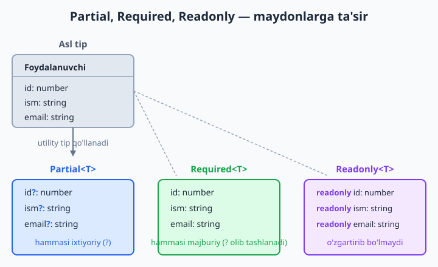
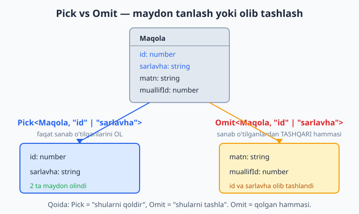
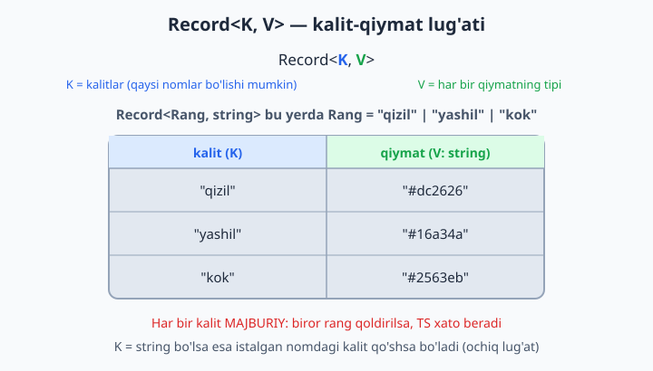

# 14 — Utility types

[⬅️ Oldingi: 13 — Klasslar TypeScript'da](./13-klasslar.md) · [🏠 README](./README.md) · [Keyingi: 15 — Mapped va conditional types ➡️](./15-mapped-conditional.md)

> **Bu bobda:** mavjud tipdan qo'lda qayta yozmasdan yangi tip yasashni o'rganamiz. TypeScript bilan birga keladigan tayyor **utility type** (yordamchi tip) larni — `Partial<T>` (hammasi ixtiyoriy), `Required<T>`, `Readonly<T>`, `Pick<T, K>`, `Omit<T, K>`, `Record<K, V>` (lug'at), `Exclude` / `Extract` (union filtri), `NonNullable`, `ReturnType<F>`, `Parameters<F>` va `Awaited<T>` ni ko'rib chiqamiz. Har biri qachon kerakligini real misollarda ko'ramiz va ularni zanjirga ulashni o'rganamiz.

---

## Muammo

Tasavvur qiling, sizda foydalanuvchi tipi bor:

```ts
type Foydalanuvchi = {
  id: number;
  ism: string;
  email: string;
  yosh: number;
};
```

Endi loyihada bir nechta yaqin, lekin **biroz boshqacha** tiplar kerak bo'ldi:

1. **Profilni tahrirlash formasi.** Foydalanuvchi faqat bitta maydonni — masalan, emailni — yangilashi mumkin. Demak forma uchun tipda **hamma maydon ixtiyoriy** bo'lishi kerak (faqat email yuborilsa ham yaramli bo'lsin).
2. **API javobi.** Frontendga faqat `id` va `ism` qaytariladi (email, yosh — maxfiy). Demak shu yerda **faqat ikki maydonli** tip kerak.
3. **Yangi foydalanuvchi yaratish.** `id` bazada avtomatik beriladi, shuning uchun yaratishda **id'siz** tip kerak.

JavaScript'da bunday holatda har bir variant uchun obyektni boshidan, qo'lda yozardingiz:

```ts
// ❌ Qo'lda takrorlangan — har biri alohida yozildi:
type FoydalanuvchiUpdate = { id?: number; ism?: string; email?: string; yosh?: number };
type FoydalanuvchiJavob = { id: number; ism: string };
type FoydalanuvchiYangi = { ism: string; email: string; yosh: number };
```

Bu yerda muammo aniq: `Foydalanuvchi`ga `telefon` maydoni qo'shsangiz, yuqoridagi **uch joyni ham** qo'lda yangilashga to'g'ri keladi. Bittasini unutsangiz — tiplar bir-biriga mos kelmay qoladi va xato sezilmay o'tib ketadi.

TypeScript bu muammoni **utility types** bilan hal qiladi. Utility type — bu mavjud tipni qabul qilib, undan **yangi tip yasab beradigan** tayyor generic vositadir (10-bobdagi `type` alias va 11-bobdagi generic ustiga qurilgan). Yuqoridagi uchchala tipni shunday yozsa bo'ladi:

```ts
type FoydalanuvchiUpdate = Partial<Foydalanuvchi>;          // hammasi ixtiyoriy
type FoydalanuvchiJavob = Pick<Foydalanuvchi, "id" | "ism">; // faqat 2 maydon
type FoydalanuvchiYangi = Omit<Foydalanuvchi, "id">;         // id'siz
```

Endi `Foydalanuvchi`ga maydon qo'shsangiz — bu uch tip **avtomatik** yangilanadi. Bitta manba, hamma joy o'zidan o'zi mos. Mana shu — utility types kuchi. Birma-bir tanishamiz.

## Partial<T> — hammasini ixtiyoriy qilish

`Partial<T>` tipdagi **har bir maydonni ixtiyoriy** (`?` qo'shadi) qiladi. "Bu obyektning ba'zi maydonlarini berishim mumkin, hammasini emas" degan holatlar uchun.

```ts
type Foydalanuvchi = {
  id: number;
  ism: string;
  email: string;
  yosh: number;
};

// Partial<Foydalanuvchi> = { id?: number; ism?: string; email?: string; yosh?: number }
function profilYangila(id: number, ozgarishlar: Partial<Foydalanuvchi>) {
  // ozgarishlar ichida faqat o'zgargan maydonlar bo'ladi
  return ozgarishlar;
}

profilYangila(1, { email: "yangi@mail.uz" }); // ✅ faqat email
profilYangila(1, { ism: "Olim", yosh: 30 });  // ✅ ikkita maydon
profilYangila(1, {});                          // ✅ hatto bo'sh obyekt ham yaramli
```

✅ Bularning hammasi toza kompilyatsiya o'tadi. `Partial` tufayli "faqat o'zgartirilayotgan maydonlarni yubor" qoidasi tipda ifodalandi.

📌 `Partial` faqat **mavjud** maydonlarni ixtiyoriy qiladi — yangi maydon qo'shishga ruxsat bermaydi. Notanish maydon yuborsangiz, xato chiqadi:

```ts
profilYangila(1, { rang: "qora" });
// ❌ Xato: Object literal may only specify known properties,
//          and 'rang' does not exist in type 'Partial<Foydalanuvchi>'.
```

💡 `Partial` "update" (yangilash) qolipining asosiy quroli. Qachonki obyektning **bir qismini** qabul qilsangiz — `Partial<T>` deb o'ylang.

## Required<T> — hammasini majburiy qilish

`Required<T>` — `Partial`'ning aksi: **barcha** `?` belgilarni olib tashlaydi, ya'ni har bir maydon **majburiy** bo'ladi. Tipida ixtiyoriy maydonlar bor obyektni "endi hammasi to'ldirilgan" deb kafolatlamoqchi bo'lganda kerak.

```ts
type Sozlamalar = {
  rang?: string;
  shrift?: string;
  hajm?: number;
};

// Required<Sozlamalar> = { rang: string; shrift: string; hajm: number }
function ishlat(s: Required<Sozlamalar>) {
  return s.rang.toUpperCase(); // rang aniq string, undefined emas — bemalol
}

ishlat({ rang: "qora", shrift: "Inter", hajm: 14 }); // ✅ hammasi berildi
```

✅ Toza o'tadi. Endi `s.rang` `string | undefined` emas, balki to'g'ridan-to'g'ri `string` — shuning uchun `.toUpperCase()` ni tekshiruvsiz chaqirsa bo'ladi.

Birorta maydon tushib qolsa, xato chiqadi:

```ts
const s: Required<Sozlamalar> = { rang: "qora" };
// ❌ Xato (TS2739): Type '{ rang: string; }' is missing the following
//          properties from type 'Required<Sozlamalar>': shrift, hajm
```

💡 Amaliy qolip: foydalanuvchidan **ixtiyoriy** sozlamalarni olasiz, ularni **default** qiymatlar bilan to'ldirasiz va natijada `Required<Sozlamalar>` hosil bo'ladi — endi dastur ichida har bir maydon bor deb ishonchli foydalanasiz.

## Readonly<T> — o'zgartirishni taqiqlash

`Readonly<T>` har bir maydonni `readonly` qiladi — ya'ni obyektni yaratgandan keyin uning maydonlarini **o'zgartirib bo'lmaydi**. Tasodifiy o'zgarishlardan himoyalanish uchun.

```ts
type Hujjat = {
  id: number;
  matn: string;
};

const h: Readonly<Hujjat> = { id: 1, matn: "salom" };
console.log(h.matn); // ✅ o'qish mumkin
```

O'zgartirishga urinsangiz — kompilyator to'xtatadi:

```ts
h.matn = "yangi";
// ❌ Xato: Cannot assign to 'matn' because it is a read-only property.
```

📌 `Readonly` faqat **eng yuqori** darajadagi maydonlarni muhrlaydi — agar maydon ichida yana obyekt bo'lsa, uning ichi himoyalanmaydi ("sayoz" / shallow himoya). Chuqur himoya uchun har bir ichki tipni alohida o'rab chiqish kerak (yoki keyingi boblardagi yanada chuqurroq usullar).

💡 `readonly` faqat **kompilyatsiya** paytida ishlaydi — tekshiruv. Tayyor JavaScript'da hech qanday himoya qolmaydi (bu 1-bobdagi "tiplar runtime'da yo'qoladi" qoidasining davomi). Ya'ni `Readonly` — bu sizning xatolaringizdan himoya, dushmandan emas.



## Pick<T, K> — kerakli maydonlarni tanlash

`Pick<T, K>` tipdan **faqat siz aytgan** maydonlarni oladi. `K` — qaysi maydonlarni olishni ko'rsatadigan kalit nomlari unioni (literal tiplar — 7-bob).

```ts
type Maqola = {
  id: number;
  sarlavha: string;
  matn: string;
  muallifId: number;
  yaratilganSana: Date;
};

// Faqat ro'yxat ko'rsatish uchun: id va sarlavha yetarli
type MaqolaQisqa = Pick<Maqola, "id" | "sarlavha">;
// = { id: number; sarlavha: string }

const m: MaqolaQisqa = { id: 5, sarlavha: "TypeScript darslari" };
console.log(m.sarlavha); // ✅
```

✅ Toza o'tadi. `MaqolaQisqa`da faqat ikki maydon bor — qolganlari yo'q.

Olinmagan maydonni qo'shsangiz, xato chiqadi:

```ts
const m: MaqolaQisqa = { id: 5, sarlavha: "TS", matn: "..." };
// ❌ Xato: Object literal may only specify known properties,
//          and 'matn' does not exist in type 'MaqolaQisqa'.
```

📌 `K` — tipni emas, **maydon nomlarini** (string literal) qabul qiladi. Mavjud bo'lmagan nom yozsangiz (masalan `Pick<Maqola, "narx">`), TypeScript darrov ogohlantiradi: bunday maydon yo'q. Bu — `Pick` ning kuchi: maydon nomini xato yozsangiz ham ushlab oladi.

💡 `Pick` ayniqsa **API javobi** uchun ajoyib: serverdagi to'liq yozuvdan frontendga ko'rsatiladigan "yengil" tipni shu bilan yasaysiz.

## Omit<T, K> — keraksiz maydonlarni olib tashlash

`Omit<T, K>` — `Pick`'ning aksi: `K` da sanab o'tilgan maydonlardan **tashqari** hammasini qoldiradi. "Shu maydonlarni olib tashla, qolgani turaversin" degani.

```ts
type Maqola = {
  id: number;
  sarlavha: string;
  matn: string;
  muallifId: number;
  yaratilganSana: Date;
};

// Yangi maqola yaratish: id va sana avtomatik beriladi, qolgani foydalanuvchidan
type YangiMaqola = Omit<Maqola, "id" | "yaratilganSana">;
// = { sarlavha: string; matn: string; muallifId: number }

const ym: YangiMaqola = {
  sarlavha: "Salom",
  matn: "Maqola matni...",
  muallifId: 1,
};
console.log(ym.matn); // ✅
```

✅ Toza o'tadi. `id` va `yaratilganSana` tipdan olib tashlandi.

**Pick yoki Omit — qaysi birini tanlayman?** Oddiy qoida: **ozini** qoldirmoqchi bo'lsangiz `Pick` (sanab beraman, shularni ol), **ko'pini** qoldirmoqchi bo'lsangiz `Omit` (bir-ikkitasini tashla, qolgani tursin). Ikkalasi bir natijaga olib kelishi mumkin, lekin kamroq nom yozadigani odatda o'qishga qulayroq.



📌 `Omit` da olib tashlanayotgan maydon nomini xato yozsangiz, TypeScript (tarixiy sabablarga ko'ra) har doim ham ogohlantirmaydi. Shuning uchun nomlarni diqqat bilan yozing. `Pick` esa har doim tekshiradi — bu jihatdan `Pick` xavfsizroq.

## Record<K, V> — lug'at (kalit-qiymat) tuzish

`Record<K, V>` **lug'at** tipini yasaydi: `K` — qanday kalitlar bo'lishi mumkinligini, `V` — har bir qiymatning tipini belgilaydi. "Har bir kalitga shunday qiymat biriktiraman" degani.

Eng kuchli holati — kalitlar **literal union** bo'lganda: TypeScript har bir kalit **majburiy** ekanini talab qiladi.

```ts
type Rang = "qizil" | "yashil" | "kok";

// Har bir rang nomiga HEX kod biriktiramiz:
const ranglar: Record<Rang, string> = {
  qizil: "#dc2626",
  yashil: "#16a34a",
  kok: "#2563eb",
};

console.log(ranglar.qizil); // ✅ "#dc2626"
```

✅ Toza o'tadi. Bironta rangni unutsangiz — xato:

```ts
const ranglar: Record<Rang, string> = {
  qizil: "#dc2626",
  yashil: "#16a34a",
}; // ❌ Xato: Property 'kok' is missing in type
   //          '{ qizil: string; yashil: string; }'
   //          but required in type 'Record<Rang, string>'.
```

📌 Aynan shu — `Record`ning eng foydali tomoni: literal union kalitlar bilan, **bironta variant qolib ketmasligi** kafolatlanadi. Yangi rang qo'shsangiz, lug'atda uni to'ldirmaguningizcha kod kompilyatsiya o'tmaydi.



`K` o'rnida oddiy `string` ham ishlatsa bo'ladi — bunda kalitlar oldindan ma'lum bo'lmagan **ochiq lug'at** chiqadi:

```ts
type Mahsulot = { nom: string; narx: number };

// Kalit — istalgan string (mahsulot kodi), qiymat — Mahsulot:
const ombor: Record<string, Mahsulot> = {
  "A1": { nom: "Olma", narx: 5000 },
  "B2": { nom: "Banan", narx: 8000 },
};

console.log(ombor["A1"].nom); // ✅ "Olma"
```

✅ Bu ham toza o'tadi. `Record<string, Mahsulot>` — "kalit string, qiymat Mahsulot bo'lgan lug'at". JavaScript'dagi oddiy obyekt-lug'atning tiplangan ko'rinishi.

💡 `Record<string, T>` — koddagi "obyektni lug'at sifatida ishlataman" niyatini aniq bildiradi. `{ [key: string]: T }` (index signature) bilan deyarli bir xil, lekin `Record` qisqaroq va o'qishga qulayroq.

## Exclude va Extract — union'ni filtrlash

Bular obyekt bilan emas, **union tip** bilan ishlaydi (7-bob). Ikkalasi union ichidan a'zolarni **saralaydi**:

- `Exclude<T, U>` — `T` dan `U` ga to'g'ri keladiganlarni **olib tashlaydi** (chiqarib yuboradi).
- `Extract<T, U>` — `T` dan faqat `U` ga to'g'ri keladiganlarni **qoldiradi** (ajratib oladi).

```ts
type Holat = "kutilmoqda" | "jarayonda" | "tugatildi" | "bekor";

// Tugamagan, bekor qilinmagan — ya'ni faol holatlar:
type FaolHolat = Exclude<Holat, "bekor" | "tugatildi">;
// = "kutilmoqda" | "jarayonda"

const fh: FaolHolat = "jarayonda"; // ✅
```

✅ Toza o'tadi. Endi `FaolHolat` ga olib tashlangan a'zoni berib bo'lmaydi:

```ts
const fh: FaolHolat = "bekor";
// ❌ Xato: Type '"bekor"' is not assignable to type 'FaolHolat'.
```

`Extract` esa teskari — kerakli a'zolarni ajratib oladi. Ko'pincha aralash union'dan bitta tipni sug'urib olishga ishlatiladi:

```ts
type Aralash = string | number | boolean;
type FaqatMatn = Extract<Aralash, string>; // = string

const fm: FaqatMatn = "matn"; // ✅
```

✅ Toza o'tadi. `Extract` `Aralash` ichidan faqat `string` ga mosini qoldirdi.

📌 Esda saqlash uchun: **Ex**clude = **ex**it (chiqib ket), **Extract** = ajratib ol. Ikkalasi ichkarida "conditional type" (shartli tip) ustiga qurilgan — uni 15-bobda ochib beramiz. Hozircha "union filtri" deb yodda tuting.

## NonNullable<T> — null va undefined'ni olib tashlash

`NonNullable<T>` union ichidan `null` va `undefined` ni **olib tashlaydi** — qiymat aniq bor ekaniga ishonch hosil qilgan joylar uchun.

```ts
type MumkinBosh = string | null | undefined;
type AlbattaBor = NonNullable<MumkinBosh>; // = string

const ab: AlbattaBor = "bor"; // ✅
```

✅ Toza o'tadi. Aslida bu `Exclude<T, null | undefined>` ning qulay, nomli ko'rinishi — lekin shu qadar tez-tez kerak bo'ladiki, TypeScript unga alohida nom bergan.

💡 `NonNullable` ko'pincha boshqa utility natijasini "tozalash" uchun ishlatiladi (masalan, qiymat bo'lishi/bo'lmasligi mumkin bo'lgan tipni keyinroq aniq bor deb belgilash). Amalda, 8-bobdagi narrowing (tip toraytirish) ko'pincha bu ishni o'zi qiladi — lekin tip darajasida kerak bo'lganda `NonNullable` qo'l keladi.

## ReturnType<F> va Parameters<F> — funksiyadan tip olish

Bu ikkisi **funksiyadan** tip "sug'urib oladi". Funksiya yozilgan, lekin uning kirish/chiqish tipiga alohida nom bermagansiz — mana shu yerda asqotadi.

`ReturnType<F>` — funksiya **qaytaradigan** qiymat tipini beradi. `typeof` bilan birga ishlatiladi (funksiyaning o'zidan emas, **tipidan** olish uchun):

```ts
function foydalanuvchiYarat(ism: string) {
  return { id: Date.now(), ism, faol: true };
}

// Funksiya nima qaytarsa — shu tipni avtomatik olamiz:
type FoydalanuvchiNatija = ReturnType<typeof foydalanuvchiYarat>;
// = { id: number; ism: string; faol: boolean }

const fn: FoydalanuvchiNatija = { id: 1, ism: "Olim", faol: true }; // ✅
console.log(fn.faol);
```

✅ Toza o'tadi. E'tibor bering: natija tipini **qo'lda yozmadik**. Funksiya o'zgarsa (masalan, `faol` o'rniga boshqa maydon qaytarsa), `FoydalanuvchiNatija` o'zidan o'zi yangilanadi.

📌 Nega `typeof foydalanuvchiYarat`? Chunki `ReturnType` tip kutadi, `foydalanuvchiYarat` esa **qiymat** (funksiyaning o'zi). `typeof` qiymatdan uning tipini oladi (3-bobdagi `typeof` tip operatori). Shuning uchun `ReturnType<typeof funksiya>` — deyarli har doim shu qolipda yoziladi.

`Parameters<F>` — funksiyaning **argumentlari** tiplarini **tuple** (4-bob) ko'rinishida beradi:

```ts
function buyurtmaYarat(mahsulotId: number, soni: number, manzil: string) {
  return { mahsulotId, soni, manzil };
}

type BuyurtmaArgs = Parameters<typeof buyurtmaYarat>;
// = [mahsulotId: number, soni: number, manzil: string]

const args: BuyurtmaArgs = [10, 2, "Toshkent"]; // ✅
buyurtmaYarat(...args); // tuple'ni argument sifatida yoyamiz
```

✅ Toza o'tadi. `Parameters` ayniqsa funksiyani **o'rab** (wrap qilib), uning argumentlarini o'zgartirmasdan uzatadigan joylarda foydali (masalan, logging yoki keshlash qoplamasi).

## Awaited<T> — Promise ichidan tip olish

`Awaited<T>` `Promise<X>` ichidan `X` ni **chiqarib oladi** — `await` qilingandan keyin qanday qiymat qolishini tip darajasida beradi (20-bobda Promise'larni chuqurroq ko'ramiz).

```ts
async function malumotOl(): Promise<{ ism: string }> {
  return { ism: "Olim" };
}

// ReturnType -> Promise<{ ism: string }>, Awaited uni "ochadi":
type MalumotTipi = Awaited<ReturnType<typeof malumotOl>>;
// = { ism: string }

const mt: MalumotTipi = { ism: "Olim" }; // ✅
console.log(mt.ism);
```

✅ Toza o'tadi. `ReturnType<typeof malumotOl>` o'zi `Promise<{ ism: string }>` beradi — bizga esa `await`dan **keyingi** tip kerak, shuning uchun ustiga `Awaited` qo'yamiz.

📌 `Awaited` "ichma-ich" Promise'larni ham ochadi: `Awaited<Promise<Promise<number>>>` natijasi `number`. Real kodda kamdan-kam uchraydi, lekin async natija tipini olishda ishonchli.

## Utility'larni zanjirlash

Eng kuchli tomoni shundaki, utility'lar bir-birining ichiga **joylanadi** — natijada aynan kerakli tip chiqadi. Boshlanishdagi "forma update" muammosini eslang: yangilashda hamma maydon ixtiyoriy bo'lsin, **lekin `id`ni o'zgartirib bo'lmasin**. Ikkala talabni bitta tipda ifodalaymiz:

```ts
type Talaba = {
  id: number;
  ism: string;
  email?: string;
  baho?: number;
};

// Avval id'ni olib tashla (Omit), keyin qolganini ixtiyoriy qil (Partial):
type TalabaFormaUpdate = Partial<Omit<Talaba, "id">>;
// = { ism?: string; email?: string; baho?: number }

const tu: TalabaFormaUpdate = { baho: 5 }; // ✅ faqat baho yangilanadi
console.log(tu.baho);
```

✅ Toza o'tadi. Ichkaridan tashqariga o'qiladi: avval `Omit<Talaba, "id">` (id'siz tip), so'ng uni `Partial<...>` (hammasi ixtiyoriy) o'raydi. Aynan kerakli natija — `id`siz va hammasi ixtiyoriy.

💡 Zanjir tartibi muhim: `Partial<Omit<...>>` va `Omit<Partial<...>>` ko'pincha bir xil natija bersa-da, niyatni aniq bildirish uchun "avval keraksizni tashla, keyin moslashtir" tartibi o'qishga qulayroq. Murakkab zanjirga alohida nom bering — kod hujjatga aylanadi.

## Bonus: satisfies bilan tipni tekshirish

Zamonaviy TypeScript (4.9+) da `satisfies` operatori bor — u qiymat biror tipga **mos kelishini tekshiradi**, lekin qiymatning **aniqroq** (tor) tipini saqlab qoladi. `Record` bilan birga juda qulay:

```ts
const yollar = {
  bosh: "/",
  haqida: "/about",
  aloqa: "/contact",
} satisfies Record<string, string>;

// yollar har bir kaliti tekshirildi (qiymati string),
// lekin kalitlar nomi ham saqlandi:
const x: string = yollar.bosh; // ✅ aniq mavjud kalit
console.log(x);
```

✅ Toza o'tadi. Farqi nimada? Agar `const yollar: Record<string, string> = {...}` deb yozsangiz, TypeScript `yollar.notogriKalit` ni ham xato deb hisoblamaydi (har qanday string kalit ruxsat etilgan). `satisfies` esa moslikni tekshiradi-yu, lekin `yollar`ning aniq kalitlarini (`bosh`, `haqida`, `aloqa`) "eslab qoladi" — shuning uchun mavjud bo'lmagan kalitga murojaat xatoni ushlaydi. Ikkala dunyoning eng yaxshisi.

## Xulosa: qaysi utility qachon?

| Utility | Nima qiladi | Qachon kerak |
|---|---|---|
| `Partial<T>` | Hammasi ixtiyoriy | Yangilash (update) formasi |
| `Required<T>` | Hammasi majburiy | Default'lar bilan to'ldirilgan sozlama |
| `Readonly<T>` | O'zgartirib bo'lmaydi | Muhrlangan, o'zgarmas obyekt |
| `Pick<T, K>` | Faqat tanlanganlar | API javobi, yengil ko'rinish |
| `Omit<T, K>` | Tanlangandan boshqasi | Yaratish tipi (id'siz) |
| `Record<K, V>` | Kalit-qiymat lug'at | Sozlama jadvali, ko'rsatkichlar |
| `Exclude<T, U>` | Union'dan olib tashlash | Holatlarni filtrlash |
| `Extract<T, U>` | Union'dan ajratib olish | Aralashdan bitta tip |
| `NonNullable<T>` | null/undefined yo'q | Qiymat aniq bor |
| `ReturnType<F>` | Funksiya natija tipi | Tipni qo'lda yozmaslik |
| `Parameters<F>` | Funksiya argument tiplari | Funksiyani o'rash |
| `Awaited<T>` | Promise ichidagi tip | async natija tipi |

Bu utility'larning hammasi ichkarida **mapped types** va **conditional types** ustiga qurilgan — ya'ni siz ham xuddi shunday vositalarni o'zingiz yasashingiz mumkin. Aynan shuni keyingi bobda o'rganamiz.

## 14-bob mashqlari

> Yechimlar berilmagan — har birini o'zingiz yozib, `tsc` bilan tekshiring. Mashqlar asta-sekin qiyinlashadi.

1. `Kitob` tipini yarating (`id`, `nom`, `narx`, `sahifa`). Undan `Partial<Kitob>` yordamida `KitobUpdate` tipini hosil qiling va faqat `narx` o'zgaradigan obyekt yozing.
2. `Sozlama` tipida hamma maydon ixtiyoriy (`?`) bo'lsin. `Required<Sozlama>` bilan yangi tip yasab, unga to'liq to'ldirilgan obyekt bering. Bitta maydonni qoldirib ko'ring va xatoni o'qing.
3. `Konfig` tipini `Readonly<...>` qilib e'lon qiling, so'ng uning bir maydonini o'zgartirishga urinib ko'ring. Chiqqan xato xabarini izohlang.
4. `Foydalanuvchi` tipidan (`id`, `ism`, `email`, `parol`) `Pick` yordamida faqat `id` va `ism` bo'lgan `OmmaviyProfil` tipini yasang.
5. Xuddi shu `Foydalanuvchi` tipidan `Omit` yordamida `parol`siz tip yasang. Natija 4-mashqdagidan nimasi bilan farq qiladi?
6. `Pick` ga mavjud bo'lmagan maydon nomi (masalan `"telefon"`) bering va TypeScript qanday ogohlantirishini ko'ring.
7. `Kun = "dushanba" | "seshanba" | "chorshanba"` union'i uchun `Record<Kun, string>` lug'atini yasang: har bir kunga qisqartma (masalan `"Du"`) bering.
8. 7-mashqdagi lug'atdan bitta kunni qoldirib ketib, chiqqan "missing property" xatosini o'qing.
9. `Record<string, number>` tipida "mahsulot kodi -> miqdor" ochiq lug'atini yarating va unga uchta yozuv qo'shing.
10. `Holat = "yangi" | "ochiq" | "yopiq" | "arxiv"` dan `Exclude` bilan `arxiv`ni olib tashlab, `FaolHolat` tipini yasang.
11. Xuddi shu `Holat`dan `Extract` bilan faqat `"ochiq" | "yopiq"` ni ajratib oling. Natija `Exclude` bilan olinganidan farq qiladimi?
12. `string | number | null | undefined` tipidan `NonNullable` bilan `null` va `undefined`ni olib tashlang. Natija qanday tip bo'ladi?
13. `salomlash(ism: string): string` funksiyasini yozing va `ReturnType<typeof salomlash>` bilan uning natija tipini oling.
14. `koordinata(x: number, y: number)` funksiyasidan `Parameters<typeof koordinata>` bilan argument tiplarini tuple sifatida oling va shu tipdagi massiv yarating.
15. `Promise<string[]>` qaytaradigan `async` funksiya yozing. `Awaited<ReturnType<typeof funksiya>>` bilan `await`dan keyingi tipni oling.
16. `Mahsulot` tipidan (`id`, `nom`, `narx`, `tavsif?`) `Omit<..., "id">` va undan keyin `Partial<...>` ni ketma-ket qo'llab, "id'siz va hammasi ixtiyoriy" `MahsulotUpdate` tipini yasang.
17. `Pick` va `Required` ni zanjirlab: `Foydalanuvchi`dan faqat `email` va `telefon?` ni oling, so'ng ikkalasini ham majburiy qiling.
18. `Record<"kichik" | "orta" | "katta", number>` bilan "o'lcham -> piksel" lug'atini yasang va `satisfies` orqali ham yozib ko'ring. Farqni tushuntiring.
19. Real forma misoli: `RoyxatdanOtish` tipini yarating (`ism`, `email`, `parol`, `parolTasdiq`, `roziman: boolean`). Undan **submit** uchun `Omit<..., "parolTasdiq">` tipini, **qoralama (draft)** uchun `Partial<...>` tipini yasang.
20. Bitta tipdan kamida **uchta** utility (`Pick`, `Omit`, `Partial`, `Record`, `ReturnType`...) yordamida turli ishchi tiplar yasang va har birining qachon kerakligini bir qatorda izohlab yozing (bitta "manba" tipdan butun ishchi tip oilasini qurish mashqi).
