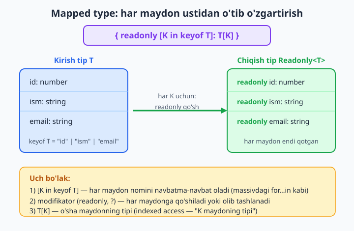
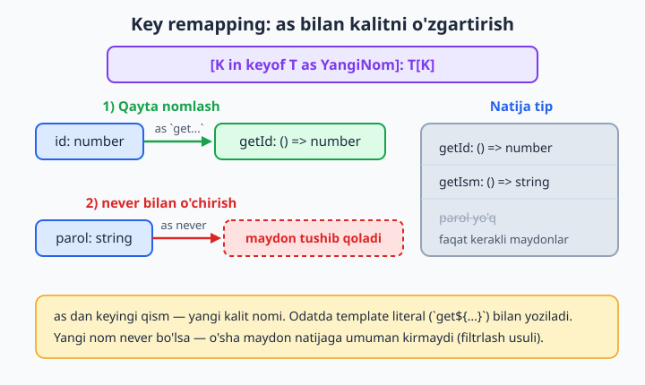
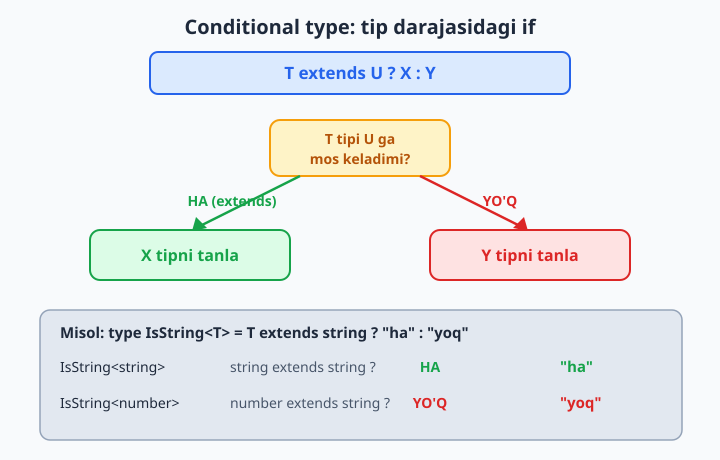
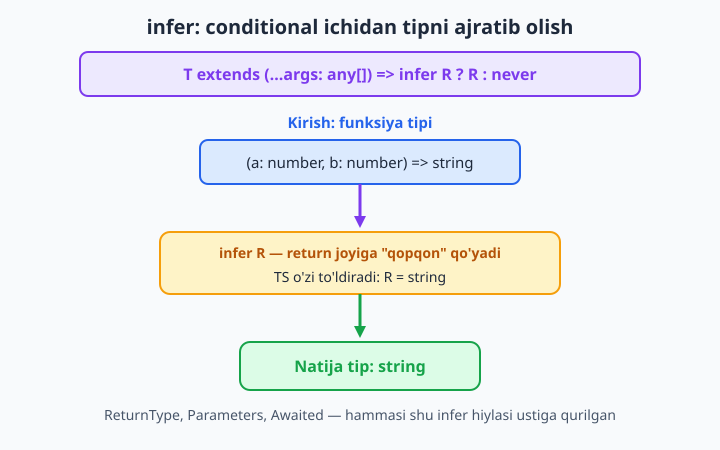
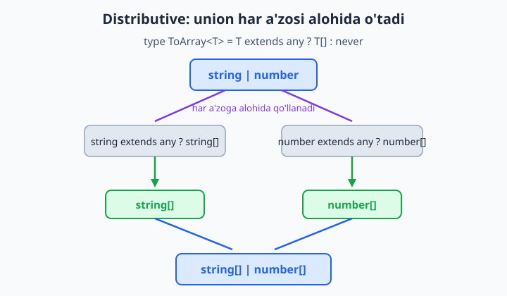

# 15 — Mapped va conditional types

[⬅️ Oldingi: 14 — Utility types](./14-utility-types.md) · [🏠 README](./README.md) · [Keyingi: 16 — Template literal types ➡️](./16-template-literal-types.md)

> **Bu bobda:** o'tgan bobda tayyor utility tiplardan (`Partial`, `Readonly`, `Pick`, `Record`...) foydalandik. Endi ularning ich tomonini ochamiz va o'zimiz yasashni o'rganamiz. **Mapped type** (`{ [K in keyof T]: ... }`) bilan tip maydonlari ustidan iteratsiya qilishni, `readonly`/`?` modifikatorlarini qo'shish va olib tashlash (`-readonly`, `-?`), `as` bilan kalitlarni qayta nomlashni (key remapping); **conditional type** (`T extends U ? X : Y`) bilan tip darajasida "if" yozishni, `infer` orqali tip ichidan bo'lakni ajratib olishni (`ReturnType` shunday yasalgan), union ustidan tarqaladigan **distributive** xulq-atvorni va `DeepReadonly`, `Nullable` kabi real tiplarni qurishni ko'rib chiqamiz.

---

## Muammo

Tasavvur qiling, formangiz bor. Foydalanuvchini tahrirlash sahifasi: ism, email, telefon. Saqlashda butun obyekt kerak:

```ts
type Foydalanuvchi = {
  id: number;
  ism: string;
  email: string;
};
```

Lekin tahrirlash payti foydalanuvchi faqat **bitta** maydonni o'zgartirishi mumkin — masalan, faqat `ism`ni. Demak forma holatida maydonlarning hammasi majburiy emas, "ixtiyoriy" bo'lishi kerak:

```ts
// Qo'lda yozsak:
type FoydaTahrir = {
  id?: number;
  ism?: string;
  email?: string;
};
```

Bu ishlaydi, ammo o'ylab ko'ring: `Foydalanuvchi`ga ertaga `telefon` maydoni qo'shsangiz, `FoydaTahrir`ni ham **qo'lda** yangilashingiz kerak. Ikki joyni sinxron tutish — unutiladigan, xato chiqaradigan ish. 14-bobda buni `Partial<Foydalanuvchi>` bir qatorda hal qilishini ko'rdik. Lekin `Partial`ning o'zi qanday ishlaydi? Sehr emas — u shunchaki **mapped type**:

```ts
// TypeScript'ning haqiqiy ta'rifi (lib ichida):
type Partial<T> = {
  [P in keyof T]?: T[P];
};
```

Bu bobda aynan shu qatorni — `[P in keyof T]` nimaligini, undagi `?` qanday "har maydonga" tarqalishini ochamiz. Bir marta tushunsangiz, `Partial`, `Readonly`, `Pick`, `Record`ni o'zingiz qayta yoza olasiz. Va undan ham kuchli — TypeScript'da tayyor turmagan, sizga kerakli tiplarni ham yasay olasiz. Boshlaymiz.

## Mapped type — har maydon ustidan o'tish

JavaScript'da obyekt maydonlari ustidan `for...in` bilan aylanardingiz:

```js
for (const kalit in foydalanuvchi) {
  console.log(kalit, foydalanuvchi[kalit]);
}
```

Mapped type — xuddi shuning **tip darajasidagi** ko'rinishi. Faqat qiymatlar ustidan emas, **maydon nomlari (kalitlar)** ustidan aylanasiz va har biri uchun yangi maydon yasaysiz. Sintaksis:

```ts
type Yangi = {
  [K in keyof T]: T[K];
};
```

Uch bo'lakka ajratamiz (bu butun bobning kaliti):

- **`keyof T`** — `T` tipining hamma maydon nomlarini **union** qilib beradi. `Foydalanuvchi` uchun bu `"id" | "ism" | "email"`. (`keyof` 12-bobda uchragan edi.)
- **`[K in ...]`** — o'sha union bo'ylab aylanadi: `K` navbatma-navbat `"id"`, keyin `"ism"`, keyin `"email"` bo'ladi. Bu `for...in`ning tip dunyosidagi aksi.
- **`T[K]`** — `K` maydonning **tipi** (indexed access — "K maydoning tipi", 12-bob). `"id"` uchun `number`, `"ism"` uchun `string`.



Eng oddiy mapped type — hech narsani o'zgartirmasdan nusxa ko'chiradigani:

```ts
type Foydalanuvchi = {
  id: number;
  ism: string;
  email: string;
};

type Nusxa<T> = {
  [K in keyof T]: T[K];
};

type FoydaNusxa = Nusxa<Foydalanuvchi>;
// natija: { id: number; ism: string; email: string } — aynan o'zi
```

Foydasi yo'qday tuyuladi, ammo bu — barcha utility tiplarning skeleti. Endi shu skeletga "o'zgartirish" qo'shamiz.

## O'z Readonly va Partial'imizni yozish

Eng kuchli odat — modifikator qo'shish. `readonly` qo'shsangiz, har bir maydon o'zgarmaydigan bo'ladi:

```ts
type MyReadonly<T> = {
  readonly [K in keyof T]: T[K];
};

type Qotgan = MyReadonly<Foydalanuvchi>;
// { readonly id: number; readonly ism: string; readonly email: string }

const q: Qotgan = { id: 1, ism: "Lola", email: "lola@x.uz" };
console.log(q.id); // ✅ o'qish — mayli
```

`readonly` so'zini bitta joyda yozdingiz, lekin u **har** maydonga tarqaldi. Endi qotgan maydonni o'zgartirsangiz:

```ts
q.ism = "Aziz"; // ❌ Xato: Cannot assign to 'ism' because it is a read-only property.
```

Xuddi shu naqsh bilan `Partial`ni ham yozamiz — faqat `readonly` o'rniga `?`:

```ts
type MyPartial<T> = {
  [K in keyof T]?: T[K];
};

type Yangilash = MyPartial<Foydalanuvchi>;
// { id?: number; ism?: string; email?: string }

const yangilash: Yangilash = { ism: "Aziz" }; // ✅ faqat bitta maydon — mayli
```

📌 `?` maydonni **ixtiyoriy** qiladi, lekin tip tekshiruvini o'chirmaydi. Maydonni bersangiz, tipi to'g'ri bo'lishi shart:

```ts
const bad: Yangilash = { id: "salom" };
// ❌ Xato: Type 'string' is not assignable to type 'number'.
```

💡 Boshlovchilar tez-tez `?` "har qanday qiymatni qabul qiladi" deb o'ylab xato qiladi. Yo'q — `?` faqat "maydon bo'lmasa ham mayli" degani. Maydon **bor** bo'lsa, tipi qat'iy tekshiriladi.

## Modifikatorlarni olib tashlash: `-readonly` va `-?`

Mapped type modifikator **qo'sha** oladi — demak teskari ham mumkin: **olib tashlash**. Buning uchun modifikator oldiga minus (`-`) qo'yiladi. Bu `Required` va `Mutable` (TypeScript'da bunday nomli utility yo'q, lekin foydali) tiplarini beradi:

```ts
// ? ni olib tashlaydi — hamma maydon majburiy bo'ladi
type MyRequired<T> = {
  [K in keyof T]-?: T[K];
};

// readonly ni olib tashlaydi — hamma maydon o'zgaruvchan bo'ladi
type Mutable<T> = {
  -readonly [K in keyof T]: T[K];
};
```

Tekshirib ko'ramiz. `MyRequired` ixtiyoriy maydonlarni majburiy qiladi:

```ts
type FoydaTahrir = { id?: number; ism?: string };

type Toliq = MyRequired<FoydaTahrir>;
// { id: number; ism: string } — ? lar yo'qoldi

const t: Toliq = { id: 1, ism: "Aziz" }; // ✅ endi ikkalasi ham majburiy
```

`Mutable` qotgan tipni yana yumshatadi:

```ts
type Mutatsiya = Mutable<Qotgan>; // Qotgan = MyReadonly<Foydalanuvchi>
// { id: number; ism: string; email: string } — readonly yo'qoldi

const m: Mutatsiya = { id: 1, ism: "A", email: "a@a.uz" };
m.ism = "B"; // ✅ endi o'zgartirsa bo'ladi
console.log(m.ism);
```

📌 Modifikatorlar grammatikasi:

| Yozuv | Ma'nosi |
|---|---|
| `readonly [K in ...]` | har maydonga `readonly` **qo'shadi** |
| `[K in ...]?` | har maydonni **ixtiyoriy** qiladi |
| `-readonly [K in ...]` | `readonly`ni **olib tashlaydi** |
| `[K in ...]-?` | `?`ni olib tashlaydi (majburiy qiladi) |

💡 `+` ham bor (`+readonly`, `+?`), lekin u "qo'shish" degani — bu standart xulq, shuning uchun `+` deyarli yozilmaydi. `-` esa load-ko'taradigan, foydali shakl.

## Key remapping: `as` bilan kalitlarni qayta nomlash

Hozirgacha maydon **nomlari** o'zgarmasdi — faqat tip yoki modifikator o'zgarardi. TypeScript 4.1 dan beri kalitning o'zini ham qayta nomlash mumkin — `as` orqali. Bu **key remapping** deyiladi.

Real misol: har maydon uchun `getId`, `getIsm` kabi "getter" metod nomlari yasashni xohlaysiz:

```ts
type Foydalanuvchi = {
  id: number;
  ism: string;
};

type Getterlar<T> = {
  [K in keyof T as `get${Capitalize<string & K>}`]: () => T[K];
};

type FoydaGetterlar = Getterlar<Foydalanuvchi>;
// { getId: () => number; getIsm: () => string }
```

Bu yerda `as` dan keyingi qism — yangi kalit nomi. `` `get${Capitalize<...>}` `` — template literal type (16-bobning mavzusi): `"id"`ni `"getId"`ga aylantiradi. `Capitalize` — birinchi harfni katta qiladigan tayyor utility.

```ts
const g: FoydaGetterlar = {
  getId: () => 1,
  getIsm: () => "Aziz",
};
console.log(g.getId(), g.getIsm()); // 1 Aziz
```

📌 `string & K` nega kerak? `keyof T` natijasi `string | number | symbol` bo'lishi mumkin, template literal esa faqat `string` bilan ishlaydi. `string & K` — "K ning faqat string qismini ol" degan kichik hiyla, `Capitalize`ni xotirjam qiladi.

**Maydonni butunlay olib tashlash.** `as` ning yana bir kuchi: agar yangi kalit `never` bo'lsa, o'sha maydon natijadan **tushib qoladi**. Bu bilan "filtrlash" mumkin — masalan, `parol` maydonini olib tashlash:

```ts
type Yashir<T, K extends keyof T> = {
  [P in keyof T as P extends K ? never : P]: T[P];
};

type FoydaParolsiz = Yashir<{ id: number; ism: string; parol: string }, "parol">;
// { id: number; ism: string } — parol yo'q
```

Mantiq: har `P` uchun "agar `P` yashiriladigan kalit bo'lsa, nomini `never` qil (yo'qot), aks holda nomini o'zgarmasdan qoldir". `never` bo'lgan maydon tipdan chiqib ketadi.

```ts
const fp: FoydaParolsiz = { id: 1, ism: "X", parol: "123" };
// ❌ Xato: 'parol' does not exist in type 'Yashir<...>'.
```



## Conditional type — tip darajasidagi "if"

Endi ikkinchi katta qurolga o'tamiz. JavaScript'da qiymatlar bilan shart yozasiz:

```js
const javob = qiymat === "string" ? "ha" : "yoq";
```

TypeScript'da **tiplar** bilan shart yozish mumkin. Sintaksis bir xil — `?:` — lekin shart **`extends`** so'zi bilan tuziladi:

```ts
type IsString<T> = T extends string ? "ha" : "yoq";
```

O'qilishi: "agar `T` tipi `string`ga **mos kelsa** (`extends` — unga sig'sa), natija `"ha"` tipi, aks holda `"yoq"` tipi".

```ts
type A = IsString<string>; // "ha"
type B = IsString<number>; // "yoq"

const a: A = "ha";  // ✅
const b: B = "yoq"; // ✅
```

Natija — oddiy qiymat emas, **tip**. `A` tipi aynan `"ha"` literal tipi (7-bob). Shuning uchun boshqasini bersangiz, xato:

```ts
const x: A = "boshqa";
// ❌ Xato: Type '"boshqa"' is not assignable to type '"ha"'.
```



📌 `extends` bu yerda klassdagi "meros olish" emas. Tip dunyosida `A extends B` "A — B ning kichik to'plamimi, A ni B turgan joyga qo'ysa bo'ladimi?" degani. `42 extends number` — ha (42 — number'ning bir qiymati). `number extends 42` — yo'q (number 42'dan kengroq).

Conditionallarni **zanjirlash** mumkin — bir nechta `if/else if` kabi:

```ts
type Tip<T> = T extends string
  ? "satr"
  : T extends number
  ? "raqam"
  : T extends boolean
  ? "mantiq"
  : "boshqa";

type T1 = Tip<string>;  // "satr"
type T2 = Tip<number>;  // "raqam"
type T3 = Tip<boolean>; // "mantiq"
type T4 = Tip<object>;  // "boshqa"
```

💡 `Nullable` kabi oddiy tiplarga conditional shart shart emas — ba'zan union yetadi:

```ts
type Nullable<T> = T | null;

type IsmYokiNull = Nullable<string>;
const n1: IsmYokiNull = "Lola"; // ✅
const n2: IsmYokiNull = null;   // ✅
```

Conditional esa "null'ni **olib tashlash**" kabi murakkabroq ishlarda kerak bo'ladi:

```ts
type MyNonNullable<T> = T extends null | undefined ? never : T;

type Toza = MyNonNullable<string | null | undefined>; // string
const toza: Toza = "salom"; // ✅
```

Bu yerda `never` "bu holatni natijadan o'chir" degani (9-bob). Union ustidan qanday tarqalishini hozir ko'ramiz — ana shu sehrning kaliti.

## `infer` — conditional ichidan tipni ajratib olish

Mana eng kuchli imkoniyat. Ko'pincha bizga shunday narsa kerak: "funksiya tipi berilgan — uning **qaytaradigan tipini** menga ber". Yoki "massiv tipi berilgan — uning **element tipini** ber". Buni `infer` (xulosa qil, ajratib ol) bajaradi.

`infer` **faqat** conditional type ichida ishlaydi. U `extends`dagi naqsh ichiga "qopqon" qo'yadi — TypeScript o'sha joyni ko'rganda, qaysi tip turganini o'zi aniqlaydi va nomli tipga (`R`) joylaydi:

```ts
type MyReturnType<T> = T extends (...args: any[]) => infer R ? R : never;
```

O'qilishi: "agar `T` qandaydir funksiya bo'lsa — qaytaradigan joyiga `infer R` qopqonini qo'yamiz; mos kelsa, `R` o'sha return tip bilan to'ladi va biz uni qaytaramiz; aks holda `never`".

```ts
function salomBer(): string {
  return "salom";
}

type Natija = MyReturnType<typeof salomBer>; // string
const r: Natija = "salom"; // ✅
```



📌 Bu aynan TypeScript'ning o'rnatilgan **`ReturnType`** utilitysi yasalgan usul. `ReturnType<typeof salomBer>` ham `string` beradi. Endi siz uning ichini bilasiz — sehr emas, bir qator conditional + `infer`.

`infer`ni boshqa joyga ham qo'yish mumkin — massiv elementini ajratish:

```ts
type ElementTipi<T> = T extends (infer E)[] ? E : never;

type SonElement = ElementTipi<number[]>;  // number
type SatrElement = ElementTipi<string[]>; // string
```

Yoki `Promise` ichidagini "ochish" (Promise yechilganda qaytadigan tip):

```ts
type Unwrap<T> = T extends Promise<infer U> ? U : T;

type Yechilgan = Unwrap<Promise<string>>; // string
type Oddiy = Unwrap<number>;              // number (Promise bo'lmasa o'zi qaytadi)
```

💡 Bir conditional ichida bir nechta `infer` ishlatish ham mumkin. Masalan, funksiyaning birinchi argumenti tipini olish:

```ts
type FirstArg<T> = T extends (first: infer A, ...rest: any[]) => any ? A : never;

function qoshish(a: number, b: number): number {
  return a + b;
}

type Birinchi = FirstArg<typeof qoshish>; // number
```

## Distributive conditional — union ustidan tarqalish

Conditional type'ning bir "sirli" xususiyati bor: agar tekshirilayotgan tip (`T`) **naked** (yalang'och — o'rab olinmagan) **union** bo'lsa, conditional union har bir a'zosi ustidan **alohida-alohida** ishlaydi, keyin natijalar yana union bo'lib birlashadi. Bu **distributive** (taqsimlanuvchi) xulq.

Misol bilan ko'ramiz. Quyidagi tip har tipni massivga o'raydi:

```ts
type ToArray<T> = T extends any ? T[] : never;
```

Endi unga **union** beramiz:

```ts
type Natija = ToArray<string | number>;
// kutilgani: (string | number)[] ?
// haqiqati:  string[] | number[]
```

Nima bo'ldi? `T` union bo'lgani uchun conditional **alohida** ishladi: avval `string` uchun (`string[]` chiqdi), keyin `number` uchun (`number[]` chiqdi), so'ng ikkalasi union bo'lib birlashdi — `string[] | number[]`.



```ts
const a: Natija = ["x", "y"];   // ✅ string[]
const b: Natija = [1, 2, 3];    // ✅ number[]
```

📌 Bu xulq faqat `T` **yalang'och tip parametri** bo'lganda yoqiladi (`T extends ...` ko'rinishida). Agar `T`ni biror narsa bilan o'rasangiz — masalan `[T]` tuple ichiga — tarqalish **to'xtaydi** va union bir butun bo'lib qoladi:

```ts
type ToArrayYagona<T> = [T] extends [any] ? T[] : never;

type Natija2 = ToArrayYagona<string | number>; // (string | number)[]
const c: Natija2 = ["x", 1, "y", 2]; // ✅ aralash massiv
```

Distributive xulq ko'p utility tiplarning asosida turadi. Masalan `Exclude` — union'dan ba'zi a'zolarni olib tashlash — aynan shunga tayanadi:

```ts
type MyExclude<T, U> = T extends U ? never : T;

type Qolgan = MyExclude<"a" | "b" | "c", "b">; // "a" | "c"
```

Mantiq: har a'zo uchun "agar u `U`ga kirsa — `never` (o'chir), aks holda — qoldir". `"b"` uchun `never` chiqdi va union'dan tushdi, qolganlari saqlanib qoldi. Bu ham TypeScript'ning haqiqiy `Exclude` ta'rifi.

💡 `never` union'da g'oyib bo'ladi: `"a" | never | "c"` avtomatik `"a" | "c"`ga soddalashadi. Shu sabab "o'chirish" `never` bilan ishlaydi.

## Hammasini birga: `DeepReadonly`

Endi o'rgangan hamma narsani bitta foydali tipga jamlaymiz. `Readonly` faqat **yuza** qatlamni qotiradi — ichki obyektlar baribir o'zgaruvchan qoladi:

```ts
type Sozlama = {
  nom: string;
  server: { host: string; port: number };
};

const s: Readonly<Sozlama> = { nom: "prod", server: { host: "x", port: 5432 } };
s.nom = "dev";          // ❌ Xato — yuza maydon qotgan
s.server.port = 8080;   // ✅ (!) ichki maydon hali ham o'zgaradi
```

Ko'pincha bizga **chuqur** (rekursiv) qotirish kerak. Mapped + conditional + rekursiya buni hal qiladi:

```ts
type DeepReadonly<T> = {
  readonly [K in keyof T]: T[K] extends object ? DeepReadonly<T[K]> : T[K];
};
```

E'tibor bering, mapped type **o'zini-o'zi** chaqirayapti (`DeepReadonly<T[K]>`) — bu rekursiya. Har maydon uchun: "agar uning tipi obyekt bo'lsa — ichiga kirib, yana `DeepReadonly` qo'lla; aks holda (oddiy `string`, `number`...) — tegmasdan qoldir".

```ts
type Sozlama = {
  nom: string;
  server: {
    host: string;
    port: number;
    opsiyalar: { ssl: boolean };
  };
};

const s: DeepReadonly<Sozlama> = {
  nom: "prod",
  server: { host: "localhost", port: 5432, opsiyalar: { ssl: true } },
};

console.log(s.server.opsiyalar.ssl); // ✅ o'qish — mayli
```

Endi har qancha chuqurdagi maydon ham qotgan:

```ts
s.server.port = 8080;
// ❌ Xato: Cannot assign to 'port' because it is a read-only property.
```

📌 `T[K] extends object` shartida `object` — funksiya, massiv, oddiy obyekt — barchasini qamraydi. Massivlar bilan ham ishlaydi (massiv ham `object`), shuning uchun ichidagi elementlar ham `readonly` bo'ladi. Murakkabroq holatlar (funksiyani chetlab o'tish va h.k.) uchun shartni aniqlashtirish mumkin, lekin bu skelet ko'pchilik holga yetadi.

💡 Mana sizning to'la "asboblar to'plami": **mapped type** maydonlar ustidan aylanadi, **modifikatorlar** ularni yumshatadi/qotiradi, **`as`** qayta nomlaydi/filtrlaydi, **conditional** qaror qabul qiladi, **`infer`** ichidan ajratadi, **distributive** union ustidan tarqaladi, **rekursiya** chuqurga kiradi. Shu yetti tushuncha bilan TypeScript'dagi deyarli har qanday utility tipni qayta yozasiz yoki yangisini yasaysiz.

## Qachon ishlatish (va qachon yo'q)

Bu kuchli vositalar, lekin har joyga tiqishtirmaslik kerak:

- **Tayyor utility bor bo'lsa — uni ishlat.** `Partial`, `Readonly`, `Pick`, `Record`, `ReturnType`, `Exclude`, `NonNullable` allaqachon mavjud (14-bob). O'zingiznikini faqat tayyori yo'q bo'lganda yozing.
- **Mapped/conditional — kutubxona va umumiy yordamchi tiplar uchun.** Oddiy ilova kodida sizga ko'pincha sodda `interface` va `type` yetadi. Tip darajasidagi "dasturlash" — qayta ishlatiladigan, ko'p joyda asqotadigan abstraksiyalar uchun.
- **O'qilishini o'ylang.** Uch qavat ichma-ich conditional + `infer` kuchli, lekin jamoadoshingiz tushunmasa, foydadan ko'ra zarari ko'p. Murakkab tipga qisqa sharh yozib qo'ying.

📌 Umumiy qoida: "agar tipni qo'lda yozish bir-ikki joy uchun bo'lsa — qo'lda yoz; agar manba tip o'zgarganda avtomatik moslashishi kerak bo'lsa — mapped/conditional bilan **bog'lab** qo'y". Asosiy yutuq — **bitta manbadan** kelib chiqadigan, sinxron yuradigan tiplar.

---

## 15-bob mashqlari

Quyidagi mashqlarni o'zingiz bajaring — yechim berilmagan. Har birini alohida `.ts` faylga yozib, `tsc --noEmit --strict` bilan tekshiring.

1. `Foydalanuvchi` tipini yarating (`id`, `ism`, `email`). Mapped type bilan hech narsani o'zgartirmaydigan `Nusxa<T>` yozing va `Nusxa<Foydalanuvchi>` natijasi asl tip bilan bir xilligiga ishonch hosil qiling.

2. O'zingizning `MyReadonly<T>` tipingizni yozing. Uni `Foydalanuvchi`ga qo'llang va biror maydonni o'zgartirib ko'ring — `tsc` xato berishini tasdiqlang (`// ❌` bilan belgilang).

3. O'zingizning `MyPartial<T>` tipingizni yozing. Faqat bitta maydonni beruvchi obyekt yarating — xato chiqmasligini, lekin noto'g'ri **tip** berilsa xato chiqishini ko'ring.

4. `MyRequired<T>` tipini `-?` modifikatori bilan yozing. Kirishda hamma maydoni ixtiyoriy bo'lgan tipni bering va natijada hammasi majburiy bo'lishini tekshiring.

5. `Mutable<T>` tipini `-readonly` bilan yozing. `MyReadonly` bilan qotirilgan tipni unga bering va endi maydonni o'zgartirsa bo'lishini tasdiqlang.

6. `T[K]` (indexed access) yordamida `Foydalanuvchi` tipidan faqat `email` maydonining tipini chiqaruvchi `EmailTipi` tip aliasini yozing.

7. Key remapping (`as`) bilan `Getterlar<T>` yozing: har maydon uchun `getXxx: () => tip` shaklidagi metod nomlari hosil bo'lsin. `Capitalize` va template literal'dan foydalaning.

8. Key remapping va `never` bilan `Yashir<T, K>` yozing: `K` kalitidagi maydonni natijadan butunlay olib tashlasin. `parol` maydonli tipdan uni yashirib ko'ring.

9. `IsString<T>` conditional tipini yozing: `string` uchun `"ha"`, aks holda `"yoq"` qaytarsin. Uni `string`, `number`, `boolean` bilan sinab ko'ring.

10. To'rt tarmoqli zanjirli conditional `Tip<T>` yozing: `string`/`number`/`boolean`/qolgani uchun mos label qaytarsin.

11. `Nullable<T>` tipini union (`T | null`) ko'rinishida yozing. Keyin uni `string`ga qo'llab, `null` va satrning ikkalasi ham qabul qilinishini tekshiring.

12. `MyNonNullable<T>` conditional tipini yozing: `null` va `undefined`ni olib tashlasin. `string | null | undefined` ga qo'llab, natija faqat `string` bo'lishini ko'ring.

13. `MyReturnType<T>` ni `infer` bilan yozing. Bir funksiya yarating va uning return tipini `typeof` orqali ajratib oling. Natijani o'rnatilgan `ReturnType` bilan solishtiring.

14. `ElementTipi<T>` ni `infer` bilan yozing: massiv tipidan element tipini ajratsin. `number[]` va `string[]` bilan sinab ko'ring.

15. `infer` bilan `FirstArg<T>` yozing: funksiyaning **birinchi** argumenti tipini ajratib bersin. Ikki argumentli funksiyada sinang.

16. `Unwrap<T>` ni `infer` bilan yozing: `Promise<X>` bo'lsa `X`ni, aks holda `T`ning o'zini qaytarsin. `Promise<string>` va `number` bilan sinang.

17. Distributive `ToArray<T>` yozing (`T extends any ? T[] : never`). Unga `string | number` bering va natija `string[] | number[]` ekanini tasdiqlang.

18. 17-mashqdagi tipni `[T] extends [any]` ko'rinishida o'rab, distributiyani **to'xtating**. Endi natija `(string | number)[]` bo'lishini ko'ring va aralash massiv bilan tekshiring.

19. Distributiyaga tayanib `MyExclude<T, U>` yozing. `"a" | "b" | "c"` dan `"b"`ni olib tashlang va natija `"a" | "c"` ekanini tasdiqlang.

20. `DeepReadonly<T>` ni mapped + conditional + rekursiya bilan yozing. Ichida obyekt bo'lgan ko'p qatlamli `Sozlama` tipini bering va eng ichki maydonni o'zgartirib ko'ring — `tsc` xato berishini tasdiqlang.
