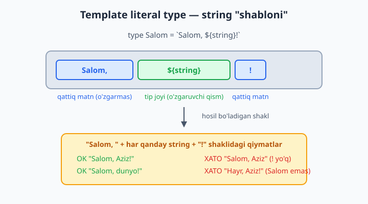
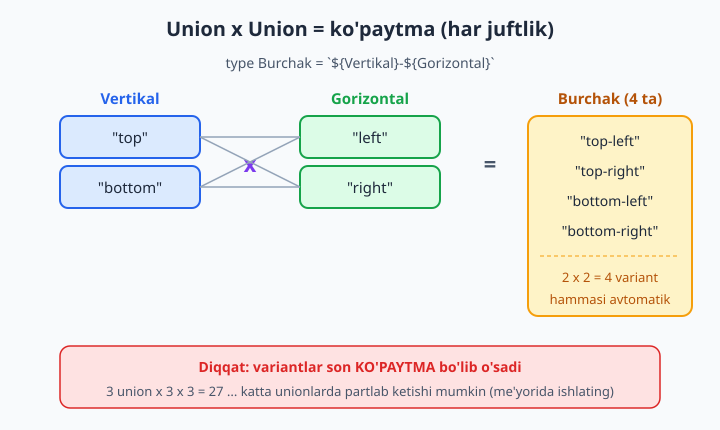
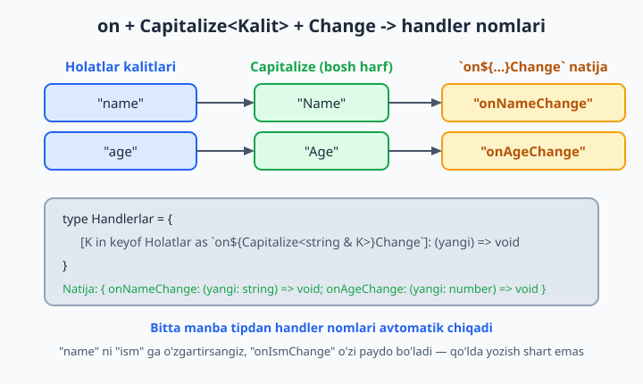

# 16 — Template literal types

[⬅️ Oldingi: 15 — Mapped va conditional types](./15-mapped-conditional.md) · [🏠 README](./README.md) · [Keyingi: 17 — Modullar va deklaratsiya fayllari (.d.ts) ➡️](./17-modullar-deklaratsiya.md)

> **Bu bobda:** ko'pincha bizga oddiy `string` emas, balki **aniq shakldagi** string kerak bo'ladi — masalan `"GET /api/users"`, `"onClick"`, `"16px"` yoki `"top-left"`. Bunday string'lar ixtiyoriy matn emas, ular qat'iy qolipga bo'ysunadi. **Template literal type** (string shabloni tipi) — JavaScript'dagi backtick string'larining tip darajasidagi ko'rinishi: qattiq matn qismlari va `${tip}` joylarini birlashtirib, aniq string shaklini ifodalaymiz. Bu bobda template literal type'ning anatomiyasini, union'lar bilan birlashganda qanday "ko'paytma" hosil bo'lishini, ichki (intrinsic) `Uppercase`/`Lowercase`/`Capitalize`/`Uncapitalize` utility'larini, mapped type bilan birga event nomlari va getter'lar yaratishni, hamda `infer` orqali route param'larni ajratib olishni real, tekshirilgan kod bilan ko'rib chiqamiz.

---

## Muammo

Tasavvur qiling, jamoada API endpoint'larini matn sifatida uzatadigan funksiya bor:

```ts
function sorov(endpoint: string): void {
  console.log("Yuborilmoqda:", endpoint);
}

sorov("GET /api/users");   // to'g'ri
sorov("get  /api/uzers");  // ❌ kichik harf, ikki bo'sh joy, "uzers" — lekin TS indamaydi
```

`endpoint: string` deganimizda TypeScript faqat "bu matn" deyishni biladi. `"GET /api/users"` ham, `"qwertyuiop"` ham, bo'sh string `""` ham bir xil — hammasi `string`. Aslida bizga kerak bo'lgan narsa: "bu string aynan `METOD /api/RESURS` shaklida bo'lsin". Ya'ni:

- boshida faqat `GET`, `POST` yoki `DELETE`;
- keyin `/api/`;
- oxirida faqat `users` yoki `posts`.

7-bobda **literal tip**ni o'rgangandik: `"GET"` — bu tip, faqat `"GET"` qiymatini qabul qiladi. Lekin har bir to'liq endpoint'ni qo'lda yozish (`"GET /api/users" | "GET /api/posts" | "POST /api/users" | ...`) zerikarli va xatoga moyil. Yangi resurs qo'shsangiz, hamma kombinatsiyani qaytadan yozasiz.

Mana shu yerda **template literal type** yordamga keladi: biz "qolip"ni bir marta yozamiz, TypeScript esa hamma mumkin bo'lgan string'larni o'zi hisoblab chiqadi.

```ts
type Metod = "GET" | "POST" | "DELETE";
type Resurs = "users" | "posts";
type Endpoint = `${Metod} /api/${Resurs}`;
// Endpoint = "GET /api/users" | "GET /api/posts" | "POST /api/users" | ...
```

## Template literal type — asoslar

Template literal type **JavaScript'dagi template string'ning aynan o'zi**, faqat qiymat darajasida emas, **tip darajasida** ishlaydi. Sintaksis bir xil: backtick (`) ichida qattiq matn va `${...}` joylar. Farqi shundaki, `${...}` ichiga **qiymat emas, tip** yoziladi.

```ts
type Salom = `Salom, ${string}!`;

const a: Salom = "Salom, Aziz!";   // ✅ qolipga mos
const b: Salom = "Salom, dunyo!";  // ✅ qolipga mos
```

O'qilishi: "`Salom, ` matni + ixtiyoriy string + `!` matni shaklidagi har qanday string". Qolipga mos kelmasa, kompilyator darrov ushlaydi:

```ts
const c: Salom = "Salom, Aziz";   // ❌ Xato: oxirida "!" yo'q
```

```text
error TS2322: Type '"Salom, Aziz"' is not assignable to type '`Salom, ${string}!`'.
```



📌 `${string}` — bu "shu joyda ixtiyoriy string bo'lsin" degani. Demak `Salom` tipi cheksiz ko'p qiymatni qamraydi (`"Salom, !"`, `"Salom, 12345!"` ham). Cheklash uchun `string` o'rniga **union literal** qo'yiladi — buni keyingi bo'limda ko'ramiz.

💡 Backtick (`) belgisi — bu ASCII tirnoq emas. Klaviaturada odatda `Esc` tugmasi ostida, `1` chap tomonida turadi. JavaScript template string'da nimani ishlatgan bo'lsangiz, tip yozishda ham aynan o'shani ishlatasiz.

### `${...}` ichiga qaysi tiplarni qo'yish mumkin

Template ichidagi joyga `string`'dan tashqari `number`, `boolean`, `bigint` va, eng muhimi, literal union ham qo'yiladi. TypeScript ularni avtomatik string'ga "aylantirib" qolipga qo'shadi:

```ts
type Piksel = `${number}px`;
const p1: Piksel = "16px";   // ✅
const p2: Piksel = "0px";    // ✅

type Bayroq = `flag-${boolean}`;
const f1: Bayroq = "flag-true";    // ✅
const f2: Bayroq = "flag-false";   // ✅
```

```ts
const p3: Piksel = "16em";   // ❌ Xato: "px" bilan tugamadi
```

```text
error TS2322: Type '"16em"' is not assignable to type '`${number}px`'.
```

📌 `${number}` — "shu joyda raqamga o'xshash string" degani: `"16px"`, `"0px"`, `"-5px"`, hatto `"3.14px"` ham mos keladi. Lekin `"abcpx"` mos kelmaydi — `abc` raqam emas. Bu CSS o'lchamlari, ID'lar, versiya raqamlari uchun juda qulay.

## Union bilan birlashganda — "ko'paytma" hosil bo'ladi

Template literal type'ning eng kuchli tomoni shu: `${...}` ichiga **union literal** qo'ysangiz, TypeScript **har bir variant uchun alohida string** yaratadi. Ikkita union qo'ysangiz — ularning **har bir juftligi** uchun.

```ts
type Vertikal = "top" | "bottom";
type Gorizontal = "left" | "right";

type Burchak = `${Vertikal}-${Gorizontal}`;
// Burchak = "top-left" | "top-right" | "bottom-left" | "bottom-right"

const b1: Burchak = "top-left";       // ✅
const b2: Burchak = "bottom-right";   // ✅
```

`Vertikal`da 2 ta variant, `Gorizontal`da 2 ta — natijada `2 x 2 = 4` ta aniq string. Bu xuddi matematik **ko'paytma** kabi ishlaydi: har bir `Vertikal` har bir `Gorizontal` bilan juftlanadi.



Qolipga mos kelmaydigan kombinatsiya darrov ushlanadi — va kompilyator xabarida hosil bo'lgan **to'liq union**ni ko'rasiz:

```ts
const bad: Burchak = "top-center";   // ❌ "center" Gorizontal'da yo'q
```

```text
error TS2322: Type '"top-center"' is not assignable to type
'"top-left" | "top-right" | "bottom-left" | "bottom-right"'.
```

💡 Diqqat: ko'paytma tez o'sadi. 3 ta union'ni birlashtirsangiz (`a x b x c`), variantlar soni ko'payadi: `3 x 3 x 3 = 27`. Juda katta union'lar bilan ehtiyot bo'ling — TypeScript bir tipda taxminan 100 000 dan ortiq variantni hisoblamaydi va xato beradi. Real loyihada bu chegaraga kamdan-kam yetasiz, lekin "har ehtimolga qarshi hamma narsani template'ga tiqaman" degan vasvasaga berilmang.

## Ichki string utility tiplari

TypeScript template literal type uchun **4 ta tayyor** (intrinsic — tilning ichiga qurib qo'yilgan) string o'zgartiruvchi tipni beradi. Ularni alohida import qilish shart emas, hamma joyda mavjud:

| Utility | Vazifasi | Misol |
|---|---|---|
| `Uppercase<S>` | hamma harfni KATTA | `Uppercase<"salom">` -> `"SALOM"` |
| `Lowercase<S>` | hamma harfni kichik | `Lowercase<"SALOM">` -> `"salom"` |
| `Capitalize<S>` | faqat birinchi harfni katta | `Capitalize<"salom">` -> `"Salom"` |
| `Uncapitalize<S>` | faqat birinchi harfni kichik | `Uncapitalize<"Salom">` -> `"salom"` |

```ts
type A = Uppercase<"salom">;          // "SALOM"
type B = Lowercase<"SALOM">;          // "salom"
type C = Capitalize<"salom">;         // "Salom"
type D = Uncapitalize<"Salom">;       // "salom"

const a: A = "SALOM";   // ✅
const c: C = "Salom";   // ✅
```

Bular union bilan ham ishlaydi — har bir variantga alohida qo'llanadi:

```ts
type Yonalish = "shimol" | "janub";
type KATTA = Uppercase<Yonalish>;   // "SHIMOL" | "JANUB"
```

📌 Bu utility'lar **tip darajasida** ishlaydi — runtime'da hech narsa bajarmaydi. Ya'ni `Uppercase<...>` kodga `.toUpperCase()` chaqiruvini qo'shmaydi. U faqat kompilyatorga string'ning shaklini tasvirlaydi. Runtime'da haqiqatan harf o'zgartirish kerak bo'lsa, JavaScript'dagi `.toUpperCase()` ni o'zingiz chaqirasiz.

### `Capitalize` + template — event nomlari

Eng ko'p uchraydigan amaliy qolip: maydon nomidan event handler nomini yasash. React'da `onClick`, `onChange`, `onSubmit` kabi nomlar shunday tug'iladi:

```ts
type Maydon = "name" | "email" | "age";
type EventNomi = `on${Capitalize<Maydon>}`;
// EventNomi = "onName" | "onEmail" | "onAge"

const e1: EventNomi = "onName";    // ✅
const e2: EventNomi = "onEmail";   // ✅
```

`Capitalize` bo'lmaganida `"onname"` hosil bo'lardi — ko'zga xunuk. `Capitalize<Maydon>` har bir variantning bosh harfini kattalashtiradi, keyin `on` prefiksi old tomonga ulanadi.

```ts
const e3: EventNomi = "onname";   // ❌ kichik "n" — "onName" kutilgan
```

```text
error TS2820: Type '"onname"' is not assignable to type
'"onName" | "onEmail" | "onAge"'. Did you mean '"onName"'?
```

💡 Kompilyator xabaridagi `Did you mean '"onName"'?` qismi — TypeScript sizga eng yaqin to'g'ri variantni taklif qilayotgani. Template literal type'lar tufayli muharrir (editor) ham aniq nomlarni avtomat to'ldiradi.

## Mapped type + template — obyekt kalitlarini qayta yozish

15-bobda **mapped type** (obyekt kalitlari bo'ylab aylanish) va `as` orqali kalitni qayta nomlashni ko'rgandik. Template literal type aynan shu `as` ichida ishlatilganda haqiqiy kuchini ko'rsatadi: bitta manba tipdan butun bir handler yoki getter to'plamini avtomatik yasaymiz.

```ts
type Holatlar = { name: string; age: number };

type Handlerlar = {
  [K in keyof Holatlar as `on${Capitalize<string & K>}Change`]: (yangi: Holatlar[K]) => void;
};
// Handlerlar = {
//   onNameChange: (yangi: string) => void;
//   onAgeChange: (yangi: number) => void;
// }

const h: Handlerlar = {
  onNameChange: (yangi) => console.log(yangi.toUpperCase()),  // yangi: string
  onAgeChange: (yangi) => console.log(yangi + 1),             // yangi: number
};
```

E'tibor bering: `onNameChange` ichida `yangi` avtomatik `string`, `onAgeChange` ichida esa `number` deb bilinadi — chunki tip har bir kalitning asl tipini (`Holatlar[K]`) saqlab qoldi.



📌 `string & K` nimaga kerak? `keyof` natijasi `string | number | symbol` bo'lishi mumkin, `Capitalize` esa faqat string bilan ishlaydi. `string & K` (intersection — 10-bobda ko'rgan) `K`ni "string qismi"ga toraytiradi, shunda `Capitalize` shikoyat qilmaydi. Bu mapped + template qolipida deyarli har doim yoziladigan standart hiyla.

### Getter va setter generatori

Bir manba tipdan getter va setter'larni birato'la yasash mumkin (mapped type'larni `&` bilan birlashtirib):

```ts
type Manba = { ism: string; yosh: number };

type Accessorlar =
  & { [K in keyof Manba as `get${Capitalize<string & K>}`]: () => Manba[K] }
  & { [K in keyof Manba as `set${Capitalize<string & K>}`]: (v: Manba[K]) => void };

const acc: Accessorlar = {
  getIsm: () => "Aziz",
  getYosh: () => 30,
  setIsm: (v) => console.log(v),    // v: string
  setYosh: (v) => console.log(v),   // v: number
};
```

Bitta `Manba`ga yangi maydon qo'shsangiz, getter va setter o'zi paydo bo'ladi — qo'lda bironta qator yozish shart emas. Mana shu template literal type'ning amaliy qiymati: **takrorni nolga tushiradi**.

## CSS xossalari — yana bir real misol

Template literal type CSS bilan ishlashda ham qo'l keladi. Masalan, faqat to'rt tomonning margin xossasini ifodalash:

```ts
type Yon = "top" | "bottom" | "left" | "right";
type MarginXossa = `margin-${Yon}`;
// "margin-top" | "margin-bottom" | "margin-left" | "margin-right"

const x: MarginXossa = "margin-top";   // ✅
```

```ts
const y: MarginXossa = "padding-top";   // ❌ "margin-" prefiksi shart
```

```text
error TS2322: Type '"padding-top"' is not assignable to type
'"margin-bottom" | "margin-left" | "margin-right" | "margin-top"'.
```

💡 Brauzerda ishlashda (19-bob) bunday tiplar `element.style.setProperty(...)` ga uzatiladigan xossa nomlarini xato yozishdan saqlaydi.

## Route param'larni ajratib olish (`infer` bilan)

Eng ilg'or qolip: template literal type'ni 15-bobdagi **conditional type** va `infer` (tip ichidan bo'lakni "tutib olish") bilan birlashtirsak, string'ni **qismlarga ajrata olamiz**. Klassik misol — `"/users/:id"` kabi route yo'lidan param nomlarini chiqarib, ulardan obyekt tipi yasash:

```ts
type Params<S extends string> =
  S extends `${string}:${infer P}/${infer Qolgan}`
    ? { [K in P | keyof Params<`/${Qolgan}`>]: string }
    : S extends `${string}:${infer P}`
      ? { [K in P]: string }
      : {};

type R1 = Params<"/users/:id">;
// { id: string }

type R2 = Params<"/users/:id/posts/:postId">;
// { id: string; postId: string }

const p1: R1 = { id: "42" };                  // ✅
const p2: R2 = { id: "42", postId: "7" };     // ✅
```

Bu qanday ishlaydi? Yo'lni qadama-qadam o'qiymiz:

1. `S extends `${string}:${infer P}/${infer Qolgan}`` — string ichida `:` bormi va undan keyin `/` bilan davom etadimi? Bo'lsa, `:` dan keyingi qismni `P` ga (masalan `id`), `/` dan keyingisini `Qolgan` ga olamiz.
2. `P` ni kalit qilamiz va `Qolgan` qismni **rekursiv** qayta tahlil qilamiz (`Params<`/${Qolgan}`>`) — shunday qilib bir nechta param yig'iladi.
3. Agar `/` qolmasa, lekin `:` bo'lsa — bu oxirgi param, uni kalit qilamiz.
4. Hech qaysi `:` topilmasa — param yo'q, bo'sh obyekt `{}`.

Param yetishmasa, kompilyator buni ham ushlaydi:

```ts
const p3: R1 = {};   // ❌ "id" majburiy
```

```text
error TS2741: Property 'id' is missing in type '{}' but required in type '{ id: string; }'.
```

📌 Bu qolip kuchli, lekin **murakkab** — har kuni yozadigan kod emas. Asosan kutubxona mualliflari (router, query builder) shunday tiplar yozadi, oddiy ilova kodida kamdan-kam kerak bo'ladi. Lekin kutubxona "sehrini" tushunish uchun bilib qo'ygan foydali.

## API endpoint tiplari — hammasini birlashtirib

Boshidagi muammoga qaytamiz. Endi endpoint string'larini qat'iy tiplay olamiz:

```ts
type Metod = "GET" | "POST" | "DELETE";
type Resurs = "users" | "posts";
type Endpoint = `${Metod} /api/${Resurs}`;

function sorov(endpoint: Endpoint): void {
  console.log("Yuborilmoqda:", endpoint);
}

sorov("GET /api/users");    // ✅
sorov("POST /api/posts");   // ✅
```

```ts
sorov("get /api/users");   // ❌ kichik harf "get"
```

```text
error TS2345: Argument of type '"get /api/users"' is not assignable to parameter of type
'"GET /api/users" | "GET /api/posts" | "POST /api/users" | "POST /api/posts" | "DELETE /api/users" | "DELETE /api/posts"'.
```

Endi `string` qabul qilganda yo'l qo'yilgan hamma xatolar — kichik harf, noto'g'ri resurs nomi, ortiqcha bo'sh joy — kompilyatsiya bosqichidayoq, kod ishga tushmasdan ushlanadi.

### `satisfies` bilan jadval tekshirish

13-bobda `satisfies` operatorini ko'rgandik. Uni template literal type bilan birga ishlatib, konfiguratsiya obyektidagi har bir qiymat to'g'ri shaklda ekanini tekshirish mumkin — qiymatlarning aniq tipini yo'qotmasdan:

```ts
const yollar = {
  bosh: "/",
  profil: "/profil",
  sozlamalar: "/sozlamalar",
} satisfies Record<string, `/${string}`>;
// har bir qiymat "/" bilan boshlanishi MAJBURIY,
// lekin yollar.bosh tipi hali ham aniq "/" bo'lib qoladi
```

💡 Agar biror qiymatni `"profil"` (boshida `/` yo'q) deb yozsangiz, `satisfies` shu yerdayoq xato beradi. Bu konfiguratsiya fayllarini "tip-xavfsiz" qilishning toza usuli.

## Qachon ishlatish, qachon ishlatmaslik

Template literal type — o'tkir asbob. To'g'ri joyda ajoyib, noto'g'ri joyda kodni o'qib bo'lmas qiladi.

✅ **Ishlating:** cheklangan, oldindan ma'lum string shakllari uchun — CSS xossalari, event nomlari, API endpoint'lar, ID prefikslari (`user_123`), i18n kalitlar.

✅ **Ishlating:** mapped type bilan birga, manba tipdan handler/getter to'plamini avtomatik yasashda — takrorni yo'qotadi.

❌ **Ishlatmang:** string ichidagi cheksiz xilma-xil matn uchun (foydalanuvchi kiritgan izoh, erkin matn) — bu yerda oddiy `string` to'g'riroq.

❌ **Ishlatmang:** ko'paytma juda katta bo'lib ketadigan joyda (4-5 ta katta union'ni birlashtirish). Murakkablik foydadan oshib ketadi.

📌 Oltin qoida: agar tip yozish kodni o'qishni osonlashtirsa va xatolarni oldindan ushlasa — ishlating. Agar tip o'zi jumboqqa aylanib, jamoadagi hech kim tushunmasa — soddaroq yo'l (oddiy union yoki hatto `string`) tanlang. Template literal type "ko'rsatish uchun" emas, **muammoni hal qilish** uchun.

---

## 16-bob mashqlari

Quyidagi mashqlarni alohida `.ts` faylda yozib, `tsc --noEmit --strict` bilan tekshiring. Qiyinlashib boradi — har bir mashq oldingisining ustiga quriladi.

1. `Salomlashuv` nomli template literal type yarating: `` `Assalomu alaykum, ${string}` `` shaklida. Unga mos va mos kelmaydigan ikkita qiymat yozib, kompilyator qaysi birini rad etishini ko'ring.

2. `Foydalanuvchi` ID'si uchun `` `user_${number}` `` tipini yarating. `"user_1"`, `"user_999"` o'tishini, `"user_abc"` o'tmasligini tasdiqlang.

3. `Hajm = "sm" | "md" | "lg"` union'idan `` `btn-${Hajm}` `` tipini yasang. Hosil bo'lgan uch variantni izohda yozing.

4. Faylga prefiks va suffiks qo'shing: `` `img-${string}.png` `` tipini yarating. `"img-logo.png"` o'tishini, `"logo.png"` (prefiks yo'q) va `"img-logo.jpg"` (suffiks boshqa) o'tmasligini tekshiring.

5. `Til = "uz" | "en"` va `Sahifa = "home" | "about"` union'laridan `` `${Til}/${Sahifa}` `` tipini yasang. Necha variant hosil bo'lishini avval o'zingiz hisoblang, keyin kompilyator xabaridan tekshiring.

6. `Uppercase` bilan: `Yonalish = "shimol" | "janub"` union'idan `Uppercase<Yonalish>` tipini yarating va natijani izohda yozing.

7. `Capitalize` bilan: `"login" | "logout"` union'idan `` `on${Capitalize<...>}` `` orqali `"onLogin" | "onLogout"` tipini yasang.

8. `Lowercase` va `Uncapitalize` farqini ko'rsating: `"HELLO"` ga ikkalasini ham qo'llab, natijalardagi farqni izohlang.

9. CSS uchun `` `padding-${"top" | "right" | "bottom" | "left"}` `` tipini yarating va to'rtta to'g'ri qiymatni sinab ko'ring.

10. `Holat = "active" | "disabled"` union'idan `` `is-${Holat}` `` va `` `not-${Holat}` `` tiplarini yasab, ularni `|` bilan bitta `Klass` tipiga birlashtiring.

11. `Resurs = "user" | "post" | "comment"` va `Amal = "create" | "delete"` union'laridan `` `${Amal}-${Resurs}` `` permission (ruxsat) tipini yarating. Necha ta ruxsat hosil bo'ldi?

12. Mapped type bilan: `{ id: number; title: string }` obyektidan har bir kalit uchun `` `get${Capitalize<...>}` `` getter'larni avtomatik yasovchi tip yozing (`string & K` hiylasini eslang).

13. 12-mashqni kengaytiring: getter'lar yonida `` `set${Capitalize<...>}` `` setter'larni ham qo'shing (ikki mapped type'ni `&` bilan birlashtiring).

14. `{ name: string; age: number; email: string }` dan `` `on${Capitalize<...>}Change` `` event handler'lar tipini yasang. Har bir handler argumenti asl maydon tipini saqlab qolishini tekshiring.

15. `Metod = "GET" | "POST"` va `Resurs = "users" | "orders"` dan `` `${Metod} /api/${Resurs}` `` Endpoint tipini yarating. Funksiya yozib, faqat to'g'ri endpoint'lar qabul qilinishini ko'rsating.

16. `satisfies` bilan: `Record<string, `#${string}`>` ga mos `ranglar` obyektini yarating (har bir qiymat `#` bilan boshlansin, masalan `"#ff0000"`). Boshida `#` yo'q qiymat yozib, xato chiqishini ko'ring.

17. Conditional type va `infer` bilan: `` `${infer Prefiks}_${string}` `` orqali `"user_42"` dan `"user"` prefiksini ajratib oluvchi `Prefiksni<S>` tipini yozing.

18. Route param: `Params<"/posts/:slug">` tipi `{ slug: string }` berishini ta'minlovchi conditional type yozing (bitta param uchun, rekursiyasiz).

19. 18-mashqni rekursiv qiling: `Params<"/users/:id/posts/:postId">` ikkala param'ni ham `{ id: string; postId: string }` ko'rinishida bersin. Bobdagi qolipdan foydalaning va to'g'ri ishlashini ikkita misol bilan tekshiring.

20. Hammasini birlashtiring: i18n uchun `` `${Til}.${Modul}.${Kalit}` `` shaklidagi tarjima kaliti tipini yarating (`Til = "uz" | "en"`, `Modul = "auth" | "profile"`, `Kalit = "title" | "submit"`). Necha variant hosil bo'lishini hisoblang, keyin `Capitalize` qo'shib har bir kalitdan event nomi (`` `on${Capitalize<Kalit>}` ``) yasab, ko'paytma qanchalik tez o'sishini his qiling — va qachon bu yondashuv "ortiqcha" bo'lishini o'z so'zlaringiz bilan izohlang.
