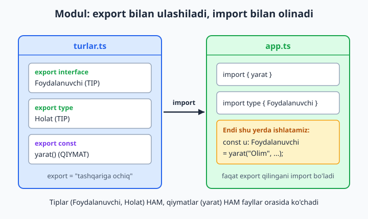
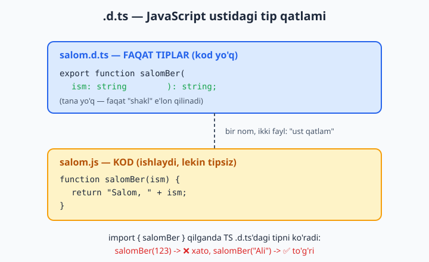
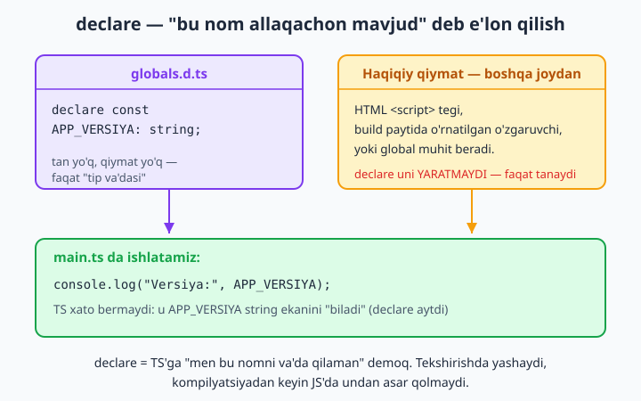

# 17 — Modullar va deklaratsiya fayllari (.d.ts)

[⬅️ Oldingi: 16 — Template literal types](./16-template-literal-types.md) · [🏠 README](./README.md) · [Keyingi: 18 — tsconfig.json chuqur ➡️](./18-tsconfig.md)

> **Bu bobda:** kodni fayllarga bo'lib, ular orasida tip ma'lumotini qanday ulashishni o'rganamiz. ES modullarda `export`/`import`, faqat tipni olib keladigan `import type`, qayta uzatuvchi `re-export`, eski CommonJS bilan moslik (interop)ni ko'rib chiqamiz. Keyin eng muhim mavzuga — deklaratsiya fayllari `.d.ts`'ga o'tamiz: ular tipsiz JavaScript kutubxonaga "tip ustki qatlami"ni qanday kiyintirishini, `declare` (ambient e'lon), `declare module`, va global augmentation (mavjud global tipni kengaytirish) nima ekanini, eski `namespace`ni qisqacha, `tsc --declaration` bilan o'z kutubxonangizga `.d.ts` hosil qilishni va triple-slash directiveni o'rganamiz.

---

## Muammo

Tasavvur qiling: loyihangiz kichik edi, hamma kod bitta `app.ts` faylda turardi. Endi u 2000 qatorga yetdi: foydalanuvchi tiplari, ma'lumotlar bazasi funksiyalari, validatsiya, API chaqiriqlari — barchasi bir faylda aralashib ketdi. Bironta narsani topish azob, jamoadagi ikki kishi bir faylni bir vaqtda tahrir qila olmaydi, va bitta xato butun faylni ishlamay qoldiradi.

Yechim aniq: kodni mantiqiy fayllarga bo'lish. Lekin shu yerda savol tug'iladi — agar `Foydalanuvchi` tipini bitta faylda yozsam, ikkinchi faylda undan qanday foydalanaman? JavaScript'da bu muammo `export`/`import` bilan hal qilingan edi (agar [JavaScript kitobi](../js/README.md)dagi modullar bobini eslamasangiz, qaytib ko'rib chiqing). TypeScript ham aynan shu mexanizmni ishlatadi, lekin bitta sehrli qo'shimcha bilan: **tiplar ham fayllar orasida ko'chadi**.

Va undan ham qiziq muammo: `npm install` qilgan kutubxonangiz toza JavaScript'da yozilgan, hech qanday tip bilmaydi. TypeScript uni qanday tekshiradi? Mana shu yerda `.d.ts` — deklaratsiya fayllari — sahnaga chiqadi. Boshlaymiz.

## export va import — modul asoslari

Har bir `.ts` fayl — alohida **modul** (modul — o'z `import`/`export`lari bor mustaqil fayl). Faylda biror narsa boshqa fayllarga ko'rinishi uchun uni `export` qilish kerak. Boshqa faylda esa `import` bilan olasiz.

Bitta `turlar.ts` fayl yozaylik — bu yerda tiplar va qiymatlarni ulashamiz:

```ts
// turlar.ts
export interface Foydalanuvchi {
  id: number;
  ism: string;
  email: string;
}

export type Holat = "faol" | "bloklangan";

export const STANDART_HOLAT: Holat = "faol";
```

Endi boshqa faylda ulardan foydalanamiz:

```ts
// xizmat.ts
import { Foydalanuvchi, Holat, STANDART_HOLAT } from "./turlar";

export function yarat(ism: string, email: string): Foydalanuvchi {
  return { id: Date.now(), ism, email };
}

export function holatBer(): Holat {
  return STANDART_HOLAT;
}
```

Diqqat qiling: bitta `import` qatorida biz **ham tiplarni** (`Foydalanuvchi`, `Holat`) **ham qiymatni** (`STANDART_HOLAT` — bu haqiqiy o'zgaruvchi) oldik. TypeScript'da tip va qiymat bir xil `import` orqali yonma-yon yura oladi.



📌 `import` yo'lida fayl kengaytmasini (`.ts`) yozmaymiz — `from "./turlar"` deb yozamiz, `from "./turlar.ts"` emas. `./` esa "shu papkada" degani; papkadan yuqoriga chiqish uchun `../` ishlatiladi.

💡 `export`ni har bir e'lon oldiga alohida yozasiz (`export interface`, `export function`, `export const`). Yoki fayl oxirida bir joyda yig'ib yozasiz: `export { yarat, holatBer };` — ikkalasi ham ishlaydi.

### default export

Bir modulda bitta "asosiy" narsa bo'lsa, uni `default` qilib eksport qilish mumkin. Importda jingalak qavs ishlatilmaydi va istalgan nom berasiz:

```ts
// logger.ts
export default function logla(xabar: string): void {
  console.log("[LOG]", xabar);
}
```

```ts
// use.ts
import logla from "./logger"; // jingalak qavssiz, nom o'zingizniki
logla("test");
```

📌 Amalda ko'pchilik jamoalar `default` export'ni kamroq ishlatadi va **nomli (named) export**ni afzal ko'radi — chunki nomli export'da nom bitta bo'ladi, IDE avtomatik to'ldirishi yaxshiroq, va re-export ham osonroq.

## import type — faqat tipni olib kelish

Yuqorida `Foydalanuvchi` interface'ini oddiy `import` bilan oldik. Lekin `Foydalanuvchi` — bu faqat tip, real qiymat emas: kompilyatsiyadan keyin JavaScript'da undan asar ham qolmaydi. Shuni TypeScript'ga aniq aytish uchun `import type` bor:

```ts
// xizmat.ts (yaxshilangan)
import type { Foydalanuvchi, Holat } from "./turlar";
import { STANDART_HOLAT } from "./turlar";

export function yarat(ism: string, email: string): Foydalanuvchi {
  return { id: Date.now(), ism, email };
}

export function holatBer(): Holat {
  return STANDART_HOLAT;
}
```

`import type` faqat tipni olib keladi va kompilyatsiyada **butunlay yo'qoladi** — natijaviy JavaScript'da bu `import` qatori umuman bo'lmaydi. `STANDART_HOLAT` esa real qiymat, shuning uchun u oddiy `import` bilan qoladi.

💡 Nega bu muhim? Ikki sabab: (1) niyatni aniq ko'rsatadi — "bu faqat tip"; (2) ba'zi build vositalari (bundler — fayllarni birlashtiruvchi dastur) faqat-tip importlarni bemalol o'chirib tashlay oladi, kod yengil bo'ladi. Zamonaviy loyihalarda `import type` odat tusiga kirgan.

📌 **Tuzoq:** `import type` bilan kelgan narsani qiymat sifatida ishlatib bo'lmaydi. Klassni `import type` qilsangiz, uni `new` qila olmaysiz:

```ts
// turlar.ts: export class Hisoblagich { son = 0; }
import type { Hisoblagich } from "./turlar";

const h = new Hisoblagich(); // ❌ Xato:
// 'Hisoblagich' cannot be used as a value because it was imported using 'import type'.
console.log(h.son);
```

Klassni `new` qilmoqchi bo'lsangiz, oddiy `import { Hisoblagich }` ishlating — chunki klass ham tip, ham qiymat.

### verbatimModuleSyntax — qat'iy rejim

Zamonaviy `tsconfig`larda ko'pincha `verbatimModuleSyntax: true` yoqiladi (18-bobda batafsil). U yoqilganda TypeScript tipni qiymat bilan bir importga aralashtirishga **ruxsat bermaydi** — tipni alohida `import type` bilan olishni majbur qiladi:

```ts
// verbatimModuleSyntax: true bo'lganda
import { Foydalanuvchi, yarat } from "./turlar"; // ❌ Xato:
// 'Foydalanuvchi' is a type and must be imported using a type-only import
// when 'verbatimModuleSyntax' is enabled.
```

✅ To'g'risi — tipni ajratib olish:

```ts
import type { Foydalanuvchi } from "./turlar";
import { yarat } from "./turlar";
```

💡 Bu g'ashlik emas, foyda: kod o'qiganda darrov "qaysi import real kod, qaysi biri faqat tip" ko'rinib turadi.

## re-export — tiplarni qayta uzatish

Katta loyihada har bir foydalanuvchi o'nlab kichik fayllardan to'g'ridan-to'g'ri import qilmasligi kerak. Buning o'rniga bitta "darvoza" fayl — odatda `index.ts` — yaratiladi, u boshqa fayllardan olib, hammasini birga qayta eksport qiladi. Bu **re-export** (barrel — bochka — fayl) deyiladi:

```ts
// index.ts — barrel fayl
export type { Foydalanuvchi, Holat } from "./turlar";
export { yarat, holatBer } from "./xizmat";
```

Endi tashqi kod faqat bitta joydan import qiladi:

```ts
// app.ts
import { yarat, holatBer } from "./index";
import type { Foydalanuvchi } from "./index";

const u: Foydalanuvchi = yarat("Olim", "olim@mail.uz");
console.log(u.ism, holatBer());
```

📌 `export type { ... } from` — bu tip uchun re-export. Tipni qayta uzatayotganingizni `export type` bilan belgilash `verbatimModuleSyntax` bilan ishlashda muhim.

Re-export paytida nomni o'zgartirish ham mumkin:

```ts
// index.ts
export { ichkiFunksiya as ommaviyFunksiya } from "./ichki";
```

Tashqaridan u endi `ommaviyFunksiya` deb ko'rinadi, ichki nom esa yashirin qoladi. Bu — public API (tashqi interfeys)ni ichki tuzilishdan ajratishning chiroyli usuli.

💡 Hamma narsani uzatish kerak bo'lsa: `export * from "./turlar";` — `turlar.ts`'dagi barcha export'lar avtomatik o'tadi.

## CommonJS bilan moslik (interop)

JavaScript dunyosida ikki xil modul tizimi bor: zamonaviy **ES modullar** (`import`/`export`) va eski **CommonJS** (`require()`/`module.exports`). Node.js yillar davomida CommonJS ishlatgan, shuning uchun ko'p eski paketlar `module.exports` bilan yozilgan. TypeScript ikkalasini ham tushunadi.

Eng asosiy holat — `esModuleInterop` (zamonaviy `tsconfig`larda standart yoqilgan, 2026 holatida uni o'chirish tavsiya etilmaydi). U yoqilganda CommonJS modulni xuddi ES modul kabi `default` import bilan olasiz:

```ts
// eski CommonJS paket .d.ts'da `export =` bilan e'lon qilingan bo'lsa
import eski from "./eski";
console.log(eski("salom"));
```

Agar `esModuleInterop`'ga ishonmasdan, har qanday holatda ishlaydigan eng aniq yo'lni xohlasangiz — `import = require` sintaksisi bor (TypeScript'ga xos):

```ts
import eski = require("./eski");
console.log(eski("salom"));
```

📌 `export =` va `import = require` — bu CommonJS uchun maxsus TypeScript sintaksisi. Yangi kodni ES modullarda yozing; bu eski formani faqat eski paketlar bilan ishlaganda uchratasiz.

## .d.ts — deklaratsiya fayllari

Endi bobning yuragiga keldik. Tasavvur qiling: do'stingiz toza JavaScript'da kichik kutubxona yozgan:

```ts
// salom.js — bu TOZA JavaScript, tip yo'q
function salomBer(ism) {
  return "Salom, " + ism + "!";
}
module.exports = { salomBer };
```

Siz uni TypeScript loyihangizda ishlatmoqchisiz. Lekin TypeScript `salomBer`ning `ism` qanday tip ekanini bilmaydi — `.js` faylda tip yo'q. Mana shu yerda **deklaratsiya fayli** kerak bo'ladi.

`.d.ts` (declaration — e'lon) fayli — bu **faqat tiplardan iborat**, hech qanday ishlaydigan kodi yo'q fayl. U JavaScript faylning yonida turadi va unga "tip ustki qatlami"ni kiyintiradi:

```ts
// salom.d.ts — faqat TIPLAR, kod yo'q
export function salomBer(ism: string): string;
```

Diqqat qiling: funksiyaning **tanasi yo'q** — faqat imzosi (signature — nom, parametr tiplari, qaytish tipi). Bu — va'da: "shu nomli funksiya bor, mana uning shakli".



Endi TypeScript faylingizda `salom`ni import qilsangiz, to'liq tip yordami olasiz:

```ts
// foydalanish.ts
import { salomBer } from "./salom";

const xabar: string = salomBer("Aziza"); // ✅ TS biladi: ism — string, javob — string
console.log(xabar);
```

Agar noto'g'ri tip bersangiz, TypeScript darrov xato beradi:

```ts
const x: number = salomBer(123); // ❌ ikki xato:
// 1) Argument of type 'number' is not assignable to parameter of type 'string'.
// 2) Type 'string' is not assignable to type 'number'.
```

📌 `.d.ts` fayli — bu "ko'prik": bir tomonda toza JS kod, ikkinchi tomonda TypeScript tip tekshiruvi. Ko'pchilik mashhur kutubxonalar (`lodash`, `express`) shunday ishlaydi — kod JS'da, tiplar alohida `.d.ts`'da (buni 21-bobda `@types` orqali ko'ramiz).

## declare — ambient e'lon

`.d.ts` fayllarining markazida bitta kalit so'z turadi: **`declare`**. U TypeScript'ga shunday deydi: "bu nom (o'zgaruvchi, funksiya, tip) **allaqachon mavjud** — uni men yaratmayman, faqat tipini aytaman". Bunday e'lon **ambient** (atrof-muhitda mavjud) deb ataladi.

Eng oddiy holat: brauzer sahifasida `<script>` tegi orqali kelgan global o'zgaruvchi. Masalan, build vositangiz `APP_VERSIYA` degan global o'zgaruvchini o'rnatadi. TypeScript bu o'zgaruvchini ko'rmaydi — chunki u kodda yo'q. Shu sababdan uni `declare` bilan e'lon qilasiz:

```ts
// globals.d.ts
declare const APP_VERSIYA: string;
```

Endi istalgan faylda undan foydalansangiz, xato bo'lmaydi:

```ts
// main.ts
console.log("Versiya:", APP_VERSIYA); // ✅ TS biladi: APP_VERSIYA — string
```



📌 `declare` hech narsa yaratmaydi — u faqat **va'da**. Agar real `APP_VERSIYA` boshqa joyda (script, build) o'rnatilmagan bo'lsa, kod ishga tushganda `ReferenceError` bo'ladi. `declare` — TypeScript'ga "menga ishon" deyish; ishonchni oqlash sizning zimmangizda.

💡 `declare`siz xuddi shu narsani yozsangiz, TypeScript "`Cannot find name 'APP_VERSIYA'`" deb shikoyat qiladi. `declare` aynan shu shikoyatni "men javobgarman" deb to'xtatadi.

## declare module — tipsiz paketga tip berish

`npm install` qilgan paket toza JS'da bo'lsa va `.d.ts` ham bermasa, TypeScript uni import qilganda yiqiladi:

```ts
import { format } from "nomalum-paket"; // ❌ Xato:
// Cannot find module 'nomalum-paket' or its corresponding type declarations.
```

Yechim — `declare module` bilan o'sha paketga o'zingiz qo'lda tip yozish. Buni loyihangizdagi biror `.d.ts` faylga qo'yasiz:

```ts
// globals.d.ts
declare module "yulduzcha-format" {
  export function format(matn: string): string;
  export const versiya: string;
}
```

Endi import ishlaydi va to'liq tip yordami beradi:

```ts
// main.ts
import { format } from "yulduzcha-format";
console.log(format("salom")); // ✅
```

📌 `declare module "nom" { ... }` ichida xuddi oddiy modul kabi `export` yozasiz — lekin tana yo'q, faqat imzolar. Bu "men bu modulning shakli mana shunday deb va'da beraman" demoq.

💡 Tezkor (lekin xavfli) yo'l: agar paketning tiplari sizga umuman muhim bo'lmasa, shunchaki `declare module "nomalum-paket";` (jingalak qavssiz) deb yozsangiz, butun modul `any` bo'ladi — import ishlaydi-yu, tip tekshiruvi yo'qoladi. Faqat zarur bo'lganda ishlating.

## Global augmentation — mavjud global tipni kengaytirish

Ba'zan mavjud global tipga **yangi xossa qo'shish** kerak bo'ladi. Klassik misol: brauzerda `window` obyektiga o'z ma'lumotingizni biriktirasiz (`window.mening_app = ...`), lekin TypeScript standart `Window` tipida bunday xossa yo'qligini biladi va xato beradi.

Yechim — `declare global` bloki ichida `Window` interface'ini **kengaytirish** (augmentation). Interface'lar bir-biriga qo'shilish (declaration merging) xususiyatiga ega (5-bobni eslang), shuning uchun siz qo'shgan xossa mavjud `Window`ga ulanadi:

```ts
// augment.ts
export {}; // bu qator faylni MODULGA aylantiradi (pastdagi izohga qarang)

declare global {
  interface Window {
    mening_app: {
      versiya: string;
      ishga_tushir(): void;
    };
  }
}

window.mening_app = {
  versiya: "1.0.0",
  ishga_tushir() {
    console.log("Ishga tushdi");
  },
};

console.log(window.mening_app.versiya); // ✅ endi TS biladi
```

📌 `export {};` qatori — bu yerda **majburiy hiyla**. Faylda hech qanday `import`/`export` bo'lmasa, TypeScript uni "skript" deb biladi va `declare global` ishlamaydi. Bo'sh `export {}` faylni modulga aylantiradi, shundan keyingina `declare global` to'g'ri ishlaydi. Faylingizda allaqachon biror `import` yoki `export` bo'lsa, bu qator kerak emas.

💡 Xuddi shunday yo'l bilan o'z **modulingiz**ni ham kengaytirish mumkin — buni **module augmentation** deyiladi. Boshqa faylda yozilgan interface'ga qo'shimcha xossa qo'shasiz:

```ts
// turlar.ts'da: export interface Sozlama { til: string; }

// qoshimcha.ts
import { Sozlama } from "./turlar";

declare module "./turlar" {
  interface Sozlama {
    tema: string; // mavjud Sozlama'ga yangi xossa qo'shamiz
  }
}

const s: Sozlama = { til: "uz", tema: "tungi" }; // ✅ endi ikkala xossa kerak
```

Bu naqsh pluginlarni kengaytirishda juda ko'p uchraydi (masalan Express'ning `Request` obyektiga `user` qo'shish).

## namespace — eski uslub (qisqacha)

ES modullardan oldin TypeScript kodni guruhlash uchun `namespace` (oldingi nomi `module`) ishlatardi. U bitta nom ostida tiplar va funksiyalarni jamlaydi:

```ts
namespace Geometriya {
  export interface Nuqta {
    x: number;
    y: number;
  }
  export function masofa(a: Nuqta, b: Nuqta): number {
    return Math.hypot(b.x - a.x, b.y - a.y);
  }
}

const p1: Geometriya.Nuqta = { x: 0, y: 0 };
const p2: Geometriya.Nuqta = { x: 3, y: 4 };
console.log(Geometriya.masofa(p1, p2)); // 5
```

📌 **2026 maslahati:** yangi kodda `namespace` ishlatmang — uning o'rnini ES modullar (`export`/`import`) to'liq egallagan. `namespace`ni faqat eski kodlarda yoki ba'zi global `.d.ts` fayllarda (masalan, butun bir kutubxonani bitta global nom ostida e'lon qilishda) uchratasiz. Bilib qo'yish foydali, lekin tanlov modullar tarafida.

## tsc --declaration — o'z .d.ts'ingizni hosil qilish

Yuqorida `.d.ts`'ni qo'lda yozdik. Lekin siz **TypeScript'da** kutubxona yozayotgan bo'lsangiz va uni boshqalar (jumladan JS foydalanuvchilar) ishlatishini xohlasangiz, `.d.ts`'ni qo'lda yozish shart emas — TypeScript uni avtomatik hosil qiladi.

Kichik kutubxona yozaylik:

```ts
// matematika.ts
export function qoshish(a: number, b: number): number {
  return a + b;
}

export interface Nuqta {
  x: number;
  y: number;
}

export const PI = 3.14159;
```

Endi `--declaration` bayrog'i bilan kompilyatsiya qilamiz:

```bash
tsc --declaration --module es2020 --outDir dist matematika.ts
```

`dist` papkasida ikki fayl paydo bo'ladi: `matematika.js` (ishlaydigan kod) va `matematika.d.ts` (tiplar). Hosil bo'lgan `.d.ts` shunday ko'rinadi:

```text
export declare function qoshish(a: number, b: number): number;
export interface Nuqta {
    x: number;
    y: number;
}
export declare const PI = 3.14159;
```

Ko'ryapsizmi — TypeScript tana (`return a + b`)ni olib tashlab, faqat imzolarni qoldirdi va `declare` qo'shdi. Endi sizning kutubxonangizni ishlatgan har kim to'liq tip yordami oladi, hatto u JavaScript'da yozsa ham.

📌 Amalda buni `tsconfig.json`da bir marta yoqib qo'yasiz (18-bobda batafsil):

```json
{
  "compilerOptions": {
    "declaration": true,
    "outDir": "dist"
  }
}
```

💡 `"declarationMap": true` qo'shsangiz, `.d.ts.map` fayllari ham hosil bo'ladi — ular foydalanuvchining IDE'sida "tip ta'rifiga o'tish" bosilganda to'g'ridan-to'g'ri sizning asl `.ts` manbangizga olib boradi.

## Triple-slash directive (qisqacha)

Ba'zan eski `.d.ts` fayllarning boshida shunday qatorni ko'rasiz:

```ts
/// <reference types="node" />
```

Bu — **triple-slash directive** (uch qiyalik chiziqli ko'rsatma). U "bu fayl `node` tiplariga bog'liq" deb TypeScript'ga aytadi. Eski uslubda fayllar orasidagi bog'liqlikni shu tarzda ko'rsatishgan.

📌 **2026 holati:** yangi kodda buning deyarli keragi yo'q — `tsconfig.json`dagi `types` va `import` mexanizmi uni almashtirgan. Uni faqat ayrim global `.d.ts` fayllarda (masalan `@types/node` ichida) uchratasiz. Ko'rsangiz tanish bo'lsin — yangi yozayotganda esa `import` yoki `tsconfig` ishlating.

## Qisqa xulosa

- Har `.ts` fayl — alohida **modul**; tashqariga ko'rinishi uchun `export`, olish uchun `import`.
- **`import type`** faqat tipni olib keladi va kompilyatsiyada yo'qoladi; `verbatimModuleSyntax` uni majbur qiladi. Tip va qiymat fayllar orasida birga ko'chadi.
- **Re-export** (`export ... from`, barrel `index.ts`) ko'p faylni bitta darvoza ortiga yashiradi va public API yasaydi.
- **CommonJS interop**: `esModuleInterop` zamonaviy standart; eng aniq yo'l — `import = require` va `export =`.
- **`.d.ts`** — faqat tiplardan iborat fayl: tipsiz JS kodga "tip ustki qatlami" kiyintiradi (kod yo'q, faqat imzolar).
- **`declare`** — "bu nom allaqachon mavjud" degan ambient va'da; `declare module` tipsiz paketga tip beradi.
- **Global augmentation** (`declare global` + `export {}`) mavjud global tipni (masalan `Window`) kengaytiradi; module augmentation o'z modulingizni kengaytiradi.
- **`namespace`** — eski uslub; yangi kodda modullarni afzal ko'ring.
- **`tsc --declaration`** o'z kutubxonangizdan avtomatik `.d.ts` hosil qiladi.

Keyingi bobda `tsconfig.json`ni chuqur o'rganamiz — bu bobda ishlatgan `strict`, `module`, `declaration`, `verbatimModuleSyntax` kabi sozlamalar aynan o'sha yerda yashaydi.

## 17-bob mashqlari

Quyidagi mashqlarni o'zingiz yozib, har birini alohida papkada `tsc --noEmit --strict` (kerak bo'lganda `--module es2020`) bilan tekshirib ko'ring. Yechimlarni o'zingiz qiling.

1. `geometriya.ts` faylida `Nuqta` interface (`x`, `y`) va `masofa()` funksiyasini `export` qiling. Boshqa `app.ts` faylda ikkalasini `import` qilib ishlating.

2. 1-mashqdagi `masofa`ni faqat `export function` oldiga `export` yozib emas, balki fayl oxirida bitta `export { masofa };` qatori bilan eksport qiling. Natija bir xil ekanini ko'ring.

3. `logger.ts`da `default export` funksiyasi yozing. Uni `app.ts`da o'zingiz tanlagan boshqa nom bilan (jingalak qavssiz) import qiling.

4. Bitta faylda ham `default`, ham nomli (named) export yozing. Importda ikkalasini bitta `import` qatorida oling: `import asosiy, { boshqa } from "./fayl";`.

5. `turlar.ts`da `Mahsulot` interface'ini `export` qiling. Uni boshqa faylda `import type` bilan oling va shu tipdagi obyekt yarating.

6. 5-mashqda `Mahsulot`ni `import type` bilan olganingiz holda, agar `Mahsulot` aslida klass bo'lsa, uni `new` qilishga urinib ko'ring. Qanday xato chiqadi? Sababini izohlang.

7. Tip va qiymatni bitta faylda eksport qiling (`type Holat` va `const STANDART`). Boshqa faylda tipni `import type`, qiymatni oddiy `import` bilan alohida qatorlarda oling.

8. `index.ts` (barrel) fayl yozing: u ikki boshqa fayldan funksiyalarni `export ... from` bilan re-export qilsin. `app.ts` faqat `index.ts`dan import qilsin.

9. 8-mashqdagi re-export'da funksiyalardan birini `as` bilan boshqa nomga o'zgartirib uzating. Tashqi kodda yangi nom ishlashini tasdiqlang.

10. Bitta faylda 3 ta narsa eksport qiling, ikkinchi faylda `export * from "./fayl";` bilan hammasini bir yo'la re-export qiling. Uchinchi fayl ulardan foydalansin.

11. `salom.js` (toza JS) faylini yozing va yoniga `salom.d.ts` yozib, undagi funksiyaga tip bering. TS faylda import qilib, noto'g'ri argument berib xato chiqaring.

12. `.d.ts` faylda funksiya tanasini (`{ ... }` ichida kod) yozishga urinib ko'ring. TypeScript bunga ruxsat beradimi? Natijani izohlang.

13. `declare const REJIM: string;` ambient o'zgaruvchini bir `.d.ts` faylda e'lon qiling. Boshqa faylda `declare`siz unga noto'g'ri tip (`number`) bering va xatoni ko'ring.

14. `declare` bilan global funksiya e'lon qiling: `declare function trek(hodisa: string): void;`. Uni biror faylda chaqirib, TS shikoyat qilmasligini ko'ring.

15. `declare module "rang-aralash" { export function aralash(a: string, b: string): string; }` yozing. Shu nomli paketni import qilib ishlating.

16. Tipsiz paketni `import` qilib, avval `declare module`siz xatoni ko'ring (`Cannot find module`), keyin `declare module` qo'shib xato yo'qolishini ko'ring.

17. `declare global` bloki ichida `Window` interface'iga `mening_sozlamam: { til: string }` xossasini qo'shing. Faylga `export {};` qo'yib, `window.mening_sozlamam`ni ishlating.

18. 17-mashqdan `export {};` qatorini olib tashlang. `declare global` endi ishlaydimi? Qanday xato yoki o'zgarish bo'ladi? Izohlang.

19. `turlar.ts`da `Foydalanuvchi` interface yozing. Boshqa faylda `declare module "./turlar"` (module augmentation) bilan unga yangi xossa qo'shing va to'liq obyekt yarating.

20. Kichik kutubxona (`asboblar.ts`) yozing: 1 ta funksiya, 1 ta interface, 1 ta const eksport qiling. Uni `tsc --declaration --outDir dist` bilan kompilyatsiya qilib, hosil bo'lgan `dist/asboblar.d.ts` faylini ochib ko'ring va asl `.ts` bilan solishtiring (tana yo'qolib, `declare` qo'shilganini payqang).
