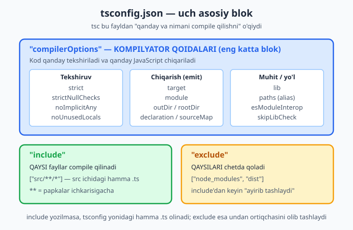
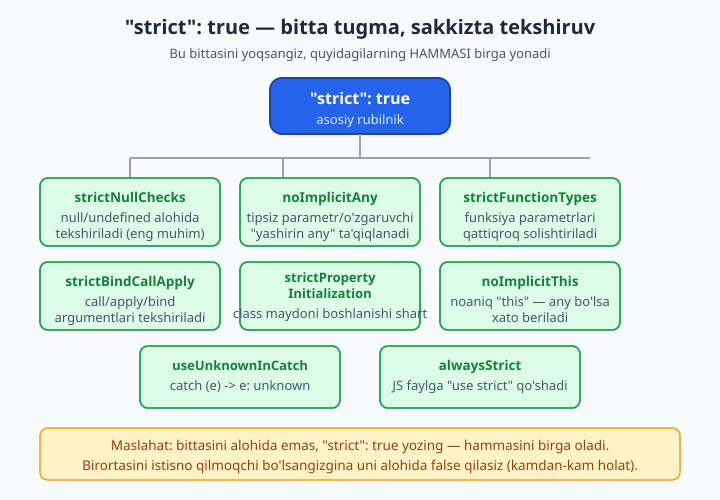
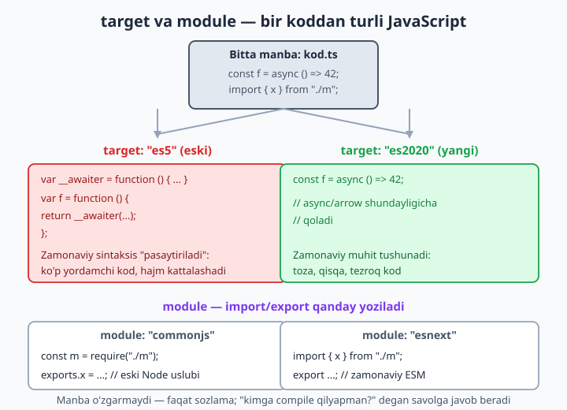

# 18 — tsconfig.json chuqur

[⬅️ Oldingi: 17 — Modullar va deklaratsiya fayllari (.d.ts)](./17-modullar-deklaratsiya.md) · [🏠 README](./README.md) · [Keyingi: 19 — DOM va brauzer TypeScript bilan ➡️](./19-dom-brauzer.md)

> **Bu bobda:** kompilyatorning xulqini boshqaradigan `tsconfig.json` faylini ichidan o'rganamiz. Uning uch asosiy bloki (`compilerOptions`, `include`, `exclude`), eng muhim flaglar (`strict` va u yoqadigan butun oila, `target`, `module`, `lib`, `outDir`/`rootDir`, `esModuleInterop`, `skipLibCheck`, `paths` alias, `sourceMap`, `declaration`, `noEmit`), nega aynan `strictNullChecks` "o'yin o'zgartiruvchi" ekanini ko'ramiz; oxirida har loyiha turi (Node, brauzer, kutubxona) uchun tavsiya etilgan boshlang'ich konfiguratsiya beramiz.

---

## Muammo

2-bobda biz `npx tsc --init` bilan `tsconfig.json` yaratgan, ichidan bir nechta sozlamani ajratib olib ishlatgan edik. O'shandan beri 15 bob davomida tiplarni o'rgandik — lekin har doim bir savol ortda turardi: "TypeScript bu kodni xato deb belgilashi yoki belgilamasligini aslida kim hal qiladi?"

Javob — `tsconfig.json`. Bitta sozlamani o'zgartirsangiz, **bir xil kod** bir loyihada toza compile bo'ladi, boshqasida xato beradi. Mana real misol:

```ts
function birinchiHarf(matn: string | null): string {
  return matn[0];
}
```

Bu kod xatomi? **Bog'liq.** Agar `strictNullChecks` yoqilgan bo'lsa — ha, chunki `matn` `null` bo'lishi mumkin, `null[0]` esa dasturni "yiqitadi". Agar o'sha flag o'chiq bo'lsa — TypeScript bu kodni jimgina o'tkazib yuboradi va xato faqat foydalanuvchi `null` bergan paytda, dastur ishlab turganda chiqadi.

Demak `tsconfig.json` — shunchaki "yo'l-yo'riq fayl" emas: u sizning loyihangiz qanchalik xavfsiz ekanini belgilaydi. Bu bobda har bir muhim "rubilnik"ni — nima qilishini, nega kerakligini va qachon o'zgartirishni — birma-bir ko'rib chiqamiz. Avval umumiy tuzilishdan boshlaymiz.

## tsconfig.json uch blokdan iborat

Loyiha ildizidagi `tsconfig.json` — bu oddiy JSON fayl. Uning yuragida uchta narsa turadi:

```json
{
  "compilerOptions": {
    "target": "es2022",
    "strict": true,
    "outDir": "./dist",
    "rootDir": "./src"
  },
  "include": ["src/**/*"],
  "exclude": ["node_modules", "dist"]
}
```

Uchta blokning vazifasi sodda:

- **`compilerOptions`** — eng katta va eng muhim blok. Kod **qanday tekshirilishi** (`strict`...) va **qanday JavaScript chiqishi** (`target`, `module`, `outDir`...) shu yerda belgilanadi. Bob qolganining ko'p qismi shu blok haqida.
- **`include`** — **qaysi** fayllar compile qilinadi. `["src/**/*"]` — `src` papkasi ichidagi (ichkaridagi papkalar bilan birga) hamma `.ts` fayl. `**` belgisi "papkalar ichkarisigacha kir" degani.
- **`exclude`** — `include` tanlaganidan **nimani olib tashlash**. Odatda `node_modules` (boshqalarning kodi) va `dist` (compile natijasi) bu yerda turadi.



📌 `include` yozmasangiz nima bo'ladi? TypeScript `tsconfig.json` turgan papkadan boshlab **hamma** `.ts` faylni oladi — `node_modules` ichidagisini ham. Aynan shuning uchun `exclude`da `node_modules` deyarli doim turadi. Lekin `include`ni aniq yozish (`["src/**/*"]`) eng tartibli yo'l: kompilyator faqat sizning kodingiz bilan ishlaydi, tezroq bo'ladi va kutilmagan fayllar tekshiruvga tushmaydi.

💡 `compilerOptions`dan tashqari yana ikki "umumiy" sozlama bor: `files` (faqat sanab o'tilgan aniq fayllar — kichik loyihada) va `extends` (boshqa tsconfig'dan meros olish — masalan `"extends": "@tsconfig/node22/tsconfig.json"`). Katta loyihalarda `extends` orqali tayyor, sinalgan asosni olib, ustiga o'zingiznikini qo'shasiz.

## `strict` — eng muhim bitta flag

`tsconfig.json`da yozadigan birinchi va eng muhim qatoringiz shu:

```json
{
  "compilerOptions": {
    "strict": true
  }
}
```

`strict` — bu **bitta** sozlama emas, balki butun bir **oila**ning umumiy rubilnigi. Uni `true` qilsangiz, quyidagilarning hammasi birvarakayiga yonadi:

- `noImplicitAny` — tipi yozilmagan, TypeScript ham topa olmaydigan o'zgaruvchi/parametr `any` bo'lib qolishini ta'qiqlaydi (9-bobdagi "yashirin `any`").
- `strictNullChecks` — `null` va `undefined`ni alohida, jiddiy tip sifatida ko'radi (pastda batafsil).
- `strictFunctionTypes` — funksiya tiplarini bir-biriga berishda parametrlarni qattiqroq solishtiradi.
- `strictBindCallApply` — `bind`, `call`, `apply` argumentlarini tekshiradi.
- `strictPropertyInitialization` — class maydonlari konstruktor ichida boshlanishini talab qiladi (13-bob).
- `noImplicitThis` — `this`ning tipi noaniq (`any`) bo'lib qolsa, xato beradi.
- `useUnknownInCatchVariables` — `catch (e)` dagi `e`ni `any` emas, `unknown` qiladi (9-bob — xavfsizroq).
- `alwaysStrict` — chiqarilgan `.js` faylga `"use strict"` qo'shadi.



📌 Nega bittalab emas, hammasini birga? Chunki bu sakkiztasi birgalikda "TypeScript kuchi"ni tashkil qiladi. Bittasini o'chirib qo'yish — devordan bitta g'isht olib tashlashga o'xshaydi: tirqish paydo bo'ladi va aynan o'sha tirqishdan xato o'tib ketadi. Shuning uchun zamonaviy maslahat oddiy: **doim `"strict": true`**.

💡 Eski loyihada birdan `strict` yoqsangiz yuzlab xato chiqishi mumkin — bu 23-bobdagi migratsiya mavzusi. Yangi loyihada esa boshidanoq yoqing: keyin qo'shilgan har bir qator allaqachon "to'g'ri" yoziladi.

Endi `strict` ichidagi ikki eng muhim a'zoni — `noImplicitAny` va `strictNullChecks`ni — alohida, kod bilan ko'ramiz.

## `noImplicitAny` — tipsiz parametrga yo'l yo'q

Quyidagi funksiyada `son` parametrining tipi yozilmagan, TypeScript uni hech qayerdan topa olmaydi:

```ts
function ikkilantir(son) {     // ❌ Xato: son uchun tip yo'q
  return son * 2;
}
console.log(ikkilantir(21));
```

`strict` (demak `noImplicitAny` ham) yoqilgan bo'lsa:

```text
error TS7006: Parameter 'son' implicitly has an 'any' type.
```

Tarjimasi: "`son` parametri yashirincha `any` tipiga ega bo'lib qoldi". TypeScript shunday deydi: "men `son` nimaligini bilmayman, sen ham aytmading — bu `any`, lekin men `any`ni jimgina qabul qilmayman". Tuzatish — tipni ochiq yozish:

```ts
function ikkilantir(son: number): number {   // ✅ endi toza
  return son * 2;
}
console.log(ikkilantir(21));
```

📌 Diqqat: bu faqat TypeScript **o'zi topa olmaydigan** joylarga tegishli. `const ismlar = ["Ali", "Vali"]` da tipni yozmasangiz ham xato bo'lmaydi — chunki TypeScript uni qiymatdan o'qib `string[]` deb biladi (3-bobdagi inference). `noImplicitAny` faqat "haqiqatan ham noaniq" qolgan joylarni ushlaydi.

## `strictNullChecks` — nega o'yin o'zgartiruvchi

Bu — `strict` oilasidagi **eng muhim** flag. U yoqilmagan bo'lsa, TypeScript `null` va `undefined`ni deyarli har qanday tipga "yashirincha kiritib yuboradi" — ya'ni `string` deb e'lon qilingan o'zgaruvchiga `null` ham sig'averadi. Bu esa JavaScript'ning eng mashhur xatosiga ("Cannot read property of null") yo'l ochadi.

`strictNullChecks` yoqilgan bo'lsa, hamma narsa o'zgaradi. Bobning boshidagi muammoga qaytamiz:

```ts
function birinchiHarf(matn: string | null): string {
  return matn[0];     // ❌ Xato: matn null bo'lishi mumkin
}
```

```text
error TS18047: 'matn' is possibly 'null'.
```

TypeScript aytadi: "`matn` `null` bo'lishi mumkin — `null[0]` esa dasturni yiqitadi". Bu — bebaho ogohlantirish: xato foydalanuvchigacha **emas**, hali yozayotganingizda topildi. Tuzatish — 8-bobdagi narrowing bilan `null`ni ajratib olish:

```ts
function birinchiHarf(matn: string | null): string {
  if (matn === null) {
    return "(bo'sh)";       // null holatini alohida hal qildik
  }
  return matn[0];           // ✅ bu yerda matn aniq string
}
console.log(birinchiHarf("Toshkent"));
console.log(birinchiHarf(null));
```

Optional property bilan ham xuddi shu himoya ishlaydi:

```ts
interface Foydalanuvchi {
  id: number;
  ism: string;
  telefon?: string;     // bo'lishi shart emas -> string | undefined
}

function telefonKorsat(u: Foydalanuvchi): string {
  if (u.telefon === undefined) {
    return u.ism + ": telefon yo'q";
  }
  return u.ism + ": " + u.telefon;   // ✅ bu yerda telefon aniq string
}

const a: Foydalanuvchi = { id: 1, ism: "Aziz" };
const b: Foydalanuvchi = { id: 2, ism: "Malika", telefon: "+998901234567" };
console.log(telefonKorsat(a));
console.log(telefonKorsat(b));
```

📌 Nega aynan "o'yin o'zgartiruvchi"? Chunki JavaScript dasturlarining juda katta qismi `null`/`undefined` bilan bog'liq xatolarda "yiqiladi". `strictNullChecks` butun bu sinf xatolarni compile vaqtida ushlab beradi. TypeScript yozishning eng katta sababi aynan shu — uni o'chirib qo'ysangiz, asbobning yarmini tashlab yuborgan bo'lasiz.

💡 Yana bir keng tarqalgan flag bor (lekin `strict` ichida emas, alohida yoqiladi): `noUncheckedIndexedAccess`. U `ismlar[0]` natijasini `string` emas, `string | undefined` qiladi — chunki massivda bunday indeks bo'lmasligi ham mumkin. Juda foydali, ammo qattiq; uni keyinroq, qulay bo'lganda qo'shasiz.

## `strictFunctionTypes` — funksiyalarni qattiqroq solishtirish

Bu flag ham `strict` ichida. U funksiya tipini boshqa funksiya tipiga berganda parametrlarni qattiq tekshiradi:

```ts
type Tekshiruvchi = (x: string | number) => boolean;

const faqatString = (x: string): boolean => x.length > 0;

const t: Tekshiruvchi = faqatString;   // ❌ Xato
```

```text
error TS2322: Type '(x: string) => boolean' is not assignable to type 'Tekshiruvchi'.
  Types of parameters 'x' and 'x' are incompatible.
    Type 'string | number' is not assignable to type 'string'.
```

Mantiq: `Tekshiruvchi` o'rniga turadigan funksiya `string` **ham**, `number` **ham** qabul qila olishi kerak. `faqatString` esa faqat `string` oladi — agar kimdir unga `number` bersa, `x.length` qatorida yiqiladi. Shuning uchun TypeScript bu almashishni rad etadi. Flag o'chiq bo'lsa, bu xavfli kod jimgina o'tib ketardi.

## `target` — qaysi JavaScript versiyasiga compile qilamiz

`target` TypeScript'ga "men kodni qanchalik zamonaviy JavaScript muhitida ishlataman?" deb aytadi. Misol kodimiz:

```ts
const f = async (): Promise<number> => 42;
class Hayvon {
  constructor(public nom: string) {}
}
```

`target: "es2020"` bo'lsa, chiqqan `.js` deyarli o'zgarmaydi — `async`, arrow funksiya va `class` shundayligicha qoladi, chunki zamonaviy muhit ularni allaqachon tushunadi:

```text
const f = async () => 42;
class Hayvon { ... }
```

`target: "es5"` bo'lsa (juda eski brauzerlar uchun), TypeScript bu zamonaviy sintaksisni **pasaytiradi** ("downlevel"): `class`ni oddiy `function`ga, `async`ni esa katta `__awaiter` yordamchi blokiga aylantiradi. Natijada kod ko'p, og'ir va o'qish qiyin bo'ladi.



📌 **2026 holati:** TypeScript 6.x da `target: "es5"` **eskirgan** (deprecated) deb belgilangan va kelajakda olib tashlanadi. Zamonaviy maslahat — kamida `es2020`, ko'pincha `es2022` tanlash. Hozir brauzerlar ham, Node.js ham zamonaviy JavaScript'ni to'liq tushunadi, demak eski `es5`ga "pasaytirish"ning hojati yo'q — u faqat kodni shishiradi.

💡 `target` `lib` bilan ham bog'liq: `target`ni o'zgartirsangiz, mos keladigan standart tiplar to'plami (`lib`) ham o'zgaradi. Masalan `target: "es2015"` da `String.prototype.replaceAll` (u keyinroq qo'shilgan) mavjud emas deb hisoblanadi va uni ishlatsangiz xato chiqadi. Buni keyinroq `lib` bo'limida ko'ramiz.

## `module` — import/export qanday yoziladi

`module` chiqqan JavaScript'da modullar **qaysi uslubda** yozilishini belgilaydi. Manba kodingiz o'zgarmaydi — faqat natija. Bitta `import { x } from "./m"` qatori:

`module: "commonjs"` da (eski, an'anaviy Node uslubi):

```text
const m_1 = require("./m");
```

`module: "esnext"` da (zamonaviy ESM — ECMAScript Modules):

```text
import { x } from "./m";
```

📌 Qaysi birini tanlash kerak? Bu loyiha **turi**ga bog'liq:
- Zamonaviy Node.js loyihasi uchun — `"nodenext"` (Node'ning o'zi qaysi uslubni kutishini avtomatik hal qiladi).
- Brauzer/bundler (Vite, esbuild, webpack) bilan ishlovchi loyiha uchun — `"esnext"`.
- Eski Node yoki maxsus muhit uchun — `"commonjs"`.

💡 `module` bilan birga ko'pincha `moduleResolution` ham sozlanadi — u TypeScript `import "./m"` da faylni qanday qidirishini belgilaydi. Zamonaviy qiymatlar: bundler ishlatsangiz `"bundler"`, Node loyihasida `"nodenext"`. Ikkalasi mos kelishi kerak: `"module": "nodenext"` bilan `"moduleResolution": "nodenext"` birga yuradi.

## `outDir` va `rootDir` — fayllar qayerga tushadi

Bu juftlik papka tuzilishini tartibga soladi:

- `rootDir` — manba `.ts` fayllaringiz **qayerda** (`"./src"`).
- `outDir` — compile qilingan `.js` fayllar **qayerga** tushishi (`"./dist"`).

```json
{
  "compilerOptions": {
    "rootDir": "./src",
    "outDir": "./dist"
  }
}
```

`src/index.ts` → compile → `dist/index.js`. Manba va natija aralashmaydi: `src`da faqat siz yozgan `.ts`, `dist`da esa faqat mashina chiqargan `.js`. `dist` papkasini odatda Git'ga qo'shmaydilar (`.gitignore`ga yoziladi) — chunki uni istalgan vaqtda qaytadan yaratsa bo'ladi.

📌 `rootDir` yozmasangiz, TypeScript uni manba fayllaringiz orasidan o'zi taxmin qiladi. Lekin uni aniq yozish xavfsizroq: aks holda noto'g'ri faylni tasodifan qo'shsangiz, butun chiqish tuzilishi siljib ketishi mumkin.

## `lib` — qaysi tiplar "mavjud" deb hisoblanadi

`lib` — TypeScript'ga "qaysi tayyor tiplar (standart kutubxonalar) mavjud?" deb aytadi. Masalan, `document` yoki `window` (brauzer narsalari) tiplari `"dom"` kutubxonasida; `Promise`, `Map` esa `"es2015"`da.

```json
{
  "compilerOptions": {
    "target": "es2022",
    "lib": ["es2022", "dom", "dom.iterable"]
  }
}
```

📌 Odatda `lib`ni alohida yozmaysiz — TypeScript uni `target`dan kelib chiqib o'zi tanlaydi (`target: "es2022"` → `es2022` tiplari + default `dom`). Uni faqat **maxsus** holatda yozasiz:
- **Server (Node) loyihasida** brauzer tiplari kerak emas — `"lib": ["es2022"]` deb `dom`ni olib tashlasangiz, kodda tasodifan `document`ga murojaat qilsangiz darrov xato chiqadi (server'da `document` yo'q-ku).
- **Brauzer loyihasida** esa `dom`ni qoldirasiz, chunki `document`, `localStorage` kabilar kerak.

💡 19-bob to'liq DOM va brauzer tiplariga bag'ishlangan — u yerda `lib: ["dom"]` qanday ishlashini batafsil ko'rasiz.

## `esModuleInterop` — eski va yangi modullarni do'st qilish

CommonJS modullari (`module.exports = ...`) va ES modullari (`export default ...`) bir-biriga har doim ham silliq ulanmaydi. `esModuleInterop: true` shu ikkisi orasidagi "import" qoidalarini moslashtiradi — natijada eski paketlarni zamonaviy `import` sintaksisi bilan tabiiy chaqira olasiz:

```ts
// esModuleInterop: true bilan bu ishlaydi:
import express from "express";
```

📌 Bu deyarli har bir zamonaviy loyihada `true` bo'ladi — `tsc --init` ham uni default yoqib beradi. Uni `false` qilsangiz, ko'p paketlarni g'alati `import * as ...` shaklida chaqirishga majbur bo'lasiz. Qisqasi: qoldiring `true`.

## `skipLibCheck` — kutubxona tiplarini qayta tekshirmaslik

`node_modules` ichidagi paketlar o'zlari bilan `.d.ts` (tip) fayllarini olib keladi. `skipLibCheck: true` TypeScript'ga "o'sha tashqi `.d.ts` fayllarni ichidan qayta tekshirma, ishonib o'tib ket" deydi.

```json
{
  "compilerOptions": {
    "skipLibCheck": true
  }
}
```

📌 Nega kerak? Birinchidan, **tezlik** — yuzlab paketning tiplarini har safar tekshirish vaqt oladi. Ikkinchidan, ba'zan ikki paketning tip fayllari o'zaro mos kelmay, sizning kodingizga aloqasi yo'q xatolar chiqaradi. `skipLibCheck` shu shovqinni o'chiradi. Bu sanoatda deyarli standart — `true` qiling.

💡 Muhim farq: `skipLibCheck` faqat **kutubxonalarning** `.d.ts` fayllarini o'tkazib yuboradi. **Sizning** kodingiz har doim to'liq tekshiriladi — demak xavfsiz.

## `sourceMap` va `declaration` — qo'shimcha fayllar

Ikki foydali "qo'shimcha chiqish" sozlamasi:

- **`sourceMap: true`** — har `.js` yoniga `.js.map` fayl chiqaradi. U brauzer/Node'ga "bu JavaScript qatori aslida qaysi `.ts` qatoridan kelgan"ini aytadi. Natijada xato bo'lganda brauzer dev-tools sizga **asl `.ts`** ni ko'rsatadi, compile qilingan tushunarsiz `.js` ni emas. Debug uchun bebaho.

- **`declaration: true`** — har `.ts` yoniga `.d.ts` (tip) fayl chiqaradi. Bu **kutubxona** yozayotganlar uchun: sizning paketingizdan foydalanadigan boshqa odamlar `.js` kodni oladi, `.d.ts` esa ularga tiplaringizni beradi — IDE'da avtomatik to'ldirish ishlaydi.

```json
{
  "compilerOptions": {
    "sourceMap": true,
    "declaration": true
  }
}
```

Tavsiya etilgan konfiguratsiyani compile qilganda `dist` papkada uchta fayl paydo bo'ladi:

```text
dist/index.js        <- ishga tushadigan JavaScript
dist/index.js.map    <- sourceMap (debug uchun)
dist/index.d.ts      <- tip fayli (declaration)
```

📌 `declaration` odatda faqat **kutubxona/paket** loyihalarida `true` qilinadi. Oddiy ilova (web sayt, server) yozayotgan bo'lsangiz, hech kim sizning ichki tiplaringizni import qilmaydi — demak `declaration` shart emas. `sourceMap` esa deyarli doim foydali.

## `noEmit` — faqat tekshir, fayl chiqarma

2-bobda ko'rgan edik: `noEmit: true` TypeScript'ga "tekshir, lekin `.js` umuman yaratma" deydi.

```json
{
  "compilerOptions": {
    "noEmit": true,
    "strict": true
  }
}
```

📌 Bu qachon kerak? Zamonaviy loyihalarda ko'pincha `.ts` → `.js` aylantirishni **boshqa, tezroq** asbob (Vite, esbuild, Babel) bajaradi. Bunday holda `tsc`ning yagona vazifasi — **tip qo'riqchisi** bo'lib qolish. Aynan shu yerda `noEmit` ishlatiladi: `tsc` butun loyihani tekshiradi, lekin hech narsa chiqarmaydi. Buni odatda `package.json`da skript qilib saqlashadi:

```json
{
  "scripts": {
    "type-check": "tsc --noEmit"
  }
}
```

💡 `noEmit` bilan `outDir`/`declaration` birga turishi ziddiyat emas: `noEmit` ustun keladi — hech narsa chiqmaydi. Lekin chalkashmaslik uchun, faqat tekshiruvga ishlatadigan konfiguratsiyada `outDir` kabilarni yozmaslik tozaroq.

## `paths` va alias — uzun import yo'llaridan qutulish

Katta loyihada import yo'llari uzayib, xunuklashib ketadi:

```ts
import { qoshish } from "../../../utils/math";
```

`paths` bilan bunga qisqa **alias** (taxallus) beramiz:

```json
{
  "compilerOptions": {
    "paths": {
      "@utils/*": ["./src/utils/*"]
    }
  }
}
```

Endi har qayerda, qancha papka chuqurda bo'lsangiz ham, shunchaki:

```ts
import { qoshish } from "@utils/math";   // ✅ toza va doim bir xil
console.log(qoshish(2, 3));
```

`@utils/math` → TypeScript uni `./src/utils/math` deb hal qiladi. Yo'l doim loyiha ildizidan hisoblanadi, "necha papka ortga chiqdim?" deb sanashning hojati qolmaydi.

📌 **2026 holati — muhim o'zgarish:** Eski qo'llanmalarda `paths` bilan birga `baseUrl` yozish talab qilinardi. TypeScript 6.x da `baseUrl` **eskirgan** (deprecated): uni yozsangiz, "Option 'baseUrl' is deprecated" ogohlantirishi chiqadi. Endi `paths`dagi yo'llar `tsconfig.json` turgan papkaga nisbatan yoziladi — yuqoridagi misoldek `["./src/utils/*"]` deb. Demak `baseUrl`ni umuman yozmang.

📌 Yana bir muhim nuqta: `paths` faqat **TypeScript'ga** alias'ni tushuntiradi — kompilyator import'ni to'g'ri hal qiladi va tekshiradi. Lekin yakuniy ishga tushiradigan muhit (Node yoki bundler) ham bu alias'ni bilishi kerak. Shuning uchun amalda `paths` bundler (Vite, webpack) yoki `tsx`/`tsconfig-paths` kabi asbob bilan birga ishlatiladi — ular ham bir xil alias'ni tushunadigan qilib sozlanadi.

## Tavsiya etilgan boshlang'ich konfiguratsiya

Endi hammasini birlashtiramiz. Quyidagi — zamonaviy **Node.js loyihasi** uchun ishonchli boshlang'ich nuqta. Bu konfiguratsiya yuqorida sinab ko'rilgan misol kod bilan toza compile bo'ladi va `dist`ga `.js`, `.js.map`, `.d.ts` chiqaradi:

```json
{
  "compilerOptions": {
    "target": "es2022",
    "module": "nodenext",
    "moduleResolution": "nodenext",
    "strict": true,
    "esModuleInterop": true,
    "skipLibCheck": true,
    "forceConsistentCasingInFileNames": true,
    "outDir": "./dist",
    "rootDir": "./src",
    "sourceMap": true,
    "declaration": true
  },
  "include": ["src/**/*"],
  "exclude": ["node_modules", "dist"]
}
```

Tekshiruv:

```bash
npx tsc        # toza compile bo'ladi, dist papkada uchta fayl paydo bo'ladi
```

📌 `forceConsistentCasingInFileNames` — bu kichik, lekin foydali qo'shimcha: `import "./User"` va `import "./user"` ni har xil deb belgilaydi. Windows/macOS fayl nomida katta-kichik harfni ajratmaydi, Linux esa ajratadi — bu flag "menda ishlaydi, serverda ishlamaydi" turidagi xatoning oldini oladi.

### Loyiha turiga qarab nima o'zgaradi

Asos bir xil — faqat bir-ikki qatorni loyiha turiga moslaysiz:

**Brauzer (frontend, bundler bilan):**
```json
{
  "compilerOptions": {
    "target": "es2022",
    "module": "esnext",
    "moduleResolution": "bundler",
    "lib": ["es2022", "dom", "dom.iterable"],
    "strict": true,
    "skipLibCheck": true,
    "noEmit": true
  },
  "include": ["src/**/*"]
}
```
Sababi: `dom` tiplari kerak (`document`, `window`); compile'ni bundler qiladi, shuning uchun `tsc` faqat tekshiradi (`noEmit`).

**Node.js (server/CLI):**
```json
{
  "compilerOptions": {
    "target": "es2022",
    "module": "nodenext",
    "moduleResolution": "nodenext",
    "lib": ["es2022"],
    "strict": true,
    "esModuleInterop": true,
    "skipLibCheck": true,
    "outDir": "./dist",
    "rootDir": "./src"
  },
  "include": ["src/**/*"],
  "exclude": ["node_modules", "dist"]
}
```
Sababi: `dom` yo'q (serverda `document` bo'lmaydi); `tsc` haqiqiy `.js` chiqaradi.

**Kutubxona (boshqalar import qiladigan paket):**
```json
{
  "compilerOptions": {
    "target": "es2020",
    "module": "esnext",
    "moduleResolution": "bundler",
    "strict": true,
    "skipLibCheck": true,
    "declaration": true,
    "sourceMap": true,
    "outDir": "./dist",
    "rootDir": "./src"
  },
  "include": ["src/**/*"],
  "exclude": ["node_modules", "dist"]
}
```
Sababi: `declaration: true` — foydalanuvchilarga tiplaringizni `.d.ts` shaklida berasiz (21-bob); `target` biroz pastroq (`es2020`) — ko'proq muhitda ishlasin.

💡 Tayyor, sinalgan asoslar ham bor: `@tsconfig/node22`, `@tsconfig/strictest` kabi paketlarni `extends` orqali ulab, ustiga faqat o'zingizning `outDir`/`include`ingizni qo'shsangiz, eng yangi tavsiyalarni "tekin" olasiz. Boshlaganda esa yuqoridagi qo'lda yozilgan asoslar to'la yetadi va har qatorning nimaligini bilib turasiz.

---

Endi `tsconfig.json` siz uchun sirli fayl emas: uning uch bloki, `strict` oilasi, `target`/`module` chiqishga qanday ta'sir qilishi va har loyiha turi uchun ishonchli boshlang'ich konfiguratsiya — hammasi qo'lingizda. Eng muhim xulosa bitta jumlada: **`"strict": true` yozing, qolganini loyiha turiga moslang.** Keyingi bobda shu sozlamalardan biri — `lib: ["dom"]` — ochadigan dunyoga, brauzer va DOM bilan TypeScript ishlashga o'tamiz. Avval esa quyidagi mashqlarni bajaring: ularning ko'pchiligida bitta sozlamani o'zgartirib, natijani o'z ko'zingiz bilan ko'rasiz — bilim aynan shunday mustahkamlanadi.

## 18-bob mashqlari

1. Yangi `ts-config-mashq` papkasi yarating, `npm init -y` qiling, `npm i -D typescript` bilan TypeScript o'rnating, so'ng `npx tsc --init` bilan `tsconfig.json` yarating. Faylni oching — qancha sozlama (ko'pchiligi sharh ostida) borligini ko'ring.
2. Yaratilgan `tsconfig.json`da `compilerOptions`, `include` va `exclude` bloklarini toping. Agar `include`/`exclude` yo'q bo'lsa, ularni o'zingiz qo'shing: `"include": ["src/**/*"]`, `"exclude": ["node_modules"]`.
3. `src` papkasini yarating, ichiga `index.ts` yozing (oddiy `console.log("salom")`). `npx tsc` ishlating va `.js` fayl qaysi papkaga tushganini ko'ring. Endi `outDir`ni `"./dist"`, `rootDir`ni `"./src"` qiling va qayta compile qilib farqni kuzating.
4. `tsconfig.json`dan `"strict": true` ni vaqtincha olib tashlang (yoki `false` qiling). Tipsiz parametrli funksiya yozing: `function ikkilantir(son) { return son * 2; }`. Xato chiqdimi? Endi `strict`ni qaytaring va qayta tekshiring — xato kodini (`TS....`) yozib oling.
5. `strict` yoqilgan holatda `function birinchiHarf(matn: string | null): string { return matn[0]; }` yozing. Qanday xato chiqdi? Endi `strict`ni o'chiring va xatoning yo'qolishini kuzating — bu `strictNullChecks`ning ta'siri.
6. 5-mashqdagi funksiyani `strict` yoqilgan holda to'g'rilang: `if (matn === null)` bilan `null` holatini alohida hal qiling. Toza compile bo'lganiga ishonch hosil qiling.
7. `interface Foydalanuvchi { id: number; ism: string; telefon?: string }` yozing. `u.telefon` ni to'g'ridan-to'g'ri `.toUpperCase()` qilib ko'ring — `strictNullChecks` qanday xato beradi? Keyin `if (u.telefon)` bilan himoyalab tuzating.
8. `tsconfig.json`da `"target": "es5"` qiling (ogohlantirish chiqishi mumkin — eskirganligi haqida). `const f = async () => 42;` yozgan faylni compile qiling va chiqqan `.js` ni oching. Endi `target`ni `"es2020"` qilib qayta compile qiling — chiqqan `.js` qanchalik soddalashdi?
9. 8-mashqdagi `.js` fayllarni yonma-yon solishtiring: `es5` da paydo bo'lgan `__awaiter` kabi qo'shimcha kod nima uchun kerak bo'ldi? `es2020` da nega u yo'q?
10. `"module": "commonjs"` qilib, `import`/`export` ishlatadigan ikki fayl (`m.ts` va `main.ts`) yozing va compile qiling. Chiqqan `.js` da `require` va `exports` ni toping. Endi `"module": "esnext"` (va `"moduleResolution": "bundler"`) qilib qayta compile qiling — natijada `import` qoldimi?
11. `"esModuleInterop": false` qilib ko'ring (agar paket o'rnatgan bo'lsangiz, masalan `import x from "..."` shaklida). Qanday muammo chiqdi? Keyin `true` qaytaring. Farqni o'z so'zingiz bilan ayting.
12. `"sourceMap": true` qilib compile qiling. `dist` papkada qanday qo'shimcha fayl paydo bo'ldi? Uning kengaytmasi qanday? Bu fayl nima uchun kerakligini izohlang.
13. `"declaration": true` qilib compile qiling. `dist`da qanday `.d.ts` fayl paydo bo'ldi? Uni oching — ichida nima bor, sizning `.ts` koddan qanday farq qiladi?
14. `"noEmit": true` qiling va `npx tsc` ishlating. Bu safar `.js` fayl yaratildimi? `package.json` ning `scripts` qismiga `"type-check": "tsc --noEmit"` qo'shing va `npm run type-check` bilan ishlating.
15. `paths` alias sinang: `tsconfig.json`ga `"paths": { "@utils/*": ["./src/utils/*"] }` qo'shing (`baseUrl` YOZMANG — u eskirgan). `src/utils/math.ts` yarating, uni `src/index.ts` da `import { ... } from "@utils/math"` bilan chaqiring va `npx tsc --noEmit` toza o'tishini tekshiring.
16. `"lib": ["es2022"]` qilib (`dom`siz), `index.ts` da `document.title` ga murojaat qiling. Qanday xato chiqdi? Endi `lib`ga `"dom"` qo'shing — xato yo'qoldimi? Bu Node vs brauzer farqini qanday tushuntiradi?
17. `"strict"` ni o'chirib, o'rniga uning a'zolarini bittalab yozib ko'ring: faqat `"noImplicitAny": true`. Tipsiz parametr xato beradi, lekin `string | null`ga `matn[0]` xato bermaydi (chunki `strictNullChecks` yoqilmagan). Bu `strict`ning nega "oila" ekanini qanday ko'rsatadi?
18. `"forceConsistentCasingInFileNames": true` qiling. `import "./User"` deb yozing, lekin fayl nomi `user.ts` bo'lsin. Qanday xato chiqdi? Bu Windows va Linux orasidagi qanday muammoning oldini oladi?
19. Bobdagi "tavsiya etilgan Node.js konfiguratsiyasi"ni to'liq ko'chirib, `tsconfig.json`ingizga qo'ying. `src/index.ts` ga kichik tiplangan funksiya yozing va `npx tsc` toza o'tib, `dist`da `.js`, `.js.map`, `.d.ts` paydo bo'lganini tasdiqlang.
20. Uchta loyiha turi (Node, brauzer, kutubxona) uchun tavsiya konfiguratsiyalarini yonma-yon qo'ying va farqlarini ro'yxat qiling: qaysida `lib: ["dom"]` bor, qaysida `noEmit`, qaysida `declaration: true`, va nega — har birini bitta jumla bilan izohlang.
