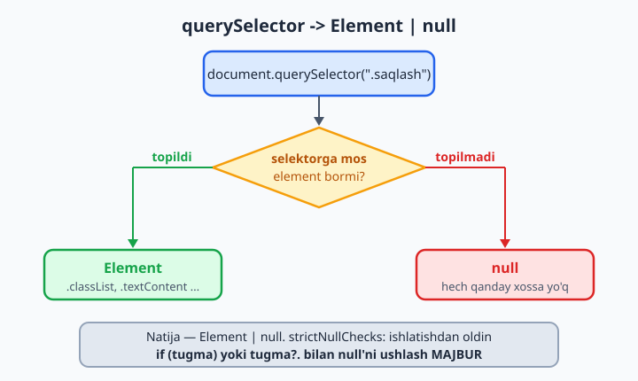
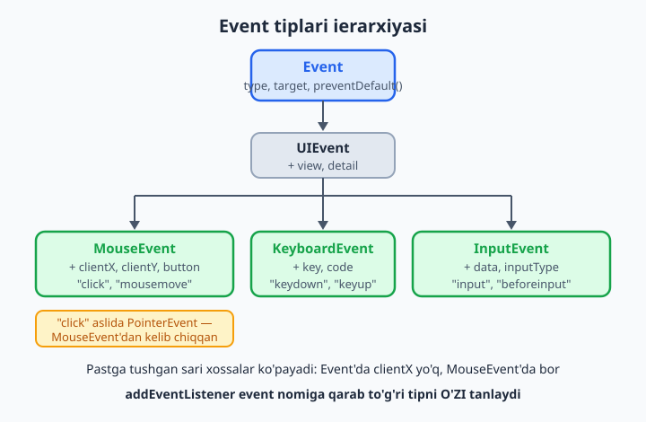
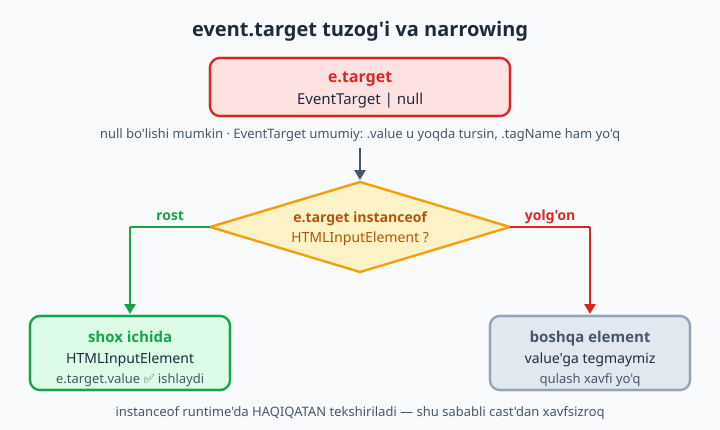
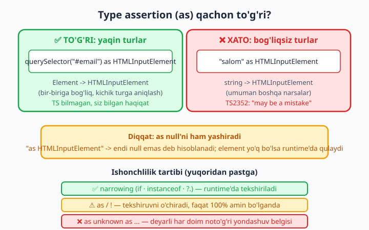

# 19 — DOM va brauzer TypeScript bilan

[⬅️ Oldingi: 18 — tsconfig.json chuqur](./18-tsconfig.md) · [🏠 README](./README.md) · [Keyingi: 20 — Async, Promise va tiplangan API ➡️](./20-async-promise.md)

> **Bu bobda:** TypeScript'ni o'zining tug'ilgan uyiga — brauzerga olib boramiz. `document.querySelector` nega `Element | null` qaytaradi va nega `null` tekshirish endi MAJBUR; aniq element tipini olishning ikki yo'li (`querySelector<HTMLInputElement>` va `as`); xavfli `!` (non-null assertion) qachon o'rinli; event tiplari ierarxiyasi (`Event` -> `MouseEvent` -> ...), mashhur `event.target` tuzog'i va undan narrowing/cast bilan chiqish; `addEventListener`ning tiplangan ishlashi; form va input qiymatlarini xavfsiz o'qish; va nihoyat — type assertion (`as`) qachon o'rinli, qachon yolg'on. Hammasi brauzer kodida tip xavfsizligini saqlash haqida.

---

## Muammo

JavaScript'da brauzer kodi shunday boshlanadi:

```js
const tugma = document.querySelector(".saqlash");
tugma.addEventListener("click", saqla);
```

Sahifada `.saqlash` klassi bor bo'lsa — ishlaydi. Lekin dizayner klass nomini o'zgartirsa, yoki bu kod element hali yuklanmasdan ishga tushsa, `querySelector` `null` qaytaradi va siz mana buni ko'rasiz:

```text
Uncaught TypeError: Cannot read properties of null (reading 'addEventListener')
```

Bu — brauzer kodidagi **eng ko'p uchraydigan** xato. JavaScript uni faqat foydalanuvchi sahifani ochganda, ishlar buzilganda ko'rsatadi. TypeScript esa shu xatoni kompilyatsiya (kod mashina tiliga aylanish) vaqtida — siz hali muharrirdadek — ushlamoqchi. Buning uchun u DOM'ning hamma funksiyalarini oldindan tiplab qo'ygan. Avval TypeScript brauzer tiplarini qayerdan olishini ko'ramiz, keyin shu `null` muammosini hal qilamiz.

> Eslatma: agar JavaScript'da DOM bilan ishlash (`querySelector`, `addEventListener`, event) yodingizdan ko'tarilgan bo'lsa, avval [JavaScript kitobi](../js/README.md)dagi DOM boblariga bir ko'z tashlang. Bu bobda biz **tiplarga** e'tibor beramiz, DOM asoslarini emas.

## `lib: dom` — brauzer tiplari qayerdan keladi

TypeScript `document`, `window`, `HTMLElement`, `MouseEvent` kabi minglab brauzer turlarini qayerdan biladi? Ularning hammasi `lib.dom.d.ts` deb atalgan tayyor deklaratsiya faylida yozib qo'yilgan (deklaratsiya — faqat tiplarni e'lon qiladigan, kodi bo'lmagan fayl; 17-bobda ko'rgan edik). Bu fayl `tsconfig.json`'dagi `lib` ro'yxati orqali kiritiladi.

📌 Yaxshi xabar: agar `tsconfig.json`'da `target` brauzerga mos bo'lsa (masalan `"es2020"`) va `lib`ni alohida yozmasangiz, TypeScript `dom` kutubxonasini **avtomatik** qo'shadi. Demak, odatda hech narsa sozlamasdan `document` ishlaydi.

```json
{
  "compilerOptions": {
    "target": "es2020",
    "strict": true
    // lib yozilmagan -> dom avtomatik kiradi
  }
}
```

💡 Agar siz `lib`ni qo'lda yozsangiz (masalan `"lib": ["es2020"]`), DOM tiplari **o'chib qoladi** va `document` topilmaydi degan xato chiqadi. Brauzer loyihasida `lib`ni yozsangiz, `"dom"`ni ham unutmang: `"lib": ["es2020", "dom"]`. Node loyihasida esa, aksincha, `"dom"`ni atayin tashlab ketasiz (22-bobda ko'ramiz) — chunki Node'da `document` yo'q.

## `querySelector` -> `Element | null`

Mana muammoning ildizi. `document.querySelector`ning tip imzosi (soddalashtirilgan) shunaqa:

```ts
// lib.dom.d.ts ichida (taxminan):
// querySelector(selectors: string): Element | null;
```

E'tibor bering: u `Element` emas, `Element | null` qaytaradi. Nega? Chunki **selektorga mos element topilmasligi mumkin** — o'sha holatda `querySelector` `null` qaytaradi. TypeScript bu haqiqatni tip orqali ochiq aytadi.

`strictNullChecks` yoqilganda (18-bobda ko'rdik — `strict: true` uni yoqadi) `null`ni e'tiborsiz qoldira olmaysiz:

```ts
const tugma = document.querySelector(".saqlash");
tugma.classList.add("aktiv");
//  ^^^^^
// ❌ Xato: 'tugma' is possibly 'null'. (TS18047)
```

TypeScript haq: `tugma` `null` bo'lishi mumkin, `null`da esa `classList` yo'q — bu aynan yuqoridagi runtime qulashning kompilyatsiya vaqtidagi ko'rinishi. Yechim — qiymatni ishlatishdan oldin `null` emasligini **isbotlash** (narrowing — 8-bobni eslang):

```ts
const tugma = document.querySelector(".saqlash");
if (tugma) {
  tugma.classList.add("aktiv"); // ✅ bu shox ichida tugma — Element
}
```

`if (tugma)` ichida TypeScript `null`ni ro'yxatdan chiqaradi va `tugma` toza `Element` bo'ladi. Bu — eng xavfsiz va eng ko'p ishlatiladigan qolip.



💡 Bitta amalni bajarish kerak bo'lsa, optional chaining (`?.`) yanada qisqaroq. U "chap tomon `null`/`undefined` bo'lsa, butun ifoda `undefined` bo'lsin, qulamasin" degani:

```ts
document.querySelector(".sarlavha")?.classList.add("katta"); // ✅ xavfsiz
```

Bu yerda `.sarlavha` topilmasa, `add` umuman chaqirilmaydi — na xato, na qulash.

## Aniq element tipi: `Element`'dan `HTMLInputElement`'gacha

`null`ni hal qildik, lekin yana bir muammo bor. `querySelector(".email")` `Element` qaytaradi — bu DOM ierarxiyasidagi eng umumiy tur. `Element`da `value` yo'q (chunki har element matn maydoni emas):

```ts
const input = document.querySelector("#email");
if (input) {
  console.log(input.value);
  //                ^^^^^
  // ❌ Xato: Property 'value' does not exist on type 'Element'. (TS2339)
}
```

TypeScript to'g'ri aytyapti: siz `#email` aslida `<input>` ekanini bilasiz, lekin **TypeScript buni bilmaydi** — selektor shunchaki satr, undan element turini taxmin qilib bo'lmaydi. Aniq turni o'zimiz aytishimiz kerak. Ikki yo'l bor.

**1-yo'l — generic parametr (afzal):** `querySelector` generic funksiya, burchakli qavsda kutilgan turni berishingiz mumkin:

```ts
const input = document.querySelector<HTMLInputElement>("#email");
// input: HTMLInputElement | null
if (input) {
  const qiymat: string = input.value; // ✅ value endi mavjud
  console.log(qiymat.trim());
}
```

E'tibor bering: generic bersangiz ham, qaytuvchi tur baribir `HTMLInputElement | null` — `null` tekshiruvidan qutulmaysiz (va qutulishingiz ham kerak emas).

**2-yo'l — `as` (type assertion):** "men bu element `HTMLInputElement` ekanini bilaman, ishon" deyish:

```ts
const input = document.querySelector("#email") as HTMLInputElement;
// input: HTMLInputElement (null YO'Q!)
console.log(input.value);
```

📌 Muhim farq: `as HTMLInputElement` `null`ni ham **yashirib yuboradi**. Endi `input` hech qachon `null` emas deb hisoblanadi — bu yolg'on bo'lishi mumkin. Agar element topilmasa, runtime'da yana o'sha tanish qulash qaytadi. Shu sababli generic + `if` xavfsizroq. `as`ni faqat element borligiga 100% amin bo'lganda ishlating.

💡 Tag nomi bilan selektor qilsangiz, TypeScript turni **o'zi** topadi — generic shart emas:

```ts
const inp = document.querySelector("input");  // HTMLInputElement | null (avtomatik!)
const rasm = document.querySelector("img");   // HTMLImageElement | null (avtomatik!)
const form = document.querySelector("form");  // HTMLFormElement | null (avtomatik!)
```

Buni `querySelector`ning maxsus overload'lari (bir nom uchun bir nechta tip imzosi) ta'minlaydi: u taniqli tag nomlarini tanib, mos turni qaytaradi. Klass yoki id selektorida esa (`.email`, `#email`) tagni bilib bo'lmaydi, shuning uchun generic kerak bo'ladi.

## `getElementById` va `querySelectorAll`

`getElementById` tarixiy sabablarga ko'ra `HTMLElement | null` qaytaradi (generic qabul qilmaydi), shuning uchun aniq tur kerak bo'lsa `as` ishlatasiz:

```ts
const menu = document.getElementById("menu");        // HTMLElement | null
if (menu) {
  menu.style.display = "none";                       // ✅ style HTMLElement'da bor
}

const input = document.getElementById("email") as HTMLInputElement;
console.log(input.value);
```

`querySelectorAll` esa ro'yxat qaytaradi — `NodeListOf<...>`. U **hech qachon `null` bo'lmaydi** (mos element bo'lmasa — bo'sh ro'yxat), shuning uchun bu yerda `null` muammosi yo'q. U ham generic qabul qiladi:

```ts
const elementlar = document.querySelectorAll<HTMLLIElement>("li.element");
elementlar.forEach((li) => {
  li.classList.add("korindi"); // ✅ li — HTMLLIElement
});
```

📌 `NodeListOf`da `.forEach` bor, lekin `.map`/`.filter` (massiv metodlari) yo'q. Ularni ishlatish kerak bo'lsa, avval haqiqiy massivga aylantiring: `Array.from(elementlar)` yoki `[...elementlar]`.

## Non-null assertion `!` — qisqa, lekin xavfli

TypeScript yana bir qisqa yo'l beradi: ifoda oxiriga `!` qo'ysangiz, "bu hech qachon `null`/`undefined` emas, ishon" deysiz. Bu — non-null assertion (`null` emasligini tasdiqlash):

```ts
const tugma = document.querySelector(".saqlash")!; // ! -> null olib tashlandi
tugma.classList.add("aktiv");                      // tugma: Element (null YO'Q)
```

`!` `null`ni tipdan olib tashlaydi — `if` yozish shart emas. Qulay ko'rinadi, lekin u **faqat TypeScript'ni jim qildiradi**, runtime'da hech narsa tekshirmaydi. Element baribir yo'q bo'lsa, o'sha eski `Cannot read properties of null` qulashi qaytadi.

📌 `!` va `as HTMLInputElement` — ikkalasi ham bir xil narsani qiladi: TypeScript'ga "men yaxshiroq bilaman" deyish. Ikkalasi ham **xato bo'lishi mumkin**, chunki tekshiruvni o'chiradi. Qoida: imkon bo'lsa `if`/`?.` ishlating; `!`ni faqat element 100% borligiga kafolatli bo'lganda (masalan, HTML'ni o'zingiz yozgan va o'zgarmasligini bilganda).

💡 Amaliy maslahat: `!`ni dasturning eng yuqorisida, butun sahifa uchun bir marta "shu elementlar bor" deb e'lon qiladigan joyda ishlatish odat. Chuqurda, har joyda `!` sochib yursangiz — bir kun sizni qulatadi.

## Event tiplari: `Event` -> `MouseEvent` -> ...

Brauzer event'lari ham tiplangan va ular **ierarxiya** hosil qiladi. Eng umumiysi — `Event`. Undan `UIEvent`, undan `MouseEvent` (sichqoncha), `KeyboardEvent` (klaviatura), `InputEvent` (matn kiritish) va boshqalar kelib chiqadi. Pastga tushgan sari xossalar ko'payadi: oddiy `Event`da `clientX` yo'q, `MouseEvent`da bor.



Eng zo'r jihati: `addEventListener` event nomiga qarab **to'g'ri tipni o'zi tanlaydi**. Siz handlerda parametr tipini yozishingiz shart emas:

```ts
const btn = document.querySelector<HTMLButtonElement>("#yubor");
btn?.addEventListener("click", (e) => {
  // e — avtomatik to'g'ri tip; clientX/clientY mavjud
  console.log(e.clientX, e.clientY); // ✅
});

document.addEventListener("keydown", (e) => {
  // e — KeyboardEvent; key mavjud
  if (e.key === "Escape") {
    console.log("yopildi"); // ✅
  }
});
```

`"click"` deganingizda `e` sichqoncha event'i, `"keydown"` deganingizda klaviatura event'i bo'ladi — TypeScript event nomlari va tiplari xaritasini biladi.

📌 Aniqlik uchun: zamonaviy DOM tiplarida `"click"` handlerining `e` tipi aslida `PointerEvent` (sichqoncha va sensorli ekranni birlashtiradigan, `MouseEvent`dan kelib chiqqan tur). Amalda farqi sezilmaydi — `clientX`, `button` kabi `MouseEvent` xossalarining hammasi unda ham bor. Mavzu bo'yicha gapirganda biz buni "sichqoncha event'i" deb ataymiz.

💡 Tuzoq: handlerga noto'g'ri event tipini **majburlab** yozsangiz, TypeScript ushlaydi:

```ts
btn?.addEventListener("click", (e: KeyboardEvent) => {
  //                                ^^^^^^^^^^^^^
  // ❌ Xato: Argument of type '(e: KeyboardEvent) => void' is not
  //          assignable... 'click' uchun KeyboardEvent emas.  (TS2769)
  console.log(e.key);
});
```

`"click"` event'i klaviatura event'i emas, shuning uchun `KeyboardEvent` yozish noto'g'ri. Eng yaxshi yo'l — tipni **umuman yozmaslik**, TypeScript o'zi to'g'risini qo'yadi.

## `event.target` tuzog'i va narrowing

Mana brauzer TypeScript'idagi eng mashhur tuzoq. Tabiiy ravishda `event.target`dan input qiymatini olmoqchi bo'lasiz:

```ts
const maydon = document.querySelector<HTMLInputElement>("#qidiruv");
maydon?.addEventListener("input", (e) => {
  console.log(e.target.value);
  //          ^^^^^^^^  ^^^^^
  // ❌ Xato: 'e.target' is possibly 'null'. (TS18047)
  //          Property 'value' does not exist on type 'EventTarget'. (TS2339)
});
```

Ikkita muammo birga keldi. `e.target`ning tipi — `EventTarget | null`. Nega bunaqa "kambag'al"?

- `null` bo'lishi mumkin, chunki event'ning manbai har doim ham mavjud emas.
- `EventTarget` — eng umumiy interfeys: event'ni nafaqat element, balki `window`, `document`, hatto `XMLHttpRequest` ham chiqarishi mumkin. Shuning uchun `target`da `value` u yoqda tursin, hatto `tagName` ham yo'q.

TypeScript haq: u `target` aynan input ekanini kafolatlay olmaydi. Buni biz **isbotlab** berishimiz kerak. Eng to'g'ri yo'l — `instanceof` bilan narrowing (8-bob):

```ts
maydon?.addEventListener("input", (e) => {
  if (e.target instanceof HTMLInputElement) {
    console.log(e.target.value); // ✅ shu shox ichida e.target — HTMLInputElement
  }
});
```

`instanceof HTMLInputElement` ROST bo'lsa, TypeScript `target`ni shu shox ichida `HTMLInputElement`ga toraytiradi — `null` ham, umumiy `EventTarget` ham yo'qoladi. Bu — eng xavfsiz usul, chunki runtime'da haqiqatan tekshiriladi.



📌 `target` va `currentTarget` farqini eslang. `target` — event qayerda **boshlangani** (bosilgan aniq element, ichki span bo'lishi mumkin). `currentTarget` — handler **biriktirilgan** element. Ikkalasining ham tipi `EventTarget | null`, lekin `currentTarget` odatda siz kutgan element bo'ladi:

```ts
const link = document.querySelector<HTMLAnchorElement>("a.nav");
link?.addEventListener("click", (e) => {
  const a = e.currentTarget as HTMLAnchorElement; // biz biriktirgan element
  console.log(a.href);
});
```

💡 `e.target as HTMLInputElement` (cast) tezroq, lekin `instanceof` (narrowing) xavfsizroq — chunki cast yolg'on bo'lsa, runtime'da qulaysiz. Ishonchli forma kodida cast ham qabul qilinadi; ishonchsiz, delegatsiyali (bitta handler ko'p elementga) kodda doim `instanceof` ishlating.

## Form va input qiymatlarini o'qish

Forma bilan ishlash — DOM kodining yarmi. Input qiymatini olishning xavfsiz qolipi:

```ts
const form = document.querySelector<HTMLFormElement>("#royxat");
form?.addEventListener("submit", (e) => {
  e.preventDefault(); // sahifa qayta yuklanmasin

  // FormData — barcha maydonlarni bir joyda olishning toza yo'li:
  const data = new FormData(form);
  const ism = data.get("ism"); // FormDataEntryValue | null
  console.log(ism);
});
```

`FormData.get` `string | File | null` (`FormDataEntryValue | null`) qaytaradi — chunki maydon fayl ham bo'lishi mumkin yoki umuman bo'lmasligi mumkin. Aniq matn kerak bo'lsa, tekshirib oling:

```ts
const ism = data.get("ism");
if (typeof ism === "string") {
  console.log(ism.trim().length); // ✅ ism — string
}
```

Alohida input'lardan o'qish uchun esa yuqoridagi qoidalar ishlaydi:

```ts
const email = document.querySelector<HTMLInputElement>("#email");
const checkbox = document.querySelector<HTMLInputElement>("#rozi");
const shahar = document.querySelector<HTMLSelectElement>("#shahar");

if (email && checkbox && shahar) {
  const qiymat: string = email.value;     // matn maydoni -> string
  const rozi: boolean = checkbox.checked; // belgilangan? -> boolean
  const tanlangan: string = shahar.value; // <select> -> string
  console.log(qiymat, rozi, tanlangan);
}
```

📌 Diqqat: `input.value` **doim `string`** — hatto `<input type="number">` da ham! Raqam kerak bo'lsa, o'zingiz aylantiring: `Number(input.value)` yoki `parseInt(input.value, 10)`. TypeScript bu yerda sizni ogohlantirmaydi, chunki tip jihatdan `value` rost `string`.

## Type assertion (`as`) qachon o'rinli

`as`ni bu bobda bir necha bor ishlatdik. Endi qoidani aniq belgilaylik, chunki `as` — kuchli, ammo xavfli asbob: u TypeScript'ning tekshiruvini **o'chiradi**, hech narsani o'zgartirmaydi (faqat kompilyator fikrini o'zgartiradi).

**To'g'ri ishlatish:** TypeScript bilmaydigan, lekin siz bilgan haqiqatni aytish. Masalan, `#email` aniq `<input>` ekanini HTML'dan bilasiz:

```ts
const input = document.querySelector("#email") as HTMLInputElement; // ✅ o'rinli
```

**Xato ishlatish:** mutlaqo bog'liq bo'lmagan turlarni majburlash. TypeScript buni ham ushlaydi — bu yaxshi:

```ts
const x = "salom" as HTMLInputElement;
//        ^^^^^^^
// ❌ Xato: Conversion of type 'string' to type 'HTMLInputElement'
//          may be a mistake because neither type sufficiently overlaps... (TS2352)
```

`string`ni `HTMLInputElement`ga aylantirib bo'lmaydi — ular umuman boshqa narsalar. TypeScript "bu adashish bo'lsa kerak" deb ogohlantiradi. (Agar rost majburlamoqchi bo'lsangiz — kamdan-kam holatda — `as unknown as HTMLInputElement` orqali ikki bosqichli o'tish kerak, lekin bu deyarli har doim kod hidi — ya'ni yomon belgisi.)



Qoida bo'lib qo'yaylik:

- ✅ **Narrowing** (`if`, `instanceof`, `?.`) — eng xavfsiz, runtime'da tekshiriladi. Birinchi tanlovingiz shu bo'lsin.
- ⚠️ **`as` / `!`** — tekshiruvni o'chiradi, faqat haqiqatga 100% amin bo'lganda. Kamroq ishlating.
- ❌ **`as unknown as ...`** — deyarli har doim noto'g'ri yondashuv belgisi; tipni qaytadan o'ylash kerak.

## `innerHTML` xavfsizligi (qisqa)

Oxirgi nuqta — bu TypeScript emas, **xavfsizlik** masalasi, lekin DOM kodida muhim. TypeScript `innerHTML`ni `string` deb biladi va sizga foydalanuvchi matnini unga solishga **ruxsat beradi** — bu tip jihatdan xato emas, lekin XSS hujumiga (zararli kod inyeksiyasi) yo'l ochadi:

```ts
const izoh = document.querySelector<HTMLInputElement>("#izoh");
const oyna = document.querySelector("#natija");
if (izoh && oyna) {
  oyna.innerHTML = izoh.value;   // ⚠️ xavfli: foydalanuvchi <script> kiritishi mumkin
  oyna.textContent = izoh.value; // ✅ xavfsiz: matn shunchaki matn bo'lib qoladi
}
```

📌 Qoida: foydalanuvchi yoki tashqi manbadan kelgan matnni ko'rsatish uchun `innerHTML` emas, `textContent` ishlating. `innerHTML`ni faqat o'zingiz to'liq nazorat qiladigan, ishonchli HTML uchun saqlang. TypeScript sizni bu xatodan saqlay olmaydi — tip to'g'ri, lekin niyat xavfli.

---

Endi sizda brauzer kodini tip xavfsiz yozishning to'liq to'plami bor: `null`ni `if`/`?.` bilan ushlash, aniq turni generic yoki `as` bilan berish, event'larni avtomatik tipdan foydalanish, `event.target`ni `instanceof` bilan toraytirish va `as`ni ehtiyot bilan ishlatish. Keyingi bobda brauzerdan tashqariga chiqamiz: `fetch`, `Promise` va tashqi API javoblarini tiplaymiz.

## 19-bob mashqlari

Quyidagi mashqlarni o'zingiz bajaring. Har birini `strict` rejimda tekshiring — toza misollar xatosiz o'tsin, ataylab xatolilar TypeScript ogohlantirishi bilan chiqsin. (Yechimlar berilmagan — maqsad o'zingiz yozib o'rganish.)

1. `document.querySelector(".karta")` natijasini o'zgaruvchiga oling va `if (...)` bilan `null`ni tekshirib, ichida `classList.add("aktiv")` chaqiring. Tekshiruvsiz ishlatib ko'ring va chiqqan `is possibly 'null'` xatosini o'qing.

2. Bir qatorda, optional chaining (`?.`) bilan `.sarlavha` elementiga `classList.add("katta")` qo'shing. `if`siz ishlaganini ko'ring.

3. `#parol` input'ini generic bilan oling: `querySelector<HTMLInputElement>("#parol")`. `null` tekshiruvidan keyin `value` xossasiga murojaat qiling.

4. Xuddi shu `#parol`ni generic'siz, oddiy `querySelector("#parol")` bilan oling va `value`ga murojaat qiling. Qanday xato chiqadi? Xato matnini izohlang.

5. `document.querySelector("input")` (tag selektori) yozing va natija turini hover qilib ko'ring (yoki `const x: HTMLInputElement | null = ...` bilan tekshiring). Generic'siz ham TypeScript turni bilganiga ishonch hosil qiling.

6. `getElementById("avatar")`ni `as HTMLImageElement` bilan oling va `.src` xossasiga qiymat bering. Keyin `as`siz urinib, farqni kuzating.

7. `#yubor` tugmasiga `addEventListener("click", ...)` qo'shing. Handler parametriga tip **yozmang** va ichida `e.clientX`ni `console.log` qiling — TypeScript o'zi to'g'ri tipni qo'yganini ko'ring.

8. Xuddi shu click handler parametriga ataylab `(e: KeyboardEvent)` yozing. Chiqqan xatoni o'qing va nega `click` uchun `KeyboardEvent` noto'g'ri ekanini bir jumlada izohlang.

9. `document`ga `keydown` listener qo'shing va `e.key === "Enter"` bo'lsa biror xabar chop eting. `e`ning `KeyboardEvent` ekaniga (avtomatik) ishonch hosil qiling.

10. Input'ga `input` event listener qo'shing va ichida to'g'ridan-to'g'ri `e.target.value`ni o'qishga uriniib ko'ring. Ikki xil xato (`null` va `value yo'q`) chiqishini kuzating.

11. 10-mashqni `if (e.target instanceof HTMLInputElement)` bilan tuzating. Endi `e.target.value` xatosizligini tekshiring.

12. 10-mashqni endi `const t = e.target as HTMLInputElement;` (cast) bilan tuzating. Bu o'tadi, lekin nega `instanceof` xavfsizroq — bir jumlada yozib qo'ying.

13. `.saqlash` elementini non-null assertion bilan oling: `querySelector(".saqlash")!`. `if`siz `classList`ga murojaat qiling. Kompilyatsiya o'tadimi? Element bo'lmasa runtime'da nima bo'ladi?

14. Bir `<form id="kirish">` uchun `submit` listener yozing, ichida `e.preventDefault()` chaqiring va `new FormData(form)` orqali `"login"` maydonini oling. `get` natijasi nega `string` emasligini tushuntiring.

15. 14-mashqdagi `data.get("login")` natijasini `if (typeof x === "string")` bilan toraytirib, `trim()` chaqiring.

16. `<input type="number" id="yosh">` qiymatini o'qing va uni `Number(...)` bilan raqamga aylantiring. `input.value`ning turi `string` ekaniga (raqam emas) ishonch hosil qiling.

17. `<input type="checkbox" id="rozi">` uchun `.checked` xossasini `boolean` o'zgaruvchiga oling. `<select id="til">` uchun `.value`ni oling.

18. `"salom" as HTMLInputElement` yozing. Qanday xato chiqadi? Nega TypeScript bunga ruxsat bermasligini izohlang. So'ng `as unknown as HTMLInputElement` bilan "majburlab" o'tkazib, nega bu yomon amaliyot ekanini yozib qo'ying.

19. `document`ga bitta `click` listener qo'ying (event delegatsiyasi) va `if (e.target instanceof HTMLButtonElement)` bilan faqat tugma bosilganida `e.target.textContent`ni chop eting. Nega bu yerda `instanceof` (cast emas) zarurligini tushuntiring.

20. Foydalanuvchi kiritgan matnni sahifaga chiqarishning ikki usulini yozing: `oyna.innerHTML = qiymat` va `oyna.textContent = qiymat`. Ikkalasi ham TypeScript'da o'tadi. Qaysi biri xavfsiz va nega — izohlab bering.
