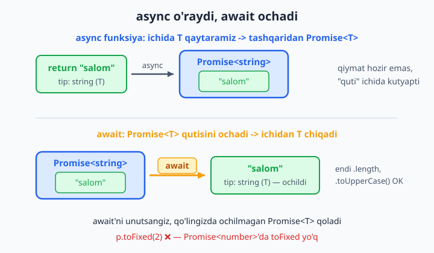
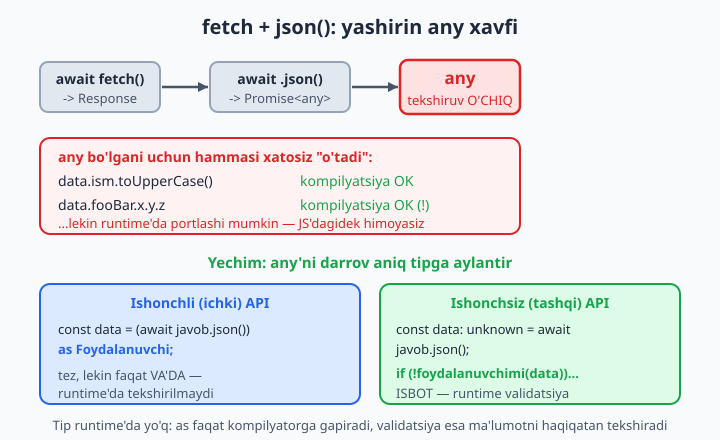
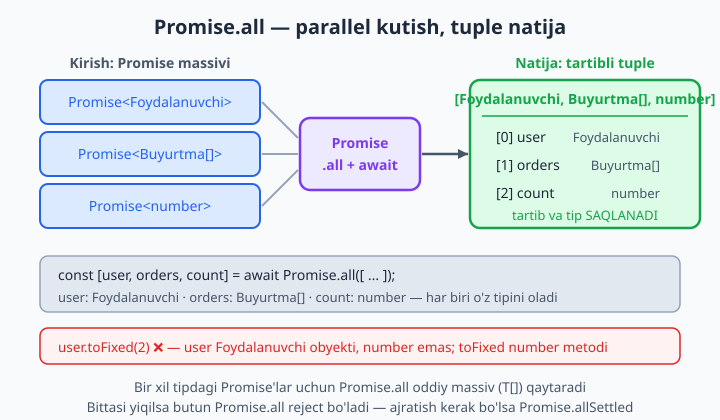

# 20 — Async, Promise va tiplangan API

[⬅️ Oldingi: 19 — DOM va brauzer TypeScript bilan](./19-dom-brauzer.md) · [🏠 README](./README.md) · [Keyingi: 21 — Tashqi kutubxonalar va @types ➡️](./21-types-kutubxonalar.md)

> **Bu bobda:** asinxron kodni TypeScript bilan xavfsiz yozishni o'rganamiz. `Promise<T>` tipini, `async` funksiya nega doim `Promise` qaytarishini, `await` qanday qilib `T` "ochishini", `fetch` va `.json()` ortida yashiringan `any` xavfini va uni interface bilan to'g'ri tiplashni ko'rib chiqamiz. So'ng `Awaited<T>`, `Promise.all`ning tuple natijasi, `catch (e: unknown)`ni narrowing bilan ishlash, generic async funksiyalar va tiplangan API klient qurishni o'rganamiz. Oxirida — eng muhim haqiqat: tip runtime'da yo'q, shuning uchun tashqi ma'lumotni **validatsiya** qilish nega zarurligini tushunamiz.

---

## Muammo

JavaScript'da serverdan ma'lumot olish odatiy ish edi. Aytaylik, foydalanuvchi profilini chizadigan funksiya yozdingiz:

```js
async function profilChiz(id) {
  const javob = await fetch(`/api/users/${id}`);
  const user = await javob.json();
  document.title = user.ism.toUpperCase();   // ismni sarlavhaga yozamiz
}
```

Bu kod ko'p hollarda ishlaydi. Lekin bitta yomon kun keladi: API o'zgaradi, `ism` o'rniga `name` qaytaradi yoki server xato berib `null` qaytaradi. Shunda `user.ism` `undefined` bo'ladi va dastur foydalanuvchi oldida portlaydi: `Cannot read properties of undefined (reading 'toUpperCase')`. JavaScript bu xatoni faqat **runtime'da** — kech bo'lganda — ko'rsatadi.

TypeScript'ga o'tdik. Endi savol: `await javob.json()` qanday tip qaytaradi? Aql bovar qilmaydi, lekin javob — **`any`**. Ya'ni standart `fetch` + `json()` qolipida TypeScript sizni mutlaqo himoya qilmaydi: `user.ism`, `user.fooBar`, `user.x.y.z` — hammasi xatosiz "o'tadi", xuddi JavaScript'dagidek. 9-bobda ko'rgan edik: `any` — tip tekshiruvini o'chiradigan qora teshik.

Bu bob aynan shu muammoni hal qiladi. Asinxron kodni shunday yozamizki, kompilyator bizga yordam bersin: `await`dan keyin qiymat **aniq tipga** ega bo'lsin, tashqi ma'lumot esa tekshirilmaguncha ishlatib bo'lmasin. Asinxronlik TypeScript'da yangi sintaksis emas — JavaScript'dagi `Promise`, `async`/`await`ning aynan o'zi. Yangilik faqat bitta: ularning **tiplari**. Shu tiplarni o'zlashtirsak, tarmoqdan kelgan har bir baytni ishonchli qila olamiz.

---

## `Promise<T>` — kelajakda keladigan qiymat tipi

JavaScript'da `Promise` — "hozir emas, keyinroq tayyor bo'ladigan qiymat" edi. TypeScript'da u **generic** tip: `Promise<T>`, bunda `T` — kelgusida ichidan chiqadigan qiymatning tipi.

- `Promise<string>` — kelajakda **matn** beradigan vada.
- `Promise<number>` — kelajakda **son** beradigan vada.
- `Promise<Foydalanuvchi>` — kelajakda **foydalanuvchi obyekti** beradigan vada.

`Promise<T>`ni "qutiga o'ralgan `T`" deb tasavvur qiling: qiymat shu yerda, lekin hozir emas, hali quti ichida.

```ts
function kechikish(ms: number): Promise<string> {
  return new Promise((resolve) => {
    setTimeout(() => resolve("tayyor"), ms);
  });
}
```

Bu yerda qaytish tipini `Promise<string>` deb **aniq yozdik**, shuning uchun `resolve` faqat matn qabul qiladi: `resolve("tayyor")` to'g'ri ishlaydi, lekin `resolve(42)` yozsangiz xato chiqadi — `Argument of type 'number' is not assignable to parameter of type 'string | PromiseLike<string>'` (42 — son, `string` kutiladi).

📌 Muhim nozik nuqta: `Promise` konstruktori `T` tipini `resolve` argumentidan **chiqarmaydi**. Agar annotatsiya bo'lmasa — `new Promise((resolve) => { resolve(42); })` — TypeScript `T`ni `unknown` deb oladi, ya'ni natija `Promise<unknown>`, `Promise<number>` emas. Son tipini olish uchun yo qaytish tipini (`: Promise<number>`), yo konstruktorni aniq generic bilan yozish kerak: `new Promise<number>((resolve) => { resolve(42); })`.

📌 `Promise<T>` ning `T`si — qutining **ichidagi** qiymat tipi, qutining o'zi emas. `kechikish(100)` chaqirganingizda qo'lingizda `Promise<string>` bo'ladi — `string` emas. Matnga yetish uchun qutini "ochish" kerak. Ochishning ikki yo'li bor: `.then()` yoki `await`.

## `async` funksiya doim `Promise` qaytaradi

Eng muhim qoidalardan biri: **`async` deb belgilangan har qanday funksiya doim `Promise` qaytaradi** — istasangiz ham, istamasangiz ham. Funksiya ichida `42` qaytarsangiz, tashqaridan u `Promise<number>` bo'lib chiqadi.

```ts
async function salom(): Promise<string> {
  return "salom";   // string qaytaryapmiz, lekin tashqi tip Promise<string>
}
```

Ko'ryapsizmi? Ichida shunchaki `"salom"` (matn) qaytaryapmiz, lekin qaytish tipini `Promise<string>` deb yozdik. TypeScript buni majbur qiladi — `async` so'zi qiymatni avtomatik `Promise`ga "o'rab" beradi.

Mantiqiy savol tug'iladi: agar `async` funksiya `Promise` qaytarsa, qaytish tipiga `: number` yozsam bo'ladimi? Yo'q:

```ts
// ❌ Xato: The return type of an async function or method must be the
//    global Promise<T> type. Did you mean to write 'Promise<number>'?
async function notogri(): number {
  return 42;
}
```

Kompilyator aniq yo'l ko'rsatadi: "`async` funksiyaning qaytish tipi `Promise<T>` bo'lishi shart. Balki `Promise<number>` yozmoqchimisiz?". Bu — TypeScript'ning eng foydali xatolaridan biri: u sizni asinxron funksiyaning haqiqiy tipiga "majburlaydi".

💡 Amalda qaytish tipini ko'pincha **yozmasangiz ham bo'ladi** — TypeScript uni avtomatik chiqaradi. `async function salom() { return "salom"; }` ning tipi avtomatik `Promise<string>` bo'ladi. Lekin ommaviy (public) API funksiyalarida qaytish tipini aniq yozish odat tusiga kirgan: hujjat vazifasini ham bajaradi, xatolarni ham erta ushlaydi.

## `await` — qutini ochib `T` beradi

`await` — `Promise<T>` qutisini ochib, ichidan `T` qiymatni chiqaradigan operator. U faqat `async` funksiya ichida ishlatiladi.

```ts
async function kechikish(ms: number): Promise<string> {
  return new Promise((resolve) => {
    setTimeout(() => resolve("tayyor"), ms);
  });
}

async function ishga(): Promise<number> {
  const natija: string = await kechikish(100);   // Promise<string> -> string
  return natija.length;                          // natija: string, .length OK
}
```

Diqqat qiling: `kechikish(100)` ning tipi `Promise<string>`, lekin `await kechikish(100)` ning tipi shunchaki `string`. `await` qutini ochdi. Endi `natija` ustida `.length`, `.toUpperCase()` kabi matn metodlarini bemalol ishlatamiz — TypeScript uni `string` deb biladi.



Bu jarayonni yodda saqlash uchun ikkita oddiy qoida bor:

- **`async` o'raydi:** funksiya ichida `T` qaytarsangiz, tashqaridan `Promise<T>` chiqadi.
- **`await` ochadi:** `Promise<T>` ustida `await` qilsangiz, `T` qoladi.

Bu ikkisi bir-birining aksi. `await`ni unutsangiz nima bo'ladi? Quti ochilmaydi va siz quti ustida ish qilmoqchi bo'lasiz:

```ts
async function sonOl(): Promise<number> {
  return 42;
}

async function ishlat(): Promise<void> {
  const p = sonOl();          // await yo'q -> p: Promise<number>
  // ❌ Xato: Property 'toFixed' does not exist on type 'Promise<number>'.
  console.log(p.toFixed(2));
}
```

`toFixed` — `number`ning metodi, lekin `p` hali `Promise<number>` (ochilmagan quti). TypeScript darrov ogohlantiradi: "`Promise<number>`da `toFixed` yo'q". JavaScript'da bu yashirin bug bo'lardi (`p` aslida Promise obyekti); TypeScript esa uni **yozayotganda** ushlaydi. `await` qo'shsangiz — muammo yo'qoladi.

📌 `void` — funksiya hech narsa qaytarmasligini bildiradi (9-bobda ko'rgan edik). Hech narsa qaytarmaydigan `async` funksiyaning tipi `Promise<void>` bo'ladi — "kelajakda tugaydi, lekin qiymat bermaydi".

## `fetch` va `.json()` — yashirin `any` xavfi

Endi bobning markaziy muammosiga keldik. `fetch` — brauzerda tarmoq so'rovi yuborishning standart usuli. Uning tiplari `lib.dom`da tayyor:

```ts
const javob: Response = await fetch("/api/users/1");
```

`fetch` `Promise<Response>` qaytaradi, `await`dan keyin `Response` qoladi. `Response`da `.ok`, `.status`, `.json()` kabi metodlar bor. Mana shu yerda tuzoq boshlanadi:

```ts
const data = await javob.json();
//    ^? data: any   <-- XAVF!
```

`Response.json()` ning tipi `Promise<any>`. Ya'ni `await javob.json()` natijasi — `any`. 9-bobdan eslang: `any` tip tekshiruvini butunlay o'chiradi. Demak, `data.ism`, `data.istalganNarsa`, `data.x.y.z` — hammasi xatosiz "o'tadi", lekin runtime'da portlashi mumkin.



Nega TypeScript shunday qilgan? Chunki u **server nima qaytarishini bilolmaydi** — JSON istalgan shaklda bo'lishi mumkin. Shuning uchun mas'uliyatni sizga topshiradi. Sizning vazifangiz — bu `any`ni iloji boricha tezroq **aniq tipga** aylantirish.

### 1-yechim: `as` bilan tiplash (tez, lekin ishonchga asoslangan)

Eng oddiy yo'l — natijani interface bilan tiplaymiz:

```ts
interface Foydalanuvchi {
  id: number;
  ism: string;
  email: string;
}

async function foydalanuvchiOl(id: number): Promise<Foydalanuvchi> {
  const javob: Response = await fetch(`/api/users/${id}`);
  if (!javob.ok) {
    throw new Error(`Server xatosi: ${javob.status}`);
  }
  const data = (await javob.json()) as Foydalanuvchi;   // any -> Foydalanuvchi
  return data;
}
```

Endi `foydalanuvchiOl(1)` natijasi `Foydalanuvchi` tipida bo'ladi va `u.ism.toUpperCase()` xavfsiz yoziladi — kompilyator yordam beradi.

📌 Diqqat: `as Foydalanuvchi` — bu **da'vo** (assertion), tekshiruv emas. Siz kompilyatorga "ishon, bu Foydalanuvchi" deyapsiz, lekin **runtime'da hech narsa tekshirilmaydi**. Agar server boshqa shakl qaytarsa, dastur baribir portlaydi — faqat endi kompilyator bunga ko'z yumadi. `as` muammoni "yashiradi", hal qilmaydi. Shuning uchun u faqat ishonchli, ichki API'lar uchun mos. Tashqi/ishonchsiz manba uchun pastdagi validatsiya qolipini ishlating.

💡 `javob.ok`ni tekshirishni unutmang. `fetch` faqat tarmoq butunlay uzilganda xato (`reject`) qiladi. 404 yoki 500 kabi server xatolarida `fetch` **muvaffaqiyatli** hisoblanadi — `.ok` `false` bo'ladi, xolos. Shuning uchun `if (!javob.ok)` tekshiruvi har bir `fetch`da bo'lishi shart.

## `Awaited<T>` — Promise ichidagi tipni olish

Ba'zan sizda `Promise<T>` bor, lekin sizga ichidagi `T` kerak — `await`siz, faqat tip darajasida. Buning uchun TypeScript'da tayyor utility type bor: `Awaited<T>`.

```ts
type A = Awaited<Promise<string>>;           // string
type B = Awaited<Promise<Promise<number>>>;  // number  (ichma-ich ochadi!)
type C = Awaited<boolean>;                    // boolean (Promise emas — o'zini qaytaradi)
```

`Awaited<T>` — `await` operatorining tip darajasidagi aksi. U `Promise` qatlamini "yechadi", ichma-ich joylashgan bo'lsa ham (`Promise<Promise<number>>` -> `number`). Promise bo'lmagan tipga ta'sir qilmaydi.

Eng foydali joyi — `async` funksiya qaytaradigan asl qiymat tipini olish:

```ts
async function profilOl(): Promise<{ ism: string }> {
  return { ism: "Lola" };
}

type Profil = Awaited<ReturnType<typeof profilOl>>;   // { ism: string }

const p: Profil = { ism: "Aziz" };
```

Mantiq: `typeof profilOl` — funksiyaning tipi; `ReturnType<...>` — uning qaytish tipi (`Promise<{ ism: string }>`); `Awaited<...>` — Promise'ni yechib, `{ ism: string }`ni beradi. Bu qolip kutubxona funksiyasi qaytaradigan qiymat tipini takrorlamasdan "olib" ishlatishda juda asqotadi.

📌 `Awaited`ni Promise ko'p qatlamli bo'lganda (`then` zanjirlari, eski kod) qo'l bilan tip yozishdan saqlaydi deb tushuning. Aksariyat oddiy kodda u sizga bevosita kerak bo'lmaydi — chunki `await` allaqachon shu ishni qiladi.

## `Promise.all` — bir nechta vadani parallel kutish va tuple natija

Ko'pincha bir nechta so'rovni **parallel** yuborib, hammasi tugaganini kutish kerak bo'ladi. `Promise.all` aynan shu uchun. TypeScript'dagi eng chiroyli jihati — u natija tiplarini **tuple** (aniq tartibli tiplangan ro'yxat, 4-bob) sifatida saqlaydi:

```ts
interface Foydalanuvchi { id: number; ism: string; }
interface Buyurtma { id: number; summa: number; }

async function foydalanuvchiOl(): Promise<Foydalanuvchi> {
  return { id: 1, ism: "Ali" };
}
async function buyurtmalarOl(): Promise<Buyurtma[]> {
  return [{ id: 10, summa: 500 }];
}
async function sonOl(): Promise<number> {
  return 42;
}

async function hammasini(): Promise<void> {
  const [user, orders, count] = await Promise.all([
    foydalanuvchiOl(),
    buyurtmalarOl(),
    sonOl(),
  ]);
  // user: Foydalanuvchi, orders: Buyurtma[], count: number
  console.log(user.ism, orders.length, count.toFixed(0));
}
```

Sehr shu yerda: `Promise.all([Promise<Foydalanuvchi>, Promise<Buyurtma[]>, Promise<number>])` natijasi `Promise<[Foydalanuvchi, Buyurtma[], number]>` bo'ladi. `await`dan keyin bu **tuple** ochiladi va destrukturizatsiyada har bir o'zgaruvchi **o'z tipini** oladi — `user` aynan `Foydalanuvchi`, `count` aynan `number`. Tartib ham saqlanadi.



Shuning uchun noto'g'ri tipga murojaat darrov ushlanadi:

```ts
async function ishla(): Promise<void> {
  const [ism, yosh] = await Promise.all([ismOl(), yoshOl()]);
  // ism: string, yosh: number
  // ❌ Xato: Property 'toFixed' does not exist on type 'string'. Did you mean 'fixed'?
  console.log(ism.toFixed(2));
}
```

`ism` — `string`, `toFixed` esa `number`ning metodi. TypeScript darrov xato beradi. Tuple tartibni saqlagani uchun u qaysi o'zgaruvchi qaysi tipda ekanini aniq biladi.

💡 Hammasi **bir xil** tipda bo'lsa, `Promise.all` oddiy massiv (`T[]`) qaytaradi — bu ham juda qulay:

```ts
async function sahifaOl(n: number): Promise<string> {
  return `sahifa-${n}`;
}

async function barchaOl(idlar: number[]): Promise<string[]> {
  return Promise.all(idlar.map((id) => sahifaOl(id)));   // Promise<string[]>
}
```

`idlar.map(...)` har bir element uchun `Promise<string>` qaytaradi, ya'ni `Promise<string>[]`; `Promise.all` ularni `Promise<string[]>`ga aylantiradi. Bu — "ID'lar ro'yxatidan ma'lumot ro'yxatini olish"ning eng keng tarqalgan qolipi.

📌 `Promise.all`da **bitta** vada xato qilsa, butun `Promise.all` darrov `reject` bo'ladi — qolganlari kutilmaydi. Agar "qaysi tugadi, qaysi yiqildi"ni alohida bilish kerak bo'lsa, `Promise.allSettled` ishlating. U hech qachon `reject` qilmaydi, har bir natija `{ status: "fulfilled"; value: T }` yoki `{ status: "rejected"; reason: any }` bo'ladi:

```ts
const natijalar = await Promise.allSettled([sonOl(), sonOl()]);
for (const r of natijalar) {
  if (r.status === "fulfilled") {
    console.log(r.value.toFixed(0));   // r.value: number — narrowing ishladi
  } else {
    console.log(r.reason);
  }
}
```

Bu — discriminated union (8-bob) ning go'zal misoli: `status` ustuni `"fulfilled"` ekanini tekshirgach, TypeScript `r.value`ga ruxsat beradi; `"rejected"`da esa faqat `r.reason` bor.

## Xatolarni tiplash: `catch (e: unknown)`

JavaScript'da `catch` blokidagi xato istalgan narsa bo'lishi mumkin: `Error` obyekti, matn, son, hatto `null`. Kimdir `throw "xato"` yozsa — bu ham mumkin. Shuning uchun TypeScript zamonaviy `strict` rejimda `catch` parametrini **`unknown`** deb biladi (eski `any` emas):

```ts
async function ishla(): Promise<void> {
  try {
    throw new Error("xato");
  } catch (e: unknown) {
    // ❌ Xato: 'e' is of type 'unknown'.
    console.log(e.message);
  }
}
```

`e` — `unknown`, shuning uchun `e.message`ga to'g'ridan-to'g'ri murojaat qilib bo'lmaydi (9-bobdan eslang: `unknown` tekshirishni majbur qiladi). Bu yaxshi — chunki `e` haqiqatan `Error` ekaniga kafolat yo'q. Yechim — **narrowing**:

```ts
async function ishla(): Promise<void> {
  try {
    throw new Error("nimadir buzildi");
  } catch (e: unknown) {
    if (e instanceof Error) {
      console.log("Xato xabari:", e.message);   // e: Error — .message OK
    } else if (typeof e === "string") {
      console.log("Matnli xato:", e);           // e: string
    } else {
      console.log("Noma'lum xato:", e);
    }
  }
}
```

`if (e instanceof Error)` bloki ichida TypeScript `e`ni `Error` deb biladi va `.message`ga ruxsat beradi. Tekshiruvsiz — yo'q. Bu aynan `unknown`ning kuchi: u sizni xatoni "ko'r-ko'rona" ishlatishdan saqlaydi.

💡 Har bir `catch`da shu `if`larni yozish zerikarli. Yaxshi yechim — bir marta yordamchi funksiya yozib, qayta ishlatish:

```ts
function xatoXabari(e: unknown): string {
  if (e instanceof Error) return e.message;
  if (typeof e === "string") return e;
  return "Noma'lum xato";
}
```

Endi har joyda `console.log(xatoXabari(e))` deysiz — toza va ishonchli. Bu funksiya `unknown` qabul qilib, doim `string` qaytaradi: real loyihalarda xato logini chiqarishning standart qolipidir.

📌 Agar `e` parametriga `: unknown` yozmasangiz ham, `strict` rejimda u baribir `unknown` bo'ladi (TypeScript 4.4+). Lekin aniq yozish niyatni ko'rsatadi. `catch (e: any)` yozish — `unknown`ning himoyasidan voz kechish, ya'ni `e.message`ni tekshirmasdan ishlatib, runtime xatosiga yo'l ochish. `any` o'rniga doim `unknown`ni afzal ko'ring.

## Generic async funksiya — tiplangan API klient

Endi hamma narsani birlashtiramiz. Har bir endpoint uchun alohida `fetch` + `as` yozish takrorga olib keladi. Yaxshiroq yechim — **bitta generic funksiya** yozib, kerakli tipni chaqiruvda berish:

```ts
async function apiGet<T>(url: string): Promise<T> {
  const javob = await fetch(url);
  if (!javob.ok) {
    throw new Error(`HTTP ${javob.status}`);
  }
  return (await javob.json()) as T;
}
```

`<T>` — bu funksiya "qaytaradigan tipni chaqiruvchi belgilaydi" degani (11-bob). Endi har bir endpoint uchun tipni yozib chaqiramiz:

```ts
interface Foydalanuvchi { id: number; ism: string; }
interface Mahsulot { id: number; narx: number; }

async function ishlat(): Promise<void> {
  const u = await apiGet<Foydalanuvchi>("/api/users/1");   // u: Foydalanuvchi
  const m = await apiGet<Mahsulot>("/api/products/5");      // m: Mahsulot
  console.log(u.ism, m.narx);
}
```

`apiGet<Foydalanuvchi>(...)` natijasi `Foydalanuvchi`, `apiGet<Mahsulot>(...)` natijasi `Mahsulot`. Bitta funksiya — cheksiz endpoint, har biri o'z tipi bilan. Bu — real loyihalardagi "API klient"ning eng sodda ko'rinishi.

💡 Bu qolipni timeout (vaqt cheklovi) bilan ham boyitish mumkin. `Promise.race` — bir nechta vada ichidan **birinchi** tugaganini oladi. Buni generic yordamchi qilamiz:

```ts
function timeout(ms: number): Promise<never> {
  return new Promise((_, reject) => {
    setTimeout(() => reject(new Error("Vaqt tugadi")), ms);
  });
}

async function vaqtBilan<T>(vada: Promise<T>, ms: number): Promise<T> {
  return Promise.race([vada, timeout(ms)]);   // Promise<T | never> = Promise<T>
}
```

`timeout` hech qachon qiymat **bermaydi**, faqat xato otkazadi — shuning uchun tipi `Promise<never>` (9-bob). `Promise.race([Promise<T>, Promise<never>])` natijasi `T | never`, ya'ni shunchaki `T` (`never` union'da yo'qoladi). Demak `vaqtBilan` asl tipni saqlaydi: belgilangan vaqtda javob kelmasa, "Vaqt tugadi" xatosi otkaziladi.

📌 `apiGet`dagi `as T` — yana o'sha **ishonchga asoslangan** da'vo. U faqat tipni "aytadi", server javobini **tekshirmaydi**. Ishonchli ichki API uchun bu yetarli. Lekin tashqi/ishonchsiz API uchun keyingi bo'limdagi validatsiya kerak.

## Eng muhim haqiqat: tip runtime'da YO'Q

Bu bobning — balki butun kitobning — eng muhim tushunchasi. TypeScript tiplari faqat **kompilyatsiya vaqtida** yashaydi. Kod JavaScript'ga aylanganda (`tsc` ishlagach), **barcha tiplar o'chib ketadi**. Runtime'da `interface Foydalanuvchi` degan narsa umuman mavjud emas.

Bu nimani anglatadi? `as Foydalanuvchi` yozsangiz, siz faqat **kompilyatorga** gapiryapsiz. Server haqiqatan nima qaytarganini TypeScript runtime'da **tekshira olmaydi** — chunki tekshiradigan tip allaqachon yo'q. Demak:

```ts
const data = (await javob.json()) as Foydalanuvchi;
// Agar server { ism: null } qaytarsa, bu kod baribir "o'tadi".
// data.ism.toUpperCase() runtime'da portlaydi — TypeScript himoya qilmadi!
```

`as` — "men bilaman" degan **va'da**, "men tekshirdim" degani **emas**. Tashqi ma'lumot uchun bu yetarli emas. Haqiqiy yechim — qiymatni ishlatishdan oldin **runtime'da tekshirish** (validatsiya). Buni `unknown` + type guard (8, 9-bob) bilan qo'lda qilamiz:

```ts
interface Foydalanuvchi {
  id: number;
  ism: string;
}

function foydalanuvchimi(x: unknown): x is Foydalanuvchi {
  return (
    typeof x === "object" &&
    x !== null &&
    "id" in x &&
    "ism" in x &&
    typeof (x as Record<string, unknown>).id === "number" &&
    typeof (x as Record<string, unknown>).ism === "string"
  );
}

async function xavfsizFoydalanuvchiOl(id: number): Promise<Foydalanuvchi> {
  const javob = await fetch(`/api/users/${id}`);
  const data: unknown = await javob.json();          // any emas — unknown deb ushlaymiz
  if (!foydalanuvchimi(data)) {
    throw new Error("API javobi kutilgan formatda emas");
  }
  return data;   // data: Foydalanuvchi — endi HAQIQATAN tekshirildi
}
```

Bu yerda farq tub: `await javob.json()`ni `unknown` deb ushladik (`any` emas — uni ishlatishdan oldin tekshirishga majburmiz), so'ng `foydalanuvchimi` type guard'i ma'lumotni **runtime'da** tekshiradi. Tekshiruvdan o'tmasa — aniq xato otkazamiz. O'tsa — `data` ham kompilyator uchun, ham haqiqatda `Foydalanuvchi`. Bu — ishonchsiz API uchun **to'g'ri** yondashuv.

📌 `as` bilan validatsiya orasidagi farqni yodda saqlang: `as Foydalanuvchi` — "umid qilamanki, shunday"; type guard bilan tekshirish — "men buni isbotlab oldim". Ichki, ishonchli API'da `as` qulay; tashqi, foydalanuvchi yoki uchinchi tomon API'sida esa har doim validatsiya kerak.

### Zod — validatsiyani avtomatlashtirish

Yuqoridagi `foydalanuvchimi` funksiyasini har bir interface uchun qo'lda yozish zerikarli va xatoga moyil. Real loyihalarda buning uchun **Zod** kabi kutubxona ishlatiladi (yoki Valibot, io-ts). Zod bilan siz **bir marta** sxema yozasiz, u esa sizga ham runtime validatsiyani, ham TypeScript tipini beradi:

```ts
// Zod misoli (kontseptual — bu kutubxona alohida o'rnatiladi):
import { z } from "zod";

const FoydalanuvchiSxema = z.object({
  id: z.number(),
  ism: z.string(),
});

// Tip avtomatik kelib chiqadi — qo'lda yozish shart emas:
type Foydalanuvchi = z.infer<typeof FoydalanuvchiSxema>;   // { id: number; ism: string }

async function foydalanuvchiOl(id: number): Promise<Foydalanuvchi> {
  const javob = await fetch(`/api/users/${id}`);
  const data: unknown = await javob.json();
  return FoydalanuvchiSxema.parse(data);   // tekshiradi; xato bo'lsa otkazadi
}
```

`FoydalanuvchiSxema.parse(data)` — `data`ni runtime'da tekshiradi va xato bo'lsa tushunarli xabar bilan otkazadi; muvaffaqiyatda esa qaytgan qiymat to'g'ri tipga ega. Bitta sxemadan ham tekshiruv, ham tip — takror yo'q.

💡 Bu — zamonaviy TypeScript loyihalarining standart amaliyoti: **chegarada validatsiya**. Ma'lumot dasturingizga tashqaridan kirgan joyda (API javobi, forma, `localStorage`, URL parametrlari) uni `unknown` deb qabul qiling va Zod/type guard bilan tekshirib, ishonchli tipga aylantiring. Ichkarida esa kompilyator sizni himoya qiladi. (Tashqi kutubxonalar va `@types` haqida keyingi, 21-bobda.)

## `.then()` zanjiri — eski uslub tiplari

`await`dan oldin asinxron kod `.then()` zanjirlari bilan yozilardi. Hozir `async`/`await` afzal, lekin eski kodni o'qish uchun `.then()` tiplarini ham bilish kerak. Yaxshi xabar: u ham to'liq tiplangan:

```ts
function sonOl(): Promise<number> {
  return Promise.resolve(10);
}

sonOl()
  .then((n: number): number => n * 2)            // n: number, qaytadi number
  .then((n: number): string => `Natija: ${n}`)   // bu Promise<string>
  .then((s: string): void => {
    console.log(s);
  })
  .catch((e: unknown): void => {
    console.log(e);
  });
```

Har bir `.then` callback'ining parametri oldingi bosqich natijasidan kelib chiqadi: birinchi `.then`da `n: number`, ikkinchisi `string` qaytarsa — keyingi `.then`da `s: string`. `.catch` esa `unknown` qabul qiladi (xato istalgan narsa bo'lishi mumkin). Amalda yangi kod uchun `async`/`await`ni tanlang — u oddiyroq, `try/catch` bilan xatolarni tabiiyroq ushlaydi va tiplari aniqroq.

## Xulosa

- **`Promise<T>`** — kelajakda `T` beradigan "quti". `async` funksiya doim `Promise` qaytaradi (`T` qaytarsangiz — tashqaridan `Promise<T>`); `await` esa qutini ochib `T` beradi. Bu ikkisi bir-birining aksi.
- **`fetch` + `.json()` `any` qaytaradi** — bu eng yashirin xavf. Natijani darhol `as Tip` (ishonchli API) yoki validatsiya (ishonchsiz API) bilan aniqlashtiring. `javob.ok`ni tekshirishni unutmang.
- **`Awaited<T>`** — Promise'ni tip darajasida "yechadi"; ko'pincha `await` shu ishni o'zi qiladi.
- **`Promise.all`** — parallel kutish; natijani **tuple** sifatida tiplaydi, har element o'z tipini saqlaydi. Bir xil tiplar uchun `T[]` beradi. Xatolarni ajratish kerak bo'lsa — `Promise.allSettled`.
- **`catch (e: unknown)`** — xatoni ishlatishdan oldin `instanceof Error` yoki `typeof` bilan narrowing qiling. `any` emas, doim `unknown`.
- **Generic async funksiya** (`apiGet<T>`) — bitta funksiya bilan har xil tiplangan endpointlar.
- **Eng muhimi:** tip runtime'da yo'q. `as` — va'da, validatsiya — isbot. Tashqi ma'lumotni dastur chegarasida Zod yoki type guard bilan **tekshiring**.

---

## 20-bob mashqlari

> 💡 Mashqlarni alohida `.ts` faylda yozib, `tsc --noEmit --strict` bilan tekshiring. "❌ xato chiqishi kerak" deganlarda — xato **chindan** chiqishini ko'ring; "✅ toza o'tsin" deganlarda — kompilyatsiya **xatosiz** o'tishini kuzating. `fetch` ishlatadigan mashqlarni tekshirish uchun `--lib es2020,dom` qo'shing.

1. `Promise<number>` qaytaradigan `tasodifiy(): Promise<number>` funksiyasi yozing — ichida `Promise.resolve(Math.random())` qaytaring. Qaytish tipini aniq yozing. ✅ Toza o'tsin.

2. `async function ikkilantir(n: number): Promise<number>` yozing — `n * 2` qaytaring. Ichida shunchaki `number` qaytarsangiz ham, qaytish tipi `Promise<number>` bo'lishi shartligini ko'ring. ✅ Toza o'tsin.

3. 2-mashqdagi funksiya qaytish tipiga `: number` (Promise'siz) yozib ❌ xatoni ko'ring. Xato matnini (`The return type of an async function ...`) yozib qo'ying.

4. `async` funksiya yozib, ichida boshqa `async` funksiyani `await`siz chaqiring (`const p = ikkilantir(5);`) va `p.toFixed(2)` yozib ❌ xatoni ko'ring. So'ng `await` qo'shib to'g'rilang.

5. `kechikish(ms: number): Promise<void>` yozing — `setTimeout` bilan `resolve()`ni chaqiring (qiymatsiz). Tipi `Promise<void>` bo'lishini ko'ring. ✅ Toza o'tsin.

6. `interface Kitob { id: number; nomi: string; }` e'lon qiling. `kitobOl(id: number): Promise<Kitob>` yozing — `fetch` + `await javob.json()` natijasini `as Kitob` bilan tiplang. `javob.ok` tekshiruvini ham qo'shing. ✅ Toza o'tsin (`--lib es2020,dom` bilan).

7. 6-mashqda `as Kitob`ni olib tashlang. Endi `data.nomi`ga murojaat qilib ko'ring: `json()` `any` qaytargani uchun xato **chiqmasligini** kuzating va nega bu xavfli ekanini izohda yozing.

8. `type T1 = Awaited<Promise<string>>;`, `type T2 = Awaited<Promise<Promise<number>>>;`, `type T3 = Awaited<boolean>;` yozing. Har biriga mos qiymat (`const x: T1 = ...`) bering va tiplar `string`, `number`, `boolean` ekanini ✅ tekshiring.

9. `async function sozOl(): Promise<{ til: string }>` yozing. `type Soz = Awaited<ReturnType<typeof sozOl>>;` orqali `{ til: string }` tipini oling va unga mos obyekt yarating. ✅ Toza o'tsin.

10. Uchta turli tipli async funksiya yozing (`Promise<string>`, `Promise<number>`, `Promise<boolean>`). `Promise.all` bilan parallel kuting va destrukturizatsiyada har bir o'zgaruvchi to'g'ri tipga ega bo'lishini ko'ring. ✅ Toza o'tsin.

11. 10-mashqda birinchi o'zgaruvchi (`string`) ustida `.toFixed(2)` chaqirib ❌ xatoni ko'ring. Xato matnini yozib qo'ying. Tuple tartibni saqlagani uchun TypeScript qaysi o'zgaruvchi qaysi tipda ekanini bilishini izohlang.

12. `sahifaOl(n: number): Promise<string>` yozing. `[1,2,3].map(...)` va `Promise.all` bilan `Promise<string[]>` oling. Natija `string[]` bo'lishini ko'ring. ✅ Toza o'tsin.

13. `async` funksiyada `try/catch` yozing, `catch (e: unknown)` ichida to'g'ridan-to'g'ri `e.message`ga murojaat qilib ❌ xatoni ko'ring (`'e' is of type 'unknown'`). So'ng `if (e instanceof Error)` bilan to'g'rilang.

14. `xatoXabari(e: unknown): string` yordamchi funksiyasini yozing: `Error` bo'lsa `.message`, `string` bo'lsa o'zini, aks holda `"Noma'lum xato"` qaytaring. Uni `new Error("x")`, `"matn"` va `404` bilan sinab ko'ring. ✅ Toza o'tsin.

15. `Promise.allSettled([sonOl(), sonOl()])` natijasini aylantirib chiqing. `r.status === "fulfilled"` bo'lganda `r.value`ga, aks holda `r.reason`ga murojaat qiling. `value`ga `status`ni tekshirmasdan murojaat qilsangiz ❌ xato berishini ham ko'ring.

16. Generic `apiGet<T>(url: string): Promise<T>` funksiyasini yozing (`fetch` + `ok` tekshiruvi + `as T`). Ikki xil interface bilan (`apiGet<Kitob>(...)` va `apiGet<Muallif>(...)`) chaqirib, natijalar to'g'ri tiplanishini ko'ring. ✅ Toza o'tsin.

17. `timeout(ms: number): Promise<never>` yozing (`setTimeout` + `reject`). So'ng `vaqtBilan<T>(vada: Promise<T>, ms: number): Promise<T>` yozib, `Promise.race([vada, timeout(ms)])` qaytaring. Natija tipi `T` bo'lishini (`never` yo'qolishini) ko'ring. ✅ Toza o'tsin.

18. `unknown`dan foydalanuvchi tekshiruvchi `kitobmi(x: unknown): x is Kitob` type guard'i yozing (`typeof`, `in`, `!== null` birlashtiring). ✅ Toza o'tsin.

19. 18-mashqdagi guard'ni ishlating: `xavfsizKitobOl` funksiyasida `await javob.json()`ni `unknown` deb ushlang, `kitobmi`dan o'tmasa xato otkazing, o'tsa `Kitob` qaytaring. Guard'siz `data.nomi`ga murojaat ❌ xato berishini ham ko'ring.

20. Yaxlit mashq: "tiplangan API klient" yozing. `apiGet<T>` generic funksiyasi + `Foydalanuvchi` va uning `Buyurtma[]` ro'yxatini **parallel** (`Promise.all`) oladigan `dashboardOl(id: number)` funksiyasi. Natijani tuple sifatida oling, har bir xatoni `catch (e: unknown)` + `xatoXabari` bilan ushlang, `as`siz validatsiya (type guard) qo'shing. `any` ishlatmang. ✅ Toza o'tsin.
